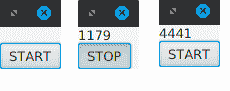

# 第七章：切换、节流、窗口化和缓冲

遇到`Observable`产生排放的速度超过`Observer`能够消费它们的情况并不少见。这种情况尤其在引入并发性，且`Observable`链在不同的调度器上运行不同的操作符时发生。无论是某个操作符努力跟上前面的一个，还是最后的`Observer`努力跟上上游的排放，都可能出现瓶颈，导致排放开始排队在缓慢操作之后。

当然，处理瓶颈的理想方式是利用 Flowable 的背压而不是`Observable`。`Flowable`与`Observable`没有太大区别，除了它通过让`Observer`以自己的节奏请求排放来告诉源减慢速度，正如我们将在*第八章，Flowables 和背压*中了解的那样。但并非所有排放源都可以使用背压。你不能指示`Observable.interval()`（甚至`Flowable.interval()`）减慢速度，因为排放在逻辑上是时间敏感的。要求它减慢速度会使基于时间的排放不准确。用户输入事件，如按钮点击，在逻辑上也不能使用背压，因为你不能通过编程来控制用户。

幸运的是，有一些操作符可以帮助处理快速发射的源，而无需使用背压，并且特别适用于无法使用背压的情况。其中一些操作符将排放批量组合成更易于下游消费的块。其他操作符只是采样排放，忽略其余的。甚至还有一个功能强大的`switchMap()`操作符，它的工作方式类似于`flatMap()`，但只会订阅来自最新排放的`Observable`，并丢弃任何之前的`Observable`。

我们将在本章中涵盖所有这些主题：

+   缓冲

+   窗口化

+   节流

+   切换

我们将以一个练习结束本章，该练习将按键组合起来以发射用户输入的字符串序列。

# 缓冲

`buffer()`操作符将在一定范围内收集排放，并将每个批次作为列表或其他集合类型发射。范围可以通过固定缓冲区大小或一个在间隔处截断的时间窗口来定义，甚至可以通过另一个`Observable`的排放来切片。

# 固定大小缓冲

`buffer()`的最简单重载接受一个`count`参数，该参数将排放批量组合成固定大小。如果我们想将排放组合成包含八个元素的列表，我们可以这样做：

```java
import io.reactivex.Observable;

public class Launcher {    
public static void main(String[] args) {
     Observable.range(1,50)
               .buffer(8)
               .subscribe(System.out::println);
   }
}
```

输出如下：

```java
[1, 2, 3, 4, 5, 6, 7, 8]
[9, 10, 11, 12, 13, 14, 15, 16]
[17, 18, 19, 20, 21, 22, 23, 24]
[25, 26, 27, 28, 29, 30, 31, 32]
[33, 34, 35, 36, 37, 38, 39, 40]
[41, 42, 43, 44, 45, 46, 47, 48]
[49, 50]
```

当然，如果排放的数量不能被干净地除尽，剩余的元素将作为一个最终列表发射，即使它少于指定的数量。这就是为什么前一个代码中的最后一个排放有一个包含两个元素（而不是八个）的列表，只包含`49`和`50`。

你还可以提供一个第二个`bufferSupplier` lambda 参数，将项目放入除了列表之外的另一个集合中，例如`HashSet`，如下所示（这应该产生相同的输出）：

```java
import io.reactivex.Observable;
import java.util.HashSet;
public class Launcher {
    public static void main(String[] args) {
        Observable.range(1,50)
                  .buffer(8, HashSet::new)
                  .subscribe(System.out::println);
    }
}
```

为了使事情更有趣，你也可以提供一个`skip`参数，该参数指定在开始新的缓冲区之前应该跳过多少项。如果`skip`等于`count`，则`skip`没有效果。但如果它们不同，你可以得到一些有趣的行为。例如，你可以缓冲`2`个排放，但在下一个缓冲区开始之前跳过`3`个，如下所示。这将本质上导致每第三个元素不被缓冲：

```java
import io.reactivex.Observable;
public class Launcher {
    public static void main(String[] args) {
        Observable.range(1,10)
                  .buffer(2, 3)
                  .subscribe(System.out::println);
    }
}
```

输出如下：

```java
[1, 2]
[4, 5]
[7, 8]
[10]
```

如果你将`skip`设置为小于`count`，你可以得到一些有趣的滚动缓冲。如果你将项目缓冲到大小为`3`，但`skip`为`1`，你将得到滚动缓冲。例如，在以下代码中，我们发出数字`1`到`10`，但创建缓冲区`[1, 2, 3]`，然后是`[2, 3, 4]`，然后是`[3, 4, 5]`，依此类推：

```java
import io.reactivex.Observable;
public class Launcher {
    public static void main(String[] args) {
        Observable.range(1,10)
                  .buffer(3, 1)
                  .subscribe(System.out::println);
    }
}
```

输出如下：

```java
[1, 2, 3]
[2, 3, 4]
[3, 4, 5]
[4, 5, 6]
[5, 6, 7]
[6, 7, 8]
[7, 8, 9]
[8, 9, 10]
[9, 10]
[10]
```

一定要玩转`buffer()`的`skip`参数，你可能会发现它的令人惊讶的使用案例。例如，我有时使用`buffer(2,1)`来一起发出“上一个”排放和下一个排放，如下所示。我还使用`filter()`来排除最后一个列表，该列表只包含`10`个元素：

```java
import io.reactivex.Observable;
public class Launcher {
    public static void main(String[] args) {
        Observable.range(1,10)
                .buffer(2, 1)
                .filter(c -> c.size() == 2)
                .subscribe(System.out::println);
    }
}
```

输出如下：

```java
[1, 2]
[2, 3]
[3, 4]
[4, 5]
[5, 6]
[6, 7]
[7, 8]
[8, 9]
[9, 10]
```

# 基于时间的缓冲

你可以通过提供一个长`TimeUnit`在固定时间间隔内使用`buffer()`。要将排放缓冲到每秒一次的列表中，你可以运行以下代码。请注意，我们正在使源每`300`毫秒发出一次，由于一秒的间隔截止，每个结果缓冲列表可能包含三个或四个排放：

```java
import io.reactivex.Observable;
import java.util.concurrent.TimeUnit;
public class Launcher {
    public static void main(String[] args) {
        Observable.interval(300, TimeUnit.MILLISECONDS)
                  .map(i -> (i + 1) * 300) // map to elapsed time
                  .buffer(1, TimeUnit.SECONDS)
                  .subscribe(System.out::println);
        sleep(4000);
    }
    public static void sleep(int millis) {
        try {
            Thread.sleep(millis);
        } 
        catch (InterruptedException e) {
            e.printStackTrace();
        }
    }
}
```

输出如下：

```java
[300, 600, 900]
[1200, 1500, 1800]
[2100, 2400, 2700]
[3000, 3300, 3600, 3900]
```

也可以指定一个`timeskip`参数，它是基于时间的`skip`的对应参数。它控制每个缓冲开始的时间。

你还可以利用第三个`count`参数来提供一个最大缓冲区大小。这将导致在每个时间间隔或`count`达到时发出缓冲排放，以先发生者为准。如果在时间窗口关闭之前`count`达到，将导致发出一个空的缓冲区。

在这里，我们每秒缓冲一次排放，但将缓冲区大小限制为`2`：

```java
import io.reactivex.Observable;
import java.util.concurrent.TimeUnit;
public class Launcher {
    public static void main(String[] args) {
        Observable.interval(300, TimeUnit.MILLISECONDS)
                .map(i -> (i + 1) * 300) // map to elapsed time
                .buffer(1, TimeUnit.SECONDS, 2)
                .subscribe(System.out::println);
        sleep(5000);
    }
    public static void sleep(int millis) {
        try {
            Thread.sleep(millis);
        } catch (InterruptedException e) {
            e.printStackTrace();
        }
    }
}
```

输出如下：

```java
[300, 600]
[900]
[1200, 1500]
[1800]
[2100, 2400]
[2700]
[3000, 3300]
[3600, 3900]
[]
[4200, 4500]
[4800]
```

注意，基于时间的`buffer()`操作符将在计算`Scheduler`上操作。这是有意义的，因为需要在定时器上运行一个单独的线程来执行截止时间。

# 基于边界的缓冲

`buffer()`函数最强大的变体是接受另一个`Observable`作为`boundary`参数。这个其他`Observable`发出的类型并不重要。重要的是每次它发出东西时，它都会使用那个排放的时间作为缓冲截止时间。换句话说，另一个`Observable`排放的任意发生将决定何时“切片”每个缓冲区。

例如，我们可以使用这种技术以每 1 秒的间隔缓冲 300 毫秒的发射。我们可以让 `Observable.interval()` 的 1 秒作为我们的 `Observable.interval()` 每 300 毫秒发射的边界：

```java
import io.reactivex.Observable;
import java.util.concurrent.TimeUnit;
public class Launcher {
    public static void main(String[] args) {
        Observable<Long> cutOffs =
                Observable.interval(1, TimeUnit.SECONDS);
        Observable.interval(300, TimeUnit.MILLISECONDS)
            .map(i -> (i + 1) * 300) // map to elapsed time
            .buffer(cutOffs)
            .subscribe(System.out::println);
        sleep(5000);
    }
    public static void sleep(int millis) {
        try {
            Thread.sleep(millis);
        } catch (InterruptedException e) {
            e.printStackTrace();
        }
    }
}
```

输出如下：

```java
[300, 600, 900]
[1200, 1500, 1800]
[2100, 2400, 2700]
[3000, 3300, 3600, 3900]
[4200, 4500, 4800]
```

这可能是基于高度可变事件缓冲项的最灵活方式。虽然前一个例子中每个切割的时间是一致的（每 1 秒），但 `boundary` 可以是任何表示任何时间发生的任何事件的 `Observable`。这种 `Observable` 作为另一个 `Observable` 截断的想法是我们将在本章中看到的一个强大的模式。

# 窗口

`window()` 操作符几乎与 `buffer()` 相同，区别在于它们将缓冲操作应用于其他 Observables 而不是集合。这导致了一个 `Observable<Observable<T>>`，它发射 Observables。每个 `Observable` 的发射都会为每个作用域缓存发射，然后在订阅后一次性清除（类似于我们在 *第四章，组合 Observables*）中使用的 `GroupedObservable`）。这允许在可用时立即处理发射，而不是等待每个列表或集合最终确定并发射。如果你想要使用操作符转换每个批次，`window()` 操作符也非常方便。

就像 `buffer()` 一样，你可以使用固定大小、时间间隔或来自另一个 `Observable` 的边界来截断每个批次。

# 固定大小窗口

让我们修改之前的例子，其中我们将 50 个整数缓冲到大小为 8 的列表中，但我们将使用 `window()` 来将它们作为 Observables 缓冲。我们可以反应性地将每个批次转换成除了集合之外的其他东西，例如使用管道 "`|`" 分隔符将发射连接成字符串：

```java
import io.reactivex.Observable;
public class Launcher {
    public static void main(String[] args) {
        Observable.range(1,50)
                  .window(8)
                  .flatMapSingle(obs -> obs.reduce("", (total, next) -> total
                        + (total.equals("") ? "" : "|") + next))
                  .subscribe(System.out::println);
    }
}
```

输出如下：

```java
1|2|3|4|5|6|7|8
9|10|11|12|13|14|15|16
17|18|19|20|21|22|23|24
25|26|27|28|29|30|31|32
33|34|35|36|37|38|39|40
41|42|43|44|45|46|47|48
49|50
```

就像 `buffer()` 一样，你也可以提供一个 `skip` 参数。这是在开始新窗口之前需要跳过的发射数量。这里，我们的窗口大小是 2，但我们跳过了三个项目。然后我们取每个窗口 Observables 并将其减少到字符串连接：

```java
import io.reactivex.Observable;
public class Launcher {
    public static void main(String[] args) {
        Observable.range(1,50)
                  .window(2, 3)
                  .flatMapSingle(obs -> obs.reduce("", (total, next) -> total
                        + (total.equals("") ? "" : "|") + next))
                  .subscribe(System.out::println);
    }
}
```

输出如下：

```java
1|2
4|5
7|8
10|11
13|14
16|17
19|20
22|23
25|26
28|29
31|32
34|35
37|38
40|41
43|44
46|47
49|50
```

# 基于时间的窗口

如你可能猜到的，你可以像 `buffer()` 一样在时间间隔内截断窗口 Observables。这里，我们有一个每 300 毫秒发射一次的 `Observable`，我们每 1 秒将其切割成单独的 Observables。然后我们将对每个 `Observable` 使用 `flatMapSingle()` 来进行发射的字符串连接：

```java
import io.reactivex.Observable;
import java.util.concurrent.TimeUnit;
public class Launcher {
    public static void main(String[] args) {
        Observable.interval(300, TimeUnit.MILLISECONDS)
                  .map(i -> (i + 1) * 300) // map to elapsed time
                  .window(1, TimeUnit.SECONDS)   
                  .flatMapSingle(obs -> obs.reduce("", (total, next) -> total
                        + (total.equals("") ? "" : "|") + next))
                  .subscribe(System.out::println);
        sleep(5000);
    }
    public static void sleep(int millis) {
        try {
            Thread.sleep(millis);
        } catch (InterruptedException e) {
            e.printStackTrace();
       }
    }
}
```

输出如下：

```java
300|600|900
1200|1500|1800
2100|2400|2700
3000|3300|3600|3900
4200|4500|4800
```

当然，你可以使用这些生成的 Observables 进行除了字符串连接之外的转换。你可以使用我们到目前为止学到的所有操作符对每个窗口 Observables 执行不同的操作，你很可能会在 `flatMap()`、`concatMap()` 或 `switchMap()` 中完成这项工作。

使用基于时间的`window()`运算符，您也可以指定`count`或`timeshift`参数，就像它的`buffer()`对应物一样。

# 基于边界的窗口化

可能不会令人惊讶，因为`window()`与`buffer()`类似（除了它发射 Observables 而不是连接），您也可以使用另一个`Observable`作为`boundary`。

在这里，我们使用每秒发射一次的`Observable.interval()`作为每 300 毫秒发射一次的`Observable`的`boundary`。我们利用每个发射的`Observable`将发射项连接成连接字符串：

```java
import io.reactivex.Observable;
import java.util.concurrent.TimeUnit;
public class Launcher {
    public static void main(String[] args) {
        Observable<Long> cutOffs =
                Observable.interval(1, TimeUnit.SECONDS);
        Observable.interval(300, TimeUnit.MILLISECONDS)
            .map(i -> (i + 1) * 300) // map to elapsed time
            .window(cutOffs)
            .flatMapSingle(obs -> obs.reduce("", (total, next) -> total
                + (total.equals("") ? "" : "|") + next))
            .subscribe(System.out::println);
        sleep(5000);
    }
    public static void sleep(int millis) {
        try {
            Thread.sleep(millis);
        } catch (InterruptedException e) {
            e.printStackTrace();
        }
    }
}
```

输出如下：

```java
300|600|900
1200|1500|1800
2100|2400|2700
3000|3300|3600|3900
4200|4500|4800
```

再次强调，使用另一个`Observable`作为`boundary`的好处是，它允许您使用任何`Observable`的任意发射时间来切断每个窗口，无论是按钮点击、网络请求还是任何其他事件。这使得它在涉及可变性时成为切片`window()`或`buffer()`操作的最灵活方式。

# 节流

`buffer()`和`window()`运算符根据定义的范围将发射项批量收集到集合或 Observables 中，它们会定期合并而不是省略发射项。然而，`throttle()`运算符在发射项快速发生时省略发射项。这在快速发射被认为是冗余或不需要时很有用，例如用户反复点击按钮。对于这些情况，您可以使用`throttleLast()`、`throttleFirst()`和`throttleWithTimeout()`运算符，只让快速发射序列中的第一个或最后一个元素通过。您选择众多快速发射中的哪一个取决于您选择的运算符、参数和参数。

对于本节中的示例，我们将处理以下情况：我们有三个`Observable.interval()`源，第一个每 100 毫秒发射一次，第二个每 300 毫秒发射一次，第三个每 2000 毫秒发射一次。我们从第一个源中只取 10 个发射项，从第二个源中取 3 个，从第三个源中取 2 个。正如您所看到的，我们将使用`Observable.concat()`将它们一起使用，以创建一个在不同间隔下改变节奏的快速序列：

```java
import io.reactivex.Observable;
import java.util.concurrent.TimeUnit;
public class Launcher {
    public static void main(String[] args) {
        Observable<String> source1 = Observable.interval(100, TimeUnit.MILLISECONDS)
                .map(i -> (i + 1) * 100) // map to elapsed time
                .map(i -> "SOURCE 1: " + i)
                .take(10);
        Observable<String> source2 = Observable.interval(300, TimeUnit.MILLISECONDS)
                .map(i -> (i + 1) * 300) // map to elapsed time
                .map(i -> "SOURCE 2: " + i)
                .take(3);
        Observable<String> source3 = Observable.interval(2000, TimeUnit.MILLISECONDS)
                .map(i -> (i + 1) * 2000) // map to elapsed time
                .map(i -> "SOURCE 3: " + i)
                .take(2);
        Observable.concat(source1, source2, source3)
                .subscribe(System.out::println);
        sleep(6000);
    }
    public static void sleep(int millis) {
        try {
            Thread.sleep(millis);
        } catch (InterruptedException e) {
            e.printStackTrace();
        }
    }
}
```

输出如下：

```java
SOURCE 1: 100
SOURCE 1: 200
SOURCE 1: 300
SOURCE 1: 400
SOURCE 1: 500
SOURCE 1: 600
SOURCE 1: 700
SOURCE 1: 800
SOURCE 1: 900
SOURCE 1: 1000
SOURCE 2: 300
SOURCE 2: 600
SOURCE 2: 900
SOURCE 3: 2000
SOURCE 3: 4000
```

第一个源在 1 秒内快速推送 10 个发射项，第二个在 1 秒内推送 3 个，第三个在 4 秒内推送 2 个。让我们使用一些`throttle()`运算符来只选择其中的一些发射项，忽略其余的。

# throttleLast() / sample()

`throttleLast()`运算符（别名`sample()`）将仅在固定时间间隔内发出最后一个项目。修改您之前的示例，以每秒 1 次的时间间隔使用`throttleLast()`，如下所示：

```java
Observable.concat(source1, source2, source3)
         .throttleLast(1, TimeUnit.SECONDS)
         .subscribe(System.out::println);
```

输出如下：

```java
SOURCE 1: 900
SOURCE 2: 900
SOURCE 3: 2000
```

如果您研究输出，您可以看到，每个 1 秒间隔的最后一个发射项是唯一通过的那个。这实际上通过定时器深入流中并拉出最新的一个来有效地采样发射项。

如果你想在较长的时间间隔内更自由地节流，你会得到更少的发射，因为这实际上减少了采样频率。这里，我们每两秒使用一次 `throttleLast()`：

```java
Observable.concat(source1, source2, source3)
         .throttleLast(2, TimeUnit.SECONDS)
         .subscribe(System.out::println);
```

输出如下：

```java
SOURCE 2: 900
SOURCE 3: 2000
```

如果你想在较短的时间间隔内更积极地节流，你会得到更多的发射，因为这样可以增加采样频率。这里，我们每 500 毫秒使用一次 `throttleLast()`：

```java
Observable.concat(source1, source2, source3)
          .throttleLast(500, TimeUnit.MILLISECONDS)
          .subscribe(System.out::println);
```

输出如下：

```java
SOURCE 1: 400
SOURCE 1: 900
SOURCE 2: 300
SOURCE 2: 900
SOURCE 3: 2000
```

再次，`throttleLast()` 将在每个固定的时间间隔推进最后一个发射。接下来，我们将介绍 `throttleFirst()`，它将发出第一个项目。

# throttleFirst()

`throttleFirst()` 几乎与 `throttleLast()` 操作相同，但它会在每个固定的时间间隔发出发生的第一个项目。如果我们修改我们的例子为每 1 秒使用一次 `throttleFirst()`，我们应该得到如下输出：

```java
Observable.concat(source1, source2, source3)
         .throttleFirst(1, TimeUnit.SECONDS)
         .subscribe(System.out::println);
```

输出如下：

```java
SOURCE 1: 100
SOURCE 2: 300
SOURCE 3: 2000
SOURCE 3: 4000
```

实际上，每个间隔开始后找到的第一个发射就是被推过的发射。`source1` 的 100 是在第一个间隔中找到的第一个发射。在下一个间隔中，`source2` 发出了 300，然后是 2000，接着是 4000。4000 正好在应用退出之前发出，因此我们得到了 `throttleFirst()` 的四个发射，而不是 `throttleLast()` 的三个。

除了在每个间隔发出第一个项目而不是最后一个项目之外，`throttleLast()` 的所有行为也适用于 `throttleFirst()`。指定较短的间隔会产生更多的发射，而较长的间隔会产生较少的发射。

`throttleFirst()` 和 `throttleLast()` 都会在计算 `Scheduler` 上发出，但你也可以将你自己的 `Scheduler` 作为第三个参数指定。

# throttleWithTimeout() / debounce()

如果你玩 `throttleFirst()` 和 `throttleLast()`，你可能会对它们行为的一个方面感到不满意。它们对发射频率的变化是盲目的，并且它们只是简单地“插入”在固定的时间间隔，并拉取它们找到的第一个或最后一个发射。没有等待“沉默期”的概念，其中发射暂时停止，这可能是一个推进最后发生发射的好时机。

想象一下好莱坞动作电影，其中主角在遭受猛烈的枪战中。当子弹横飞时，他/她必须躲避并无法行动。但是，当他们的攻击者停下来装弹时，会有一个沉默期，他们有时间做出反应。这正是 `throttleWithTimeout()` 所做的。当发射快速发生时，它不会发出任何东西，直到有一个“沉默期”，然后它会推进最后的发射。

`throttleWithTimout()`（也称为 `debounce()`）接受时间间隔参数，指定在最后一次发射可以推进之前必须有一段多长时间的不活跃期（这意味着没有发射来自源）。在我们的早期示例中，我们的三个连接的 `Observable.interval()` 源以每 100 毫秒的速度快速发射，然后是大约 2 秒的 300 毫秒爆发。但之后，间隔减慢到每 2 秒一次。如果我们只想在 1 秒的静默期后发射，我们不会发射任何东西，直到我们达到第三个 `Observable.interval()`，它每 2 秒发射一次，如下所示：

```java
import io.reactivex.Observable;
import java.util.concurrent.TimeUnit;
public class Launcher {
    public static void main(String[] args) {
        Observable<String> source1 = Observable.interval(100, TimeUnit.MILLISECONDS)
                .map(i -> (i + 1) * 100) // map to elapsed time
                .map(i -> "SOURCE 1: " + i)
                .take(10);
        Observable<String> source2 = Observable.interval(300, TimeUnit.MILLISECONDS)
                .map(i -> (i + 1) * 300) // map to elapsed time
                .map(i -> "SOURCE 2: " + i)
                .take(3);
        Observable<String> source3 = Observable.interval(2000, TimeUnit.MILLISECONDS)
                .map(i -> (i + 1) * 2000) // map to elapsed time
                .map(i -> "SOURCE 3: " + i)
                .take(2);
        Observable.concat(source1, source2, source3)
                .throttleWithTimeout(1, TimeUnit.SECONDS)
                .subscribe(System.out::println);
        sleep(6000);
    }
    public static void sleep(int millis) {
        try {
            Thread.sleep(millis);
        } catch (InterruptedException e) {
            e.printStackTrace();
        }
    }
}
```

输出结果如下：

```java
SOURCE 2: 900
SOURCE 3: 2000
SOURCE 3: 4000
```

当 `source3` 开始时，`source2` 的 900 次发射就是最后一次发射，因为 `source3` 将不会在 2 秒内推送其第一次发射，这为 900 次发射提供了超过所需的 1 秒静默期。然后，2000 次发射紧接着发生，1 秒后没有进一步的发射发生，因此它被 `throttleWithTimeout()` 推进。另一秒后，4000 次发射被推送，2 秒的静默期（在程序退出之前）也允许它发射。

`throttleWithTimeout()` 方法是一种处理过多输入（例如用户快速点击按钮）和其他噪声、冗余事件的有效方式，这些事件会偶尔加速、减速或停止。`throttleWithTimeout()` 的唯一缺点是它将延迟每个获胜的发射。如果一个发射成功通过了 `throttleWithTimeout()`，它将被延迟指定的时间间隔，以确保没有更多的发射。特别是对于用户体验来说，这种人为的延迟可能不受欢迎。对于这些对延迟敏感的情况，一个更好的选择可能是利用 `switchMap()`，我们将在下一节中介绍。

# 切换

在 RxJava 中，有一个功能强大的操作符称为 `switchMap()`。它的使用感觉像 `flatMap()`，但它有一个重要的行为差异：它将从最新的发射中派生的最新 `Observable` 发射，并丢弃任何之前正在处理的 `Observable`。换句话说，它允许你取消一个正在发射的 `Observable` 并切换到新的一个，防止过时或冗余的处理。

假设我们有一个发射九个字符串的过程，并且它将每个字符串发射的延迟随机设置为 0 到 2000 毫秒。这是为了模拟对每个字符串进行的密集计算，如下所示：

```java
import io.reactivex.Observable;
import java.util.concurrent.ThreadLocalRandom;
import java.util.concurrent.TimeUnit;
public class Launcher {
    public static void main(String[] args) {
       Observable<String> items = Observable.just("Alpha", "Beta", "Gamma", "Delta", "Epsilon",
                        "Zeta", "Eta", "Theta", "Iota");
       //delay each String to emulate an intense calculation
        Observable<String> processStrings = items.concatMap(s ->
                Observable.just(s)
                        .delay(randomSleepTime(), TimeUnit.MILLISECONDS)
        );
        processStrings.subscribe(System.out::println);
        //keep application alive for 20 seconds
        sleep(20000);
    }
    public static int randomSleepTime() {
        //returns random sleep time between 0 to 2000 milliseconds
        return ThreadLocalRandom.current().nextInt(2000);
    }
    public static void sleep(int millis) {
        try {
            Thread.sleep(millis);
        } catch (InterruptedException e) {
            e.printStackTrace();
        }
    }
}
```

输出结果如下：

```java
Alpha
Beta
Gamma
Delta
Epsilon
Zeta
Eta
Theta
Iota
```

如你所见，每次发射需要 0-2 秒的时间来发射，处理所有字符串可能需要长达 20 秒。

假设我们想要每 5 秒运行这个过程，但我们想取消（或更技术性地，`dispose()`）之前的过程实例，并且只运行最新的一个。使用`switchMap()`可以轻松做到这一点。在这里，我们创建另一个`Observable.interval()`，每 5 秒发射一次，然后我们使用`switchMap()`将其映射到我们想要处理`Observable`（在这种情况下是`processStrings`）。每 5 秒，进入`switchMap()`的发射将立即销毁当前正在处理的`Observable`（如果有），然后从它映射的新`Observable`中发射。为了证明`dispose()`被调用，我们将在`switchMap()`内部的`Observable`上放置`doOnDispose()`来显示一条消息：

```java
import io.reactivex.Observable;
import java.util.concurrent.ThreadLocalRandom;
import java.util.concurrent.TimeUnit;
public class Launcher {
    public static void main(String[] args) {
        Observable<String> items = Observable.just("Alpha", "Beta", "Gamma", "Delta", "Epsilon",
                "Zeta", "Eta", "Theta", "Iota");
        //delay each String to emulate an intense calculation
        Observable<String> processStrings = items.concatMap(s ->
                Observable.just(s)
                        .delay(randomSleepTime(), TimeUnit.MILLISECONDS)
        );
        //run processStrings every 5 seconds, and kill each previous instance to start next
        Observable.interval(5, TimeUnit.SECONDS)
                .switchMap(i ->
                        processStrings
                                .doOnDispose(() -> System.out.println("Disposing! Starting next"))
                ).subscribe(System.out::println);
        //keep application alive for 20 seconds
        sleep(20000);
    }
    public static int randomSleepTime() {
        //returns random sleep time between 0 to 2000 milliseconds
        return ThreadLocalRandom.current().nextInt(2000);
    }
    public static void sleep(int millis) {
        try {
            Thread.sleep(millis);
        } catch (InterruptedException e) {
            e.printStackTrace();
        }
    }
}
```

输出如下（你的输出将不同）：

```java
Alpha
Beta
Gamma
Delta
Epsilon
Zeta
Eta
Disposing! Starting next
Alpha
Beta
Gamma
Delta
Disposing! Starting next
Alpha
Beta
Gamma
Delta
Disposing! Starting next
```

再次强调，`switchMap()`就像`flatMap()`一样，但它将取消任何之前正在处理的 Observables，并且只追踪最新的一个。这在许多情况下都有助于防止冗余或过时的工作，并且在用户界面中，快速的用户输入产生过时请求时尤其有效。你可以用它来取消数据库查询、网络请求和其他昂贵的任务，并用新任务替换它们。

为了使`switchMap()`有效，将发射推入`switchMap()`的线程不能被`switchMap()`内部的工作占用。这意味着你可能需要在`switchMap()`内部使用`observeOn()`或`subscribeOn()`在不同的线程上执行工作。如果`switchMap()`内部的操作难以停止（例如，使用 RxJava-JDBC 的数据库查询），你可能还想使用`unsubscribeOn()`，以防止触发线程在销毁时被占用。

你可以在`switchMap()`（不立即提供新工作）内取消工作的一个小技巧是条件性地返回`Observable.empty()`。这有助于取消长时间运行或无限过程。例如，如果你将 RxJavaFX ([`github.com/ReactiveX/RxJavaFX`](https://github.com/ReactiveX/RxJavaFX))作为依赖项引入，我们可以快速创建一个使用`switchMap()`的计时器应用程序，如下面的代码片段所示：

```java
import io.reactivex.Observable;
import io.reactivex.rxjavafx.observables.JavaFxObservable;
import io.reactivex.rxjavafx.schedulers.JavaFxScheduler;
import javafx.application.Application;
import javafx.scene.Scene;
import javafx.scene.control.Label;
import javafx.scene.control.ToggleButton;
import javafx.scene.layout.VBox;
import javafx.stage.Stage;
import java.util.concurrent.TimeUnit;
public final class JavaFxApp extends Application {
    @Override
    public void start(Stage stage) throws Exception {
        VBox root = new VBox();
        Label counterLabel = new Label("");
        ToggleButton startStopButton = new ToggleButton();
     // Multicast the ToggleButton's true/false selected state
        Observable<Boolean> selectedStates =
JavaFxObservable.valuesOf(startStopButton.selectedProperty())
                        .publish()
                        .autoConnect(2);
     // Using switchMap() with ToggleButton's selected state will drive
     // whether to kick off an Observable.interval(),
     // or dispose() it by switching to empty Observable
        selectedStates.switchMap(selected -> {
                    if (selected)
                        return Observable.interval(1, TimeUnit.MILLISECONDS);
                    else
                        return Observable.empty();
                }).observeOn(JavaFxScheduler.platform()) // Observe on JavaFX UI thread
                .map(Object::toString)
                .subscribe(counterLabel::setText);
        // Change ToggleButton's text depending on its state
        selectedStates.subscribe(selected ->
                startStopButton.setText(selected ? "STOP" : "START")
        );
        root.getChildren().addAll(counterLabel, startStopButton);
        stage.setScene(new Scene(root));
        stage.show();
    }
}
```

前面的代码生成了一个使用`switchMap()`的计时器应用程序，如下面图 7.1 所示：



图 7.1 - 使用 switchMap()的计时器应用程序

按压`ToggleButton`将开始和停止计时器，它以毫秒为单位显示。注意，`ToggleButton`将通过一个名为`selectedStates`的`Observable`发出布尔值`True`/`False`。我们通过`share()`进行多播以防止 JavaFX 上的重复监听器，并且我们有两个观察者。第一个将使用`switchMap()`对每个布尔值进行操作，其中`true`将每毫秒从`Observable.interval()`发出，而`false`将通过替换为`Observable.empty()`来取消它。由于`Observable.interval()`将在`Scheduler`计算上发出，我们将使用`observeOn()`将其放回由 RxJavaFX 提供的 JavaFX `Scheduler`上。另一个观察者将根据其状态将`ToggleButton`的文本更改为 STOP 或 START。

# 组合按键

我们将通过整合我们所学的大部分内容来结束本章，完成一个复杂任务：将快速连续发生的按键组合成字符串，而没有任何延迟！这在用户界面中可以立即根据输入的内容“跳转”到列表中的项目，或者以某种方式执行自动完成。这可能是一个具有挑战性的任务，但正如我们将看到的，使用 RxJava 并不那么困难。

这个练习将再次使用 JavaFX 和 RxJavaFX。我们的用户界面将简单地有一个`Label`，它接收我们输入的按键的滚动连接。但 300 毫秒后，它将重置并接收一个空的`""`来清除它。以下是实现此功能的代码，以及一些当我在输入"`Hello`"后稍后输入"`World`"时的控制台输出截图：

```java
import io.reactivex.Observable;
import io.reactivex.rxjavafx.observables.JavaFxObservable;
import io.reactivex.rxjavafx.schedulers.JavaFxScheduler;
import javafx.application.Application;
import javafx.scene.Scene;
import javafx.scene.control.Label;
import javafx.scene.input.KeyEvent;
import javafx.scene.layout.VBox;
import javafx.stage.Stage;
import java.util.concurrent.TimeUnit;
public final class JavaFxApp extends Application {
    @Override
    public void start(Stage stage) throws Exception {
        VBox root = new VBox();
        root.setMinSize(200, 100);
        Label typedTextLabel = new Label("");
        root.getChildren().addAll(typedTextLabel);
        Scene scene = new Scene(root);
        // Multicast typed keys
        Observable<String> typedLetters =
                JavaFxObservable.eventsOf(scene, KeyEvent.KEY_TYPED)
                    .map(KeyEvent::getCharacter)
                    .share();
        // Signal 300 milliseconds of inactivity
        Observable<String> restSignal =
                typedLetters
                        .throttleWithTimeout(500, TimeUnit.MILLISECONDS)
                        .startWith(""); //trigger initial
        // switchMap() each period of inactivity to
        // an infinite scan() concatenating typed letters
        restSignal.switchMap(s ->
                typedLetters.scan("", (rolling, next) -> rolling + next)
        ).observeOn(JavaFxScheduler.platform())
         .subscribe(s -> {
            typedTextLabel.setText(s);
            System.out.println(s);
         });
        stage.setScene(scene);
        stage.show();
    }
}
```

输出如下：

```java
H
He
Hel
Hell
Hello
W
Wo
Wor
Worl
World
```

这是渲染的 UI：


当你输入按键时，`Label`将在 UI 和控制台上实时显示按键字符的滚动连接字符串。注意，在 500 毫秒的无活动后，它将重置并发出一个新的`scan()`操作，并丢弃旧的，从空字符串`""`开始。这可以在用户输入时立即发送搜索请求或自动完成建议，非常有帮助。

它的工作方式是我们有一个`Observable`发出键盘上按下的字符，但它通过`share()`进行多播，用于两个目的。首先，它用于创建另一个`Observable`，在 500 毫秒的无活动后发出最后输入的字符。但我们更关心的是发射的时机，它表示 500 毫秒的无活动已经发生。然后我们使用`switchMap()`将其映射到再次发出字符的`Observable`上，并无限地连续连接每个输入的字符，并发出每个结果字符串。然而，这个`switchMap()`中的`scan()`操作将在 500 毫秒的无活动发生时被丢弃，并使用一个新的`scan()`实例重新开始。

如果你觉得这个例子令人头晕，请慢慢来，继续学习。最终你会恍然大悟，一旦你做到了，你就真正掌握了本章中的思想！

# 摘要

在本章中，你学习了如何利用缓冲、窗口、节流和切换来应对快速发射的 Observables。理想情况下，当我们看到 Observables 的发射速度超过了 Observers 的处理能力时，我们应该利用 Flowables 和背压。我们将在下一章中学习这一点。但对于无法使用背压的情况，例如用户输入或定时器事件，你可以利用这三种操作类别来限制向下传递的发射数量。

在下一章中，我们将学习如何使用 Flowables 进行背压，这提供了更主动的方式来应对快速发射压倒 Observers 的常见情况。
