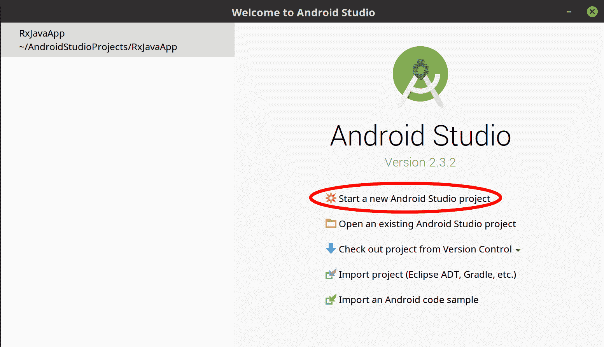
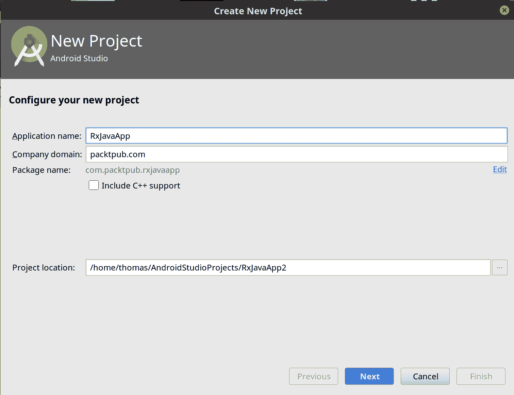
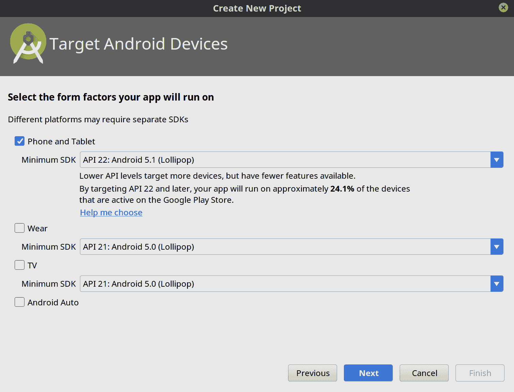
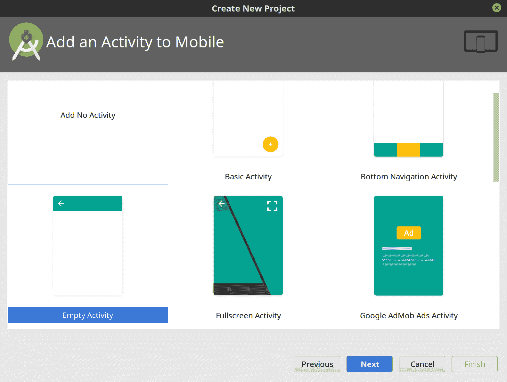
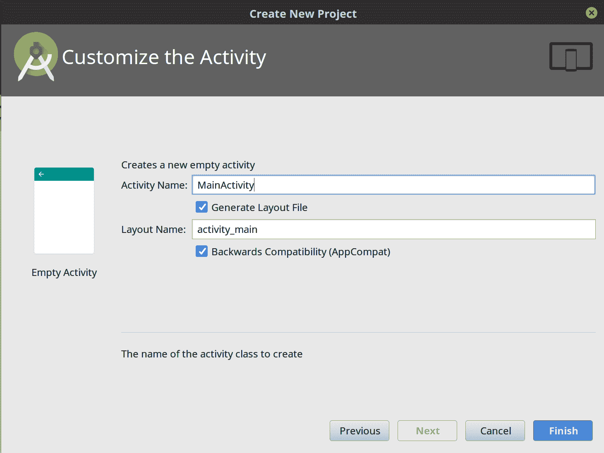
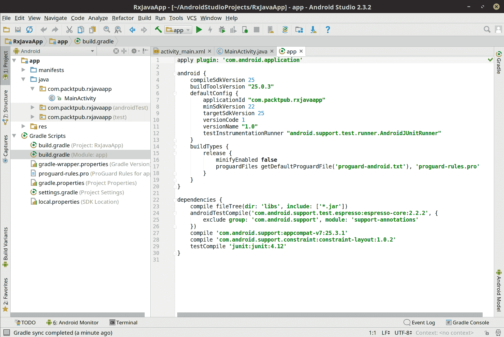
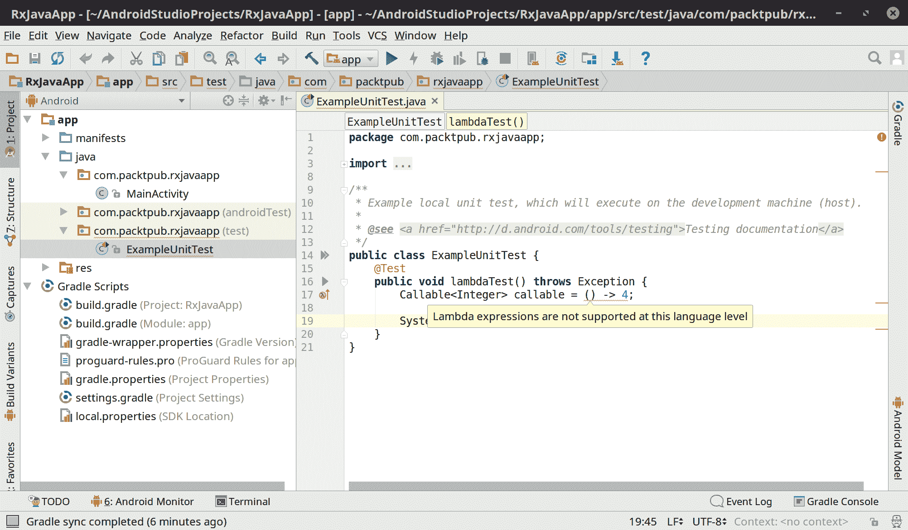
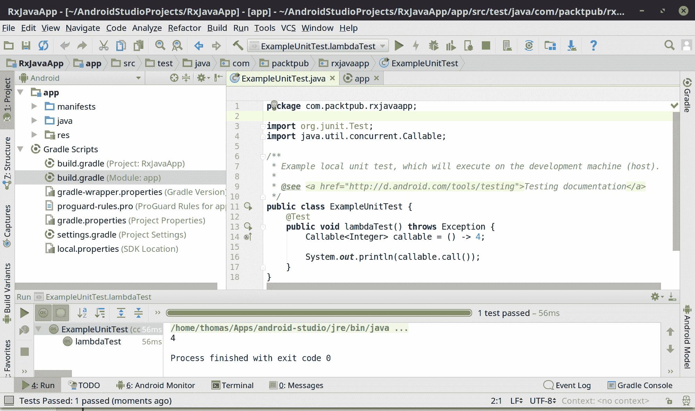
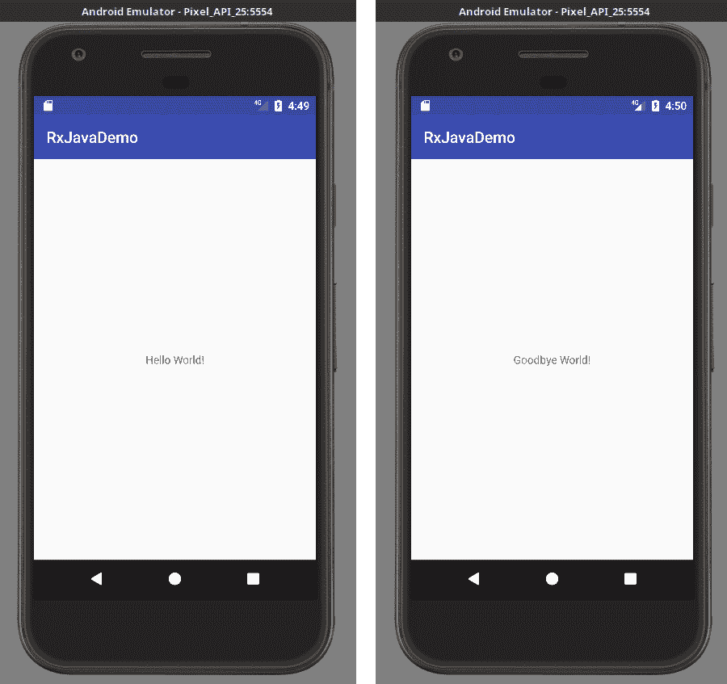
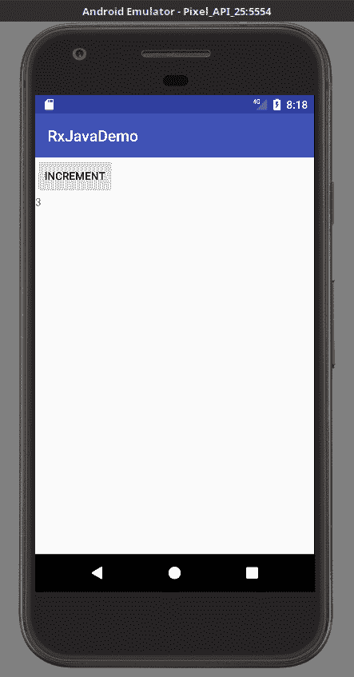

# 第十一章：Android 上的 RxJava

如果有一个领域被反应式编程所席卷，那无疑是移动应用。正如本书中讨论的那样，ReactiveX 在许多领域都非常有用。但是，移动应用正变得越来越复杂，用户对无响应、缓慢或存在错误的应用的容忍度很低。因此，移动应用迅速成为 ReactiveX 的早期采用者，以解决这些问题。RxJava 在 Android 上站稳脚跟后，RxSwift 迅速在 iOS 上流行起来。还有 RxAndroid 和 RxBinding 库，可以将 RxJava 与 Android 环境轻松集成，我们将在本章中介绍。

Android 开发者长期以来一直面临的一个痛点是困于 Java 6。这意味着许多广泛使用的 Android 版本（如 KitKat、Lollipop 和 Marshmallow）不支持 Java 8 lambdas（尽管在 Android Nougat 中有所改变，它最终使用了 OpenJDK 8）。乍一看，这意味着你只能使用满是样板代码的匿名类来表达你的 RxJava 操作符（有关示例，请参阅附录 A）。然而，通过使用 Retrolambda，你实际上可以在使用 lambda 的同时使用更早版本的 Android，我们将在本章中介绍这一点。你还有另一个选择，那就是使用 Kotlin 语言，它已经成为 Android 开发的越来越受欢迎的平台。Kotlin 是一种可能比 Java 更现代、更具有表现力的语言，并且可以编译成 Java 6 字节码。我们将在下一章中介绍 Kotlin 与 RxJava 的结合使用。

如果你没有兴趣进行 Android 开发，请随意跳过本章。但本书的其余部分读者很可能是 Android 开发者，因此假设你已经进行了一些 Android 开发。

如果你几乎没有 Android 经验，但想学习，一本很好的入门书籍是 Bill Phillips、Chris Stewart 和 Kristin Marsicano 所著的 *Android 编程：大牛牧场指南* ([`www.bignerdranch.com/books/android-programming/`](https://www.bignerdranch.com/books/android-programming/))。这是一本很好的书籍，可以帮助你快速精通 Android 开发。

本章将涵盖以下主题：

+   创建 Android 项目

+   为 Android 配置 RxJava

+   使用 RxJava 和 RxAndroid

+   使用 RxBinding

+   其他 Android Rx 库

# 创建 Android 项目

我们将在本章的示例中使用 Android Studio，以 Android 5.1 Lollipop 作为我们的平台目标。启动 Android Studio 并创建一个新项目，如图所示：

**图 11.1**：创建新的 Android 项目

在下一屏幕（如图所示），将你的项目命名为 `RxJavaApp`，公司域为 `packtpub.com` 或你喜欢的任何名称。然后，点击“下一步”：

**图 11.2**

我们将针对手机和平板。由于我们可能希望我们的应用与运行早期版本 Android 的设备兼容，让我们选择 Android 5.1（Lollipop）作为我们的最小 SDK。这将也给我们一个练习使用 Retrolambda 的机会。之后，点击下一步：

**图 11.3**

在下一个屏幕上，选择 Empty Activity 作为你的模板，如图所示。然后，点击下一步。正如你可能知道的，一个 activity 是一个包含控件的交互式屏幕。在本章的示例中，我们将使用一个 activity：

**图 11.4**

最后，我们来到配置 Activity 的最后一步。请随意将 Activity 名称留为`MainActivity`，其对应的布局名称为`activity_main`。我们稍后会填充这个 Activity。然后，点击完成：

**图 11.5**

你现在应该很快就会看到一个包含整个 Android 项目的屏幕，并且它应该已经配置了 Gradle。打开`build.gradle (Module: app)`，这样我们就可以配置所需的依赖项，如下面的图所示：

**图 11.6**

你需要对针对 app 模块的`build.gradle`脚本进行一些修改，这样我们就可以使用 RxJava 和 Retrolambda。

# 配置 Retrolambda

首先，让我们设置 Retrolambda。我们还将利用一个快速单元测试来查看它是否正确工作。打开由项目模板创建的`ExampleUnitTest.java`文件。删除其中的示例单元测试方法，并声明一个新的方法名为`lambdaTest()`。在其内部，尝试使用 lambda 声明一个`Callable<Integer>`，如图所示。注意，它抛出了一个编译器错误，因为我们没有使用 Java 8 来支持 lambda。

**图 11.7** - 此 Android 和 Java 版本不支持 lambda

如果我们针对的是 Android Lollipop，就不能使用 Java 8，因此我们需要 Retrolambda 来帮助我们避免创建满是样板代码的匿名内部类。它将在字节码级别将我们的 lambda 编译成匿名类，因此它支持 Java 6。

为了设置 Retrolambda，我们将使用 gradle-retrolambda 插件，使配置过程尽可能无缝。回到你的`build.gradle (Module: app)`脚本，并按照以下方式修改它：

```java
buildscript {
     repositories {
         mavenCentral()
     }

     dependencies {
         classpath 'me.tatarka:gradle-retrolambda:3.6.1'
     }
 }

 apply plugin: 'com.android.application'
 apply plugin: 'me.tatarka.retrolambda'

 android {
     compileSdkVersion 25
     buildToolsVersion "25.0.2"
     defaultConfig {
         applicationId "com.packtpub.rxjavademo"
         minSdkVersion 22
         targetSdkVersion 25
         versionCode 1
         versionName "1.0"
         testInstrumentationRunner "android.support.test.runner.AndroidJUnitRunner"
     }
     buildTypes {
         release {
             minifyEnabled false
             proguardFiles getDefaultProguardFile('proguard-android.txt'), 'proguard-rules.pro'
         }
     }
     compileOptions {
         sourceCompatibility JavaVersion.VERSION_1_8
         targetCompatibility JavaVersion.VERSION_1_8
     }
 }

 dependencies {
     compile fileTree(dir: 'libs', include: ['*.jar'])
     androidTestCompile('com.android.support.test.espresso:espresso-core:2.2.2', {
         exclude group: 'com.android.support', module: 'support-annotations'
     })
     compile 'com.android.support:appcompat-v7:25.3.1'
     compile 'com.android.support.constraint:constraint-layout:1.0.2'
     testCompile 'junit:junit:4.12'
 }
```

保存脚本后，点击“立即同步”提示以重新构建项目。在前面代码中的重大变化是，我们添加了一个`buildscript `{ }`块，它从`mavenCentral()`引入了 Retrolambda 3.6.1 作为依赖项。然后，我们可以应用 retrolambda 插件。最后，我们在 android `{ }`块内部添加一个`compileOptions `{ }`块，并将源和目标设置为与 Java 8 兼容。

现在运行包含我们 lambda 的单元测试。得分！如图所示，一切编译和运行都成功，我们现在可以在 Java 6 上运行 lambda 了！让我们看看：



图 11.8 - 现在我们可以使用 Retrolambda 在 Android Lollipop 上使用 Java 6 的 lambda

**Retrolambda** 是一个针对使用 Java 6 受限的 Android 开发者而言的绝佳工具。它巧妙地将 lambda 编译为传统的匿名类，使用 RxJava 时，你可以节省一些糟糕的样板工作。

要了解更多关于 Retrolambda 以及你可以进行的额外调整和配置，请查看其 GitHub 页面[`github.com/evant/gradle-retrolambda`](https://github.com/evant/gradle-retrolambda)。在撰写本文时，Android Studio 中也有即将推出的 lambda 工具([`developer.android.com/studio/preview/features/java8-support.html`](https://developer.android.com/studio/preview/features/java8-support.html))。这些功能可能作为 Retrolambda 的替代品。

# 配置 RxJava 和相关库

现在艰难的部分已经结束，你已经设置了 Retrolambda，剩下的配置就是引入 RxJava 和 RxAndroid。需要添加到你的堆栈中的另一组库是 Jake Wharton 的 RxBinding ([`github.com/JakeWharton/RxBinding`](https://github.com/JakeWharton/RxBinding))，它简化了 RxJava 在 Android UI 控件中的使用。

将这三个库添加到你的模块（不是 buildscript 块内的模块）的依赖项 `{ }` 块中：

```java
 compile 'io.reactivex.rxjava2:rxjava:2.1.0'
 compile 'io.reactivex.rxjava2:rxandroid:2.0.1'
 compile 'com.jakewharton.rxbinding2:rxbinding:2.0.0'
```

因此，现在应该是你的完整 `build.gradle (Module: app)` 内容：

```java
buildscript {
     repositories {
         mavenCentral()
     }

     dependencies {
         classpath 'me.tatarka:gradle-retrolambda:3.6.1'
     }
 }

 apply plugin: 'com.android.application'
 apply plugin: 'me.tatarka.retrolambda'

 android {
     compileSdkVersion 25
     buildToolsVersion "25.0.2"
     defaultConfig {
         applicationId "com.packtpub.rxjavademo"
         minSdkVersion 22
         targetSdkVersion 25
         versionCode 1
         versionName "1.0"
         testInstrumentationRunner "android.support.test.runner.AndroidJUnitRunner"
     }
     buildTypes {
         release {
             minifyEnabled false
             proguardFiles getDefaultProguardFile('proguard-android.txt'), 'proguard-rules.pro'
         }
     }
     compileOptions {
         sourceCompatibility JavaVersion.VERSION_1_8
         targetCompatibility JavaVersion.VERSION_1_8
     }
 }

 dependencies {
     compile fileTree(dir: 'libs', include: ['*.jar'])
     androidTestCompile('com.android.support.test.espresso:espresso-core:2.2.2', {
         exclude group: 'com.android.support', module: 'support-annotations'
     })
     compile 'com.android.support:appcompat-v7:25.3.1'
     compile 'com.android.support.constraint:constraint-layout:1.0.2'

     compile 'io.reactivex.rxjava2:rxjava:2.1.0'
     compile 'io.reactivex.rxjava2:rxandroid:2.0.1'
     compile 'com.jakewharton.rxbinding2:rxbinding:2.0.0'

     testCompile 'junit:junit:4.12'
 }
```

确保你点击“立即同步”提示以使用这些依赖项重新构建项目。在本章的剩余部分，我们将讨论你可以在 Android 应用程序中使用 RxJava、RxAndroid 和 RxBinding 的几种方式。我可以轻松地写一本关于你可以与 Android 一起使用的不同响应式功能、绑定和模式的小书，但在这章中，我们将采用极简主义方法，专注于核心 Rx 功能。我们将在本章末尾讨论你可以研究的其他库和资源。

# 使用 RxJava 和 RxAndroid

RxAndroid 库([`github.com/ReactiveX/RxAndroid`](https://github.com/ReactiveX/RxAndroid))的主要功能是它具有 Android Schedulers，可以帮助你实现 Android 应用程序的并发目标。它有一个针对 Android 主线程的 Scheduler，以及一个可以针对任何消息 Looper 的实现。RxAndroid 力求成为一个核心库，它没有许多其他功能。你需要专门的响应式绑定库来做更多的事情，我们将在稍后探讨。

让我们从简单开始。我们将修改`MainActivity`中间的`TextView`（它已经包含"`Hello World!`"）在 3 秒后改为"`Goodbye World!`"。我们将使用`Observable.delay()`以响应式的方式完成所有这些。因为这将在一个计算调度器上发射，所以我们需要利用`observeOn()`来安全地将发射切换到 Android 主线程。

首先，在`res/layout/activity_main.xml`文件中，修改`TextView`块以具有一个 ID 属性名为`my_text_view`（如下所示）。这样，我们就可以在稍后从我们的应用程序代码中引用它：

```java
 <?xml version="1.0" encoding="utf-8"?>
 <android.support.constraint.ConstraintLayout

     android:layout_width="match_parent"
     android:layout_height="match_parent"
     tools:context="com.packtpub.rxjavademo.MainActivity">

     <TextView
         android:id="@+id/my_text_view"
         android:layout_width="wrap_content"
         android:layout_height="wrap_content"
         android:text="Hello World!"
         app:layout_constraintBottom_toBottomOf="parent"
         app:layout_constraintLeft_toLeftOf="parent"
         app:layout_constraintRight_toRightOf="parent"
         app:layout_constraintTop_toTopOf="parent" />

 </android.support.constraint.ConstraintLayout>
```

最后，重新构建你的项目并转到`MainActivity.java`文件。在`onCreate()`方法实现中，我们将查找我们的"`my_text_view`"组件并将其保存到一个名为`myTextView`的变量中（并将其转换为`TextView`）。

然后，立即，我们将创建一个只发出字符串`Goodbye World!`的`Observable`，并延迟 3 秒钟。因为`delay()`会将其放在计算调度器上，所以我们将使用`observeOn()`在接收到它后将那次发射放回`AndroidSchedulers.mainThread()`。按照以下代码所示实现所有这些：

```java
 package com.packtpub.rxjavademo;

 import android.support.v7.app.AppCompatActivity;
 import android.os.Bundle;
 import android.widget.TextView;
 import java.util.concurrent.TimeUnit;
 import io.reactivex.Observable;
 import io.reactivex.android.schedulers.AndroidSchedulers;

 public class MainActivity extends AppCompatActivity {

     @Override
     protected void onCreate(Bundle savedInstanceState) {
         super.onCreate(savedInstanceState);
         setContentView(R.layout.activity_main);

         TextView myTextView = (TextView) findViewById(R.id.my_text_view);

         Observable.just("Goodbye World!")
                     .delay(3, TimeUnit.SECONDS)
                     .observeOn(AndroidSchedulers.mainThread())
                     .subscribe(s -> myTextView.setText(s));
     }
 }
```

在模拟的虚拟设备或实际连接的设备上运行此应用程序。确实，你将得到一个在 3 秒钟内显示"`Hello World!`"然后变为"`Goodbye World!`"的应用程序。在这里，我在一个虚拟 Pixel 手机上运行了这个应用程序，如图所示：



图 11.9 - 一个在 3 秒后将文本从"Hello World!"切换到"Goodbye World!"的 Android 应用程序。

如果你不用这个`observeOn()`操作切换回 Android 的`mainThread()`，应用程序很可能会崩溃。因此，确保任何修改 Android UI 的发射都在`mainThread()`上执行是很重要的。幸运的是，与传统的并发工具相比，RxJava 使这变得容易实现。

几乎你在本书中早期学到的所有内容都可以应用于 Android 开发，并且你可以将 RxJava 和 RxAndroid 与你的最爱 Android 实用工具、库和设计模式混合使用。然而，如果你想从 Android 小部件创建 Observables，你将需要使用 RxBinding 和其他库来增强你在 Android 上的 Rx 能力。

此外，还有一个`AndroidSchedulers.from()`工厂，它接受一个事件循环器并返回一个调度器，该调度器将在任何 Android 循环器上执行发射。这将在这个运行后台操作线程的线程上操作`Observable`/`Flowable`并通过`onNext()`发射结果。

# 使用 RxBinding

RxAndroid 没有创建从 Android 事件 Observables 的工具，但有许多库提供了这样做的方法。最受欢迎的库是 RxBinding，它允许你从 UI 小部件和事件创建 Observables。

RxBinding 中有大量的工厂可用。你可能经常使用的一个静态工厂类是 RxView，它允许你从扩展 View 的控件创建 Observables 并广播不同的事件作为发射。例如，将你的 `activity_main.xml` 修改为包含一个按钮和 TextView 类，如下所示：

```java
 <?xml version="1.0" encoding="utf-8"?>
 <android.support.constraint.ConstraintLayout

     android:layout_width="match_parent"
     android:layout_height="match_parent"
     tools:context="com.packtpub.rxjavademo.MainActivity">

     <LinearLayout 
         android:layout_width="wrap_content"
         android:layout_height="wrap_content"
         android:orientation="vertical"
         tools:layout_editor_absoluteY="8dp"
         tools:layout_editor_absoluteX="8dp">

     <Button
         android:id="@+id/increment_button"
         android:text="Increment"
         android:layout_width="wrap_content"
         android:layout_height="wrap_content" />
     <TextView
         android:id="@+id/my_text_view"
         android:layout_width="wrap_content"
         android:layout_height="wrap_content"
         android:text="0"/>
 </LinearLayout>

 </android.support.constraint.ConstraintLayout>
```

我们将 `Button` 和 `TextView` 分别保存为 `increment_button` 和 `my_text_view` ID。现在让我们切换到 `MainActivity.java` 类，让 `Button` 向 `TextView` 广播它被按下的次数。使用 `RxView.clicks()` 工厂将每个 `Button` 点击作为对象发出，并将其映射为 1。正如我们在 第三章 中所做的那样，*基本操作*，我们可以使用 `scan()` 操作符发出一个滚动计数，如下面的代码所示：

```java
 package com.packtpub.rxjavademo;

 import android.os.Bundle;
 import android.support.v7.app.AppCompatActivity;
 import android.widget.Button;
 import android.widget.TextView;

 import com.jakewharton.rxbinding2.view.RxView;

 public class MainActivity extends AppCompatActivity {

     @Override
     protected void onCreate(Bundle savedInstanceState) {
         super.onCreate(savedInstanceState);
         setContentView(R.layout.activity_main);

         TextView myTextView = (TextView) findViewById(R.id.my_text_view);
         Button incrementButton = (Button) findViewById(R.id.increment_button);

         //broadcast clicks into a cumulative increment, and display in TextView
         RxView.clicks(incrementButton)
                 .map(o -> 1)
                 .scan(0,(total, next) -> total + next)
                 .subscribe(i -> myTextView.setText(i.toString()));
     }
 }
```

现在运行这个应用并按几次按钮。每次按下都会导致 `TextView` 中的数字增加，如下面的图所示：

)



图 11.10 - 响应式地将按钮点击转换为 scan() 发出被按下的次数。

仅在 RxView 中，就有数十个工厂可以发出 View 小部件上各种属性的 states 和 events。仅举几个例子，这些其他工厂包括 `hover()`、`drag()` 和 `visibility()`。还有针对不同小部件的大量专用工厂，例如 `RxTextView`、`RxSearchView` 和 `RxToolbar`。

RxBinding 中有如此多的功能，以至于很难在本章中涵盖所有内容。最有效的方法是探索 GitHub 上的 RxBinding 项目源代码，你可以在 [`github.com/JakeWharton/RxBinding/`](https://github.com/JakeWharton/RxBinding/) 找到它。

注意，RxBinding 有几个可选的 "支持" 模块，你可以引入，包括设计绑定、RecyclerView 绑定，甚至 Kotlin 扩展。你可以在 GitHub README 中了解更多关于这些模块的信息。

# 其他 RxAndroid 绑定库

如果你完全采用响应式方法来制作 Android 应用，那么在你的应用中可以利用许多其他专门的响应式绑定库。它们通常处理 Android 的特定领域，但如果你在这些领域工作，它们仍然可能是有帮助的。除了 RxBinding 之外，以下是一些你可以用响应式方式与 Android 一起使用的知名绑定库：

+   SqlBrite ([`github.com/square/sqlbrite`](https://github.com/square/sqlbrite))：一个 SQLite 包装器，为 SQL 查询带来响应式语义。

+   RxLocation ([`github.com/patloew/RxLocation`](https://github.com/patloew/RxLocation))：一个响应式位置 API

+   rx-preferences ([`github.com/f2prateek/rx-preferences`](https://github.com/f2prateek/rx-preferences))：一个响应式 SharedPreferences API

+   RxFit ([`github.com/patloew/RxFit`](https://github.com/patloew/RxFit))：Android 的响应式健身 API

+   RxWear ([`github.com/patloew/RxWear`](https://github.com/patloew/RxWear))：Wearable 库的响应式 API

+   ReactiveNetwork ([`github.com/pwittchen/ReactiveNetwork`](https://github.com/pwittchen/ReactiveNetwork))：响应式监听网络连接状态

+   ReactiveBeacons ([`github.com/pwittchen/ReactiveBeacons`](https://github.com/pwittchen/ReactiveBeacons))：响应式扫描附近的 **BLE**（**低功耗蓝牙**）信标

正如你所见，Android 有一个相当完整的 RxJava 生态系统，你可以在 RxAndroid 维基页面上查看更完整的列表（[`github.com/ReactiveX/RxAndroid/wiki`](https://github.com/ReactiveX/RxAndroid/wiki)）。当然要利用 Google 来查看是否有适合你特定任务的库。如果你找不到库，可能有一个开源的机会来创建一个！

# 使用 RxJava 与 Android 的生命周期和注意事项

始终要谨慎地管理你的订阅生命周期。确保你的 Android 应用中不要依赖弱引用，并且不要假设响应式流会自动释放资源，因为它们不会！所以，当你的 Android 应用的一部分不再被使用时，始终要调用 `dispose()` 方法来释放你的 `disposables`。

例如，假设你创建了一个简单的应用，显示自启动以来的秒数。为了这个练习，设置你的布局如下，以便在 `TextView` 类中有 `timer_field`：

```java
 <?xml version="1.0" encoding="utf-8"?>
 <android.support.constraint.ConstraintLayout 

     android:layout_width="match_parent"
     android:layout_height="match_parent"
     tools:context="com.packtpub.rxjavaapp.MainActivity">

     <TextView
         android:id="@+id/timer_field"
         android:layout_width="wrap_content"
         android:layout_height="wrap_content"
         android:text="0"
         app:layout_constraintBottom_toBottomOf="parent"
         app:layout_constraintLeft_toLeftOf="parent"
         app:layout_constraintRight_toRightOf="parent"
         app:layout_constraintTop_toTopOf="parent" />

 </android.support.constraint.ConstraintLayout>
```

我们可以使用 `Observable.interval()` 来每秒向 `TextField` 发射一次。但我们需要仔细决定当应用不再活跃时，这个计数器如何以及是否持续。当 `onPause()` 被调用时，我们可能想要释放这个计时器操作。当 `onResume()` 被调用时，我们可以再次订阅并创建一个新的可释放对象，从而重新启动计时器。为了保险起见，当 `onDestroy()` 被调用时也应该释放它。以下是一个简单的实现，它管理了这些生命周期规则：

```java
 package com.packtpub.rxjavaapp;

 import android.support.v7.app.AppCompatActivity;
 import android.os.Bundle;
 import android.widget.TextView;

 import java.util.concurrent.TimeUnit;

 import io.reactivex.Observable;
 import io.reactivex.android.schedulers.AndroidSchedulers;
 import io.reactivex.disposables.Disposable;

 public class MainActivity extends AppCompatActivity {

     private final Observable<String> timer;
     private Disposable disposable;

     MainActivity() {
         timer = Observable.interval(1, TimeUnit.SECONDS)
                 .map(i -> Long.toString(i))
                 .observeOn(AndroidSchedulers.mainThread());
     }

     @Override
     protected void onCreate(Bundle savedInstanceState) {
         super.onCreate(savedInstanceState);
         setContentView(R.layout.activity_main);
     }

     @Override
     protected void onPause() {
         super.onPause();
         disposable.dispose();
     }

     @Override
     protected void onResume() {
         super.onResume();
         TextView tv = (TextView) findViewById(R.id.timer_field);
         disposable = timer.subscribe(s -> tv.setText(s));

     }

     @Override
     protected void onDestroy() {
         super.onDestroy();
         if (disposable != null)
             disposable.dispose();
     }
 }
```

如果你想要持久化或保存你应用的状态，你可能需要发挥创意，找到一种方法在 `onPause()` 被调用时释放你的响应式操作，同时允许它在 `onResume()` 发生时从上次离开的地方继续。在下面的代码中，我持有一个来自计时器的最后一个值在 `inAtomicInteger` 中，并在发生暂停/恢复事件时使用它作为新的订阅的起始值：

```java
 package com.packtpub.rxjavaapp;

 import android.support.v7.app.AppCompatActivity;
 import android.os.Bundle;
 import android.widget.TextView;

 import java.util.concurrent.TimeUnit;
 import java.util.concurrent.atomic.AtomicInteger;

 import io.reactivex.Observable;
 import io.reactivex.android.schedulers.AndroidSchedulers;
 import io.reactivex.disposables.Disposable;

 public class MainActivity extends AppCompatActivity {

     private final Observable<String> timer;
     private final AtomicInteger lastValue = new AtomicInteger(0);
     private Disposable disposable;

     MainActivity() {
         timer = Observable.interval(1, TimeUnit.SECONDS)
                 .map(i -> 1)
                 .startWith(Observable.fromCallable(lastValue::get))
                 .scan((current,next) -> current + next)
                 .doOnNext(lastValue::set)
                 .map(i -> Integer.toString(i))
                 .observeOn(AndroidSchedulers.mainThread());
     }

     @Override
     protected void onCreate(Bundle savedInstanceState) {
         super.onCreate(savedInstanceState);
         setContentView(R.layout.activity_main);
     }

     @Override
     protected void onPause() {
         super.onPause();
         disposable.dispose();
     }

     @Override
     protected void onResume() {
         super.onResume();
         TextView tv = (TextView) findViewById(R.id.timer_field);
         disposable = timer.subscribe(s -> tv.setText(s));

     }

     @Override
     protected void onDestroy() {
         super.onDestroy();

         if (disposable != null)
             disposable.dispose();
     }
 }
```

因此，再次确保你仔细管理你的响应式操作，并随着你应用的生命周期有意识地释放它们。

此外，确保当有多个观察者/订阅者监听 UI 事件时，利用多播。这可以防止多个监听器附加到小部件上，这可能并不总是高效的。另一方面，当只有一个 `Observer`/`Subscriber` 监听小部件的事件时，不要添加多播的开销。

# 摘要

在本章中，我们简要介绍了丰富的 RxAndroid 生态系统中的各个部分，以构建响应式 Android 应用程序。我们介绍了 Retrolambda，这样我们就可以利用 lambda 表达式来支持仅支持 Java 6 的早期 Android 版本。这样，我们就不必求助于匿名内部类来表达我们的 RxJava 操作符。我们还简要介绍了 RxAndroid，它是响应式 Android 生态系统的核心，它只包含 Android 调度器。为了将各种 Android 小部件、控件和特定领域的事件连接起来，你将需要依赖其他库，例如 RxBinding。

在下一章中，我们将介绍如何使用 Kotlin 与 RxJava 结合。我们将学习如何使用这一激动人心的新语言，它本质上已经成为了 Android 的 Swift，以及它为何与 RxJava 配合得如此之好。
