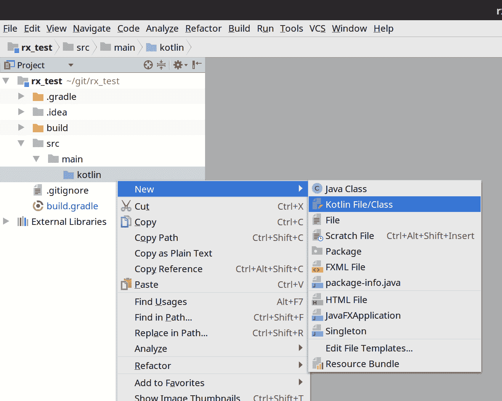
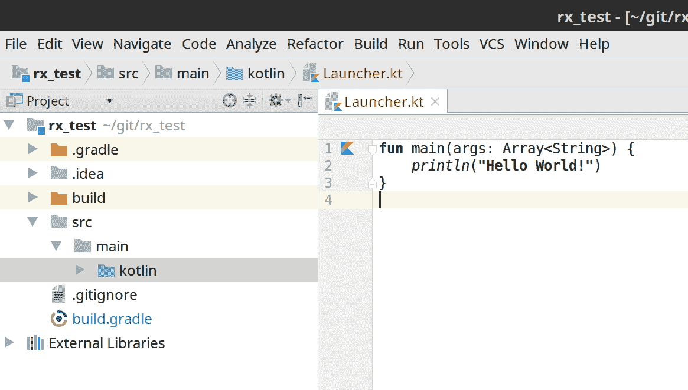

# 第十二章：使用 RxJava 为 Kotlin 新增功能

在我们的最后一章中，我们将把 RxJava 应用于 JVM 上的一个令人兴奋的新领域：Kotlin 语言。

Kotlin 由 JetBrains 开发，该公司还开发了 IntelliJ IDEA、PyCharm 以及其他几个主要的 IDE 和开发者工具。JetBrains 之前一直使用 Java 来构建其产品，但自 2010 年以来，JetBrains 开始质疑是否有一种更好的语言来满足他们的需求和现代需求。在调查了现有的语言后，他们决定构建并开源自己的语言。2016 年（5 年后），Kotlin 1.0 发布。2017 年，Kotlin 1.1 发布，面向日益增长的用户群体。不久之后，Google 宣布 Kotlin 为 Android 的官方支持语言。

在本章中，我们将涵盖以下主题：

+   为什么选择 Kotlin？

+   配置 Kotlin

+   Kotlin 基础

+   扩展操作符

+   使用 RxKotlin

+   处理 SAM 模糊性

+   `let()` 和 `apply()`

+   元组和数据类

+   ReactiveX 和 Kotlin 的未来

# 为什么选择 Kotlin？

Kotlin 力求成为一个实用和行业导向的语言，寻求最小（但可读性）的语法，以表达业务逻辑而不是样板代码。然而，它不像许多简洁的语言那样走捷径。它是静态类型的，在生产环境中表现稳健，同时足够快速，可以用于原型设计。它还可以与 Java 库和源代码 100% 兼容，使得逐步过渡成为可能。

直到最近还困于 Java 6 的 Android 开发者迅速采用了 Kotlin，并有效地将其变成了“Android 的 Swift”。有趣的是，Swift 和 Kotlin 有类似的感受和语法，但 Kotlin 出现得要早。除此之外，Kotlin 社区和库生态系统也在迅速增长。2017 年，Google 宣布 Kotlin 为官方支持的开发 Android 应用程序的语言。由于 JetBrains 和 Google 的承诺，Kotlin 在 JVM 上的光明未来是显而易见的。

但 Kotlin 与 RxJava 有何关系？Kotlin 有许多 Java 所不具备的有用语言特性，它们可以极大地提高 RxJava 的可表达性。此外，越来越多的 Android 开发者正在使用 Kotlin 和 RxJava，因此展示这两个平台如何协同工作是有意义的。

Kotlin 是一种 Java 开发者可以在几天内快速掌握的语言。如果你想要详细了解 Kotlin，Dmitry Jemerov 和 Svetlana Isakova 所著的《Kotlin in Action》([`www.manning.com/books/kotlin-in-action`](https://www.manning.com/books/kotlin-in-action)) 是一本极佳的书籍。此外，JetBrains 还提供了优秀的在线参考文档（[`kotlinlang.org/docs/reference/`](https://kotlinlang.org/docs/reference/)）。在本章中，我们将快速浏览 Kotlin 的几个基本特性，以展示其在表达 RxJava 时的相关性。

# 配置 Kotlin

您可以使用 Gradle 或 Maven 来构建您的 Kotlin 项目。您可以在 Intellij IDEA 中创建一个新的 Kotlin 项目而不需要任何构建自动化，但以下是设置 Kotlin 项目用于 Gradle 和 Maven 的方法。

# 配置 Kotlin 用于 Gradle

要使用 Kotlin 语言与 Gradle，首先将以下构建脚本 `{ }` 块添加到您的 `build.gradle` 文件中：

```java
buildscript {
     ext.kotlin_version = '<version to use>'

     repositories {
         mavenCentral()
     }

     dependencies {
         classpath "org.jetbrains.kotlin:kotlin-gradle- 
         plugin:$kotlin_version"
     }
 }
```

然后，您需要应用以下代码中的插件，以及将包含源代码的目录。

注意，`src/main/kotlin` 已经默认指定，但如果需要，您可以使用 `sourceSets { }` 块指定不同的目录：

```java
apply plugin: "kotlin"

 sourceSets {
     main.kotlin.srcDirs += 'src/main/kotlin'
 }
```

您可以在 Kotlin 网站上详细了解 Kotlin Gradle 配置，请访问 [`kotlinlang.org/docs/reference/using-gradle.html`](https://kotlinlang.org/docs/reference/using-gradle.html)。

# 配置 Kotlin 用于 Maven

对于 Maven，在 POM 文件中定义 `kotlin.version` 属性并将 `Kotlin-stdlib` 作为依赖项，如下面的代码所示。然后，构建项目：

```java
 <properties>
     <kotlin.version>1.1.2-2</kotlin.version>
 </properties>

 <dependencies>
     <dependency>
         <groupId>org.jetbrains.kotlin</groupId>
         <artifactId>kotlin-stdlib</artifactId>
         <version>${kotlin.version}</version>
     </dependency>
 </dependencies>
```

您还需要指定源代码目录和 kotlin-maven-plugin，如下面的代码所示：

```java
<build>
     <sourceDirectory>${project.basedir}/src/main/kotlin</sourceDirectory>
     <testSourceDirectory>${project.basedir}/src/test/kotlin</testSourceDirectory>
     <plugins>
         <plugin>
             <artifactId>kotlin-maven-plugin</artifactId>
             <groupId>org.jetbrains.kotlin</groupId>
             <version>${kotlin.version}</version>

             <executions>
                 <execution>
                     <id>compile</id>
                     <goals> <goal>compile</goal> </goals>
                 </execution>

                 <execution>
                     <id>test-compile</id>
                     <goals> <goal>test-compile</goal> </goals>
                 </execution>
             </executions>
         </plugin>
     </plugins>
 </build>
```

您可以在 Kotlin 网站上详细了解 Kotlin Maven 配置，请访问 [`kotlinlang.org/docs/reference/using-maven.html`](https://kotlinlang.org/docs/reference/using-maven.html)。

# 配置 RxJava 和 RxKotlin

在本章中，我们还将使用 RxJava 以及一个名为 **RxKotlin** 的扩展库。对于 Gradle，将这两个库作为依赖项添加，如下所示：

```java
 compile 'io.reactivex.rxjava2:rxjava:2.1.0'
 compile 'io.reactivex.rxjava2:rxkotlin:2.0.2'
```

对于 Maven，设置方式如下：

```java
<dependency>
     <groupId>io.reactivex.rxjava2</groupId>
     <artifactId>rxjava</artifactId>
     <version>2.1.0</version>
 </dependency>
 <dependency>
     <groupId>io.reactivex.rxjava2</groupId>
     <artifactId>rxkotlin</artifactId>
     <version>2.0.2</version>
 </dependency>
```

# Kotlin 基础

虽然 Kotlin 有一个独立的编译器并且可以与 Eclipse 一起工作，但我们将使用 Intellij IDEA。

Kotlin 项目的结构类似于 Java 项目。遵循标准的 Maven 习惯，您通常将 Kotlin 源代码放在 `/src/main/kotlin/` 文件夹中，而不是 `/src/main/java/` 文件夹中。Kotlin 源代码存储在具有 `.kt` 扩展名的文本文件中，而不是 `.java` 扩展名。然而，Kotlin 文件不必包含与文件同名的类。

# 创建 Kotlin 文件

在 Intellij IDEA 中，如果您还没有导入 Kotlin 项目，请右键单击 `/src/main/kotlin/` 文件夹并导航到 New | Kotlin File/Class，如图所示：

**图 12.1：** 创建一个新的 Kotlin 文件

在以下对话框中，将文件命名为 `Launcher`，然后点击 OK。现在您应该在项目视图中看到 `Launcher.kt` 文件。双击它以打开编辑器。编写以下 `"Hello World"` Kotlin 代码，如图所示，然后通过点击侧边栏中的 K 图标来运行它：



这是我们第一个 Kotlin 应用程序。Kotlin 使用“函数”而不是方法，但它有一个 `main()` 函数，就像 Java 有一个 `main()` 方法一样。请注意，我们不需要在 Java 类中放置我们的 `main()` 函数。这是 Kotlin 的一个好处。尽管它编译成 Java 字节码，但你不仅限于面向对象的约定，也可以是过程式或函数式的。

# 分配属性和变量

要声明一个变量或属性，你必须决定是否使其可变。在变量声明前加上 `val` 将使其只能赋值一次，而 `var` 是可变的，可以多次重新赋值。变量的名称随后跟一个冒号，将其与类型分开。然后，如果你有值，你可以分配它。在下面的代码中，我们为 `Int` 和 `String` 分配变量，并在插值字符串中打印它们：

```java
fun main(args: Array<String>) {
     val myInt: Int = 5
     val myString: String = "Alpha"

     println("myInt=$myInt and myString=$myString")
 }
```

输出如下：

```java
myInt=5 and myString=Alpha
```

Kotlin 的编译器非常智能，并不总是需要显式声明变量和属性的类型。如果你立即给它赋值，它将从这个值中推断类型。因此，我们可以按照以下方式移除类型声明：

```java
fun main(args: Array<String>) {
     val myInt = 5 *//infers type as `Int`*
     val myString = "Alpha" *//infers type as `String`*

     println("myInt=$myInt and myString=$myString")
 }
```

# 扩展函数

当你在 Kotlin 中进行 RxJava 工作时，创建扩展函数是非常有帮助的。我们将在稍后具体介绍，但这里有一个非响应式示例。

假设我们想要向 `LocalDate` 添加一个方便的函数，以便快速计算到另一个 `LocalDate` 的天数。而不是反复调用冗长的辅助类来完成这个任务，我们可以快速向 `LocalDate` 添加一个名为 `numberOfDaysTo()` 的扩展函数，如下所示。这并不扩展 `LocalDate`，而是让编译器将其解析为一个静态方法：

```java
 import java.time.LocalDate
 import java.time.temporal.ChronoUnit

 fun main(args: Array<String>) {
     val startDate = LocalDate.of(2017,5,1)
     val endDate = LocalDate.of(2017,5,11)

     val daysBetween = startDate.numberOfDaysTo(endDate)

     println(daysBetween)
 }

 fun LocalDate.numberOfDaysTo(otherLocalDate: LocalDate): Long {
     return ChronoUnit.DAYS.between(this, otherLocalDate)
 }
```

输出如下：

```java
10
```

扩展函数在 Kotlin 中就像一个普通函数，但你必须立即声明你要添加函数的类型，然后是一个点，接着是扩展函数的名称（例如，fun `LocalDate.numberOfDaysTo()`）。在随后的代码块中，它将目标 `LocalDate` 视为 `this`，就像它是在类内部一样。但再次强调，所有这些都会在编译时解析为一个静态方法。Kotlin 会神奇地将这些抽象化处理。

这允许你创建一个更流畅的 DSL（领域特定语言），它针对你的特定业务进行了优化。作为额外的奖励，IntelliJ IDEA 将在处理 `LocalDate` 时自动完成此扩展函数。

由于这个扩展函数的主体只有一行，实际上你可以使用等于（=）语法来更简洁地声明一个函数，并省略返回关键字以及显式的类型声明，如下面的代码所示：

```java
fun LocalDate.numberOfDaysTo(otherLocalDate: LocalDate) =
         ChronoUnit.DAYS.between(this, otherLocalDate)
```

正如我们将很快看到的，Kotlin 扩展函数是向 Observables 和 Flowables 添加新操作符的强大工具，并且它们比 `compose()` 和 `lift()` 提供了更多的灵活性和便利性。但首先，让我们看看 Kotlin 的 lambda。

# Kotlin lambda

我本可以花很多时间来解析 Kotlin 中的 lambda，但为了“直奔主题”，我将展示它们在 RxJava 中的表达方式。你可以在 Kotlin 参考网站上深入了解 Kotlin lambda（[`kotlinlang.org/docs/reference/lambdas.html`](https://kotlinlang.org/docs/reference/lambdas.html)）。

Kotlin 提供了比 Java 8 更多的表达 lambda 的方式，并且它还使用花括号 `{ }` 而不是圆括号 `( )` 来将 lambda 参数接受到函数中。以下是如何表达一个发射字符串并映射并打印其长度的 `Observable` 链：

```java
 import io.reactivex.Observable

 fun main(args: Array<String>) {

     Observable.just("Alpha", "Beta", "Gama", "Delta", "Epsilon")
             .map { s: String -> s.length }
             .subscribe { i: Int -> println(i) }
 }
```

输出如下：

```java
 5
 4
 4
 5
 7
```

注意我们如何表达 `map()` 和 `subscribe()` 的 lambda 参数。一开始使用花括号 `{ }` 接受 lambda 参数可能会觉得有些奇怪，但不久之后就会觉得非常自然。它们有助于区分有状态参数和无状态参数。如果你喜欢，可以围绕它们放置圆括号，但这很混乱，并且只有在需要传递多个 lambda 参数（如 `collect()` 操作符）时才需要：

```java
 import io.reactivex.Observable

 fun main(args: Array<String>) {

     Observable.just("Alpha", "Beta", "Gama", "Delta", "Epsilon")
             .map( { s: String -> s.length } )
             .subscribe( { i: Int -> println(i) } )
 }
```

如前所述，Kotlin 编译器在类型推断方面非常智能。因此，大多数情况下，我们不需要将我们的 lambda 参数 `s` 或 `i` 声明为 `String` 和 `Int`。编译器可以为我们解决这个问题，如下面的代码所示：

```java
 import io.reactivex.Observable

 fun main(args: Array<String>) {

     Observable.just("Alpha", "Beta", "Gama", "Delta", "Epsilon")
             .map { s -> s.length }
             .subscribe { i -> println(i) }
 }
```

更好的是，这些是简单的单参数 lambda，所以我们甚至不需要命名这些参数。我们可以完全省略它们，并使用 `it` 关键字来引用，如下所示：

```java
 import io.reactivex.Observable

 fun main(args: Array<String>) {

     Observable.just("Alpha", "Beta", "Gama", "Delta", "Epsilon")
             .map { it.length }
             .subscribe { println(it) }
 }
```

与 Java 8 类似，我们也可以使用函数引用语法。如果我们只是以完全相同的方式和顺序将参数传递给函数或构造函数，我们可以使用双冒号 `::` 语法，如下所示。请注意，我们在这里确实使用了圆括号：

```java
 import io.reactivex.Observable

 fun main(args: Array<String>) {

     Observable.just("Alpha", "Beta", "Gama", "Delta", "Epsilon")
             .map(String::length)
             .subscribe(::println)
 }
```

关于 Kotlin lambda 参数的另一个有趣之处在于，当你有多个参数且最后一个参数是 lambda 时，你可以将 lambda 表达式放在圆括号之外。在下面的代码中，`scan()` 发射字符串长度的滚动总和，并提供一个种子值 `0`。然而，我们可以将最后的 lambda 参数放在圆括号 `( )` 之外：

```java
import io.reactivex.Observable

fun main(args: Array<String>) {

     Observable.just("Alpha", "Beta", "Gama", "Delta", "Epsilon")
             .map { s: String -> s.length }
             .scan(0) { total, next -> total + next }
             .subscribe {
                 println("Rolling sum of String lengths is $it")
             }
 }
```

# 扩展操作符

如前所述，Kotlin 提供了扩展函数。这些可以作为仅使用 `compose()` 和 `lift()` 的强大替代方案。

例如，我们无法使用 Transformers 和 `compose()` 将 `Observable<T>` 转换为 `Single<R>`。但使用 Kotlin 扩展函数，这完全可行。在下面的代码中，我们创建了一个 `toSet()` 操作符并将其添加到 `Observable<T>`：

```java
import io.reactivex.Observable

fun main(args: Array<String>) {

     val source = Observable.just("Alpha", "Beta", "Gama", "Delta",
    "Epsilon")

     val asSet = source.toSet()

 }

 fun <T> Observable<T>.toSet() =
         collect({ HashSet<T>() }, { set, next -> set.add(next) })
         .map { it as Set<T> }
```

`toSet()`返回一个`Single<Set<T>>`，并且它被调用在一个`Observable<T>`上。在扩展函数中，`collect()`运算符被调用在调用的`Observable`上，然后它将`HashSet`转换为`Set`，因此实现是隐藏的。正如你所见，创建新的运算符并使其易于发现是很简单的。

你也可以使扩展函数仅针对某些泛型类型。例如，我可以创建一个仅针对`Observable<Int>`的`sum()`扩展函数（`Int`是 Kotlin 中的 Integer/int 抽象类型）。它只有在与发出整数的`Observable`一起使用时才有效，并且只能编译或出现在该类型的自动完成中：

```java
import io.reactivex.Observable

fun main(args: Array<String>) {

     val source = Observable.just(100, 50, 250, 150)

     val total = source.sum()
 }

 fun Observable<Int>.sum() =
       reduce(0) { total, next -> total + next }
```

# 使用 RxKotlin

有一个名为 RxKotlin 的小型库（[`github.com/ReactiveX/RxKotlin/`](https://github.com/ReactiveX/RxKotlin/)），我们在本章开头将其作为依赖项。在撰写本文时，它几乎不是一个复杂的库，而是一组用于常见反应式转换的方便扩展函数的集合。它还试图在 Kotlin 中使用 RxJava 时标准化一些约定。

例如，有`toObservable()`和`toFlowable()`扩展函数可以在可迭代的、序列的以及一些其他来源上调用。在下面的代码中，我们不是使用`Observable.fromIterable()`将`List`转换为`Observable`，而是直接调用它的`toObservable()`扩展函数：

```java
import io.reactivex.rxkotlin.toObservable

fun main(args: Array<String>) {

     val myList = listOf("Alpha", "Beta", "Gamma", "Delta", 
     "Epsilon")

     myList.toObservable()
             .map(String::length)
             .subscribe(::println)
 }
```

在 RxKotlin 中还有一些值得探索的其他扩展功能，你可以在 GitHub 页面上查看所有内容。这个库故意保持小巧和专注，因为它很容易让 API 因为每个可能的任务都添加一个扩展函数而变得杂乱。但它包含了常见任务的功能，如前面的例子。

RxKotlin 还有一些有用的帮助程序可以解决 Java 和 Kotlin 之间存在的 SAM 问题（如果你已经尝试过，你可能已经注意到了这个问题）。我们将在下一节中介绍这个问题。

# 处理 SAM 歧义

在撰写本文时，当 Kotlin 使用功能参数调用 Java 库时，存在一个细微差别。这个问题在 RxJava 2.0 中尤其明显，因为引入了许多参数重载。当调用 Kotlin 库时，Kotlin 没有这个问题，但与 Java 库一起使用时却存在。当给定 Java 方法上有多个针对不同功能 SAM 类型的参数重载时，Kotlin 会在推断中迷失方向，需要帮助。在 JetBrains 解决这个问题之前，你需要通过明确指定或使用 RxKotlin 的帮助程序来解决这个问题。

这里有一个臭名昭著的例子：`zip()`运算符。尝试在这里进行简单的`zip`操作，你会因为类型推断失败而得到编译错误：

```java
import io.reactivex.Observable

fun main(args: Array<String>) {

     val strings = Observable.just("Alpha", "Beta", "Gamma",
     "Delta")
     val numbers = Observable.range(1,4)

     *//compile error, can't infer parameters*
     val zipped = Observable.zip(strings, numbers) { s,n -> "$s $n" }

     zipped.subscribe(::println)
 }
```

解决这个问题的一种方法是用你的 lambda 显式地构造 SAM 类型。在这种情况下，我们需要告诉编译器我们正在给它一个`BiFunction<String,Int,String>`，如下所示：

```java
 import io.reactivex.Observable
 import io.reactivex.functions.BiFunction

 fun main(args: Array<String>) {

     val strings = Observable.just("Alpha", "Beta", "Gamma",
     "Delta")
     val numbers = Observable.range(1,4)

     val zipped = Observable.zip(strings, numbers,
             BiFunction<String,Int,String> { s,n -> "$s $n" }
     )

     zipped.subscribe(::println)
 }
```

不幸的是，这相当冗长。许多人使用 RxJava 和 Kotlin 来减少代码量，而不是增加，所以这不是理想的情况。幸运的是，RxKotlin 提供了一些工具来解决这个问题。你可以使用 Observables、Flowables、Singles 和 Maybes 工具类来调用受 SAM 问题影响的工厂实现。以下是我们使用这种方法的一个例子：

```java
 import io.reactivex.Observable
 import io.reactivex.rxkotlin.Observables

 fun main(args: Array<String>) {

     val strings = Observable.just("Alpha", "Beta", "Gamma",
     "Delta")
     val numbers = Observable.range(1,4)

     val zipped = Observables.zip(strings, numbers) { s, n -> "$s $n" }

     zipped.subscribe(::println)
 }
```

对于受 SAM 问题影响的非工厂操作符，也存在扩展函数。以下是我们使用 `zipWith()` 扩展函数的一个例子，该函数成功地使用我们的 Kotlin lambda 参数进行了推理。请注意，我们必须导入这个扩展函数才能使用它：

```java
 import io.reactivex.Observable
 import io.reactivex.rxkotlin.zipWith

 fun main(args: Array<String>) {

     val strings = Observable.just("Alpha", "Beta", "Gamma",
     "Delta")
     val numbers = Observable.range(1,4)

     val zipped = strings.zipWith(numbers) { s, n -> "$s $n" }

     zipped.subscribe(::println)
 }
```

还应该指出，Single 和 Maybe 上的 `subscribe()` 也受到 SAM 不明确性问题的困扰，因此有 `subscribeBy()` 扩展来处理它，如下所示：

```java
 import io.reactivex.Observable
 import io.reactivex.rxkotlin.subscribeBy

 fun main(args: Array<String>) {

     Observable.just("Alpha", "Beta", "Gamma", "Delta", "Epsilon")
             .count()
             .subscribeBy { println("There are $it items") }
 }
```

务必不要让 SAM 不明确性问题阻碍你尝试 Kotlin。这是 Kotlin lambda 与 Java SAM 类型互操作时的一个细微差别。这个问题已被 JetBrains 承认，应该是暂时的。此外，在 Kotlin 社区中也有讨论，为了其他原因创建一个纯 Kotlin 的 ReactiveX 实现，我们将在本章末尾讨论 RxKotlin 的未来。

# 使用 let() 和 apply()

在 Kotlin 中，每个类型都有一个 `let()` 和 `apply()` 扩展函数。这两个简单但实用的工具可以使你的代码更加流畅和易于表达。

# 使用 let()

`let()` 简单地接受一个将调用对象 `T` 映射到另一个对象 `R` 的 lambda 表达式。这与 RxJava 提供的 `to()` 操作符类似，但它适用于任何类型 `T`，而不仅仅是 Observables/Flowables。例如，我们可以对一个已经被转换为小写的字符串调用 `let()`，然后立即对其进行任何任意的转换，例如将其 `reversed()` 字符串连接到它。看看这个操作：

```java
fun main(args: Array<String>) {

     val str = "GAMMA"

     val lowerCaseWithReversed = str.toLowerCase().let { it + " " +
     it.reversed() }

     println(lowerCaseWithReversed)
 }
```

输出如下：

```java
gamma ammag
```

当你不想为了多次引用而将值保存到变量中时，`let()` 就派上用场了。在上面的代码中，我们不必将 `toLowerCase()` 的结果保存到变量中。相反，我们只需立即对它调用 `let()` 来完成我们需要的操作。

在 RxJava 的上下文中，`let()` 函数可以帮助快速处理一个 `Observable`，将其分支，然后使用组合操作符重新组合。在下面的代码中，我们将数字的 `Observable` 分发给一个 `let()` 操作符，该操作符创建一个总和和一个计数，然后返回使用这两个值来找到平均值的 `zipWith()` 操作符的结果：

```java
 import io.reactivex.Observable
 import io.reactivex.rxkotlin.subscribeBy
 import io.reactivex.rxkotlin.zipWith

 fun main(args: Array<String>) {

     val numbers =
             Observable.just(180.0, 160.0, 140.0, 100.0, 120.0)

     val average = numbers.publish()
             .autoConnect(2)
             .let {
                 val sum = it.reduce(0.0) { total, next -> total +
                 next}
                 val count = it.count()

                 sum.zipWith(count) { s, c -> s / c }
             }

     average.subscribeBy(::println)
 }
```

输出如下：

```java
140.0
```

`let()` 中的最后一行是返回的内容，不需要返回关键字。

总结来说，`let()` 是一个强大且简单的工具，可以流畅地将一个项目转换为另一个项目。在 RxJava 中，使用它来分支 `Observable` 或 `Flowable` 流，然后再将它们重新组合，是它的一个有用应用。

# 使用 apply()

与 `let()` 类似的工具是 `apply()`。与 `let()` 将 `T` 类型的项转换为 `R` 类型的项不同，`apply()` 对 `T` 类型的项执行一系列操作，然后再返回相同的 `T` 类型的项。这在声明一个项 `T` 但对其执行辅助操作而不打断声明/赋值流程时非常有用。

这里是一个非响应式示例。我们有一个简单的类 `MyItem`，它有一个 `startProcess()` 方法。我们可以实例化 `MyItem`，但使用 `apply()` 在将 `MyItem` 赋值给变量之前调用这个 `startProcess()` 方法，如下所示：

```java
fun main(args: Array<String>) {

     val myItem = MyItem().apply {
         startProcess()
     }

 }

 class MyItem {

     fun startProcess() = println("Starting Process!")
 }
```

输出如下：

```java
Starting Process!
```

在 RxJava 中，`apply()` 函数有助于在 `Observable`/`Flowable` 链中添加观察者或订阅者，同时不会打断当前主要任务的流程。这有助于向单独的流中发送状态消息。

在以下代码中，我们发出五个 1 秒的间隔，并乘以每个间隔。然而，我们在乘法之前在 `apply()` 中创建了一个 `statusObserver` 并订阅它。在 `apply()` 之前也进行了多播，以便将发射物推送到两个目的地：

```java
 import io.reactivex.Observable
 import io.reactivex.subjects.PublishSubject
 import java.util.concurrent.TimeUnit

 fun main(args: Array<String>) {

     val statusObserver = PublishSubject.create<Long>()
     statusObserver.subscribe { println("Status Observer: $it") }

     Observable.interval(1, TimeUnit.SECONDS)
             .take(5)
             .publish()
             .autoConnect(2)
             .apply {
                 subscribe(statusObserver)
             }
             .map { it * 100 }
             .subscribe {
                 println("Main Observer: $it")
             }

     Thread.sleep(7000)
 }
```

输出如下：

```java
 Status Observer: 0
 Main Observer: 0
 Status Observer: 1
 Main Observer: 100
 Status Observer: 2
 Main Observer: 200
 Status Observer: 3
 Main Observer: 300
 Status Observer: 4
 Main Observer: 400
```

因此，再次强调，`apply()` 在将多播流发射物推送到多个观察者时非常有用，而不需要任何中间变量。

与 `apply()` 类似的扩展函数是 `run()`，它执行一系列操作，但返回类型为空（或在 Kotlin 中称为 Unit）。还有 `with()`，它与 `run()` 相同，但它不是一个扩展函数。它接受目标项作为参数。

# 元组和数据类

Kotlin 对元组支持有限，但它还提供了更好的数据类。我们将在 RxJava 的上下文中探讨这两个工具。

Kotlin 支持快速创建包含两个项的 Pair（这些项可以是不同类型的）。这是一个简单的双值元组，但具有静态类型。你可以通过在两个值之间放置 `to` 关键字来快速构建一个。这在需要在两个流之间执行 `zip()` 操作并将两个项配对时非常有用。

在以下代码中，我们将字符串项的流与 `Int` 项的流进行连接，并将每个配对放入 `Pair<String,Int>`。

```java
import io.reactivex.Observable
import io.reactivex.rxkotlin.Observables

 fun main(args: Array<String>) {

     val strings = Observable.just("Alpha", "Beta", "Gamma",
     "Delta")
     val numbers = Observable.range(1,4)

     *//Emits Pair<String,Int>*
     Observables.zip(strings, numbers) { s, n -> s to n }
             .subscribe {
                 println(it)
             }
 }
```

输出如下：

```java
 (Alpha, 1)
 (Beta, 2)
 (Gamma, 3)
 (Delta, 4)
```

更好的方法是使用数据类。数据类是 Kotlin 的一个强大工具，它的工作方式与类相似，但会自动实现 `hashcode()`/`equals()`、`toString()`，以及一个巧妙的 `copy()` 函数，允许你克隆并修改属性到该类的新实例。

但目前，我们将仅使用数据类作为比 `Pair` 更干净的方法，因为我们实际上为每个属性提供了一个名称，而不是 `first` 和 `second`。在以下代码中，我们将创建一个 `StringAndNumber` 数据类，并使用它来连接每个值对：

```java
 import io.reactivex.Observable
 import io.reactivex.rxkotlin.Observables

 fun main(args: Array<String>) {

     val strings = Observable.just("Alpha", "Beta", "Gamma",
     "Delta")
     val numbers = Observable.range(1,4)

     data class StringAndNumber(val myString: String, val myNumber: Int)

     Observables.zip(strings, numbers) { s, n -> StringAndNumber(s,n) }
             .subscribe {
                 println(it)
             }
 }
```

输出如下：

```java
 StringAndNumber(myString=Alpha, myNumber=1)
 StringAndNumber(myString=Beta, myNumber=2)
 StringAndNumber(myString=Gamma, myNumber=3)
 StringAndNumber(myString=Delta, myNumber=4)
```

数据类（以及普通的 Kotlin 类）声明快捷且简单，因此你可以战略性地使用它们来完成小型任务。使用它们可以使你的代码更清晰且易于维护。

# ReactiveX 和 Kotlin 的未来

Kotlin 是一种强大且实用的语言。JetBrains 不仅投入了大量努力使其有效，还使其与现有的 Java 代码和库兼容。尽管存在一些粗糙的地方，比如 SAM lambda 推断，但他们仍然出色地让 Java 和 Kotlin 一起工作。然而，即使有了这种坚实的兼容性，许多开发者也渴望完全迁移到 Kotlin 以利用其功能。命名参数、可选参数、可空类型、扩展函数、内联函数、委托和其他语言特性使 Kotlin 对专用使用具有吸引力。更不用说，JetBrains 已经成功地将 Kotlin 编译成 JavaScript，并将很快支持 LLVM 原生编译。纯 Kotlin 编写的库可以潜在地编译到所有这些平台。为了进一步巩固 Kotlin 的地位，谷歌官方将其确立为 Android 的下一个支持语言。

因此，这引发了一个问题：在纯 Kotlin 中创建 ReactiveX 实现并不仅仅依赖于 RxJava 是否会有好处？毕竟，Kotlin 语言有一套强大的功能，可以为 ReactiveX 实现提供很多帮助，并将其带到 Kotlin 可以编译到的多个平台。它还将创建一个针对 Kotlin 优化的 ReactiveX 体验，支持可空类型发射、扩展操作符和基于协程的并发。

协程为 Kotlin 应用程序快速（且更安全地）实现并发提供了一个有趣且有用的抽象。因为协程支持任务挂起，它们提供了一种自然机制来支持背压。如果在 Kotlin 中实现 ReactiveX，协程可以在使背压简单实现方面发挥巨大作用。

如果你想了解如何在 Kotlin 中利用 Kotlin 协程创建 ReactiveX 实现，请阅读 Roman Elizarov 的迷人文章，链接为 [`github.com/Kotlin/kotlinx.coroutines/blob/master/reactive/coroutines-guide-reactive.md`](https://github.com/Kotlin/kotlinx.coroutines/blob/master/reactive/coroutines-guide-reactive.md)。

因此，在纯 Kotlin 中实现 ReactiveX 实现确实可能带来很多好处。在撰写本文时，这个话题在 Kotlin 社区中越来越受欢迎。请密切关注，因为人们将继续实验，从概念验证逐步发展到原型，然后是官方发布。

# 摘要

在本章中，我们介绍了如何使用 RxJava 进行 Kotlin 编程。Kotlin 语言为在 JVM 上更实用地表达代码提供了激动人心的机会，而 RxJava 可以利用其许多有用特性。扩展函数、数据类、RxKotlin 以及如 `let()`/`apply()` 这样的函数式操作符使你更容易地表达你的响应式领域。尽管 SAM 推断可能会让你遇到障碍，但你可以通过利用 RxKotlin 的辅助工具来解决这个问题，直到 JetBrains 提供修复方案。将来，看到是否会出现纯 Kotlin 实现的 ReactiveX 将会很有趣。这样的实现将引入 Kotlin 允许而 Java 不允许的大量功能。

这就是终点！如果你从头到尾阅读了这本书，恭喜你！你应该已经具备了在工作和项目中利用 RxJava 的坚实基础。响应式编程是一种彻底不同的解决问题方法，但也是非常有效的。响应式编程将继续增长其相关性，并塑造我们建模代码的未来。站在这个前沿将使你不仅具有市场竞争力，而且在未来几年内成为领导者。
