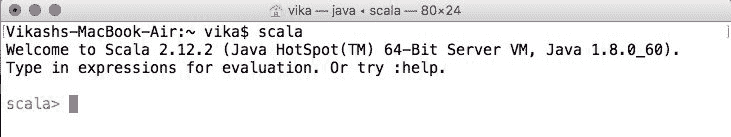
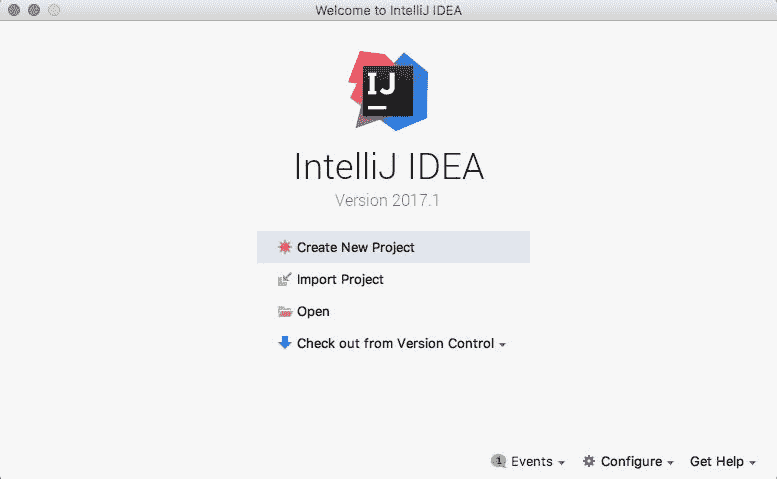
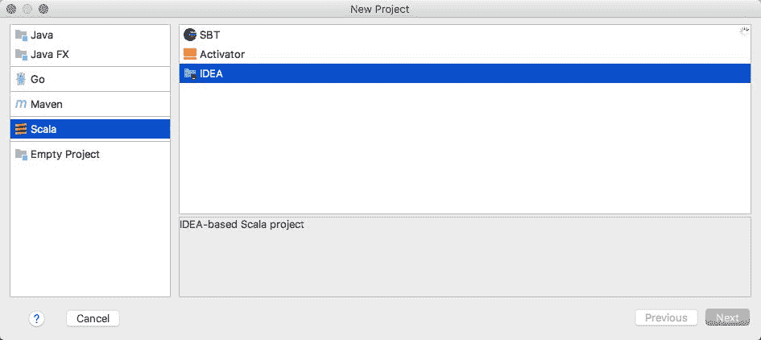
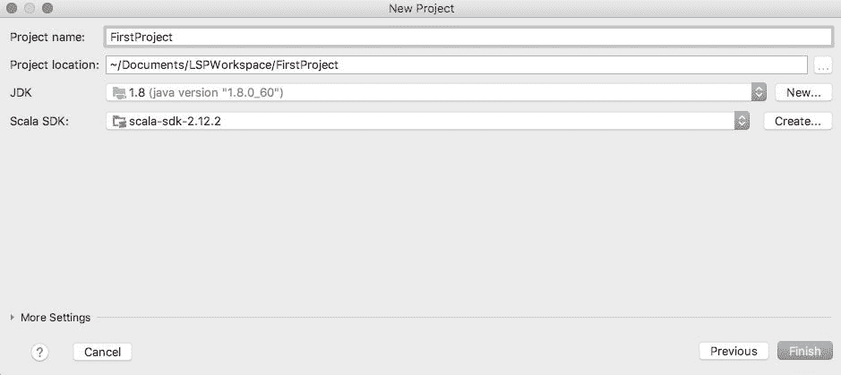

# 第一章：Scala 编程入门

“当你不创造东西时，你被自己的品味而不是能力所定义，你的品味只会变得狭隘并排斥他人。所以，创造吧。”

- Why the Lucky Stiff

Scala 容易入门，但太深奥了，难以掌握。正如其名所示，Scala 意味着 *一种可扩展的语言*，一种随着你的编程能力增长而增长的编程语言。本章将向您介绍这种非常流行的语言。

在本章中，我们将涵盖以下主题：

+   Scala 简介

+   Scala 优势

+   使用 Scala

+   运行我们的第一个程序

# Scala 简介

考虑一个场景，你得到一个段落和一个单词，并被要求计算该单词出现的次数。你很幸运地知道一种语言，比如 Java。你的解决方案可能看起来像这样：

```java
String str = "Scala is a multi-paradigm language. Scala is scalable too."
int count = 0;
for (stringy: str.split (" ")) {
    if (word.equals (stringy))
        count++;
}
System.out.println ("Word" + word + " occurred " + count + " times.")
```

那很简单，不是吗？现在我们的 Scalable 语言有简单的方法来完成这个任务。让我们看看它是如何做到的：

```java
val str = "Scala is a multi-paradigm language. Scala is scalable too."
println ("Word" + word + " occurred " + str.split(" ").filter(_ == word).size + " times.")
```

就这样，对同一个问题的单行解决方案。代码现在可能看起来不熟悉，但渐渐地你会掌握它。到本章结束时，我们将了解运行 Scala 程序所需的一切，而不仅仅是 `Hello World` 程序，还包括做些事情的程序。

Scala 与其他语言并无不同。它运行在 **Java** **虚拟** **机**（**JVM**）上，因此熟悉 Java 的人肯定对其有所了解。如果不熟悉，JVM 可以定义为一种抽象计算机，它执行一系列指令（Java 字节码）。它使机器能够运行 Java 程序。因此，结论是：当我们编写 Scala 程序并编译它们时，它们会被转换成 Java 字节码，然后在 JVM 上运行。Scala 与所有 Java 库兼容。编写我们自己的 Scala 代码并集成用 Java 编写的库函数既容易又当然可行。

Scala 是一种多范式语言；它是面向对象和函数式编程的混合体。但它对我们有什么好处呢？

# 编程范式

范式只是做某事的一种方式。因此，编程范式意味着编程的方式或编写程序的一定模式。存在许多编程范式，但其中四种已经获得了流行：

+   **命令式范式**：先做这个，再做那个

+   **函数式范式**：评估和使用

+   **逻辑范式**：通过解决方案来回答

+   **面向对象范式**：通过对象间发送消息来模拟一组现实世界现象的时间演化

# 面向对象与函数式范式

函数式编程范式起源于数学学科，非常简单。它基于函数理论，这些函数产生不可变值。不可变值意味着它们不能直接在之后被修改。在函数式范式下，所有计算都是通过调用自我/其他函数来执行的。函数是函数式世界中的第一公民。这开启了一个新的可能性世界，其中所有计算都由某种需求驱动。

面向对象的星球围绕着封装和抽象旋转。组件的逻辑分组使得维护更大和更复杂的程序变得容易。数据和模型封装在对象中。信息隐藏对于包含对象属性是有效的。继承层次、类的概念以及对象之间的消息传递使得面向对象编程的整个模型/模式部分成功。

# Scala 是多范式的

Scala 作为一种多范式语言，支持两种范式。在我们学习 Scala 的过程中，我们拥有这两种范式的力量。我们可以根据需要创建函数，也可以让对象相互通信。我们可以有类层次和抽象。有了这些，对特定范式的控制不会影响另一个。

今天，对于并发、不可变性、异构性、反应性和容错架构的需求急剧增加，而开发周期却越来越短。在这个时代，像 Scala 这样的语言在支持函数式编程以及面向对象编程方面做得更多。

对于我们这样的程序员来说，一种语言是一个创造有意义事物的工具。我们倾向于重用和操作其他工具，在我们的例子中，让我们假设是其他库。现在，我们希望与一种提供使用扩展性和灵活性的语言一起工作。Scala 就是这样做的。这种强大的语言让你可以混合使用新创建的`trait`（你可能没有听说过，但你可以将其与 Java 的接口进行比较）。我们有多种方法可以使我们的代码更有意义，当然也更简洁。如果使用得当，你可以使用本地语言特性创建自己的自定义结构。所以这种语言就像你一样令人兴奋！

这就是学习它的一个原因。选择 Scala 而不是其他语言的原因还有很多，而且相当多。让我们逐一来看。但首先让我们感到困惑：

"Scala 是一种函数式语言，支持多种范式，Scala 中的每个函数都是一个对象。"

太棒了！现在你已经知道了这种语言的主要三个特点。但这很难接受。它是一种函数式语言，每个函数都是一个对象。真的吗？

以下是一个在 Scala 中定义的`trait`示例，称为`Function1`：

```java
package scala
trait Function1[A, B] {
        def apply(x: A) : B
}
```

这些还有很多，从`Function0`到`Function22`。使用它们有一定的方法。在这本书中，我们会多次使用它们。我们也将它们称为*A => B*（我们称之为，`A`到`B`）。这意味着这个函数接受一个类型为`A`的参数，按照定义执行一些操作，并返回一个类型为`B`的值：

```java
val answer = new Functiona1[Int, Int] {
        def apply(x: Int): Int = x * 2
}
```

这看起来有点多，但熟悉这些结构是个好主意。`val` 是一个关键字，用于声明值类型。这意味着一旦声明和实例化，就不能再进一步更改它。这个 `answer = (x: Int) => x * 2` 成为一个函数字面量，可以被传递给另一个函数。我们之所以能达到这个点，是因为我们能够实例化我们的 `Function1` 特质的对象（我们将在第七章[part0240.html#74S700-921a8f8dca2a47ea817d3e6755fa0e84]，*面向对象的 Scala 的下一步*中看到这是如何工作的）。

想想任何两个幸运数字，现在代表你如何将它们相加。假设你的数字是 42 + 61\. 在这里，你的数字 42 和 61 是 `Int` 类型的对象，而 `+` 是 `Int` 类型上的一个方法。这就是你和 Scala 处理实体的方式。我们将实体视为对象，并在它们上执行的操作视为方法。这正是使这种语言可扩展的原因。

我们可以执行函数式操作，其中输入被转换成输出，而不是改变它们的数据/状态。考虑到这一点，我们的大部分操作（几乎全部）将不会依赖于状态变化；这意味着函数不会产生副作用。一个例子可以是这样一个函数，它接收你的出生日期，并以年数和月数的形式返回你的年龄：

```java
class YearsAndMonths(years: Int, months: Int)
def age(birthdate: Date): YearsAndMonths = //Some Logic
```

这是一个纯函数，因为它不操作输入。它接收输入，转换，并给出输出。Case 类只是帮助我们以某种方式定义年龄。有了这个，我们可以引入更多术语，称为**引用透明方法**.* 我们的 `age` 方法可以被称作*引用透明*。这些方法调用可以被结果替换，而不会改变你程序中的任何意义/语义。

纯函数、不可变性的概念和引用透明性都只是为了使这种语言更强大。有更多理由选择这种语言作为你下一个应用程序的工具。

# Scala 优势

我们是聪明的程序员。我们已经对我们的语言选择设定了期望。我们的语言应该足够广泛和灵活。它应该是友好的，支持用 Java 等语言编写的库，易于使用，有良好的在线支持，还有很多其他优点。而且你知道吗！Scala 给你提供了完整的包。

# 在 JVM 上运行

考虑效率优化作为衡量一种语言是否表现良好的因素。Scala 利用 JVM 来实现这一点。JVM 使用**即时编译**（**JIT**）和自适应优化技术来提高性能。在 JVM 上运行使 Scala 与 Java 兼容。你有很多库可用作为重用工具。

如果你在心中比较 Java 和 Scala 的性能，让我们澄清一下。Java 和 Scala 程序都是编译成字节码。JVM 理解字节码并为你运行它。所以这主要取决于你编写程序的方式。Scala 融合了一些语法糖，编译器逻辑，这可能导致你的程序比 Java 更/更少高效。使用特质进行混入可能对你的程序架构有益，但可能会影响你的程序性能。但在 Java 中的替代方案可能成本相同或更高。所以这更多关于你对结构的核心理解以及你的代码将如何编译和执行。这需要一些时间和努力去理解，所以选择权在你；作为一个聪明的程序员，你可能会选择一个语法强大的语言。

# 超智能语法

你将用 Scala 编写简洁的代码。我们可以查看很多示例来了解 Scala 语法的简洁性。让我们从 Scala 丰富的集合中取一个例子来创建一个`Map`：

```java
val words = Map ("Wisdom" -> "state of being wise")
println(words("Wisdom"))

> state of being wise
```

上述代码正在创建一个单词及其含义的映射。只需`Map ("Wisdom" -> "state of being wise")`这一行代码，我们就能实现这一功能。无需添加分号。我们甚至没有提及我们值的类型，而 Scala 编译器却能推断出来。**类型推断**是这种语言的特点。由于**类型推断**，很多时候我们省略了类型声明，直接使用值。这样，仅使用最小的一组单词/标记，你就可以表达实现它们的逻辑。像 case 类和模式匹配这样的结构可以减少你可能需要做的额外工作，并使编写代码变得愉快。它还有助于你大幅减少代码量。

# 两者之最佳结合

Scala 是函数式和面向对象世界的混合体。它提供了两个好处。首先，你可以利用函数式结构的强大功能：高阶函数、嵌套函数、纯函数和闭包。你可以使用更多可用（且推荐）的不可变数据结构。使用不可变代码有助于消除可能引入副作用或状态变化的代码。这也使得这种语言适合并发编程。这只是 Scala 提供的另一个优势。其次，你拥有所有面向对象的优点。

你可以定义特质，将它们与类或对象混合，从而实现继承。在 Scala 中，创建对象、定义抽象类和子类也是可能的。

# 类型是核心

在早期（即使现在也很棒）你可能遇到过这种情况：

```java
f : R -> N
```

这是函数的数学表示。这就是我们表示任何函数 *f* 的定义域和陪域的方式。在这种情况下，函数 `f` 将实数集的值映射到自然数集。在这个深层次的抽象级别上，你可以思考 Scala 丰富的类型系统。其中一些可用的类型是参数化的、结构化的、复合的、存在性的、路径依赖的、高阶的，是的，我们正在讨论抽象类型。对这些类型的解释超出了本书的范围。但如果你好奇，你可以参考 Scala 文档在 [`www.scala-lang.org/documentation/`](https://www.scala-lang.org/documentation/)。了解这些对于设计框架或库非常有帮助。

# 并发编程变得简单

Scala 推荐使用不可变数据结构、不可变集合、使用值类型、函数组合和转换。除此之外，使用演员和其他并发结构使得编写并发程序变得非常容易。大多数情况下，程序员不需要处理线程生命周期管理的复杂性，因为现代结构如演员和反应器以原生支持和库的形式提供。Akka 就是这些工具包之一，它是用 Scala 编写的。此外，使用未来和承诺使得编写异步代码成为可能。

# 异步代码

简单来说，异步代码是在调用一个指令块（即函数）并启动一些并行/后台任务以完成请求后，程序控制立即返回的地方。这意味着程序流程不会因为某个函数需要时间完成而停止。

# 异步编程与并行编程和并发编程的比较

异步编程涉及一些计算密集型任务，这些任务一方面在后台占用一个线程，但不会影响程序的正常流程。

并行编程通过结合多个线程来更快地完成任务，并发编程也是如此。但这两者之间有一个细微的差别。并行编程中的程序流程是确定的，而在并发编程中则不是。例如，发送多个请求执行并返回响应，而不考虑响应顺序的场景被称为并发编程。但将任务分解成多个子任务以实现并行性的地方可以定义为并行编程的核心思想。

# 现在可用于前端

**Scala.js** 是专门为前端设计的，它可以帮助你避免基于类型的错误，因为 Scala.js 能够推断类型。你可以利用性能优化和与一些现有的 JavaScript 框架（如 Angular 和 React）的互操作性。然后，再加上可用的宏，这些宏可以帮助你扩展语言。

# 智能集成开发环境

有许多选项可以使您的编程之旅更加轻松。Scala IDE 为基于 Scala 的应用程序的开发提供了许多编辑和调试选项。Scala IDE 是建立在知名 Eclipse IDE 之上的。还有可用于编写 Scala 应用程序的插件。我们将在接下来的章节中探讨如何安装和使用 IDE 进行 Scala 开发。

# 广泛的语言

Scala 非常深入。丰富的类型抽象、反射和宏都有助于您构建一些真正强大的库和框架。Scala 文档为您解释了一切：从参数化类型到反射组件。理解编译时反射（宏）和运行时反射对于使用 Scala 编写框架是必不可少的。而且这很有趣。

# 在线支持

Scala 作为编程语言的增长及其成功的一个最大原因是可用的广泛在线支持。Scala 团队投入了大量工作，并提供了丰富的文档。您可以在[`docs.scala-lang.org`](http://docs.scala-lang.org)找到文档。

学习 Scala 具有挑战性但很有趣。它激发了你作为程序员的最佳表现。用几乎相同的性能能力思考和编写更短、更智能的语法不是很有趣吗？

# 使用 Scala

在这本书中，我们使用 Scala 版本 2.12.2。Scala 2.12 要求您的系统已安装 Java 8。较老的 Scala 版本支持 Java 6 及以上版本。对 Java 9 的支持仍然是 Scala 2.13 路线图讨论的主题。

Scala 2.12 相比之前的版本是一个进步，主要是为了支持 Java 和 Scala 的 lambda 互操作性。特性和函数被直接编译到它们的 Java 8 等价物。

# Java 安装

做必要的事情。如果您的机器上尚未安装 Java，您可以参考 Oracle 的网站[`docs.oracle.com/javase/8/docs/technotes/guides/install/install_overview.html`](https://docs.oracle.com/javase/8/docs/technotes/guides/install/install_overview.html)，了解如何为您的操作系统安装 Java。

# SBT 安装

如同其名，SBT 是一个**简单构建工具**。从管理所有源文件到它们的编译目标版本，再到下载所有依赖项，SBT 都可以帮助您轻松创建 Scala 应用程序。您可以配置测试用例的运行方式。SBT 提供了各种命令来执行此类任务。

要在您的机器上安装 SBT，请执行以下操作：

1.  访问[`www.scala-sbt.org/download.html`](http://www.scala-sbt.org/download.html)。

1.  您可以从适合您操作系统的可用选项中进行选择。

安装后，您可以检查版本，因此请打开命令提示符/终端并输入以下内容：

```java
sbt sbt-version
[info] 0.13.11
```

您应该得到相应的版本号。

# Scala REPL

与 Scala 交互的方式不止一种。其中之一是使用 Scala 解释器（REPL）。要使用 SBT 运行 Scala REPL，只需在命令提示符/终端中输入以下命令：

```java
sbt console
```

此命令将运行 Scala REPL。

要使用 Scala 二进制文件运行 Scala REPL，请执行以下操作：

1.  前往[`www.scala-lang.org/download/`](https://www.scala-lang.org/download/)。

1.  下载最新的 Scala 存档。

1.  将存档提取到任何目录。

1.  将目录路径设置为环境变量，如[`www.scala-lang.org/download/install.html`](https://www.scala-lang.org/download/install.html)所示。

1.  尝试运行`scala`命令，它应该看起来像这样：



如果是这样，恭喜你。你已经做到了。现在它要求你输入任何表达式。你可以尝试输入任何表达式。尝试任何东西，比如 1 + 2 或 1 + "2"。REPL 是你的学习 Scala 的游乐场。

# Scala IDEs

在熟悉了 Scala REPL 之后，现在是时候安装 IDE（集成开发环境）了。有选项可以在 IDE 中与 Scala 一起工作。选择最适合你的选项。Eclipse 爱好者可以选择 Scala IDE。下载：

1.  前往[`scala-ide.org/download/sdk.html`](http://scala-ide.org/download/sdk.html)。

1.  你可以从适合你操作系统的可用选项中选择。

如果你习惯于 IntelliJ IDE，你可以下载 SBT 插件。这将使你能够创建 Scala 应用程序。要在 IntelliJ IDE 上开始 Scala 开发：

1.  前往[`www.jetbrains.com/idea/download/`](https://www.jetbrains.com/idea/download/)。

1.  你可以从适合你操作系统的可用选项中选择。

1.  安装后，转到文件 | IntelliJ IDEA | 首选项 | 插件，并搜索`Scala`。

1.  点击安装 | 应用。

这样，你就可以在 IntelliJ IDE 上使用 Scala 了。如果你对 IDE 没有偏好，你可以选择最适合你的。我们将使用 IntelliJ IDE（社区版）2017.1 版本、SBT 版本 0.13.15 和 Scala 2.12.2 版本。

# 运行我们的第一个程序

是时候做一些实际工作了。开始 Scala 项目的推荐方式是使用`activator/gitor8`种子模板。对于`gitor8`，你需要 SBT 版本 0.13.13 及以上。使用 SBT，输入命令`sbt new`并提供模板名称。模板列表可以在[`github.com/foundweekends/giter8/wiki/giter8-templates/30ac1007438f6f7727ea98c19db1f82ea8f00ac8`](https://github.com/foundweekends/giter8/wiki/giter8-templates/30ac1007438f6f7727ea98c19db1f82ea8f00ac8)找到。

为了学习目的，你可以在 IntelliJ 中直接创建一个项目。为此，你首先可以启动 IDE 并创建一个新的项目：

1.  点击“创建新项目”功能：



1.  选择 Scala | IDEA 选项并点击下一步：



1.  输入项目名称、项目位置，选择/定位 Scala SDK，然后完成：



你现在可以编写你的第一个程序了。

让我们编写一些代码：

```java
package lsp

object First {
  def main(args: Array[String]): Unit = {
  val double: (Int => Int) = _ * 2
    (1 to 10) foreach double .andThen(println)
  }
}
```

上述程序所做的只是打印出从 1 到 10 的数字的双倍值。让我们来分析一下代码。首先，我们给出了名为`lsp`的包声明*.* 在下一行中，我们创建了一个名为`First`的对象***。*** 在 Scala 中，对象是一个代码的单例容器，不能接受任何参数。不允许创建对象的实例。接下来，我们使用`def`关键字定义了作为应用程序入口点的`main`方法。`main`方法接受一个字符串数组作为参数并返回`Unit`*.* 在 Scala 术语中，`Unit`与`void`相同，它不表示任何类型。

在这个方法的定义中，我们定义了一个函数字面量并使用了它。一个名为`double`的值是一个类型为`Int => Int`的函数字面量（也称为**匿名函数**），读作整数到整数。这意味着这个匿名函数将接受一个整数参数并返回一个整数响应。匿名函数被定义为`_ * 2`。这里的`_`（即下划线）是一种语法糖，它推断出任何预期的值，在我们的例子中，它将是一个整数。由于签名（`Int => Int`）是整数到整数，这个函数字面量被推断为整数值。这个函数字面量应用于整数范围 1 到 10，表示为`(1 to 10)`，为每个整数返回双倍值：

```java
(1 to 10) foreach double .andThen(println)
```

这一行包含了一些标记。让我们逐个来看。首先是`(1 to 10)`，在 Scala 中这是一种表示范围的方式。它是不可变的，所以一旦生成就不能改变。接下来，使用`foreach`遍历这个范围。随后，对范围中的每个元素应用`double`。在应用匿名函数`andThen`之后，它组合了`double`的结果并打印出来。通过这个例子，你成功编写并理解了你的第一个 Scala 程序。尽管代码简洁，但还有一些开销是可以避免的。例如，`main`方法的声明。代码可以写成如下所示：

```java
package lsp

object FirstApp extends App {
 val double: (Int => Int) = _ * 2
  (1 to 10) foreach double .andThen(*print*)
}
```

这里，相同的代码被写在一个扩展了`App`特质的对象中。通过扩展可用的`App`特质，你不必显式地编写`main`方法。

# 摘要

本章对我们来说是 Scala 的入门。我们开始学习编程范式。之后，我们讨论了 Scala 相较于其他可用语言的优点。然后我们准备好了我们的开发环境。最后，我们编写了我们的第一个 Scala 程序。

在下一章中，我们将继续我们的 Scala 之旅，学习字面量、数据类型和 Scala 的基本构建块。
