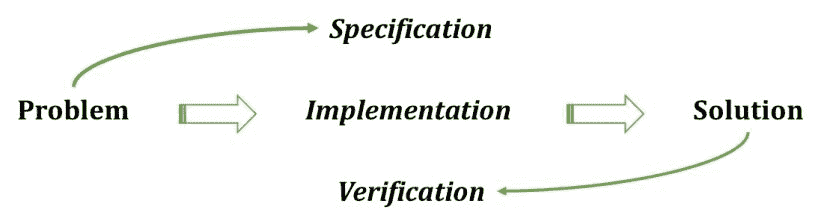
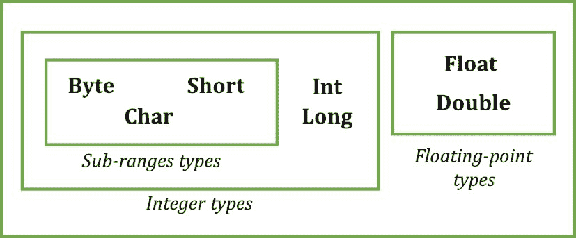
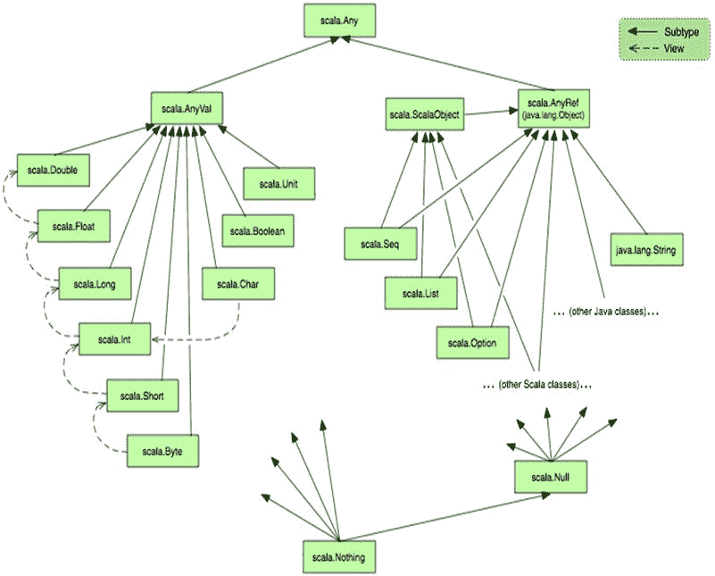
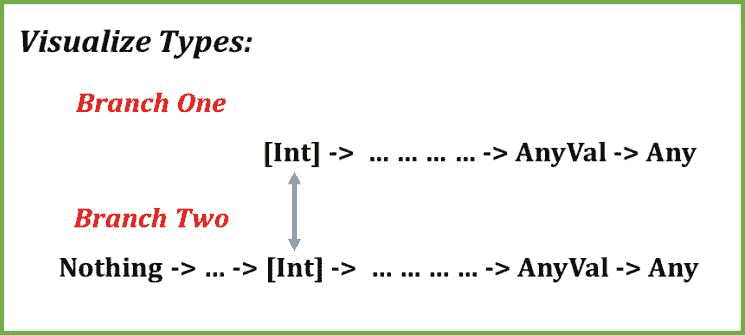
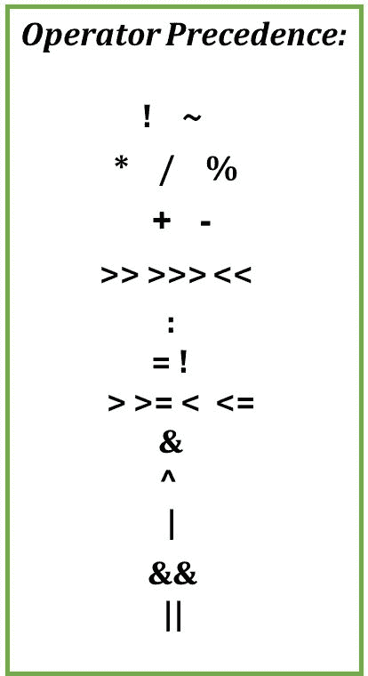
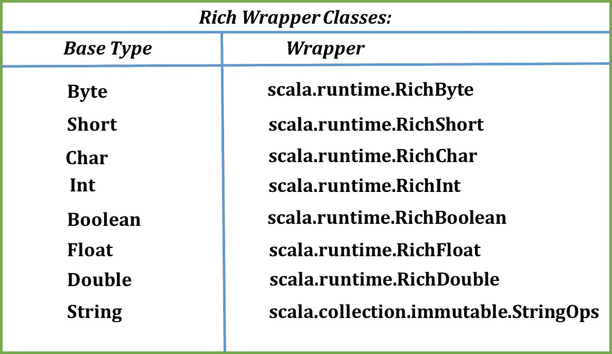
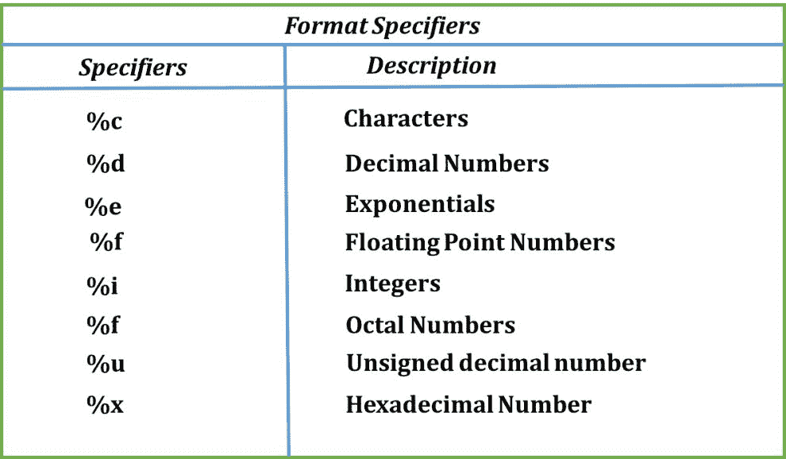

# Scala 的构建块

"你不能在薄弱的基础上建造一座伟大的建筑。如果你想有一个强大的上层结构，你必须有一个坚实的基础。"

- 戈登·B·欣克利

我们作为程序员的目的是通过某种逻辑实现来提供一个问题的解决方案。编程语言正是为此而工作的工具。当我们实现一个问题的解决方案时，我们必须能够描述这个问题（规范），以便编程语言可以验证（验证）该解决方案是否确实解决了问题。



问题解决方案

对于实现，我们使用各种编程结构，这些是具有一些语法规则的基本实体。这些实体作为任何编程语言的构建块。在 Scala 中，我们有与几乎所有其他编程语言相似的语法。我们使用`关键字/名称/分类符/绑定实体`*.* 在本章中，我们的目标是熟悉一些构建块。我们将探讨：

+   `val`和`var`关键字

+   文字面量

+   数据类型

+   类型推断

+   运算符

+   包装类

+   字符串插值

# Scala 程序下面是什么？

Scala 程序是一个嵌套定义的树。一个定义可能以一个关键字、定义的名称、一个分类符开始，如果是具体定义，那么还有一个与该定义绑定的实体。所以语法是规范的，就像任何其他编程语言都有`关键字/名称/分类符/绑定实体`。让我们举一个例子。我们将使用 Scala REPL 来查看一个简单的 Scala 程序是如何构建的。为此，让我们导入一个名为`universe`的 Scala 包：

```java
scala> import scala.reflect.runtime.universe._ 
import scala.reflect.runtime.universe._ 
```

这个`import`子句将`universe`包内的所有定义都纳入作用域。这意味着我们将要使用的所需函数都在作用域内，可供我们使用。然后我们将使用一个`reify`方法，它返回一个`Expr`来从我们的简单 Scala 程序表达式构建`tree`。我们向`reify`方法传递了一个 Scala 类。让我们假装一个 Scala 类封装了一些成员，如名为`segment`的值和一个`name`定义。我们将在后续章节中讨论所有这些成员。现在，让我们执行这一行并查看我们得到的响应：

```java
scala> val expr = reify {class Car {val segment="SUV"; def name="Q7"}} 
expr: reflect.runtime.universe.Expr[Unit] = 
ExprUnit = { 
      super.<init>(); 
      () 
    }; 
    val segment = "SUV"; 
    def name = "Q7" 
  }; 
  () 
}) 
```

上一段代码显示了 Scala 的`reify`方法的响应。它看起来像是外星代码（目前是这样），我们对此一无所知，所以让我们找出对我们有意义的内容。我们知道它使用我们传递的`Car`类来生成一些代码。我们认出这个`Car`类，并且知道它扩展了一个名为`AnyRef`*.* 的结构。我们在 Scala 中定义的每个类都是`AnyRef`的子类，因此我们可以看到解释器已经显示了我们的类定义的显式视图，包括我们定义的修饰符、构造函数和成员。我们将使用`showRaw(expr.tree)`方法来打印树：

```java
scala> showRaw(expr.tree) 
res0: String = Block(List(ClassDef(Modifiers(), TypeName("Car"), List(), Template(List(Ident(TypeName("AnyRef"))), noSelfType, List(DefDef(Modifiers(), termNames.CONSTRUCTOR, List(), List(List()), TypeTree(), Block(List(Apply(Select(Super(This(typeNames.EMPTY), typeNames.EMPTY), termNames.CONSTRUCTOR), List())), Literal(Constant(())))), ValDef(Modifiers(), TermName("segment"), TypeTree(), Literal(Constant("SUV"))), DefDef(Modifiers(), TermName("name"), List(), List(), TypeTree(), Literal(Constant("Q7"))))))), Literal(Constant(()))) 
```

现在，我们将更仔细地查看响应 `res0`*.* 表达式以 `Block` 开头*，*这是一个表示我们定义的类的树。我们的类 `Car` 包含一个名为 `segment` 的值声明和一个名为 `name` 的方法*.* 我们将类表示为树的表示包含我们定义的所有实体。这些共同构成了我们的程序。使用方法 `showRaw(tree)` 获得的树为我们编写的程序的骨架。这个树包含字符串字面量如 `SUV` 和 `Q7`，值定义如 `segment`，以及其他有意义的结构。我们将在本章学习这些字面量和 Scala 中的数据类型的基本知识。

# 值和变量

在编写我们的 Scala 程序时，我们可以使用 `val` 或 `var` 关键字来定义我们的成员字段**。**当我们使用 `val` 关键字将值分配给任何属性时，它就变成了一个值**。**在程序执行过程中不允许更改该值。因此，`val` 声明用于允许将不可变数据绑定到属性。让我们举一个例子：

```java
scala> val a = 10
a: Int = 10
```

这里，我们使用 `val` 关键字和一个名为 `a` 的属性，并给它赋值 `10`。此外，如果我们尝试更改该值，Scala 编译器将给出一个错误，说：`reassignment to val`*:*

```java
scala> a = 12
<console>:12: error: reassignment to val
    a = 12
```

Scala 建议尽可能使用 `val` 以支持不可变性。但如果属性值在程序执行过程中将要改变，我们可以使用 `var` 声明：

```java
scala> var b = 10
b: Int = 10
```

当我们使用 `var` 关键字定义一个属性时，我们可以更改其值。这里的 `var` 关键字代表变量，它可能随时间变化：

```java
scala> b = 12
b: Int = 12
```

如果你仔细观察我们的值声明 `a`，你会发现我们并没有在任何地方提供 *类型* 信息，但 Scala 解释器仍然能够推断出定义的值的类型，在我们的例子中是一个整数。这是因为 Scala 编译器的类型推断特性。我们将在本章后面学习 Scala 的类型推断。Scala 的编译器能够推断出声明的值的类型。因此，取决于程序员是否希望显式地给出类型信息以增强代码的可读性，或者让 Scala 为他/她完成这项工作。在 Scala 中，我们可以在属性名称之后显式地给出类型：

```java
scala> val a: String = "I can be inferred."
a: String = I can be inferred.
```

这与我们在 Java 中声明字段的方式略有不同。首先，我们使用 `val` 或 `var` 关键字，然后给出其类型，然后给出一个字面量值。在这里，它是一个 `String` 字面量。当我们显式地为属性定义类型信息时，我们给出的值应该与指定的类型相符：

```java
scala> val a: Int = "12"
<console>:11: error: type mismatch;
found : String("12")
required: Int
    val a: Int = "12"
```

上述代码对我们不起作用，因为指定的类型是 `Int`，而绑定到我们的属性上的字面量是一个 `String`，正如预期的那样，Scala 抛出了一个类型不匹配*错误*。现在我们知道绑定到我们的属性上的值是一个字面量，我认为我们已经准备好讨论 Scala 中的字面量了。

# 字面量

在之前的讨论中，我们已经看到了字符串字面量和整数。在这里，我们将讨论所有可用的字面量，以及如何在 Scala 中定义它们。如果你来自 Java 背景，那么其中相当一部分对你来说将是相同的：整数、浮点数、布尔、字符和字符串是相似的。除了这些之外，元组和函数字面量可以被视为新学习的内容。所有字面量如下所示：

+   整数字面量

+   浮点字面量

+   布尔字面量

+   字符字面量

+   字符串字面量

+   符号字面量

+   元组字面量

+   函数字面量

我们将逐一讨论它们。让我们从整数字面量开始。

# 整数字面量

数值字面量可以表示为十进制、八进制或十六进制形式。这些是基本整数值，可以是带符号或无符号的。自版本 2.10 起已弃用八进制值，因此如果你尝试使用前导`0`的数值，它将给出编译时错误：

```java
scala> val num = 002
<console>:1: error: Decimal integer literals may not have a leading zero. (Octal syntax is obsolete.)
val num = 002
    ^
```

如果我们使用前缀`0x`或`0X`定义字面量，它将是一个十六进制字面量。此外，Scala 解释器将这些值作为十进制值打印出来。例如：

```java
scala> 0xFF
res0: Int = 255
```

要打印的值被转换为它的十进制等效值，然后打印出来。十六进制字面量可以包含数字（0 到 9）和字母（A 到 F），大小写不敏感。整数字面量进一步分为不同类型，如`Int`、`Long`、`Byte`和`Short`字面量。这些字面量根据值的范围进行划分。以下表格显示了指定类型的最大和最小值：

| **类型** | **最小值** | **最大值** |
| --- | --- | --- |
| `Int` | -2³¹ | 2³¹ - 1 |
| `Long` | -2⁶³ | 2⁶³- 1 |
| `Short` | -2¹⁵ | 2¹⁵ - 1 |
| `Byte` | -2⁷ | 2⁷ - 1 |

如果我们尝试为指定类型定义超出这些范围的任何字面量，编译器将给出一些错误，指出类型不匹配：

```java
scala> val aByte: Byte = 12
aByte: Byte = 12
```

在这里，我们定义了一个带有显式类型信息的普通`Byte`值。如果我们尝试赋予一个超出`Byte`值范围的值，编译器将尝试将该值转换为整数，然后尝试将其分配给属性，但将无法完成：

```java
scala> val aByte: Byte = 123456
<console>:20: error: type mismatch;
found : Int(123456)
required: Byte
    val aByte: Byte = 123456
```

这是因为编译器试图将`Int(123456)`转换后的值分配给`Byte`类型的`aByte`，因此类型不匹配。如果我们不显式使用类型，Scala 本身就足以通过类型推断推断出类型。如果我们尝试分配一个属性，一个不属于任何提到的范围的整数值，会怎样呢？让我们试试：

```java
scala> val outOfRange = 123456789101112131415
<console>:1: error: integer number too large
val outOfRange = 123456789101112131415
```

在这种情况下，Scala 编译器足够聪明，能够感知到情况失控，并给出整数数值过大的错误信息。

要定义`long`字面量，我们在字面量的末尾放置字符`L`或`l`。否则，我们也可以为我们的属性提供类型信息：

```java
scala> val aLong = 909L
aLong: Long = 909

scala> val aLong = 909l
aLong: Long = 909

scala> val anotherLong: Long = 1
anotherLong: Long = 1
```

可以通过明确告诉解释器类型来定义`Byte`和`Short`值：

```java
scala> val aByte : Byte = 1
aByte: Byte = 1

scala> val aShort : Short = 1
aShort: Short = 1
```

# 浮点字面量

浮点字面量包括一个可以位于开头或数字之间的十进制点，但不能位于末尾。我们的意思是，如果你写下以下语句，它将不会工作：

```java
scala> val a = 1\. //Not possible!
```

如果你尝试在 Scala REPL 中这样做，表达式将会继续到下一行。一个快速技巧：如果你在 REPL 中给出两个额外的回车，它将开始一个新的命令。但这就是我们无法在 Scala 中创建浮点数的原因，所以现在让我们看看我们如何定义一个`Double`或`Float`值。默认情况下，Scala 将十进制点值视为`Double`，如果我们不指定它为`Float`：

```java
scala> val aDoubleByDefault = 1.0
aDoubleByDefault: Double = 1.0
```

我们可以像对`Long`字面量那样指定我们的值要为`Float`类型，但有一个不可见的星号。让我们检查一下这个条件：

```java
scala> val aFloat: Float = 1.0 //Compile Error!
scala> val aFloat: Float = 1.0F //Works
scala> val aFloat: Float = 1.0f //Works
```

所有的三个都应该工作并给我们返回`Float`值，但不幸的是，只有后两个返回了`Float`值。第一个将会返回一个类型不匹配的错误，指出你指定的是`Float`类型，而你绑定的是`Double`类型。所以，在 Scala 中，为了指定一个字面量为`Float`类型，我们必须给出后缀`f`或`F`：

```java
scala> val aFloat: Float = 1.0
<console>:11: error: type mismatch;
found : Double(1.0)
required: Float
    val aFloat: Float = 1.0
        ^
```

然后，我们可以选择性地追加`D`或`d`以表示`Double`值，但我们很少这样做。浮点字面量也可以包含指数部分。这将是一个`e`或`E`，后面跟着一个可选的`+`或`-`，然后是一些数字。`E`或`e`表示 10 的幂。所以，一个 3.567e2 的值意味着 3.567 乘以 10²，即 356.7，也就是说，3.567 乘以 100。

# 布尔字面量

这些很简单，它们表示 0 或 1，这意味着 true 或 false。布尔字面量的基本用途是在比较或条件上操作。这两个被称为布尔字面量，不能被 0 或 1 替换：

```java
scala> val aBool: Boolean = 1
<console>:11: error: type mismatch;
found : Int(1)
required: Boolean
    val aBool: Boolean = 1
        ^
```

要定义一个布尔值，我们只需给出`true`或`false`：

```java
scala> val aBool = true
aBool: Boolean = true
scala> val aBool = false
aBool: Boolean = false
```

这就是布尔字面量的全部内容。

# 字符字面量

如果你想要将一些单词和空格分解成单独的字符，你会创建字符字面量。我们用单引号表示字符字面量。任何 Unicode 字符或转义序列都可以表示为字符字面量。顺便问一下，什么是转义序列？以这个`backslash`为例。如果我们尝试这样做：

```java
scala> val aChar = '\'
<console>:1: error: unclosed character literal
val aChar = '\'
```

这将完全不工作，因为这个`\'`是一个转义字符。根据定义，转义序列或字符是在字符串或字符字面量中不表示自身的字符。为了定义这些字符，我们使用这个序列：

```java
scala> val doublequotes = "\""
doublequotes: String = "
scala> val aString = doublequotes + "treatme a string" + doublequotes
aString: String = "treatme a string"
```

在前面的代码中，我们使用我们的`doublequotes`作为字符串`treatme a string`的前缀和后缀，并得到一个响应。

我们在以下表中展示了以下转义序列字符列表：

| **序列** | **值** | **Unicode** |
| --- | --- | --- |
| `\b` | 退格 | `\u0008` |
| `\t` | 水平制表符 | `\u0009` |
| `\r` | 回车符 | `\u000D` |
| `\n` | 换行符 | `\u000A` |
| `\f` | 分页符 | `\u000C` |
| `\"` | 双引号 | `\u0022` |
| `\\` | 反斜杠 | `\u005C` |
| `\'` | 单引号 | `\u0027` |

你也可以使用十六进制代码来表示字符字面量，但我们需要在其前面加上`\u`：

```java
scala> val c = '\u0101'
c: Char = ā
```

# 字符串字面量

到目前为止，我们已经在几个地方使用了`String`字面量。所以在这里，除了对`String`字面量的正式介绍外，我们还将看看 Scala 中的`String`字面量是如何不同的，因为写`String`字面量的方式不止一种。到目前为止，我们已经在双引号内声明了`String`字面量：

```java
scala> val boringString = "I am a String Literal."
boringString: String = I am a String Literal.
```

所以让我们从三引号内的`String`字面量声明开始。听起来很有趣！不是吗？看看这个：

```java
scala> val interestingString = """I am an Interesting String
    | Also span in multiple Lines!
    | Ok, That's it about me"""
interestingString: String =
"I am an Interesting String
```

```java
Also span in multiple Lines!
Ok, That's it about me"
```

看到它后有什么想法吗？三引号引起来的字符串可以跨越多行，因此它们被称为多行字符串字面量。这些也被称为原始字符串，因为如果你在三个引号内尝试给出任何转义字符，这些多行字符串字面量会将它们视为普通字符：

```java
scala> val aString = """ / " ' """
aString: String = " / " ' "
scala> println(aString)

/ " '
```

因此，这些转义字符在多行字符串内部被视为已定义。这可以包含任何字符，甚至是空格。字符串还有很多其他功能，比如字符串插值，我们可以从当前作用域动态地将值分配给字符串。为此，我们使用插值符。我们将在本章稍后进一步研究这些内容。

# 符号字面量

符号有一个名称，它可以定义为单引号（'）后跟字母数字标识符：

```java
scala> val aSymbol = 'givenName
aSymbol: Symbol = 'givenName

scala> aSymbol.name
res10: String = givenName
```

在正常的 Scala 程序中，我们并不经常使用符号。如果我们试图深入了解 Scala 中的符号，我们会知道我们在 Scala 中定义并命名的每一件事都是符号。我们可以检查符号的绝对类型：

```java
scala> import scala.reflect.runtime.universe._
import scala.reflect.runtime.universe._

scala> typeOf[Symbol]
res12:reflect.runtime.universe.Type= scala.reflect.runtime.universe.Symbol
```

所以这个`Symbol`来自 Scala 的反射包。我们不会深入挖掘。如果你好奇的话，我建议你阅读 Scala 文档[`docs.scala-lang.org/overviews/reflection/symbols-trees-types.html`](http://docs.scala-lang.org/overviews/reflection/symbols-trees-types.html)。

所以这就是关于符号字面量的全部内容。

# 元组字面量

元组是 Scala 中的数据类型。我们将在本章后面讨论类型。首先，让我们看看我们如何定义相同类型的字面量：

```java
scala> val aTuple = ("Val1", "Val2", "Val3")
aTuple: (String, String, String) = (Val1,Val2,Val3)
scala> println("Value1 is: " + aTuple._1)
Value1 is: Val1
```

在这里，我们定义了一个`Tuple3`，它接受三个参数，这些参数用括号和逗号分隔。它的类型将是`Tuple3`，就像我们可以用`N`为 1 到 22 来定义`TupleN`一样。让我们仔细看看第一个声明的 REPL 响应：

```java
aTuple: (String, String, String) = (Val1,Val2,Val3)
```

在这里`aTuple`有`Type (String, String, String)`，所以当我们为我们的标识符分配值时，`aTuple` Scala 能够根据我们给出的值构造类型。元组值可以使用特殊下划线语法来访问。在这里，我们使用元组属性名称，以及一个下划线（_），然后是值的索引。在我们的例子中，我们使用`val1`，所以我们给出了*`aTuple._1 value`*。

*有两个元素的元组也称为**对**，可以使用*箭头关联*（`->`）运算符来定义：

```java
scala> val smartPair = 1 -> "One"
smartPair: (Int, String) = (1,One)
```

# 函数字面量

函数字面量是一种表示函数的语法方式。函数的基本结构是能够接受一些参数并返回响应的东西。如果我们必须表示一个接受 `Int` 值并返回 `String` 的函数，它将像这样：

```java
Int => String
```

左边表示输入参数，右边给出响应类型的参数。前置函数字面量的类型是 `Function1[Int, String]`，参数 `Int` 和 `String` 分别代表输入和输出参数。我们将在后续章节讨论函数时进一步讨论这些内容。

我们已经讨论了在 Scala 中字面量的表示方式，现在我们知道了这一点，我们就有了继续进行数据类型学习的先机。

# 数据类型

我们刚刚介绍了 Scala 中的字面量，并且随着这一点，我们几乎涵盖了所有现有数据类型的介绍。我们讨论了如何定义 `Int`、`Long`、`Short` 和 `Byte` 数据类型。除了这些，我们还涵盖了 `Float` 和 `Double` 类型。所有这些统称为数值数据类型。`Byte`、`Short` 和 `Char` 被称为 **子范围类型**。我们还讨论了布尔值、字符和字符串：



数值值类型

在 Java 中，这些数值类型被称为 **原始类型**，然后还有用户定义的类型。但在 Scala 中，这些与原始类型有些相似的类型被称为 **值类型**。这些值类型的对象在底层运行时系统中不是由对象表示的。因此，执行的计算操作是以 `Int` 和其他数值值类型定义的方法的形式进行的。想想看，这意味着我们可以对这些执行方法操作。所以，让我们举一个例子：

```java
scala> val x = 10 //x is an object of Type Int
x: Int = 10  //x is assigned value 10

scala> val y = 16 //y is an object of Type Int
y: Int = 16 //y is assigned value 16

scala> val z = x + y //z is addition of x and y's value
z: Int = 26
```

如您所见，创建了两个名为 `x` 和 `y` 的 Integer 对象，还有一个名为 *`z`* 的对象。结果是 `*z*`，即 `x` 和 `y` 的和。这里的符号 *+* 是 `Int` 对象上的一个方法，这意味着它不仅仅是一个运算符，它是一个为 `Int` 类型定义的方法，并期望一个 `Int` 类型的参数。这将有一个类似的定义：

```java
scala> def +(x: Int): Int = ??? //Some definition
$plus: (x: Int)Int
```

我们从这得到了什么？这意味着这个结构更强大，因为方法看起来更自然，也可以为其他类型编写。这就是为 `Int` 编写的方式。让我们试试：

```java
scala> val aCharAndAnInt = 12 + 'a'
aCharAndAnInt: Int = 109
```

这是因为为字符类型有一个重载的 + 方法。类似于这样：

```java
scala> def +(x: Char): Int = ???
$plus: (x: Char)Int
```

您可以参考类 `Int.scala` 在 [`www.scala-lang.org/api/2.12.0/scala/Int.html`](http://www.scala-lang.org/api/2.12.0/scala/Int.html)，并了解这些方法是如何结构的。我建议您仔细查看这个类的源代码，看看是否有任何特别之处。

# Scala 的类层次结构

让我们讨论 Scala 的类层次结构，以及一些存在的额外类型，例如 Scala 中的底层类型。Scala 有一个统一的类型层次结构，这意味着只有一个顶级类 `Any`，所有其他类型都直接或间接地从这个顶级类型扩展。这也意味着我们定义的任何类或 Scala 中预先存在的类都可以访问顶级类 `Any` 中定义的通用方法。以下图中显示的关系的两种变体是 **子类型** 和 **视图**。前者，*子类型* 描述了两种类型之间的关系，而后者显示了一种类型可以被转换为另一种类型。视图关系用于值类型，其中 `Char` 可以转换为 `Int`。

下面的图显示了 Scala 中类之间的关系：



Scala 类层次结构

# Any

来自 Scala 官方网站关于所有类 *根* 的一个片段：

"*类 *Any 是 Scala 类层次结构的根。在 Scala 执行环境中，每个类都直接或间接地继承自这个类。从 Scala 2.10 开始，可以直接使用通用特质扩展 *Any*。通用特质是一个扩展 *Any* 的特质，只有 *def* 成员，并且不进行初始化。*"

是的，`Any` 是 Scala 中所有现有或定义的类的超类。如果你不知道继承或超类是什么，这里有一个快速示例给你。假设我们为我们的新开店铺的订单管理应用程序定义了一个类型 *Item*。每个 *Item* 都有一些参数，例如 `id`。我们进一步想要对商品进行分类，并提出了几个商品类别，例如 `ElectronicItem` 等。现在，`ElectronicItem` 可以是 `Item` 的子类型，而 `Item` 将被称为 `ElectronicItem` 的超类型，因此它不需要再次声明这三个参数，可以直接使用它们来赋值。看看下面的例子：

```java
import java.util.UUID

class Item {
 val id: UUID = UUID.randomUUID()
 }

class ElectronicItem(val name: String, val subCategory: String) extends Item {
val uuid: String = "Elec_" + id
}

object CartApp extends App {

 def showItem(item: ElectronicItem) = println(s"Item id: ${item.id} uuid: ${item.uuid} name: ${item.name}")

  showItem(new ElectronicItem("Xperia", "Mobiles"))
  showItem(new ElectronicItem("IPhone", "Mobiles"))
 }
```

下面的结果是：

```java
Item id: 16227ef3-2569-42b3-8c5e-b850474da9c4 uuid: Elec_16227ef3-2569-42b3-8c5e-b850474da9c4 name: Xperia

Item id: 1ea8b6af-9cf0-4f38-aefb-cd312619a9d3 uuid: Elec_1ea8b6af-9cf0-4f38-aefb-cd312619a9d3 name: IPhone
```

这个例子展示了我们用继承想要表达的内容。"`ElectronicItem` 函数扩展 `Item`" 意味着 "每个 `ElectronicItem` 都是一个项目。"这就是为什么我们能够从一个 `ElectronicItem` 实例中引用 ID、UUID 和名称。我们已经使用了 `import` 语句将 UUID 类型引入我们的编译单元的作用域，所以当我们使用 UUID 时，它不应该在编译时产生错误。

现在，正如我们讨论的那样，每个类都是 `Any` 的子类。因此，我们可以访问 `Any` 的所有非私有成员。如 *`!=`、`==`、`asInstanceOf`、`equals`、`isInstanceOf`*、`toString` 和 `hashCode` 等方法都在 `Any` 类中定义。这些是以以下形式存在的：

```java
final def  !=  (that: Any): Boolean 
final def  ==  (that: Any): Boolean
def isInstanceOf[a]: Boolean
def equals(that: Any): Boolean
def ##: Int
def hashCode: Int
def toString: String
```

并且是的！你可以覆盖这些非最终方法，这意味着你可以有自己的定义。

# AnyVal 和 AnyRef

`AnyVal` 和 `AnyRef` 都是根类 `Any` 的两个子类。这两个代表了 Scala 中的两种类型家族：前者是对象引用，后者是值类。

# AnyRef

`AnyRef`类代表在底层运行时系统中可以表示为对象的全部值。它包括所有明确不继承自`AnyVal`的用户定义类。一些标准引用类包括`String`、`Tuple`、`Function`和`Array`。Scala 编译器要么为它们提供语法糖，要么在编译时生成特殊代码以执行它们的操作。我们已经看到了一些语法糖，例如`Tuple2`，它可以表示为`(A, B)`，其中 A 和 B 是类型参数。这种`Tuple2`的应用形式可以是(`String`和`Int`)。在 Scala 中，我们将其表示为`Tuple2[String, Int]`。

# AnyVal

后者，`AnyVal`，代表在底层运行时系统中未实现为对象的值。Scala 有一些预定义的数值和非数值值类，如类层次结构所示。

可以定义用户自定义的值类型，但需要满足一些条件。记得我让你仔细查看`Int.scala`文件源码吗？你可能已经注意到，在扩展`AnyVal`*.*的`Int`类中没有`val`或`var`声明。这是定义`AnyVal`*.*子类型的一个约束。你可能考虑定义`AnyVal`类型的原因之一是避免在运行时进行对象实例化。一些约束包括：

+   它必须有一个单一的`val`参数作为底层表示。这意味着如果你声明`class Num(val underlying: Int) extends AnyVal`***，***那么它的编译时表示将是`Num`类型，但在运行时它将被转换为`Int`，并且定义在其中的方法将被用作静态方法。

+   它必须只定义`def`，不能有`val`、`var`、嵌套类、特质或对象。

+   它只能扩展通用特质，即只扩展超类型*Any*的特质。

+   它不能用于模式匹配或类型测试。

Scala 的`AnyVal`实现包括九种实现。其中，`Byte`、`Short`、`Int`、`Long`、`Char`、`Float`和`Double`是数值值类型，而`Boolean`和`Unit`是非数值类型。

# Unit

Scala 的`Unit`是`AnyVal`的子类型，其实现包含一个`equals`方法，如果传入的参数也是一个`Unit`（即一个值`()`），则返回 true 值，否则返回 false。其他方法包括`hashCode`和`toString`，分别返回实现特定的哈希码和`()`，因为`Unit`只有一个值：`()`，这与 Java 的`void`类型等价。

# Boolean

布尔值代表两个值：`true`和`false`。正如预期的那样，它实现了布尔算术方法，如`and`、`or`、`strict and`、`strict or`、`equality`、`inequality`和`negation`，分别以`&&`、`||`、`&`、`|`、`==`、`!=`和`unary_`!的形式。布尔值还实现了来自`Any`类的`equals`、`hashCode`和`toString`方法。

等于方法检查参数评估并返回其结果，而`hashCode`方法则返回基于值`true`或`false`的固定实现特定哈希码。

# Null 和 Nothing

在 Scala 中，Null 和 Nothing 被称为**底类型**。为什么我们需要这些底类型呢？看看以下代码片段：

```java
def checkIF10AndReturn20(x: Int): Int =  {
  if(x == 10)
    x * 2
  else 
    throw new Exception("Sorry, Value wasn't 10")
 }
```

方法`checkIf10AndReturn20`期望返回`Int`类型的值，但这里发生的情况不同。如果传递的参数值不是 10，我们会抛出异常，然而编译器对我们的代码仍然满意。这是怎么可能的？

这是因为类型推断。它总是在`if`语句的两个分支中寻找公共类型，所以如果在另一个分支中，类型扩展了一切，那么推断的类型将自动是第一个。在 Scala 中，`Nothing`是所有类型的子类型，因此推断的类型自动变为`Int`类型。让我们可视化这个：



可视化推断的类型

因此，了解类型推断在 Scala 生态系统中的重要作用是很重要的。

# 类型推断

我们可以将类型推断称为 Scala 的一个内置功能，允许我们在编写代码时省略类型信息。这意味着我们不需要在声明任何变量时指定类型；Scala 编译器会为我们完成：

```java
scala> val treatMeAString = "Invisible"
treatMeAString: String = Invisible
```

我们没有指定`val`的类型为`String`，但看到`Invisible`的值后，Scala 编译器能够推断其类型。此外，在某些约束下，我们还可以省略方法的返回类型：

```java
defcheckMeImaString(x: Boolean) = if(x) "True"else "False"
```

在这里我们没有指定返回类型，因为 Scala 编译器能够推断其类型。但对于递归方法，这不起作用。著名的阶乘方法期望你在实现递归时指定返回类型：

```java
def recursiveFactorial(n: Int) = if(n == 0) 1 else recursiveFactorial(n-1) 
//Recursive method recursiveFactorial needs result type
```

Scala 使用基于约束的算法来实现类型推断。这意味着 Scala 编译器试图推断约束，然后尝试统一类型。我们正在谈论**约束**，那么它们是什么呢？约束是关于表达式类型的陈述。即使它不是一个表达式，例如，当我们将值绑定到变量时，我们也必须推断它们的类型。但首先考虑一下我们能从表达式类型中推断出什么：

+   如果它与某些标识符的类型相关

+   如果它与某些其他表达式的类型相关

+   如果它是一个基本类型，例如数字和布尔值

+   如果它是一个构造类型，例如一个函数，其域和范围类型进一步受到约束

Scala 编译器使用这种方法来推断约束，然后应用统一（解释超出了本书的范围）来推断类型。在无法从表达式提取任何语句的情况下，推断类型是不可能的：

```java
scala> val x = x => x
<console>:11: error: missing parameter type
       val x = x => x
```

由于仅类型推断，我们能够使用*语法糖*来处理不需要指定类型的情况：

```java
scala> List(1,4,6,7,9).filter(_+1 > 5)
res0: List[Int] = List(6, 7, 9)
```

激动人心的，不是吗？这种方式，我们用更少的类型信息简单地执行了逻辑。这里使用的下划线（`_`）是语法糖，并且由于类型推断，这里可以使用。

我们将继续我们的良好工作，学习如何实现这一点，使用所有这些类型执行操作，并加强我们的基础知识。

# Scala 中的运算符

根据我们使用它们的方式，Scala 运算符可以分为三种类型：

+   中缀运算符

+   前缀运算符

+   后缀运算符

我们使用运算符在操作数上执行某些操作，这是显而易见的，而我们实现的方式使它们成为中缀、前缀或后缀。一个基本的中缀运算符示例是加法`+`：

```java
scala> val x = 1 + 10
x: Int = 11
```

我们有两个操作数（1 和 10）在这个加法运算上执行。我们已经讨论过，*运算符是方法*。这意味着某种方式，操作是以`1.+(10)`的形式执行的，而`1 + 10`只是我们如何书写它的语法糖。这是因为加法方法为给定的类型定义了。在这里，在我们的例子中，加法（+）方法为`Int`*.* 除此之外，还有几个重载方法的版本，支持其他数值类型。这意味着我们可以传递任何其他类型，只要该方法的重载版本存在，它就会执行正常的加法运算：

```java
scala> val y = 1 + 'a'
y: Int = 98
```

这里，调用了方法`def+(arg: Char): Int`并返回了一个`Int`。想想看，如果这些方法不是原生的 Scala 运算符而是方法，那么我们也可以创建类似这些作为运算符工作的方法。这让你感觉很有力量。让我们试试这个：

```java
class Amount(val amt: Double) {

  def taxApplied(tax: Double) = this.amt * tax/100 + this.amt

 }

object Order extends App {
  val tax = 10
  val firstOrderAmount = 130

  def amountAfterTax(amount: Amount) = amount taxApplied tax

  println(s"Total Amount for order:: ${amountAfterTax(new Amount(firstOrderAmount))}")
 }
```

以下结果是：

```java
Total Amount for order:: 143.0
```

太棒了！`taxApplied`是我们定义的第一个运算符，它针对的类型是`Amount`*.* 我们程序中有一个名为`Amount`的类，它只是一个`Double`值，并定义了一个名为`taxApplied`*.* 这个方法期望一个用于应用在`this`上的`tax`双精度值，`this`将是金额的当前值。运算符是我们使用方法的一种方式，这就是为什么我们有这个运算符。我们在`Order`对象中定义函数`amountAfterTax`*:* 时使用了它：

```java
> amount taxApplied tax
```

它也可以写成`amount.taxApplied(tax)`*.* 在 Scala 中也有一些例子；例如，在`String`上工作的`indexOf`运算符*:* 

```java
scala> val firstString = "I am a String"
firstString: String = I am a String

scala> firstString indexOf 'a'
res1: Int = 2
```

我们已经讨论了*中缀*运算符，其中运算符位于两个操作数之间。现在让我们看看另一种使用运算符的方式，那就是*前缀*和*后缀*。第一个，*前缀*运算符位于操作数之前。这些运算符的例子有`-`、`!`等等：

```java
scala> def truthTeller(lie: Boolean) = !lie
truthTeller: (lie: Boolean)Boolean

scala> truthTeller(false)
res2: Boolean = true
```

这里，`!lie`*:* 使用了前缀运算符`!`，这是我们放置操作数在运算符右侧的方式。但这是作为一个方法调用的。在后台发生的事情是 Scala 使用`unary_`来调用这些运算符，这是显而易见的，因为这些运算符只使用一个操作数。所以我们的实现看起来像以下这样：

```java
scala> def truthTeller(lie: Boolean) = lie.unary_!
truthTeller: (lie: Boolean)Boolean
```

运算符 `!` 是为布尔类型定义的，因此我们可以在布尔类型上调用。另一种方式是操作数位于左侧，称为 *后缀* 运算符。这些运算符的例子包括转换器，如 `toLowerCase`，`toInt`，`toString` 等：

```java
scala> 1.toString
res4: String = 1

scala> "1".toInt
res5: Int = 1

scala> "ABC".toLowerCase
res7: String = abc
```

这意味着这些运算符是在相应的类型中定义为方法的。这是在 Scala 中对运算符进行分类的一种方式。现在我们将快速查看根据它们在编程语言中使用时的上下文对运算符类型进行分类。这些基本上被分类为：

+   算术运算符

+   关系运算符

+   逻辑运算符

+   位运算符

# 算术运算符

我们可以使用算术运算符进行算术运算。算术运算符包括加法 (+)，减法 (-)，乘法 (*)，除法 (/)，和取余 (%)。我们已经看到了很多加法的例子，不提这些运算符也是方法！

让我们看看其他例子：

```java
scala> val x = 10 - 1
x: Int = 9

scala> val y = 10 * 1
y: Int = 10

scala> val z = 10 / 1
z: Int = 10

scala> val yx = 10 % 9
yx: Int = 1
```

这些运算符也有它们重载的版本定义，为了看到我们可以用不同的类型作为操作数。让我们拿一个 `Int` 和一个 `Double`：

```java
scala> val yx = 10 % 9.0
yx: Double = 1.0
```

这里，第一个操作数是 `Int` 类型，第二个操作数是 `Double` 类型，由于 `Int` 类型可以看作是 `Double` 类型的子集，所以结果会被转换为 `Double` 类型。

# 关系运算符

关系运算符用于比较两个操作数。我们有相当多的这些，==，!=，>，<，>= 和 <=。让我们试试：

```java
scala> val equal_op = 10 == 10
equal_op: Boolean = true

scala> val not_eq_op = 10 != 10
not_eq_op: Boolean = false

scala> val gt_than_op = 10 > 10
gt_than_op: Boolean = false

scala> val gt_than_op = 11 > 10
gt_than_op: Boolean = true

scala> val lt_than_op = 11 < 10
lt_than_op: Boolean = false

scala> val gt_eq_op = 11 >= 11
gt_eq_op: Boolean = true

scala> val lt_eq_op = 11 <= 11
lt_eq_op: Boolean = true
```

使用这些运算符，我们比较两个操作数的值，这些操作会得到一个布尔结果。

# 逻辑运算符

逻辑运算符包括 `!`（非），`&&`（与），和 `||`（或），显然我们使用这些来对操作数执行逻辑运算。这些方法是为布尔类型编写的，因此它们期望布尔类型的操作数：

```java
scala> val log_not = !true
log_not: Boolean = false

scala> val log_or = true || false
log_or: Boolean = true

scala> val log_and = true && true
log_and: Boolean = true
```

逻辑与和或都是短路运算符。这意味着这些运算符只会在结果未确定时进行评估。在 Scala 中，即使运算符是方法，也可以实现这一点，因为函数调用有一个名为 *按名参数* 的特性。它允许我们通过名称传递参数，这些参数在方法调用时需要时才会进行评估。

# 位运算符

我们可以使用位运算符对整型类型的单个位进行操作。这些包括位与 (&)，位或 (|)，和位异或 (^)：

```java
scala> 1 & 2
res2: Int = 0

scala> 1 | 2
res3: Int = 3

scala> 1 ^ 2
res5: Int = 3
```

这些运算符只能在 `Int` 上执行。如果你在 `Double` 上尝试这样做，将会抛出一个错误：*value & 不是 Double 的成员.* 这些运算符对单个位执行操作；在我们的例子中，1 被转换为位 01，2 被转换为位 10，然后执行 AND，OR 和 XOR 操作：

+   0001 AND 0010 结果为 00 表示 0

+   0001 OR 0010 结果为 11 表示 3

+   0001 XOR 0010 结果为 11 表示 3

我们可以使用 `~` 运算符执行逻辑非操作：

```java
scala> ~2
res8: Int = -3
```

对于`Int`类型，还有三种名为*右移(>>), 左移(<<)和无符号右移(>>>)*的位移方法。这些是作用于两个操作数的二进制运算符。操作数左侧的位根据值向右移动。

# 运算符优先级

如果没有评估这些运算符的规则，像*2 + 3 * 4 / 2 - 1*这样的运算可能会得到不同的结果。因此，我们有一些基于优先级的规则。我们将在本部分讨论它：

```java
scala> 2 + 3 * 4 / 2 - 1
res15: Int = 7
```

为了参考目的，我们有了前面的表达式。评估返回结果*`7`。它是如何做到的？

表达式*(2 + ((3 * 4) / 2))) - 1*将被按以下步骤评估：

1.  *(2 + (12 / 2)) - 1*

1.  *(2 + 6) - 1*

1.  *8 - 1*

1.  *7*

它基于运算符优先级。顺序如下：



运算符优先级

如前图所示，Scala 运算符表达式是根据显示的优先级评估的。根据图示，*****, **/**, 和 **%** 具有最高优先级，然后是 **+** 和 **-**。

其他运算符也遵循相同的优先级。如果相同优先级级别的运算符一起出现，则从左到右评估操作数。这意味着表达式`1 + 2 + 3 * 3 * 4 - 1`的结果将是`38`：

```java
scala> 1 + 2 + 3 * 3 * 4 - 1
res16: Int = 38
```

表达式*(1 + 2) + ((3 * 3) * 4) - 1*将被按以下步骤评估：

1.  *1 + 2 + 9 * 4 - 1*

1.  *1 + 2 + 36 - 1*

1.  *3 + 36 - 1*

1.  *39 - 1*

1.  *38*

这为 Scala 中表达式的评估提供了清晰性。

# 包装类

在 Scala 中，我们可以创建自己的宇宙，除了提供的原生方法外，我们还可以添加自己的实现，这些我们称之为*富包装*类。这是由于*隐式转换*的可能。首先，我们将列出一些已经可用的*包装*类：



富包装

要了解它是如何发生的，让我们看一个例子：

```java
scala> val x = 10
x: Int = 10

scala> x.isValidByte
res1: Boolean = true
```

前面的表达式试图检查`x`的值是否可以转换为`Byte`，并检查其是否在`Byte`的范围内，并发现它是`true`：

```java
scala> val x = 260
x: Int = 260

scala> x.isValidByte
res2: Boolean = false

scala> val x = 127
x: Int = 127

scala> x.isValidByte
res3: Boolean = true
```

如你所知，`Byte`的范围是-128 到 127。如果你尝试将其分配给超出`Byte`范围的值，并期望它像`Byte`一样行为，它将不起作用。因此，前面表达式的结果是`false`。

除了这个`isValidByte`之外，类`RichByte`包装类中还有许多实用方法。

这些包装方法看起来像是为现有类型原生定义的。其中一个例子是围绕`String`的包装，即`StringOps`。在 Scala 中，`String`不过是一个`java.lang.String`的实例，所以很明显，为`java.lang.String`实现的所有方法在这里也同样适用。例如，`charAt`方法在这里表现得相当不错：

```java
scala> val x = "I am a String"
x: String = I am a String
scala> x.charAt(5)
res13: Char = a
```

现在让我们尝试一些`StringOps`的方法：

```java
scala> x.capitalize
res14: String = I am a String

scala> x.toUpperCase
res15: String = I AM A STRING

scala> x.toLowerCase
res16: String = i am a string
```

`capitalize`*、`toUpperCase`* 和 `toLowerCase` 这三个方法定义在 `StringOps` 类中，而不是 `String` 类中，但它们仍然以相同的方式工作，就像调用 `String` 类型的本地方法一样。还有更多这样的方法，它们作为 `String` 的实用方法工作。这是因为 *隐式转换* 的力量。我们将在后面的章节中学习 Scala 中的 *隐式* 如何工作。

从 `Int` 类型创建 `Range` 类的一种方法可以通过使用一个 *方法* 实现。我们称这些为 **丰富的方法**。使用它们非常简单，根据它们解决的问题，我们也可以给它们命名：

```java
scala> val rangeOfNumbers = 1 to 199
rangeOfNumbers: scala.collection.immutable.Range.Inclusive = Range 1 to 199

scala> val rangeOfNumbersUntil = 1 until 199
rangeOfNumbersUntil: scala.collection.immutable.Range = Range 1 until 199

scala> rangeOfNumbers contains 1
res17: Boolean = true

scala> rangeOfNumbersUntil contains 1
res18: Boolean = true

scala> rangeOfNumbersUntil contains 199
res19: Boolean = false

scala> rangeOfNumbers contains 199
res20: Boolean = true
```

以下是一些来自 `Range` 类的方法的例子，它们为 `Int` 提供了创建 `Range` 的丰富方法。`Range` 可以包含这些值，也可以构建时包含或排除这些值。构建这些值的函数是 `to` 和 `until`*.* 第一个包含我们用于构建 `Range` 的两个值；后者只包含起始值。我们已经尝试了所有这些。如您所见，`rangeOfNumbersUntil` 不包含 `199`。我们也可以创建具有某些 `step` 差别的 `Range`：

```java
scala> 1 to 10 by 2 foreach println
```

以下结果是：

```java
1
3
5
7
9
```

这很简单；既简单又漂亮。特别是由于后端发生的 *隐式转换* 和 *类型推断*，我们能够以简洁的语法编写。Scala 编译器正在处理所有这些部分，让我们只需以美观的方式编写代码。在编写字符串时利用简洁性的另一种方法是使用字符串插值器。

# 字符串插值器

我们已经使用了字符串插值器，当它们可用时很难避免使用它们。记得我们什么时候使用过它们吗？是的！当我们学习自己创建运算符时：

```java
println(s"Total Amount for order:: ${amountAfterTax(new Amount(firstOrderAmount))}")
```

这里的 `s` 是一个字符串插值器。在使用这些插值器时，我们在 `String` 前面加上一个名为 `s` 的字符，并在字符串的双引号内可以使用任何带有 `$` 的变量，它将被其值替换：

```java
scala> val myAge = s"I completed my $age."
myAge: String = I completed my 25.
```

这是我们如何使用插值器的例子。`s` 并不是 Scala 中唯一的插值器。我们还有一些其他的插值器。我们将逐一介绍它们。

+   `s` 插值器

+   `f` 插值器

+   `raw` 插值器

# `s` 插值器

首先，我们将查看 `s` 插值器。我们已经看到了如何使用变量创建处理过的字符串。现在，让我们举一个使用表达式的例子：

```java
scala> val nextYearAge = s"Next Year, I'll complete ${age + 1}."
nextYearAge: String = Next Year, I'll complete 26.
```

在这里，我们使用了 `${...}`，其中 `$` 符号后面跟着一对花括号 {<expression>}，包含要评估的表达式。它可以是一个任何表达式。就像我们刚才做的算术运算，或者方法调用：

```java
scala> def incrementBy1(x: Int) = x + 1
incrementBy1: (x: Int)Int

scala> val nextYearAge = s"Next Year, I'll complete ${incrementBy1(age)}."
nextYearAge: String = Next Year, I'll complete 26.
```

在这里，我们定义了一个名为 `incrementBy1` 的方法，该方法将任何传入的 `Int` 增加 1 并返回结果。我们已经从我们的插值器中调用了该方法。顺便说一下，了解我们的插值器 `s` 就像 Scala 中的任何其他运算符一样是一个方法。我们在 Scala 中可以创建自己的插值器。

# f 插值器

要在 Scala 中实现类似于`printf`样式的格式化，我们可以使用`f`插值器。我们这样做是通过在字符串的双引号前使用一个`f`，然后在字符串内部我们可以使用一个格式说明符：

```java
scala> val amount = 100
amount: Int = 100
scala> val firstOrderAmount = f"Your total amount is: $amount%.2f"
firstOrderAmount: String = Your total amount is: 100.00
```

从前面的例子中可以看出，我们使用`f`作为字符串的前缀，并使用`$`后跟包含格式说明符的表达式。这作为我们的字符串格式化器工作。

一些格式说明符如下所示：



格式说明符

# 原始插值器

Scala 中预存的最终插值器之一是`raw`插值器。这个插值器不允许你在字符串中使用任何转义序列字符，这意味着如果你尝试给出一个转义序列字符，它将被视为一个普通字面量，不再有其他作用。我们编写`raw`插值器的方式几乎与其他两个插值器相似。我们在字符串前加上一个`raw`关键字，它就会为我们工作：

```java
scala> val rawString = raw"I have no escape \n character in the String \n "
rawString: String = "I have no escape \n character in the String \n "
```

在这里，字符串中的转义字符`\n`被视为一个普通字面量，在生成的字符串中保持不变。在一个普通字符串中，`\n`会转换成*换行*字符。

```java
scala> val rawString = "I have no escape \n character in the String \n "
rawString: String =
"I have no escape
character in the String
"
```

使用这个原始插值器，我们可以避免转义序列。这些结构为我们提供了一种更高效、更简洁地编写代码的方法。

# 概述

因此，让我们总结一下在本章中学到的内容。我们从最基本的`val`和`var`变量结构开始。然后，我们学习了如何编写字面量，以及 Scala 中有哪些数据类型。接着，我们研究了 Scala 中有趣的类层次结构，其中我们讨论了统一类层次结构和值类型和引用类型类。后来，我们学习了 Scala 中类型推断最重要的概念之一。之后，我们开始学习运算符及其优先级。我们学习了包装类如何为我们程序员提供所有丰富的功能。最后，我们学习了一种简单但实用的方法，即使用插值器处理我们的字符串字面量。现在，很明显，通过练习我们所学到的所有这些结构，我们将准备好进一步学习一些逻辑和循环结构，这些结构塑造了我们的程序。

在下一章中，我们将讨论 Scala 中的一些循环结构、逻辑结构，以及模式匹配的介绍和如何使用模式匹配和启用程序流程控制来加强我们的程序在逻辑基础上的能力。
