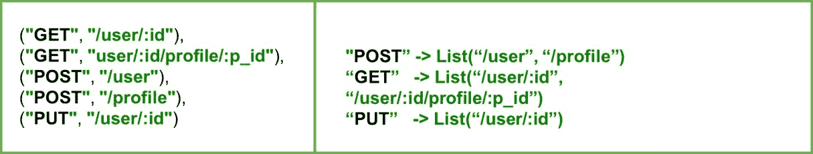
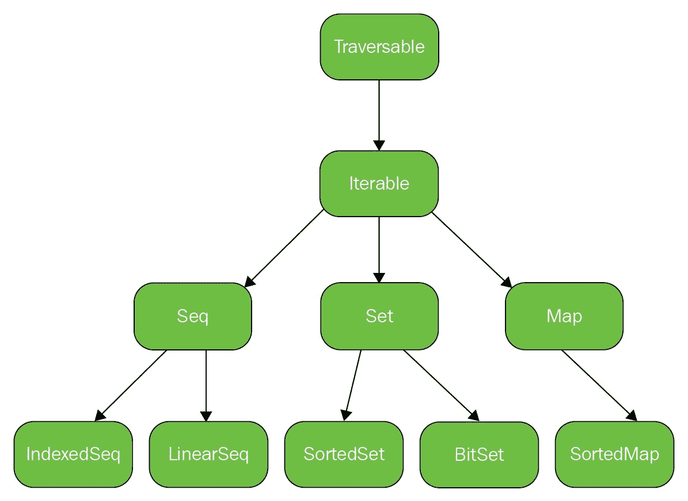
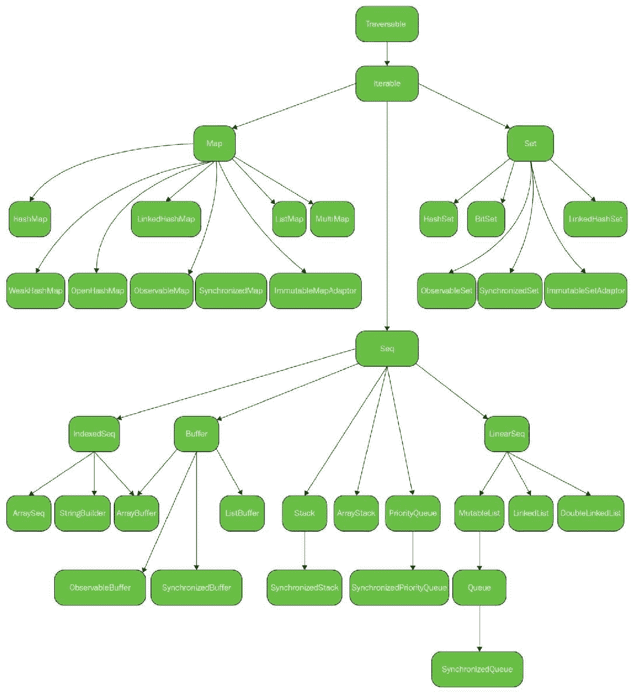
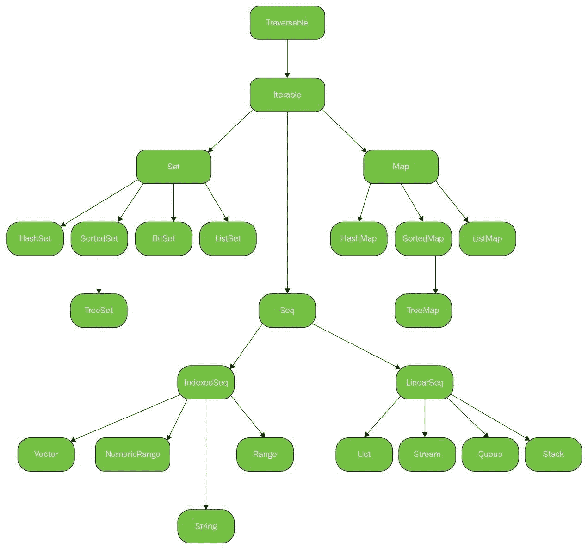
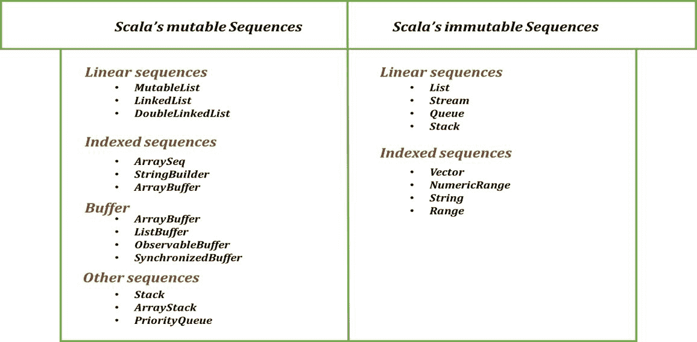
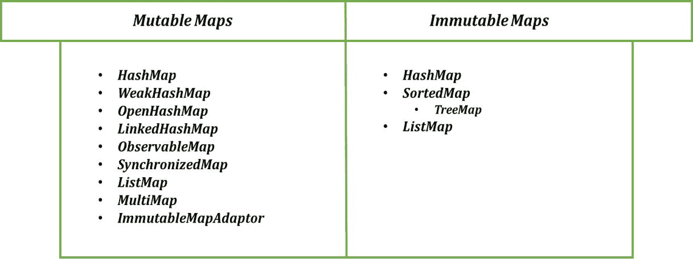
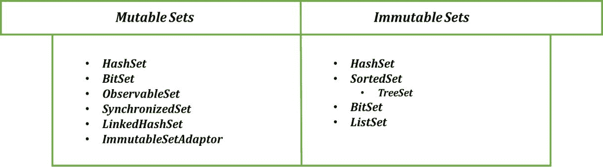
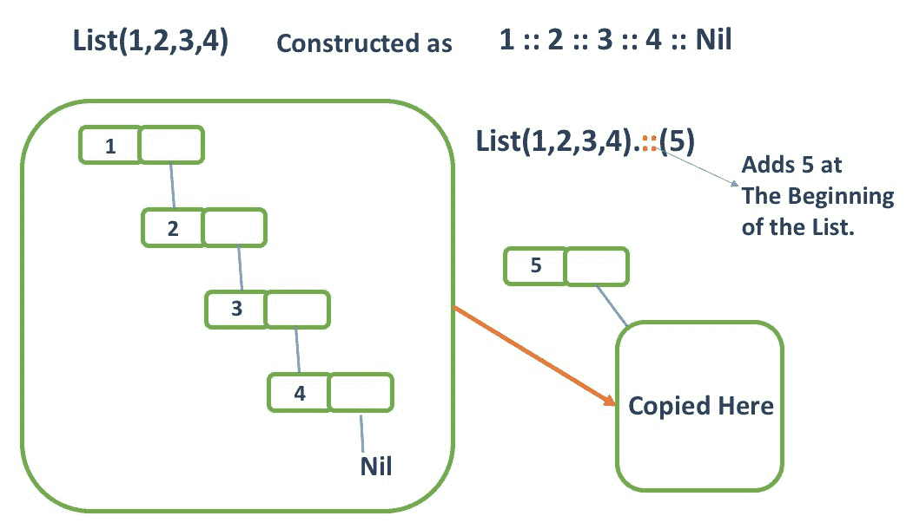

# 熟悉 Scala 集合

"你编写的代码应该吸收更多的意义，而不会变得臃肿或失去可理解性。"

- 匿名

在任何编程语言中，一个基本要求是能够处理一组数据，换句话说，一组数据集合。如果你使用过任何编程语言，你肯定已经知道其集合框架的重要性。Scala 拥有丰富的集合；一组丰富的辅助函数使得处理任何 Scala 集合变得容易得多。在本章中，我们将介绍 Scala 集合的所有基本知识。我们将能够区分几种集合选项，并有效地使用所有集合。在这个过程中，我们将学习：

+   不可变和可变 Scala 集合

+   Scala 的集合层次结构

+   Scala 中常用的集合

+   在集合上执行丰富操作

+   并行集合

+   从 Java 到 Scala 集合的转换

+   选择一个集合

+   集合性能

# 动机

在我们开始学习 Scala 中的不可变和可变集合之前，我们将尝试使用 Scala 集合提供的强大方法解决一个简单的问题。为此，让我们看看一个场景：



RESTful API

如前图所示，我们有一组具有`GET`、`POST`和`PUT`等方法类型以及相关 URI 的 API。由于这些是两个实体（方法和 URI），将这些视为元组的列表。现在我们想要将它们分开，以便我们可以创建一个映射，如前图右侧所示。映射是一种存储键值对的集合。因此，在右侧你可以看到 API 信息作为键值对，其中键是方法名称，值是该特定请求类型的 URI 列表。所以，想法是将`List[(String, String)]`转换为`Map[String, List[String]]`*。你可能想要考虑解决方案，并提出你自己的。

同时，让我们看看 Scala 是否以任何方式帮助我们解决我们的问题：

```java
object RESTFulAPIs extends App { 
    //List of Method and URI 
    val listOfAPIs = List(("GET", "/user/:id"), 
                          ("GET", "user/:id/profile/:p_id"), 
                          ("POST", "/user"), 
                          ("POST", "/profile"), 
                          ("PUT", "/user/:id")) 

    /* 
     * Returns a scala.collection.immutable.Map[String,  List[(String,String)]] 
     */ 
    val groupedListOfAPIs = listOfAPIs.groupBy(_._1) 
    println(s"APIs grouped to a Map :: $groupedListOfAPIs") 

    /* 
     * Returns a scala.collection.immutable.Map[String, List[String]] 
     */ 
    val apisByMethod = groupedListOfAPIs.mapValues(_.map(_._2)) 
    println(s"APIs By Method :: $apisByMethod") 
} 
```

这是结果：

```java
APIs grouped to a Map :: Map(POST -> List((POST,/user), (POST,/profile)), GET -> List((GET,/user/:id), (GET,user/:id/profile/:p_id)), PUT -> List((PUT,/user/:id))) 
APIs By Method :: Map(POST -> List(/user, /profile), GET -> List(/user/:id, user/:id/profile/:p_id), PUT -> List(/user/:id)) 
```

如果你已经想出一组`for`循环或递归方法来完成可以用单一方法完成的事情，你可能需要重新思考，或者看看我们这里提供的解决方案。在这里，我们使用了两个满足我们目的的实用方法。第一个是定义在`TraversableLike`特质中的`groupBy`*，它将我们的`List[(String, String)]`转换为按元组的第一个元素（方法名称）分组的`Map[String, List[String]]`。这个`groupBy`操作给我们带来了以下内容：

```java
Map(POST -> List((POST,/user), (POST,/profile)), GET -> List((GET,/user/:id), (GET,user/:id/profile/:p_id)), PUT -> List((PUT,/user/:id))) 
```

后者是来自`MapLike`特质的`mapValues`方法，它用于将给定的映射包装在相同的键上。每个键的值简单地是`f(this(key))`：

```java
def mapValuesW: Map[K, W] 
```

这两种方法足以提供解决方案，并帮助我们避免使用循环进行多次遍历。这只是其中一个例子，仅用几行代码就能完成原本可能需要几行代码才能完成的工作。这确实使 Scala 集合变得强大。Scala 的集合框架易于使用；大多数辅助方法都是通用的，只有少数例外。此外，性能上没有妥协；这些是经过性能优化的方法。人们可以依赖这些方法来完成任何逻辑；这使得你的代码看起来更美观。但不仅如此，这只是开始。通常，集合容易编写出针对当前环境的代码。这通常使得调试出错变得困难，特别是在有可变集合的情况下。因此，为了消除这种复杂性，Scala 提供了这些不可变数据集合。一旦创建，不可变集合就不能更新。但它们是如何工作的，与可变集合有何不同？让我们逐一了解。

# 不可变和可变集合

集合用于存储程序在将来某个时间点使用的数据。在多线程环境中，如果多个线程同时尝试访问一个集合，这可能会让你在调试出错时遇到困难。这是程序员在多线程环境中处理集合时通常会遇到的问题。但有一个通用的解决方案，它期望你使用不可变集合。不可变意味着你不能改变/修改它。Scala 提供了选择选项：`root`、`mutable`和`immutable`集合。这三个变体存在于三个不同的包中：`scala.collection`、`scala.collection.mutable`和`scala.collection.immutable`。如果你没有指定集合而使用了一个，它将默认为不可变集合。但它们究竟是如何工作的呢？让我们来看看：

```java
scala> val studentsPresent = List("Alex", "Bob", "Chris") 

studentsPresent: List[String] = List(Alex, Bob, Chris) 
```

一个不允许我们更新或删除其元素的集合几乎没有什么用处。那么，我们为什么说这些是丰富的集合呢？原因在于，尽管这些集合是不可变的，但仍然有方法可以添加和删除元素，但这些操作会返回一个新的集合。我们将在本章后面看到这些集合是如何构建的，以及添加一个元素是如何影响集合的；但就目前而言，重要的是要知道不可变集合是可以更新的，尽管这样做会返回另一个包含相同元素集的集合，以及更新后的集合。

另一方面，我们有可变集合，它们的工作方式与大多数面向对象编程语言相似。你可以用几个元素声明并实例化一个集合。然后，根据后续的任何要求，你可以更改其元素，或者删除它们。使用这些可变集合，Scala 为你选择要与之一起工作的集合时提供了一个选择。当你使用可变集合时，你会得到一组额外的用于更改集合的方法。不过，请确保你可能会更改集合的实例。这样，你的程序将不会出现可变性复杂性。

第三种变体，根集合，位于`scala.collection`包中*.* 当你使用根集合时，它可以是可变的或不可变的。这意味着什么？这意味着特定的集合是位于`scala.collection.mutable`和`scala.collection.immutable`包中的同一家族集合的超类。为了理解我们刚才说的，请看以下方法：

```java
def afunction(xs: scala.collection.Iterable[String]) = ??? 
```

`afunction`函数可以接受可变和不可变集合，只要它们是可迭代的，这是 Scala 集合层次结构中可用的特性之一*.*

有一些额外的允许你更改集合的方法，正如我们可能预期的，这些方法仅定义在`scala.collection.mutable`包中的集合，而不是`scala.collection`或`scala.collection.immutable`包中的集合*.* 在这种情况下，很明显，在编写你的根集合时，Scala 编译器不会允许你更新你的集合。我们讨论了根集合的一个用例，其中，无论你的集合类型如何，你都可以定义一个函数——即`afunction`，它接受各种集合。我们可以找到更多用例，或者区分根集合和不可变集合。

# 根集合和不可变集合之间的区别

通过一个场景，我们可以很容易地理解`root`和`immutable`集合用例之间的区别。想象一个场景，其中：

+   函数声明期望一个集合作为参数

+   函数不会作为定义的一部分更改集合

+   函数可以很好地工作，无论集合值是否可能被其他线程在时间上更改

如果这三个场景都满足，你可以使用`root`集合类型作为函数定义的参数。这意味着以下声明将适用于你：

```java
def afunction(xs: scala.collection.Iterable[String]) 
```

如果第三个场景不是你想要的，那么使用`scala.collection.immutable`*.* 该场景解释了我们可以使用根集合的地方。仅仅因为你没有访问更改集合的方法，这并不限制集合的运行时修改。

也很重要的是要知道，即使在这三个包中，集合也是以层次结构的方式存在的。所以，让我们看看 Scala 中集合的层次结构。

# Scala 集合的层次结构

Scala 集合的层次结构易于理解。当你开始使用集合时，使用在超特质中已定义的任何方法都变得容易，对于特定的实现，你可以定义自己的版本。结构已经被分为三个不同的类别，即：`root`*,* `mutable`*,* 和 `immutable`*.* 我们已经讨论了它们之间的区别。为了加强我们的讨论，让我们看看`root`包集合的层次结构：



根集合层次结构

上述层次结构是针对`root`包中的集合。所有从超特质继承的集合都称为**Traversable***.* Traversable 定义了`foreach`抽象方法，以及与其他集合相关的其他辅助方法。因此，很明显，其他每个集合都需要在其实现中定义`foreach`方法的定义。我们将在接下来的几个主题中查看 Traversable *特质*。

在 Traversable*之后，有一个名为**Iterable**的*特质*，它继承自 Traversable，实现了从 Traversable 继承的`foreach`方法，并有自己的*迭代器*抽象方法。从这里开始，层次结构分为三个不同的类别：

+   `Seq`

+   `Set`

+   `Map`

这三个类别在实现、上下文和使用场景上都有所不同。第一个是一个用于包含元素序列的序列，例如数字序列。序列进一步分为`LinearSeq`和`IndexedSeq`*.* 第二个是一个集合，它是一组不同的元素，这意味着元素不能重复。集合分为`SortedSet`和`BitSet`*.* 最后一个是映射，它是一个基于键值对的集合，可以有一个`SortedMap`*.* 这些都是`scala.collection`包的一部分。

在根包之后，让我们来看看`scala.collection.mutable`包中的集合层次结构：



`scala.collection.mutable`集合包

当你第一次看到这些时可能会感到害怕，但当你明智地使用这些集合时，它作为一个实用工具。`scala.collection.mutable`包中的集合，正如预期的那样，包含可以用来在集合中添加/删除元素的方法。这个包的层次结构与`Seq`、`Set`和`Map`特质相似。之后，更多针对某些特定用例的具体实现也成为了这个包的一部分。图本身是自解释的；越来越多的这些集合特质的实现供我们使用。`IndexedSeq`现在有更多的实现，例如`ArraySeq`*、* `StringBuilder`和`ArrayBuffer`*.* 另一个名为`Buffer`的特质被引入。一些实现，如`Stack`*、* `ArrayStack`和`PriorityQueue`直接扩展自`Seq`特质。同样，其他两个特质，Set 和 Map，也有一些具体实现。HashSet 和 BitSet 用于集合，而 HashMap、LinkedHashMap 和 ListMap 扩展自 Map。

最后，让我们来看看`scala.collection.immutable`包的层次结构：



`scala.collection.immutable`包

除了不可变集合没有`Buffer`特质之外，集合层次结构与可变集合相似；区别在于这些集合没有让你修改相同集合的方法。尽管可以转换集合，但这意味着这些集合有高阶方法可以遍历并应用一个函数到每个元素，从而得到另一个集合。这是处理不可变集合的一种方法。

这个层次结构也有`Traversable`和`Iterable`超级特质*。这些特质包含大多数辅助方法。这些是通用方法，可以与 Scala 中的几乎所有集合一起使用。默认情况下，Scala 假设集合是`不可变`类型。如果你使用它们，那很好。了解你也可以创建自己的自定义集合是很好的。为此，`scala.collection`包中有一个名为`generic`的子包，它包含创建集合实现所需的辅助函数。

当我们实现这些集合时，我们假设有方法来使用和操作这些集合，实际上确实存在许多高阶辅助函数可以让你这样做。大多数基本和通用的辅助函数都定义在超级特质中，其他集合实现这些特质。让我们来看看这些特质。

# Traversable

这是 Scala 中所有其他集合实现的超级特质。`Traversable`定义了一些帮助访问集合元素或对它们进行操作的方法。这些操作可以按以下方式分类：

+   **添加**：将两个可遍历集合一起添加的方法。对于两个可遍历集合，例如`xs`和`ys`：

    +   例如，`xs ++ ys`

+   **转换**：如`map`、`flatMap`和`collect`之类的转换方法：

    +   例如，`xs.map(elem => elem.toString + "default")`

+   **转换**：具有 `toXXX` 或 `mkString` 等格式的方法*.* 这些方法用于将一个集合转换为另一个合适的集合：

    +   例如，`xs.toArray`，`xs.mkString` 和 `xs.toStream`

+   **复制**：帮助方法，用于将集合中的元素复制到另一个集合中，例如数组或缓冲区：

    +   例如，`xs.copyToBuffer(arr)`

+   **信息检索**：检索信息的方法，例如大小，或者集合是否有元素：

    +   例如，`xs.isEmpty`，`xs.isNonEmpty` 和 `xs.hasDefiniteSize`

+   **元素检索**：从集合中检索元素的方法：

    +   例如，`xs.head` 和 `xs.find(elem => elem.toCharArray.length == 4)`

+   **子集合**：返回子集合的方法，基于排序或谓词：

    +   例如，`xs.tail`，`xs.init`，`xs.filter(elem => elem.toCharArray.length == 4)`

+   **折叠**：对集合的连续元素应用二元操作的方法。此外，还有一些特殊的折叠操作形式：

    +   例如，`xs.foldLeft(z)(op)` 和 `xs.product`

我们将在本章后面详细讲解几乎所有这些方法的实现细节。现在，重要的是要知道 `Traversable` 特质与 `TraversableLike` 和少数其他特质混入。如果你不理解特质混入是什么*，* 我们将在后续章节中讨论 Scala 中的面向对象编程时进行讨论：

```java
trait Traversable[+A] extends TraversableLike[A, Traversable[A]] with GenTraversable[A] with TraversableOnce[A] with GenericTraversableTemplate[A, Traversable] 
```

Traversable 有一个抽象的 `foreach` 方法*.* 任何混入 `Traversable` 的实现都需要定义这个抽象的 `foreach` 方法：

```java
def foreachU 
```

如 `foreach` 方法签名所示，它有一个类型参数 `U`，代表我们将要使用该方法时施加的类型。`foreach` 方法遍历集合，对每个元素应用一个函数。

# Iterable

Iterable 也是一个特质，其他集合可以混入其中。Iterable 混入了 *Traversable*，并定义了 `foreach` 抽象方法。Iterable 还有一个名为 `iterator` 的抽象方法*.* 混入 *Iterable* 特质的实现必须定义这个抽象方法：

```java
def iterator: Iterator[A] 
```

你可以看到 `iterator` 方法返回一个 `Iterator`，它有 `hasNext` 和 `next` 方法。使用 Iterator，我们可以逐个获取所有元素，或者执行一个操作。仔细观察会发现，Traversable 可以一次性遍历整个集合，而对于 Iterable，拉取方法效果很好。每次迭代都会提供一个元素。

当然，Iterables 支持所有来自 *Traversable* 的方法。除此之外，还有一些其他方法：

+   **子迭代**：返回另一个分块迭代器的方法：

    +   例如，`xs.grouped(size)` 和 `xs.sliding(size)`

+   **子集合**：返回集合部分的方法：

    +   例如，`xs.takeRight(n)` 和 `xs.dropRight(n)`

+   **连接**：返回可迭代集合元素对的方法：

    +   例如，`xs.zip(ys)` 和 `xs.zipWithIndex`

+   **比较**：根据元素顺序比较两个可迭代集合的方法：

    +   例如，`xs sameElements ys`

`Iterable` 的一个可能声明如下：

```java
trait Iterable[+A] extends Traversable[A] with GenIterable[A] with GenericTraversableTemplate[A, Iterable] with IterableLike[A, Iterable[A]] 
```

如您所见，`Iterable` 特质混合了 `Traversable` 以及其他几个特质。这就是它在层次结构中的存在方式。以下可迭代的三个特质，分别命名为 `Seq`*、* `Set`*、* 和 `Map`*.* 让我们逐一介绍。

# Seq

`Seq` 代表元素序列。其签名如下：

```java
trait Seq[+A] extends PartialFunction[Int, A] with Iterable[A] with GenSeq[A] with GenericTraversableTemplate[A, Seq] with SeqLike[A, Seq[A]]
```

如所示，`Seq` 扩展了 `PartialFunction`，但这意味着什么呢？记住，我们在上一章讨论了部分函数。这些函数定义了域中特定的一组值。在 `Seq` 的情况下，该域是 `length -1`*.* 从签名中可以清楚地看出，`Seq` 可以接受一个 `Int`，并响应类型为 `A`* 的元素。在这里，`A` 是集合元素的类型。让我们看一个例子：

```java
scala> val aSeq = scala.collection.LinearSeqInt 
aSeq: scala.collection.LinearSeq[Int] = List(1, 2, 3, 4) 

scala> aSeq(1) 
res0: Int = 2 
```

在前面的例子中，当我们定义序列时，它变成了类型为 `PartialFunction[Int, Int]` 的部分函数。这意味着将长度减一的任何值作为参数传递给我们的序列将导致类型为 A* 的序列值，在我们的情况下，它也是一个 `Int`*。定义 `Seq` 仅用于域中的一些特定值的原因是为了表明，如果我们传递一个 `aSeq` 没有值的索引，它将引发异常：

```java
scala> aSeq(5) 
java.lang.IndexOutOfBoundsException: 5 
  at scala.collection.LinearSeqOptimized.apply(LinearSeqOptimized.scala:63) 
  at scala.collection.LinearSeqOptimized.apply$(LinearSeqOptimized.scala:61) 
  at scala.collection.immutable.List.apply(List.scala:86) 
  ... 29 elided 
```

作为 `PartialFunction` 的 `Seq`，对我们开发者来说可能是一个福音，因为在许多情况下，非常复杂的逻辑可以变得非常容易实现。还有一个方法，`isDefinedAt`*.* 如您所知，我们可以用它来检查部分函数是否为某个值定义。序列有一个长度，并包含两个变体，分别命名为 `IndexedSeq` 和 `LinearSeq`*.* 这些名称暗示了这些集合的主要用途。当通过索引访问时，建议使用索引序列；换句话说，通过调用 `length` 或 `apply` 方法。然而，线性序列用于集合的子部分性能很重要。这意味着在集合上调用方法并将其分解为子序列是很重要的。现在，在了解所有这些之后，让我们看看可以在这些序列上执行的操作类别：

+   **长度和索引**：依赖于序列长度的方法，主要通过索引或大小：

    +   例如，`xs.apply(1)`、`xs.length`、`xs.indices` 和 `xs.indexWhere(predicate)` ``

+   **添加**：在序列的开始或结束处添加元素的方法：

    +   例如，`x+:(xs)` 和 `xs.:+(x)`

+   **更新**：更新序列中元素的方法：

    +   例如，`xs(1) = 12` 和 `xs updated (1, 12)`

+   **排序**：对给定序列进行排序的方法：

    +   例如，`xs.sorted` 和 `xs sortWith op`

+   **反转**：反转序列的方法：

    +   例如，`xs.reverse` 等

+   **比较和检查**：反转序列的方法：

    +   例如，`xs.contains(x)` 和 `xs.endsWith(x)`

+   **多集操作**：基于某些集合操作（如并集和 distinct）的结果的方法：

    +   例如，`xs.union(ys)` 和 `xs.distinct`

我们将在后续章节中介绍这些方法的实现细节。现在，让我们看看序列的不同变体：



# 序列

还有另一种序列形式，称为 *Buffer*，它是可变的。它允许对它进行添加、更新、移除和其他突变操作。这些突变是通过 +=、++= 和 *insert* 等方法完成的。还有另一个名为 `Map` 的 *Iterable* 子特质。让我们来看看它。

# 映射

`Map` 可以表示为包含键值对形式的元素集合：

```java
trait Map[K, +V] extends Iterable[(K, V)] with GenMap[K, V] with MapLike[K, V, Map[K, V]] 
```

正如我们刚才所展示的，`Map` 混合了 `Iterable` 和 `MapLike` 特质，而 `MapLike` 扩展了 `PartialFunction` 特质，因此我们也可以将映射用作部分函数。此外，值得注意的是类型参数 `K` 和 `V`*.* 在这里，类型 `K` 将键绑定到值 `V`*.* 这是我们定义 `Map` 的方法：

```java
scala> val aMap = Map("country" -> "capital", "Poland" -> "Warsaw") 

aMap: scala.collection.immutable.Map[String, String] = Map(country -> capital, Poland -> Warsaw) 
```

前面的代码是一个将字符串映射到字符串的映射，这意味着它将字符串键映射到字符串值。对于任何其他集合，我们都需要一些方法来访问映射。这样做有多种类别。让我们来看看它们：

+   **关联和查找**：从映射中查找元素的方法：

    +   例如，`as.get(key)`、`as(key)`、`as` 包含键

+   **添加**：向现有映射中添加键值对的方法：

    +   例如，`as + (key -> value)` 和 `as ++ kvs`

+   **移除**：从给定映射中移除一对元素的方法：

    +   例如，`as - (key)`

+   **子集合**：从给定映射中返回子集合的方法：

    +   例如，`as.keys`、`as.keySet` 和 `as.values`

+   **转换**：通过将函数应用于给定映射的每个值来转换映射的方法：

    +   例如，`as.mapValues func`

`Map` 可以根据类别有几种不同的变体，无论是可变的还是不可变的：



映射

在前面的图像中，我们看到了 Scala 中映射的几种变体。你注意到我们在这两个版本的不同包中都有相同的 `HashMap`，既有可变的也有不可变的吗？我们根据需求使用这些不同的映射。在 `Seq` 和 `Map` 之后，`Iterable` 另有一个子特质，名为 `Set`*.*

# 集合

`Set` 是一个包含多个元素且没有任何重复的集合：

```java
trait Set[A] extends (A) ⇒ Boolean with Iterable[A] with GenSet[A] with GenericSetTemplate[A, Set] with SetLike[A, Set[A]] 
```

如前所示，`Set extends (A) => Boolean` 表达式*，这意味着将类型 A 的参数传递给类型 A 的集合将得到一个布尔值。布尔结果表示 `Set` 是否包含作为参数传递的元素。让我们通过一个例子来看看：

```java
scala> val aSet = Set(1,2,3,4) 
aSet: scala.collection.immutable.Set[Int] = Set(1, 2, 3, 4) 

scala> aSet(2) 
res0: Boolean = true 

scala> aSet(5) 
res1: Boolean = false 

scala> aSet(0) 
res2: Boolean = false 
```

可以看到值 2 在 `aSet` 中，而值 5 和 0 不在，因此传递 5 或 0 会返回 false。让我们通过 `Set` 中定义的一些方法来了解一下：

+   **比较和检查**：检查条件的方法：

    +   例如，`xs.contains(x)` 和 `xs.subsetOf(x)`

+   **添加操作**：向集合中添加一个元素或一组元素的方法：

    +   例如，`xs + x` 和 `xs ++ ys`

+   **移除操作**：从集合中移除一个元素或一组元素的方法：

    +   例如，`xs - x` 和 `xs -- ys`

+   **二元操作**：在两个不同集合之间执行二元操作的方法：

    +   例如，`xs | ys`、`xs & ys`、`xs` 与 `ys` 交集、`xs` 与 `ys` 并集等等

一个 `Set` 可以有几种不同的变体，这取决于它是可变的还是不可变的：



集合

集合的一些变体包含不同类型，例如 `HashSet`、`BitSet` 和 `SynchronizedSet`，根据需要，我们可以使用它们。

现在我们已经对 Scala 中的一些顶级集合特性有了了解，让我们看看它们的具体实现。我们将讨论 Scala 中常用的集合，以及它们如何构建，Scala 在我们添加或删除元素时如何处理特定的集合。这将给你一个关于 Scala 集合行为的简要了解。

# Scala 中常用的集合

让我们先讨论一些不可变的具体集合。

# 列表

列表是一个线性序列，可以简单地定义为如下：

```java
val aList = List(1,2,3,4) 
```

显示的语法声明并实例化了由提供的元素组成的线性序列。构建的列表的运行时表示将如下所示：

```java
1 :: 2 :: 3 :: 4 :: Nil 
```

在这里，`Nil` 代表列表的末尾。将空列表表示为 `Nil` 是正常的。前面的表示法也是一种构建列表的方法，这是由于 "::" 操作符的缘故。这被称为 *cons* 操作符，它用于构建列表。它是一个右结合操作符：

```java
scala> aList.::(5) 
res2: List[Int] = List(5, 1, 2, 3, 4) 
```

在列表上调用 *cons* 操作符会在列表的开头添加新元素，这相当于使用以下代码调用相同的操作：

```java
scala> 5 :: aList
res0: List[Int] = List(5, 1, 2, 3, 4)
```

我们提到，像向列表中添加元素这样的操作不会影响之前创建的列表，而是将相同的列表复制到另一个带有添加元素的列表中。这是因为列表是不可变的。以下是如何呈现这种情况的图示，这将帮助你了解正在发生的事情。所以，让我们看看这个：



向列表中添加元素

该图是自我解释的，它代表了向列表中添加元素的概念。列表提供了许多高阶函数，如`map`、`flatMap`和`filter`，这使得处理列表变得容易。有了这种构造语法和更容易访问列表的头部（列表的第一个元素）和尾部（代表列表中除了第一个元素之外的所有元素），就可以轻松创建列表模式并按需在模式匹配中使用它们。像`fold`和`reduce`这样的操作也很重要，因为它们提供了一种在序列中的元素上执行二元操作的方法。这些是高性能的数据结构，并且可以提供对它们元素的常数时间访问。

# Map

标准不可变映射可以像这样实例化：

```java
scala> val aMap = Map(1 -> "one", 2 -> "two", 3 -> "three") 
aMap: scala.collection.immutable.Map[Int,String] = Map(1 -> one, 2 -> two, 3 -> three) 
```

我们可以提供尽可能多的键值对。我们通过使用"-*>" *运算符* 将键与其对应的值关联起来。可以看出，映射的默认实现对应于`scala.collection.immutable.Map[Int, String]`，如果我们尝试修改这些对，则不可能。尽管可以通过使用*+ *方法添加新对来构建另一个具有更新元素的映射，但这仍然是可能的：

```java
scala> aMap.+(4 -> "four") 
res5: scala.collection.immutable.Map[Int, String] = Map(1 -> one, 2 -> two, 3 -> three, 4 -> four) 
```

但这不会改变我们声明的`aMap`映射：

```java
scala> println(aMap) 
Map(1 -> one, 2 -> two, 3 -> three) 
```

我们还讨论了映射和序列也是`PartialFunction`，因此我们可以检查是否为特定的键定义了值：

```java
scala> aMap.isDefinedAt(4) 
res8: Boolean = false 

scala> aMap.isDefinedAt(2) 
res9: Boolean = true 
```

`Map`的其他版本也存在，例如`ListMap`*，* 和`SynchronizedMap`*.*。如果需要，可以使用它们。例如，当你需要以线性方式遍历具有更好性能的映射时，你可能更喜欢使用`ListMap`。另外，当需要以线程安全的方式实现可变映射时，人们更愿意使用`SynchronizedMap`*.*

# SortedSet

`SortedSet`是一个表示元素集合的特质。它根据排序顺序以排序方式生成元素，因为默认实现以二叉树的形式存储元素。`SortedSet`的一种形式是`TreeSet`*.* 创建`TreeSet`时，需要提供一个隐式`Ordering[A]`，它负责元素的排序方式：

```java
TreeSet()(implicit ordering: Ordering[A]) 
```

因此，要创建`TreeSet`，我们将在当前作用域中创建一个`Ordering`对象。没有`Ordering`*，* 编译器不会允许你创建`TreeSet`：

```java
package chapter5 

import scala.collection.immutable.TreeSet 

object TreeSetImpl extends App { 

  //implicit val ordering = Ordering.fromLessThanInt 

  val treeSet = new TreeSet() + (1, 3, 12, 3, 5) 

  println(treeSet) 
} 
```

这里是结果：

```java
Error:(9, 17) diverging implicit expansion for type scala.math.Ordering[T1] 
starting with method Tuple9 in object Ordering 
  val treeSet = new TreeSet() + (1, 3, 12, 3, 5) 
Error:(9, 17) not enough arguments for constructor TreeSet: (implicit ordering: Ordering[A])scala.collection.immutable.TreeSet[A]. 
Unspecified value parameter ordering. 
  val treeSet = new TreeSet() + (1, 3, 12, 3, 5) 
```

取消注释我们为`Ordering`定义隐式值的行将正常工作。所以，取消注释并尝试运行它。这将产生以下输出：

```java
TreeSet(12, 5, 3, 1) 
```

# Streams

**流**很强大。让我们看看为什么。流可以是无限长的；无限长序列听起来可能不太实用，但当计算是惰性发生时，这就可以正常工作。流服务于相同的目的，计算也是惰性发生的。让我们看看我们如何创建流：

```java
scala> val aStream = Stream(1,2,3,4,55,6) 
aStream: scala.collection.immutable.Stream[Int] = Stream(1, ?) 
```

我们没有做任何非凡的事情，只是将`List`关键字替换为`Stream`，但 REPL 返回了不同的结果：

```java
scala.collection.immutable.Stream[Int] = Stream(1, ?) 
```

你可以看到这里，`Stream`只计算到第一个元素，因为目前没有必要去计算其他元素。这就是我们所说的*惰性计算*。流也可以使用*cons*来构建，如下所示：

```java
scala> val anotherStream = 1 #:: 2 #:: 3 #:: Stream.empty 
anotherStream: scala.collection.immutable.Stream[Int] = Stream(1, ?) 
```

很容易理解，无论何时我们需要对元素进行惰性计算，我们都可以使用流。一个例子用例是当你需要从你的函数中获取短路评估。你可以传递一个流并评估。值得注意的是，流对其头元素不是惰性的，所以你的函数将针对第一个元素进行评估。

# 向量

当我们的需求是操作序列中间的元素时，线性序列和索引序列的性能差异开始变得重要。由于列表等序列的线性性能，它们的性能会下降。因此，索引序列就派上用场了！向量是不可变索引序列的一个例子。创建向量的方法很简单，只需使用`Vector`关键字及其`apply`方法，或者简单地表示如下：

```java
scala> val vector = Vector(1,2,3) 
vector: scala.collection.immutable.Vector[Int] = Vector(1, 2, 3) 

scala> println(vector) 
Vector(1, 2, 3) 
```

要向`vector`添加元素，我们可以使用`:+`和`+:`等方法：

```java
scala> vector :+ 4 
res12: scala.collection.immutable.Vector[Int] = Vector(1, 2, 3, 4) 

scala> 4 +: vector  
res15: scala.collection.immutable.Vector[Int] = Vector(4, 1, 2, 3) 
```

这些是按顺序索引的，以便通过传递索引来检索值：

```java
scala> vector(2) 
res16: Int = 3 
```

我们得到了值 3，因为索引从 0 开始。我们很高兴我们可以检查特定索引处的值是否已定义，因为它是一个序列：

```java
scala> vector.isDefinedAt(5) 
res17: Boolean = false 
```

可以使用`updated`方法在某个位置更新一个元素：

```java
scala> vector.updated(2,10) 
res19: scala.collection.immutable.Vector[Int] = Vector(1, 2, 10) 
```

使用索引和元素调用此`updated`方法将替换传递的索引处的元素。这个操作的好处是它只需要常数时间，并且不会影响原始序列。因此，如果你尝试打印我们创建的序列，你会得到未更改的元素：

```java
scala> println(vector) 
Vector(1, 2, 3) 
```

# 不可变栈

你可能需要一个具有*后进先出*遍历的集合。为此，Scala 提供了`stack`实现。创建栈很容易，可以在栈中`push`和`pop`元素：

```java
scala> val stack = Stack(1,2,3) 
stack: scala.collection.immutable.Stack[Int] = Stack(1, 2, 3) 

scala> stack.pop 
res24: scala.collection.immutable.Stack[Int] = Stack(2, 3) 

scala> stack.push(4) 
res26: scala.collection.immutable.Stack[Int] = Stack(4, 1, 2, 3) 
```

栈是不可变的，所以执行任何操作都不会改变之前创建的栈中的元素。

# 不可变队列

对于那些还不知道的人来说，队列是一种*先进先出*数据结构。有两个辅助方法可以将元素放入队列并移除它们，即`enqueue`和`dequeue`*.* 让我们创建一个队列：

```java
scala> val queue = Queue(1,2,3) 
queue: scala.collection.immutable.Queue[Int] = Queue(1, 2, 3) 

scala> queue.enqueue(4) 
res27: scala.collection.immutable.Queue[Int] = Queue(1, 2, 3, 4) 

scala> queue.dequeue 
res28: (Int, scala.collection.immutable.Queue[Int]) = (1,Queue(2, 3)) 
```

上述代码是向队列中入队元素的函数。可以看出`dequeue`返回了被移除的元素以及队列的其余部分。

# 范围

范围描述了一组数字。在 Scala 中，我们可以使用一些辅助方法来创建范围。让我们来看看它们：

```java
scala> val oneTo10 = 1 to 10 
oneTo10: scala.collection.immutable.Range.Inclusive = Range 1 to 10 

scala> val oneTo10By2 = 1 to 10 by 2 
oneTo10By2: scala.collection.immutable.Range = inexact Range 1 to 10 by 2 

scala> oneTo10 foreach println 
1 
2 
3 
4 
. . . remaining elements 

scala> oneTo10By2 foreach println 
1 
3 
5 
7 
9 
```

我们创建了两个范围。第一个简单地包含从 1 到 10 的数字，包括 10。然后我们创建了从 1 到 10，步长为 2 的数字。还有创建不包含最后一个元素的范围的方法。这可以通过使用`util`方法来完成：

```java
scala> val oneUntil5 = 1 until 5 
oneUntil5:scala.collection.immutable.Range = Range 1 until 5 

scala> oneUntil5 foreach println 
1 
2 
3 
4 
```

在这里，我们使用包含数字 1 到 5 的`Until`方法创建了一个范围。打印这个范围产生了从 1 到 4 的数字，因为`Until`不包括最后一个元素。"Range"也是一个不可变集合。现在，在了解了这些不可变集合之后，让我们看看几个可变的具体集合。我们将从最常见的一个开始，即`ArrayBuffer`：

# ArrayBuffer

`ArrayBuffer`在 Scala 中仅作为可变序列可用。这些是高效的集合；它们使得在集合末尾添加元素变得容易。"ArrayBuffer"也是一个索引序列，因此通过索引检索元素不会降低性能。让我们看看如何在 Scala 中创建和使用`ArrayBuffer`：

```java
scala> import scala.collection.mutable._ 
import scala.collection.mutable._ 

scala> val buff = ArrayBuffer(1,2,3) 
buff: scala.collection.mutable.ArrayBuffer[Int] = ArrayBuffer(1, 2, 3)  

scala> println(buff) 
ArrayBuffer(1, 2, 3) 
```

我们可以通过首先导入`scala.collection.mutable`包来创建`ArrayBuffer`。我们可以通过在构造函数中提供元素来实例化它。我们可以使用为`ArrayBuffer`提供的`add`和`remove`方法向缓冲区添加和移除元素：

```java
scala> buff += 4 
res35: buff.type = ArrayBuffer(1, 2, 3, 4) 

scala> println(buff) 
ArrayBuffer(1, 2, 3, 4) 

scala> buff -= 4 
res36: buff.type = ArrayBuffer(1, 2, 3) 

scala> println(buff) 
ArrayBuffer(1, 2, 3) 
```

# ListBuffer

`ArrayBuffer`使用数组来存储元素，而`ListBuffer`使用链表表示。对这些缓冲区执行的操作与`ArrayBuffer`类似：

```java
scala> val listBuffer = ListBuffer("Alex", "Bob", "Charles") 
listBuffer: scala.collection.mutable.ListBuffer[String] = ListBuffer(Alex, Bob, Charles) 

scala> listBuffer += "David" 
res39: listBuffer.type = ListBuffer(Alex, Bob, Charles, David) 

scala> println(listBuffer) 
ListBuffer(Alex, Bob, Charles, David) 
```

值得注意的是，由于内部链表表示，如果我们的需求是将我们的集合转换为列表，则建议使用`ListBuffer`而不是`ArrayBuffer`。如果需求是将我们的集合转换为数组，则反之亦然。

# StringBuilder

`StringBuilder`用于构建字符串序列。简单的调用`toString`将将其转换为`String`：

```java
scala> val builder = new StringBuilder 
builder: StringBuilder = 

scala> builder ++= "aa" 
res45: builder.type = aa 

scala> builder ++= "b" 
res46: builder.type = aab 

scala> builder.toString 
res48: String = aab 
```

还有其他可变的栈、队列和映射版本。提供了方法来更新这些可变集合。

# 数组

Scala 中的数组定义如下；它扩展了 Java 中的`Serializable`和`Cloneable`特性。同时，我们可以看到数组是泛型的：

```java
final class Array[T] extends java.io.Serializable with java.lang.Cloneable 
```

在 Scala 中，数组是可变的。定义数组很简单：

```java
scala> val array = Array("about", "to", "declare") 
array: Array[String] = Array(about, to, declare) 
```

在这里，我们可以执行我们在序列上执行的操作。数组是索引和可变的：

```java
scala> array(0) = "Where" 

scala> array foreach println 
Where 
to 
declare 
```

在数组上也可以执行映射操作，这使得 Scala 的数组比它们的 Java 对应物更好。

到目前为止，我们已经介绍了所有常见的集合，并对如何声明和使用这些集合有一个基本的了解。但使 Scala 集合强大的是对这些集合执行的一组丰富操作。有一组可以使用这些集合中的一些高阶方法执行的操作。是时候去看看那些了。

# 在集合上执行的丰富操作

我们为我们的集合提供了一些方法，我们可以使用这些方法简化 Scala 中几乎所有的集合问题。我们将查看一些重要方法。首先，让我们设定场景：假设你有一些与足球运动员相关的结构化数据，并且你必须基于这些数据进行操作。我们将使用我们的集合对数据进行一系列操作。我们还将了解方法、它们的签名和用例。以下是一个简单的代码片段，展示了我们刚才所说的——目前没有什么特别有趣的内容：

```java
package chapter5 

object CollectionOperations extends App { 

  val source = io.Source.fromFile("../src/chapter5/football_stats.csv")   // Give pathString for the csv file 

} 
```

问题是——我们有一个包含一些以逗号分隔值的 CSV 文件。我们可以在程序中以`BufferredSource`的形式读取数据：

```java
io.Source.fromFile("filePath") 
```

这将加载 CSV 文件的全部内容。我们可以做的第一件事是将数据转换为可读格式，这样我们就可以更容易地对它进行任何操作。为此，我们有一个 case 类，`Player`：

```java
case class Player(name: String, nationality: String, age: String, club: String, domesticLeague: String, rawTotal: String, finalScore: String, ranking2016: String, ranking2015: String) 
```

我们将尝试从文件中读取内容并创建一个球员集合。以下表达式从缓冲源中读取，并将每一行转换为`List`中的一个元素：

```java
source.getLines().toList 
```

在这里，`getLines`方法将缓冲源转换为字符串类型的`Iterator`对象。可以使用`toXXX`形式的调用在*traversables*之间进行转换。我们在`Iterator`对象上调用`toList`方法。这把字符串类型的*Iterable*转换为字符串列表。还有其他版本，如`toIterable`、`toSeq`、`toIndexedSeq`、`toBuffer`、`toSet`和`toVector`。所有这些方法都位于名为`TraversableOnce`的特质中。

我们可以使用`toXXX`方法将数据转换为另一种类型的`Traversable`，其中`XXX`是一个占位符，代表`Set`、`Vector`、`Buffer`等。

在从 CSV 文件读取内容后，我们现在有一个字符串列表，每个字符串都包含关于球员的信息，格式如下：

```java
2016,Up/down,2015,2014,2013,Name,Nationality, Club at Dec 20 2016,Domestic league, Age at 20 Dec 2016,RAW TOTAL,HIGHEST SCORE REMOVED,FINAL SCORE,VOTES CAST,No1 PICK 
```

每一行都包含诸如过去几年球员排名、姓名、国籍、俱乐部、得分和年龄等信息。我们将解析字符串并将所有信息映射到我们的`Player`对象上。让我们来做这件事：

```java
def giveMePlayers(list: List[String]): List[Player] = list match { 
    case head :: tail => tail map {line => 
      val columns = line.split((",")).map(_.trim) 
      Player(columns(5),columns(6),columns(9),columns(7), 
        columns(8),columns(10), columns(12), columns(0),columns(2)) 
    } 
    case Nil => List[Player]() 
  } 
```

在这种方法中，我们看到了一个适用于集合的重要方法。我们的`giveMePlayers`函数解析字符串列表，正如其名称所暗示的，它返回一个玩家列表。该函数对字符串列表执行模式匹配。我们将列表匹配为`head :: tail`；它将头视为列表的第一个元素，将尾视为其余元素。我们还可以看到列表可以为空；在这种情况下，将执行第二种情况，函数将返回一个空列表。正如我们从 CSV 中知道的那样，第一行包含关于文件其余部分的元信息。因此，我们省略了`head`并在`tail`上执行`map`操作，即列表的其余部分。`map`方法基本上对每个元素执行给定的操作，并返回包含结果的集合。在我们的情况下，我们正在分割每行的逗号分隔值，并将值转换为`Player`对象。在`map`方法的调用结束时，我们将得到一个玩家列表。

`map`方法组合另一个集合，应用传递给它的操作。

`map`方法的定义如下：

```java
def mapB ⇒ B): Traversable[B] 
```

`map`方法接受一个将类型`A`转换为类型`B`的函数，并对集合的每个元素执行该操作，最后返回类型为 B 的集合。在我们的情况下，类型`A`和`B`是`String`和`Player`*.*

到目前为止，我们的代码看起来是这样的：

```java
package chapter5 

object CollectionOperations extends App { 

  val source = io.Source.fromFile("/Users/vika/Documents/LSProg/LSPWorkspace/FirstProject/src/chapter5/football_stats.csv") 
  val bufferedSourceToList: List[String] = { 
    val list = source.getLines().toList 
    source.close() 
    list 
  } 

  def giveMePlayers(list: List[String]): List[Player] = list match { 
      case head :: tail => tail map {line => 
        val columns = line.split((",")).map(_.trim) 
        Player(columns(5),columns(6),columns(9),columns(7), 
          columns(8),columns(10), columns(12), columns(0),columns(2)) 
      } 
      case Nil => List[Player]() 
    } 

  val players = giveMePlayers(bufferedSourceToList)} 

case class Player(name: String, nationality: String, age:String, club: String, domesticLeague: String, rawTotal: String, finalScore: String, ranking2016: String, ranking2015: String) 
```

现在，我们有了由我们的`map`方法完全形成的`Players`集合。我们可以执行许多不同的操作。我们可以制作一个前 10 名玩家的列表。这该如何做到？通过使用我们的`filter`方法：

```java
val filterTop10 = players filter(_.ranking2016.toInt < 11)
```

这很简单；这只是一个对`filter`的调用，然后我们告诉它要基于什么谓词过滤元素。它会为你进行过滤。我们已经检查了每个玩家的排名，并保留了那些值小于 11 的玩家：

+   `filter`方法过滤掉满足谓词的集合元素

+   `filterNot`方法过滤掉不满足谓词的集合元素

`filter`方法的签名如下：

```java
def filter(p: A => Boolean): Repr 
```

这个`filter`方法接受一个基于谓词的方法。该方法过滤掉可遍历的。在这里，`Repr`是集合的类型参数，我们的可遍历集合看起来像`TraversableLike[+A, +Repr]`。

要检查该方法是否过滤出了正确的玩家，你可能想打印出来看看。为什么不以某种结构化的方式打印我们的玩家呢？看看以下代码：

```java
def showPlayers(players: List[Player]) = players.foreach{p => 
  println(s"""Player: ${p.name}    Country: ${p.nationality}   Ranking 2016: ${p.ranking2016}

***** Other Information *****
Age: ${p.age}  |  Club: ${p.club}  |  Domestic League: ${p.domesticLeague}
Raw Total: ${p.rawTotal}  |  Final Score: ${p.finalScore}  |  Ranking 2015: ${p.ranking2015}
##########################################################""")
 }
```

我们定义了`showPlayers`函数，它接受一个列表，并以以下方式打印玩家信息：

```java
Player: Cristiano Ronaldo  Country: Portugal       Ranking 2016: 1  

***** Other Information *****  
Age: 32  |  Club: Real Madrid  |  Domestic League: Spain  
Raw Total: 4829  |  Final Score: 4789  |  Ranking 2015: 2 
########################################################## 
```

我想你已经足够敏锐地注意到，过滤会遍历整个列表来检查排名是否小于 11，太棒了！也要理解，如果列表是有序的，我们不会以这种方式对我们的集合做这件事。在这种情况下，我们有几种其他方法，其中之一是`takeWhile`*:

```java
val takeTop10 = players takeWhile(_.ranking2016.toInt < 11) 
```

这个`takeWhile`方法也接受一个谓词，在我们的情况下是相同的，并返回一个元素列表，这些元素的谓词为真。在我们的情况下，它工作得很好，我们得到了前 10 名玩家：

+   `takeWhile`方法取满足谓词的最长子集合元素

+   `dropWhile`方法丢弃满足谓词的最长子集合元素

签名看起来几乎与我们的`filter`方法完全相同。它接受一个谓词，并返回一个可遍历的集合：

```java
def takeWhile(p: (A) ⇒ Boolean): Traversable[A] 

def dropWhile(p: (A) ⇒ Boolean): Traversable[A] 
```

该方法还有一个`dropWhile`版本。其意图几乎与`takeWhile`相同；唯一不同的是它丢弃满足谓词的元素。根据我们的需求，可能会有更多这类方法。其中之一是`partition`方法，它将我们的列表拆分为两个列表的元组：一个满足谓词，另一个不满足。请看以下代码片段：

```java
val first50Players = players take 50 
val (top20,least30) = first50Players partition(_.ranking2016.toInt < 21) 
showPlayers(top20) 
```

首先，`take`方法从我们的玩家列表中选择 50 名玩家。然后，我们对前 50 名玩家调用`partition`方法，根据我们传递的谓词将我们的列表拆分为两个子列表。在这里，我们想要将前 50 名玩家分成两个单独的集合，每个集合有 20 名和 30 名玩家。调用此函数后，我们得到两个新值`top20`和`least30`，它们分别包含前 20 名玩家和前 50 名中的后 30 名玩家。

一行简单的代码就可以用元素集合做到这么多；这就是 Scala 集合的力量：

+   `take`方法从集合中选择前`n`个元素

+   `drop`方法从集合中丢弃前`n`个元素

+   `partition`方法从集合中丢弃前`n`个元素

这些方法的签名很简单：

```java
def drop(n: Int): Traversable[A] 

def take(n: Int): Traversable[A] 

def partition(p: (A) ⇒ Boolean): (Traversable[A], Traversable[A]) 
```

`take`和`drop`方法接受要选择或丢弃的元素数量。另一个方法`partition`期望一个谓词，将集合拆分为两个子集合，并返回这两个子集合的元组。还有一些其他的方法；让我们来看看它们：

+   `slice`方法选择元素的一个区间

+   `span`方法根据谓词将集合分割成两个集合，其中元素的顺序不被保留

+   `splitAt`方法在给定位置分割集合

这些方法很简单，因为它们确实做了它们描述中所说的。它们的描述也解释了同样的内容：

```java
def slice(from: Int, until: Int): Traversable[A] 

def span(p: (A) ⇒ Boolean): (Traversable[A], Traversable[A]) 

def splitAt(n: Int): (Traversable[A], Traversable[A]) 
```

`slice`方法接受初始和最后一个索引，并返回相应数量的元素作为集合。第二个方法`span`与`partition`方法的工作方式完全相同。它接受一个谓词并返回一对集合：第一个满足谓词，第二个不满足。元素的顺序可能没有被保留。

最后一个方法`splitAt`接受一个值`n`，并返回一对子集合，在`n`处分割。这些方法使得实现如下场景变得容易：

```java
Select Players from Germany who have ranking in Top 50\. 

first50Players filter(_.nationality.equals("Germany")) 
```

让我们看看另一组方法，使用这些方法我们可以检查集合中的谓词：

+   `count` 方法计算满足给定谓词的元素数量

+   `exists` 方法检查给定集合中是否至少有一个元素满足谓词

+   `forAll` 方法检查给定集合中所有元素是否满足谓词

+   `find` 方法找到满足谓词的第一个元素

我们可以这样计算来自特定国家的玩家数量：

```java
val isGermanPlayer: (Player => Boolean) = _.nationality.equalsIgnoreCase("Germany") 

val numberOfGermanPlayers = players count isGermanPlayer 
println(s"German Players: $numberOfGermanPlayers") 

Run: 
German Players: 17 
```

部分函数 `isGermanPlayer` 检查球员的国籍。然后我们将这个部分函数作为谓词传递给 `count` 方法*，*它给出了球员的数量。我们可能还想检查是否有年龄超过 45 岁的球员，我们可以使用 `exists` 方法来检查：

```java
val isAnyPlayerAbove45 = players exists(p => p.age.toInt > 40) 
println(s"isAnyPlayerAbove45: $isAnyPlayerAbove45") 

Run: 
isAnyPlayerAbove45: false 
```

还有另外两个方法，`forAll` 和 `find`*.* 我们将检查年龄超过 35 岁的顶级球员：

```java
val topPlayerWithAge35plus = players find(p => p.age.toInt > 35) 
printPlayer(topPlayerWithAge35plus.get) 

Run: 
Player: Zlatan Ibrahimovic       Country: Sweden   Ranking 2016: 20  

***** Other Information *****  
Age: 36  |  Club: Manchester United  |  Domestic League: England  
Raw Total: 1845  |  Final Score: 1809  |  Ranking 2015: 7 
########################################################## 
```

这些方法简单而强大，组合它们可以将我们的解决方案方法简化。让我们通过排名找出年龄超过 35 岁的顶级前 5 名球员：

```java
val top5PlayerWithAge35plus = players filter isAge35plus take 5 
showPlayers(top5PlayerWithAge35plus) 

Run: 
Player: Zlatan Ibrahimovic       Country: Sweden   Ranking 2016: 20  

***** Other Information *****  
Age: 36  |  Club: Manchester United  |  Domestic League: England  
Raw Total: 1845  |  Final Score: 1809  |  Ranking 2015: 7 
########################################################## 
. . . and next 4 player information 
```

其中一个例子是我们首先在我们的球员列表上调用 `filter` 方法，然后调用 `take 5` 来从结果中选择前 5 个。我们已经看到了这些例子，那么让我们看看这些方法的定义：

```java
def find(p: (A) ⇒ Boolean): Option[A] 

def count(p: (A) ⇒ Boolean): Int 

def exists(p: (A) ⇒ Boolean): Boolean 

def forall(p: (A) ⇒ Boolean): Boolean 
```

所有方法都接受一个谓词并作出不同的响应。`find` 方法从集合中选择满足谓词的第一个元素。接下来的 `count` 和 `exists` 方法分别检查满足谓词的元素总数以及是否存在满足谓词的单个元素。

最后，`forAll` 方法检查集合中所有元素是否满足谓词。我们也可以使用 `isEmpty` 来检查列表中是否有任何元素，因为很明显，对集合结果的过滤将得到一个空列表。有一些方法可以用来检查列表信息：

+   `isEmpty` 方法计算满足给定谓词的元素数量

+   `hasDefiniteSize` 方法检查给定集合中是否至少有一个元素满足谓词

+   `size` 方法检查给定集合中所有元素是否满足谓词

这些方法，正如它们的名称所暗示的，使用简单且易于理解。记得我们使用 `head :: tail` 在列表上进行了模式匹配吗？嗯，我们也可以以同样的方式在我们的集合上调用这些方法。还有一些额外的实用方法来访问列表元素：

+   `head` 方法返回集合的头元素

+   `tail` 方法返回除了头元素之外的所有元素

+   `init` 方法返回除了最后一个元素之外的所有元素

+   `last` 方法返回集合的最后一个元素

+   `reverse` 方法返回反转的列表

我们可以在进行模式匹配时使用这些方法，或者在我们可能需要检索第一个或最后一个元素时。递归地使用`init`或`tail`方法也是利用列表元素的一种方式。最后，我们可以对元素列表执行的最重要操作之一是将列表折叠或归约为一个值——一个单一值。因此，我们可以折叠我们的球员列表，并从该列表中构建另一个国家名称列表。我们如何做到这一点？让我们看看我们如何使用`fold`操作：

+   `fold`方法使用二进制关联操作折叠集合

+   `foldLeft`方法通过从左到右应用二进制操作来折叠集合

+   `foldRight`方法通过从右到左应用二进制操作来折叠集合

假设我们想从我们前 20 名球员的信息中构建一个国家名称列表。我们可以这样做：

```java
val Top20Countries = top20.foldLeft(List[String]())((b,a) => a.nationality :: b)
```

运行代码后，我们会得到以下结果：

```java
List(Sweden, England, Germany, France, France, Spain, Argentina, Belgium, Croatia, Argentina, Algeria, Chile, Gabon, Poland, Wales, Brazil, France, Uruguay, Argentina, Portugal)
```

这也可以通过从右到左遍历列表来完成：

```java
val top20Countries = top20.foldRight(List[String]())((b,a) => b.nationality :: a) 
```

运行代码后，我们会得到以下结果：

```java
List(Portugal, Argentina, Uruguay, France, Brazil, Wales, Poland, Gabon, Chile, Algeria, Argentina, Croatia, Belgium, Argentina, Spain, France, France, Germany, England, Sweden) 
```

`fold`方法的定义如下：

```java
def foldLeftB(op: (B, A) ⇒ B): B 

def foldRightB(op: (A, B) => B): B 
```

此方法需要一个初始值；在我们的例子中，它是一个列表。然后我们传递一个函数，该函数作用于我们的集合中的每个元素，传递的值作为操作函数的种子。`foldLeft`和`foldRight`方法对这些两个元素执行二进制操作，直到处理完集合中的最后一个元素，从而为我们产生最终值。如果你看看这两种方法，你会看到参数的顺序已经改变。此外，这些`foldLeft`和`foldRight`方法的签名是柯里化的。第一个柯里化参数是初始元素，它在遍历或折叠我们的集合时充当累加器。第二个参数是一个二进制函数，它作用于集合元素。这个`fold`函数在集合上产生一个值，它是整个集合的累积响应。

在使用所有这些使处理集合更容易的方法之后，让我们看看一个可以将我们的集合转换为并行集合的方法，这个并行集合可以并行处理。这个方法是`par`：当你对我们的集合调用该方法时，它返回一个`ParSeq`，即一个并行序列。这个并行序列是集合的并行等价物。

如果你尝试多次打印这个序列的元素，顺序将不会保留，因为序列的并行性质：

```java
top20Countries.par map(println(_)) 
```

运行代码后，我们会得到以下结果：

```java
Wales 
Portugal 
Argentina 
France 
Croatia 
Argentina 
Poland 
France 
Uruguay 
. .. remaining elements 
```

现在我们知道我们可以将我们的集合转换为它们的并行等价物，应该有其他方法来构建并行集合。让我们看看 Scala 中的并行集合。

# Scala 中的并行集合

显然，如果集合中的元素数量非常大，那么你希望最小化操作集合数据所需的时间。这就是将任务分解并并行执行成为选择，并且是一个很好的选择。Scala 以并行集合的形式提供并行性，在处理大量数据的情况下表现得非常出色。好事是，我们的 `par` 方法可以轻松地将普通顺序集合隐式转换为它的并行对应版本，并且 `map`*、* `fold` 和 `filter` 方法与并行集合也配合得很好。

理解并行集合的架构，或者这些在 JVM 上的工作原理，超出了本书的范围。我们将把讨论限制在并行集合的具体实现上，以及如何在 Scala 中使用它们。如果你对理解并行集合感兴趣，Scala 的文档在 [`docs.scala-lang.org/overviews/parallel-collections/overview`](http://docs.scala-lang.org/overviews/parallel-collections/overview) 提供了一个简要概述。另一个资源是亚历山大·普罗科佩奇（Aleksandar Prokopec）所著的《Learning Concurrent Programming in Scala》一书*。现在，让我们从 Scala 中并行集合的具体实现开始。有几个并行集合类，例如 `ParArray`*、* `ParVector`*、* 和 `ParRange`*，还有一些 `set` 和 `map` 实现，如 `ParHashMap` 和 `ParHashSet`*.*

# ParArray

`ParArray` 构造函数是 `ArraySeq` 的并行实现，以线性方式存储元素。它位于 `scala.collection.parallel.mutable` 包中。要创建并行数组，我们可以按如下方式导入此包：

```java
scala> import scala.collection.parallel.mutable._ 
import scala.collection.parallel.mutable._ 

scala> val pararr = ParArray(1,2,3,4,5,6,7,8,9,10) 
pararr: scala.collection.parallel.mutable.ParArray[Int] = ParArray(1, 2, 3, 4, 5, 6, 7, 8, 9, 10) 
```

在这里，我们通过简单地使用 `ParArray` 构造函数，并传递作为参数的元素，创建了一个名为 `pararr` 的并行数组。出于演示目的，我们在实现中使用了有限数量的元素，但很明显，我们希望并行抽象包含更多的元素，以便真正有效地工作。还有可能使用 `seq` 方法将并行集合转换为它的顺序对应版本：

```java
scala> pararr.seq 
res1: scala.collection.mutable.ArraySeq[Int] = ArraySeq(1, 2, 3, 4, 5, 6, 7, 8, 9, 10) 
```

并行数组是一个并行可变集合。我们还有并行集合的不变版本。`ParVector` 就是其中之一。

# ParVector

`ParVector` 是一个不可变的并行序列。我们可以以创建并行数组类似的方式创建并行向量：

```java
scala> val parvec = Vector(1,2,3,4,5,6,7,8,9,10) 
parvec: scala.collection.immutable.Vector[Int] = Vector(1, 2, 3, 4, 5, 6, 7, 8, 9, 10) 
```

我们可以使用 `map`* 等方法执行相同的操作，这些方法可以从其顺序对应版本中使用。让我们以大于 5 的整数为例，从我们的 `parvec` 并行向量中提取：

```java
scala> parvec.filter(_ > 5) 
res0: scala.collection.immutable.Vector[Int] = Vector(6, 7, 8, 9, 10) 

And yes we can anytime convert our collection to it's sequential version using seq method. 

scala> parvec.seq 
res1: scala.collection.immutable.IndexedSeq[Int] = Vector(1, 2, 3, 4, 5, 6, 7, 8, 9, 10) 
```

以类似的方式，我们还可以创建 `ParHashSet` 和 `ParHashMap`*.* 这些是不可变的并行集合。`ParHashMap` 通过使用链式机制来避免内部冲突。

值得注意的是，并行化集合的基本思想是使用诸如分而治之等算法将其分割成更小的部分。然后使用多个任务对这些较小的部分进行操作。Scala 的并行集合通过一个可配置的 `scala.collection.parallel.TaskSupport` 对象来执行这个任务调度。同时，也应该记住，*副作用*操作是不可预测的，当并行执行时，它们可能会产生死锁或竞争条件。因此，作为程序员，我们有责任编写避免这些竞争条件的代码。并行集合使得解决需要处理大量数据的问题变得更加容易。它们使 Scala 中的集合更加强大。当您使用来自库的任何 Java 集合时，您可能也想利用这种力量；在这种情况下，您可能想阅读下一节。

# 将 Java 集合转换为 Scala 集合

Scala 与许多 Java 库进行交互，因此您可能不得不处理 Java 代码。您可能会遇到这样的情况：您有一个 Java 集合，并且需要将其转换为 Scala。有了从 Java 到 Scala 转换集合的想法，我们可能会觉得有点可怕，因为我们需要遍历 Java 集合中的元素，然后将它们追加到 Scala 集合中。但是，这里有一个转折点：已经有方法可以做到这一点。很简单：在 `scala.collection` 包中有一个 `JavaConverters` 对象，它负责这个转换。实际上，当您调用这些转换方法时，幕后发生的是隐式转换。为什么不看看一个例子呢：

```java
package chapter5

import java.time.LocalDate
import scala.collection.JavaConverters._

object CollectionConvertors extends App {
    /*
     We'll create a java collection of a couple of days and convert it to Scala Collection
     */
    val aJavaList = new java.util.ArrayList[LocalDate]()
    aJavaList.add(LocalDate.now())
    aJavaList.add(aJavaList.get(0).plusDays(1))

    println(s"Java List of today and tomorrow: $aJavaList")

    val scalaDates = aJavaList.asScala
    scalaDates map { date =>
      println(s"Date :: $date")
    }

    val backToJavaList = scalaDates.asJavaCollection
    println(backToJavaList)
}
```

以下为结果：

```java
Java List of today and tomorrow: [2017-10-01, 2017-10-02]
Date :: 2017-10-01
Date :: 2017-10-02
[2017-10-01, 2017-10-02]
```

下面是这个程序。我们有一个名为 `aJavaList` 的 Java 列表，它包含一些日期对象。是的，这不是一个复杂的问题；我们只需将这个列表转换为 Scala 集合，这样我们就可以执行像 `map` 或 `flatMap` 这样的高级操作。为此，正如我们所看到的，我们导入了 `scala.collection.JavaConvertors` 对象。导入此对象后，我们现在可以访问一个转换方法，`asScala`，它将您的 Java 集合转换为 Scala 对应的集合，该转换在内部检查适合转换的集合，并且转换是隐式发生的。最后，在转换之后，我们能够在 `scalaDates` 对象上使用 `map` 函数，而 `scalaDates` 不是一个 Scala 集合。

同样，您也可以使用 `asJava` 将 Scala 集合转换为 Java 对应的集合。所以写点这样的东西是完全没问题的：

```java
val backToJavaList = scalaDates.asJava 
println(backToJavaList) 
```

它会将 Scala 集合转换为 Java 集合。当你从源集合转换到目标集合，然后再重新转换时，你实际上得到了主要真实对象。现在你已经看到了所有的 Scala 集合，并且也有了一个想法，即 Java 集合也可以转换为 Scala 集合，因此对于任何需求，你有很多选择。

# 选择一个集合

这里的问题是：在学习了这么多在 Scala 中创建元素集合的方法之后，我们似乎面临着一个大困境。我们有相当多的选择。几乎每个集合都有高阶函数来操作。这些是高性能、类型参数化和不可变的集合。那么我们如何决定使用哪个集合呢？现在，我们有了答案。答案是，这取决于。是的，这取决于多个因素；例如，你希望以什么格式拥有数据。是简单的序列还是成对格式？显然，我们到目前为止一直在谈论序列和映射。在大多数情况下，我们会选择 `Map`、`Set`*、`List`*、`ArrayBuffer` 或 `Vector`*。让我们谈谈影响这些选择的因素：

+   如果需要键值查找，我们使用 Maps。

+   当顺序不重要时，我们使用 `HashMap`；当我们想要按顺序存储键值对时，我们使用 `ListMap`。`ListMap` 的操作时间是线性的，因为元素的数量增加。所以，在正常情况下，使用 `Map` 是推荐的；如果，某种情况下，我们需要操作几个集合元素中的第一个，那么 `ListMap` 可以成为一个更好的选择。

+   如你所知，集合*不包含重复元素，因此为了去除重复项，我们可能选择使用 `Set`，或者将我们的集合转换为 `Set`*.* 在 Scala 中，`Set` 也扩展了 `(A) ⇒ Boolean`，这意味着我们可以使用集合来检查元素在我们集合中的存在。所以很简单：如果你经常需要检查元素的存在，或者需要去除重复项，请使用 `Set`。

+   如果你需要存储有限元素、遍历它们或对它们执行某些操作，请选择 `List`。如果需要可变性的话，`ArrayBuffer` 也是一个不错的选择。`List` 是一个线性序列，所以当元素数量增加时，执行操作的成本很高，因为性能是线性的。

+   如果需要随机访问，且遍历不是很重要，建议使用索引序列，所以请给 `ArrayBuffer` 一个机会*.*

+   如果你需要更快的随机访问和持久序列，请使用 `Vector`*.* 是的，Vector 是持久的，因为它保留了它自己的上一个版本。这是不可能用 `ArrayBuffer`* 实现的，因为它是可变的。

+   惰性求值在处理 Streams*.* 时可以是一个优点。当需求是基于需要评估集合元素时，这是一个明智的选择。我们已经看到了 `Stream` 的表示，因为元素是惰性计算的。

+   最后，不可变对象。我们可以即时创建一个基于某些集合大小的 *Range*，或者类似的东西。使用 `in`、`until` 和 `by` 方法创建 `Range` 很简单。

因此，这主要取决于我们将如何使用我们的集合元素。当然，性能对我们来说至关重要，因为集合占据了将逻辑写入我们程序的大部分。我们可以从一个错误的集合选择开始，然后根据需要转换它们。这可能看起来很简单，但肯定会影响性能。例如，如果你在程序后期决定将其转换为列表，使用 `ListBuffer` 是明智的。原因是 `ListBuffer` 在内部以链表格式存储元素。因此，转换为列表比转换为数组要容易。不同的操作，从实例化集合到更新、追加，或在你的集合上调用头部或尾部，都需要不同数量的时间，这可能会使你的代码性能降低。所以，想法是根据你的程序中什么最重要来明智地选择。那么，为什么不比较几个集合的性能呢？

# 集合性能

你可以用集合做什么？让我们考虑一些用例：

+   首先，创建一个集合对象

+   插入一个元素

+   对集合中的每个元素执行操作，这只有在访问每个元素时才可能

+   遍历集合

+   将其分解成部分，可能是一个包含单个第一个元素的单独部分，另一个包含集合的其余部分（显然是 `head` 和 `tail`）

+   随机查找特定元素

+   更新一个元素

+   反转集合

因此，这涵盖了你可以对集合做的几乎所有事情。好事是，如果你确定你将在集合上执行的操作类型，你可以编写一个性能良好的程序。坏消息是我们很少考虑程序后期将要执行的操作，除非你很幸运。但我们已经了解了所有集合及其性能。你可能想参考 Scala 官方文档中的性能特性表，网址为 [`docs.scala-lang.org/overviews/collections/performance-characteristics.html.`](http://docs.scala-lang.org/overviews/collections/performance-characteristics.html)

以下观察结果将有助于在集合上调用 `apply`、`append`、`head` 或 `tail` 操作的想法：

+   **列表****:** 列表是一个线性序列，因此随着元素数量的增加，`apply` 和 `append` 等方法需要更多的时间。但访问 `head` 和 `tail` 元素需要固定的时间：

| `apply => 线性` | `append => 线性` | `head => 常数` | `tail => 常数` |
| --- | --- | --- | --- |

+   对于`Stream`也是如此。

+   **向量**：向量在某些方面比列表性能更好，`apply`和`append`操作肯定比列表更高效。

| `apply => 近似常数` | `append => 近似常数` |
| --- | --- |
| `head => 近似常数` | `Tail => 近似常数` |

+   **范围**：对于需要常数时间访问`apply`*、* `head`或`tail`操作的人来说，范围是一个不错的选择。

| `apply => 常数` | `head => 常数` | `tail => 常数` |
| --- | --- | --- |

+   **字符串**：字符串和数组在`apply`和`head`操作中具有常数时间响应，但`tail`对这些操作来说是一个昂贵的操作。

| `apply => 常数` | `head => 常数` | `tail => 线性` |
| --- | --- | --- |

+   **映射**：映射用于根据键进行值查找或添加/删除键值对。`HashMap`有效地为这些操作提供了常数时间。

| `lookup => 近似常数` | `add => 近似常数` | `remove => 近似常数` |
| --- | --- | --- |

了解集合的结构几乎可以提供关于其性能的所有信息。我们现在对 Scala 中的所有集合都有了了解，所以现在是时候更多地练习和实验这些集合了。

# 摘要

本章介绍了 Scala 集合的实现。我们开始学习不可变和可变集合。之后，我们讨论了 Scala 的集合层次结构，其中我们学习了各种超特性，如`Traversable`和`Iterable`*.* 我们还讨论了三种抽象集合类型：`Seq`、`Set`和`Map`。然后我们查看 Scala 中最常用的集合。之后，我们更进一步地学习了所有用于处理集合的重要函数。然后我们学习了如何将集合从 Java 转换为 Scala，反之亦然，并发现这很容易。之后，我们讨论了从所有这些选项中选择哪个集合，这使我们考虑了集合的性能特性。

通过这种方式，我们结束了第一部分。在下一部分，我们将从 Scala 提供的面向对象和函数式结构开始。下一章将介绍 Scala 中面向对象结构的基础，如类、特性和对象。学习它们将使我们能够有效地在本书的后续部分利用函数式结构。
