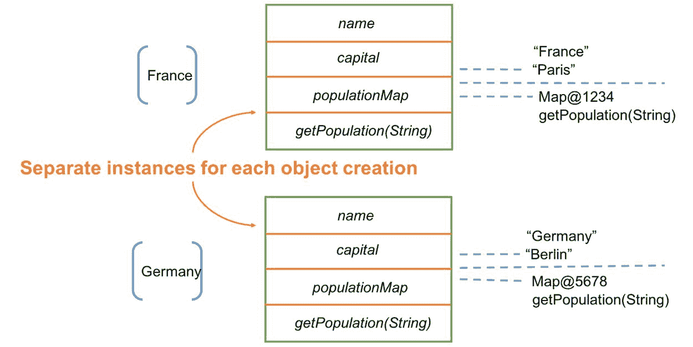

# 面向对象 Scala 基础

“有一种核心品质，是人的生命和精神、城镇、建筑或荒野的根本标准。这种品质是主观且精确的。”

- 永恒的建筑方式

由于 Scala 包含了许多优点，许多程序员会选择 Scala。这是一种既具有函数式又具有面向对象特性的语言，这对程序员来说意义重大。它为我们提供了一种以模块化和有意义的方式构建应用程序的方法。重要的是要知道，Scala 的函数式概念是基本、强大且位于我们程序核心的。毫无疑问，代数数据类型已经提供了必要的抽象和不可变数据结构，使得代码能够在并发环境中工作。但现实世界的应用可能需要更多。通常，我们编写的代码量使得管理它们变得至关重要。这就是面向对象抽象发挥作用的地方。现在我们有了类和对象，它们提供了一种创建可管理代码的方法。在接下来的几章中，我们将掌握 Scala 中的这些面向对象概念，它们将帮助我们在开始越来越多地使用函数式概念和抽象时。

如果你来自 Java 或其他面向对象语言背景，你可能熟悉面向对象的基础知识。如果不熟悉，我们将随着讨论的进行讨论这些概念。主要的是，当我们讨论面向对象原则时，我们会提出四个核心原则，即：*抽象*、*封装*、*继承*和*多态*。它们的工作方式正如其名。例如，*抽象*基本上是隐藏任务或过程的具体或内部处理，用更简单的话说，就是使某物抽象化。在 Scala 中，我们有抽象类、特性和一些其他概念，它们提供了抽象。*类*和*对象*是提供*封装*的方式，基本上是将有意义的一段代码封装在一个单元中。

我们可以从父类继承成员及其行为，并将它们放入称为子类的其他类中。这种特性被称为*继承*。最后，*多态*，正如其名，意味着定义和执行一个操作的不同方式。多态的一个例子是方法重写。

本章是 Scala 中类和对象的基本介绍。为了使我们的议程清晰，我们将主要在本章中探讨三个主题：

+   类

+   对象

+   情况类

# 类

要理解 Scala 中的类，让我们先明确一点：类不仅仅为我们做一件事情。类在我们的程序中充当成员的容器，就像在任何其他面向对象的语言中一样，我们可以创建我们类构造的实例并重用它们。当我们提到成员时，我们指的是在内部定义的变量和方法。为什么不看看一个简单的 Scala 类呢？

```java
class Country(var name: String, var capital: String) 
```

是的，前面的代码是我们定义的一个名为`Country`的类*.* 它有两个成员，分别命名为`name`和`capital`*.* 让我们创建一个新的国家实例并打印其值：

```java
object CountryApp extends App { 
  val country = new Country("France", "Paris") 
  println(s"Country Name: ${country.name} and Capital: ${country.capital}") 
} 
```

运行前面的代码，我们得到以下结果：

```java
Country Name: France and Capital: Paris 
```

现在，请相信我，一旦我告诉你，具有相同功能的 Java 类可能需要更多几行代码，你将很难抗拒 Scala。看看下面的代码：

```java
public class CountryJava { 
    private String name; 
    private String capital; 

    public CountryJava(String name, String capital){ 
        this.name = name; 
        this.capital = capital; 
    } 

    public void setName(String name){this.name = name;} 
    public String getName(){return this.name;} 

    public void setCapital(String capital){this.capital = capital;} 
    public String getCapital(){return this.capital;}
 } 
```

这还不是结束。现在我们将创建一个实例并打印国家对象：

```java
class CountryJavaApp { 
    public static void main(String[] args) { 
        CountryJava country = new CountryJava("France", "Paris"); 
        System.out.println("Country Name: "+ country.getName() + " and Capital: "+ country.getCapital()); 
    } 
} 
```

以下是将要输出的内容：

```java
Country Name: France and Capital: Paris 
```

我们之所以根据定义类的方式区分它们，是为了看到简洁性。很多不必要的或样板代码已经被省略。由于我们在定义类时添加了`var`关键字，所以我们的成员如`name`和`capital`的访问器仍然存在。

让我们尝试省略类构造函数中的`var`或`val`关键字：

```java
class Country(name: String, capital: String) 
```

这两个，`name`和`capital`，将作为类构造函数的参数保留。它们的范围将受到限制；在类作用域之外无法使用这些参数。为了更好地理解，可以将类构造函数想象成一个带有一些参数的方法。在调用方法时，我们传递一定数量的参数，它们的范围限制在函数的定义内。Scala 类也是这样。你可以考虑一些使用类构造函数参数的用例：

```java
println(s"Country Name: ${country.name} and Capital: ${country.capital}") 
```

编译器不会让你访问`name`和`capital`成员。

当我们使用`var`关键字作为构造函数参数的修饰符时，我们可以访问这些参数。所以，如果你在这个类外部实例化`Country`对象，你将得到这两个字段的引用并可以访问它们。将`var`作为前缀允许你重新分配参数的值；但这不是一个好主意。以下代码片段做了同样的事情：

```java
object CountryApp extends App { 
  val country = new Country("France", "Paris") 
  country.name = "Germany" 
  country.capital = "Berlin" 
  println(s"Country Name: ${country.name} and Capital: ${country.capital}") 
} 
```

以下是将要输出的内容：

```java
Country Name: Germany and Capital: Berlin 
```

对于`val`关键字也是同样的情况。唯一的区别是`val`参数只能被读取而不能被修改。换句话说，你的成员变成了不可变的：

```java
class Country(val name: String, val capital: String) 
```

前面的定义允许你访问名为`name`和`capital`的成员，但它不会让你在实例化后更改`name`和`capital`的值：

```java
country.name = "Germany" 
country.capital = "Berlin" 
```

如果你尝试这样做，编译器将抛出一个错误，指出“将值赋给 val”。还有一个结构允许你这样做，这意味着你实际上并没有在构造函数参数中放置`val`，而是使用了一个`case`类。定义一个`case`类就像定义任何其他类一样简单：

```java
case class Country(name: String, capital: String) 
```

使用默认参数的`case`类意味着它将它们作为不可变参数接收；没有必要显式地将它们声明为`val`。我们将在后续主题中了解更多关于`case`类的信息。我们还可以在我们的类中声明一些方法，这些方法将特定于我们类的实例。例如，让我们添加一个方法，用于获取给定年份的人口。为了使其工作，我们将添加一个包含年份和人口的百万单位的映射。以下内容仅用于说明目的：

```java
class Country(val name: String, val capital: String){ 
  var populationMap = scala.collection.mutable.Map[String, Double]() 

  def getPopulation(year: String): Double = populationMap(year) //In Million 
} 

object CountryApp extends App { 
  val country = new Country("France", "Paris") 
  country.populationMap += ("2015" -> 64.39) += ("2016" -> 64.67) += ("2017" -> 64.93) 
  println(s"Country Name: ${country.name} and Population 2017: ${country.getPopulation("2017")} million") 
} 
```

以下输出：

```java
Country Name: France and Population 2017: 64.93 million 
```

在前面的类定义中，我们为`population`定义了一个可变的映射，它根据年份作为键存储一个国家的人口。传递一个年份将返回该年份的人口（以百万为单位）。现在，`country`类的每个实例都将包含对这些成员的单独引用。你可以想象，对于每个我们创建的实例，都有一个单独的`name`、`capital`、`populationMap`和`getPopulation`方法。然后，我们赋予这些成员的值也是相互独立的。然而，在实例成员指向不同的值对象时，我们可能有两个不同的引用指向相同的值。让我们看一下以下图示，以使其更清晰：



类实例

重要的是要知道，当我们编译我们的类时，它们会被转换为它们的 Java 等效代码。当转换为 Java 等效代码时，具有`var`构造参数的类看起来如下：

```java
public class chapter6.Country { 
     public java.lang.String name(); 
     public void name_$eq(java.lang.String); 
     public java.lang.String capital(); 
     public void capital_$eq(java.lang.String); 
     public chapter6.Country(java.lang.String, java.lang.String); 
} 
```

上述方法，`name()`和`capital()`，作为*获取器*返回这两个字段的值。其他两个是名为`name_$eq`和`capital_$eq`的方法。我们可以使用这些方法来赋值：

```java
object CountryApp extends App { 
  val country = new Country("France", "Paris") 
  country.name_=("Germany") 
  country.capital_=("Berlin") 
  println(s"Country Name: ${country.name} and 
                    capital: ${country.capital}") 
} 
```

以下输出：

```java
Country Name: Germany and capital: Berlin 
```

这表明我们没有显式创建这些修改器方法，但 Scala 编译器为我们完成了这项工作。注意，`name_$eq`代表`name_=`，没有其他含义。最后，编译形式中最后表示的方法实际上是`Country`类的构造函数。

使用`val`的类构造函数无法访问修改器方法。这意味着类的编译形式不包含修改器方法：

```java
public class chapter6.Country { 
    public java.lang.String name(); 
    public java.lang.String capital(); 
    public chapter6.Country(java.lang.String, java.lang.String); 
} 
```

上述代码是我们`Country`类使用`val`参数的编译形式。在这里，我们只能访问访问器方法，而不能访问修改器方法。

默认情况下，我们定义的所有成员都作为公共成员工作。这意味着可以在类外部访问它们。我们可以通过添加`private`修饰符来使它们私有：

```java
private def getPopulation(year: String): Double = populationMap(year) 
//In Million 
```

为了说明这一点，让我们将我们的`getPopulation(year: String)`方法设为私有。之后，即使有`Country`类的实例，我们也将无法在类外部执行此操作：

```java
println(s"Country Name: ${country.name} and Population 2017: ${country.getPopulation("2017")} million")
```

Scala 编译器不会允许你执行此操作。关于 Scala 中的类，还有一点需要注意，那就是你必须为你的类定义 `toString`、`equals` 和 `hashCode` 的实现。如果你想让 Scala 以某种特定格式打印你的类实例或执行相等操作，这些方法是必不可少的。为了消除这种冗余，建议使用 case 类。如果不定义这些方法，尝试运行以下代码：

```java
val country = new Country("France", "Paris") 
println(country) 
```

Scala 将直接打印运行时实例，即 `Country@2d209079`*.* 为了使这个输出有意义，我们可以重写 `toString` 方法并给出其定义：

```java
class Country(val name: String, val capital: String){ 
  override def toString: String = s"Country($name, $capital)" 
} 
```

现在，如果你尝试打印 `Country`*.* 的一个实例，它将以前面的格式打印：

```java
val country = new Country("France", "Paris") 
println(country) 
```

以下为结果：

```java
Country(France, Paris) 
```

有时我们想要创建只包含类名、表示某些后续类想要继承的类型、且为抽象的类。我们将这些声明为抽象类。

# 抽象类

我们可以使用 `abstract` 关键字来定义抽象类：*

```java
abstract class Person 
class Customer extends Person 
class Employee extends Person 
```

在这里，我们想要的两个子类也可以被当作超类（在我们的例子中是 `Person`*.*）的实例。目前，我们在抽象类中还没有展示任何行为。但是，有时我们想在抽象类中暗示一些行为，以便后续的子类可以继承并自行定义：

```java
abstract class Person(category: String) { 
  val idPrefix: String 
} 

class Customer extends Person("External") { 
  override val idPrefix: String = "CUST" 
} 

class Employee extends Person("Internal") { 
  override val idPrefix: String = "EMP" 
} 
```

我们现在对使用抽象类的意图更清晰了。我们可能想要一组继承自特定类的类。当我们扩展类时，我们可以在定义中使用 `override` 修饰符。这种行为很可能会在 Scala 的另一个概念中体现出来，那就是 trait*.*

# 抽象类和 traits

你可以声明如下内容：

```java
trait Person { 
  val category: String 
  val idPrefix: String 
} 

class Customer extends Person { 
  override val category: String = "External" 
  override val idPrefix: String = "CUST" 
} 

class Employee extends Person { 
  override val category: String = "Internal" 
  override val idPrefix: String = "EMP" 
} 
```

在这里，我们使用了 trait*.* 我们将在下一章中了解更多关于 traits 的内容。现在，让我们看看它们与抽象类有何不同。我们可能会发现，我们在抽象类中提供了构造函数参数；这是 traits 所不可能的：

```java
abstract class Person(category: String) //can give cons params 

trait Person(category: String) //can't give cons params  
```

我们不能为 traits 提供构造函数参数。然而，我们可以在抽象类和 traits 中定义方法。这不是我们想要使用类的唯一方式。也许你不想让任何其他类继承你的类。在这些情况下，我们可能需要使用 `final` 关键字来声明类。

# 最终类

如果你来自 Java 背景，你可能对 `String` 类有这个想法：

```java
public final class String extends Object 
```

`final` 关键字告诉你你不能从 `String` 类继承*.* 同样地，我们也可以使用这个 `final` 关键字来创建具有无法被任何其他类修改或继承的行为的类。你已经明白了这个概念。如果你将我们的 `Person` 类声明为 `final`，那么你将无法继承它。但在 Scala 中，你还可以将类声明为 `final` 以及 `abstract`*.* 是的，以下是这样做的：

```java
scala> abstract final class Person 
defined class Person 

scala> class Employee extends Person 
<console>:12: error: illegal inheritance from final class Person 
       class Employee extends Person 
```

幸运的是，编译器不允许我们从抽象最终类继承。虽然如此，如果你能找到用例那就太好了。为了即时满足，你可能想搜索 Scala 中的幻影类型，并考虑我们无法实例化或继承抽象类的情况。

此外，如果你来自面向对象编程的背景，或者对 Java 中的`static`成员有所了解，你可能正在想，在 Scala 中我们如何实现这一点？静态类或静态成员的基本用法是，对于只有一个实例的情况，特定成员对于该类的所有实例都是相同的。如果你改变静态成员的值，它将改变所有实例的值。你将在我们接下来要讨论的下一个主题中了解更多关于我们正在讨论的内容。

# 对象作为单例

Scala 中没有静态成员或类。一旦你感觉到需要创建一个静态成员，例如一个静态方法或只将有一个实例的类，你应该创建一个对象。是的，到目前为止，我们几乎总是创建一个扩展`App`特质的对象，这样我们就不必定义`main`方法。这是我们的应用程序的入口点。所以，当提到`object`*时，我们并不是指任何类的实例；相反，Scala 中的`object`有不同含义。

一个对象*，*就像类一样，是函数和值的容器。我们可能想要声明一个对象的原因是，我们可以为任何特定类型定义实用方法，或者有时定义 JSON 格式化器等类似用例。让我们再看看我们如何定义一个对象*：

```java
object CountryUtil { 

} 
```

看起来我们刚刚创建了一个对象。没有什么花哨的，只是一个`object`关键字和对象的名字。我们知道对象是单例的，因此，在构造函数中传递参数没有任何意义，因此 Scala 不允许这样做。就是这样。为什么不使用你的`CountryUtil`对象来定义一些实用方法，比如一个接受人口序列并返回其平均值的方法？让我们在下面的代码中尝试一下：

```java
object CountryUtil { 
  /* 
  * Function takes a sequence of population per million and returns average. 
  * */ 
  def populationAverage(pops: Seq[Double]) = pops.sum / pops.length 
} 

object CountryApp extends App { 
  val country = new Country("France", "Paris") 
  country.populationMap += ("2015" -> 64.39) += ("2016" -> 64.67) += ("2017" -> 64.93) 

  println(s"Country Name: ${country.name} and Population 2017: ${country.getPopulation("2017")} million") 

  println(s"${country.name}'s average population: ${CountryUtil.populationAverage(country.populationMap.values.toSeq)}") 

} 
```

以下是对应的输出：

```java
Country Name: France and Population 2017: 64.93 million 
France's average population: 64.66333333333334 
```

现在，我们已经得到了我们想要的年份的法国平均人口。我们通过将映射传递给名为`populationAverage`的实用函数，该函数接受以百万为单位的连续人口值，实现了这一点。这里的想法是提供一个可以包含类实用方法的容器，这就是为什么我们有对象。

如果你正在想，是否可以从对象扩展：

```java
class WeCant extends CountryUtil { 
} 
// Sorry we can't extend from an object 
```

不，我们不能。第一个原因是这不是预期的。其次，Scala 编译器为我们创建了一个对象的编译后的 Java 版本，这是一个 `final` 类。当我们创建一个 *对象* 并将其编译时会发生什么？Scala 会根据你选择的修饰符创建几个类文件。在我们的例子中，如果你编译 `CountryUtil` 对象，编译器会创建 `CountryUtil.class` 和 `CountryUtil$.class`*.*，并且这些文件天生就是最终的。让我们看看这些文件。

下面的代码是 `CountryUtil.class` 类的实现：

```java
public final class chapter6.CountryUtil { 
  public static double populationAverage(scala.collection.Seq<java.lang.Object>); 
} 
```

下面的代码是 `CountryUtil$.class` 类的实现：

```java
public final class chapter6.CountryUtil$ { 
  public static chapter6.CountryUtil$ MODULE$; 
  public static {}; 
  public double populationAverage(scala.collection.Seq<java.lang.Object>); 
} 
```

是的，这是一些 Java 代码。你可能现在对细节不太感兴趣，但有两点需要注意：关键字 `static` 和 `final`*.* 首先，正如我们之前讨论的，这两个类是 `final` 的，实用方法是 `static` 的。因此，你可能对 Scala 编译器在后台做了什么有一个大概的了解。太好了。此外，这并不会阻止你从一个对象或特质扩展一个类。因此，编写如下内容是可能的：

```java
class Continent 

object CountryUtil extends Continent { 
      //some code here 
} 
```

好吧，既然这样，我们就来讨论一下 Scala 中对象的更多用例。我们都知道，在 Scala 对象中，我们可以为特定类定义实用方法。使用它们也很简单，而且这些实用方法可以从任何地方使用。你只需要添加一个 `import` 语句：

```java
import java.time.LocalDate 
import java.time.format.{DateTimeFormatter, TextStyle} 
import java.util.Locale 
import scala.util.{Failure, Success, Try} 

object DateUtil { 
  /* 
  * Just pass a date with format DD/MM/YYYY, get back DAY_OF_WEEK 
  * */ 
  def dayOfWeek(date: String): Option[String] = Try{ 
      LocalDate.parse(date, DateTimeFormatter.ofPattern("dd/MM/yyyy")).getDayOfWeek 
    } match { 
      case Success(dayOfWeek) => Some(dayOfWeek.getDisplayName(TextStyle.FULL, Locale.ENGLISH)) 
      case Failure(exp) => exp.printStackTrace; None 
    } 
} 

object TestDateUtil extends App { 
  import DateUtil._ 

  val date = "01/01/1992" 

  dayOfWeek(date) match { 
      case Some(dow) => println(s"It was $dow on $date") 
      case None => println(s"Something went wrong!") 
  } 

} 
```

下面的输出是：

```java
It was Wednesday on 01/01/1992 
```

我们定义了一个 `DateUtil` 对象，并包含一个名为 `dayOfWeek(date: String)` 的实用函数。这告诉我们，当我们以特定格式将日期传递给它时，它是星期几。我们还创建了一个应用程序，它导入了这个 `DateUtil` 对象，并从那里，我们可以访问该对象内部的所有函数。有了这个，我们能够直接调用我们的函数并获取结果。

这是一个合理的模式，我们定义一个类，然后创建一些不是实例特定的函数，但可以从实例中使用，例如我们之前为 `Country` 类及其名为 `CountryUtil`*.* 的实用对象提供的例子。语言创造者对此了如指掌，并引入了我们所称的伴生对象的概念。这就是我们接下来要学习的内容。

# 伴生对象

伴生对象与我们之前讨论的对象并没有太大的不同。一个具体的区别是，我们给它们的命名与我们的类名相同。这意味着我们不需要定义 `CountryUtil`*.*，我们可以给这个对象与我们的 `Country` 类相同的名字，并称它为我们的伴生对象：

```java
class Country(val name: String, val capital: String){ 
  var populationMap = scala.collection.mutable.Map[String, Double]() 
  def getPopulation(year: String): Double = populationMap(year) //In Million 

  override def toString: String = s"Country($name,$capital)" 
} 

object Country { 
  /* 
  * Function takes a sequence of population per million and returns average. 
  * */ 
  def populationAverage(pops: Seq[Double]) = pops.sum / pops.length 
} 

object CountryApp extends App { 
  val country = new Country("France", "Paris") 
  country.populationMap += ("2015" -> 64.39) += ("2016" -> 64.67) += ("2017" -> 64.93) 

  println(s"Country Name: ${country.name} and Population 2017: ${country.getPopulation("2017")} million") 

  println(s"${country.name}'s average population: ${Country.populationAverage(country.populationMap.values.toSeq)}") 
} 
```

上述代码做了我们之前所说的。我们给我们的对象取的名字与我们的 `Country` 类相同。这就是我们定义伴生对象的方式。这样，你的代码结构也会很清晰，因为它为你提供了让你的类型做些事情的能力。知道这一点很有用，为了使你的对象成为 *伴生* 对象，你必须将它们定义在同一个源文件中。

如果你在 Scala REPL 中尝试这样做，应该使用粘贴模式（`:paste`）。让我们看看我们是什么意思。所以，打开 Scala REPL 并尝试创建一个类及其伴随对象。REPL 将显示一个警告：*之前定义的类不是对象的伴随。伴随对象必须一起定义；你可能希望使用`:paste`模式来做这件事。*

因此，我们按照建议去做。在 REPL 中给出`:paste`命令，这将启用粘贴模式，然后以伴随模式编写我们的类。然后一切看起来都很好。

这些是我们已经在各个地方使用过的有用构造。当我们使用`case`类或类型类（我们将在第十章[part0194.html#5P0D40-921a8f8dca2a47ea817d3e6755fa0e84]，高级函数式编程）实现时，我们将寻找它们的伴随对象。实际上，每当我们看到我们的类有特定的事情要做时，我们就有一种很好的方式来使用`apply`方法构建它的伴随对象。看看以下例子：

```java
import java.time.LocalDate 
import java.time.format.DateTimeFormatter 

class Date(val dateStr: String) { 
  override def toString: String = s"Date(${this.dateStr})" 
} 

object Date{ 
  def apply(str: String): Date = { 
    val dater = LocalDate.parse(str, DateTimeFormatter.ofPattern("dd/MM/yyyy")) 
    new Date(s"${dater.getDayOfWeek} ${dater.getDayOfMonth}-${dater.getMonth}-${dater.getYear}") 
  } 
} 

object DateApp extends App { 
  val date = Date("01/01/1992") 
  println(date)
 } 
```

以下就是结果：

```java
Date(WEDNESDAY 1-JANUARY-1992) 
```

这个例子是为了说明目的。我们本来有其他不同的方法可以达到这里所做的东西，但为了理解带有`apply`方法的**伴随对象**，这种方式更简单。那么，前一个例子中有什么不同呢？是我们使用`DateApp`应用程序的方式吗？是的，当我们定义伴随对象中的`apply`方法时，Scala 编译器允许我们无需显式调用它就能使用它。这正是我们在这里所做的事情：

```java
val date = Date("01/01/1992") 
```

我们定义了一个名为`Date`的类，并随之创建了一个带有`apply`方法的伴随对象。这给了我们操作实例并从中获取一些东西的优势。在我们的例子中，我们检索了一些更多信息，使`Date`的实例更有意义，并用更多信息实例化`Date`。`Date`的使用者将得到比我们给出的更多信息。这似乎很有趣。然而，实际的实现还需要注意异常情况。例如，如果在解析日期时遇到异常，会怎么样？我们现在不会深入细节，因为我们的座右铭是理解这个模式并找到它的用途。

想想更简单的情况，我们想要省略在创建简单类时必须编写的冗余代码，比如这个：

```java
class Country(val name: String, val capital: String) { 

  override def toString: String = s"Country($name,$capital)" 

  override def equals(obj: scala.Any): Boolean = ??? 

  override def hashCode(): Int = ??? 

} 
```

在这里，我们有我们的简单`Country`类，由于 Scala 的存在，我们不需要为我们的类定义访问器和修改器。然而，这并不那么好。我们仍然需要定义像`toString`、`equals`或`hashCode`这样的方法。如果 Scala 能为我们做这些，同时移除我们必须写的额外关键字，如`new`、`val`等等，会怎么样呢？

当然，提到所有这些的整个目的就是为了确认，我们可以在 Scala 中使用案例类做很多事情，我们将在下一节中讨论这一点。

# 案例类

案例类是什么，为什么我们有它们，以及我们如何使用它们？这些问题你可能想要得到答案。所以，用更简单的语言来说，案例类可以省略我们可能需要编写的代码量以实现这一点：

```java
class Country(val name: String, val capital: String) { 

  override def toString: String = s"Country($name,$capital)" 

  override def equals(obj: scala.Any): Boolean = ??? 

  override def hashCode(): Int = ??? 

} 
```

与前面代码中声明的`Country`不同，我们更愿意这样做：

```java
case class Country(name: String, capital: String) 
```

我们的案例类`Country`定义处理了其余部分。我们有`name`和`capital`成员的访问器方法。我们有 Scala 编译器定义的`toString`和`equals`方法，或者说，为我们自动生成的方法：

```java
case class Country(name: String, capital: String) 

object CountryUtil extends App { 
  val country = Country("France", "Paris") 
  println(s"Our country is: $country") 

  println(s"Equality => ${country == country}") 

  println(s"HashCode for country instance: ${country.hashCode()}") 
}  
```

以下就是输出：

```java
Our country is: Country(France,Paris) 
Equality => true 
HashCode for country instance: -66065175 
toString*,* equals, or hashCode methods for the Country class. Still, we were able to perform these operations for the case class instance of the Country class. Why so? This happens because when we define a case class in Scala, the compiler automatically creates its companion object with a few methods, such as apply, unapply, and so on. During compilation, whenever the Scala compiler finds a case class, it converts the class files from Scala to Java; in our case, we'll get Country$.class and Country.class. The body of these files tells you a lot about what's happening in the background:
```

以下是一个`Country$.class`类的实例：

```java
public final class chapter6.Country$ extends scala.runtime.AbstractFunction2<java.lang.String, java.lang.String, chapter6.Country> implements scala.Serializable { 
  public static chapter6.Country$ MODULE$; 
  public static {}; 
  public final java.lang.String toString(); 
  public chapter6.Country apply(java.lang.String, java.lang.String); 
  public scala.Option<scala.Tuple2<java.lang.String, java.lang.String>> unapply(chapter6.Country); 
  public java.lang.Object apply(java.lang.Object, java.lang.Object); 
} 
```

以下是一个`Country.class`类的实例：

```java
public class chapter6.Country implements scala.Product,scala.Serializable { 
  public static scala.Option<scala.Tuple2<java.lang.String, java.lang.String>> unapply(chapter6.Country); 
  public static chapter6.Country apply(java.lang.String, java.lang.String); 
  public static scala.Function1<scala.Tuple2<java.lang.String, java.lang.String>, chapter6.Country> tupled(); 
  public static scala.Function1<java.lang.String, scala.Function1<java.lang.String, chapter6.Country>> curried(); 
  public java.lang.String name(); 
  public java.lang.String capital(); 
  public chapter6.Country copy(java.lang.String, java.lang.String); 
  public java.lang.String copy$default$1(); 
  public java.lang.String copy$default$2(); 
  public java.lang.String productPrefix(); 
  public int productArity(); 
  public java.lang.Object productElement(int); 
  public scala.collection.Iterator<java.lang.Object> productIterator(); 
  public boolean canEqual(java.lang.Object); 
  public int hashCode(); 
  public java.lang.String toString(); 
  public boolean equals(java.lang.Object); 
  public chapter6.Country(java.lang.String, java.lang.String); 
} 
```

在幕后正在进行许多有趣的事情。Scala 编译器为我们的案例类创建并定义了所有必要的方法，使我们的生活变得简单。所有这些简洁性都是因为编译器能够删除我们可能需要编写的所有样板代码。编译器为我们定义的一些重要方法包括：

+   `apply`

+   `unapply`

+   `copy`

+   `canEqual`

+   `hashCode`

+   `equals`

+   `toString`

与此同时，编译器还创建了构造函数以及不可变字段，以及这些字段的访问器，还有一些实用方法，如`productArity`、`productPrefix`和`productElement`*.* 值得注意的是，一些方法，如`apply`和`unapply`方法，在编译后的形式中被声明为`static`。这意味着它们可以以`Country.apply(...)`或`Country.unapply(...)`*.*的形式调用，但其他方法可以在案例类的实例上调用。将无法调用`Country.copy(...)`，因为编译器不允许我们执行此操作。说到所有这些，让我们尝试我们的示例`Country`案例类：

```java
package chapter6 

object CountryUtil extends App { 
  case class Country(name: String, capital: String) 
  val country = Country("France", "Paris") 
  println(s"Country: => $country") 
  println(s"Equality: => ${country == country}") 
  println(s"HashCode: => ${country.hashCode()}") 

  println(s"Unapply: => ${Country.unapply(country)}") 
  println(s"apply: => ${Country.apply("Germany","Berlin")}") 

  println(s"copy: => ${country.copy("Germany","Berlin")}") 
  println(s"copyName: => ${country.copy(name="Germany")}") 
  println(s"copyCapital: => ${country.copy(capital="Berlin")}") 

  println(s"productArity: => ${country.productArity}") 
  println(s"productPrefix: => ${country.productPrefix}") 
  println(s"productElement(0): => ${country.productElement(0)}") 
  println(s"productElement(1): => ${country.productElement(1)}") 
} 
```

以下就是结果：

```java
Country: => Country(France,Paris) 
Equality: => true 
HashCode: => -66065175 
Unapply: => Some((France,Paris)) 
apply: => Country(Germany,Berlin) 
copy: => Country(Germany,Berlin) 
copyName: => Country(Germany,Paris) 
copyCapital: => Country(France,Berlin) 
productArity: => 2 
productPrefix: => Country 
productElement(0): => France 
productElement(1): => Paris 
```

我们看到了前面代码中应用的所有方法。值得注意的是，这些方法是有用的，并且提供了关于类实例的基本行为以及更多信息的更多信息。这就是我们创建伴随对象的目的。记住，我们创建了一个带有伴随对象的`Date`类，其实例在声明时提供的信息更为有意义。

在 Scala 中，有多个原因使我们更愿意使用案例类而不是普通类。很明显，案例类既简洁又给我们提供了我们可能通过编写自己的代码所无法得到的东西。正因为如此，我们对这些案例类及其成员有了更多的了解。例如，`unapply`方法提供了在检查实例时你可能需要的信息。我们可以在模式匹配中使用这些方法，并且也建议这样做：

```java
case class Country(name: String, capital: String) 
val country = Country("France", "Paris") 

country match { 
  case Country("Germany", _) => println(s"It's Germany") 
  case Country("France", _) => println(s"It's France") 
  case Country(_, _) => println(s"It's some country") 
} 
```

这可能看起来很简单，但它是一个强大的结构，并且被广泛使用。难怪你也发现自己更频繁地匹配案例类实例。这样做很简单，根据我们的代码片段，它将打印以下内容：

```java
It's France  
```

这是因为`unapply`方法按预期工作；模式匹配在我们的案例类实例上起作用。还值得知道的是，你不能声明一个与具有相同名称的类一起的案例类。Scala 不会允许你在同一作用域内声明具有相同名称的类和案例类。当我们说同一作用域时，我们的意思是，如果你声明了一个案例类，比如说名为 country 的案例类，与同一编译单元中的 Country 类同名，这是完全可以的，因为它们属于不同的作用域。为了使这个声明更清晰，请看一个例子：

```java
package chapter6 

object CountryUtil extends App { 
  case class Country(name: String, capital: String) 
  val country = Country("France", "Paris") 
} 

class Country(name: String, capital: String) 
```

上述代码声明是完全可以的，但如果我们尝试将我们的类放入`CountryUtil`或把我们的案例类放在`CountryUtil`之外，编译器将不允许我们这样做：

```java
package chapter6 
case class Country(name: String, capital: String) 

object CountryUtil extends App {  
  val country = Country("France", "Paris") 
} 

class Country(name: String, capital: String) 
```

Scala 编译器不会允许你这样做，它会显示以下信息：

```java
Country is already defined in scope 
```

嗯，你可能根本不想做这样的事情。如果你想知道是否可以从案例类扩展，使用案例类可以做到以下事情：

```java
abstract class Continent 
case class Country(name: String, capital: String) extends Continent 
```

我们将在下一章中学习更多关于继承的内容。到目前为止，我们已经看到了足够的，为接下来做好准备。现在是时候总结本章我们学到的内容了。

# 摘要

本章很有趣，因为我们学习了 Scala 类和对象实现的细节。我们从 Scala 中类的含义开始，讨论了如何声明它们以及如何使用它们。然后我们讨论了 Scala 中对象作为单例实例的概念。接着我们讨论了有趣的伴生对象，这引出了案例类。我们了解到案例类不仅给我们带来了我们想要的简洁性，而且在可能需要进行实例模式匹配的场景中也非常有用。最后，我们讨论了案例类提供的所有方法和优点。

在下一章中，我们将把面向对象的 Scala 知识提升到新的水平，并更多地讨论特质、继承以及更多内容。
