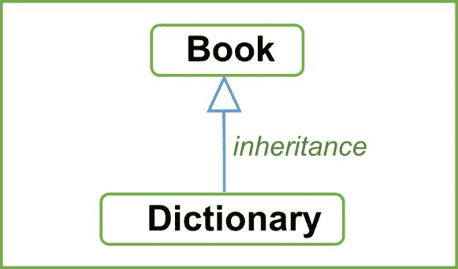
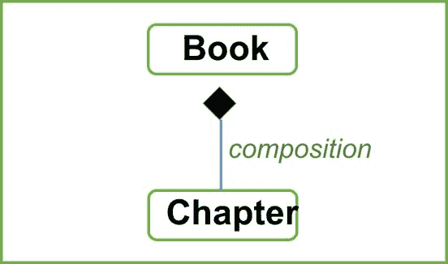
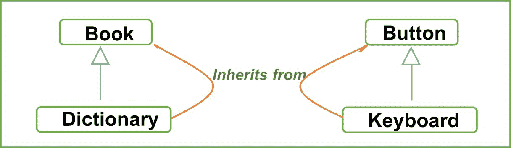
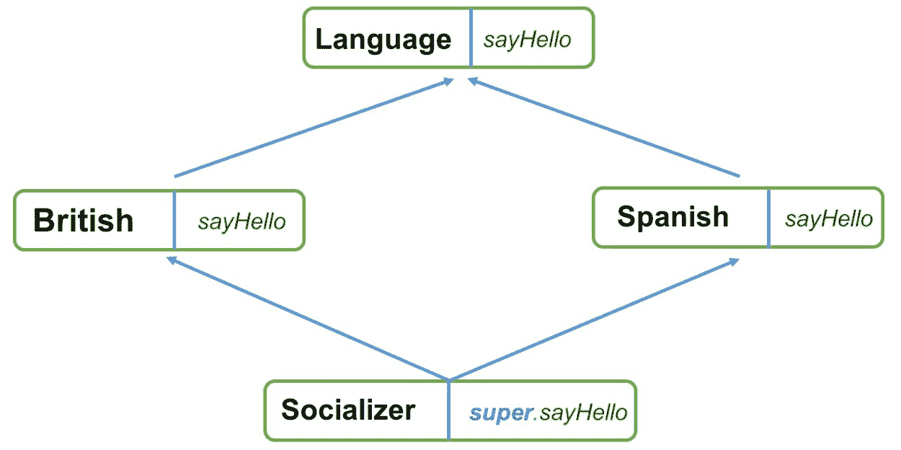

# 第七章：面向对象 Scala 的下一步

“我生来无知，只有一点时间在这里和那里改变这一点。”

– 理查德·费曼

伴随对象的想法让我们觉得了解你的编程语言如何处理你编写的结构是很重要的。假设你被分配了一个任务，生成一个带有一些敏感参数的 `case` 类（敏感的意思是，当尝试打印该类时，那些敏感字段应打印一些占位符值）。你将如何实现这一点完全取决于你对 Scala 如何处理 `case` 类的了解，我们已经在上一章中学到了这一点。那么现在呢？现在是时候做一些组合，并使用继承。记住，我们讨论过我们应该如何将类视为可以定义的类型吗？将所有这些类型混合在一起，并试图理解它们，同时添加功能，这是一项非常有用且有趣的任务。这就是为什么我们有静态类型，不是吗？让我告诉你，在学习组合的同时混合这些类型，创造多种访问这些结构的方法是很有趣的。这正是我们将在本章中做的事情。我们将享受乐趣并学习。所以，这就是我们将如何进行：

+   组合与继承的比较

+   类继承

+   默认和参数化构造函数

+   特性

+   特性作为混合体

+   线性化

+   打包与导入

+   可见性规则

+   密封特性

在我们继续前进之前，我想澄清这一点。在本章中，我们将大量使用 *组合* 和 *继承* 这两个术语。最好一开始就区分这两个概念。

# 组合与继承

在编程术语中，要继承或扩展我们的类，我们使用 `extends` 或 `with` 关键字。这些对于两个或更多类或类似结构之间的关系是必不可少的。这种两个类或类似结构之间的关联或关系可以是继承（是-A）或组合（有-A）。它们是两个不同的概念，但在某种程度上它们是趋同的。简单来说，**继承** 是一个超类-子类关系，其中子类继承了超类的实现，而**组合** 是一个类依赖于另一个对象以提供某些或全部功能的情况。在继承关系中，你可以在期望超类的地方使用子类对象。想想看，这是 `字典` 和 `书` 类之间的关系：

```java
class Book(val title: String) 
class Dictionary(name: String) extends Book(name) { 
  // data and behavior 
} 
```

我们可以将 `书` 和 `字典` 的关系如图所示：



在这里，`字典` 类正在继承自 `书` 类，这意味着：

+   `字典` 是 `书` 的一个子类。它可以在需要的地方用作 `书` 类型。

+   字典可以访问`Book`类的所有字段（数据）和成员函数（行为）。这意味着你可以覆盖超类中特定函数的行为，以及根据超类函数定义自己的函数。

这些点在某种程度上使理解继承关系变得更容易，并帮助你形成良好的面向对象设计。然而，有时作为开发者，你可能会觉得有责任去改变超类的行为，因为现在它也成为其他子类依赖的一部分。

组合在实现时（在特质混入的情况下）可能看起来相似，但本质上不同。正如其名所示，组合实际上是将部分组合成一个整体。通过一个例子更容易理解：

```java
class Book(val title: String) {
  val chapters = scala.collection.mutable.Set[Chapter]()
  def addChapter(chapter: Chapter) = chapters.add(chapter)
  def pages = chapters.foldLeft(0)((b, c) => b + c.noOfPages)
}

case class Chapter(name: String, sn: Int, noOfPages: Int)

object BookApp extends App {
  val book = new Book("The New Book")
  book.addChapter(Chapter("Chapter1", 1, 15))
  book.addChapter(Chapter("Chapter2", 2, 13))
  book.addChapter(Chapter("Chapter3", 3, 17))

  println(book.title)
  println(book.pages)
}
```

在前面的代码中，我们展示了一个由一组章节组成的`Book`类。每个章节由一个`Chapter`类表示。这是`Book`类和`Chapter`类之间的*具有*关系。这种关系也称为**聚合**。作为聚合的特殊形式，我们现在感兴趣的主题是组合。`Book`类中有一个名为`chapters`的字段，它由`chapters`组成。没有`Chapter`结构，就不可能形成有意义的书籍对象。

这就是组合，并且它是具有方向的。以下图将帮助我们理解这个概念：



书籍与章节之间的组合关系

在`chapters`中的`Set`对象，我们可以扩展一些只能在`Chapter`对象上执行的功能。我敢打赌你已经明白了组合的概念。我们讨论这个的原因是因为我们将在 Scala 中使用特质的混入来实现这一点，这看起来几乎像是我们在继承中扩展它们，但实际上并非如此。所以，想法是清晰的：

+   组合不仅仅是代码复用，更是将部分组合成一个整体。没有`Chapter`对象的存在，`Book`的存在是不清晰的。

+   组合还向我们的已定义类结构添加了功能（我们将在本章后面讨论*特质作为混入*时看到这一点）。

了解这两者之间的区别很重要。现在你可能对如何在 Scala 中实现继承或组合只有一个模糊的概念，但术语及其含义是清晰的。这将为我们指明前进的道路，并讨论我们如何在 Scala 中实现类继承。

# 类继承

你已经知道继承在良好的面向对象设计中起着重要作用。我们很幸运有诸如命名类这样的结构，我们可以通过使用继承来增加将它们与其他类相关联的可能性。继承是关于形成有意义的类层次结构以实现代码复用的目的。记住我提到的 *有意义的层次结构*。我稍后会解释我的话。让我们看看我们如何扩展类以形成一个层次结构。

# 扩展类

我们使用 `extend` 关键字来继承一个类。让我们看看我们的 `Book` 示例来理解这一点：

```java
class Book(val title: String){ 
  // data and behaviour for Book 
} 

class Dictionary(name: String) extends Book(name) { 
  // data and behaviour for dictionary 
} 

object BookApp extends App { 
  val dictionary = new Dictionary("Collins") 
  println(dictionary.title) 
} 
```

结果如下：

```java
Collins 
```

我们可以看到，`Dictionary` 类继承自 `Book` 或 `Dictionary`，是 `Book` 超类的子类。重要的是要知道，在 Scala 中，所有类，无论是否使用 `extends` 关键字，都明确地继承自 `Any`。这意味着我们的 `Book` 类继承自 `Any`。现在，随着这种关系的建立，如果你尝试创建一个 `Dictionary` 实例，你将能够访问超类中所有非私有成员。这就是我们能够打印出字典标题的原因。这就是代码复用的体现。如果你不希望某个成员从外部访问，你可以将其设置为 `private`，这是一个访问修饰符。我们将在本章后面学习访问级别。通过这种继承关系，可以在需要 `Book` 实例的地方使用 `Dictionary` 实例。这是因为 `dictionary` 是 `Book` 类型的子类型。为了使事情更清晰，让我们谈谈子类型和子类。

# 子类型与子类

在 Scala 中，类不是类型。当我们从一个类继承时，我们在这两个类之间形成了一个超类-子类关系。在大多数情况下，子类和子类型的概念是相同的。但在 *方差（参数化类下的继承行为）* 发挥作用的场合，事情就变得不同了。在方差下，子类不保证子类型。

我们将查看两种情况，正面和负面。假设字典继承自书籍，并且可以说一摞字典是一摞书籍。这是正面场景，其中子类化和子类型在本质上相似。但第二种情况呢？假设`Keyboard`类扩展自`Button`类*.* `Button`有一个值，也有功能。所以，在形成有意义的键盘对象时，我们使用了`Button`类。但你觉得一摞键盘和一摞按钮是一样的吗？不！因此，在这里，`Keyboard`和`Button`类之间的子类化是完美的，但我们不允许说`Keyboard`是`Button`的子类型。我想你已经理解了子类型和子类化以及它们之间的区别。然而，在编程术语中，让我们这样看待它：如果`Dictionary`是`Book`的子类型，那么`List`[`Dictionary`]将是`List`[`Book`]的子类型。我们称这个属性为**协变**。在另一种情况下，`Keyboard`子类化`Button`，但它不是`Button`的子类型。让我们可视化我们刚刚试图理解的内容：



子类化

这种关系不言自明。在键盘和按钮的情况下，选择组合而不是继承会更好。但这是一种不同的观点。目前，我们已经清楚，我们应该区分子类型和子类化。所以现在，让我们再探讨一个更有趣的话题——覆盖超类的行为。是的，我们可以覆盖超类中定义的函数。

# 覆盖数据和行为

我们知道子类可以访问超类中所有非私有成员，因此我们可以从超类中调用或调用函数来展示一些行为。如果我们想操纵行为，在 Scala 中，我们可以覆盖超类中的任何函数或值。让我们看看我们如何做到这一点。我们将参考之前提到的`Book`和`Dictionary`示例。假设在`Book`类中我们有一个名为`cover`的函数，为了演示目的，它简单地接受一个`String`对象作为`cover`。

我们从`Book`类继承并创建一个`Dictionary`类，该类想要覆盖名为`cover`的函数的功能：

```java
class Book(val title: String){ 
  def cover(cover: String): String = "Paperback_" + cover 
} 

class Dictionary(name: String) extends Book(name){ 
  // wants to define its own version of cover method 
} 
```

我们可以通过简单地添加名为`override`的修饰符关键字来覆盖`cover`方法的定义：

```java
class Dictionary(name: String) extends Book(name){ 
  override def cover(cover: String): String = "Hardcover_" + cover 
} 

object BookApp extends App { 
  val dictionary = new Dictionary("Collins") 
  println(dictionary.title) 
  println(dictionary.cover("The Collins Dictionary")) 
} 
```

结果如下：

```java
Collins 
Hardcover_The Collins Dictionary 
```

正如前一个示例所示，我们已经覆盖了`cover`方法*.* 如果我们不使用名为`override`的这个关键字，会怎样呢？在这种情况下，Scala 编译器会给我们一个错误，指出以下内容：

```java
Error:(18, 7) overriding method cover in class Book of type (cover: String)String; 
 method cover needs `override' modifier 
 def cover(cover: String): String = "Hardcover_" + cover 
```

`cover`方法需要`override`修饰符。如果我们在子类中保留了签名，方法覆盖就会生效。如果你尝试更改签名，编译器会给你一个错误，指出`cover`方法覆盖了无内容：

```java
Error:(18, 16) method cover overrides nothing. 
Note: the super classes of class Dictionary contain the following, non-final members named cover: 
def cover(cover: String): String 
override def cover(cover: Cover): String = "Hardcover_" + cover 
```

因此，在子类中覆盖方法时，保持方法签名不变是很重要的。Scala 要求你在子类中重用相同的方法时，始终提供`override`关键字。在 Java 中，`override`关键字是可选的。这在编写代码的实际场景中会导致问题。假设你想要在`Book`超类中更改行为，以支持新引入的`Cover`类作为`cover`方法的参数，并且你在几个地方覆盖了此`cover`方法，例如在`Dictionary`类中。如果没有强制使用`override`关键字会发生什么情况？你可能想知道。因此，Scala 要求你添加它。所以，在编译时，你将得到一个错误，指出`Dictionary`中的`cover`方法没有覆盖任何内容，你可以根据需要更改定义。

还有一件重要的事情需要了解：为了彻底理解覆盖行为，我们必须了解它们的范围。我们可以用`val`字段覆盖非参数`def`成员。我们这是什么意思？让我们看看：

```java
class Book(val title: String){ 
  def coverType: String = "Paperback" 
  def cover(cover: String): String = coverType + "_" + cover 
} 

class Dictionary(name: String) extends Book(name){ 
  override val coverType: String = "Hardcover" 
} 
```

这个例子向你展示了`Book`中的非参数方法`coverType`可以在`Dictionary`子类中用`val`对象覆盖。进行这样的覆盖操作是完全合法的。如果你尝试反过来做，这是不可能的。Scala 编译器将不允许你执行这样的操作，并指出`coverType`方法需要是一个稳定、不可变的价值：

```java
Error:(19, 16) overriding value coverType in class Book of type String; 
 method coverType needs to be a stable, immutable value 
  override def coverType: String = "Hardcover" 
```

这是合乎逻辑的；你在这里试图做的是使某个东西可变，定义是可变的。这不应该被允许，Scala 编译器足够智能，能够告诉你这一点。假设你希望你的超类中的某个特定成员保持完整，不可更改。你想要限制后续子类覆盖超类的行为，在这种情况下你会怎么做？这就是我们接下来要学习的。 

# 限制继承 – `final`关键字

如果你想要限制子类覆盖特定的行为或某些数据，你可以使用`final`关键字来实现：

```java
class Book(val title: String){ 
  final val coverType: String = "Paperback" 
  def cover(cover: String): String = coverType + "_" + cover 
} 
```

在这里，我们已将`coverType`值声明为`final`。如果你尝试覆盖它，Scala 编译器将抛出一个错误，指出值不能覆盖`final`成员：

```java
Error:(19, 16) overriding value coverType in class Book of type String; 
 value coverType cannot override final member 
 override val coverType: String = "Hardcover" 
```

这在你想保持某些数据完整的同时，仍然让超类-子类关系正常工作的情况下很有用。在几个相关类中覆盖行为时，当你尝试调用超类以及子类中的特定方法时，会出现混淆。这种混淆是通过动态绑定概念解决的。所以，在我们详细了解它的工作原理之前，让我们先解释一下动态绑定在哪里被使用。动态绑定用于解决当类之间存在继承关系时，哪个成员函数将被调用。这是在运行时基于对象来解决的。让我们详细谈谈它。

# 函数调用中的动态绑定

我们讨论了对象与其引用的动态绑定以及方法的调用。调用是基于调用该方法的对象的类型。用例子来说明这一点更容易理解。看一下下面的例子：

```java
class Book(val title: String){ 
  val coverType: String = "Paperback" 
  def cover(cover: String): String = coverType + "_" + cover 
} 

class Dictionary(name: String) extends Book(name){ 
  override val coverType: String = "Hardcover" 
} 

class Encyclopedia(name: String) extends Book(name){ 
  override val coverType: String = "Blue_Hardcover" 
} 

object BookApp extends App { 
  val dictionary: Book = new Dictionary("Collins") 
  val encyclopedia: Book = new Encyclopedia ("Britannica") 
  val theBoringBook: Book = new Book("TheBoringBook") 

  println(s"${dictionary.title} has cover ${dictionary.cover("The Collins Dictionary")}") 
  println(s"${encyclopedia.title} has cover ${encyclopedia.cover("Britannica")}") 
  println(s"${theBoringBook.title} has cover ${theBoringBook.cover("Some Book")}") 
} 
```

结果如下：

```java
Collins has cover Hardcover_The Collins Dictionary 
Britannica has cover Blue_Hardcover_Britannica 
TheBoringBook has cover Paperback_Some Book 
```

仔细看看以下内容：

```java
val dictionary: Book = new Dictionary("Collins") 
val encyclopedia: Book = new Encyclopedia ("Britannica") 
val theBoringBook: Book = new Book("TheBoringBook") 
```

在这里，我们创建了三个具有相同返回类型`Book`的不同对象。首先要注意的是，等于运算符左侧的类在继承层次结构中总是更高的。其次，这三个都是不同的实例。所以，当你尝试从所有这些实例中调用名为`cover`的成员函数时，你可能会观察到三种情况下的不同行为，并看到调用是基于类的运行时类型。我们说的类的运行时类型是什么意思？这意味着在编译时，所有三个表达式都是同一类型`Book`，但在运行时，情况就不同了。`Dictionary`、`Encyclopedia`和`Book`的调用发生，导致调用它们各自的封面方法。在我们的例子中，打印出来的结果显示了预期的行为。这种行为在面向对象语言中被称为**动态绑定**。

到现在为止，我相信你已经非常熟悉继承的概念，并且准备好在为你的下一个应用程序设计模型时考虑这个特性，对吧？为了使它更清晰，我们将继承视为一个通过代码复用来解决代码重复问题的概念。但是，我们必须记住，使用继承形成的这些类之间的关系，它们也传递了一些重要的语义信息。我们这是什么意思呢？我们的意思是，理解当我们从某个超类继承时，它就变成了代表我们的子类的公共接口/构造体是很重要的。

因此，当从`book`继承字典时，如果它还保留有关书籍是否将具有标题、页数、封面、作者或其他信息的语义信息，那么其子类也预计将具有这些信息可用。原因在于，由于继承关系，`Book`是`dictionary`的公共接口。这就是我们有时发现自己错误地使用继承的地方。让我们简要讨论一下。

# 继承滥用

看一下这个例子：

```java
class CustomStack extends util.ArrayList[String] { 
  def push(value: String) = ??? 
  def pop = ??? 
} 
```

在这里，一个名为 `CustomStack` 的类正在继承自 `ArrayList[String]`。你所看到的是一种语义代码异味。仅仅因为你的 `CustomStack` 类扩展了 `ArrayList`，并不意味着你能够访问其所有公共成员。任何拥有栈对象的用户不仅将能够访问 `push` 或 `pop`，还将能够访问一系列方法，如 `get`、`set`、`add`、`remove` 等等。这是错误的；你可以在内部使用数组列表对象来形成一个栈对象，但公共接口应该与此无关。在我们的例子中，我们的代码表明如果你能够访问 `CustomStack`，你将能够访问所有这些方法。你应该避免在 `Stack` 构造中使用这种做法。实际上，这两个概念完全不同，因此我们应该避免使用这种在语义上错误的建模方式。尽管这可能是一个设计选择，但我们仍然应该在做出这些决策时牢记以下几点：

+   检查 Is-A 关系，如果它成立。

+   检查封装规则，如数据隐藏，是否成立。你永远不应该向外部世界暴露内部实现细节。在我们的例子中，`Stack` 应该在内部实现数组列表，而不是从它继承。

+   我们应该检查每个构造的域，交叉域继承模型肯定不是一个好的选择。`Stack` 和 `ArrayList` 在概念上是不同的。一个可以用另一个来组合，但不应该继承另一个。

如果你遵循这些要点，你将能做出更好的设计选择来建模继承关系。

嗯，你还记得我们学习了关于 `case` 类以及我们如何使用不带 `new` 关键字的方式来实例化它们吗？这让我想知道，如果我们想要有超过一种方式来构造这种 `case` 类的新对象呢？如果你也在想同样的事情；太好了！Scala 中可以有参数化构造函数。让我们来谈谈它们。

# 默认和参数化构造函数

在 Scala 中定义的任何类的首要构造函数是其本身。这意味着你在一个类体内声明的和定义的任何内容，在创建其实例时都会被实例化。还有其他方法可以定义二级/辅助构造函数。看看下面的 `case` 类：

```java
import java.time.LocalDate

case class Employee(name: String, id: String, contact: String, email: String) 

case class StartUp(name: String, founder: Employee, coFounders: Option[Set[Employee]], members: Option[List[Employee]], foundingDate: Option[LocalDate]) 
```

我们可以看到两个名为 `Employee` 和 `StartUp` 的 `case` 类。你可能想知道为什么 `Employee` 是特定于我们的 `StartUp` 类的。`StartUp` `case` 类接受一些属性，如 `founder`、`coFounder`、`members` 和 `foundingDate`。因此，为了创建这些 `case` 类的实例，我们必须为每个成员提供值。在这种情况下，如果客户端某个人想使用这个 `case` 类并且不想提供 `members` 或 `coFounder` 信息，他们仍然必须给出占位符值。现在，这个解决方案可能是为我们的客户端构建辅助构造函数。如果我们为 `StartUp` `case` 类提供替代调用策略，这就可以做到。让我们这样做：

```java
case class StartUp(name: String, founder: Employee, coFounders: Option[Set[Employee]], members: Option[List[Employee]], foundingDate: Option[LocalDate]){ 

  //founder | name 
  def this(name: String, founder: Employee) = this(name, founder, None, None, None) 

  //founder | foundingDate 
  def this(name: String, founder: Employee, foundingDate: LocalDate) = this(name, founder, None, None, Some(foundingDate)) 

  //founder | coFounders 
  def this(name: String, founder: Employee, coFounders: Set[Employee]) = this(name, founder, Some(coFounders), None, None) 

  //founder | coFounders | members 
  def this(name: String, founder: Employee, coFounders: Set[Employee], members: List[Employee]) = this(name, founder, Some(coFounders), Some(members), None) 

  //founder | coFounders | foundingDate 
  def this(name: String, founder: Employee, coFounders: Set[Employee], foundingDate: LocalDate) = this(name, founder, Some(coFounders), None, Some(foundingDate)) 

  //founder | members    | foundingDate 
  def this(name: String, founder: Employee, members: List[Employee], foundingDate: LocalDate) = this(name, founder, None, Some(members), Some(foundingDate)) 

} 
```

这里有几个需要注意的点。首先，我们可以定义 `this` 方法的重载版本，它们可以作为辅助构造函数工作。其次，在每个定义中，我们都在调用主构造函数，并传递一些其他值。这种做法可以在这些类的任一边进行。这意味着在声明这些 `case` 类时或在客户端使用这些类时传递可选值都可以。我们已经在这类声明时这样做过了。现在让我们在 `StartUpApp` 中使用它们：

```java
object StartUpApp extends App { 

  val startUpWithFoundingDate = new StartUp("WSup", Employee("Rahul Sharma", "RH_ID_1", "9090000321", "rahul_sharma@abc.com"), LocalDate.now()) 

  println(s"${startUpWithFoundingDate.name} founded on ${startUpWithFoundingDate.foundingDate.get} by ${startUpWithFoundingDate.founder.name}") 

  val startUp = new StartUp("Taken", Employee("David Barbara", "DB_ID_1", "9090654321", "david_b@abc.com")) 

  println(s"${startUp.name} founded by ${startUp.founder.name}") 
} 
```

结果如下：

```java
WSup founded on Sun Jun 13 20:29:00 IST 2016 by Rahul Sharma 
Taken founded by David Barbara 
```

使用这些 `StartUp` `case` 类的辅助构造函数版本很容易。我们可以看到我们只传递了所需的参数，如果这个版本对我们可用，我们就能为其创建一个实例。但是等等，我们已经有这些 `case` 类，但我们仍然使用 `new` 关键字为 `StartUp` 类创建实例。如果我们尝试不使用 `new` 关键字创建实例会怎样呢？让我们试试：

```java
object StartUpApp extends App { 

  val startUp = StartUp("Taken", Employee("David Barbara", "DB_ID_1", "9090654321", "david_b@abc.com")) 
  println(s"${startUp.name} founded by ${startUp.founder.name}")
 } 
```

如果你尝试这样做，Scala 编译器会抛出一个错误，如下所示：

```java
Error:(30, 24) not enough arguments for method apply: (name: String, founder: chapter7.Employee, coFounders: Option[Set[chapter7.Employee]], members: Option[List[chapter7.Employee]], foundingDate: Option[java.util.Date])chapter7.StartUp in object StartUp. 
Unspecified value parameters coFounders, members, foundingDate. 
val startUp = StartUp("Taken", Employee("David Barbara", "DB_ID_1", "9090654321", "david_b@abc.com"))  
```

这是因为当你声明 `case` 类时，编译器会为它生成一个伴随对象，其中包含一个 `apply` 方法，并且 `apply` 方法接受 `case` 类定义的所有参数。当我们定义辅助构造函数时，我们并没有真正地覆盖伴随对象中定义的 `apply` 方法。因此，当我们尝试不使用 `new` 关键字使用 `case` 类实例化时，Scala 编译器无法找到相应的 `apply` 方法版本，并给出错误。如果你真的想那样使用它，你可以在伴随对象中定义 `apply` 方法的重载版本。我们将尝试只使用两个参数（`name` 和 `founder`）的重载实现*。让我们这样做：

```java
object StartUp { 

  def apply(name: String, founder: Employee): StartUp = new StartUp(name, founder, None, None, None) 
} 
```

做这件事很简单。定义一个只接受 `name` 和 `founder` 的 `apply` 方法，我们可以选择创建我们的 `StartUp` 对象实例而不使用 `new` 关键字：

```java
object StartUpApp extends App { 

  val startUp = StartUp("Taken", Employee("David Barbara", "DB_ID_1", "9090654321", "david_b@abc.com")) 

  println(s"${startUp.name} founded by ${startUp.founder.name}") 
} 
```

结果如下：

```java
Taken founded by David Barbara 
```

这些只是几种方法；我们可以通过提供构建新对象的各种选项来使客户的体验更轻松。现在我们已经看到了我们如何为类构造定义各种选项，以及如果正确使用，继承可以如何有效，我们可以通过在 Scala 中使用特性来使我们的构造更强大。这就是我们将要探索的。

# 特性

特性是什么？对于来自 Java 背景的人来说，他们可能会倾向于将特性视为接口，但实际上它们是不同的东西。**特性**构造可能看起来相似，但与 Java 中的接口在本质上不同。特性这个词的含义是：一种区别质量或特征，通常是指一个人的。特性的一种用途也是一样的。如果你想要向我们的类层次结构或单个类添加特定的特性，你可以通过扩展或混合特性来实现。我们说混合特性而不是扩展特性更容易。这两者有什么不同？我们将随着讨论的进行来讨论这个问题，但现在，让我们看看如何在 Scala 中定义一个`trait`：

```java
trait Socialize { 

  //people who socialise, greets. 
  def greet(name: String) = "Hello " + name
}
```

这样看吧。那些善于社交的人的一个特点是，当他们遇见你时，他们会全心全意地问候你。在编程术语中，你想要创建一个名为`Person`的社交类。你可以创建一个名为`Socialize`的`trait`，目前它只定义了一个方法`greet`。这很简单：通过定义一个`trait`，我们使用关键字`trait`并给它一个名字。我们将随着讨论的进行来讨论这个问题，但现在，让我们看看如何在 Scala 中定义一个`trait`：

```java
case class Person(val name: String) 

object SocializeApp extends App { 
  val person = Person("Victor Mark") 
  val employee = new Employee("David Barbara") with Socialize 

  println(employee.greet(person.name)) 

  class Employee(fullName: String) extends Person(fullName) 
} 
```

结果如下：

```java
Hello Victor Mark 
Employee class that extends Person in the inheritance hierarchy. While instantiating the Employee object, we're able to extend an employee's characteristic of socializing through a mix-in. Also, we have access to the greet method from our trait. This happened on the go, we didn't specify Employee to have this characteristic statically, but dynamically. When instantiating, we extended the possibilities and characteristics of Employee. That's why traits are powerful. A few points to note about traits are as follows*:*
```

+   特性不接受参数

+   特性也可以形成一个继承层次结构，一个特性可以混合另一个特性

+   在同一个作用域内，你不能有一个类和一个具有相同名称的特性

+   混合特性的顺序很重要，并且可能会影响你的实现行为

我们可以通过观察前面的点来定义特性，但了解 Scala 在编译时如何处理特性也是很好的。为了理解这一点，我们可以使用`javap`命令在我们的`Socialize`类上。它将显示我们特性的编译形式：

```java
public interface chapter7.Socialize { 
  public static java.lang.String greet$(chapter7.Socialize, java.lang.String); 
  public java.lang.String greet(java.lang.String); 
  public static void $init$(chapter7.Socialize); 
} 
Socialize trait. The Scala compiler compiles down a trait to its Java counterpart, interface (this happens in Scala version 2.12 and later. In previous versions, traits were also compiled to a set of classes). Here, the greet method is available as a static and a non-static member. It's possible for us to include an abstract, as well as concrete, method of a trait. For example, take a look at the following:
```

```java
trait Socialize { 

  def greet(name: String) = "Hello " + name 

  val socialNetworks = Set("Facebook", "LinkedIn", "Twitter", "Instagram", "Youtube") 

  def linkToSocialNetwork(network: String, uri: String) 
} 

object SocializeApp extends App { 

  val employee = new Employee("David Barbara") 
  employee.linkToSocialNetwork("LinkedIn", "www.linkedin.com/profiles/david_b") 

  println(employee.mapOfSocialNetwork) 

} 

class Employee(fullName: String) extends Person(fullName) with Socialize { 

  var mapOfSocialNetwork = new scala.collection.mutable.HashMap[String, String]() 

  override val socialNetworks = Set("LinkedIn", "Twitter", "Youtube") 
  override def linkToSocialNetwork(network: String, uri: String): Unit = if (socialNetworks contains network) mapOfSocialNetwork.put(network, uri) 
}  
```

结果如下：

```java
Map(LinkedIn -> www.linkedin.com/profiles/david_b) 
```

上述示例显示，我们的特性可以包含抽象成员以及具体成员。在这里，我们只是声明了我们的`linkToSocialNetwork`方法而没有定义，以及我们之前的方法，名为`greet`，它有它的定义：

```java
def linkToSocialNetwork(network: String, uri: String)   
```

我们已经在 `Employee` 类中给出了它的实现，这个类混合了这个特性。有了这种抽象，我们现在可以将特性与 Scala 中的抽象类进行比较。这两者之间的区别是什么？首先，你可能注意到我们不能向我们的特性传递构造函数参数。其次，作为构造，特性比抽象类更重。所以，选择哪一个取决于你。建议如果你正在扩展任何功能，或者如果只是作为一个类层次结构，那么抽象类可能是一个不错的选择。特性的另一个方面是它是可堆叠的。这意味着很明显你可以混合多个特性，并且其效果可以以堆叠的方式使用。让我们看看特性如何被用来展示可堆叠行为。

# 特性作为混合体

我们进行特性混合的方式与在 Scala 中继承任何类没有不同；唯一的区别是你可以混合多个特性，为此我们有一个叫做 `with` 的关键字。我们为什么叫它混合体？我们本可以叫它别的名字。好吧，是的，但这几乎解释了你可以用特性做的一切。很容易修改或添加到现有功能或构造中的行为，而不影响现有的行为。我们很快就会看到这一点。特性可以在各种用例中使用，例如：

+   可组合的混合体；使现有的接口更丰富

+   可堆叠的修改

# 特性作为可组合的混合体

通过 **可组合的混合体** 我们意味着我们可以创建一个特定类型的实例，带有特性的混合，它可以具有某些附加功能。如果你在想我们为什么要这样做，那么答案是也许你想要添加一些特定的行为，这些行为对你的功能有意义，并且你希望它表现得好像它来自库本身。作为这种构造或库的客户，我们希望它们感觉尽可能自然。特性帮助我们添加某些功能，同时保持真正的库完整。

我们可以通过一个例子更好地理解这一点。所以，假设你已经有了一个现有的 `CreditCard` 功能。为了演示目的，我们将限制我们对这个 `CreditCard` 功能的期望。这个类有生成每个订阅者信用卡号码的特定方式。这是过去的事情了。现在，在未来的几天里，我们想要引入一些新的带有更多优惠（适用条件）的 `CreditCard` 订阅。此外，我们希望有自己的方式生成 `CreditCard` 号码，而不影响现有的功能或业务。现实可能不同，但为了学习目的，我们自己生成信用卡号码是可以的，不是吗？所以，现在你有了这个画面。让我们看看我们已经有什么：

```java
package chapter7 

case class Amount(amt: Double, currency: String){ 
  override def toString: String = s"$amt ${currency.toUpperCase}" 
} 

abstract class CreditCard { 
  val ccType = "Default" 
  def creditLimit(x: Double) : Amount 

  //legacy creditCardNumberGeneratorLogic 
  val ccNum = scala.util.Random.nextInt(1000000000).toString 

  //other methods 
} 

object CCApp extends App { 
  val basicCreditCard = new CreditCard { 
    override def creditLimit(x: Double): Amount = Amount(x, "USD") 
  } 

  val limit = basicCreditCard.creditLimit(1000) 
  println(s"CreditCardNumber ${basicCreditCard.ccNum} with limit: $limit") 
} 
```

结果如下：

```java
CreditCardNumber 44539599 with limit: 1000.0 USD 
```

现在，我们可以看到这个`CreditCard`抽象类的定义，我们的客户端`CCApp`正在访问它以创建一个具有特定金额的新信用卡账户。如果你仔细观察，我们没有尝试定义独立的具体类来扩展我们名为`CreditCard`的抽象类，而是直接实例化了`CreditCard`，这是由于 Scala 为我们生成并实例化了一个匿名类，并期望我们定义抽象方法，在我们的例子中是`creditLimit`。现在，我们的要求是在不修改现有代码的情况下，我们想要有一个自己的`creditCardNumber`生成器版本，它可以为我们生成信用卡号。那么让我们来做这件事。但是想想看，我们如何做才能让它看起来很自然？我们希望这样做：

```java
val basicCreditCard = // Some Credit Card impl 
basicCreditCard.ccNumber 
```

对于这一点，我们可以定义一个`trait`，比如说`CreditCardOps`，它将定义我们可以用来引用新逻辑而不影响之前实现的功能。对于客户端来说，这将很自然。让我们看看实现：

```java
trait CreditCardOps { 
   self: CreditCard => 
   val ccNumber: String = ccType match { 
     case "BASIC" => "BC" + ccNum 
     case _ => "DC" + ccNum 
   } 
} 

object CCApp extends App { 
  val basicCreditCard = new CreditCard with CreditCardOps { 
    override def creditLimit(x: Double): Amount = Amount(x, "USD") 
  } 

  val limit = basicCreditCard.creditLimit(1000) 
  println(s"CreditCardNumber ${basicCreditCard.ccNumber} with limit: $limit") 
} 
```

结果如下：

```java
CreditCardNumber DC896146072 with limit: 1000.0 USD 
```

使用方式变化不大，我们也实现了我们的目标。我们引入的唯一新事物是一个名为`CreditCardOps`的`trait`。这个`trait`定义了我们想要的新逻辑。关于这个实现，有几个需要注意的点：

+   首先，我们需要在我们想要这种合成行为的时候，将这个`trait`混合到我们的`CreditCard`实现中。

+   我们还可能想要确保这个`trait`仅针对`CreditCard`类型，因此不允许其他特质或类混合使用这个。我们最终也确保了这一点。如果你尝试做以下类似的事情：

```java
class DebitCard 
val someDebitCard = new DebitCard with CreditCardOps 
```

+   Scala 编译器不会允许我们这样做；原因是我们在定义特质时选择的语法如下：

```java
self: CreditCard => 
```

+   这个语法给 Scala 编译器提供了一些关于当前作用域中即将到来的语句的信息，同时也限制了特质对某些类型的可用性。因为这个语法，我们只能将`CreditCardOps`特质混合到`CreditCard`类型中。

+   看看下面的实现：

```java
trait CreditCardOps { 
   self: CreditCard => 
   val ccNumber: String = ccType match { 
     case "BASIC" => "BC" + ccNum 
     case _ => "DC" + ccNum 
   } 
} 
```

我们能够引用`ccType`和`ccNum`，`CreditCard`类的成员，仅仅是因为这个`self`类型声明*。* 这个声明让我们可以访问指定类型的成员。

+   我们只是修改了`ccNum`的逻辑，并消耗了之前的逻辑来创建新的逻辑。这是由于混合使用（mix-ins）实现的。

+   此外，我们面临的一个约束是，你可能想要`重写`（`override`）`ccNum`的值，这样当你的`CreditCard`对象的客户端访问`ccNum`时，他们可以得到基于新逻辑的值，类似于以下内容：

```java
trait CreditCardOps { 

   self: CreditCard => 
   val ccNumber: String = ccType match { 
     case "BASIC" => "BC" + ccNum 
     case _ => "DC" + ccNum 
   } 
  override val ccNum = ccNumber // will be null 
} 
```

但是，这是不可能的。编译器会允许你这样做，但在运行时，值将是 null。仔细观察你会发现`self`只是`CreditCard`类型的引用，因此你将能够引用成员，就像我们在进行模式匹配时做的那样，但如果你尝试`override`，它不会显示预期的行为。造成这种情况的一个原因是特性在运行时评估。

通过这种方式，我们最终能够只为`CreditCard`类型添加附加行为。这是我们使现有结构更强大的方法，也可以根据我们的特定需求对其进行修改。我们有一个术语来描述这个过程，我们称之为通过可组合混入使薄接口丰富。为什么是丰富的？因为它是可添加的或选择性的修改。基于我们的用例，特性还有更多。一个实体自然会有多个特性，不是吗？另外，如果两个或多个可组合的行为一起应用，它们都会产生影响。这是一个有趣的话题；这些行为是如何实现的。这些行为可以实现的其中一种方式是作为*可堆叠修改*。

# 特性作为可堆叠修改

在我们学习**可堆叠修改**之前，我们应该知道我们为什么可能需要它们，不是吗？是的，所以理解这个最好的方式是通过使用一个例子。假设有一个服务的消费者。他可以付费订阅特定的服务。例如，你的 DTH 电视订阅服务包括几个频道包。现在，对我们来说，有趣的是我们可能想要实现这个服务。为了实现，我们想要有一个消费者订阅的频道或包列表。在月初，他订阅了一个特定的包，比如`BasicPackage`。所以我们说了以下内容：

```java
new Service with BasicPackage 
```

这实际上是很直观的。我们创建了一个带有`BasicPackage`的`Service`。从编程的角度来看，我们可以假设在我们的`Service`类中有一个特定的值，它包含在某个包中列出的包/频道列表。因此，根据这个声明，该属性必须已经更新了值。到目前为止，一切都很顺利。如果消费者想要订阅更多的包怎么办？我们不希望有一个明确修改我们频道列表的机制，但这是默认发生的。这就像随着我们不断添加不同的包，行为在不断地被修改。这种情况下，你会接触到可堆叠修改的概念：

```java
new Service with BasicPackage with DiamondPackage 
```

每添加一个包，通道/包的列表都会更新。我们稍后会看到，当我们添加更多包时，实现会隐式地堆叠修改。这些修改可以在某些数据结构上进行，我们可以在数据上管道操作，或者像我们刚才提到的场景。可以添加一系列关于特质的操作/修改。让我们再举一个例子并对其进行处理。为此，我们将使用我们的 `CreditCard` 抽象类并将其修改为适合我们新引入的 `GoldCreditCard` 和 `PlatinumCreditCard`。这些新的卡片订阅为消费者提供了很多好处，同时还有更高的信用额度。金卡订阅者将获得比标准/基本信用卡高出 10% 的信用额度。白金卡的信用额度增加量比标准卡高出 25%，除此之外，它们还带来了其他好处。一个足够冒险的消费者可能想要同时选择这两种订阅。那么你认为我们该如何实现呢？一个提示，我们可能会使用我们刚才讨论的堆叠修改。那么，让我们看看我们已经有的是什么：

```java
abstract class CreditCard { 
  val ccType = "Default" 
  def creditLimit(x: Double) : Amount 

  //legacy creditCardNumberGeneratorLogic 
  val ccNum = scala.util.Random.nextInt(1000000000).toString 

  //other methods} 
```

这里没有什么不同。我们有一个旧的抽象 `CreditCard` 类。我们可能想要创建一个标准/基本信用卡：

```java
class BasicCreditCard extends CreditCard { 
  override def creditLimit(x: Double): Amount = Amount(x,"USD") 
} 
```

这不是陌生的代码，很容易理解。我们创建了一个扩展 `CreditCard` 的 `BasicCreditCard` 类，并且我们正在重写 `creditLimit` 方法。这个方法简单地返回限制金额的 `Amount` 对象。现在，让我们看看其他订阅类型的实现：

```java
trait GoldSubscription extends CreditCard { 
  abstract override def creditLimit(x: Double): Amount = super.creditLimit(x * 1.10) 
} 

trait PlatinumSubscription extends CreditCard { 
  abstract override def creditLimit(x: Double): Amount = super.creditLimit(x * 1.25) 
} 
```

根据我们之前讨论的特性，增加了两个名为 `GoldSubscription` 和 `PlatinumSubscription` 的类型。这里有什么不同呢？语法分析会说这有一个 `abstract override` 修饰符，但它是如何实现的？如何将这两个结合在一起呢？如果我们不打算提供其定义，我们会声明某个东西为 `abstract`，并使用 `override` 来重新定义已经存在于作用域中的某个东西。所以，问题是，这两个都是冲突的。然而，正如我们已知的，Scala 足够智能，知道这是在特质的上下文中完成的，特质在运行时会被评估，当你尝试创建这样一个特质的实例或与某个已经创建的具体类混合时，它将覆盖特定的定义。看下面的例子：

```java
abstract override def creditLimit(x: Double): Amount = //super call 
```

这里，我们期望有一个 `CreditCard` 的具体实现来混合这个特质。让我们看看 `CCApp` 的实现来更好地理解：

```java
object CCApp extends App { 
  val basicCreditCard = new BasicCreditCard()       
  println(basicCreditCard.creditLimit(15000)) 

  val goldCreditCard = new BasicCreditCard() with GoldSubscription 
  println(goldCreditCard.creditLimit(15000)) 

  val platinumCreditCard = new BasicCreditCard() with PlatinumSubscription 
  println(platinumCreditCard.creditLimit(15000)) 

  val gpluspCreditCard = new BasicCreditCard() with GoldSubscription with PlatinumSubscription 
  println(gpluspCreditCard.creditLimit(15000)) 
} 
```

结果如下：

```java
15000.0 USD 
16500.0 USD 
18750.0 USD 
20625.0 USD 
```

在前面的代码中，是使用堆叠修改为我们的问题找到的解决方案的实现。这里有几个需要注意的点：

+   考虑以下代码片段：

```java
trait GoldSubscription extends CreditCard { 
  abstract override def creditLimit(x: Double): Amount = super.creditLimit(x * 1.10) 
} 
```

我们没有尝试定义一些明确的逻辑实现，而是在一个已经定义的方法上进行了 `super` 调用，并在参数值中添加了 *添加*/*限制*/*修改*。

+   因此，我们可以传递相同类型的参数，并且随着它的组合，我们将得到的值将被修改。

+   我们可以应用任意多的`CreditCard`订阅，根据逻辑，我们将得到预期的`creditLimit`值。这就是为什么我们能够调用以下内容：

```java
val gpluspCreditCard = new BasicCreditCard() with GoldSubscription with PlatinumSubscription 

println(gpluspCreditCard.creditLimit(15000)) 
             and we got the desired result: 20625.0 USD 
```

+   最后但同样重要的是，我们将特性与具有覆盖我们抽象方法的实现的具体类混合，这就是为什么在这里`abstract override`可以工作。

这很有趣，你知道。我们为所有不同的实例传递了`15000`的`creditLimit`值，并得到了相应的值。所有这些都是由于特性使用可堆叠的修改。

# 线性化

当我们尝试实现多重继承时，它变得负担沉重的原因是*菱形问题*。看看下面的图像：



菱形问题

在这里，假设我们有一个名为`Language`的抽象类，它有一个名为`sayHello`的方法。两个特性，名为`British`和`Spanish`，扩展了抽象的`Language`类，并定义了它们自己的`sayHello`方法实现。然后我们创建了一个名为`Socializer`的特性，它通过调用`sayHello`方法实现的`super`来混合其他两个特性。现在，当我们调用此方法时，关于哪个`sayHello`实现被调用产生了混淆。这个问题的主要原因是 Java 中没有多重继承，但 Scala 通过*特性混合*支持一种形式的多重继承。Scala 用于解决超调用问题的概念是线性化。让我们首先为这个问题编写代码并观察其行为，然后我们将了解线性化以及证明我们即将看到的行为的规则。

假设我们为前面图像中显示的问题编写代码。它将如下所示：

```java
abstract class Language { 
  def sayHello: String 
} 

trait British extends Language { 
  override def sayHello: String = "Hello" 
} 

trait Spanish extends Language { 
  override def sayHello: String = "Hola" 
} 

class Socializer extends British with Spanish { 
  override def sayHello: String = super.sayHello 
} 

object Linearization extends App { 

  class Person(val name: String) 

  val albert = new Person("Alberto") 
  val socializer = new Socializer() 

  println(s"${socializer.sayHello} ${albert.name}") 
} 
```

结果如下：

```java
Hola Alberto 
```

你期望这个结果吗？我们已声明我们的类`Socializer`：

```java
class Socializer extends British with Spanish { 
  override def sayHello: String = super.sayHello 
} 
```

结果显示，调用`super.sayHello`调用了`Spanish`特性中的`sayHello`。嗯，这种行为是由于线性化。但它是如何工作的？线性化的规则如下：

1.  我们将从第一个扩展的特性/类开始，考虑层次结构。我们将考虑`AnyRef`和`Any`也是继承层次结构的一部分。

这将给我们以下结果：

```java
British -> AnyRef -> Any
```

让我们暂时称这为**线性化层次结构**。

1.  为下一个特性/类写下它的层次结构：

```java
Spanish -> AnyRef -> Any
```

从这个层次结构中删除已经存在于线性化层次结构中的特性/类。

因此，我们将删除`AnyRef -> Any`。剩余的语法将是：

```java
Spanish ->
```

将剩余的特性/类添加到已存在的线性化层次结构的底部。

```java
Spanish -> British -> AnyRef -> Any
```

1.  对所有特性/类重复*步骤 2*。

1.  最后，将特性/类放置在左侧的第一个位置：

```java
Socializer -> Spanish -> British -> AnyRef -> Any
```

超类调用的方向将是从 *左* 到 *右*。对于我们的实现，我们通过 `British` 扩展了 `Spanish`，我们现在知道由于线性化，`super` 调用是在 `Spanish` 特质上进行的。结果是来自 `Spanish` 特质。

结果如下：

```java
Hola Alberto 
```

这种理解可以帮助我们更好地学习特质混合和继承的常规行为。了解线性化是如何工作的对于理解已编写的代码和创建良好的设计至关重要。既然你已经知道了线性化是如何工作的，为什么不学习面向对象编程中的另一个重要概念呢？

# 打包和导入

面向对象程序的一个重要方面是我们如何定义模块化、可重用和层次化的结构。我们允许将我们编写的所有代码，如类、特性和对象，放入某个特定的包中。通过使用 *打包* 和 *可见性* 规则，我们可以使我们的代码更容易推理，意味着将某些方法暴露给其他类，并且我们得到了结构化和模块化的代码作为额外的优势。在 Scala 中，你可以以几种方式编写包声明；我们将查看这些。

# 包声明

我们可以在文件的开始处编写包声明。一个最简单的例子如下：

```java
package country 

class Country(val name: String) { 
  import Country._ 

  val populationsMap  = scala.collection.mutable.Map[Int, Double]() 

  def showAveragePopulation() = println(averagePopulation(this.populationsMap.values))
 } 

object Country {
   def averagePopulation(populations: Iterable[Double]) = populations.sum / populations.size 

} 
```

在这里，我们将包名定义为 `country`。现在，无论我们在相应的文件中定义什么，都将保持在 `country` 包的作用域内。这就是为什么当我们想要在 `Country` 伴生对象中使用一个函数时，我们不需要明确地放置以下内容：

```java
  import country.Country._ 
```

结尾的下划线 `_` 符号，是 Scala 实现通配符导入的方式。这意味着非私有成员将在当前作用域内可访问。

# 文件中的多个包声明

Scala 还允许我们放置多个包声明和嵌套包声明。首先让我们看看如何：

```java
import country.Country 
import customutil.Util.averagePopulation 

package country { 

  class Country(val name: String) { 

    val populationsMap  = scala.collection.mutable.Map[Int, Double]() 

    def showAveragePopulation() = println(averagePopulation(this.populationsMap.values))
   } 
} 

package state { 

  class State(val name: String) { 

    val populationsMap  = scala.collection.mutable.Map[Int, Double]() 

    def showAveragePopulation() = println(averagePopulation(this.populationsMap.values))
   } 

} 

package customutil { 
  object Util { 

    def averagePopulation(populations: Iterable[Double]) = populations.sum / populations.size 

  } 
} 
```

在前面的代码中，我们看到我们如何在文件中定义多个包声明。值得注意的是我们这样做的方式。我们使用了花括号和`package`关键字来告诉 Scala 编译器，这里是我们的包。我们在这个包内部写下的任何内容都将属于这个包。在这里，我们定义了三个包。一个是`country`，用于定义特定国家的结构；另一个是`state`，用于定义特定州的结构。最后一个是一个`customutil`包，正如其名称所表明的，它是为了定义所有国家/州功能性的实用函数。`averagePopulation`函数既不特定于国家也不特定于州，因此可以在两种情况下使用，因此它被定义在单独的包中，并在顶部全局导入。有了这个导入，我们就为`customutil`获得了整个编译单元的作用域。我们还可以做的一件事是将包`state`声明为嵌套在`country`中的包，因为很明显，多个`country`结构和成员也应该直接对`state`结构可用。让我们看看它将如何看起来。

# 嵌套包声明

我们知道，有时我们可能需要将一些`country`包结构直接提供给`state`包。在这些场景中，我们可以将`state`包定义为`country`内部的嵌套包。让我们这样写：

```java
import country.Country 

package country { 
  import customutil.Util.averagePopulation 

  abstract class Region 

  class Country(val name: String) extends Region{ 

    val populationsMap  = scala.collection.mutable.Map[Int, Double]() 

    def showAveragePopulation() = println(averagePopulation(this.populationsMap.values)) 

  } 

  package state { 

    class State(val name: String) extends Region { 

      val populationsMap  = scala.collection.mutable.Map[Int, Double]() 

      def showAveragePopulation() = println(averagePopulation(this.populationsMap.values)) 
    } 

  } 
} 

package customutil { 
  object Util { 

    def averagePopulation(populations: Iterable[Double]) = populations.sum / populations.size 

  } 
} 
```

在这里，我们有一个包`state`声明嵌套在一个`country`包声明内部。这样做的作用是，在导入时避免明确提及完整的包声明。同时，它使代码更容易理解，结构更清晰。这表明，预期一个国家是`Region`，一个州也可以被视为一个区域是合理的。因此，包的嵌套也是一种很好的代码文档方式。它显示了对于结构的理解。

# 链接包声明

我们还可以通过链式声明包来放置这些包声明。我们如何做到这一点？

```java
package country 
package state 

class State(val name: String) extends Region { 

  val populationsMap  = scala.collection.mutable.Map[Int, Double]() 

  def showAveragePopulation = println(averagePopulation(this.populationsMap.values)) 
} 
```

通过将`Region`类放在`country`包中，如果我们使用前面的语法声明`State`类，一切都会顺利，你的类`State`将位于包`country.state`中。这意味着`state`将是一个嵌套包。这种编写包名的方式在许多库中广泛使用，当你探索其中一些时，你可能会发现这一点。

这些都是你可以声明包名的方法，现在你也知道了背后的原因。仅仅因为我们有声明多个包名的许可，这意味着我们更容易根据它们的用途来分离结构。例如，为同一文件中的类声明一个名为`TestSuite`的包是完全可行的。每个人都有自己的编写和结构化包名的方式。有了这些声明，我们也有多种方法在其他作用域中导入这些结构。Scala 导入包的方式也很有趣；为什么不深入研究一下。

# 导入包

在更简单的场景中，为了将一些对象引入作用域，我们在它们之前放置一个`import`语句。这就是导入的方式：

```java
object CountryApp extends App { 
  import customutil.Util.averagePopulation 
  val aCountry = new Country("France") 
  aCountry.populationsMap.put(2017, 64.94) 
  aCountry.populationsMap.put(2016, 64.66) 
  aCountry.populationsMap.put(2015, 64.395) 

  println(averagePopulation(aCountry.populationsMap.values)) 
} 
```

结果如下：

```java
64.66499999999999 
```

我们使用`import`关键字并给出导入的名称。在使用 Scala 中的`import`时，以下几点需要注意：

+   我们可以在文件的任何地方使用导入

+   在两个导入冲突的情况下，我们有权利隐藏一个覆盖另一个

+   我们还可以重命名一些导入

这样，我们在导入包时获得了灵活性。让我们看看其中的一些：

```java
package country {
   abstract class Region

   import customutil.{Util => u}

   class Country(val name: String) extends Region {

     val populationsMap  = scala.collection.mutable.Map[Int, Double]()

     def showAveragePopulation = println(u.averagePopulation(this.populationsMap.values))
   }

   package state {

     class State(val name: String) extends Region {

       import u.{averagePopulation => ap}

       val populationsMap  = scala.collection.mutable.Map[Int, Double]()

       def showAveragePopulation = println(ap(this.populationsMap.values))
     }

   }
 }

 package customutil {
   object Util {

     def averagePopulation(populations: Iterable[Double]) = populations.sum / populations.size

   }
 } 
```

在前面的例子中，我们是在想要使用它之前声明了一个`import`语句。另外，还可以看看以下语句：

```java
import customutil.{Util => u} 
```

这允许我们用`u`代替`Util`对象*：*

```java
println(u.averagePopulation(this.populationsMap.values)) 
```

使用这些（方法）取决于场景；大多数情况下，我们需要注意代码的可读性。例如，将`scala.collection.mutable`重命名为更短的名字是一个很好的做法——跟随代码的开发者会发现这更容易理解。此外，如果你仔细观察，我们发现重命名了对象`Util`，这证明了 Scala 允许我们导入并重命名对象。此外，Scala 足够强大，可以重命名函数名，为什么不呢？这些都是我们正在导入的成员。我们就在下面的例子中这样做了：

```java
import u.{averagePopulation => ap} 
```

我们将`averagePopulation`函数重命名为`ap`*，并在以下内容中使用它：

```java
println(ap(this.populationsMap.values)) 
```

我们可能需要记住同一个点：我们可能在有意义的任何时候重命名——在我们的例子中，它并不适用。但为了演示的目的，考虑它是可以的。Scala 广泛的打包和导入方式使我们更容易处理。在命名空间冲突场景中，我们有方法隐藏一个定义覆盖另一个。这可以通过以下语法完成：

```java
import package1.{Member => _} 
```

你看？声明是自我解释的。我们将一个特定的包/成员重命名为通配符。它不再提供在当前作用域中使用这个特定的`Member`的任何手段，并隐藏了它。这是 Scala 隐藏特定包/成员的方式。

这些多种打包和导入方式使我们的代码易于理解，但这还不是全部。我们还可以提供一些修饰符来控制成员的访问权限。我们可以将它们设置为`private`、`protected`，或者默认为`public`。让我们来讨论它们。

# 可见性规则

有时候我们不想让另一个类或类似的结构使用一些成员。在这里，我们可以使用 Scala 提供的访问修饰符。我们通过 `private`、`public` 或 `protected` 访问修饰符来控制我们类/特质/对象的成员的可访问性。看看以下例子：

```java
package restaurant 

package privaterestaurant { 

  case class Dish(name: String) 

  trait Kitchen { 
    self: PrivateRestaurant => 

    private val secret = "Secret to tasty dish" //Think of a secret logical evaluation resulting in value, we don't want to expose. 

    def cookMyDish: Option[Dish] = Some(Dish(secret)) 

  } 

  class PrivateRestaurant extends Kitchen { 

    def serveDishWithSecret = Dish(secret) // Symbol secret is inaccessible from this place. 

    def serveDish = cookMyDish // Works fine 
  } 

} 
```

在这里，我们有一个名为 `Kitchen` 的特性。它有一种秘密的方法来烹饪一道非常美味的菜肴，但仅限于 `PrivateRestaurant` 类型。这个秘密不能在厨房外分享。在这些情况下，我们可以通过使用名为 `private` 的修饰符来保持秘密不变。有了这个，当我们尝试访问秘密食谱时，我们无法做到。Scala 编译器会显示一个错误，指出：*符号 `secret` 在此处不可访问*。这样我们就能保持我们的秘密完好无损。但如果你想让你的私人餐厅访问这个秘密，而其他人则不行。在这种情况下，你可以将其设置为 `protected`。

在将我们的秘密设置为受保护之后，我们只能通过 `PrivateRestaurant` 扩展 `Kitchen` 来访问它。如果你记得，这是在执行组合，因此我们只需将 `private` 修饰符更改为 `protected` 就可以访问秘密：

```java
protected val secret = "Secret to tasty dish" //Think of a secret logical evaluation resulting in value, we don't want to expose. 
```

我们应该知道，为了使 `protected` 起作用，必须继承成员类/特质。我们这里的意思是以下内容：

```java
class PrivateRestaurant extends Kitchen { 

  def serveDishWithSecret = Dish(secret) // Works fine 
  def serveDish = cookMyDish // Works fine 
} 
```

正如你所见，我们有一个这样的混合。这就是为什么在应用了 `protected` 修饰符之后，我们能够访问秘密食谱的原因。顺便说一句，当我们没有指定任何访问修饰符时，Scala 会将成员视为 `public`，并且如果成员在作用域内，则可以访问。当涉及到控制访问级别时，Scala 提供的比我们刚刚学到的更多。我们还可以指定保护的范围。通过保护范围，我们指的是特定的成员在某个级别上是可见的。在这里，我们定义什么级别取决于我们。让我们通过一个例子来理解这一点：

```java
case class Dish(name: String) 

class Restaurant 

package privaterestaurant{
   trait Kitchen { 
    self: Restaurant => 

    private[privaterestaurant]  val secret = "Secret to tasty dish" //Think of a secret logical evaluation resulting in value, we don't want to expose. 

    def cookMyDish: Option[Dish] = Some(Dish(secret)) 

  } 

  class  PrivateRestaurant  extends Restaurant with Kitchen  { 

    def serveDishWithSecret = Dish(secret) // Symbol secret is inaccessible from this place. 

    def serveDish = cookMyDish // Works fine 
  } 

} 

package  protectedrestaurant { 

  import restaurant.privaterestaurant.Kitchen 

  class ProtectedRestaurant extends Restaurant with Kitchen { 

    def serveDishWithSecret = Dish(secret) // Symbol secret is inaccessible from this place. 

    def serveDish = cookMyDish // Works fine 
  } 
} 
```

通过对代码进行适当的审查，有一些要点我们可以考虑：

+   在以下声明中，它清楚地表明秘密值将在这个名为 `privaterestaurant` 的包内私下访问：

```java
private[privaterestaurant] val secret = "Secret to tasty dish" //Think of a secret logical evaluation resulting in value, 
//we don't want to expose 
```

+   此外，Scala 编译器不会对您使用这些范围的方式提出异议，但如果你在运行时期望的范围不在包内，你可以预期会抛出异常。这意味着对于我们的以下声明：

```java
private[privaterestaurant] val secret  
```

为了正确工作，我们需要是这个包的一部分。这是逻辑上正确的，否则对不属于我们的东西应用隐私是不明智的。

+   与 `private[X]` 类似，我们也可以定义 `protected[Y]` 等。为某个包定义 `protected` 将使其对继承树中的类可用。

+   还有另一个级别的保护，那就是 `private[this]`。这将使特定的成员对同一类的实例可用。

控制访问级别非常重要。有了它，我们可以为每个结构提供精细的粒度范围。这使客户端远离你可能不希望他们访问的不必要细节。这完全是关于限制成员的访问范围。还有一些其他结构，如 `sealedtraits`，有助于我们以良好的方式组织代码，但这只是它们的一个方面。还有更多需要了解的内容。

# 密封特质

关于 **密封特质** 的一个好处是，标准的 Scala 库大量使用了这些结构，你到目前为止也已经看到过很多次了。是时候学习它们了。我们将从一个例子开始：

```java
sealed trait Season 

case object Autumn extends Season 
case object Winter extends Season 
case object Spring extends Season 
case object Summer extends Season 
case object Monsoon extends Season 

object SealedApp extends App { 
  def season(season: Season) = season match { 
    case Autumn => println(s"It's Autumn :)") 
    case Winter => println(s"It's Winter, Xmas time!") 
    case Spring => println(s"It's Spring!!") 
    case Summer => println(s"It's summer, who likes summer anyway!") 
    case Monsoon => println(s"It's Monsoon!!") 
  } 
  season(Spring) 
} 
```

结果如下：

```java
It's Spring!!" 
```

在这里，我们定义了一个名为 `Season` 的密封特质。然后，有几个从 `sealed trait Season` 继承的子季节案例对象。顺便说一下，案例对象类似于 `case` 类，不同之处在于这些对象只有已经可用的名称，而 `case` 类则不同。关于名为 `Season` 的密封特质的先前实现，有几个要点需要注意。

+   所有扩展 `Season` 特质的子类都应该定义在同一个文件中。

+   像密封特质这样的结构允许我们进行模式匹配。这对设计结构很有好处。

+   此外，当我们对密封特质进行模式匹配时，我们需要注意所有可能性。否则，正如我们所知，Scala 编译器足够智能，会在看到模式匹配是在密封特质上时，对剩余场景发出警告。

一些好的和已知的密封特质示例包括 `Option` 类型到两个名为 `Some` 和 `None` 的子类。然后，`List` 也是一个密封特质。这是对密封特质的简要介绍，并允许你实验这个结构。有了密封特质，我们就结束了这一章。让我们总结一下到目前为止我们学到了什么。

# 摘要

这一章非常有趣。我们学习了 Scala 中的继承，并讨论了组合和继承。这真的有助于我们在实现设计决策时做出选择。然后我们学习了名为特质的这个惊人的结构，并尝试了各种使用特质的方法。然后我们学习了线性化的概念，这有助于我们理解超调用是如何解决的。然后我们讨论了打包和导入，这在 Scala 中提供了不同的使用方式，非常有趣。最后，我们学习了 *可见性规则* 和 *密封特质*。在了解了所有这些概念之后，我们可以自信地说，我们现在已经理解了 Scala 中的面向对象概念。所以，是我们做一些真正的函数式编程的时候了。在接下来的几章中，我们的重点将放在 Scala 中的函数使用上。
