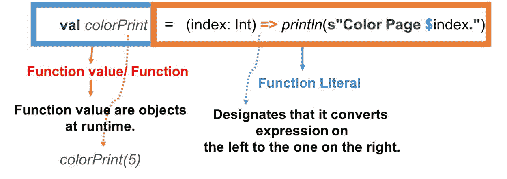
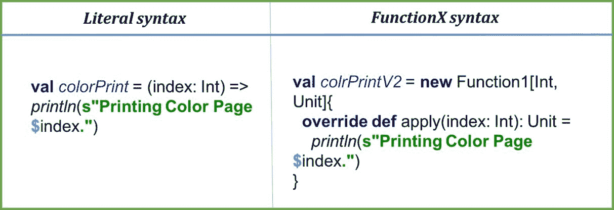
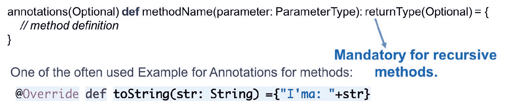
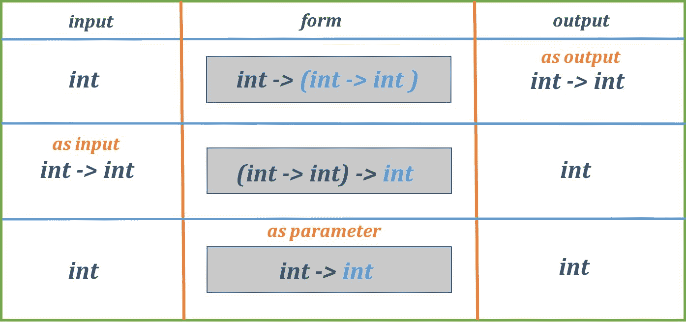

# 更多关于函数的内容

“问题不是通过提供新信息来解决的，而是通过安排我们长期以来所知道的信息。”

——路德维希·维特根斯坦

我们选择编写函数的一个原因是因为它可以使我们的代码更易于阅读，看起来更简洁。在提供解决方案时，将我们的问题陈述分解为组件/操作并为它们形成相应的函数也是更好的做法。这样，使用任何提供函数构造（几乎所有语言都提供这样的构造，因为它们很重要）的编程语言解决任何问题都会更容易。Scala 提供了多种方式来编写函数以实现目标。我们在这章中的目的是学习*如何*。如果你记得正确，我们在第四章中提到了 Scala 中的函数，即*通过函数给程序赋予意义*。我们讨论了如何声明函数以及使用不同的参数集调用它们。我们已经了解了函数评估策略和函数字面量和部分函数等重要概念，这些概念将帮助我们更好地理解本章将要学习的内容。让我们看一下。我们将继续讨论函数字面量，然后讨论以下内容：

+   方法

+   函数与方法的区别

+   闭包

+   高阶函数

+   部分应用函数

+   柯里化

高阶函数带你进入一个新宇宙，在那里使用函数、返回函数和找到其他使用这些函数的方法都很有趣。我们将在本章的结尾讨论高阶函数。现在，让我们继续理解函数字面量。

# 函数字面量

简单来说，函数字面量是表示可以执行以指定输入和输出参数类型的行为的表示：

```java
(value1: Int, value2: Int) => Int 
```

这一行代表一个函数字面量，它易于阅读。它显示了一个接受两个值，即类型为`Int`的`value1`和`value2`，并返回另一个`Int`类型的函数。我们已经看到了一些例子，例如我们的`ColorPrinter`示例，我们只需使用一个名为`printPages`的函数就能简单地打印彩色以及黑白页面：

```java
def printPages(doc: Document, lastIndex: Int, print: (Int) => Unit) = if(lastIndex <= doc.numOfPages) for(i <- 1 to lastIndex) print(i) 

val colorPrint = (index: Int) => println(s"Printing Color Page $index.") 

val simplePrint = (index: Int) => println(s"Printing Simple Page $index.") 

println("---------Method V1-----------") 
printPages(Document(15, "DOCX"), 5, colorPrint) 

println("---------Method V2-----------") 
printPages(Document(15, "DOCX"), 2, simplePrint) 
```

我们的`colorPrint`和`simplePrint`值是以下类型的函数字面量的例子：

```java
(index: Int) => Unit
```

这里的`Unit`类型表示没有返回类型。换句话说，不要期望函数字面量有任何输出。我们在第四章中讨论了这个概念，即*通过函数给程序赋予意义*，在那里我们回答了函数字面量的*是什么*和*如何*。现在，让我们回答*为什么*，这里的*为什么*指的是它解决的问题。我们将以先前的例子来说明。仔细观察，你会发现我们抽象了问题陈述。如果我们为简单和彩色页面声明了特定的函数，它们会自己说话，如下面的例子所示。

这里有一个`printColorPages`函数，它接受一个`Document`，`lastIndex`页面编号，`startIndex`页面编号，然后打印彩色页面。`printSimplePages`也是一样：

```java
def printColorPages(doc: Document, lastIndex: Int, startIndex: Int) = if(lastIndex <= doc.numOfPages) for(i <- startIndex to lastIndex) colorPrint(i) 

def printSimplePages(doc: Document, lastIndex: Int, startIndex: Int) = if(lastIndex <= doc.numOfPages) for(i <- startIndex to lastIndex) simplePrint(i) 
```

这里有一些代码异味，它们如下：

+   在这两个函数中，只有实现部分不同，即`colorPrint`和`simplePrint`

+   在这两个实现中，输入和输出参数都没有变化

+   让我们把这两个实现都取出来，并将它们作为参数传递。这将是一个与函数相同形式的函数字面量：

```java
(index: Int) => Unit 
```

通过回答这类问题，我们得到了最终函数。它看起来如下：

```java
def printPages(doc: Document, lastIndex: Int, print: (Int) => Unit) = if(lastIndex <= doc.numOfPages) for(i <- 1 to lastIndex) print(i) 
```

我希望现在你已经清楚我们如何进行这种重构。最好的事情是，一旦你自己编写了代码，这一切都会对你来说很容易。还有一点我们想了解的是，当你指定这些字面量并将它们赋值给一个值时，你应该知道它们之间的区别。下面的表示将帮助你做到这一点。让我们看看以下图示：



函数值和函数字面量

在前面的图中，我们可以看到两种形式。左边的是函数值，右边的是函数字面量。函数值是运行时对象。问题来了，*运行时对象是哪种类型*？答案是`Function1`类型，它是 Scala 中的一个特质，以下是其声明形式：

```java
trait Function1[-T1, +R] extends AnyRef 
```

在括号`[]`中，我们指定了类型参数；我们将在第十章中学习这些内容，*高级函数式编程*。现在，只需理解这两者指定我们的`Function1`实现将接受第一个类型的输入参数`T1`，输出将是类型`R`*。基本上，我们的字面量表示只是这个特质的匿名实例化，我们可以验证编译后的版本看起来如何。之前函数字面量的`javap`表示如下：

```java
public static scala.Function1<java.lang.Object, scala.runtime.BoxedUnit> colorPrint() 

public static void printPages(chapter4.Document, int, scala.Function1<java.lang.Object, scala.runtime.BoxedUnit>, scala.Function0<java.lang.Object>) 
```

前面的表示意味着以下内容是等价的：



在这里，在右侧，我们重写了`Function1`特质的`apply`方法*。这样写起来更简洁吗？是的！这就是为什么 Scala 有这种语法。这也意味着这种类型的函数值将支持`Function1`中定义的所有方法。我们知道特质有一个`apply`方法，它是特质的一个抽象成员。我们还有一些具体的成员，如下所示：

```java
def andThenA ⇒ A): (T1) ⇒ A 

def composeA ⇒ T1): (A) ⇒ R 
incrementByOne and isEven*,* and we want to form another method that performs these two operations in sequence. We can use andThen for this. Check out our implementation of incrementAndCheckForEven. It looks like plain English, telling the Scala compiler, "I'll provide you with an integer, please first execute the incrementByOne function and then check for even numbers.":
```

```java
val incrementByOne = (num: Int) => num + 1 

val isEven = (num: Int) => num % 2 == 0 

val incrementAndCheckForEven = incrementByOne andThen isEven 

println(s"Representing andThen function ${incrementAndCheckForEven(1)}") 
```

看看以下内容，以更好地理解：

```java
def andThenA ⇒ A): (T1) ⇒ A 
```

这告诉我们`isEven`是函数字面量`g`*，*，即形式为`(R) => A`。我们实现中的类型`R`是`Int`，而`X`是`Boolean`。`andThen`的返回类型是`g(apply(x))`。

同样，我们也可以为我们的`compose`函数找到用例。`andThen`和`compose`之间的区别可以通过两个示例函数——`f`和`g`来理解：

+   在`andThen(g):f(x) == g(apply(x))`的情况下

+   在`compose(g): f(x) == apply(g(x))`的情况下

你可以完成剩余的数学运算，但使用文字来形成这样的操作流水线很有趣，因为它们易于阅读和实现。这个例子结束了我们对函数文字的讨论，但请相信我，在实践中我们会大量使用这些。

到目前为止，我们一直在将“方法”和“函数”这两个术语互换使用，但实际情况略有不同。这两个概念是不同的。问题是“如何”，所以让我们先从了解方法开始，以便了解更多。

# 方法

我们已经看到了 Scala 方法，并且到目前为止已经多次使用过它们。然而，为了区分方法和函数，我们将再次查看 Scala 方法。Scala 中的方法是什么？在我们对方法的讨论中，我们将查看几个关于方法是什么的定义。让我们从方法可能包含的内容开始：



方法签名

如你所见，我们的方法以一些修饰符开始，如注解，或者像`final`这样的关键字等。这之后是`def`关键字、方法名、参数列表，然后是一个可选的返回类型。Scala 方法足够智能，可以推断出返回类型。通常，方法的返回类型是最后一个表达式评估的结果。查看以下示例：

```java
object Methods { 

  def filePrinter() = { 
    println("Version 0") 
    val filesHere = (new File(".")).listFiles() 
    for(file <- filesHere) 
      println(file) 
  } 

  def main(args: Array[String]): Unit = { 
    filePrinter() 
  } 

} 
```

结果如下：

```java
Version 0 
./.idea 
./FirstProject.iml 
./out 
./src 
```

在前面的例子中，我们有一个名为`filePrinter`的方法，它除了逐个打印当前目录下的文件名外，不做任何其他操作。值得注意的是，我们使用了`def`关键字、赋值运算符和大括号。我们更喜欢省略指定返回类型，即在我们的情况下是`Unit`。除了`Unit`之外不返回任何特定类型的方法也可以用过程语法来编写。在过程语法中，我们省略了赋值运算符，直接定义方法：

```java
def filePrinterV2() { 
  println("Version 2") 
  val filesHere = (new File(".")).listFiles() 
  for(file <- filesHere) 
    println(file) 
} 
```

在前面的代码中，我们编写了一个方法，用于打印当前目录下的所有文件名。现在，看看下面的内容：

```java
import java.io.File 

object Methods { 

  def filePrinter() = { 
    println("Version 0") 
    val filesHere = (new File(".")).listFiles() 
    for(file <- filesHere) 
      println(file) 
  } 

  def filePrinterV1() 
  { 
    println("Version 1") 
    val filesHere = (new File(".")).listFiles() 
    for(file <- filesHere) 
      println(file) 
  } 

  def filePrinterV2() { 
    println("Version 2") 
    val filesHere = (new File(".")).listFiles() 
    for(file <- filesHere) 
      println(file) 
  } 

  def filePrinterV3() = println("Version 3") 
    val filesHere = (new File(".")).listFiles() 
    for(file <- filesHere) 
      println(file) 

  def main(args: Array[String]): Unit = { 
    filePrinter() 
    filePrinterV1() 
    filePrinterV2() 
    filePrinterV3() 
  } 

} 
```

我们以不同版本的形式对`filePrinter`方法有四种表示，从`V0`到`V3`。对于所有四种方法，我们的意图是相同的。我们想要打印当前目录下的文件名。你能猜出哪些会起作用吗？

如果你猜完了，让我们看看输出结果：

```java
./.idea 
./FirstProject.iml 
./out 
./src 
Version 0 
./.idea 
./FirstProject.iml 
./out 
./src 
Version 1 
./.idea 
./FirstProject.iml 
./out 
./src 
Version 2 
./.idea 
./FirstProject.iml 
./out 
./src 
Version 3 
```

这是我们的文件打印器文件的输出。通过仔细观察，你会发现对于`filePrinter`版本`V0`、`V1`和`V2`，输出是正确的，但对于版本`V3`，输出是不正确的。此外，评估的顺序告诉我们，在我们的代码的某个地方，我们正在打印文件名。你可能会意识到这是因为我们尝试定义方法版本 v3 的方式。`filePrinterV3`方法只定义了一个简单的`println`。Scala 编译器将方法作用域之外后续的语句视为错误。嗯，我们可以确保这类错误不会发生。

我们可以通过显式指定方法的返回类型来实现这一点。指定返回类型会让 Scala 编译器负责处理这类错误，并在编译时通知你。

关于 Scala 中的方法，需要注意的一点是它们是非值类型。这意味着在运行时没有实例或对象。这种概念让我们去探究我们究竟意味着什么以及它是如何工作的。这个声明也提供了函数和方法之间的一大区别。让我们来探究一下这个区别。

# 函数与方法的比较

在本章的开头，我们提到我们通常将术语**函数**和**方法**互换使用。但现实情况并非如此。在 Scala 中，这两个是完全不同的概念。我们将使用几个例子来帮助理解这一点。

我们将查看所有差异，从语法差异到语义差异。我们还将探讨何时使用函数或方法：对于现在，让我们使用一个之前的例子。对于`colorPrinter`函数，在两个版本中，我们将定义一个方法并给它命名为`colorPrintV3`：

```java
val colorPrint = (index: Int) => println(s"Printing Color Page $index.") 

val colorPrintV2 = new Function1[Int, Unit]{ 
  override def apply(index: Int): Unit = 
    println(s"Printing Color Page $index.") 
} 

def colorPrintV3(index: Int) = println(s"Printing Color Page $index.") 
```

我们可以以类似的方式调用它们。在语法上没有区别：

```java
println("---------Function V1-----------") 
printPages(Document(15, "DOCX"), 2, colorPrint) 

println("---------Function V2-----------") 
printPages(Document(15, "DOCX"), 2, colorPrintV2) 

println("---------Method V3-----------") 
printPages(Document(15, "DOCX"), 2, colorPrintV3) 
```

在这里，`colorPrint`和`colorPrintV2`是函数，而`colorPrintV3`是方法。在前面的用例中，我们将所有这些作为字面量传递。这看起来很相似，并且它以类似的方式工作。它也提供了输出：

```java
---------Function V1----------- 
Printing Color Page 1\. 
Printing Color Page 2\. 
---------Function V2----------- 
Printing Color Page 1\. 
Printing Color Page 2\. 
---------Method V3----------- 
Printing Color Page 1\. 
Printing Color Page 2\.  
```

我们说 Scala 中的方法和函数是不同的，但我们使用它们的方式和结果是相似的。这是因为编译器在看到可能进行转换的情况下会动态地将方法转换为函数。因此，这是我们对这种冲突情况的反证。我们最好调查一下。

我们将检查编译器生成的类文件。我们的目的是调查这三个：

+   `colorPrint`

+   `colorPrintV2`

+   `colorPrintV3`

编译器生成的文件如下：

```java
:> javap ColorPrinter.class 
Compiled from "FuncLiterals.scala"
public final class chapter4.ColorPrinter { 
  public static void main(java.lang.String[]); 
  public static void delayedInit(scala.Function0<scala.runtime.BoxedUnit>); 
  public static void delayedEndpoint$chapter4$ColorPrinter$1(); 
  public static long executionStart(); 

  public static void colorPrintV3(int); 

  public static scala.Function1<java.lang.Object, scala.runtime.BoxedUnit> colorPrintV2(); 

  public static scala.Function1<java.lang.Object, scala.runtime.BoxedUnit> colorPrint(); 

  public static void printPages(chapter4.Document, int, scala.Function1<java.lang.Object, scala.runtime.BoxedUnit>, scala.Function0<java.lang.Object>); 

  public static boolean printerSwitch(); 
} 
```

当我们观察前面编译的`colorPrint`函数系列的类表示时，我们可以清楚地看到 Scala 在内部处理它们的方式是不同的。从这个角度来看，我们可以得出以下结论：

+   Scala 函数字面量被编译成 FunctionX 特质的形态（这里的 X 是一个占位符，代表一个数字，意味着这个函数将要支持的参数数量）。我们已经看到，这个 FunctionX 特质自带了更多方法，例如`apply`、`andThen`和`compose`。

+   Scala 方法被编译成普通的 Java 方法。

+   最后，适合对象上下文的方法，例如 FunctionX 特质中的 `apply` 方法，仅在 FunctionX 的匿名实例上调用，因此以下对 `apply` 方法是有意义的：

```java
colorPrintV2(3) 
```

上述代码等同于以下代码：

```java
new Function1[Int, Unit]().apply(3) 
```

这告诉我们 Scala 在编译时对函数语法做了一些魔法操作。我们还知道我们的字面量是 *Ffunction objects*，因此我们可以对它们执行操作，如 `toString`，以及等价操作。因此，以下操作是有效的：

```java
colorPrint == colorPrintV2 //false 
```

然而，编译器不会让你执行以下操作：

```java
colorPrint == colorPrintV3 //Compile Time Error 
```

原因在于 `colorPrintV3` 是一个方法而不是值类型。此外，如果你尝试在 `colorPrintV3` 上调用 `toString`，编译器会对此提出抱怨，并阻止你在方法类型上执行此类操作。Scala 编译器会自动将方法转换为它的字面等价物，并提供了一种显式执行它的方式。我们使用以下语法来实现这一点：

```java
val colorPrintV4 = colorPrintV3 _ 
```

看一下后面的下划线。这种语法糖足以让 Scala 编译器将方法转换为函数。现在，你可以调用 `toString`，创建一个函数管道，或者在 `colorPrintV4` 上使用 `andThen` 或 `compose` 方法。我们甚至可以在它上面执行等价方法。所以这就是 Scala 中方法和函数的不同之处，但现在问题来了，何时选择什么？

# 方法还是函数？

现在你已经了解了方法和函数之间的区别，你可能想知道在哪里以及何时使用什么。我应该更倾向于函数而不是方法，或者相反吗？早些时候，我们定义了一个 `colorPrinterV3` 方法，并将其传递给我们的高阶 `printPages` 函数（我们将在后面的章节中讨论高阶函数）*。* 现在你已经知道编译器必须付出额外的努力将方法转换为它的函数等价物，因此很明显，在依赖于高阶函数的使用场景中，拥有函数的作用域是一个好的选择，这样我们才能正确地沟通。除此之外，很明显，定义函数而不是方法给我们提供了更多的功能选项。我们已经看到了 `andThen` 和 `compose` 等方法的例子。这些方法让我们增强了功能。在性能方面，使用上没有太大的区别。有一些场景下，只有方法才是解决方案：

+   我们可以为方法参数提供默认值，但函数则不行。

+   在父类-子类关系中的父类方法重写，我们仍然可以使用 `super` 调用访问父类的该方法版本。然而，一旦你重写了函数，你就不能进行 `super` 调用，并且只能使用实现。

因此，根据你的需求选择使用哪一个是很明智的。函数为我们提供了更多的链式操作能力。我们可能会选择最适合我们的任何一个。

现在，让我们再次查看我们已有的代码片段，看看我们是否可以做一些修改：

```java
object ColorPrinter extends App { 

  val printerSwitch = false 

 def printPages(doc: Document, lastIndex: Int, print: (Int) => Unit, isPrinterOn: => Boolean) = { 

    if(lastIndex <= doc.numOfPages && isPrinterOn) for(i <- 1 to lastIndex) print(i) 

  } 

  val colorPrint = (index: Int) => println(s"Printing Color Page $index.") 

  val colorPrintV2 = new Function1[Int, Unit]{ 
    override def apply(index: Int): Unit = 
      println(s"Printing Color Page $index.") 
  } 

  println("---------Function V1-----------") 
  printPages(Document(15, "DOCX"), 2, colorPrint, !printerSwitch) 

  println("---------Function V2-----------") 
  printPages(Document(15, "DOCX"), 2, colorPrintV2, !printerSwitch) 

} 

case class Document(numOfPages: Int, typeOfDoc: String) 
```

我使用这个`Printer`示例是因为它容易理解，我们之前已经看到了它的部分内容。所以，当我们查看`printPages`函数的调用时，我们可能想要进行一些重构。首先，我们知道通过检查`printerSwitch`值来检查打印机是开启还是关闭的逻辑。此外，每次我们调用`printPages`时，我们必须传递`!printerSwitch`参数。我们希望省略告诉打印机检查它是否开启的额外负担。我们希望打印机已经知道这一点，这正是我们要做的。但在编程环境中，是否可以从`printPages`函数的内层作用域引用`printerSwitch`？是的，如果我们选择使用闭包，这是可能的。让我们讨论闭包以及我们如何在 Scala 中定义它们。

# 什么是闭包？

我们将使用闭包解决上一节中的问题。但首先，让我们解释一下**闭包**的概念。在编程术语中，闭包有多个定义：

+   闭包简单地说是在运行时创建的函数值，它包含对不在局部作用域中的自由变量的引用。

+   在实际意义上，闭包是一个你可以传递的函数，它保留了在创建时相同的范围和值。

我们这些话是什么意思？让我们用一个简单但有趣示例来检查一下：

```java
object AClosure extends App { 

  var advertisement = "Buy an IPhone7" 

  val playingShow = (showName: String) => println(s"Playing $showName. Here's the advertisement: $advertisement") 

  playingShow("GOT") 
  advertisement = "Buy an IPhone8" 

  playingShow("GOF") 

} 
```

结果如下：

```java
Playing GOT. Here's the advertisement: Buy an IPhone7
Playing GOF. Here's the advertisement: Buy an IPhone8
```

所以，你明白了，对吧？在这里，我们创建了一个期望一个`showName`并播放它的函数。这并不那么顺利，我们不得不观看一些广告。这就是前面代码中发生的事情。很明显，用例并不实用，但概念很容易理解。我们试图引用不在我们`playingShow`函数局部作用域中的变量。当我们第一次使用这个函数时，`playingShow`的运行时表示正在引用 iPhone 7 广告。然后我们进行时间旅行，当我们第二次调用`playingShow`时，我们观看了一个与前一个不同的广告。要吸取的要点是，我们`playingShow`的运行时表示被称为闭包。与闭包相关的术语包括*开放项*和*封闭项*。在这里，在我们的例子中，`advertisement`被称为自由变量，因为它不在我们*函数*/*闭包*的局部作用域中，而`showName`参数，我们明确引用的，被称为*绑定变量*。当我们尝试仅使用绑定变量形成函数字面量时，它被称为封闭项。而反过来，当你包含一个自由变量时，它就变成了开放项。

一个封闭项的例子如下：

```java
(showName: String) => println(s"Playing $showName. No Advertisement") 
```

一个开放项的例子如下：

```java
(showName: String) => println(s"Playing $showName. Here's the advertisement: $advertisement") 
```

还有一点需要注意，闭包只保留对自由变量的引用。这就是我们能够检测到`advertisement`值变化的原因。

现在你对闭包*有了些了解，*让我们回到`printPages`函数的重构上来。我们期望的行为是打印机在打印之前就应该知道如何切换。我们可以省略`printPages`中指定的函数字面量。然后有两种可能的解决方案：

```java
val printerSwitch = false 

def printPages(doc: Document, lastIndex: Int, print: (Int) => Unit) = { 

  if(lastIndex <= doc.numOfPages) for(i <- 1 to lastIndex) print(i) 

} 

val colorPrint = (index: Int) => if(!printerSwitch) println(s"Printing Color Page $index.") 

val colorPrintV2 = new Function1[Int, Unit]{ 
  override def apply(index: Int): Unit = 
    if(!printerSwitch) println(s"Printing Color Page $index.") 
} 
isPrinterOn function literal and added the explicit printerSwitch check in two functions, colorPrint and colorPrintV2. This is possible because we were sure about the printer functionality driven by the switch. Also, we removed the extra burden of passing this function literal each time we call for a print. This is a fine and acceptable solution to our problem and the reason we're trying out this example is that it's using a closure in the solution. When we include printerSwitch, which is not in the local scope of our colorPrint function literal*,* we make it a closure. Then, as with our last example, the runtime representation of our colorPrint is going to keep the reference of our printerSwitch forming a closure*.* The refactor seems fine, but it can be enhanced, let's check out the second solution:
```

```java
val printerSwitch = false 

def printPages(doc: Document, lastIndex: Int, print: (Int) => Unit) = { 

  if(lastIndex <= doc.numOfPages && !printerSwitch) for(i <- 1 to lastIndex) print(i) 

} 

val colorPrint = (index: Int) => println(s"Printing Color Page $index.") 

val colorPrintV2 = new Function1[Int, Unit]{ 
  override def apply(index: Int): Unit = 
    println(s"Printing Color Page $index.") 
} 
```

在第二个解决方案中，我们所做的是从`printPages`函数的参数列表中移除了`isPrinterOn`，并将实现与`!printerSwitch`一起放置。这使得我们的`printPages`函数成为一个闭包，并且我们能够在`colorPrint`和`colorPrintV2`中减少代码重复。所以这是我们解决方案的另一种替代方案。

我希望你能理解闭包的概念以及它是如何被使用的。我们还了解到，闭包并不能解决那些没有它们就无法解决的问题。它们只是以简洁的方式完成任务的一种替代方案。我们还看到闭包会携带状态；这是一个在许多语言中定义的概念，在那些没有状态存在的语言（如**Haskell**）中，这些被用来携带*不可变状态*。然而，这些是解决特定问题的基本且有趣的替代方案。在 Scala 中，有几种这样的工具类型结构可用，使用这些结构我们可以使我们的代码更加优雅，闭包就是其中之一。

我们已经讨论了很多关于函数、方法和闭包的内容。在这个过程中，我们提出了各种高阶函数。所以现在，我们对高阶函数的概念已经相当熟悉了。当我们看到它时，不会觉得奇怪或感到不舒服。太好了，那么让我们详细讨论一下。你已经对它们在函数式编程环境中的强大功能有所了解。我们将进一步探索它们。

# 高阶函数

我们知道我们只能将一等值对象作为参数传递给方法或函数。例如，看看这个简单的方法：

```java
def sum(a: Int, b: Int) = a + b 
```

这是一个名为`sum`的方法，声明了两个参数`a`和`b`。现在，要使用这个方法，我们将传递参数。在参数列表中，很明显我们必须传递整数值。显然，任何类型，如果它是一个值，都可以声明为函数参数，并在调用函数时用作参数。

在 Scala 中，函数字面量不过是函数特质对象，因此很明显我们可以将它们声明为参数并用作参数。这产生了包含函数作为参数的函数，以及包含函数字面量作为参数的函数调用。这类函数被称为**高阶函数**（**HOF**）。使用高阶函数有其自身的优势。我们已经看到了其中的一些。无论我们在库、框架或代码中定义抽象语法的地方，高阶函数都得到了广泛的应用。如果你考虑这些行为/函数如何以高阶方式使用，你会想到以下几种场景：

+   函数作为输出

+   函数作为输入

+   函数作为参数

前面的场景指定了三种我们可以使用函数字面量作为高阶函数的条件。看看下面的图，以获得清晰的画面：



高阶函数的几种形式

如表所示，我们使用了形式为 `int => int` 的函数字面量，这意味着一个接受整数作为输入并在其上执行某些操作后返回另一个整数的函数。图中的第一种形式接受一个整数作为输入参数并返回一个形式为 `int -> int` 的函数字面量。在第二种形式中，我们接受一个形式为 `int -> int` 的函数字面量，并给出一个整数作为输出。在最终形式中，我们期望一个整数和一个形式相同的 `int -> int` 函数字面量作为参数。让我们看几个例子来更清楚地了解：

```java
object HOFs extends App { 

  def multiplier10(x : Int): Int => Int = x => x * 10   //functionAsOutput 

  def intOpPerformer(g: Int => Int) : Int = g(5)        //functionAsInput 

  def multiplicator(x: Int)(g: Int => Int): Int = g(x)  //functionAsParameter 

  println(s"functionAsInput Result: ${intOpPerformer(multiplier10(5))}") 

  println(s"functionAsParameter Result: ${multiplicator(5)(multiplier10(5))}") 

} 
```

结果如下：

```java
functionAsInput Result: 50 
functionAsParameter Result: 50 
```

在前面的代码中，我们定义了所有三种形式。第一种形式输出一个函数，命名为 `multiplier10`，形式本身具有说明性。它接受一个整数并返回一个乘以 10 的函数字面量。

第二个是一个高阶方法，它接受一个函数字面量作为输入，并输出一个整数作为结果。`intOpPerformer` 方法，正如其名所示，执行类型为 `Int => Int` 的操作，无论是乘法操作还是任何其他操作。无论我们传递什么，它都将被使用，输出将如签名中所述的整数。我们可以通过提供一个输入函数字面量来调用该函数：

```java
intOpPerformer(multiplier10(5)) 
```

因此，这是我们可以利用函数高阶性质的另一种方式。还有另一种，第三种版本，我们将这个函数字面量作为参数列表的一部分传递，它将第一个参数值应用于第二个参数函数，并给出一个整数结果。`multiplicator` 函数是这种结构的例子。我们使用了函数的柯里化形式。我们将在后续章节中学习柯里化：

```java
multiplicator(5)(multiplier10(5)) 
```

这些是我们可以整合高阶函数的方式，并且它们都解决了某些问题。通过移除代码重复，我们可以抽象出模式，并创建我们函数的高阶版本。这就是我们使用它们的方式。

我们著名的`ColorPrinter`示例也使用了高阶函数：

```java
def printPages(doc: Document, lastIndex: Int, print: (Int) => Unit, isPrinterOn: => Boolean) = { 

    if(lastIndex <= doc.numOfPages && isPrinterOn) for(i <- 1 to lastIndex) print(i) 

  }  
```

在这里，`print`是一个高阶函数，我们将其作为参数传递。仔细观察将更好地解释它。`colorPrint`参数本身就是一个函数字面量：

```java
printPages(Document(15, "DOCX"), 2, colorPrint, !printerSwitch) 

val colorPrint = (index: Int) => println(s"Printing Color Page $index.") 
```

这仅仅是因为`colorPrint`是一个值对象。在此话题上，有时你可能读到：“函数式语言将函数视为一等值。”我们所说的*一等值*是什么意思？这意味着我们声明一个整数或字符串值并使用它们作为参数的方式。同样，我们可以声明一个函数字面量并将其用作其他函数的参数。

高阶函数使得以简单和可读的方式组合函数或函数链以执行复杂任务变得容易得多。不用说，像`map`、`flatmap`、`filter`、`fold`等这样的实用函数都是高阶函数。在 Scala 或其他任何编程语言中，像`map`、`filter`或`flatmap`这样的函数是试图解决特定模式问题的一个结果。因此，很明显，我们从函数中提取了某个模式的一部分，并用高阶函数替换了它。这个动作的想法是将实现抽象成函数字面量。

为了更好地理解，一个简单的例子是对两个整数进行简单的数学运算。看看以下内容：

```java
def add(a: Int, b: Int) = a + b 

def multiply(a: Int, b: Int) = a * b 

def subtract(a: Int, b: Int) = a - b 

def modulus(a: Int, b: Int) = a % b 
```

在前面的代码中，有几个方法接受两个输入参数并执行特定的操作。使用这些方法也很简单：

```java
add(10, 5) 
subtract(10, 5) 
multiply(10, 5) 
modulus(10, 5) 
```

但作为优秀的程序员，检查实现细节是我们的职责，即使解决方案已经可行。当你这样做时，你会看到所有四种实现有许多共同之处。所有四种方法都有两个参数，但定义证明是不同的，因为每种方法执行的操作不同。从某种意义上说，我们知道我们可以将签名和实现细节抽象出来，以函数字面量的形式形成一个高阶函数。因此，我们为此采取步骤。

+   首先，我们创建了所有四种实现的功能字面量版本，它们的形式为`(Int, Int) => Int`，我们得到了以下类似的内容：

```java
val add = (a: Int, b: Int) => a + b 
val multiply = (a: Int, b: Int) => a * b 
val subtract = (a: Int, b: Int) => a - b 
val modulus = (a: Int, b: Int) => a % b 
```

这确保了我们可以在不担心内部动态转换的情况下传递这些字面量。

+   然后，我们编写了一个抽象方法，它接受一个这样的函数字面量和两个整数参数来执行操作。结果看起来如下：

```java
def operation(op: (Int, Int) => Int, a: Int, b: Int) : Int = op(a, b) 
```

在这里，`operation`是一个高阶方法，它接受一个函数字面量和两个参数，并调用传递给其他参数的函数。

现在，使用高阶方法就像调用任何其他函数一样简单：

```java
operation(add, 10, 5) 
operation(subtract, 10, 5) 
operation(multiply, 10, 5) 
operation(modulus, 10, 5) 
```

你可能会问这是否有意义。我们仍然写了同样（加上一些额外）的代码行。所以让我们移除我们写的字面量，因为那些只是我们命名的字面量。我们可以通过提供动态意图来直接使用 `operation` 函数的功能。在最终实现之后，我们的代码看起来如下：

```java
object HOFs extends App { 

  def operation(op: (Int, Int) => Int, a: Int, b: Int) : Int = op(a,b) 

  println(operation((a, b) => a + b, 10, 5)) 
  println(operation((a, b) => a * b, 10, 5)) 
  println(operation((a, b) => a - b, 10, 5)) 
  println(operation((a, b) => a % b, 10, 5)) 

} 
```

结果如下：

```java
15 
50 
5 
0 
```

真正需要的只是一个单行函数，即 `operation` 高阶函数。接下来的几行是对先前 `operation` 函数的调用。有一点需要注意，在 `operation` 函数的调用端，我们没有提供 `a` 和 `b` 参数的类型。这是因为 Scala 足够强大，能够理解 `operation` 函数的第一个参数期望的类型与我们提供的类型相同。

希望这个例子能帮助你理解高阶函数的概念。在实践中，你用得越多，就越能体会到它们的强大。存在几种形式，我们可以用它们来解决问题。

现在我们已经看到了高阶函数的多个表示和用法，让我们看看另一种使用柯里化的方式来调用函数。你可能已经听说过柯里化这个概念。在这里，我们的座右铭是理解柯里化的含义以及它解决的问题。

# 柯里化

Scala 允许你在函数或方法中传递多个参数。我们可能想要创建这种函数的中间版本。这给了我们一个单一函数的多个版本。换句话说，我们可以将具有多个参数的每个函数分解为单参数函数。我们为什么要创建单参数函数呢？这个答案就是，我们可以利用它来进行函数组合。例如，我们可以借助域名、托管和网站平台来启动一个网站。请看以下示例：

```java
WebsitePlatform => DomainName => Host 
```

如果你有一个接受域名作为参数的函数，另一个接受网站平台作为参数的函数，以及另一个接受托管平台作为参数的函数，你可以将它们组合起来以拥有一个完整的网站。函数组合之所以强大，是因为它为你提供了更多的选项，同时结合了中间函数。一个普通的函数可能看起来像以下这样：

```java
def makeWebsite(platform: WebsitePlatform, domainName: DomainName, host: Host) = println(s"Making $domainName using $platform with hosting from $host ") 
```

这种方法的形式并不提供你在函数组合时所拥有的相同功能。如前所述，在 Scala 中，我们可以将我们的函数转换为柯里化形式，或者将具有多个参数的函数转换为单参数函数。为此，Haskell Curry 提供了柯里化的概念。以下是一个帮助我们理解这个概念的示例。我们将使用制作网站的相同示例。问题陈述很清晰。我们想要组合中间函数，在这些函数中我们可以传递多个单参数列表。最终函数应该看起来像以下这样：

```java
def makeWebsite(platform: WebsitePlatform)(domainName: DomainName)(host: Host): Unit 
```

在这里，`WebsitePlatform`、`DomainName`和`Host`是我们选择使用的类型。我们可以使用 Scala，提供`type`关键字来创建这些类型。前面函数的一种形式如下：

```java
WebsitePlatform => DomainName => Host => Unit 
```

假设你想要一个中间函数，它不需要处理网站平台，只需为指定的账户创建一个 WordPress.com 平台账户。该函数应返回如下内容：

```java
DomainName => Host => Unit 
```

其他两个中间版本也是如此。例如，你想要创建一个使用默认 WordPress.com ([`wordpress.com/`](https://wordpress.com/)) 平台和你的网站的默认 WordPress URL 的虚拟网站。该版本看起来如下：

```java
Host => Unit 
```

最终版本使用 bluehost.com 作为默认托管提供商并为你创建网站来处理所有默认设置。一个示例应用看起来如下：

```java
object Curried extends App { 

  type WebsitePlatform = String 
  type DomainName = String 
  type Host = String 

  def makeWebsite(platform: WebsitePlatform)(domainName: DomainName)(host: Host) = 
    println(s"Making $domainName using $platform with hosting from $host ") 

  val wordPress: DomainName => Host => Unit = makeWebsite("WordPress") 

  val wordPressDummyDotCom : Host => Unit = wordPress("dummy123.com") 

  val blueHostedWordPressDummyDotCom : Unit = wordPressDummyDotCom("Bluehost.com") 

  blueHostedWordPressDummyDotCom

 }
```

结果如下：

```java
Making dummy123.com using WordPress with hosting from Bluehost.com 
```

你查看过前面的代码了吗？我们逐步使用了组合来制作一个默认网站创建器，该创建器使用 WordPress.com 作为网站平台，bluehost.com 作为托管提供商，以及一些虚拟 URI 作为 URL。让我们尝试理解这是如何工作的。我们首先做的是添加一个语法增强，以便更好地理解。我们使用类型关键字声明的三个类型只是字符串。当然，这些字符串是用于演示目的的。它们可以是不同类型的。然后我们声明了一个接受三个不同单参数列表的方法的柯里化版本。定义现在并不很重要，我们只是打印出来。

然后是有趣的部分。我们创建了一个名为`wordPress`的函数的中间版本，该函数的返回类型是`DomainName => Host => Unit`。在接下来的步骤中，我们创建了一个名为`wordPressDummyDotCom`的另一个中间函数，该函数特定于 WordPress.com 并使用虚拟 URL。同样，我们又组合了另一个函数，提供了另一个默认网站组件。这种做法的优势在于，我们可以创建具有不同网站平台的多个版本，从而使你的程序客户端更容易操作，因为你几乎为每一组参数提供了多个默认函数的版本。为此，我们使用的不过是函数的柯里化形式。在 Scala 中，转换或编写函数的柯里化版本非常常见，以至于该语言有默认的方式来做这件事。在 Scala 中，可以将具有多个参数的函数转换为它的柯里化对应版本。

# 将具有多个参数的函数转换为柯里化形式

在 Scala 中，我们有一个名为`curried`的函数，我们可以用它将我们的函数转换为柯里化形式。让我们通过一个简单的例子来更好地理解：

```java
def add = (x: Int, y: Int) => x + y 

val addCurried = add.curried 

println(add(5,6)) 
println(addCurried(5)(6)) 
```

结果如下：

```java
11 
11 
```

这里，我们定义了一个简单的两个参数函数字面量名为`add`。然后，我们使用 Scala 提供的名为`curried`的函数将函数转换为它的柯里化形式。我们将结果命名为`addCurried`。有了这个，我们能够调用这两个函数并得到相同的结果。

也有一种方法可以将柯里化函数取消柯里化。我们有这个`uncurried`方法，使用它可以转换柯里化函数为非柯里化形式：

```java
val addCurriedUncurried = Function.uncurried(addCurried) 

println(addCurriedUncurried(5,6)) 
```

结果如下：

```java
11 
```

这就是在 Scala 中使用柯里化的方式。在 Scala 中，我们可以使用类似的构造来满足相同的目的，我们称之为*部分应用函数*。这些与柯里化不同。让我们详细讨论这个话题。

# 部分应用函数

部分应用函数，正如其名所示，只部分应用函数。这意味着对于参数列表中有多个参数的函数，我们不为每个参数提供一个值。如果我们不想提供参数，我们只需将它们留空。现在我们知道了这一点，让我们看看一个与我们在学习柯里化时看到的类似例子。有了这个，你将能够区分这两种情况。

首先，看看多参数函数，我们将它们转换为部分应用形式：

```java
def makeWebsite(platform: WebsitePlatform, domainName: DomainName, host: Host) = 
  println(s"Making $domainName using $platform with hosting from $host ") 
```

在这里，`makeWebsite`，正如我们之前所看到的，接受三个参数，`platform`、`domainName`和`host`。看看我们可以使用各种中间或部分应用函数创建的应用程序：

```java
object PaF extends App { 

  type WebsitePlatform = String 
  type DomainName = String 
  type Host = String 
  type Protocol = String 

  def makeWebsite(platform: WebsitePlatform, domainName: DomainName, host: Host) = 
    println(s"Making $domainName using $platform with hosting from $host ") 

  val wordPressSite: (DomainName, Host) => Unit = makeWebsite("WordPress", _: DomainName, _: Host) 

  val makeExampleDotCom: (WebsitePlatform, Host) => Unit = makeWebsite(_: WebsitePlatform, 
      "example.com", 
      _: Host 
    ) 

  val makeBlueHostingExampleDotCom: (WebsitePlatform) => Unit = makeWebsite(_: WebsitePlatform, 
    "example.com", 
    "bluehost.com" 
    ) 

  makeWebsite("Wordpress", "anyDomain.com", "Godaddy.com") 
  wordPressSite("example.com", "Godaddy.com") 
  makeExampleDotCom("Wordpress", "bluehost.com") 
  makeBlueHostingExampleDotCom("Blogger") 

} 
```

结果如下：

```java
Making anyDomain.com using Wordpress with hosting from Godaddy.com  
Making example.com using WordPress with hosting from Godaddy.com  
Making example.com using Wordpress with hosting from bluehost.com  
Making example.com using Blogger with hosting from bluehost.com 
```

因此，这里我们可以看到三个部分应用函数。看看第一个：

```java
val wordPressSite: (DomainName, Host) => Unit = makeWebsite("WordPress", _: DomainName, _: Host) 
```

函数名暗示了它的作用。我们可以预期这个函数将提供一个针对`WebsitePlatform`的部分应用函数，这就是为什么函数的返回类型是以下形式：

```java
(DomainName, Host) => Unit 
```

要使用此函数，我们只需提供未应用的参数即可，它就会工作：

```java
  wordPressSite("example.com", "Godaddy.com") 
```

同样，我们也描述了其他版本，让我们看看它们。对于其中一个，我们在调用时提供了一个默认的虚拟 URL、网站平台和托管服务：

```java
val makeExampleDotCom: (WebsitePlatform, Host) => Unit = makeWebsite(_: WebsitePlatform, 
      "example.com", 
      _: Host 
    ) 
```

该版本返回的类型如下：

```java
(WebsitePlatform, Host) => Unit 
```

当我们查看实现部分时，我们看到未应用的参数被下划线替换。我们还明确地提供了参数的类型。因此，从某种意义上说，*部分应用函数*解决了柯里化为我们解决的问题。此外，我们知道*部分函数*有类似的概念。因为我们已经了解了*部分函数*，我们必须知道它们只是为特定的一组输入值定义的函数。因此，我们应该能够区分这三个概念。

通过对*部分应用函数*的讨论，我们结束了本章的内容。让我们总结一下我们学到了什么。

# 概述

在本章中，我们增强了我们在 Scala 中对函数的知识。我们从基本的方法和函数定义开始，研究了它们之间的区别，并探讨了 Scala 如何处理它们。我们还看到 Scala 足够智能，能够在需要时将方法转换为函数。然后我们进一步讨论，并谈到了闭包。我们了解了什么是 *闭包*，然后我们对 Scala 中的高阶函数进行了深入的讨论。这是必要的，因为我们已经在使用高阶函数，并且看到了它们的多种形式。之后，我们研究了柯里化，并讨论了 *部分应用函数*。我们知道部分应用函数与 *部分函数* 和 *柯里化* 是不同的。因此，我们现在对 Scala 中的函数有了坚实的理解，因为我们已经彻底研究了它们。

现在是时候更进一步，学习一些高级函数式结构了。本章获得的知识将帮助我们完成下一章的学习，我们将学习高级函数式结构。
