# Akka 简介

“技术什么都不是。重要的是你相信人们，相信他们是好的和聪明的，如果你给他们工具，他们会用它们做出奇妙的事情。”

- 史蒂夫·乔布斯

作为开发者，我们习惯于面对编程问题，并使用抽象、编程模型或某些设计模式来解决问题。这些编程模型往往使我们的生活和消费者的生活变得更轻松。本章将介绍一种解决多个问题的编程模型。我们将了解并使用基于*Actor 模型*的 Akka。我们可以将 Akka 库（好吧，大部分）视为一套开源库，帮助你编写并发、容错和分布式应用程序。我们将讨论从这个工具包中你可以期待什么。随着我们进入本章，我们将尝试理解 actor 模型以及这些 actor 如何协同工作，以及 actor 机制与其他任何并发机制的不同之处。

由于本章以及本书的范围不包括遍历所有 Akka 库，因此我们将专注于理解 actor 系统，这是 Akka 工具包中任何其他库的基础。这将使我们能够在需要时使用它们。在本章中，我们将讨论以下内容：

+   我们为什么关心 Akka*？

+   Actor 模型有什么问题？

+   实践中的 Actor

+   监督 Actor*的故障

+   测试 Actor

那么我们为什么还要关心另一种编程模型呢？让我们来探究一下。

# 我们为什么关心 Akka？

在我们周围充斥着大量数据的情况下，我们的计算机/处理系统正在努力追求性能。通过多核架构和分布式计算，我们实现了可接受的服务可用性下的高性能。但这一点不能视为理所当然；我们已经到了一个已经拥有机制来处理由于系统或我们使用的编程模型的不完善而出现的问题的地步。

由于多核架构的出现，我们的系统能够以高性能处理大量数据。但我们的编程模型中存在一个故障，我们使用它来改变状态，同时使用多个线程来改变程序中存在的状态。这给了我们思考的理由。

两个或多个线程试图处理特定的共享状态可能会导致*死锁*（更多内容请参阅第十三章，*Scala 中的并发编程*，我们将更详细地讨论并发和线程），而且你的程序可能甚至无法完成。但尽管如此，我们仍在讨论这个问题；我们无处看到解决方案。我们可以考虑的一种处理线程和问题的方法是通过某种锁定机制，这样两个独立的线程就不能同时访问相同的实例/状态。

但这样想，通过引入锁，我们使操作系统中断/挂起线程，稍后恢复以执行相同任务。这要求你的计算机 CPU 承担更多。

这意味着在没有锁的情况下，我们面临着实例状态的难题，而现在有了锁，程序的性能受到了影响。现在想象一个多线程的分布式环境；那里的生活更糟糕。

此外，我们在多线程环境中处理失败的方式并不令人满意。因此，我们需要一个不同的机制来处理这些问题。在 Akka*的情况下，我们让实体通过消息进行交互。我们通过创建 actors 来创建实体，这些 actors 通过相互传递消息进行通信。你可以将这种通信方式与网络通信进行比较，在那里我们依赖于 HTTP 请求-响应来执行预期的操作。同样，通过在 Actor 实例中封装状态，我们倾向于将不可变实例传递给另一个 actor 以执行某些逻辑。接收消息的 actor 在应用/执行一些逻辑后返回响应。这就是我们构建系统的方式。

Actor 模型已被证明是一种非常有效的解决方案。Akka 提供了这种 actor 模型，并为 actors 强制执行树状结构。关于 actors 的一些需要注意的点：

+   通过通过消息进行通信，我们排除了对特定实例状态进行破坏的可能性

+   由于一个 actor 一次只能处理一条消息，我们避免了死锁的情况

+   在建立层次结构后，形成领域逻辑更容易

+   两个 actors 之间的父子关系使我们能够处理错误行为；在 Akka 术语中，我们称之为*监督策略*

我们将探讨 actors 如何通信以及消息是如何排序/存储和执行的。首先，让我们尝试理解*Actor 模型*。

# 有关 Actor 模型的问题是什么？

从我们的讨论中可以看出，我们有一些实体在接收到某些消息或请求时采取行动。我们称它们为 Actors*。为了解决某些特定领域的问题，我们可能需要多个 Actors*。考虑一个基本的电子商务结账流程场景。有多个关注点。以下图表表示了基本预期的流程：

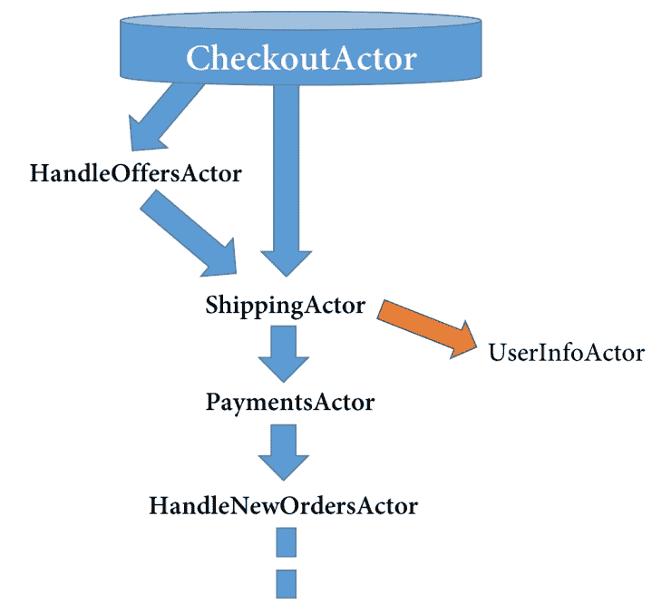

通过查看图表，很明显我们有一些实体，这些实体将负责特定的关注点。我们根据它们的关注点命名这些实体：

+   **CheckoutActor**可能负责从购物车中获取详细信息并显示相应的信息。

+   此外，你可能想要应用一些优惠券代码或优惠。我们的系统必须验证该优惠券或优惠代码，并根据此可能修改订单详情。对于这个特定的过程，我们使用**HandleOffersActor***.*

+   **ShippingActor**负责获取用户特定的信息，例如地址，根据这些信息我们可以计算出预计的运输时间。需要注意的是，**ShippingActor**不仅限于在内部处理整个逻辑，还可以调用另一个名为**UserInfoActor**的子演员，该演员除了获取用户信息外不做任何事情。另一个需要注意的点是，获取用户信息的操作非常通用，这个演员可能在这个特定的层次结构之外也很有用。

+   在发货详情就绪后，我们可能希望将用户重定向到支付页面，在那里我们可以执行支付特定的逻辑。为此，我们有一个**PaymentsActor**。

+   最后，根据支付的成功或失败，我们可能想要处理订单。例如，在支付成功的情况下，我们想要进行订购，而在失败的情况下，我们可能想要发送一封电子邮件给用户，说明他们需要再次处理支付！为此，我们有一个**HandleNewOrdersActor**。

在整个场景中，我们可以看到整个流程形成了一个演员的层次结构。假设**ShippingActor**由于网络/连接问题无法从数据库中提供用户信息，现在取决于我们如何处理这种情况。同样，在**PaymentsActor**失败的情况下，业务将决定下一步做什么。这可能是在支付状态挂起和支付方式为货到付款的情况下继续处理订单，或者要求用户重试。因此，当你的实体以层次结构的方式执行逻辑时，处理此类场景会更容易。

在这个简单的场景中，我们了解到这些演员形成了一个层次结构，或者让我们称之为一个组，并生活在系统中；在 Akka 术语中，我们称之为**ActorSystem**。

# 理解演员系统

Akka 文档简单地解释**ActorSystem**为一个重量级结构，它将分配 1 到 N 个线程，我们应该为每个**逻辑**应用程序创建一个。一旦我们创建了一个演员系统，我们就获得了在该系统下创建演员的许可。我们将在下一节中看看我们如何创建演员。

当我们将演员作为系统的一部分创建时，这些演员与演员系统共享相同的配置（例如**调度器、路径**和**地址**）。

在一个演员系统中，有一个**根守护者**演员；这个演员作为所有居住在演员系统中的演员的父演员，包括内部演员以及我们创建的演员。因此，正如预期的那样，这是系统终止时最后停止的演员。

Akka 提供这些守护者演员的原因是为了监督我们创建的一级演员，因此对于用户创建的演员来说，我们也有一个特定的**用户守护者**。同样，对于系统提供的演员，Akka 有系统守护者。

查看以下图表以了解 Akka 系统中守护者演员的层次结构：

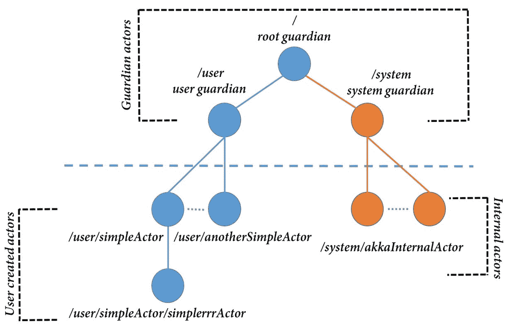

在前面的图中，我们可以看到每个指定的 actor 的路径表示：

+   **根守护者**: `/`

+   **用户守护者**: `/user`

+   **系统守护者**: `/system`

因此，每次我们在 Actor 系统中创建 Actor 时，我们倾向于创建一个第一级。因此，在图中显示的示例中，我们可以看到 Actor 的路径附加到`/user`*，在我们的例子中是`SimpleActor`*，因此形成的路径是`/user/simpleActor`*.* 对于定义了为`system`*的 Actor 系统，为了创建这些*第一级*（更多内容将在下一节中介绍）Actor，我们使用：

```java
val system = ActorSystem("SimpleActorSystem") 
system.actorOf(Props[SimpleActor], "simple-actor") 
```

我们将在后续章节中尝试自己创建 Actor，但就目前而言，值得注意的是我们如何调用`system`上的`actorOf`方法来创建一个*第一级*Actor。从这里，我们可以为我们的第一级 Actor 创建子 Actor。为此，我们使用`context`而不是`system`实例。它看起来如下：

```java
val anotherSimpleActor = context.actorOf(Props[AnotherSimplActor], "another-simple-actor") 
```

在这里，通过使用`context`而不是`system`*，我们指定我们想要创建的 Actor 将处于当前 Actor 的上下文中，使其成为一个子 Actor。重要的是要注意，这个调用只能从 Actor 内部进行。因此，通过这个方法调用，我们为`simpleActor`获得一个子 Actor：

```java
context.actorOf(Props[AnotherSimpleActor], "another-simple-actor") 
```

假设调用是从`SimpleActor`发出的，并且`SimpleActor`是第一级 Actor，我们的`anotherSimpleActor`路径可能看起来像这样：

```java
akka://SimpleActorSystem/user/simple-actor/another-simple-actor 
```

现在我们已经看到了子 Actor 的路径，很明显，我们的`simple-actor`的路径将是：

```java
akka://SimpleActorSystem/user/simple-actor 
```

此外，还有一些值得注意的点，包括`Props`的使用以及`actorOf`方法的返回类型。

# Props

`Props`可以看作是`ActorRef`*的配置对象。我们可以使用一些配置来创建 props 配置的实例。以下是一个例子：

```java
val props = Props[SimpleActor]() 
  .withDispatcher("some-simple-dispatcher") 

val simpleActor: ActorRef = system.actorOf(props, "simple-actor") 
```

关于`Props`对象的一个重要事实是它是不可变的，因此是线程安全的。

# Actor 引用和路径

当我们创建一个 Actor*时，我们得到的响应是一个`ActorRef`*.* 这是对我们创建的 Actor*的引用。我们可能需要`ActorRef`的原因是将其作为引用在整个系统中传递给其他 Actor。这些引用用于消息传递。我们创建的每个 Actor 都通过`self`拥有对自己引用。

在 Actor 内部，可以通过名为`sender()`*的方法获取调用 Actor 的*actor 引用*。

我们也可以给 actor 引用命名。在我们的例子中，我们给我们的`SimpleActor`引用命名为`simple-actor:`

```java
val simpleActor: ActorRef = system.actorOf(props, "simple-actor")
```

我们还知道这些 Actor 是以分层的方式创建的，我们可以为*actor 实例*赋予唯一的名称。因此，这些名称共同为每个 Actor 形成一个路径。路径对每个 Actor 是唯一的。我们的`SimpleActor`路径可能看起来像这样：

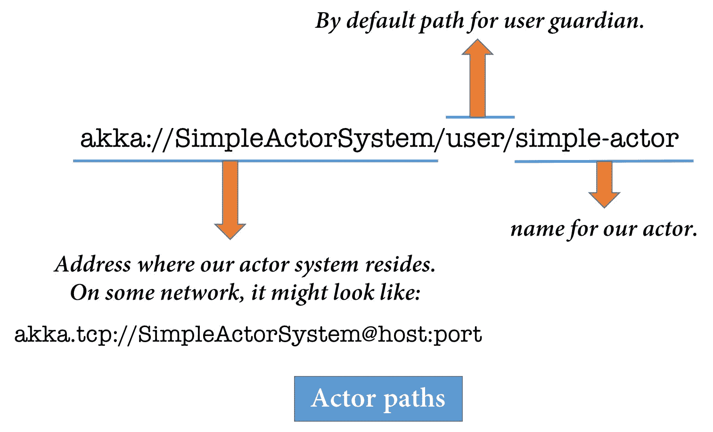

我们可以看到，由于层次结构，我们有不同 actor 的路径，因为 actor 必须具有唯一的名称。我们还可以看到，无论你的 actor 是在远程网络上创建的，其路径都将具有相同的结构，包括主机和端口。

# 通过 actorSelection 选择现有的 actorRefs

由于每个 actor 都有一个唯一的 ID，我们可以通过`actorSelection`方法通过其路径引用特定的 actor。我们可以在`system`或`context`上调用`actorSelection`方法并获取`ActorRef`*.*

当我们在`system`*上调用`actorSelection`时，我们需要传递从根开始的绝对 Actor 路径，而当我们对`context`*调用相同的操作时，我们可以传递相对于当前 Actor 的路径。

假设当前 Actor（第一级 Actor）在同一级别有一个`SiblingActor`*，*，我们可以将兄弟 Actor 的 actor 引用称为：

```java
context.actorSelection("../siblingActor") 

context.actorSelection("/user/siblingActor") 
```

在这两种方法中，第一种用于表示父 Actor*.*另一种方法直接引用 Actor 的路径。通过这种方式，我们能够获取 actor 引用，但这种方法是不推荐的，因为我们可能不想明确地编写 actor 路径。当我们假设想要使用通配符(*)时，我们可以利用`actorSelection`*，*，即向层次结构中某个(*)级别以下的所有 actor 发送消息。以下图表将清楚地说明我们的意思：

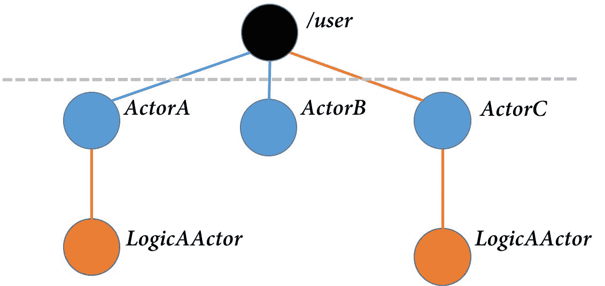

在这里，在之前的图表中，通过提供以下代码：

```java
context.actorSelection("akka://someActorSystem/user/*/LogicAActor")
```

我们可以获取引用，这些引用指向之前提到的层次结构中所有`LogicAActor`参数。还值得注意的是，对`actorOf`方法的调用根据其被调用的上下文在上下文或系统中创建 actor。而`actorSelection`的调用不会创建任何新的 actor，它指向我们传递的`actorpath`，并不确保 actor 在那里存在。

现在我们已经了解了 Actor 系统中的简单实体，让我们尝试理解 Actor 的生命周期是如何工作的，以及我们可能想要选择哪些方法来终止 actor 实例。

# Actor 生命周期是如何工作的

当我们调用方法`actorOf`*时，我们得到的返回值是一个`ActorRef`，它反过来也拥有我们创建 Actor 的特定路径。通过这个调用，我们知道确实创建了一个 Actor 实例，分配了唯一的 ID，并调用了钩子方法。有一个名为`preStart()`的方法，它在创建新的 Actor 后作为第一个动作被调用。

在创建新的 Actor 时需要注意以下几点：

+   为 Actor 预留一个新的 Actor 路径

+   Actor 会被分配一个唯一的 ID

+   实例创建后，会调用`preStart()`方法：

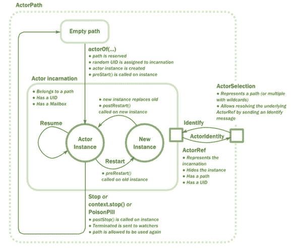

当 Actor 重启时：

1.  在实例上调用`preRestart()`。

1.  创建新实例，替换旧实例。

1.  调用`postRestart()`方法。

当 Actor 停止时：

1.  在实例上调用`postStop()`方法。

1.  向观察者发送终止消息。

1.  Actor 路径允许再次使用。

之前的图示说明了整个周期。一个需要注意的重要点是，我们以`preStart`、`preRestart`、`postStop`和`postRestart`的形式获得这些钩子方法。使用这些方法，我们可以根据需要定义一些逻辑。

因此，现在我们已经了解了 actor 模型，并且也讨论了 actor 通过消息进行通信，让我们来实践一下。

# Akka 中的 Hello world

要编写我们的第一个 Akka actor，我们需要添加`akka-actor`库依赖。对于依赖管理，我们将使用 SBT，并且正如我们所知，我们将在`build.sbt`文件中定义这些库依赖。为此，我们需要在我们的系统上安装 SBT。

# 设置环境

要开始一个简单的 Akka 项目，我们可以简单地遵循以下步骤：

1.  前往 Lightbend 的**TECH HUB**（[`developer.lightbend.com`](https://developer.lightbend.com)）并点击 START A PROJECT：


1.  在 Akka 项目下搜索**Akka Quickstart** Scala。

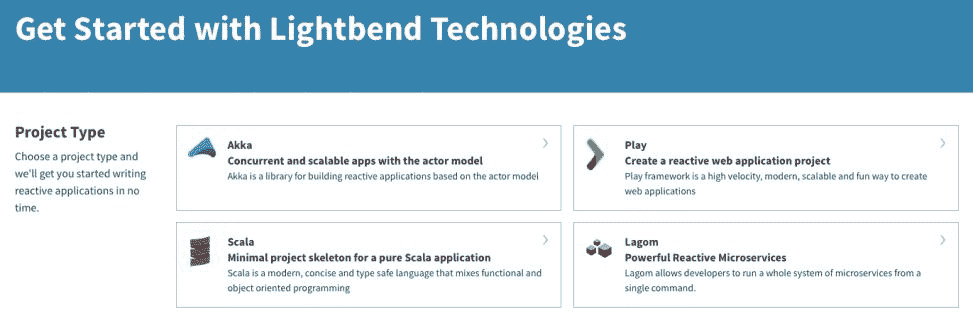

1.  点击 CREATE A PROJECT FOR ME!:

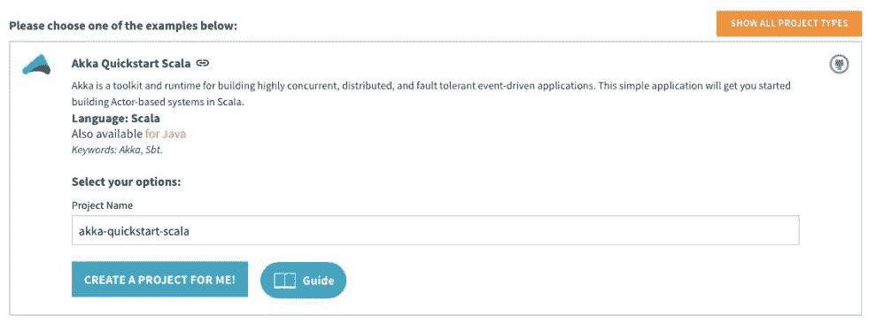

1.  提取下载的 ZIP（压缩）文件。

我们可以在**IntelliJ IDEA** IDE 中打开提取的文件夹：

1.  打开 IntelliJ IDE。

1.  点击 File | New | Project from Existing Sources...:


1.  从我们刚刚提取的项目（`akka-quickstart-scala`）中选择`build.sbt`：

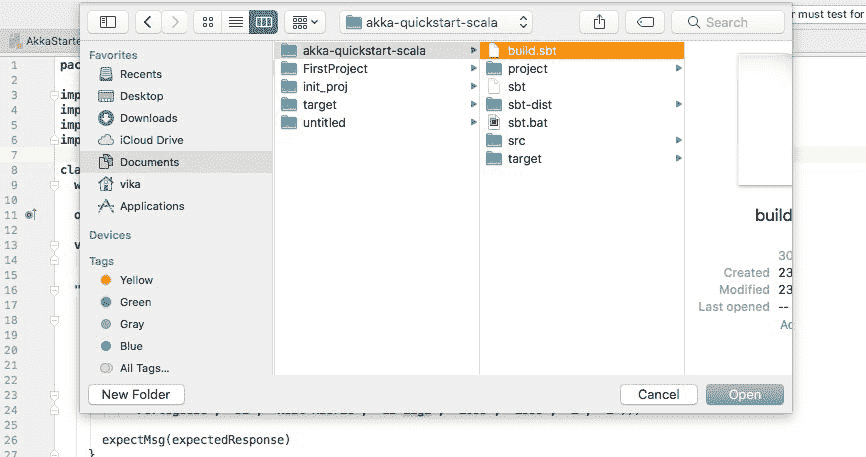

1.  然后您可以在 IntelliJ 窗口中打开项目：

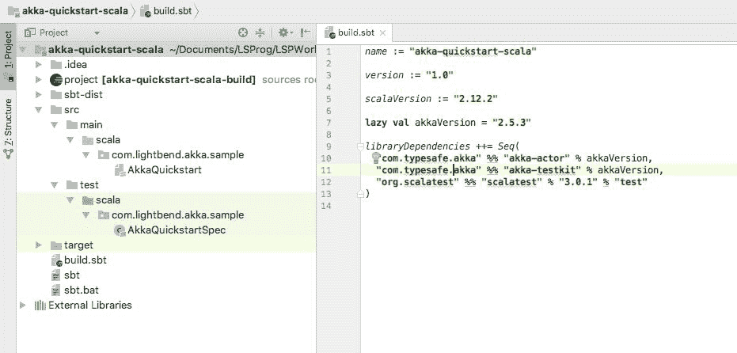

这是一种开始 Akka 项目的方法。该项目已经定义了所有`akka-actors`特定的依赖项。我们不必单独定义它们。但我们都想从自己迈出的第一步开始，因此让我们从一个自引导的`sbt-scala`项目开始并定义库依赖项。

我们可以采取一些步骤来实现这一点：

1.  打开您喜欢的命令行（Windows 中的命令提示符/Linux 和 macOS 中的终端），并进入您想要定位项目的目标目录。

1.  输入命令`sbt new sbt/scala-seed.g8`：

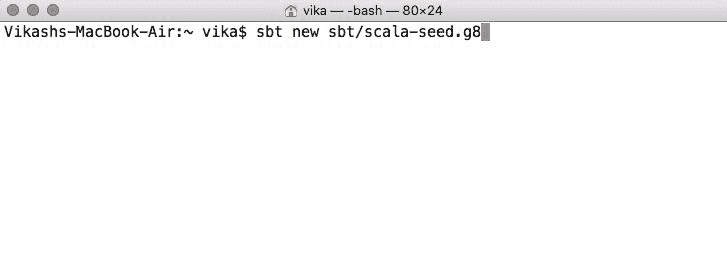

1.  命令提示符将询问项目的名称。给它起一个名字：

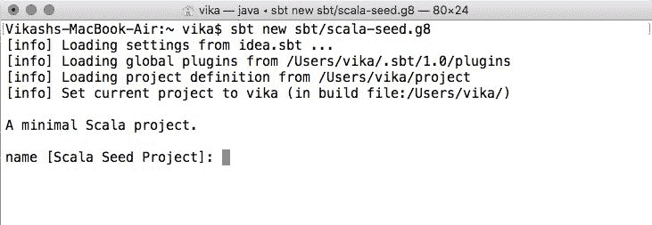

1.  命令将为我们生成 Scala 种子项目。我们可以按照*步骤 1*到*3*在 IntelliJ IDE 中打开**Acala**种子项目。

1.  打开`build.sbt`文件。文件可能看起来像这样：

```java
    import Dependencies._ 

    lazy val root = (project in file(".")). 
      settings( 
        inThisBuild(List( 
          organization := "com.example", 
          scalaVersion := "2.12.3", 
          version      := "0.1.0-SNAPSHOT" 
        )), 
        name := "Hello", 
        libraryDependencies += scalaTest % Test 
      ) 
```

此文件指定我们在当前目录中有一个名为`Hello`的根项目。除此之外，我们还提供了一些特定版本的详细信息，最后一行指定我们目前有一个`libraryDependency`，即`scala-test`。此值来自`Dependencies.scala`文件。

我们将在本`build.sbt`文件中定义`akka-actors`特定的依赖项：

```java
libraryDependencies ++= Seq( 
  "com.typesafe.akka" %% "akka-actor" % "2.5.8", 
  "com.typesafe.akka" %% "akka-testkit" % "2.5.8", 
  "org.scalatest" %% "scalatest" % "3.0.1" % "test" 
  ) 
akka-actor specific dependency. The second is for testing Akka Actors. The last one is specific to Scala testing.
```

因此，我们将使用`sbt update`命令来更新库，并在当前项目目录中使用`cmd/terminal`输入命令。

通过这些步骤，我们就可以编写我们的第一个 Akka actor 了。

# 编写我们的第一个 Actor

编写一个 Actor 就像编写一个扩展了`akka.actor.Actor`类的类一样简单。我们知道 Actor 会响应消息，因此为了识别消息，我们有一个名为`receive`的方法，我们必须为每个我们编写的 Actor 定义它。让我们编写我们的`SimpleActor`：

```java
import akka.actor.Actor 

class SimpleActor extends Actor { 

  override def receive = Actor.emptyBehavior 

} 
```

因此，我们编写了`SimpleActor`，在`receive`方法中定义了一些空的行为。但在这里，我们只是编写了我们的 Actor；我们必须将 Actor 实例化作为 Actor 系统的一部分。实例化后，我们可能还想运行我们的应用程序来查看行为，因此，让我们编写应用程序的入口点并实例化一个 Actor 系统：

```java
import akka.actor.ActorSystem 

object AkkaStarter extends App { 

  val simpleActorSystem = ActorSystem("SimpleActorSystem") 

} 
```

这条语句为我们提供了一个名为`SimpleActorSystem`的 Actor 系统的实例。现在，我们想要创建一个我们的`SimpleActor`实例作为顶级（第一级）actor，因此我们将使用可用的`simpleActorSystem.actorOf`方法：

```java
import akka.actor.{Actor, ActorSystem, Props} 

class SimpleActor extends Actor { 
  override def receive = Actor.emptyBehavior 
} 

object SimpleActor { 
  val props = Props[SimpleActor] 
} 

object AkkaStarter extends App { 

  val simpleActorSystem = ActorSystem("SimpleActorSystem") 

  val simpleActor = simpleActorSystem.actorOf(SimpleActor.props) 
} 
```

目前我们有一个可用的 Actor 系统，并且我们已经创建了一个 Actor 实例。需要注意的是，按照惯例，我们为我们的 Actor 类创建了一个伴生对象，并在其中定义了它的`props`值。我们也可以通过提供一个额外的字符串参数来命名我们的 actor：

```java
val simpleActor = simpleActorSystem.actorOf(SimpleActor.props, "simple-actor") 
```

这行代码给我们的 actor 分配了一个`namesimple-actor`标识符。现在，我们为我们的 Actor 定义的行为是空的。我们希望为我们的 actor 定义一个`receive`方法。让我们思考，我们的 actor 能做的最简单的事情是什么？可能是调用任何公共金融 API 来提供股票信息，或者调用任何 API 来执行货币转换；这取决于我们。在这个示例场景中，我们将调用我们的`football.csv`文件来获取并展示给用户信息。让我们看看如何使用 actors 来实现这一点。

首先，让我们定义一些我们可能需要的实用方法，用于将字符串响应解析为`Players`数据。我们有这个`Players`的 case 类：

```java
case class Player(name: String, nationality: String, age:String, club: String, domesticLeague: String, rawTotal: String, finalScore: String, ranking2016: String, ranking2015: String) 

object Util { 

  def bufferedSourceToList(source: BufferedSource): List[String] = { 
      val list = source.getLines().toList 
      source.close() 
      list 
  } 

  def asPlayers(listOfPlayersString: List[String]) : List[Player] = listOfPlayersString match { 
    case head :: tail => tail map {line => 
      val columns = line.split((",")).map(_.trim) 
      Player(columns(5),columns(6),columns(9),columns(7), 
        columns(8),columns(10), columns(12), columns(0),columns(2)) 
    } 
    case Nil => List[Player]() 
  } 

} 
```

我们定义了两个名为`bufferedSourceToList`和`asPlayers`的实用方法；这些方法做了它们所说的。因此，现在让我们定义我们的`SimpleActor`的`receive`方法：

```java
class SimpleActor extends Actor { 
  import scala.io.Source 
  import SimpleActor.ShowFootballPlayersRequest 
  import Util._ 

  override def receive = { 
    case ShowFootballPlayersRequest(url) => { 
      val playersInfoSource = Source.fromFile(url) 

      val players = asPlayers(bufferedSourceToList(playersInfoSource)) 
      players.foreach(player => println(player + "n")) 
    } 
  } 

} 

object SimpleActor { 
  val props = Props[SimpleActor] 

  final case class ShowFootballPlayersRequest(uri: String)
 }
```

我们已经为特定的请求，如`ShowFootballPlayersRequest`，定义了接收方法，或者说`SimpleActor`方法的特定行为。请求本身包含了从 URI 获取信息的所需信息。我们在`SimpleActor`的伴生对象中定义了这个请求，并将其定义为最终的 case 类。这种传统方法指定了我们的 actor 支持的请求。在收到这样的球员信息请求后，我们的 actor 从指定的位置获取信息，然后打印球员信息。

让我们使用它。我们将使用我们的 actor 引用发送一个`ShowFootballPlayersRequest`类型的请求：

```java
val fileSource = "/Users/vika/Workspace/akkaa/akka-starter/src/main/scala/files/football_stats.csv" 

simpleActor ! ShowFootballPlayersRequest(fileSource) 
!", and passed an instance of ShowFootballPlayersRequest with the file source URI. This method, let's call it bang for now, in an ideal case goes to the actor's mailbox and delivers this message. This happens in a fire-and-forget manner. There's no guarantee of message delivery at the called actor's mailbox. There might be scenarios where you expect a response from called actors; in that case instead of calling bang*,* we make an ask call to our Actors.
```

我们将考虑一个包含球员名字和球员列表来源的请求。例如，来源可以是任何公共 API 来获取球员信息；在我们的例子中，它是一个包含所有球员数据的简单`List[Player]`。

我们首先想做的事情是创建一个简单的请求和响应。为此，我们可以在我们的`SimpleActor`伴生对象中定义这些。第一个是一个简单的请求，包含玩家的名字和我们将传递的玩家列表。第二个是一个响应容器，它只包含一个可选的玩家：

```java
final case class GetPlayerInformationRequest(name: String, source: List[Player]) 
final case class PlayerInformationResponse(player: Option[Player]) 
```

现在，让我们为这种请求定义一个接收方法，类型为`GetPlayerInformationRequest`：

```java
import scala.concurrent.Future 
import scala.concurrent.ExecutionContext.Implicits.global

case GetPlayerInformationRequest(name, listOfPlayers) => { 
  log.info(s"Executing GetPlayerInformationRequest($name, listOfPlayers)")

akka.pattern.pipe(
 Future.successful(PlayerInformationResponse(listOfPlayers.find(_.name.contains(name))))
) to sender()

}
```

关于这种行为的一些要点：

+   我们使用了一个日志实现来记录与该 Actor 相关的特定信息。为此，我们使用了`ActorLogging`特质。只需通过以下方式混合这个特质：

```java
    class SimpleActor extends Actor with ActorLogging
```

+   当我们收到一个执行某些昂贵操作的消息时，我们执行该操作并将其封装在 future 中，并希望返回 future 的引用给调用 Actor。为此，我们使用了`akka.pattern`包中的`pipe`方法。此方法期望一个执行上下文。我们使用 pipe 或类似的语法方法`pipeTo`的方式如下：

```java
    akka.pattern.pipe(someFuture) to sender() 
```

或者我们可以使用：

```java
  import akka.pattern._ 
  someFuture pipeTo sender() 
```

这个`pipe`或`pipeTo`方法将响应发送回调用方。

在定义了我们的 Actor 对类型为`GetPlayerInformationRequest`的消息的行为后，让我们用这个消息调用 Actor。首先，我们将创建源，`List[Player]`：

```java
//Storing players in a collection! 
val players: List[Player] = Util 
  .asPlayers(bufferedSourceToList( 
    scala.io.Source.fromFile(fileSource) 
  )) 
```

向简单的 Actor 发起 ask 调用就像询问 Actor 一样简单：

```java
simpleActor ? GetPlayerInformationRequest("Cristiano Ronaldo", players) 
```

现在这个`?`被称为*ask 方法*；我们使用这个方法当我们期望被调用 Actor 返回响应时。我们需要给出一个`import`语句来在作用域中导入这个方法：

```java
import akka.pattern.ask 
```

此外，我们可能还想确保这个请求在给定的时间范围内完成。我们将通过引入一个隐式超时值来确保特定的超时持续时间：

```java
import akka.util.Timeout 
import scala.concurrent.duration._ 

implicit val timeout = Timeout(5 seconds) 
```

现在，在请求成功完成后，我们可以从响应中获取值。所以，让我们这样做并打印玩家的信息：

```java
val playerInformation = (simpleActor ? GetPlayerInformationRequest("Cristiano Ronaldo", players)) 

playerInformation 
  .mapTo[PlayerInformationResponse] 
  .map(futureValue => { 
      futureValue.player map println 
    }) 
```

首先，我们通过提供一个`mapTo`方法将响应映射到所需类型，然后从未来映射值并打印。我们使用了发送消息到单个 Actor 的*fire-and-forget*方式，并且使用*ask*方法等待了一些响应。我们还有另一种通信消息的方式，那就是使用`forward`方法。

# 告诉与询问与转发方法

我们使用这三种方法之一来从一个 Actor 传输消息到另一个 Actor。正如我们已经建立的，`tell`传输消息且不等待响应；这种方式确保了*最多一次*的交付。我们还可以在期望我们的调用*actors*以响应类型的一些消息响应的情况下使用`ask`方法。可能存在你想要将特定类型的消息与相同的 actor 引用（`ActorRef`）转发给另一个 Actor 的场景。为此，我们可以使用`forward`方法：

```java
class AnotherActor extends Actor { 
  override def receive = { 
    case ShowFootballPlayersRequest(url) => { 
      val playersInfoSource = Source.fromFile(url) 

      val players = asPlayers(bufferedSourceToList(playersInfoSource)) 
      players.foreach(player => println(player + "n")) 
    } 
  } 
} 

object AnotherActor { 
  val props = Props[AnotherActor] 
} 
```

我们已经定义了 `AnotherActor`*，并且我们可以将其作为我们的 `SimpleActor`* 的子 actor。为此，让我们通过从 `SimpleActor`* 调用 `context.actorOf` 来实例化这个 actor。然后，在接收到类型为 `ShowFootballPlayersRequest` 的消息时，我们将消息转发给 `anotherActor`，如下面的代码片段所示：

```java
class SimpleActor extends Actor with ActorLogging { 

  implicit val ec = context.dispatcher 
  // Works as executionContext for actor calls 

  val anotherActor = context.actorOf(AnotherActor.props) 

  override def receive = { 
    case ShowFootballPlayersRequest(url) => { 
      anotherActor forward ShowFootballPlayersRequest(url) 
    } 

    case GetPlayerInformationRequest(name, listOfPlayers) => { 
      log.info(s"Executing GetPlayerInformationRequest($name, listOfPlayers)") 

      akka.pattern.pipe(       Future.successful(PlayerInformationResponse(listOfPlayers.find(_.name.contins(name)) ))
) to sender() } } }
```

`SimpleActor` 类简单地转发消息给另一个 actor；现在，我们可以查看我们编写的整个代码并尝试运行它：

```java
package lsp 

import lsp.SimpleActor.{GetPlayerInformationRequest, PlayerInformationResponse, ShowFootballPlayersRequest} 
import akka.actor.{Actor, ActorLogging, ActorSystem, PoisonPill, Props} 
import akka.pattern.ask 
import scala.io.{BufferedSource, Source} 
import akka.util.Timeout 
import lsp.Util.{asPlayers, bufferedSourceToList} 
import scala.concurrent.duration._ 
import scala.concurrent.Future 
import scala.concurrent.ExecutionContext.Implicits.global 

class SimpleActor extends Actor with ActorLogging { 

  val anotherActor = context.actorOf(AnotherActor.props) 

  override def receive = { 
    case ShowFootballPlayersRequest(url) => { 
      anotherActor forward ShowFootballPlayersRequest(url) 
    } 

    case GetPlayerInformationRequest(name, listOfPlayers) => { 
      log.info(s"Executing GetPlayerInformationRequest($name, listOfPlayers)") 

      akka.pattern.pipe( 
        Future { 
          PlayerInformationResponse(listOfPlayers.find(_.name.contains(name))) 
        } 
      ) to sender() 

    } 

  } 

} 
object SimpleActor { 
  val props = Props[SimpleActor] 

  final case class ShowFootballPlayersRequest(uri: String) 

  final case class GetPlayerInformationRequest(name: String, source: List[Player]) 
  final case class PlayerInformationResponse(player: Option[Player]) 
} 
```

之前的代码是我们的主 *SimpleActor* 及其伴随对象。让我们看看 *AnotherActor*：

```java
class AnotherActor extends Actor { 
  override def receive = { 
    case ShowFootballPlayersRequest(url) => { 
      val playersInfoSource = Source.fromFile(url) 

      val players = asPlayers(bufferedSourceToList(playersInfoSource)) 

      players.foreach(player => println(player)) 
    } 
  } 

} 
object AnotherActor { 
  val props = Props[AnotherActor] 
} 
```

最后，我们应用程序的入口点，在这里我们启动 Actor 系统：

```java
object AkkaStarter extends App { 
  import Util._ 

  implicit val timeout = Timeout(5 seconds) 

  val simpleActorSystem = ActorSystem("SimpleActorSystem") 
  val simpleActor = simpleActorSystem.actorOf(SimpleActor.props, "simple-actor") 

  val fileSource = 
    "/Users/vika/Workspace/akkaa/akka-starter/src/main/scala/files/football_stats.csv" 

  //simpleActor ! ShowFootballPlayersRequest(fileSource) 

  //Storing players in a collection! 
  val players: List[Player] = Util 
    .asPlayers(bufferedSourceToList( 
      scala.io.Source.fromFile(fileSource) 
    )) 

  val playerInformation = (simpleActor ? GetPlayerInformationRequest("Cristiano Ronaldo", players)) 

  playerInformation 
    .mapTo[PlayerInformationResponse] 
    .map(futureValue => { 
        futureValue.player map println 
      }) 

  simpleActor ! PoisonPill 
} 
```

我们还有一个包含实用方法的 `Util` 对象。有了这个，我们定义了 `Player` 案例类：

```java
object Util { 

  def bufferedSourceToList(source: BufferedSource): List[String] = { 
      val list = source.getLines().toList 

      source.close() 
      list 
  } 

  def asPlayers(listOfPlayersString: List[String]) : List[Player] = listOfPlayersString match { 
    case head :: tail => tail map {line => 
      val columns = line.split((",")).map(_.trim) 
      Player(columns(5),columns(6),columns(9),columns(7), 
        columns(8),columns(10), columns(12), columns(0),columns(2)) 
    } 
    case Nil => List[Player]() 
  } 

} 

case class Player(name: String, nationality: String, age:String, club: String, 
                  domesticLeague: String, rawTotal: String, finalScore: String, 
                  ranking2016: String, ranking2015: String) 
```

运行：

```java
[INFO] [12/27/2017 14:40:48.150] [SimpleActorSystem-akka.actor.default-dispatcher-2] [akka://SimpleActorSystem/user/simple-actor] Executing GetPlayerInformationRequest(Cristiano Ronaldo, listOfPlayers) 
Player(Cristiano Ronaldo,Portugal,32,Real Madrid,Spain,4829,4789,1,2) 
```

使用我们的 Actor 之后，我们应该终止其实例。

# 停止 actor

停止 actor 的一种方式是通过从 `system` 或 `context` 对特定 actor 调用 `stop` 方法。为此，我们可以定义一个特定的消息，可以传递给 actor，告诉它停止。例如：

```java
case "terminate" => context stop self 
```

大多数情况下，终止 actor 的首选方式是通过向其发送 `PoisonPill` 消息：

```java
simpleActor ! PoisonPill 
```

这种简单的消息传递可以优雅地终止 actor。终止发生在处理完 actor 队列中的所有消息之后，再处理毒药丸之前。停止一个 *actor* 会停止其所有子 actor。记住，我们讨论了那些在 actor 启动或终止时可以调用的钩子方法。让我们看看那些方法。

# preStart 和 postStop 钩子

让我们在 `SimpleActor` 类中定义这些方法来记录我们的 `SimpleActor` 的启动和停止：

```java
override def preStart(): Unit = log.info("SimpleActor starting!") 

override def postStop(): Unit = log.info("SimpleActor stopping!") 
```

运行：

```java
[INFO] [12/27/2017 14:56:54.887] [SimpleActorSystem-akka.actor.default-dispatcher-3] [akka://SimpleActorSystem/user/simple-actor] SimpleActor starting! 
[INFO] [12/27/2017 14:56:54.915] [SimpleActorSystem-akka.actor.default-dispatcher-2] [akka://SimpleActorSystem/user/simple-actor] Executing GetPlayerInformationRequest(Cristiano Ronaldo, listOfPlayers) 
Player(Cristiano Ronaldo,Portugal,32,Real Madrid,Spain,4829,4789,1,2) 
[INFO] [12/27/2017 14:56:54.938] [SimpleActorSystem-akka.actor.default-dispatcher-2] [akka://SimpleActorSystem/user/simple-actor] SimpleActor stopping! 
```

类似的重启操作方法也以 `preRestart` 和 `postRestart`*.* 的形式提供。

当我们讨论通过消息进行通信时，消息被投递给其他 actor 的顺序以及消息传递的保证问题就出现了。

# 通过消息传递的 actor 通信及其语义

我们讨论了关于消息传递的 *fire-and-forget* 风格；为了更好地理解这一点，让我们看看一个解释消息传递语义的图表。

以下图表解释了消息传递的语义；当我们通过网络发送消息时，存在消息被成功投递和丢失的可能性。此外，在尝试成功或失败地投递消息的情况下，我们可能会尝试发送消息，也可能不会。这取决于我们是否想要尝试一次投递消息而不进行第二次或更多次。

基于这些假设，我们可以制定一些正式的术语来具体说明我们所讨论的内容，我们称它们为：

+   最多一次

+   至少一次

+   精确一次

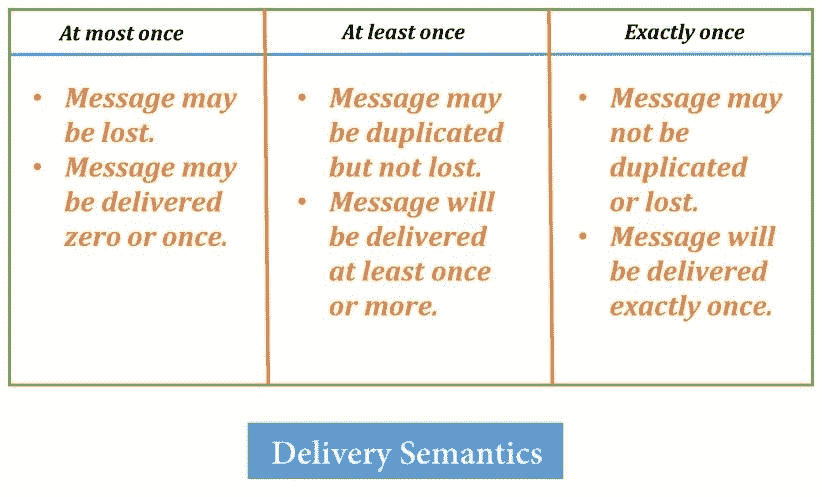

图表以简单的方式解释了三种方法。重要的是要知道，在演员通信的情况下，我们最多只能有一次投递；换句话说，这意味着没有保证的投递。当演员通信时，消息可能被投递给被调用的演员，也可能不会。

演员相当轻量级，可以容纳大量发送给他们的消息；当我们向演员发送消息时，消息会被投递到演员的邮箱。演员的邮箱是一个队列，在我们创建演员实例时被实例化。我们知道队列的工作方式是 FIFO，即*先进先出*。消息执行的顺序取决于它们到达邮箱的顺序。

到目前为止，我们的讨论都是基于通过演员实现的逻辑成功执行的可能性。但我们知道，Akka 提供了一个非常好的错误处理机制，即*监督策略*的形式。让我们来讨论一下。

# 监督我们的演员中的故障

有可能我们的逻辑最终会导致网络错误或某些意外的异常。想象一下，我们的服务需要调用特定的数据库实例来获取一些数据。我们可能会遇到*连接超时*或其他类似的错误。在这种情况下，我们应该怎么做？也许尝试建立连接几次会有所帮助，这可以通过以这种层次结构的方式执行任务来实现。我们可以通过在现有的*演员*中执行层次结构来完成任务。如果层次结构下方的某个演员失败并能够将故障通知父演员，那么基于故障的类型，父演员可以重启/杀死演员或执行所需的某些其他操作。这在某种意义上是对层次结构下方的演员进行监督；比如说，父演员可以监督子演员。我们定义这种策略的方式属于 Akka 定义的监督策略。

在某种意义上，监督是关于对演员层次结构内的*故障*做出反应。除了*根监护人*之外，每个*演员*都有一个父/监督者来监督。每个演员在实例化时都成为*默认监督策略*的一部分。观察到一个重要的现象是，*故障*需要单独的通道来与监督者通信。因此，Akka 有一个专门的*系统级演员*组，负责处理此类消息的通信。

由于我们在出现故障的情况下也会处理演员，我们的反应应该以演员特定的动作来衡量。

因此，考虑监督者可以执行的动作：

+   恢复子演员

+   重启子演员

+   停止子演员

+   升级故障

当一个监督演员遇到一个*失败的子演员*时，它可以执行上述描述的其中一个动作。根据我们的偏好，我们可能希望将策略应用于所有子演员，无论他们是否都失败了。也有可能只*恢复/重启/停止*失败的子演员。

根据应该应用监督策略的子 Actor，我们有两种策略，即*OneForOneStrategy*和*AllForOneStrategy*。让我们来看看它们。

# OneForOne 与 AllForOne 策略

考虑到我们有`SimpleActor`和`AnotherSimpleActor`actors 的场景。`SimpleActor`有一个名为`SimplerrrActor`的子 actor：*

+   **SimpleActor**: `/user/topLevelActor/simpleActor`

+   **AnotherSimpleActor**:` /user/topLevelActor/anotherSimpleActor`

+   **SimplerrrActor**:` /user/topLevelActor/simpleActor/simplerrrActor`

在这种情况下，用户守护者将负责`topLevelActor`，而`topLevelActor`将监督`SimpleActor`和`AnotherSimpleActor`*.* 如果`SimpleActor`出现问题，我们想要所有 actors 恢复/重启/停止，我们可以定义一个`AllForOneStrategy`*.* 如果我们只想对失败的`SimpleActor`及其后续子 actors 执行此类操作，我们可以选择`OneForOneStrategy`*.*

这两个在 Scala 中定义为案例类，它们以`maxNrOfRetries`、`withinTimeRange`和`loggingEnabled`的形式接受一些参数：

```java
case class OneForOneStrategy( 
  maxNrOfRetries:              Int      = -1, 
  withinTimeRange:             Duration = Duration.Inf, 
  override val loggingEnabled: Boolean  = true) 

case class AllForOneStrategy( 
  maxNrOfRetries:              Int      = -1, 
  withinTimeRange:             Duration = Duration.Inf, 
  override val loggingEnabled: Boolean  = true) 
```

第一个参数是用来指定我们可能想要在子 actor 上重试策略的次数；我们可以通过指定-1 作为数字来使其无限次数。在指定次数之后，子 actor 将停止。第二个参数指定了下一次重试应该发生的持续时间。如图所示，值`Duration.Inf`指定了没有任何时间窗口。最后，我们必须指定日志行为；它期望一个布尔值，默认情况下为 true，表示启用。

这两个策略类扩展了父抽象类`SupervisorStrategy`。这些策略如何工作可以通过下面的图解来理解：

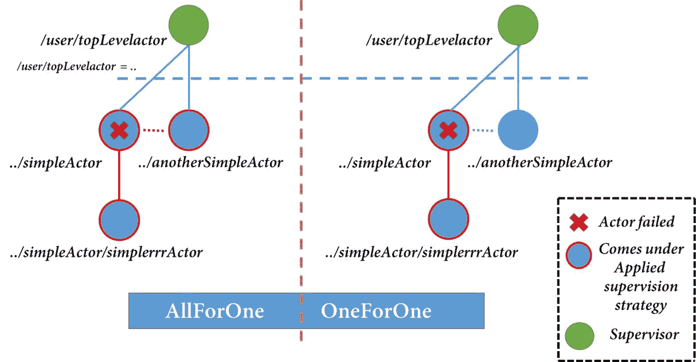

现在，选择权在我们手中，我们可以应用任何适合我们需求/情况的策略。我们根据失败类型定义这些策略；如果我们没有覆盖到特定的失败情况，则该失败将升级到父监督 Actor。监督者执行一系列定义好的动作。

# 默认监督策略

默认情况下，Akka 系统会从从子 actors 接收到的失败消息中查找一些异常类型。让我们看看那些场景。

默认的监督策略将在以下情况下停止失败的子 Actor：

+   `ActorInitializationException`

+   `ActorKilledException`

+   `DeathPactException`

注意，在发生异常的情况下，它将重新启动失败的 Actor。

带着这些信息，让我们尝试自己实现一个策略。

# 应用监督策略

当覆盖默认的`supervisorStrategy`*时，我们只需定义带有参数的值并提供一个`Decider`；这个 decider 包含在发生异常时需要实现的逻辑。它看起来像这样：

```java
import akka.actor.SupervisorStrategy.{Resume, Restart} 

override val supervisorStrategy = 
  OneForOneStrategy( 
    maxNrOfRetries = 3, 
    withinTimeRange = 1 minute 
  ){ 
    case _: ArithmeticException => { 
      log.info("Supervisor handling ArithmeticException! n Resuming!") 
      Resume 
    } 
    case _: Exception => { 
      log.info("Supervisor handling Exception! n Restarting!") 
      Restart 
    } 
  } 
```

在这里，我们定义了一个`OneForOneStrategy`，并且根据每个案例，对失败演员采取的操作。使用此策略的完整示例可能如下所示：

```java
package example 

import akka.actor.{Actor, ActorSystem, OneForOneStrategy, Props, ActorLogging} 
import scala.concurrent.duration._ 

object SupervisionStrategyInPractice extends App { 
  val system = ActorSystem("anActorSystem") 

  val topLevelActor = system.actorOf(TopLevelActor.props) 

  //Sending StopIt 
  topLevelActor ! TopLevelActor.StopIt 
  //Sending RestartIt 
  topLevelActor ! TopLevelActor.RestartIt 
} 

class TopLevelActor extends Actor with ActorLogging { 
  import akka.actor.SupervisorStrategy.{Resume, Restart 

  import TopLevelActor._ 

  override val preStart = log.info(s"TopLevelActor started!") 
  override val postStop = log.info(s"TopLevelActor stopping!") 

  val superSimpleActor = context.actorOf(SuperSimpleActor.props) 

  override def receive = { 
    case StopIt => superSimpleActor ! SuperSimpleActor.ArithmeticOpRequest 
    case RestartIt => superSimpleActor ! SuperSimpleActor.OtherMessage 
  } 

  override val supervisorStrategy = 
    OneForOneStrategy( 
      maxNrOfRetries = 3, 

      withinTimeRange = 1 minute 
    ){ 
      case _: ArithmeticException => { 
        log.info("Supervisor handling ArithmeticException! n Resuming!") 
        Resume 
      } 
      case _: Exception => { 
        log.info("Supervisor handling Exception! n Restarting!") 
        Restart 
      } 
    } 
} 

 object TopLevelActor { 
  val props = Props[TopLevelActor] 
  case object StopIt 
  case object RestartIt 
} 

class SuperSimpleActor extends Actor with ActorLogging { 
  import SuperSimpleActor._ 

  override val preStart = log.info(s"SuperSimpleActor started!") 
  override val postStop = log.info(s"SuperSimpleActor stopping!") 

  override def preRestart(reason: Throwable, message: Option[Any]): Unit = 
    log.info(s"SuperSimpleActor restarting!") 

  override def receive = { 
    case ArithmeticOpRequest => 1 / 0 
    case OtherMessage => throw new Exception("Some Exception Occurred!") 
  } 

} 

object SuperSimpleActor { 
  val props = Props[SuperSimpleActor] 

 case object ArithmeticOpRequest 
  case object OtherMessage 

} 
```

如代码所示，我们有一个`TopLevelActor`，它向其子演员`SuperSimpleActor`发送消息，因此`TopLevelActor`成为其子演员的监督者。我们已经覆盖了`supervisorStrategy`。根据新的策略，我们可以根据异常类型恢复/重启。其余的示例是自我解释的。我们通过覆盖`preStart`和`preRestart`方法记录了我们的演员的启动和重启步骤。运行示例后，我们将得到记录的输出。

运行：

```java
[INFO] [12/28/2017 13:35:39.856] [anActorSystem-akka.actor.default-dispatcher-2] [akka://anActorSystem/user/$a] TopLevelActor started! 
[INFO] [12/28/2017 13:35:39.856] [anActorSystem-akka.actor.default-dispatcher-2] [akka://anActorSystem/user/$a] TopLevelActor stopping! 
[INFO] [12/28/2017 13:35:39.857] [anActorSystem-akka.actor.default-dispatcher-3] [akka://anActorSystem/user/$a/$a] SuperSimpleActor started! 
[INFO] [12/28/2017 13:35:39.857] [anActorSystem-akka.actor.default-dispatcher-3] [akka://anActorSystem/user/$a/$a] SuperSimpleActor stopping! 
[INFO] [12/28/2017 13:35:39.864] [anActorSystem-akka.actor.default-dispatcher-2] [akka://anActorSystem/user/$a] Supervisor handling ArithmeticException!  
 Resuming! 
[WARN] [12/28/2017 13:35:39.865] [anActorSystem-akka.actor.default-dispatcher-2] [akka://anActorSystem/user/$a/$a] / by zero 
[INFO] [12/28/2017 13:35:39.867] [anActorSystem-akka.actor.default-dispatcher-2] [akka://anActorSystem/user/$a] Supervisor handling Exception!  
 Restarting! 
[ERROR] [12/28/2017 13:35:39.868] [anActorSystem-akka.actor.default-dispatcher-2] [akka://anActorSystem/user/$a/$a] Some Exception Occurred! 
java.lang.Exception: Some Exception Occurred! at example.SuperSimpleActor$$anonfun$receive$2.applyOrElse(SupervisionStrategyInPractice.scala:66) 
   at akka.actor.Actor.aroundReceive(Actor.scala:517) 
   at akka.actor.Actor.aroundReceive$(Actor.scala:515) 
   at example.SuperSimpleActor.aroundReceive(SupervisionStrategyInPractice.scala:55) ... 
[INFO] [12/28/2017 13:35:39.868] [anActorSystem-akka.actor.default-dispatcher-3] [akka://anActorSystem/user/$a/$a] SuperSimpleActor restarting! 
[INFO] [12/28/2017 13:35:39.871] [anActorSystem-akka.actor.default-dispatcher-3] [akka://anActorSystem/user/$a/$a] SuperSimpleActor started! 
[INFO] [12/28/2017 13:35:39.871] [anActorSystem-akka.actor.default-dispatcher-3] [akka://anActorSystem/user/$a/$a] SuperSimpleActor stopping! 
```

由于这些失败是通过系统级演员传达的，因此记录的消息顺序并不重要。

通过这个例子，我们几乎涵盖了如何为我们演员实现监督策略。

Akka 库还提供了`akka-testkit`用于演员的测试。它包含一个构造，使得测试演员变得更加容易。让我们浏览这个库并为我们演员的实现编写单元测试用例。

# 测试演员

对于我们创建的演员的测试，我们可能需要考虑一些必须存在的实体。这些实体可能包括：

+   一个测试演员系统

+   一个`testActor`（消息发送者）

+   正在测试的演员（我们想要测试其行为）

+   在演员预期消息的情况下需要提出的断言

Akka 的`test-kit`库为我们提供了所有这些现成的所需实体。我们可以使用这些来测试我们的演员。让我们编写一个简单的演员测试用例。

预期情况是检查我们的`GetPlayerInformationRequest`是否工作正常：

```java
package lsp 

import akka.actor.ActorSystem 
import akka.testkit.{ImplicitSender, TestKit} 
import lsp.SimpleActor.{GetPlayerInformationRequest, PlayerInformationResponse} 
import org.scalatest.{BeforeAndAfterAll, WordSpecLike} 

class SimpleActorSpec extends TestKit(ActorSystem("testActorSystem")) 
  with ImplicitSender with WordSpecLike with BeforeAndAfterAll { 

  override def afterAll(): Unit = super.afterAll() 

  val players = List(Player("Cristiano Ronaldo", "Portuguese", "32", "Real Madrid", "La Liga", "1999", "1999", "1", "1")) 

  "SimpleActor" must { 

    "test for PlayerInformationRequest" in { 

      val simpleActor = system.actorOf(SimpleActor.props) 

      simpleActor ! GetPlayerInformationRequest("Cristiano Ronaldo", players) 

      val expectedResponse = 
        PlayerInformationResponse(Some(Player("Cristiano Ronaldo", "Portuguese", "32", "Real Madrid", "La Liga", "1999", "1999", "1", "1"))) 

      expectMsg(expectedResponse) 
    } 

  } 

} 
```

之前的代码是我们如何编写演员测试用例的一个非常简单的示例。我们应该确保我们编写的测试用例位于测试目录中：

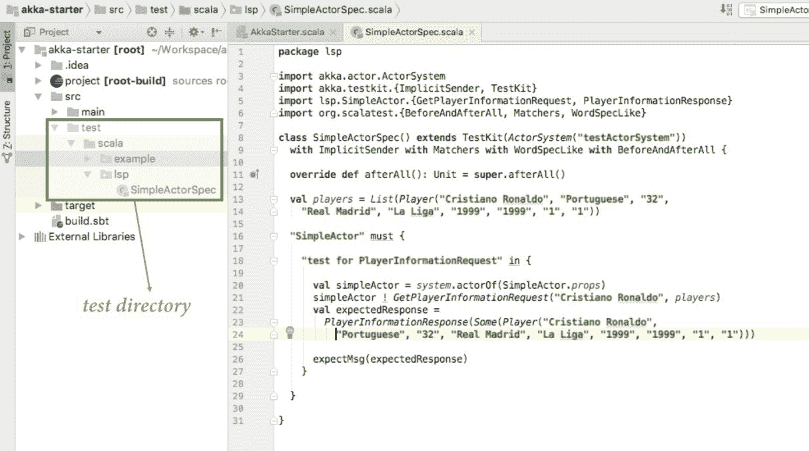

在我们讨论*测试用例*之前，让我们先运行它。要运行它，我们可以简单地使用鼠标右键点击并选择运行选项*.*在我们的情况下，测试用例应该通过。现在，让我们看看我们编写的案例。

首先要注意的是我们编写的声明：

```java
class SimpleActorSpec extends TestKit(ActorSystem("testActorSystem")) 
  with ImplicitSender with WordSpecLike with BeforeAndAfterAll 
```

我们将我们的演员测试用例命名为`SimpleActorSpec`，并通过传递一个`ActorSystem`来扩展`Testkit`以进行测试目的。我们还混合了`ImplicitSender`，它反过来返回我们正在测试的演员`SimpleActor`的响应。最后，`WordSpecLike`和其他`BeforeAndAfterAll`只是为了提供类似于 DSL 的语法方法来编写测试用例。我们可以以 must 和 in 的形式看到这些语法方法。

在实现中，我们做了预期的事情，创建了测试演员的引用，并提供了玩家列表中的模拟数据。我们还创建了一个预期的`SimpleActor`的模拟响应。以下行将消息发送到`SimpleActor`，它反过来响应：

```java
      simpleActor ! GetPlayerInformationRequest("Cristiano Ronaldo", players) 
```

断言部分是通过`expectMsg`方法处理的。在这里，我们比较了模拟响应和预期响应。为了断言目的，`scala-test`库提供了许多替代方案。

有了这个，我们为我们的`SimpleActor`*.*编写了一个简单的测试用例。我们已经涵盖了理解和编写 Akka*.*中演员所需的所有基础知识。还有一些高级配置相关主题，例如*调度器、邮箱实现*和*路由*，你可能想看看。对于这些，我们首先感谢 Akka 提供的精美标准*文档*，可在以下网址找到：[`doc.akka.io/docs/akka/2.5.8/index-actors.html`](https://doc.akka.io/docs/akka/2.5.8/index-actors.html)*.*

如果你仍然对接下来要做什么或者从这里开始往哪里走有疑问，让我告诉你，Akka 提供了更多。我们已经讨论了 Akka 作为一个开源库集合。这些库针对不同的问题可用。例如`akka-http`、流和集群等库提供了相应的解决方案。好的部分是所有这些库都是基于 actor 模型抽象的。我们已经在我们的章节中涵盖了这一点，所以让我们总结一下我们在本章中学到了什么。

# 摘要

这章对我们来说是 Akka 的入门。我们试图理解演员的基本底层原理。我们已经涵盖了 Akka 提供的重要库之一，`akka-actors`。从为什么我们需要这样的库，到理解我们在 Akka 中实现演员的方式，我们涵盖了所有内容。然后从那里，我们涵盖了 Akka 中的重要监督策略。我们讨论并实践了我们自己的自定义监督策略。最后，我们查看了一下 Akka 提供的`akka-testkit`测试套件。通过这个，我们涵盖了理解 Akka 演员及其基础所需的所有内容。在下一章中，我们将关注如何在 Scala 中处理并发。我们知道它在现代架构中的重要性，所以下一章将会非常精彩。
