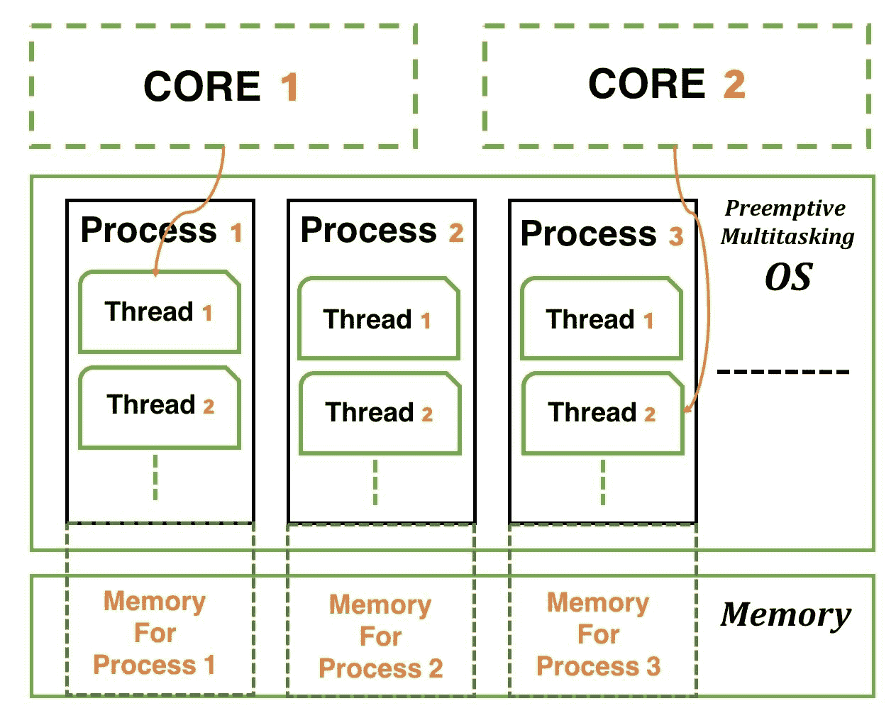
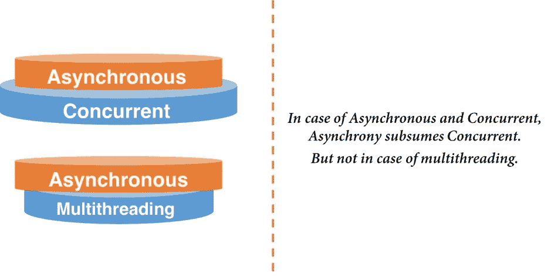
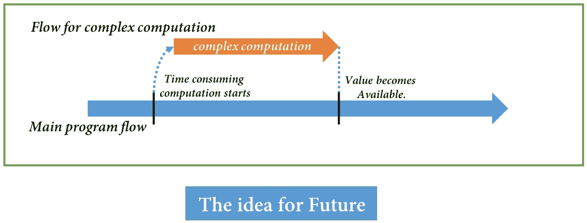
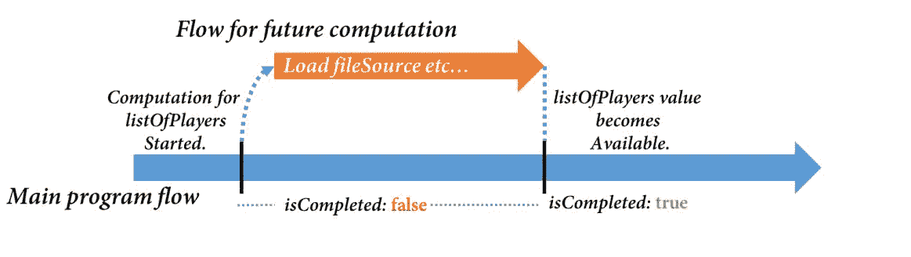
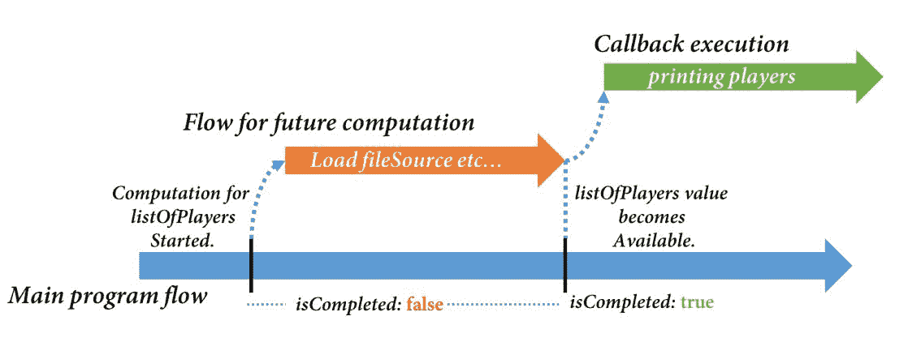
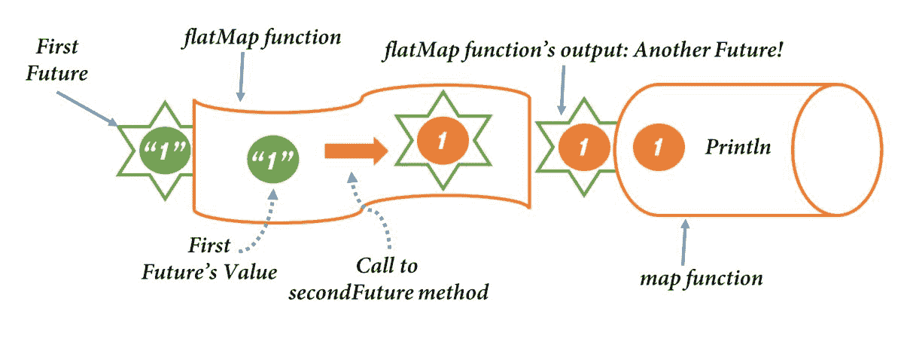
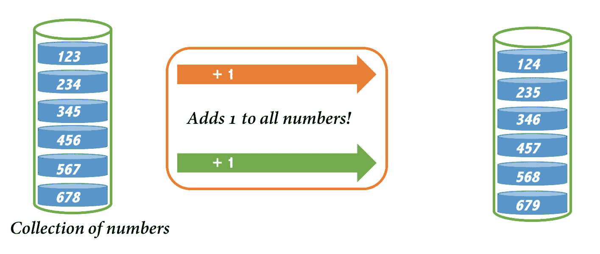
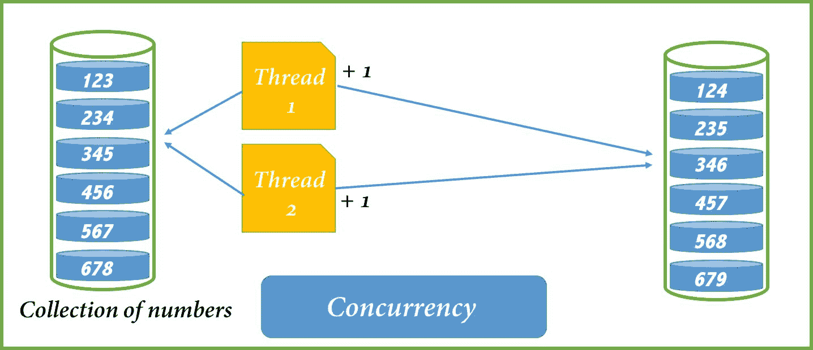
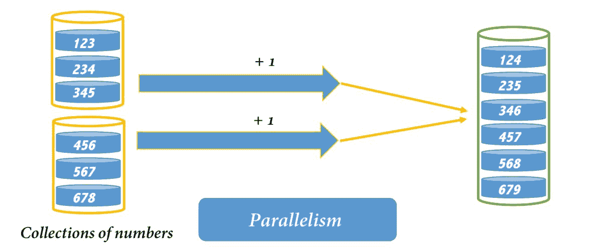

# Scala 中的并发编程

“昨天不属于我们恢复，但今天可以尝试，明天可以赢或输。”

—— 匿名

现代计算机的多核架构能够提供更好的性能这一观点是基于这样一个事实：多个处理器可以同时运行不同的进程。每个进程可以运行多个线程以完成特定任务。想象一下，我们可以编写具有多个线程同时工作以确保更好的性能和响应性的程序。我们称之为并发编程。在本章中，我们的目标是了解 Scala 在并发编程方面的提供。我们可以使用多种方式使用结构来编写并发程序。我们将在本章中学习它们。让我们看看这里将有什么：

+   并发编程

+   并发构建块：

    +   进程和线程

    +   同步和锁

    +   执行器和执行上下文

    +   无锁编程

+   使用 Futures 和 Promises 进行异步编程

+   并行集合

在我们开始学习我们可以编写并发程序的方法之前，了解底层图景非常重要。让我们开始了解并发编程，然后我们将探讨并发的基本构建块。

# 并发编程

这是一种编程方法，其中可以同时执行一系列计算。这些计算可能共享相同的资源，例如内存。它与顺序编程有何不同？在顺序编程中，每个计算可以一个接一个地执行。在并发程序的情况下，可以在同一时间段内执行多个计算。

通过执行多个计算，我们可以在程序中同时执行多个逻辑操作，从而提高性能。程序可以比以前运行得更快。这听起来可能很酷；并发实际上使得实现真实场景变得更加容易。想想互联网浏览器；我们可以同时流式传输我们最喜欢的视频和下载一些内容。下载线程不会以任何方式影响视频的流式传输。这是可能的，因为浏览器标签上的内容下载和视频流是独立的逻辑程序部分，因此可以同时运行。

类似地，在可能需要用户执行一些 I/O 操作以输入，同时我们想要运行程序的情况下，我们需要这两个部分同时运行。将这两个部分一起运行使其对用户交互做出响应。在这种情况下编写并发程序很有用。从运行在互联网浏览器上的非常酷的 Web 应用程序到运行在您的移动设备上的游戏，响应性和良好的用户体验都是由于并发程序而成为可能的。

这就是为什么了解并发抽象很重要，更重要的是在我们的程序实现中保持它们简单。因此，让我们来探讨并发的基本构建块。

# 并发构建块

Scala 是一种基于 JVM 的语言，因此用 Scala 编写的程序在 JVM 中运行。**JVM**，正如我们已知的，是**Java 虚拟机**，并在我们的操作系统中作为一个单独的进程运行。在 JVM 中，一个基本并发结构是*线程*；我们可以在 Scala 程序中创建/使用多个线程。因此，为了对进程和线程有一个基本理解，让我们来探讨它们。

# 理解进程和线程

将一个过程视为一个程序或应用，我们的计算机可能需要运行它。这个过程将包含一些可执行的代码，一个**进程标识符**（**pid**），以及至少一个执行线程。这个过程可能还会消耗一些计算机资源，例如内存。每当一个过程需要消耗内存时，它会将自己与其他过程隔离开来；这意味着两个进程不能使用相同的内存块。

现代计算机具有多个处理器核心。这些核心被分配为在特定时间片中执行的程序部分。分配这些可执行部分的任务由操作系统完成。如今的大多数操作系统都使用一种称为**抢占式多任务**的机制，这是从所有运行进程同时执行多个可执行部分。这些可执行部分不过是线程。这意味着每个进程至少需要有一个线程，我们可以称之为主线程，以便正确运行。

很明显，操作系统内的进程使用一些内存资源，并且可以包含多个线程。现在，来自特定进程的这些线程可以自由共享分配的内存块，但两个进程不能这样做。借助以下图示，这将更容易理解：



之前的图是针对具有两个处理器核心、*抢占式多任务操作系统*和*内存*的系统的简化版本。我们为运行的不同进程分配了单独的内存资源，在我们的例子中，是**进程 1**、**进程 2**和**进程 3**。**进程 1**的内存块无法访问**进程 2**或**进程 3**的内存块。每个进程包含多个线程。每个线程都可以访问从父进程分配的内存。这些线程可以共享分配的内存。现在，操作系统将这些可执行块，换句话说就是*线程*，分配给处理核心进行执行，正如我们在先前的图中所示。

在特定的时间片中：

+   **核心 1**正在执行**进程 1**中的**线程 1**

+   **核心 2**正在执行**进程 3**中的**线程 2**

这两个执行是同时发生的。我们已经知道 JVM 作为一个进程运行；我们编写的程序将具有线程作为实体。为了我们的程序运行，我们需要至少一个*主线程*，它可以作为我们应用程序的入口点。我们可以创建更多线程作为`java.lang.Thread`类的实例。

现在我们知道我们可以让应用程序的多个部分同时运行，重要的是要理解我们需要某种方式来同步它们。通过同步，我们可以确保特定的执行不会影响其他执行。进程内的线程可以访问相同的内存块，因此可能两个线程会同时尝试访问内存——这可能会引起问题。线程是 Scala 中的低级并发抽象，随着并发部分或线程数量的增加，复杂性也随之增加。为了理解我们如何限制其他线程同时访问某些代码块，首先我们需要理解同步是如何工作的。

# 锁和同步

我们在之前的章节中讨论了线程——我们首先尝试自己创建一些线程，然后再进一步讨论。让我们为这个目的编写一些代码：

```java
object ThreadFirstEncounter extends App { 

  class FirstThread extends Thread { 
    override def run(): Unit = println(s"FirstThread's run!") 
  } 

  val firstThread = new FirstThread() 
  firstThread.start() 

  println(s"CurrentThread: ${Thread.currentThread().getName}") 
  println(s"firstThread: ${firstThread.getName}") 

} 
```

关于前面代码的一些提示：

1.  我们简单地创建了一个扩展`App`的对象来创建应用程序的入口点。

1.  我们创建了一个名为`FirstThread`的类，它扩展了`Thread`类，这实际上就是我们之前章节中提到的相同的`java.lang.Thread`。

1.  当我们创建一个线程时，我们可能想要指定它需要运行的内容。这可以通过重写`run`方法来定义。

1.  直到*第 3 点*，我们已经定义了我们的线程类；现在，为了运行线程，我们将创建其实例，然后调用`start`方法。

1.  `start`方法触发线程的执行。

1.  最后，我们打印了线程的名称。首先，是`main`主线程，然后是`firstThread`类的名称。

运行应用程序将给出以下输出：

```java
FirstThread's run! 
CurrentThread: main 
firstThread: Thread-0 
```

因此，从第一次运行来看，很明显一个名为`main`的线程运行了应用程序，随着我们创建越来越多的线程，这些线程也进入了画面。有多个线程一起工作以执行某些计算是非常好的。我们知道从之前的讨论中，操作系统执行任务执行的调度，所以哪个线程以何种顺序执行不在我们的控制范围内。现在，考虑一个你可能想要对你的程序中的变量执行读写操作的场景。当多个线程执行此类任务时，可能会看到结果的不一致性。这意味着这个执行暴露于*竞态条件*；换句话说，它取决于操作系统对语句执行的调度。为了更好地理解这一点，让我们尝试我们讨论的场景：

```java
object TowardsLocking extends App { 
  var counter = 0 // counter variable 

  def readWriteCounter(): Int = { 
    val incrementedCounter = counter + 1  //Reading counter 
    counter = incrementedCounter // Writing to counter 
    incrementedCounter 
  } 

  def printCounter(nTimes: Int): Unit = { 
    val readWriteCounterNTimes = for(i <- 1 to nTimes) yield readWriteCounter() 
    println(s"${Thread.currentThread.getName} executing :: counter $nTimes times:  $readWriteCounterNTimes") 
  } 

  class First extends Thread { 
    override def run(): Unit = { 
      printCounter(10) 
    } 
  } 

  val first = new First 
  first.start() // thread-0 

  printCounter(10)   // main thread 

} 
```

在这个小型应用中，我们首先创建了一个变量`counter`；我们将使用两个线程来读取和写入这个变量。接下来，我们有两个方法，第一个是`readWriteCounter`，第二个是`printCounter`。`readWriteCounter`方法正如其名。这个方法增加计数器（读取操作）并将增加后的计数器`incrementedCounter`赋值给`counter`变量。第二个方法`printCounter`接受一个整数参数，指定增加计数器的次数，并打印出来。

定义了所有这些之后，我们创建了一个名为`First`的线程并调用了我们的`printCounter`方法，覆盖了`run`方法。为了观察行为，我们应该从这个`First`线程和主应用程序线程中调用`printCounter`。由于两个线程是同时工作的，我们预期这两个线程的输出不应该包含相同的数字。我们还从应用程序中调用了`printCounter`作为程序的最终语句。

运行程序几次（如果你很幸运，第一次），你可能会看到一些不一致的行为。

运行：

```java
main executing :: counter 10 times:  Vector(1, 3, 5, 7, 9, 11, 13, 15, 17, 18) 
Thread-0 executing :: counter 10 times:  Vector(1, 2, 4, 6, 8, 10, 11, 12, 14, 16) 
```

在两个线程的输出中，我们可以看到数字`1`出现了两次，而我们知道这不应该发生。我们看到这种行为是因为在我们的`counter`变量上通过多个线程进行的读写操作。如下所示：

```java
def readWriteCounter(): Int = { 
    val incrementedCounter = counter + 1  //Reading counter 
    counter = incrementedCounter // Writing to counter 
    incrementedCounter 
  } 
```

当`counter = incrementCounter`语句有机会执行时，`counter`变量被增加了两次（由多个线程）。这导致了不一致。问题出在这两个语句的执行上；这些语句必须是原子的，以提供一致的输出，其中相同的数字不能出现在不同的线程中。当我们说*原子*时，意味着这两个语句必须由同一个线程一起执行。

```java
synchronized statement in Scala, using which we can implement a locking mechanism. Let's try that and see how it looks:
```

```java
object TowardsLockingOne extends App { 
  var counter = 0 // counter variable 

  def readWriteCounter(): Int = this.synchronized { 
    val incrementedCounter = counter + 1  //Reading counter 
    counter = incrementedCounter // Writing to counter 
    incrementedCounter 
  } 

  def printCounter(nTimes: Int): Unit = { 
    val readWriteCounterNTimes = for(i <- 1 to nTimes) yield readWriteCounter() 
    println(s"${Thread.currentThread.getName} executing :: counter $nTimes times:  $readWriteCounterNTimes") 
  } 

  class First extends Thread { 
    override def run(): Unit = { 
      printCounter(10) 
    } 
  } 

  val first = new First 
  first.start() // thread-0 

  printCounter(10)   // main thread 
} 
```

在应用中，我们可以看到我们关心的方法块没有被这个*synchronized*语句保护：

```java
def readWriteCounter(): Int = this.synchronized { 
    val incrementedCounter = counter + 1  //Reading counter 
    counter = incrementedCounter // Writing to counter 
    incrementedCounter 
  } 
```

通过使用这个，我们让 synchronized 语句指向当前对象以保护这个块。我们也可以创建某个类型的特定实例，比如说*Any*，这个实例可以作为我们的同步时钟的守卫。如下所示：

```java
val any = new Any() 

def readWriteCounter(): Int = any.synchronized { 
    val incrementedCounter = counter + 1  //Reading counter 
    counter = incrementedCounter // Writing to counter 
    incrementedCounter 
  } 
volatile and *atomic variables*. These are lightweight and less expensive than synchronized statements, and better in performance. They need additional mechanisms to ensure correct synchronization when you only use volatile variables large in numbers. We should be aware that OS scheduler can also freeze any thread for any reason, which might also cause a thread carrying locks to freeze. In this case, if a thread holding a lock gets frozen, it'll block execution of other threads as well; that's not something we want for sure.
```

创建一个线程是一个昂贵的操作——如果你有更多的计算需要并发执行，你创建了几个线程来计算这些。这将导致性能下降，并且由于一些共享数据访问，你的生活将变得更糟。所以，为了防止这种昂贵的操作发生，JDK 提出了*线程池*的概念。在*线程池*中，提供了多个线程实例。这些线程在池中保持*等待*状态；当你想要执行一些计算时，我们可以运行这些线程。运行这些线程的工作由`executor`*.*来完成。让我们试着理解它。

# Executor 和 ExecutionContext

执行器是一个接口，它封装了*线程池*，并通过其中一个线程或调用者线程本身来执行计算。执行器的一个例子是`java.util.concurrent.ForkJoinPool`*.* Scala 对这种执行器的实现是`ExecutionContext`，它内部使用相同的`ForkJoinPool`*.* 在进一步查看示例之前，为什么不思考一下这种`Executor`机制的需求呢？

作为程序员，在编写性能高效的并发应用程序时，我们可能需要处理两个主要任务，第一个是定义并发抽象的实例，比如说*线程*，并确保它们以正确的方式处理我们的数据/状态。第二个，在我们的程序中使用这些*线程*。现在，如果我们自己创建所有这些线程，它们将是：

+   成本高昂的操作

+   难以管理

因此，像`Executor`这样的机制可以免除创建这些线程的工作。我们不必明确决定哪个线程将执行我们提供的逻辑；我们也不需要管理它们。当使用执行器实现时，会创建守护线程和工作线程。当我们通过`execute`方法分配计算时，特定的工作线程被分配任务。关闭守护线程将关闭所有工作线程。这可以通过以下代码片段的帮助更容易理解：

```java
import java.util.concurrent.ForkJoinPool 
import scala.concurrent.{ExecutionContext, ExecutionContextExecutor} 

object TowardsExecutor extends App { 

  val executor: ForkJoinPool = new java.util.concurrent.ForkJoinPool() 
  executor.execute(new Runnable { 
    override def run(): Unit = 
      println(s"${Thread.currentThread().getName()} printing this in execution of juc.ForkJoinPool!") 
  }) 

  val ec: ExecutionContextExecutor = ExecutionContext.global 
  ec.execute(new Runnable { 
    override def run(): Unit = 
      println(s"${Thread.currentThread().getName()} printing this in execution of sc.ExecutionContext!") 
  }) 
} 
```

在应用程序中，我们使用了两个`Executor`实现；第一个来自`java.util.concurrent.ForkJoinPool`，第二个类似于 Scala 特定的`ExecutionContext`：

```java
val executor: ForkJoinPool = new java.util.concurrent.ForkJoinPool() 
val ec: ExecutionContextExecutor = ExecutionContext.global 
```

对于这两种实现，我们都有一个`execute`方法，它期望一个`Runnable`实例。为了创建`Runnable`实例，我们必须定义一个`run`方法。这是创建线程实例的另一种方式。在`run`方法的定义中，我们只是打印了执行器线程的名称。

但是运行上述程序没有输出。这种行为的原因是两种实现都创建了一个*守护线程*，在第一次运行后关闭。守护线程的关闭会杀死所有工作线程。调用`execute`方法唤醒`workerthreads`*.* 这些`workerthreads`异步执行 run 方法。因此，我们将尝试通过调用`Thread.sleep`方法来包含一些超时，等待一小段时间作为最后一条语句：

```java
import java.util.concurrent.ForkJoinPool 
import scala.concurrent.{ExecutionContext, ExecutionContextExecutor} 

object TowardsExecutor extends App { 

  val executor: ForkJoinPool = new java.util.concurrent.ForkJoinPool() 
  executor.execute(new Runnable { 
    override def run(): Unit = 
      println(s"${Thread.currentThread().getName()} printing this in execution of juc.ForkJoinPool!") 
  }) 

  val ec: ExecutionContextExecutor = ExecutionContext.global 
  ec.execute(new Runnable { 
    override def run(): Unit = 
      println(s"${Thread.currentThread().getName()} printing this in execution of sc.ExecutionContext!") 
  }) 

  Thread.sleep(500) 

} 
```

运行：

```java
scala-execution-context-global-11 printing this in execution of sc.ExecutionContext! 
ForkJoinPool-1-worker-1 printing this in execution of juc.ForkJoinPool! 
```

在工作线程执行一些等待时间后，我们得到输出。如图所示，输出告诉我们*线程*名称：两者都是*工作线程*。第一个，名为`scala-execution-context-global-11`，来自 Scala 的`ExecutionContext`，第二个，名为`ForkJoinPool-1-worker-1`，来自 Java 的`ForkJoinPool`*.*

这些线程池及其实现成为高级并发抽象的基础。在示例中，当我们等待执行结果时，我们也遇到了一点异步。说异步包含在并发中并没有错，因为异步程序倾向于在程序的主流程之外执行。因此，可以同时执行多个异步计算；一旦我们得到这些计算的结果，我们就可以执行所需的操作。

Scala 提供了标准库中的异步编程构造，以及多个库，这些库提供了异步构造，使开发者更容易开发程序。让我们来看看这些构造。

# 异步编程

如果我们尝试定义异步编程，我们会得出这样一个结论：它是一种编程方法，其中计算（可以是任务或线程）在基本程序流程之外执行。在编程术语中，这些计算在不同的调用栈上执行，而不是当前的调用栈。正因为如此，我们可以同时考虑多个异步计算；我们可以等待每个计算发生，以便进行结果聚合或其他结果操作。

到目前为止，我们已经探讨了这些术语中的三个，如并发、多线程和异步。我们往往容易混淆这些概念，但根据我们的讨论，很明显异步包含并发，而不是多线程。我们知道异步可以通过调度来实现：



好吧，我们必须组合同时运行的多个异步问题的结果这一事实意味着我们可能需要某种形式的同步。幸运的是，我们不必处理这些繁琐的任务，因为 Scala 的`ExecutionContext`提供了管理这些任务的方法。这些异步提供之一是 Scala 中的`Futures`。让我们来谈谈 Scala 中的`Futures`。

# 使用 Futures

这里的想法很简单；我们有一个简单的程序流程。如果我们把一些复杂且耗时的计算放在主程序流程中，它将会阻塞，用户体验不会好。因此，我们希望在基本程序流程之外执行这些耗时的计算，同时在主程序流程中继续做其他事情，保持计算值（将在稍后某个时间点可用）的值。一旦值可用，我们通过某种机制使用它。我们可以这样想象这个过程：



目前，我们可以想到的两个实体是：`Futurecomputation` 和未来的 `value`*.* 这两者是不同的；Future computation 是你想要异步计算耗时部分，而 future value 是我们依赖于程序流程的 `value` 引用。一旦 Future computation 在一个单独的流程中开始，程序不会停止执行，当值变得可用时，该部分才会执行。`ExecutionContext` 负责执行这部分，我们可能使用 `value` Future*.*

很明显，每次我们开始一些 Future computation 时，我们可能需要提供与之相关的执行上下文。在 Scala 中，`Future` 类型位于 `scala.concurrent` 包中，这个包还有 `ExecutionContext` 和它的执行器 `ExecutionContextExecutor`*.*

Future value 用 `Future[T]` 表示，其中 `T` 是将在某个未来的时间点可用的值的类型。因此，在我们的程序中，每当我们需要一些异步计算的结果值时，我们用这个提到的类型来表示那个值。一个例子可以澄清这一点：

```java
import scala.concurrent._ 
import scala.concurrent.ExecutionContext.Implicits.global 

object FutureExample extends App { 

  val fileSource = "/Users/vika/Documents/LSProg/LSPWorkspace/FirstProject/src/chapter5/football_stats.csv" 

  def listOfPlayers(): Future[List[Player]] = Future { 
    val source = io.Source.fromFile(fileSource) 
    val list = source.getLines().toList 
    source.close() 
    giveMePlayers(list) 
  } 

  println(s"listOfPlayers completed: ${listOfPlayers.isCompleted}") 

  Thread.sleep(500) 

  println(s"listOfPlayers completed: ${listOfPlayers.isCompleted}") 

  def giveMePlayers(list: List[String]): List[Player] = list match { 
    case head :: tail => tail map {line => 
      val columns = line.split((",")).map(_.trim) 
      Player(columns(5),columns(6),columns(9),columns(7), 
        columns(8),columns(10), columns(12), columns(0),columns(2)) 
    } 
    case Nil => List[Player]() 
  } 

} 

case class Player(name: String, nationality: String, age:String, club: String, domesticLeague: String, rawTotal: String, finalScore: String,ranking2016: String, ranking2015: String) 
```

运行：

```java
listOfPlayers completed: false 
listOfPlayers completed: true 
```

在这个简单的应用程序中，我们指定了一个包含一些内容的文件。这个文件有关于几个足球运动员的信息。现在，为了读取文件内容以及解析和编码成 `Player` 实例可能需要一些时间，因此我们决定将 `load`*、* `parse` 和 `encode` 步骤作为一个 Future computation，结果值将是一个类型为 `Future[List[Player]]`*.* 的 Future value。

现在，在定义了这样的计算之后，我们检查了计算是否完成。然后我们等待一段时间，再次尝试检查它是否完成。运行应用程序给我们的是 `false` 和然后 `true`。如果我们通过图表来思考这个例子，流程可能看起来像这样：



通过这张图，我们可以很容易地理解执行流程；在计算进行期间，`isCompleted` 标志保持为 false。完成后，它被设置为 true。之后，我们可以使用 future 的值，但在这个例子中，我们没有使用这个值；此外，也出现了如何使用它的疑问。我们是否需要再次检查值是否可用？这听起来很糟糕，所以另一种方法是为此异步计算注册一个 *回调*。

好的，什么是回调？为了回答这个问题，让我们首先扩展我们的程序来为我们的 Future computation 注册一个：

```java
import scala.concurrent._ 
import scala.concurrent.ExecutionContext.Implicits.global 

object FutureExample extends App { 

  val fileSource = 
"/Users/vika/Documents/LSProg/LSPWorkspace/FirstProject/src/chapter13/football_stats.csv" 

  val listOfPlayers: Future[List[Player]] = Future { 
      val source = io.Source.fromFile(fileSource) 
      val list = source.getLines().toList 

      source.close() 

      giveMePlayers(list) 
  } 

  def giveMePlayers(list: List[String]): List[Player] = list match { 
    case head :: tail => tail map {line => 
      val columns = line.split((",")).map(_.trim) 
      Player(columns(5),columns(6),columns(9),columns(7), 
        columns(8),columns(10), columns(12), columns(0),columns(2)) 
    } 
    case Nil => List[Player]() 
  } 

  // Registering a callback 
  listOfPlayers foreach { 
    case list => list foreach println 
  } 

  Thread.sleep(5000) 

} 

case class Player(name: String, nationality: String, age: String, club: String, domesticLeague: String, rawTotal: String, finalScore: String,ranking2016: String, ranking2015: String) 
foreach function, on Future value. This is exactly what we mean when we say registering a *callback.* When the value of Future computation becomes available, it gets executed. That's going to work only if we get some value out of our Future computation. But we should be aware of the fact that the computation might fail. In that case, this callback is not going to be executed. The task of callback execution is taken care of by the execution context.
```

值得注意的是，回调是我们处理异步计算结果的一种方式。同时，我们知道我们需要提供一个执行上下文，该上下文管理计算何时何地发生以及 *回调* 何时执行。这允许我们为单个异步计算注册多个回调，并且执行顺序是随机的。回调的随机执行可以通过之前图表的扩展版本来解释；现在，图表中也有回调了：



回调执行仅在 Future 计算完成后发生，如图所示。只有当计算成功完成时，才会执行 *回调*。在其他情况下，应该有一种方法让程序知道出了问题，这样我们就可以对它进行处理。让我们看看我们能做些什么来解决这个问题。

# 如果 Future 计算出错怎么办？

Future 计算可能成功，产生一个值，或者失败，最终抛出异常。我们需要一个机制来处理这两种情况。Scala 的 Future 通过一个方法，`onComplete`*.* 首先让我们看看实际应用；为了做到这一点，让我们注释掉上次添加的回调代码片段，并添加以下片段：

```java
listOfPlayers onComplete { 
  case Success(list) => list foreach println 
  case Failure(_) => println(s"listOfPlayers couldn't be fetched.") 
} 
onComplete*,* which gets called once the Future's value is available; in other words, when Future gets completed. Let's take a look at the onComplete method's signature for a Future[T]:
```

```java
def onCompleteU(implicit executor: ExecutionContext): Unit 
```

函数期望一个要执行的功能；我们还需要提供执行上下文。函数字面量是类型 `Try[T] => U`。幸运的是，执行上下文来自隐式作用域。因此，我们可以直接提供部分函数来执行；在我们的情况下，我们提供了相同的。现在，有一种可能性是一个异步调用依赖于另一个异步调用的结果，在这种情况下，我们可能需要执行回调函数的嵌套。这可能会看起来像这样：

```java
import scala.concurrent.Future 
import scala.concurrent.ExecutionContext.Implicits.global 
import scala.util.{Failure, Success} 

object TowardsFutureComposition extends App { 

def firstFuture: Future[String] = Future { "1" } 
def secondFuture(str: String): Future[Int] = Future { str.toInt } 

  firstFuture onComplete { 
    case Success(value1) => 
         secondFuture(value1) onComplete { 
      case Success(value2) => println(s"Converted int: $value2") 
      case Failure(exception) => println(s"Conversion failed due to ${exception.getMessage} ") 
    } 
    case Failure(excep) => Future.failed(excep) 
  } 

  Thread.sleep(5000) 
} 
```

在之前的代码中，我们只有两个嵌套的 Future，以及 *回调*，这已经看起来应该以更简单的方式进行。现在考虑更多这样的 Future 和回调组合。这将是一场回调地狱。因此，这里需要的是组合。这正是 Scala Futures 的一个强大功能；你可以组合两个 Future 来执行一些包含回调嵌套的复杂逻辑。我们该如何做到这一点？通过使用 Scala Future API 给我们的高阶函数集合。让我们来看看。

# 为什么不组合两个或更多的 Future？

现在我们已经得到了之前的玩具示例，其中我们按顺序调用了两个 Future，让我们在这两个 Future 上进行组合。我们将首先在 `firstFuture`* 上调用 `flatMap` 函数，这将给我们一个值。我们将使用这个值来调用 `secondFuture`*。最后，我们将调用 `map` 函数来执行打印操作：

```java
object FutureComposition extends App { 

  def firstFuture: Future[String] = Future { "1" } 

  def secondFuture(str: String): Future[Int] = Future { str.toInt } 

  firstFuture flatMap( secondFuture(_) ) map(result => println(s"Converted int: $result")) 

  Thread.sleep(5000) 
} 
```

运行：

```java
Converted int: 1 
```

整个回调逻辑神奇地消失了，我们使用了 Future 组合来实现同样的效果。所有神奇的事情都发生在这行代码中：

```java
firstFuture flatMap( secondFuture(_) ) map(result => println(s"Converted int: $result")) 
```

因此，让我们借助图表来尝试理解这一点：



如所示，星号代表 Future；我们首先获取第一个 future，并在其上调用`flatMap`函数。`flatMap`函数的签名如下：

```java
def flatMapS(implicit executor: ExecutionContext): Future[S] 
```

将签名与图进行比较，我们可以看到`flatMap`函数接受 future 值并调用后续调用以获取另一个 Future。`flatMap`函数的输出恰好是另一个 Future 值，因此我们调用一个`map`函数从 future 中提取值，然后我们可以执行我们想要的任何操作；在我们的例子中，我们只是打印了值。根据我们之前的知识，我们知道 comprehension 作为语法上的技巧，可以用于我们的`flatMap`和`map`调用。因此，以下代码也适用于我们的 future 组合：

```java
for { 
  value1 <- firstFuture 
  value2 <- secondFuture(value1) 
} yield println(s"Converted int: $value2") 
```

需要注意的是，在我们的 for comprehension 中，第二个语句只有在第一个值`value1`可用时才会执行。这让我们可以在第二个语句中使用第一个值，如示例所示。所以，关于 future 组合就到这里。这种机制让我们可以将多个 future/async 调用串联起来。这种组合使得 Scala 的 Future 功能强大。

因此，我们刚刚讨论了通过创建 future 对象来创建 Future 计算的方式；了解 Scala 也提供了一种将特定值赋给此 future 对象的方法是有价值的。这种机制以 Promise 的形式存在。让我们来了解一下 Scala 的 Promise。

# 与 Promise 一起工作

正如我们之前讨论的，Promise 用于将值赋给 future 对象。Promise 本身是一个与特定 future 对象相对应的对象。我们可以通过在相应的 Promise 上调用`future`方法来访问这个`future`对象。让我们首先创建一个 Promise 对象：

```java
import scala.concurrent._ 
import scala.concurrent.ExecutionContext.Implicits.global 

object ItsAPromise extends App { 

  val firstPromise = Promise[String] 

  for { 
    value1 <- firstPromise.future 
  } yield println(s"Value1: $value1") 

  firstPromise.success("1") 

  Thread.sleep(500) 
} 
```

运行：

```java
Value1: 1 
```

在之前的代码中，我们通过简单地调用`Promise.apply`方法创建了一个`Promise`实例：

```java
def apply[T](): Promise[T] 
```

在这里，`apply`方法没有参数，因此`Promise`实例本身不包含任何值；可以通过 Promise API 中可用的一种方法将值赋给此对象。`success`、`failure`和`complete`等方法用于将值赋给`Promise`实例。可以通过调用`future`方法获取每个`Promise`实例对应的 Future。在我们的例子中，我们在`Promise`对象上调用`success`方法将值赋给关联的 future。我们还使用了它来获取 future 的值并打印出来。运行此程序将产生通过此`success`调用传递的结果：

```java
  firstPromise.success("1") 
```

我们也可以通过调用`failure`方法将一个失败对象赋值给关联的 future。以下是一些需要注意的点：

+   调用`Promise.apply`方法创建了一个不带值的实例，就像我们为 Futures 所做的那样

+   Promise 不会启动任何异步计算

+   每个 Promise 只对应一个`Future`对象

+   每个 Promise 对象只能被赋予一个值

+   Promise 提供了一种将值赋给`Future`对象的方法

这些点阐明了 Promise 的概念，并给我们关于 Scala 中 Future API 实现的提示。

Futures 和 Promises 为我们程序中的低级异步构造提供了一个简单的抽象。我们已经看到了我们可以如何使用和组合这些 Futures 来链式调用多个异步调用以完成任务。Scala 中还有其他异步库可用于执行异步编程。这些库的一些示例是`scala-async`([`github.com/scala/scala-async`](https://github.com/scala/scala-async)))和`monix`([`github.com/monix/monix`](https://github.com/monix/monix))).您可能想查看这些库以了解和尝试其他异步编程结构。

可能存在一些用例，需要操纵大量数据以执行某些逻辑。让我们以我们的`football.csv`文件为例。我们已经读取了数据，并将这些行转换为`List[String]`，现在每个元素都可以解析为`Player`对象，从而得到`List[Player]`。如果我们稍微思考一下，将`String`解析为`Player`的步骤不需要按顺序执行，可以并行完成。现在，Scala 提出了并行集合的概念。因此，如果您需要在某些集合上执行某些功能，功能可以并行执行。您可以通过在常规集合上调用简单的`par`方法将集合转换为它的并行对应物。让我们看看 Scala 中的并行集合，并尝试一下。

# 并行集合

好吧，在讨论 Scala 中的并行集合之前，了解什么是并行计算是很重要的。它与并发和异步有何不同？

好吧，我们已经花了一些时间来理解异步计算是非阻塞的，因此我们知道异步计算发生在主程序流程之外，一旦计算完成就会给出值。为了理解并发和并行计算之间的区别，让我们看看以下示例：



在这个示例中，我们有一个数字集合，我们想要对集合中的每个元素应用一个函数来得到一个新的集合。一种方法是从起始集合中取出一个值，加一，然后将这个值放入一个新的集合中，直到第一个集合为空。现在，通过引入两个线程来执行对集合中元素加一的任务，这个过程可以变得更快；让我们换一种说法，说我们可以创建两个线程来使我们的集合能够进行并发访问：



另一种方法是将集合分解为两个子集合，并并行执行添加任务。这种并行性是可能的，因为我们执行的操作与起始集合中元素的顺序无关，也不依赖于集合中的任何其他元素。因此，操作可以以独立的方式并行执行。这就是并发计算和并行计算之间的区别。语义本身解释了并行性是否适用：



这成为了 Scala 中 *并行集合* 的基础。让我们用我们熟知的例子来尝试，即 `football.csv` 文件。我们将 `List[String]` 转换为其并行对应版本，然后在并行中执行解析逻辑：

```java
import scala.collection.parallel.immutable.ParSeq 
import scala.concurrent.Future 
import scala.util.{Failure, Success} 
import scala.concurrent.ExecutionContext.Implicits.global 

object TowardsParallelCollections extends App { 

  val fileSource =    "/Users/vika/Documents/LSProg/LSPWorkspace/FirstProject/src/chapter13/football_stats.csv" 

  val listOfPlayers: Future[List[Player]] = Future { 
    val source = io.Source.fromFile(fileSource) 
    val list: List[String] = source.getLines().toList 

    source.close() 

    val parSequence = list.par.tail 

    val playerParSequence: ParSeq[Player] = parSequence.map { 
      case line => val columns = line.split((",")).map(_.trim) 
        Player(columns(5),columns(6),columns(9),columns(7), 
          columns(8),columns(10), columns(12), columns(0),columns(2)) 
    } 

    playerParSequence.toList 
  } 

  listOfPlayers foreach { 
    case list => list foreach println 
  } 

  Thread.sleep(5000) 

} 
```

在示例中，我们将 `List[String]` 转换为 `ParSeq`，它是 Scala 集合 `List` 的并行对应版本*.* 在转换为并行集合后，我们在并行集合上调用 `map` 方法并执行解析操作。并行集合 API 非常一致，以至于调用 `map` 方法执行一些操作看起来很正常，但底层任务执行是由多个处理器同时处理的；换句话说，计算是在并行进行的。运行前面的代码将按预期打印出球员列表。

Scala 的并行集合位于 `scala.collection.parallel` 包中。要创建一个并行集合，我们可以使用与集合名称一起的新关键字，或者我们可以通过调用 `par` 函数将顺序集合转换为它的并行对应版本，就像我们在示例中所做的那样。

可用的几个并行集合包括：

+   `ParArray`

+   `ParVector`

+   `immutable.ParHashMap`

+   `immutable.ParHashSet`

+   `immutable.ParHashMap`

+   `immutable.ParHashSet`

+   `ParRange`

+   `ParTrieMap`

我们可以像对顺序集合那样实例化这些并行集合；这是 Scala 并行集合的力量。这使得许多基于集合的计算执行速度更快。有了这个，我们可以总结我们的章节。

# 摘要

在本章中，我们学习了 Scala 中并发的基础构建块。了解操作系统中 JVM 的并发底层块非常令人着迷。我们学习了进程和线程之间的区别。我们讨论了 `ExecutionContext` 以及为什么我们需要它。然后，我们讨论了使用 Future 和 Promises 的异步编程。最后，我们讨论了 Scala 中的并行集合。

在下一章中，我们将讨论 Scala 中另一个重要且广受讨论的响应式编程抽象。我们将了解 Scala 中的响应式扩展。
