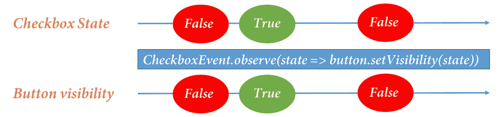

# 使用响应式扩展进行编程

“我们不能用创造它们时使用的相同思维方式来解决我们的问题。”

- 阿尔伯特·爱因斯坦

当我们在解决问题时赋予思考新的维度时，这是美丽的。在编程中，我们解决问题的方法可能各不相同。大多数时候，用户和程序之间存在交互。基于 GUI 和 Web 应用程序是这些应用程序的几个例子。我们可以思考我们的应用程序在用户尝试与之交互时如何被通知。可能我们的程序等待用户的交互，反之亦然。在相反的情况下，用户的交互有时会通知应用程序某种事件。让我们假设我们编写程序以对用户的交互做出反应。这就是作为应用程序程序响应式的本质。我们编写一个作为周围环境系统的程序，环境本身将事件推送到我们的程序。这些事件驱动整个系统，因此它们成为响应式编程模型的核心。而这只是响应式开始的起点，还有更多从这种模型中产生的概念。

从上一章，我们已经得到了异步计算的核心。异步计算包括某种将在不久的将来执行的计算及其回调，该回调在计算完成时执行。

好吧，在本章中，我们将继续理解异步计算，以了解响应式扩展，这实际上是在考虑到响应式编程模型时创建的一个 API。以下是我们将讨论的内容：

+   响应式编程

+   响应式扩展

+   对 RxScala 的反应

响应式编程，一句话概括，就是使用异步数据流进行编程的过程。如果这不是你预期的定义，让我们试着了解一下它。让我们把它想象成一段旅程。我们将从零开始，对编程术语中的响应式一无所知。随着我们的前进，我们将与一些形成响应式生态系统的概念和机制进行互动。最终目标是能够以响应式的方式思考。那么，让我们开始吧。

# 响应式编程

理解任何新的范式或概念的最佳方式是推理其存在。为此，让我们考虑一个非常常见且简单的场景，如下所示：


你可能已经遇到了前面图中展示的表单行为。我们有一个协议去阅读它，然后我们点击复选框来同意它，这样我们才能继续前进。在左侧，复选框是未勾选的。因此，基于它的值，我们将**继续**按钮（目前为未勾选的框）的可见性设置为 false。一旦我们点击并设置复选框的值为 true，**继续**按钮的可见性也变为 true。所发生的是，当我们点击复选框时，它会发出一个带有其值的（即 true/false）事件。现在，基于它的值，我们可以设置按钮的可见性为 true/false。这是一个观察简单复选框事件并利用事件值的例子。如果你想象一下，它可能看起来如下所示：



下面的图显示了**复选框**状态和按钮的可见性。我们不需要关心代码语法，因为我们现在不讨论任何语言或框架。在这个例子中，我们只关心复选框触发的单个事件。这很简单理解。现在让我们考虑一个反应性的计算。考虑以下计算：

```java
A := 5 
B := A 
C := A 
D := B + C 
```

这个计算表明**A**将有一个值，**B**和**C**将具有与**A**相同的值，最后，**D**将是**B**和**C**相加的结果。所以在常规程序中，一旦你执行了语句，你就能得到**A**、**B**、**C**和**D**的值。现在，让我们考虑当我们考虑时间和允许值在我们的系统中流动时会发生什么。我们这是什么意思？看看下面的图：


在左侧，我们描绘了与之前提到的相同的场景。在右侧，有一个表格，它包含了一些时刻我们的变量的值。所以让我们说我们将**A**的值更新为 6：

```java
A := 6 
```

现在，这个语句应该增加**B**和**C**的值，因为它现在处于反应性世界中。所以当数据变化时，它会流动并改变所有依赖变量。因此，**B**和**C**被更新为**6**，最终由于依赖项的变化，**D**的值也发生变化，变为 12。从表中可以看出，B、C 和 D 的值在它们观察到**A**的值变化时都会更新。到目前为止，我们还没有处理任何特定的术语。但我们看到了两个例子：第一个例子给出了*发射事件*的本质，第二个例子给出了系统包含变量中的*数据流*的本质。这些都是*反应式编程*的两个重要概念。但是等等，我们还提到了*反应式编程*是使用异步数据流进行编程。为了理解这个概念，考虑**A**变量的值作为数据流中的值。现在，在某个特定的时间点，如果我们尝试访问**A**的值，有三种可能性：

+   你会得到一个返回值

+   当你尝试获取值时会出现错误

+   你会收到一个消息，表明流已完成且不再包含更多值

想象一下，我们会得到以下类似的内容：


之前的图展示了数据流的可能结果。以下是从前面的图中可以提取的一些重要点：

+   所有值都是时间中发生的事件。因此，这些值的顺序将得到保持。在流完成后，没有可能从流中发出任何值。

+   时间扮演着重要的角色；这是为了保持事件顺序。

+   在从流中访问值时可能会发生错误。

+   此外，由于这些事件是相对于时间发生的，我们可以将这些计算异步化，并将一些回调绑定到某些特定事件上。我们还可以根据值过滤掉一些事件。

这类反应式系统根据时间和事件进行反应。我们还可以将这些流与我们在上一章中讨论的承诺进行比较。承诺负责一个将在未来可用的值。而流包含多个异步评估的返回值。这些都是*反应式编程*的构建块。这个范式为这样的流有自己的术语，这些术语被称为**Observables***.* 有各种 API 可供创建这样的*可观察流*，并允许我们转换、过滤和合并这些可观察流，以创建一个数据流动的反应式系统。

这些 API 是 ReactiveX 的一部分，被称为反应式扩展。对于多种语言，都有可用的异步流 API，以下是一些例子：

+   RxJava

+   RxJS

+   Rx.NET

+   RxScala

+   RxLua

+   RxGo

+   RxDart

所有这些 API 都服务于相同的目的，即在其各自平台上提供异步的 Observable 流。这些 API 围绕事件和流的原理展开。让我们来看看这些反应式扩展提供了什么。

# 反应式扩展

所有这些 API 都服务于相同的目的，即在其各自平台上提供异步的 Observable 流。这些 API 围绕事件和流的原理展开。让我们来看看这些反应式扩展提供了什么。是时候看看我们刚刚介绍给自己的术语了，那就是 Observables*.*

可观察对象是发出事件流的实体。事件可以是按钮点击或检查复选框，或者通过接口提供的其他事件，例如向设备提供输入。必须有一个**观察者**来对可观察对象发出的任何值或值的序列做出反应。**观察者**通过**订阅**可观察对象来对事件做出反应。因此，这些观察者订阅可观察对象以对事件做出反应是 ReactiveX 的主要主题。在为不同平台提供的任何库中，这个过程在某种程度上与以下类似：

+   我们定义了 Observable，它负责发出事件。这将以异步方式进行，因为事件可能依赖于某些环境/周围环境，例如用户的交互或某些条件成功。

+   我们定义了一个方法，它使用异步计算返回的值进行一些操作。这个方法是**观察者**的一部分。

+   我们通过**订阅**将**观察者**附加到**可观察对象**上。

通过将`Observer`订阅到 Observable，我们指定现在机制已经到位，我们的观察者已经准备好对事件做出反应。基于这种现象，可观察对象被分为热和冷可观察对象。

+   **热可观察对象**：这些在创建时立即开始发出事件，因此如果在稍后的某个时间点我们将观察者附加/订阅到它，观察者将继续从当前时间点对事件做出反应。

+   **冷可观察对象**：另一方面，这些在观察者订阅它们时开始发出事件。通过这种方式，我们的观察者从事件开始就做出反应。

此外，当我们从流中观察事件时，我们已经看到可能存在错误或流完成的可能。因此，对于 Observer[T]，我们提供了以下方法：

+   `onNext(T)`

+   `onError(Exception)`

+   `onComplete()`

观察者`onNext`方法的每次调用都伴随着来自事件的值。如果你创建了一个`String`类型的观察者，那么`onNext`方法将给你一个字符串值。在典型的响应式编程场景中，对`onNext`方法的调用会一直持续到事件流完成或发生某些错误；在这些情况下，会调用`onComplete`或`onError`。在这些方法之后，我们不会从该订阅中获得任何值。

如果你还记得，当我们讨论集合时提到的可迭代对象，这些可迭代对象的工作方式在某种程度上是相似的，唯一的区别在于可观察对象在本质上是异步的。可迭代对象按顺序包含数据，我们可以一次获取一个值并对它们执行一些操作。要从这样的可迭代对象中获取数据，我们创建一个迭代器。调用`iterator.next()`让我们可以访问可迭代对象中的值。可迭代对象允许你以同步方式访问一系列值：


这两种之间的区别在于它们的本质：Observables 是异步的，而 Iterables 则不是。看一下这两个接口，我们可以看到以下内容：


我们知道 *Observables*，但使它们强大的是一系列 *实用* 方法，这些方法被称为 *算子*。这些算子允许我们 *创建、组合、转换、过滤* 和 *转换* Observable*s。我们可以将这些算子链接起来，以特定的顺序执行这些操作。

既然我们已经确定了理论上的东西，现在是时候尝试使用 Scala 在反应式世界中的提供，即 *RxScala* 来应用你所学的知识了。让我们看看 RxScala API 如何表示 Observables。

# 反应式地使用 RxScala

RxScala 是 Scala 中提供的一个反应式异步流 API。它让我们执行我们讨论的所有概念，例如创建 *Observables*、观察者以及 *订阅*。我们有各种各样的算子可供我们操作这些 *Observables*。大多数算子返回 *Observables*，因此 *Observables* 的链式操作也是可能的。

要开始编写一些 *Observables*，我们首先需要设置空间，以便库对我们可用。为此，让我们遵循以下步骤：

1.  在你最喜欢的互联网浏览器中，打开 [`developer.lightbend.com`](https://developer.lightbend.com) 并点击 START A PROJECT 按钮。

1.  你将得到一些选项；只需选择 Scala 并点击 CREATE A PROJECT FOR ME! 按钮。它将以压缩格式下载源代码：


1.  我们可以提取它并在 IntelliJ IDE 中打开。

1.  一旦在 IntelliJ 中打开，我们就可以在构建文件中添加 RxScala 的库依赖项。这可以通过指定以下内容来完成：

```java
     libraryDependencies += "io.reactivex" %% "rxscala" % "0.26.5" 
```

1.  在指定依赖项后，我们可以从命令行执行 `sbt update` 命令*，*这将下载依赖文件。我们应该从这个指定 `build.sbt` 的目录中进行此更新。

现在，我们已经准备好编写 Observables 了。那么，还等什么呢？让我们开始编写一些。

# 创建 Observables

对于创建 Observables，有如 `just`、`empty`、`interval`、`from` 和 `defer` 等一系列算子。让我们首先编写一些代码来以不同的方式创建 Observables：

```java
package example 

import rx.lang.scala.Observable 
import scala.concurrent.Future 
import scala.concurrent.ExecutionContext.Implicits.global 
import scala.concurrent.duration._ 

object FirstRxApp extends App { 

  //Creates an empty Observable. 
  val emptyObservable = Observable.empty 

  //Creates an Observable that only emits 1\. 
  val numObservable = Observable.just(1) 

  val sequence = List(1, 3, 5, 7, 9) 

  //Creates an Observable, which emits values from the sequence mentioned. 
  val sequenceObservable = Observable.from(sequence) 

  val someAsyncComputation = Future { 1 } 
  //Creates an Observable, from an async computation 
  val fromAsyncObservable = Observable.from(someAsyncComputation) 

  //Creates an Observable, which emits items at a duration gap specified. 
val intervalObservables = Observable.interval(200 millis) 

  //Creates an Observable, which starts emitting, once some observer subscribe to it. 
  val deferObservable = Observable.defer(fromAsyncObservable) 

  //Creates an Observable, which never emits any value. 
  val neverObservable = Observable.never 

} 
```

在前面的代码片段中，我们只创建了 Observables，并且没有对它们进行订阅。因此，即使它们发出一些值，我们也没有机制来对这些值做出反应。首先让我们看看所写的代码：

1.  第一条语句创建了一个空的 Observable，这意味着它里面没有任何值。

1.  第二条语句调用了一个名为 `just`* 的算子，它接受一个值并将其包装在 Observable 上下文中。因此，当这个 observable 发出时，它只会发出我们指定的值。

1.  接下来，我们使用名为 `from`*.* 的方法向我们的可观察对象提供了一系列值。

1.  `from` 方法还可以接受一个未来值并创建一个 Observable。这个 Observable 会发出 Future 中指定的异步计算的结果。

```java
    def fromT(implicit execContext: ExecutionContext): Observable[T] 
```

1.  然后是`interval`方法，它期望我们提供发射值的间隔。

1.  最后，我们还有两种指定的方式。首先，我们使用了名为`defer`的算子，它将`byname`参数作为另一个可观察者，并且只有在观察者订阅它之后才开始发射事件：

```java
    def deferT: Observable[T] 
```

使用这些算子，我们能够创建可观察者*。现在让我们通过调用`subscribe`方法将这些可观察者附加到订阅上。为此，我们可以在我们的 Scala 文件中添加以下片段。首先，让我们添加一些导入：

```java
import rx.Subscription 
import rx.observers.TestSubscriber 
```

接下来，我们在创建可观察者之后添加以下片段：

```java
//Subscribing to Observables 
emptyObservable 
  .subscribe(value => println(s"From emptyObservable: $value")) 

numObservable 
  .subscribe(value => println(s"From numObservable: $value")) 

sequenceObservable 
  .subscribe(value => println(s"From sequenceObservable: $value")) 

fromAsyncObservable 
  .subscribe(value => println(s"From fromAsyncObservable: $value")) 

intervalObservables 
  .subscribe(value => println(value)) 
Thread.sleep(1000) 

new TestSubscriber[Subscription].awaitTerminalEvent(1000, MILLISECONDS) 

deferObservable 
  .subscribe(value => println(s"From deferObservable: $value")) 
subscribe method by passing what to do with the value. Take a look at the subscribe method's signature:
```

```java
def subscribe(onNext: T => Unit): Subscription 
```

该方法接受值并对其执行操作，或者说对其做出反应。它返回一个`Subscription`实例。这个`Subscription`参数的优势在于我们可以通过调用名为`unsubscribe`的方法来取消订阅*。

在`intervalObservables`的情况下，我们还需要提供`Thread.sleep(1000)`，这样我们的`intervalObservables`类型就有时间发射值。如果我们不使用某种机制等待这些发射，线程将被杀死，我们就看不到发射的值。

这些是我们创建可观察者并订阅它们的一些方法。但这更多的是熟悉 API。我们可能想看看一些示例，以展示这种响应式模式的使用。

让我们考虑一个场景。假设用户必须填写一个包含关于足球运动员信息的表单。他必须提供球员的名字、年龄、国籍和联赛。填写完信息后，用户将按下**提交**，然后表单数据就会交给我们处理：


现在轮到我们为玩家的信息提供数据流。通过这种方式，我们指的是，有了具体的信息，我们可以创建一个玩家的实例，验证信息，以某种特定的格式显示信息，或者做任何你能想到的事情。对于每个表单提交，流程都是一样的。在这种情况下，我们可以为事件创建一个可观察者，让我们称它为表单提交事件。订阅此事件的观察者将获取每个表单提交的数据。然后我们可以定义`onNext`来以我们想要的方式操作表单数据。无论用户输入信息或按下**提交**按钮的速度有多快，我们都有 Observable 系统在位，它会通过事件的触发来接收通知。然后这个过程就开始了。

现在，为了在实际情况中看到这一点，让我们假设数据源是我们最喜欢的 CSV 文件，而不是有人为我们填写表单，看看代码可能是什么样子：

```java
package example 

import rx.lang.scala.Observable 

object SmartApp extends App { 

  val src = 
   "/Users/vika/Documents/LSProg/LSPWorkspace/First_Proj_Rx/src/main/scala/example/football_stats.csv" 

  val playerObservable = 
    Observable.from(PlayerService.readPlayerDataFromSource(src)) 

  playerObservable 
    .map(playerString => 
    PlayerService.parseToPlayer(playerString)) 
    .subscribe(player => PlayerService.showPlayerInformation(player), 
    error => println(s"Error Occurred: ${error.getMessage}")) 

  Thread.sleep(10000) 
} 
```

在前面的代码中，将 `playerObservable` 类型视为从某些事件源创建。它的类型是 `String`，在我们的例子中，它应该包含以字符串格式表示的玩家信息。现在我们应该对字符串做什么，就是将这个字符串信息解析为 Player 实例。`readPlayerDateFromSource`、`parseToPlayer` 和 `showPlayerInformation` 方法是另一个名为 `PlayerService` 的对象的一部分：*

```java
package example 

import scala.io.BufferedSource 
import scala.util.{Failure, Success, Try} 

object PlayerService { 

  def readPlayerDataFromSource(src: String): List[String] = { 
    val source: BufferedSource = io.Source.fromFile(src) 
    val list: List[String] = source.getLines().toList 

    source.close() 
    list 
  } 

  def parseToPlayer(string: String): Option[Player] = { 
    Try { 
      val columns = string.split((",")).map(_.trim) 
      Player(columns(5), columns(6), columns(9).toInt, columns(7)) 
    } match { 
      case Success(value) => Some(value) 
      case Failure(excep) => None 
    } 
  } 

  def showPlayerInformation(playerOp: Option[Player]): Unit = { 
    playerOp.map { player => 
      println("------------ Here's our Player Information ----------- ") 
      println(s"Name: ${player.name}") 
      println(s"Age: ${player.age} | Nationality: ${player.nationality} | League: ${player.league}") 
      println 
    } 
  } 

  case class Player(name: String, nationality: String, age: Int, league: String) 

} 
```

让我们看看我们案例中操作符的魔力。第一个是 map 本身，它接受一个玩家字符串，并调用 `parseToPlayer`：

```java
playerObservable 
    .map(playerString => 
      PlayerService.parseToPlayer(playerString)) 
```

如果你尝试推断其结果类型，它只是 `Observable[Option[Player]]`，所以没有变化；它仍然是一个可观察对象。我们只是在可观察对象世界中进行了一次转换并得到了一个结果。之后，我们订阅了可观察对象并调用了我们想要的 `showPlayerInformation(player)` 方法：

```java
.subscribe(player => PlayerService.showPlayerInformation(player), 
    error => println(s"Error Occurred: ${error.getMessage}")) 
```

这本身就很令人惊讶，因为系统是为特定事件设置的，在我们的例子中是 *表单提交* 事件，它给我们 `Observable[String]`。多亏了我们假设的用户，他输入信息并提交，这样系统就能得到一个字符串来操作。

现在为了再次澄清画面，我们将借助以下图：


如前图所示，目前，只有一个玩家信息源附加，整个管道工作良好。现在考虑另一个场景，我们的假设用户也可以从一些建议输入中选择一个玩家。那会是什么样子？


在这种情况下，我们可能会得到整个玩家信息作为 `Option[Player]` 而不是字符串。因此，在这种情况下工作的可观察对象将是 `Observable[Option[Player]]` 类型。现在，如果我们想执行与表单提交情况相同的逻辑，我们只需要使用合并操作符。这将合并可观察对象，因此我们将能够实现我们想要的结果。重要的是要在正确的位置合并我们的新可观察对象。从图中，我们得到一个提示，如果我们像以下图所示合并 `observable[Option[Player]]`，将会更好：


看看前面的图。正如你所见，在最左侧，建议输入表单给我们 `Observable[Option[Player]]`，我们将其与我们的转换后的相同类型的可观察对象合并。我们可以在我们的代码中做同样的事情。让我们从一个自定义可选玩家创建一个可观察对象，然后合并它。

我们将重构我们的代码如下：

```java
package example 

import rx.lang.scala.Observable 

object SmartApp extends App { 

  val src = 
    "/Users/vika/Documents/LSProg/LSPWorkspace/First_Proj_Rx/src/main/scala/example/football_stats.csv" 

  val playerObservable: Observable[String] = 
    Observable.from(PlayerService.readPlayerDataFromSource(src)) 

  val somePlayer = Some(PlayerService.Player("Random Player", "Random Nation", 31, "Random League")) 

  playerObservable 
    .map(playerString => 
      PlayerService.parseToPlayer(playerString)) 
    .merge(Observable.just(somePlayer)) 
    .subscribe(player => PlayerService.showPlayerInformation(player), 
      error => println(s"Error Occurred: ${error.getMessage}")) 

  Thread.sleep(10000) 
} 
```

我们可以看到，我们将`observable.just(somePlayer)`类型与类型为`Observable[Option[Player]]`的 Observable 合并了*.* 这个合并调用将这两个 Observable 合并在一起，因此这些合并来源的值将通过管道传输。我们可以通过运行应用程序来尝试这一点。如果 CSV 文件位于正确的位置，我们将看到来自我们的 CSV 文件以及我们创建的`somePlayer`Observable 的值。这样，我们可以使用操作符使我们的系统与多个事件源一起工作。这只是冰山一角。我们可以用这些操作符实现很多功能。我强烈建议您阅读 ReactiveX*.*的文档([`reactivex.io/documentation/operators.html`](http://reactivex.io/documentation/operators.html))。它们的宝石图解释了每个操作符，您可以根据需要使用它们。

基于这个推荐，我们希望总结本章所涵盖的内容。

# 摘要

本章向我们介绍了反应式编程的概念。我们理解了可观察事件的概念以及如何对它们做出反应。这让我们对反应式编程有了本质的理解。之后，我们了解了反应式扩展并探索了 API。我们看到了如何创建 Observables 并订阅它们。最后，我们查看了一个示例，解释了我们可以如何使用可用的某些操作符来组合 Observables。

在下一章中，我们将介绍一个最重要的主题，那就是测试我们的程序。我们将探讨目前讨论得很多的开发模型，即**测试驱动开发**（**TDD**）。我们将从回答 TDD 的为什么和是什么开始，然后了解 Scala 中可用的测试工具包。
