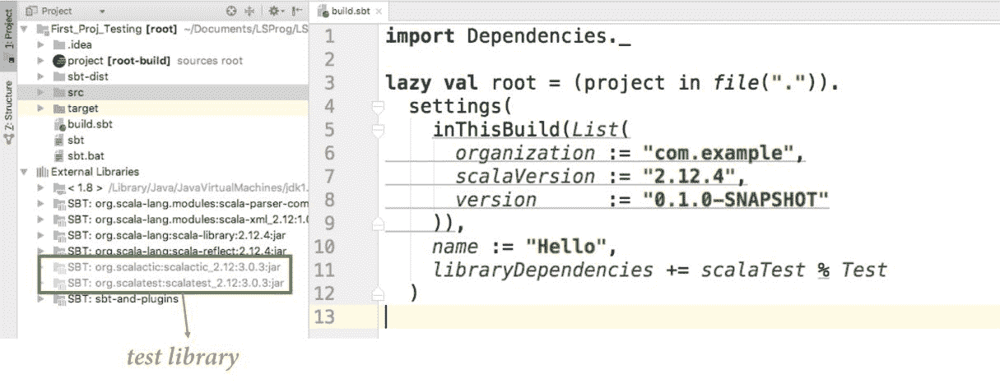

# Scala 中的测试

“改变是所有真正学习的最终结果。”

- 利奥·布斯卡利亚

软件开发是一个不断变化的过程。在过去的几十年里，我们已经看到许多模式被发现/重新发现。这些编程技术/范式已经成为一个重要的部分，并改变了我们处理编程的方式。其中之一是**测试驱动开发**（**TDD**）。在 TDD 方法中，我们首先通过新测试指定我们应用程序的需求。然后，一个接一个地，我们编写具体的代码来通过所有这些测试。通过这种方式，我们通过编写新的测试用例、实现通过它们的代码，最终构建了一个按预期运行的程序。Scala 提供了许多测试框架（例如，**ScalaTest**、**Specs2**等），我们还有**Mockito**和**ScalaMock**用于模拟对象。从某种意义上说，测试是一个小概念，但可以有大量的解释。在本章中，我们将专注于理解 TDD 方法以及我们如何遵循这种方法在 Scala 中成功应用它。为此，我们将通过以下内容进行学习：

+   TDD 的为什么和是什么

    +   TDD 的过程

    +   **行为驱动开发**（**BDD**）

+   ScalaTest

+   ScalaCheck

那么，让我们从为什么这个被称为 TDD 的火箭在当今软件开发空间中飞得如此之高开始吧。

# TDD 的为什么和是什么

为了编写预期和设计良好的软件，我们倾向于在开发过程开始之前明确需求。有了敏捷实践，我们将需求转化为我们所说的用户/功能故事。将这些故事转化为我们将要实现的简单规范增加了优势。这就是编写测试用例派上用场的地方。我们以测试用例的形式指定我们程序的行为，然后实现这些行为。

这种方法有一些优点。先编写测试用例然后提供实现可以推动我们程序的设计。这意味着当我们接近实现行为时，我们可以思考我们的设计和代码。如果你的一个类`A`依赖于另一个类`B`，我们可以确保将`B`注入到`A`中。从某种意义上说，我们可以将其作为一种习惯来遵循这些方法，例如，从其他类中注入依赖。除了推动应用程序的设计，TDD 还有助于我们思考用例以及我们的应用程序用户可能使用它的方式。它帮助我们清晰地思考用户将获得的接口，以便我们可以相应地编写代码。

在 TDD 中，尽管我们倾向于先编写测试用例，但我们几乎覆盖了软件实现的全部行。这为我们提供了自动的代码覆盖率。让我们看看 TDD 的过程。

# TDD 的过程

根据这种方法，我们可以将 TDD 的过程分解为以下步骤。这个过程可以包含在你的开发工作流程中：

1.  编写一个会失败的测试。

1.  编写一些代码以通过失败的测试。

1.  重构你的代码以提升质量，同时不改变行为。

1.  重复步骤 1 到 3。

我们将这个过程分解成这些步骤。让我们看看每个步骤，以更好地理解每个步骤背后的推理。

# 第 1 步 - 编写一个会失败的测试

编写失败的代码并不是我们感到自信的事情，但这就是 TDD 的工作方式。在我们确定应用程序需要什么以及我们对某个功能有信心之后，我们可以按照我们希望它工作的方式编写功能测试用例。我们想确保运行这个测试用例，并且它失败了。我们的测试用例失败是预期的，因为我们还没有实现任何代码来使其成功。我们所说的初始失败是 TDD 的第一步。

# 第 2 步 - 编写代码以通过失败的测试

这个步骤最好的地方是知道我们如何通过一个失败的测试用例。为此，我们将实现一个功能。在这个步骤中，我们需要编写一些代码。我们可以尝试以不是最佳的方式实现一个函数，但足以通过失败的测试。通过测试保证了特定功能的行为。

# 第 3 步 - 重构代码以提升质量

现在我们确信我们的功能正在工作，我们可以继续提高代码质量。如果功能不是很大，那么这一步可以是之前步骤的一部分。在功能工作后进行代码审查是合乎逻辑的。这可能会提高我们代码的质量。重构后，我们应该确保特性/功能处于工作状态且完好无损。

# 第 4 步 - 重复步骤 1 到 3

现在，对于这个特定的功能，我们已经编写了测试用例并实现了代码，我们确保了它正在工作，代码质量是合适的。我们完成了这个特定的特性/功能，现在可以编写另一个测试用例并重复这个过程步骤。

我们可以这样可视化 TDD（测试驱动开发）的工作流程：


从之前的图中可以看出，TDD 是一个重复的过程，其中你指定一个用例并为它编写代码。

TDD 的一个好处是我们的测试充当了文档。库/框架开发者倾向于编写测试用例，这些测试用例也服务于文档的目的。如何？通过使用领域特定语言（DSL）或者，让我们说，使用类似英语的句子来设计我们的测试套件。一个测试套件由我们程序的多个测试用例组成。让我们看看我们在几个章节中使用的场景。我们将使用的例子是从名为`football.csv`的 CSV 文件中读取足球运动员的数据，将其转换为`Player`对象，并进一步使用这些数据来显示球员信息或基于这些信息进行一些分析。我们如何进行这样的场景的测试用例，或者至少，当我们说“类似英语的句子”来指定规范时，它应该是什么样子？

# 场景

读取玩家数据并在控制台上展示：

```java
"PlayerService" should { 
    "return a Player object." in {//some code} 
    "return an empty collection if there's no data." in {//some code} 
    "return a Nothing on call to getPlayer method with right player string." in {//some code} 
    "return a Some Player instance on call to getPlayer method with right player string." in {//some code} 
    "print a Player's information on console." in {//some code} 
} 
```

在给定的示例场景中，我们指定了一个服务并命名为 `PlayerService`。现在，这个服务应该有执行指定案例的方法。这些案例并不太复杂，但每个案例都期望我们的服务提供简单的功能。这个例子是为了解释目的，因为我们已经看到了代码。我们还将尝试使用测试驱动开发（TDD）方法来实现它。

前面的测试规范值得注意的一点是，在尝试编码之前，我们确实对某些事情有把握：

+   应该有一个 `PlayerService` 服务。

+   在 `PlayerService`*，* 中我们应该有一个 `Player` 实体*。

+   在 `PlayerService`*，* 中我们应该有一个读取玩家数据的功能。它必须是一个集合；当源无法读取或源不包含数据时，该功能应返回一个空集合。

+   在 `PlayerService`*，* 中应该有一个 `getPlayer` 功能，它期望我们提供一些数据给它，并返回一个具体的 `Player` 实体。当我们提供错误数据（如格式）时，功能不会抛出异常，但指定它无法创建具体的 `Player` 实体。

+   在 `PlayerService`*，* 中应该有一个 `getPlayer` 功能，它期望我们提供一些数据给它，并在接收到正确数据时返回一个具体的 *Player* 实体。

+   在 `PlayerService`*，* 中应该有一个 `showPlayers` 功能，它期望我们提供一个 `Player` 实体的集合，并在控制台上打印玩家的信息。

事实是，我们之前提到的点和规范在语义上是相似的，并且我们可以使用其中之一来编写测试用例，这使得测试驱动开发（TDD）变得有趣。这些测试规范与我们将要编写的真实世界测试规范非常接近。仔细看看我们刚才描述的规范；它没有提到我们必须做出的编程语言选择。我们没有得到任何关于语言规范的提示，所以如果使用的编程语言可以支持这样的 **领域特定语言**（**DSL**）类似机制，这些测试用例将适用于任何语言。

这个规范并不限制你只以指定格式编写测试用例，你可以选择自己的写作风格。这是从测试驱动开发（TDD）中出现的惯例之一，被称为 **行为驱动开发**（**BDD**）。这个术语 BDD 通过指定行为来驱动开发任何功能。它还充当我们程序的文档。如果你看到我们编写的规范，从某种意义上说，我们记录了我们可以使用功能的方式。如果这些规范是用 Scala 编写的，我们就可以根据功能提供方法名称。

让我们讨论一下通过指定行为来驱动开发的方式。

# 行为驱动开发（BDD）

我们已经看到了指定我们功能行为的方式，即使用*should ... in*。还有其他方式来指定行为，或者说，确保我们功能的有效性。一个例子是*given**... when**... then**....*

在这里，我们指定以下内容：

+   **Given**: 这是执行某些功能时可用的情况

+   **When***:* 我们面对的是一个基于给定数据的条件

+   **Then***:* 执行预期发生的部分

以这种方式，我们验证了功能的行为。当我们为某个功能编写测试用例时，最佳实践之一是指定所有可能的场景（理想情况下，这是不可能的，但我们尽力包括所有我们能想到的可能性）。这些场景包括*空场景*、*单元场景*和*失败场景*。最后，我们覆盖了所有条件可能性。有了这些，我们确保规范是有效的，我们的实现也是。这些规范作为我们功能性的验收标准。你漏掉一些重要情况的几率较小。重要的是要知道，描述我们的测试用例没有硬性规定。

行为驱动开发的一个好处是，我们不是用测试术语来谈论，而是用规范或场景来谈论。因此，不仅开发者，大多数业务利益相关者和领域专家也可以指定应用程序的需求。

现在，谈到 Scala 为测试提供的框架或工具包，有很多。**ScalaTest**、**ScalaCheck**和**Specs2**是开发者用来为代码编写测试的几个例子。我们将通过最广泛使用的测试工具之一，ScalaTest，并尝试通过示例查看规范是如何实现的。

# ScalaTest

如我们所提到的，ScalaTest 因其提供的多种编写规范的风格而闻名。不仅限于多种风格，这个套件还作为**Scala.js**和 Java 类的测试工具。ScalaTest 涵盖了 Scala 生态系统的大部分内容，并允许你根据功能的行为选择不同的方式来编写规范。

# 设置测试环境

要使用 ScalaTest，让我们通过一些基本步骤。我们可以创建一个新的 SBT 项目，并通过`build.sbt`文件添加**ScalaTest**依赖项，或者使用 Lightbend 的技术中心下载一个简单的 Scala 项目。让我们尝试第二种方法，因为它会在我们的`build.sbt`文件中添加 ScalaTest 作为依赖项。让我们按照以下步骤进行：

1.  在你喜欢的浏览器中打开：[`developer.lightbend.com`](https://developer.lightbend.com)。

1.  点击 START A PROJECT 按钮：


1.  从项目类型中选择 Scala：


1.  你可以命名项目并点击 CREATE A PROJECT FOR ME!*：


这将为你下载一个名为你指定的压缩文件。将压缩文件提取到特定位置并在 IntelliJ IDE 中打开它。

我们可以打开`build.sbt`来检查指定的依赖项和项目设置。我们的`sbtbuild`文件应该看起来像以下这样：

```java
import Dependencies._ 

lazy val root = (project in file(".")). 
  settings( 
    inThisBuild(List( 
      organization := "com.example", 
      scalaVersion := "2.12.4", 
      version      := "0.1.0-SNAPSHOT" 
    )), 
    name := "Hello", 
    libraryDependencies += scalaTest % Test 
  ) 
```

在这里，在`libraryDependencies`设置中，指定了`scalaTest`。因此，我们可以使用它。示例项目包含一些源代码和测试。所以，我们首先尝试运行测试案例。如果你可以看到外部依赖目录中的`scalatest`库，如图所示，那么我们就准备好执行测试了：



如果这些库没有显示在你的项目结构中，我们可以执行`sbt update`命令，这样 SBT 就可以下载所有指定的依赖项。我们还将使用一些 SBT 命令来运行我们的测试案例。让我们看看它们：

+   `sbt test`：SBT 假设 Scala 的测试源位于`src/test/scala`目录，而测试源的资源，如测试源的配置，位于`src/test/resources`目录

根据之前描述的假设，当我们执行前文所述的命令时，SBT 将编译相应位置的所有测试文件并对它们进行测试。如果你只关心特定的测试案例怎么办？

+   `sbt testOnly`：基于我们对`sbt test`命令的类似假设，当我们执行`testOnly`命令时，SBT 仅编译和测试我们通过命令指定的测试案例。考虑以下示例：

```java
        sbt testOnly example.HelloSpec
```

+   `sbt testQuick`：基于我们对`sbt test`命令的类似假设，当我们执行`testQuick`命令时，SBT 仅编译和测试满足以下条件的测试案例：

    +   上次运行失败的测试

    +   尚未运行的测试

    +   具有传递性依赖的测试

这些是我们用来测试案例的几个 Scala 命令。此外，在测试我们的规范时，我们将使用触发执行。我们通过在测试命令前加上`~`来启动触发执行。这样，SBT 期望保存更改，再次保存文件将触发测试执行。因此，尝试这个命令，假设我们已经打开了 SBT shell（在命令提示符中打开项目目录，其中包含`build.sbt`文件和触发`sbt`命令的位置）。让我们在 SBT shell 中定位我们的项目并执行以下命令：


在我们下载的项目测试目录中有一个名为`HelloSpec`的类*，*。如果一切正常，我们应该通过测试，你将开始喜欢*绿色*的颜色。但如果代码是红色，这意味着它失败了。所以，我们准备深入研究`ScalaTest`*.*

# 使用 ScalaTest 进行风格化的测试

我们已经测试了`HelloSpec`类*，所以我们将查看测试以及它的编写方式。因此，我们可以打开位于`src/test/scala/example`的文件`Hello`*。源代码如下：

```java
package example 

import org.scalatest._ 

class HelloSpec extends FlatSpec with Matchers { 
  "The Hello object" should "say hello" in { 
    Hello.greeting shouldEqual "hello" 
  } 
} 
```

看一下代码示例，我们可以观察到几个要点：

+   我们导入了`org.scalatest._`以引入我们想要使用的所有特性。

+   命名为`HelloSpec`的类定义扩展了`FlatSpec`以及混合`Matchers`类。将我们的测试规范命名为类名后跟`Spec`是一种约定。

+   定义只包含一个*规范*。规范声明“有一个名为 Hello 的对象，在指定的代码片段中说 hello”。这就是它多么酷——规范是以任何英语句子都可以编写的方式编写的。

+   规范是以类似 DSL 的方式编写的。语言看起来很自然，进一步下文，规范声明将有一个返回字符串等于`hello`的方法调用。

+   对`shouldEqual`的调用是一个`Matcher`*。`Matcher`的职责是将左操作数与右操作数匹配。还有几种其他方式可以编写这样的`Matchers`，但我们将后续章节中再讨论这些。

这非常简单，到目前为止一切都很顺利。现在，让我们看看位于`src/main/scala/example`位置的相应代码文件*。让我们看看名为`Hello.scala`的文件：

```java
package example 

object Hello extends Greeting with App { 
  println(greeting) 
} 

trait Greeting { 
  lazy val greeting: String = "hello" 
} 
```

根据我们的规范，有一个名为`Hello`的对象。我们可以调用`greeting`*，它除了打印这个字符串`hello`*之外，什么都不做。嗯，这个例子已经对我们来说是可以观察到的，所以我们没有遵循 TDD。但我们将尝试通过指定行为来编写类似的东西，使用*测试优先方法*。

在我们编写自己的第一个规范之前，让我们遵循一些约定或一项好的实践，创建一个扩展`FlatSpec`并默认带有`Matchers`的抽象类，这样我们就不必在编写的每个规范中扩展它们。我们可以通过创建一个规范文件来实现这一点，让我们将其命名为`SomeSpec`并保存在`src/test/scala/example/`目录中。它应该看起来像这样：

```java
package example 

import org.scalatest._ 

abstract class SomeSpec(toBeTested: String) extends FlatSpec with Matchers 
```

现在我们创建了一些扩展`FlatSpec`和`Matchers`类的抽象类，我们准备遵循 TDD 的第一步来编写一个失败的测试规范。我们的`SomeSpec`抽象类接受一个名为`toBeTested`的参数，它只是功能名称。

让我们创建另一个测试规范，命名为`PlayerSpec`，并保存在`src/test/scala/example`：

```java
package example 

class PlayerSpec extends SomeSpec("PlayerService") { 

  it should "compile" in { 
  """PlayerService.Player("Cristiano Ronaldo", "Portuguese", 32, "Real Madrid")""" should compile 
  } 

} 
Player instances*.* When we try to run the test case, it's going to fail as expected, because we have not written the  Player class till now:
```

```java
> testOnly example.PlayerSpec 
[info] PlayerSpec: 
[info] - should compile *** FAILED *** 
[info] Expected no compiler error, but got the following type error: "not found: value Player", for code: Player("Cristiano Ronaldo", "Portuguese", 32, "Real Madrid") (PlayerSpec.scala:6) 
[info] Run completed in 281 milliseconds. 
[info] Total number of tests run: 1 
[info] Suites: completed 1, aborted 0 
[info] Tests: succeeded 0, failed 1, canceled 0, ignored 0, pending 0 
[info] *** 1 TEST FAILED *** 
[error] Failed tests: 
[error]  example.PlayerSpec 
[error] (test:testOnly) sbt.TestsFailedException: Tests unsuccessful 
```

让我们编写`Player`案例类：

```java
// src/main/scala/example/PlayerService.scala

object PlayerService extends App { 

  case class Player(name: String, nationality: String, age: Int, league: String) 

} 
```

使用这段代码，我们可以保存文件，由于我们的测试是在*触发模式*下运行的，我们可以看到测试用例通过了：

```java
[info] PlayerSpec: 
[info] - should compile 
[info] Run completed in 199 milliseconds. 
[info] Total number of tests run: 1 
[info] Suites: completed 1, aborted 0 
[info] Tests: succeeded 1, failed 0, canceled 0, ignored 0, pending 0 
[info] All tests passed. 
[success] Total time: 1 s, completed 
```

我们将再次遵循相同的步骤。所以，让我们编写一些更多的测试用例：

```java
package example 

class PlayerSpec extends SomeSpec("PlayerService") { 

  it should "compile" in { 
    """PlayerService.Player("Cristiano Ronaldo", "Portuguese", 32, "Real Madrid")""" should compile 
    } 

  it should "throw an exception when source is wrong" in { 
    val src = "some source" 
    assertThrowsjava.io.FileNotFoundException) 
  } 

  it should "return collection of String when data is read from correct source" in { 
    val src = "/Users/vika/Documents/LSProg/LSPWorkspace/First_Proj_Testing/src/main/scala/example/football_stats.csv" 
    PlayerService.readPlayerDataFromSource(src) should not be empty 
  } 

  it should "return None while parsing wrong player string data into player instance" in { 
    val data = "some wrong player string" 
    PlayerService.parseToPlayer(data) shouldBe None 
  } 

  it should "return Some Player while parsing player string data into player instance" in { 
    val data = """1,1,2,1,2,Cristiano Ronaldo,Portugal,Real Madrid,Spain,32,4829,40,4789,124,63""" 
    val player = PlayerService.Player("Cristiano Ronaldo", "Portugal", 32, "Real Madrid") 

    PlayerService.parseToPlayer(data) shouldBe Some(player) 
  } 

} 
```

我们对我们的功能行为有了清晰的了解，因此我们编写了更多的测试用例。现在，我们的规范包括了更多的测试条款。我们已经使用了几个可用的`Matchers`。让我们看看我们的测试是如何工作的：

1.  在检查我们的代码后，它应该能够编译。在下一个条款中，我们指定了当尝试访问错误的文件路径时，我们的代码应该抛出`FileNotFoundException`。我们使用了`assertThrows`断言来指定这种行为。在这里，我们不需要指定任何`Matchers`，因为指定一个*断言*就足够了。

1.  在下一个条款中，我们提到`readPlayerDataFromSource`的结果不应该为空，这里的空指的是集合为空。

1.  下一个规范条款期望当我们尝试用错误格式的数据调用`parseToPlayer`方法到`Player`实例时，将返回`None`。

1.  最后，当我们用正确格式的数据调用`parseToPlayer`方法时，我们期望它返回一个玩家对象。

从我们的规范和提到的条款中可以清楚地看出我们对我们功能的具体要求。当我们尝试运行测试用例时，它无法编译，因为我们没有`readPlayerDataFromSource`和`parseToPlayer`这些方法。我们可以定义所有这些方法和相应的代码。代码应该看起来像这样：

```java
package example 

import scala.util.Try 
import scala.util.{Failure, Success} 

object PlayerService extends App { 

  def readPlayerDataFromSource(src: String): List[String] = { 
    val source = io.Source.fromFile(src) 

    val list: List[String] = source.getLines().toList 

    source.close() 
    list 
  } 

  def parseToPlayer(string: String): Option[Player] = { 
    Try { 
      val columns = string.split((",")).map(_.trim) 
      Player(columns(5), columns(6), columns(9).toInt, columns(7)) 
    } match { 
      case Success(value) => Some(value) 
      case Failure(excep) => None 
    } 
  } 

  case class Player(name: String, nationality: String, age: Int, league: String) 

} 
```

在编写代码之后，如果需要，我们可以对其进行重构。在我们的例子中，我们已经重构了代码。如果你已经将相应的文件放置在正确的路径，我们可以尝试运行测试用例。所有的测试用例都将成功通过，这意味着它们都将显示为绿色：

```java
[info] PlayerSpec: 
[info] - should compile 
[info] - should throw an exception when source is wrong 
[info] - should return collection of String when data is read from correct source 
[info] - should return None while parsing wrong player string data into player instance 
[info] - should return Some Player while parsing player string data into player instance 
[info] Run completed in 324 milliseconds. 
[info] Total number of tests run: 5 
[info] Suites: completed 1, aborted 0 
[info] Tests: succeeded 5, failed 0, canceled 0, ignored 0, pending 0 
[info] All tests passed. 
```

现在，我们对工具包以及 TDD 如何使编写软件变得有趣有了一些了解。在我们的例子中，我们使用了`FlatSpec`。还有更多这样的工具；一些常用的 Spec 如下：

+   `FunSpec`

+   `WordSpec`

+   `FreeSpec`

+   `PropSpec`

+   `FeatureSpec`

这些风格只在外观上有所不同。如果我们考虑用类似英语的语言编写的测试规范，我们可以说这些风格是由我们可以用不同的方式来写/说我们的句子组成。我们已经看到了`FlatSpec`*.* `FunSpec`规范使用嵌套条款和关键字如`describe`和`it`。让我们看看所有这些 Spec 风格的几个例子：

+   `FunSpec`

```java
    describe("In PlayerService object"){
        it("should compile") {
            assertCompiles("""PlayerService.Player (
                                  "Cristiano Ronaldo", 
                                  "Portuguese", 32, 
                                  "Real Madrid")""")
        }
    }
```

+   `WordSpec`

```java
    "PlayerService.Player.parseToPlayer" when {
        "wrong parsing data passed" should {
            "return None" in {
                PlayerService.parseToPlayer("some wrog data") shouldBe None
            }
        }
    }
```

+   `FreeSpec`

```java
    "PlayerService.Player.parseToPlayer" - {
        "wrong parsing data passed" - {
            "return None" in {
                PlayerService.parseToPlayer("some wrog data") shouldBe None
            }
        }
    }
```

这些是我们可以在`ScalaTest`中用来编写测试规范的几种风格。你绝对应该查看`ScalaTest`的文档([`www.scalatest.org/user_guide`](http://www.scalatest.org/user_guide))来了解更多关于这些风格的信息。

我们已经看到了如何使用断言和`Matchers`来检查测试条款的有效性。让我们更深入地了解这些。我们将从*断言*特质*开始。

# 断言

特质*断言*包含在指定测试用例行为时我们可以做出的断言。所有风格规范中都有三个默认断言可用。这些断言如下：

+   `assert`

+   `assertResult`

+   `assertThrows`

我们已经使用了`assertThrows`，其他两个也可以以类似的方式使用。`assertResult`断言期望我们提供一个值，这个值将是我们要指定的某些计算的输出结果。同样，`assert`期望我们提供一个布尔谓词，它有左右两部分。在某些条件下，可以进行一些相等性检查，这些检查基于布尔值，根据这些值，测试条款通过。

除了这些，还有更多的断言可用。其中一些是`fail`、`cancel`、`succeed`、`intercept`、`assertCompiles`、`assertDoesNotCompile`等等。除了这些断言之外，我们还可以使用`Matchers`来检查测试规范的有效性。我们在一些示例条款中使用了`Matchers`和关键字。

# 匹配器

当我们查看示例时，我们已经看到了一些`Matchers`。这些`Matchers`是断言的 DSL（领域特定语言）编写方式。`ScalaTest`提供了一套丰富的断言，这些断言与字符串和集合一起工作。我们还可以为自定义类编写`Matchers`。有了这些`Matchers`，我们可以执行最基础的断言，如相等性检查，到更复杂的断言，其中我们需要处理聚合和排序。

这些`Matchers`很酷，因为它们有类似原生语言的方法。考虑以下示例：

```java
someCollection should have length 7 
someString should include ("world") 
twenty should be > 10 
number shouldBe odd 
sequence should contain ("thisvalue")  
```

有很多种方式可以表达一个特定的句子来传达相同的信息。同样，使用`ScalaTest`的`Matchers`，我们可以用不同的方法指定一些条款。`Matchers`在这方面非常有用。

我们还知道，在编写软件时，有时我们需要创建模拟对象作为参数传递。为此，我们不必自己编写模拟对象，但有一些库会为我们做这件事。让我们看看 Scala 中可用的其中一个。

# ScalaMock – 一个用于模拟对象的原生库

正如我们讨论的，在需要一些我们尚未定义的其他服务，或者由于使用它们是一个复杂的过程，创建它们的实例比较困难的情况下，我们倾向于使用一些模拟框架。

**ScalaMock**是一个在 Scala 中可用的原生框架。为了将 ScalaMock 包含到我们的项目中，我们将在`build.sbt`文件中添加一个对其的依赖项。让我们这样做。我们将在构建文件中添加以下行：

```java
libraryDependencies += "org.scalamock" %% "scalamock" % "4.0.0" % Test 
```

我们已经指定了测试范围，因为我们确信`scalamock`只会在我们的测试用例中使用。在编写这个依赖项之后，我们将通过在 SBT shell 中调用`sbt update`命令来执行一个`sbt update`命令*.*这次更新将把`scalamock`依赖项添加到我们的项目中。我们可以通过查看外部源文件夹来确保这一点。那里将有一个名为`scalamock`的依赖项。如果它可用，我们就准备好模拟一些服务了：


我们将在我们的应用程序中尝试模拟`PlayerService`对象，我们想在其中显示一些玩家的列表。让我们为这个指定一个规范：

```java
import org.scalamock.scalatest.MockFactory 

class PlayerAppSpec extends SomeSpec("PlayerAppSpec") with MockFactory { 

  it should "give us a collection of 2 players" in { 

    val mockPlayer = mock[PlayerService.Player] 

    val list = List(mockPlayer, mockPlayer) 
    list should have length 2 
  } 

} 
scalamock dependency, the MockFactory trait in the scope, all by importing the dependencies and calling the mock method, specifying which type of object to create as a mock. It's as simple as that. We can also mock functions and set some expectations to that mocked function. Let's see the following example:
```

```java
val someStringToIntFunc  = mockFunction[String, Int] 
someStringToIntFunc expects ("Some Number") returning 1 
```

现在，我们可以执行一些测试用例，这包括对模拟函数的调用。我们的测试用例必须以某种方式至少调用这个函数一次，才能通过。在编写测试用例时模拟对象是一种常见的做法。它减轻了我们手动编写多个类/函数实例的负担，让我们专注于真正重要的事情，即提前验证我们程序的行为。这就是为什么我们有这样的框架可用，使我们的开发生活更加轻松。带着这个，我们来到了这本书的最后一章的结尾。让我们总结一下你所学到的东西。

# 摘要

这一章从未感觉像是最后一章；它很有趣。在经历了几个 Scala 编程结构和框架之后，你学会了如何确保我们程序的合法性。我们知道测试我们编写的代码是至关重要的，但这种新的 TDD 编程风格是一种不同的体验。我们理解了 TDD 实际上是什么——一种在代码完成后而不是开始时通过指定行为来驱动的设计方案。我们讨论了为什么这种方法是好的。然后，我们从 Scala 中可用的测试工具开始，学习了`ScalaTest`*.* 我们编写了规范，然后为这些规范编写了代码。最后，我们还研究了 Scala 中名为 ScalaMock 的模拟框架。

虽然这是最后一章，但我们可以思考还能做些什么来使我们对这门语言的理解更好。最好的方法之一是进行更多的练习；这将帮助我们更好地理解概念，并且我们也会对结构了如指掌。但当我们开始学习函数式编程时，我们才能真正获得洞察力，因为那里才是所有魔法的源泉。尝试用函数式思维去思考，即我们不改变任何东西，这是最重要的方面之一。最后，让我们感谢这个奇妙且不断成长的 Scala 社区。加入社区，提出问题，并以你自己的方式做出贡献。
