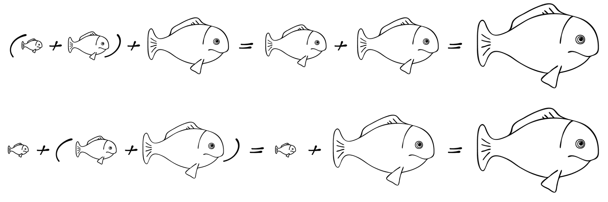
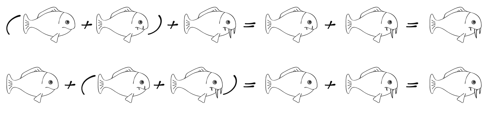
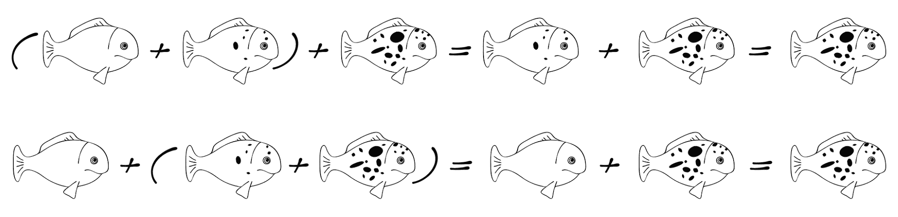
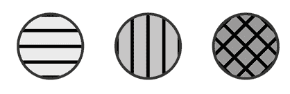
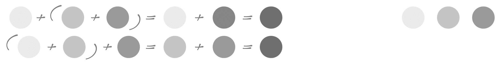
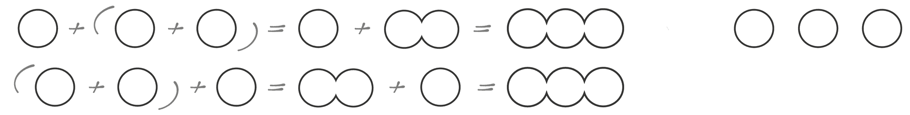
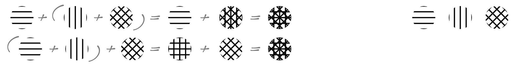

# 理解代数结构

在上一章中，我们查看了一些标准的 Scala 效果，并发现了它们之间许多相似之处。我们还承诺要深入挖掘，找出这些相似性背后的原则。

在深入抽象的海洋之前，让我们先去捕捉一些简单的概念，以便获得一些熟悉和操作它们的技能。

在本章中，我们将探讨一些抽象代数结构——这些结构完全由定义它们的法则所识别。我们将从一个更简单但可用的抽象开始，并逐步深入更复杂的话题。

在本章中，我们将探讨以下主题：

+   半群

+   单群

+   Foldable

+   群

# 技术要求

在我们开始之前，请确保您已安装以下内容：

+   Java 1.8+

+   SBT 1.2+

本章的源代码可在我们的 GitHub 仓库中找到：[`github.com/PacktPublishing/Learn-Scala-Programming/tree/master/Chapter07`](https://github.com/PacktPublishing/Learn-Scala-Programming/tree/master/Chapter07)。

# 抽象代数结构简介

抽象代数结构是由一组法则完全定义的东西。抽象代数结构的根源在于范畴论，这是数学的一个分支，致力于研究这些结构。

这个主题的“抽象性”对我们有两个后果。首先，我们需要进入一种特定的思维状态，并就一般事物进行讨论，而不是我们现在所讨论的具体实现。其次，我们将要查看的结构，即半群、单群、群和 Foldable，适用于广泛的案例，每个案例都可以导致抽象概念的实现。如果这听起来太理论化，请不要担心；我们将在 `Semigroup` 中很快变得实用。

# 半群

半群可能是最简单但最有用的代数结构。它完全由两个特性定义：

+   它定义了一些（可能是无限的）元素集合

+   它为这个集合中任意两个元素的任意对定义了二元运算

它还具有以下两个特性：

+   运算是封闭的，这意味着运算的结果属于与操作数相同的集合

+   运算是结合的，这意味着多次运算应该产生相同的结果，无论它们的操作顺序如何

我们几乎可以逐字逐句地将这些定义翻译成 Scala 代码：

```java
trait Semigroup[S] {
 def op(l: S, r: S): S
}
```

`S` 表示集合元素所属的类型，`op` 表示运算。结果类型也是 `S`——我们在类型级别上定义了运算的封闭性。形式上，可以说 `S` 在 `op` 下 *构成一个半群*。

熟悉第五章，“Scala 中的基于属性的测试”的读者也会记得我们提到结合律是制定`ScalaCheck`属性的一种方式。以我们之前提到的方式定义这个属性来检查第二个半群法是非常容易的：

```java
import org.scalacheck._
import org.scalacheck.Prop._
def associativity[S : Semigroup : Arbitrary]: Prop =
  forAll((a: S, b: S, c: S) => {
    val sg = implicitly[Semigroup[S]]
    sg.op(sg.op(a, b), c) == sg.op(a, sg.op(b, c))
  })
```

我们需要`S`类型具有`Semigroup`和`Arbitrary`，前者我们需要获取要检查的实现，后者能够为`S`生成随机数据。

该属性本身，`sg.op(sg.op(a, b), c) == sg.op(a, sg.op(b, c))`，只是验证以不同顺序应用的操作会产生相同的结果——正如口头所述。

请注意，我们在这章中定义的属性也可以通过在 SBT 中直接运行测试来执行。为此，只需启动 SBT 会话，然后按*Enter*键输入 test。

好的，我们现在为`S`定义了一个半群以及检查半群是否正确实现的方法，但`S`是什么？嗯，这就是抽象代数数据结构的美丽之处。只要半群法则成立，`S`可以是任何东西。作为一个例子，我们可以坚持我们关于捕鱼的比喻。

我们可以为`S`指定至少两个定义在所有鱼上的`eat`操作。*大鱼吃小鱼*操作定义在两条鱼上，结果是较大的鱼的体积等于参与运算的两条鱼的体积之和。同样，*重鱼吃轻鱼*也是按照相同的原则定义的，但以鱼的重量为标准。很容易看出，这个半群的第一个属性按定义是成立的。以下图表代表了第二个属性的证明。第一个图表说明了*大鱼吃小鱼/重鱼吃轻鱼*操作的结合律：



图 1：大鱼吃小鱼/重鱼吃轻鱼

以下图表说明了“牙齿越多越有利”规则的相同属性：



图 2：牙齿越多越有利

最后的插图表明，结合律也适用于毒性属性：



图 3：有毒鱼类的组合

半群运算不一定是加法。例如，我们可以定义它，使得从两个参与者中，毒性最强的鱼位于左侧作为结果。这本书没有年龄限制，所以我们应该假装在这个过程中第二条鱼被吓跑了。但经验丰富的渔民知道这些生物——相反，我们必须将这个运算的半群约束在所有*活鱼*的集合中，这样我们就可以避免对运算结果的不确定性。

根据我们的类比，我们可以定义另一个以牙齿为术语的操作——操作结果中牙齿更大的鱼位于左侧。为了避免歧义，我们的半群由在这个操作下*坚固*、*活着的*鱼组成。

为了实现我们刚刚定义的半群，我们需要一个鱼的定义。让我们将其表示为一个案例类：

```java
final case class Fish(volume: Int, size: Int, teeth: Int, poisonousness: Int)
```

相关属性表示为字段。

让我们从大鱼和小鱼的半群开始。我们之前定义的定律检查属性需要一个作用域内的隐式半群，所以我们将我们的实例标记为`implicit`：

```java
implicit val volumeSemigroup: Semigroup[Fish] = (l: Fish, r: Fish) => {
  val result = if (l.volume >= r.volume) l else r
  result.copy(volume = r.volume + l.volume)
}
```

我们可以通过比较它们的体积来检查哪条鱼获胜。在操作过程中，大鱼包含了被吃掉的鱼的体积。

此时，你们中的一些人可能正在挠头，试图回忆为什么这个结构看起来如此熟悉。敏锐的读者已经在我们之前提到的第四章，“了解隐式和类型类”中识别出了*类型类模式*。干得好，敏锐的读者！

我们的实现如此简单，以至于不可能出错，但为了完整性，让我们为它定义一个属性。首先，我们需要一个`Fish`的生成器：

```java
val fishGen: Gen[Fish] = for {
  weight <- Gen.posNum[Int]
  volume <- Gen.posNum[Int]
  poisonousness <- Gen.posNum[Int]
  teeth <- Gen.posNum[Int]
} yield Fish(volume, weight, teeth, poisonousness)

implicit val arbFish: Arbitrary[Fish] = Arbitrary(fishGen)
```

我们通过组合单个属性的生成器来实现它，正如我们在第四章，“了解隐式和类型类”中所做的那样。现在，定义检查本身归结为导入适当的隐式并将任务委托给之前定义的属性：

```java
property("associativity for fish semigroup under 'big eats little'") = {
  associativity[Fish]
}
```

本章中属性的定义不能粘贴到 REPL 中，因为它们需要放置在测试包装器中。请参阅附带的代码以了解如何操作。

运行这个属性的方式与第四章，“了解隐式和类型类”中相同，所以这里不应该有任何惊喜：

```java
scala> associativity[Fish]
res1: org.scalacheck.Prop = Prop
scala> .check
! Falsified after 3 passed tests.
> ARG_0: Fish(2,3,2,1)
> ARG_1: Fish(2,3,3,3)
> ARG_2: Fish(3,2,3,2)
```

哎呀，结果发现还有惊喜！我们的实现不满足相同体积的鱼的情况下的结合律要求！

这个小案例展示了检查一个抽象代数结构的实现是否遵守为其定义的定律对于所有可能的输入值是多么重要。在我们的情况下，我们实际上还没有一个合适的半群实现。让我们通过假装大鱼包含了被吃掉鱼的全部属性来解决这个问题。这可能会让牙齿和毒液的数量看起来很奇怪，但毕竟我们是在谈论抽象：

```java
final case class Fish(volume: Int, weight: Int, teeth: Int, poisonousness: Int) {
  def eat(f: Fish): Fish = Fish(volume + f.volume, weight + f.weight, teeth + f.teeth, poisonousness + f.poisonousness)
}
```

这给我们提供了一个稍微简单一些的半群实现：

```java
implicit val volumeSemigroup: Semigroup[Fish] = (l: Fish, r: Fish) =>
  if (l.volume > r.volume) l.eat(r) else r.eat(l)
```

在鱼体积相等的情况下，右边的鱼获胜。这是一个随机选择，但这使我们的半群具有右偏置。

让我们重试我们的检查（如果你在 REPL 中玩代码，你需要再次粘贴`fishGen`和`arbFish`的定义以应用它们到新的`Fish`定义）：

```java
scala> associativity[Fish]
res10: org.scalacheck.Prop = Prop
scala> .check
+ OK, passed 100 tests.
```

这表明我们正在正确的道路上——它通过了。

我们可以通过类比定义和检查其他半群：

```java
implicit val weightSemigroup: Semigroup[Fish] = (l: Fish, r: Fish) =>
  if (l.weight > r.weight) l.eat(r) else r.eat(l)

implicit val poisonSemigroup: Semigroup[Fish] = (l: Fish, r: Fish) =>
 if (l.poisonousness > r.poisonousness) l else r

implicit val teethSemigroup: Semigroup[Fish] = (l: Fish, r: Fish) =>
 if (l.teeth > r.teeth) l else r
```

这段代码反映了我们之前关于鱼在操作期间不同属性如何工作的讨论。定义基本上总是相同的；它只是指代了鱼的不同属性！我们省略了`ScalaCheck`属性的定义，因为它们与我们之前查看的属性相同。

如果半群只在捕鱼领域有用，那将是个失望。让我们看看另一个例子——混合彩色形状：



图 3：不同透明度级别的彩色圆圈

我们可以选择以下操作之一来工作：

+   组合透明度

+   组合形状

+   组合颜色（在图像上表示为纹理）

这些在以下图中表示。第一个关注透明度：



图 4：组合透明度

第二个是关于以一致方式组合形状：



图 5：组合形状

这张最后的图表明，结合颜色（填充）会产生与之前相同的结果：



图 6：组合颜色（填充）

前面的图提供了证明结合律成立，并且闭包性质再次由定义成立的证据。

你有没有注意到捕鱼和形状示例之间的共性？我们选择实体的一个数值属性，并对此属性应用操作。例如，我们所有的捕鱼示例都可以简化为两种情况：整数加法（体积和重量）和整数比较（牙齿和毒性）。

当然，我们也可以为这些情况指定半群。数字在加法和乘法下都形成半群。我们可以用一个`Int`类型的例子来展示这一点：

```java
implicit val intAddition: Semigroup[Int] = (l: Int, r: Int) => l + r
implicit val intMultiplication: Semigroup[Int] = (l: Int, r: Int) => l * r

property("associativity for int under addition") = {
  import Semigroup.intAddition
  associativity[Int]
}
property("associativity for int under multiplication") = {
  import Semigroup.intMultiplication
  associativity[Int]
}
```

这个定义与之前我们所拥有的完全类似，因此 SBT 中执行测试命令的结果也是如此：

```java
+ Semigroup.associativity for int under addition: OK, passed 100 tests.
+ Semigroup.associativity for int under multiplication: OK, passed 100 tests.
```

字符串在连接下形成半群：

```java
implicit val stringConcatenation: Semigroup[String] = 
  (l: String, r: String) => l + r

property("associativity for strings under concatenation") = {
  import Semigroup.stringConcatenation
  associativity[String]
}
```

这个半群完全像其他半群一样实现，但在概念上这与我们之前所拥有的略有不同。在`String`的情况下，操作不是基于某个属性，而是基于内容定义的。从某种意义上说，我们正在定义一个关于字符容器和操作的半群，操作被指定为以有序方式将两个容器的内容结合起来。

在我们的捕鱼领域，一个类似的例子是两种鱼的组合：一种含有鱼子酱，另一种含有牛奶，这会产生许多小鱼作为结果。只要我们谈论的是单条鱼，这就不能作为一个半群的例子，因为操作不是封闭的——我们期望得到一条鱼作为结果，但操作返回了许多条。如果我们开始谈论鱼桶，情况就不同了。将两个装有单条鱼的桶组合起来，将产生一个装满小鱼的大桶。这个操作是封闭的，如果我们能证明它是结合的，这将是一个有效的半群例子。

从单个项目到容器的视角转换还有另一个微妙的影响：现在可以为任何操作有一个空容器（桶）。在其中一个操作数是空容器的情况下，操作只返回另一个操作数作为结果。这使得我们的抽象更强大。它将半群转化为幺半群。

# 幺半群

幺半群是一个带有*单位*元素的半群。形式上，单位元素`z`是一个元素，对于任何`x`，方程`z + x = x + z = x`都成立。这个方程被称为单位属性。为半群定义的封闭性和结合性属性也必须对幺半群成立。

单位属性的存在要求我们实现幺半群，如下所示：

```java
trait Monoid[S] extends Semigroup[S] {
  def identity: S
}
```

我们为半群指定的检查也需要增强，以验证新的属性在幺半群中是否成立：

```java
def identity[S : Monoid : Arbitrary]: Prop =
  forAll((a: S) => {
    val m = implicitly[Monoid[S]]
    m.op(a, m.identity) == a && m.op(m.identity, a) == a
  })

def monoidProp[S : Monoid : Arbitrary]: Prop = associativity[S] && identity[S]
```

现在，我们可以定义我们的第一个幺半群，它将把两个桶中的所有鱼放入一个桶中：

```java
type Bucket[S] = List[S]

implicit val mergeBuckets: Monoid[Bucket[Fish]] = new Monoid[Bucket[Fish]] {
  override def identity: Bucket[Fish] = List.empty[Fish]
  override def op(l: Bucket[Fish], r: Bucket[Fish]): Bucket[Fish] = l ++ r
}
```

在这里，我们用`List`来表示`Bucket`，只是合并两个桶来表示两个桶的内容已经被合并在一起。你好奇要检查这个实现是否是一个幺半群吗？属性定义并不引人注目，因为它只是委托给之前定义的`monoidProp`：

```java
implicit val arbBucketOfFish: Arbitrary[Bucket[Fish]] = Arbitrary(Gen.listOf(fishGen))

property("bucket of fish monoid") = {
  import Monoid.mergeBuckets
  monoidProp[Bucket[Fish]]
}
```

但是，下面有一套机制。首先，我们需要定义一个鱼桶的生成器，这样我们就可以用它来制定结合性和单位性的组合属性。幸运的是，这个属性是成立的：

```java
scala> implicit val arbBucketOfFish: Arbitrary[Bucket[Fish]] = Arbitrary(Gen.listOf(fishGen))
arbBucketOfFish: org.scalacheck.Arbitrary[Monoid.Bucket[Fish]] = org.scalacheck.ArbitraryLowPriority$$anon$1@3dd73a3d
scala> monoidProp[Bucket[Fish]]
res13: org.scalacheck.Prop = Prop
scala> .check
+ OK, passed 100 tests.
```

幺半群是否只定义在容器上？不，绝对不是。容器只是一个特殊、舒适的例子，因为在大多数情况下，显然应该有一个单位元素作为相应幺半群的单位。

从容器上移开目光，回到上一节中的颜色示例，我们还可以为那里定义的操作选择一个单位元素，以将半群扩展到幺半群：

+   组合透明度需要一个完全透明的单位元素

+   组合形状有一个没有形状的单位——一个点

+   组合颜色可能有一个白色作为单位（这个单位元素会使颜色不那么饱和，但不会改变颜色本身）

我们甚至可以富有创意，指定一个适合所有这些操作的单位元素——一个完全透明的白色点。

那么，我们之前定义的其他半群呢？从数学上我们知道，自然数对于加法和乘法有单位元素，分别是零和一。这使我们能够将我们为整数实现的半群升级为单例：

```java
implicit val intAddition: Monoid[Int] = new Monoid[Int] {
  override def identity: Int = 0
  override def op(l: Int, r: Int): Int = l + r
}

implicit val intMultiplication: Monoid[Int] = new Monoid[Int] {
  override def identity: Int = 1
  override def op(l: Int, r: Int): Int = l * r
}
```

这个定义与我们之前为半群定义的类似——我们只是向其中添加了单位元素。属性检查的实现也与之前相同。

显然，字符串在连接下也形成一个单例，正如我们之前注意到的，单位元素将是一个空容器——一个空白的`String`：

```java
implicit val stringConcatenation: Monoid[String] = new Monoid[String] {
  override def identity: String = ""
  override def op(l: String, r: String): String = l + r
}
```

容器还有一个很好的特性，实际上不仅可以在整体上定义一个代数结构，还可以重用为其元素定义的现有代数结构。

这正是抽象代数结构的真正力量——它们可以组合！

为了演示这一点，让我们稍微作弊一下，定义一个无重量、无牙齿、无毒、体积为零的鱼作为我们钓鱼示例的单位元素。以下是“大鱼吃小鱼”单例的定义：

```java
val ZeroFish = Fish(0,0,0,0)

implicit val weightMonoid: Monoid[Fish] = new Monoid[Fish] {
  override def identity: Fish = ZeroFish
  override def op(l: Fish, r: Fish): Fish =
    if (l.weight > r.weight) l.eat(r) else r.eat(l)
}
```

对于其他三种情况，通过向所有这些情况添加一个`ZeroFish`作为单位元素来实现单例。

在作用域中有这个定义后，我们现在可以实施两个鱼桶的生存逻辑。首先，我们将从两个桶中形成一对鱼，然后这对鱼中的一条应该存活下来：

```java
implicit def surviveInTheBucket(implicit m: Monoid[Fish]): Monoid[Bucket[Fish]] =
  new Monoid[Bucket[Fish]] {
    override def identity: Bucket[Fish] = List.fill(100)(ZeroFish)
    override def op(l: Bucket[Fish], r: Bucket[Fish]): Bucket[Fish] = {
      val operation = (m.op _).tupled
      l zip r map operation
    }
  }
```

在这里，我们根据一个更简单的单例定义我们的单例。操作本身是由原始操作转换为元组形式并应用于两个鱼桶中的鱼对。这适用于大小小于或等于`100`的鱼桶，因为对于这个操作的单位桶，在组合的桶具有不同元素数量的情况下，需要包含足够的`ZeroFish`。

现在，我们只需通过在作用域中有一个所需单例的实例，就可以测试不同的生存策略：

```java
property("props for survival in the bucket for most poisonousness") = {
  import Monoid.poisonMonoid
  import Monoid.surviveInTheBucket
  monoidProps[Bucket[Fish]]
}
```

我们需要导入作用域内的两个单例，以便隐式解析正常工作。在这个例子中，从每对鱼中，毒性更强的鱼会存活下来。这可以通过引入不同的单例到作用域中轻松改变，例如，`weightMonoid`给较重的鱼提供了生存的机会：

```java
scala> {
     | import ch07.Monoid.weightMonoid
     | import ch07.Monoid.surviveInTheBucket
     | monoidProp[Bucket[Fish]]
     | }
res3: org.scalacheck.Prop = Prop

scala> .check
+ OK, passed 100 tests.
```

我们可以检查并看到派生单例的性质是成立的。这甚至可以通过数学证明——通过压缩两个单例，我们创建了一个乘积单例，这已经被证明遵守单例法则。

单例和半群的一个有趣方面是它们能够将任何可迭代的集合简化为单个值。

例如，以下是从标准库中为`IterableOnce`定义的`reduce`方法：

```java
def reduceB >: A => B): B
```

这接受一个关联二元操作符，并将其应用于集合的所有元素之间。类型签名告诉我们，它非常适合半群作为其操作满足此函数的要求：

```java
scala> val bucketOfFishGen: Gen[List[Fish]] = Gen.listOf(fishGen)
bucketOfFishGen: org.scalacheck.Gen[List[Fish]] = org.scalacheck.Gen$$anon$1@34d69633

scala> val bucket = bucketOfFishGen.sample.get
bucket: List[Fish] = List(Fish(98,44,11,22), Fish(69,15,57,18), ...

scala> bucket.reduce(poisonSemigroup.op)
res7: Fish = Fish(25,6,29,99)
```

在前面的代码片段中，我们生成一个随机的鱼桶，然后通过指定`reduce`方法的参数来应用`poisonSemigroup`操作。

显然，只要类型匹配，任何半群操作都是完美的选择。

不幸的是，`reduce`的实现对于空集合抛出`UnsupportedOperationException`，这使得它不适合真正的函数式编程：

```java
scala> List.empty[Fish].reduce(poisonSemigroup.op)
java.lang.UnsupportedOperationException: empty.reduceLeft
  at scala.collection.IterableOnceOps.reduceLeft(IterableOnce.scala:527)
  at scala.collection.IterableOnceOps.reduceLeft$(IterableOnce.scala:524)
  at scala.collection.AbstractIterable.reduceLeft(Iterable.scala:759)
  at scala.collection.IterableOnceOps.reduce(IterableOnce.scala:496)
  at scala.collection.IterableOnceOps.reduce$(IterableOnce.scala:496)
  at scala.collection.AbstractIterable.reduce(Iterable.scala:759)
  ... 40 elided
```

有一个名为`reduceOption`的`reduce`的兄弟函数，对于空集合返回`None`而不是抛出异常，但这使得整个结果类型变为可选。

在`IterableOnce`上定义了一些类似的方法。将它们组合在一起将允许我们表示“可折叠”属性作为一个独立的概念：

```java
trait Reducible[A] {

  @throws("UnsupportedOperationException ")
  def reduceLeft(op: (A, A) => A): A

  @throws("UnsupportedOperationException ")
  def reduceRight(op: (A, A) => A): A

  @throws("UnsupportedOperationException ")
  def reduce(op: (A, A) => A): A = reduceLeft(op)

  def reduceLeftOption(op: (A, A) => A): Option[A]

  def reduceRightOption(op: (A, A) => A): Option[A]

  def reduceOption(op: (A, A) => A): Option[A] = reduceLeftOption(op)

}
```

这看起来不太美观，因为我们已经讨论过，这些方法要么抛出异常，要么引入可选性的效果。我们如何改进这个实现呢？我们可以利用单例的恒等性质！

# Foldable

单例恒等性质允许我们以通用方式处理空集合。所以，而不是有如下：

```java
  def reduceLeft(op: (A, A) => A): A

```

我们将有一个定义，它将恒等元素作为另一个参数。按照惯例，这种方法被称为`fold`：

```java
  def foldLeft(identity: A)(op: (A, A) => A): A

```

`foldLeft`这个名字的由来是因为将恒等元素用作减少集合的初始参数，这导致了以下调用序列：

```java
op(op(op(op(identity, a1), a2), a3), a4), ...
```

可选地，它可以用后缀表示法表示：

```java
(((identity op a1) op a2) op a3) ...
```

这实际上是将集合折叠起来，从其身份和第一个元素开始。

操作的关联性和恒等元素告诉我们，另一种方法也是可能的，即从集合的恒等元素和最后一个元素开始，然后向其头部移动：

```java
(a1 op (a2 op (a3 op identity))) ...
```

沿着这个方向折叠自然被称为`foldRight`：

```java
 def foldRight(identity: A)(op: (A, A) => A): A
```

同样的属性也赋予了我们从任何地方折叠集合的能力！这在平衡折叠中尤其有用，因为它从两端工作：

```java
(a1 op (a2 op identity)) op ((a3 op identity) op a4)
```

有趣的是，这两边都可以递归处理，即我们可以将它们各自分成两部分，然后再次使用平衡折叠。更有趣的是，由于左右两边是独立折叠的，折叠操作可以并行进行！

同样地，正如我们为`Reducible`所做的那样，我们可以将这些函数组合成另一个抽象，`MonoidFoldable`：

```java

trait MonoidFoldable[A, F[_]] {
  def foldRight(as: F[A])(i: A, op: (A,A) => A): A
  def foldLeft(as: F[A])(i: A, op: (A,A) => A): A
  def foldBalanced(as: F[A])(i: A, op: (A,A) => A): A
}
```

这次，我们将其定义为一种类型类，它能够折叠类型为`F`的集合，其元素类型为`A`。对于大多数现有的集合，此类型类的实例应该能够将`foldLeft`和`foldRight`的实现委托给`F`。让我们通过`ListMonoidFoldable`的一个实例来演示这一点：

```java
implicit def listMonoidFoldable[A : Monoid]: MonoidFoldable[A, List] = new MonoidFoldable[A, List] {
  private val m = implicitly[Monoid[A]]
  override def foldRight(as: List[A])(i: A, op: (A, A) => A): A = as.foldRight(m.identity)(m.op)

  override def foldLeft(as: List[A])(i: A, op: (A, A) => A): A = as.foldLeft(m.identity)(m.op)

  override def foldBalanced(as: List[A])(i: A, op: (A, A) => A): A = as match {
    case Nil => m.identity
    case List(one) => one
    case _ => val (l, r) = as.splitAt(as.length/2)
      m.op(foldBalanced(l)(m.identity, m.op), foldBalanced(r)(m.identity, m.op))
  }
}
```

首先，我们需要确保类型`A`是一个幺半群。然后，我们通过隐式调用通常的方法来获取它的实例。然后，我们通过在底层的`List`上调用相应的方法来实现`foldRight`和`foldLeft`。最后，我们以头递归的方式实现`foldBalanced`。这种实现将列表分成两半并独立折叠，正如我们之前所推理的那样。不过，它并不是并行完成的。

我们可以通过利用上一章中讨论的`Future`来改进这一点。我们引入了一个新方法`foldPar`，它接受一个额外的`implicit` `ExecutionContext`：

```java
def foldPar(as: F[A])(i: A, op: (A,A) => A)(implicit ec: ExecutionContext): A
```

执行上下文需要在创建用于并行计算的`Future`时传递这个时刻。由于我们必须将集合分成两部分并递归折叠，所以方法的结构与`balancedFold`相似。这次，我们限制了并行折叠的集合中元素的最小数量，因为创建`Future`可能比以顺序方式折叠少量元素更耗费计算资源：

```java
private val parallelLimit = 8
override def foldPar(as: List[A])(i: A, op: (A, A) => A)(implicit ec: ExecutionContext): Future[A] = {
  if (as.length < parallelLimit) Future(foldBalanced(as)(i, op))
  else {
    val (l, r) = as.splitAt(as.length/2)
    Future.reduceLeft(List(foldPar(l)(m.identity, m.op), foldPar(r)(m.identity, m.op)))(m.op)
  }
}
```

为了简单起见，我们硬编码了适用于并行计算的最小元素数量，但这个值可以作为参数传递。在方法本身中，如果集合的长度小于限制，我们将在单独的线程中启动一个平衡的折叠；否则，我们将以之前相同的方式启动两个并行折叠，但这次我们使用`Future.reduceLeft`在两个计算完成时将它们组合在一起。

我们期望`foldPar`比其他折叠更快。让我们为这一点编写一个属性。这次的努力将比以前更复杂。原因是到目前为止，我们构建的幺半群非常简单，因此非常快。正因为如此，我们将无法看到并行化的优势——启动`Future`的成本将超过折叠本身。为了我们的目的，我们将通过向其中添加一个小延迟来使我们的幺半群变慢：

```java
implicit val slowPoisonMonoid: Monoid[Fish] = new Monoid[Fish] {
  override def identity: Fish = ZeroFish
  override def op(l: Fish, r: Fish): Fish = {
    Thread.sleep(1)
    if (l.poisonousness > r.poisonousness) l else r
  }
}
```

另一点是列表应该足够长，否则我们实际上不会真正测试并行化功能。我们需要创建一个长度在 100 到 1,000 之间的列表的专用生成器：

```java
val bucketOfFishGen: Gen[List[Fish]] = for {
  n <- Gen.choose(100, 1000)
  gen <- Gen.listOfN(n, fishGen)
} yield gen

implicit val arbBucketOfFish: Arbitrary[Bucket[Fish]] = Arbitrary(bucketOfFishGen)
```

我们还需要一个`helper`方法来测量代码块的执行时间：

```java
def withTime(block: => Fish): (Fish, Long) = {
  val start = System.nanoTime()
  val result = block
  (result, (System.nanoTime() - start) / 1000000)
}
```

对于`foldPar`，我们同样需要一个隐式执行上下文。我们将使用全局的，因为它对我们的目的来说已经足够好了：

```java
import scala.concurrent.ExecutionContext.Implicits.global

```

在完成所有准备工作后，我们可以制定我们的属性：

```java
property("foldPar is the quickest way to fold a list") = {
  import Monoid.slowPoisonMonoid
  val foldable = MonoidFoldable.listMonoidFoldable[Fish]

  forAllNoShrink((as: Bucket[Fish]) => {
       ...
    })
  }
```

在主体中，我们首先测量不同折叠方法的执行时间：

```java
val (left, leftRuntime) = withTime(foldable.foldLeft(as))
val (right, rightRuntime) = withTime(foldable.foldRight(as))
val (balanced, balancedRuntime) = withTime(foldable.foldBalanced(as))
val (parallel, parallelRuntime) = withTime(Await.result(foldable.foldPar(as), 5.seconds))
```

`foldPar`返回一个`Future[Fish]`作为结果，所以我们正在等待它完成。最后，我们检查所有折叠的结果是否相同，以及并行折叠是否比其他方法花费更多时间。我们适当地标记这些属性：

```java
  s"${as.size} fishes: $leftRuntime, $rightRuntime, $balancedRuntime, $parallelRuntime millis" |: all(
    "all results are equal" |: all(left == right, left == balanced, left == parallel),
    "parallel is quickest" |: parallelRuntime <= List(leftRuntime, rightRuntime, balancedRuntime).min
  )
})
```

现在，我们可以运行我们的测试，并在 SBT 会话中检查我们的实现是否符合预期：

```java
+ MonoidFoldable.foldPar is the quickest way to fold a list: OK, passed 100 tests.
```

结果证明它确实如此！

不言而喻，可以定义`MonoidFoldable`类型类的其他实例。此外，集合不需要是线性的。一旦可以迭代其元素，任何结构都可以——二叉树、映射、包，或者任何更复杂的结构。能够抽象不同的数据结构并并行化计算的可能性使得幺半群在大数据和分布式场景中特别有用。

话虽如此，我们需要强调的是`MonoidFoldable`可以变得更加灵活和通用。要理解如何做到这一点，我们需要再次看看我们之前给出的折叠过程的定义：

```java
(((identity op a1) op a2) op a3) ...
```

我们可以注意到，递归操作接受两个参数，并返回一个结果，该结果成为下一次迭代的第一个参数。这个观察导致了一个结论，即折叠函数不需要两个参数都是同一类型。只要返回类型与第一个参数的类型相同，并且与单位元素的类型相同，任何函数都适用于折叠。这允许我们定义一个更通用的`Foldable`抽象，它可以在转换集合元素的同时将它们组合：

```java
trait Foldable[F[_]] {
  def foldLeftA,B(z: B)(f: (B, A) => B): B
  def foldRightA,B(z: B)(f: (A, B) => B): B
}
```

这种方法允许我们使用任何函数进行折叠，而不仅仅是幺半群。当然，仍然可以使用现有的幺半群定义，例如，通过定义一个接受幺半群作为隐式参数的方法：

```java
  def foldMapA,B : Monoid(f: A => B): B = {
    val m = implicitly[Monoid[B]]
    foldLeft(as)(m.identity)((b, a) => m.op(f(a), b))
  }
```

这个定义依赖于存在某个互补函数`f`，它在元素可以结合使用幺半群操作之前，将集合的元素转换为适当的类型。

从相反的方向看，抽象代数结构并不止于幺半群。实际上，还有很多更高级的定义，比如群、阿贝尔群和环。

我们将简要地看看群的实现，以加强我们对代数结构主题的理解。

# 群

群给幺半群的性质添加了一个可逆性属性，这意味着对于定义在集合`S`上的每个元素`a`，其中群被定义，都有一个逆元素，使得对这两个元素的操作结果是单位元素。

用代码形式化，看起来如下：

```java
trait Group[S] extends Monoid[S] {
  def inverse(a: S): S
}
```

对于这个新定律的`ScalaCheck`属性看起来与我们为半群和幺半群定义的属性相似：

```java
def invertibility[S : Group : Arbitrary]: Prop =
  forAll((a: S) => {
    val m = implicitly[Group[S]]
    m.op(a, m.inverse(a)) == m.identity && m.op(m.inverse(a), a) == m.identity
  })
```

就像我们之前做的那样，我们可以定义一个综合的单个属性检查：

```java
def groupProp[S : Group: Arbitrary]: Prop = monoidProp[S] && invertibility[S]
```

通过向群添加一个`commutative`属性，我们将得到一个阿贝尔群。`commutative`属性表明，对于任何两个输入元素，参数的顺序并不重要。为了使一个群成为阿贝尔群，它不需要实现任何东西；它只需要满足这个额外的属性！

我们可以将我们的检查定义扩展以包含这一点：

```java
def commutativity[S : Group : Arbitrary]: Prop =
  forAll((a: S, b: S) => {
    val m = implicitly[Group[S]]
    m.op(a, b) == m.op(b, a)
  })

def abelianGroupProp[S : Group: Arbitrary]: Prop = 
  groupProp[S] && commutativity[S]
```

再次，我们也定义了一个单一的综合属性，以一次性检查交换群的全部定律。

交换群的例子是加法下的整数。它可以通过扩展我们之前定义的幺半群来实现：

```java
implicit val intAddition: Group[Int] = new Group[Int] {
 override def identity: Int = 0
 override def op(l: Int, r: Int): Int = l + r
 override def inverse(a: Int): Int = identity - a
}
```

我们之前定义的属性可以帮助确保这确实是一个有效的交换群实现：

```java
property("ints under addition form a group") = {
  import Group.intAddition
  groupProp[Int]
}

property("ints under addition form an abelian group") = {
  import Group.intAddition
  groupProp[Int]
}
```

我们将留给读者执行这些属性的任务，以检查我们的实现是否正确。

# 摘要

交换群的定义结束了我们对抽象代数结构的讨论；也就是说，这些结构仅由它们满足的定律定义。

我们研究了三种这样的结构：半群、幺半群和群。半群由一个封闭且结合的二元运算定义。幺半群在此基础上添加了一个单位元素，使得对它和另一个参数的操作返回第二个参数不变。群通过可逆性定律扩展了幺半群，表明对于每个元素，都应该存在另一个元素，使得它们之间的操作返回一个单位元素。如果群定义的运算是对称的，则该群称为阿贝尔群。

我们为所有这些代数方程提供了一个示例实现，以及`ScalaCheck`属性来验证我们的实现是否合理。

不言而喻，我们的代码仅用于演示目的，因此它相当简单。

在 Scala 生态系统中有至少两个主要的函数式编程库，其中我们讨论的概念被更严格地实现——cats ([`typelevel.org/cats/`](https://typelevel.org/cats/))，和 scalaz ([`github.com/scalaz/scalaz`](https://github.com/scalaz/scalaz))。它们有很好的文档，并且经常在博客和讨论中被提及，为对在实际项目中使用我们讨论的概念感兴趣的读者提供了坚实的基础。

在下一章中，我们将通过研究一般效果来锻炼我们的抽象能力，扩展我们在第六章，“探索内置效果”中开始填充的工具箱，引入新的概念。

# 问题

1.  为什么交换性这一对幺半群至关重要的性质在分布式设置中有用？

1.  实现一个在`OR`下的`Boolean`幺半群。

1.  实现一个在`AND`下的`Boolean`幺半群。

1.  给定`Monoid[A]`，实现`Monoid[Option[A]]`。

1.  给定一个`Monoid[R]`，实现`Monoid[Either[L, R]]`。

1.  将前两个实现推广到任何由`A`参数化的效果，或者描述为什么这是不可能的。

# 进一步阅读

阿图尔·S·科特，《Scala 函数式编程模式》：掌握 Scala 中的函数式编程并有效执行

伊万·尼古洛夫，《Scala 设计模式》—— 第二版：学习如何使用 Scala 编写高效、简洁且可重用的代码
