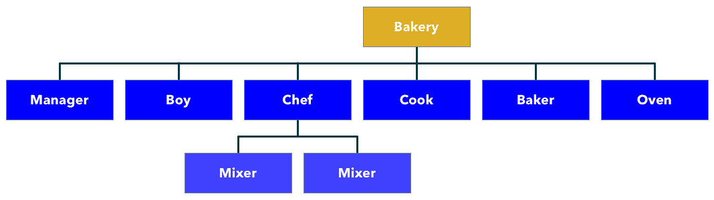
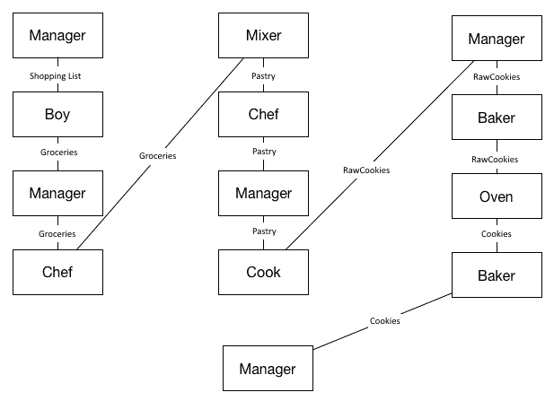
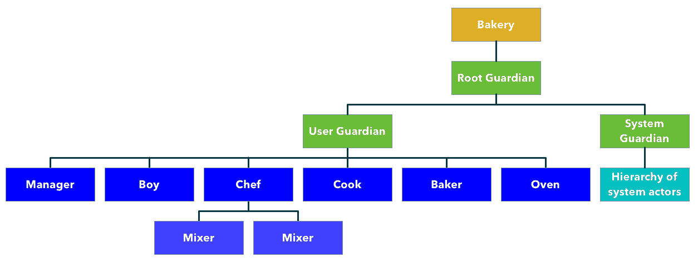
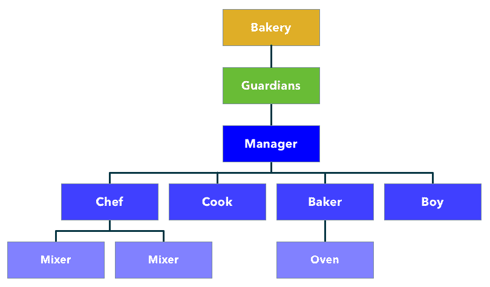
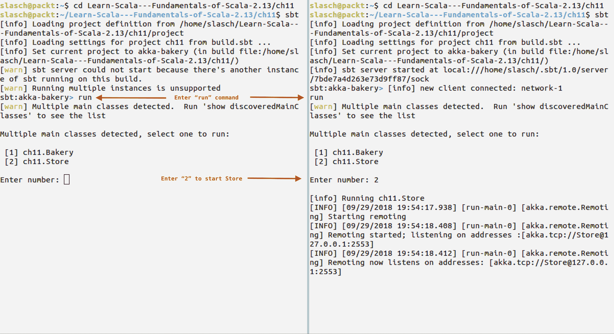
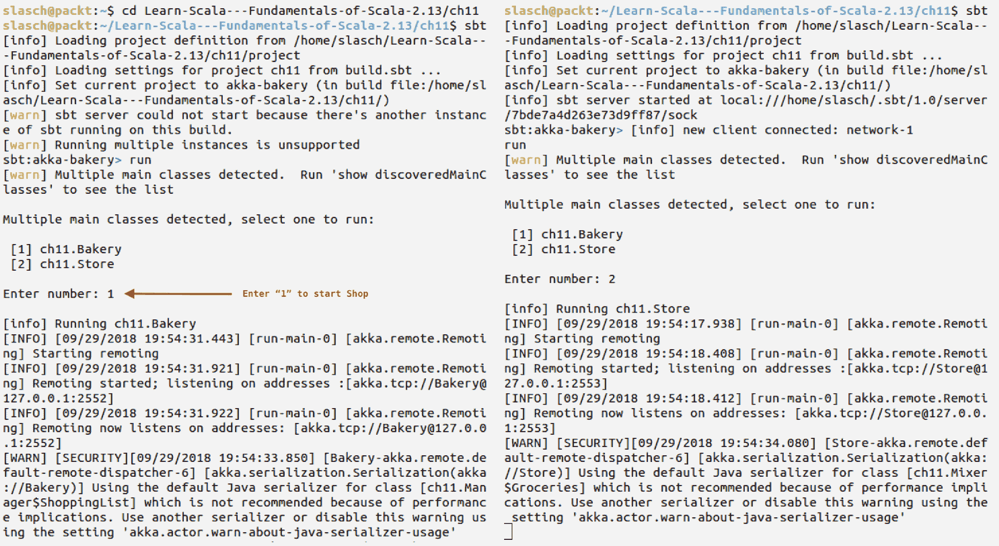

# Akka 和 Actor 模型简介

在本章中，我们将学习 actor 模型及其在 Akka 中的实现方式。我们将通过构建一个简单而完整的 actor 系统来熟悉 Akka。然后，我们将学习如何创建 actor 系统，以及 actors，如何在它们之间传递消息，如何利用位置透明性和远程通信，如何为有效的监督合理地构建系统，以及如何查看**有限状态机**（**FSM**）actors 的工作原理。最后，我们将向您展示如何测试基于 actor 的应用程序。

本章将涵盖以下主题：

+   Actor 模型

+   Akka 基础

+   Akka FSM

+   Akka 远程通信

+   测试

# 技术要求

在我们开始之前，请确保您已安装以下内容：

+   Java 1.8+

+   SBT 1.2+

如果您需要执行 Java 或 SBT 的首次设置，请参阅附录 A 中的安装说明，*准备环境和运行代码示例*。

源代码可在我们的 GitHub 仓库中找到：[`github.com/PacktPublishing/Learn-Scala-Programming/tree/master/Chapter11`](https://github.com/PacktPublishing/Learn-Scala-Programming/tree/master/Chapter11)。

# Actor 模型简介

从各种计算应用的第一天起，它们就面临着在减少的处理时间内处理日益增长的数据量的需求。直到最近，这些挑战通过垂直扩展应用程序来解决，即通过增加内存和更快的处理器。这种方法之所以可行，是因为处理器速度的增长，这被摩尔定律描述如下：

“摩尔定律是观察到的现象，即密集集成电路中的晶体管数量大约每两年翻一番。... 摩尔的预测在几十年的时间里被证明是准确的，并在半导体行业中用于指导长期规划，并为研究和开发设定目标。.... 摩尔定律是对历史趋势的观察和预测，而不是物理或自然法则。”

但正如英特尔在 2015 年所陈述的那样，硬件进步的速度开始放缓。这种趋势使得很明显，从现在开始，唯一扩展应用程序的方法是通过横向扩展——通过增加处理核心和机器的数量，使用多个应用程序线程并行处理数据。在这种情况下有两个明显的挑战：

+   为了防止并发修改，从而避免数据损坏

+   为了提供对在不同核心或机器上运行的过程的数据访问

传统的第一个挑战是通过使用共享内存和不同的锁定方法来解决的。不幸的是，这种方法实际上使得应用程序中相互同步的部分变成了伪顺序的，这反过来又根据 Amdahl 的定律限制了可能的加速：

“阿姆达尔定律是一个公式，它以固定工作负载下执行任务的延迟为理论速度提升。  ... 阿姆达尔定律常用于并行计算，以预测使用多个处理器时的理论速度提升。”

最重要的推论是，加速受到程序串行部分的限制。

幸运的是，有其他解决方案可以使程序的不同部分并行工作，共同实现同一目标。其中一种方法就是演员模型。幸运的是，演员模型还通过一个称为**位置透明性**的概念解决了第二个挑战。

演员的概念最早由*卡尔·休伊特*、*彼得·毕晓普*和*理查德·斯蒂格*在 1973 年提出。

卡尔·休伊特、彼得·毕晓普和理查德·斯蒂格：人工智能的通用模块化演员形式。在：IJCAI'73 国际人工智能联合会议论文集。1973 年，第 235–245 页 ([`dl.acm.org/citation.cfm?id=1624804`](https://dl.acm.org/citation.cfm?id=1624804))。

理念是，一切都被表示为演员，这是一种基本的计算实体。演员通过消息相互通信。在接收到消息后，演员可以执行以下任何一项操作：

+   向其他演员发送有限数量的消息

+   创建有限数量的其他演员

+   改变下一个要处理的消息的行为

这个定义相当抽象，但已经允许你识别出实现必须满足的一些约束：

+   演员通过消息进行通信，并且不允许暴露或检查彼此的内部状态。

+   在演员模型中，没有共享的可变状态的位置。

+   在这个定义中没有提到副作用，但它们显然是任何系统的最终目标。因此，演员对消息的响应可能是以下组合中的任何一种：

    1.  改变内部状态

    1.  修改行为

    1.  产生副作用

+   演员需要能够相互定位。因此，预期存在一个命名系统。拥有适当的命名系统是位置透明性的先决条件，这意味着每个演员都可以通过一个关于其实际位置的规范名称进行定位。

上述定义也未能回答以下问题，以及其他问题：

+   基础硬件、操作系统和运行时环境的限制会产生什么影响？

+   演员在哪里共存，第一个演员是如何被创建的？

+   消息是如何从一个演员传递到另一个演员的？

+   演员是会死亡的，如果是的话，他们是如何死亡的？

使用演员模型的最为突出的语言包括 Erlang、Io、D、Pony 和 Scala。

我们将通过构建一个企业烘焙应用来更详细地研究 Scala 实现——Akka。我们的烘焙店将被不同的演员占据，每个演员都有自己的职责，通过团队合作生产饼干。

# Akka 基础知识

我们将首先将 Akka 依赖项添加到空 Scala SBT 项目的`build.sbt`文件中：

```java
libraryDependencies +=  "com.typesafe.akka" %% "akka-actor" % akkaVersion
```

可以在 Akka 网站上查看`akkaVersion`。在撰写本书时，它是 2.5.13，因此我们将在前面的代码片段前添加`val akkaVersion = "2.5.13"`。

SBT 可以通过 giter8 模板为您创建一个最小的 Akka 项目：`sbt new https://github.com/akka/akka-quickstart-scala.g8`。

现在，我们可以实例化一个`ActorSystem`，这是 Akka 演员的居住地：

```java
import akka.actor._
val bakery = ActorSystem("Bakery")
```

避免在同一个 JVM 或同一台机器上定义多个 actor 系统。actor 系统并不轻量级，通常配置得与它运行的硬件配置紧密相关。因此，多个 actor 系统不仅会消耗比所需更多的资源，而且在最坏的情况下，它们将竞争这些资源。

也可以创建一个不带名称的默认 actor 系统，但最好不要这样做。命名 actor 系统和 actor 将使您在推理和调试现有代码时更容易。

作为下一步，让我们定义一个 actor。

# 定义 actor

Akka 中的 actor 必须扩展同名特质并实现`receive`方法：

```java
class Cook extends Actor {  
  override def receive = {      
    case _ =>   
  }
}
```

`receive`动作的类型定义为`type Receive = PartialFunction[Any, Unit]`，这与 actor 模型的抽象定义非常相似。在 Akka 中，演员可以接收任何消息，任何演员的活动都表现为其状态的变化或副作用。

我们定义的演员接受任何消息而不做任何事情。这可能是最简单、最懒惰的演员了。

为了使其有用，让我们定义其行为和词汇。

由于我们正在构建一个企业烘焙店，我们的演员将只有一个职责，这在任何类型的系统中都是一个好主意，而不仅仅是基于演员的系统。我们的厨师演员将取一块现成的面团，并从中制作出原始饼干。首先，我们必须定义消息：

```java
object Cook {
  final case class Dough(weight: Int)
  final case class RawCookies(number: Int)
}
```

然后是 actor 的行为：

```java
class Cook extends Actor {
  override def receive = {
    case Dough(weight) => 
      val numberOfCookies = makeCookies(weight)
      sender() ! RawCookies(numberOfCookies)
  }

  private val cookieWeight = 30
  private def makeCookies(weight: Int):Int = weight / cookieWeight
}
```

在这个定义中，有几件事情正在进行：

1.  我们的 actor 只理解一种消息类型，`Dough`

1.  它通过计算数量将面团制作成原始饼干

1.  我们使用`sender()`来获取发送消息的演员的引用，并将响应发送到这个引用

此外，还有一些更微妙但值得注意的细节：

+   如果，出于巧合，我们的`Cook`收到除`Dough`以外的任何其他消息，这个消息将不会被 actor 处理，并会丢失。Akka 有一个专门处理此类消息的机制，称为*死信队列*。

+   我们为每种消息类型定义了案例类，以使代码理解更加简单。

+   演员的逻辑与协议解耦，可以提取到伴随对象中。这样做是为了使测试更容易。

现在我们已经定义了演员，是时候实例化它并向其发送一些消息了。在 Akka 中，我们必须使用特殊的`Prop`构造函数：

```java
val cookProps: ActorRef = Props[Cook]
```

在这种情况下，我们不需要向演员传递任何构造函数参数，因此我们可以从使用`Props`形式中受益，它将演员的唯一类型作为其参数。

不要直接使用类构造函数来构建演员。虽然可以这样做，然后从演员中获取*ActorRef*，但这将在运行时导致错误。

现在，我们可以将所有这些放在一起并发送我们的第一条消息：

```java
object Bakery extends App {
  val bakery = ActorSystem("Bakery")
  val cook: ActorRef = bakery.actorOf(Props[Cook], "Cook")
  cook ! Dough(1000)
}
```

在这里，我们使用演员系统创建了一个命名演员并向其发送了一条消息。

让我们定义其他一些演员，使我们的面包店更加活跃。我们将按照以下方式分离责任：

+   一个男孩将访问杂货店并获取必要的原料。

+   他将把它们交给面包店经理，以便他们可以检查数量和质量。

+   然后将配料交给厨师，厨师将它们制成面团。

+   厨师根据面团的体积使用一个或多个搅拌机。

+   准备好的面团交给厨师，厨师将其制成原始饼干。

+   原始饼干由面包师烘焙。

+   面包师使用烤箱进行烘焙。由于烤箱的大小有限，可能需要几轮才能烘焙完所有的饼干。

+   饼干一准备好就返回给经理。

然后，我们需要找出演员之间的关系，如下所示：



然后我们需要构建并展示它们之间的消息流：



我们将从底部向上构建我们的演员层次结构，从烤箱开始：

```java
object Oven {
  final case object Extract
  final case class Cookies(count: Int)
  def props(size: Int) = Props(classOf[Oven], size)
}

class Oven(size: Int) extends Actor {
  private var cookiesInside = 0
  override def receive = LoggingReceive {
    case RawCookies(count) => insert(count).foreach(sender().!)
    case Extract => sender() ! Cookies(extract())
  }

  def insert(count: Int): Option[RawCookies] =
    if (cookiesInside > 0) {
      Some(RawCookies(count))
    } else {
      val tooMany = math.max(0, count - size)
      cookiesInside = math.min(size, count)
      Some(tooMany).filter(_ > 0).map(RawCookies)
    }

  def extract(): Int = {
    val cookies = cookiesInside
    cookiesInside = 0
    cookies
  }
}
```

我们在这里引入了许多新功能。

首先，我们定义了两种新的消息类型，这些类型将被用来命令烤箱返回饼干并为准备好的饼干制作容器。在演员本身中，我们使用构造函数参数来指定可以放入其中的饼干数量。我们还使用了 Akka 的`LoggingReceive`，它将传入的消息写入日志。在`receive`方法本身中，我们坚持将 Akka 语义与业务逻辑分离的原则。

`insert`方法检查烤箱是否为空，并将尽可能多的原始饼干放入其中，可选地返回那些放不进去的饼干，这样我们就可以将它们转发给发送者。

在`extract`方法中，我们修改烤箱内的饼干数量并将它们返回给发送者。

在演员内部使用`var`绝对安全，并说明了 Akka 的核心特性之一——消息按接收顺序逐个由演员处理。即使在高度并发的环境中，Akka 也会保护演员代码免受任何并发相关问题的困扰。

总是使用深度不可变的消息。使用可变结构将允许两个不同的 actor 从不同的线程访问相同的数据，这可能导致并发修改并损坏数据。

为了实例化一个烤箱，我们将使用另一种`Prop`构造函数的版本，它允许我们定义构造函数参数：

```java
val prop = Props(classOf[Oven], size)
```

按惯例，它被放置在 actor 的伴生对象中。这里也定义了烤箱的`size`。

如以下代码所示，我们将描述烤箱的使用者，即`Baker`actor：

```java
object Baker {
  import scala.concurrent.duration._
  private val defaultBakingTime = 2.seconds
  def props(oven: ActorRef) = Props(new Baker(oven))
}
class Baker(oven: ActorRef,
            bakingTime: FiniteDuration = Baker.defaultBakingTime)
    extends Actor {
  private var queue = 0
  private var timer: Option[Cancellable] = None
  override def receive: Receive = {
    case RawCookies(count) =>
      queue += count
      if (sender() != oven && timer.isEmpty) timer = sendToOven()
    case c: Cookies =>
      context.actorSelection("../Manager") ! c
      assert(timer.isEmpty)
      if (queue > 0) timer = sendToOven() else timer = None
  }
  private def sendToOven() = {
    oven ! RawCookies(queue)
    queue = 0
    import context.dispatcher
    Option(context.system.scheduler.scheduleOnce(bakingTime, oven, Extract))
  }
  override def postStop(): Unit = {
    timer.foreach(_.cancel())
    super.postStop()
  }
}
```

让我们更详细地看看这里发生了什么。首先，我们需要使用另一种类型的`Props`构造函数，因为 Akka 不支持具有默认参数的构造函数。

`Props`，连同实例一起，是一个非常强大的构造，允许你创建匿名 actor，这些 actor 反过来可以封装另一个 actor 的内部状态。如果可能，尽量避免使用它。

`Baker`actor 接收一个`Oven`的`ActorRef`作为参数。这个引用被面包师用来向`Oven`发送饼干并从中提取它们。

在从`Oven`接收烘焙好的饼干后，`Baker`actor 查找`Manager`actor 并发送`Cookies`给它。之后，如果需要，它会将另一批生饼干放入`Oven`中。我们将在本章后面讨论`context.actorSelection`的内在特性。

`Baker`actor 维护一个生饼干的内部队列，并定期将它们放入烤箱中。这是一个老式烤箱，为了使用它，我们需要设置一个厨房计时器以便在适当的时间提取烘焙好的饼干。最后，我们为计时器添加一个`postStop`生命周期钩子，以便在 actor 停止时取消它。我们这样做是因为，如果 actor 不再存在，就没有人会在那里监听计时器的信号。

# Actor 的生命周期

Akka 中的 Actors 定义了在它们生命周期不同时刻被调用的方法，具体如下：

+   `preStart`: 在 actor 启动后或重启期间调用

+   `preRestart`: 在即将因重启而被销毁的 actor 上调用

+   `postRestart`: 在重启后刚刚创建的 actor 上调用

+   `postStop`: 在 actor 停止后调用

给定两个相同 actor 的实例——一个已经失败，另一个作为替代被创建——它们的执行顺序如下所示：

+   Actor A，停止：`constructor` | `preStart` | `preRestart` | `postStop`

+   Actor B，启动：`constructor` | `postRestart` | `preStart` | `postStop`

现在，我们可以实现一个`Chef`actor。

这个 actor 将结合原料制作面团。它将使用它的神奇力量来创建一个`Mixer`，并使用这个`Mixer`来完成实际的混合工作。一个`Mixer`的容量有限，因此`Chef`需要为更大的购物清单创建多个搅拌器，并并行使用它们以加快准备过程。

我们将首先定义一个搅拌器：

```java
object Mixer {
  final case class Groceries(eggs: Int, flour: Int, sugar: Int, chocolate: Int)
  def props: Props = Props[Mixer].withDispatcher("mixers-dispatcher")
}

class Mixer extends Actor {
  override def receive: Receive = {
    case Groceries(eggs, flour, sugar, chocolate) =>
      Thread.sleep(3000)
      sender() ! Dough(eggs * 50 + flour + sugar + chocolate)
  }
}
```

`Mixer` 只理解一种消息类型，即 `Groceries`。在接收到这种类型的消息后，它会通过混合所有原料产生一定量的 `Dough` 并将其返回给发送者。`Thread.sleep` 表示阻塞——等待硬件完成其操作。

尽量避免阻塞。在演员中的阻塞会消耗一个线程，如果许多演员都阻塞了，其他演员将因线程不足而无法处理消息。

不幸的是，在我们的案例中，由于硬件限制，在混合操作期间阻塞是不可避免的。Akka 以分派器的形式提供了解决这个问题的方案。

# 分派器

分派器是使演员工作的机器。它们负责分配 CPU 给演员，管理演员的邮箱，并将邮箱中的消息传递给演员。有四种常用的分派器类型：

+   **默认分派器：**这种分派器为每个演员创建一个邮箱，并且可以被任何数量的演员共享。它使用 `java.util.concurrent.ExecutorService` 来完成这个过程。它设计用于与非阻塞代码的演员一起使用。分派器选择一个空闲的线程并将其分配给它选择的演员。然后演员处理一定数量的消息，之后释放线程。

+   **平衡分派器：**这种分派器创建一个可以被同一类型的多个演员共享的单个邮箱。来自邮箱的消息在共享分派器的演员之间进行分配。

+   **固定分派器：**这种分派器使用一个线程池的单个线程。这个线程被分配给一个演员。因此，每个演员都有自己的线程和邮箱，可以在不影响其他演员的情况下执行阻塞或长时间运行的活动。

+   **调用线程分派器：**这种分派器为每个演员分配一个线程。这主要用于测试。

在我们的案例中，`Mixer` 的实现中有一个阻塞调用。正因为如此，我们更倾向于使用固定分派器。首先，我们将向 `application.conf` 添加一个分派器配置：

```java
mixers-dispatcher {
  executor = "thread-pool-executor"
  type = PinnedDispatcher
}
```

分派器的名称在配置的根级别定义，并且不嵌套在 `akka` 命名空间中。

Akka 使用 Typesafe Config 作为配置库。这是一个非常强大且有用的配置设施，绝对值得一看。您可以在 [`github.com/lightbend/config`](https://github.com/lightbend/config) 找到它。

然后我们可以在创建演员时使用配置的分派器：

```java
def props: Props = Props[Mixer].withDispatcher("mixer-dispatcher")
```

这样，每个混合器都将有自己的线程，阻塞不会影响其兄弟姐妹和其他系统中的演员。

在等待后，混合器将生产的面团返回给 `sender()` 并给自己发送一个 `PoisonPill` 以便终止。

# 终止演员

在 Akka 中停止一个演员有几种方法。最直接的方法是调用上下文的 `stop` 方法，如下所示：

```java
context stop child
context.stop(self)
```

当演员处理完当前消息后，它会异步终止，但不会在收件箱中的其他消息之后终止。这与向演员发送`PoisonPill`或`Kill`消息不同，这些消息会被排队到邮箱中，并按顺序处理。

`Kill`消息将导致演员抛出`ActorKilledException`异常，这反过来又涉及其监管链（关于这个话题，在本章后面将详细介绍）以决定如何处理这个演员的*失败*。

与使用`Kill`相比，使用`context`或`PoisonPill`停止演员是优雅的。演员将停止其所有子演员，执行生命周期钩子，并适当地通知其监管者。

演员的终止是自上而下传播的，但实际的停止是自下而上的。一个慢速演员可能需要很长时间（或无限时间）来停止，这可能会阻止整个演员链的终止。

现在我们已经有了我们的阻塞`Mixer`，是时候定义一个`Chef`了：

# ask 模式

使用`Chef`，我们将介绍 Akka 中另一个流行的模式——ask 模式：

```java
class Chef extends Actor with ActorLogging with Stash {
  import scala.concurrent.duration._
  private implicit val timeout = Timeout(5 seconds)

  override def receive = {
    case Groceries(eggs, flour, sugar, chocolate) =>
      for (i <- 1 to eggs) {
        val mixer = context.watch(context.actorOf(Mixer.props, s"Mixer_$i"))
        val message = Groceries(1, flour / eggs, sugar / eggs, chocolate / eggs)
        import akka.pattern.ask
        val job = (mixer ? message).mapTo[Dough]
        import context.dispatcher
        import akka.pattern.pipe
        job.pipeTo(sender())
      }
      log.info("Sent jobs to {} mixers", eggs)
      context.become(waitingForResults, discardOld = false)
  }
  def waitingForResults: Receive = {
    case g: Groceries => stash()
    case Terminated(child) =>
      if (context.children.isEmpty) {
        unstashAll()
        context.unbecome()
        log.info("Ready to accept new mixing jobs")
      }
  }
}
```

这里发生了很多事情，所以让我们逐行分析代码，并描述正在发生的事情。

```java
сlass Chef extends Actor with ActorLogging with Stash
```

我们的`Chef`演员不仅是一个`Actor`——它还扩展了`ActorLogging`和`Stash`。`ActorLogging`特质为演员提供了一个预定义的`logger`。也可以直接定义`Logger`，例如，如下面的代码所示：

```java
val log = akka.event.Logging(this)
```

Akka 内部使用基于消息的特殊日志记录设施，以最小化演员内部的阻塞。

Akka 日志记录支持 SLF4J 作为后端。官方文档（[`doc.akka.io/docs/akka/2.5/logging.html`](https://doc.akka.io/docs/akka/2.5/logging.html)）详细解释了如何扩展配置以启用 SLF4J 日志记录到 Akka 应用程序中：

```java
  import scala.concurrent.duration._
  private implicit val timeout = Timeout(5 seconds)
```

在这里，我们定义了一个 5 秒的超时，当我们开始使用混合器时将需要这个超时：

```java
override def receive = {
  case Groceries(eggs, flour, sugar, chocolate) =>
```

在`receive`方法中，我们的演员只接受`Groceries`消息，并使用模式匹配来提取字段值：

```java
for (i <- 1 to eggs) {
  val message = Groceries(1, flour / eggs, sugar / eggs, chocolate / eggs)

```

我们的混合器很小，所以我们需要将手头的杂货分成一个鸡蛋的份量，以便这部分可以放入混合器中：

```java
val mixer = context.watch(context.actorOf(Mixer.props, s"Mixer_$i"))
```

在这里，我们使用之前定义的`props`创建了一个`Mixer`演员（这反过来又为它分配了正确的分发器），并适当地为其命名。

在以下两行代码中，我们可以看到隐式`ask`魔法的应用：

```java
import akka.pattern.ask
val job: Future[Dough] = mixer ? message
```

在作用域内需要`ask`允许我们隐式地将`ActorRef`转换为`AskableActorRef`，然后将其用作消息的目标。`actor ? message`语法表示 ask 模式。Akka 向目标演员发送消息，并创建一个响应的期望作为`Future[Any]`。这个`Future`可以像其他任何`Future`一样处理。为了方便，Akka 提供了一个`mapTo[T]`方法，允许你将其转换为`Future[T]`。

在`for`理解中的最后一行代码，使用了 Akka 提供的另一个隐式转换，这次是针对`Future`的：

```java
import akka.pattern.pipe
import context.dispatcher
job.pipeTo(sender())
```

在这里，我们引入了一个`pipe`作用域，它将正常的`Future`转换为`PipeableFuture`。后者可以通过使用第二行导入的隐式执行上下文，像前述代码的第三行那样，被管道传输到一个或多个演员。

第三行代码在成功的情况下将`Future`执行的结果管道传输给发送者。

如果第一次尝试失败，我们可以使用`job.recoverWith`将作业重新发送到混音器（mixer）。这是使用 ask 模式实现“至少一次”语义的简单方法。

在创建所有混音器并发送工作包后，`Chef`演员写入日志条目并开始等待结果：

```java
log.info("Sent jobs to {} mixers", eggs)
context.become(waitingForResults, discardOld = false)
```

Akka 日志中有一个特殊的语法。第一个参数是一个`String`，其中包含`{}`占位符来表示其他参数。替换是在单独的线程中完成的，但只有当相应的日志级别被启用时。这样做是为了最小化演员线程的日志工作。

# 使用上下文改变演员的行为

在代码的最后一行，演员通过使用`context.become`构造来改变其行为。

`become`和`unbecome`是 Akka 在接收到消息时改变演员行为的常用方法。`become`接受一个`Receive`参数（它是`PartialFunction[Any, Unit]`的类型别名，也是`receive`方法的正常签名），它从下一个消息开始成为新的演员行为（这种行为的变化在演员重启时不会保留）。`discardOld`参数控制这个新行为是否应该替换旧行为，或者是否应该仅仅将其推到演员内部维护的行为堆栈中。我们将在下一分钟看到这个堆栈是如何工作的。

让我们回顾一下`waitingForResults`方法，这是演员刚才获得的新行为。第一行将任何`Groceries`消息挂起，因为我们已经在等待作业完成。这是通过使用`Stash`特质的`stash()`方法完成的，该方法将当前消息放入演员的内部存储中：

```java
case g: Groceries => stash()
```

`Chef`演员监视它所创建的混音器（Mixer）演员。在这种情况下，如果一个孩子演员死亡，监视演员将接收到一个包含受害者演员引用的`Terminated`消息：

```java
case Terminated(child) =>
```

演员（actor）通过使用`context.children`检查所有孩子（children）是否都已终止，如果是这样，它将使用`unstashAll()`将所有存储的消息（stashed messages）添加到消息框中，并通过使用`context.unbecome()`返回到其先前的行为。

不平衡的`context.become()`和`context.unbecome()`操作可能会在长时间运行的应用程序中引入内存泄漏的源头。

现在我们已经准备好了`Chef`，让我们继续并实现一个`Manager`。

# 高级主题

到目前为止，我们通过依赖基本 Akka 概念来实现我们的面包店。现在是时候深化我们的知识并开始使用高级概念了。

# Akka FSM

`Manager`通过协调面包店的其他居民来推进饼干制作过程。它通过从演员那里获取表示工作结果的短信并将它们传递给适当的后续者来实现这一点。这个过程应该是连续的，也就是说，在目前只有购物清单而没有面团的情况下，应该不可能制作生饼干。我们将这种行为表示为状态机。

有限状态机（FSM）是由机器可以处于的一组状态定义的抽象。对于每个状态，它还定义了在此状态下可以接受的消息类型以及机器的可能反应，包括其新状态。

让我们深入研究代码，看看如何使用 Akka FSM 实现这种方法。

演员是通过扩展`FSM`特质来定义的：

```java
class Manager(chef: ActorRef, cook: ActorRef, baker: ActorRef) extends FSM[State, Data]
```

类型参数`State`表示演员可以处于的状态类型，而`Data`表示可能的关联内部状态。

术语*State*（指代演员所代表的 FSM 的状态）和*State*（指代与过程中每个步骤相关联的数据）之间有一个明显的混淆。为了避免歧义，我们将进一步将演员的状态称为*Data*，将 FSM 的状态称为*State*。

演员的状态反映了面包店中发生的过程：商品从店员转移到厨师和厨师，然后转移到面包师，再回到经理（注意，由于经理执行的工作传递的顺序艺术，在我们面包店中此时只有一个工作演员是活跃的，即使他们可以与更复杂的经理并行工作）。

以下消息表示受管理面包店的状态：

```java
trait State
case object Idle extends State
case object Shopping extends State
case object Mixing extends State
case object Forming extends State
case object Baking extends State
```

我们之前定义的消息也需要扩展以表示可能的数据类型：

```java
sealed trait Data
case object Uninitialized extends Data
final case class ShoppingList(...) extends Data
final case class Groceries(...) extends Data
final case class Dough(weight: Int) extends Data
final case class RawCookies(count: Int) extends Data
```

有限状态机（FSM）本身是通过描述状态机的三个主要方面来定义的：

+   状态

+   状态转换

+   初始状态

让我们看看演员的代码，看看这是如何实现的。状态是在`when`块中定义的，它接受一个状态名称和一个状态函数：

```java
when(Idle) {
  case Event(s: ShoppingList, Uninitialized) ⇒
    goto(Shopping) forMax (5 seconds) using s
  case _ =>
    stay replying "Get back to work!"
}
```

当同一状态下有多个`when`块时，构成它们的州函数将被连接。

状态函数是一个`PartialFunction[Event, State]`，它描述了在特定状态下接收到的每个事件类型的新状态。Akka FSM 为此提供了一个很好的领域特定语言（DLS）。例如，在先前的代码中，演员通过在 5 秒超时的情况下将状态转换为`Shopping`状态来响应`ShoppingList`事件。购物清单用作新的状态数据。

在任何其他消息的情况下，演员保持同一状态，并以友好的评论回复发送者。

在`Shopping`状态中，`Manager`根据杂货是否符合购物单而做出不同的反应：

```java
when(Shopping) {
  case Event(g: Groceries, s: ShoppingList)
      if g.productIterator sameElements s.productIterator ⇒
    goto(Mixing) using g
  case Event(_: Groceries, _: ShoppingList) ⇒
    goto(Idle) using Uninitialized
}
```

在第一种情况下，它使用`Groceries`作为新的状态并进入下一个状态。在第二种情况下，它回到`Idle`状态并将状态设置为`Uninitialized`。

其他状态以类似的方式描述：

```java
when(Mixing) {
    case Event(p: Dough, _) ⇒
      goto(Forming) using p
  }

  when(Forming) {
    case Event(c: RawCookies, _) ⇒
      goto(Baking) using c
  }

  when(Baking, stateTimeout = idleTimeout * 20) {
    case Event(c: Cookies, _) ⇒
      log.info("Cookies are ready: {}", c)
      stay() replying "Thank you!"
    case Event(StateTimeout, _) =>
      goto(Idle) using Uninitialized
  }
```

我们只是在进入下一个状态的过程中移动并更新状态数据。目前最明显的观察结果是`这个演员除了自得其乐之外什么都不做`，我们将通过使用`onTransition`块来解决这个问题，该块描述了演员在状态转换发生时的行为：

```java
onTransition {
  case Idle -> Shopping ⇒
    val boy = sendBoy
    boy ! stateData
  case Shopping -> Idle =>
    self ! stateData
  case Shopping -> Mixing ⇒
    chef ! nextStateData
  case Mixing -> Forming =>
    cook ! nextStateData
  case Forming -> Baking =>
    baker ! nextStateData
}
```

`Manager` 已经知道其下属，因此它只需要查找一个`Boy`。然后，对于每个状态转换，它通过使用`stateData`或`nextStateData`来获取必要的状态，这些数据引用了在相应状态转换之前和之后的演员状态数据。这些数据被发送到适当的下属。

现在，唯一缺少的是可选的`whenUnhandled`块，它在所有状态下执行。定时器设置和强制`initiate()`调用设置了定义的定时器并执行到初始状态的状态转换。

Akka FSM 强迫你将业务逻辑与演员相关代码混合，这使得测试和支持它变得困难。它还使你锁定在提供的实现中，使得引入另一个状态机实现变得不可能。在决定使用 Akka FSM 之前，始终考虑其他可能性。

同时，通过将状态的定义与行为分开，Akka FSM 允许对业务逻辑进行清晰的构建。

# Akka 远程操作

现在，我们可以实现拼图的最后一部分——商店男孩和之前未覆盖的`sendBoy`函数。男孩不属于`Bakery`。管理者需要将男孩发送到代表另一个演员系统的杂货`Store`。

为了做到这一点，我们将依赖 Akka 的位置透明性和远程功能。首先，管理者将部署一个男孩演员到远程系统中。部署的演员将获得商店中`Seller`演员的引用，以便它可以在需要时获取杂货。

在 Akka 中使用远程操作有两种方式——要么通过使用演员查找，要么通过使用演员创建。这两种方式与我们迄今为止在本地使用的方式相同，即通过调用`actorSelection`和`actorOf`分别实现。

在这里，我们将演示管理者如何查找男孩应该从他那里获取杂货的卖家（想象这个卖家与面包店以预付费为基础合作），然后要求男孩与这个特定的演员进行交互。

在我们深入研究代码之前，我们需要增强我们应用程序的设置。远程操作是 Akka 中的一个独立依赖项，我们将将其放入`build.sbt`：

```java
libraryDependencies += "com.typesafe.akka" %% "akka-remote" % akkaVersion
```

然后，我们需要将本地演员提供者替换为远程的一个，并在 `application.conf` 中配置网络设置：

```java
akka {
  actor.provider = remote
  remote {
    enabled-transports = ["akka.remote.netty.tcp"]
    netty.tcp {
      hostname = "127.0.0.1"
      port = 2552
    }
 }
}
```

同样的配置，但端口必须不同，是为代表杂货店的第二个演员系统提供的。这是通过包含 `application.conf` 并重新定义 TCP 端口来完成的：

```java
include "application"
akka.remote.netty.tcp.port = 2553
```

然后，我们需要定义杂货店：

```java
import akka.actor._
import com.example.Manager.ShoppingList
import com.example.Mixer.Groceries
import com.typesafe.config.ConfigFactory

object Store extends App {
  val store = ActorSystem("Store", ConfigFactory.load("grocery.conf"))

  val seller = store.actorOf(Props(new Actor {
    override def receive: Receive = {
      case s: ShoppingList =>
        ShoppingList.unapply(s).map(Groceries.tupled).foreach(sender() ! _)
    }
  }), "Seller")
}
```

我们不能使用默认配置，因为它已经被面包店系统占用，所以我们需要使用 `ConfigFactory.load` 加载一个自定义的 `grocery.conf`。接下来，我们需要创建一个匿名（但命名！）演员，其唯一责任是根据 `ShoppingList` 将杂货返回给发送者。

最后，我们准备在 `Manager` 中实现 `sendBoy` 函数：

```java
private def sendBoy: ActorRef = {
  val store = "akka.tcp://Store@127.0.0.1:2553"
  val seller = context.actorSelection(s"$store/user/Seller")
  context.actorOf(Boy.props(seller))
}
```

首先，我们必须定义杂货店的地址。然后，我们需要使用远程系统上的地址查找卖家。Akka 的文档指定了以下远程演员查找的模式：

```java
akka.<protocol>://<actor system name>@<hostname>:<port>/<actor path>
```

我们将稍后查看这个模板，特别是演员路径。

然后，我们需要使用我们常用的 `actorOf` 方法创建一个男孩。为了告诉 Akka 远程部署这个演员，我们需要将以下配置放入 `application.conf`：

```java
akka.actor.deployment {
  /Manager/Boy {
     remote = "akka.tcp://Store@127.0.0.1:2553"
  }
}
```

这指示 Akka 不要实例化一个本地演员，而是通过名为 `Store` 的网络地址 `127.0.0.1:2553` 的远程守护进程来联系演员系统，并告诉这个守护进程创建一个远程演员。

我们可以在不扩展配置的情况下实现相同的结果，直接在代码中提供部署配置：

```java
val storeAddress = AddressFromURIString(s"$store")
val boyProps = Boy.props(seller).withDeploy(Deploy(scope = RemoteScope(storeAddress)))
context.actorOf(boyProps)
```

这个片段创建了一个从我们之前定义的字符串中创建的商店地址，并明确告诉 Akka 在创建演员时使用它。

`Boy` 的实现现在很简单：

```java
object Boy {
  def props(seller: ActorSelection): Props = Props(classOf[Boy], seller)
}

class Boy(seller: ActorSelection) extends Actor {
  override def receive = {
    case s: ShoppingList =>
      seller forward s
      self ! PoisonPill
  }
}
```

`Boy` 构造函数接受一个类型为 `ActorSelection` 的参数，这是之前由 `Manager` 执行的远程查找的结果。通过接收一个 `ShoppingList`，我们的实现使用 `forward` 将消息直接转发给卖家。正因为这种转发，卖家将收到一个由原始演员（即管理者）作为发送者的消息。

最后，我们将考虑到男孩是由管理者仅为一次购物而创建的，我们需要清理资源。这可以通过管理者演员完成，但我们更倾向于在这里进行自我清理。`Boy` 在转发原始消息后立即发送给自己一个 `PoisonPill` 并终止。

现在我们已经定义了面包店的全部居民，我们可以将它们连接起来，做一些饼干：

```java
object Bakery extends App {
  val bakery = ActorSystem("Bakery")
  val cook: ActorRef = bakery.actorOf(Props[Cook], "Cook")
  val chef: ActorRef = bakery.actorOf(Props[Chef], "Chef")
  val oven: ActorRef = bakery.actorOf(Oven.props(12), "Oven")
  val baker: ActorRef = bakery.actorOf(Baker.props(oven), "Baker")
  val manager: ActorRef = bakery.actorOf(Manager.props(chef, cook, baker), "Manager")
}
```

在我们运行我们的应用程序并享受一些饼干之前，让我们暂时放下编码，看看我们在远程演员查找模式中看到的演员路径。

# 演员路径

根据演员模型，Akka 演员是分层的。

角色路径是通过将层次结构中每个角色的名称向上到根角色，然后使用斜杠从右到左连接它们来构建的。在路径的开始部分，有一个地址部分用于标识协议和角色的系统位置。这个地址部分被称为 **锚点**，其表示方式对于本地和远程系统是不同的。

在我们的例子中，`Boy` 的整个路径，由部署配置中的本地路径 `/Manager/Boy` 描述，对于 `Boy` 演员将是 `akka://user/Bakery/Manager/Boy`（纯本地路径），而对于远程 `Store` 演员系统中的 `Seller` 演员将是 akka.tcp://Store@127.0.0.1:2553/user/Seller（远程路径），如从 `Bakery` 方面所示。

如你所见，远程引入了构建和使用演员路径的方式所必需的差异。

角色路径的主要目的是定位我们即将发送消息给的角色。在技术层面上，我们有一个用于向演员发送消息的抽象，即 `ActorRef`。对于每个演员，其 `ActorRef` 通过 `self` 字段提供对其本地引用的访问，并通过 `context.sender()` 提供对当前消息发送者的访问。每个 `ActorRef` 指向一个演员。`ActorRef` 还包含演员的调度器和邮箱。调度器负责在演员的邮箱中排队消息，并在将它们传递给演员的 `receive` 方法之前在特定时间将其出队。

我们已经看到了创建 `ActorRef` 的两种方式：

1.  通过使用 `context.actorOf` 创建一个角色

1.  通过使用 `context.actorSelection` 查找一个或多个角色

在第二种情况下，有不同方式提供演员路径进行查找：

+   **绝对路径**：`context.actorSelection("/user/Manager/Boy")` 返回一个具有指定路径或空选择的单个演员

+   **相对路径**：`context.actorSelection("../sibling")` 向上到层次结构中的父级，然后在存在的情况下向下到 "sibling"。

+   **通配符**：`context.actorSelection("../*")` 向上到层次结构，并选择演员父级的所有子代，包括当前演员

# 角色监督

现在，让我们解释另一个你可能想知道的演员路径中的奇怪之处——我们之前看到的演员路径中的前导 `/user` 部分。这一部分的存在是 Akka 对我们在本章开头提出的问题的回答——*第一个角色是如何创建的？*

在 Akka 中，第一个角色是由库本身创建的。它代表一个根角色，因此被称为根守护者（我们将在稍后解释 *守护者* 部分的内容）。

实际上，Akka 为每个演员系统创建了三个守护者演员，如下面的图所示。

`/` 根守护者是两个其他守护者的父级，因此是系统中任何其他角色的祖先。

`/user` 守护者是系统中所有用户创建的演员的根演员。因此，由 Akka 库的任何用户创建的每个演员在层次结构中都有两个父演员，因此其路径前缀为 `/user/`。

`/system` 是系统创建的内部演员的根演员。

让我们用我们刚刚学到的守护者演员扩展我们的演员图：



我们使用 `system.context` 实例化所有演员，除了混合器。因此，它们被创建为用户守护者的子演员。根守护者在层次结构的顶部，其子演员是用户守护者和系统守护者。

守护者是 Akka 另一个重要功能——监督的一部分。为了了解什么是监督以及为什么它很重要，让我们最终运行我们的应用程序。

以下是在控制台中的清理输出：

```java
...
[INFO] Remoting now listens on addresses: [akka.tcp://Bakery@127.0.0.1:2552]
[INFO] [akka.tcp://Bakery@127.0.0.1:2552/user/Chef] Sent jobs to 24 mixers
[INFO] [akka.tcp://Bakery@127.0.0.1:2552/user/Chef] Ready to accept new mixing jobs
[INFO] [akka.tcp://Bakery@127.0.0.1:2552/user/Manager] Cookies are ready: Cookies(12)
[ERROR] [akka.actor.LocalActorRefProvider(akka://Bakery)] guardian failed, shutting down system
java.lang.AssertionError: assertion failed
 at scala.Predef$.assert(Predef.scala:204)
 ...
...
[akka.tcp://Bakery@127.0.0.1:2552/system/remoting-terminator] Remoting shut down.
```

发生了什么？演员系统已启动，演员之间的通信也已开始，但随后抛出了一个 `AssertionError` 并导致整个系统终止！

这种异常的原因是我们之前描述的 `Baker` 演员中的简单编程错误：

```java
override def receive: Receive = {
  ...
  case c: Cookies =>
    context.actorSelection("../Manager") ! c
    assert(timer.isEmpty)
    if (queue > 0) timer = sendToOven() else timer = None
}
```

断言“计时器为空”是错误的，因此在运行时抛出异常。该异常没有被捕获，导致程序终止。显然，在这种情况下，演员模型（如本章开头所述）的规则没有得到尊重。一个演员在没有发送任何消息的情况下影响了所有其他演员和整个系统。

实际上，这并不是 Akka 的缺陷。我们的应用程序之所以表现如此，是因为我们忽略了基于演员系统的非常重要的一个方面——监督。

在 Akka 中，监督意味着任何创建子演员的演员在出现问题的情况下负责其管理。

检测到错误条件的演员应暂停其所有后代和自身，并向其父演员报告失败。这种失败报告具有异常抛出的形式。

按照惯例，预期的错误条件，例如数据库中记录的缺失，通过技术性质的消息和错误在协议级别进行建模，例如使用异常来模拟不可用的数据库连接。为了更好地区分错误条件，鼓励开发人员定义一组丰富的异常类，类似于正常消息类。

子演员抛出的异常被传递给父演员，然后父演员需要以四种可能的方式之一来处理这种情况：

+   恢复子演员，并让它从下一个开始处理消息框中的消息。导致演员失败的该消息已丢失。

+   重新启动子演员。这将清理其内部状态，并递归地停止其所有后代。

+   完全停止子演员。这也会递归地传播到其后代。

+   将故障传播给其父组件。通过这样做，监督者以与下属相同的原因为自己失败。

在深入研究定义监督策略的技术细节之前，让我们回顾一下我们的演员结构。目前，我们所有的演员（除了动态混合器）都是作为用户守护者的直接子组件创建的。这导致有必要在演员层次结构的整个位置定义监督策略。这是对分离关注点原则的明显违反，在 Akka 中被称为*扁平演员层次结构*反模式。我们应该追求的是创建一个结构，其中错误处理发生在最接近错误发生位置的演员处，该演员最有能力处理此类错误。

以此目标为指导，让我们重构我们的应用程序，使`Baker`演员负责监督`Oven`，而`Manager`负责系统中所有的演员。这种结构在以下图中表示：



现在，我们有一个合理的层次结构，其中每个监督者都对其子组件可能出现的故障以及如何处理它们有最佳的了解。

在技术层面上，监督策略是通过覆盖相应演员的`supervisorStrategy`字段来定义的。为了演示如何实现这一点，让我们扩展我们的`Mixer`演员，使其能够报告不同的硬件故障。首先，我们必须在伴随对象中定义一个丰富的异常集：

```java
class MotorOverheatException extends Exception
class SlowRotationSpeedException extends Exception
class StrongVibrationException extends Exception
```

然后我们需要在消息处理过程中随机抛出它们：

```java
class Mixer extends Actor with ActorLogging {
  override def receive: Receive = {
    case Groceries(eggs, flour, sugar, chocolate) =>
      val rnd = Random.nextInt(10)
      if (rnd == 0) {
        log.info("Motor Overheat")
        throw new MotorOverheatException
      }
      if (rnd < 3) {
        log.info("Slow Speed")
        throw new SlowRotationSpeedException
      }
      ...
  }
}
```

现在，我们将在`Chef`演员中覆盖一个监督策略：

```java
override val supervisorStrategy: OneForOneStrategy =
  OneForOneStrategy(maxNrOfRetries = 10, withinTimeRange = 1 minute) {
    case _: MotorOverheatException ⇒
      self ! Dough(0)
      Stop
    case _: SlowRotationSpeedException ⇒
      sender() ! message
      Restart
    case _: StrongVibrationException =>
      sender() ! message
      Resume
    case _: Exception ⇒ Escalate
  }
```

`OneForOneStrategy`指示`Chef`个别处理任何子组件的故障。

对于`MotorOverheatException`，我们决定停止失败的`Mixer`。`Chef`向自己发送一个空的`Dough`消息，这被视为来自损坏子组件的响应。

`SlowRotationSpeedException`表示在将食品放入`Mixer`的过程中出现了问题。原始消息在`Mixer`抛出异常时丢失，所以我们正在重新发送此消息并重新启动`Mixer`。

我们可以容忍`StrongVibrationException`，所以我们只需通过重新发送丢失的消息并恢复子组件来补偿。

在任何其他异常的情况下，`Chef`不知道如何处理它，只是将故障传播给`Manager`。`Manager`没有定义任何`supervisorStrategy`，异常最终传播到用户守护者。

用户守护者按照默认策略处理异常。如果没有覆盖，默认策略对所有用户空间中的演员都是相同的，定义如下：

+   `ActorInitializationException`：停止失败的子演员

+   `ActorKilledException`：停止失败的子演员

+   `DeathPactException`：停止失败的子演员

+   `Exception`：重启失败的子演员

+   `Throwable`：升级到父演员

根守护者配置为`SupervisorStrategy.stoppingStrategy`，它区分了`Exception`和其他可抛出物。前者导致失败演员的终止（这实际上意味着`/user`或`/system`空间中的所有演员），而后者进一步传播并导致演员系统的终止。这就是我们早期实现抛出`AssertionError`时发生的情况。

可以通过使用其配置属性来覆盖用户守护者的监督策略。让我们演示如何使用它来处理偶尔抛出的`LazinessException`，这可能是系统中的任何演员抛出的。首先，我们增强`application.conf`：

```java
akka {
 actor {
  guardian-supervisor-strategy = ch11.GuardianSupervisorStrategyConfigurator
 }
}
```

然后我们实现配置的策略，如下所示：

```java
class GuardianSupervisorStrategyConfigurator
    extends SupervisorStrategyConfigurator {
  override def create(): SupervisorStrategy = AllForOneStrategy() {
    case _: LazyWorkerException ⇒
      println("Lazy workers. Let's try again with another crew!")
      Restart
  }
}
```

懒惰具有传染性，所以我们使用`AllForOneStrategy`通过重启用户守护者的所有子代来替换整个团队。

# 测试演员

基于演员的系统与传统方法构建的系统不同。自然地，测试演员与常规测试不同。演员以异步方式发送和接收消息，通常通过消息流分析来检查。典型的设置将包括三个部分：

1.  消息的来源

1.  待测试的演员

1.  演员的响应接收者

幸运的是，Akka 包括一个测试模块，它抽象了大量的设置逻辑，并为常见的测试活动提供了有用的辅助工具。该模块的名称是 Akka `TestKit`，它包含在一个需要添加到项目测试范围的独立模块中：

```java
libraryDependencies += "com.typesafe.akka" %% "akka-testkit" % akkaVersion % Test
```

有这个依赖项，我们可以扩展`TestKit`类。`TestKit`实现了一个特殊的测试环境，它模仿了正常演员系统的内部结构，但提供了访问一些在生产实现中隐藏的细节。

这是一个扩展`TestKit`的`ScalaTest`规范的示例：

```java
class BakerySpec(_system: ActorSystem) extends TestKit(_system)
    with Matchers with WordSpecLike with BeforeAndAfterAll 
    with ImplicitSender {

  def this() = this(ActorSystem("BakerySpec"))

  override def afterAll: Unit = shutdown(system)
```

在这里，我们使用通常的`ScalaTest`匹配器和`WordSpec`扩展`TestKit`，但还混合了`BeforeAndAfterAll`和`ImplicitSender`。然后，我们通过实例化一个`BakerySpec`演员系统来实现默认构造函数。最后，我们覆盖一个`afterAll`方法，以确保测试后的测试演员系统被正确终止。

在 SBT 中，测试通常并行运行。在这种情况下，正确命名演员系统很重要，并且在这种情况下，远程通信也用于覆盖默认端口，以避免同时执行的测试之间的冲突。此外，我们不应忘记优雅地关闭演员系统，以确保我们的资源被正确清理。

`TestKit`实现并引入了`testActor`字段，我们可以用它从测试代码中发送消息。通常，我们希望这些消息来自一个知名的演员。`ImplicitSender`特质实现了一个引用`testActor`，它在消息发送时附加到消息上。

`TestKit`还维护一个发送到`testActor`的消息的内部队列，并定义了一系列有用的方法来检查这个队列。

这就是一些预定义方法如何用来测试我们的`Boy`演员：

```java
"The boy should" should {
  val boyProps = Boy.props(system.actorSelection(testActor.path))
  val boy = system.actorOf(boyProps)

  "forward given ShoppingList to the seller" in {
    val list = ShoppingList(0, 0, 0, 0)
    boy ! list
    within(3 millis, 20 millis) {
      expectMsg(list)
      lastSender shouldBe testActor
    }
  }
  "ignore other message types" in {
    boy ! 'GoHome
    expectNoMessage(500 millis)
  }
}
```

回顾`Boy`演员的逻辑，它所做的只是将`ShoppingList`转发到作为构造函数参数提供的另一个演员。为了测试这种行为，我们首先创建一个`ActorSelection`，这是男孩构造函数所必需的，使用我们的默认`testActor`作为目标，并在`TestKit`为我们提供的测试演员系统中创建一个男孩演员。

在第一个测试中，我们向`Boy`发送一个`ShoppingList`，并期望它在 3 到 30 毫秒的预定义时间间隔内将其转发给`testActor`。我们验证消息确实是一个`ShoppingList`，发送者是`testActor`。

在第二个测试中，我们验证`Boy`忽略了其他消息。为了检查这一点，我们向它发送一个`Symbol`类型的消息，并期望我们的`testActor`在 500 毫秒内没有收到任何消息。由于正常的转发在我们的第一个测试中预计不会超过 20 毫秒，我们可以确信消息已被`Boy`忽略。

`testActor`、`lastSender`、`within`、`expectMsg`和`expectNoMsg`由`TestKit`实现，并帮助我们避免编写样板代码。

在`TestKit`中还有许多其他有用的方法，我们很快就会查看它们。大多数方法存在两种形式：一种接受超时作为参数，另一种使用默认超时。超时定义了`TestKit`等待条件发生的时长。默认超时可以通过使用`within`包装器来覆盖，如前所述，通过更改配置或使用会影响作用域内所有持续时间的`timescale`参数。

我们已经熟悉了`expectMsg`和`expectNoMessage`断言。让我们看看其他一些可用的辅助工具：

+   `def expectMsgClassC`: `C`期望并返回一个类型为 C 的单条消息。

+   `def expectMsgTypeT`: `T`与之前的辅助工具相同，但使用隐式构造类型参数。

+   `def expectMsgAnyOfT: T` 这期望一条消息并验证它是否等于构造函数参数之一。

+   `def expectMsgAnyClassOfC`: `C`与之前相同，但验证的是消息的类型而不是实际的消息。

+   `def expectMsgAllOfT`: `Seq[T]`期望消息的数量并验证它们是否都等于构造函数参数。

+   `def expectMsgAllClassOfT`: `Seq[T]`与之前的功能相同，但验证消息的类型。

+   `def expectMsgAllConformingOfT`: `Seq[T]`与`expectMsgAllClassOf`的功能相同，但检查的是一致性（instanceOf）而不是类相等。

+   `def expectNoMessage()`: `Unit`验证在指定的或默认的超时时间内没有接收到任何消息。

+   `def receiveN(n: Int)`: `Seq[AnyRef]`接收 N 条消息并将它们返回给调用者以进行进一步验证。

+   `def expectMsgPFT(f: PartialFunction[Any, T])`: `T`期望接收一个消息，并验证给定的部分函数是定义的。

+   `def expectTerminated(target: ActorRef, max: Duration = Duration.Undefined)`: `Terminated`期望从指定的`target`接收一个`Terminated`消息。

+   `def fishForMessage(max: Duration = Duration.Undefined, hint: String = "")(f: PartialFunction[Any, Boolean])`: `Any`期望接收多个消息，其中给定的部分函数是定义的。它返回第一个使`f`返回 true 的消息。

我们的`Baker`演员设计成向其父演员发送消息，这意味着如果我们使用测试演员系统创建它，我们将无法接收来自`Baker`的响应。让我们看看`TestKit`如何帮助我们解决这个问题：

```java
"The baker should" should {
  val parent = TestProbe()
  val baker = parent.childActorOf(Props(classOf[Baker], 0 millis))
  "bake cookies in batches" in {
    val count = Random.nextInt(100)
    baker ! RawCookies(Oven.size * count)
    parent.expectMsgAllOf(List.fill(count)(Cookies(Oven.size)):_*)
  }
}
```

在这里，我们使用`TestProbe()`构建一个测试演员。`TestProbe`是`TestKit`提供的另一个很好的功能，允许你发送、接收和回复消息，在需要多个测试演员的测试场景中非常有用。在我们的情况下，我们使用其创建子演员的能力来创建一个`Baker`演员作为子演员。

然后，我们需要生成多个`RawCookies`，这样就需要多次翻烤。我们预计在下一行会向`parent`发送这么多条消息。

到目前为止，我们已经在隔离状态下测试了演员。我们的`Store`是以一种方式构建的，它会实例化一个匿名演员。这使得在隔离状态下测试演员的方法变得不可能。让我们演示一下我们如何验证`Seller`演员在给定`ShoppingList`时返回预期的`Groceries`：

```java
class StoreSpec(store: Store) extends TestKit(store.store)
    with Matchers with WordSpecLike with BeforeAndAfterAll {

  def this() = this(new Store {})

  override def afterAll: Unit = shutdown(system)

  "A seller in store" should {
    "do nothing for all unexpected message types" in {
      store.seller ! 'UnexpectedMessage
      expectNoMessage()
    }
    "return groceries if given a shopping list" in {
      store.seller.tell(ShoppingList(1, 1, 1, 1), testActor)
      expectMsg(Groceries(1,1,1,1))
    }
  }
}
```

我们将像之前一样构建我们的测试类，但有一个细微的区别。`Seller`演员是匿名定义的，因此它只作为整个演员系统的一部分被构建。因此，我们在默认构造函数中实例化`Store`，并使用通过`store`字段可访问的底层演员系统作为`TestKit`实例的构造函数参数。

在测试本身中，我们直接通过我们之前构建的`store`将测试输入发送到`seller` `ActorRef`。我们没有扩展`ImplicitSender`，需要显式提供一个`testActor`作为发送者引用。

现在我们已经实现了并测试了我们的应用程序，让我们运行它吧！

# 运行应用程序

如果您还没有安装 Java 和 SBT，请参阅附录 A，*准备环境和运行代码示例*。

我们将通过使用两个独立的终端会话来在终端中运行我们的应用程序，一个用于`Shop`，另一个用于`Bakery`。可以通过在相应的 shell 中发出以下两个命令之一来运行这两个命令：

+   `sbt "runMain ch11.Store"`

+   `sbt "runMain ch11.Bakery"`

在我们的代码中，我们没有处理`Shopping/ShoppingList`状态的`StateTimeout`。因此，必须首先启动存储会话，然后它加载并开始接受连接，表示可以启动面包店会话。

还可以使用在附录 A，*准备环境和运行代码示例*中记录的方法来在 SBT 会话中运行代码，并在之后选择适当的主类。这种方法在以下屏幕截图中表示：



在这里，我们可以看到如何在`ch11`文件夹中启动两个 SBT 会话。在屏幕的右侧，存储的主要类已经被 SBT 选中并运行。日志显示`Store`正在监听连接，因此可以安全地启动主`Bakery`会话。

这是在我们在左侧终端窗口中输入`1`之后发生的：



存储端反映了连接已建立，面包店端开始输出关于当前活动的日志语句。它持续运行并记录所发生的事情，直到通过按下*Ctrl* + *C*停止。

# 摘要

让我们回顾一下在本章中学到的内容。

使用传统方法很难满足当前的扩展需求。无共享模式的 actor 模型为解决这个问题提供了解决方案。Akka 是一个用于在 JVM 上构建基于 actor 的应用程序的库。

Actor 通过发送和接收消息进行通信，并改变其内部状态以及产生副作用。每个 actor 都有一个地址，形式为`ActorRef`，它还封装了一个 actor 的邮箱和调度器。actor 被组织成层次结构，其中父 actor 负责对其子 actor 的监督。

Actor 有一个定义良好的生命周期，并在其生命周期中的适当时刻实现了一系列方法。

Akka 提供了额外的模块，这些模块进一步扩展了提供的功能。

我们还研究了 Akka FSM，它允许我们通过编码 actor 的可能状态和状态转换来将 actor 表示为 FSM。

Akka 远程实现实际上的位置透明原则，并允许您轻松访问远程 Akka 系统。

测试演员与测试常规代码不同。Akka `TestKit` 是由 Akka 团队提供的库，它简化并加速了测试过程。它通过将测试的演员置于一个受控但接近真实环境的场景中来实现这一点。

在下一章中，我们将使用不同的基于演员的方法和不同的 Akka 库——Akka Typed，重新构建我们的面包店。

# 问题

+   列举两种演员在接收到消息后可以改变自己的方式。

+   `ActorRef` 的目的是什么？

+   在系统守护者的官方文档描述中，查找的主要目的是什么？

+   使用 Akka FSM 的优缺点是什么？

+   在另一个演员系统中，演员可以通过多少种方式被访问？描述它们。

+   为什么测试演员需要特殊的工具包？

# 进一步阅读

+   Christian Baxter，*精通 Akka*：掌握使用 Akka 创建可扩展、并发和响应式应用程序的艺术。

+   Héctor Veiga Ortiz 和 Piyush Mishra，*Akka 烹饪秘籍*：学习如何使用 Akka 框架在 Scala 中构建有效的应用程序。
