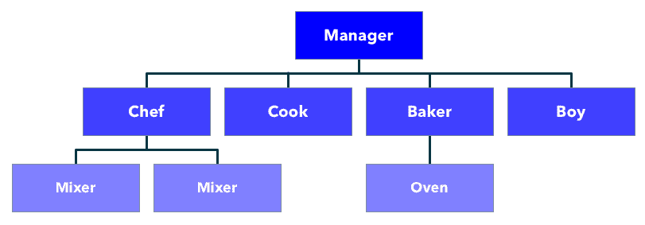
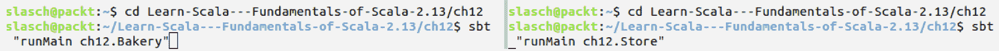
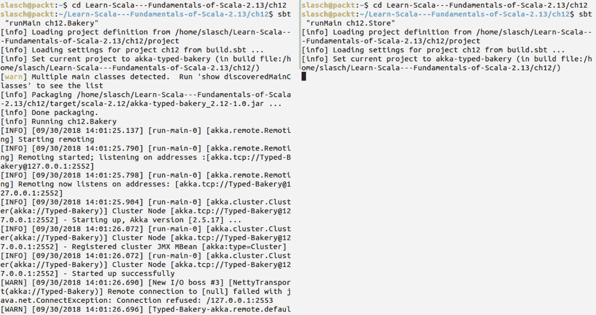

# 第十二章：使用 Akka Typed 构建反应式应用

本章揭示了使用 Akka 构建反应式应用的另一种方式。我们将介绍 Akka Typed，这是一个 Akka 模块，它以一种与无类型 Akka 略有不同的方式实现了演员模型。我们将对比*经典*和类型化方法，并展示后者如何减少开发者的选择，但增加类型安全性，并在维护阶段简化基于演员的程序推理。

本章将涵盖以下主题：

+   类型化和无类型方法之间的差异

+   创建、停止和发现演员

+   演员的生命周期和监督

+   调度器

+   缓存

+   组合行为

+   测试

# 技术要求

在我们开始之前，请确保你已经安装了以下内容：

+   Java 1.8+

+   SBT 1.2+

本章的源代码可在我们的 GitHub 仓库中找到：[`github.com/PacktPublishing/Learn-Scala-Programming/tree/master/Chapter12`](https://github.com/PacktPublishing/Learn-Scala-Programming/tree/master/Chapter12)[.](https://github.com/PacktPublishing/Learn-Scala-Programming/tree/master/Chapter02)

本章中的代码片段已经简化了一些，省略了不必要的技术细节。请参考 GitHub 仓库以获取完全功能性的示例。

# 简介

在第十一章《Akka 和演员模型简介》中，我们发现了演员模型以及 Akka 是如何实现它的。

原始的演员论文提出了演员作为计算单元可以执行的三种可能的行为：

+   +   他们可以向其他已知的演员发送消息

    +   他们可以创建新的演员

    +   他们可以为未来的消息处理指定行为

由于该模型的通用性，这些点的具体实现方式取决于硬件、操作系统、编程语言、现有库，以及最终取决于实现者的设计选择。Akka Typed 与无类型 Akka 相比提供了一个略微不同的编程模型。

此外，在本章中，我们将提到正常的 Akka 为 Akka 无类型，以明确指出正在讨论哪个库，尽管在前一章中*无类型*的 Akka 总是被称为*Akka*。

让我们更仔细地看看这两种实现之间的差异和相似之处。

# 类型化方法和无类型 Akka 之间的差异

与无类型版本相比，Akka Typed 在定义演员是什么方面采取了一种略微不同的方法。

在 Akka 无类型中，演员是任何继承自抽象`Actor`类并重写`def receive: PartialFunction[Any, Unit]`方法的对象。这允许开发者在其实现中做任何事情，除了返回一个有意义的成果，这使得推理代码变得困难，并且无法组合演员逻辑。

Akka Typed 声明任何定义良好的行为都是一个计算实体，因此可以声明为 actor。在 Akka Typed 中，“定义良好”的意思是任何定义了静态类型`Behavior`的东西。`Behavior`的类型限制了 actor 只能接收特定类型的消息。actor 行为的返回类型需要是同一类型的下一个`Behavior`，相对于继承。这样，就可以在编译时确保 actor 只会接收它声明的要处理的类型的消息。

为了实现这一点，演员地址也需要进行类型化，并且地址的类型需要在编译时已知。因此，无类型 Akka 的一些功能，如对当前消息发送者的隐式访问和通用 actor 查找，在类型化 Akka 中不可用。相比之下，演员的地址需要作为协议的一部分进行定义，或者需要由外部（相对于演员）的设施进行管理。

另一个值得注意的改动是引入了`Signal`消息类型，它代表了演员生命周期中的事件，并取代了在无类型 Akka 中由`Actor`类公开的专用回调方法。尽管这在整个变化图中不是一个非常大的亮点，但这是一个很好的举措，可以使 Akka 的 actor 模型实现更接近抽象 actor 模型。

简而言之，Akka Typed 将 actor 的通信和行为限制在模型中，然后可以在编译时进行类型检查。这限制了开发者在实现方面的选择和可能性，但同时也使得结果更容易推理和测试。某些无类型功能的不可用使得无法以表示 Akka 反模式的方式编写代码，并导致解决方案类似于在*正常* Akka 中被认为是最佳实践的解决方案。

此模块目前标记为**可能更改** ([`doc.akka.io/docs/akka/2.5/common/may-change.html`](https://doc.akka.io/docs/akka/2.5/common/may-change.html))。这反映了该主题本身是活跃研究的主题，API 可能会有一些变化。然而，当前的实现是稳定的，并且与最近版本更新相比，API 的变化很小。因此，Akka 团队认为 Akka Typed 已经准备好投入生产。

让我们看看这些差异在实际中是如何体现的。

# 示例演员系统

为了说明 Akka Typed 的特性，我们将重新实现第十一章中构建的示例，*Akka 和 Actor 模型简介*，但这次使用类型化演员。

对于熟悉上一章内容的读者，这种方法将允许您比较两种不同的风格。对于新加入的读者，让我们快速回顾一下这个示例的结构。

我们正在构建一个小型饼干烘焙坊，其中包含许多演员，每个演员都有自己的责任集：

+   `Manager` 驱动整个过程，并将材料从一个工人传递到另一个工人。

+   `Boy` 拿取 `ShoppingList` 并将 `Store` 中的相应 `Groceries` 返回给 `Manager`。

+   `Chef` 拿取 `Groceries` 并将其制作成 `Dough`。它通过使用多个 `Mixers` 来完成，具体的 `Mixers` 数量取决于需要混合的物品数量。

+   `Cook` 拿取 `Dough` 并制作 `RawCookies`。

+   `Baker` 使用单个有限容量的 `Oven` 批量烘焙 `RawCookies`。

我们将要构建的 actor 系统的结构在以下图中表示：



让我们从实现我们系统中最简单的 actor —— **Oven** 开始。在这里以及本章后面的内容中，我们将参考之前的实现，即我们在第十一章 `An Introduction to the Akka and Actor Models` 中关于无类型 actor 的实现。这些差异非常具有说明性，因此我们建议读者即使已经熟悉无类型 Akka，也请参考前一章的代码。

要能在我们的代码中使用 Akka `Typed`，我们需要在 `build.sbt` 中添加以下依赖项：

```java
lazy val akkaVersion = "2.5.13"
libraryDependencies += "com.typesafe.akka" %% "akka-actor-typed" % akkaVersion
```

将 `akkaVersion` 分别定义为 `val` 有一个优点，即它可以被其他模块重用，并在新版本可用时在单个位置进行更改。

为了使我们的示例保持简洁和简短，我们假设以下输入在每个代码片段中都是现成的：

```java
import akka.actor.typed._
import akka.actor.typed.scaladsl._
```

第一个输入将较低级别的 actor 系统抽象引入作用域，第二个允许我们使用更高层次的 DSL 来定义 actor 的行为。

# 第一个示例

首先，我们需要定义我们的 `Oven` 将要使用的协议。与无类型实现相比，我们不能重用由另一个 actor 定义的消息。这是因为 `Oven`（以及后续阶段的其他 actor）定义了它应该处理的消息类型。这种类型不应该过于通用，以避免使整个实现比期望的更少类型化。

领域模型对所有 actor 都是通用的，因此我们将在 `Bakery` 应用程序级别定义它：

```java
final case class Groceries(eggs: Int, flour: Int, sugar: Int, chocolate: Int)
final case class Dough(weight: Int)
final case class RawCookies(count: Int)
final case class ReadyCookies(count: Int)
```

这就是我们 `Oven` 使用的简短语言：

```java
sealed trait Command
case class Put(rawCookies: Int, sender: ActorRef[Baker.Command]) extends Command
case class Extract(sender: ActorRef[Baker.Command]) extends Command
```

当 `Put` 命令中的饼干数量多于烤箱容量时，`Oven` 可以返回 `ReadyCookies`（一旦饼干被放入烤箱，就被认为是准备好了）和 `RawCookies`。`Command` 是我们 actor 的一种行为类型。我们可以看到它包括 `sender` 字段，这样烤箱就知道提取的饼干的接收者是谁。

现在，我们需要定义 actor 的行为。如果你跟随了上一章，你会记得我们使用内部可变字段来存储烤箱在当前时刻的内容。通过使用这个字段，我们可以区分其对传入消息的反应。Akka Typed 鼓励我们采取不同的方法，并为 actor 的不同状态使用不同的行为。首先，我们定义在没有任何内容的情况下的行为：

```java
def empty: Behaviors.Receive[Command] = Behaviors.receiveMessage[Command] {
  case Put(rawCookies, sender) =>
    val (inside, overflow: Option[RawCookies]) = insert(rawCookies)
    overflow.foreach(sender.tell)
    full(inside)
}
```

这里，我们使用`Behaviors`工厂定义了一个空`Oven`的行为。在我们的例子中，这是一个带有类型参数`Command`的`receiveMessage`方法。这指定了我们的 actor 可以处理的消息类型。

接下来，我们定义在接收到`Put`命令的情况下的行动方案。`insert`方法返回我们可以放入`Oven`中的饼干数量以及可选的溢出。在这种情况下，如果有溢出，我们使用其`ActorRef[Cookies]`的`tell`方法将其返回给发送者。引用类型允许我们发送`RawCookies`。由于 actor 定义的类型安全特性，这将`Baker`actor（我们很快将实现）的行为绑定到`Behaviors.Receive[Cookies]`。

现在，我们需要定义当`Oven`不为空时应该发生什么：

```java
def full(count: Int): Behaviors.Receive[Command] = Behaviors.receiveMessage[Command] {
  case Extract(sender) =>
    sender ! ReadyCookies(count)
    empty
}
```

这种`行为`甚至更简单，但仍然具有相同的类型—`Behaviors.Receive[Command]`。我们只需将所有内部的饼干返回给发送者，并将未来的行为更改为我们之前定义的`empty`行为。

现在，如果我们编译这个实现，编译器会提出投诉：

```java
Warning:(18, 77) match may not be exhaustive.
 It would fail on the following input: Extract(_)
 def empty: Behaviors.Receive[Command] = Behaviors.receiveMessage[Command] {
 Warning:(25, 88) match may not be exhaustive.
 It would fail on the following input: Put(_, _)
 def full(count: Int): Behaviors.Receive[Command] = Behaviors.receiveMessage[Command] {
```

编译器已经帮助我们识别出前两个错误！它对当前实现不满意的原因是我们忘记定义对特定状态下不合适的消息的反应。这将尝试从空烤箱中提取饼干并将某些东西放入满的烤箱中。从类型角度来看，这是可能的，编译器已经通知了我们这一点。

让我们通过正确实现我们的状态来解决这个问题：

这是`empty`状态的扩展定义：

```java
def empty: Behaviors.Receive[Command] = Behaviors.receiveMessage[Command] {
  case Put(rawCookies, sender) =>
    val (inside, tooMuch) = insert(rawCookies)
    tooMuch.foreach(sender.tell)
    full(inside)
  case Extract(sender) =>
    sender ! ReadyCookies(0)
    Behaviors.same
}
```

发送者将收到零个饼干，我们通过使用`Behavior.same`来保持当前行为。

对于`full`情况，原则保持不变：

```java
def full(count: Int): Behaviors.Receive[Command] = Behaviors.receiveMessage[Command] {
  case Extract(sender) =>
    sender ! ReadyCookies(count)
    empty
  case Put(rawCookies, sender) =>
    sender ! RawCookies(rawCookies)
    Behaviors.same
}
```

同样，我们只是将我们拥有的所有东西都返回给发送者，并保持当前行为与空情况完全一样。

# Akka Typed 基础知识

现在我们让编译器满意，并且对我们如何使用类型化 actor 有了初步的了解，让我们采取更原则性的方法，详细看看它们是如何被创建、发现和停止的，以及有哪些可能性可以改变 actor 的行为。

# 创建一个 actor

根据演员模型定义，创建演员的方式只有一种——它可以由另一个演员生成。Akka 通过使用`ActorContext`提供了两种稍微不同的可能性来完成这个任务。这两种方法都不是线程安全的，并且应该仅在演员的线程中直接使用。

第一种变体允许您从行为中实例化一个匿名演员，并返回一个`ActorRef[T]`：

```java
def spawnAnonymousT: ActorRef[T]
```

这种实现为 props 参数提供了一个默认的空值，以便实际的调用可以简化为`spawnAnonymous(behavior)`。

在特定情况下不命名演员可能是有用的，但通常被认为是一种不好的做法。这是因为它使得调试更加困难，并且在没有依赖库当前实现细节的情况下，通过名称查找子演员变得不可能。

因此，在合理使用的情况下，应该优先考虑另一种实现：

```java
def spawnT: ActorRef[T]
```

这里，我们需要提供一个行为和一个即将实例化的演员的名称。

`spawn`和`spawnAnonymous`都接受一个`props`参数，可以用来进一步配置演员实例。目前，只能配置演员的调度器。

调度器构成了运行行为的机制。调度器使用`ExecutorServices`将线程分配给演员，并且可以按照第十一章，*Akka 和演员模型简介*中描述的方式进行配置。目前，Akka Typed 仅支持从配置中定义调度器。可以通过覆盖`akka.actor.default-dispatcher`下的设置来更改默认调度器的属性。

在我们的示例系统中，`Chef`演员应该实例化`Mixers`，因为它们需要并行处理大量工作。此外，由于硬件的限制，mixers 使用阻塞代码，因此需要单独的调度器以避免系统其他部分的线程饥饿。让我们看看如何实现这种行为。

首先，通过使用`application.conf`，我们配置了一个用于阻塞 mixers 的调度器：

```java
mixers-dispatcher {
  executor = "thread-pool-executor"
  type = PinnedDispatcher
}
```

然后，我们实例化所需数量的子演员：

```java
object Chef {
  sealed trait Command
  final case class Mix(g: Groceries, manager: ActorRef[Manager.Command]) extends Command
  def idle = Behaviors.receive[Command] {
    case (context, mix@Mix(Groceries(eggs, flour, sugar, chocolate), manager)) =>
      val props = DispatcherSelector.fromConfig("mixers-dispatcher")
      val mixers = for (i <- 1 to eggs) yield
        context.spawn(Mixer.mix, s"Mixer_$i", props)
      mixing
  }
  def mixing = Behaviors.unhandled[Command]i
}
```

`Chef`演员有自己的命令层次结构，我们目前将其限制为`Mix`。我们需要为每个鸡蛋提供一个单独的`Mixer`，所以我们通过`spawn`来实例化它们。`spawn`返回一个演员引用，我们将它们收集在`mixers` `val`中。最后，我们返回下一个演员的`Behavior`，目前是`unhandled`。

好的，所以从演员的上下文中创建新的演员是可能的。这把我们带到了阿基里斯和乌龟的**芝诺悖论**一样的情境。自然地，要创建一个新的演员，我们需要已经有一个演员。Akka 通过要求开发者在创建演员系统时提供一个根演员的定义来解决这个悖论。

```java
def applyT: ActorSystem[T]
```

这使得开发者别无选择，只能从上到下设计合适的演员层次结构。遵循这种类型化的方法可以自动避免*扁平演员层次结构*的反模式！

实例化演员的另一种可能性是通过使用`ActorSystem`的`systemActorOf`方法，该方法在`/system`空间中创建一个演员。这可以是有争议的，因为这个特性通常不应该被使用，因此这里没有涵盖。

现在，由于我们的`Chef`已经产生了足够的`Mixers`来完成工作，我们需要一种方法在任务完成后将它们移除。

# 停止一个演员

演员可以通过以下方式之一停止：

+   通过指定其下一个行为为`Behaviors.stopped`。

+   通过将`ActorContext`的`stop`方法应用于直接子演员。子演员将完成当前消息的处理，但将其他仍处于邮箱中的消息留待处理。

+   通过演员系统在停止其祖先时。实际的关闭是递归的，从下到上，遵循层次结构。

在我们的混合器示例中，最自然的方法是选择第一个选项。我们将在以下示例中实现它：

```java
object Mixer {
  final case class Mix(groceries: Groceries, sender: ActorRef[Collect])
  def mix = Behaviors.receiveMessage[Mix] {
    case Mix(Groceries(eggs, flour, sugar, chocolate), sender) =>
      Thread.sleep(3000)
      sender ! Collect(Dough(eggs * 50 + flour + sugar + chocolate))
      Behaviors.stopped
  }
}
```

`Mixer`行为非常简单，所以我们不需要为它定义 ADT 并直接使用单个`Mix`命令。`Chef`演员期望返回`Collect(Dough)`。这迫使我们将其定义为发送者引用的类型参数。行为本身模拟混合完成所需的硬件延迟，将准备好的面团发送给`Chef`，并返回`Behaviors.stopped`作为下一个行为。这导致`Mixer`演员的优雅终止。

现在我们已经将面团送回`Chef`，让我们看看它应该如何处理。`Chef`需要收集它创建的所有混合器的结果。为此，我们可以将我们在空闲状态下创建的子演员的引用传递给混合行为，但让我们假设我们由于某种原因丢失了收集到的引用。在这种情况下，`Chef`可以查找其子演员。

# 发现一个演员

演员发现是获取演员引用的另一种替代方法。首选的方法仍然是将演员引用纳入消息协议中。

Akka 提供了通过以下方法按名称（仅精确匹配）查找单个子演员的可能性：

```java
def child(name: String): Option[ActorRef[Nothing]]
```

如果存在一个具有该名称且处于存活状态的子演员，则此操作返回对该子演员的引用。请注意，由于此方法的返回类型，需要使用`ActorRef`的`narrow`方法将结果强制转换为正确的类型。

另一种允许我们查找一个演员所有存活子演员的方法如下：

```java
def children: Iterable[ActorRef[Nothing]]
```

结果的类型再次是一个没有特定类型的`ActorRefs`集合。

有争议的是，我们在这里描述的查找方法由于其基本无类型性质而用处不大。Akka Typed 提供了一个更好的替代方案，即`receptionist`。

`receptionist`是一个（集群）单例演员，在演员系统级别可用，可以通过以下调用链从`ActorContext`获取：

```java
val receptionist: ActorRef[Receptionist.Command] = context.system.receptionist
```

`receptionist`只是一个类型为`[Receptionist.Command]`的演员，因此让我们研究一下`Receptionist.Command`类型，以了解它能够做什么。

抽象`Command`类有三个具体实现：`Register`、`Find`和`Subscribe`。

`Register`用于将给定的`ActorRef`与提供的`ServiceKey`关联。对于同一个键，可以注册多个引用。如果注册的演员停止，注册会自动从接待员那里移除。

通过提供一个可选的引用，可以提供另一个演员，如果服务成功注册，该演员应该被通知。

`Find`是一种询问接待员关于给定`ServiceKey`所知所有已注册演员的机制。接待员会以一个包含已知演员引用（称为**服务**）的`Set`以及一个包裹在`Listing`中的键本身作为响应，这些演员引用已注册到给定的键。`Find`可以用来实现一次性查询接待员。

`Subscribe`是一种实现接待员推送行为的途径。一个演员可以使用`subscribe`来接收有关某些预定义键中添加或删除的所有服务的通知。

在我们的例子中，`Manager`演员被用来向`Boy`提供一个`seller`演员的引用。`Boy`应该与提供的引用进行通信。在前一章中，我们使用了无类型的 Akka 远程查找来获取这个引用。在类型化环境中，我们将利用接待员来完成这个目的。

这就是它的实现方式。

首先，`seller`行为需要在初始化时向接待员注册自己：

```java
import akka.actor.typed.receptionist.Receptionist._

val SellerKey = ServiceKeySellByList

val seller = Behaviors.setup { ctx ⇒
    ctx.system.receptionist ! Register(SellerKey, ctx.self)
    Behaviors.receiveMessage[SellByList] {
        case SellByList(list, toWhom) ⇒
          import list._
          toWhom ! Groceries(eggs, flour, sugar, chocolate)
          Behaviors.same
    }
  }
```

`Shop`定义了`SellerKey`，该键将由演员用来注册为服务，并由服务客户端用来查找卖家的引用。

接下来，我们介绍一种新的行为构造函数类型—`Behaviors.setup`。`setup`是一个行为工厂。它接受行为构造函数作为按名参数，并在演员启动时创建行为（与行为构造时不同）。我们需要使用这个工厂有两个原因：

+   我们需要我们的演员被实例化，这样我们才能访问其上下文

+   我们希望我们的`Seller`正好注册一次

在将`Seller`注册到接待员之后，实际的行为被构造。行为本身只是接受`SellByList`消息，并针对`toWhom`引用响应提供的`Groceries`。

在接待员的另一边，`Manager`演员需要查找`Seller`并使用其引用来引导`Boy`：

```java
def idle: Behavior[Command] = Behaviors.setup { context =>
  implicit val lookupTimeout: Timeout = 1.second
  context.ask(context.system.receptionist)(Find(Shop.SellerKey)) {
    case Success(listing: Listing) =>
      listing
        .serviceInstances(Shop.SellerKey)
        .headOption
        .map { seller =>
          LookupSeller(seller)
        }
        .getOrElse {
          NoSeller
        }
    case Failure(_) =>
      NoSeller
  }
```

这里有很多事情在进行。再次使用`setup`来定义行为。

查找演员是一个异步操作，在这种情况下，我们利用`ask`模式来使代码简洁。Ask 需要知道它允许等待答案多长时间，因此，在第二行，我们定义了一个`lookupTimeout`。

然后，我们在演员上下文中调用可用的`ask`方法，并提供一个`receptionist`作为演员的引用来询问。第二个参数是接待员的`Find`命令，它被赋予了一个卖家键。通常，`Find`命令接受一个第二个参数，该参数定义了响应的接收者，但因为它经常与`ask`一起使用，所以有一个特殊的构造函数允许我们使用在这个片段中使用的良好语法。

接下来的情况字面量定义了一个在实际上将响应发送回询问演员之前必须应用到响应上的转换。它解构并转换接待员的响应，使其成为`NoSeller`或只是一个`OneSeller`。

接下来，我们必须通过定义一个行为来处理转换后的响应，这个行为是这个漫长的工厂方法的结果：

```java
Behaviors.receiveMessagePartial {
  case OneSeller(seller) =>
    val boy = context.spawn(Boy.goShopping, "Boy")
    boy ! GoShopping(shoppingList, seller, context.self)
    waitingForGroceries
  case NoSeller =>
    context.log.error("Seller could not be found")
    idle
}
```

在当前的管理员行为中，我们只期望收到所有可能消息的小子集。我们使用`receiveMessagePartial`来避免未处理消息类型的编译器警告。

在这种情况下，如果没有卖家，我们可以使用演员的`context`中可用的`log`来报告这种状态并返回当前的行为。

在这种情况下，如果有`Seller`可用，我们实例化一个`Boy`并使用它将`shoppingList`传递给这个卖家。注意我们如何使用`context.self`作为`GoShopping`消息的第二个参数。通过这样做，我们使提供的管理员引用能够说服`Seller`直接将杂货发送给`Manager`，然后`Boy`在发送消息后可以立即停止自己：

```java
object Boy {
  final case class GoShopping(shoppingList: ShoppingList,
                              seller: ActorRef[SellByList],
                              manager: ActorRef[Manager.Command])

  val goShopping = Behaviors.receiveMessage[GoShopping] {
    case GoShopping(shoppingList, seller, manager) =>
      seller ! SellByList(shoppingList, manager)
      Behaviors.stopped
  }
}
```

在这里，我们看到了`GoShopping`命令如何禁止我们交换卖家和经理的演员引用，因为在无类型的 Akka 中这种情况很容易发生。

# Akka Typed – 超越基础

我们已经定义了`Chef`演员的行为，以便在混合器之间分配工作，但留下了等待部分未覆盖，所以现在让我们看看这一点。

我们将`Chef`的`mixing`行为的定义留给了以下内容：

```java
def mixing = Behaviors.unhandled[Command]
```

实际上，`Chef`需要了解由其`idle`行为创建的混合器。虽然从技术上讲，我们可以执行子查找，如前所述，这样做将引入一个隐含的假设，即在这个时刻，我们会得到一个列表，表明所有的混合器仍在处理工作。这个假设在高度并发的环境中或混合器失败的情况下可能是错误的。

因此，我们需要对行为构造函数进行一点重构：

```java
def mixing(mixers: Set[ActorRef[Mixer.Mix]],
           collected: Int,
           manager: ActorRef[Manager.Command]): Behavior[Command]
```

现在，我们有一个构建器，它捕获了`Chef`状态的所有部分。让我们看看这些部分如何在它的行为定义中使用：

```java
Behaviors.receivePartial {
  case (context, Collect(dough, mixer)) =>
    val mixersToGo = mixers - mixer
    val pastryBuf = collected + dough.weight
    context.stop(mixer)
    if (mixersToGo.isEmpty) {
      manager ! ReceivePastry(Dough(pastryBuf))
      idle
    } else {
      mixing(mixersToGo, pastryBuf, manager)
    }
}
```

我们已经熟悉了构造函数。在行为本身中，我们计算从混合器接收到的每个`Dough`消息，并使用新状态重新创建行为。在这种情况下，如果所有混合器都已交付他们的部分，我们将结果返回给经理，并进入`idle`状态。

# 演员的生命周期

我们对`Mixer`的实现相当简单，没有考虑到硬件偶尔会出故障。

在 Akka 中，传统上我们区分预期和意外的故障。例如，验证错误通常在协议级别上用适当的消息类型表示。意外性质的异常条件，如硬件错误，通过抛出异常进行通信。这允许你为成功路径和错误路径分别定义处理程序，从而将业务逻辑与底层平台的技术细节分离。因此，拥有丰富的异常集是正确错误处理定义的前提条件。

让我们考虑这个方面。我们将通过定义一组异常来表示不可靠的硬件，每个可能的故障一个。我们将以与第十一章《演员模型与 Akka 简介》相同的方式进行：

```java
class MotorOverheatException extends Exception
class SlowRotationSpeedException extends Exception
class StrongVibrationException extends Exception
```

现在，为了模拟硬件故障，我们将添加一些代码，目的是向`Mixer`的逻辑抛出定义的异常。为了使示例简单，我们只需抛出其中之一：

```java
case (_, Mix(Groceries(eggs, flour, sugar, chocolate), sender)) =>
  if (Random.nextBoolean()) throw new MotorOverheatException
  ...
```

看起来我们的面包店非常热。每当`Chef`试图混合`Groceries`时，混合器电机大约每两次就会过热。

演员可以通过在演员的上下文中调用`receiveSignal`方法，并提供一个`PartialFunction[(ActorContext[T], Signal), Behavior[T]]`作为参数来自我监视。如果演员终止或重启，将调用提供的部分函数，参数为生命周期消息。

这种自我监视的可能性在适当的情况下可以用来改变演员的行为。以下代码片段显示了混合器如何自我监控：

```java
val monitoring: PartialFunction[(ActorContext[Mix], Signal), Behavior[Mix]] = {
  case (ctx, PostStop) =>
    ctx.log.info("PostStop {}", context.self)
    Behaviors.same
  case (context, PreRestart) =>
    ctx.log.info("PreRestart {}", context.self)
    Behaviors.same
  case (context, t: Terminated) =>
    ctx.log.info("Terminated {} while {}", context.self, t.failure)
    Behaviors.same
}
```

在我们的情况下，混合器只是将发生的生活变化事件写入日志，并保持相同的行为。为了查看`PostStop`、`PreRestart`和`Terminated`事件发生的情况，我们首先需要熟悉监督的概念。

# 监督

在本质上，Akka Typed 中的监督指的是所有从行为抛出的异常都被捕获并采取行动。一个动作可以有以下三种形式之一：恢复、重启和停止。

让我们看看如何定义监督以及它会产生什么影响。

首先，让我们以当前状态运行我们的系统，并观察其输出：

```java
...
 [INFO] Opening Bakery
 [INFO] Go shopping to Actor[akka://Typed-Bakery/user/Seller#1376187311]
 [INFO] Mixing Groceries(13,650,130,65)
 [ERROR] [akka://Typed-Bakery/user/Chef/Mixer_5] null
 ch12.Mixer$MotorOverheatException
 at ch12.Mixer$.$anonfun$mix$1(Mixer.scala:19)
 at akka.actor.typed.internal.BehaviorImpl$ReceiveBehavior.receive(BehaviorImpl.scala:73)
 ...
 at java.lang.Thread.run(Thread.java:745)
[INFO] PostStop Actor[akka://Typed-Bakery/user/Chef/Mixer_5#-1604172140]
 ...
```

我们可以看到我们的演员是如何开始处理消息，直到`Mixer`抛出异常。这个异常使用默认的监督策略处理，该策略停止了演员。混合器通过我们之前定义的监控函数记录了`PostStop`事件，并将其附加到演员的行为上，如下所示：

```java
def mix: Behavior[Mix] = Behaviors.receive[Mix] {
 ...
}.receiveSignal(monitoring)
```

让我们看看如果我们覆盖默认的监督策略会发生什么。为了改变行为，我们只需使用标准构造函数将其包装到监督行为中。在电机过热的情况下，让我们重启混合器而不是停止它：

```java
val controlledMix: Behavior[Mix] =
  Behaviors
    .supervise(mix)
    .onFailureMotorOverheatException
```

如果我们使用`Chef`演员来创建混合器，运行应用程序将产生略微不同的输出：

```java
...
 [INFO] Mixing Groceries(6,300,60,30)
 [ERROR] Supervisor [restart] saw failure: null
 ch12.Mixer$MotorOverheatException
 at ch12.Mixer$.$anonfun$mix$1(Mixer.scala:29)
 ...
[INFO] PreRestart Actor[akka://Typed-Bakery/user/Chef/Mixer_2#-1626989026]
 [INFO] PreRestart Actor[akka://Typed-Bakery/user/Chef/Mixer_4#-668414694]
 [INFO] PreRestart Actor[akka://Typed-Bakery/user/Chef/Mixer_4#-668414694]
```

现在，异常已经被监督者报告，混合器已经被重启，我们可以通过观察混合器记录的`PreRestart`事件来得出结论。这里没有`PostStop`事件。

还有另一种监督策略需要查看，让我们来看看：

```java
val controlledMix: Behavior[Mix] =
  Behaviors
    .supervise(mix)
    .onFailureMotorOverheatException
```

使用这种策略，我们仍然会看到来自监督者的日志输出，但演员不会记录任何生命周期事件：

```java
...
 [INFO] Mixing Groceries(5,250,50,25)
 [ERROR] Supervisor [resume] saw failure: null
 ch12.Mixer$MotorOverheatException
 at ch12.Mixer$.$anonfun$mix$1(Mixer.scala:29)
 ...
```

可以通过嵌套监督构造函数来为同一行为抛出的不同类型的异常定义不同的监督策略：

```java
val controlledMix: Behavior[Mix] =
  Behaviors.supervise(
  Behaviors.supervise(
  Behaviors.supervise(
          mix)          .onFailureMotorOverheatException(SupervisorStrategy.stop))  .onFailure[SlowRotationSpeedException(SupervisorStrategy.restart))
.onFailure[StrongVibrationException
```

定义显然有点冗长。

监督策略是粘性的。它们递归地应用于由监督行为返回的新行为。

有时候，尝试重启一个演员几次可能是有用的，如果情况没有改善，那么最终停止它。为此，有一个特殊的构造函数可用：

```java
Behaviors.supervise(mix).onFailureSlowRotationSpeedException)
```

在不幸的情况下，混合器演员每次构建时都会从`Behavior.setup`构造函数抛出异常，我们会看到以下输出：

```java
...
 [INFO] Mixing Groceries(6,300,60,30)
 [ERROR] Supervisor [restartWithLimit(4, 2.000 s)] saw failure: null
 ch12.Mixer$MotorOverheatException
 at ch12.Mixer$.$anonfun$mix$1(Mixer.scala:26)
 ...
 [ERROR] Supervisor [restartWithLimit(4, 2.000 s)] saw failure: null
 ...
 [ERROR] Supervisor [restartWithLimit(4, 2.000 s)] saw failure: null
 ...
 [ERROR] Supervisor [restartWithLimit(4, 2.000 s)] saw failure: null
 ...
 [ERROR] [akka://Typed-Bakery/user/Chef/Mixer_1] null
 akka.actor.ActorInitializationException: akka://Typed-Bakery/user/Chef/Mixer_1: exception during creation at akka.actor.ActorInitializationException$.apply(Actor.scala:193)
 ...
 Caused by: ch12.Mixer$MotorOverheatException at ch12.Mixer$.$anonfun$mix$1(Mixer.scala:26)
 ...
[INFO] Message [ch12.Mixer$Mix] without sender to Actor[akka://Typed-Bakery/user/Chef/Mixer_1#-263229034] was not delivered.
```

监督者尝试重启演员四次，但最终放弃并停止了它。由于失败发生在设置块中，演员无法接收`Mix`命令或生命周期事件通知。

# 观察一个演员

如果我们回顾一下`Chef`演员的实现，我们会发现我们的系统现在卡住了。这是因为，如果混合器失败，它们会被外部监督力量停止。然而，`Chef`演员仍在等待这个混合器的部分工作。结果是，我们需要一种方式来通知`Chef`有关已终止的混合器。

Akka Typed 为此提供了一个监控机制。为了监控被停止的混合器，我们将以下代码添加到`Chef`中：

```java
val mixers = for (i <- 1 to eggs) 
  yield context.spawn(Mixer.controlledMix, s"Mixer_$i")
mixers.foreach(mixer => context.watchWith(mixer, BrokenMixer(mixer)))
```

在这里，对于每个生成的`Mixer`，我们调用`context.watchWith`。第一个参数是要观察的演员，第二个参数是消息适配器。需要消息适配器的原因是，已终止演员的*正确*消息类型将是`akka.actor.typed.Terminated`。我们可以使用一个观察者，仅接受单个演员引用，来订阅此消息类型——`def watchT: Unit`。

但，事实上我们的`Chef`无法处理这种消息类型，因为它不属于它的`Command`类型。因此，我们需要定义一个单独的演员类型来观察混合器的终止。相反，我们需要使用*扩展*版本的观察方法，它将一个要发送的消息作为第二个参数。`BrokenMixer`消息被定义和处理如下：

```java
case class BrokenMixer(mixer: ActorRef[Mixer.Mix]) extends Command

def mixing(...): Behavior[Command] = Behaviors.receivePartial {
      ...
      case (context, BrokenMixer(m)) =>
        context.log.warning("Broken mixer detected {}", m)
        context.self ! Collect(Dough(0), m)
        Behaviors.same
    }
```

在这种情况下，如果我们检测到一个已终止的子演员，`Chef`将写入一条日志条目并给自己发送一条消息来补偿丢失的工作部分。

现在，我们有`Dough`准备好了，需要一个`Cook`来形成饼干，一个`Baker`来在`Oven`中烘烤它们。`Cook`的实现很简单——它只是将`Dough`转换成一定数量的`RawCookies`并将它们发送回管理员。如果您对实现细节感兴趣，请参阅 GitHub 仓库中的代码。

# 定时器

`Baker`更有趣。首先，它需要一个单独的`Oven`。我们将通过使用一个特殊的行为来实现这一点，我们只执行一次：

```java
def turnOvenOn: Behavior[Command] = Behaviors.setup { context =>
  val oven = context.spawn(Oven.empty, "Oven")
  idle(oven)
}
```

现在，让我们定义一个`idle`行为，它只是在等待工作：

```java
def idle(oven: ActorRef[Oven.Command]): Behavior[Command] =
  Behaviors.receivePartial {
    case (context, BakeCookies(rawCookies, manager)) =>
      oven ! Put(rawCookies.count, context.self)
      Behaviors.withTimers { timers =>
        timers.startSingleTimer(TimerKey, CheckOven, DefaultBakingTime)
        baking(oven, manager)
      }
  }
```

在这里，我们期待来自管理员的消息，告诉我们烘烤饼干。然后，我们使用一个新的行为构造函数`withTimers`，它为我们提供了访问`TimerScheduler`的权限。使用调度器，可以定义由某些键标识的周期性和单次定时器。使用相同键定义新定时器将取消之前定义的定时器，并删除它发送的消息，如果它们仍然在演员的消息框中。

在这里，我们使用定时器作为厨房时钟，在烘焙时间过后设置一个单次提醒来检查`Oven`。

# 存储

另一个挑战是，`Baker`需要根据需要从`Manager`接受`RawCookies`，但由于烤箱的容量有限，需要批量烘烤它们。基本上，它需要管理一个`RawCookies`的队列。

我们将通过使用一个存储区来实现这一点。通过使用存储，我们的演员将缓冲当前行为无法处理的消息，并在切换到应该处理缓冲消息的替代行为之前重新播放它们。

让我们看看这种方法如何在演员的烘焙行为中体现出来：

```java
def baking(oven: ActorRef[Oven.Command],
           manager: ActorRef[Manager.Command]): Behavior[Command] =
  Behaviors.setup[Command] { context =>
    val buffer = StashBufferCommand
    Behaviors.receiveMessage {
      case CheckOven =>
        oven ! Extract(context.self)
        Behaviors.same
      case c: TooManyCookies=>
        buffer.stash(BakeCookies(c.raw, manager))
        Behaviors.same
      case c : BakeCookies =>
        buffer.stash(c)
        Behaviors.same
      case CookiesReady(cookies) =>
        manager ! ReceiveReadyCookies(cookies)
        buffer.unstashAll(context, idle(oven))
    }
  }
```

首先，我们定义一个将包含我们的存储消息的缓冲区。

缓存正在内存中保存消息。通过存储过多的消息，可能会导致系统因`OutOfMemory`错误而崩溃。容量参数有助于避免这种情况。但是，如果指定的容量过低，在尝试将消息存入已满的缓冲区后，将抛出`StashOverflowException`异常。

然后，我们处理四种类型的消息。`CheckOven`是定时器发送给`Baker`的提醒，以免忘记从`Oven`中取出饼干。

在`TooManyCookies`（这是一个来自`Oven`的消息，表示没有适合放入其中的饼干）或从管理者那里收到`BakeCookies`的情况下，`Baker`将它们存储起来，直到再次空闲并能够处理烘焙工作。

`CookiesReady`表示`Oven`现在为空，因此我们将饼干转发给`Manager`，取消存储所有消息，并进入`idle`状态。

# 结合行为

现在我们已经定义了面包店的每个工人，是时候最终获得一个`Manager`了。在第十一章，《Akka 和 Actor 模型简介》中，我们使用 FSM 库实现了`Manager`。在 Akka Typed 中，我们可以通过定义每个状态的原子行为，然后根据需要返回适当的行为来实现相同的效果：

```java
def waitingForGroceries = receiveMessagePartial[Command] {
  case ReceiveGroceries(g) =>
    context.log.info("Mixing {}", g)
    chef ! Chef.Mix(g, context.self)
    waitingForPastry
}
def waitingForPastry = receiveMessagePartial[Command] {
  case ReceivePastry(p) =>
    context.log.info("Forming {}", p)
    cook ! Cook.FormCookies(p, context.self)
    waitingForRawCookies
}
...
```

在这里，我们定义了两种行为，每种行为都期望接收特定的消息类型，执行必要的消息传递给受管理的演员，并返回链中的下一个行为。这样，我们可以使用无类型的 Akka 实现我们实现的串行行为。

然而，我们可以做得更好。Akka Typed 允许我们组合行为，这样我们可以通过将行为链接在一起并从我们定义的每个原子行为中返回组合行为来实现`Manager`的并行版本：

```java
def manage(chef: ActorRef[Chef.Command],
           cook: ActorRef[Cook.FormCookies],
           baker: ActorRef[Baker.Command]): Behavior[Command] =
  ...
  def sendBoyShopping = receiveMessagePartial ...
  def waitingForGroceries = receivePartial[Command] {
   ... 
   manage(chef, cook, baker)
  }
  def waitingForPastry = receiveMessagePartial[Command] {
    ...
    manage(chef, cook, baker)
  }
  def waitingForRawCookies = receiveMessagePartial[Command] {
    case ReceiveRawCookies(c) =>
      baker ! Baker.BakeCookies(c, context.self)
      manage(chef, cook, baker)
  }
  def waitingForReadyCookies = receiveMessagePartial[Command] {
    case ReceiveReadyCookies(c) =>
      context.log.info("Done baking cookies: {}", c)
      manage(chef, cook, baker)
  }

  lookupSeller orElse
    sendBoyShopping orElse
    waitingForGroceries orElse
    waitingForPastry orElse
    waitingForRawCookies orElse
    waitingForReadyCookies
}
```

在这里，`manage`构造函数用于为`Manager`应该能够处理的每种消息类型定义原子行为。然后，将现有的行为组合成一个。这使得我们的`Manager`能够处理任何处理状态中的每条消息。

# 集群

现在`Bakery`已经到位，但我们仍然希望杂货店作为一个独立的 actor 系统运行，就像我们在上一章中做的那样。使用无类型的 Akka，我们通过远程通信实现了这种通信，但在类型化的设置中远程通信不可用。使用 Akka Typed，我们可以通过集群来实现这一点：

Akka 集群是一组作为动态整体工作的 Akka 系统。这是与 Akka 远程的主要区别，集群是在其之上构建的。单个系统代表集群中的一个节点。一个演员可以存在于集群的任何位置。集群的一些功能包括负载均衡（将消息路由到集群中的特定节点）、节点分区（将特定角色分配给节点）和集群管理（容错节点成员资格），仅举几例。在我们的示例中，我们没有使用任何高级集群功能，而是按顺序抛出，以便我们有与远程演员系统通信的可能性。

为了能够在我们的项目中使用集群，我们需要在 `build.sbt` 中添加以下依赖项：

```java
"com.typesafe.akka" %% "akka-cluster-typed" % akkaVersion,
```

集群还需要定义一些配置参数。我们可以通过在 `application.conf` 中添加以下附加行来提供它们。这将作为 `Bakery` 的默认配置使用：

```java
akka {
  actor.provider = "cluster"
  remote {
    netty.tcp {
      hostname = "127.0.0.1"
      port = 2552
    }
  }
  cluster.seed-nodes = [
    "akka.tcp://Typed-Bakery@127.0.0.1:2553",
    "akka.tcp://Typed-Bakery@127.0.0.1:2552"
  ]
}
```

`Store` 的配置是通过导入默认配置并覆盖端口定义来定义的：

```java
include "application"
akka.remote.netty.tcp.port = 2553

```

现在，我们需要为 `Store` 实例化一个演员系统：

```java
object Store extends App {
  val config = ConfigFactory.load("grocery.conf")
  val system = ActorSystem(seller, "Typed-Bakery", config)
}
```

我们还需要为 `Bakery` 本身添加一个：

```java
object Bakery extends App {
  ...
  val system = ActorSystem(Manager.openBakery, "Typed-Bakery")
}
```

这两个定义的演员系统现在都可以启动，并将通过集群从远程系统获取所需资源来模拟烘焙饼干。

我们刚刚通过只更改配置就将本地演员系统转变为集群演员系统，展示了 Akka 的位置透明性。

# 测试

目前，我们有一个工作的 `Bakery` 实现，但我们不能确定我们的演员是否在执行我们期望他们执行的操作。让我们通过测试他们的行为来解决这个问题。

由于演员的并发性和消息导向，测试演员是出了名的困难。幸运的是，在 Akka Typed 中，演员的行为只是一个函数，因此通常可以独立进行测试。有些情况下，我们可能想要测试演员之间的交互，在这种情况下，不可避免地要诉诸于异步测试。

在同步设置中，我们创建一个待测试的行为，发送它应该能够反应的事件，并验证该行为产生了预期的效果（例如，产生或停止子演员）并发送进一步所需的消息。

异步场景将这种方法引入了测试演员系统的上下文中，这接近于真实环境。我们将在稍后看到这是如何在实际中完成的。

# 依赖和设置

为了自动化重复性任务，例如为演员设置测试环境，Akka Typed 提供了一个测试套件，就像 Akka 无类型一样。我们需要在 `build.sbt` 中存在以下依赖项，以便我们可以在项目中使用它：

```java
"com.typesafe.akka" %% "akka-actor-testkit-typed" % akkaVersion % Test,
"org.scalatest" %% "scalatest" % "3.0.5" % Test

```

将这两个都纳入范围将允许我们创建 `ScalaTest` 规范，并使用 Akka Typed 测试套件功能。

如前所述，关于同步演员测试，我们不需要有`ActorSystem`。在这种情况下，唯一的依赖是一个演员上下文。Akka 提供了一个工厂，用于以`BehaviorTestKit`的形式构建特殊的测试演员上下文。在这种情况下，`ScalaTest`规范的骨架可能如下所示：

```java
import akka.actor.testkit.typed.scaladsl.BehaviorTestKit
import org.scalatest.WordSpec

class SynchronousSpec extends WordSpec {

  "TestScenario" should {
    "have test conditions" in {
      val testKit = BehaviorTestKit(behaviorToTest)
      // ... testing logic
    }
  }
}
```

在异步测试的情况下，我们必须扩展`ActorTestKit`，以便在规范范围内有一个测试演员系统。这个演员系统需要在所有测试完成后关闭，以防止资源泄漏。因此，在异步测试的情况下，最小的规范将看起来更复杂一些：

```java
class AsyncronousSpec extends WordSpec with ActorTestKit with BeforeAndAfterAll {

  override def afterAll: Unit = shutdownTestKit()

  // actual testing code
}
```

现在，是时候看看 Akka `TestKit`提供了哪些不同的功能，以简化检查基于演员的系统是否正确。

# 同步测试

`BehaviorTestKit`提供了验证演员行为对特定消息反应的可能性。反应可以表现为`Effect`（以不同方式创建和停止子演员的方式）、发送和接收消息以及行为的变化。让我们用一个例子来说明这个测试过程：

```java
"The boy should" should {
  "forward given ShoppingList to the seller" in {
    val testKit = BehaviorTestKit(Boy.goShopping)
    val seller = TestInbox[Shop.SellByList]()
    val manager = TestInbox[Manager.Command]()
    val list = ShoppingList(1, 1, 1, 1)
    testKit.run(GoShopping(list, seller.ref, manager.ref))
    seller.expectMessage(SellByList(list, manager.ref))
    assert(!testKit.isAlive)
    testKit.expectEffect(NoEffects)
  }
}
```

在这里，我们将`goShopping`行为封装到了`BehaviorTestKit`中，以便我们可以同步测试它。两个`TestInbox`引用代表`Boy`应该与之通信的演员。它们基本上是`ActorRefs`，但它们允许我们表达对传入消息的期望。为了触发测试，我们可以创建一个消息，并使用这个消息作为输入运行`testKit`。

在下一行，我们期望`seller`演员接收到相同的消息，其中`manager`引用作为发送者被传播。这正是我们男孩逻辑应该工作的方式。然后，我们通过检查它是否不再存活来验证`Boy`已经停止了自己。最后，由于`Boy`演员不应该拥有或创建任何子演员，我们不应该期望对子演员有任何影响。

与我们测试`Boy`对子演员没有影响的方式相同，我们可以测试`Chef`有这样的影响：

```java
"The chef should" should {
  "create and destroy mixers as required" in {
    val mixerFactory = Mixer.mix(0 seconds)
    val chef = BehaviorTestKit(Chef.idle(mixerFactory))
    val manager = TestInbox[Manager.Command]()
    val message = Mix(Groceries(1, 1, 1, 1), manager.ref)
    val dispatcher = DispatcherSelector.fromConfig("mixers-dispatcher")
    chef.run(message)
    chef.expectEffect(Spawned(mixerFactory, "Mixer_1", dispatcher))
    val expectedByMixer = Mixer.Mix(Groceries(1, 1, 1, 1), chef.ref)
    chef.childInbox("Mixer_1").expectMessage(expectedByMixer)
  }
}
```

在这个测试中，我们以与刚才对`Boy`演员所做的方式创建一个待测试的行为。我们创建一个消息，并用测试行为包装器运行它。结果，我们期望一个`chef`会以适当的名字和调度器创建一个单独的`Mixer`演员。最后，我们通过使用`childInbox`方法查找已创建的子演员的邮箱，并期望其中包含由`chef`发送的消息。

不幸的是，在撰写这本书的时候，Akka 的`TestKist`还有一些粗糙的边缘，这要求我们在这种特定情况下重构我们的`Chef`行为，以接受混合器工厂作为参数。这是因为行为是通过引用比较的，这要求我们为测试通过而拥有相同的行为实例。

`BehaviorTestKit`的另一个限制是其不支持扩展，如集群、集群单例、分布式数据和接待员。这使得在同步设置中测试`Seller`演员变得不可能，因为该演员会将自己注册到`receptionist`：

```java
context.system.receptionist ! Register(SellerKey, context.self)
```

我们可以使用同步方法，或者我们可以重构卖家以接受一个用于接待员的构造函数，并在测试中提供一个模拟接待员。这是在`Seller`代码中如何做到这一点的示例：

```java
type ReceptionistFactory = ActorContext[SellByList] => ActorRef[Receptionist.Command]
val systemReceptionist: ReceptionistFactory = _.system.receptionist
def seller(receptionist: ReceptionistFactory) = setup { ctx ⇒
    receptionist(ctx) ! Register(SellerKey, ctx.self)
...
```

工厂只是从`ActorContext`到`ActorRef`的函数，具有适当的类型。

通过这个改变，我们可以实现我们的测试，如下所示：

```java
"A seller in the shop" should {
  "return groceries if given a shopping list" in {
    val receptionist = TestInbox[Receptionist.Command]()
    val mockReceptionist: Shop.ReceptionistFactory = _ => receptionist.ref
    val seller = BehaviorTestKit(Shop.seller(mockReceptionist))
    val inbox = TestInbox[Manager.Command]()
    val message = ShoppingList(1,1,1,1)
    seller.run(SellByList(message, inbox.ref))
    inbox.expectMessage(ReceiveGroceries(Groceries(1, 1, 1, 1)))
    receptionist.expectMessage(Register(Shop.SellerKey, seller.ref))
    seller.expectEffect(NoEffects)
  }
}
```

我们提供了一个模拟接待员，它只是一个`TestInbox[Receptionist.Command]`，并将其作为工厂的结果使用，忽略了实际的演员上下文。然后，我们像之前一样执行测试，并期望消息被适当地发送到`manager`和`receptionist`。

# 异步测试

同步测试是测试演员逻辑的好方法，但有时它并不足够，例如，当测试演员之间通信的特定方面时。另一个例子是在演员的行为中存在异步代码，例如`Feature`或调度器，它需要在测试断言可以执行之前完成。

这种情况的一个例子是`Baker`演员。我们期望它在预定义的时间间隔后检查`Oven`。不幸的是，这个间隔是硬编码的，所以在测试中无法覆盖它，我们需要等待计时器触发。

作为异步测试工具包的一部分，Akka 提供了一个`ManualTimer`，可以在测试中以灵活的方式推进时间。我们将使用它来可靠地测试我们的`Baker`演员。

首先，我们需要为手动计时器提供一个适当的配置。我们通过覆盖演员系统的`config`方法（由`ActorTestKit`表示）并定义我们将在测试中使用的计时器实例来完成此操作：

```java
override def config: Config = ManualTime.config
val manualTime: ManualTime = ManualTime()
```

现在，我们可以指定测试逻辑：

```java
"The baker should" should {
  "bake cookies in batches" in {
    val oven = TestProbe[Oven.Command]()
    val manager = TestInbox[Manager.Command]()
    val baker = spawn(Baker.idle(oven.ref))
    baker ! BakeCookies(RawCookies(1), manager.ref)
    oven.expectMessage(Oven.Put(1, baker))
    val justBeforeDone = DefaultBakingTime - 1.millisecond
    manualTime.expectNoMessageFor(justBeforeDone, oven)
    manualTime.timePasses(DefaultBakingTime)
    oven.expectMessage(Extract(baker))
  }
}
```

在这个场景中，我们使用`TestProbe`（与之前使用的`TestInbox`相反）创建了一个`oven`和一个`manager`，还使用`ActorTestKit`的`spawn`方法创建了一个`baker`行为。我们向`baker`发送一个请求，并期望它通过将单个饼干放入烤箱来适当地做出反应。

接下来，我们可以看到`baker`通过检查在这个时间段内没有发送任何消息来等待饼干准备好。我们在这里使用的是年度时间，因此检查本身是瞬间完成的。最后，我们手动推进计时器，以便`baker`需要从烤箱中取出饼干并验证这确实发生了，并且`oven`如预期那样接收到了`Extract`消息。

应用程序已经成功测试；让我们不再等待，运行它吧！

# 运行应用程序

如果您还没有安装 Java 和 SBT，请参阅附录 A，*准备环境和运行代码示例*。

我们将像上一章一样在终端中运行我们的应用程序，使用两个独立的终端会话为`Store`和`Bakery`。它们可以在交互模式下运行，或者在相应的 shell 中发出以下两个命令之一：

```java
sbt "runMain ch12.Store"
 sbt "runMain ch12.Bakery"
```

由于我们在示例中使用的是集群而不是远程通信，因此我们不需要按照上一章中必须的顺序启动它们。以下截图显示了两个准备运行应用程序的终端窗口，已输入上述命令：



当应用程序的两个部分同时启动时，它们将建立连接并开始协同工作以生成饼干。以下截图显示应用程序的面包店部分已经运行并等待屏幕右侧的商店启动：



如果您想从 SBT shell 以交互模式启动演示，请参阅第十一章，*Akka 和 Actor 模型简介*，其中我们详细解释了如何进行此操作。

# 摘要

Akka Typed 允许您以类型安全的方式实现 actor 系统。它将 actor 逻辑表示为具有编译时确定的输入和输出通道类型的良好类型化行为。行为可以组合在一起，从而允许更高的代码重用程度。

类型化的 Actor 不仅应该接收和发送消息，而且在处理完每条消息后还必须显式定义新的行为。与其他 Actor 的交互仅限于创建、停止、查找和监视子 Actor，以及获取显式注册服务的类型引用。

Actor 上下文提供了有用的功能，例如计时器和存储。

类型化监督直接定义在行为上，如果需要，必须显式实现向父 actor 的故障传播。Akka 团队通过推广 actor 的生命周期钩子，从方法到事件，采取了一种整体的方法。

在类型化的 Akka 中，Actor 基本上只是函数。正因为如此，测试不再仅限于之前的异步通信。这可以同步进行，从而允许执行快速、确定性和稳定的测试代码。

Akka Typed 提供了一系列有用的扩展，如集群、集群单例、持久化和分布式数据。我们简要介绍了集群模块如何通过仅更改系统配置，使我们能够在分布式场景中利用现有代码。请参考 Akka Typed 的官方在线文档（[`doc.akka.io/docs/akka/current/typed/index.html`](https://doc.akka.io/docs/akka/current/typed/index.html)）以进一步探索类型化演员工具包提供的功能。

在下一章中，我们将再次实现面包店，这次将使用另一个 Akka 库——Akka Streams。
