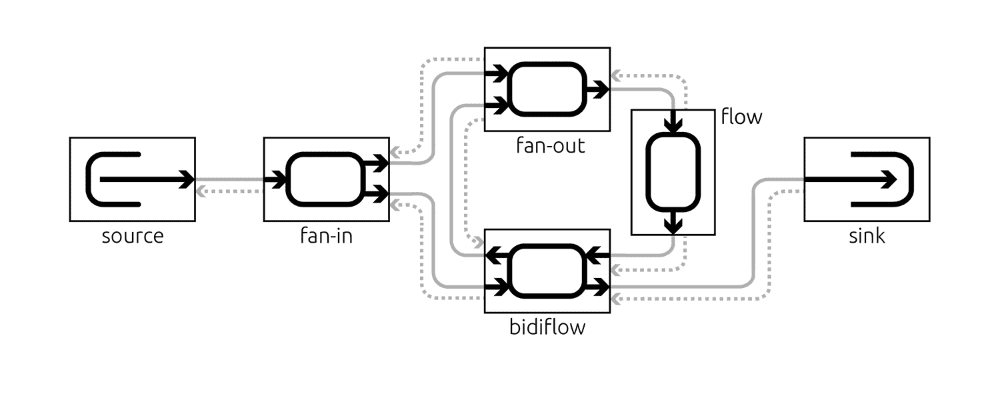
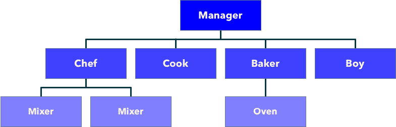
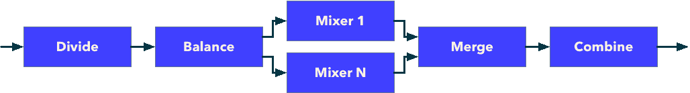
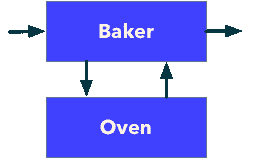
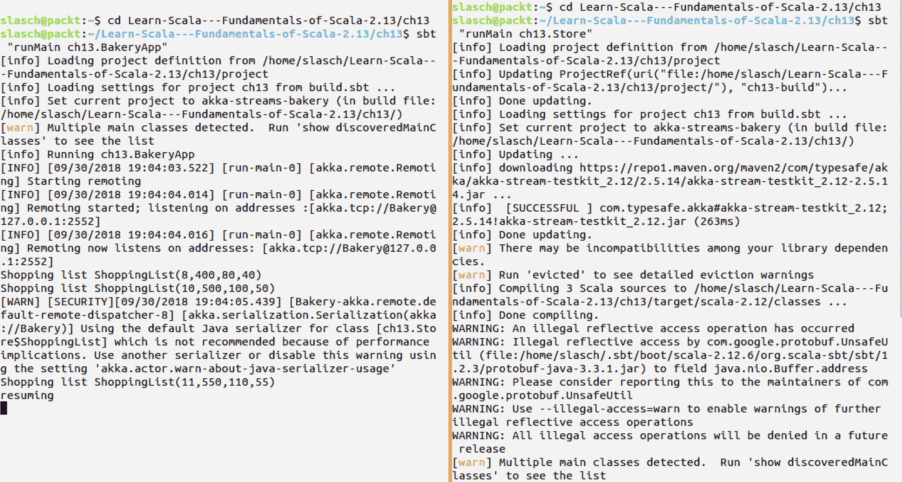

# Akka Streams 基础知识

在本章中，我们将更深入地了解 Akka Streams。我们将从一般流的描述开始，特别是反应式流的描述。我们将触及反压的概念，并为你提供一些使用 Akka Streams 作为反应式流标准的具体实现的动机。我们将再次实现我们的面包店，这次使用流作为设计抽象。这将使我们能够详细检查 Akka Streams 的基本知识，如流和图、错误处理和测试。

本章将涵盖以下主题：

+   反应式流

+   反压

+   Akka Streams 哲学

+   Akka Streams 基本概念

+   源和汇

+   流

+   图

+   日志记录

+   实化

+   故障处理

+   测试

# 技术要求

+   安装的 Scala

+   安装的 SBT

本章的源代码可在 GitHub 上找到：[`github.com/PacktPublishing/Learn-Scala-Programming/tree/master/Chapter13`](https://github.com/PacktPublishing/Learn-Scala-Programming/tree/master/Chapter13)。

# Akka Streams 简介

在现代计算中，“流”这个词在意义上被大量复用。它根据上下文的不同承载着许多不同的含义。例如，在 Java 中，在不同的时期，“流”意味着对阻塞 IO、非阻塞 IO 的抽象，后来又成为表达数据处理查询的一种方式。

从本质上讲，计算中的流只是数据或指令的流动。通常，流的内容不会完全加载到内存中。这种在内存容量有限的设备上处理基本上无限量的信息的能力是流兴起的一个推动因素，这种流行趋势最近正在发生。

流作为流动的定义意味着它应该有一些数据元素来源和目的地。在计算中，这些概念自然地在代码中以某种方式表达，即在流动的一侧代码发出数据，在另一侧其他代码消费这些数据。发出数据的一侧通常被称为**生产者**，接收数据的一侧相应地称为**消费者**。通常，在内存中会有一些数据，这些数据已经被生产者发出但尚未被消费者摄取。

流的这一特性引发了下一个想法：应该可以通过中间的代码在飞行中操纵数据，就像热水器插在进水口和水龙头之间，*改变*冷水为热水一样。有趣的是，在这个场景中，生产者或消费者并不知道热水器的存在。如果水流强度增加，我们可以很容易地想象插入另一个热水器或用更强大的型号替换现有的一个。热水器在意义上成为流的所有权，即消费者接收到的水量取决于生产者发出的量，但温度取决于管道系统的特性，或者说本质上就是流的特性。

这就是使用流的基本理念：流通常被视为生产者、消费者以及中间的转换步骤的组合。在流式传输场景中，生产者和消费者变得不那么有趣，主要焦点转向中间的转换步骤。为了模块化和代码重用，定义许多微小的转换通常被认为是更可取的方法。

根据在流的部分之间传输数据的技术，我们区分流的推送和拉取元素。

在推送模型中，生产者控制整个过程。数据一旦可用，就会推送到流中，其余的流应该能够吸收它。自然地，并不是总是可能以不可预测的速度消费生产出的数据。在流式传输的情况下，这通常通过丢弃数据或使用缓冲区来处理。丢弃数据有时是合适的，但更常见的是不希望这样做。缓冲区的大小有限，因此如果数据产生速度超过消费速度，长时间内可能会填满。满缓冲区再次导致内存溢出或需要丢弃数据。显然，在推送模型中，快速生产者和慢速消费者的组合是一个问题。

在拉取模型中，消费者驱动整个过程。它试图在需要时尽快从流中读取数据。如果有数据，就取走。如果没有数据，消费者可以选择等待或稍后再次尝试。通常，这两种可能性都不太理想。等待数据通常是通过阻塞和轮询数据来完成的，这意味着资源过度消耗以及数据可用和消费之间的延迟。显然，在慢速生产者和快速消费者的情况下，拉取模型并不是最优的。

这种二分法导致了名为反应式流的动态拉取-推送概念的创造，以及 2013 年由 Lightbend、Netflix 和 Pivotal 的工程师发起的同名倡议。

# 反应式流和背压

反应流([`www.reactive-streams.org`](http://www.reactive-streams.org))是一个旨在提供异步流处理非阻塞背压标准的倡议。

非阻塞背压是一种处理流环境中拉取和推送语义缺陷的机制。通过一个例子来解释会更好。

想象一个建筑工地，工头负责及时交付建筑材料，以及其他职责。工地只能容纳最多 100 吨的材料。工头可以从另一家公司订购材料，但订单是由卡车司机在公司的办公室接收，而不是将材料运送给客户。

对于工头来说，拉取行为可能是打电话给承包商并等待卡车司机在办公室并接听电话（阻塞拉取），或者定期打电话，希望这次有人会接电话（轮询）。在我们的案例中，工头给承包商发送语音消息，要求 100 吨材料，然后返回日常工作。这是一种非阻塞拉取。

承包商一旦有足够的能力，就会接受订单。他们准备发送几辆每辆容量为 32 吨的卡车，但意识到他们不能发送超过 100 吨，因为工地无法接收这么大的量。因此，只发送了三辆卡车和 96 吨材料。

消耗了 30 吨材料后，工头意识到他们可以再从承包商那里订购更多，以避免如果剩余材料快速消耗，工地后来变得闲置。他们又订购了 30 吨。但承包商记得前一个订单还剩下另外 4 吨，所以可以安全地发送另一辆载有 32 吨的整车，这可以装进一辆单独的卡车。我们反映的事实是，第一次请求中的一些需求是通过连续交付后来得到满足的，我们说请求是可累加的。

这基本上就是反应流背压概念的工作方式。在现实中，这种方法可能更好地反映为“向前轻松”，但这个名字可能不会像“背压”那样流行。

反应流规范努力定义一个低级 API，它可以由不同的库实现，以实现实现之间的互操作性。该标准定义了 API 和**技术兼容性工具包**（**TCK**），这是一个 API 实现的标准测试套件。

TCK 的目的是帮助库作者验证他们的实现是否符合标准。

API 包含以下组件：

+   发布者

+   订阅者

+   订阅

+   处理器

`发布者`代表源，`订阅者`与消费者相关，处理器是流的处理阶段，而`订阅`是背压的表示。

API 中定义的所有方法都返回`void`，这意味着它们旨在在不等待调用者等待结果的情况下执行，因此 Reactive Streams 标准定义中的*异步流处理*。

Reactive Streams 是一个库标准，定义了库如何相互通信，以便能够进行交互。预计库将为用户提供不同的高级 API，可能反映了某些实现细节。

Akka Streams 是使用 Akka 演员作为底层技术构建的此类库之一。它实现了 Reactive Streams 标准，并具有丰富的、高级的 API，允许您使用高级 DSL 描述流，并展示了底层的 Akka 机制。

# Akka Streams

Akka Streams（[`doc.akka.io/docs/akka/2.5.13/stream/stream-introduction.html`](https://doc.akka.io/docs/akka/2.5.13/stream/stream-introduction.html)）的目的是提供一种直观且安全的方式来制定流处理设置，以便我们可以高效地执行它们，并且资源使用量有限。

Akka Streams 完全实现了 Reactive Stream 标准，以便与其他符合 Reactive Streams 规范的库进行交互，但这一事实通常被视为实现细节。

Akka Streams 最初的动机是所有 Akka actor 系统都面临着相同的技术问题，这增加了意外的复杂性，并且几乎需要为每个单独的项目单独解决多次。例如，Akka 没有通用的流控制机制，并且为了防止 actor 的邮箱溢出，它需要在每个应用程序中实现为自制的解决方案。另一个常见的痛点是至多一次的消息语义，这在大多数情况下都不理想，但也是逐个解决的。另一个 Akka 受到批评的不便之处是其无类型性质。类型的缺失使得在编译时检查 actor 之间可能交互的健全性成为不可能。

Akka Streams 旨在通过在 actor 系统之上放置一个流层来解决此问题。这一层遵循一组小的架构原则，以提供一致的用户体验。这些原则是流处理和组合的全面领域模型。库的重点在于模块化数据转换。从这个意义上说，Reactive Streams 只是数据在流程步骤之间传递的实现细节，而 Akka 演员则是单个步骤的实现细节。

分布式有界流处理的领域模型完整性的原则意味着 Akka Streams 拥有一个丰富的 DSL，允许你表达领域的各个方面，例如单个处理和转换步骤及其相互连接，具有复杂图拓扑的流，背压，错误和故障处理，缓冲等等。

模块化原则意味着单个转换、以特定方式连接的多个转换，甚至整个图的定义必须是可自由共享的。这一原则导致了将流描述与流执行分离的设计决策。因此，Akka Streams 的用户必须完成以下三个步骤来执行流：

1.  以构建块及其之间连接的形式描述流。这一步骤的结果通常在 Akka 文档中被称为**蓝图**。

1.  材料化蓝图以创建流的实例。材料化是通过提供一个材料化器来完成的，在 Akka 中，这采取使用 actor 系统或 actor 上下文为每个处理阶段创建 actor 的形式。

1.  使用 `run` 方法之一执行材料化流。

在实践中，通常最后两个步骤会合并，并将材料化器作为隐式参数提供。

带着这个理论，让我们看看在实际中如何使用 Akka Streams 构建和执行流。

# 设置和依赖

为了使 Akka Streams 可用于我们的项目，我们需要将以下依赖项放入 `build.sbt` 文件中：

```java
lazy val akkaVersion = "2.5.14"
libraryDependencies += "com.typesafe.akka" %% "akka-stream" % akkaVersion
```

这使我们能够使用以下导入语句在我们的示例中导入相关类：

```java
import akka.stream._
import akka.stream.scaladsl._
```

假设以下导入语句在本书后面的每个示例中都是现成的。

我们还需要一个包装器，以便我们能够为我们的流创建材料化器。包装器需要在流处理完成后立即终止 actor 系统：

```java
package ch13

import akka.actor.ActorSystem
import akka.stream._

object Bakery extends App {
  implicit val bakery: ActorSystem = ActorSystem("Bakery")
  implicit val materializer: Materializer = ActorMaterializer()

  // stream processing happens here

  private def afterAll = bakery.terminate()
}
```

现在，在我们深入代码之前，我们需要一些词汇来描述我们在示例中所做的工作。

# 核心概念

让我们看看 Akka Streams 用来描述流及其元素的词汇表。

如前所述，每个流都有生产者、消费者和转换步骤。在 Akka Streams 中，它们分别命名为 `Source`、`Sink` 和 `Flow`。

更正式地说，在 Akka Streams 中，任何流构建块都被称为**处理阶段**。具有单个输出的处理阶段是 `Source`，单个输入的是 `Sink`，具有一个输入和一个输出的则是 `Flow`。通过将源和汇连接到流中，我们构建了一个可执行的**可运行图**。

此外，还有一些特殊的处理阶段：

+   具有两个或多个输入和一个输出的扇入

+   具有一个输入和两个或更多输出的扇出

+   具有两个输入和两个输出且方向相反的 Bidiflow

我们绘制了以下图，其中所有处理阶段相互连接，以简化概念的理解。虚线表示我们之前提到的背压：



图 1.可运行图中的不同处理阶段相互连接

# 示例结构

让我们看看流式实现是如何改变我们构建的面包店应用的形状的第十一章，*Akka 和 Actor 模型简介*，以及第十二章，*使用 Akka Typed 构建响应式应用*。为了回顾，这是用 actor 表示的面包店设计：



这个层次结构中的 actor 有以下职责：

+   **经理**启动新的烘焙轮次，并在下属之间转移工作包，并监督他们。

+   **男孩**被分配了一个购物清单，并从远程系统中获取了杂货。

+   **厨师**创建并使用了一些有限容量的搅拌机，以便将给定的杂货转换为面团。

+   **厨师**从提供的面团中制作了若干块生饼干。

+   **面包师**在固定大小的**烤箱**中烘焙生饼干。它维护一个内部队列，以备面包店的其余部分制作生饼干的速度超过**烤箱**烘焙的速度时使用。

+   **烤箱**和**搅拌机**代表硬件资源。它们将生饼干转换为可食用的饼干，将杂货转换为面团，但这样做会有延迟，并且可能发生故障。

现在我们有更多可能性以更静态的方式定义参与者之间的关系，因此我们只保留启动**经理**的行为，并通过直接连接涉及的转换步骤在流程级别组织工作转移。

这就是我们面包店的架构，以处理阶段表示：


actor 系统的层次结构已经转变为扁平的数据流。显然，这个图中不再有`搅拌机`和`烤箱`。它们怎么了？嗯，我们在隐藏转换步骤的内部细节上有点作弊。实际上，这些步骤中的一些是由更小的组件构建的复合块。让我们详细描述一下它的样子。

**经理**只保留了其启动行为。这将被表示为一个定时源，它将不时地滴答作响，并推动其他人烘焙一些饼干。**男孩**不能仅仅通过**经理**的愿望来工作，因此我们需要**经理**给它一个适当的购物清单。因此，我们必须将滴答的冲动转换为**购物清单**，如下一图所示：


这个复合块恰好有一个输出和没有输入，因此它显然是一个`Source[ShoppingList]`。

源的实际类型是`Source[+Out, +Mat]`，因为它还考虑了物化方面。对于现在来说，物化对我们来说不是必要的，所以我们将在描述流结构时讨论简化的伪类型。

`Boy`和`Cook`是简单的步骤；它们都可以被视为将输入转换为输出的转换，我们稍后会详细探讨这个转换。从这一描述中，我们可以得出结论，`Boy`是一个`Flow[ShoppingList, Groceries]`，而`Cook`只是一个`Flow[Dough, RawCookies]`。

`Chef`显然不像他的兄弟姐妹那样简单。它需要创建与食材数量相对应的多个**搅拌器**，并行使用它们来搅拌面团，并在将它们发送到下一步之前将结果合并在一起。我们将用以下结构来表示这一点：



这个图中的内容比我们之前描述的要多。这是因为我们将具有单一职责的构建块流与转换结合起来，我们需要进行转换：

1.  我们需要将进来的食材分成适合单个搅拌器的份量；这就是**分割**步骤。

1.  接下来，我们需要确保工作在搅拌器之间均匀分配，以避免出现需要等待某个搅拌器因为它接收了多个工作包的情况。这就是**平衡**发挥作用的地方。

1.  多个搅拌器的参与是显而易见的。

1.  **合并**步骤的职责是成为一个扇入块；它将多个小份面团的多个流合并成一个相同块的单一流。

1.  最后，在我们将其进一步加工之前，我们需要将小块面团**合并**成一个大的碗。

内部子流的类型如下：**分割**、**合并**以及所有的**搅拌器**都是流，**平衡**是扇出，**合并**是扇入。结果类型是`Flow[Groceries, Dough]`。

面包师在之前的图中看起来并不简单，因为它隐藏了一个烤箱以及与之的交互：



图中的**烤箱**有一个输入和一个输出，所以这只是一个`Flow[RawCookies,ReadyCookies]`。**面包师**有两个输入和两个输出，其形状是`BidiFlow[RawCookies, RawCookies, ReadyCookies, ReadyCookies]`。

结果的组合类型是`Flow[RawCookies,ReadyCookies]`。

在之前构建的示例中，使用演员系统时，**面包师**在烤箱不为空时维护了一个内部队列，以存放到达的生饼干。这有一个缺点，即如果`经理`非常急切，烘焙过程可能会被频繁启动，而生饼干到达面包师的速度可能会比烤箱烘焙的速度快得多。因此，生饼干的队列可能会无限增长，直到占用所有可用空间，我们可能需要丢弃生饼干以腾出空间，或者关闭面包房，因为没有其他演员可以工作的空间。

在这个版本的面包房中，我们决定不实现任何队列，而是依赖背压。我们预计如果`Oven`无法接受更多工作，它会与`Baker`通信。`Baker`也会这样做，一直追溯到`Manger`，这样就不可能表达出需要更多烘焙饼干的需求，除非有更多的烤箱容量可用。通过不同的缓冲策略，可以管理在任何时刻面包房中正在进行的工作量。为了示例的目的，我们将这个限制设置得较低，以展示背压的作用。

我们流的最后一步是一个`Customer`，其类型为`Sink[ReadyCookies]`。

现在，让我们转换思路，将我们构思的结构编码到代码中。

# Akka Streams 基础知识

Akka Streams 流的元素通常使用适当类型的构造函数来定义。我们将逐一实现构成我们图表的构建块，从最简单的开始，逐渐过渡到越来越复杂的。

# 源和汇

我们流中最简单的组件可能是`Consumer`。它只是一个汇，应该打印出有关传入数据的信息。为了构建它，我们将使用`Sink`工厂，如下所示：

```java
val consumer: Sink[ReadyCookies, Future[Done]] =
  Sink.foreach(cookie => println(s"$cookie, yummi..."))
```

`Sink` 工厂提供了二十多种不同的构造函数来定义汇。我们正在利用其中最简单的一个，它为流中的每个元素调用一个提供的函数。

在这里，我们看到它的实际类型是`Sink[ReadyCookies, Future[Done]]`。这反映了`ReadyCookies`元素的类型以及`Sink`被物化为的类型。在这种情况下，如果流通过到达其结束而结束，则物化为`Success`，如果流中发生故障，则物化为`Failure`。

现在，我们将查看流的另一端并定义一个源。`Source` 工厂同样提供了近三十种不同的方法来创建源。我们不希望压倒我们的面包房团队，所以我们决定使用一个定时数据源：

```java
private val delay = 1 second
private val interval = 1 second

val manager1: Source[NotUsed, Cancellable] =
  Source.tick(delay, interval, NotUsed)
```

这代表了我们复合`Source`的第一个块，它的类型不适合我们的`Boy`，因此我们需要实现图表的第二块，即生成器，并将两者连接起来。这比解释起来更容易：

```java
val manager: Source[ShoppingList, Cancellable] =
  Source.tick(delay, interval, NotUsed).map { _ =>
    shoppingList
  }
```

我们基本上只是映射输入，但忽略它，并返回一个`shoppingList`。现在我们的`Source`有了合适的类型，这样我们就可以稍后将其连接到`Boy`。

这个实现有一个我们未考虑到的微妙之处。我们有一个预定义的间隔，目的是不让流的其他部分被请求淹没。但与此同时，我们正准备依赖`Oven`的背压来达到同样的目的。这并不理想，因为如果我们选择太大的间隔，我们的面包店将得不到充分利用；如果我们选择太小的间隔，这将是由背压来管理的流。我们可以简化我们的源，使其只产生购物清单，并在下游有可用容量时立即将它们放入管道：

```java
val manager: Source[ShoppingList, NotUsed] =
  Source.repeat(NotUsed).map(_ => shoppingList)
```

在这里，我们只是重复了`NotUsed`元素（它提供了一个很好的语法），然后像之前一样用随机购物清单替换它。不同的是，经理将在有需求时每次都生成购物清单，而不会因为计时器设置而等待太长时间。

# 流

现在我们有了源和汇，让我们来实现流本身。同样，我们将从最简单的部分开始，随着我们的进展逐步转向更复杂的部分。

最容易的流构建块无疑是`Cook`。它可以作为一个在先前的流定义上调用的映射函数来实现，但出于组合的原因，我们希望单独定义它。

流定义的方法与前面两个保持一致——`Flow`构造函数是最佳选择。流是在输入操作的基础上定义的，但定义本身与这个输入是解耦的。再次强调，有很多方法可以选择；就我们的目的而言，我们选择简单的`map`：

```java
object Cook {
  def formFlow: Flow[Dough, RawCookies, NotUsed] =
    Flow[Dough].map { dough =>
      print(s"Forming $dough - ")
      val result = RawCookies(makeCookies(dough.weight))
      println(result)
      result
    }
  private val cookieWeight = 50
  private def makeCookies(weight: Int): Int = weight / cookieWeight
}
```

`cook`的流只是映射输入面团，并将其转换为输出，即未加工的饼干，正如类型注解所表示的那样。

在这个意义上，《男孩》与`Cook`非常相似，因为它是一个简单的构建块，将输入转换为输出。不过有一个需要注意的地方——我们的`Boy`需要与远程演员进行通信才能完成这个任务。

Akka Streams 建立在 Akka 之上，因此提供了一些在不同阶段利用和与演员通信的可能性；例如，可以使用`ActorRef`作为源或汇。在这种情况下，远程方面由于 Akka 的位置透明性，实际上只是一个实现和配置细节。

在我们的用例中，与远程商店系统中部署的卖家进行通信的最合适方式将是询问模式。让我们一步一步来做。首先，我们将查找远程演员，以便能够与之通信：

```java
def lookupSeller(implicit as: ActorSystem): Future[ActorRef] = {
  val store = "akka.tcp://Store@127.0.0.1:2553"
  val seller = as.actorSelection(s"$store/user/Seller")
  seller.resolveOne()
}
```

给定一个`ActorSystem`，我们使用远程系统的地址和演员路径来查找一个演员。我们知道应该只有一个演员，因此我们解析一个引用。根据查找的结果，它将返回所需的引用的`Success`或`Failure[ActorNotFound]`。失败将通过错误流传播，并导致流终止，因为我们没有定义如何处理它。让我们称这为期望的行为，因为没有卖家，我们无法将购物清单转换为食品。

我们可以使用`Future[ActorRef]`与演员进行通信：

```java
def goShopping(implicit as: ActorSystem, ec: ExecutionContext):
  Future[Flow[ShoppingList, Groceries, NotUsed]] =
  lookupSeller.map { ref => 
    Flow[ShoppingList].askGroceries 
}
```

在这里，我们不仅需要一个`ActorSystem`，还需要一个`ExecutionContext`，以便能够映射从`lookupSeller`获取的`Future`。我们使用演员引用（如果有）作为参数来调用`Flow.ask`。`Flow`的类型对应于预期的输入类型和`ask`的类型——预期的输出类型。

现在我们可以使用另一个`Flow`构造函数将`Future[Flow]`转换为`Flow`：

```java
def shopFlow(implicit as: ActorSystem, ec: ExecutionContext): Flow[ShoppingList, Groceries, Future[Option[NotUsed]]] =
  Flow.lazyInitAsync { () => goShopping }
```

`lazyInitAsync`将`Future`的内部`Flow`转换为正常的`Flow`。这个子流有适当的输入和输出类型，因此我们可以稍后将其插入到我们的流定义中。

在`application.conf`中扩展配置以包含 Akka 远程所需的属性非常重要，如第十一章所述，*Akka 和 Actor 模型简介*。

我们接下来要实现的是下一个复合步骤，即`Baker`，包括其组成部分`Oven`。

`Oven`需要花费一些时间将原始饼干转化为可食用的饼干，我们可以通过引入一点阻塞行为来实现这一点。但这样做会通过无谓地消耗可用线程来影响系统的其余部分。因此，我们将使用 Akka Streams 的另一个功能，`Flow.delay`，它允许我们在时间上延迟元素的发射：

```java
def bakeFlow: Flow[RawCookies, ReadyCookies, NotUsed] =
  Flow[RawCookies]
    .delay(bakingTime, DelayOverflowStrategy.backpressure)
    .addAttributes(Attributes.inputBuffer(1, 1))
    .map(bake)
```

由于我们只有一个`Oven`，我们定义一个缓冲区大小为初始和最大大小为 1。我们也不希望丢弃到达的原始饼干或释放尚未准备好的饼干，因此我们定义一个溢出策略为背压。

`bake`方法再次是一个简单的转换：

```java
private def bake(c: RawCookies): ReadyCookies = {
  assert(c.count == ovenSize)
  ReadyCookies(c.count)
}
```

现在，有了这个`Oven`，我们可以定义一个`Baker`，我们计划给它一个`BidiFlow`类型：

```java
def bakeFlow = BidiFlow.fromFlows(inFlow, outFlow)
```

为了做到这一点，我们需要分别定义两个方向的`inFlow`和`outFlow`。

`outFlow`只是将准备好的饼干传递给消费者，我们已经知道如何做这件事：

```java
private def outFlow = Flow[ReadyCookies]
```

`inFlow`稍微复杂一些，因为我们需要将来自某些随机数量的原始饼干分组到具有烤箱大小的组中。我们将通过定义单个饼干的子源并将它们按所需方式分组来实现这一点。以下是第一步：

```java
def extractFromBox(c: RawCookies) = Source(List.fill(c.count)(RawCookies(1)))
```

我们正在创建一个源：单个饼干的数量。重新组合逻辑如下：

```java
val inFlow = Flow[RawCookies]
  .flatMapConcat(extractFromBox)
  .grouped(Oven.ovenSize)
  .map(_.reduce(_ + _))
```

`flatMapConcat`逐个消耗源，并将结果连接起来。然后，我们将单个饼干的流分组到`ovenSize`的`List[RawCookie]`流中。最后，我们将单个饼干的列表缩减为`Oven`期望的`RawCookie(ovenSize)`。

现在，我们可以通过连接将面包师傅的`BidiFlow`和烤箱的`Flow`组合成复合`Flow`：

```java
val bakerFlow: Flow[RawCookies, ReadyCookies, NotUsed] = 
  Baker.bakeFlow.join(Oven.bakeFlow)
```

`join`方法将一个给定的`Flow`作为最终转换添加到`BidiFlows`的堆栈中。在我们的情况下，堆栈的大小为 1，结果的流类型为`Flow[RawCookies, ReadyCookies, NotUsed]`。这个子流程隐藏了重新分组饼干和等待它们准备好的所有细节，为我们提供了一个简洁的定义。

# 图

我们流程的最后一部分是一个`Chef`。它整合了混合器的工作管理。让我们首先实现`Mixers`。

混合行为本身很简单，但为了模仿真实硬件，我们包括一个混合时间的块：

```java
def mix(g: Groceries) = {
  Thread.sleep(mixTime.toMillis)
  import g._
  Dough(eggs * 50 + flour + sugar + chocolate)
}
```

由于混合行为，我们需要使用一个特殊的异步流程构造函数来为每个混合器启动一个单独的线程。为了更好地控制线程的分配方式，我们将在配置中添加一个单独的固定线程调度器的定义，该调度器为每个子流程分配一个线程：

```java
mixers-dispatcher {
  executor = "thread-pool-executor"
  type = PinnedDispatcher
}
```

在此定义到位后，我们现在能够定义阻塞的混合行为：

```java
private def subMixFlow: Flow[Groceries, Dough, NotUsed] =
  Flow[Groceries].async("mixers-dispatcher", 1).map(mix)
```

`async`构造函数接受一个缓冲区大小作为参数，我们希望我们的混合器不要分配任何大缓冲区。

工作管理可以作为一个独立的概念实现，它类似于 Akka Streams 文档食谱中的某个配方——平衡器。它接受一个工作`subFlow`和工作者数量，并构建一个具有给定工作者数量的图：

```java
import akka.stream.scaladsl.GraphDSL
import GraphDSL.Implicits._

def createGraphOut, In = {
  val balanceBlock  = BalanceIn
  val mergeBlock = MergeOut
  GraphDSL.create() { implicit builder ⇒
    val balancer = builder.add(balanceBlock)
    val merge = builder.add(mergeBlock)

    for (_ ← 1 to count) balancer ~> subFlow ~> merge

    FlowShape(balancer.in, merge.out)
  }
}
```

`Balance`块是一个具有多个输出的扇出流。它将流元素均匀地分配给工作者。通过`waitForAllDownstreams = false`，我们指定一旦至少有一个工作者要求工作，分配就可以开始。通过`false`，我们将行为更改为在所有工作者要求工作之前等待分配。`Merge`是一个具有指定输入数量的扇入块。通过指定`eagerComplete = false`，我们告诉它等待所有下游完成，而不是在任何一个工作者完成时立即完成。

然后，我们使用`GraphDSL.create()`构造一个图，并提供实际的图构建逻辑作为参数。首先，我们将`balanceBlock`和`mergeBlock`转换为形状，并将它们添加到`builder`中。然后，我们使用`import GraphDSL.Implicits._`提供的`~>`语法将所需数量的子流程连接到平衡器并合并。五个工作者的`for`推导式相当于以下简单的定义：

```java
balancer ~> subFlow ~> merge
balancer ~> subFlow ~> merge
balancer ~> subFlow ~> merge
balancer ~> subFlow ~> merge
```

定义了此图之后，我们可以使用另一个`Flow`构造函数来指定其余的`Balancer`流程：

```java
def applyIn, Out: Flow[In, Out, NotUsed] =
  Flow.fromGraph(createGraph(subFlow, count))
```

我们可以使用它来构建我们的`Chef`子流程：

```java
def mixFlow: Flow[Groceries, Dough, NotUsed] =
  Flow[Groceries]
    .map(splitByMixer)
    .flatMapConcat(mixInParallel)

def splitByMixer(g: Groceries) = {
  import g._
  val single = Groceries(1, flour / eggs, sugar / eggs, chocolate / eggs)
  List.fill(g.eggs)(single)
}

def mixInParallel(list: List[Groceries]) =
  Source(list)
    .via(Balancer(subMixFlow, list.size))
    .grouped(list.size)
    .map(_.reduce(_ + _))
```

在这里，我们再次将“杂货”分成更小的部分，并使用专用混合器并行混合每一部分，然后使用之前与“面包师”和“烤箱”相同的技巧将它们组合起来。

# 日志

在`Cook`的流程中，我们使用了两个`print`语句来查看`Cook`的表现。对于我们的例子来说是可以的，但我们会更倾向于使用适当的日志。让我们改进这一点。

Akka 提供了一个`log`方法，它接受一个日志名称作为参数，可以在流程中的任何处理阶段调用。让我们用它来代替我们的`print`语句：

```java
def formFlow: Flow[Dough, RawCookies, NotUsed] =
  Flow[Dough]
    .log("Cook[Before Map]")
    .map { dough =>
      RawCookies(makeCookies(dough.weight))
    }
    .log("Cook[After Map]")
    .withAttributes(
      Attributes.logLevels(
        onElement = Logging.InfoLevel,
        onFinish = Logging.DebugLevel,
        onFailure = Logging.WarningLevel
      )
    )
```

这里，我们在日志中写入流程在转换前后的元素，并提供可选的日志配置，以指定不同类型事件的日志级别。

为了看到这些更改的效果，我们需要扩展`application.conf`：

```java
akka {
  loggers = ["akka.event.Logging$DefaultLogger"]
  # Options: OFF, ERROR, WARNING, INFO, DEBUG
  loglevel = "INFO"
}
```

现在，在启动我们的示例之后，我们将在日志中看到以下条目：

```java
[INFO] [Bakery-akka.actor.default-dispatcher-14] [akka.stream.Log(akka://Bakery/system/StreamSupervisor-0)] [Cook[Before Map]] Element: Dough(575)
 ...
 [INFO] [Bakery-akka.actor.default-dispatcher-14] [akka.stream.Log(akka://Bakery/system/StreamSupervisor-0)] [Cook[After Map]] Element: RawCookies(11)
 ...
 [INFO] [Bakery-akka.actor.default-dispatcher-14] [akka.stream.Log(akka://Bakery/system/StreamSupervisor-0)] [Cook[Before Map]] Element: Dough(1380)
 [INFO] [Bakery-akka.actor.default-dispatcher-14] [akka.stream.Log(akka://Bakery/system/StreamSupervisor-0)] [Cook[After Map]] Element: RawCookies(27)
```

在设置日志后，我们已经定义了流程的所有部分，可以尝试将它们组合在一起。

# 物化

现在我们可以为我们的面包店指定整个流程：

```java
val flow = Boy.shopFlow
  .via(Chef.mixFlow)
  .via(Cook.formFlow)
  .via(bakerFlow)

val graph: RunnableGraph[Future[Done]] = manager.via(flow).toMat(consumer)(Keep.right)

implicit val materializer: Materializer = ActorMaterializer()

graph.run().onComplete(_ => afterAll)
```

这里，我们首先通过组合之前定义的子流程来构建完整的流程。然后，我们通过附加`manager`源和`consumer`汇来将流程转换为可运行的图。

我们还指定我们想要保留正确的物化值。左边的物化值将是流的结果，在我们的例子中是`NotUsed`，因为我们只是将生产的饼干写入控制台。右边的值是一个当流程完成后完成的未来，我们希望用它来关闭我们的 actor 系统，一旦发生就立即关闭。

最后，我们通过将`ActorMaterializer`引入作用域并调用相应的`run`方法来运行图。

我们的系统运行并烘焙美味的饼干，但不幸的是，我们忘记考虑一个重要的方面：在我们的设置中，混合器容易发生硬件故障。

# 处理故障

为了使混合步骤更真实，我们将添加几个异常，并在混合阶段随机抛出它们。这将模拟在不可预测的时间出现的硬件故障。混合器可以像在前两章基于 actor 的示例中那样抛出三种异常之一：

```java
object MotorOverheatException extends Exception
object SlowRotationSpeedException extends Exception
object StrongVibrationException extends Exception

val exceptions = Seq(MotorOverheatException,
                     SlowRotationSpeedException,
                     StrongVibrationException)
```

实际的`mix`方法可能看起来像这样：

```java
private def mix(g: Groceries) = {
  if (Random.nextBoolean()) throw exceptions(Random.nextInt(exceptions.size))
  Thread.sleep(mixTime.toMillis)
  import g._
  Dough(eggs * 50 + flour + sugar + chocolate)
}
```

异常可以以几种不同的方式处理。最直接的方法是在逻辑中直接捕获它们：

```java
private def mix(g: Groceries) = try {
  if (Random.nextBoolean()) throw exceptions(Random.nextInt(exceptions.size))
  Thread.sleep(mixTime.toMillis)
  import g._
  Dough(eggs * 50 + flour + sugar + chocolate)
} catch {
  case SlowRotationSpeedException =>
    Thread.sleep(mixTime.toMillis * 2)
    import g._
    Dough(eggs * 50 + flour + sugar + chocolate)
}
```

在慢速旋转的情况下，我们决定忽略这个问题，保留混合物，并给混合器双倍的时间来完成混合。

这种方法可行，但它有一个明显的缺点，那就是我们混淆了业务和错误处理实现。这种情况通常是不受欢迎的，因为这两个方面的代码通常具有不同的性质。快乐路径包含与业务相关的代码，而错误处理具有技术本质。因此，通常更倾向于将这些代码路径分开。在我们的案例中，在阶段级别处理失败是合理的，因为我们不希望丢弃流中的元素。

Akka 提供了指定失败处理的其他方法。其中之一是恢复逻辑，可以为阶段定义，以便将失败转换为流的最终元素：

```java
def subMixFlow: Flow[Groceries, Dough, NotUsed] =
  Flow[Groceries].async("mixers-dispatcher", 1).map(mix).recover {
    case MotorOverheatException => Dough(0)
  }
```

在这里，我们决定在电机故障的情况下返回一个空的面团碗。然后流完成，但在这个案例中这没关系，因为我们的搅拌器本身就是一次性子流程。

`recover`方法是`recoverWithRetries`的特殊情况。后者不仅接受用于决策的部分函数，还在同一处理阶段发生多次失败的情况下接受重试次数。

现在我们唯一缺少的是如何处理`StrongVibrationException`的决定。如果我们决定不处理它，默认行为将能够停止整个流。如果发生这种情况，下游阶段将得知失败，上游阶段将被取消。

我们绝对不希望因为我们的搅拌器振动得太厉害而关闭我们的面包店。恰恰相反；我们希望完全忽略这一点。一些阶段支持与演员相同的方式定义监督策略。我们可以利用这种可能性来定义一个通用的错误处理行为。首先，我们需要定义一个决策策略：

```java
val strategy: Supervision.Decider = {
  case StrongVibrationException   ⇒ Supervision.resume
  case _ => Supervision.Stop
}
```

有三种策略可用——停止、重启和恢复：

+   停止策略是默认的，它将停止处理阶段并传播上下游阶段的失败。

+   恢复策略只是丢弃当前元素，流继续。

+   重启与恢复类似——它丢弃当前元素，流继续，但在那之前阶段被重启，因此任何内部状态都被清除。

在我们的决策器中，我们只想在强振动的情况下让流继续，但在任何其他失败的情况下停止。我们除了监督策略外还处理其他类型的异常，因此这个决定是安全的。

这是我们如何将我们的监督策略应用到处理阶段的定义中：

```java
private def subMixFlow: Flow[Groceries, Dough, NotUsed] =
  Flow[Groceries].async("mixers-dispatcher", 1).map(mix).recover {
    case MotorOverheatException => Dough(0)
  }.withAttributes(ActorAttributes.supervisionStrategy(strategy))
```

现在，如果我们启动我们的示例，它将按预期运行并处理硬件故障。

它看起来不错，但我们还没有完成，因为我们还没有测试我们的面包店。

# 测试

由于系统的各个部分相互关联，基于流的代码的测试可能看起来很复杂。但更常见的是，测试流归结为在隔离状态下对处理阶段进行单元测试，并依赖于 Akka Streams 确保这些阶段之间的数据流按预期发生。

通常情况下，不需要特殊的测试库。让我们通过测试我们的源来演示这一点：

```java
"manager source" should {
  "emit shopping lists as needed" in {
    val future: Future[Seq[ShoppingList]] = Manager.manager.take(100).runWith(Sink.seq)
    val result: Seq[ShoppingList] = Await.result(future, 1.seconds)
    assert(result.size == 100)
  }
}
```

为了运行这个测试片段，我们需要一个隐式材料化器在作用域内：

```java
implicit val as: ActorSystem = ActorSystem("test")
implicit val mat: Materializer = ActorMaterializer()
```

通用方法是，为了测试一个`Sink`，它可以连接到特殊的`Source`，而对于正在测试的`Source`，我们需要一个特殊的`Sink`。

在这两种情况下，基于序列的`Source`和`Sink`可能是最有用的。在我们的例子中，我们正在测试我们的源至少发出一百个购物清单，并且以及时的方式完成。结果可以作为`Seq[ShoppingList]`提供，并在需要时进行检查。

为了测试一个流程，我们需要提供测试`Source`和`Sink`：

```java
"cook flow" should {
  "convert flow elements one-to-one" in {
    val source = Source.repeat(Dough(100)).take(1000)
    val sink = Sink.seq[RawCookies]
    val future: Future[Seq[RawCookies]] = source.via(Cook.formFlow).runWith(sink)
    val result: Seq[RawCookies] = Await.result(future, 1.seconds)
    assert(result.size == 1000)
    assert(result.forall(_.count == 2))
  }
}
```

在这里，我们看到相同的方法。在定义测试输入和输出后，我们驱动被测试的流程，并验证输出具有预期的属性。

在这两种情况下，都存在对`Await.result`的不理想调用，这与运行 Akka Streams 流程产生`Future`的事实相关。我们可以通过使用如第五章中描述的测试技术来改进这一点，*基于属性的 Scala 测试*。

或者，也可以使用其他 Akka 库提供的测试工具包。

# Akka TestKit

Akka Streams 通过`actorRef`方法提供与 Akka actors 的集成。它作为 Sink 构造函数可用，因此我们可以使用一个 actor 来接收流程的元素，这些元素随后被表示为 actor 接收到的消息。使用 Akka `TestKit`中的`TestProbe`来验证关于流程的假设是方便的。首先，我们需要在`build.sbt`中添加对 Akka `TestKit`的依赖：

```java
libraryDependencies += com.typesafe.akka" %% "akka-testkit" % akkaVersion % Test
```

这里是一个如何使用`TestProbe`的例子：

```java
"the boy flow" should {
  "lookup a remote seller and communicate with it" in {
    val probe = TestProbe()
    val source = Manager.manager.take(1)
    val sink = Sink.actorRefGroceries
    source.via(Boy.shopFlow).runWith(sink)
    probe.expectMsgType[Groceries]
  }
}
```

我们测试如果有一个消息进入流程，那么流程将会有一个消息输出。这次我们不是等待未来完成，而是使用`TestProbe`支持的语法来制定我们的假设。

到现在为止，你应该已经识别出我们使用的模式。首先，设置源和/或汇，然后等待流程完成，最后验证关于流程输出的假设。当然，Akka 团队为 Akka Streams 提供了一个特殊的测试套件来抽象这一点。

# Streams TestKit

为了使用 Akka Streams `TestKit`，我们需要在我们的项目配置中添加另一个依赖到`build.sbt`：

```java
libraryDependencies ++= "com.typesafe.akka" %% "akka-stream-testkit" % akkaVersion % Test
```

让我们看看这个模块提供的`TestSink`和`TestSource`如何简化我们制定测试逻辑的方式。现在我们将测试从`Boy`到`Baker`的整个流程：

```java
"the whole flow" should {
  "produce cookies" in {
    val testSink = TestSink.probe[ReadyCookies]
    val source = TestSource.probe[ShoppingList]
    val (publisher: TestPublisher.Probe[ShoppingList],
         subscriber: TestSubscriber.Probe[ReadyCookies]) =
      source.via(Bakery.flow).toMat(testSink)(Keep.both).run()
    subscriber.request(10)
    publisher.sendNext(ShoppingList(30, 1000, 100, 100))
    subscriber.expectNext(40.seconds, ReadyCookies(12))
 subscriber.expectNext(40.seconds, ReadyCookies(12))
  }
}
```

在这个场景中，我们首先使用测试工具包提供的构造函数创建`TestSink`和`TestSource`探针。然后我们将它们实体化为`publisher`和`subscriber`，以便能够驱动流程。在这里，我们再次使用`toMat`语法。到目前为止，我们隐式地使用了默认值（`Keep.left`），但现在我们希望保留流程和 sink 的实体化结果。运行流程返回其实体化实例，它是一个对：`TestPublisher`和`TestSubscriber`。

然后，我们使用`subscriber`从流程中请求 10 条消息。在 Reactive Streams 中，生产者不应该在存在需求之前向下游发送任何内容，我们通过这个调用表达需求。我们期望流程输出代表`RawCookies(12)`的元素。因此，我们的`subscriber.request`转换为要生产的 120 个饼干。

在有这种需求的情况下，我们从源发送下一个购物清单以启动流程。

最后，我们期望至少有两批饼干到达 sink。我们为流通过所有阶段提供足够的时间，考虑到混合和烘焙阶段的延迟。

由于我们在`MotorOverheatException`和`SlowRotationSpeedException`的情况下在混合阶段丢弃消息的方式，我们也不能可靠地预测将制作多少饼干。

在这个例子中，我们只是触及了 Akka Streams `TestKit`提供的所有可能性的表面。随着你开发基于 Akka Streams 的系统，值得重新查阅库的文档和源代码，并记住它们提供的不同测试方法。

# 运行应用程序

如果你仍然需要安装 Java 和/或 SBT，请参阅附录 A，*准备环境和运行代码示例*。

我们将以与第十一章，*Akka 和 Actor 模型简介*和第十二章，*使用 Akka Typed 构建响应式应用程序*相同的方式在终端中运行我们的应用程序，使用两个独立的终端会话分别运行`Store`和`BakeryApp`，使用以下命令：

+   `sbt "runMain ch13.BakeryApp"`

+   `sbt "runMain ch13.Store"`

我们更喜欢这种方法，因为它简洁。如果你即将以交互模式运行应用程序，请参阅第十一章，*Akka 和 Actor 模型简介*，以获取对此方法的详细解释。

在我们的示例中，我们期望远程的 `Store` 应用在启动主 `Bakery` 流时可用。因此，我们必须首先启动 `Store`，否则 `BakeryApp` 将在无法连接到存储时以异常退出。下一个截图显示了两个终端窗口，左侧窗口中输入了运行 `Store` 的命令，右侧窗口中启动了 `BakeryApp`。在接下来的截图中，我们可以看到 `Store` 已经运行了一段时间，而 `BakeryApp` 刚开始执行：



右侧终端中的 `Bakery` 现在将一直运行，直到使用 *Ctrl* + *C* 快捷键停止或关闭终端窗口。

# 摘要

传统的流解决方案存在两个问题之一。在拉取的情况下，需要快速消费者端锁定或大量使用资源。在推送的情况下，要处理的消息数量可能会超过可用内存，需要慢速消费者丢弃消息或因内存溢出而终止。反应式流通过定义具有背压的动态异步拉-推来解决此问题。Akka Streams 使用 Akka 实现了反应式流标准，这允许与这两种技术无缝集成。

Akka 中的流是由称为阶段或流程的块构建的。这些块可以嵌套并相互连接，形成图。通过将它们连接到源和汇，具有单个输入和单个输出的图可以变得可执行。图定义可以自由共享和重用。

运行一个图需要一个材料化器，并产生一个根据图和汇定义的材料化值。

Akka Streams 中的错误处理可以通过不同的方式完成，包括在流程定义中直接捕获错误，定义一个带有可选重试和/或覆盖支持它的处理阶段的监督策略的恢复方法。

流定义的模块化特性允许对单个阶段及其组合进行直接测试。为了减少重复测试设置和期望定义的样板代码，Akka Streams 提供了特殊的测试工具包。

鼓励读者查看官方 Akka 文档[`doc.akka.io/docs/akka/current/stream/index.html`](https://doc.akka.io/docs/akka/current/stream/index.html)，以更详细地了解 Akka Streams 提供的可能性。

# 问题

1.  列出与“经典”流相关的两种不同模式。它们有什么问题？

1.  为什么反应式流被认为在动态拉-推模式下是可行的？

1.  Akka Stream 图的典型构建块是什么？

1.  我们如何将一个图转换为可执行的图？

1.  为什么要将材料化作为一个单独的明确步骤的主要目标？

1.  描述应用不同监督策略的效果。

1.  哪些主要抽象提供了 Akka Streams `TestKit`？为什么它们是有用的？

# 进一步阅读

+   Christian Baxter，《精通 Akka：**掌握使用 Akka 创建可扩展、并发和响应式应用程序的技艺》

+   Héctor Veiga Ortiz, Piyush Mishra，《Akka 烹饪书：学习如何使用 Akka 框架在 Scala 中构建有效的应用程序》

+   Rambabu Posa，《Scala Reactive Programming：在 Scala 中构建容错、健壮和分布式应用程序》
