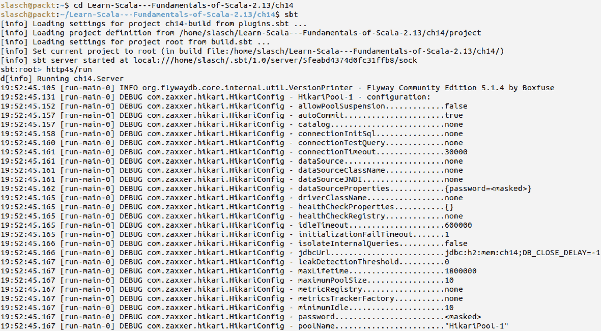
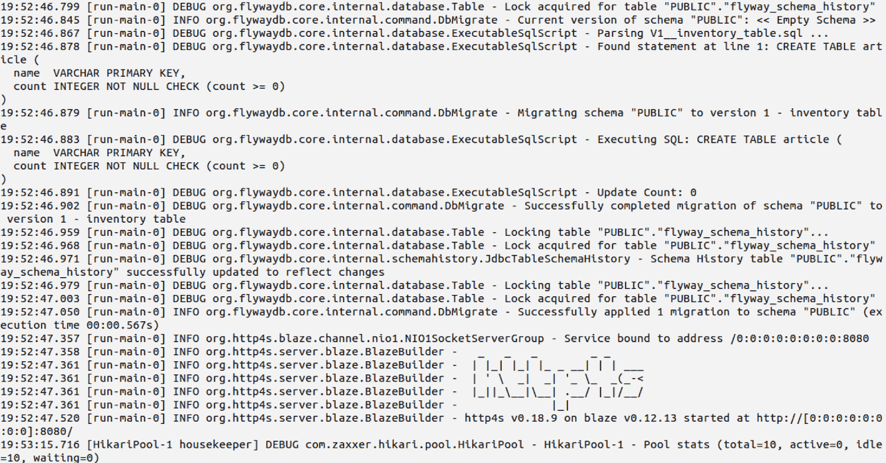
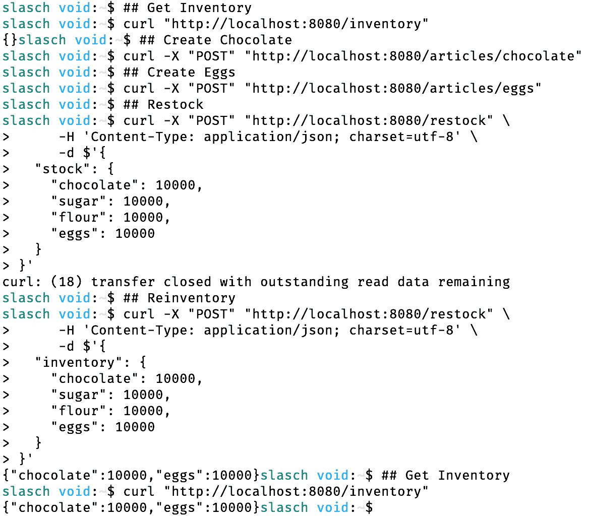
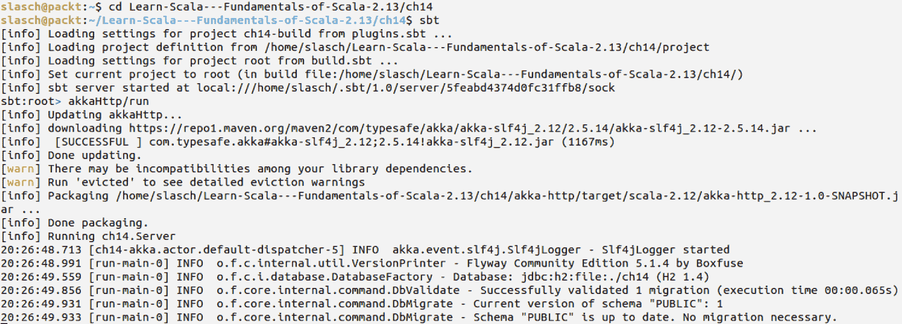
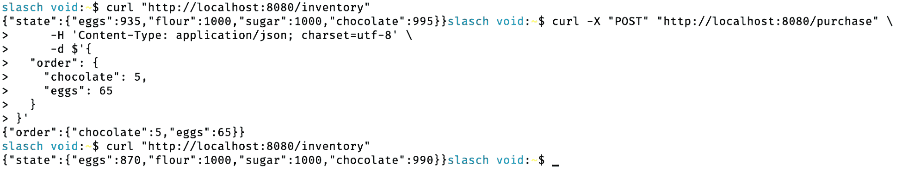

# 第十四章：项目 1 - 使用 Scala 构建微服务

在本书中，我们逐渐扩大了我们的兴趣范围。在第一部分，我们从语言结构和小型构建块开始，例如类型和函数。在第二部分，我们专注于函数式编程的模式。在第三部分，我们探讨了更大的抽象——actor 模型和流。

在本节中，我们将再次放大视角，这次从设计层面上升到架构层面。我们将利用到目前为止所学的内容来构建两个全面的项目。

现在，不言而喻，所有服务器端软件都应该提供 API，特别是 HTTP RESTful API。提供 API 的软件被称为**服务**，如果它符合一系列原则，通常被称为**微服务**。我们将跟随潮流，将我们的项目设计为微服务。

在本章中，我们将涵盖两个主题。首先，我们将讨论微服务的概念，描述其优势和构建原则。我们还将探讨与基于微服务的方法相关的几个技术和组织挑战。

第二，我们将利用本书其余部分获得的知识，从头开始构建两个真实项目。这两个项目都代表了简单的微服务，实现了有状态的 REST API，这些 API 代表了你在本书第三部分熟悉的杂货店。这次，我们不仅提供下单的机会，还可以创建和删除商品，以及补充库存并获取当前库存状态。

第一个项目将基于本书第二部分介绍的原则构建。我们将使用开源函数式编程库——http4s 和 circe 用于客户端 API，以及 doobie 用于数据库访问。

第二个项目将使用本书第三部分涵盖的响应式编程库和技术构建。我们将使用 Akka-HTTP 构建 API 层，并使用 Akka Persistence 实现其有状态的部分。

本章将涵盖以下主题：

+   微服务基础

+   使用 http4s 的纯函数式 HTTP API

+   使用 doobie 的纯函数式数据库访问

+   使用 Http1Client 进行 API 集成测试

+   使用 Akka-HTTP 的响应式 HTTP API

+   使用 Akka Persistence 的事件源持久状态

# 技术要求

在我们开始之前，请确保您已安装以下内容：

+   SBT 1.2+

+   Java 1.8+

本章的源代码可在 GitHub 上找到：[`github.com/PacktPublishing/Learn-Scala-Programming/tree/master/Chapter14`](https://github.com/PacktPublishing/Learn-Scala-Programming/tree/master/Chapter14)。

# 微服务基础

讨论微服务时，最好从大小问题开始。显然，软件系统的大小在满足用户日益增长的需求时也在增长。功能数量、它们的复杂性和复杂性都在增长，软件项目中的代码行数也在增加。即使在结构良好的活系统中，组件的大小和数量也会随着时间的推移而增加。鉴于有限的人类心智能力，单个程序员所能理解的系统比例会缩小，这导致团队中开发人员数量的增加。更大的团队规模会导致通信开销的增加，从而减少编写代码的时间，导致需要更多的开发人员，这引入了一个自我强化的循环。

因此，将系统作为单一项目构建的传统单体方式，即使用单一部署模块或可执行文件和单一数据库，正变得越来越低效，最终使得及时交付可工作的软件变得不可能。一种替代方法是，将单体拆分为独立的项目，称为微服务，这些项目可以独立开发。

微服务似乎是单体方法的唯一可行替代方案，因此越来越受欢迎。但是，它们究竟是什么？根据[`microservices.io`](http://microservices.io)，微服务，也称为微服务架构，是一种将应用程序结构化为一系列松散耦合的服务，这些服务实现业务能力。

这意味着什么？本质上，这就是如果将结构良好的应用程序拆分，并从每个负责单一业务功能的模块中创建一个自主应用程序会发生的情况。

在这个定义中，“自主性”适用于多个层面：

+   **代码库和技术栈**：服务的代码不应与其他服务共享。

+   **部署**：服务在时间和底层基础设施方面都是独立于其他服务的。

+   **状态**：服务拥有自己的持久存储，其他服务访问数据的唯一方式是通过调用拥有该数据的服务。

+   **故障处理**：预期微服务具有弹性。在下游服务出现故障的情况下，预期相关服务将隔离故障。

这些自主性方面使我们能够从基于微服务的架构中获得许多好处：

+   即使对于非常复杂的应用程序，持续交付也是可行的

+   每个服务的复杂性都很低，因为它仅限于单一业务能力

+   独立部署意味着具有不同负载的服务可以独立扩展

+   代码无关性使得多语言环境成为可能，并使得采用新技术更加容易

+   团队可以缩小规模，这减少了通信开销并加快了决策速度

当然，这种方法也有缺点。最明显的缺点与微服务需要相互通信的事实有关。以下是几个重要的困难：

+   习惯性事务不可用

+   调试、测试和跟踪涉及多个微服务的调用

+   复杂性从单个服务转移到它们之间的空间

+   服务位置和协议发现需要大量努力

但不要害怕！在本章的剩余部分，我们只构建一个微服务，这样我们就不会受到这些弱点的困扰。

# 使用 http4s 和 doobie 构建微服务

让我们看看，如果使用基于本书前两章所学的原则的开源库来实现，一个具有 RESTful 接口的微服务将是什么样子。

我们将从讨论构成应用程序的基本构建块以及它们如何连接在一起开始。说到块，我们需要简要地谈谈 FS2 库，它是我们将使用的其他库的基础，因此它决定了我们如何将它们组合在一起。之后，我们将讨论数据库迁移、项目配置、数据库逻辑的实现以及服务层。当然，我们将通过为我们构建的服务实现集成测试来结束我们的讨论。

# 项目结构

我们的项目将包括以下组件：

+   数据库仓库代表数据库上的一个抽象层

+   数据库迁移器包含数据库表的初始化逻辑

+   REST API 定义了可用的 HTTP 调用和相关业务逻辑

+   配置合并了应用程序参数，例如服务器绑定和数据库属性

+   服务器将所有其他组件连接在一起，并在配置的地址上启动和绑定 HTTP 服务器

我们首先将以下依赖项添加到`build.sbt`（确切版本可以在 GitHub 仓库中找到）：

```java
libraryDependencies ++= Seq(
  "org.http4s" %% "http4s-blaze-server" % http4sVersion,
  "org.http4s" %% "http4s-circe" % http4sVersion,
  "org.http4s" %% "http4s-dsl" % http4sVersion,
  "org.tpolecat" %% "doobie-core" % doobieVersion,
  "org.tpolecat" %% "doobie-h2" % doobieVersion,
  "org.tpolecat" %% "doobie-hikari" % doobieVersion,
  "com.h2database" % "h2" % h2Version,
  "org.flywaydb" % "flyway-core" % flywayVersion,
  "io.circe" %% "circe-generic" % circeVersion,
  "com.github.pureconfig" %% "pureconfig" % pureConfigVersion,
  "ch.qos.logback" % "logback-classic" % logbackVersion,
  "org.typelevel" %% "cats-core" % catsVersion,

  "org.http4s" %% "http4s-blaze-client" % http4sVersion % "it,test",
  "io.circe" %% "circe-literal" % circeVersion % "it,test",
  "org.scalatest" %% "scalatest" % scalaTestVersion % "it,test",
  "org.scalamock" %% "scalamock" % scalaMockVersion % Test
)
```

这个列表肯定比您期望的示例项目要长。让我们仔细检查为什么我们需要将其中的每个依赖项都放入其中：

+   http4s 是我们将用于 HTTP 层的库

+   doobie 是一个功能性的 JDBC（Java 数据库连接）装饰器

+   H2 是一个嵌入式数据库，我们将使用它来避免安装独立实例

+   Flyway 用于数据库迁移（用于更改数据库结构的版本化 SQL 语句）

+   Circe 是一个 JSON 瑞士军刀

+   `PureConfig`是一个类型化配置包装器

+   `Cats`是一个包含通用函数式编程抽象的库

# FS2 – 功能流

您可能想知道，如果我们不将 FS2 库作为应用程序的组件使用，为什么我们还要有一个关于 FS2 库的部分。实际上，我们是。它是我们使用的数据库和 HTTP 库的底层构建块，因此简要讨论它对于您了解其他构建块是如何连接在一起的是很重要的。

[FS2](https://github.com/functional-streams-for-scala/fs2)是一个流库，允许我们构建和转换复杂的流。FS2 中的流不仅包含元素，还可以体现效果，如 IO。这个特性使得几乎可以将任何东西描述为 FS2 流。像`http4s`和`doobie`这样的库建立在它之上，并为用户提供更高级别的 API。但这个 API 仍然是流式的。

流被表示为`Stream[F,O]`，其中`F`描述了流的可能效果，`O`是其元素或输出的类型。为了完全指定它，需要给出两个类型参数。如果流没有效果，它将是纯的：`Stream[Pure, O]`。

让我们构建一个`chars`流：

```java
val chars: fs2.Stream[fs2.Pure,Char] = Stream.emits(List('a','b','c'))
```

纯流可以在不评估的情况下转换为`List`或`Vector`：`chars.toList`

由于存在效果，带有效果的数据流不能以相同的方式进行转换。首先需要将效果*减少*到单个效果。同时，我们需要定义如何处理流的输出。最后，我们可以执行效果并获得流的输出。这个过程类似于我们在第十三章中看到的 Akka 流的定义和具体化，*Akka Streams 基础*。因为我们有很多东西要定义，所以语法有点繁琐，但它反映了我们描述的逻辑：

```java
object Test extends App {
  import fs2.Stream
  import cats.effect.IO // 1
  val io: IO[String] = IO { println("IO effect"); "a" * 2 } // 2
  val as: Stream[IO, String] = Stream.eval(io) // 3
  val c: Stream.ToEffect[IO, String] = as.compile // 4
  val v: IO[Vector[String]] = c.toVector // 5
  val l: IO[List[String]] = c.to[List] // 6
  val d: IO[Unit] = c.drain // 7
  val e: IO[Option[String]] = c.last // 8
  println(v.unsafeRunSync()) // 9
  println(e.unsafeRunSync()) // 10
  Stream.eval(IO { 42 }).compile.toList.unsafeRunSync() // 11
}
```

让我们逐行分析这个片段，看看发生了什么。代码中的数字将对应于以下解释中的数字：

1.  我们使用 cats 的`IO`作为效果的类型。

1.  我们将`IO`定义为带名称的参数，用于写入控制台并返回`aa`。

1.  我们`eval`我们的`IO`。这创建了一个单元素流。

1.  通过编译流，我们创建其投影到单个效果。

1.  通过将`ToEffect`投影转换为`Vector`，它被编译为预期的效果类型。这个过程可以被视为执行一系列效果并将发出的结果记录到所需的结构中。

1.  我们展示了另一种定义转换为集合的方法。

1.  `drain`用于丢弃任何发出的值，如果我们只对执行效果感兴趣，它非常有用。

1.  还有其他可能性来定义应该对流的输出元素做什么，例如，只收集最后一个。

1.  `unsafeRunSync()`运行定义，同步产生效果并发出输出。这是第一次在控制台出现任何内容，因为我们到目前为止只是创建和修改了流的定义。

1.  定义是不可变的，可以共享。正因为如此，我们可以多次运行相同的流描述（相对于效果类型）。

1.  所有这些通常都定义为一行：评估效果，将流编译为单个效果，定义元素的输出类型，稍后运行流。

现在让我们看看 `http4s` 和 `doobie` 如何利用 FS2。我们将从数据库层开始，因为它的实现将指导其他层的结构。

# 数据库迁移

为了使数据库能够在应用程序中使用，它需要包含所有必需的表、索引和其他定义。

我们将我们的存储表示为一个简单的表，其中项目的名称作为主键，每个项目的非负计数：

```java
CREATE TABLE article (
  name  VARCHAR PRIMARY KEY,
  count INTEGER NOT NULL CHECK (count >= 0)
);
```

我们将这个定义放入 `db_migrations/V1__inventory_table.sql`，并使用 Flyway 在启动时检查我们的数据库是否处于正确的状态。

Flyway 通过遵循特定的命名约定，将数据库模式迁移 SQL 放置在项目文件夹中，提供了一种机制来定义和更改数据库模式。您可以在[`flywaydb.org`](https://flywaydb.org)了解更多相关信息。

Flyway 迁移的代码非常简单：

```java
def initialize(transactor: HikariTransactor[IO]): IO[Unit] = {
  transactor.configure { dataSource =>
    IO {
      val flyWay = new Flyway()
      flyWay.setLocations("classpath:db_migrations")
      flyWay.setDataSource(dataSource)
      flyWay.migrate()
    }
  }
}
```

给定一个 `transactor`（我们将在稍后进行描述，目前我们将讨论 `doobie`），我们使用它提供的数据源来创建一个 `Flyway` 实例，配置它使用适当的迁移位置，并执行迁移。请注意，初始化逻辑被封装在 `IO` 效应中，因此延迟到效应被评估时。

使用 doobie 提供的实用工具创建 transactor：

```java
def transactor(c: DBConfig): IO[HikariTransactor[IO]] = {
  HikariTransactor
   .newHikariTransactorIO
}
```

再次封装在 `IO` 中，因此直到我们运行此函数的结果，不会有任何效应被评估。

在我们转到数据库仓库的定义之前，让我们快速看一下我们在 `transactor` 方法中使用的配置抽象。

# 使用 PureConfig 进行配置

我们已经熟悉 Typesafe Config 库，我们在面包店示例中积极使用了它。这是一个非常有用且灵活的库。不幸的是，由于这种灵活性，它有一个缺点：每个配置位都需要单独读取并转换为适当的类型。理想情况下，我们希望我们的配置以案例类的形式表示，并依赖于命名约定将配置文件的结构映射到应用程序中（有类型的）配置结构。理想情况下，我们希望在启动时快速失败，如果配置文件无法映射到代码级别的配置描述的案例类。

`pureconfig` 库使得这一点成为可能。这个库可以在[`github.com/pureconfig/pureconfig`](https://github.com/pureconfig/pureconfig)找到。

使用它，我们可以在 Scala 中定义配置结构，如下所示：

```java
case class ServerConfig(host: String, port: Int)
case class DBConfig(driver: String, url: String, user: String, password: String)
case class Config(server: ServerConfig, database: DBConfig)
```

这个定义反映了 [HOCON](https://github.com/lightbend/config/blob/master/HOCON.md) 格式中的配置结构：

```java
server {
  host = "0.0.0.0"
  port = 8080
}
database {
  driver = "org.h2.Driver"
  url = "jdbc:h2:mem:ch14;DB_CLOSE_DELAY=-1"
  user = "sa"
  password = ""
}
```

现在，我们可以使用 `pureconfig` 直接将其加载并映射到案例类：

```java
object Config {
  def load(fileName: String): IO[Config] = {
    IO {
      val config = ConfigFactory.load(fileName)
      pureconfig.loadConfigConfig
    }.flatMap {
      case Left(e) =>
        IO.raiseErrorConfig)
      case Right(config) =>
        IO.pure(config)
    }
  }
}
```

再次封装在 `IO` 中，因此延迟，我们正在尝试加载和映射配置，并在 `IO` 的上下文中引发适当的错误，如果这个尝试失败。

配置位完成了示例的基础设施部分，我们最终可以转向核心——数据库仓库。

# Doobie – 函数式数据库访问

在我们的例子中，数据库层是用 Doobie 库实现的。它的官方网站将其描述为*Scala 和 Cats 的纯函数式 JDBC 层*。它允许我们以优雅的函数式方式抽象现有的 JDBC 功能。让我们看看这是如何实现的。该库可以在[`tpolecat.github.io/doobie/`](https://tpolecat.github.io/doobie/)找到。在以下示例中，请假设以下导入是有效的：

```java
import cats.effect.IO
import fs2.Stream
import doobie._
import doobie.implicits._
import doobie.util.transactor.Transactor
import cats.implicits._
```

我们还需要一些模型类来持久化，为了示例的目的，我们将 ADT 保持尽可能小：

```java
object Model {
  type Inventory = Map[String, Int]
  abstract sealed class Operation(val inventory: Inventory)

  final case class Purchase(order: Inventory)
      extends Operation(order.mapValues(_ * -1))

  final case class Restock(override val inventory: Inventory)
      extends Operation(inventory)
}
```

这个模型将允许我们以映射的形式表示我们商店的库存，键指的是文章名称，值表示相应物品的库存数量。我们还将有两个可以应用于库存的操作——购买操作将减少相应物品的数量，而补货操作将通过组合我们的现有库存来增加相应物品的数量。

现在我们可以为这个模型定义我们的仓库。我们将以之前相同纯函数的方式来做这件事：

```java
class Repository(transactor: Transactor[IO]) { ... }
```

仓库被赋予`Transactor[IO]`作为构造参数。在这个例子中，`IO`是`cats.effect.IO`。事务处理者知道如何与数据库连接一起工作。它可以以与连接池相同的方式管理连接。在我们的实现中，`Transactor`被用来将 FS2 的`Stream[IO, ?]`转换为`IO`，如果运行，它将连接到数据库并执行 SQL 语句。让我们详细看看这是如何为文章创建完成的：

```java
def createArticle(name: String): IO[Boolean] = {
  val sql: Fragment = sql"INSERT INTO article (name, count) VALUES ($name, 0)"   // 1
  val update: Update0 = sql.update  // 2
  val conn: ConnectionIO[Int] = update.run //3
  val att: ConnectionIO[Either[Throwable, Int]] = conn.attempt //4
  val transact: IO[Either[Throwable, Int]] = att.transact(transactor) // 5
  transact.map { // 6
    case Right(affectedRows) => affectedRows == 1
    case Left(_)             => false
  }
}
```

让我们逐行查看这个定义，看看这里发生了什么：

1.  我们定义了一个`Fragment`，它是一个可以包含插值值的 SQL 语句。片段可以组合在一起。

1.  从`Fragment`，我们构建了一个`Update`。`Update`可以用来稍后构建一个`ConnectionIO`。

1.  我们通过在`update`上调用`run`方法来构建一个`ConnectionIO`。`ConnectionIO`基本上是对 JDBC 连接上可能进行的操作的一种抽象。

1.  通过调用`attempt`方法，我们在`ConnectionIO`中添加了错误处理。这也是为什么`ConnectionIO`的类型参数从`Int`变为`Either[Throwable, Int]`的原因。

1.  通过向`transact`方法提供一个`transactor`，我们将`ConnectionIO`转换为`IO`，这代表了一个可运行的 doobie 程序。

1.  我们将`Either`的不同方面强制转换为单个布尔值。我们期望创建的行数正好为一行，在这种情况下，调用是成功的。如果我们未能创建行或抛出了异常，则视为失败。

在错误情况下，区分*唯一索引或主键违反*和其他情况可能更合适，但不幸的是，不同的数据库驱动程序对这一点的编码不同，因此无法提供简洁的通用实现。

我们仓库中的其他方法将遵循相同的模式。`deleteArticle`是一个单行代码，我们在这个情况下不处理错误（异常将向上层冒泡，并在抛出时传播给客户端），所以我们只需检查受影响的行数是否正好为一：

```java
def deleteArticle(name: String): IO[Boolean] =
sql"DELETE FROM article WHERE name = $name"
.update.run.transact(transactor).map { _ == 1 }
```

`getInventory`有点不同，因为它需要返回查询的结果：

```java
def getInventory: Stream[IO, Inventory] = {
  val query: doobie.Query0[(String, Int)] = 
      sql"SELECT name, count FROM article".query[(String, Int)]
  val stream: Stream[IO, (String, Int)] = 
      query.stream.transact(transactor)
  stream.fold(Map.empty[String, Int])(_ + _)
}
```

在这里，我们看到查询是`doobie.Query0[(String, Int)]`类型，类型参数表示结果列的类型。我们通过调用`stream`方法将查询转换为`Stream[ConnectionIO, (String, Int)]`（一个带有`ConnectionIO`效果类型和元组作为元素类型的 FS2 流），然后通过提供一个事务转换器将`ConnectionIO`转换为`IO`。最后，我们将流中的元素折叠到`Map`中，从而从单个行构建当前时刻的库存状态。

更新库存还有一个需要注意的地方。我们希望一次性更新多个文章，这样如果某些文章的供应不足，我们就放弃整个购买。

这是一个设计决策。我们可以决定将部分完成的订单返回给客户。

每个文章的计数都需要单独更新，因此我们需要在单个事务中运行多个更新语句。这是如何实现的：

```java
def updateStock(inventory: Inventory): Stream[IO, Either[Throwable, Unit]] = {
  val updates = inventory.map { case (name, count) =>
      sql"UPDATE article SET count = count + $count WHERE name = $name".update.run
  }.reduce(_ *> _)
  Stream
    .eval(
      FC.setAutoCommit(false) *> updates *> FC.setAutoCommit(true)
    )
    .attempt.transact(transactor)
}
```

我们得到一个`name -> count`对的映射作为参数。我们首先将这些对中的每一个转换为更新操作，通过映射它们。这给我们留下了一个`CollectionIO[Int]`的集合。然后我们使用 cats 的`Apply`操作符将这些更新组合在一起，它产生一个单一的`CollectionIO[Int]`。

JDBC 默认启用自动提交，这将导致我们的批量更新逐个执行和提交。这可能导致部分完成的订单。为了避免这种情况，我们将更新包装到流中，这将禁用在更新之前自动提交，并在所有更新执行完毕后再次启用自动提交。然后我们提升结果的错误处理，并将其转换为之前的可运行`IO`。

该方法的结果是`Stream[IO, Either[Throwable, Unit]]`类型。流中元素的类型编码了两种可能性：由于库存中文章不足而无法进行的更新作为`Left`，以及成功的更新作为`Right`。

通过这四个方法，我们实际上拥有了所有必需的基本功能，并可以开始在 API 层使用它们。

# http4s – 流式 HTTP

我们项目中 HTTP 接口的实现基于 http4s ([`http4s.org`](https://http4s.org))库。http4s 建立在 FS2 和 Cats IO 之上，因此我们与使用 doobie 实现的持久层有很好的交互。使用 http4s，我们可以使用高级 DSL 构建功能性的服务器端服务，也可以在客户端调用 HTTP API。我们将在本章后面使用客户端功能来构建我们的 API 的集成测试。

服务器端由`HttpService[F]`表示，这本质上只是从`Request`到`F[Response]`的映射，在我们的情况下`F`是 cats 的`IO`。http4s DSL 通过使用模式匹配帮助构建这样的 RESTful 服务。

这是在实际中的样子。首先我们需要为`fs2`和`IO`，以及 http4s DSL 和 circe 添加以下导入，并将它们放入作用域：

```java
import cats.effect.IO
import fs2.Stream
import org.http4s._
import org.http4s.dsl.Http4sDsl
import org.http4s.circe._
import org.http4s.headers.`Content-Type`
import io.circe.generic.auto._
import io.circe.syntax._
```

在这些导入就绪后，我们可以开始构建我们的服务定义：

```java
class Service(repo: Repository) extends Http4sDsl[IO] { ... }
```

该服务以数据库存储库作为参数提供。

对于每个 HTTP 动词和 URL 模板，路由被单独定义。我们首先定义服务方法，该方法从请求到响应接收一个部分函数：

```java
val service: HttpService[IO] = HttpService[IO] {
```

然后我们继续使用简单的文章删除路由：

```java
case DELETE -> Root / "articles" / name if name.nonEmpty =>
  val repoResult: IO[Boolean] = repo.deleteArticle(name)
  val toResponse: Boolean => IO[Response[IO]] = if (_) NoContent() else NotFound()
  val response: IO[Response[IO]] = repoResult.flatMap(toResponse)
  response
```

在这里，我们使用`http4s` DSL 来分解`Request`为部分，并对这些部分进行模式匹配。`->`对象从请求中提取路径，`/`类允许我们表示请求 URL 的子路径的连接（还有`/:`，它匹配从应用点开始的 URL 到 URL 的末尾）。模式匹配本身只是一个普通的 Scala case，因此我们可以使用其全部功能。在这种情况下，我们将 URL 的最后一部分映射到`name`，并有一个保护者来确保只有当`name`不为空时路径才匹配（因为我们不希望在商店中拥有匿名文章！）。

函数的预期结果是`IO[Response[IO]]`类型。幸运的是，我们存储库的`deleteArticle`方法的返回类型是`IO[Boolean]`，因此我们可以在`IO`内部将返回的布尔值`flatMap`到响应体中。在这种情况下，我们不想响应体，只想通知调用者操作的成功，这通过相应的响应代码表示：`204 No Content`和`404 Not Found`。http4s 提供了一个带有一些冗长类型的良好构造函数：`IO[Response[IO]]`。在我们的情况下，我们定义一个从`Boolean`到这种类型的函数，并使用这个函数`flatMap`存储库调用的结果，这样我们最终得到`IO[Response[IO]]`作为最终结果，这正是预期返回的类型。

当然，所有这些逻辑都可以以简洁的方式编写。以下是一个创建文章 API 调用的示例：

```java
case POST -> Root / "articles" / name if name.nonEmpty =>
  repo.createArticle(name).flatMap { if (_) NoContent() else Conflict() }
```

这种方法与我们之前用于文章删除的方法完全相同。

我们正在构建的 API 不是一个原则上的 RESTful API。为了使这个例子成为一个有效的二级 API，我们还需要实现一个`GET`调用，用于检索单个商品的表示。这可以通过向仓库添加相应的方法和在服务中添加一个`case`来实现。实现留给读者作为练习。

现在我们已经在仓库中创建了一些文章，我们希望能够检索其当前状态。我们可以按以下方式实现：

```java
case GET -> Root / "inventory" =>
  val inventory: Stream[IO, Inventory] = repo.getInventory
  renderInventory(inventory)
```

上述模式匹配很简单，调用仓库的`getInventory`方法也是如此。但它返回的是`Stream[IO, Inventory]`类型的结果，我们需要将其转换为`HttpService[IO]`匹配的类型。`http4s`有一个名为`EntityEncoder`的概念来处理这个问题。

下面是相应的实现：

```java
private def renderInventory(inventory: Stream[IO, Inventory]): IO[Response[IO]] = {
  val json: Stream[IO, String] = inventory.map(_.asJson.noSpaces)
  val response: IO[Response[IO]] = 
           Ok(json, `Content-Type`(MediaType.`application/json`))
  response
}
```

在这里，我们通过将返回的`Map[String, Int]`转换为 JSON 来准备库存以表示为 HTTP 响应。我们依赖于 circe ([`github.com/circe/circe`](https://github.com/circe/circe))来完成自动转换。接下来，通过`Ok`状态构造函数和一个隐式的`EntityEncoder[IO, String]`，流被转换为适当的响应类型。我们明确地将响应的内容类型强制设置为`application/json`，以确保它正确地在响应中表示。

最后，我们希望提供一种修改库存状态的方法，就像我们处理仓库时做的那样。我们将实现两个 API 调用，一个用于补充库存，另一个用于购买。它们的实现方式相似，所以我们只介绍其中一个；另一个可以在[GitHub](https://github.com/PacktPublishing/Learn-Scala---Fundamentals-of-Scala-2.12/blob/master/ch14/http4s-doobie/src/main/scala/ch14/Service.scala#L22)仓库中找到。以下是补充调用的实现：

```java
case req @ POST -> Root / "restock" =>
  val newState = for {
    purchase <- Stream.eval(req.decodeJson[Restock])
    _ <- repo.updateStock(purchase.inventory)
    inventory <- repo.getInventory
  } yield inventory
  renderInventory(newState)
```

我们需要一个请求来读取其主体，因此我们在模式匹配中将它绑定到`req`变量。接下来，我们解码请求的 JSON 主体并将其映射到我们的模型。在这里，我们再次依赖于 circe 来完成繁重的工作。`updateStock`仓库方法返回流，因此我们需要将我们的参数放在相同的上下文中，以便我们能够在`for` comprehension 中优雅地使用它。我们通过将解码的结果包装在`Stream.eval`中来完成这个操作。

然后我们调用仓库，并以`Inventory`的形式提供所需的变化。该方法返回`Stream[IO, Either[Throwable, Unit]]`，所以我们忽略结果（在发生错误的情况下，它将缩短 for comprehension）。最后，我们读取仓库的新状态，并像以前一样将其呈现给调用者。

读写后是已知数据库反模式。我们使用这种方法来说明如何在 for comprehension 中优雅地链式调用流式调用。在实际项目中，可能最好以某种方式编写 SQL 语句，以便在更新后立即返回新状态。

服务层现在已经实现。我们可以将我们的应用程序连接起来，看看它的工作情况。

# 整合一切

服务器代码除了我们常用的集合外，还需要一些新的导入：

```java
import org.http4s.server.blaze.BlazeBuilder
import scala.concurrent.ExecutionContext.Implicits.global

```

`BlazeBuilder`是一个服务器工厂，`ExecutionContext`将在我们启动服务器时被需要。服务器定义如下：

```java
object Server extends StreamApp[IO] { ... }
```

`StreamApp`要求我们实现一个`stream`方法，其唯一目的是产生副作用，并为这个流提供清理钩子。这是我们的实现：

```java
override def stream(args: List[String],
           requestShutdown: IO[Unit]): Stream[IO, ExitCode] = {
  val config: IO[Config] = Config.load("application.conf")
  new ServerInstance(config).create().flatMap(_.serve)
}
```

我们只是读取了配置，并将实际服务器的创建委托给了`ServerInstance`。让我们看看它：

```java
class ServerInstance(config: IO[Config]) {
  def create(): Stream[IO, BlazeBuilder[IO]] = {
    for {
      config <- Stream.eval(config)
      transactor <- Stream.eval(DB.transactor(config.database))
      _ <- Stream.eval(DB.initialize(transactor))
    } yield BlazeBuilder[IO]
      .bindHttp(config.server.port, config.server.host)
      .mountService(new Service(new Repository(transactor)).service, "/")
  }
}
```

这里我们又看到了相同的方法：我们将`config`提升到`Stream`的上下文中，创建一个 transactor，初始化数据库，从 transactor 和 repository 构建仓库，并从 repository 构建服务，最后使用`BlazeBuilder`工厂挂载服务。

调用方法将执行服务器的`serve`方法，启动我们迄今为止构建的整个 IO 程序。

在构建这个例子时，我们遵循了一个提供依赖项的模式——我们在构建类实例的时刻将它们作为构造函数参数给出。将依赖项作为构造函数参数传递的方法在 Scala 中被称为基于构造函数的依赖注入。

现在我们的应用程序可以启动并使用了。但我们想通过测试来确保它的行为是正确的。

# 测试

这个例子相当简单，基本上只是数据库上的一个 HTTP 门面，所以我们不会单独测试组件。相反，我们将使用集成测试来检查整个系统。

为了让 SBT 正确识别我们的集成测试，我们需要在`build.sbt`中添加适当的配置。请参考 GitHub 上的代码章节([`github.com/PacktPublishing/Learn-Scala-Programming`](https://github.com/PacktPublishing/Learn-Scala-Programming))，了解如何完成此操作。

在我们的集成测试中，我们将让我们的系统正常运行（但使用测试数据库），并使用 HTTP 客户端调用 API 并检查它将返回的响应。

首先，我们需要准备我们的 HTTP 客户端和服务器：

```java
class ServerSpec extends WordSpec with Matchers with BeforeAndAfterAll {
  private lazy val client = Http1Client[IO]().unsafeRunSync()
  private lazy val configIO = Config.load("test.conf")
  private lazy val config = configIO.unsafeRunSync()
  private val server: Option[Http4sServer[IO]] = (for {
    builder <- new ServerInstance(configIO).create()
  } yield builder.start.unsafeRunSync()).compile.last.unsafeRunSync()
```

在这里，我们创建了一个客户端，我们将使用它来查询我们的 API，通过实例化`http4s`库提供的`Http1Client`。我们还读取了一个测试配置，它覆盖了数据库设置，这样我们就可以自由地修改数据。我们使用的是内存中的 H2 数据库，测试完成后将被销毁，这样我们就不需要在测试后清理状态。然后我们通过重新使用`ServerInstance`来构建服务器。与生产代码相比，我们使用`start`方法启动它，该方法返回一个服务器实例。测试后，我们将使用此实例来关闭服务器。

请注意我们如何在多个地方使用`unsafeRunSync()`来评估`IO`的内容。对于服务器，我们甚至做了两次，一次用于`IO`，一次用于`Stream[IO, ...]`。在测试代码中这样做是可以的，因为它有助于保持测试逻辑简洁。

测试完成后，我们需要关闭客户端和服务器：

```java
override def afterAll(): Unit = {
  client.shutdown.unsafeRunSync()
  server.foreach(_.shutdown.unsafeRunSync())
}
```

再次，我们在这里运行 IO，因为我们希望立即发生关闭操作。

现在，让我们看看其中一个测试方法：

```java
"create articles" in {
  val eggs = RequestIO)
  client.status(eggs).unsafeRunSync() shouldBe Status.NoContent
  val chocolate = RequestIO)
  client.status(chocolate).unsafeRunSync() shouldBe Status.NoContent
  val json = client.expectJson.unsafeRunSync()
  json shouldBe json"""{"eggs" : 0,"chocolate" : 0}"""
}
```

在这里，我们首先使用 http4s 提供的工厂创建一个测试请求。然后我们检查如果使用本节中较早创建的客户端发送此请求，API 是否返回正确的`NoContent`状态。然后我们使用相同的方法创建第二个文章。

最后，我们使用客户端直接调用 URL，并让它解析 JSON 格式的响应。最后，我们通过将 JSON 响应与 circe 的 JSON 字面量进行比较来检查库存是否处于正确状态。

对于测试其他 API 调用，我们也可以使用 circe JSON 字面量提供请求体。请参阅 GitHub 上放置的章节源代码，以了解如何实现这一点。

完全可以使用其他 HTTP 客户端或甚至命令行工具实现相同的测试逻辑。`http4s`提供的`Http1Client`允许有很好的语法和简洁的期望定义。

# 运行应用程序

运行我们的 API 最简单的方法是在 SBT shell 中执行`run`命令。本章的项目配置为一个多模块 SBT 项目。因此，`run`命令必须以模块名称为前缀，以便完全拼写为`http4s/run`，如下一张截图所示：



我们 API 的不同组件将输出大量信息。应用程序在显示 HTTP 服务器的地址后启动。您可以在下一张截图的底部看到它的样子：



之后，API 应该能够处理 HTTP 请求，例如，在另一个终端窗口中使用 curl 发出的请求，如下截图所示：



由于我们的示例使用的是内存数据库，它将在重启后丢失其状态。

# 使用 Akka-HTTP 和 Akka Persistence 构建微服务

现在我们已经看到了实现微服务的原则功能方法的工作原理，让我们改变我们的技术栈，并使用 Akka-HTTP 和 Akka Persistence 实现相同的商店。这个例子讨论的流程将与关于功能方法的讨论类似——我们将从查看服务状态持久化的方式以及所需的配置开始。然后我们将解决实际持久化数据和通过 HTTP 服务提供访问的任务。像以前一样，我们将通过测试我们将要提出的实现来结束我们的旅程。

# 项目结构

在这种情况下，项目结构几乎与之前相同。

我们将有一个负责与 HTTP 客户端交互的 API 层。我们不可避免地会有一些配置和数据库初始化代码，这些代码将以与我们构建先前微服务时类似或相同的方式进行实现。

持久化层将由持久化 actor 表示。这将影响模型定义以及数据库表的结构。

Akka Persistence 介绍了不同的系统状态存储和表示范式。这种方法被称为**事件溯源**，花一分钟讨论它是有意义的。

# 事件溯源和 CQRS

事件溯源是关于系统状态如何存储的。通常，系统状态作为一系列相关表持久化到数据库中。状态的变化通过修改、添加或删除表行在数据库中体现。采用这种方法，数据库包含系统的当前状态。

事件溯源提供了一种替代方法。它处理状态更新的方式与函数式编程处理效果的方式非常相似。它不是执行计算，而是描述它，以便稍后执行。计算的描述可以像本书的第二部分所看到的那样组合。同样，状态的变化可以在事件溯源方法中组合，以产生当前状态。本质上，事件溯源对于状态，就像函数式编程对于计算和效果一样。

这种状态变化的描述被称为**事件**，通常（但不一定！）对应于某些用户操作，称为**命令**。系统接收命令，验证它们，如果命令在当前系统状态下有意义，则创建相应的事件并将其持久化到事件日志中。然后，事件应用于状态的内存表示，并执行所需的副作用。

当事件溯源的系统重新启动时，事件从日志中读取并逐个应用于初始状态，修改它但不执行副作用。最后，在所有事件应用完毕后，系统的内部状态应该与重启前相同。因此，*事件*是这种场景下系统状态表示的*来源*。重构的状态通常只代表整个系统的一个方面，被称为**视图**。

事件日志仅用于追加事件。因此，它通常被视为只追加存储，并且经常使用除关系数据库之外的其他解决方案。

CQRS 是与事件溯源紧密相关的另一个名称。这是命令查询责任分离（Command Query Responsibility Segregation）的缩写，它反过来又是一种用命令和查询实体（而不是方法调用）实现 *命令-查询分离* 原理的优雅命名方式。CQS 原则指出，每个方法应该是 *命令*，它修改状态，或者 *查询*，它返回状态，并且这些责任不应混合。在事件溯源中，这种分离自然地从 *事件* 的定义（在 CQS 定义中是命令）和内部状态作为需要单独查询的 *视图* 的概念中产生。

与传统的数据库突变方法相比，事件溯源有许多优势：

+   仅追加方式存储数据比传统的数据库扩展性更好。

+   事件免费提供审计、可追溯性和在特殊存储中的安全性。

+   不需要使用 ORM。

+   领域模型和事件模型可以以不同的速度发展。

+   可以将系统状态恢复到过去任何特定时刻。

+   事件可以以不同的方式组合，使我们能够构建不同的状态表示。结合先前的优势，它赋予我们以当时事件创建时未知的方式分析过去数据的能力。

当然，也有一些缺点：

+   状态不存在，直到它从事件中重建。根据日志的格式，可能甚至无法在不为这个目的编写特殊代码的情况下分析事件。无论如何，从事件中构建状态表示都需要一些努力。

+   在复杂项目中领域模型的爆炸性增长。实现新的用例总是需要引入新的命令和事件。

+   随着项目的演变，模型的变化。现有用例的变化通常意味着现有事件结构的改变，这需要在代码中完成，因为事件日志是仅追加的。

+   事件的数量可能会迅速增长。在活跃使用的系统中，每天可能会产生数百万事件，这可能会影响构建状态表示所需的时间。快照用于解决这个问题。

# 配置 Akka Persistence

Akka Persistence 允许我们存储和回放发送给 `PersistentActor` 的消息，从而实现事件溯源方法。在深入了解演员实现细节之前，让我们看看在项目配置中我们需要做出的安排。

我们将在这个项目中使用 H2 关系型数据库。Akka Persistence 支持许多不同的存储插件，包括用于存储快照的本地文件系统，在我们的情况下，使用与 doobie 相同的数据库来强调架构风格之间的差异似乎是个好主意。

再次，我们使用 Flyway 来创建数据库的结构。不过，表将会有所不同。这是将存储事件的表：

```java
CREATE TABLE IF NOT EXISTS PUBLIC."journal" (
  "ordering" BIGINT AUTO_INCREMENT,
  "persistence_id" VARCHAR(255) NOT NULL,
  "sequence_number" BIGINT NOT NULL,
  "deleted" BOOLEAN DEFAULT FALSE,
  "tags" VARCHAR(255) DEFAULT NULL,
  "message" BYTEA NOT NULL,
  PRIMARY KEY("persistence_id", "sequence_number")
);
```

`persistence_id`是特定持久化演员的 ID，在整个演员系统中需要是唯一的（我们稍后会看到它是如何映射到代码中的），`tags`字段包含分配给事件的标签（这使得构建视图变得更容易）。`message`字段包含序列化形式的事件。序列化机制与存储解耦。Akka 支持不同的风味，包括 Java 序列化、Google Protobuf、Apache Thrift 或 Avro 和 JSON。我们将使用 JSON 格式以保持示例小巧。

快照表甚至更简单：

```java
CREATE TABLE IF NOT EXISTS PUBLIC."snapshot" (
  "persistence_id" VARCHAR(255) NOT NULL,
  "sequence_number" BIGINT NOT NULL,
  "created" BIGINT NOT NULL,
  "snapshot" BYTEA NOT NULL,
  PRIMARY KEY("persistence_id", "sequence_number")
);
```

基本上，它只是一个序列化形式的快照，包含时间戳和所属演员的`persistence_id`。

在迁移文件中的这些表格，我们现在需要将以下依赖项添加到`build.sbt`中：

```java
"com.typesafe.akka"   %% "akka-persistence"       % akkaVersion,
"com.github.dnvriend" %% "akka-persistence-jdbc"  % akkaPersistenceVersion,
"com.scalapenos"      %% "stamina-json"           % staminaVersion,
"com.h2database"      %  "h2"                     % h2Version,
"org.flywaydb"        %  "flyway-core"            % flywayVersion,
```

`akka-persistence`依赖项是显而易见的。`akka-persistence-jdbc`是 h2 数据库的 JDBC 存储实现。`Flyway-core`用于设置数据库，就像之前的例子一样。`stamina-json`允许进行模式迁移——它为我们提供了一种描述如果需要，如何将存储在数据库中旧格式的事件转换为代码中使用的新的格式的方法。

我们还需要在`application.conf`中为 Akka 持久化添加相当多的配置来配置日志。这个配置相当冗长，所以我们不会在这里完整讨论，但我们会看看其中描述序列化的一部分：

```java
akka.actor {
    serializers.serializer = "ch14.EventSerializer"
    serialization-bindings {
      "stamina.Persistable" = serializer
    }
}
```

在这里，我们为 stamina 配置序列化。让我们看看`EventSerializer`：

```java
class EventSerializer
    extends stamina.StaminaAkkaSerializer(v1createdPersister,
                                  v1deletedPersister,
                                  v1purchasedPersister,
                                  v1restockedPersister,
                                  v1inventoryPersister)
```

在这里，我们告诉 stamina 使用哪些序列化器。序列化器定义如下：

```java
import stamina.json._

object PersistenceSupport extends JsonSupport {
  val v1createdPersister = persisterArticleCreated
  val v1deletedPersister = persisterArticleDeleted
  val v1purchasedPersister = persisterArticlesPurchased
  val v1restockedPersister = persisterArticlesRestocked
  val v1inventoryPersister = persisterInventory
}
```

在`PersistenceSupport`对象中，我们为我们的事件定义持久化器。我们目前不需要任何迁移，但如果需要，迁移将在这里描述。持久化器需要隐式的`RootJsonFormat`可用，我们在`JsonSupport`特质中提供它们：

```java
import akka.http.scaladsl.marshallers.sprayjson.SprayJsonSupport
import spray.json.{DefaultJsonProtocol, RootJsonFormat}
import DefaultJsonProtocol._

trait JsonSupport extends SprayJsonSupport {
  implicit val invJF: RootJsonFormat[Inventory] =
    jsonFormat1(Inventory)

  implicit val createArticleJF = jsonFormat2(CreateArticle)
  implicit val deleteArticleJF = jsonFormat1(DeleteArticle)
  implicit val purchaseJF = jsonFormat1(PurchaseArticles)
  implicit val restockJF = jsonFormat1(RestockArticles)

  implicit val createdJF = jsonFormat2(ArticleCreated)
  implicit val deletedJF = jsonFormat1(ArticleDeleted)
  implicit val pJF = jsonFormat1(ArticlesPurchased)
  implicit val reJF = jsonFormat1(ArticlesRestocked)
}
```

我们扩展`SprayJsonSupport`并导入`DefaultJsonProtocol._`以获取由`spray-json`预先定义的基本类型的隐式格式。然后我们为所有的命令（这些格式将由 API 层用于反序列化请求体）定义`RootJsonFormat`，事件（这些将由 API 层用于序列化响应，以及持久化层用于序列化事件），以及库存（这是快照可序列化所必需的）。在这里，我们不依赖于 circe 的自动推导，因此我们单独描述每个 case 类。

现在我们有了模型持久化和格式，但这个模型是什么？它反映了事件源方法！

# 领域模型

使用事件溯源，我们希望将状态的变化存储为事件。并非与客户端的每次交互都是事件。在我们知道可以遵守之前，我们将其建模为命令。具体来说，在我们的示例中，它被表示为密封特质：

```java
sealed trait Command
sealed trait Query

object Commands {
  final case class CreateArticle(name: String, count: Int) extends Command
  final case class DeleteArticle(name: String) extends Command
  final case class PurchaseArticles(order: Map[String, Int]) extends Command
  final case class RestockArticles(stock: Map[String, Int]) extends Command
  final case object GetInventory extends Query
}
```

在 CQRS 的精神下，我们将传入的数据建模为四个命令和一个查询。如果当前状态允许，命令可以转换为事件：

```java
object Events {
  final case class ArticleCreated(name: String, count: Int) extends Event
  final case class ArticleDeleted(name: String) extends Event
  final case class ArticlesPurchased(order: Map[String, Int]) extends Event
  final case class ArticlesRestocked(stock: Map[String, Int]) extends Event
}
```

在我们的简单案例中，命令和事件是对应的，但在实际项目中，这并不总是如此。

我们还有一个表示存储当前状态的表示：

```java
final case class Inventory(state: Map[String, Int]) extends Persistable { ... }
```

`Inventory` 继承自 `Persistable`，这样我们就可以稍后创建快照。我们将保持业务逻辑与与 actor 相关的代码分离。因此，我们的库存应该能够自行处理事件：

```java
def update(event: Event): Inventory = event match {
  case ArticleCreated(name, cnt) => create(name, cnt).get
  case ArticleDeleted(name)      => delete(name).get
  case ArticlesPurchased(order)  => add(order.mapValues(_ * -1))
  case ArticlesRestocked(stock)  => add(stock)
}
```

`create` 方法将文章添加到商店，并在可能的情况下为其分配一些初始数量。在成功的情况下，它返回新的状态下的库存：

```java
def create(name: String, count: Int): Option[Inventory] =
  state.get(name) match {
    case None => Some(Inventory(state.updated(name, count)))
    case _    => None
  }
```

`delete` 方法尝试从库存中删除一篇文章：

```java
def delete(name: String): Option[Inventory] =
  if (state.contains(name))
    Some(Inventory(state.filterKeys(k => !(k == name))))
  else None
```

`add` 方法将另一库存中的文章数量与当前库存中所有文章的数量相加：

```java
def add(o: Map[String, Int]): Inventory = {
  val newState = state.foldLeft(Map.empty[String, Int]) {
    case (acc, (k, v)) => acc.updated(k, v + o.getOrElse(k, 0))
  }
  Inventory(newState)
}
```

现在库存可以接受事件并返回更新后的状态，但我们仍然需要首先处理命令。命令处理逻辑的一个可能实现可能如下所示：

```java
def canUpdate(cmd: Command): Option[Event] = cmd match {
  case CreateArticle(name, cnt) =>
    create(name, cnt).map(_ => ArticleCreated(name, cnt))
  case DeleteArticle(name)     => delete(name).map(_ => ArticleDeleted(name))
  case PurchaseArticles(order) =>
    val updated = add(order.mapValues(_ * -1))
    if (updated.state.forall(_._2 >=  0)) Some(ArticlesPurchased(order)) else None
  case RestockArticles(stock)  => Some(ArticlesRestocked(stock))
}
```

`canUpdate` 方法接受一个命令，并在可以成功应用该命令的情况下返回相应的事件。对于创建和删除文章，我们检查操作将产生有效结果；对于购买，我们检查库存中是否有足够的文章，补货应该总是成功。

我们的库存未同步，因此在并发场景下工作是不安全的。此外，如果某个线程在另一个线程已经调用 `canUpdate` 但尚未调用 `update` 时修改库存，我们可能会因为这种竞争条件而得到不正确的状态。但不必担心这一点，因为我们将在 actor 内部使用我们的库存。

# 持久化 actor

Akka 中的持久 actor 扩展了正常的 `Actor` 并混合了 `PersistentActor`。`PersistentActor` 实现了 `receive` 方法，但需要我们实现一些其他方法：

```java
class InventoryActor extends Actor with PersistentActor {
  private var inventory: Inventory = Inventory(Map.empty)

  override def persistenceId: String = InventoryActor.persistenceId

  override def receiveRecover: Receive = ???

  override def receiveCommand: Receive = ???
}
```

除了作为状态表示的 `inventory` 之外，我们还需要定义一个唯一的 `persistenceId` 和两个方法：`receiveRecover` 和 `receiveCommand`。前者在恢复期间被调用，例如在启动时或如果持久 actor 重新启动时，它接收来自日志的所有事件。它预计将修改内部状态，但不会执行任何副作用。后者在正常生命周期期间被调用，它接收所有命令。它应该将有效的命令转换为事件，持久化事件，修改内部状态，并在之后执行副作用代码。

在我们的示例中，`receiveRecover` 只是将事件处理委托给 `inventory`：

```java
override def receiveRecover: Receive = {
  case SnapshotOffer(_, snapshot: Inventory) => inventory = snapshot
  case event: Event => inventory = inventory.update(event)
  case RecoveryCompleted => saveSnapshot(inventory)
}
```

此外，它还处理 `SnapshotOffer` 的实例，通过从最新的快照中恢复整个库存。如果存在快照，`SnapshotOffer` 将是演员接收到的第一条消息，并且它将包含最新的快照，因此从它恢复库存是安全的。快照之前的事件记录将不会重放。最后，在收到 `RecoveryCompleted` 事件后，我们将当前状态保存为快照，以便在下次重启后使用。

`receiveCommand` 的实现稍微复杂一些：

```java
override def receiveCommand: Receive = {
  case GetInventory =>
    sender() ! inventory

  case cmd: Command =>
    inventory.canUpdate(cmd) match {
      case None =>
        sender() ! None
      case Some(event) =>
        persistAsync(event) { ev =>
          inventory = inventory.update(ev)
          sender() ! Some(ev)
        }
    }
}
```

我们通过向发送者发送当前状态来处理 `GetInventory` 查询。库存是一个不可变映射的包装器，因此它是安全的共享。

我们以相同的方式处理所有 `Commands`，让库存实际执行工作。如果命令无法应用，我们向发送者响应 `None`。在相反的情况下，我们异步持久化相应的事件，并提供一个在事件持久化后执行的回调。在回调中，我们将事件应用于内部状态，并将新状态发送给发送者。与普通演员不同，在异步块中使用 `sender()` 是安全的。

到此为止，我们现在有一个在重启后可以恢复其状态的持久演员。是时候让它对 HTTP 客户端可用。

# Akka-HTTP

Akka-HTTP 提供了一个很好的 DSL 来描述类似于 doobie 的服务器端 API。但 Akka 的语言流动略有不同。它不像逐个应用规则来匹配请求的模式匹配，更像是一个筛子。它通过提供多个指令来过滤请求，每个指令匹配请求的某些方面。指令是嵌套的，这样每个请求就会越来越深入地进入匹配分支，直到达到处理逻辑。这种指令的组合被称为路由。这是库存路由：

```java
lazy val inventoryRoutes: Route =
  path("inventory") {
    get {
      ???
    }
  } ~
    path("purchase") {
      post {
        entity(as[PurchaseArticles]) { order =>
            ???
        }
      }
    } ~
    path("restock") {
      post {
        entity(as[RestockArticles]) { stock =>
            ???
        }
      }
    }
```

此路由包含三个较小的路由，一个匹配 `GET /inventory`，另一个 `POST /purchase`，第三个 `POST /restock`。第二个和第三个路由还定义了请求实体必须可以解析为 `PurchaseArticles` 和 `RestockArticles`，并将解析结果作为参数提供给体。让我们看看这些路由的内部实现。我们知道库存路由应该返回当前状态，所以我们询问库存演员关于这一点：

```java
complete((inventory ? GetInventory).mapTo[Inventory])
```

`complete` 方法接受 `ToResponseMarshallable`，我们依赖于之前定义的 Akka-HTTP 和 JSON 序列化器来执行从我们在这里应用 ask 模式得到的 `Future[Inventory]` 的隐式转换。

目前 `inventory` 被提供一个抽象的字段。这是它在 `Routes` 定义中的样子：

```java
trait Routes extends JsonSupport {
  implicit def system: ActorSystem
  def inventory: ActorRef
  def config: Config

  implicit lazy val timeout: Timeout = config.timeout
  implicit lazy val ec: ExecutionContext = system.dispatcher
```

我们定义了一个抽象的 `config`，然后使用它来为 ask 操作定义一个 `implicit timeout`。我们还定义了 `ExecutionContext`，以便能够在其他路由中映射 `Future`。

其他两条路径的实现方式类似。这是购买路径：

```java
val response: Future[Option[ArticlesPurchased]] =
  (inventory ? order).mapTo[Option[ArticlesPurchased]]
onSuccess(response) {
  case None        => complete(StatusCodes.Conflict)
  case Some(event) => complete(event)
```

逻辑几乎相同，只是与不能满足要求的情况相关的差异。在这种情况下，我们返回 `409 冲突` 错误代码。

补货路径甚至更简单，因为它总是成功的：

```java
val response: Future[Option[ArticlesRestocked]] =
  (inventory ? stock).mapTo[Option[ArticlesRestocked]]
complete(response)
```

`articleRoute` 的定义用于文章的创建和删除，与之前的定义非常相似，可以在 GitHub 上找到，所以这里我们将省略它。

路由通过 `~` 组合在一起，就像我们之前内联做的那样：

```java
lazy val routes: Route = articlesRoutes ~ inventoryRoutes
```

# 将所有内容整合在一起

路由实现完成后，我们现在可以继续进行服务器定义：

```java
object Server extends App with Routes with JsonSupport {

  val config = Config.load()

  implicit val system: ActorSystem = ActorSystem("ch14")
  implicit val materializer: ActorMaterializer = ActorMaterializer()

  DB.initialize(config.database)

  lazy val inventory: ActorRef = system.actorOf(InventoryActor.props, InventoryActor.persistenceId)

  Http().bindAndHandle(routes, config.server.host, config.server.port)
  Await.result(system.whenTerminated, Duration.Inf)
}
```

我们将 `Routes` 和 `JsonSupport` 特性混合在一起，并定义抽象字段。演员系统是实例化 `materializer` 所必需的，而 `materializer` 是驱动 Akka-HTTP 的机器。然后我们初始化数据库，实例化我们的持久演员（它开始从日志接收事件并恢复其状态），绑定并启动服务器，等待演员系统的终止。

通过定义抽象成员然后混合特性来注入依赖的方式被称为基于特性的 DI 或薄蛋糕模式。通常，在简单的情况下，我们更愿意选择基于构造函数的 DI，就像在 http4s 示例中那样。

与 http4s 的实现相比，这个服务器是急切的。每条语句都在定义的瞬间执行（尊重惰性）。

现在我们已经完成了我们商店的另一个版本，并且可以对其进行测试。

# 测试

当然，如果没有提供用于测试 HTTP 路由的优雅 DSL，Akka 就不会是 Akka。这个 DSL 允许我们以无需启动真实服务器的方式测试路由。可以提供业务逻辑的模拟实现，以独立测试路由。在我们的案例中，逻辑非常简单，实际上测试整个应用程序是有意义的，就像我们在 http4s 案例中所做的那样。

规范的定义不应该令人惊讶：

```java
class RoutesSpec extends WordSpec with Matchers with ScalaFutures with ScalatestRouteTest with Routes {

  override lazy val config: Config = Config.load()

  DB.initialize(config.database)

  override lazy val inventory: ActorRef = system.actorOf(InventoryActor.props, "inventory")
  ...
}
```

好消息是 `ScalatestRouteTest` 已经为演员系统提供了定义，以及 `materializer`，所以我们不需要在测试之前初始化它们，在测试之后关闭。`Routes` 与我们之前定义的相同，现在即将进行测试。我们这里仍然有 `config` 和 `inventory` 的抽象定义，所以为它们提供实现。

这就是我们测试路由的方法：

```java
"Routes" should { "be able to add article (POST /articles/eggs)" in {
  val request = Post("/articles/eggs")
  request ~> routes ~> check {
    status shouldBe StatusCodes.Created
    contentType shouldBe ContentTypes.`application/json`
    entityAs[String] shouldBe """{"name":"eggs","count":0}"""
  }
}}
```

首先，我们定义要检查路由的 `request`。然后我们使用 `route` 将其转换为响应，然后响应再转换为 `check`。在 `check` 的主体中，我们可以以简单的方式引用响应的属性。

在 `request ~> routes ~> check` 中的 `routes` 指的是在 `Routes` 特性中定义的字段。

类似地，可以创建一个带有主体的请求，并使用它来测试期望此类请求的路由：

```java
"be able to restock articles (POST /restock)" in {
  val restock = RestockArticles(Map("eggs" -> 10, "chocolate" -> 20))
  val entity  = Marshal(restock).to[MessageEntity].futureValue
  val request = Post("/restock").withEntity(entity)
  request ~> routes ~> check {
    status shouldBe StatusCodes.OK
    contentType shouldBe ContentTypes.`application/json`
    entityAs[String] shouldBe """{"stock":{"eggs":10,"chocolate":20}}"""
  }
}
```

在这里，我们以与路由相同的方式将 `Marshal` 重置库存案例类转换为 `Entity`。`.futureValue` 来自 ScalaTest 的 `ScalaFutures` 辅助工具。其余的代码片段与上一个示例非常相似。

# 运行应用程序

要运行 Akka-HTTP API，我们必须使用与 http4s 版本相同的方法。模块的名称将是，嗯，`akkaHttp`，但原则是相同的。下一个截图显示了在 SBT 壳中输入 `akkaHttp/run` 后控制台中的输出：



应用程序输出几行后等待接收请求。现在可以像处理 http4s 版本一样安全地玩它：



一个微妙但重要的区别是，Akka 版本将数据库持久化到文件系统，并在重启之间保留状态，如前一个屏幕上的第一个请求所示。

# 摘要

在本章中，我们简要讨论了基于微服务方法的优缺点。

我们构建了两个具有相似功能但技术栈不同的简单示例。

第一个项目是使用纯函数式方法构建的，通过在 IO monad 和函数式流中包装效果。这使我们能够将系统描述为一个仅在“世界末日”时启动的计算。在这种情况下，我们通过将系统状态映射到数据库表并对其做出响应的更改来使用 ORM 方法。最后，我们展示了如何通过构建集成测试来使用 http4s 客户端测试整个系统。

第二个项目的基座是 "*官方*" Lightbend 栈。我们研究了 Akka-HTTP 和 Akka Persistence 如何协同工作。我们证明了事件源方法允许我们通过重新组合持久事件来在内存中重建状态，从而帮助我们避免编写任何 SQL 语句。我们还研究了如何使用 Akka-HTTP 测试套件来测试路由，而无需启动真实的 HTTP 服务器。

# 问题

1.  什么是数据库迁移？

1.  描述在库存不足的情况下，如何完全取消订单的替代方法。

1.  描述在定义路由方面，http4s 和 Akka-HTTP 的概念差异。

1.  列出一个原因，说明事件源数据存储可以比传统的数据库扩展得更好。

1.  使用 http4s 和 doobie 实现一个 `GET /articles/:name` 调用。

1.  使用 Akka-HTTP 和 Akka Persistence 实现一个 `GET /articles/:name` 调用。

# 进一步阅读

+   Vinicius Feitosa Pacheco，*微服务模式和最佳实践[**探索您需要发现微服务世界的概念和工具，包括各种设计模式**。

+   Jatin Puri, Selvam Palanimalai，*Scala 微服务：**设计**、**构建**、**优雅地使用 Scala** 运行微服务。

+   Héctor Veiga Ortiz, Piyush Mishra，《Akka 烹饪书：**学习如何使用 Akka 框架在 Scala 中构建有效的应用程序**》

+   Rambabu Posa，《Scala 反应式编程：在 Scala 中构建容错、健壮和分布式应用程序》

+   Christian Baxter，《精通 Akka：**掌握使用 Akka 创建可扩展、并发和反应式应用程序的技艺**》
