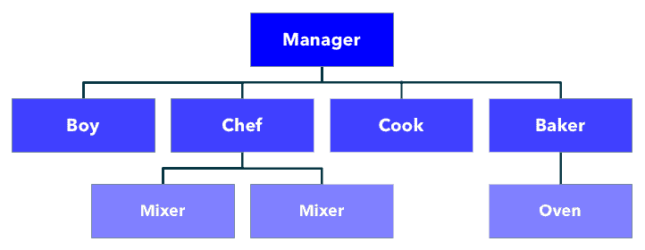
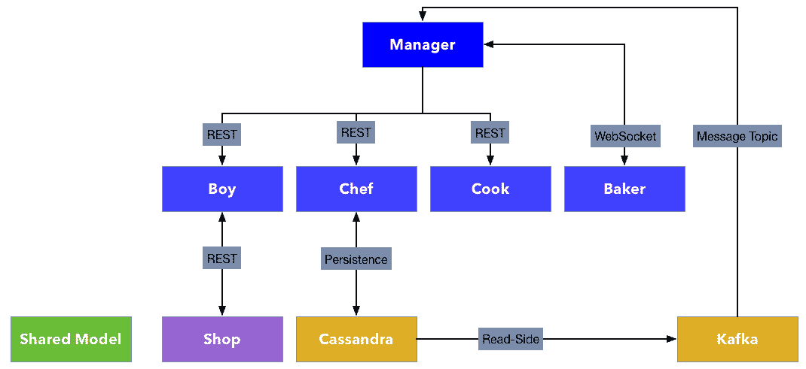
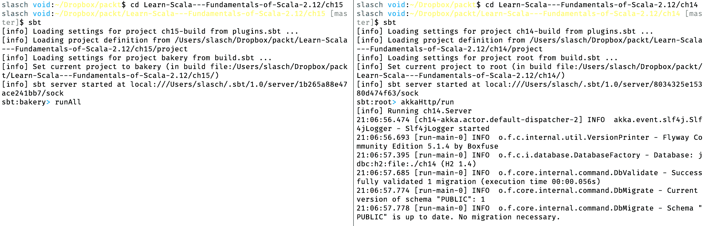
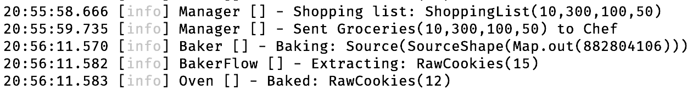

# 第十五章：项目 2 - 使用 Lagom 构建微服务

本书最后一部分将详细探讨 Lagom 框架的细节，通过讨论其哲学、Lagom 应用程序的构建方式以及可用的 API 以及如何使用它们。

在本章中，我们将再次构建我们的面包店项目，这次将其构建为多个微服务。

阅读本章后，你将能够做到以下事项：

+   理解使用 Lagom 的优势

+   设置 Lagom 并使用它来创建项目

+   按照框架要求构建应用程序结构

+   高效使用提供的 API

+   单元测试 Lagom 服务

# 技术要求

在我们开始之前，请确保你已经安装了以下内容：

+   JDK 8+

+   SBT 1.2+

本章的代码可在 GitHub 上找到：[`github.com/PacktPublishing/Learn-Scala-Programming/tree/master/Chapter15`](https://github.com/PacktPublishing/Learn-Scala-Programming/tree/master/Chapter15)。

# 为什么选择 Lagom？

在上一章中，我们讨论了基于微服务方法的利弊。我们命名了微服务的主要架构属性，如自治性、隔离性和数据所有权。我们还指出，与传统单体方法相比，微服务减少了单个服务的复杂性，但整个系统的复杂性并没有消失。从某种意义上说，它只是从单个微服务的内部移动到了它们之间的空间。我们研究了将商店作为 RESTful 微服务的实现，并承认我们将通过专注于单个服务来避免这种额外的复杂性。

在我们处理基于 Akka 的解决方案时，我们还选择了适当的数据库来存储事件，并定义和实施迁移以拥有适当的数据库模式。配置机制的选取由 Akka 预先确定，但我们仍然需要手动阅读和验证配置。我们还需要决定如何在构建可运行的应用程序时传递依赖，并正确实现这一传递。

Lagom 框架建立在一些现有技术之上，并利用“约定优于配置”的方法来减轻这些重复机械任务的压力，并为微服务系统提供一些特定的附加功能。它是通过为项目提供一种“模板”来实现的。

预配置的功能包括以下内容：

+   使用事件溯源作为分布式持久化的机制。推荐的数据库是 Apache Cassandra，因为它具有卓越的可伸缩性和对 CQRS 原则的读侧的自然支持。

+   通过利用 Akka Streams 作为实现和 Apache Kafka 作为代理的消息传递风格，支持异步通信。

+   对不同通信协议提供透明支持，允许你将复杂的 API 调用抽象为简单的函数调用。

+   表达式服务描述 DSL，允许您以灵活和简洁的方式定义 API。

+   使用 Akka Cluster 实现动态可伸缩性。

+   选择依赖注入框架，以在编译时或运行时连接应用程序。

+   开发模式，具有热代码重载功能，以及能够通过单个命令启动所有服务和所需的基础设施组件，包括特殊开发服务注册表和服务网关。

+   基础设施和预配置日志的默认配置。

让我们看看这些功能将如何帮助我们重新实现我们的面包店项目。

# 项目概述和设置

我们已经在第十一章，《Akka 和 Actor 模型简介》到第十三章，《Akka Streams 基础》中，使用不同的技术实现了我们的面包店项目三次。让我们回顾一下，对于不熟悉本书第三部分的读者来说，这是关于什么的。

# 面包店项目

面包店包含一些员工，他们共同努力制作美味的饼干。他们的通信结构在以下图中表示：



每位员工都在特定领域有专长：

+   **经理**通过将每个参与者的工作结果传递给流程中的下一步来驱动流程。他们还创建了初始购物清单。

+   **男孩**，如果得到购物清单，将跑到杂货店并带回食材。

+   **厨师**，如果得到食材，将制作面团。他们通过创建几个容量有限的**混合器**来这样做，以便可以并行处理更多的食材。

+   **厨师**，如果得到面团，将制作一些生饼干。

+   **面包师**，如果得到生饼干，将使用**烤箱**烘烤一段时间，从而制作出美味的饼干。

这次，我们将每个工作者建模为一个微服务。**混合器**和**烤箱**将成为所属服务的实现细节。

# 项目设置

不言而喻，我们将使用 Lagom 框架来实现我们的微服务。Lagom 支持 Maven 和 SBT 作为构建工具，但 SBT 提供了更好的用户体验，因此我们将忽略 Maven，因为它对 Scala 项目来说不太相关。

此外，在本节中，我们将从头开始创建一个 Lagom 项目。我们可以通过使用 Giter8 创建一个示例项目，然后根据需要对其进行修改和扩展，采用一种稍微不同的方法。命令与我们提到的第十一章，《Akka 和 Actor 模型简介》：`sbt new lagom/lagom-scala.g8`相似。

与之前一样，我们的 SBT 设置将包含描述项目不同方面的多个文件。以下假设我们已创建项目文件夹并在终端中导航到它：

```java
slasch@void:~$ mkdir bakery
slasch@void:~$ cd bakery
slasch@void:~$ echo 'addSbtPlugin("com.lightbend.lagom" % "lagom-sbt-plugin" % "1.4.7")' > plugins.sbt
slasch@void:~$ echo 'sbt.version=1.1.5' > build.properties
slasch@void:~$ cd ..
slasch@void:~$ echo '-J-Xms1024M
> -J-Xmx4096M
> -J-Xss2M
> -J-XX:MaxMetaspaceSize=1024M' > .sbtopts
```

在这里，我们定义了我们的项目需要 Lagom SBT 插件，要使用的 SBT 版本，以及`.sbtopts`文件中的几个 SBT 选项。前两行定义了 SBT 被允许消耗的初始和最大内存量。我们将启动相当多的微服务和支持基础设施组件，因此需要足够的内存。`-Xss`参数定义了每个线程的栈大小为`2M`。在 Scala 项目中，这通常很有用，可以防止非尾递归函数过早地溢出栈。最后一个参数`-XX:MaxMetaspaceSize`定义了用于存储类元数据（从 JVM 8 开始）的元空间的大小。由于 Lagom 的热重载，我们在开发过程中将创建和加载许多类，因此我们需要一个较大的元空间。

`build.sbt` 将包含多个子模块，因此使用文本编辑器创建它会更简单。这就是（部分）最终结果的样子：

```java
organization in ThisBuild := "packt"
version in ThisBuild := "1.0-SNAPSHOT"

scalaVersion in ThisBuild := "2.12.6"

val macwire = "com.softwaremill.macwire" %% "macros" % "2.3.0" % Provided
val scalaTest = "org.scalatest" %% "scalatest" % "3.0.5" % Test
val defaultDependencies = Seq(lagomScaladslTestKit, macwire, scalaTest)

lazy val `shared-model` = (project in file("shared-model"))
  .settings(libraryDependencies += lagomScaladslApi)

lazy val bakery = (project in file("."))
  .aggregate(
    `boy-api`, `boy-impl`, 
    `chef-api`, `chef-impl`, 
    `cook-api`, `cook-impl`, 
    `baker-api`, `baker-impl`, 
    `manager-api`, `manager-impl`)

lazy val `boy-api` = (project in file("boy-api"))
  .settings(libraryDependencies += lagomScaladslApi)

// other APIs defined the same way

lazy val `boy-impl` = (project in file("boy-impl"))
  .enablePlugins(LagomScala)
  .settings(libraryDependencies ++= defaultDependencies)
  .dependsOn(`boy-api`)

// other implementations defined the same way

lazy val `chef-impl` = (project in file("chef-impl"))
  .enablePlugins(LagomScala)
  .settings(
    libraryDependencies ++= Seq(
      lagomScaladslPersistenceCassandra,
      lagomScaladslKafkaBroker,
      lagomScaladslTestKit,
      lagomScaladslPubSub,
      macwire
    )
  )
  .settings(lagomForkedTestSettings: _*)
  .dependsOn(`chef-api`)

lazy val `manager-impl` = (project in file("manager-impl"))
  .enablePlugins(LagomScala)
  .settings(libraryDependencies ++= defaultDependencies)
  .dependsOn(`manager-api`, `boy-api`, `chef-api`, `cook-api`, `baker-api`)
```

我们已经删除了重复的定义，请参阅 GitHub 仓库（[`github.com/PacktPublishing/Learn-Scala-Programming/tree/master/Chapter15`](https://github.com/PacktPublishing/Learn-Scala-Programming/tree/master/Chapter15)）以获取完整的源代码。在这里，我们定义了项目的一般属性、共享模型和五个微服务。

每个微服务由两个模块组成，一个 API 定义和一个实现。在我们的案例中，大多数 API 定义只需要一个`lagomScaladslApi`依赖项，实现则只需要在主范围内使用`macwire`。我们已定义了`defaultDependencies`，包括测试范围，以保持进一步的定义简洁。

对于`chef-impl`，我们还包括了三个其他编译时依赖项：

+   `lagomScaladslPersistenceCassandra`

+   `lagomScaladslPubSub`

+   `lagomScaladslKafkaBroker`

大厨将花一些时间来搅拌面团，因此我们希望通过消息代理与 Manager 进行通信，以解耦两者。

另一个偏差是`manager-impl`的定义。Manager 将与其他每个服务进行通信，因此它需要知道其他工作者的 API 定义。我们还在文件系统中为每个定义的微服务创建了一个文件夹。这就是我们最终具有多个模块的文件结构的样子：

```java
slasch@void:~/ch15 [ch15-lagom]$ tree --dirsfirst
.
├── baker-api
├── baker-impl
├── boy-api
├── boy-impl
├── chef-api
├── chef-impl
├── cook-api
├── cook-impl
├── manager-api
├── manager-impl
├── project
│   ├── build.properties
│   └── plugins.sbt
└── build.sbt
```

随着我们继续实施，我们将为每个模块定义 SBT 所需的项目结构：

```java
slasch@void:~/ch15/cook-api [ch15-lagom]$ tree
.
└── src
 ├── main
 │   ├── resources
 │   └── scala
 └── test
 ├── resources
 └── scala
```

通过拥有这种结构，我们已经完成了项目基础设施的准备，可以继续实现服务。

下一个图表概述了模块之间的通信流程：



为了简化我们的示例，我们将违反每个微服务应该拥有其模型定义的规则。我们将定义一个包含将要构建的服务使用的所有案例类定义的模块。我们将把这个模块作为依赖项添加到我们之前定义的每个其他模块中。

该模块本身将包含我们之前章节中已经了解到的定义：

```java
package ch15

object model {
  final case class ShoppingList(eggs: Int, flour: Int, sugar: Int, chocolate: Int)
  final case class Groceries(eggs: Int, flour: Int, sugar: Int, chocolate: Int)
  final case class Dough(weight: Int)
  final case class RawCookies(count: Int)
  final case class ReadyCookies(count: Int)
}
```

我们的对象将在服务之间以序列化形式发送。这意味着我们还需要为它们定义序列化规则。我们将通过依赖 Play 的宏来实现这一点，类似于我们在`http4s`示例项目中使用的 Circe：

```java
import play.api.libs.json._

implicit val dough: Format[Dough] = Json.format
implicit val rawCookies: Format[RawCookies] = Json.format
implicit val readyCookies: Format[ReadyCookies] = Json.format
implicit val groceries: Format[Groceries] = Json.format
implicit val shoppingList: Format[ShoppingList] = Json.format

```

这些格式都进入同一个`object model`实例，沿着案例类。

# Lagom 的 API

如前所述，我们将从一个最简单的工人实现开始，它只执行基本的数学运算，以便使用`Cook`，将`Dough`转换为`RawCookies`。

# 服务 API

为了将我们的 Cook 定义为服务，我们需要实现一个特殊接口，称为服务描述符。服务描述符定义了 Lagom 服务的两个方面：

+   服务签名：如何调用服务及其返回类型

+   服务元数据：服务调用如何映射到传输层，例如 REST 调用

服务描述符扩展了 Lagom 的`Service`特质，在其最简单形式中只需要重写`descriptor`方法。这就是我们在`Cook`定义中看到的样子，我们将其放入`cook-api`模块：

```java
import com.lightbend.lagom.scaladsl.api._
import ch15.model._

trait CookService extends Service {
  def cook: ServiceCall[Dough, RawCookies]

  override def descriptor: Descriptor = {
    import Service._
    named("CookService").withCalls(call(cook))
  }
}
```

在这里，我们定义了一个描述符，它将服务的单个调用（`cook`方法）连接到服务标识符`"CookService"`，这在稍后的路由中将是必需的。对于调用，我们使用最简单的标识符，它只取方法的名字。配置将导致调用映射到`/cook` REST URL。

调用本身被定义为`ServiceCall[Dough, RawCookies]`类型。让我们更详细地看看`ServiceCall`。在 Lagom 的源代码中的定义如下：

```java
trait ServiceCall[Request, Response] {
  def invoke(request: Request): Future[Response]
}
```

`ServiceCall`由请求和响应类型指定，并且可以在客户端发出请求时异步调用，产生响应。

Lagom 中的请求和响应类型可以是严格的或流式的。有四种可能的组合，从两边都是严格的到两边都是流式的。严格意味着请求或响应在方法边界处完全缓冲在内存中。严格请求和响应的组合导致调用的同步语义。流式请求或响应是`Source`类型，这是我们熟悉的，在第十三章，*Akka Streams 基础*中我们探讨了 Akka 流。对于流式调用，Lagom 将尽力选择适当的语义。通常，这将是通过 WebSockets，我们将在本章后面看到它是如何工作的。

我们的`Cook`实例非常快，因此以同步方式定义服务是合适的。

`Cook`的实现位于另一个模块`cook-impl`中。这种分离对于微服务能够引用彼此的定义而没有了解实现细节是至关重要的。

实现稍微复杂一些，但并不是因为服务定义本身。代码现在应该非常熟悉了：

```java
package ch15

import ch15.model._
import com.lightbend.lagom.scaladsl.api._

import scala.concurrent.Future

class CookServiceImpl extends CookService {
  override def cook = ServiceCall { dough =>
    Future.successful(RawCookies(makeCookies(dough.weight)))
  }
  private val cookieWeight = 60
  private def makeCookies(weight: Int): Int = weight / cookieWeight
}
```

这里唯一的新部分是对服务调用包装器的定义。这是通过使用在`ServiceCall`伴生对象中定义的构造函数来完成的：

```java
 def applyRequest, Response: ServiceCall[Request, Response]
```

我们提供了一个函数，它将`Dough`（请求）转换为`Future[RawCookies]`（响应），并且构造函数从它构建一个合适的`ServiceCall`。

之前提到的复杂性与我们还需要将我们的服务连接起来并启动的事实有关。对于那些阅读了第十四章，*项目 1 - 使用 Scala 构建微服务*的人来说，这种方法将非常类似于我们在那里查看的两种方法的组合：混合特性和为抽象成员提供具体实现，以及将依赖项作为构造函数参数传递。但这次，我们将得到 Lagom 的帮助来完成这项任务。首先，我们定义`LagomApplication`：

```java
abstract class CookApplication(context: LagomApplicationContext)
  extends LagomApplication(context) {
  override lazy val lagomServer: LagomServer = serverForCookService
}
```

应用程序扩展了`LagomApplication`并需要`LagomApplicationContext`，这只是一个通过构造函数传递的。毫无疑问，您已经认识到了我们用来连接`Akka-HTTP`示例组件的薄饼模式。`lagomServer`是一个重写的方法，Lagom 用它来为服务调用提供正确的连接。这里发生的另一个连接是使用 Macwire 将`CookServiceImpl`绑定到`CookService`。

Macwire ([`github.com/adamw/macwire`](https://github.com/adamw/macwire)) 是一个基于构造函数的依赖注入框架。它是通过生成带有作用域内找到的适当参数的类构造函数调用来实现的。从某种意义上说，它以 Circe 或 Play 提供对 JSON 结构正确映射相同的方式，在幕后提供正确的构造函数调用。这对于大型项目来说非常有用。

现在我们可以将应用程序用于应用程序加载器，它在开发或生产环境中启动服务的实际工作：

```java
class CookLoader extends LagomApplicationLoader {

  override def load(context: LagomApplicationContext) =
    new CookApplication(context) with AhcWSComponents {
      override def serviceLocator: ServiceLocator = NoServiceLocator
    }

  override def loadDevMode(context: LagomApplicationContext) =
    new CookApplication(context) with AhcWSComponents with LagomDevModeComponents
}
```

`CookLoader`可以根据需要由 Lagom 启动。它覆盖了相应环境的两个`load`方法。请注意我们如何通过`AhcWSComponents`扩展了`CookApplication`。后者是必需的，以便提供`wsClient`，而`wsClient`反过来又是我们定义的`CookApplication`基类所需的。对于开发模式，我们还混合了`LagomDevModeComponents`，这为我们提供了一个开发模式服务定位器。

现在我们需要通过在众所周知的`application.conf`中提供相应的 play 设置来配置应用程序加载器：

```java
play.application.loader = ch15.CookLoader
```

就这样——现在我们已准备好启动我们的应用程序。在 SBT 控制台中，使用 Lagom 的 `runAll` 命令是最简单的方法。它将尝试启动我们迄今为止定义的所有服务以及底层基础设施的组件——开发模式服务定位器、Cassandra 数据库和 Kafka 消息代理：

```java
sbt:bakery> runAll
[info] Starting Kafka
[info] Starting Cassandra
[info] Cassandra server running at 127.0.0.1:4000
[info] Service locator is running at http://localhost:9008
[info] Service gateway is running at http://localhost:9000
[info] Service cook-impl listening for HTTP on localhost:57733
[info] Service baker-impl listening for HTTP on localhost:50764
[info] Service manager-impl listening for HTTP on localhost:63552
[info] Service chef-impl listening for HTTP on localhost:56263
[info] Service boy-impl listening for HTTP on localhost:64127
```

日志证明，日志记录正在与其他基础设施组件一起工作。

在这个阶段，日志将包含大量堆栈跟踪（此处未显示），因为除了 `boy-impl` 模块之外的所有模块都缺少加载器配置。我们将在本章中修复这个问题，因为我们将会一个接一个地实现服务。

我们还可以看到我们的服务正在端口 `57733` 上运行，并且可以尝试与其通信：

```java
slasch@void:~$ curl -X POST http://localhost:57733/cook -d '{ "weight": 100 }'
{"count":1}
```

恭喜，我们刚刚与第一个 Lagom 微服务进行了通信！

我们直接与服务通信，而没有使用服务注册表和服务定位器。将端口号放入代码列表作为参考是安全的，因为尽管它们看起来是随机的，但 Lagom 以确定性的方式（基本上是通过项目名称的哈希值）将端口号分配给服务。因此，服务在任何环境中都会被分配相同的端口号（考虑到端口冲突）。

现在，我们可以继续实现 `Boy` 服务，它在功能上同样简单。它预计将接收到的购物清单转发到外部服务，并将收到的杂货转发给初始调用者。

服务的定义应该看起来很熟悉，只是我们正在使用 `namedCall` 方法将 `shop` 调用映射到 `go-shopping` 名称，以便有一个更友好的 URL：

```java
trait BoyService extends Service {
  def shop: ServiceCall[ShoppingList, Groceries]

  override def descriptor: Descriptor =
    named("BoyService").withCalls(namedCall("go-shopping", shop))
}
```

实现比 `Cook` 服务要复杂一些，因为 `Boy` 服务需要调用外部 HTTP 服务来下订单。以下模板不应引起任何疑问：

```java
class BoyServiceImpl extends BoyService {
  override def shop = ServiceCall(callExternalApi)
  private val callExternalApi: ShoppingList => Future[Groceries] = ???
}
```

那我们如何调用外部 API 呢？当然，我们可以使用 HTTP 客户端库，并以与之前相同的方式发出 HTTP 请求，获取 HTTP 响应，并处理序列化和反序列化。但这样做会降低我们解决方案的抽象级别，并将实现硬编码到外部服务的位置。

我们将采取以下措施。首先，我们将通过将服务的 URL 添加到 `build.sbt` 中，通过服务定位器注册我们外部运行的服务：

```java
lagomUnmanagedServices in ThisBuild := Map("GroceryShop" -> "http://localhost:8080")
```

然后，我们将定义一个用于杂货店的 API，就像我们即将实现它一样：

```java
trait ShopService extends Service {
  def order: ServiceCall[Order, Purchase]
  override def descriptor: Descriptor = {
    named("GroceryShop").withCalls(restCall(Method.POST, "/purchase", order))
  }
}
```

在这里，我们为与我们在服务定位器中注册的相同名称的服务指定了一个服务描述符。API 调用通过`restCall`描述符注册，以确保 HTTP 方法和路径正确映射到现有服务。我们还需要将`ShoppingList`和`Groceries`包装和展开为预期的`Order`和`Purchase`，就像现有的商店服务一样。幸运的是，我们 case 类的 JSON 表示与`Map[String, Int]`相同，因此我们可以安全地重用现有的模型以及序列化器，并在其上添加包装器：

```java
object ShopService {
  final case class Order(order: ShoppingList)
  final case class Purchase(order: Groceries)
  implicit val purchase: Format[Purchase] = Json.format
  implicit val order: Format[Order] = Json.format
}
```

我们不需要为`ShopService`提供实现；我们只是希望 Lagom 应用所有现有机制来表示一个现有的`REST`服务，就像它是用 Lagom 制作的。

现在商店服务已经准备好与`Boy`一起使用：

```java
class BoyServiceImpl(shopService: ShopService)                    
               (implicit ec: ExecutionContext) extends BoyService {
  override def shop: ServiceCall[ShoppingList, Groceries] = ServiceCall(callExtApi)

  private val callExtApi: ShoppingList => Future[Groceries] = list =>
    shopService.order.invoke(Order(list)).map(_.order).recover {
      case _ => Groceries(0, 0, 0, 0)
    }
}
```

注意，我们提供了`shopService`客户端和一个执行上下文。后者将用于转换我们从服务调用中获得的未来结果。`callExtApi`函数展示了如何实现：我们从`ShopService`定义中引用`order`方法，它返回`ServiceCall`，我们愉快地用从购物列表中创建的`Order`调用它。结果是`Future[Purchase]`，所以我们从中提取一个订单。最后，我们定义，如果外部服务发生任何错误，例如，服务不可用或库存不足无法完成订单，`Boy`应该空手而归。

现在`Boy`能够与我们第十四章中构建的`ShopService`进行通信，*项目 1 - 使用 Scala 构建微服务*，使用`Akka-HTTP`。

为了使本章的后续示例正常工作，商店服务必须正在运行，并且必须有足够的库存。

我们的`Boy`和`Cook`服务是无状态的。`Cook`服务只是立即返回结果，因此在其中保留任何状态都没有意义。`Boy`很简单，如果发生任何意外情况，它只是回来获取指令。但`Chef`和`Baker`不同，因为它们应该代表需要花费一些时间的过程。因此，我们不能以同步方式实现它们。

在这个意义上，面包师具有`m:n`语义，即它可以对单个传入消息响应零个、一个或多个响应消息。让我们使用 Lagom 定义异步服务的能力来实现它。这将允许我们重用我们在第十三章中构建的`Baker`的流定义，*Akka Streams 基础*。

我们首先需要定义服务，就像我们之前做的那样，但这次使用异步语义：

```java
import akka.NotUsed
import akka.stream.scaladsl.Source

trait BakerService extends Service {
  def bake: ServiceCall[Source[RawCookies, NotUsed],
                        Source[ReadyCookies, NotUsed]]

  override def descriptor: Descriptor = named("BakerService").withCalls(call(bake))
}
```

在这里，我们定义 `BakerService` 具有请求类型为 `Source[RawCookies, NotUsed]` 和响应类型为 `Future[Source[ReadyCookies, NotUsed]]`。这应该允许我们在 `RawCookies` 可用时直接写入，并在烘焙后返回 `ReadyCookies`。

实现很简单，因为它实际上是封装了来自 第十三章 的流程，*Akka Streams 基础*：

```java
import play.api.Logger

class BakerServiceImpl extends BakerService {

  private val logger = Logger("Baker")

  override def bake: ServiceCall[Source[RawCookies, NotUsed],
                     Source[ReadyCookies, NotUsed]] = 
      ServiceCall { dough =>
         logger.info(s"Baking: $dough")
         Future.successful(dough.via(bakerFlow))
      }

  private val bakerFlow: Flow[RawCookies, ReadyCookies, NotUsed] =
    Baker.bakeFlow.join(Oven.bakeFlow)
}
```

我们重用了 `Baker` 和 `Oven` 流的定义，并将组合流作为调用结果返回。在这个片段中，我们还展示了如何使用来自底层 Play 框架的 `Logger`。

# 持久化 API

在我们的场景中，`Chef` 完成混合过程需要一些时间。正因为如此，我们希望将正在进行的工作存储起来，以便在服务重启时不会丢失，并且恢复后可以从中断的地方继续进行。

我们将使用框架提供的持久化功能来实现这一点。在 Lagom 中，推荐通过利用事件溯源方法来持久化数据，我们已经在 第十四章 的示例项目中使用了这种方法，*项目 1 - 使用 Scala 构建微服务*。Lagom 自动使用 Cassandra 创建数据模式，并为开发目的提供了一个 Cassandra 实例。因此，我们可以直接开始定义数据模型。与上一章一样，我们需要提供一组命令和事件，并有一个状态的内部表示。以下几段代码展示了表示这些部分的一种可能方式。由于这个模型只是 `Chef` 的实现细节，它被放入了 `chef-impl` 模块。

首先，我们需要在作用域内有一系列导入：

```java
import ch15.model._
import java.util.UUID
import akka.Done
import com.lightbend.lagom.scaladsl.persistence._
import PersistentEntity.ReplyType
import com.lightbend.lagom.scaladsl.playjson.JsonSerializer
import play.api.libs.json._
```

拥有这些，我们可以定义我们的命令：

```java
sealed trait ChefCommand
final case class MixCommand(groceries: Groceries) extends ChefCommand with ReplyType[Done]
final case class DoneCommand(id: UUID) extends ChefCommand with ReplyType[Done]
```

`MixCommand` 代表对混合某些食品的请求。Lagom 中的命令定义了预期的响应类型，我们使用 Akka 的 `Done` 作为响应。这样做的原因是，我们总是会接受 `MixCommand`（因为没有不接受的理由），但在命令被接受的那一刻，无法预测它将产生什么效果。

`DoneCommand` 代表从“混合进行中”到“混合完成”的状态转换。它将是 `Chef` 向自身发送的内部命令。技术上我们在这里不需要响应类型，但我们必须再次使用 `Done` 以使编译器满意。`id` 代表混合作业的唯一标识符。它从哪里来？它是在我们从命令创建事件的那一刻生成的：

```java
sealed trait ChefEvent
final case class Mixing(id: UUID, groceries: Groceries) extends ChefEvent
final case class MixingDone(id: UUID, dough: Dough) extends 
  ChefEvent with AggregateEvent[MixingDone] {
    override def aggregateTag: AggregateEventTag[MixingDone] = ChefModel.EventTag
  }
```

`Mixing`事件是在响应`MixCommand`和`MixingDone`事件时创建的——响应`DoneCommand`。这两个事件通过`id`属性相互关联。在恢复时间，具有相同`id`的两个事件将相互抵消：两个事件的存在意味着在以前已经启动并完成了混合工作。相比之下，如果只有一个事件，我们可以得出结论，该工作未完成。在恢复后存在不平衡的`Mixing`事件意味着我们需要重新启动这些事件的混合过程。不平衡的`MixingDone`事件只能意味着编程错误。

为了提供这种功能，我们将状态定义为以下内容：

```java
sealed trait ChefState {
  def batches: List[Mixing]
}
final case class MixingState(batches: List[Mixing]) extends ChefState
```

在讨论完模型定义的最后部分之后，我们将稍后查看它在服务实现中的使用方式：

```java
object ChefModel {
  import play.api.libs.json._
  implicit val mixingFormat = Json.format[Mixing]

  val serializers = List(
    JsonSerializer(mixingFormat),
    JsonSerializer(Json.format[MixingDone]),
    JsonSerializer(Json.format[MixingState]))

  val EventTag: AggregateEventTag[MixingDone] = AggregateEventTagMixingDone
}
```

在这里，我们以与上一章相同的方式为我们的事件和命令提供序列化器。Lagom 推荐使用 JSON 作为序列化格式，因此我们正在使用我们之前已经用于共享模型定义的相同方法。

我们还定义了`EventTag`，我们将需要实现事件日志的读取端，以便通知`Manager`关于完成的混合工作。

我们需要的最后一部分配置是定义 Cassandra 的键空间用于`Chef`。这通常在`application.conf`中完成：

```java
user.cassandra.keyspace = chefprogress

cassandra-journal.keyspace = ${user.cassandra.keyspace}
cassandra-snapshot-store.keyspace = ${user.cassandra.keyspace}
lagom.persistence.read-side.cassandra.keyspace =
 ${user.cassandra.keyspace}
```

服务的定义反映了请求端通信是同步的，而响应端基于消息的事实：

```java
trait ChefService extends Service {
  def mix: ServiceCall[Groceries, Done]

  def resultsTopic: Topic[Dough]

  override def descriptor: Descriptor = {
    named("ChefService")
      .withCalls(call(mix))
      .withTopics(topic(ChefService.ResultsTopic, resultsTopic))
      .withAutoAcl(true)
  }
}
object ChefService {
  val ResultsTopic = "MixedResults"
}
```

`mix`调用接受`Groceries`并返回`Done`（与我们所定义的命令的返回类型进行比较）。服务实现也很简洁，因为它将状态管理委托给`ChefPersistentEntity`：

```java
class ChefServiceImpl(persistentEntities: PersistentEntityRegistry,
                      as: ActorSystem) extends ChefService {

  private lazy val entity = wire[ChefPersistentEntity]
  persistentEntities.register(entity)

  override def mix: ServiceCall[Groceries, Done] = ServiceCall { groceries =>
      val ref = persistentEntities.refForChefPersistentEntity
      ref.ask(MixCommand(groceries))
  }

  override def resultsTopic: Topic[Dough] = ???
}
```

首先，我们需要传递两个依赖项，`PersistentEntityRegistry`和`ActorSystem`。我们在连接`ChefPersistentEntity`时传递 actor 系统`as`，并使用持久化实体注册表根据 Lagom 的要求注册我们的持久化实体。然后`mix`调用仅使用注册表查找对实体的引用，并使用`ask`模式发送传入的命令并获取响应，就像我们使用 actor 一样。

我们现在省略`resultsTopic`的实现，以专注于服务的持久性方面。

`ChefPersistentEntity`有点长，所以让我们分块查看它。我们首先从覆盖 Lagom 的`PersistentEntity`开始：

```java
final class ChefPersistentEntity(
    persistentEntities: PersistentEntityRegistry, as: ActorSystem
  ) extends PersistentEntity { ... }
```

持久化实体可以从集群中的任何地方访问。正因为如此，在 Lagom 中使用持久性自动意味着使用集群（这绝对是一个好主意）。持久化实体需要覆盖一些字段：

```java
override type Command = ChefCommand
override type Event = ChefEvent
override type State = ChefState
override def initialState: ChefState = MixingState(Nil)
```

`Command`、`Event`和`State`类型指的是我们之前定义的类型。我们还定义了一个初始状态为空的`MixingState`。

为了简单起见，我们不会实现完整的混合行为，因为我们已经在之前的章节中这样做过三次。相反，我们将模拟它：

```java
private def dough(g: Groceries) = {
  import g._
  Dough(eggs * 50 + flour + sugar + chocolate)
}
```

现在，我们最终可以定义我们实体的行为，该实体将接受命令、持久化事件和修改状态。同样，这是按照我们在上一章中做的方式进行的，但 Lagom 通过提供一个`Actions`构造函数来增加其价值，该构造函数允许我们以构建器类似的方式定义命令和事件处理器：

```java
Actions()
  .onCommand[MixCommand, Done] {
    case (MixCommand(groceries), ctx, _) if groceries.eggs <= 0 =>
      ctx.invalidCommand(s"Need at least one egg but got: $groceries")
      ctx.done

    case (MixCommand(groceries), ctx, _) =>
      val id = UUID.randomUUID()
      ctx.thenPersist(Mixing(id, groceries)) { evt =>
        as.scheduler.scheduleOnce(mixingTime)(
          thisEntity.ask(DoneCommand(id)))
        ctx.reply(Done)
      }
  }
```

命令处理器必须返回一个`Persist`指令，该指令描述了应该持久化什么内容，并可选地提供一个回调函数，用于执行副作用代码，该代码应在事件成功写入存储后执行。

在前面的代码片段中，我们处理了两个命令。带有负`Dough`数量的`MixCommand`被标记为无效（这是通过向调用者发送`InvalidCommandException`来建模的），调用`ctx.done`返回`PersistNone`，表示不需要持久化任何内容。

第二个处理器是用于有效命令的。使用它，我们首先为将要持久化的事件生成随机的`id`，然后构建事件并返回`PersistOne`，其中包含事件和回调。回调安排向持久化实体本身发送命令，意味着混合已完成，并将`Done`发送回调用者。

为了能够解引用一个实体，我们需要使用一个注册表，就像我们在服务中之前所做的那样：

```java
lazy val thisEntity = persistentEntities.refForChefPersistentEntity
```

请注意，我们的持久化回调仅执行副作用，而不修改状态。对于状态修改，应使用另一个构造函数`onEvent`。这种分离是为了在恢复期间能够根据需要多次重建状态，但副作用代码只在实际事件发生后并已持久化后才执行一次：

```java
Actions()
  .onCommand[MixCommand, Done] { ... }
  .onEvent {
    case (m: Mixing, state) =>
      MixingState(state.batches :+ m)

    case (MixingDone(id, _), state) =>
      MixingState(state.batches.filterNot(_.id == id))
  }
```

在这里，我们只是将新的混合作业放入队列，并在它们完成后从队列中删除。现在我们必须定义实体发送给自身的`DoneCommand`的响应方式：

```java
Actions()
  .onCommand[MixCommand, Done] { ... }
  .onEvent { ... }
  .onCommand[DoneCommand, Done] {
    case (DoneCommand(id), ctx, state) =>
      state.batches
        .find(_.id == id)
        .map { g =>
          ctx.thenPersist(MixingDone(id, dough(g.groceries))) { 
             _ => ctx.reply(Done)
          }
        }
        .getOrElse(ctx.done)
  }

```

我们正在当前状态中寻找我们之前通过使用`id`作为相等标准创建的`MixingCommand`，只是为了有一个对`groceries`的引用。这些杂货将在以后需要；目前我们将在读取端读取事件。然后我们构建并持久化一个事件，并返回`Done`以使编译器满意。你可能已经注意到，我们没有为`MixingDone`事件定义任何副作用。我们不需要这样做，因为这些事件将流式传输到我们之前指定的`resultsTopic`。

为了完成`Chef`的实现，我们需要将所有组件连接起来。`ChefLoader`与我们之前定义的其他加载器没有太大区别。相比之下，`ChefApplication`有一些不同：

```java
abstract class ChefApplication(context: LagomApplicationContext)
  extends LagomApplication(context) with CassandraPersistenceComponents with LagomKafkaComponents {
  override lazy val lagomServer: LagomServer = serverForChefService
  override lazy val jsonSerializerRegistry = new JsonSerializerRegistry {
      override def serializers = ChefModel.serializers
  }
}
```

我们需要提供一个`JsonSerializerRegistry`的实现，以便 Lagom 能够拾取我们的序列化器。我们的应用程序还需要扩展`CassandraPersistenceComponents`，因为我们使用了持久化，并且也扩展了`LagomKafkaComponents`——通过发布我们的事件，我们实际上也在使用消息。不幸的是，目前 Lagom 无法在编译时检查应用程序是否使用了消息传递，因此很容易忘记扩展 Kafka 组件，这将在应用程序启动时导致运行时错误。

我们已经定义了`Chef`服务`MixingDone`事件的持久化部分，现在让我们转向消息部分。

# 消息代理 API

当我们在`Chef`中实现持久化时，我们跳过了在 API 定义中提供的`resultsTopic`的定义。现在让我们看看`resultsTopic`的定义：

```java
class ChefServiceImpl(...) extends ChefService {

  ...

  override def resultsTopic: Topic[Dough] =
    TopicProducer.singleStreamWithOffset { fromOffset =>
      persistentEntities
        .eventStream(ChefModel.EventTag, fromOffset)
        .map { ev => (convertEvent(ev), ev.offset) }
    }

  private def convertEvent(chefEvent: EventStreamElement[ChefEvent]): Dough = {
    chefEvent.event match {
      case MixingDone(_, dough) => dough
    }
  }
}
```

我们使用`TopicProducer`工厂的`singleStreamWithOffset`构造函数来构建一个主题，所有标记为`ChefModel.EventTag`的事件都将发布到这个主题。在发布之前，我们将`ChefEvent`转换为下游服务期望的`Dough`。这是在`convertEvent`方法中完成的。

接收方是`Manager`。Lagom 提供了所有基础设施，使得事件的消费简化为以下一行代码：

```java
val sub: Future[Done] = chefService.resultsTopic.subscribe.atLeastOnce(cookChefFlow)
```

在这里，我们使用`chefService` `resultsTopic`来订阅事件。我们提供`cookChefFlow`作为回调，该回调将至少为每个发布的事件调用一次。`atLeastOnce`方法期望`akka.stream.scaladsl.Flow[Payload, Done, _]`作为参数，其中 Payload 指的是消息的类型。我们将在稍后定义我们的`Flow[Dough, Done, _]`类型的流。

# 客户端服务 API

我们已经定义了所有的工人服务，让我们看看`Manager`以及它是如何通过调用其他服务按正确顺序驱动烘焙过程的。让我们从服务定义开始：

```java
trait ManagerService extends Service {
  def bake(count: Int): ServiceCall[NotUsed, Done]
  def sell(count: Int): ServiceCall[NotUsed, Int]
  def report: ServiceCall[NotUsed, Int]

  override def descriptor: Descriptor = {
    import Service._
    named("Bakery").withCalls(
      restCall(Method.POST, "/bake/:count", bake _),
      restCall(Method.POST, "/sell?count", sell _),
      pathCall("/report", report)
    )
  }
}
```

我们定义了三个方法：

+   `bake`，用于启动多个饼干的烘焙过程

+   `sell`，如果库存足够，用于出售饼干

+   `report`，用于检查当前库存中饼干的数量

我们将它们映射到两个 REST 调用和一个路径调用。我们使用一个路径和一个查询参数只是为了展示 Lagom 的描述符 DSL 提供的可能性。

让我们继续进行服务实现：

```java
class ManagerServiceImpl(boyService: BoyService,
                         chefService: ChefService,
                         cookService: CookService,
                         bakerService: BakerService,
                         as: ActorSystem)
    extends ManagerService {

  private val count: AtomicInteger = new AtomicInteger(0)

  private val logger = Logger("Manager")

  ...
}
```

我们必须提供所有即将调用的服务作为构造函数参数，这样我们可以在应用程序定义中稍后将它们连接起来。我们还定义了`logger`和`count`，它们将保存当前的饼干数量。在实际项目中，我们会实现一个基于事件源的方法来处理 Manager 的内部状态，但在这里我们只是为了简单起见将其保存在内存中。

`report`和`sell`方法通过检查内部状态并在适当的情况下修改它来实现：

```java
override def sell(cnt: Int): ServiceCall[NotUsed, Int] =
  ServiceCall { _ =>
   if (cnt > count.get()) {
     Future.failed(new IllegalStateException(s"Only $count cookies on sale"))
  } else {
    count.addAndGet(-1 * cnt)
    Future.successful(cnt)
  }
}

override def report: ServiceCall[NotUsed, Int] = ServiceCall { _ =>
  Future.successful(count.get())
}
```

`bake`方法通过实际调用其他服务来实现：

```java
override def bake(count: Int): ServiceCall[NotUsed, Done] = ServiceCall { _ =>
  val sl = shoppingList(count)
  logger.info(s"Shopping list: $sl")
  for {
    groceries <- boyService.shop.invoke(sl)
    done <- chefService.mix.invoke(groceries)
  } yield {
    logger.info(s"Sent $groceries to Chef")
    done
  }
}
```

在这里，我们根据请求烘焙的饼干数量生成购物清单。然后，在 for-comprehension 中，我们调用 `boyService` 和 `chefService`。在调用厨师服务时，我们需要返回，因为厨师制作面团需要一些时间。

我们已经定义了 `Dough` 的监听器，这是 `Chef` 通过消息主题发送回来的，所以我们只需要定义处理传入消息的流程：

```java
private lazy val chefFlow: Flow[Dough, Done, NotUsed] = Flow[Dough]
  .map { dough: Dough =>
    val fut = cookService.cook.invoke(dough)
    val src = Source.fromFuture(fut)
    val ready: Future[Source[ReadyCookies, NotUsed]] =
      bakerService.bake.invoke(src)
    Source.fromFutureSource(ready)
  }
  .flatMapConcat(identity)
  .map(count.addAndGet(cookies.count))
  .map(_ => Done)
```

在这里，我们再次将可能的单行表示为几个语句，以便容易发现正在发生的事情：我们定义 `Flow`，通过调用 `cookService` 将面团转换为 `Future[RawCookies]`。`bakerService` 是一个流式服务，它期望 `Source[RawCookies, _]`，我们从 `Future` 中创建它。调用 `bakerService` 返回 `Future[Source[ReadyCookies, _]]`，所以我们再次将 `Future` 转换为 `Source`，然后使用 `flatMapConcat` 平滑 `Source[Source[ReadyCookies, _]]`。最后，我们更改服务的内部状态，并返回 `Done`，这是订阅方法所期望的。

是时候一起构建 `ManagerApplication` 了！我们需要为在 `ManagerImpl` 中使用过的所有服务提供引用。当然，我们将使用 `serviceClient` 来完成这项工作：

```java
abstract class ManagerApplication(context: LagomApplicationContext)
    extends LagomApplication(context) with LagomKafkaClientComponents {
  lazy val boyService: BoyService = serviceClient.implement[BoyService]
  lazy val chefService: ChefService = serviceClient.implement[ChefService]
  lazy val cookService: CookService = serviceClient.implement[CookService]
  lazy val bakerService: BakerService = serviceClient.implement[BakerService]
  override lazy val lagomServer: LagomServer =
    serverForManagerService
}
```

`ManagerServiceImpl` 本身仍然使用 Macwire 构建。

# 运行应用程序

现在，我们已经构建了所有服务，并可以使用之前的 `runAll` 命令作为一个整体运行项目。我们还需要运行上一章中的 `Akka-HTTP` 示例，并确保有足够的库存，以便男孩可以从其中获取一些杂货：



上一张截图显示了两个终端窗口：在右侧是第十四章中的 Akka HTTP 商店正在运行，在左侧 `runAll` 命令准备执行。`runAll` 命令需要一些时间来启动所有子系统，并在控制台产生大量输出。

在撰写本文时，处理管道在返回烘焙的饼干给经理之前停止了。我们将此问题报告为 Lagom 的一个错误 ([`github.com/lagom/lagom/issues/1616`](https://github.com/lagom/lagom/issues/1616))，但不幸的是，我们还没有收到 Lagom 团队的反馈。我们保留了示例，希望问题将在框架的下一个版本中得到修复。在不太可能的情况下，如果这不是一个错误，我们将在收到对错误报告的相应反应后立即更新示例。

一切都平静下来后，我们可以从另一个窗口使用 `http` 客户端调用我们的 `Manager` 服务：

```java
curl -X "POST" "http://localhost:58866/bake/10"
```

这应该在 Lagom 终端产生类似于以下输出：



看起来是时候享受饼干了！嗯，还不完全是时候！

# 测试

与之前一样，我们希望通过测试我们提出的实现来结束我们的旅程。幸运的是，Lightbend 遵循与其他库相同的测试方法。有一个测试套件允许我们轻松地测试服务和持久化实体。我们将在本节中演示如何测试服务，并将测试持久化实体留给读者作为练习。

有道理从测试我们定义的最简单的服务——`CookService`开始。这里是对它的测试，放置在`cook-impl`模块的测试范围内：

```java
import ch15.model.Dough
import com.lightbend.lagom.scaladsl.server.LocalServiceLocator
import com.lightbend.lagom.scaladsl.testkit.ServiceTest
import org.scalatest.{AsyncWordSpec, Matchers}
import play.api.libs.ws.ahc.AhcWSComponents

class CookServiceSpec extends AsyncWordSpec with Matchers {

  "The CookService" should {
    "make cookies from Dough" in ServiceTest.withServer(ServiceTest.defaultSetup) { ctx =>
      new CookApplication(ctx) with LocalServiceLocator with AhcWSComponents
    } { server =>
      val client = server.serviceClient.implement[CookService]
      client.cook.invoke(Dough(200)).map { cookies =>
        cookies.count should ===(3)
      }
    }
  }
}
```

Lagom 提供了一个`ServiceTest`对象，其目的是支持单个服务的测试。它的`withServer`构造函数接受两个参数：一个应用程序构造函数和一个测试代码块。它看起来与我们之前在测试第十二章中的`Akka-HTTP`实现时使用的方法类似，但行为不同。`ServiceTest`实际上启动了带有服务的真实服务器。在我们的例子中，我们将其与`LocalServiceLocator`混合，这样我们就可以在测试块中从中获取服务实现。在这里，我们可以调用服务并验证它是否按预期工作。

我们的规范扩展了`AsyncWordSpec`，这使我们能够通过映射服务返回的`Future`来制定我们的期望。

测试像`CookService`这样的同步服务非常简单。但是，如何测试异步（流式）服务呢？我们已经使用`BakerService`构建了一个示例。以下是该单元测试的一个可能的实现：

```java
class BakerServiceSpec extends AsyncWordSpec with Matchers {

  "The BakerService" should {
    "bake cookies" in ServiceTest.withServer(ServiceTest.defaultSetup) { ctx =>
      new BakerApplication(ctx) with LocalServiceLocator
    } { server =>
      val client = server.serviceClient.implement[BakerService]
      implicit val as: Materializer = server.materializer
      val input: Source[RawCookies, NotUsed] =
        Source(List(RawCookies(10), RawCookies(10), RawCookies(10)))
          .concat(Source.maybe)

      client.bake.invoke(input).map { output =>
        val probe = output.runWith(TestSink.probe(server.actorSystem))
        probe.request(10)
        probe.expectNext(ReadyCookies(12))
        probe.expectNext(ReadyCookies(12))
        // because the oven is not full for the 6 other
        probe.cancel
        succeed
      }
    }
  }
}
```

测试的定义、测试服务器和客户端与之前相同。唯一不同的是，我们需要提供`Source`而不是我们正常的领域类型，并返回`Source`。因此，我们求助于 Akka-Streams 测试套件，并利用我们在第十三章，“Akka Streams 基础”中学到的知识来制定对流的期望。我们从`List`创建一个输入`Source`，并使用`TestSink`来确认服务的输出符合我们的期望。

现在是享受饼干的时候了！

# 摘要

Lagom 框架是 Lightbend 提供的一种解决方案，旨在简化使用 Scala 和 Java 构建微服务的过程。它建立在现有的库和框架之上，如 SBT、Akka 和 Play，并提供了额外的功能，例如具有热代码重载的丰富开发环境、服务注册和服务定位器、嵌入式数据库和消息代理。

Lagom 有三个有用的 API：

+   服务 API，允许您将远程服务调用表示为本地函数调用

+   持久化 API，为`Akka-Persistence`提供额外的结构和一些有用的默认值

+   消息代理 API，使公共/订阅通信和与日志的读取端交互变得容易

Lagom 随附一个测试套件，可以帮助独立测试服务或持久化实体。将 Lagom 的测试套件与 `Akka-Streams` 测试套件和来自 `ScalaTest` 的 `AsyncWordSpec` 结合使用，使得编写简洁且表达性强的测试期望成为可能。

在本章中，我们只是简要地提到了 Lagom 为基于微服务系统的开发提供的可能性。这个软件工程领域仍然相当不成熟，而 Lagom 是解决这些新挑战的第一次尝试之一。

我们希望通过我们的示例项目能够激发你对 Lagom 的兴趣，并强烈推荐你查看官方 Lagom 文档[`www.lagomframework.com/documentation/1.4.x/scala/Home.html`](https://www.lagomframework.com/documentation/1.4.x/scala/Home.html)以获取更多灵感。

# 问题

1.  你如何将带有查询参数的端点映射到 REST 调用？

1.  对于持久化实体，推荐使用哪种序列化格式？

1.  你能解释为什么在 Lagom 中使用持久化需要聚类吗？

1.  描述一个可能的数据模型，该模型可用于使管理器成为一个持久化实体。

1.  概述一种实现 Baker 服务的替代方法。

1.  你能否在 Chef 当前实现中识别出一个设计错误？

1.  管理器实现将多个 cookie 存储在内存中，而这个数字在服务重启时将会丢失。你能说出另一个为什么将 cookie 的数量保存在局部变量中是一个坏主意的原因吗？

# 进一步阅读

+   Rambabu Posa，*《Scala 反应式编程：在 Scala 中构建容错、健壮和分布式应用程序》*

+   Jatin Puri 和 Selvam Palanimalai，*《Scala 微服务：优雅地使用 Scala 设计、构建和运行微服务》*
