# 准备环境和运行代码示例

本章中的说明基于我们在 2018 年晚些时候安装 JDK 和 SBT 以及运行代码示例的经验。由于软件更新速度很快，此类说明一旦发布通常会很快过时；请在阅读本章时牢记这一点。

# 安装软件

安装 JDK、Scala 和 SBT 的推荐方法是使用在[`sdkman.io`](https://sdkman.io)可用的 SDK 管理器。请参考网页上的说明以完成安装。

此外，我们将描述手动安装 Java 和 SBT 的过程。为了您的方便，我们将进一步截图中的命令打包成脚本，为 OS X 和 Linux 提供，并在 GitHub 仓库的“附录”文件夹中提供：[`github.com/PacktPublishing/Learn-Scala-Programming/tree/master/Appendix`](https://github.com/PacktPublishing/Learn-Scala-Programming/tree/master/Appendix)[.](https://github.com/PacktPublishing/Learn-Scala---Fundamentals-of-Scala-2.13/tree/master/appendix_a)

# 安装 Java 虚拟机 (JVM)

目前，在撰写本文时，在[`jdk.java.net`](http://jdk.java.net)上可用的最后一个 JDK 版本是 11。Scala 2.13 需要 Java 1.8+。

您可以使用现有的工具之一，例如 `apt` 或 `yum`（用于 Linux 的包管理器）或 `brew`（用于 OS X 环境），在 Linux 或 macOS X 平台上安装 Java。如果您打算以这种方式安装 JDK，请使用相应工具的帮助页面和指南。

Java 的手动安装包括三个步骤：

1.  从互联网下载软件包。不同平台上的分发文件选择可在[`jdk.java.net/11/`](http://jdk.java.net/11/)找到。

1.  解压安装文件。

1.  更新环境。

使用 Linux 或 OS X，您可以使用以下一系列 shell 命令执行所有这些步骤，如下一两个截图所示：

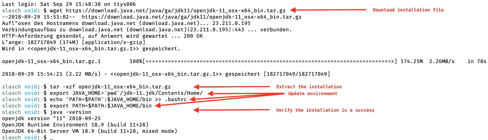

在 OS X 中安装 JDK 11

Linux 中的安装流程如此相似，以至于我们甚至没有在截图中使用箭头：

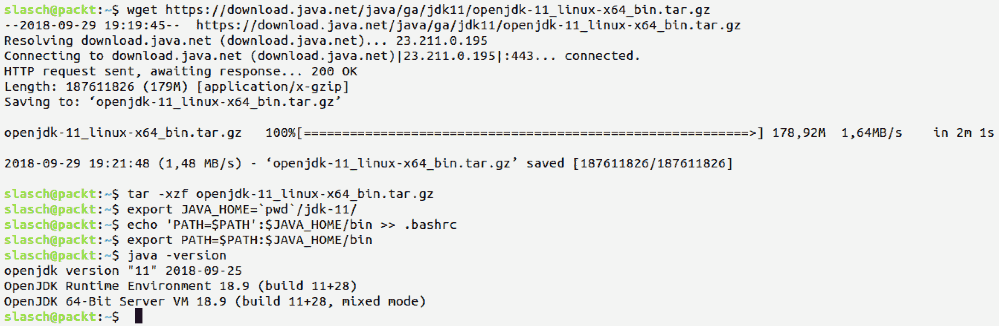

Linux 中的相同步骤

在 Windows 上，您需要使用网络浏览器下载安装程序包，使用文件导航器解压缩它，并使用系统设置更新路径变量。请注意，Java 11 仅提供 64 位版本，因此如果您有 32 位系统，您必须安装 JVM 的早期版本。

请按照以下截图中的步骤进行设置：

1.  首先，从互联网下载安装文件：

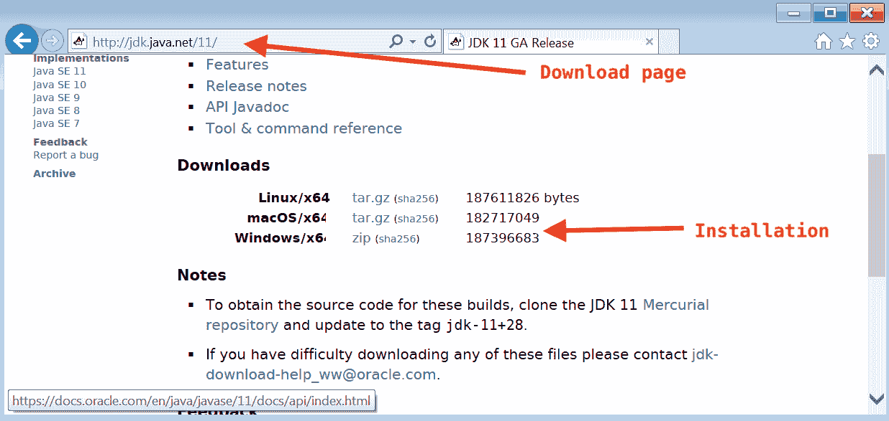

第 1 步：使用网络浏览器下载安装程序

1.  然后，从存档中提取 Java 运行时：

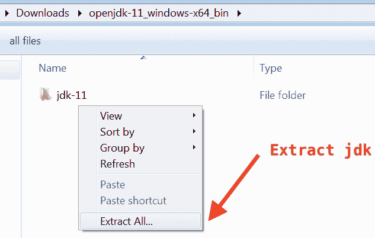

第 2 步：从下载的捆绑包中提取二进制文件

1.  接下来，需要通过修改相应的属性来扩展系统路径：

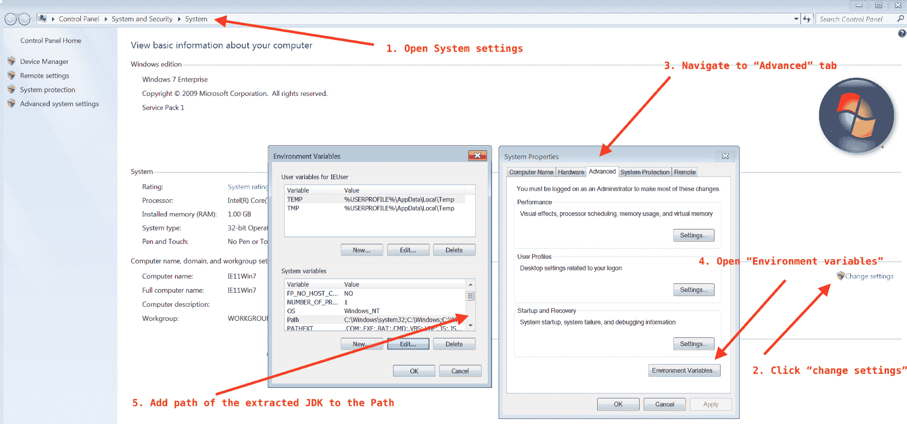

第 3 步：更新环境的五个动作

1.  最后，可以检查 Java 的版本：

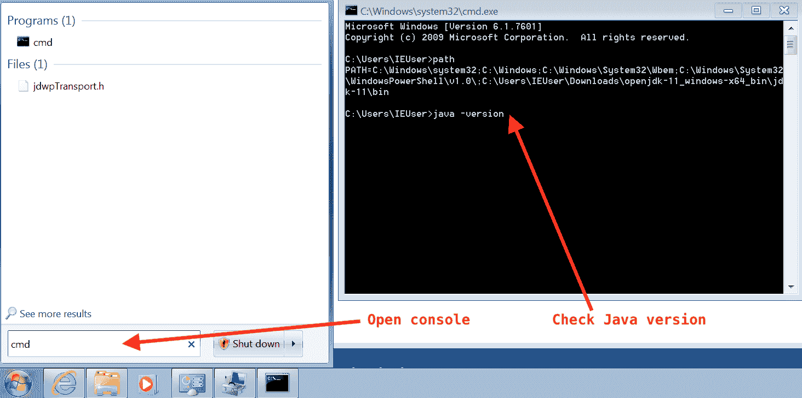

完成安装并检查 Java 版本

安装 Java 后的下一步是安装 SBT。您不需要单独安装 Scala 就能使用本书的示例代码。

# 安装 SBT

对于简单的构建工具 SBT，有几种安装选项：使用 `apt-get`、`brew` 或 `macports` 等工具，或者手动安装。首先，我们将介绍手动设置。

对于 Linux 和 macOS，步骤与 JDK 相同：

1.  获取安装包。

1.  解压下载的文件。

1.  更新环境。

SBT 的最新版本可以在相应的网站上找到，网址为 [`www.scala-sbt.org/download.html`](https://www.scala-sbt.org/download.html)。

在 Linux 或 macOS 上，您可以使用下一张截图所示的方式使用命令行来执行这三个安装步骤：

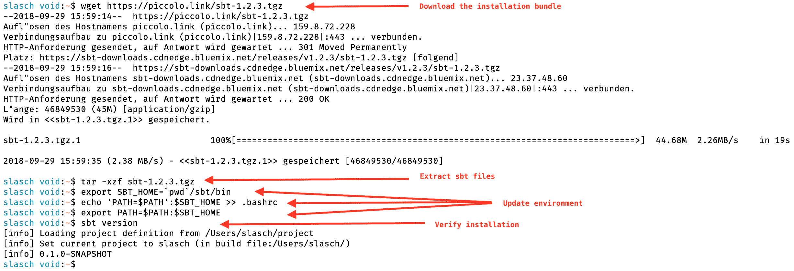

我们在 GitHub 仓库的 `附录` 文件夹中包含了一个安装脚本，以节省您输入。

在 Windows 上，安装方式略有不同。网站将提供 MSI 安装包供下载，下载后可以通过双击它来安装，如下所示：

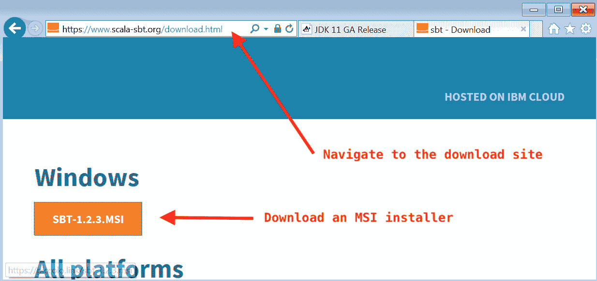

下载 SBT 安装包

下载 SBT 安装程序后，可以执行：

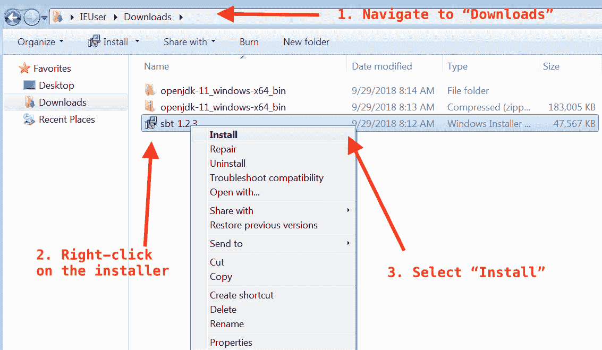

开始 SBT 安装的步骤

安装开始后，只需按照向导中的步骤完成设置即可。

# 使用代码

本书中的代码示例可以在以下 GitHub 仓库中找到：[`github.com/PacktPublishing/Learn-Scala-Programming`](https://github.com/PacktPublishing/Learn-Scala-Programming)。

在本节中，我们将简要介绍如何使用 SBT 控制台和 Scala REPL 下载和使用源代码。

# 获取代码

推荐的安装配套代码的方式是使用 Git 工具进行克隆。由于我们可能需要更新和改进代码，这将使我们能够轻松获取未来的更改。请参考您操作系统的 Git 工具安装说明。

在这种情况下，没有可用的 Git 工具；可以使用网络浏览器或其他下载工具下载源代码。GitHub 仓库中有一个“下载 ZIP”按钮，可以生成用于下载的正确 URL，如下所示：

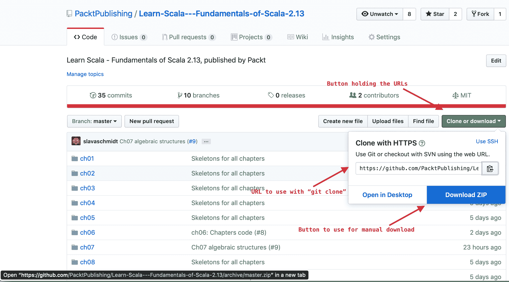

以下截图演示了克隆和下载源代码的两种方法：

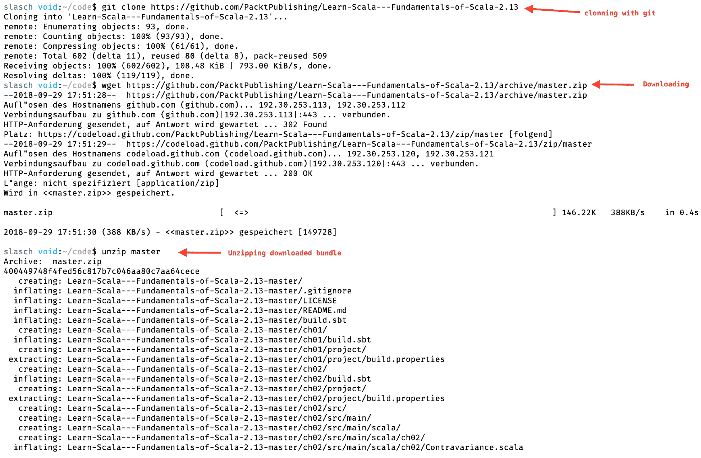

克隆或下载源代码完成首次设置过程。

# 与源代码一起工作

源代码组织方式是，每个章节都有自己的文件夹，按照惯例命名为第一章，*Scala 2.13 简介*到第十五章，*项目 2 - 使用 Lagom 构建微服务*。您可以通过导航到相应的文件夹并启动 SBT 来实验示例。建议偶尔发出`git pull`命令以获取克隆存储库的最新更新和错误修复，如下所示：

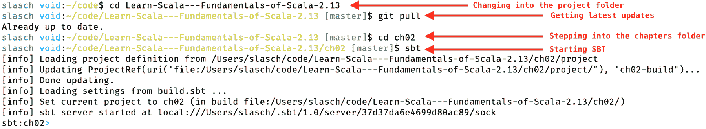

每一章都有自己的配置文件，`project/build.properties`和`build.sbt`。前者配置要使用的 SBT 版本，后者配置所需的 Scala 版本和其他依赖项。SBT 将根据需要下载和缓存所有配置的版本。这就是为什么我们不需要单独安装 Scala。

# 使用 SBT 控制台

启动 SBT 后，用户将进入交互模式或 SBT **shell**。shell 允许发出不同的命令来驱动 SBT 进行测试、执行或对源代码进行其他操作。对我们来说最重要的是以下命令：

+   `exit`: 关闭 SBT 并退出到终端 shell

+   `test`: 运行当前项目中的所有测试套件（如果`src/test/scala`文件夹中有）

下一张截图显示了 SBT 如何编译和运行第十一章，*Akka 和 Actor 模型简介*的测试：

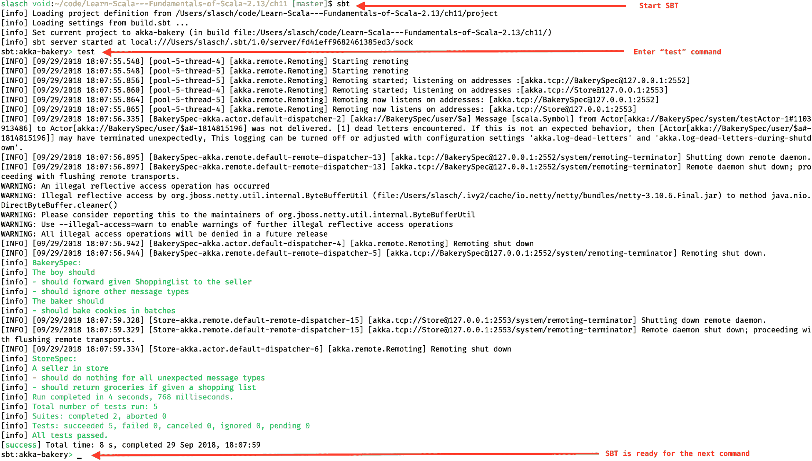

+   `run`: 如果项目中只有一个主类，则运行主类。如果无法检测到`main`类，此命令将抛出异常。如果有多个主类，SBT 将要求您从中选择一个来运行。此行为如以下截图所示：

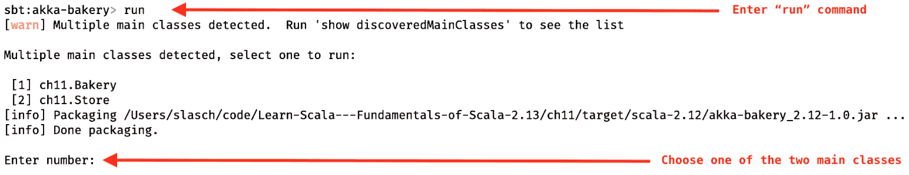

+   `console`: 启动 scala REPL

# 使用 REPL

REPL 是用于评估 Scala 表达式的工具。可以通过在命令行中输入`scala`或直接从 SBT 会话中启动。从 SBT shell 启动它的好处是，所有为项目配置的依赖项都将可用，如下一张截图所示：

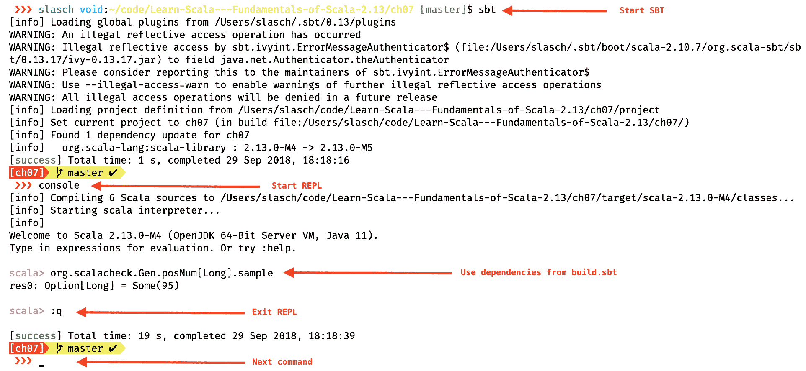

请参考[`docs.scala-lang.org/overviews/repl/overview.html`](https://docs.scala-lang.org/overviews/repl/overview.html)中的 Scala 文档，了解如何高效地使用 REPL。

要退出 REPL 并返回 SBT shell，请输入 `:q`.
