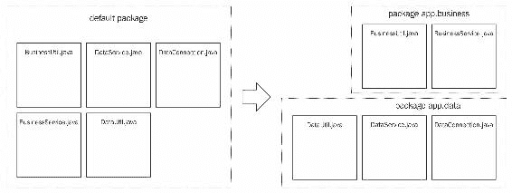
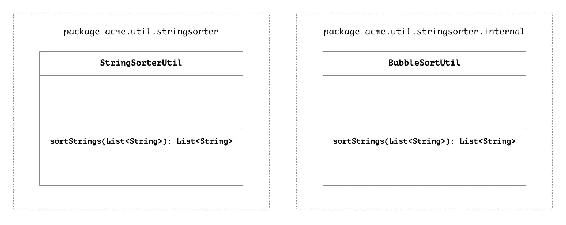
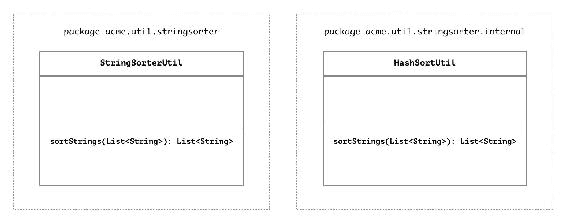
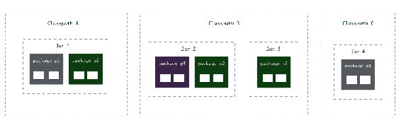
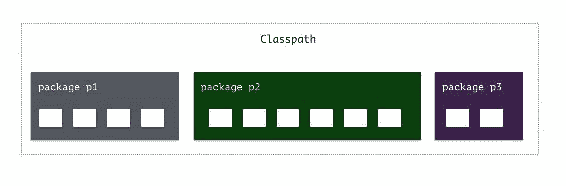
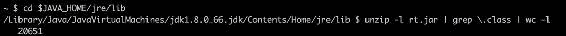
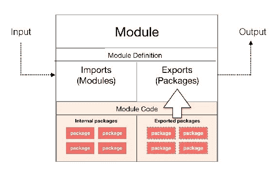
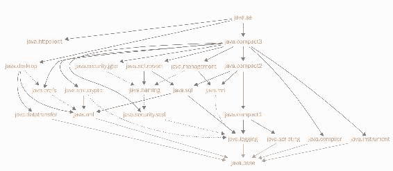

# 介绍 Java 9 模块化

本书涵盖了 Java 9 中的模块化特性——这是 Java 编程语言的一个重要新变化。我们将探讨它对 Java 开发的影响以及如何使用它来构建强大的模块化应用程序。Java 9 的发布还带来了一些其他变化，例如支持 HTTP 2.0 和一个名为`jshell`的 shell，它允许你在**读取-评估-打印-循环**（**REPL**）中运行 Java 代码片段。虽然这些都是令人兴奋的新变化，但它们并不是本书的重点。我们将主要关注模块化特性，这些特性在 Java 9 发布的新变化中可能是最重要和最强大的。

本章通过以下主题介绍了 Java 9 中的新模块特性：

+   检查在构建 Java 应用程序时遇到的两个重要的结构和组织问题，以及它们的影响

+   为什么 Java 甚至需要模块化特性？我们现在缺少什么？模块化能给我们带来什么？

+   介绍**Java 平台模块系统**（**JPMS**）

+   理解 Java 模块系统旨在提供的优势

# Java 中的模块化

如果你已经是一名开发者一段时间了，你很可能已经意识到“模块”这个词可能是软件开发中最被过度使用的术语之一。模块可以指从一组代码实体、组件或 UI 类型到框架元素，甚至是完整的可重用库。有时，我们使用这个词在同一语境中暗示多个含义！

这是有充分理由的。在编写代码时，我们通常试图将代码库分解成更小的单元以管理复杂性。对于非常简单的程序之外，拥有一个单体代码库并不是一个好主意。这就是为什么*模块化编程*通常是一个受欢迎的软件开发方法。软件开发的模块化通常实现以下两个重要目标，具体如下：

+   分而治之的方法

当你需要解决一个庞大且看似无法克服的问题时，你会怎么做？*你将其分解！*你很可能将其拆分成更小的问题并逐一解决。

模块化的原则鼓励将大型代码库分解成更小的封装功能单元，然后组合起来作为一个更大的单元协同工作。这很好地符合我们人类通常用来解决大型问题的方法。此外，一旦你拥有了一组具有专门关注点的较小模块，你可以使用这些模块来解决各种其他问题。因此，我们也实现了*可重用性！*

+   实现封装和定义良好的接口

当你构建模块时，你有能力将模块的内部实现隐藏给模块的使用者。这些隐藏的实现细节通常被称为*封装*，而你向模块使用者暴露的部分通常被称为模块的*接口*。

尽管多年来 Java 开发者已经利用了许多不同的模式和最佳实践来编写和构建模块化和可维护的代码，但 Java 语言本身从未有过创建模块单元和构建模块化应用程序的原生支持，直到 Java 9。随着 Java 9 的推出，Java 开发者现在可以使用一种称为**Java 模块**的新结构来创建更小的代码单元，并将它们像积木一样组合起来，以构建更大的应用程序。除了向语言引入这一特性外，Java 9 还带来了对核心 Java 代码库的可能是最大的改进。**Java 运行时环境**（**JRE**）和**Java 开发工具包**（**JDK**）已经被重写，以使用模块化的概念，从而使核心 Java 平台本身实现了模块化。

当学习 Java 9 模块功能时，了解这些新功能与语言已有的其他功能相比增加了什么功能是很重要的。我们难道不能在 Java 8 中编写有组织的代码吗？事实上，面向对象编程的一个好处确实是将功能分解成称为*对象*或*类*的子单元的想法。我们自从 Java 1 版本以来就是这样编写代码的。每个 Java 类都包含整体应用程序功能的一部分，这些功能碰巧属于一起。我们有能力将某些功能*封装*为类内部的（作为`private`），而将其他一些功能作为外部（或`public`）。

然后还有介于`protected`之间的一些内容，这得益于包的概念。

# 重新思考使用包的 Java 开发

考虑一下为什么我们在 Java 中使用包。我们完全可以编写整个 Java 应用程序而不创建任何包，从而仅使用默认的*未命名*包。这也可以工作！然而，除非它是一个简单或一次性应用程序，否则这不是一个好主意。包的概念是将你的 Java 类型分组到命名空间中，这些命名空间表示这些类型之间的关系，或者可能是这些类型之间的一个共同*主题*。这使得代码更容易阅读、理解和导航。

以下图表展示了类在包中组织的一个示例。将所有类添加到单个包中（左侧）并不是一个好的实践。我们通常将相关的类分组到具有良好命名的包中，这些包描述了其中类的本质（右侧）：

实际上并没有关于在包中哪些类型属于一起的规则。然而，通常人们认为，当你创建一个包并将一些 Java 类型放入其中时，这些类型通常以某种方式相关。你完全可以随意在同一个包中编写任何随机的类型集，编译器也不会在意。然而，最终会有人在你代码上工作，他们可能会永远讨厌你，所以这不是一个明智的做法！在公共包中有相关类型也有好处，即这些类型能够访问彼此的保护成员。这是封装的另一个层次--任何保护成员或方法都被封装在包的类型中。（尽管，有一个例外，即继承类能够跨包访问私有成员。） 

那么，如果你认为模块化编程是将代码和功能分解成封装单元的想法，那么在 Java 9 之前，你可以在某种程度上很好地进行某种模块化编程。

下表展示了在 Java 9 之前，你可以用各种方式在 Java 中封装代码：

| **要封装的内容** | **如何封装** | **封装边界** |
| --- | --- | --- |
| 成员变量和方法 | `private`修饰符 | 类 |
| 成员变量和方法 | `protected`修饰符 | 包 |
| 成员变量、方法和类型 | 无修饰符（默认包 - protected） | 包 |

这不是足够好吗？实际上并不够。前面的表格显示了语言模块化能力的一个限制。注意“要封装的内容”这一列。这些修饰符提供的多数封装功能都集中在控制成员变量和方法访问上。真正保护类型访问的唯一方法是将它设置为包保护的。不幸的是，这最终使得即使是你的库代码访问该类型也变得困难，你被迫将所有访问该类型的代码移动到同一个包中。如果你想要更多呢？

为什么呢？使用 Java 8 和更早版本中可用的先前的范式来处理模块化存在一些问题。让我用两个故事来解释这两个问题。

# 一个库开发者的不幸故事

见杰克。他是一家中型企业组织的 Java 开发者。他是编写数据处理代码的团队的一员。有一天，杰克编写了一些 Java 代码来按字母顺序排序用户名列表。他的代码运行良好，没有任何错误，杰克为自己的工作感到自豪。由于这是其他开发者可以在组织中使用的，他决定将其构建为一个可重用的库，并以打包的 JAR 文件的形式与同事分享。以下是杰克库的结构：

他的代码属于两个包--`acme.util.stringsorter` 和 `acme.util.stringsorter.internal`。主要的实用类是 `StringSorterUtil`，它有一个方法--`sortStrings`。该方法反过来内部调用并委托排序责任给 `acme.util.stringsorter.internal` 包中的一个类中的 `BubbleSortUtil.sortStrings()` 类。`BubbleSortUtil` 类使用流行的冒泡排序算法对给定的字符串列表进行排序。

任何开发者所要做的只是将 jar 文件放入类路径中，并通过传递需要排序的字符串列表来调用 `StringSorterUtil.sortStrings()` 方法。他们确实这么做了！杰克的小型库变得非常受欢迎！他的同事们非常喜欢他的库提供的便利性，并开始用它来排序许多东西，比如名字、令牌、地址等等。

几个月后，杰克偶然在饮水机旁遇到了达里尔，像往常一样，他们的对话转向了关于他们当前最喜欢的排序算法的讨论。达里尔无法停止谈论他对哈希排序的新发现之爱。他说他发现它的性能比冒泡排序要好得多，而且他毫不掩饰地宣称这是他新的最爱算法！杰克感到很感兴趣。他回到自己的办公桌前进行了一些测试。达里尔是对的！在大多数测试中，哈希排序都优于冒泡排序。杰克当时就知道他必须更新他的排序实用工具以使用哈希排序。他在 `acme.util.stringsorter.internal` 包中添加了一个新的类 `HashSortUtil` 并移除了 `BubbleSortUtil`。

以下是杰克库变更后的结构：

幸运的是，他有一个单独的内部类用于排序，所以调用 `StringSorterUtil.sortStrings()` 实用工具的过程不会改变。每个人都可以简单地放入新的 JAR 版本，一切都会正常工作。

但事实并非如此！他公司中的一些代码构建开始失败。结果发现罪魁祸首是杰克库的新版本。杰克不敢相信这一点。他没有遗漏任何东西，是吗？嗯，没有。所有只使用 `StringSorterUtil` 类的项目都运行得很好。然而，结果发现一些开发者最终直接使用了内部包中的 `BubbleSortUtil` 类。它在类路径中可用，所以他们只是导入并使用了它。现在，由于那个类在新 jar 中不再存在，他们的代码无法编译！

杰克发送了一封电子邮件，指示所有使用`BubbleSortUtil`的人更新他们的代码，改用`StringSorterUtil`。然而，那时`BubbleSortUtil`类已经被多处使用，要全部更改并非易事。“杰克就不能把`BubbleSortUtil`类恢复回来吗？”他们问道。杰克屈服于他们的请求，下一个版本的库同时包含了`SortUtil`类（并且可能会持续到可预见的未来），尽管它内部只使用了这两个类中的一个。

烟尘散去后，杰克坐在他的办公桌前，思考出了什么问题。他本可以做些什么来防止这个问题？显然，将包命名为内部并没有阻止开发者使用它。一个解决方案可能是将内部冒泡排序类型写成包保护，并将外部类型移动到同一个包中。这样，他就可以利用前面封装表中的第三个机制。然而，他喜欢将冒泡排序类分离成自己的类型和包的想法。此外，想象一下，如果这是一个更大的库，并且有一个应该内部共享的公共类。在这种情况下，几乎那个库中所有需要内部类型的类型都必须存在于与内部类型相同的包中！难道没有更好的封装内部类型的方法吗？

# 部署工程师的艰巨任务

来认识阿米特，他是另一家企业技术公司的一名部署工程师。他的工作是确保在每次产品发布时，组织的代码库在生产环境中正确编译和部署。在每次发布中，他都会拉取应用程序代码和所有必要的 jar 文件，并将它们放置在类路径中。然后他启动应用程序，这将导致**Java 虚拟机**（**JVM**）加载所有类并初始化执行。

一天晚上，有一个主要产品功能的发布。代码有很多更改，都计划一起部署和发布。阿米特确保所有新代码都正确编译，并且他在类路径中有了所有必要的 jar 文件。然后他必须启动应用程序。在点击按钮启动构建之前，阿米特想知道是否有办法确保一切正常，并且应用程序在没有运行时类错误的情况下能够工作。

可能出错的另一件事是他可能遗漏了在类路径中添加某个类或 jar 文件。他是否有办法在实际上运行应用程序之前静态地验证所有类是否可用？

每个 JAR 文件都包含了一组包中的类型。其中每个类型都可能从同一 JAR 文件或其他 JAR 文件中导入其他类型。为了确保他在类路径中有所有的类，他必须对每个类进行检查，以确认所有导入都在类路径中。考虑到他的应用程序中的类数量达到数千个，这是一项艰巨的任务。

下面的图是示例部署的 Java 应用程序的简化版本：

上图中有四个 JAR 文件，每个文件都包含其中的包和类。**Jar 1** 部署在**Classpath A**中，**Jar 2**和**Jar 3**在**Classpath B**中，**Jar 4**在**Classpath C**中。假设每个 JAR 文件中有两个类，如较小的白色方框所示。这三个路径被配置为 Java 运行时的类路径，因此运行时知道要查看所有三个路径以扫描和拾取类。

扫描完所有类路径后，这就是 Java 运行时看到的结构：

注意到运行时并不关心包/类型所在的目录或类路径。它也不关心包/类型捆绑在哪个 JAR 文件中。对 Java 运行时来说，它只是一个包中类型的扁平列表！

在 Java 中，类路径只是一组路径。这些位置中的任何一个都可能包含应用程序运行所需的所有 JAR 文件和类。你可以立即看到事情为什么会变得如此容易出错！总有可能应用程序使用的某些类不在类路径中。可能是一个缺失的 JAR 文件或库。如果运行时不具有它需要的特定类，应用程序可能会正常运行，但稍后抛出`NoClassDefFoundError`异常。同样，只有在执行到达实际需要缺失类的点时，才会抛出这个异常。

这是目前大型 Java 应用程序中一个巨大且非常现实的问题。为了解决这个问题，已经出现了一个完整的解决方案生态系统。例如，工具和构建实用程序，如 Maven 或 Gradle，标准化了指定和获取外部依赖项的过程。基于流程的解决方案，如持续集成，旨在解决跨各种开发环境构建不可预测性的问题。然而，这些工具所能做的只是使过程*可预测*。它们无法验证它们帮助组装的结果的*有效性*或*准确性*。一旦获取了依赖项，这些工具就无能为力，无法检测类路径中缺失或重复的类型。

回到 Amit 的故事。由于无法在部署前验证所有类是否可用，Amit 寄希望于最好的情况并部署了应用程序。应用程序启动正常，运行了几个小时没有出现任何错误。然而，仍然无法确定他是否做对了。也许有一个类还没有被执行，但一旦执行，JVM 可能会意识到它找不到其中一个导入。或者，也许在类路径中有相同类的重复版本，JVM 选择了它找到的第一个副本。难道没有更好的方法来确保任何给定的 Java 应用程序在部署/运行之前都能可靠地工作吗？

# 类路径问题

我们在 Jack 和 Amit 的故事中看到了两个问题。Jack 需要一个有效的方法来*封装*他库的一部分，但他做不到。Amit 需要一个方法来*确保*他的应用程序在没有实际执行的情况下可靠地执行。由于 Java 中类路径解析的方式，Jack 和 Amit 都没有真正解决他们的问题。我们有时可能会错误地将 JAR 文件视为在 Java 中构建可重用模块的方法，但不幸的是，情况并非如此。JAR 文件只是类的一个方便的捆绑包。仅此而已！一旦在类路径中，JVM 对待 JAR 中的类与同一根目录中的所有单独类文件没有区别。在运行时，对 JVM 来说，应用程序只是一个包的扁平列表中的类集。

更糟糕的是，一旦一个类在类路径中，它就是公共的。任何开发者都可以非常容易地使用他们不应该使用的类型，或者在他们编译/部署/运行时可能可用的类型。或者，在两个不同的类路径位置可能有相同类的多个副本甚至多个版本，这使得在执行期间无法预测运行时将选择哪个版本。有一个常见的问题被称为**JAR 地狱**，它指的是由于 JAR 文件中不匹配和不正确的类和版本而产生的一系列问题。

在拥有数十万个类的巨大代码库中，这个问题更为严重。想象一下，你的应用程序中的所有这些类都像是一个没有结构的扁平列表！维护和组织起来就像是一场噩梦。代码库越大，问题越大。为了说明这一点，让我们以一个经典的例子来说明，这是一个用 Java 编写的代码库，它非常庞大且复杂，并且已经存在多年。它可能是有史以来最古老的 Java 代码库之一，而且它仍然以相当快的速度持续增长和变化。有什么猜测吗？好吧，它是 Java 平台本身！

# Java - 20 年的代码库

来谈谈单体架构吧！自 1996 年首次发布以来，Java 已经走了很长的路。JDK 的第一个主要版本有超过 500 个公共类。与 2014 年发布的 JDK 8 相比，这相去甚远，JDK 8 有超过 4,200 个公共类和超过 20,000 个总文件。

以下命令提取了 `rt.jar` 文件，这是 JDK 8 中捆绑的库 JAR 文件，并计算了其中的类数量。在我的机器上安装的 Java 8 版本中，计数为 `20651`：

JDK 和运行时，即 JRE，多年来一直在增长。语言中添加了许多功能，因此这种增长是可以理解的。然而，Java 语言也以其不遗余力地保持向后兼容性而闻名，并且除非绝对必要，否则它不愿意弃用功能。因此，从某种意义上说，当前运行时的大小略大于理想情况下的理想大小。

通常情况下，大多数应用程序开发者不需要担心 JDK 代码库。他们只需关注自己的应用程序代码。然而，由于打包方式的原因，运行时的内容对于应用程序的执行确实很重要。传统上，每个 JRE 都会将所有必要的运行时类打包成一个名为 `rt.jar` 的单个 JAR 文件，该文件位于 lib 目录中。正如你可能猜到的，名称 `rt` 代表 **运行时**。

不仅这个庞大的类库在大小上不必要地庞大，它还增加了 Java 虚拟机管理的性能开销。而且，这是所有应用程序执行环境必须支付的价格，无论是否使用了所有这些类。

# 旧类

一个不需要的类的例子是 JRE 中与 CORBA 相关的类集。你听说过 CORBA 吗？如果你没有，不要绝望。这有一个原因！它是一种老技术，早在 Java 1.4 版本中就被引入到 Java 运行时中。从那时起，它已经基本上不再被广泛使用。考虑到大多数应用程序不再使用 CORBA 技术，如果应用程序可以与不包含不必要 CORBA 类的 JRE 打包在一起，那岂不是很好？

很遗憾，这不可能，同样是因为 `rt.jar`。由于所有内容都被打包到一个单独的运行时 JAR 中，你无法选择你需要的功能。每个人都会得到一切。由于运行时的大小在增加，因此独立的可部署应用程序的大小也在增加。当运行时需要在资源有限的较小设备上使用时，这是一个更大的挑战。如果你将运行时与一个简单的 *Hello World* 应用程序捆绑在一起，该应用程序只使用了运行时中的一小部分类，你除了将 `rt.jar` 中的大量未使用类与之捆绑外别无选择。而且，是的，甚至那些旧的 CORBA 类也加入了这次旅行！

Java 8 引入了配置文件的概念，因此从技术上讲，你可以部署更小的运行时。但它们确实有一些缺点。此外，这个特性只是 Java 9 中引入模块化特性的第一步。我们将在第四章 介绍模块化 JDK 中详细探讨紧凑配置文件。

# 内部 API

记得 Jack 与他自己的`BubbleSortUtil`类遇到的问题吗？这是一个他写的 Java 类，目的是使其仅限于他的库。然而，尽管它最初是一个私有的*内部*类，但它最终变成了一个*公共*类，因为其他开发者只是决定使用它。

那只是一个小的库。现在，想象一下一个像 Java 运行时那样大且广泛使用的库。Java 运行时显然捆绑了其功能所需的内部类，这些类并不打算被应用程序开发者使用。然而，考虑到其使用的规模，一些内部类无意中被开发者使用并不令人惊讶。

这的一个经典例子是`sun.misc`包中的一个名为`Unsafe`的类。这个听起来不祥的类已经成为了每个主要 JDK 版本的一部分。你能猜到它做什么吗？它包含了一组方法，根据类的作者，执行*低级不安全操作*。是的，它实际上在类的注释中这样说的！例如，它有一个从内存地址获取值的方法。这不是 Java 应用程序开发者典型的一天的工作！你不会，理想情况下也不应该作为应用程序开发者做这样的事情。这就是为什么这个类被标记为内部 API。你想查找它的 Javadoc 来使用它吗？你不会在那里找到它。你想创建这个类的新实例吗？它的构造函数被标记为私有。如果你 somehow 使用了它并编译了你的代码，从 Java 6 以来的每个 Java 编译器都会给你一个讨厌的警告，劝阻你使用这个类。而且，如果你还需要更多避免使用它的理由，最好的办法就是看看类的名字！

你现在肯定已经猜到了接下来会发生什么。尽管 Java 运行时作者已经采取了所有预防措施，但`sun.misc.Unsafe`类已经被许多开发者用于多个项目中，以执行那些非常低级的操作。有人可能会争辩说，它实现了在其他地方不常见的功能，对于一个需要做类似事情的开发者来说，没有什么能比在类路径中找到并准备好使用它更好了。当然，`Unsafe`并不是唯一以这种方式使用的内部 API。还有一些其他内部类，许多在`sun.*`包中，多年来开发者们一直在使用，尽管他们不应该这样做。此外，只要开发者继续使用这些 API，就越来越难以从运行时中移除它们。这最终导致这些类在运行时的后续版本中继续存在，从而允许更多的开发者使用它们！

这些关于 Java 运行时和库系统的限制已经存在了一段时间。我之前概述的所有问题都存在，因为 Java 缺乏创建模块化代码单元的能力。这种结构在语言中至今尚未存在。社区对此需求强烈。

多年来，人们提出了多个为 Java 创建模块系统的建议，包括 2005 年的 JSR-277([`jcp.org/en/jsr/detail?id=277`](https://jcp.org/en/jsr/detail?id=277))和 2006 年的 JSR-294([`jcp.org/en/jsr/detail?id=294`](https://jcp.org/en/jsr/detail?id=294))。在面临了多次挑战后，模块化终于在 2017 年 Java 9 的发布中到来，伴随着 JSR-376([`jcp.org/en/jsr/detail?id=376`](https://jcp.org/en/jsr/detail?id=376))的发布，该规范名为 Java 平台模块系统，以及 Project Jigsaw。

缩写提醒：JCP 和 JSR

**JCP**：Java 语言规范长期以来一直是社区拥有的资产。没有一个人中央权威机构对语言如何发展拥有完全的控制权和决策权。作为 Java 开发者，我们每个人都可以对语言如何改变和成长发表意见。**Java 社区过程**（**JCP**）是一种机制，于 1998 年引入，允许任何对语言规范未来感兴趣的人注册、提供反馈并参与技术规范过程。访问[`jcp.org`](https://jcp.org)了解更多信息。

**JSR**：假设你是 Java 社区过程的一部分，并且你有一个关于语言规范变化的绝佳想法。你所做的是创建一个**Java 规范请求**（**JSR**）——一份正式文件，描述了拟议的更改。JSR 在成为最终版本之前，作为社区过程的一部分进行审查和投票。一旦 JSR 成为最终版本，它就会被开发，并最终成为语言规范的一部分。

有趣的事实：Java 社区过程本身是语言的重要组成部分，因此对其的更改也像对语言的任何其他更改一样处理——通过提交一个针对它的 Java 规范请求。是的，有一个描述 JCP 的 JSR！

# Java 平台模块系统

Java 9 中的模块化特性统称为**Java 平台模块系统**（**JPMS**）。它引入了一种新的语言结构来创建可重用的组件，称为*模块*。Java 平台模块系统使得开发者能够创建具有明确依赖其他模块的封装单元或组件变得容易。使用 Java 9 模块，你可以将某些类型和包组合成一个模块，并为其提供以下信息：

+   **其名称**：这是模块的唯一名称

+   **其输入**：模块需要什么并使用什么？给定模块要编译和运行需要什么？

+   **其输出**：这个模块输出或导出到其他模块的是什么？

我很快会解释输入和输出配置，但非常简单地说，在创建新模块时，您通常需要提供这三条信息。每当开发者需要创建任何旨在可重用的组件时，他们可以创建新的 Java 模块，并提供这些信息来创建一个具有清晰接口的代码单元。由于模块可以正式指定其输入和输出，与迄今为止我们批评的类路径方法相比，它增加了一系列优势。

现在我们一步一步地看看创建模块的过程。我们现在从概念层面来探讨它，而关于语法的内容将在第二章“创建您的第一个 Java 模块”中进行介绍。假设您想创建一个可重用的库，并且已经决定将您的代码放在一个 Java 9 模块中。以下是您需要遵循的步骤：

1.  **创建模块并为其命名**：每个模块都与一个名称相关联，这是为了显而易见的目的——引用它。您可以给模块起任何您传统上会给类型起的名字。您已经熟悉的有关 Java 包名的所有规则都适用于这里（所以某些字符，如`'/'`或`'-'`是不允许的，但`'_'`或`'.'`是可以的）。命名模块的推荐方法是使用*反向域名*约定，类似于您命名包的方式。例如，如果 Acme 公司的人编写了一个分析模块，他们可能会将模块命名为`com.acme.analytics`。

1.  **定义模块输入**：实际上，很少有模块可以真正自给自足。您通常会需要导入不在您模块中的类型。这就是模块输入配置发挥作用的地方。当您创建一个模块时，您需要明确声明哪些*其他模块*对您的代码运行是必需的。您通过指定您的模块*需要*哪些模块来完成这项工作。

1.  **定义模块输出**：我们已经看到，在传统的 JAR 文件系统中，将 Java 类型放入 JAR 文件实际上并没有什么意义，并且每个公共类型都可以被类路径中的任何其他类型访问，无论它位于哪个 JAR 中。模块的行为不同。默认情况下，您放入模块中的每个 Java 类型只能被同一模块中的其他类型访问。即使该类型被标记为 public！为了将类型暴露在模块之外，您需要明确指定您想要*导出*的*包*。从任何模块中，您只能导出该模块中存在的包。一旦导出了一个包，该包中的所有类型都可能对模块外部可访问。这使得每个 Java 模块可以清楚地分离和隐藏仅用于模块内部的*内部*包，并仅暴露旨在外部使用的类型。如果一个 Java 类型位于未导出的包中，那么模块外部的任何其他类型都无法导入它，即使该类型是 public！

注意从模块导出的内容（即包）与导入或要求的内容（即其他模块）之间的区别。由于我们正在以包级别从模块导出类型，为什么不要求包呢？原因很简单。当模块要求另一个模块时，它自动获得访问该模块导出所有包的权限。这样，你不必指定你的模块需要的每个包。只需指定你依赖的模块的名称就足够了。我们将在 第三章，*处理模块间依赖关系*中更详细地探讨访问机制。

以下图表说明了典型模块的输入和输出定义：

JPMS 是基于两个主要目标设计的：

+   **强封装**：我们已经看到了每个公共类对类路径中每个其他类都可见的危险。由于每个模块都声明了哪些包是公共的，并隔离了内部包，Java 编译器和运行时现在可以强制执行这些规则，以确保没有内部类在模块外部被使用。

+   **可靠的配置**：由于每个模块都声明了它需要什么，运行时可以在应用程序启动和运行之前很好地检查每个模块是否拥有它所需的一切。不再需要希望和期望所有必需的类都存在于类路径中。

你可以想象 Jack 和 Amit 听到这个消息会有多高兴！多亏了 **强封装**，Jack 只需将他的所有 `StringSorter` 代码放入一个模块中，并导出他的公共包。这样，他的 *内部* 包就会被隐藏，默认情况下不可访问。而且，多亏了 **可靠的配置**，Amit 总是可以在运行应用程序之前自信地说，给定的模块集是否满足所有依赖项。

除了这两个核心目标之外，模块化系统还被设计为具有另一个重要的目标——即使在巨大的单体库中也能实现可扩展性和易于使用。为了验证这一点，Java 9 团队继续对几乎所有他们能接触到的最古老和最大的 Java 代码库进行了模块化——即 Java 平台本身。这项任务，最终涉及了大量努力，被命名为 *Project Jigsaw*。

# Project Jigsaw

Oracle 的 Java 平台组成员 Alan Bateman 在 2016 年 9 月的 Java One 会议上说：

模块化开发从模块化平台开始。

无论应用程序的内容是什么，都有一组库是每个 Java 程序无疑都会使用的——Java 平台。为了使 Java 开发者能够编写模块化 Java 代码，核心 Java 平台和 JDK 库本身也必须是模块化的。在 Java 9 之前，JDK 中的所有类和类型都有如此复杂的相互依赖关系，它们就像一大碗意大利面。

不仅最终的`rt.jar`捆绑包不必要地大，它还使得 JDK 代码库本身更难更改和演进。考虑到这样一个庞大的代码库中的任何类型都可能被平台中的其他数千个类型使用，我不愿意去那里对那段代码进行任何重大更改。平台本身的问题之一是它始终缺乏隐藏和封装内部平台 API（如`sun.misc.Unsafe`）的方法。平台本身完全可以利用 JPMS 给我们带来的强大封装和可靠配置的好处。

使用 Java 9，我们终于得到了一个模块化 JDK，可以在其之上构建。各种不同的相关 JDK 类被捆绑到单独的模块中，每个模块都有自己的导入和导出。例如，SQL 相关类型在名为`java.sql`的模块中。XML 功能已进入`java.xml`模块，等等。我们将在第三章“处理模块间依赖”中更详细地查看这些即用型模块。

以下是新 Java 9 平台模块的一个子集的示例。不必担心个别名称。我们将在第四章“介绍模块化 JDK”中详细介绍平台模块：

Project Jigsaw 声称以下为其主要目标。在学习平台模块化的影响时，请记住这一点：

+   **可扩展的平台**：从单一运行时转向，并使平台能够扩展到更小的计算设备。

+   **安全和可维护性**：更好地组织平台代码，使其更易于维护。隐藏内部 API 和更好的模块化接口，以提高平台安全性。

+   **改进的应用性能**：平台更小，只包含必要的运行时，从而实现更快的性能。

+   **更便捷的开发体验**：模块系统和模块化平台的结合，使开发者更容易创建应用程序和库。

这对应用程序开发者意味着什么？最直接的区别是，现在不是所有 JDK 中的类型都可以在您的代码中访问。我们看到的相同机制也适用于 Java 模块。每次您依赖于平台类时，您都必须将包含该类的正确平台模块导入到您的模块中。即使如此，您也只有在类已被模块导出且是公共的时才能使用该类。

这样，JDK 代码库也获得了 JPMS 承诺的强大封装和可靠配置的所有优势。尽管如此，也存在潜在的向后兼容性问题。如果您在 JDK 8 或更早版本中使用了现在属于模块封装类的 JDK 类，会发生什么？这些代码在 Java 9 中将无法工作！平台使用封装功能来保护某些内部 JDK 类免受外部使用。因此，任何依赖于这些类在 Java 8 或更早版本的代码，在迁移到 Java 9 之前必须先移除该依赖。从 Java 8 或更早版本迁移到 Java 9 存在一些挑战。我们将在第九章“模块设计模式和策略”中探讨与 Java 9 迁移相关的挑战和最佳实践。

模块化的重要方面之一，大多数模块化平台都必须处理，而我们之前还没有涉及的是*版本控制*。模块是否可以版本化？您能否声明模块之间的依赖关系，指定需要一起工作的模块版本？您不能！Java 平台模块系统今天不支持版本控制。我们将在第三章“处理模块间依赖关系”中简要探讨其原因。

# 摘要

在本章中，我们从高层次的角度探讨了使用 JAR 文件在 Java 中构建可重用组件的传统方式的局限性。我们看到了将库打包到 JAR 文件中不允许开发者封装内部 API 和类型。也没有可靠的方法来确定给定应用程序是否在类路径中包含所有必要的类。我们了解到，开发者在其代码中遇到的问题不仅存在于 JDK 代码库本身，实际上是一个更大规模的问题。我们了解了 Java 平台模块系统及其设定的两个主要目标——强大的封装和可靠的配置。我们了解了*Project Jigsaw*以及使用与开发者在其代码中可用的相同模块化范式对核心 JDK 进行模块化的努力。

到目前为止，你可能想知道模块化的概念如何在 Java 语言中体现。Java 模块是什么样的？

在下一章中，我们将通过创建我们的第一个 Java 9 模块来回答这些问题，并开始我们的示例应用程序项目，我们将在这本书的整个过程中对其进行工作。
