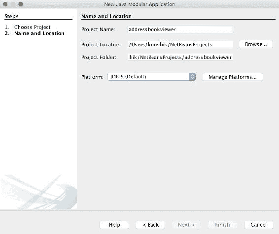

# 创建您的第一个 Java 模块

在上一章中，我们详细探讨了 Java 9 之前模块化 Java 代码时遇到的问题，以及 Java 9 中的新模块构造和*Project Jigsaw*。在我们检查 Java 模块化如何解决这些问题之前，您首先需要了解 Java 模块的外观。在本章中，您将创建您的第一个 Java 9 模块，并学习在 Java 模块中构建和执行代码所需的内容。以下是本章您将学习的顶级主题：

+   配置 Java 9 的 JDK

+   创建一个新的 Java 9 模块

+   定义模块（使用`module-info.java`）

+   编译和执行模块

+   处理可能的错误

在学习与模块化相关的不同概念的过程中，您将在这本书中构建一个示例 Java 9 应用程序。您将构建的应用程序是一个地址簿查看器应用程序，它按姓氏排序显示一些联系人。我们将从简单开始，并在进行中增强此应用程序。完成本章后，您将构建您的第一个 Java 9 模块，并学习如何编译和执行它。让我们首先安装 JDK。

# 配置 JDK

为了编写 Java 9 代码，您首先需要下载并安装 Java 9 SDK（称为 Java 开发工具包或 JDK）。在这本书中，我们将使用位于[`jdk.java.net/9/`](http://jdk.java.net/9/)的**OpenJDK**构建。当您导航到该 URL 时，您将看到基于您所使用的平台提供的可用下载列表，如下所示：


确保您在**JDK**列中选择适合您平台的下载，而不是**JRE**列。接受许可协议后，您应该能够下载适合您平台的安装程序。运行安装程序并选择默认选项；之后，您应该在您的机器上安装了 JDK 9：


安装完成后，验证 JDK 安装和配置过程是否成功完成是个好主意。您可以通过打开**命令提示符**或终端窗口来完成此操作。输入命令`java -version`以输出当前`PATH`中`java`命令的版本：

注意，安装程序会将已安装的 Java 二进制文件的路径添加到您的系统`PATH`变量中，这就是为什么这个命令可以工作。


此外，请确保已设置`JAVA_HOME`值。

在 macOS/Linux 上，输入命令`echo $JAVA_HOME`并确保返回的是 JDK 9 安装路径：


在 Windows 上，右键单击“我的电脑”，点击“属性”，然后切换到“高级”选项卡。在这里，点击“环境变量”并查看变量`JAVA_HOME`的值。它应指向您选择的 JDK 安装位置。例如，位置可能是类似`C:\Program Files\Java\jdk9`的东西。

通过这种方式，您现在已成功安装了 JDK 9，并准备好开始用 Java 9 进行编码！

# 在 JDK 之间切换

一旦你安装了比已安装的早期版本更新的 JDK，就可以切换当前选定的版本。

在 macOS 和 Linux 上，你通过切换`JAVA_HOME`的值来完成此操作

以下命令将当前 Java 平台切换到 Java 8：

```java
$ export JAVA_HOME=$(/usr/libexec/java_home -v 1.8)
```

要切换到 Java 9，请使用以下命令：

```java
$ export JAVA_HOME=$(/usr/libexec/java_home -v 9)
```

使用此命令，你正在将所选的 Java 版本传递给`-v`参数。但是，请注意，Java 8 和 9 之间的格式不同。对于 Java 8，版本字符串是`1.8`。对于 Java 9，版本字符串只是`9`。传统上，Java 一直使用`1.X`的版本格式，例如，Java 版本 7 的版本字符串是`1.7`。从 Java 9 开始，这种格式正在改变。想法是，Java 的后续版本将放弃`1.X`格式，只使用一个数字来表示格式。所以是 Java 9，而不是 Java 1.9。

是时候改变这个了！想象一下 Java 10 会造成的混乱！

在 Windows 上，通过更改`JAVA_HOME`和`PATH`变量来切换 JDK 版本。遵循前面的步骤进入环境变量部分。更新`JAVA_HOME`的值，使其指向所需版本安装的位置。同时，确保`PATH`已更新，以指向你想要切换到的 Java 版本的相应文件夹。

# 设置 NetBeans IDE

为了编写和遵循本书中的代码，你**不必**使用任何**集成开发环境**（**IDEs**）。本书将涵盖使用命令行手动编写、编译和执行代码。你可以使用你选择的文本编辑器编写代码。本书附带的代码示例也适用于本书中展示的步骤和命令。

你也可以跟随 IDE 进行操作。在撰写本文时，NetBeans 和 IntelliJ Idea 对 Java 模块化项目有越来越多的支持，Eclipse 的支持正在开发中。本章概述了在 NetBeans 中创建模块化项目的步骤，如果你选择使用 NetBeans IDE。为了设置它，除了遵循设置 Java 的步骤外，请确保通过访问[`netbeans.org/downloads/`](https://netbeans.org/downloads/)并选择 Java SE 或 Java EE 版本进行下载来安装 NetBeans 的最新版本，以便支持 Java 9 模块：


注意，如果你在阅读此内容时，NetBeans 的发布版本尚不支持 Java 9，你可能必须在此处下载早期访问副本：[`bits.netbeans.org/download/trunk/nightly/latest/`](http://bits.netbeans.org/download/trunk/nightly/latest/)。一旦下载安装程序并执行它，你应该在你的计算机上有一个全新的 NetBeans 副本，供你使用。

大多数经验丰富的 Java 程序员都会承认，他们已经很久没有手动为 Java 项目创建文件夹结构了。多年来，Java 语言受益于极其有用的工具支持。例如，Eclipse、NetBeans 和 IntelliJ IDEA 等 IDE 使得创建源和包文件夹变得非常容易，以至于开发者甚至不太经常考虑代码组织的这些方面。然而，在本章中，实际上在本书的其余部分，我们将学习如何手动构建文件夹和文件，以及通过在命令行中手动执行命令来编译和运行代码。这是因为尽管 IDE 可能很方便，但它们往往隐藏了代码结构和编译过程的细节和运作。我们的目的是检查 Java 9 模块是如何工作的，以及代码结构的基本运作，以及编译和链接命令对于掌握这些概念是至关重要的。

虽然在没有 IDE 编写 Java 代码的前景可能看起来令人畏惧，但请让我向您保证，这将是您很快就会习惯的事情。在本章中，您将学习构建和执行模块化 Java 9 代码的步骤，然后只需根据代码库本身的复杂性应用相同的步骤即可。

# Java 9 模块

当在 Java 9 中编写应用程序时，理想情况下您正在创建一个模块化应用程序。需要注意的是，模块化 Java 应用程序并不仅仅是一个带有额外模块功能的常规 Java 应用程序（就像我们这些年一直在构建的那样），它实际上要求我们以全新的方式思考编写和结构化代码库。在我们开始创建 Java 9 模块之前，让我们快速回顾一下 Java 9 之前的传统 Java 代码结构。

# 传统 Java 代码结构

传统上，编写 Java 应用程序从创建一个或多个源目录开始。这些目录具有两个特殊目的——首先，它们是 Java 源代码的根位置，其次，这些目录的内容被添加到类路径中。因此，组织源代码的步骤通常如下：

1.  创建一个或多个源文件夹。

1.  在源文件夹中，创建与包名相对应的包文件夹。

1.  将`.java`文件放置在正确的包文件夹中：


许多 Java 开发者使用`src/main/java`目录结构作为源目录。例如，包`com.acme.app`中的`Main.java`类的完整路径将是`src/main/java/com/acme/app/Main.java`：


这就是多年来开发者通常如何组织 Java 源代码的方式。随着 Java 9 模块的出现，我们在结构和编写代码的方式上发生了变化。让我们转换一下思路，看看 Java 9 中的模块是什么样的。

# 什么是模块？

**模块**是 Java 9 编程语言中引入的新结构。将模块视为一等公民，以及语言中的新程序组件，就像类或包一样。Java 9 模块是一个命名、自我描述的代码和数据集合，你可以在 Java 应用程序中创建和使用它。模块可以包含任意数量的 Java 包，这些包又包含 Java 代码元素，如类或接口。Java 模块还可以包含资源文件或属性文件等文件。应用程序是通过将这些模块组合在一起来构建的。构建积木的类比在这里适用得很好——模块是一个独立的构建块，但也可以成为更大整体的一部分。

使用 Java 9 模块化编程，我们不再以单体代码库的形式构建应用程序，而是将问题分解为模块。换句话说，与其拥有一个庞大的 Java 项目，不如创建几个模块单元，它们共同协作形成一个应用程序。

这在很大程度上影响了你的应用程序设计和编码方式。在 Java 8 及之前版本中，你的设计过程涉及将问题分解为类和包。在 Java 9 中，你首先将问题分解为模块。这些模块理想情况下是具有清晰接口（输入和输出）的可重用组件，解决问题的特定部分。然而，在每个模块内部，设计和编写代码的过程，或多或少，与使用包、类、接口等常规操作相同。

# 创建模块

这里是创建 Java 9 模块的步骤。在你开始进行**步骤 1**之前，我应该提到一个明显的起点——**步骤 0**：了解模块的目的。在开始创建模块之前，你应该清楚地知道模块的用途。记住模块化开发的重要原则！与其为应用程序拥有一个大的代码库，不如将问题分解为可重用的子项目。想想可重用库。主要区别在于，这些库不仅仅是作为 Java 包和类型的集合的独立 JAR 文件，我们正在利用 Java 模块的概念来分组这些包和类型：

1.  **指定模块名称**：创建模块的第一步是为模块想出一个独特的名称。理想情况下，该名称应描述模块的内容和解决的问题。Java 模块名称应是一个有效的 Java 标识符，因此不能使用某些字符，例如连字符和斜杠。有效的包名也是有效的模块名称。但除此之外，任何名称都可以，只要它在应用程序中是唯一的。然而，为了避免名称冲突，你不希望将模块命名为非常通用的名称，例如`util`。

建议使用多年来在 Java 中为包名所采用的相同约定--使用反向域名模式。还建议您使用全小写命名模块，就像包一样。例如，如果您为 Acme 公司编写一个字符串实用模块，模块的名称可以是`com.acme.stringutil`。

1.  **创建模块根文件夹**：每个 Java 模块都位于自己的文件夹中，该文件夹作为模块的最高级文件夹，包含所有模块资产。这个文件夹被称为**模块根**文件夹。模块根文件夹的名称与模块相同。因此，上述示例模块的根文件夹名称为`com.acme.stringutil`。它的命名与模块名称完全相同，包括任何点。

1.  **添加模块代码**：模块根文件夹内包含属于模块的代码。这从包开始，因此您从模块根文件夹开始创建包文件夹。所以，如果您的模块`com.acme.stringutil`在`com.acme.util`包中有`StringUtil.java`类，文件夹结构应该如下所示！[](img/00020.jpeg)

注意与之前我们查看的 Java 9 之前的文件结构的不同。在 Java 早期版本中直接放入源文件夹的内容现在放入了模块根文件夹。从下面的表格中可以看出，在 Java 9 中，只是多了一个模块根文件夹的额外文件夹级别。从模块根文件夹开始，Java 类型组织方式上没有新的变化：

| **Java 8（及之前版本）的方式** | **Java 9 的方式** |
| --- | --- |
| 1. 创建一个或多个源文件夹。2. 在源文件夹中创建包文件夹以反映包名。3. 将`.java`文件放置在正确的包文件夹中。 | 1. 创建一个或多个源文件夹。2. 在源文件夹中为每个模块创建一个模块文件夹。3. 在模块文件夹中创建包文件夹以反映包名。4. 将`.java`文件放置在正确的包文件夹中。 |

这是一个表示模块代码结构的图示：


1.  **创建和配置模块描述符**：这是最后一步！每个模块都附带一个描述它的文件，并包含有关模块的元数据。这个文件被称为模块描述符。该文件包含有关模块的信息，例如它需要什么（模块的输入）以及模块导出什么（模块的输出）。模块描述符始终位于模块根目录中，并且始终命名为`module-info.java`。没错！模块描述符文件实际上是一个`.java`文件。这个模块描述符文件的内容看起来是什么样子？

这是一个示例模块的简单且最基础的模块描述符--`com.acme.stringutil`：

```java
        module com.acme.stringutil { 

        } 
```

文件以`module`关键字开头，后面跟着模块名称和大括号。大括号结构类似于你应该熟悉的其他 Java 类型声明。请注意，模块的名称（在`module`关键字之后）应该与模块根文件夹的名称完全匹配。

在大括号内，你可以选择性地指定模块的元数据（输入和输出）。在上面的例子中，模块描述符基本上是*空的*，大括号之间没有任何内容。对于你创建的任何实际模块，你很可能会在这里添加一些元数据来配置模块的行为。我们将在第三章“处理模块间依赖”中更详细地介绍这些元数据，但你在例子中看到的是模块描述符所需的*最基本且足够*的内容。

在模块根目录中，这是我们的简单模块的文件夹和文件结构：


对于习惯于编写 Java 类的开发者来说，`module-info.java`文件的名称一开始可能看起来有点奇怪。这是因为几个原因：

+   这里的`-`字符在 Java 类型名称中不是一个有效的标识符，也不适用于`.java`文件的名称

+   `.java`文件的名称通常与文件中包含的公共类型名称相匹配，但在这个例子中并不如此

然而，一些 Java 开发者可能也会觉得这个文件名很熟悉，因为自从 Java 1.5 以来，Java 中就使用了类似外观的文件名——`package-info.java`。`package-info.java`文件用于指定包级别的配置和注解，并且已经使用了多年，尽管并不广泛。`module-info.java`和`package-info.java`文件都故意被赋予了*无效*的 Java 类型名称，以传达它们的特殊含义和目的，并将它们与其他 Java 类型和文件区分开来，这些类型和文件是你通常在构建应用程序的过程中创建的。

上述方法中的步骤**1**到**4**是创建模块所需的四个必要步骤。让我们通过使用 Java 9 模块化应用程序方法创建一个地址簿查看器应用程序来将这些步骤付诸实践。这是一个简单的应用程序，可以帮助你查看一组联系信息。没有太多复杂的功能，但足以让我们将本书中学到的所有 Java 模块化概念付诸实践！

# 创建你的第一个 Java 模块

让我们从创建我们的第一个 Java 9 模块开始，并逐步介绍编码、编译和执行模块的过程。理想情况下，任何应用程序都应该由多个模块组成，但在这个章节中，我们将从小处着手。在这个章节中，我们将创建一个名为`packt.addressbook`的模块。这将是我们第一个 Java 模块。在接下来的几章中，我们将将其分解成多个模块。

我们显然需要从所有代码所在的文件夹开始。在这本书的截图里，我选择了路径`<home>/code/java9`，但你可以自由选择任何你喜欢的路径。在这本书中，我会将这个文件夹称为项目根文件夹。 

我们刚刚学习了创建任何 Java 模块所需的四个步骤。现在，让我们为`addressbook`模块运行这四个步骤：

1.  **命名模块**：我们已经完成了这个步骤！我们的`addressbook`模块的名称是`packt.addressbook`。

1.  **创建模块根文件夹**：现在，你需要为每个打算编写的模块创建一个模块文件夹。由于我们正在创建一个名为`packt.addressbook`的模块，我们创建一个具有相同名称的文件夹。我建议将所有 Java 源文件放在项目根文件夹中的单独文件夹`src`中。然后，你将在`src`文件夹中创建所有模块根文件夹。由于我的项目根文件夹是`~/code/java9`，模块根文件夹位于`~/code/java9/src/packt.addressbook`。这个`packt.addressbook`文件夹是模块中所有包和 Java 文件所在的地方。

1.  **向模块添加代码**：对于 Java 开发者来说，这一步是常规操作。从模块根目录开始，你的文件夹结构反映了你的包。对于我们第一次尝试，让我们编写一个简单的*Hello World*应用程序。在`packt.addressbook`包中创建一个名为`Main.java`的 Java 文件。`Main.java`的完整路径是`~/code/java9/src/packt.addressbook/packt/addressbook/Main.java`。让我们添加一个主方法，它只是将一条消息打印到控制台：

```java
        package packt.addressbook; 
        public class Main { 
          public static void main(String[] args) { 
            System.out.println("Hello World!"); 
          } 
        } 
```

注意，与之前的 Java 8 目录结构相比，实际的不同之处在于引入了模块根文件夹。将每个模块视为某种类型的*子项目*是有帮助的。包结构从模块根文件夹开始。

1.  **创建模块描述符**：创建一个名为`module-info.java`的文件，并将其直接放置在模块根目录中。我们将在第三章“处理模块间依赖关系”中详细介绍这个文件中可以配置的内容，但现在，创建这个文件并包含以下内容：

```java
        module packt.addressbook { 

        }
```

关键字`module`后面跟着模块的名称，在我们的例子中是`packt.addressbook`。目前在大括号之间没有内容，因为我们还没有在这个文件中指定任何关于模块的细节，除了模块名称。然而，将此文件添加到模块目录中对于 Java 编译器将其视为模块是至关重要的。

这样，你就完成了！这四个步骤就是创建一个简单的 Java 9 模块所需的所有步骤。完成之后，文件夹结构应该如下所示：


现在，让我们继续编译和执行这个模块。

# 编译你的模块

在 Java 9 模块中编译代码始终需要使用`javac`命令，但这次有一些不同的选项。要在 Java 9 中编译模块，您需要向`javac`命令提供以下信息：

1.  您模块的位置。这是包含您应用程序中所有模块的模块根文件夹的目录。在我们的例子中，这是`src`文件夹。在其中，我们只有一个模块根文件夹。

1.  需要编译的 Java 文件的路径和名称。在我们的例子中，只有一个文件——`Main.java`。

1.  编译器需要输出编译后的`.class`文件的目标位置。这可以是任何位置，但我建议选择位于项目根文件夹直接下方的名为`out`的文件夹。

要编译您编写的模块，请转到项目根目录（在我们的例子中，它是`~/code/java9`）并运行以下命令：


在这里，您使用`--module-source-path`命令选项指定模块源路径（**1**），使用`-d`命令选项指定编译后的类的输出目录（**2**），并通过直接在命令中指定它们来指定 Java 源文件列表（**3**）（在这种情况下，`Main.java`和`module-info.java`）。

如果编译器成功，控制台没有输出。`out`目录应包含编译后的类：


注意，源代码和编译后的类之间存在一对一的映射。甚至模块描述符`module-info.java`也被编译成了`.class`文件--`module-info.class`。这有一个非常重要的原因。模块配置不仅为编译器在编译时提供有关模块的元数据信息，而且还在 JVM 运行时提供。多亏了`module-info.class`，JVM 也拥有了关于每个 Java 模块的所有信息，从而使得运行时能够在执行过程中充分利用模块系统的许多好处。

# 执行您的模块

再次执行编译后的代码使用熟悉的`java`命令，但有一些新的选项。以下是您需要告诉`java`命令的信息：

1.  编译后的模块的位置——也称为**模块路径**。

1.  包含需要启动执行的`main`方法的类的模块。

1.  在前面的模块中具有需要启动执行的`main`方法的类。

要执行您在上一步中编译的代码，您需要在同一目录下运行以下命令：


这里，你正在使用 `--module-path` 标志指定编译模块的位置（**1**）。我们在上一步中告诉编译器将我们的编译代码放在 `out` 文件夹中，因此这就是我们需要提供的值。你使用 `--module` 选项指定模块（**2**）和带有主方法的类（**3**）。注意值的格式--它是以 `<module-name>/<fully-qualified-classname>` 的形式。在这里，我们的代码只包含一个类，所以指定这个似乎是不必要的，但你可以想象一个包含多个模块和类的代码库，其中许多可能包含主方法。对于运行时来说，知道它需要从哪个模块的哪个类的哪个主方法开始执行是很重要的。

许多这些选项都有备选的名称。例如，你不必使用 `--module-path`，可以直接使用 `-p`，而 `--module` 可以用 `-m` 替代。

如果执行成功完成，你应该会在控制台上看到打印的消息 `Hello World!`。

你已经学到了两个新的参数，`--module-source-path` 和 `--module-path`。它们大致对应于我们长期以来在 Java 中使用的 `-sourcepath` 和 `-classpath` 选项。

**Java 8 及更早版本**:

`sourcepath`：告诉编译器需要编译的源文件在哪里。

`classpath`：告诉编译器/运行时需要包含在 `classpath` 中的编译类型在哪里，以便编译/运行代码。

**Java 9**:

`module-source-path`：告诉编译器模块的源文件在哪里。

`module-path`：告诉编译器/运行时需要考虑编译/运行代码的编译模块在哪里。

# 使用 NetBeans 创建模块

现在你已经学会了如何使用命令提示符创建、编译和执行模块，让我们看看如何使用 NetBeans IDE 做同样的事情：

1.  在 NetBeans IDE 中通过点击工具栏中的  或通过菜单文件 | 新建项目，你将看到一个带有 `Java` 类别中新选项的新项目覆盖层--Java 模块项目：


1.  选择它并点击下一步。在下一个对话框中，你可以指定项目的名称（我选择了 `addressbookviewer`）和项目位置，然后点击完成：



1.  一旦新项目加载到你的 IDE 中，你可以在项目标签页中右键单击项目名称，并选择创建新模块的选项：


1.  在新建模块对话框中，输入模块名称 `packt.addressbook` 并点击完成：


就这样，你已经创建了一个新的模块！注意 NetBeans 已经自动为你创建了模块描述符：


1.  现在剩下的就是通过在模块上右键单击并完成向导来添加 `Main.java` 类：

1.  在添加了`Main.java`类之后，你可以通过右键单击该类并点击运行文件来编译和执行它。你应该在底部的控制台面板上看到消息`Hello World`。


恭喜！你已经创建了、编译并执行了你的第一个 Java 模块！这是一个只有一个 Java 类型`Main.java`的模块。在这本书中，你将要编写的代码大多数都会让你遵循你刚才所做过的相同步骤。当然，会有几个变体，但我们将随着对模块了解的深入来探讨这些差异。

# 地址簿查看应用程序

现在你已经熟悉了创建、编译和执行简单的 Java 9 模块，让我们更新它并开始添加地址簿查看功能。

下面的非正式类图显示了我们将如何设计应用程序类：


主类有一个`main()`方法，该方法按`lastName`属性升序显示联系人的列表。它通过调用`ContactUtil.getContacts()`方法来获取联系人的列表，并使用`SortUtil.sortList()`对其进行排序。然后它将联系人列表显示到控制台。

我们将从一个新的模型类`Contact`开始，它代表一条联系信息。除了显而易见的与联系相关的私有成员变量和 getter 和 setter 之外，这个类还有一些将在以后派上用场的附加功能：

+   **带有参数的构造函数**：这使得我们能够轻松地创建联系对象。这很有用，因为我们一开始会硬编码我们的联系列表。

+   **toString()方法**：当我们向控制台打印`Contact`对象时，它提供了可读的输出。

+   **compareTo()方法**：由于我们需要对`Contact`对象进行排序，我们将有一个实现了`Comparable`接口的`Contact`类，以及一个`compareTo()`方法，该方法通过`lastName`属性比较`Contact`实例。

下面是`Contact`类的样子：

```java
    package packt.addressbook.model; 
    public class Contact implements Comparable { 
      private String id; 
      private String firstName; 
      private String lastName; 
      private String phoneNumber; 
      public Contact(String id, String firstName,
       String lastName, String phoneNumber) { 
         this.id = id; 
         this.firstName = firstName; 
         this.lastName = lastName; 
        this. phoneNumber = phoneNumber; 
      } 
      // Getters and setters omitted for brevity 
      public String toString() { 
        return this.firstName + " " + this.lastName; 
      } 
      public int compareTo(Object other) {  
        Contact otherContact = (Contact)other; 
        return this.lastName.compareTo(otherContact.lastName); 
      } 
    } 
```

让我们继续到`ContactUtil`类。我们需要一些联系数据作为编码的起点，所以现在我们将硬编码几个`Contact`对象并将它们添加到一个列表中。`ContactUtil.getContacts()`方法目前只是为这个硬编码的列表做准备：

```java
    package packt.addressbook.util; 
    public class ContactUtil { 

      public List<Contact> getContacts() { 
        List<Contact> contacts = Arrays.asList( 
          new Contact("Edsger", "Dijkstra", "345-678-9012"), 
          new Contact("Alan", "Turing", "456-789-0123"), 
          new Contact("Ada", "Lovelace", "234-567-8901"), 
          new Contact("Charles", "Babbage", "123-456-7890"), 
          new Contact("Tim", "Berners-Lee", "456-789-0123")                 
        ); 
        return contacts; 
      } 
    } 
```

接下来是`SortUtil`类。通常你不需要编写排序方法，因为 Java 提供了几个开箱即用的良好集合库。然而，在这种情况下，我们将为了了解模块的目的实现我们自己的排序算法，因为它将帮助我们在这本书的整个过程中说明一些重要的用例。我们不会创建一个专门用于排序`Contact`实例的方法，而是编写一个通用的冒泡排序方法来排序任何实现了`Comparable`接口的类型。由于`Contact`实现了`Comparable`接口，我们应该能够使用`SortUtil`来排序其实例：

```java
    public class SortUtil { 
      public <T extends Comparable> List<T> sortList(List<T> list) { 
        for (int outer = 0; outer < list.size() - 1; outer++) {         
          for (int inner = 0; inner < list.size()-outer-1; inner++) {
            if (list.get(inner).compareTo(list.get(inner + 1)) > 0) {  
              swap(list, inner); 
            } 
          } 
        } 
        return list; 
      } 
      private <T> void swap(List<T>list, int inner) { 
        T temp = list.get(inner); 
        list.set(inner, list.get(inner + 1)); 
        list.set(inner + 1, temp); 
      } 
    } 
```

现在让我们在`Main.java`中将所有内容整合在一起。我们首先在`ContactUtil`的一个实例上调用`getContacts()`方法来获取硬编码的`Contact`列表。然后我们将它传递给`SortList`的一个实例上的`sortList()`方法。然后我们将使用`System.out.println()`在控制台上打印排序后的列表：

```java
    package packt.addressbook; 

    public class Main {  
      public static void main(String args) { 
        ContactUtil contactUtil = new ContactUtil(); 
        SortUtil sortUtil = new SortUtil(); 
        List<Contact> contacts = contactUtil.getContacts(); 
        sortUtil.sortList(contacts); 
        System.out.println(contacts); 
      } 
    } 
```

这样，我们就完成了，并准备好编译我们的代码。我们看到了编译你的代码的命令看起来是这样的：

```java
$ javac --module-source-path src -d out <all-java-classes-here>
```

我们需要指定所有 Java 类的部分可能会变得繁琐。我们目前只有一些类，而且我已经不想被麻烦地输入所有类名（包括路径！）在命令中。当我们有多个模块在模块源路径中，并且我们想要编译它们时，这会变得更糟。幸运的是，有一个快捷方式。编译器还有一个`--module`选项，允许你指定需要编译的模块名称。你可以在其中指定多个模块名称，用逗号分隔。编译器会在模块源路径中查找这些模块，并编译这些模块中的所有类。正如你所想象的那样，使用这个命令要容易得多！

由于我们在这里只编译一个模块，这就是我们将为`--module`参数指定的值：

```java
$ javac -d out --module-source-path src --module packt.addressbook  
```

编译应该在没有错误的情况下完成。现在，让我们继续执行你的代码。命令保持不变：

```java
$ java --module-path out --module packt.addressbook/packt.addressbook.Main  
```

这是硬编码联系人列表的排序输出：

```java
[Babbage 123-456-7890, Lovelace 234-567-8901, Dijkstra 345-678-9012,
 Turing 456-789-0123, Berners-Lee 456-789-0123] 
```

如果你展开输出目录，你又会注意到`.java`文件和`.class`文件之间的一对一映射：


# 处理可能的错误

在遵循我们之前概述的步骤时，你可能会遇到以下一些可能的错误，以及一些解决方案：

1.  编译时错误：

```java
 javac: invalid flag: --module-source-path 
```

这可能是因为你没有切换到 JDK 9，仍然在使用 Java 8 编译器。`--module-source-path`选项是从版本 9 开始新引入到`javac`中的。

1.  编译时错误：

```java
 error: module not found: packt.addressbook 
```

这个错误是因为 Java 编译器无法找到`module-info.java`文件。请确保它在正确的目录路径中。

1.  运行时错误：

```java
 Error occurred during initialization of VM 
      java.lang.module.ResolutionException: Module packt.addressbook
      not found 
```

这个错误表明模块文件不在提供的模块路径中可用。请确保路径已正确指定，并且`packt.addressbook`文件夹包含编译后的`module-info.class`文件。

# 摘要

在本章中，你已经学习了创建 Java 9 模块的最基本步骤。你从头开始创建了一个简单的模块，并在模块中编译和执行了代码。你还了解了一些可能的错误场景以及如何处理它们。

虽然如此，还有一些东西是缺失的！由于我们在这里处理的是一个单独的模块，所以我们实际上并没有真正利用模块化的概念。模块化的概念只有在有多个模块相互交互时才会发挥作用。你将在下一章中看到这一点，当你创建第二个 Java 模块并设置模块间依赖时！
