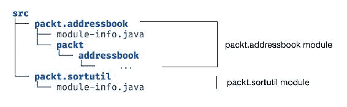
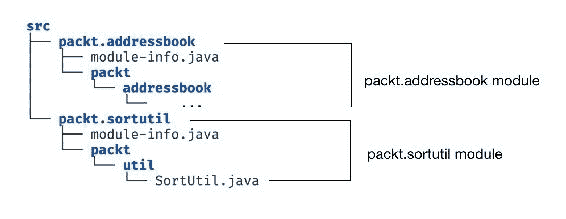
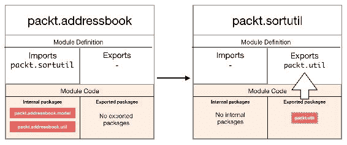
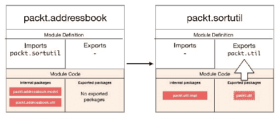
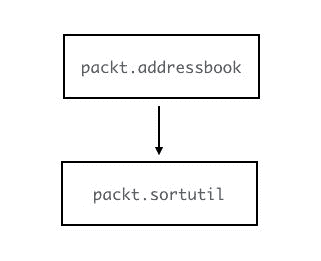

# 第三章：处理模块间依赖

在上一章中，我们创建了我们的第一个 Java 9 模块，并设置了地址簿应用程序的初步设置。然而，我们构建了整个应用程序作为一个单一模块，因此，我们没有真正利用模块化的任何新特性。在本章中，你将学习以下内容：

+   你将把应用程序拆分为两个独立的模块，从而创建你的第二个 Java 模块

+   你将学习如何在这两个模块之间建立依赖关系

+   你将学习更多关于配置模块描述符以连接两个独立模块所需的内容。

+   你将重新审视具有多个模块的编译和执行步骤

所有这一切都始于将我们的单体地址簿查看器应用程序拆分为两个模块。将单个模块拆分为两个依赖模块有两个后果：

+   将应用程序拆分为模块化部分，使得这些模块化部分有可能在多个其他应用程序中重用。

+   这是一个定义模块接口的机会。它允许你，作为模块作者，定义模块导出什么以及如何使用和消费它。

我们将在本章中探讨这两个方面。

# 创建第二个模块

让我们从将地址簿应用程序拆分为两个独立的模块开始。显然，将排序逻辑移动到其自身的模块是一个合适的候选。在这个阶段，关于排序类`SortUtil`的任何内容都与地址簿无关。我们已经设计了该类以通用性为目标，并提供对任何列表进行排序的功能。这在一般情况下是好的实践，但在将其拆分为独立的模块时更有意义。我们将要做的是将有关排序的代码移动到一个全新的模块中，该模块称为`packt.sortutil`。以下是高层次上的步骤：

1.  创建一个名为`packt.sortutil`的新模块。

1.  将与排序相关的代码移动到这个新创建的模块中。

1.  配置`packt.sortutil`模块以定义其接口——它导出什么以及如何使用该模块。

1.  配置`packt.addressbook`模块以使用新的`packt.sortutil`模块。

让我们从创建一个新的模块开始。我们已经在前面的第二章，“创建你的第一个 Java 模块”中探讨了创建模块的四个步骤。我们知道模块的名称。接下来，模块结构需要创建源文件夹中的模块根目录。就像`packt.addressbook`文件夹位于`src`文件夹中并包含`packt.addressbook`模块的所有内容一样，`packt.sortutil`模块需要在相同的`src`位置创建一个名为`packt.sortutil`的文件夹。使这个文件夹成为模块根文件夹的是模块描述符`module-info.java`的存在：

```java
    module packt.sortutil { 
    } 
```

到目前为止的文件夹结构如下：



现在我们有了模块，我们可以将必要的类从`packt.addressbook`模块移动到`packt.sortutil`模块。只有一个与排序相关的类`SortUtil.java`。由于包文件夹位于模块文件夹中，移动类后的文件夹结构应该如下所示：



在创建模块时，你通常会配置接口，即定义模块的输入和输出。我们在第二章“创建你的第一个 Java 模块”中没有对`packt.addressbook`模块这样做，因为它作为一个独立模块存在。然而，在本章中情况不再如此，因为我们现在需要两个模块`packt.addressbook`和`packt.sortutil`协同工作。这涉及到更新两个模块的`module-info.java`文件以提供这些信息。但现在我们先跳过这一步，先观察默认行为。让我们观察如果我们不添加任何模块配置，并且使用空的模块定义文件编译两个模块会发生什么。

# 编译两个模块

现在模块路径（`src`目录）有两个模块。我们现在可以运行`javac`命令来编译两个模块中的所有类，因为我们提供了`src`作为模块源路径。

在这里，`packt.sortutil`是两个模块中较简单的一个。由于它没有任何外部依赖，这应该就像前一章中`packt.addressbook`模块所做的那样工作。让我们看看`packt.addressbook`模块。这里的情况更有趣。由于我们将排序相关的类移动到了`packt.sortutil`模块，`packt.addressbook`模块不再有`packt.util`包中的类。但模块中仍有代码在使用它。注意当我们尝试使用与上一章相同的命令编译这两个模块时会发生什么。这次，由于我们正在编译两个模块，我们指定了两个模块名称到`--module`参数，用逗号分隔。

```java
$ javac -d out --module-source-path src --module packt.addressbook,packt.sortutil
```

你得到的错误应该看起来像这样：

```java
./src/packt.addressbook/packt/addressbook/Main.java:6: error: SortUtil is not visible because package packt.util is not visible
import packt.util.SortUtil;
         ^
./src/packt.addressbook/packt/addressbook/Main.java:13: error: cannot find symbol
SortUtil sortUtil = new SortUtil();
    ^
symbol:   class SortUtil
location: class Main
./src/packt.addressbook/packt/addressbook/Main.java:13: error: cannot find symbol
SortUtil sortUtil = new SortUtil();
                ^
symbol:   class SortUtil
location: class Main
```

首先，请注意错误仅来自编译`packt.addressbook`模块。这意味着`packt.sortutil`模块的编译是成功的！前一个输出中的三个错误特别关于`Main.java`文件。编译器显然没有看到`SortUtil`类，并抱怨它缺失。但它真的缺失了吗？我们确实在`src`文件夹中有一个公共的`SortUtil`类，但由于它位于不同的模块文件夹中，编译器似乎没有看到它，尽管这个类本身是`public`的。这引发了一个与 Java 9 中类可见性相关的重要新变化。

仅因为一个类在 Java 9 中被标记为`public`，并不意味着它对所有其他类型都是可见的。

这与 Java 8 及之前版本中`public`类型的操作方式有根本性的不同。在 Java 9 之前，如果你在类路径中有公共类或接口，它对类路径中的任何其他类型都是可用的，可以导入和使用。但在 Java 9 的模块源路径中，情况不再是这样了！

# 配置模块依赖

将模块想象成一个默认的围栏。默认情况下，模块中的任何 Java 类型都只能被同一模块中的类型访问。之前，`SortUtil`类位于`packt.addressbook`模块中，因此该模块中的其他类型可以访问它。但是，如果将其移动到不同的模块，它就不再对原始模块中的类型可访问了。

对于两个模块，**A**和**B**，要使模块 A 中的任何类型访问模块 B 中的类型，需要满足两个条件：

+   模块 A 需要声明它对模块 B 的依赖

+   模块 B 需要声明它允许其他模块外部访问该类型

如果这两个条件中的任何一个没有满足，那么在模块 B 中被访问的类型就被说成是模块 A 不可读的。我们将在第六章中详细讨论可读性和可访问性的主题，*模块解析、可访问性和可读性*，但现在请注意，这些是两个重要的要求。让我们将这些应用到`packt.addressbook`和`packt.sortutil`模块上。

首先，我们需要让`packt.addressbook`模块声明它依赖于`packt.sortutil`模块。它正在使用该模块中的一个类，没有它是无法编译或运行模块的。声明对模块的依赖的方式是使用`requires`关键字：

```java
    module packt.addressbook { 
      requires packt.sortutil; 
    } 
```

在`requires`关键字之后是所需模块的名称。是的，你只能要求其他模块，而不能是包或类。这一行就足够编译器和运行时在需要使用这些类型时从被要求的模块中查找类型了。一个模块可能依赖于多个其他模块。因此，在模块声明中通常会有多个这样的`requires`行代码。

当编译器尝试编译一个模块时，想象一下它会查看由`requires`子句指定的模块列表，并说：“好的，我明白这个模块需要所有这些其他模块。在我编译这个模块的过程中，每次我看到在模块代码中使用属于所需模块的类型时，我会查看包含该类型的模块，并确保它导出了正在使用的类型。”由于每个依赖模块可能还需要其他模块，这是一个递归过程。

那么，一个模块*导出*一个类型是什么意思呢？这就引出了前面提到的两个条件中的第二个。每个模块都需要明确声明其模块中哪些类型可以在模块外部使用。在我们的例子中，`packt.sortutil`模块需要声明`SortUtil`类可以在其模块外部使用。这是在`sortutil`模块的声明文件中完成的，使用`exports`关键字后跟你想导出的包。当一个模块导出一个包时，该包中所有的类型都可以在模块外部访问：

```java
    module packt.sortutil { 
      exports packt.util; 
    } 
```

在我们的例子中，我们想要导出`packt.util.SortUtil`类。因此，我们导出包`packt.util`，从而导出其内部的类。

再次提醒，你需要*要求*模块和*导出*包。语言设计者决定使用`exports`语法而不是让开发者单独导出类型，这有几个原因。最明显的原因当然是，这比在单个类型级别上逐个导出每个类要方便得多。

到目前为止，我们已经介绍了一些新的关键字——`module`、`requires`和`exports`。你可能想知道，从 Java 9 开始，这些是否是 Java 语言中的保留字。如果你今天一直在代码中使用这些作为变量名，你会遇到麻烦吗？答案是：不会！这些以及其他我们将在本书中学习的与模块相关的关键字被称为*受限关键字*。你仍然可以在代码中使用它们，但只有在模块描述符的上下文中使用时，编译器才能理解它们的含义，并相应地处理这些关键字。

现在类型跨模块访问的条件都已满足，让我们再次从模块路径上一级目录编译代码：

```java
$ javac -d out --module-source-path src --module packt.addressbook,packt.sortutil
```

再次强调，`--module-source-path`参数指定了编译器可以找到所有必需的 Java 模块的位置，以便编译你的代码。而`--module`参数表示要编译的两个模块——`packt.addressbook`和`packt.sortutil`。编译器在模块源路径中找到这两个模块的根文件夹，并将它们编译成相应的类。

编译应该会静默成功。就像上次一样，你会注意到`out`文件夹中有与每个模块中的每个`.java`文件对应的`.class`文件，包括模块描述符，两个`module-info.java`文件。

你可以像以前一样在`packt.addressbook`模块中执行`Main`类。为了说明，我将使用更简洁的`-m`选项（而不是`--module`）来指定模块和要启动执行的类。它们的意思相同，可以互换使用。

```java
$ java --module-path out -m packt.addressbook/packt.addressbook.Main 
[Babbage 123-456-7890, Lovelace 234-567-8901, Dijkstra 345-678-9012, Turing 456-789-0123, Berners-Lee 456-789-0123]
```

在这里，`--module-path`选项指定 Java 运行时需要查找的位置，以找到执行代码所需的模块。运行时检测到它需要以`Main`类开始执行，而`Main`类是`packt.addressbook`模块的一部分，并且该模块依赖于另一个模块（`packt.sortutil`），因此它搜索`module-path`选项指定的位置（这里的`out`目录）以找到依赖的模块。多亏了我们的编译步骤将编译后的模块放在相同的位置，运行时找到了它，并且执行继续进行。

你应该看到联系人已按姓氏成功排序。请注意，为了运行此代码，你只需指定了`packt.addressbook`模块和`Main`类，我们不需要向运行时提供任何有关依赖的`packt.sortutil`模块的信息。这是因为 Java 运行时正在读取相同的模块描述符（这次是`module-info.class`文件），以了解需要`packt.sortutil`模块，因此根据需要从两个模块中利用正确的类文件。

下面是一个解释两个模块行为的图示：



我们所做的是将排序功能独立到一个自己的模块中，以便其他需要排序功能的 Java 9 模块化应用可以使用。任何 Java 9 模块要使用`packt.sortutil`，只需做以下事情：

1.  在需要排序功能的模块定义中添加`requires packt.sortutil`行。

1.  导入`packt.util.SortUtil`类并调用`sortList()`方法，以对任何`List`对象进行排序，只要这些对象是`Comparable`的。

这很好，但在我们分享新的`packt.sortutil`库供全世界使用之前，让我们先思考一下库的 API。

我所说的库的 API 是指消费者为了访问库而需要使用的代码。例如，在简单的`packt.sortutil`库中，API 是`packt.util.SortUtil`类上的单个方法`sortList()`。显然，功能更强大的库有多个类和方法，这些类和方法可能被消费者调用。

当你创建一个库，在允许其他人使用它之前，你必须非常仔细地定义和最终确定库的 API。原因是，一旦其他人开始使用你的库，就很难对库的公共 API 进行更改。你库未来版本中 API 的任何更改都意味着要求所有使用你库的消费者更新他们的代码以与新 API 兼容。

目前，`packt.sortutil`模块只包含一个类。我们将在接下来的章节中逐步完善该模块，但就目前而言，我想进行的一个改动是使`SortUtil`类尽可能轻量。该类作为`packt.sortutil`库的*编程接口*，因此确保该类尽可能简单，代码行数尽可能少，使其在未来可能的变化中更加稳健。

实现这一目标的一种方法是将实际的排序功能移动到一个*实现*类中，并让`SortUtil`仅将排序逻辑委托给该类。

假设我们创建一个`BubbleSortUtil`类，其结构与迄今为止的`SortUtil`类相同：

```java
    public class BubbleSortUtilImpl { 
      public <T extends Comparable> List<T> sortList(List<T> list) { 
        ... 
      } 
      private <T> void swap(List<T>list, int inner) { 
        ... 
      } 
    } 
```

然后，我们可以更新`SortUtil`，使其仅调用`BubbleSortUtilImpl`类的`sortList`方法进行委托：

```java
    public class SortUtil { 
      private BubbleSortUtilImpl sortImpl = new BubbleSortUtilImpl(); 
      public <T extends Comparable> List<T> sortList(List<T> list) { 
        return this.sortImpl.sortList(list); 
      } 
    }  
```

这样做更好，因为如果你想要更改库的结构或排序逻辑，只要保持`SortUtil`的结构不变，你的库的用户就不需要更改他们的代码。`SortUtil`类仍然与`BubbleSortUtil`紧密耦合，因为它直接实例化它，但我们在下一章中会改进这一点，所以现在我们就先这样吧。

在这个阶段运行代码应该会产生与上次相同的输出。现在，在我们向世界宣布`packt.sortutil`模块准备投入使用之前，回顾一下杰克在第一章中遇到的问题，*介绍 Java 9 模块化*。他创建了一个具有与类相关的相同设计的排序库 JAR 文件——一个内部的`BubbleSortUtilImpl`和一个外部的`SortUtil`。他遇到的问题是，某个类是*内部*的还是*外部*的，这仅仅是一个惯例，如果没有杰克将他的代码打包到一个单独的包中以便利用包私有机制，这是无法强制执行的。使用他的库的开发者开始使用他们不应该使用的`BubbleSortUtilImpl`类。让我们看看我们是否有与`sortutil`模块相同的问题，如果有，是否有更好的工具可以使用 Java 9 的模块系统来保护某些类。

答案很简单。是的，我们遇到了杰克遇到过的同样的问题。任何使用`sortutil`模块的消费者都可以轻松地直接使用`BubbleSortUtilImpl`。这是因为该类位于一个从模块导出的包中。我们希望通过封装这个类来防止它在模块外部被使用。我们该如何做呢？很简单！只需将这个类移动到另一个包中！就像我们已经看到的，Java 平台模块系统期望我们指定哪些包可以在模块外部可见。如果任何类型可以在任何模块外部访问，那仅仅是因为它属于该模块中导出的包。这就是为什么将类型重构到新包中是一个潜在的解决方案。只要新包在模块的定义文件中没有出现在`exports`子句中，该包中的类就有效地对外部使用隐藏，就像我们已经看到的：


这是我们最新更改后重新审视的模块图：



记住，Java 中的包不是分层的。在这个例子中，包`packt.util`和`packt.util.impl`是两个完全独立的包，它们之间没有任何关系。仅仅因为你导出了`packt.util`包，并不意味着你自动导出了`packt.util.impl`。也不意味着`packt.util.impl`以某种方式*位于*`packt.util`内部。这并不是 Java 中包的工作方式。这些是完全不同的两个包，在包语义上完全无关。

此时代码的状态是在捆绑的源代码中。像以前一样编译和执行代码应该会给我们相同的结果。然而，我们已经解决了我们在第一章，“介绍 Java 9 模块化”中讨论的与类封装相关的一个主要问题。

想想这种封装对库开发者的潜在影响。在 Java 9 之前，任何在库中发布的`public`类型都可以被库的消费者使用和访问。现在，有了 Java 9 模块，库开发者可以完全控制哪些类可以被使用，哪些只是内部的。因此，库开发者可以重构*内部*库代码，而无需担心它们可能被使用。多亏了模块契约，它们是不可访问的，因此在模块外部的代码中保证不会被使用。

# 模块版本化

你可能已经注意到，我们之前所涵盖的内容中缺少了模块依赖的一个方面——版本化。当你声明一个模块定义时，你能为模块指定一个版本号吗？同样，当你指定某个模块需要另一个模块时，你也能指定它需要的模块版本吗？两个问题的答案都是否定的。由于各种原因，模块版本化不是 Java 模块系统中的一个功能。这不是 Java 平台试图解决的问题。

模块版本化的最大优点和实用性体现在依赖管理上。想想像 Maven 或 Gradle 这样的工具。这些工具允许你配置外部依赖项的特定版本，然后它们可以自动从某个远程仓库为你下载，并将其添加到类路径中。Java 平台并不试图做这件事，或者解决任何依赖管理问题。它假设所有依赖项都已经可用，可能是由 Maven 或 Gradle 这样的工具组装的。在第一章“介绍 Java 9 模块化”中，我提到了像 Maven 或 Gradle 这样的构建工具如何实现依赖组装的可预测性和一致性，但它们无法验证所组装内容的准确性或完整性。这就是 Java 模块系统介入的地方。平台假设所有必要的源文件和类都已经存在！无论你的构建工具是什么，无论你采取什么方式来组装你的代码和库，Java 平台都会在你得到的结果上工作，然后确保模块合约得到满足。

这是一个微妙的话题，其推理可以广泛辩论，但重要的是要记住，模块版本化在 Java 9 中是不可用的。为了管理多个模块版本，你可以自由地使用你之前用来拉入 jar 和库的任何工具或流程。在第十二章“使用构建工具和测试 Java 模块”中，我们探讨了如何将 Maven 多模块项目与 Java 9 模块化应用程序集成，以利用两者的最佳之处。

# 重新思考包结构

你需要从模块中*导出*包名的这一事实，对我们在 Java 9 中组织类型到包中的方式有着有趣的含义。从历史上看，包结构一直被 Java 开发者用来为 Java 类型提供*命名空间*。虽然由包名创建的这些命名空间在理论上至少可以防止类型名称冲突，并影响包私有成员变量和类型的可见性，但它们还服务于一个稍微不那么正式的目的，即为了代码的可搜索性和可维护性而将相关类型分组。

Java 9 中的包具有额外的意义，这会影响你如何将类和其他类型分组到包中——模块外的可见性。例如，如果你需要在一个模块内隐藏类型 *A* 并将类型 *B* 导出至模块外，你本质上需要将类型 *A* 和 *B* 放置在两个不同的包中。在大多数情况下，典型的库内部类在 Java 9 之前的世界中已经与不同的命名空间和包相关联，所以这不应该对我们做这件事的方式造成太大改变。但重要的是要注意，这个新的变化可能会影响我们决定将类放在一个包还是另一个包中的决策。

现在我们已经看到了两个模块和模块间的依赖关系，我想向你介绍模块图的概念。你可能会在未来的许多 Java 文档中看到它，作为表示模块之间关系的好方法。绘制模块图的方法是将模块作为节点，用箭头表示模块之间的关系。如果模块 *A* 依赖于模块 *B*，箭头将从 *A* 指向 *B*。

这是到目前为止地址簿应用程序中的代码的模块图：



目前这很简单，但随着我们更多地了解模块系统并改进我们的代码，我们将回到这个模块图并添加更多细节。

# 理解模块路径参数

我们的示例应用程序由两个 Java 模块组成。我们有两个模块的源代码在模块源路径中。实际上，通常我们会处理依赖于作为依赖项拉入的编译第三方模块的模块源代码。在这种情况下，你需要向编译器提供包含模块源文件的模块源路径，以及编译依赖项的模块路径。编译器需要在需要编译的代码（`--module-source-path`）和编译依赖项和库的位置（`--module-path`）之间进行区分。当涉及到执行时，你只需传递指向编译模块的 `--module-path`。

这里是传递给编译器和运行时的命令行参数值：

|  |  `--module-source-path` |  `--module-path` |
| --- | --- | --- |
| `javac` | 所有源模块的位置 | 源模块所依赖的编译模块的位置。 |
| `java` | <未提供> | 所有编译模块的位置 - 包括应用程序模块和编译模块依赖项 |

# 回顾类路径

我们已经看到，新的 Java 9 平台提供了一些新的能力来进行模块级别的编译和执行，使用 `--module-source-path` 和 `--module-path` 参数。现在它是模块感知的，并且知道如何编译和执行 Java 9 模块。随着开发者接受 Java 模块化，这些标志可能会得到更广泛的使用。

同时，有一个熟悉的编译器参数，随着时间的推移，其使用频率将逐渐降低——那就是`-classpath`参数。多年来，类路径一直是 Java 编程中一个至关重要的概念，但现在大部分情况下不再需要了！

在过去的二十年中，Java 类路径扮演了至关重要的角色，成为任何给定 Java 应用程序中所有类的家园。显然，任何 Java 应用程序都由多个类组成，通常分布在多个 jar 文件中。作为一个 Java 开发者，你只需将类添加到类路径中，就可以让它发挥作用。这会保证运行时能够看到它。当然，仍然有`private`、`public`和`protected`这样的访问修饰符来控制谁可以访问给定的 Java 类型。但即便如此，类文件在类路径中的存在就足以使其对运行时**可用**。

现在，考虑一个新世界，其中没有独立的类文件，一切都是由模块组成的。Java 9 模块化应用程序由多个相互依赖的不同模块组成。给定模块路径，编译器和运行时现在可以知道所有类的位置。此外，多亏了模块约定，属于模块的类位于模块文件夹本身中。在这种情况下，为什么 Java 还需要其他信息来访问应用程序所需的类？类路径的概念甚至不再需要了！

等等！在你将关于类路径的所有知识从记忆中抹去之前，我应该告诉你，我所描述的是理想情况。是的，理想情况下，类路径在 Java 中将可能变得不那么重要。然而，我们还没有完全结束它。在这本书中，我们还将多次回顾类路径，特别是在处理旧代码库和将代码迁移到 Java 9 时。更多内容请参阅第十章，*为 Java 9 准备你的代码*。

# 再次审视类路径问题

在第一章，*介绍 Java 9 模块化*中，我们探讨了我们的朋友杰克和阿米特面临的问题：

+   杰克无法轻易**封装**内部库类型，防止在库外部使用该类型，同时保留在库内部自由使用它们的能力

+   阿米特无法**可靠地**组装一组编译后的 Java 代码，并保证在程序实际运行时遇到依赖之前，所有这些类型及其依赖和导入都得到了充分的满足

我们是否通过模块系统解决了这些问题？幸运的是，是的！

我们已经看到 Java 模块的封装如何防止某些类型在模块外部被访问，即使该类型是`public`的，除非它们所属的包被明确导出。实际上，我们应用了相同的概念来隐藏`BubbleSortUtilImpl`类的外部使用。当升级我们的库时，如果我们觉得需要修改（甚至删除）该类，我们可以放心，唯一使用该代码的消费者就在库本身。

关于第二个问题——运行时验证？结果证明，Java 运行时引用相同的`module-info`模块描述符（这次是`.class`格式）来解决这个问题。您在`packt.addressbook`模块中运行了`Main`类，并且它运行正常，因为运行时在模块路径中找到了依赖模块`packt.sortutil`。让我们看看如果没有找到会发生什么。如果我要删除`out`目录中的编译`sortutil`目录，并再次运行`packt.addressbook/packt.addressbook.Main`，请注意您会得到的错误：

```java
$ java --module-path out --module packt.addressbook/packt.addressbook.Main
 Error occurred during initialization of VM
 java.lang.module.ResolutionException: Module sortutil not found,
   required by addressbook
 at java.lang.module.Resolver.fail(java.base@9/Resolver.java:841)
 at java.lang.module.Resolver.resolve(
   java.base@9/Resolver.java:154)
  ... 
```

错误信息指出未找到`packt.sortutil`模块，但这里需要注意的重要事情是错误抛出的 *时间*。错误并不是在类加载和运行时尝试查找依赖类型时遇到的，正如消息清楚地提到的，错误发生在虚拟机初始化时间。这对于 Java 代码的可靠性来说是一个巨大的优势。如果有潜在的错误，运行时会在初始化时捕捉到，而不是在执行过程中的某个任意时间点。

模块系统被设计用来满足的一个要求是达到 *跨阶段的一致性*。这是什么意思呢？您已经看到模块描述符如何让您构建模块、封装类型，并通过允许您指定每个模块的合约来验证必要依赖项的可用性。这些好处不仅影响您代码的编译过程，也影响运行时过程。同一个模块定义让编译器知道当缺少所需的模块时有什么错误，也可以向运行时提供相同的信息！由于模块描述符被编译成类文件，Java 运行时也可以读取相同的描述符，并提前知道需要运行的代码所依赖的每个模块是否可用。您在编译和执行阶段都能获得相同的行为和错误检查。

# 摘要

在本章中，我们创建了一个第二个 Java 模块，并建立了模块间的依赖关系。我们学习了如何在模块定义文件中设置`requires`和`exports`。有了两个模块，我们终于能够看到试图解决我们在第一章“介绍 Java 9 模块化”中讨论的代码组织和管理的某些问题的模块化特性。

现在我们已经对如何创建 Java 9 模块以及在其他模块中使用它们有了基本了解，让我们将注意力集中在平台本身上。Java 9 不仅带来了旨在供开发者使用以创建模块的模块系统，还带来了一个完全重制的 JRE 和 JDK，它们自身也是模块化的。在下一章中，你将了解平台的模块化，它如何影响开发者，以及它在某种程度上对于将模块化支持引入 Java 语言是至关重要的。
