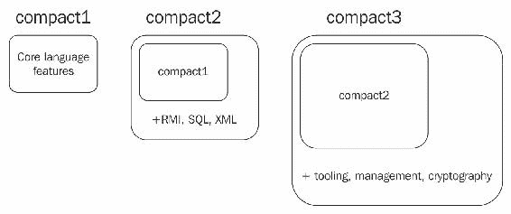
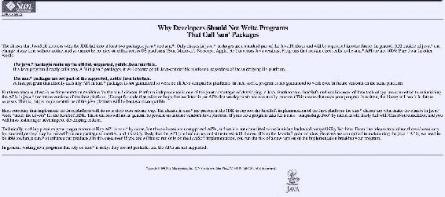
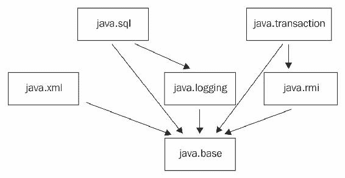
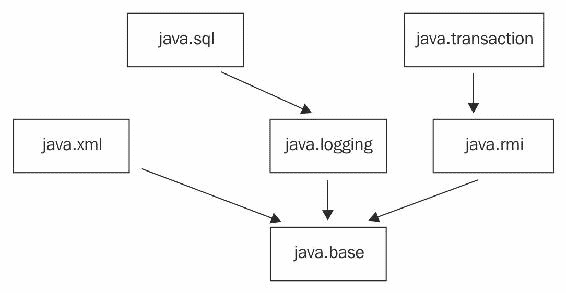
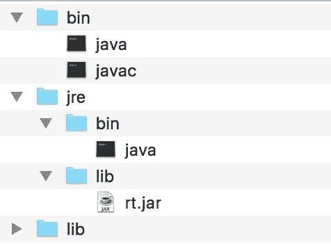
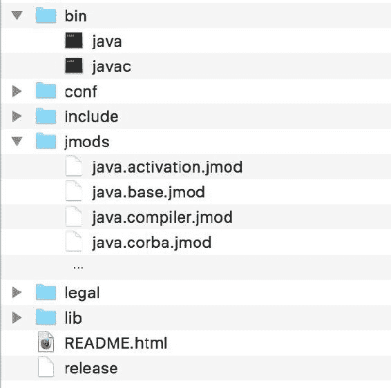

# 介绍模块化 JDK

在前两章中，你已经了解了 Java 9 的模块化 API 以及如何创建自己的自定义模块。Java 9 模块的内容远不止这些！Java 中模块化的引入不仅为开发者提供了一个新的*特性*来使用；它导致了 Java 平台本身的重大变化。实际上，Java 9 还可能对内部 Java 代码库进行了有史以来最大的改组。Java 9 不仅为开发者提供了创建自己的模块的能力，整个 Java 平台本身也被模块化了。在本章中，让我们检查这些重要的变化，既要了解变化是什么，也要理解*为什么*会有这些变化。现在，你已经通过编写模块来熟悉了 Java 模块，是时候戴上我们的思考帽，真正理解导致 Java 语言这一重大变化的问题和需求。这不仅将帮助我们更好地欣赏这些变化，学习如何以及为什么 JDK 被模块化，还将帮助我们学习如何在第十一章“将您的代码迁移到 Java 9”中迁移自己的 Java 代码。 

本章我们将涵盖以下主题：

+   我们将从检查 Java 9 之前的 JDK 的两个方面以及它们的一些问题开始。了解过去的事情对我们来说很重要，这样我们才能完全理解新变化的影响。

+   你将学习模块化如何改变 Java 平台，并介绍内置模块。

+   你将学习如何浏览内置模块并获取它们模块定义的信息。

+   你将学习如何理解模块图中的模块关系。

# 检查遗留的 JDK

Java 已经存在二十多年了。在其生命周期的大部分时间里，有一些事情并没有改变。让我们关注 Java 8 或更早版本的 JDK 的两个方面：

+   **JRE 结构**：当在计算机上设置时，Java 运行时环境（JRE）安装的文件和目录结构

+   **API 封装的状态**：公共 Java API 与内部平台类之间的差异

# JRE 结构

当你在任何机器上安装 Java 8 运行时环境并检查安装目录时，你会在其他文件和文件夹中看到以下两个重要的目录：

+   一个包含可执行文件的`bin`目录，其中之一是 Java 可执行文件，它允许你运行 Java 程序

+   包含一些关键`.jar`文件的`lib`目录，包括至关重要的`rt.jar`

当你在 Java 中编码时，你可能不需要直接处理`rt.jar`，但你应该知道它是运行时最重要的`jar`文件。你能猜到它是用来做什么的吗？

# 理解 rt.jar

假设你构建了一个使用一些核心库类（如集合和线程）的 Java 应用程序。当你编译并将你的应用程序分发到另一个安装了 Java 的机器上运行时，你可以只打包你在应用程序中编写的类，而无需包含编译后的`Collection`和`Thread`类。这是因为每个运行时都自带所有编译的平台类，这样每个开发者就不必将它们与他们的应用程序一起分发。这些类捆绑到 JRE 中的方式是通过一个文件——`rt.jar`。你将你的应用程序类放在运行时的类路径中以便查找，但对于任何平台类，它只是在`rt.jar`中找到它们。`rt`这个名字代表**运行时**，这个单一的 JAR 文件包含了整个 Java 运行时的所有编译类。是的，你没听错！`rt.jar`本质上包含了 Java 平台中的所有编译类，全部捆绑在一个 JAR 文件中。每一个。单个。类。

# 这个模型的问题

这种情况已经持续了多个 Java 版本。将所有平台类捆绑到单个 JAR 文件中的决定是在 Java 生命早期做出的，当时可能是个好主意。但考虑到平台已经增长了多少，以及多年来添加到平台中的新类有多少，显然这已经不再是个好主意了。Java 8 中，`rt.jar`的大小接近 60 MB。即使你现在可能觉得这还可以忍受，想象一下，如果 Java 在未来 10 年内以良好的速度继续增长，并最终增加了几千个新类，那会怎样？我们还会对将它们全部捆绑到单个 JAR 文件中感到满意吗？

除了平台开发者必须处理单体 JAR 文件之外，这个模型还带来了另一个物流挑战。对于应用开发者来说，将他们的应用程序分发的常见做法是将应用程序安装程序与 Java 运行时环境捆绑在一起。任何 Java 应用程序都需要运行时，但无法确定 Java 应用程序的用户在安装应用程序之前是否已经安装了运行时。因此，将应用程序与运行时捆绑在一起是确保任何安装应用程序的人都有必要的运行时并能成功执行应用程序的绝佳方式。这不仅适用于经典的桌面应用程序安装程序，也适用于创建自包含微服务的较新做法。构建微服务的开发者会创建包含编译后的微服务和 Java 运行时的可分发文件，这样就可以通过单个命令在任何云虚拟机上启动微服务实例。

运行时的大小显然是一个问题。无论你的微服务或应用程序的复杂性如何，无论你在平台上使用了多少个类，你都必须捆绑包含所有已知 Java 平台类的`rt.jar`完整的 Java 运行时。所以，无论你的实际应用程序有多小，捆绑其中的至少有 60 MB 的`rt.jar`内容！这也影响了在资源受限的较小设备上运行的 Java 应用程序，如 IOT 和移动设备。我们在第一章，“介绍 Java 9 模块化”中简要讨论了 Java 平台中的 CORBA 类以及它存在于所有 Java 运行时中的情况，尽管似乎没有人再使用它了。作为一个创建自包含 Java 可执行文件的人，提出这样的问题是非常合理的——为什么我需要包含所有这些类在运行时中，而我不需要它们？

# 尝试的解决方案 - 紧凑配置文件

在 Java 8 中，引入了一个名为**紧凑配置文件**的新概念，试图解决这个问题。紧凑配置文件本质上是一个更小的 Java 运行时版本，它不需要包含`rt.jar`的全部内容。运行时在包级别上被分解，以确定一组封闭的核心包和类，这些类只依赖于自身，这样其余的就可以被分割并移除。引入了三个不同的配置文件，它们在移除的内容量上有所不同。最小且最基础的配置文件被称为`compact1`。这个版本的运行时包含了一些基本语言特性，如 IO、集合、util、安全和并发。如果你的需求不能通过`compact1`满足，你也可以选择`compact2`或`compact3`，如果这三个都不适合你，你将使用完整的运行时：



最小的配置文件，`compact1`，其大小仅为大约 11 MB，相较于完整的`rt.jar`的 60 MB 来说，这是一个显著的改进。但很明显，我们仍未消除在运行时捆绑不需要的类的问题。我们只是最小化了它们，无论你选择哪个配置文件，你的应用程序都不会使用其中的某些类，但你仍然必须包含它们。此外，如果你有一个主要使用`compact1`配置文件中的类的应用程序，但只需要`compact2`中的几个类，那么，你除了捆绑更大的`compact2`配置文件外别无选择。

然而，我可能会犹豫是否称这为解决这个问题的失败尝试。事实上，运行时配置文件实际上是 Java 平台在运行时模块化旅程中的第一步。然而，重要的是要注意，这是在 Java 9 之前我们能做的最好的事情，以解决庞大单体运行时的问题。

# API 封装的状态

为了最好地解释 API 封装（及其相关问题）的情况，我们只需要回顾一下第一章，“介绍 Java 9 模块化”，杰克在排序库上的麻烦。在他的库中有一个内部`public`类，这个类并不是为了外部使用，但它最终还是被使用了。如果一个只有两个类的微小库都可能遇到这个问题，想象一下 Java 运行时成千上万个类的情况！Java 语言为开发者提供了文档化的 API。但它也包含许多支持类，以促进这些 API 的内部运作，这些类不应该被开发者使用。然而，足够的是，它们都是`rt.jar`的一部分，所以没有任何阻止开发者使用这些类的。

# 理解内部 API

Java 运行时中存在几个开发者不应该使用的内部类。它们不是作为语言规范的一部分进行文档化的，但对于运行时的内部运作是必要的，也许是为了其他已经文档化的类。在 Java 开发者在在线社区中广泛讨论的一个很好的例子是名为`sun.misc.Unsafe`的类，我们在第一章，“介绍 Java 9 模块化”中简要提到了它。

类`sun.misc.Unsafe`从未打算供公众使用。它始终是一个仅用于 Java 运行时的内部类。它没有文档。没有公共构造函数。该类的源代码充满了关于使用该类的危险警告。有趣的是，即使类有一个不祥的名字`Unsafe`，也没有阻止一些开发者使用它。当然，`sun.misc.Unsafe`是少数几个被 Java 开发者误用的内部类之一。但如果你只是少数几个类，你可能会问，这有什么大不了的？

# 这种模型的弊端

Java 通常被认为是一种非常**向后兼容**的语言。虽然该语言本身在多年中经历了重大变化，但几乎所有变化都是对语言的补充，同时仍然保留了旧版本的功能。假设你使用 Java 1.3 编写的 Java 代码库，并用 Java 8 编译和运行它。如果你发现它没有问题地运行，你会感到惊讶吗？可能不会！这正是 Java 具有向后兼容声誉的原因。在我看来，这是一件好事，因为它给采用者带来了信心，即每次重大升级都不需要太多的努力和重写。这是 Java 相对于其他几个开发平台的一个优势。

这种向后兼容性是有代价的，特别是当你考虑到内部 API 缺乏封装时。如果由于缺乏封装，开发者意外地使用了内部 API，那会怎么样？为了保持向后兼容性，语言团队被迫不对那些内部 API 进行破坏性更改，尽管按照定义，它们是内部的。因此，向后兼容性的负担对语言来说变得更重了——不仅公共 API 需要向后兼容，甚至内部运行时类也需要！

# 尝试的解决方案 - 弃用、警告和文档

我们在我们的代码中通常从 `java.*` 和 `javax.*` 等包中导入类，因为这些包中的类包含了 Java 语言中大部分面向公共消费的公共 API。然而，在其他包，如 `sun.*` 中，也有一些 JDK 内部类，你不会在任何 API 文档中找到它们。许多这些类自 1.0 版本以来一直是 Java 的一部分。

由于语言没有防止使用这些内部 API 的功能，已经尝试了其他几种方法来阻止使用。Sun 网站上有一篇文章，标题为 *Why developers should not write programs that call 'sun' packages*。Sun 网站已经不再存在，但多亏了 WayBack Machine，文章的原始网页仍然被保存下来，并可在以下链接找到：[`web.archive.org/web/19980215011039/http://java.sun.com/products/jdk/faq/faq-sun-packages.html`](http://web.archive.org/web/19980215011039/http://java.sun.com/products/jdk/faq/faq-sun-packages.html)：



注意文章中提到的年份！是的，它自 1996 年以来一直是官方文档的一部分（当时在 java.sun.com 上）。顺便说一句，Oracle 文档网站上仍然有这个警告。显然，20 年来要求开发者不要使用某些类并没有解决问题！你可能会问，如果没有人注意它，这样的警告在文档中有什么用？好吧，除了文档中的警告之外，自 JDK 6 以来，编译器如果检测到你的应用程序使用了 `sun.*` 包中的任何 API，就会抛出警告。然而，这也是开发者可以轻易忽略的事情。

这些方法显然还不够好。我们需要能够强制执行这些规则，并为开发者提供护栏，以**防止**他们使用内部 API。到目前为止，这种功能在语言中并不存在。语言只能不断进化。

# 进入 Project Jigsaw

*Project Jigsaw* 是将模块化的概念和特性应用于 Java 平台本身的努力。平台的模块化本质上解决了之前描述的这两个问题。我们将在本章后面探讨这一点，但让我们先看看为 *Project Jigsaw* 做的工作以及它如何影响与 Java 平台交互的开发者。

该项目本身是一个巨大的努力，涉及以下高级步骤：

1.  对平台源代码进行重新组织，使其更有利于模块化。

1.  定义和构建具有预定义输入和输出接口以及清晰的依赖映射的模块。

1.  封装*内部*类，并允许仅使用*公共*API。

1.  提供生成更小、更模块化的运行时镜像的工具，作为对单体`rt.jar`的替代。

现在让我们深入探讨这些变化，看看它对我们有什么影响。

# 平台模块化

在 Java 9 中，整个 Java 平台，包括其中的每个类，都被隔离并分组到模块中。是的，从`Collections`和`Thread`到`Connection`和`Logger`的所有平台 Java 类！实际上哪个都无关紧要；每个平台类现在都存放在与运行时和 JDK 一起提供的全新 Java 模块中。平台团队通过检查公共 API 和内部类，根据通常很好地一起使用且自包含的类型进行分组，并将此类相关类捆绑到模块中，实现了这一点。

以 Java 日志为例。Java 中的原生日志功能由`java.util.logging`包中的一组类组成。这些类现在已被归类到一个新创建的模块中，称为`java.logging`。与 JDBC 和 SQL 相关的类都进入了一个名为`java.sql`的新模块。与 XML 相关的类进入了`java.xml`模块。以下是 Java 9 自带的一些模块的更多示例：

+   `java.scripting`：为 Java 脚本引擎提供脚本 API

+   `java.desktop`：提供 Java 桌面 API，包括`awt`和`swing`包

+   `java.transaction`：在`javax.transaction`包中提供事务相关 API

此外，还有一个名为`java.base`的特殊模块。`java.base`模块包含 Java 平台的基本 API 和类，没有这些，就不可能编写任何 Java 代码。`java.base`模块包含来自`java.lang`、`java.io`、`java.util`等包的 API。正如你所见，它涵盖了大多数 Java 应用程序使用的许多基本 Java API。那么，为什么我会称这个模块为特殊呢？请记住这个想法！我们稍后会回到这个问题。现在，让我们继续：

# 平台模块化的影响

如你所想，这种变化的冲击确实很大，并且几乎影响了从现在开始我们编写所有 Java 代码的方式。在 Java 8 及之前，你不必过多考虑使用任何 Java API。你所要做的就是将所需的类型导入到你的代码中。由于 JVM 知道在哪里找到`rt.jar`，必要的类总是由运行时找到。但在 Java 9 中就不再是这种情况了。记得在第三章中，*处理模块间依赖*，当你需要从`packt.sortutil`模块中获取`packt.addressbook`模块中的类时？你无法只是将类导入到你的代码中并使用它。你必须去`packt.addressbook`模块的定义中，并使用`requires`子句指定对该模块的依赖。这正是你需要为本地 Java 平台类型所做的事情！

需要使用 Java SQL API？它们位于`java.sql`模块中，因此在你需要它们的模块中，你需要在模块描述符中指定这一点：

```java
    module mymodule { 
      requires java.sql; 
    } 
```

一旦你要求了必要的平台模块，它的 API 就准备好在你的模块中使用。由于`java.sql`模块是基于你用来编写代码的相同的 Java 模块系统构建的，你可以确信在`java.sql`模块的`module-info`文件中存在代码，它导出了包含 Java SQL API 的`java.sql`和`javax.sql`包。

在使用模块之前必须*要求*模块的需求不仅适用于我们自己的模块，也适用于 Java 模块。例如，`java.sql`模块需要日志功能（出于明显的原因）。而日志 API 位于`java.logging`模块中。因此，在`java.sql`模块的`module-info.java`文件中有一个`requires`声明来指定这个需求。这是`java.sql`模块中的代码能够导入和使用日志 API 的唯一方式。

这就是`java.sql`模块的`module-info.java`文件应该看起来像什么样子，以便启用我们之前讨论过的配置：

```java
    module java.sql { 
      ... 
      requires java.logging; 
      exports java.sql; 
      exports javax.sql; 
      ... 
    } 
```

# 模块图

这些单独的 Java 模块相互依赖的结果是，我们现在可以绘制一个完整的依赖图，其中模块作为节点，节点之间的关系作为模块依赖。这种图片被称为**模块图**，它是你追踪和管理 Java 9 模块化应用程序中模块依赖的新最佳伙伴。我们在上一章中查看了一个地址簿应用程序的简单模块图。这是一个简单的模块图，它指定了一小批 Java 平台模块之间的依赖关系：



从模块*A*到模块*B*的线条表示模块*A* `requires` 模块*B*。所以，正如这个图所示，模块`java.transaction`需要`java.rmi`，而`java.rmi`又需要`java.base`。如前所述，由于`java.base`包含对语言基本而言的 API，它是每个其他模块都肯定需要的模块。这就是为什么这个模块被稍微特殊对待的原因。

# `java.base`模块

在第二章《创建您的第一个 Java 模块》和第三章《处理模块间依赖》中，您编写了一些使用了一些 Java API（如`Collection`和`System.out`）的 Java 9 模块。这些 API 恰好来自`java.base`模块。您可能已经注意到这里图片中的某些问题。由于这些核心 Java API 位于其自己的模块中，我们不应该在使用它们之前在所有模块描述符中添加`requires java.base;`行吗？为什么没有它编译也能成功？好吧，让我向您保证，这里没有涉及任何诡计。它之所以能工作，是因为`java.base`模块的特殊性质。

上次您在 Java 类中写`import java.lang.*`是在什么时候？我希望是永远不会！您不需要从`java.lang`包导入类，因为这个包默认导入并可供您的 Java 代码使用。这是因为该包中的类使用得非常普遍，因此默认总是导入这个包中的类型是合理的。

Java 9 为要求`java.base`模块提供了一个类似的快捷方式。这个模块包含了许多基本的 Java API，例如`java.lang`包，几乎所有 Java 模块在编写时都离不开这些 API。因此，并不是所有存在的 Java 模块都必须**要求**`java.base`模块，它默认就是必需的，所以你不需要显式指定它。现在，由于`java.lang`包位于`java.base`模块中，两种情况下的默认行为都是无缝的！看看这是怎么工作的？

然而，请记住，这是唯一具有这种行为的模块。存在于任何其他地方的 Java 模块，无论是平台模块还是其他类型的模块，如果需要作为依赖项，都必须显式**要求**。

由于始终存在对`java.base`的隐式依赖，在编写模块图时，通常的做法是跳过对这个基础模块的依赖，以便使内容更易于阅读。其思路是，只有当给定模块的**唯一**依赖是`java.base`时，才显示模块依赖于`java.base`。如果一个模块依赖于其他模块，我们只显示这些依赖，并跳过`java.base`依赖。以下是使用这种方法之前模块图的样子：



我希望你会同意这个图表看起来有点更整洁。这似乎是人们越来越遵循的实践，所以当你遇到这样的模块图时，不要忘记隐含的`java.base`依赖。它始终存在！

# 模块浏览

现在你已经查看了一些 Java 附带的一些模块，你可能想知道如何获取更多关于它们的信息。你如何找到与平台一起提供的模块列表？给定一个 API，你如何知道哪个平台模块包含它？以及给定一个模块，你如何知道它导出了哪些包？

答案是向`java`命令添加几个新的参数。第一个是一个名为`--list-modules`的选项。这个命令让你检查从平台可用的模块。

当你从命令提示符运行以下命令时，你会看到以下内容：

```java
$ java --list-modules
 java.activation@9
 java.annotations.common@9
 java.base@9
  java.compiler@9
  java.corba@9
  java.datatransfer@9
  java.desktop@9
  ...  
```

你看到的那张列表是所有 Java 平台模块的列表！当你滚动列表时，注意我们之前讨论的模块都在那里！这是浏览并了解可用内容的好方法。

另外还有一个新的选项 `-d`，它有助于检查单个模块的详细信息。语法是：

```java
$ java -d <module-name>  
```

你也可以使用较长的形式`--describe-module`来完成同样的操作：

```java
$ java --describe-module <module-name>  
```

例如，如果你想查看`java.base`模块的更多详细信息，运行以下命令：

```java
$ java -d java.base
  module java.base@9
  exports java.io
  exports java.lang
 exports java.lang.annotation
  ...   
```

为了简洁，输出已被截断，但当你向下滚动命令的结果时，你会注意到关于列出的模块的各种细节。

下面是运行在`java.sql`模块上的命令输出：

```java
$ java -d java.sql
 java.sql@9
 exports java.sql
 exports javax.sql
 exports javax.transaction.xa
 requires java.base mandated
 requires java.logging transitive
 requires java.xml transitive
 uses java.sql.Driver 
```

在这些模块级别的输出中，你会注意到以下几类信息显示：

+   **导出**：这是模块导出的所有包的列表。在`java.base`模块中，你会看到熟悉的包，如`java.io`和`java.lang`。`java.sql`模块导出包`java.sql`和`javax.sql`。这些标记为`exports`的包是该模块导出的所有包。因此，当你`require`模块时（默认情况下使用`java.base`），你的模块将能够访问属于那些`exported`包的`required`模块中的类型。在输出中，你会注意到一些形式为`exports <package-name> to <module-name>`的语句。这些被称为限定导出。我们将在第六章中介绍限定导出，*模块解析、可读性和可访问性*。

+   **包含**：这是模块*包含*但不导出的内部包列表。根据定义，这些包在模块外部是不可见的。对于我们开发者来说，了解属于*内部*模块 API 的包仍然很有用，因为其中许多曾是 Java 8 中的 API，因此以前是公开可用的。例如，看看`java.base`模块中的`jdk.internal.*`和`sun.util.*`包。由于它们不在`exports`列表中，因此现在实际上被封装在模块中。

+   **需要**：这是给定模块需要的模块列表。`java.sql`模块需要另外三个模块--`java.base`、`java.logging`和`java.xml`。`java.base`的需求是默认的，因此它带有`requires mandated`子句。请注意，你*不需要*在自己的模块中这样做，因为这是默认行为。现在忽略`requires transitive`子句。这与使模块对依赖模块可用相关，我们将在第六章“模块解析、可访问性和可读性”中详细探讨。显然，`java.base`不需要任何其他模块。

+   **使用和提供**：这与服务概念相关，我们将在第七章“介绍服务”中探讨。

我建议使用`java --list-modules`和`java -d <module-name>`命令来探索平台中的其他模块。当你开始在 Java 9 中编写模块化代码时，你通常会需要导入平台类，这需要识别导出它们的模块。最初，你需要使用这些命令来找到正确的模块，但当你这样做几次后，你将记住常见的包和包含它们的模块，因此你不再需要这样做。模块的直观名称也有帮助。需要使用 SQL 类？你只需*知道*它们在`java.sql`中！当然，一些包可能不是那么直观，但仍然，遵循的命名约定在很大程度上有助于开发者快速找到正确的模块。

# 模块类型

说到命名约定，当你运行`java --list-modules`命令时，你可能已经注意到了模块名称的不同前缀。平台模块有三个前缀--`java.`、`javafx.`和`jdk.`。前缀表示模块的性质：

+   `java`：表示核心 Java 平台模块。这些在官方文档中被称为*标准模块*。

+   `javafx`：表示 Java FX 模块，这是用 Java 构建桌面应用程序的平台。

+   `jdk`: 表示核心 JDK 模块。这些模块不属于语言规范的一部分，但包含对 Java 开发者有价值的 API 和工具，包括 `jdk.compiler` 和 `jdk.javadoc`，以及调试和服务性工具和 API，如 `jdk.jdi` 和 `jdk.jconsole`。

+   `oracle`: 如果你下载了 Oracle Open JDK，你可能会看到一些以这个前缀开始的模块。记住，这些是非标准模块，特定于这种 JDK 实现的版本，并且在其他实现中不可用。因此，完全忽略这些模块是一个好主意。

前缀为 `java.` 的模块本身可以分为三类：

+   **核心 Java 模块**：这些模块对于核心 Java 功能是必要的。例如 `java.base`、`java.xml` 等模块，通常被称为核心 Java SE API。这与下一类企业 API 相区别。

+   **企业模块**：这一类别包含如 `java.corba` 这样的模块，它利用 CORBA 技术提供 API，以及 `java.transaction`，在企业应用程序环境中通常需要提供数据库事务 API。请注意，这与 Java EE 完全不同的规范。然而，Java SE 和 Java EE SDK 之间始终存在一些重叠。为了避免这种重叠，从 Java 9 开始，这些企业模块已被标记为已弃用，并且可能在未来的 Java 版本中删除。

+   **聚合模块**：这些模块本身不包含任何 API，而是作为将多个模块捆绑在一起的一种方便方式。在聚合模块上指定 `requires` 依赖项相当于分别指定聚合模块所汇集的所有单个模块的 `requires` 依赖项。你将在 第六章 中学习如何构建自己的自定义聚合模块，*模块解析、可访问性和可读性*。现在，请注意，平台附带了一些聚合模块。它们是：

    +   `java.se`: 这是一个方便的聚合模块，它将所有 *标准* Java SE 模块汇集在一起。

    +   `java.se.ee`: 这个聚合模块汇集了所有 `java.se` 模块，并添加了与 Java EE 规范重叠的 API。

虽然聚合模块提供了一定的便利性，但我建议您谨慎使用。在编写 Java 应用程序时，可能会诱使您仅仅 `require` `java.se` 模块，例如，以拉取整个 Java SE 平台。这样，您就不必麻烦地识别包含您想要的 API 的平台模块，从而需要导入。只需一行——`requires java.se`，您就可以拥有整个平台。但这样，您就失去了平台模块化的几个优势。您最终会得到一个庞大的 Java 平台，包含不必要的类，与 Java 8 及更早版本没有区别。聚合模块是为了便利性提供的，仅在必要时使用。因此，请确保您正确使用它们。

# 检查平台文件结构

现在我们来检查这些对平台的影响如何在安装的文件结构中体现。历史上，Java 平台有两种类型——**Java 运行时环境**（**JRE**）和**Java 开发工具包**（**JDK**）。JDK 是超集，因为它包含了 JRE。以下是一个经典的 JDK 的高层次结构，为了简化只显示了几个重要的文件：



Java 9 JDK 的外观非常不同。您可以使用 `cd $JAVA_HOME` 命令导航到该目录。以下是新 JDK 的样子，同样只显示了几个重要的文件：



有几个重要的区别需要注意：

+   主文件夹中不再有 JRE 文件夹。结构现在已合并到一个公共文件夹中。JDK 9 放弃了 JRE 和 JDK 之间的区别，以创建一个共同的运行时二进制文件结构。此结构在顶级包含 `bin`、`lib` 和 `conf` 文件夹，没有嵌套的运行时文件夹。这一变化是为了提供创建自定义运行时图像的能力，现在在 Java 9 中得到了支持。您将在第八章理解链接和使用 jlink 中了解更多关于生成此类图像的信息。

+   有一个名为 `jmods` 的新文件夹，其中包含我们迄今为止所了解的所有打包的平台模块。随着 Java 9 的到来，是时候告别 `rt.jar` 了。不再有一个单一的、包含整个平台的单体 jar 文件。每个平台模块在 `jmods` 文件夹中都有一个对应的文件。因此，原本是一个单独的 `rt.jar` 文件现在被分割成单独的模块文件，每个平台模块一个。

+   注意模块文件的`.jmod`文件扩展名。难道它们不应该是`.jar`文件吗？从 Java 9 开始，引入了一种新的格式，称为 JMOD，作为开发时间特定库捆绑的新方式，而不是运行时。传统的 JAR 格式非常适合捆绑用于运行时的类，但既然它们只是编译类的 ZIP 文件，那么在开发时使用它们并不是非常有用。新的 JMOD 格式在 JAR 格式的基础上增加了捆绑本地代码和配置文件等功能，这使得它对于分发用于开发用途的库非常有用。这是 JDK 用于捆绑所有内置平台模块的格式。该格式的详细信息超出了我们在此所涵盖的范围。只需将其视为 JAR 格式的仅开发时间替代方案即可。

# 可观察模块

我们向`javac`和`java`命令传递了两个模块路径值——模块源路径（传递给`javac`），其中包含未编译的 Java 源模块，以及模块路径（传递给`javac`和`java`），其中包含编译后的 Java 模块。这些选项指向所有可供编译器和运行时查找和使用的位置。请注意，我们不必添加 Java 平台模块的路径。这是因为 Java 运行时模块默认包含在`javac`编译和`java`执行时的模块路径中。你只需添加不属于平台但打算用于编译或执行的模块的路径。

这个完整的模块集包括你提供给平台的模块以及自动可用的开箱即用的平台模块，统称为*可观察模块*。正如其名所示，这些是平台为了满足模块依赖而*观察*的模块。如果所需的模块不在可观察模块集中，平台会抱怨该模块缺失。

你如何知道可观察模块是什么？当我们使用`java --list-modules`命令列出平台模块时，我们实际上是在列出所有可观察模块。默认情况下，只有平台模块是可观察的。你还可以找出给定模块路径的可观察模块。你可以通过指定命令的`--module-path`选项来完成此操作。你可以指定一组目录位置，这些位置形成模块路径。在这种情况下，命令将显示该模块路径的*可观察模块列表*，其中包括所有平台模块以及该模块路径中的任何编译模块。

例如，如果你要运行带有模块路径的命令，该路径是上一章（`03-two-modules`）中`out`文件夹中的编译模块，你将看到以下内容：

```java
$ java --module-path out --list-modules
 java.activation@9
 java.base@9
 java.compiler@9
 ...
 addressbook file:///Users/koushik/code/java9/03-two-
  modules/out/addressbook/
 sortutil file:///Users/koushik/code/java9/03-two-modules/out/sortutil/
```

注意，除了平台模块外，列表中还有两个我们自己的模块。这是因为它们位于我们传递给命令的模块路径中，因此被添加到该模块路径的观察模块列表中。对于非平台模块，输出还包括模块的路径。这使得在传递多个目录给`--module-path`选项时定位模块变得方便。

# 重新审视两个问题

我们在本章开始时探讨了 Java 平台存在的两个问题：

+   单体运行时

+   缺乏 API 封装功能

有趣的是，Java 平台的模块化提供了解决这两个问题的方案。

# 解决单体运行时

了解您的应用程序属于哪个平台模块具有明显的优势。这是它不需要哪些平台模块的明确指示——即应用程序中不使用的任何模块！例如，如果您的应用程序包含仅`require`平台模块`java.base`和`java.logging`的模块，您实际上可以创建一个只包含这两个模块的 Java 平台的小子集。这个平台的部分就是您的应用程序运行所需的所有内容。如果您正在将运行时与应用程序捆绑在一起，现在您就知道需要捆绑的确切运行时部分，不多也不少！

Java 9 带来了全新的*静态链接*步骤，允许您仅使用应用程序需要的模块创建自定义运行时映像。这导致应用程序分发、微服务可执行文件等变得更小、更精简。您将在第八章“理解链接和使用 jlink”中了解更多关于链接阶段以及如何创建自己的运行时的信息。

# 解决 API 封装问题

多亏了 Java 平台模块利用模块化的封装概念，平台现在有了有效保护内部类免受外部使用的方法。平台可以进化，修改或甚至完全删除和替换内部 API，只要公开导出的 API 保持不变，就可以确保向后兼容。我相信这使 Java 平台的演变更好、更快，我们都能从中受益。

另一方面，请记住，在早期的 Java 版本中，有一些公开可访问的类现在被封装在 Java 平台模块中。这意味着，可能存在一些与之前依赖于那些内部 API 的应用程序不兼容的问题（即使它们实际上不应该这样）！当我们将用 Java 8 或更早版本编写的代码迁移到 Java 9 时，这将是许多人都必须解决的问题。我们将在第十章“为 Java 9 准备您的代码”中了解更多关于这一点，以及处理此类情况的战略。

# 摘要

在本章中，我们涵盖了大量的内容。我们开始探讨 Java 平台早期版本中的一些问题，以及语言本身并没有提供足够的功能来解决这些问题。然后我们学习了 Java 平台是如何模块化的，模块是什么，以及如何浏览和获取它们的信息。最后，我们总结了新的模块化 Java 平台如何有效地解决了我们在本章开始时提到的两个主要问题。

在下一章中，你将通过将 Java 平台模块连接到地址簿应用程序来将这些概念付诸实践，并熟悉在自定义 Java 代码中使用平台模块和 API 的过程。
