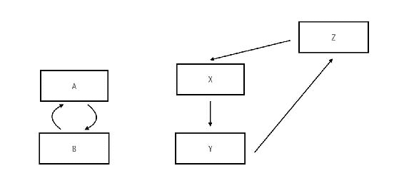

# 使用平台 API

在上一章中，我们探讨了 Java 平台的模块化过程，模块的形态以及如何导航和查找更多关于它们的信息。在本章中，我们将通过使用一些平台 API 来实际操作，并在地址簿查看器应用程序中实现和扩展功能。在这个过程中，我将向您展示查找和使用平台 API 的典型流程，以及如何组织应用程序模块以实现更好的重用性和模块化。

在本章中，我们将对地址簿查看器应用程序进行以下增强：

+   我们将使用 Java 日志记录 API 将日志逻辑添加到应用程序中。这并不是一个面向用户的功能，但对于开发者来说，能够从应用程序中记录信息和错误消息是非常方便的。

+   我们将使用 XML API 从 XML 文件中读取联系信息。当前的应用程序中有一堆硬编码的用户。我们希望将其更新为从用户提供的路径上的 XML 文件中读取。

+   我们将通过显示姓名列表来为应用程序添加图形用户界面。点击列表中的姓名将显示该联系人的详细联系信息。我们将使用 Java FX API 来构建这个功能。

所有的上述功能都需要使用 Java 平台 API。通过实现上述三个目标，您将已经在建立对 Java 平台模块的依赖和使用方面有了良好的实践。请注意，本章的重点在于使用平台 API，而不是学习具体的 API。因此，即使您不打算使用或学习 Java XML API 或 Java FX API，我仍然建议您打开您的编辑器并亲手完成本章中涵盖的步骤。在本章中使用这些特定的 API 只是为了学习如何一般性地使用平台 API。完成本章的工作后，您将能够更好地浏览和使用其他 Java 平台 API。

我们有很多内容要介绍，所以让我们开始吧！

# 添加日志功能

让我们从在 Java 中使用日志记录 API 将消息记录到控制台开始。作为一个例子，我们希望在应用程序启动和完成时能够记录一些示例消息。

在 Java 8 或更早版本中，我们通常会直接导入必要的日志类并开始使用日志 API。也就是说，从 `java.util.logging` 包中的 `Logger` 类。然而，正如我们在上一章中学到的，Java 9 中有一个额外的步骤。直接使用日志 API 将导致编译错误。这是因为日志 API 不在 `java.base` 模块中可用。我们已经看到，使用 `java` 命令的 `--list-modules` 参数是搜索模块的最佳方式。让我们运行它并查看是否能找到与日志相关的模块：

```java
$ java --list-modules 
... 
java.jnlp@9 
java.logging@9
java.management@9
java.naming@9
java.prefs@9
```

如你所见，有一个名为 `java.logging` 的模块，看起来很有希望！下一步是看看这个模块是否导出了我们需要的 API：

```java
$ java -d java.logging 
module java.logging@9
  exports java.util.logging 
  requires mandated java.base 
  provides jdk.internal.logger.DefaultLoggerFinder with
 sun.util.logging.internal.LoggingProviderImpl 
  contains sun.net.www.protocol.http.logging 
  contains sun.util.logging.internal 
  contains sun.util.logging.resources 
```

好消息！是的，`java.logging` 模块导出了 `java.util.logging` 包，这正是我们所需要的。让我们首先将这个模块作为依赖项添加到 `packt.addressbook` 模块中：

```java
    module packt.addressbook { 
      requires java.logging; 
      requires packt.sortutil; 
    } 
```

现在，我们可以自由地在代码中使用日志记录 API。在 `Main.java` 类中，首先导入 `Logger` 类，并通过使用类名初始化 `Logger` 来创建一个静态的 `logger` 变量：

```java
    package packt.addressbook; 
    ... 
    import java.util.logging.Logger; 
    ... 
    public class Main { 
      private static final Logger logger = 
        Logger.getLogger(Main.class.getName()); 
      ... 
    } 
```

接下来，我们可以使用记录器在应用程序的开始和结束时记录一条消息：

```java
    public static void main(String[] args) { 
      logger.info("Address book viewer application: Started"); 
      ... 
      System.out.println(contacts); 
      logger.info("Address book viewer application: Completed"); 
    } 
```

在项目根目录中运行此命令来编译模块：

```java
$ javac --module-source-path src -d out --module 
  packt.addressbook,packt.sortui
```

使用 `java` 命令执行，你应该得到类似以下的输出：

```java
$ java --module-path out -m packt.addressbook/packt.addressbook.Main
Mar 27, 2017 7:41:51 PM packt.addressbook.Main main
INFO: Address book viewer application: Started
[Charles Babbage, Tim Berners-Lee, Edsger Dijkstra, Ada Lovelace, Alan Turing]
Mar 27, 2017 7:41:51 PM packt.addressbook.Main main
INFO: Address book viewer application: Completed
```

通过这种方式，我们已经成功地将日志记录 API 集成到我们的应用程序中。这是本章我们将要探讨的三个用例中最简单的一个。使用日志平台 API 的部分涉及：

+   声明需要平台模块——使用 `requires` 语句

+   在 Java 源中使用平台模块 API

# 使用替代的编译命令

随着我们开始创建更多模块，编译命令将继续增长。这是因为我们需要在命令中直接指定每个需要编译的模块在模块路径中的位置。

如果你使用的是 macOS/Unix/Linux 操作系统，有一个替代的方法可以编译所有模块，我发现这个方法更短，更容易。记住在 第二章，*创建你的第一个 Java 模块*中，我们直接在编译器的命令中列出了所有 Java 类。现在，我们不再需要手动在命令中输入所有模块中的所有类，而是使用 Unix 的 `find` 命令和命令行通配符来获取所有具有 `.java` 扩展名的文件名，并将其直接插入。以下命令说明了这是如何工作的：

```java
$ javac --module-source-path src -d out $(find . -name '*.java')
```

命令 `$(find . -name '*.java')` 一次性展开当前文件夹（由 `.` 指定）中所有 Java 文件的文件名（由 `-name '*.java'` 指定），包括嵌套的子文件夹。由于这个命令更短，更容易阅读，所以我将从现在开始使用这个版本。这种格式还有一个额外的优势，就是一致性。你可以基本上复制粘贴这个命令来编译当前目录中的所有模块，无论你有多少个模块。如果你使用的是 Windows，或者你更喜欢使用 `--module` 格式，确保你指定所有单个模块名称，紧随 `--module` 选项之后。

# 从 XML 文件中读取联系人

我们接下来的改进是将地址簿查看器应用程序读取 XML 文件以获取联系人信息，而不是使用硬编码的列表。这个集成有几个细微之处，所以现在让我们试试看！

地址簿查看器显示的联系人列表来自`ContactUtil`类中的硬编码数据。以下是我们要从中读取的 XML 文件的示例结构：

```java
    <?xml version="1.0"?> 
    <addressbook> 
      <contact> 
        <firstname>Edsger</firstname> 
        <lastname>Dijkstra</lastname> 
        <address> 
          <street>5612</street> 
          <city>AZ</city> 
          <state>Eindhoven</state> 
          <country>Netherlands</country> 
        </address> 
        <phone>345-678-9012</phone> 
      </contact> 
      <contact> 
          ... 
      </contact> 
      ... 
    </addressbook> 
```

根节点是`addressbook`，其中包含几个`contact`子节点。每个`contact`节点都有`firstname`、`lastname`和一个嵌套的`address`节点，如下所示。

为了让应用程序从 XML 文件中读取，我们想做的如下：

1.  从模块`packt.addressbook`中移除现有的硬编码逻辑。

1.  在一个单独的模块中实现打开和读取 XML 文件的功能。这个模块将包含从源 XML 文件读取并返回联系人列表的代码。

1.  更新主地址簿模块，使其依赖于这个新的模块以获取联系人列表。

需要做#1 的事实是显而易见的。但为什么是#2 和#3？为什么将代码的这一部分移动到自己的模块中？嗯，正如你可以想象的那样，这个问题没有*正确*的答案。

模块化的目标是实现将单体代码分离成可自由重用和替换的模块化构建块。考虑这样一个场景，在未来，你决定*不*使用 XML 文件来存储数据，而是从 JSON 文件、数据库或甚至 REST API 中读取。无论新的数据源是什么，事实是存在这样一个独立的模块，它作为联系人列表的*提供者*，使得更改相对容易。你所需做的就是移除我们现在创建的基于 XML 的模块，并插入一个新的模块，该模块从新的数据源读取。当然，你仍然需要更改消费者以依赖于新的模块。但更改将最小化，任何副作用的影响范围也将缩小。

# 移除硬编码的联系人列表

让我们先移除硬编码的联系人数据源。这相当简单。你需要删除`packt.addressbook.util`包中的`ContactUtil.java`类。现在我们在`Main.java`中剩下几行代码已经不再有效。让我们也移除这两行：

```java
    ContactUtil contactUtil = new ContactUtil(); 
    List<Contact> contacts = contactUtil.getContacts(); 
```

# 创建模块

现在让我们创建一个新的模块，该模块包含作为联系人信息源的代码。我将这个模块命名为`packt.contact`。你现在应该很熟悉这个过程了。在`src`文件夹中创建一个名为`packt.contact`的新模块根文件夹，就在其他模块根文件夹所在的位置。接下来，在模块根文件夹中创建一个`module-info.java`模块描述符。

我们需要哪些模块？由于这个模块需要 XML API，我们必须使用`requires`语句来声明它。我们在上一章中看到有一个名为`java.xml`的模块，其中包含 XML API。当然，使用`java --list-modules`命令来搜索正确的模块也是一种方法。以下是添加了这个依赖关系的模块描述符。

```java
    module packt.contact { 
      requires java.xml; 
    } 
```

本模块的源代码属于两个类。首先是位于 `packt.contact.util` 包中的 `ContactLoader` 类。这个类包含一个 `loadContacts` 方法，它接受要读取的 XML 文件名，并返回 `Contact` 对象的列表。这是模块消费者将调用的方法：

```java
    package packt.contact.util; 
    public class ContactLoader { 
      public List<Contact> loadContacts(String fileName) { 
        ... 
      } 
```

注意，该方法的名称是通用的 `loadContacts`，并且没有特别指出它从 XML 文件中加载。这再次有助于实现抽象，并且该模块完全有可能在未来更改其功能，从其他来源或文件格式读取联系人。

第二个类 `XMLUtil` 包含一些通用的但实用的 XML 工具方法。这些是 `ContactLoader` 类将用于读取和解析 XML 的方法。由于处理 XML 的这一方面不是本模块的 *目的*，因此该类将位于单独的 `packt.contact.internal` 包中，以便可以防止在模块外部使用：

```java
    package packt.contact.internal; 
    public class XmlUtil { 
      ... 
    } 
```

现在是这个模块的文件和文件夹结构：


# 编写 XmlUtil 类

现在我们将第一个方法添加到 `XmlUtil` 中——一个 `loadXmlFile()` 方法，它接受一个 XML 文件名作为 `String`，解析它，并返回一个 XML 文档对象。

代码涉及打开文件以获取 `File` 对象。然后，使用 DOM XML API，我们创建一个 `DocumentBuilderFactory`。有了这个，我们创建一个新的 `DocumentBuilder`。然后，我们解析输入文件。

以下是该方法的全部内容：

```java
    public Document loadXmlFile(String fileName) throws
     ParserConfigurationException, SAXException, IOException { 
       File inputFile = new File(fileName); 
       DocumentBuilderFactory dbFactory =
         DocumentBuilderFactory.newInstance(); 
       DocumentBuilder dBuilder = dbFactory.newDocumentBuilder(); 
       Document doc = dBuilder.parse(inputFile); 
       doc.getDocumentElement().normalize(); 
       return doc; 
    } 
```

注意该方法抛出的异常。这三个异常是使用文件 API 打开文件和 XML API 解析文件的结果。而不是让该方法捕获异常，因为它实际上不知道该如何处理，它抛出了这些异常。这些异常对模块化有一个有趣的含义，我们将在稍后探讨。

第二个方法是 `getElement()`，它接受一个 XML 节点和元素名称，以返回该节点中该元素的值。如果没有找到值，则返回一个空字符串。这完全是 XML API 特定的，对我们来说在本章的上下文中并不太有趣，所以这里是该方法的全部内容：

```java
    public String getElement(Node nNode, String tagName) { 
      if (nNode.getNodeType() == Node.ELEMENT_NODE) { 
        Element eElement = (Element) nNode; 
        return eElement.getElementsByTagName(tagName)
         .item(0).getTextContent(); 
      } 
      return ""; 
    } 
```

使用这种方法，我们就完成了 `XmlUtil`。现在，我们将继续探讨更有趣的 `ContactLoader` 类。

# 编写 ContactLoader 类

我们已经看到 `ContactLoader` 应该有一个单一的方法 `loadContacts()`，它接受文件名作为参数，并返回一个 `Contacts` 列表：

```java
    public List<Contact> loadContacts(String fileName) {

    }
```

在该方法中，我们初始化 `XmlUtil` 的新实例，并使用 `loadXmlFile` 方法获取 XML 文档对象：

```java
    XmlUtil xmlUtil = new XmlUtil();
    Document doc = xmlUtil.loadXmlFile(fileName);
```

现在剩下的是处理生成的 DOM 对象结构，并构建我们需要的模型类型中的联系人列表。为了避免过多地详细介绍 XML，我将仅向您指出捆绑的源代码位于 `05-jdk-modules/src/packt.contact`。

目前`packt.contact`模块存在一些问题--共享类和依赖泄露。其中之一你可能已经注意到了。

# 共享类

这是两个问题中更明显的一个。我们创建了一个新的模块，并在一个类中设计了一个方法来返回`Contact`实例的列表。问题是`Contact`和`Address`模型类不在模块中！它们在`packt.addressbook`模块中。现在编译这个模块将导致关于这两个类未找到的编译错误。我们该如何解决这个问题？

这里有一个想法。我们是否可以依赖于包含这些类的模块？`packt.contact`模块需要`packt.addressbook`模块中可用的`Contact`和`Address`类。我们能否让`packt.contact`模块要求`packt.addressbook`模块？当然，我们还需要双向的依赖。`packt.addressbook`需要`requires packt.contact`以获取联系人列表。这能行吗？结果是不能，因为这引入了循环依赖，而 Java 模块系统不允许循环依赖。

**循环依赖**是指两个或多个模块以这种方式相互依赖，以至于依赖图形成一个循环。下面图中的两个例子都代表了循环依赖。

下面的图显示了两种循环依赖场景。模块**A**和**B**相互依赖，形成一个循环依赖。在第二个例子中，右侧，模块**Z**读取**X**，**X**读取**Y**，而**Y**反过来读取**Z**。这也是一个循环依赖，现在是在三个模块之间。如果 Java 平台遇到这样的循环依赖，它会抛出一个错误并无法工作：



Java 模块系统不允许循环依赖，因为这会破坏模块具有**有向**依赖的概念。回想一下我们一直在绘制的模块图。在某种意义上，依赖关系是有**方向**的，当一个模块依赖于另一个模块时，会从前者到后者画出一个有向箭头。存在循环依赖，或者如它们通常所说的，**循环**依赖意味着两个模块之间联系如此紧密，以至于将它们分成两个独立的模块的想法变得没有意义。如果一个模块没有另一个模块就无法存在，那么将它们作为独立模块的意义又在哪里呢？

拥有一个**有向无环图**的模块图是很重要的。这种图，正如其名所示，是**有向**的，也就是说你可以以这样的方式排列所有节点，使得所有依赖关系都有一个自上而下的方向，并且它是**无环**的，也就是说没有循环。

由于我们不能实现循环依赖，我们只剩下两个选项来解决这个问题。第一个选项是将模型类从`packt.addressbook`移动到`packt.contact`，并让`packt.contact`导出它们。这样，由于`packt.addressbook`无论如何都需要`packt.contact`，它也可以使用模型类。

第二种选择是为模型类创建一个单独的模块，并让`packt.addressbook`和`packt.contact`都要求使用它们。这也允许其他模块可能使用模型类。为了简单起见，我将采用第一种方法，并将模型类暂时移动到`packt.contact`中。在类似的真实世界用例中，你可能需要考虑这些共享类的预期使用情况，以决定它们是否需要单独的模块。

在`packt.contact`模块中，模型类是这样的：


需要更新`module-info.java`以`export` util 和 model 包：

```java
    module packt.contact { 
      requires java.xml; 
      exports packt.contact.model; 
      exports packt.contact.util; 
    } 
```

# 依赖泄露

这是我们在构建`packt.contact`模块时遇到的第二个问题，这个问题可能并不那么明显。这是`ContactLoader`中我们希望模块消费者调用的方法的签名：

```java
    public List<Contact> loadContacts(String fileName)  
     throws ParserConfigurationException, SAXException, IOException
```

消费者模块需要做什么才能访问这个方法？首先，消费模块需要`require packt.contact`。有了这个，他们就可以访问他们模块中的`ContactLoader`。然后，他们可以在他们的某个类中调用`loadContacts`方法。但是等等！由于`loadContacts()`抛出了三个异常，消费方法也需要捕获它们！

```java
    try { 
      contacts = contactLoader.loadContacts("input.xml"); 
    } catch (ParserConfigurationException | SAXException |
       IOException e) { 
         // Handle error here 
    } 
```

但问题就出在这里。消费模块的代码被迫使用 XML 异常类来捕获它们。`IOException`来自`java.lang`，因此所有模块都因为它隐含的`java.base`依赖而获得它。但是，消费模块并不自动有权访问`ParserConfigurationException`或`SAXException`，因为它们是来自`java.xml`模块的类。`loadContacts()`能够被其他模块使用，唯一的办法是它们在每次使用`packt.contact`时也`require java.xml`。即使它们自己没有使用任何 XML API。这样封装 XML 功能就太好了！

虽然这是一个可行的解决方案，但我们不希望构建强制依赖这样的模块。理想情况下，一个模块应该是自给自足的，并且不应该需要其他对等依赖才能使其可用。解决这个问题有几个方法。一种方法是在`packt.contact`模块中建立所谓的*传递性依赖关系*。传递性依赖关系是模块系统允许你配置模块以声明自动对等依赖关系的一种方式。例如，你可以对`packt.contact`有一个依赖关系，同时也自动建立对`java.xml`的依赖关系，这样任何对前者有依赖关系的模块也会得到后者。我们将在第六章中了解更多关于传递性依赖关系的信息，*模块解析、可访问性和可读性*。

然而，在这种情况下，这也不是最佳选择。我们希望将所有与 XML 相关的功能都放入`packt.contact`中，并且不要有任何 XML 类泄漏到消费模块中。因此，在这种情况下，我们将创建一个自定义异常，并在出现任何错误时抛出它。我们将确保异常位于一个导出包中，这样消费模块就可以自动获取异常。

我们将类命名为`ContactLoadException`并将其放置在`packt.contact.util`包中：

```java
    package packt.contact.util; 
    public class ContactLoadException extends Exception { 
      ... 
      public ContactLoadException() { 
        super(); 
      } 
      public ContactLoadException(String message) { 
        super(message); 
        // TODO Auto-generated constructor stub 
      } 
    } 
```

现在`ContactLoader`需要捕获 XML 异常并抛出自定义异常：

```java
    public List<Contact> loadContacts(String fileName) throws
     ContactLoadException { 
       ... 
       Document doc; 
       try { 
         doc = xmlUtil.loadXmlFile(fileName); 
       } catch (ParserConfigurationException | SAXException |
          IOException e) { 
            throw new ContactLoadException("Unable to load 
            Contact file"); 
       } 
```

太好了！现在我们已经完全将 XML 相关的功能隔离到`packt.contact`中，并且使用它的任何模块都不需要处理 XML API。

通过这种方式，我们完成了`packt.contact`模块。现在我们可以继续进行到`packt.addressbook`并使用此模块。

# 消费新的模块

首先，我们在`packt.addressbook`中建立一个依赖关系。以下是`module-info.java`文件：

```java
    module packt.addressbook { 
      requires java.logging; 
      requires packt.sortutil; 
      requires packt.contact; 
    } 
```

然后，在`Main.java`中，我们创建一个新的`ContactLoader`实例，并通过传递 XML 文件的路径来调用`loadContacts`方法。使用与源代码捆绑的`input.xml`文件，以下是读取文件并返回`Contact`实例的步骤：

```java
    try { 
          contacts = contactLoader.loadContacts(
            "/Users/koushik/code/java9/input.xml"); 
        } catch (ContactLoadException e) { 
            logger.severe(e.getMessage()); 
            System.exit(0); 
        } 
```

`catch`块使用之前创建的`logger`实例来记录异常消息并退出应用程序。

这是包含这些更改的完整`Main`方法：

```java
    public class Main { 

      private static final Logger logger = 
        Logger.getLogger(Main.class.getName()); 

      public static void main(String[] args) { 

        logger.info("Address book viewer application: Started"); 
        List<Contact> contacts = new ArrayList<>(); 
        ContactLoader contactLoader = new ContactLoader(); 
        SortUtil sortUtil = new SortUtil(); 
        try { 
          contacts = contactLoader.loadContacts(
            "/Users/koushik/code/java9/input.xml"); 
        } catch (ContactLoadException e) { 
            logger.severe(e.getMessage()); 
            System.exit(0); 
        } 

        sortUtil.sortList(contacts); 
        System.out.println(contacts); 
        logger.info("Address book viewer application: Completed"); 
      } 
    } 
```

现在编译并执行应用程序将产生以下输出：

```java
$ java --module-path out -m packt.addressbook/packt.addressbook.Main
Mar 28, 2017 3:25:41 PM packt.addressbook.Main main 
INFO: Address book viewer application: Started 
[Charles Babbage, Tim Berners-Lee, Edsger Dijkstra, Ada Lovelace, Alan Turing]
Mar 28, 2017 3:25:41 PM packt.addressbook.Main main 
INFO: Address book viewer application: Completed 
```

干得好！在将 XML 功能添加到地址簿查看器应用程序的过程中，你处理了一些模块相关的问题和设计考虑。让我们继续本章的第三个目标——与 Java FX API 集成以创建地址簿查看器应用程序的 UI。

# 使用 Java FX 添加 UI

现在我们将创建一个 UI 应用程序，允许我们点击并浏览联系人信息。我们将使用 Java FX API 来创建和显示 UI。与上一节一样，我应该强调这里的重点不是让我们学习 JavaFX API 本身。实际上，在本节中，我将略过大多数 Java FX API 的细节，因为那超出了本书的范围，尽管完整的源代码是可用的，如果你感兴趣的话。这个练习的目的是让我们学习如何使用 Java API 以及如何处理与之相关的不同使用场景和细微差别。

我们将在地址簿应用程序中添加 UI 的步骤如下：

1.  创建一个名为`packt.addressbook.ui`的新模块，其中包含用于在 Java FX 用户界面中显示地址簿的代码。

1.  让`packt.addressbook.ui`模块依赖`packt.contacts`以获取`Contact`实例的列表。同时让模块依赖`packt.sortutil`以按姓氏对`Contact`实例进行排序。

# 创建模块

让我们先创建新的模块`packt.addressbook.ui`。和之前一样，在项目文件夹中创建具有相同名称的模块根文件夹，然后创建模块描述符`module-info.java`。我们已经知道我们需要依赖`packt.contacts`和`packt.sortutil`，所以让我们先添加这两个依赖项：

```java
    module packt.addressbook.ui { 
      requires packt.sortutil; 
      requires packt.contact; 
    } 
```

在这个模块中，我们需要使用 JavaFX 库，因此我们需要在模块描述符中使用`requires`子句来指定这个依赖项。我们如何知道需要哪些库？答案是和之前一样——使用`java --list-modules`和`java -d <module-name>`。但在我们浏览依赖的模块之前，我们应该知道我们需要哪些 API！让我们看看我们需要编写的代码来构建 UI。

我们将在`packt.addressbook.ui`包中创建一个`Main.java`类。这个类将启动 UI。与任何 Java FX 应用程序一样，启动应用程序的类必须扩展`javafx.application.Application`。然后我们重写`start`方法，并在其中添加构建 UI 的功能。这个方法由 JavaFX 框架调用以启动我们的应用程序。记住这个方法！我们将在执行代码时很快再次回到这里：

```java
    public class Main extends Application { 

      public static void main(String[] args) { 
        launch(args); 
      } 

      @Override 
      public void start(Stage primaryStage) throws Exception { 
        // Build JavaFX UI and application functionality 
      } 
    } 
```

在`start`方法中，获取`Contact`实例并进行排序的逻辑与`packt.addressbook`模块中的命令行应用程序完全相同：

```java
    ContactLoader contactLoader = new ContactLoader(); 
    SortUtil sortUtil = new SortUtil(); 
    try { 
          contacts = contactLoader.loadContacts(
            "/Users/koushik/code/java9/input.xml"); 
        } catch (ContactLoadException e) { 
            logger.severe(e.getMessage()); 
            System.exit(0); 
        } 

        sortUtil.sortList(contacts); 
```

在这个案例中，与以往不同的地方在于我们对排序后的`Contacts`列表的处理方式。我们不仅仅将其打印到控制台。相反，我们将构建一个 JavaFX `ListView`来显示这个列表。我们还会为列表中的每个元素添加一个点击处理程序，这样当点击一个名字时，我们就可以在列表右侧显示该联系人的详细信息。以下是我们希望 UI 看起来像什么：


在不深入探讨 JavaFX 控件的构建和显示细节的情况下，这里的核心功能是从 `sortutil` 排序后的列表中构建 `Contacts` 列表，并处理列表项上的点击事件：

```java
    // Create a new JavaFX ListView 
    ListView<String> list = new ListView<String>(); 
    // Collect a String list of Contact names in lastName,
    firstName format 
    List<String> listContactNames = contacts.stream()
          .map(c -> c.getLastName() + ", " + c.getFirstName()) 
          .collect(Collectors.toList()); 
    // Build an ObservableList from the list of names 
    ObservableList<String> obsContactNames =
         FXCollections.observableList(listContactNames); 
    // Pass that to ListView to have them displayed in a list 
    list.setItems(obsContactNames); 
    // Add listener to handle click events 
    list.getSelectionModel()
          .selectedItemProperty()
         .addListener((obs, oldVal, newVal) -> { 
             // Get the selected index in the ListView 
             int selectedIndex = 
               list.getSelectionModel().getSelectedIndex(); 
             name.setText(newVal); 
             // Get the Contact instance which was clicked 
             Contact contact = finalContactList.get(selectedIndex); 
             // Set the values to each of the labels on the right 
             street.setText(contact.getAddress().getStreet()); 
             ...    
```

上述代码将我们已熟悉的逻辑（`ContactLoader` 和 `SortUtil`）连接到显示数据的 JavaFX 代码中，以便在 UI 中浏览。我们在这里使用了相当多的 JavaFX API，就像我们通常在构建类似这样的 JavaFX 应用程序时一样。现在我们已经知道了我们需要使用的 API，接下来我们需要找到导出这些 API 的模块，并在 `packt.addressbook.ui` 模块中设置依赖关系。

使用 `java --list-modules` 命令，我们可以看到与 JavaFX 相关的多个模块。这些模块都是以 `javafx.` 前缀开始的：

```java
$ java --list-modules 
... 
javafx.base@9
javafx.controls@9
javafx.deploy@9
javafx.fxml@9
javafx.graphics@9
javafx.media@9
javafx.swing@9
javafx.web@9
... 
```

要知道我们使用的包，我们只需要查看 `Main.java` 类中的导入列表。我们可以检查每个 JavaFX 模块的包级别信息，以获取所有我们需要包的模块集合。

例如，`javafx.base` 导出了我们在 `Main.java` 中使用的 `javafx.collections`。因此，这是一个我们需要添加的模块。以下是更多我们感兴趣的模块。左侧列出了我们需要的包，以及在我们 Java 代码中使用的情况。右侧列出了导出该包的 Java 平台模块（我们通过运行 `java -d <module-name>` 找到）：

```java
Package                  Module 
------------------------------------------
javafx.collections       javafx.base 
javafx.scene.control     javafx.controls 
javafx.application       javafx.graphics 
javafx.scene.layout      javafx.graphics 
javafx.geometry          javafx.graphics 
```

基于此，我们需要添加的三个模块是 `javafx.base`、`javafx.controls` 和 `javafx.graphics`。让我们使用 `requires` 子句将这些三个模块添加到 `packt.addressbook.ui` 模块定义中。完成之后，这是 `module-info.java` 文件的内容：

```java
    module packt.addressbook.ui { 
      requires java.logging; 
      requires javafx.base; 
      requires javafx.controls; 
      requires javafx.graphics; 
      requires packt.sortutil; 
      requires packt.contact; 
    } 
```

尽管我们已经找到了模块导出的包，并且我们在技术上所要求的并没有错误，但这一步可以做得更好。实际上，我们只需要在这里要求一个 JavaFX 模块！这要归功于一个名为 `transitive` 的特定限定符。我们将在第六章 Module Resolution, Accessibility, and Readability 中更详细地介绍这个限定符是什么以及它如何影响我们的依赖关系。但由于我们还没有介绍它，现在我们先添加所有三个 JavaFX 模块。

如果你觉得通过运行

`--list-modules` 命令很繁琐，不过，你并不孤单！我希望一旦 IDE 支持了 Java 9，这很快就会变得不再必要。理想情况下，IDE 应该能够根据我们导入到 Java 应用程序中的包来帮助我们识别模块，并且最好能够自动将模块添加到模块描述符中。这个功能在你阅读本文时可能已经在大多数标准 IDE 中可用！

好的，所以，有了这些，我们已经建立了所有的依赖关系。让我们试试看！使用 `javac` 命令编译所有模块：

```java
$ javac --module-source-path src -d out $(find . -name '*.java')
```

代码应该能够无错误地编译。让我们尝试执行它。由于我们正在运行位于新模块`packt.addressbook.ui`中的`Main.java`文件，请确保这次在命令中指定它。请注意，当我们运行代码时，我们会得到一个错误：

```java
$ java --module-path out -m packt.addressbook.ui/packt.addressbook.ui.Main

Exception in Application constructor
Exception in thread "main" java.lang.reflect.InvocationTargetException
...
Caused by: java.lang.IllegalAccessException: class com.sun.javafx.application.LauncherImpl (in module javafx.graphics) cannot access class packt.addressbook.ui.Main (in module packt.addressbook.ui) because module packt.addressbook.ui does not export packt.addressbook.ui to module javafx.graphics 
...
```

错误表明，模块`javafx.graphics`正在尝试访问我们的`Main`类，但由于我们的模块`packt.addressbook.ui`没有导出它，因此无法访问它！你可能会想知道模块`javafx.graphics`与我们编写的类有什么关系！为什么它需要访问我们的类？

结果表明，答案是 JavaFX 的工作方式。记得我提到过`Main.java`中的`start()`方法以及 JavaFX 框架如何调用该方法来启动应用程序。框架使用反射来识别扩展`Application`类的类。然后，框架使用这些信息通过调用`start()`方法来启动 JavaFX 应用程序。

这就是我们的问题。在`packt.addressbook.ui`的模块描述符中，我们没有导出`Main`所在的包，即`packt.addressbook.ui`。因此，`Main`对模块外部的任何代码都是不可访问的，所以 JavaFX 无法启动应用程序！应用于模块外部类型静态访问的封装在运行时反射访问中仍然有效！

解决这个问题的方法之一是将`Main`设置为公共的。我们只需要导出类型所在的包。这足以让 JavaFX 访问它。这也实际上允许任何模块访问它！这可能是你想要的，也可能不是。但就目前而言，让我们导出这个包，并使`Main.java`对外可用。我们也会在第六章“模块解析、可访问性和可读性”中重新审视这个问题，并找到更好的解决方案。

下面是最终的`module-info.java`文件：

```java
    module packt.addressbook.ui { 
      exports packt.addressbook.ui;  
      requires java.logging; 
      requires javafx.base; 
      requires javafx.controls; 
      requires javafx.graphics; 
      requires packt.sortutil; 
      requires packt.contact; 
    } 
```

再次编译并运行应用程序，这次应该一切正常。一个 GUI 窗口应该加载带有按姓氏排序的联系人列表。点击一个名字应该在右侧显示详细信息。你可以通过点击标题栏上的关闭按钮来关闭应用程序。

# 摘要

我们对地址簿应用程序进行了几项改进，以利用一些平台 API，并从中学习了一些关于如何查找和使用平台模块的教训，以及如何处理沿途出现的一些棘手场景。以下是到目前为止我们所做的工作：

+   我们使用`java.logging`模块为`packt.addressbook`模块添加了日志功能。

+   我们使用了`java.xml`模块并创建了一个新的自定义模块，该模块读取并解析 XML 文件以返回模型对象的列表。

+   我们遇到了两个问题——共享代码和依赖泄露，并实施了一种策略来绕过这些问题。

+   我们使用了 JavaFX 模块来构建地址簿的用户界面。我们创建了一个新的模块，该模块利用我们现有的联系人和排序模块来构建这个 UI。我们了解了模块化对反射的影响。我们通过仅导出框架需要访问的类来解决这个问题，尽管我们将在下一章学习更好的方法来做这件事。

我还想强调一点，在本章中，我们是如何利用我们已经构建的模块来创建一个新的自定义 GUI 模块的。请注意，我们不必与现有代码纠缠，也不需要用 if 语句在它们上面堆砌逻辑和功能。我们轻松地创建了一个新的 GUI 模块，多亏了其他核心功能是独立的模块，我们只需将它们作为构建块来创建一个全新的模块，这个模块包含了我们需要的所有功能。`packt.contact`和`packt.sortutil`并不关心它们被用在何处，所以从技术上讲，它们并不在乎！

在下一章中，我们将探讨 Java 模块系统的一些更多技巧！我们还将深入研究与可读性相关的概念，并了解使不同模块之间相互访问的更强大方式。
