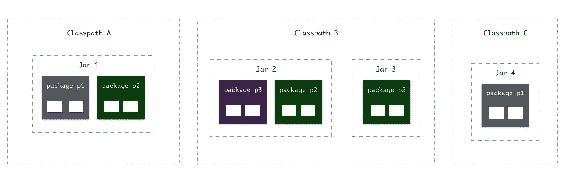

# 模块解析、可读性和可访问性

在上一章中，我们通过利用多个平台 API 来添加额外功能，显著增强了地址簿查看器应用程序。我们使用了 JavaFX 实现了日志记录、XML 解析和 UI 模块。地址簿查看器应用程序已经从简单的 *Hello world* 原始版本发展了很多。在这个过程中，你已经获得了大量关于 Java 模块系统的知识，你应该具备构建任何类似复杂性的 Java 应用程序所需的知识和工具。

本章你将学习以下内容：

+   你将介绍两个重要概念及其相关术语--可读性和可访问性

+   你将了解一些关于使模块可读和包可访问的细微差别

+   你将学习一些强大的新方法来调整指定依赖项的默认方法--隐式依赖和限定导出

+   你将应用这两种新方法在地址簿查看器应用程序中调整和优化依赖项，使用聚合模块和限定导出

在本章中，我们将对我们在学习过程中仅以高层次了解的一些概念进行深入探讨。虽然你可以使用我们迄今为止所涵盖的一切来构建各种不同的应用程序，但了解所涵盖的某些主题的细微差别将有助于学习和理解。了解这些概念将帮助你以强大的新方式使用模块系统。此外，在本章中我们将学习的某些术语将帮助你理解和描述每次使用模块系统时在底层运行的概念和过程。

# 可读性

可读性是模块化中的一个重要概念，它描述了模块如何相互协作。我们一直使用模块依赖关系，让一个模块要求另一个模块并使用其 API。每当一个模块依赖于另一个模块时，第一个模块就被说成是读取第二个模块。同样，第二个模块也被说成是可被第一个模块读取。当一个模块读取另一个模块时，它有权访问第二个模块导出的类型。换句话说，两个模块之间的可读性关系是我们迄今为止所看到的模块图中的箭头。

例如，在地址簿查看器应用程序中，模块 `packt.addressbook` 读取 `packt.sortutil`、`packt.contact` 和 `java.logging`。这是因为它在模块描述符中`requires`了这些模块。

考虑一个例子。以下图表显示了三个模块 **A**、**B** 和 **C** 之间的关系：


**模块 A** 需要 **模块 B**。因此，**模块 A** 读取 **模块 B**。**模块 B** 可被 **模块 A** 读取。**模块 C** 也读取 **模块 B**。然而，**模块 C** 不读取 **模块 A**，反之亦然。

如你所见，*读取*关系不是对称的。如果**模块 A***读取***模块 B**，并不意味着**模块 B**会读取**模块 A**。实际上，在 Java 模块系统中，我们可以保证模块之间的*读取*关系是不对称的。为什么？因为如果两个模块相互*读取*，最终我们会得到一个循环依赖，这是不允许的（参见第五章，*使用平台 API*）。所以总结一下，首先，*可读性*关系是通过使用`requires`子句建立的。其次，如果一个模块*读取*另一个模块，我们可以保证第二个模块不会*读取*第一个模块。

然而，有两个例外，你可能已经猜到了它们是什么，因为我们已经讨论过它们了。首先，每个模块都会*读取*`java.base`模块。这种依赖关系是*自动的*，没有使用`requires`限定符的显式使用。其次，每个模块根据定义都会*读取*自身，因为模块默认自动有权访问模块中的所有公共类型。

可读性关系对于实现 Java 模块系统的两个主要目标之一--可靠配置是基本的。我们希望能够可靠地保证应用程序中所有模块的依赖关系都得到满足。随着时间的推移，我们还将看到这些正式模块关系的性能优化优势。运行时不再需要扫描整个类路径来查找给定的类型。运行时可以通过某些方式最优地找到正确的模块以及找到类型的定位。这是一个巨大的胜利！

# 可访问性

可访问性是 Java 模块化硬币的另一面。如果*可读性*关系指定了哪些模块可以读取给定模块，*可访问性*则表示它们实际读取的内容。并非模块中的所有内容都对读取它的其他模块可访问。只有标记了`exports`声明的包中的公共类型才是可访问的。

因此，为了使模块 B 中的类型在模块 A 中*可访问*，需要发生以下情况：

+   模块 A 需要*读取*模块 B

+   模块 B 需要导出包含类型的包

+   类型本身应该是`public`

让我们来看一个例子，并检查可读性和可访问性关系。考虑两个模块，`app`和`lib`。模块`app`对模块`lib`有`requires`限定符。模块`lib`导出其包`lib.external`：

```java
    module app { 
      requires lib; 
    } 
    module lib { 
      exports lib.external; 
    } 
```

假设`lib`模块具有以下结构：


它有两个包--`lib.external`和`lib.internal`。这两个包都包含一个公共接口和一个包私有实现。

注意：本例中的实现类在类声明中没有使用`public`关键字，这使得它们只能在同一包中可见。它们具有`*default*`包私有访问级别。

让我们尝试回答以下问题：

1.  模块 `app` 是否读取模块 `lib`？

这个问题应该很简单。答案是肯定的，因为 `requires` 限定符的存在。

1.  模块 `lib` 是否读取模块 `app`？

答案是否定的。希望同样简单！

1.  模块 `lib` 中的类型 `LibApi` 是否对模块 `app` 可访问？

让我们验证可访问性的两个要求。类型是 `public` 吗？是的。类型是否在模块导出定义中导出的包中？是的。所以，答案是 `LibApi` 对模块 `app` 是可访问的。

1.  模块 `lib` 中的类型 `InternalService` 是否对模块 `app` 可访问？

不。尽管类型是 `public`，但它属于在 `lib` 模块的模块定义中没有导出的包。类型 `InternalImpl` 也不对 `app` 模块可访问。

1.  模块 `lib` 中的类型 `LibApiImpl` 是否对模块 `app` 可访问？

答案是否定的，因为它没有满足要求——类型是 `public` 吗？由于 `LibApiImpl` 是包私有的，它不在模块外部可访问，因为它不是 `public`。即使类型属于导出包，这也是正确的。然而，这种情况却有一些我们可以从中学习的重要经验教训。让我们详细看看它们。

# 接口和实现的可访问性

在 Java 9 中，一个接口对模块可访问意味着什么？很明显，这意味着你可以在该模块的代码中使用接口类型。然而，没有实现，接口几乎没有意义。这意味着当你导出一个公共接口（如 `LibApi`），但不导出实现（`LibApiImpl`）时，实现对于模块外部来说基本上是无用的吗？并不完全是这样！

假设我们在 `LibApi` 接口中添加一个静态方法来创建 `LibApiImpl` 的实例。我们还会在接口中添加一个方便的 `testMethod()` 方法，以便我们从另一个模块调用它来验证其是否工作。注意，当 `createInstance` 方法创建 `LibApiImpl` 的新实例时，其返回类型是接口，而不是实现。这很重要，我们稍后会看到：

```java
    package packt.lib.external; 
    public interface LibApi { 
      static LibApi createInstance() { 
        return new LibApiImpl(); 
      } 
      public void testMethod(); 
    } 
```

让我们构建一个简单的实现类，它将消息打印到控制台。注意类声明前缺少 `public` 关键字。这意味着这个类是包私有的，而不是 `public`。所以，尽管它位于由模块导出的包中，但它对模块外部不可访问：

```java
    package packt.lib.external; 
    class LibApiImpl implements LibApi { 
      public void testMethod() { 
        System.out.println("Test method executed"); 
      } 
    } 
```

如果我们在 `lib` 模块外部访问这些类型会发生什么？让我们来看看！让我们在模块 `app` 中创建一个名为 `App.java` 的类。让我们首先尝试创建 `LibApiImpl` 的实例：

```java
    package packt.app; 
    import packt.lib.external.LibApiImpl; 
    public class App { 
      public static void main(String[] args) { 
        LibApiImpl api = new LibApiImpl(); 
        api.testMethod(); 
      } 
    } 
```

如果我们编译这个会发生什么？

```java
$ javac --module-source-path src -d out $(find . -name '*.java') 
./src/app/packt/lib/external/App.java:3: error: LibApiImpl is not public in packt.lib.external; cannot be accessed from outside package 
import packt.lib.external.LibApiImpl; 
                         ^ 
... 
```

正如我们所想。包私有的类不可访问，即使它位于导出包中。我们是否可以使用接口来获取其实例？

```java
    package packt.app; 
    import packt.lib.external.LibApi; 
    public class App { 
      public static void main(String[] args) { 
        LibApi api = LibApi.createInstance(); 
        api.testMethod(); 
      } 
    } 
```

我们现在使用接口`LibApi`的`createInstance()`方法来创建`LibApi`的实例。然后在该实例上调用`testMethod`。我们知道`LibApi`正在创建一个新的`LibApiImpl`实例，我们也知道这个类是不可访问的。现在这会工作吗？

```java
$ javac --module-source-path src -d out $(find . -name '*.java') 

$ java --module-path out -m app/packt.app.App 
  Test method executed 
```

它确实工作了！因为我们没有在代码中直接引用类型`LibApiImpl`，编译器和运行时都乐于允许通过接口访问该实例。这在模块中是一个很有价值的模式，因为它允许你提供公共 API，同时仍然能够管理和重写底层的实现。这不仅适用于导出包中的非公共实现类（如本例所示）；它也适用于位于未导出包中的公共类型，因此同样不可访问。所以，让我们重新审视这个问题。现在`LibApiImpl`在模块外部可访问吗？答案是仍然不可访问。然而，这里的重要教训是，可访问性规则适用于类型的用法，并不适用于运行时类型的动态实例。这是设计的一部分，并且是一个实现级别封装的好模式。

# 分割包

这是一些人可能已经提出的问题。`LibApiImpl`类是包私有的。所以，它不可能被它所在的`packt.lib.external`包外的任何类型访问。所以，我们尝试在完全不同的包`packt.app.App`中访问该类型的尝试注定会失败！实际上，即使在 Java 8 或更早的版本中也会失败！如果我们尝试从另一个模块中的相同包中访问它会怎样呢？如果我们要在`app`模块中创建相同的包`packt.lib.external`并在其中创建一个新的类，那么这个类能够访问`LibApiImpl`吗？在这种情况下，消费类在同一个包中。让我们试一试！你不必走得太远。仅仅从一个模块到另一个模块创建相同的包是不行的。假设你在`app`模块中重新创建这个包，并在其中添加任何任意的 Java 类型：

```java
    package packt.lib.external; 
    public class App { 
      public static void main(String[] args) { 
        System.out.println("Test"); 
      } 
    } 
```

我们在这里甚至没有使用`LibApiImpl`！我们只是在其他模块中使用了相同的包。编译步骤将因以下错误而失败：

```java
$ javac --module-source-path src -d out $(find . -name '*.java') 
./src/app/packt/lib/external/App.java:1: error: package exists in another module: lib 
package packt.lib.external; 
^ 
1 error 
```

是的！一个包不能同时在两个模块中存在。好吧，至少不能在两个可观察的模块中同时存在！换句话说，给定一个应用程序中的包，它应该是模块路径上仅一个模块的一部分！

这与我们在 Java 中传统上对库的看法有显著不同。既然我们已经走到这一步，我就不必强调模块与传统 JAR 库的不同。但这里还有一个方面打破了传统的*库*范式。传统上，类路径中的多个 JAR 可以包含相同的包。我们已经在第一章，“介绍 Java 9 模块化”中看到了这个例子：



由于模块不允许*共享*包，或者如常所说，*分割包*，我们现在面临一个新的层次结构。顶层是模块，下面是包，然后是包下的类型，如下面的图示中几个示例模块所示：


这现在导致我们对包的思考方式发生了另一项变化。包不再是整个应用程序中类型的分组。包只是单个模块内类型的分组。当你创建一个包时，你被迫选择所有类型都应该在哪个模块中。如果我们设计得好的话，这种方法的一个优点是组织更清晰。还有性能优化。Java 类加载器内部将每个包映射到单个模块，因此当它查找要加载的类型时，它立即知道在哪里（以及哪个模块）可以找到给定类型。

避免分割包的限制在将遗留 Java 代码库迁移到 Java 9 模块时将变成一个痛苦的头痛问题，我们将在第十一章“将您的代码迁移到 Java 9”中讨论。此外，请注意，有方法可以通过使用多个类加载器来绕过这个限制，但这超出了我们在这里讨论的范围。

# 调整模块化

我们已经探讨了两个可以在模块描述符中使用的语言结构--*要求*模块和*导出*包。它们共同为你提供了足够的控制权来管理模块的接口，并解决了模块化的两个主要目标--可靠的配置和强大的封装。然而，在许多实际情况下，你可能会发现仅这两个还不够来实现你想要完成的事情。例如，你可能只想从模块中导出一个包，仅供某个特定的其他模块使用，而不是公开使用。为了处理许多这样的特殊情况，模块系统有一些强大的功能，我们将在本章的这一部分进行探讨。

# 隐含的可读性

我们在第五章“使用平台 API”中探讨了依赖泄露的问题。你依赖的模块可能包含需要你使用另一个模块的 API。以下是一个例子：


```java
    module A { 
      requires B; 
    } 

    module B { 
      requires C; 
    } 
```

模块 A“要求”模块 B，而模块 B 反过来“要求”模块 C。我们知道，由于模块依赖不是*传递性*的，A 不会读取 C。但如果是这种情况呢？例如，如果 B 有一个 API，其返回类型在模块 C 中。

一个很好的例子可以在平台模块本身中找到。假设你编写了一个自定义模块，该模块读取`java.sql`。你希望使用该模块中的`Driver`接口。`Driver`接口有一个名为`getParentLogger()`的方法，它返回类型`Logger`。以下是`Driver`接口中该方法的模样：

```java
    Logger getParentLogger() throws SQLFeatureNotSupportedException 
```

这是你在自定义模块中调用 `java.sql` API 的代码：

```java
    Logger myLogger = driver.getParentLogger();  
```

要使这生效，你只需要在你的模块定义中添加 `requires java.sql`，然后你应该就可以正常使用了，对吧？但等等！考虑一下返回类型 `Logger`。实际上，这个类型是从 `java.logging` 来的，就像我们之前看到的。`java.sql` 模块依赖于 `java.logging` 来实现日志功能，所以对那个模块来说没问题。但你的模块呢？


由于 `yourmodule` 没有直接要求 `java.logging`，为了使用 `java.sql` API，你必须也 `require` `java.logging` 模块！


如你所见，这并不太方便。如果使用某个模块需要使用其他模块，这只会增加 API 的复杂性。在这里，你需要为开发者提供一些文档说明，例如：“如果你恰好使用 java.sql，别忘了也要要求 java.logging。”

有没有更好的方法？尽管依赖默认不是传递性的，但我们希望有选择性地仅使某些依赖传递性可用，以应对这种情况。幸运的是，Java 9 通过使用 `transitive` 关键字实现了这一点。当你在一个模块上声明 `requires` 时，你也可以让该模块对任何依赖于你的模块的模块可用和可读。使用此功能的办法是这样的——`requires transitive <module-name>;`

在下面的例子中，模块 A 需要 B。但模块 B *需要传递性 C*：

```java
    module A { 
      requires B; 
    } 

    module B { 
      requires transitive C; 
    } 
```

现在，模块 C 不仅可被模块 B 读取，而且可被所有读取模块 B 的其他模块读取。所以在这里，A 也可以读取 C！

注意，`transitive` 关键字为 `requires` 关键字添加了额外的语义。现在 `requires transitive C` 使得 C 可被所有读取 B 的模块读取，同时仍然保留我们一直知道的 `requires` 的意义——即 B 需要读取 C！

这对我们刚才讨论的 *可读性* 关系有何影响？我们知道 A *读取* B 是因为显式的 `requires` 关系？但 A 是否也 *读取* C？答案是肯定的，这种可读性关系被称为 *隐式可读性*。这种关系不是 *显式* 的，因为 A 没有直接声明对 C 的依赖。这种可读性是由于其传递性而隐含的。

这个功能在 `java.sql` 模块中被利用来解决 `Logger` 返回类型的问题。如果你在 `java.sql` 上运行 `java -d`，你会看到如下内容：

```java
$ java -d java.sql 
  module java.sql@9 
  exports java.sql 
  exports javax.sql 
  exports javax.transaction.xa 
  requires transitive java.logging 
  requires transitive java.xml 
  requires mandated java.base 
  uses java.sql.Driver 
```

注意到`java.sql`所需的两个模块`java.xml`和`java.logging`都被标记为`transitive`。正如我们刚才看到的，这意味着任何需要`java.sql`的模块都将自动获得`java.xml`和`java.logging`中的 API 访问权限！这是平台团队做出的决定，因为使用`java.sql`中的许多 API 也需要使用其他两个模块。因此，为了避免所有开发者都记得`require`这些模块，平台已经将其设置为*自动*。这就是为什么任何依赖于`java.sql`并调用`Driver.getParentLogger()`的模块在使用`Logger`类型时不会有任何问题，因为这个模块将对`java.logging`具有隐含的可读性：


注意，你需要在你的模块中谨慎添加大量的传递依赖。我在第五章“使用平台 API”中提到了依赖泄露，并且建议将你模块的所有依赖限制在模块内部使用。模块暴露的 API 的使用应该只需要处理在相同模块中暴露和可用的类型。从某种意义上说，传递依赖的概念似乎与那种哲学相悖。多亏了`transitive`，任何依赖泄露都可以通过将包含泄露类型的模块标记为`requires transitive`来轻松处理。但这是一条滑梯。想象一下，你需要依赖一个模块，却意外地得到了一打其他的模块依赖，因为它们在你需要的模块中都被标记为`requires transitive`！这种模块设计显然违反了模块化的原则，我强烈建议除非绝对必要，否则避免使用它们。

然而，有一种非常有趣且实用的传递依赖的使用方法，这将帮助库开发者。那就是*聚合模块*。

# 聚合模块

聚合模块是一种不提供任何自身功能的模块，而是它的唯一目的是收集和捆绑其他模块。正如其名所示，这些模块*聚合*了几个其他模块。

假设你有一组你最喜欢的库模块，你经常在应用程序中一起使用。假设这是一个核心库的列表，每次你编写一个模块时，你很可能几乎会使用列表中的每一个库。现在，在任何一个自己的模块中使用列表中的每个模块都涉及到使用 `requires` 子句来指定每个模块。根据列表的大小，指定每个模块描述符中的相同核心依赖可能很繁琐。即使你只做一次，也很难更改核心库的列表，可能需要添加一个新的库。你唯一的选择是再次遍历所有模块描述符并做出更改。如果你能创建一个捆绑所有核心库的新模块，那岂不是很好？这样你就可以在一个地方找到这个列表，而且你不必在其他任何地方指定完整的列表。现在，任何需要所有这些库的模块都可以表达对这个新的 *模块捆绑包* 的依赖！你可以通过创建一个本质上 *空* 的模块，并带有所有依赖项的传递性来实现这一点。

考虑以下示例：

```java
    module librarybundle { 
      requires transitive core.foo; 
      requires transitive core.foo; 
      requires transitive core.baz; 
    } 
```

这里有一个名为 `librarybundle` 的模块，实际上并没有导出任何内容，因为在模块描述符中没有指定任何 `exports` 包。这个模块实际上并不需要包含一个单独的 Java 类！然而，它所做的确实是 `requires transitive` 三种其他库。因此，任何依赖于 `librarybundle` 模块的模块都会自动读取这三个库。

# Java 平台聚合模块

Java 平台有几个聚合模块来表示 *完整* 的 JRE，至少在我们知道 Java 8 及更早版本时是这样。`java.se` 模块基本上重新导出了整个 Java SE 平台。`java.se.ee` 模块包含与 Java EE 重叠的平台子集，并包含诸如 Web 服务、事务和遗留 CORBA API 等 API。

在 `java.se` 模块上运行 `java -d` 命令可以显示其实现方式：

```java
$ java -d java.se
  java.se@9
  requires java.scripting transitive
  requires java.xml transitive
  requires java.management.rmi transitive
  requires java.logging transitive
  requires java.sql transitive
  requires java.base mandated
  ...
```

再次，我希望你抵制在创建的任何新的 Java 9 代码中使用这些聚合模块的诱惑。你几乎可以在所有的模块定义中抛入 `requires java.se`，并且再也不必担心做任何其他的 `requires`！但这样又违背了模块化的目的，你又会回到使用 Java 平台的方式，就像我们在 Java 8 及更早版本中做的那样——依赖于整个平台 API，而不考虑你真正需要的是哪一部分。这些聚合模块主要用于遗留代码迁移目的，而且也只作为临时措施，试图最终达到更细粒度的依赖。

尽管`java.se.ee`模块已被弃用，不鼓励使用，但通过检查它，我们可以得出一个有趣的观察。虽然`java.se.ee`是一个超集，包括`java.se`中的所有模块以及一些额外的模块，但其模块定义并没有重新声明平台中所有模块的整个列表。它所做的只是简单地要求传递性地需要`java.se`模块：

```java
$ java -d java.se.ee
  java.se.ee@9
  requires java.corba transitive
  requires java.base mandated
  ...
  requires java.se transitive 
```

你可以在自己的模块中使用这种方法来创建其他聚合模块的聚合模块！非常强大！

# 合格导出

在上一节中，我们探讨了传递性依赖，它让我们可以调整模块之间的*可读性*关系来处理一些特殊用例。在本节中，你将了解到一种可以调整某些特殊情况下*访问性*关系的方法。这可以通过一个称为**合格导出**的功能来实现。让我们来了解一下它们是什么。

你已经了解到`exports`关键字允许你指定模块中哪些包可以在模块外部使用。导出的包构成了模块的*公共契约*，任何读取此类模块的模块都会自动获得对这些导出包的*访问权限*。

但是这里有一个问题！理想情况下，你可能希望将你的模块和 API 设计成独立的实体，并且始终清楚地知道模块应该导出什么。但你也可能遇到现实世界中的场景，情况并非如此。有时你可能需要设计模块，以便它们能够与其他模块良好地协同工作，这会带来一些有趣的成本。

假设你已经构建了一个名为**B**的库模块，它被消费者模块**A**所使用：


模块 A 的开发者现在显然可以调用 B 模块导出的 API。但随后，他们还需要 B 模块中尚未导出的另一个 API。你最初不想从 B 模块中导出那个私有包，因为它不是 B 外部通常需要的，但结果证明，只有一个模块 A 真正需要它！所以，为了让模块 A 的开发者满意，你将那个私有包添加到 B 模块的`exports`列表中：

```java
    module B { 
      exports moduleb.public; 
      exports moduleb.privateA; // required only for module A 
    } 
```

过了一段时间，一个新的模块，模块 C，依赖于模块 B。它也有一个有趣的使用场景，需要从模块 B 中获取另一个私有 API。很可能只有 C 模块会在 B 外部需要那个 API，但为了让模块 C 工作，你除了将那个包添加到 B 模块的导出包中别无选择：

```java
    module B { 
      exports moduleb.public; 
      exports moduleb.privateA; // required only for module A 
      exports moduleb.privateC; // required only for module C 
    } 
```

我希望你已经注意到了这个问题。现在，模块 B 中原本是私有的两个包现在对读取 B 的每个模块都是公开的，尽管导出这些包的意图是为了满足两个非常小且具体的用例。如果继续这样下去，你模块中的导出 API 最终会变成确保每个消费者模块都满意的 API 的最大公约集。在这个过程中，你失去了封装的优势。现在，一个内部包被导出，尽管意图是为了满足一个模块，但它对*任何*模块都是可用的。如果当导出包到一个模块时，你可以选择性地指定*哪些模块*需要导出这些包，那岂不是很好？如果是这样，那么只有那些选定的模块才能访问那些特别导出的包。所有其他模块将只能获得*公开导出*的包。

这可以通过有资格的导出来实现。模块定义中的`exports`子句允许你指定需要导出包到的模块。如果你这样做，`export`就不再是公开的了。只有你指定的模块可以访问它。语法是：

```java
    exports <package-name> to <module1>, <module2>,... ;
```

将此概念应用于我们的示例模块 B，我们可以通过选择性地给予模块 A 和 C 访问它们各自需要的，来更好地封装我们的私有包：

```java
    module B { 
      exports moduleb.public;        // Public access to every module 
                                        that reads me  
      exports moduleb.privateA to A; // Exported only to module A 
      exports moduleb.privateC to C; // Exported only to module C 
    } 
```

通过这个变更，包`moduleb.privateA`对 A 是*可访问的*，但对 B 或任何读取 B 的其他模块则不是。同样，`moduleb.privateC`仅由 C*可访问*。现在，尽管私有 API 尚未完全封装，但你至少可以确切知道它们被哪些模块访问，因此任何更改都更容易管理。

在 Java 平台中，此功能的示例用法位于`java.base`模块中。此模块包含许多被认为是*内部*的核心内部包，我们 Java 开发者理想上不应该使用它们。不幸的是，其他平台模块仍然需要使用它们，而这些内部包的封装也阻止了对这些平台模块的访问！因此，你会看到很多这些有资格的导出，其中内部 API 仅导出到需要它们的平台模块。你可以在`java.base`上运行`java -d`命令来查看这些实例：

```java
$ java -d java.base 
  module java.base@9
  ... 
  exports jdk.internal.ref to java.desktop, javafx.media 
  exports jdk.internal.math to java.desktop 
  exports sun.net.ext to jdk.net 
  exports jdk.internal.loader to java.desktop, java.logging, java.instrument, jdk.jlink
```

记住，使用有资格的导出通常是不推荐的。模块化的原则建议一个模块不应该知道其消费者是谁。有资格的导出，根据定义，在两个模块之间增加了一定程度的耦合。这种耦合不是强制的——如果你有一个有资格的导出到某个模块，而这个模块甚至不在模块路径中利用它，那么不会有错误。但耦合确实存在，因此除非绝对必要，否则不建议使用有资格的导出。

# 将此概念应用于地址簿查看器

我们已经了解了几种强大的方法，可以调整 Java 9 中模块依赖项的 *默认* 行为。现在让我们动手操作，将这些方法应用到我们的地址簿查看器应用程序中。

# 创建自定义聚合器模块

注意，在地址簿查看器应用程序中，我们有两个模块提供了地址簿的视图。`packt.addressbook` 模块在命令行中显示简单的联系人列表。`packt.addressbook.ui` 模块以 UI 形式显示地址簿联系人和详细信息。这两个模块恰好都使用了两个实用模块来获取联系人列表（`packt.contact`）和排序（`sort.util`）。在这里，我们只有两个模块，所以将这两个模块的要求描述符添加到两个地方并不是什么大问题。但是，想象一下如果有更多的库和更多的消费者！你将不得不多次重复列表。

为了避免这种情况，让我们创建一个聚合器模块，它将 `packt.contact` 和 `sort.util` 模块捆绑并重新导出。然后，`packt.addressbook` 和 `packt.addressbook.ui` 模块可以直接依赖于聚合器模块。

让我们将聚合器模块命名为 `packt.addressbook.lib`。此模块充当所有 `addressbook` 模块的 *库*。在 `src` 文件夹中创建一个以模块名称命名的目录，并在其模块描述符中添加以下代码：

```java
    module packt.addressbook.lib {   
      requires transitive packt.contact; 
      requires transitive packt.sortutil; 
    } 
```

实际上，这个模块只需要一个文件。它不提供任何自己的 API。它只是有一个模块描述符，该描述符 `requires transitive` 所有它想要重新导出的模块。在这里，我们选择重新导出我们创建的两个自定义实用模块。我们还有选择在这里添加 `requires transitive` 到一些平台模块，如 `java.logging`。但我们将暂时坚持使用我们的自定义模块。

下一步是进入消费者模块，并将直接依赖项更改为聚合器模块。

这是两个地址簿模块的模块描述符：

```java
    module packt.addressbook {   
      requires java.logging; 
      requires packt.addressbook.lib; 
    }
    module packt.addressbook.ui { 
      exports packt.addressbook.ui;  
      requires java.logging; 
      requires javafx.base; 
      requires javafx.controls; 
      requires javafx.graphics; 
      requires packt.addressbook.lib; 
    } 
```

编译并执行这两个模块，你应该仍然看到之前的输出。以下是我们的地址簿应用程序现在更新的依赖关系图，不包括平台模块。注意，传递依赖项用虚线箭头表示，以传达虽然依赖项不是直接的，但它仍然存在！


# 优化模块导入

在上一章中，我们创建了需要构建 UI 所必需的 Java FX 模块的 GUI 地址查看器模块。以下是模块描述符的样子：

```java
    module packt.addressbook.ui { 
      exports packt.addressbook.ui;  
      requires java.logging; 
      requires javafx.base; 
      requires javafx.controls; 
      requires javafx.graphics; 
      requires packt.addressbook.lib; 
    } 
```

现在，我们将看到并非所有导入的模块都是实际需要的，我们可以利用我们对传递依赖项的新知识来优化这个列表。在 `javafx.controls` 上运行 `java -d` 给出：

```java
$ java -d javafx.controls 
  module javafx.controls@9
  ... 
  requires transitive javafx.base 
  requires transitive javafx.graphics 
```

结果表明，`javafx.base`和`javafx.graphics`模块已经是`javafx.controls`的传递依赖。所以，任何读取`javafx.controls`的模块也会读取`javafx.base`和`javafx.graphics`！因此，我们可以移除这两个模块，只需声明我们对`javafx.controls`的依赖，因为这个模块本身拉入了我们需要的所有依赖。以下是`packt.addressbook.ui`的更新模块描述符：

```java
    module packt.addressbook.ui { 
      exports packt.addressbook.ui;  
      requires java.logging; 
      requires javafx.controls; 
      requires packt.addressbook.lib; 
    } 
```

你应该能够重新编译并执行 UI 模块，以确保一切仍然按预期工作。

# 优化模块导出

在上一章的结尾，我们很不情愿地在`packt.addressbook.ui`模块的模块描述符中为包含主 JavaFX 类的包添加了`exports`限定符。我们这样做是因为 JavaFX 框架的工作方式，它需要能够访问扩展`javafx.application.Application`并启动 UI 应用程序的类。我们说过这不是一个理想的解决方案，因为我们不仅将包导出到 JavaFX 框架，实际上是将它导出到全世界，也就是说，任何读取`packt.addressbook.ui`的模块。

基于我们对限定导出的新知识，我们正好有这个问题的解决方案！我们不必全局导出`packt.addressbook.ui`，而可以使用限定导出仅将其导出到 JavaFX 模块。在这里，需要访问该类的模块是`java.graphics`模块。我们移除了显式依赖，尽管依赖仍然隐式存在！通过到`java.graphics`的限定导出，模块描述符看起来是这样的：

```java
    module packt.addressbook.ui {   
      exports packt.addressbook.ui to javafx.graphics;  
      requires java.logging; 
      requires javafx.controls; 
      requires packt.addressbook.lib; 
    } 
```

再次强调，你应该能够编译并运行代码以确保一切正常工作。通过这个变更，你保留了`Main`类的封装性，同时仍然使其对需要访问它的正确 JavaFX 框架模块可用。

如果问题仅与反射访问有关，我们可以通过使用`opens`关键字来稍微更好地实现这一点。我们可以使用开放模块的概念。我们将在第九章详细介绍开放模块，*模块设计模式和策略*。

# 摘要

在本章中，你已经学习了一些与模块化相关的重要概念和术语，包括*可读性*和*可访问性*。你还了解了如何根据特定的专业需求调整模块系统的默认行为——使用隐式依赖和限定导出。更重要的是，你理解了在某些场景下可能需要这些需求的情况，比如聚合模块和某些封装挑战，以及这些调整在这种情况下可能如何有用。然后我们查看了一些在地址簿查看器应用程序中这些调整如何帮助我们优化和简化依赖关系，同时提高封装性的地方。

在下一章中，你将学习到一种全新的处理依赖抽象的方法，这是通过 Java 模块化中的一个强大概念——使用服务来实现的。
