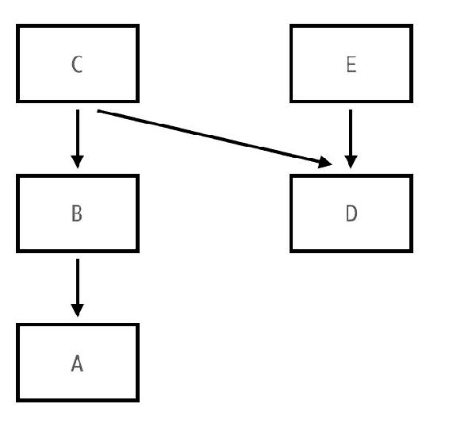
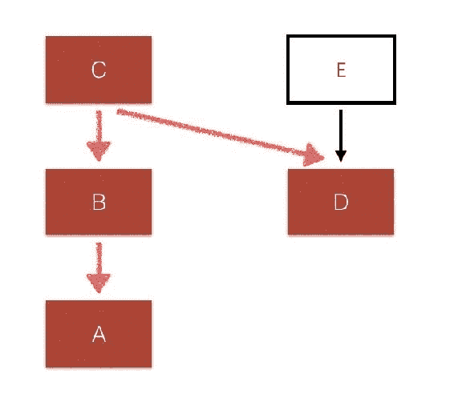
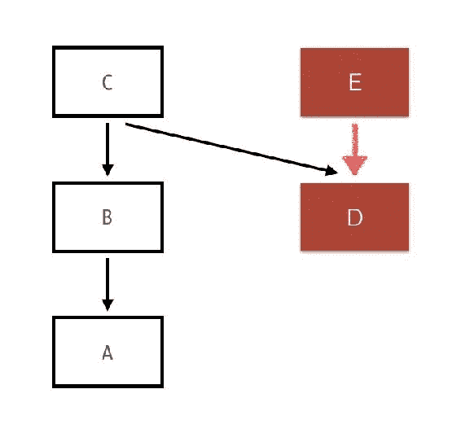
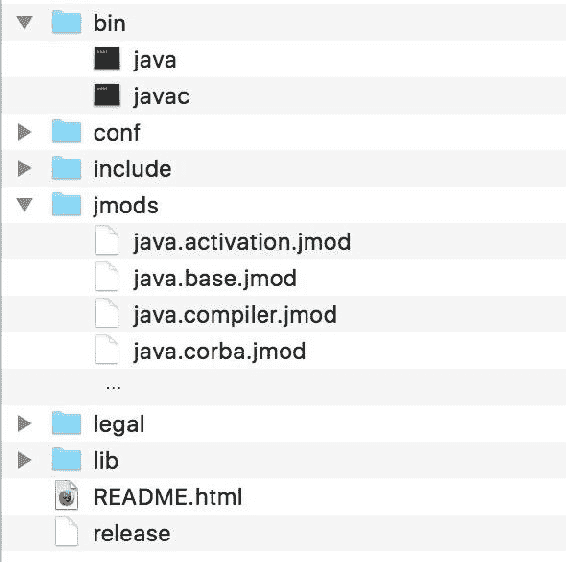
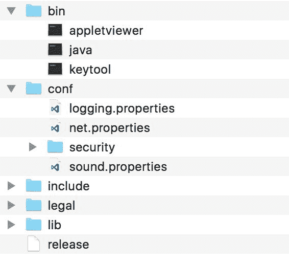
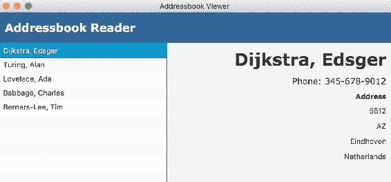

# 理解链接和使用 jlink

在前面的章节中，我们学习了与 Java 模块化相关的一些高级概念，包括处理模块关系的可读性和可访问性，以及强大的服务概念。在本章中，我们将继续进行任何应用程序开发的最后一步——构建和打包你的应用程序。

本章你将学习以下内容：

+   你将了解模块解析过程，这是一个在每次编译或执行模块化 Java 应用程序时都会发生的重要过程。

+   你将了解开发过程中的一个新阶段——链接。链接，或静态链接，是 Java 9 模块化开发中的一个新步骤。它位于你应已熟悉的熟悉的编译和执行阶段之间。在本章中，你将了解链接是什么以及这一步骤的好处。

+   你将学习如何使用 `jlink`，这是一个内置到平台中的新工具，用于简化链接阶段并帮助构建运行时镜像。

+   你将了解一些 `jlink` 插件，这些插件可以优化由 `jlink` 创建的运行时镜像。

+   你将学习如何构建一个模块化的 JAR 文件，这是分发编译库模块以供其他应用程序使用的一种替代方式。

# 模块解析过程

在我们深入了解链接过程的细节以及它能为我们做什么之前，让我们了解一个重要的步骤，这个步骤在每次编译和执行模块化 Java 应用程序时都会发生。这是一个称为**模块解析**的步骤。

传统上（Java 9 之前），Java 编译器和 Java 运行时会查看一组文件夹和 JAR 文件，这些文件夹和 JAR 文件构成了**类路径**。类路径是一个可配置的选项，你在编译期间将其传递给编译器，在执行期间传递给运行时。为了使任何类文件都处于编译器或运行时的管辖之下，你首先需要将其放置在类路径中。一旦它在那里，每个 Java 类型都对编译器或运行时*可用*。

与模块不同。我们不再需要使用通用的类路径。由于每个模块都定义了其*输入*和*输出*，现在有一个选项可以确切地知道在任何时候需要代码的哪个部分。

考虑以下模块依赖图：



假设你在模块路径中有模块 **A**、**B**、**C**、**D** 和 **E**。让我们想象你正在扮演 Java 运行时的角色，并想要执行模块 **C** 中的 `main` 方法。为了实现这一点，需要哪些最小集合的模块？显然你需要模块 **C**，因为那里有 `main` 方法。接下来你需要它的依赖项，模块 **B** 和 **D**。然后你还需要这些模块的依赖项，在这个例子中是模块 **A**，它是 **B** 依赖的：



使用这个流程，我们可以肯定地说，执行模块 **C** 中的 `main` 类型所需的最小模块集是 **A**、**B**、**C** 和 **D**——模块 **E** 是不必要的。

让我们重复这个练习，但这次是在模块 **E** 中执行类型。这次，我们只需要模块 **E** 和 **D**；所有其他模块都可以跳过：



现在我们为什么要这样做？找到这个 *最小模块集* 的优势是什么？与较旧的 classpath 模型进行对比，其中 classpath 中的每个类型都是应用程序的一部分，任何类型都可能被 *使用*。编译器和运行时无法确定给定类型的位置，除非它扫描整个 classpath。现在不再是这种情况了！由于编译器和运行时现在都对代码库的哪些部分是 *需要* 执行任何内容的以及哪些部分不是有了一个精确的了解，这使得这个优势得到了很好的利用，正如我们很快就会看到的。但是，为了获取这些信息，平台运行了一个解析模块的过程，这个过程在原则上与我们在前面的例子中所做的是相似的。这个过程被称为模块解析过程。

在图论中，这个过程被称为寻找 *传递闭包*。给定一个图，我们的想法是找到一个从给定节点可以 *到达* 的节点集。我们执行传递闭包的图应该是所谓的 **有向无环图**（**DAG**）。图应该是 **有向的**，即节点之间的关系是方向性的（带有箭头），并且 **无环的**，即不应该有循环关系。这个 DAG 让你想起了你最近看到的任何图吗？是的！Java 模块图是一个有向无环图的绝佳例子！

# 模块解析步骤

这里是平台在解析模块时运行的高级步骤：

1.  将根模块添加到已解析的模块集合中。记住，当你执行代码时，你需要指定包含主方法及其所属的模块的类型。这个模块是根模块，它是模块解析过程的起点。请注意，这个起点不一定是单个模块——可能会有多个模块，正如我们很快就会看到的。

1.  识别已添加模块的所有 `requires` 依赖项。在这里，每个模块的描述符文件被查找以识别它所 *读取* 的所有模块。这包括 `requires` 和 `requires transitive`。

1.  从步骤 2 的列表中删除所有已在已解析的模块集合中的模块。

1.  将剩余的模块添加到已解析的模块集合中。对此列表重复步骤 2。

如您所想象的那样，这是一个递归图操作，从一个或多个模块开始，最终得到所需作为依赖的最小模块集。由于平台在每次编译和运行时阶段都会执行此操作，因此它利用这个机会来检查多种不同类型的错误。事实上，我们迄今为止遇到的许多模块错误都是由于模块解析过程期间和周围的检查引起的。以下是一些例子：

+   **不可用的依赖模块**：这一点很明显。在查找依赖项时，如果某个模块在可观察模块中找不到，则进程会出错。正如我们所见，这是可靠配置的关键。

+   **多个模块**：不仅所有依赖模块都必须可用，而且每个模块只能有一个。如果模块路径中恰好有两个具有相同名称的模块（即使它们的内容完全不同），平台会立即捕捉到这一点并抛出一个错误。

+   **循环依赖**：如果有两个或更多模块相互依赖，并在模块图中形成一个闭环循环，平台会抛出一个错误，正如我们之前所看到的。

+   **分割包**：平台假设每个包只在一个模块中可用。类加载器维护一个映射，将每个包映射到它所在的模块。因此，如果有多个模块包含相同的包，则进程会因错误而终止。

# 检查模块解析的实际操作

Java 新增了一个命令选项，用于打印描述模块解析过程的调试信息。您可以通过传递选项 `--show-module-resolution` 来激活它。当传递此选项时，`java` 命令会为模块解析的每个步骤打印控制台消息。您可以使用此功能查看运行时解析所有模块的过程，就像我们在前面的练习中所做的那样。

这就是您在上一章中运行命令行地址簿模块的方式，但没有使用标志：

```java
$ java --module-path out -m packt.addressbook/packt.addressbook.Main
```

这是您启用模块解析诊断时运行它的方法：

```java
$ java --show-module-resolution --module-path out -m 
  packt.addressbook/packt.addressbook.Main  
```

详细输出清楚地表明了这里发生的事情。一切从预期的根模块 `packt.addressbook` 开始：

```java
root packt.addressbook file:///Users/koushik/code/java9/07-
services/out/packt.addressbook/ 
```

接下来，它从模块描述符中找到依赖模块。对于它找到的每个模块，输出会列出模块的名称、找到它的位置（路径）以及原因（哪个模块需要它）：

```java
packt.addressbook requires packt.addressbook.lib file:///Users/koushik/code/java9/07-services/out/packt.addressbook.lib/
packt.addressbook requires java.logging jrt:/java.logging 
```

它还根据声明自己为消费者的模块来确定服务提供者：

```java
packt.sortutil binds packt.sort.bubblesort file:///Users/koushik/code/java9/07-services/out/packt.sort.bubblesort/
packt.sortutil binds packt.sort.javasort file:///Users/koushik/code/java9/07-services/out/packt.sort.javasort/
packt.addressbook binds packt.sort.bubblesort file:///Users/koushik/code/java9/07-services/out/packt.sort.bubblesort/
packt.addressbook binds packt.sort.javasort file:///Users/koushik/code/java9/07-services/out/packt.sort.javasort/ 
```

运行时继续在遍历模块图节点时查找后续依赖项。在将所有必要的模块添加到解析集合后，它然后执行主方法，并在控制台上打印出预期的程序输出：

```java
Aug 16, 2017 11:07:02 PM packt.addressbook.Main main
INFO: Address book viewer application: Started
[Charles Babbage, Tim Berners-Lee, Edsger Dijkstra, Ada Lovelace, Alan Turing]
Aug 16, 2017 11:07:03 PM packt.addressbook.Main main
INFO: Address book viewer application: Completed 
```

现在你已经了解了模块解析的过程以及它如何有助于编译时和运行时可靠配置的执行，现在让我们看看它还能解决的其他问题。我们在第一章，“介绍 Java 9 模块化”中简要介绍了单体 JDK 的问题。我们将快速回顾这个问题，然后了解为什么在 Java 9 中它不再是问题。

# 回顾 JDK 的状态

在第一章，“介绍 Java 9 模块化”中，我们探讨了 JDK 的庞大体积，无论是从`rt.jar`的文件大小还是包含其中的类数量来看。通常，在开发 Java 应用程序时，你不会考虑 JDK。一旦你在开发机器上安装了 JDK，它就会坐在你的硬盘的远程角落的`$JAVA_HOME`中，不会打扰你。然而，确实有一些情况下你需要担心 JDK 的大小，尤其是在捆绑应用程序可执行文件时。以下是一些这样的情况：

+   **嵌入式设备的运行时捆绑包**：众所周知，Java 可以在便携式和嵌入式设备上运行，例如紧凑型音乐播放器、微波炉和洗衣机。许多这些设备在内存和处理能力方面硬件资源有限，为了在这些设备上运行 Java，运行时显然应该是安装应用程序的一部分。Java SE 运行时的体积如此之大，以至于有一个专门的平台（Java ME）用于此类场景。

+   **微服务的运行时镜像**：近年来，在云中部署轻量级微服务已成为一种常见趋势。不再有一个集中式的、能够完成所有功能的 Web 应用程序，而是将应用程序拆分为运行在不同机器实例上的独立较小服务，并通过网络相互通信。每个实例的运行时镜像是一组自给自足的二进制文件，包括应用程序类和 Java 运行时。这些微服务理想状态下是无状态的、可扩展的、可丢弃的，因此它们理想上需要轻量级和高效。捆绑一个 75MB 的运行时文件，并使其成为每个实例的一部分，实际上并没有真正帮助。

想想为什么这个问题甚至存在。嗯，这是因为 Java 先前版本中的类路径模型。任何代码都可能潜在地引用类路径中的任何其他 Java 类型，而且无法确定需要什么和不需什么，所以我们别无选择，只能添加整个平台。

在模块化编程中，这种情况不再存在！我们已经看到，在模块解析中，给定一个起点，我们可以精确地识别出执行它所需的模块。这同样适用于应用程序模块和平台模块，因为它们都遵循相同的契约。正因为如此，我们现在可以应用模块解析过程，并得出一个独特的最小平台模块集和应用程序模块集，这是您运行任何应用程序所需的。因此，当分发带有运行时的应用程序时，例如，您不必包含整个平台。相反，您只需包含必要的平台模块，而我们正是通过引入一个全新的步骤来实现这一点，这是我们在之前的 Java 应用程序开发中所没有的--链接。

# 使用 jlink 进行链接

JDK 9 随带了一个名为 `jlink` 的新工具，它允许您构建自己的完整运行时镜像，该镜像包含执行给定应用程序所需的一切。记住我们在第四章中讨论的 JDK 的新结构，*介绍模块化 JDK*：



使用 `jlink`，您可以创建一个类似的自定义镜像来分发您的应用程序。生成的镜像包含：

+   您所编写的或添加的您的应用程序和库模块的最小集

+   为使您的应用程序正常运行所需的最小平台模块集

这实际上解决了在运输平台的同时产生的巨大开销问题。您所运输的只是应用程序所需的，不多也不少。这个过程还有其他好处，但在我们深入探讨之前，让我们学习如何使用 `jlink` 创建此镜像。

# jlink 命令

`jlink` 命令需要以下输入：

+   **模块路径**：这是它需要查找模块的地方。这是编译好的模块可用的目录（或目录）。

+   **起始模块**：这是模块解析过程开始的地方。这可能是一个或多个，由分隔符分隔。

+   **输出目录**：这是它存储生成的镜像的位置。

使用方式大致如下，命令被分成单独的行以提高可读性：

```java
jlink --module-path <module-path-locations> 
  --add-modules <starting-module-name> 
      --output <output_location>  
```

要在我们的示例代码库上运行此命令并生成地址簿 UI 模块的镜像，我们首先需要以通常的方式编译模块：

```java
$ javac --module-source-path src -d out $(find . -name '*.java')  
```

在这里，`out` 是编译好的模块的位置，因此，这是 `jlink` 的模块路径。作为起点的模块是 `packt.addressbook.ui`。

在我们运行 `javac` 命令的同一目录中，我们现在可以运行 `jlink`。要运行该命令，请确保 `$JAVA_HOME/bin` 目录已添加到您的操作系统的路径中，或者直接使用路径访问 `jlink`：

```java
$ $JAVA_HOME/bin/jlink --module-path out 
   --add-modules packt.addressbook.ui --output image  
```

注意，我们会遇到错误：

```java
Error: Module java.base not found, required by packt.addressbook.ui 
```

我们缺少平台模块！请注意，`java.base`是一个核心平台模块，并且在我们之前命令中指定的模块路径中不可用。平台模块不会得到特殊处理；它们的模块位置需要显式地指定给`jlink`命令！

我们已经看到核心 Java 模块在`$JAVA_HOME/jmods`中可用。让我们将其添加到`--module-path`参数中。和之前一样，为了指定多个路径，我们需要用冒号符号（在 Windows 操作系统中是分号）分隔路径：

```java
$ $JAVA_HOME/bin/jlink --module-path $JAVA_HOME/jmods:out 
   --add-modules packt.addressbook.ui --output image
```

`jlink`现在将开始工作，并为我们静默地生成运行时映像。让我们看看生成的映像结构：



这现在看起来应该很熟悉了。结构与我们之前看到的 JDK 文件结构非常相似。一个值得注意的例外是`jmods`文件夹不在这里。这是有道理的，因为这是一个*运行时*映像，而`jmods`格式并不是为运行时设计的。由于这个映像只包含必要的模块，它们都被打包到了`lib`文件夹中的公共`modules`文件中。

现在映像包含了运行时和编译的应用程序模块，它是一个自给自足的包。你可以在没有安装 Java 运行时的计算机上部署这个映像，并且可以无任何问题地执行它。

现在，为了从运行时映像中执行我们的模块，我们需要执行映像`bin`目录中的`java`可执行文件，而不是`$PATH`中的那个。这次你也不必指定`--module-path`，因为模块解析已经完成了！生成的映像已经包含了它需要的每一个模块，因此已经知道它们的位置在哪里：

```java
$ cd image/ 
$ bin/java -m packt.addressbook.ui/packt.addressbook.ui.Main 
```

你应该看到地址簿 UI 应用程序弹出。那很好，但你可能已经察觉到有些不对劲：



名称没有排序。你能猜到为什么吗？是因为排序模块还没有被打包进去！如果你在映像中的`java`可执行文件上运行`java --list-modules`，你可以看到所有被打包进来的模块。请注意，排序服务模块不包括在内：

```java
$ bin/java --list-modules 
java.base@9
 ... 
packt.addressbook.lib 
packt.addressbook.ui 
packt.contact 
packt.sortutil 
```

记住，模块解析过程遍历模块图，并使用`requires`子句添加具有**直接依赖**的模块。服务，按照定义，是松散耦合的，因此不需要任何模块。正因为这个原因，服务模块--`packt.sort.bubblesort`和`packt.sort.javasort`--都没有被包括在内。`jlink`的这种行为是有意为之的。服务模块的打包需要显式地告诉命令。

注意，`java --list-modules` 命令显示的是在运行时图像上可观察到的模块，该命令是在运行时执行的。一直以来，我们都是在已安装的 JDK 上运行此命令，因此它列出了所有（且仅有的）平台模块。这次，我们是在生成的运行时图像上运行此命令，该图像是我们应用程序模块和少数几个平台模块的组合。因此，命令的输出相应地反映了这一点。

我们可以采取几种方法来解决问题。第一种方法是通过使用 `--add-modules` 选项将服务模块添加到模块解析的起始模块列表中。可以为此选项指定多个模块名称，名称之间用逗号分隔。然后，这些模块及其依赖项也将被捆绑到图像中，因为模块解析过程将从每个这些模块开始运行，并将它们添加到解析集中：

```java
$ $JAVA_HOME/bin/jlink --module-path $JAVA_HOME/jmods:out 
    --add-modules packt.addressbook.ui,packt.sort.bubblesort,packt.sort.javasort 
    --output image  
```

现在，在生成的图像中运行 `java --list-modules` 应该会显示排序后的模块。此外，当执行应用程序时，UI 应该现在会显示按姓氏排序的联系人列表：

```java
$ bin/java --list-modules
  java.base@9-ea
  ...
  packt.addressbook.lib
  packt.addressbook.ui
  packt.contact
  packt.sort.bubblesort
  packt.sort.javasort
  packt.sortutil
```

在服务捆绑的另一种选择是使用 `jlink` 的 `--bind-services` 选项：

```java
$ $JAVA_HOME/bin/jlink --module-path $JAVA_HOME/jmods:out 
    --add-modules packt.addressbook.ui --bind-services --output image  
```

此参数在通过模块解析过程检查每个模块时自动识别模块所消耗的任何服务。然后，所有声明自己是这些服务提供者的可观察模块将被自动捆绑。这是一个更简单的选项，因为你不必自己明确提及服务模块，但有可能你会拉入比实际需要的更多模块。假设模块路径中有一个随机模块，你的应用程序没有使用它，但它恰好实现了你使用的一种服务类型。那么，这个模块就会通过这个选项被拉入！

# 链接阶段优化和 jlink 插件

将 Java 代码执行分为两个步骤——编译步骤（使用`javac`）和执行步骤（使用`java`）。在编译步骤中，`javac`不仅仅尝试将 Java 代码转换为字节码，还尝试执行任何可能的优化，并生成尽可能最优和高效的字节码。多年来，Java 编译器已经学会了几个新的技巧和策略来更好地优化生成的字节码。但一直存在一个挑战——编译器一次只处理几个类，它没有机会通过查看整个应用程序来了解全局情况，这可能会帮助它实现更好的优化。这个选项在运行时是可用的，但一些优化在运行时执行起来成本过高。随着在编译和执行阶段之间引入新的链接步骤，为我们的 Java 字节码进行应用程序级优化的机会就出现了。事实上，平台团队在链接阶段的一个目标就是进行**全局**优化——跨越应用程序中多个类和模块的优化，因为它们已经获得了**更大的视角**。

记住，链接步骤是可选的。在前面的章节中，我们已经执行了应用程序，而不需要使用`jlink`，因此没有进行任何此类优化。然而，如果您使用`jlink`，就有机会进行优化——例如压缩图像、识别并删除不可达的代码和类型、预优化代码和方法，其中可能的输入是常数且在事先已知。这些优化可以在运行`jlink`时进行，并且使用一系列`transformers`来完成，这些`transformers`作为插件构建。

下面是`jlink`如何工作以创建运行时图像的近似描述：


该过程从收集所有必要的资源开始，并通过一系列可以执行各种任务和优化的`transformers`运行它们。`jlink`工具有一个插件 API，这样任何人都可以创建自定义插件，将其钩入此过程，并有机会转换生成的图像。在`transformers`完成后，图像被写入输出目录，在那里，同样可以编写插件来控制发生的事情。

Java 9 平台自带内置插件，可以执行这些优化中的几个。事实上，其中一些优化非常重要，影响巨大，因此默认已启用！在您生成运行时图像时，了解一些可用的选项是很重要的：

+   **使用** **system-modules 插件**优化模块描述符：在 Java 模块的初始开发过程中，发现 Java 运行时花费了大量时间和资源来检查、解析和验证系统图像中每个模块的模块描述符（`module-info.class`）。由于要捆绑到图像中的模块集在链接时是已知的，因此扫描和验证所有模块描述符的过程也可以在链接时完成。平台捆绑了一个名为`system-modules`的`jlink`插件，用于执行此操作。此插件生成一个预处理的预验证的系统模块图，以便运行时不需进行。这个过程带来了如此显著的性能提升，以至于在运行`jlink`时默认启用。

+   **使用** **compress 插件**压缩图像：此插件允许您对生成的图像应用压缩以减小输出运行时图像的大小。此插件可以对生成的图像执行两种类型的压缩。第一种类型识别所有 UTF-8 字符串的使用，并生成一个全局字符串表，以便任何常见的`String`值只需存储一次，并且可以在应用程序中重复使用。第二种压缩类型是对结果图像中文件的 ZIP 压缩，以缩小其整体大小。

与系统模块不同，此插件默认未启用。要使用它，您需要将`--compress`选项传递给`jlink`。您可以传递三个值--`0`表示不压缩，`1`表示启用字符串共享，以及`2`表示 ZIP 压缩。

在生成地址簿图像时运行两个级别的压缩，展示了生成图像大小的增益：

```java
      $ $JAVA_HOME/bin/jlink --module-path $JAVA_HOME/jmods:out 
           --add-modules packt.addressbook.ui --bind-services 
           --compress=1 --output image1

      $ $JAVA_HOME/bin/jlink --module-path $JAVA_HOME/jmods:out
          --add-modules packt.addressbook.ui --bind-services
          --compress=2 --output image2  
```

检查结果图像的大小显示压缩为我们节省了多少空间。以下表格总结了运行这些命令后我机器上的文件夹大小：

| **压缩** | **地址簿图像大小** |
| --- | --- |
| 无 | 167.5 MB |
| 级别 1 | 129.4 MB |
| 级别 2 | 95.9 MB |

+   **使用** **include-locales 插件**包含区域信息：默认情况下，运行时图像捆绑了所有已安装的区域信息。如果您只为某些区域设置的应用程序运行时目标，可以使用`--include-locales`选项并传递所需的逗号分隔的区域列表。只有那些区域将被包含在结果图像中，从而释放更多空间：

```java
      $ $JAVA_HOME/bin/jlink --module-path $JAVA_HOME/jmods:out
       --add-modules packt.addressbook.ui --bind-services
       --compress=2 --include-locales=en --output image3  
```

上述命令以完整压缩方式重新生成图像，并包含英语区域设置（`--include-locales=en`）。在我的机器上，这进一步节省了空间，图像大小为 88.2 MB。

JDK 中还包含几个实用的插件。要了解可用的插件以及如何使用它们，可以在运行 `jlink` 时使用 `--list-plugins` 选项。将显示已安装的插件完整列表，包括我们刚刚了解的插件以及更多：

```java
$ $JAVA_HOME/bin/jlink --list-plugins
```

# 构建模块化 JAR 文件

我们已经了解了创建完整的模块化运行时镜像，并学习了链接过程的优势，但有时那可能不是你想要的。假设你是一个库开发者，你只想将单个实用模块打包成一个 jar 文件。当从一个模块构建 jar 文件时，你可以选择创建一个 **模块化 JAR 文件**。模块化 jar 文件就像任何其他 jar 文件一样，但在根目录中有一个 `module-info.class` 文件。你可以使用这个文件将编译好的模块作为单个文件分发，而不是整个模块文件夹。你可以在运行 `java` 命令时将模块化 JAR 文件放入模块路径，它的行为就像我们一直在处理的编译好的模块文件夹一样。

为了说明这一点，让我们将地址簿应用程序的 `out` 文件夹中的几个模块替换为模块化 JAR 文件。

创建模块化 JAR 文件的方法是使用 `jar` 工具。为了将 `packt.contact` 模块转换为模块化 JAR 文件，我们运行以下命令：

```java
$ jar --create --file out/contact.jar --module-version=1.0 
     -C out/packt.contact . 
```

`--create` 选项告诉 `jar` 工具它需要创建一个 JAR 文件。`-C` 选项指定了它可以从哪里找到类。其值格式为 `<folder> <file>`。在我们的例子中，文件夹是 `out/packt.contact`。这后面跟着一个 "`.`"，表示需要包含该位置下的所有文件。`--module-version` 选项为 `jar` 指定一个模块版本。最后，`--file` 选项提供了 JAR 输出文件名。

运行此命令将创建一个模块化 JAR 文件，根目录中有 `module-info.class` 文件。还有一个包含记录指定版本的清单文件的 `META-INF` 文件夹：`Manifest-Version: 1.0`。

即使带有可执行 `main` 方法的模块也可以转换为模块化 jar。以下是如何将 `packt.addressbook.ui` 模块转换为模块化 JAR 的示例：

```java
$ jar --create --file out/addressbook-ui.jar --module-version=1.0 
    --main-class=packt.addressbook.ui.Main -C out/packt.addressbook.ui .  
```

大多数参数在这里应该是熟悉的，除了 `--main-class`。正如其名所示，此选项指定了具有 `main` 方法的类型。

将这两个模块转换为模块化 JAR 文件并放置在模块路径中后，你现在可以删除相应的编译模块文件夹，并且仍然可以执行应用程序。运行时将模块化 JAR 文件视为与展开的模块文件夹相同：

```java
$ rm -rf out/packt.contact/ 
$ rm -rf out/packt.addressbook.ui/ 
$ java --module-path out 
     -m packt.addressbook.ui/packt.addressbook.ui.Main 
```

应用程序应该仍然以相同的方式工作，尽管这次它正在执行 jar 文件中的两个模块。

# 摘要

本章探讨了在编写代码完成后应用程序开发过程的部分——构建和打包应用程序以进行分发。我们通过检查模块解析过程开始本章。然后我们研究了链接过程，该过程使用模块解析来构建只包含给定应用程序所需模块的运行时镜像。接着我们查看了一些内置插件，这些插件允许我们优化和预处理生成的镜像。最后，我们学习了如何生成模块化 JAR 文件，以便在其他应用程序中使用可重用的库模块。

我们已经探讨了众多特性及其工作原理。在下一章中，我们将开始探讨如何在现有的遗留 Java 代码库的背景下使用 Java 9 模块。你将学习如何编写在不同 Java 版本之间互操作的代码。你还将学习将使用 Java 8 或更早版本编写的现有代码迁移到 Java 9 的新模块化应用程序开发的技巧和策略。下一单元再见！
