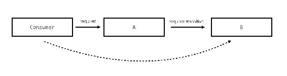
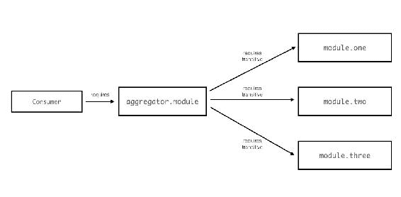
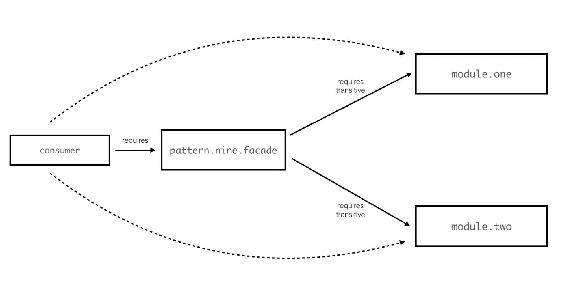

# 模块设计模式和策略

在前几章中，我们深入探讨了 Java 9 中的几个模块化特性，这些特性使您能够使用模块构建 Java 应用程序。您已经学习了如何使用依赖声明和服务来建立模块依赖关系。您还学习了如何使用 jlink 构建可分发的模块化运行时。在本章中，我们将探讨一个稍微不那么客观的问题——如何在 Java 中使用模块构建良好的应用程序。现在您已经掌握了创建和使用模块的知识，那么推荐的实现方式有哪些？您应该使用哪些最佳实践和模式？以下是本章我们将涵盖的内容：

+   理解如何设计模块——一个模块理想上应该是什么样子，以及模块边界应该在哪里划分

+   理解如何为这些模块设计良好的 API

+   了解创建模块以及使用模块系统有效性的几个最佳实践

本章讨论的许多模式都附带可用的代码示例，这些示例位于文件夹`09-module-patterns`中。每个示例都经过精心制作，旨在以最小的信息开销帮助解释正在讨论的模式。在探索这些模式时，请随意使用和实验这些代码示例。此外，记得在您的 Java 9 模块化之旅中重新阅读本章，以巩固对这些模式的了解。通常情况下，在任何时候重新阅读和思考设计模式都会为当时面临的挑战提供新的视角。

让我们开始吧！

# 设计模块

在过去几年中，设计 Java 应用程序的第一步通常涉及包和类的设计，以及它们之间的交互。也许还涉及设计一些共享库。例如，您会将可重用代码移动到单独的项目中，并将其打包成 JAR 文件添加到您的应用程序中。随着 Java 9 模块的出现，您现在需要考虑一个新的方面，这将对设计过程产生重大影响。无论您是从头创建新应用程序还是将现有的类路径应用程序迁移到模块化应用程序，您都需要回答一些共同的问题——您如何提出模块化设计？您如何选择模块应该包含什么？一个模块应该包含多少代码和功能？在特定场景中，您在哪里划分模块边界？例如，您可能会遇到的一个问题是——给定一个功能或一组类和包，它们应该属于*模块 A*还是*模块 B*？您如何实现模块如可重用性、可扩展性和可维护性的良好设计原则？

与大多数软件设计挑战一样，没有适用于所有场景的正确答案。事实上，一些-ility 因素相互对立，大多数设计都涉及到做出权衡。然而，有一些指导和最佳实践应该能帮助我们开始应对这些挑战，然后可以根据具体用例进行细化和调整。

在设计和构建模块化应用程序的第一步中，对模块和 API 有一个高层次的想法是有帮助的。对于简单的项目，直接打开 IDE 开始编码可能很有吸引力。但对于任何严肃的项目，花些时间设计一个涉及模块的粗略图，它们的公共 API 以及它们之间的依赖关系，在开始编码之前是有帮助的。让我们开始看看在设计模块和决定它们应该做什么时需要考虑的一些原则和因素。

# 范围

决定一个模块是什么的最明显的方法可能是基于它的内容。换句话说，它的*范围*。如果你要分解任何合理复杂的应用程序，你会立即想到一些高级功能区域，它们开始相互分离。例如，一个银行应用程序可能有一个与账户相关的功能，与信用功能等其他功能分开。在现有的 Java 应用程序中，这些不同的关注点可能已经属于不同的顶级包。在新的应用程序中，商业问题的各个方面可以给我们提供线索。不同的商业领域突出形成初始的高级分类，然后可能进一步分解成更小的部分。因此，在我们的银行示例中，账户功能可能被分为储蓄账户和支票账户功能、账户转账相关代码、账单支付等。这种使用业务关注点来分解应用程序问题域的方法是一种很好的策略，可以将应用程序分解成更小的单元，这些单元可能是模块的良好候选者。你可能需要通过几个级别的分解范围，直到你到达每个单元感觉可以单独成为模块的水平。

注意，虽然这是一种从上到下开始分解问题的好策略，但它并不能帮助你决定何时停止分解！你如何知道你的模块是否太大？或者太碎片化？你必须查看本节中的其他因素来帮助做出这个决定。

# 团队结构

在软件设计中有一种流行的谚语称为**康威定律**，它表明任何组织的软件设计都受到该组织团队结构以及他们相互沟通方式的影响。如果你这么想，这完全是有道理的。软件开发团队往往倾向于在隔离的库和代码库（或者至少，代码*区域*）上工作，这些库和代码库与其他团队开发的库和代码库进行“交流”。从某种意义上说，团队和他们工作的代码资产集之间存在几乎一对一的映射。这可以是一个有价值的因素，影响模块边界的划分以及模块设计如何开始相互分离。每个团队负责一个或多个模块，因此一个团队会工作的所有代码都成为他们模块集的一部分。

这对各种原因都很有用。团队可以在他们的代码上工作，并独立地发布功能。他们被分配了模块的*所有权*，因此可以处理错误修复或代码维护。此外，当开始一个新的项目时，当两个团队需要在一个团队依赖另一个团队的模块上工作时，两个团队可以共同制定一个他们同意的*API 合约*。然后，每个团队可以分别和并行地工作在他们自己的模块上，尽管依赖的模块尚未可用。

# 可重用性

模块化的一个原则是可重用性。我们之前用积木的比喻来描述模块。将可重用模块组合起来创建不同应用的想法确实非常强大！为了使模块可重用，它们理想上应该具有以下特征：

+   它们应该有一些专业和有限的职责。一个做太多事情的模块很难有效地重用。

+   它们应该是独立的--如果一个模块依赖于许多其他模块才能运行，那么重用该模块本身就会变得更加困难。

+   它应该是可配置的--如果模块可以调整并能够适应不同的用例，这将使模块更容易重用。

这些特性确实带来了一些权衡！以下是一些例子：

+   拥有更小、更专业的或单一用途的模块有时会导致非常小且碎片化的模块，通常需要多个模块才能完成任何工作。

+   模块中的可配置 API 通常会导致更复杂的 API，因为消费者必须处理更多的旋钮和杠杆来调整和操作，以便与您的模块一起工作。解决这个问题的方法之一是提供合理的默认值，并提供配置作为覆盖。

# 按关注点进行模块化

在设计模块时，你会很快发现并非所有模块都相同。模块可以根据各种特征被分类为多种不同类型。一种分类方法可以根据其功能或解决的问题进行分类。在最高层次上，你可以将模块分为两种不同类型：

+   **纵向关注点**：业务和应用特定的功能。解决业务域中的特定问题。例如，银行应用程序中的账户模块。

+   **横向关注点**：非业务或应用程序特定的交叉功能。相反，它们提供低级功能或与业务无关的框架。例如，日志或安全模块。

在设计模块时，一个值得尝试遵循的好规则是不要混合这两个关注点。如果你专门为这两个关注点之一设计模块，这将提高清晰度和重用性。例如，在地址簿应用程序中，`packt.sortutil` 模块提供了通用的排序能力，同时对其排序内容完全不知情，从而解决了横向关注点。`packt.addressbook` 模块处理特定的地址簿应用程序功能，从而解决了纵向关注点。

如你所想，模块的类型会影响其设计。例如，当设计解决纵向关注点的模块时，重用性可能不是主要关注点，但在设计具有交叉关注点的模块时，它是至关重要的。

# 层次化模块化

另一个有助于我们确定模块边界的有用因素是应用程序层。一个典型的应用程序涉及功能层或级别，如 UI 层、业务层、数据层等。在查看其他类别以进一步模块化之前，这是一种绘制一些初始模块边界的好方法。理想情况下，模块不应是多个应用程序层的组成部分。有时，不同的层部署在不同的物理硬件上。因此，在部署时，具有层分离来指导模块边界在物流上也是有意义的。

# 通过变更模式进行模块化

我发现分析应用程序新功能添加的模式有助于验证模块边界。如果你对代码库所做的典型更改大多需要修改多个模块，这可能是一个线索，表明你的模块过于碎片化，或者模块的分离可以更好。如果你在平均代码更改或增强时需要修改多个低级模块（即具有横向关注点的模块），这是可以接受的。但是，如果你的应用程序的每个更改或增强都需要你修改具有纵向关注点的多个模块，你可能需要重新审视模块边界，看看这些不同的模块是否包含应该理想地放在同一模块中的代码。

# 设计 API

我们已经查看了一些关于绘制模块边界和创建模块的指南和技巧。那么创建 API 的过程呢？这可能会显得很明显，但分离公共 API 和私有实现的最佳实践仍然适用。

设计模块 API 的目标是公开一个标准、一致且可能不会改变的编程接口，作为模块的 **公共** API。模块内部实现的细节应该被封装。在原则上，这与类的方法和成员变量封装没有区别。为你的模块设计一个公共 API，让消费者可以与之交互。实现细节隐藏在封装的包中，并有两个目的：

+   减少和简化消费者的工作量，使他们不必了解内部细节

+   允许模块在不影响模块消费者的情况下更改和演进实现

# Java 模块编码模式和策略

我们到目前为止已经查看了一些适用于 Java 模块化的通用高级、几乎是常识性的模式。现在让我们深入代码。让我们看看一些代码模式和策略，这些可以帮助你在开始设计模块及其 API 时。每个策略都附有关于模式的解释，以及为什么和何时应该考虑使用它们。其中许多都有伴随的代码示例供你参考。其中一些可能很明显。事实上，我们在构建本书中工作的示例地址簿应用程序时也应用了一些模式。我希望这个综合列表为你提供了在设计构建模块化应用程序时参考这些模式的好参考。

# 模式 1 - 公共接口、私有实现和工厂类

将公共 API 与内部封装的实现分离（我们已经在本书早期关于地址簿查看器应用程序的排序实用模块中看到了这种策略的实施）。此外，公开一个工厂 API 方法，该方法创建接口的新实例。

这就是它的工作原理：

+   导出的类型是尽可能轻量级的接口或抽象类。

+   包含实际逻辑的类实现了导出包中的接口。这些类型没有被导出。因此，所有实现细节都安全地隐藏起来。

+   在公开的包中存在工厂类，这些类构成了 API。它们创建正确的实现类的新实例。这些工厂 API 的返回类型仅处理接口。

# 示例

该模式的示例实现可在文件夹 `09-module-patterns/01-seperate-interface-impl` 中找到。模块 `pattern.one` 在 `pattern.one.external` 包中公开了接口 `PublicInterface`，而实现类 `PrivateImplA` 和 `PrivateImplB` 则在封装的 `pattern.one.internal` 包中：

```java
    module pattern.one { 
      exports pattern.one.external; 
    } 
```

我们希望消费模块通过公共接口类型访问私有实例。为此，模块提供了一个名为`Factory`的工厂类。这个类有一个公共方法`getApiInstance`，它接受一个参数并根据该值返回正确的实现类。在示例代码中，有一个简单的`boolean`标志，它影响是否返回一个实现实例而不是另一个，但在实际模块中，这个选择标准对返回的内容更有意义，因为消费者正是根据他们的需求选择正确的 API 实例。工厂方法的返回类型是公共接口的实例。因此，消费模块不知道实现细节：

```java
    public class Factory { 
      public PublicInterface getApiInstance(boolean selector) { 
        if (selector) { 
          return new PrivateImplA(); 
        } 
        return new PrivateImplB(); 
      } 
    } 
```

优点：

+   隐藏了细节，以便消费者不必了解内部情况

+   允许在不改变消费者与模块交互方式的情况下更改实现或添加新的实现类型。

# 模式 2 - 多个动态实现的服务

抽象实现类型的一个替代方法是使用它们作为服务。这是对之前模式的扩展，但同时也确保了更松散耦合和动态的实现。

这是它的工作原理：

+   存在一个服务接口模块，它公开了服务接口类型。

+   一个或多个服务实现模块使用模块定义中的`provides`子句为该服务提供实现。

+   消费者模块不直接依赖于实现模块。它`requires`只服务接口模块，并声明它`uses`服务。

+   消费者模块使用`ServiceLoader` API 查找服务实例。

# 示例

示例代码实现可在`09-module-patterns/02-services`处找到。`pattern.two.service`模块导出`PublicInterface`。它不包含任何自己的实现类：

```java
    module pattern.two.service { 
      exports pattern.two.external; 
    } 
```

两个实现模块`pattern.two.implA`和`pattern.two.implB`都包含使用模块声明中的`provides`声明的服务实现。这两个实现模块都`require`服务模块`pattern.two.service`以访问接口。以下是其中一个实现模块的模块定义：

```java
    module pattern.two.implA { 
      requires pattern.two.service; 
      provides pattern.two.external.PublicInterface with 
       pattern.two.implA.ImplA; 
    } 
```

消费者模块也依赖于服务接口模块，而不是实现模块。模块定义中的`uses`子句表明模块将需要查找服务：

```java
    module consumer { 
      requires pattern.two.service; 
      uses pattern.two.external.PublicInterface; 
    } 
```

优点：

+   在服务消费者和提供者逻辑之间提供了一层额外的抽象。

+   消费者模块与实现模块之间完全松散耦合。没有对实现模块的硬编码`requires`依赖。

+   在实现选项中的灵活性。模块可以在运行时添加到模块路径中，只要它们实现了并提供服务接口，就可以将其连接到应用程序。

# 模式 3 - 可选依赖

我们已经看到，直到 Java 9，Java 没有可靠的配置选项。你可以在运行之前添加或删除某些类和 JAR 文件到类路径中，应用程序仍然可以执行（或者至少，开始执行）！Java 中有一些实用库和框架很好地利用了这种灵活性。

以 Spring 框架为例。Spring 是一个流行的应用程序框架，它通过扫描类路径中可用的库来使用和编排许多其他依赖库和框架的功能。如果你想让 Spring 使用这些支持的库，只需将某些必要的 JAR 文件添加到类路径中就足够 Spring 检测并使用其功能。如果不使用，Spring 框架仍然可以工作，尽管没有可选功能。

这种灵活性在框架的易用性中起着重要作用。现在，随着 Java 9 和对模块依赖的严格要求，我们不会失去这种灵活性吗？现在不再可以随意将 JAR 文件添加到类路径中！事情现在变得更加严格和受控。给定模块需要的每个模块都应该在模块定义中使用 `requires` 子句明确指定。考虑到这种新的情况，你该如何构建这样的模块，它们是可选的并且具有 *即插即用* 的灵活性？

答案是可选依赖。在 Java 9 中，你可以使用 `requires static` 修饰符指定一个给定的模块依赖为可选。语法是：

```java
    module <module-name> { 
      ... 
      requires static <optional-module-dependency>; 
    } 
```

`static` 修饰符告诉模块系统被 `required` 的模块是可选的。模块在编译时仍然应该可用（因为 `javac` 需要编译代码和引用！）。但在运行时它是可选的。如果在运行时模块不可用，`java` 不会像只有 `requires` 子句那样对模块的不可用性进行抱怨。它会继续执行，假设你知道你在做什么。这个新特性使你能够拥有带有许多 `require static` 可选依赖的模块，这些模块可以自由地添加到模块路径中。

这里是如何工作的：

+   当你有一个模块可选地依赖于一个或多个模块时，使用 `requires static` 子句在模块定义中建立可选依赖。如果 *模块 A* 可选地需要 *模块 B*，你应在模块 A 的定义中指定 `requires static B`。

+   在开发和编译时间，你不需要做任何不同的事情。你可以像使用常规 `requires` 依赖项一样使用可选依赖项导出的类型。始终如一，带有可选依赖项的模块需要在编译时可用，以便代码可以编译。

+   然而，在运行时，情况就不同了。这次，无论带有可选依赖项的模块是否可用，你都可以执行你的应用程序。如果模块可用，它会被正常选中。但如果它不可用，你会得到一个 `NoClassDefFound` 错误。虽然这不是强制性的，但编写代码来处理这种错误场景是个好主意，以防你可选需要的模块不可用。

# 示例

考虑在 `09-module-patterns/03-optional-dependencies` 中的示例代码。`pattern.three` 是一个可选需要 `pattern.three.optlib` 的模块。如果可用，它将使用可选库，但如果在运行时不可用，模块也会非常高兴。为了建立这种依赖项的可选性质，`pattern.three` 使用了 `requires static` 子句：

```java
    module pattern.three { 
      requires static pattern.three.optlib; 
      exports pattern.three.external; 
    } 
```

`pattern.three.optlib` 有一个简单的库类，它会向控制台打印一条消息。这里没有什么令人惊讶的：

```java
    public class LibImpl { 
      public void publicApi() { 
        System.out.println("Called API method in LibImpl"); 
      } 
    } 
```

现在，模块 `pattern.three` 中的代码可以直接导入和使用可选模块（在这种情况下，`LibImpl`）导出的类型。但这不是一个好主意。通过指定一个依赖项是可选的，你实际上是在要求平台放弃其可靠的配置保证，并且不要检查和确保模块可用。这打开了这种依赖项在运行时不满足的可能性。因此，现在模块有责任能够处理模块的存在和不存在。我们不必将 `NoClassDefFound` 错误抛给用户，我们可以聪明地使用可选类型，如果它们可用的话。我们可以使用 `Class.forName` API 来检查类是否存在。

这是模块 `pattern.three` 中 `Util` 类的代码。这是从可选依赖中反射和使用类型的一种方法：

```java
    try { 
      Class<?> clazz = Class.forName("pattern.three.lib.LibImpl"); 
      LibImpl impl = (LibImpl) clazz.getConstructor()
                      .newInstance(); // Create new instance 
      impl.publicApi(); // Call the API 
    } catch (ReflectiveOperationException e) { 
        System.out.println("Did not find the Impl class module"); 
    } 
```

与前面的示例一样，我们有一个 `consumer` 模块，它需要 `pattern.three` 并有一个 `Main` 类型，该类型调用模块的 API。在执行应用程序之前，这里还有关于可选依赖的另一件重要的事情需要你知道。它们在模块解析过程中不会被选中！因此，我们必须显式地将模块添加到执行过程中。

在第八章中，我们讨论了模块解析过程以及 Java 平台如何通过递归获取模块定义中所需的所有依赖模块的树结构。它不会对可选依赖项做这件事！在模块解析过程中，如果运行时遇到`requires static`依赖项，它不会解析那个模块及其依赖项。这些可选模块可能已经编译并准备好，与其他模块一起位于模块路径中，但运行时仍然看不到它们。这引发了一个有趣的问题。如果运行时不查找，Java 运行时如何知道这些可选模块存在于模块路径中呢？

解决方案是将模块手动添加到模块解析过程中。记得我们在第八章中传递给`jlink`的`--add-modules`选项吗？我们使用那个标志让`jlink`将模块包含到解析过程中。`java`命令也有那个标志，可以用来包含模块。因此，为了让运行时*看到*并使用可选模块，我们需要使用`--add-modules`标志。

你可以使用`javac`命令像往常一样编译示例代码。这里没有变化：

```java
$ javac --module-source-path src -p src -d out $(find . -name '*.java')  
```

然而，在运行时，你需要使用`--add-modules`标志添加所有可选依赖项的模块。在这里，`pattern.three.optlib`是可选依赖项。因此，以下是执行`consumer`模块中的`Main`类的命令以及相应的输出：

```java
$ java --module-path out --add-modules pattern.three.optlib -m 
  consumer/app.Main

Called API method in LibImpl
```

尝试从`out`目录中移除编译好的`pattern.three.optlib`模块，然后不带`-add-modules`选项再次运行：

```java
$ java --module-path out -m consumer/app.Main

Did not find the Impl class module  
```

这次，由于必要的类不可用，执行了*回退*代码。这里的重要区别是代码仍然可以运行。如果依赖项不是可选的，它就不会运行。

`--add-modules`参数对顺序很敏感，它应该出现在`-m`参数之前。因此，以下命令将不会工作：

`java --module-path out -m consumer/app.Main --add-modules out/pattern.three.optlib # 不起作用`

优点：

+   允许你创建*即插即用*的库。你可以创建一个*主*库模块，它可选地依赖于其他模块，从而在模块和功能方面提供运行时灵活性，这些模块和功能实际上是执行的一部分。

# 模式 4 - 使用服务处理可选依赖项

在阅读关于可选模块依赖关系时，你可能会有一个想法——使用服务怎么样？我们在第七章，“介绍服务”，中学习了如何在 Java 模块中使用服务提供一种灵活且松散耦合的方式，使模块能够相互协作。使用服务，你不必使用`requires`指定可读性关系。提供服务的模块在运行时是可选的，甚至在编译时也是可选的！所以服务难道不是已经比可选依赖更好了吗？

简单的答案是肯定的。服务无疑是解耦模块和移除*硬依赖*的首选方式。这正是我们将要在这个模式中探讨的。然而，它们确实存在一个问题，并且不会像你想象的那样工作得很好。让我们来看看原因。

这就是它的工作原理：

当使用服务时，你通常通过创建两种类型来实现抽象——接口（即服务）和接口的实现（即服务的提供者）。当然，你不必这样做。Java 类本身也可以是服务类型。但我们现在讨论的也适用于这种情况。

给定两个模块 A 和 B，如果你想使模块 A 可选地依赖于 B，你可以使用之前的模式，并在 A 的模块定义中使用`requires static B`。然而，如果你想使用服务，你需要指定一个或多个 Java 接口或类作为*服务类型*。`模块 A`需要指定它`使用`这些类型：

```java
    module A { 
      uses <service-type>; 
    } 
```

而`模块 B`需要`提供`服务：

```java
    module B { 
      provides <service-type> with <implementation-type>; 
    } 
```

现在，B 在技术上来说是可选的。应用程序可以在模块路径中是否存在模块 B 的情况下运行！看起来很简单，不是吗？但有一个陷阱！服务类型应该放在哪个模块中？是模块 A 还是模块 B？它不能放在模块 B 中，因为在这种情况下，模块 A 将需要*要求*模块 B 来访问 B 中的服务类型，这违背了使 B 可选的整个目的！它可以放在模块 A 中，但现在模块 B 应该依赖于模块 A 来访问服务类型。因此，模块 B `需要` A，而模块 A `导出` 包含服务类型的包。

但是等等！我们的原始目标是让模块 A 可选地依赖于 B。现在我们得到的却是模块 B 依赖于 A！这似乎是反过来的，但如果您考虑服务动态，A 仍然在使用 B 提供的实现，而 B 只是依赖于 A 来获取服务类型。这仍然很令人困惑，仅通过查看模块定义并不能明显看出发生了什么。解决这个问题的方法之一是将服务类型移动到一个第三方的`模块 C`，这个模块同时被 A 和 B 所依赖。现在 A 和 B 都可以访问服务类型，因此它们是完全解耦的。这种方案可能并不总是可行，而且仅仅为了解决这个问题而创建一个单独的模块显得有些尴尬。但是，当它确实可行时，这种使用服务的方法是实现灵活性和 Java 8 及更早版本中一些库和框架所具有的`drop-anything-you-need`机制的最佳方法之一。

# 示例

请查看`09-module-patterns/04-optional-dependencies-with-services`目录下的示例代码。我们有两个模块，`pattern.four`和`pattern.four.optlib`。我们希望`pattern.four`能够使用我们之前看到的模式，可选地依赖于`pattern.four.optlib`。

模块`pattern.four`包含一个导出的服务类型`LibInterface`。它还声明它使用`LibInterface`的提供者实现，这本质上使得`LibInterface`成为一个服务类型：

```java
    module pattern.four { 
      exports pattern.four.external; 
      uses pattern.four.external.LibInterface; 
    } 
```

模块`pattern.four.optlib`提供了`LibInterface`服务类型的实现。它还依赖于`pattern.four`以首先访问服务类型。这正是我们之前讨论的看似颠倒的关系：

```java
    module pattern.four.optlib { 
      requires pattern.four; 
      provides pattern.four.external.LibInterface with 
       pattern.four.lib.LibImpl;  
    } 
```

在`pattern.four.optlib`中有一个名为`LibImpl`的类，它实现了在前面模块定义中声明的`LibInterface`接口：

```java
    public class LibImpl implements LibInterface { 
      public void publicApi() { 
        System.out.println("Called API method in Service"); 
      } 
    } 
```

现在，模块`pattern.four`对`pattern.four.optlib`一无所知。它使用`ServiceLoader` API 来获取任何可用的实例，如果可选模块可用，它将乐意使用它：

```java
    public class Util { 
      public void utilMethod() { 
        Iterable<LibInterface> libInstances =
          ServiceLoader.load(LibInterface.class); 
        for (LibInterface libInstance : libInstances) { 
          libInstance.publicApi(); 
        } 
      } 
    } 
```

优点：

+   扩展了之前模式解决的`即插即用`概念，并增加了新的解耦层次。模块在编译时和运行时都可以是可选的！

+   扩展了`requires static`的一对一依赖关系，通过服务提供一对多依赖关系。可能有多个模块提供服务，这些服务可以被使用服务的模块可选地获取。

# 模式 6 - 将模型类作为独立的可共享模块捆绑

许多企业应用程序通常需要处理多层和层。它们通常需要在这些层之间进行通信和共享数据，一个常用的模式是使用模型对象或**数据传输对象**（**DTOs**）来交换数据。它们是需要跨多个层和模块共享的代码的例子。

一个好的做法是为模型（或 DTO）类创建单独的模块。然后，任何需要访问这些类型的模块都可以读取这些模块。这可能是一个只包含模型类而没有其他内容的轻量级模块。

# 模式 7 - 开放模块以进行反思

反射是 Java 编程语言中的一个重要特性，允许在运行时动态地检查和修改类型。这是另一个被 Spring、Hibernate 等框架以及其他框架充分利用的特性。这些框架使用反射来检查你的类以查找注解和接口实现，以推断如何处理你的代码。你可能在自己的代码中使用反射来实现这种动态功能。

反射如何融入我们迄今为止所学的模块化概念？就像我们之前看到的那样，强封装的默认行为保护模块中的类型免受静态访问，同时也为反射访问提供了类似的保护。如果一个 Java 类型在一个导出它的模块中，并且调用反射 API 的类型在读取其他模块的模块中，那么这个类型可以通过反射访问。

这导致了由于反射在 Java 中传统使用方式的问题，尤其是在我们之前提到的许多框架中。例如，Spring 框架期望扫描整个代码库以查找带有特定关键注解的类。多年来，Java 代码库中大量的反射 API 使用都是基于一个隐含的理解，即被反射的类对他们来说是可访问的。一旦你将这些类型移动到模块中，所有封装的类型实际上都被封闭起来，无法用于反射。一个简单的解决方案是暴露一切！所以，每个模块都暴露了所有需要通过反射访问的类型。但这不是一个好主意，因为我们之前讨论的模块 API 概念。一个模块使用 `exports` 子句暴露的类型是模块 API。仅仅因为一个类型包含 Spring 框架、Hibernate、JPA 或任何其他使用反射的类似框架的注解，就将其暴露出来，这会不利于模块的 API，并且违反了封装的目的。

为了解决这个问题，并且仍然提供使用这些框架进行反射的选项，平台引入了一个称为 **开放模块** 的概念。这些是类似于我们熟悉的 Java 模块，但有一个主要区别。这些开放模块中的封装类型在运行时可用于反射访问，而无需允许 `exports` 声明提供的编译时访问。

你如何将一个 Java 模块变成一个 *开放模块*？非常简单。只需在 `module-info.java` 中模块定义前添加 `open` 关键字：

```java
    open module <module-name> { 
    } 
```

这样，模块的内容仍然是封装的（除了在模块定义中导出的任何包之外）。但现在，模块中的所有包都可通过任何读取此模块的模块在运行时使用反射进行访问。

记住，`open`关键字不会使模块对所有模块都开放以进行反射访问。需要使用反射访问任何此类类型的模块仍然需要使用`requires`关键字来读取包含该类型的模块。

不仅整个模块，甚至单个包也可以使用`opens`关键字标记为开放，后跟你希望对反射开放的特定包。当你知道模块中只有某些类需要被反射时，这提供了更细粒度的控制：

```java
    module modulename { 
      opens package.one; 
      opens package.two to anothermodule; 
      exports package.three; 
    } 
```

在前面的例子中，包`package.one`对所有读取`modulename`模块的模块都可用于反射。包`package.two`仅对选择`require`它的`anothermodule`模块可用于反射访问。而包`package.three`既可用于反射访问也可用于编译时访问，因为它被导出了。

# 示例

在`09-module-patterns/06-open-modules`的示例代码中，模块`pattern.six`在其`pattern.six.internal`包中包含类型`Contact.java`。让我们假设我们希望这个类在模块内部是内部的，而不是公开的。然而，我们希望能够从另一个模块`consumer`反射地访问`Contact`类。

这里是`consumer`模块中执行反射的代码：

```java
    try { 
      Class clazz = Class.forName("pattern.six.internal.Contact"); 
      Constructor<?> ctor = clazz.getConstructor(); 
      Object object = ctor.newInstance(new Object[] {  }); 
      System.out.println("Successfully created object using 
       reflection"); 
    } catch (ReflectiveOperationException e) { 
        System.out.println("Did not find the Impl class module"); 
    } 
```

消费者模块首先建立对模块`pattern.six`的依赖关系：

```java
    module consumer { 
      requires pattern.six; 
    } 
```

但这还不够！模块`pattern.six`应该导出类型或声明它是一个开放模块。

下面是`pattern.six`模块定义的示例：

```java
    open module pattern.six {   
    } 
```

注意，模块的内容实际上并没有被导出，所以模块中的类型在静态访问方面仍然是封装的。然而，由于模块是开放的，类型对于反射是可用的。现在在`consumer`模块中运行`Main`应该可以工作。

优点：

+   允许选择性地仅对反射暴露类型。

+   在需要应用程序框架和库使用该方法对类型进行扫描以获取注解和实现的情况下很有用。例如，包含 Spring 或 Hibernate 注解的模块中的包可以声明为开放，以便它们可以通过这样的框架访问。你现在可以这样做，同时仍然保持传统访问的封装。

记住，使用`open`和`opens`声明，你实际上是通过允许包被反射访问而放弃了严格的封装。这仍然是一个好选择，至少，当你的目的是仅启用反射访问时，它比导出包要好得多。你的模块消费者的意图是明确的。

# 模式 8 - 使用工具进行版本控制

如同在第三章中讨论的*处理模块间依赖性*，Java 模块化中明显缺少了大多数模块系统的一个重要特性——模块版本化和版本管理。如果你在 Java 生态系统中的构建和打包工具（如 Maven 和 Gradle）方面有所处理，你可能已经遇到过这样一个事实：所有这些库工件都与版本号相关联。使用 Maven 或 Gradle 时，当你对另一个工件或库模块（我在这里使用“模块”一词较为宽松）建立依赖关系时，你不仅必须指定其名称和坐标，还必须指定其版本号。

在 Java 模块依赖中，无法指定基于版本的依赖。`requires`语法，`requires <module-name>;`仅接受模块名称，而不接受版本。例如，你可以指定你的模块依赖于`google.guava`模块。但你不能指定它依赖于`google.guava`的版本`1.5.2`。Java 平台模块系统规范明确指出，版本化不是模块规范的目标之一。其想法是利用现有的构建工具和容器来解决这个问题，它们已经在 Java 的早期版本中做到了这一点。

如果你对构建工具（如 Maven 或 Gradle）所做的工作不熟悉，它们在*引入*依赖关系方面的任务可以分为两部分。当然，我在这里简化了，但从高层次来看，这些工具执行以下操作：

1.  为每个项目提供一种指定它们所依赖的其他库的方法。

1.  在构建过程中引入这些库，并将 JAR 文件添加到类路径中，以便需要它们的项自有必要的库可用。这些 JAR 文件通常根据指定的依赖关系和版本号从中央仓库下载。

由于像 Maven 和 Gradle 这样的工具执行了上述第 2 点，因此它们必须拥有所有详细信息——不仅要知道下载哪个库，还要知道下载哪个版本的库。记住，它需要从包含数千个库且每个库有多个版本的仓库中下载正确的 JAR 文件。Java 模块系统执行第 1 点但不执行第 2 点，但不是为了从某处检索或下载工件的目的。它只是假设模块已经存在！这就是为什么版本在这里不适用。模块路径中你拥有的模块版本就是将使用的版本。

这就是 Maven 与 JPMS 根本不同的地方。构建工具处理构建工件——下载和组装打包的 JAR 文件分发物。Java 模块不是一个构建时工件，而是一个编译时和运行时工件。Maven 关注确保正确的依赖关系被组装。Java 模块系统关注于已组装的二进制文件的编译和运行时完整性。

这允许使用 Maven 或 Gradle 等构建工具下载正确的模块 JAR 文件和依赖项，从而在模块路径中留下完全准备好的模块集，然后模块系统接管并使用它们。

我们将在第十二章使用构建工具和测试 Java 模块中更详细地探讨 Maven 与 Java 9 模块化应用程序的集成。

不要在模块名称中使用版本号。创建多个带有版本号后缀的模块（如 `my.module.v1`、`my.module.v2` 等）非常有诱惑力。这不被推荐，因为这并不能提供关于两个不同版本相同模块之间关系和相似性的任何指示，本质上是一种为了使版本控制与 Java 模块一起工作而进行的 *hack*。一个更好的方法是通过构建系统引入正确的模块版本，正如之前讨论的那样，平台无需处理版本控制。

# 模式 9 - 设计以适应变化

就像构建任何 API 一样，当你最终计划更改它时，你必须考虑到你的用户。因此，在设计时你必须考虑到可能未来的更改！你模块中的导出包是公共 API，所以你的用户可能访问其中的任何一个。这意味着，改变你模块中导出包中的任何类型都需要谨慎行事，因为它可能会破坏你模块的任何消费者。

当然，这取决于变化本身。如果你正在向导出的包中添加新类型，或者正在向现有的导出类型添加新的成员变量或方法，这些更改仍然是向后兼容的。但如果你想要从导出类型中删除成员变量或更改方法签名，最终会导致使用这些 API 的代码出现错误。

以下是一些有助于最小化模块 API 可能更改的指南：

+   尽可能保持导出的类型尽可能轻量。我们已经看到你可以如何暴露由封装的实现类型支持的接口类型。在暴露的类型中拥有较少的可移动部分，使得它们在未来不太可能发生变化。

+   当你计划进行向后不兼容的更改时，你应该提前通知你的模块消费者。这可能是在你计划删除的方法上使用 `@Deprecated` 注解的形式。如果可能的话，尝试同时提供旧的和新的 API（在旧 API 上有明确的弃用通知），这样你的模块消费者就有足够的时间将他们的代码切换到使用你的新 API。

Java 9 中的 `@Deprecated` 注解也可以用于模块声明！当你想标记一个完整的模块为弃用时，这非常方便。以下是一个示例：

```java
    @Deprecated(since = "9", forRemoval = true)
    module mymodule {   
    } 
```

这标志着从 Java 9 开始，该模块已被标记为弃用，并且它可能在任何未来的版本中被移除。如果任何模块尝试使用你的模块并带有`requires`，编译器将发出关于弃用的警告。

# 模式 10 - 防止依赖泄露

在第五章，“使用平台 API”，我们探讨了依赖类型是如何通过 API 泄露的，并且可能并不明显它在这样做。最佳实践是尽可能使你的模块使用尽可能轻量。理想情况下，使用你的模块应该像添加一个模块的`requires`子句然后直接使用它一样简单！

这里有一些遵循的指南：

+   确保你的模块是自给自足的。你不应该需要依赖另一个模块来使用它。

+   如果你的模块的 API 需要返回属于另一个模块的类型，尽量将它们封装成你自己的模块中暴露的类型。如果你的 API 可能会抛出属于另一个模块的异常，尽量捕获它们并重新抛出由你的模块暴露的自定义异常。

+   如果使用你的模块的 API 需要使用其他模块中的类型，并且无法像之前提到的那样封装，确保那些模块有传递依赖，这样你的模块的消费者会自动获得它们。

如第三条指南所暗示的，有时你可能想启用传递依赖，并允许其他模块的类型成为你模块 API 的一部分。与大多数最佳实践一样，你需要根据具体情况逐一检查，因为没有适用于所有情况的正确答案。

然而，有一个注意事项。一旦你在你的模块中建立了对另一个模块的传递依赖，这些类型很容易悄悄进入你的 API。例如，假设你正在开发模块**A**，该模块暴露了一组不同的 API。假设使用其中一个 API 需要来自模块**B**的类型，并且这种情况无法避免。解决方案是对模块**B**有传递依赖，这样任何使用你的模块的消费者也会得到来自**B**的类型：



现在，一旦建立了传递依赖，你就可以非常容易地在模块 **A** 中构建新的 API，这些 API 也需要来自 **B** 的类型。**B** 本身就是传递的，所以消费者已经可以访问这些类型。所以，没有必要阻止它或包装来自 **B** 的这些类型，对吧？嗯，这是一个滑稽的斜坡！你使用的传递模块的类型越多，该模块与你的耦合度就越高。如果你将来选择重构模块 **A**，可能要移除对 **B** 的依赖，那么解耦它就会更难。这就是为什么即使这些类型对消费模块是传递可用的，我仍然建议在 API 中包装类型并防止依赖类型的泄漏。设计模块的主要目标应该是为模块建立一个目的和 API，而不是盲目地添加任何 `requires` 声明，只是为了让事情工作！

# 模式 11 - 聚合器和外观模块

我们在第六章中讨论了聚合器模块，*模块解析、可读性和可访问性*。聚合器模块允许我们创建模块，这些模块可以整合一组常用的库，使得消费者只需要求一个聚合器模块，而不是更繁琐的过程去找到正确的模块列表来要求。当你的应用程序中有多个模块需要一组标准的依赖项时，使用聚合器模块是一个很好的模式。这不仅使得在新的模块上建立依赖项的过程变得更容易，还允许你在一个地方更改和更新依赖项列表，并使其反映在你应用程序或组织中的所有其他模块。

下面是一个提供对三个其他模块的传递依赖的示例聚合器模块：



另有一个与之密切相关且我喜欢称之为*外观模块*的模式。这些是聚合器模块的扩展，因为它们确实通过传递依赖为多个模块提供依赖项，但它们也可能包含处理来自多个模块的类型逻辑。虽然聚合器模块只做传递依赖且不一定包含自己的逻辑，但*外观模块*可能包含逻辑来执行诸如根据某些标准从模块中选择一个 API、协调和同步多个模块 API 的调用等操作。

代理模块和外观模块都是为了特定的用例而设计的，它们作为底层模块的*包装器*。由于它们出于这个原因对模块进行了整合，因此可能不会提供最佳的复用机会。但没关系！就像我们之前讨论的那样，最佳的模块是简单且单一用途的模块。然而，代理模块和外观模块在难以使用的极度碎片化模块和易于使用但缺乏灵活性的专用模块之间提供了一个折中方案。在这种情况下，当你试图达到这种平衡时，这是一个非常实用的模式。

# 示例

在`09-module-patterns/09-aggregator-and-facade-modules`的示例代码中，模块`pattern.nine.facade`作为一个聚合器和外观模块，整合了两个独立的模块--`module.one`和`module.two`。它对这两个模块都有传递依赖关系，所以任何读取`pattern.nine.facade`的模块也会自动读取这两个模块：

```java
    module pattern.nine.facade { 
      requires transitive module.one; 
      requires transitive module.two; 
      exports pattern.nine.external; 
    } 
```

模块不仅做到了这一点，它还有一个薄的*外观* API。它导出了一个类--`FacadeApi`，有一个示例方法来说明一个方法如何*选择*两种实现之一。在这里，方法根据输入的字符串值选择两种实现之一。但你可以很容易地想象出在这样一个模块中编写的提供有关业务规则或逻辑的 API，这些规则或逻辑影响应用程序使用哪些库：

```java
    public void facadeMethod(String apiChoice) { 
      if ("one".equals(apiChoice)) { 
        apiOne.apiMethod(); 
      } 
      else if ("two".equals(apiChoice)) { 
        apiTwo.apiMethod(); 
      } 
    } 
```

现在，读取`pattern.nine.facade`的`consumer`模块有两个选择。它可以直接访问库模块（它之所以可以这样做，是因为传递依赖关系--它传递性地读取了`module.one`和`module.two`）。或者，它可以通过外观方法调用 API 来获得有关调用哪个模块的帮助。两者都工作得很好，如下面的代码所示：

```java
    public static void main(String[] args) { 
      FacadeApi facade = new FacadeApi(); 
      ApiTwo apiTwo = new ApiTwo(); 
      facade.facadeMethod("one"); // Calling the API through the facade 
      apiTwo.apiMethod(); // Calling the other API directly 
    }
```



# 摘要

在本章中，我们探讨了创建模块和识别模块边界的一些指南和最佳实践。在创建新应用程序或迁移现有遗留应用程序到 Java 模块时，提前设计模块及其交互的映射总是一个好主意。我们查看了一些最佳实践，这些实践可以帮助你确定模块应该由什么组成，以及什么会导致你将逻辑分离到单独的模块中。

我们随后查看了一组最佳实践和想法，这些可以在你的代码中使用。之前讨论的许多最佳实践都伴随着简化的代码示例。每个示例都是故意简化，只包含展示正在讨论的模式的相关代码，几乎没有其他内容，这样你就可以轻松地选择任何一个并进一步调整它们或在你的代码中应用它们。

现在我们已经拥有了这些工具包中的模式，让我们来应对 Java 开发者们在迁移到 Java 9 时将面临的一个主要挑战，即现有代码的迁移。多年来，Java 一直在发展，并且积累了大量使用早期 Java 版本构建的、各种复杂性的遗留代码。我们如何着手迁移它们以利用 Java 模块的优势呢？在此之前，它们甚至能在 Java 9 上运行吗？让我们开始回答这些问题，并在下一章中了解为了使代码准备好这样的迁移需要做些什么。
