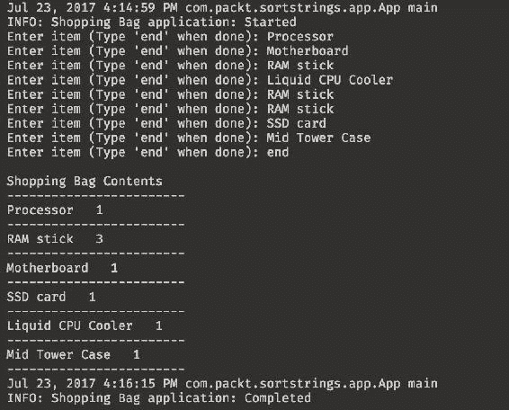
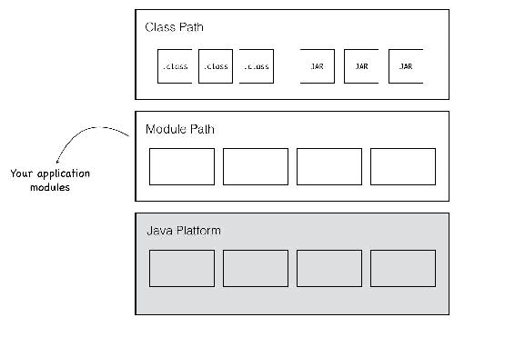
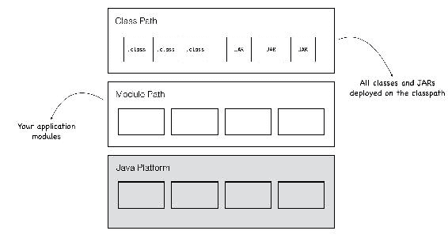
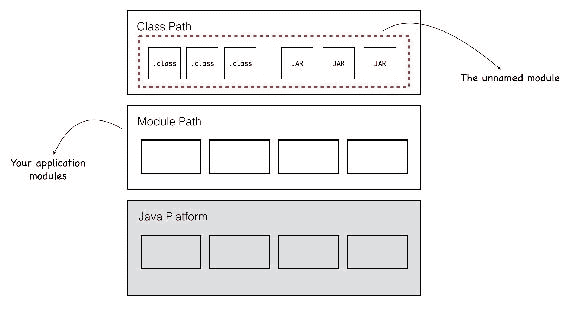
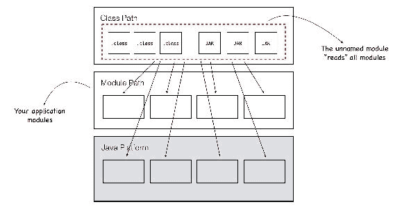
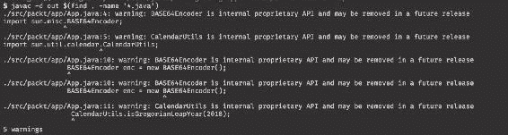
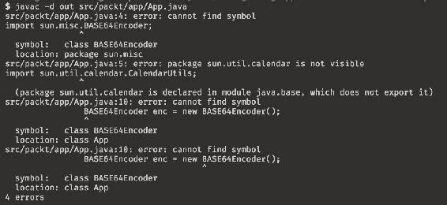
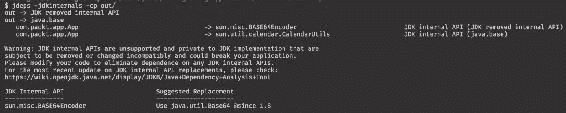
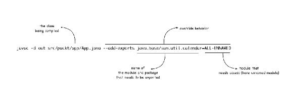
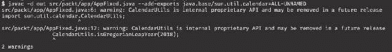

# 为 Java 9 准备你的代码

在最后一章，我们探讨了在构建 Java 9 模块化应用程序时可以使用的一些模式和最佳实践。它们是一套极其实用的规则，当构建新应用程序时值得记住。但是，开发者并不总是有机会在绿地项目中工作，在这些项目中他们有自由从头开始思考和构建应用程序架构。如果已经有很多使用 Java 8 或更早版本构建的代码怎么办？我们如何将这些代码迁移到 Java 9？

在本章中，我们将涵盖以下内容：

+   处理遗留代码并使其准备好在 Java 9 中运行

+   在 Java 9 中编译遗留代码并在 Java 9 运行时执行 Java 9 之前的编译代码

+   Java 9 中的类路径行为和未命名的模块

+   处理错误和非标准 API 访问以及使用 jdeps 工具

+   使用覆盖开关来处理棘手的代码和 API

# 开始 Java 9 迁移

你可能有一些 Java 8（或更早）的代码。你可能想知道你需要做什么才能让它与 Java 9 一起工作。当 Java 9 规范正在通过**Java 社区过程**（**JCP**）时，开发社区对此有一些担忧。遗留的 Java 代码在 Java 9 中是否可以按原样工作？如果需要做出更改，它们将消耗多少时间和精力？幸运的是，Java 在维护向后兼容性方面有着出色的记录，即使在引入语言的新模块化特性这样的重大变化中也是如此。然而，由于 Java 9 是对 Java 内部结构最大的重整之一，可能需要进行一些工作。工作的量主要取决于两个因素——你试图执行的迁移性质以及代码本身的编写方式。

我所说的“迁移性质”是什么意思？当处理 Java 9 迁移时，将努力分为几个阶段是有用的。从高层次来看，你可以将现有的 Java 9 之前的代码通过以下两个阶段进行迁移：

1.  让你的代码在 Java 9 中编译和执行。

1.  对你的代码结构进行重构以使用模块化特性。

**第一步**涉及使用与之前相同的`javac`和`java`命令处理现有的代码库，但使用新的 Java 9 版本的编译器和运行时。在这个阶段，你希望尽可能少地更改代码！**第二步**涉及重构或重写你的代码以使用模块化特性，包括我们在本书中学到的内容——将代码库分解成模块单元，为每个模块创建`module-info.java`，然后在这些模块之间建立关系。

这两个步骤对于迁移到 Java 9 是否都是必要的？嗯，**第一步**是必要的。对于你计划在未来运行和使用的任何应用程序，至少让它与新 Java 9 运行时兼容是值得的。这样，你就可以随时准备应对 Java 8 在未来成为 *生命终结* 的情况。这种类型的迁移应该相对简单，除了我们将在本章中介绍的一些需要注意的事项。

在你完成这些之后，并且你的应用程序现在可以与 Java 9 编译器和运行时一起工作，你确实有一个选择，可以将你的代码重构为使用你已学到的所有酷炫的新模块化功能。但这可能并不总是有价值的。如果你有计划在未来不修改或增强的代码，并且你只需要 *维护* 它以运行业务，那么通过重构它来使用 Java 9 模块，你不会得到很多价值。

然而，如果你预计会进行更改并积极地对代码库进行工作，将代码重构为使用模块是有好处的。下一章将处理涉及使用我们现在通过 Java 9 获得的丰富 JPMS 功能的代码迁移。

我们将在本章中介绍 **第一步**。**第二步**在 第十一章 中介绍，*将您的代码迁移到 Java 9*。

# 介绍示例 Java 8 应用程序

我们将使用一个示例 Java 8 代码库来尝试迁移到 Java 9。它是一个命令行 `购物袋` 工具。当你运行应用程序时，它会提示你将项目添加到你的购物袋中。一旦你添加了所有项目并且完成，你输入 `end`。应用程序随后显示你已添加的项目的综合购物清单。应用程序故意很简单，但它为我们提供了一个很好的起点，以便在迁移过程中进行工作。

这里是应用程序运行时的截图：



应用程序由三个不同包中的三个类组成：

+   `ShoppingBag` 类：它包含一个将项目添加到购物袋的方法，以及一个用于打印袋子内容的格式化方法。该类使用 Apache Commons Collections 库中的 `Bag` 数据结构。将这种数据结构想象成类似于 `Set`，但允许重复：

```java
        public class ShoppingBag  { 

          public static String END_TOKEN = "end"; 
          private Bag<String> bag = new HashBag<>(); 

          public boolean addToBag(String itemName) { 
            return (END_TOKEN.equals(itemName)) ||
             this.bag.add(itemName);  
          } 

          public void prettyPrintBag() { 
            ... 
          } 

        } 
```

+   `UserInputUtil` 类：它包含一个提示用户输入的方法。它还包含一个公开的 `close` 方法，用于完成输入流时关闭：

```java
        public class UserInputUtil { 
          Scanner scanner = new Scanner(System.in); 

          public String getUserInput(String prompt) { 
            System.out.print(prompt); 
            return scanner.nextLine(); 
          } 

          public void close() { 
            scanner.close(); 
          } 

        } 
```

+   `App` 类：将所有内容整合在一起。这个类包含 `main` 方法。它使用 `UserInputUtil` 来提示用户将项目输入到购物袋中。它将每个项目添加到 `ShoppingBag` 实例中，完成后打印出袋子：

```java
        public class App { 

          private static final Logger logger = 
            Logger.getLogger(App.class.getName()); 

          public static void main(String[] args) { 

            logger.info("Shopping Bag application: Started"); 

            ShoppingBag shoppingBag = new ShoppingBag(); 
            UserInputUtil userInputUtil = new UserInputUtil(); 
            String itemName; 
            do { 

              itemName = userInputUtil.getUserInput("Enter item (
                Type '" + ShoppingBag.END_TOKEN + "' when done): "); 
              shoppingBag.addToBag(itemName); 

            } while (!ShoppingBag.END_TOKEN.equals(itemName)); 
            userInputUtil.close(); 
            shoppingBag.prettyPrintBag(); 
            logger.info("Shopping Bag application: Completed"); 
          } 
        } 
```

除了应用程序代码外，还有一个 `lib` 文件夹，其中包含 Apache Commons Collections 库的 JAR 文件--`commons-collections4-4.1.jar`。代码依赖于这个库 JAR 文件。在编译和运行代码时，我们需要将这个 JAR 文件添加到类路径中。

我建议查看位于`-10-migrating-application/01-legacy-app`的包含源代码的位置，并熟悉它。在迁移过程中，我们将使用这个应用程序。

# 使用 Java 9 编译器和运行时

让我们从第一步开始——使用 Java 9 编译器和运行时编译和运行旧代码库。如果一切按预期进行，那就太好了。如果需要更改，我们希望尽可能少地更改。

首先，请确保您正在使用 Java 9，可以使用以下命令进行确认。如果您使用的是不同版本，您需要切换版本，这已在第二章“创建您的第一个 Java 模块”中介绍过：

```java
$ java --version  
```

从项目文件夹中，为我们的编译类创建一个新的`out`目录，并运行以下 Java 编译器命令来编译所有的`.java`文件：

```java
$ mkdir out
$ javac -cp lib/commons-collections4-4.1.jar  -d out $(find . -name 
  '*.java')  
```

在前面的`javac`命令中，我们使用`-cp`选项将公共集合 JAR 文件添加到 classpath 中，使用`-d`选项指定编译类的输出目录，然后使用`$(find . -name '*.java')`递归地指定以下目录中的所有`.java`文件。

编译步骤应该顺利通过，没有任何错误。太好了！让我们尝试运行它：

```java
$ java -cp out:lib/commons-collections4-4.1.jar  
  com.packt.sortstrings.app.App  
```

在前面的`java`命令中，我们在 classpath 的`-cp`选项中指定了两个路径——包含编译类的`out`目录和公共集合 JAR 文件。接下来是包含`main`方法的类的完全限定类名。

注意，我们仍在使用 classpath 而不是模块路径的概念。Java 9 仍然与 classpath 一起工作，并且与之前 Java 版本相同的`-cp`选项。关于这一点，稍后会有更多介绍。

运行命令应该会成功，提示符会按预期显示。这就是了！一个 Java 8 应用程序已经使用 Java 9 编译和执行，而且不需要更改任何一行代码！尽管我很想告诉您，所有遗留代码都将像这样轻松地工作，但不幸的是，事实并非如此。有些情况需要更多的努力。然而，好消息是，在大多数情况下，这个过程*应该*是如此轻松。我们将在下一节中查看您可能会遇到问题的某些情况，以及如何解决这些问题。但首先，鉴于我们现在对 Java 9 的了解，一切工作得如此顺利，这不是很令人惊讶吗？如果您仔细想想，编译和执行都应该失败！为什么？以下是一些原因：

+   我们了解到 Java 9 正在转向模块系统，并且*所有*东西，无论是应用程序代码还是平台，都应该在一个模块中！我们的 Java 8 代码显然不在预定义的模块中。这在 Java 8 中是可以的，但在 Java 9 中不应该导致错误吗？

+   注意到`App.java`正在使用 Java 日志 API。我们在第四章，*介绍模块化 JDK*中了解到，日志 API 已经被打包到一个名为`java.logging`的独立平台模块中。并且访问任何不是`java.base`的模块的所有代码都应该明确要求它。显然，这里的代码并没有这样做，因为这是 Java 8 代码，而且一开始就没有`module-info.java`模块定义。

这引发了一个问题——为什么在 Java 9 中编译和执行这段代码仍然可以工作？这一切都得益于语言中引入的一些特殊功能，以支持这个过程——在 Java 9 中执行遗留代码。这里为我们工作的特定功能被称为**未命名模块**。

# 未命名模块

好吧，我们并没有错。Java 9 中的所有代码*都需要*在模块中。所有模块都需要有正确的可读性和可访问性关系，以便应用程序能够正常工作。但这可能是个问题！因为，就像每个新的 Java 版本一样，有成千上万的开发者试图使用新的 Java 版本运行他们的遗留 Java 代码库。如果我们期望每个遗留 Java 代码库在 Java 9 中运行之前都封装到模块中，这将给开发者社区带来巨大的努力成本。幸运的是，有一个解决办法。当你使用 Java 9 编译或运行类路径中的遗留无模块 Java 代码时，你*不需要*手动创建模块包装器。平台会自动创建一个包含你类路径中所有内容的单个模块。这个模块没有名字，因此被称为*未命名模块*。

到目前为止，我们编译和执行的所有 Java 9 代码都没有使用类路径。以下是到目前为止我们运行 Java 9 应用程序中的模块示意图：



到目前为止，整个运行时都使用 JRE 中的内置平台模块以及来自模块路径的应用程序模块一起工作。这些共同构成了可观察模块的完整集合。那么，如果你在其中有类路径会发生什么呢？在带有类路径选项运行时，画面如下所示：



正是在这里，我们本应违反了*所有代码都需要在模块中*的规则。幸亏有了自动模块功能，我们并没有这样做。Java 9 平台自动将类路径中的所有类和 JAR 文件封装到一个未命名的模块中：



这正是购物袋应用程序所发生的情况。所有应用程序代码，包括公共集合 jar 文件，都是单个未命名模块的一部分。好的，这解决了其中一个担忧。第二个问题呢？代码是如何访问 Java 日志 API 的？未命名的模块不应该声明`requires java.logging`吗？但是它怎么能够做到呢？未命名的模块根本就没有`module-info.java`文件！因为平台无法真正确定类路径代码需要什么，所以未命名的模块自动获得了对所有可观察模块的可读性访问。换句话说，它模仿了 Java 9 之前类路径中代码的“自由 forall”行为——它`requires`一切，因为这是平台最大化任何遗留代码在 Java 9 中按原样工作的唯一方式。如果你要绘制一个模块图，它将看起来像未命名的模块与可观察模块集中的每个模块都有可读性关系，如下面的图所示：



这个图非常混乱，所以我们不会再绘制这个图。从现在开始，我们将把来自自动模块的所有可读性边缘简化为单个箭头，以保持内容的可读性。

自动模块功能是专门为了迁移目的而构建到平台中的，正如你所见，这也是我们的 Java 8 代码能够在 Java 9 中编译和运行而没有任何错误的原因。总结一下：

+   每次你在 Java 9 中提供`-classpath`选项来编译或执行代码时，平台都会创建一个未命名的模块。提供的类路径中的所有类和 jar 文件都被捆绑到这个未命名的模块中。

+   未命名的模块自动*读取*每个可观察模块。因此，它不仅读取所有 Java 9 平台模块，还读取你在模块路径中的所有应用程序和库模块（如果你在命令中提供了模块路径参数，除了类路径）。

每次你使用 Java 编译器而不提供任何模块路径选项时，你就是在所谓的*单模块模式*下运行编译器。在这种模式下，就像我们所看到的，我们正在处理单个未命名的模块。代码应该被组织成传统的基于包的目录结构，并且没有模块文件夹。

# 处理非标准访问

等等！有一个陷阱！未命名的模块读取所有 Java 平台模块，因此我提到它模仿了预 Java 9 平台的“自由放任”行为。但这并不完全正确。在 Java 9 之前，整个平台及其中的所有类都对应用程序代码是可访问的。随着 Java 9 平台模块化，平台模块中有几个内部类型没有被导出，因此它们是封装的。自动读取所有平台模块是一个好事，但这足够吗？并不真正如此，因为它只是允许类路径中的代码访问模块中导出的类型。但如果你遗留的代码使用了现在封装在 Java 9 平台模块中的类型怎么办？仅仅让未命名的模块读取所有平台模块是不够的，因为封装的类型仍然不可用。对于访问已删除类型的代码也存在相同的问题。是的，在 JDK 8 及更早版本中，某些类型在 Java 9 中不再可用。并且任何使用这些类型的遗留代码在 Java 9 中将无法编译和运行。

`10-migrating-application/02-non-standard-api` 中的代码是一个具有此类内部类型访问的代码示例。`App.java` 类使用了两种类型：

+   `Base64Encoder`，在 Java 的先前版本中可用，但现在随着 Java 9 的推出，已被完全移除

+   `CalendarUtils`，在 Java 9 的 `java.base` 模块中作为内部类型封装

即使你正在创建一个新的 Java 9 模块，也没有平台模块可以让你的代码要求访问它。该类型没有从模块中导出，因此实际上是密封的。因此，即使是未命名的模块也无法访问它们。

这里是示例代码。代码本身完全无效，因为它只是尝试使用这两种类型：

```java
    package com.packt.app; 
    import sun.misc.BASE64Encoder; 
    import sun.util.calendar.CalendarUtils; 

    public class App { 
      public static void main(String[] args) { 
        BASE64Encoder enc = new BASE64Encoder(); 
        CalendarUtils.isGregorianLeapYear(2018); 
      } 
    } 
```

切换到 Java 8 编译器并编译代码：

```java
$ export JAVA_HOME=$(/usr/libexec/java_home -v 1.8)
```

注意，虽然编译过程顺利，但你确实看到了警告！



很长一段时间以来，开发者们都被警告过这种内部类型的用法！对于正在编写这种代码的人来说，这些 API 在 Java 9 中不起作用并不应该令人惊讶。

让我们切换到 Java 9 并编译此代码。在 macOS 或 Linux 上使用以下命令：

```java
$ export JAVA_HOME=$(/usr/libexec/java_home -v 1.9) 
```

在 Windows 上，按照 第二章 中概述的步骤，*创建您的第一个 Java 模块*。

将 Java 版本切换到 9 后，运行此代码的编译命令。这次，你不会收到警告。你会得到错误，代码无法编译：



注意到有两个不同的错误，每个类型一个：

+   `CalendarUtils` 的错误表明该类型现在已被封装（即未导出）从 `java.base`。

+   `BASE64Encoder` 的错误提到编译器找不到它。该类型已被从 Java 9 中移除。

当在 Java 9 中编译和运行遗留代码时，由于模块化变更，你可能会遇到这两种最有可能的错误。修复这些错误之一需要更改你的代码。你可能需要在新平台上找到一个等效的类或 API 来完成你需要的功能。或者找到一个包含所需 API 的外部库。棘手的是，有问题的代码可能不一定在你的应用程序代码中。它可能在你使用的库或框架中。即使在那种情况下，你的应用程序在 Java 9 中也不会编译或运行，直到你移除依赖项或库被更新。

平台提供了一些帮助，以帮助你识别应用程序及其依赖项中存在的问题。这是一个名为`jdeps`的工具。

`jdeps`最初与 Java 8 一起发布，以帮助开发者识别和修复内部 API 访问问题。在 Java 9 中，它变得更加有用和详细。

# jdeps 工具

**Java 依赖分析工具**（**jdeps**）是一个实用工具，可以静态地检查你的应用程序和库类，以确定是否有任何不再与 Java 9 兼容的 JDK 内部 API 的使用。你可以在编译好的类文件或 JAR 上运行`jdeps`，并让它列出所有此类引用。对于每个引用，`jdeps`将突出显示不再可用于你的代码使用的内部类型的使用。如果可用，它甚至会建议替代 API。

命令语法如下：

```java
$ jdeps -jdkinternals <jar-files>  
```

如果你有一堆编译好的类，并想在它们上运行`jdeps`，你可以甚至提供 classpath 参数：

```java
$ jdeps -jdkinternals -cp <class-paths>  
```

让我们用`02-non-standard-api`项目来试一试。我们已经用 Java 8 编译器编译了这个项目（尽管有警告），现在类已经存在于 out 目录中。对它们运行`jdeps`会得到以下输出：



`sun.misc.BASE64Encoder`被标记为*JDK 已移除的内部 API*，而`sun.util.calendar.CalendarUtils`被标记为来自`java.base`的 JDK 内部 API。在`BASE64Encoder`的情况下，工具提供了一个有用的建议，即使用自 Java 1.8 版本以来就可用作为替代的 API（`java.util.Base64`）。

如前所述，`jdeps`也可以在 JAR 上运行。如果我们运行包含的`01-app-migration`项目上的工具，我们将得到没有输出。这是一个好事，因为这表明没有使用 JDK 内部 API，JAR 可以用于 Java 9。

```java
$ jdeps -jdkinternals commons-collections4-4.1.jar  
```

`jdeps`是一个*静态*代码分析工具，重点在于单词*静态*。它查看代码以识别非法 API 使用。它不能通过反射识别动态运行时使用。因此，有可能`jdeps`给你的代码库给出了全部放行的信号，但当你运行它时，你可能会遇到`IllegalAccessException`，因为代码使用了反射来访问不再可用的内部类型。

总结来说，`jdeps -jdkinternals`是一个检查预编译的应用程序和库类并验证与 Java 9 任何不兼容性的优秀工具。特别有用的是，该工具在可能的情况下推荐使用替代选项。

# 覆盖模块行为

`jdeps`在识别内部 API 访问和提出修复建议方面非常出色。当修复包含此类问题的自己的应用程序代码时，它们非常有用。但是，如果`jdeps`报告了你正在使用的库或框架中某些代码的问题呢？在这种情况下，你对代码的控制较少。即使框架本身是开源的，库的规模和复杂性可能不会使你能够自己实施修复。这确实为迁移到 Java 9 的应用程序带来了一个非常明显的问题——直到你的所有库都更新到可以在 Java 9 中工作，你的应用程序才会在 Java 9 中运行。很可能大多数库开发者已经注意到了 Java 8 中的大量警告并修复了他们的代码，或者他们很快就会这样做，因为他们的代码在 Java 9 中会中断。但是，如果他们不这样做，这可能意味着你的迁移计划将取决于库的作者。

幸运的是，平台提供了一些覆盖功能来解决这个问题。我们在这里要查看的覆盖功能不仅适用于在 Java 9 中编译的遗留 Java 代码，它们也适用于 Java 9 模块。但是，由于它们主要是为了帮助迁移而设计的，因此它们应该仅在迁移的上下文中使用，其他用途理想情况下应避免。

这些覆盖功能是什么？请记住，Java 9 模块有一个*模块定义*，它指定了它`requires`什么和它`exports`什么。这些在开发时在`module-info.java`文件中指定的单个模块定义实际上控制了模块在编译和运行时的可访问性关系。然而，结果却是，编译器和运行时都有覆盖这些模块关系的选项，允许你通过指定命令行参数来更改任何给定模块`requires`或`exports`的内容。

有三个命令行标志用于`javac`和`java`来覆盖特定的模块配置：

+   `add-reads`：`--add-reads`选项允许你指定可能尚未在模块配置中可用的附加可读性关系。语法是：

```java
      --add-reads <source-module>=<target-module>
```

将此选项添加到`javac`和`java`命令行中，只为使用该参数的命令执行创建一个新的可读性关系。例如，假设你有模块`moduleA`和`moduleB`，你想要`moduleA`读取`moduleB`。你可以编辑`moduleA`中的`module-info.java`文件并添加行`requires moduleB;`，或者添加以下参数到编译器和运行时，如下所示的这个截断命令：

```java
 $ java ... --add-reads moduleA=moduleB
```

+   `add-exports`：`--add-exports`选项允许你从模块添加额外的导出包，从而打破或覆盖封装。语法是：

```java
      --add-exports <source-module>/<package-name>=<target-module>
```

+   例如，如果`moduleA`需要从`moduleB`获取`pack.internal`包，但`moduleB`没有导出该包，你可以添加以下覆盖，使`moduleB`为`moduleA`导出所需的包，如以下截断命令所示：

```java
 $ java ... --add-exports moduleB/pack.internal=moduleA
```

+   `add-opens`：`--add-opens`选项允许你覆盖模块之间的`opens`关系以允许反射访问。这是一个模拟模块定义中`opens`关键字配置的覆盖。语法是：

```java
      --add-opens <source-module>/<package-name>=<target-module>
```

+   按照相同的示例，如果`moduleA`需要`moduleB`中`pack.internal`包的运行时反射访问，你需要使用以下选项运行`javac`或`java`命令：

```java
 $ java ... --add-opens moduleB/pack.internal=moduleA
```

注意，覆盖总是*有资格的*，也就是说，你为特定的目标模块指定它们。例如，你不会使用`--add-exports`标志将包导出到每个其他模块。你明确指定一个或多个从源模块应用覆盖的目标模块。这是一个好事，因为每个覆盖都是经过深思熟虑的，并且很容易跟踪需要使应用程序正常工作所需的内容。

除了命令行参数之外，还有另一种提供这些覆盖的方法。你可以在 JAR 文件清单中指定它们。假设你有一个需要与 Java 9 平台模块一起工作的可执行 JAR 文件，并且需要进行一些覆盖。为了避免每次都需要作为命令行参数指定这些覆盖，你只需在 JAR 文件中的`MANIFEST.MF`文件中指定这些作为清单属性。与所有清单属性一样，值应在`MANIFEST.MF`文件中属性名称之后指定一个空格。清单属性`Add-Exports`对应于`--add-exports`参数。属性`Add-Opens`对应于`--add-opens`。没有与`--add-reads`对应的清单属性。

除了这些覆盖之外，还有一个针对类路径中类封装的任何模块化相关封装的“主关闭开关”——`--permit-illegal-access`标志。与前面的三个选项不同，此选项仅在类路径中的代码上工作。当将此标志传递给`javac`或`java`时，它有效地禁用了所有可读性和可访问性限制，从而使类路径中的任何类型都可以访问其他类型。这几乎就像没有 Java 模块化功能，类路径中的所有内容都像在 Java 8 或更早版本中运行一样。正如你所期望的，使用此标志不是一个好主意，尤其是在你正在运行生产代码的情况下。这是为了帮助开发者迁移他们的类路径应用程序，并且完全有可能在未来被删除。将其视为在迁移过程中解决问题的*最后手段*选项。

现在你已经了解了这些覆盖选项，你该如何将它们应用到解决我们在这个部分开始讨论的问题上呢？那就是在你的 Java 8 代码中使用封装的 API 的库或类，这些类在 Java 9 中不再工作？如果代码不在你的控制之下，你不能修复它以*避免*使用封装的类型，你可以使用覆盖开关手动添加所需的`exports`！例如，我们在`02-non-standard-api`中使用的内部未导出类型`CalendarUtils`来自`java.base`。由于我们显然不能更改`java.base`模块的模块描述符，我们可以做的是将`--add-exports`选项传递给模块，并让它导出所需的包。

但这里有一个问题。请注意，语法需要源模块名和目标模块名。源模块名当然是`java.base`。那么目标模块是什么呢？它是未命名的模块，因为需要这个包的类在类路径中。这引发了一个有趣的问题——未命名的模块的名字是什么？未命名的模块没有名字（或者确实不会被称为那样！），但有一个特殊的标记`ALL-UNNAMED`，你可以将其传递给覆盖参数，让平台知道你正在引用未命名的模块：



这个命令应该可以解决我们代码中`CalendarUtils`访问的问题。仍然缺少`BASE64Encoder`类型。没有命令行参数可以修复这个问题。就像我们看到的，这个类型在 Java 9 中根本不存在。我们将不得不用其他东西来替换它。根据`jdeps`提供的建议，`AppFixed.java`类有更新的代码，它使用`Base64class`代替：



这次，你没有遇到错误，编译过程也顺利通过了。你仍然会看到关于使用内部类型的警告。编译器仍然提醒你这不是一个理想的情况，但既然你已经添加了`override`，它相信你知道你在做什么。

如果代码是在 Java 的早期版本中编译的，你正在 Java 9 中运行它，并且问题仅与访问封装类型有关，你可以将相同的覆盖参数添加到`java`命令中，并让它运行。然而，如果编译的类引用了不可用的类型，就像我们刚才看到的`BASE64Encoder`类型，你除了编辑代码并重新编译之外别无选择。

# 理解影响

现在你已经知道了在 Java 9 中编译或运行遗留代码时可能遇到的问题，以及当这些问题发生时如何解决它们，让我们花些时间来了解这些问题的范围。你对于在遗留的 Java 代码中遇到和修复这些问题应该有多担心？

我们可以将向后不兼容的 API 分为以下几大类：

+   **具有替代方案的 API**：此链接（也是 `jdeps --jdk-internals` 输出中提供的链接）提供了需要替换的 Java 9 中 API 的完整列表：[`wiki.openjdk.java.net/display/JDK8/Java+Dependency+Analysis+Tool`](https://wiki.openjdk.java.net/display/JDK8/Java+Dependency+Analysis+Tool)。

+   **封装的 API**：当您运行 `jdeps` 时，您可能会看到有关使用没有替代建议的内部 JDK 类型的错误。它们可能是以前在 Java 9 之前可用的类型，但现在被封装在平台模块中。这些可以通过使用正确的命令行覆盖 `javac` 和 `java` 调用来修复。

另一方面，有一些 API 原本打算移除，但它们仍然可用。虽然意图是封装所有内部 JDK API，但有一些 API 在 Java 开发者社区中被广泛使用，并且没有合适的替代方案，封装它们会给迁移过程带来更多困难。记得我们在 第一章 “介绍 Java 9 模块化” 中讨论的广泛使用的 `sun.misc.Unsafe` API？这样的 API 在 Java 9 中仍然可以访问。但为了使这些 API 更容易在以后弃用，它们已经被移动到一个名为 `jdk.unsupported` 的单独模块中，从该模块可以访问这些类型。

在 `jdk.unsupported` 模块上运行 `java -d` 会显示目前仍然可访问的 *不受支持* API：

```java
$ java -d jdk.unsupported
  jdk.unsupported@9
  exports com.sun.nio.file
  exports sun.misc
  exports sun.reflect
  requires java.base mandated
  opens sun.reflect
  opens sun.misc
```

提醒一句。`jdk.unsupported` 模块和 API 很可能将在 Java 的下一个版本中被移除，因此不要计划长期依赖这个模块。

# 推荐策略

让我们总结一下，概述在 Java 9 中编译和运行遗留代码的推荐策略。以下是您理想中应该遵循的步骤：

1.  运行 `jdeps --jdk-internals` 以验证您的代码是否有任何内部 API 访问。如果没有错误，只需尝试在 Java 9 中编译和运行您的代码。对于大多数没有访问内部 JDK API 的情况，代码应该可以简单地正常工作。

1.  如果存在错误，并且是由您可以更改的应用程序代码引起的，请遵循 `jdeps` 的建议并修复这些错误。

1.  如果错误是由您无法控制的库引起的，请检查库作者是否发布了更新，并获取最新版本。许多使用内部 API 的库正在更新以兼容 Java 9，您的库的修复可能已经完成并发布。

1.  如果前面的步骤都不奏效，请考虑使用覆盖选项 `--add-exports` 或 `--add-opens` 来访问您需要的平台 API。这是一个短期应急措施，直到有问题的代码或库被修复。

1.  如果这些方法都不奏效，作为最后的手段，可以使用`--permit-illegal-access` 关闭开关来关闭所有模块化特性。虽然这不被推荐（你当然不希望在生产环境中部署带有此开关的应用），但如果你被兼容性问题压得喘不过气来，这是一个方便的开始方法。这个开关的一个酷特性是，当你运行任何进行*非法访问*的代码时，它会打印出一个警告信息。这可以非常有帮助，以便汇总这些信息并计划稍后修复它们。

# 摘要

本章介绍了代码迁移到 Java 9 的两个阶段中的第一个——在 Java 9 中编译或运行你的 Java 9 之前的代码的过程。我们使用了一个示例 Java 8 项目（没有任何内部 API 访问）来在 Java 9 中编译和执行它。然后我们查看了一个包含几个故意内部 API 访问实例的类，并看到了我们将遇到的错误的样子。我们了解了`jdeps`工具以及如何使用它来静态扫描你的代码库并识别这些实例。

一旦确定了这些实例，我们介绍了几种解决问题的方法——使用建议的替换 API 或使用命令行标志临时克服问题。我们使用了这两种选项来使之前失败的代码在 Java 9 中编译和执行良好。然后我们查看了一个高级策略，以完成将你的遗留代码在 Java 9 中运行的过程。

如果你正在维护的代码你只是需要维护而不太可能进行扩展，那么你可以在迁移之旅的这里停止。但是，如果你需要积极演化代码，那么超越这一点是个好主意。在下一章中，我们将学习如何通过 Java 9 迁移的第二阶段——将其重构为使用 Java 9 模块化特性。
