# 第十一章：将您的代码迁移到 Java 9

在前一章中，我们探讨了从一个 Java 9 之前的代码库开始，使其在新的 Java 9 平台上编译或运行所需的最小更改。我们还探讨了您可能会遇到的一些遗留代码问题以及如何解决这些问题。

如果您正在对一个预期将进行许多更改或增强的代码库进行工作，那么您不仅想要在 Java 9 上运行它。您想要利用 Java 9 提供的模块化特性。当然，您不应该盲目地重写应用程序以使用模块，仅仅因为您能够这样做！模块化的优势——强大的封装和可靠的配置——在具有大型代码库、清晰的边界和多个团队共同工作的应用程序中最为有用。在本章中，我们将探讨如何使用这些新的模块化特性，并逐步将它们引入到您的 Java 9 之前的代码库中。

本章我们将涵盖以下主题：

+   代码库迁移策略

+   自动模块

+   库迁移

+   多版本 JAR 文件

我们将在前一章中讨论的购物袋示例上继续工作。我们已经将它编译并运行在 Java 9 平台上。现在，我们将向代码中添加模块化特性。

现在，您如何进行类似的事情呢？在小型应用程序的情况下，例如我们正在查看的示例代码，在整个应用程序中进行全面更改是微不足道的——您可以根据代码中不同类型所扮演的角色将小型代码库分割成模块。然后，用正确的模块定义将各个模块包装起来。简单！

不幸的是，大多数现实世界的应用程序都更大、更复杂。因此，它们不能通过“大爆炸”方法进行模块化。您将不得不逐步将其分割成块，将应用程序的部分移动到模块中。在一个部分代码已经模块化而其余部分没有的应用程序中，这会是如何运作的呢？此外，大多数应用程序，尤其是企业 Java 应用程序，都使用某种类型的框架或库来处理应用程序基础设施。在这些情况下，Java 9 迁移意味着什么呢？库是否需要重写以使用模块？在库尚未模块化的情况下，您能否模块化您的应用程序？在我们回答这些问题之前，让我们首先了解迁移目标是什么。我们试图实现什么？

# 理解迁移目标

假设您已经完成了前一章中的步骤，并且您的遗留代码现在符合或可以在 Java 9 上运行。您已经准备好下一步——将您的代码迁移到使用 Java 9 模块！这看起来会是什么样子？

这是一个非常高级的图示，展示了在 Java 9 平台上运行的典型 Java 9 之前应用程序的不同元素：

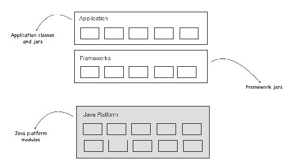

你可以将一个典型应用程序分解为三个不同的层。在最顶层是**应用程序类和 JAR 文件**。典型应用程序结合了**应用程序类和 JAR 文件**以及任何内部库，例如共享的实用组件。所有这些都是特定于应用程序的。由于应用程序尚未迁移到 Java 9，因此这一层由 classpath 中的类和 JAR 文件组成。

第二层表示应用程序可能使用的任何**框架**。现在很难找到不使用某种应用程序框架的 Java 应用程序。Spring、Vaadin、JSF 和 Hibernate 等框架非常常用。这些通常捆绑到应用程序中作为`.jar`文件，无论是手动下载还是通过 Maven 或 Gradle 之类的依赖关系管理工具。库将在 classpath 中还是在模块路径中？这取决于库，以及作者是否将其迁移到 Java 9。如果库已经迁移，你只需将它们添加到模块路径即可！然而，为了本章的目的，让我们假设库尚未迁移，这样你就知道如何处理更复杂的情况。

第三层是所有这一切背后的底层**Java 平台**。正如我们在本书中看到的，自 Java 9 起，这是一个完全模块化的平台。

由于我们假设应用程序代码或库都不是 Java 9 模块，它们主要在 classpath 中运行，而模块路径完全为空。这正是我们在上一章结束时留下的代码的方式。以下是*之前*的图片：

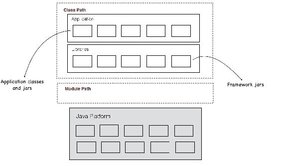

目标是创建模块，并将所有内容从**classpath**移动到**模块路径**。一旦完成，**classpath**将变为空，应用程序所需的所有内容都将从**模块路径**运行。以下是理想的*之后*图片：

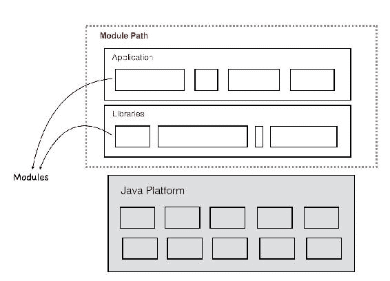

注意，在*之后*的图片中，我们甚至不再使用**classpath**了。我们现在需要的所有代码和二进制文件都已转换为模块，并在**模块路径**中提供。因此，在一个理想的世界里，甚至不需要传递 classpath 参数！此外，请注意，我故意将模块的表示改为随机大小。这是为了强调，JAR 文件和 classpath 中的类与转换后的模块之间可能不存在一对一的映射。你可能会在 Java 9 中将 Java 8 应用程序中的一个 JAR 文件拆分为多个模块，或者将多个 JAR 文件合并为一个模块。

既然我们已经对最终目标有了概念，让我们来看看迁移策略。

# 开始迁移

让我们通过处理示例购物袋应用程序来逐步进行迁移过程。这是一个简单的应用程序，包含三个类——一个用于读取用户输入，一个提供购物袋功能，还有一个包含 main 方法的类来驱动执行——迭代地接收用户输入，将其添加到购物袋中，然后打印袋中的内容。该应用程序依赖于 commons collections JAR 文件中的 Bag 数据结构。它还调用 Java 日志 API 将开始和结束时间记录到控制台。

购物袋应用程序中的代码被称为*单体*。也就是说，构成应用程序的所有代码都在一个代码库中。这实际上是一种简化，并不代表一个可能跨越多个项目并具有不同构建工件捆绑在一起的真实世界应用程序。我们将保持简单，首先使用简化的单体代码库运行迁移过程，然后将其扩展到多项目设置。

我们从`01-legacy-app`文件夹中的代码开始。应用程序代码在`src`文件夹中，commons collections JAR 在`lib`文件夹中：

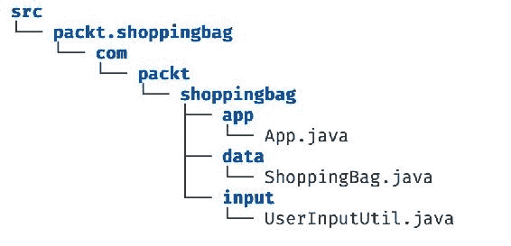

将此应用程序模块化的第一步是创建一个大的模块，它围绕整个应用程序。我们在第十章中运行了这个应用程序，*为 Java 9 准备你的代码*。平台通过创建一个包含所有我们代码的无名模块来帮助我们，这是一个自动的过程。这次，我们将自己创建一个名为`packt.shoppingbag`的应用程序模块。

首先，就像之前一样，让我们指定一个模块源文件夹，其中包含所有模块的源代码。你可以创建一个新的文件夹或使用现有的`src`文件夹。我将选择后者。在`src`文件夹中，创建一个名为`packt.shoppingbag`的模块文件夹，并在其中创建一个`module-info.java`文件：

```java
    module packt.shoppingbag { 
    } 
```

目前这只是一个空的模块描述符。我们稍后会回到这个问题。

现在我们有了模块根，你可以将整个源代码（包括包名文件夹层次结构）移动到模块根文件夹中。`11-migrating-application/02-migrating-to-one-module`文件夹中的源代码代表了代码库的这种状态：

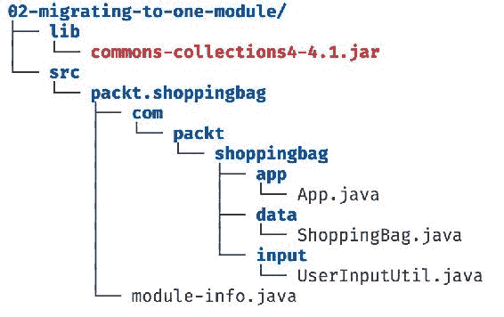

我们现在拥有的远非一个*模块化*的 Java 应用程序。然而，从技术上讲，它确实有一个模块。因此，编译和执行此应用程序的方式需要与我们在这本书中迄今为止所做的方式相似。也就是说，使用模块源路径参数来指定包含模块根的源位置，并使用模块路径参数指向编译模块的位置。

让我们尝试编译这个应用程序。我们首先创建一个名为 out 的文件夹来包含编译后的类：

```java
$ mkdir out
```

这是到目前为止我们使用的 javac 命令：

```java
$ javac --module-source-path src -d out $(find . -name '*.java')
```

如果你运行这个，你会得到以下错误：

```java
$ javac --module-source-path src -d out $(find . -name '*.java')
./src/packt.shoppingbag/module-info.java:3: error: module not found: commons.collections4
requires commons.collections4;
 ^
1 error
```

编译器无法找到 commons collections 依赖项。这很合理！`lib`文件夹中的 JAR 文件，而我们从未告诉编译器关于它。现在，我们可以将这个 JAR 文件添加到类路径中并再次编译吗？

```java
$ javac --module-source-path src -cp lib/commons-collections4-4.1.jar -d out $(find . -name '*.java')
./src/packt.shoppingbag/module-info.java:3: error: module not found: commons.collections4
requires commons.collections4;
 ^
1 error
```

不行，这也不会起作用。为什么？下面是我们现在拥有的应用程序的图片：

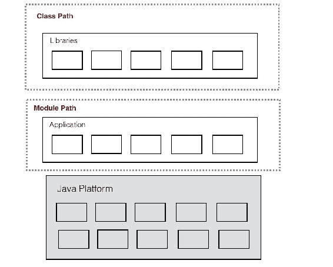

我们已经将应用程序代码移动到**模块路径**中，但库（在我们的例子中是一个单独的 JAR 文件）仍然存在于**类路径**中。由于它位于**类路径**中，它成为了自动创建的未命名模块的一部分。我们已经看到未命名模块默认读取所有解析的模块。因此，未命名模块中的任何代码都可以访问**模块路径**中的类型。这就是我们在第十章，“为 Java 9 准备您的代码”中做的事情：

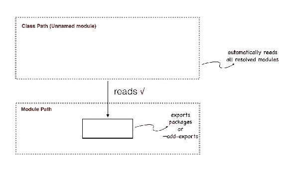

然而，我们在这里试图做的正好相反。我们希望**模块路径**中的模块能够访问**未命名模块**中的类型，这就是问题所在。结果是，没有任何其他模块可以读取**未命名模块**！

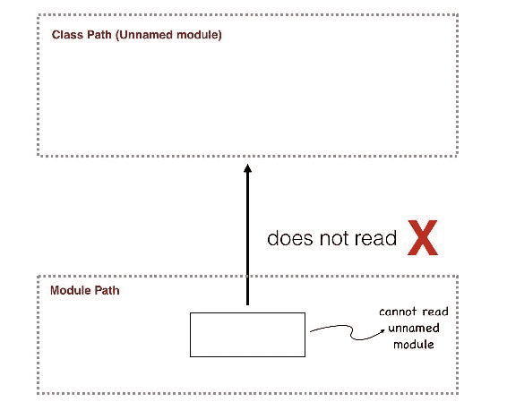

这是一个有意为之的限制。每个模块都需要满足强封装和可靠配置的要求。如果模块要读取类路径，我们基本上就会把可靠的配置抛出窗外！由于类路径没有可靠的配置，平台无法验证模块是否拥有它所需的一切。因此，防止显式 Java 9 模块访问类路径是一件好事™。

这确实会在迁移过程中引起重大问题。将代码从类路径移动到模块路径是在走一条单行道。一旦代码跨越到模块路径，它就无法访问类路径中的任何内容。这对你应用程序的代码来说并不是一个大问题。就像我们看到的，你可以将整个代码库放入一个巨大的命名模块中，就像我们在购物袋应用程序中做的那样。现在，你的所有代码都不在类路径中。太好了！然而，关于库怎么办？几乎每个 Java 应用程序都有第三方库和框架，这些库主要是从互联网上拉取的 JAR 文件，并捆绑到类路径中。由于我们无法控制或维护库代码，我们不能将它们的代码放入模块中并用模块描述符包装它们。因此，直到你的库的作者将它们的代码迁移到 Java 9，你将不得不使用非模块化的库。你的类型如何访问它们？你不得不等到你使用的最后一个库的代码迁移到 Java 9 之后才模块化你的代码吗？

幸运的是，情况并非如此。平台再次通过创建模块的能力来提供帮助。这些模块被称为**自动模块**。

# 自动模块

为了避免我们刚才讨论的第三方库依赖问题，Java 平台有一个机制可以自动从 JAR 文件创建模块。你不需要访问库代码或甚至创建模块描述符。你只需要 JAR 文件。这很好，因为对于任何第三方库，你确定会有的就是 JAR 文件！

好吧，将 JAR 文件转换为自动模块并将其放入应用程序中需要什么？答案是--什么也不需要！你只需要将任何 JAR 文件放入模块路径中。平台会自动将其转换为模块。以下是平台对模块路径中遇到的每个 JAR 文件所执行的操作：

+   它自动将 JAR 转换为模块并给它命名

+   它设置了模块定义--模块读取和导出的内容

由于它们现在是有名称的模块（尽管是自动创建的），你的代码可以像依赖和引用任何其他模块一样依赖和引用它们。

让我们详细检查前两个选项。

# 自动模块命名

给定一个 JAR 文件，平台是如何知道如何命名它的？例如，如果我把我们目前正在使用的 JAR 文件--`commons-collections4-4.1.jar`--放入模块路径中，从它创建的模块将叫什么名字？

自动模块的命名基于 JAR 文件名，但不包括 `.jar` 扩展名。例如，如果你的 JAR 文件名为 `foo.jar`，则自动模块的名称是 `foo`！但是，等等！关于无效字符怎么办？在 JAR 文件名中包含 `-` 字符是很常见的，但在模块名称中是不允许的。在这种情况下，`-` 字符会自动被 `.` 字符替换。所以，如果 JAR 文件名是 `my-lib.jar`，则自动模块的名称将是 `my.lib`。

虽然这种命名方式可行，但可能会很麻烦。这是因为大多数 JAR 文件（尤其是来自 Maven 或 Gradle 构建系统的 JAR 文件）通常在名称中包含版本号。这意味着每次你获取 JAR 文件的新版本时，模块的名称都会改变！为了避免这种情况，并使库模块名称保持一致，自动模块名称会从名称中删除版本号。

总结来说，给定一个 JAR 文件名，自动模块命名执行以下操作：

+   它删除了 `.jar` 文件扩展名

+   它将 `-` 字符替换为 `.` 字符

+   它删除了版本字符串

因此，JAR 文件 `commons-collections4-4.1.jar` 获得了自动模块名称-- `commons.collections4`。

这里还有一些其他示例：

| **JAR 文件名** | **自动模块名称** |
| --- | --- |
| `commons-lang-1.2.10.jar` | `commons.lang` |
| `spring-core-4.3.10.RELEASE.jar` | `spring.core` |
| `guice-4.1.0.jar` | `guice` |

# 自动模块定义

自动模块*需要*和*导出*什么？答案是——一切！记住，平台会自动创建模块描述符，所以它不知道模块需要什么或它将被用于什么。为了确保一切正常工作，它创建了最不限制的模块定义。

+   它`requires transitive`所有已解析的模块

+   它导出所有模块

+   它读取未命名的模块（即类路径中的所有代码）

我希望你们同意，这是你可以为模块创建的最糟糕的模块定义。然而，这是确保 Java 生态系统中的库作为自动模块无缝工作的必要条件。这不是理想的状态。我们希望迁移到一个所有库都模块化的环境中，并且我们使用具有在模块路径中定义良好的`requires`和`exports`定义的实际模块 JAR 文件。直到那时，自动模块帮助我们开始迁移。

注意，自动模块`requires transitive`解决了所有已解析的模块。你读得对！当你依赖于一个自动模块时，你会读取*所有*内容，无论你是否需要！请非常谨慎地使用你依赖的模块。仅仅因为你可以读取任何模块，并不意味着使用它是可以的。始终牢记模块定义。自动模块只是一个权宜之计。你不应该把从自动模块得到的可读性关系视为理所当然。记住，当自动模块消失时，传递的可读性关系也会随之消失。

# 使用自动模块进行迁移

带着对自动模块的了解，让我们继续迁移购物袋应用程序。我们需要将 commons collection JAR 从类路径中移除，并制作成自动模块。为此，我们不会移动 JAR 文件，而是只需提供带有 JAR 文件路径（`lib`文件夹）的`--module-path`参数，从而在模块路径中创建 JAR 文件。（与类路径不同，你不需要指定文件名。只需文件夹位置即可。）

这是编译器命令：

```java
$ javac --module-source-path src --module-path lib -d out $(find . -
  name '*.java')
```

我们现在将得到以下不同的错误：

```java
./src/packt.shoppingbag/com/packt/shoppingbag/app/App.java:3: error: package java.util.logging is not visible
import java.util.logging.Logger;
 ^
(package java.util.logging is declared in module java.logging, but module packt.shoppingbag does not read it)
./src/packt.shoppingbag/com/packt/shoppingbag/data/ShoppingBag.java:3: error: package org.apache.commons.collections4 is not visible
import org.apache.commons.collections4.Bag;
 ^
(package org.apache.commons.collections4 is declared in module commons.collections4, but module packt.shoppingbag does not read it)
./src/packt.shoppingbag/com/packt/shoppingbag/data/ShoppingBag.java:4: error: package org.apache.commons.collections4.bag is not visible
import org.apache.commons.collections4.bag.HashBag;
 ^
(package org.apache.commons.collections4.bag is declared in module commons.collections4, but module packt.shoppingbag does not read it)
3 errors
```

这个修复应该更明显一些。编译器抱怨`packt.shoppingbag`模块没有*要求*它使用的模块。它使用了日志 API（在模块`java.logging`中）和 Commons Collections API（来自现在创建的自动模块`commons.collections4`）。让我们在`module-info.java`中将它们都添加为依赖项。请注意，我们使用自动模块名称来建立读取关系，就像任何其他 Java 9 模块一样：

```java
    module packt.shoppingbag {
      requires java.logging;
      requires commons.collections4;
    }
```

在这个示例应用程序中，我们只使用了一个 JAR 文件。这远非一个现实场景。大多数现实世界应用程序都有多个 JAR 文件。因此，这一步将涉及将所有必要的 JAR 文件转换为自动模块，通过将它们添加到模块路径，然后在你的模块定义文件中添加正确的`requires`声明。

再次编译时，应该没有任何错误。为了执行，我们将使用之前使用的带有 `--module-path` 标志的相同 `java` 命令，但有一个小的变化。我们需要将 `lib` 文件夹添加到模块路径中，因为我们再次希望将 commons 集合 JAR 文件视为自动模块。

```java
$ java --module-path out:lib -m packt.shoppingbag/com.packt.shoppingbag.app.App
Aug 02, 2017 2:47:45 PM com.packt.shoppingbag.app.App main
INFO: Shopping Bag application: Started
Enter item (Type 'end' when done):
```

我们使用分隔符（macOS/Linux 上的 `:` 和 Windows 上的 `;`）来分隔两个模块路径——`out`，其中包含编译模块，和 `lib`，其中包含 JAR 文件。一切都应该按预期工作。

自动模块可能会引起的一个潜在问题是你需要注意的。还记得我们在第六章“模块解析、可读性和可访问性”中讨论的拆分包问题吗？在 Java 9 中，单个包不能存在于两个不同的模块中。然而，一个包可以存在于两个不同的 JAR 文件中。现在，当你将两个共享包的 JAR 文件作为自动模块使用时会发生什么？它们将无法工作，因为它们会导致拆分包问题。如果你在自己的任何库中遇到这个问题，很遗憾，你几乎无能为力。你可能不得不将东西移回类路径，或者联系库的开发者让他们修复代码。或者两者都要做！

# 使用 `jdeps` 概述模块关系

我们使用 `jdeps` 来识别内部 JDK API 的使用情况。这个工具的功能远不止于此！在将代码迁移到 Java 9 时，一个非常有用的功能是 `-summary` 选项。这个选项会遍历你的编译模块，并识别不同模块之间的关系。这确保了你在模块中指定的 `requires` 关系是正确的，包括自动模块。

在 `11-migrating-application/02-migrating-to-one-module` 文件夹中运行以下 `jdeps` 命令：

```java
$ jdeps -cp lib/commons-collections4-4.1.jar -recursive -summary out
commons-collections4-4.1.jar -> java.base
out -> lib/commons-collections4-4.1.jar
out -> java.base
out -> java.logging
```

`-recursive` 标志指示 `jdeps` 递归地遍历子文件夹，并列出其中找到的模块的依赖关系。

注意，你会得到一个非常有用的输出列表，列出哪些模块读取了哪些内容。当你有一堆在 Java 8 或更早版本编译的 JAR 依赖项，并且你试图将它们作为自动模块添加时，这非常有用；你不必猜测需要读取这些自动模块的模块，只需运行这个命令就可以得到一个很好的概述。

# 将代码重构为更小的模块

现在你已经将代码库放在模块源路径中，下一步就是逐步将其分解为更小的模块。这项工作取决于你的代码库的大小以及你一次想要处理多少。你可以选择保持单个模块不变，只为任何你编写的新代码创建模块。因此，遗留代码不会从模块化概念中受益，但任何新代码都会。然而，强烈建议在此处执行以下两个步骤：

1.  为您的库找到模块化版本或等效版本，并将 JAR 文件移出模块路径。

1.  将模块分解成更小的模块。

**步骤 1** 移除自动模块提供的广泛传递依赖项，这样您就可以对依赖项有更精细的控制。这取决于您使用的库以及作者是否已经将它们迁移到 Java 9。一旦库更新到 Java 9，更新的版本仍然可以放置在模块路径中，但这次，由于它们将有一个适当的模块描述符，平台将不需要将它们转换为自动模块。您可能需要检查那些库中 Java 9 模块的新名称是否与您之前使用的自动模块名称不同，如果是，请更新您的模块描述符以使用新的库模块名称。

**步骤 2** 确保遗留代码也能获得强封装和可靠配置的好处。由于与步骤 1 不同，我们可以控制步骤 2，所以让我们为购物袋应用程序做这件事。

假设我们希望将代码分解成以下三个模块：

+   用户输入模块

+   包模块

+   应用程序模块

我知道这对这个小型应用程序来说有点过度，但是它作为一个例子，说明了迁移的下一步。

`11-migrating-application/03-splitting-modules` 文件夹包含将代码分解成多个模块后的应用程序状态。注意每个模块的模块描述符缩小了依赖范围，使得代码的哪些部分需要那些外部 API 变得清晰。`java.logging` 仅由 `packt.app` 模块需要。`commons collection` 由 `packt.bag` 需要。

# 处理更大的代码库

我们模块化的示例应用程序非常简单，并不代表大多数现实世界应用程序。以下是一些大多数应用程序不同的特性：

+   它们有一个更广泛的代码库，跨越多个项目。这些项目可能位于不同的源位置，并且可能连接到构建系统。主应用程序的构建随后将正确的依赖项收集在一起，以形成最终的应用程序构建。

+   它们有更多的框架依赖项，这些依赖项有更复杂的需求。例如，Spring 或 Hibernate 框架需要访问您的应用程序代码以进行反射。它们可能会扫描您的类以查找注解，并执行各种操作，如依赖注入和对象关系映射。从这个意义上说，不仅您的应用程序代码需要访问库作为自动模块，甚至这样的自动模块也需要访问您的应用程序代码。

考虑到这样一个庞大的 Java 8 代码库，您甚至如何开始迁移？以下是一些您通常会遵循的步骤：

**步骤 1**：绘制模块边界并创建高级模块图：

在我看来，模块化现有代码首先需要至少有一个大致的高级想法，即你需要哪些模块以及你计划如何拆分代码库。我们查看了一些策略和技巧，以帮助你确定第九章，*模块设计模式和策略*中的模块边界。根据你代码的复杂性，你可能需要查看整个代码或高级部分，并想出一些模块名称和接口。

一旦你对你的模块有一个大致的想法，你可以创建一个表示这些模块之间依赖关系的模块图。不要过于纠结于细节。这只是一个粗略的草图，当你开始深入细节并进行重构时，你可能倾向于对模块或它们之间的关系进行修改。

**步骤 2**：模块化*主要*应用程序：

在一个大型应用程序所包含的所有代码项目中，通常有一个可以归类为*主要*项目。这可能是一个启动执行的项目，或者是一个构建并部署为应用程序的项目。那将是一个好的开始地方。你可以遵循本章学到的步骤，首先将那个应用程序带到模块路径上。

**步骤 3**：使用模块覆盖来满足特殊库需求：

如果你使用 Spring 或 Hibernate 等框架，当你将它们用作自动模块时，你肯定会遇到问题。这是因为那些框架通常需要访问你的代码库以反射性地扫描你的类中的注解。我们知道自动模块读取所有解析的模块。所以，技术上它读取了可能包含 Spring 注解的应用程序模块。然而，如果你的模块没有*导出*包，它仍然无法访问它们。你可以通过几种方式解决这个问题：

+   在你的模块定义中将包含此类注释的包添加`opens`声明，以便库能够访问必要的类进行反射

+   使用`--add-opens`命令行参数来达到相同的结果

**步骤 4**：利用自动模块为内部构建工件：

没有理由你不应该为你的应用程序 JAR 使用自动模块。假设你正在迁移一个大型 Maven 应用程序，它依赖于其他内部构建的项目（或你拥有的代码）的多个工件依赖项。这些内部工件可以被添加到模块路径并转换为自动模块。这里需要注意的一点是拆分包问题。由于我们处理的是内部代码，因此 JAR 之间存在包重叠的可能性很大。在这种情况下，你需要重构你的代码以确保 JAR 文件中没有重叠的包。你可以在使用较旧版本的 Java 的同时进行此重构。

**步骤 5a**：将*主要*项目分解成更小的模块：

再次强调，按照本章中使用的流程，开始将单体模块分解成更小的部分。在分解过程中，明确较小的模块之间的依赖关系。

**步骤 5b**：从叶子向上迁移模块：

与**步骤 5a**并行，你也可以开始迁移除主项目之外的其他项目。由于你已经构建了模块树，模块迁移的顺序变得清晰。你可以通过从模块依赖树的叶子开始，逐步向上迁移，使迁移过程显著简化。理想的迁移候选者是一个没有其他应用程序模块依赖的模块。对 Java 模块的依赖是可以接受的，尽管如此！

例如，假设这是你计划在迁移后实现的代码的目标模块图。该图仅包括你的应用程序模块。任何对平台模块的依赖都被排除在这个图中：

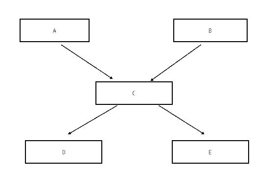

你应该首先选择迁移的模块集是**D**和**E**。一旦完成，迁移**C**，然后是**A**和**B**。

# 迁移库

我们已经探讨了在将应用程序迁移到 Java 模块时需要遵循的步骤和策略。那么库呢？假设你是被许多人使用的开源库的维护者。或者，也许你维护的库被你组织中的多个团队使用。你将如何迁移这样的代码库？这不会要求你遵循我们为迁移应用程序所涵盖的相同步骤吗？嗯，大部分是的。然而，有一些事情你需要对库进行不同的处理。本节将涵盖这些细节。

与库相比，最大的不同可能在于你不再在应用程序的**上下文**中工作。一个库可以被多个应用程序使用。这些应用程序可能使用多个版本的 Java。你如何创建一个可以适用于所有这些情况的单一库 JAR 文件呢？幸运的是，平台中有些功能可以简化这个过程。

在我们深入研究这些具体问题之前，让我们看看将库代码迁移到使用 Java 9 模块需要什么。以下是一些作为库作者你需要遵循的高级步骤：

1.  **消除 JDK 内部 API 的使用**：这与我们为应用程序所做的工作没有不同。我们需要确保库是一个好的 Java 9 公民。对 JDK 内部或已弃用的 API 的调用是不允许的。重构你的代码以避免调用，或者使用我们的友好工具 `jdeps` 的 `--jdk-internals` 选项建议的替代方案。

1.  **消除任何分割的包**：我们已经探讨了分割包如何导致自动模块出现问题。你需要确保你的 JAR 文件不包含可能存在于你组织中的其他 JAR 文件中的包。如果其他团队拥有的库的包与你的冲突，你需要与他们合作，简化包名。

1.  **为你的核心库模块命名**：与任何模块一样，你需要为库起一个名字。当与仅在你组织内部使用的库一起工作时，这并不是什么大问题。然而，当处理开源模块时，这是一个非常重要的步骤。正如我们在第二章“创建你的第一个 Java 模块”中提到的，模块名称可以遵循反向域名约定。你可以选择为仅限内部使用的库使用更短的名字，以简化可读性和沟通，因为在这些情况下名称冲突的可能性较小。

1.  **开始重构并将你的代码转换为模块**：这包括将你的代码移动到模块根目录，添加模块描述符，并定义模块的`requires`和`exports`定义。注意任何你封装的类型。如果有使用这些类型的库消费者，他们将无法再使用它们，除非他们添加`--add-exports`覆盖。

就像应用程序迁移一样，我强烈建议你在深入代码和移动文件之前，对你的库代码进行一次调查，并制定一个高级模块图，概述模块之间的关系。这将为你节省大量的时间和工作！

1.  **添加传递依赖或处理依赖泄漏**：有可能你的库代码依赖于其他库。它们可能是其他内部库或开源 JAR 文件。这些库可能尚未迁移到 Java 9，我们面临与应用程序依赖相同的问题。在这里，你同样需要为你的库所依赖的 JAR 文件使用自动模块。如果你使用你的 API 需要访问这些库，那么在你的模块定义中添加对这些库的 require transitive 是一个好主意。如果可能的话，将这些类型包装起来，这样使用你的库的代码就不需要知道这个依赖了。

# 预留库名称

假设你是一个尚未准备好将代码迁移到 Java 9 的库开发者。我们知道那不是问题。其他 Java 9 应用程序仍然可以通过将 JAR 文件放入模块路径中来消费你的库，从而将其自动转换为模块。他们使用从 JAR 文件名自动生成的模块名称，并在他们的模块定义文件中使用它。然而，如果你有一个计划在最终迁移到 Java 9 时使用的非常酷的模块名称，这意味着所有消费者都必须去更新所有指定自动生成名称的模块定义吗？那可能会很麻烦。

Java 9 平台为库作者提供了一个选项，在将库迁移到 Java 9 之前，为他们的库*预留*一个模块名称。因此，作为库作者，您可以在 JAR 文件中的`META-INF/MANIFEST.MF`文件中指定您希望 Java 9 模块名称是什么。您可以在 Java 8 编译的 JAR 文件中这样做。一旦这样做并将它捆绑到 JAR 文件中，当它被放入 Java 9 应用程序的模块路径中时，平台就会将其名称作为自动模块名称拾取。它实际上覆盖了从 JAR 文件名中自动命名的模块名称。

以下是您如何在 JAR 文件中指定首选的自动模块名称的方法。在 JAR 文件的根目录下的`META_INF`文件夹中创建一个名为`MANIFEST.MF`的文件。添加以下行以指定首选的自动模块名称：

```java
    Automatic-Module-Name: <my.preferred.module.name>
```

完成此操作后，JAR 文件将使用此名称，而不是平台将其转换为自动模块时从 JAR 文件名中获取的名称。并且所有消费者都必须通过使用此首选模块名称来在模块路径中引用您的 JAR 文件。因此，当您开始将模块迁移到 Java 9 时，您可以在模块描述符中使用首选名称，而您的库的消费者不需要更改他们的模块描述符。

# 使用 jdeps 创建模块描述符

一旦您开始将库 JAR 文件分解成模块，根据您库的大小，您可能有很多工作要做。确定您需要`require`哪些模块以及需要`export`哪些模块并不简单。`jdeps`工具还有另一个技巧。它可以查看您的 JAR 文件，并自动为您生成可使用的模块描述符。

语法如下：

```java
$ jdeps --generate-module-info <output-location> <path-to-jars>
```

让我们以 commons-collections JAR 文件为例：

```java
$ jdeps --generate-module-info out lib/commons-collections4-4.1.jar
```

输出应该看起来像这样：

```java
writing to out/commons.collections4/module-info.java
```

如您所见，`jdeps`已生成一个具有与我们之前看到的相同自动命名算法的模块根文件夹。在该文件夹内，它创建了一个`module-info.java`文件，并用通过扫描 JAR 文件中的类所识别的`requires`和`exports`声明填充了该文件：

```java
    module commons.collections4 {
      requires transitive java.xml;
      exports org.apache.commons.collections4;
      ...
    }
```

您可以运行此命令并指向多个 JAR 文件，它将为每个 JAR 文件执行此操作，这也有利于 JAR 文件之间的任何关系。为这些相关模块生成的`module-info.java`文件也将包括这些关系！

记住，将此功能仅作为定义你的模块定义的起点。显然，平台不能仅通过查看代码就猜测出你的库的完美模块定义。作为库的作者，你的任务是确定它需要什么，它封装或导出什么。这里也存在一个技术限制。`jdeps` 进行静态代码分析，因此它将无法捕获库可能执行的任何运行时反射访问。如果你的库使用了反射，你需要手动将 `exports` 或 `opens` 声明添加到正确的模块中。

# 为多个 Java 版本构建库

在迁移应用程序时，我们必须处理这样一个场景：依赖库可能并非全部都迁移到 Java 9。在处理库时，你将需要解决相反的问题。使用你的库的应用程序可能并非全部都是 Java 9。你将不得不支持 Java 8（或者在某些情况下甚至更旧的 Java 版本）。作为库的作者，你该如何为所有这些版本创建库分发？在 Java 9 之前，你通常有两个选择：

+   你可以为每个 Java 版本创建单独的 JAR

+   在你的库代码中，你可以使用反射来进行 *特性检查*。例如，你可以反射地访问在 Java 8 中引入的平台 API。如果它工作正常，你就在 Java 8 中。如果不工作，就降级到 Java 7，依此类推。

这两个选项都很繁琐。Java 9 提供了一个新的替代方案，其特性称为 *多版本 JAR*。这个概念很简单。你创建一个特殊的 JAR 文件，称为 *多版本 JAR*，其中包含你针对的所有 Java 版本的类。

这就是这样工作的。多版本 JAR 有一个特殊的结构，其中包含其内部的类：

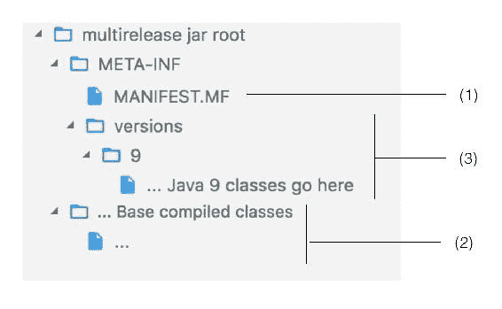

在多版本 JAR 文件中，你可以找到以下对应于图中编号的内容：

1.  有一个根 `META-INF` 文件夹，其中包含一个 `MANIFEST.MF` 文件，该文件包含以下行：

`Multi-Release: true`

这告诉平台这是一个多版本 JAR，因此需要以不同的方式处理

1.  JAR 根目录也包含编译后的类的默认版本，就像任何其他 JAR 一样。记住，这个 JAR 针对多个 Java 版本，并且可能包含同一类的多个目标版本。根目录中的类是 *默认* 的基础版本，可能适用于多个 Java 版本

1.  在 `META-INF` 中有一个名为 `versions` 的文件夹。为了针对多个运行时，JAR 将类打包到这里的子文件夹中。每个要针对的 Java 版本都有一个文件夹。这样的每个文件夹都包含专门为该发布版本编译的类。因此，如果 JAR 在该版本的 Java 平台上使用，版本文件夹中的类将覆盖 `multirelease` 文件夹中的类，并取而代之。如果 JAR 在没有 `META-INF` 文件夹的平台版本上使用，或者所需的类不存在于版本文件夹中，则运行时会回退到 `multirelease` 文件夹的内容。

注意，类的默认版本位于 JAR 文件的根位置。这就是为什么您也可以使用旧版本的 Java 来使用这个 JAR 文件。对于旧版本的 Java，多版本 JAR 文件看起来就像一个普通的 JAR 文件——平台只查看根位置，而版本文件夹被忽略！

让我们尝试创建一个简单的多版本 JAR。`11-migrating-application/04-multirelease-jars` 文件夹中包含一个非常简单的库。它被称为 `mylib`，并且有一个方法可以打印传递给它的列表内容。

我们希望为这个库创建一个针对两个不同 Java 版本的多版本 JAR：

+   库的基本版本针对所有 Java 9 之前的版本。它包含执行 `for` 循环并按如下方式打印列表内容的代码：

```java
        public class PrintList { 
          public void print(List<?> list) { 
            for (int i = 0; i < list.size(); i++) { 
              System.out.println(list.get(i)); 
            } 
          } 
        } 
```

+   这个库针对 Java 9 的特定版本有两个更改——它通过 `module-info.java` 声明自己为 Java 9 模块，并使用 `forEach` 和函数引用来打印列表内容，如下所示：

```java
        public class PrintList { 
          public void print(List<?> list) { 
            list.forEach(System.out::println); 
          } 
        } 
```

库的两个版本分别位于两个不同的文件夹中。由于将有两个相同类的不同版本，因此这样分离它们是有帮助的。

这是代码的结构：

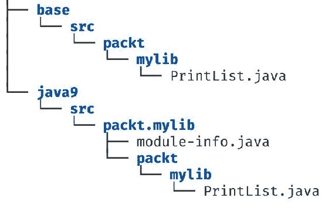

制作多版本 JAR 的第一步是添加声明它的 `MANIFEST.MF` 文件。将此文件添加到项目的根目录，如下所示，确保您完全匹配该语句，不要有任何额外的空格：

```java
    Multi-Release: true
```

现在，我们将创建包含编译类的文件夹。我们将创建一个名为 `out` 的文件夹，并有两个子文件夹——`base` 用于基本类，`9` 用于 Java 9 版本，如下所示：

```java
$ mkdir out
$ mkdir out/base
$ mkdir out/9
```

接下来，我们将通过设置正确的发布版本来将这些类编译到这两个文件夹中。`javac` 命令的 `--release` 参数允许您为目标编译的类指定特定的 Java 版本：

```java
$ javac --release 7 -d out/base base/src/packt/mylib/PrintList.java
```

之前的命令使用目标发布版本 7 编译了 `PrintList.java` 类，并将编译输出放置在 `out/base` 目录中。

注意，您不需要在机器上安装多个版本的 Java 来实现这一点。Java 9 有能力自行生成针对不同 Java 版本的类！这类似于 Java 平台早期版本中可用的 `-target` 标志。

接下来，我们将按照以下方式编译 Java 9 版本：

```java
$ javac --release 9 -d out/9 java9/src/packt.mylib/module-info.java java9/src/packt.mylib/packt/mylib/PrintList.java
```

这次有两个 Java 文件--`PrintList.java` 和 `module-info.java`。编译后的类将放入 `out/9` 目录。

现在我们有了编译后的类，是时候创建一个多版本 JAR 了。让我们首先创建一个包含基础版本类的 JAR 文件。我们还提供了要包含在 JAR 中的 `MANIFEST.MF` 文件：

```java
$ jar -cf mylib.jar MANIFEST.MF -C out/base .
```

`-c` 选项告诉 `jar` 工具创建一个新的 JAR，`f` 选项用于指定 JAR 文件名（这里为 `mylib.jar`）。`-C` 选项更改工具正在查找的目录为 `out.base`，并允许它在那里编译类（如 "`.`" 所指定）。

这将创建 JAR 文件并将基础类添加到其中。接下来，让我们添加 Java 9 类：

```java
$ jar -uf mylib.jar --release 9 -C out/9 .
```

`-u` 选项告诉 `jar` 工具更新 JAR 而不是创建一个新的。这次我们针对的是版本 9，并将编译后的类包含在 `out/9` 目录中。

您不需要为每个版本添加 JAR 文件中的所有类。尽量将特定版本的类保持到最小。如果基础版本中有可被特定版本复用的通用类，您就无需在此包含它。平台将回退到基础文件夹以查找该特定版本的类。

这里是生成的 JAR 文件的内容。这是我们之前已经看到的结构：

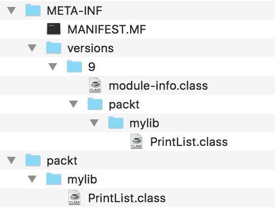

记住，多版本 JAR 功能是在 Java 9 中引入的。因此，您无法在 JAR 中为 Java 8 或更早的版本创建特定版本的替代品。这些平台将不知道从 `META-INF/versions` 文件夹中读取。它们只会使用 JAR 根目录中的编译类。然而，如果您需要创建仅适用于 Java 9 的类，这是一个很好的功能。由于这些类最终会出现在 `META-INF/versions` 文件夹中，较旧的平台将忽略它们。一旦发布了 Java 的未来版本，这个功能也可以用于那些版本。例如，您可以有一个针对 Java 10 平台的 `META-INF/versions/10` 文件夹。

# 摘要

在本章中，我们探讨了如何将 Java 9 之前的应用程序迁移到使用 Java 9 的模块化功能。您学习了如何规划整体迁移策略，以及这种迁移的理想最终目标是什么。您还了解了一个新功能，该功能允许您处理非模块化的依赖项和库--自动模块。我们探讨了自动模块的命名方式、它们的行为方式以及我们如何在迁移过程中使用它们。

然后，你学习了如何处理库迁移。我们讨论了在迁移库代码时需要考虑的一些因素，以及多版本 JAR 功能，它允许我们创建针对多个 Java 平台版本的单一 JAR 文件。

在下一章和最后一章中，我们将通过探讨 Java 开发者经常处理的两个重要方面来总结全文——构建工具和单元测试。我们将了解它们在模块化 Java 应用程序中的工作原理。
