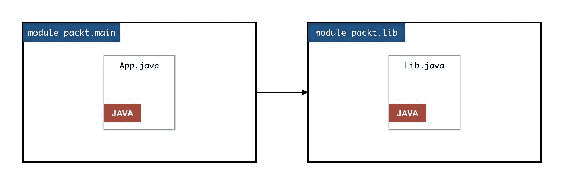

# 第十二章：使用构建工具和测试 Java 模块

在上一章中，我们探讨了将现有的 Java 代码库迁移到 Java 9 的几种策略和方法。在本章中，我们将通过探讨两个你很可能遇到的重要主题来结束我们的 Java 9 模块化之旅，无论你是迁移遗留代码库还是从头开始创建新的模块化应用程序。它们是构建工具集成和单元测试。

本章我们将涵盖以下内容：

+   将 Java 9 模块与 Maven 构建过程集成

+   与多模块 Java 9 Maven 项目一起工作

+   使用 JUnit 为 Java 9 模块编写单元测试用例

+   处理 Java 9 中的新访问问题和测试挑战

考虑到构建系统和单元测试是现代 Java 开发者工作流程中极其常见且重要的部分，我们在这本书的最后一章同时处理这两个主题可能看起来有些奇怪。这有一个很好的原因。理解和处理这些概念需要理解我们在前几章中讨论的许多主题。现在，你已经探索了诸如第九章中的开放模块、“模块设计模式和策略”以及第十一章中的自动模块“将您的代码迁移到 Java 9”等概念，你现在可以轻松地应对这一章节了！

# 与 Apache Maven 集成

在 Java 领域，有两个非常常用的构建系统是 Apache Maven 和 Gradle。当你在一个企业 Java 应用程序上工作时，你很可能必须处理这两个选项之一。到目前为止，我们在本书中一直使用命令行来获取编译器和运行时执行。然而，在复杂的项目中，这很少是合理的事情。那么，在 Java 9 模块化应用程序中使用这样的构建系统需要什么？

在撰写本文时，Maven 已经与 Java 9 有了可行的集成，而 Gradle 仍在积极开发中。因此，我们在这本书中只涵盖 Apache Maven 的集成。Java 工具生态系统赶上 Java 9 的模块化变化只是时间问题，因此随着时间的推移，看到更好的集成和使用这些工具与 Java 9 的整体体验不会令人惊讶。

让我们来看看你可以如何创建一个包含并构建 Java 9 模块化应用程序的 Maven 项目。

# Maven 快速回顾

本章假设你至少熟悉 Maven 的基本概念，但这里有一个快速回顾。Maven，在其他方面，是一个项目构建工具。它基于约定并提供了一种正式的结构来组织你的代码、命名你的工件以及在其他项目上建立依赖关系。这听起来可能与我们一直在使用的 Java 9 模块化非常相似，但实际上并不相同。与 Java 平台模块系统不同，Maven 关注的是构建（或组装）你的工件，而不是验证编译时间或运行时准确性。

当你创建一个 Maven 工件时，你给它分配**坐标**：组名、工件名和版本。你在这个名为`pom.xml`的文件中指定这些信息。此文件还允许你指定对其他 Maven 工件依赖项，以便在构建过程运行时，Maven 可以获取必要的依赖项并将它们提供给 Java 编译器或运行时。

# 使用 Maven 与 Java 9 模块

当你将 Java 9 模块引入场景时，你可以看到这里有两种并行的模块概念：Maven 关于在`pom.xml`中定义的工件的概念和 Java 平台关于在`module-info.java`中定义的模块的概念。然而，当你将这两个合并，并且每个 Maven 项目包含一个 Java 9 模块时，这两个概念出奇地好地协同工作。

考虑以下单个 Maven 项目的文件夹结构。代码位于`lib`文件夹中。这是一个典型的 Maven 项目。它有一个包含此工件 Maven 坐标的`pom.xml`描述符。然而，它还有一个位于`src/main/java`文件夹中的`module-info.java`文件，将其设置为 Java 9 模块！


采用这种方法，目的是为每个 Java 9 模块创建一个 Maven 工件。这意味着你需要想出两个不同的名称：

+   Maven 工件坐标——包括组名和工件名

+   Java 9 模块的名称

现在，当涉及到在两个这些模块之间建立依赖关系时，你需要在两个地方指定依赖项。比如说，例如，你拥有两个名为**A**和**B**的 Maven Java 9 项目。为了指定 A 依赖于 B，你需要执行以下操作：

+   在 A 的 Maven `pom.xml`文件中添加一个`<dependency>`标签，指定 B 的 Maven 坐标

+   在 A 的`module-info.java`文件中添加一个`requires`声明，指定 B 的模块名称

这种方法的优点是 Maven 负责获取必要的工件并将它们放置在模块路径中。然后，当编译器或运行时执行时，Java 平台模块系统就有了一切所需！请注意，如果你遗漏了这两个依赖配置中的任何一个，这就不起作用了。如果你忘记指定 Maven 依赖项，Maven 将不会获取工件并将其放置在模块路径中。如果你忘记在`module-info.java`中添加 requires 声明，即使 Maven 已经在模块路径中提供了它，你的代码也无法访问依赖项中的类型。

当你处理由多个模块组成的应用程序时，虽然这对一个或两个模块来说效果很好，但这也可能变得难以管理。在这种情况下，我们可以利用 Maven 的多模块项目功能来更好地组织多个 Maven + Java 9 模块。

# 在一个多模块 Java 9 Maven 项目中工作

让我们看看一个示例 Maven 多模块项目。假设我们想要构建两个 Java 模块：`packt.main`和`packt.lib`。`packt.lib`模块包含一个名为`Lib`的库类，它有一个名为`sampleMethod`的方法，而`packt.main`模块包含一个名为`App`的类，它有一个主方法调用`Lib`中的`sampleMethod`。因此，`packt.main`必须读取`packt.lib`，如下所示：



你已经了解到你应该有一个 Maven 项目对应于每个 Java 模块。然而，为了简化开发并利用 Maven 中多模块项目的概念，我们可以创建一个父根 Maven 工件。现在，我们应用程序的模块都可以是 Maven 子项目，如下所示：


代码位于`12-build-tools-and-testing/01-maven-integration`文件夹中。在根目录中有一个根 Maven 模块。这个模块充当父模块。这只是一个 Maven 容器，用于简化构建过程。我们实际上不需要为这个创建相应的 Java 模块。在根文件夹中是两个子 Maven 项目`main`和`lib`。

这里，它的根目录下的`pom.xml`（为了简洁而截断）：

```java
    <project  ...> 
     <modelVersion>4.0.0</modelVersion> 
     <groupId>com.packt</groupId> 
     <artifactId>root</artifactId> 
     <packaging>pom</packaging> 
     <version>1.0-SNAPSHOT</version> 
     <name>root</name> 

     <modules> 
       <module>main</module> 
       <module>lib</module> 
     </modules> 
     ... 
    </project> 
```

XML 中的 packaging 节点指定了 pom 值，表示这是一个父 pom。它有两个模块声明，表示它是两个 Maven 子模块的父模块。在这里使用术语模块时不要混淆。我们在这里谈论的是 Maven 模块，而不是 Java 9 模块。

在每个子模块中，主模块和 lib 模块，就像我们之前看到的那样。它们是标准的 Maven 项目，但在`src/main/java`位置有一个`module-info.java`文件，使它们成为 Java 9 模块。

下面的截图显示了完整的文件夹结构：


由于主项目使用 lib 项目中的一个类型，因此配置了 Maven 和 Java 依赖项。

这里是主项目的`pom.xml`文件，指定了依赖项：

```java
    <dependency> 
      <groupId>com.packt</groupId> 
      <artifactId>lib</artifactId> 
      <version>1.0-SNAPSHOT</version> 
    </dependency> 
```

下面是这个`module-info.java`文件：

```java
    module packt.main { 
      requires packt.lib; 
    }
```

# 构建多模块项目

在我们构建之前，请确保你的路径中安装了最新的 Maven 版本。运行以下命令应该会给出你机器上安装的 Maven 版本：

```java
$ mvn -v 
  Apache Maven 3.5.0 (ff8f5e7444045639af65f6095c62210b5713f426;
 2017-04-03T12:39:06-07:00) 
```

如果你没有看到这个输出，你需要从 [`maven.apache.org`](https://maven.apache.org/plugins/maven-compiler-plugin/) 下载 Apache Maven，并将下载的 `bin` 文件夹添加到你的操作系统的 `PATH` 变量中。

让我们尝试构建这个项目。在根项目的 `pom.xml` 中有包含项，使其准备好在 Java 9 上构建。以下是用于设置 Java 版本为 9 的 Maven 编译器插件：

```java
    <plugin> 
     <groupId>org.apache.maven.plugins</groupId> 
     <artifactId>maven-compiler-plugin</artifactId> 
     <version>3.6.2</version> 
     <configuration> 
       <release>9</release> 
     </configuration> 
    </plugin> 
```

使用这个方法，你应该能够运行 Maven 的构建命令，并让 Java 9 编译器编译我们的类。切换到 `12-build-tools-and-testing/01-maven-integration/root` 目录，并运行以下命令：

```java
$ mvn clean install 
```

下面的输出，为了可读性进行了截断，表明所有模块都已编译：

```java
[INFO] Reactor Summary: 
[INFO] 
[INFO] root ........................................ SUCCESS [  0.379 s] 
[INFO] lib ......................................... SUCCESS [  3.646 s] 
[INFO] main ........................................ SUCCESS [  0.195 s] 
[INFO] ----------------------------------------------------------------- 
[INFO] BUILD SUCCESS
```

# 执行多模块项目

为了将具有 `main` 方法的类作为 Maven 生命周期执行，我们使用 `exec-maven-plugin`。这也得益于根项目 `pom.xml` 文件中的配置。以下是指定此配置的列表：

```java
    <plugin> 
       <groupId>org.codehaus.mojo</groupId> 
       <artifactId>exec-maven-plugin</artifactId> 
       <version>1.6.0</version> 
       <executions> 
         <execution> 
            <goals> 
              <goal>exec</goal> 
            </goals> 
         </execution> 
       </executions> 
       <configuration> 
         <executable>${JAVA_HOME}/bin/java</executable> 
         <arguments> 
           <argument>--module-path</argument> 
           <modulepath/> 
           <argument>--module</argument> 
           <argument>packt.main/com.packt.App</argument> 
         </arguments> 
       </configuration> 
    </plugin> 
```

如同 Maven 配置的典型情况，这看起来有些冗长。然而，对我们来说，有趣的是配置部分。我们正在配置 `java` 命令，因此你在这里将可执行路径从 `$JAVA_HOME` 映射过来。我们还在传递我们现在应该非常熟悉的两个参数--表示编译模块位置的 `--module-path` 参数，以及表示包含主方法的模块和类的 `--module` 参数。

注意，对于 `--module-path` 参数，我们并没有手动指定路径。这是因为 Maven 在为我们编译模块，所以我们希望 Maven 本身提供给我们它放置编译类的路径。这是通过特殊的 `<modulepath />` 标签完成的。我们将在下一节中更详细地讨论 Maven 中的模块路径。

切换到 `12-build-tools-and-testing/01-maven-integration/root/main` 目录，并运行以下命令来调用 `exec` 插件：

```java
$ mvn exec:exec 
```

下面是截断后的输出：

```java
[INFO] Scanning for projects... 
[INFO] 
[INFO] ------------------------------------------------------------------------ 
[INFO] Building main 1.0-SNAPSHOT 
[INFO] ------------------------------------------------------------------------ 
[INFO] 
[INFO] --- exec-maven-plugin:1.6.0:exec (default-cli) @ main --- 
Library method called! 
... 
```

`Library method called!` 这一行是 `main` 方法调用库方法并将消息打印到控制台的输出。

# 理解 exec 插件的模块路径

虽然使用 Maven 这种方式有几个优点，但一个显著的优势是，在编译和构建步骤中管理目录变得非常容易。当我们手动运行`javac`时，我们总是必须手动指定所有编译后的类将放入的*输出*目录。当我们运行`java`时，我们必须确保模块路径包含类的输出位置，以及任何依赖的模块和库。Maven 为我们承担了这项工作。多亏了我们添加到`exec-maven-plugin`模块路径参数中的`<modulepath/>`行，Maven 自动为我们构建模块路径。以下是 Maven 添加到模块路径中的内容：

+   它自动包括项目的构建位置。我们在`main`项目上运行了插件。Maven 确保`main`编译后的类在模块路径中可用。

+   它自动确保依赖项也在模块路径中。在`main`项目的`pom.xml`中，我们指定了一个对`lib`的依赖。Maven 承认这个依赖，并自动将编译后的`lib`模块包含到模块路径中！

+   它自动包括那些不是 Java 9 模块的依赖项！假设你的`pom.xml`文件指定了一个依赖于尚未迁移到 Java 9 的第三方库。Maven 会自动将这些 jar 文件添加到模块路径中。猜猜当你将一个 Java 9 之前的 JAR 文件添加到模块路径中会发生什么？它们变成了自动模块！你的模块可以使用`requires`语法来依赖它们，就像任何 Java 9 模块一样。因此，当处理依赖项时，无论是 Java 9 还是更早的版本，你的工作流程都变得极其简单和一致。

# 使用 Java 9 进行单元测试模块

当在 Java 9 中进行测试时，可读性和可访问性约束带来了新的和有趣的问题。让我们回顾一下我们一直使用的 Java 单元测试代码的方式。以下是两种常见的做法：

+   单元测试代码通常位于一个单独的源文件夹中，该文件夹被添加到类路径中。这是为了将测试代码与实际的应用程序代码分开，同时也便于在构建部署应用程序时排除测试文件夹。

+   单元测试类通常与被测试的类共享相同的包。这是为了确保测试类可以访问被测试类的包私有成员，即使它们位于完全不同的位置。

当类在类路径中时，这两个设计决策效果很好，因为我们知道类路径中类的物理位置并不重要。然而，所有这些在 Java 9 中都在改变！以下是这样做的方法：

+   在 Java 9 中，测试代码可能会因为强封装而面临访问限制。您正在测试的 Java 9 类位于一个模块中。因此，要从测试类中访问模块中的所有类型，唯一的方法是将测试类也放在同一个模块中！这并不是一个好的选择，因为当您构建和分发 Java 模块时，整个内容都会随之而来。另一个选择是将测试类放在模块外部，并且只测试那些*导出*的类。

+   如果您将测试放在单独的文件夹和单独的模块中，您的测试类就不能与被测试类共享相同的包。这会导致拆分包问题，因为相同的包存在于应用程序模块和测试模块中。因此，您无法访问和测试包私有成员。

考虑到这些挑战，一种绕过它们的方法如下：

+   为每个需要测试的模块创建一个单独的测试模块。

+   编写测试用例以测试导出模块接口。

+   如果您需要为模块未导出的任何内部类型编写测试，请在测试执行期间使用`--add-exports`覆盖。是的，`--add-exports`对于应用程序代码来说不是一个好主意，但它是一个合理的测试解决方案。

# 测试 Java 9 模块

让我们通过测试示例地址簿查看器应用程序中的`packt.sortutil`来检查这是如何工作的。代码位于`12-build-tools-and-testing/02-testing`位置。`src`文件夹包含`packt.sortutil`模块--即测试的模块。

要进行测试，我们可以创建一个新的测试模块：`packt.sortutil.test`。遵循的一个好惯例是将测试模块命名为要测试的模块名称后跟`.test`。以下是`packt.sortutil.test`的模块定义：

```java
    module packt.sortutil.test { 
      requires packt.sortutil; 
    } 
```

通过声明对模块的依赖，您可以访问其导出类型并通过代码进行测试。以下是测试模块中的一个示例类，它验证输出是否准确：

```java
    package packt.util.test; 
    public class SortUtilTestMain { 
      public static void main(String[] args) { 
        SortUtil sortUtil = new SortUtil(); 
        List out = sortUtil.sortList(Arrays.asList("b", "a", "c")); 
        assert out.size() == 3; 
        assert "a".equals(out.get(0)); 
        assert "b".equals(out.get(1)); 
        assert "c".equals(out.get(2)); 
      } 
    } 
```

使用断言启用（`-ea`参数）编译和运行代码告诉我们测试已经通过：

```java
$ javac -d out --module-source-path src --module 
  packt.sortutil,packt.sortutil.test 
$ java -ea --module-path out:lib --module 
  packt.sortutil.test/packt.util.test.SortUtilTestMain 
```

您不应该看到任何输出，这表明所有断言都已成功通过。

# 与 JUnit 集成

虽然使用带有 main 方法的类进行单元测试可以完成任务，但我们还可以做得更好。您通常使用 JUnit 这样的框架在 Java 中编写测试。JUnit 是一个完整的测试框架，它提供了方便的生命周期钩子和注释，您可以使用它们轻松地编写测试。让我们看看如何将我们的测试模块转换为使用 JUnit。

这里是步骤：

1.  获取 JUnit JAR 文件。您可以从 JUnit 网站 ([`junit.org/junit4/`](http://junit.org/junit4/)) 下载，或者从 Maven Central 下载。它还依赖于 hamcrest core JAR 文件，所以也要下载它。将 JAR 文件放在 `lib` 文件夹中。我们打算将此位置添加到模块路径中。下载的 JAR 文件位于 `lib` 文件夹的 `12-build-tools-and-testing/02-testing/src/packt.sortutil.test`。

1.  在您的测试代码中使用 JUnit 注解。以下是将 `SortUtilTest` 编写为 JUnit 测试的新代码：

```java
        public class SortUtilTest { 
          private SortUtil sortUtil; 
          @Before public void setUp() { 
            sortUtil = new SortUtil(); 
          } 
          @Test     
          public void testReturnsSameSize() { 
            List out = sortUtil.sortList(Arrays.asList("b", "a", "c")); 
            SortUtil sortUtil = new SortUtil(); 
            assert out.size() == 3; 
          } 
          @Test   
          public void sortsList() { 
            List out = sortUtil.sortList(Arrays.asList("b", "a", "c")); 
            assert "a".equals(out.get(0)); 
            assert "b".equals(out.get(1)); 
            assert "c".equals(out.get(2)); 
          } 
        } 
```

1.  指定测试模块依赖于 JUnit 库。由于 JUnit JAR 将被添加到类路径中，它将被视为一个自动模块。因此，为了建立依赖关系，您需要从 JAR 文件名中找出自动模块的名称。下载的 JAR 文件名为 `junit-4.12.jar`。去掉 `.jar` 扩展名和版本号，我们得到自动模块--`name - junit`。

1.  将测试模块声明为 `open`。JUnit 的工作方式是通过扫描您类上的注解来确定要做什么。因此，它需要访问您测试模块中的测试类。您可以选择导出必要的包或将它们声明为 open。我更喜欢后者，因为我们只需要启用对 JUnit 的反射访问。

这是 `packt.sortutil.test` 模块的更新模块定义：

```java
          open module packt.sortutil.test { 
            requires packt.sortutil; 
            requires junit; 
          } 
```

让我们编译并运行测试以查看行为：

```java
$ javac -d out --module-source-path src --module-path lib --module 
  packt.sortutil,packt.sortutil.test 
```

这次唯一的更改是将 lib 目录添加为模块路径。这使得 Java 平台将 JUnit JAR 视为一个自动模块，这正是我们所需要的。这应该会成功，没有任何错误。

如果我们现在运行它会发生什么？我们正在运行 JUnit 测试运行器类，所以我们需要在核心 JUnit 运行器类 `JUnitCore`（在自动模块 `junit` 中）中将它指定为 `--module` 参数的值给 Java。接下来是正在测试的类的完全限定名--`SortUtilTest`。以下是命令的样子：

```java
$ java --module-path out:lib --module junit/org.junit.runner.JUnitCore
 packt.util.test.SortUtilTest 
```

这会工作吗？不会！以下是您应该看到的错误：

```java
JUnit version 4.12.E 
Time: 0.001 
There was 1 failure: 
1) initializationError(org.junit.runner.JUnitCommandLineParseResult) 
java.lang.IllegalArgumentException: Could not find class [packt.util.test.SortUtilTest] 
```

结果发现 Java 无法找到 `SortUtilTest` 类。为什么？编译后的模块位于我们传递给 `--module-path` 选项的 out 目录中！它没有看到这个类是有原因的。

回想一下第八章中关于模块解析的讨论，理解链接和使用 jlink。模块解析是从起点——你在`--module`参数中指定的模块——开始的依赖模块的遍历。由于这里的起点是 JUnit 自动模块，模块解析过程永远不会解析应用程序或测试模块。这是因为 JUnit 自动模块不会读取我们的模块！要解决这个问题并让运行时看到我们的模块，可以使用`--add-modules`选项。使用此选项传递我们的测试模块应该会导致执行成功完成：

```java
$ java --module-path out:lib --add-modules packt.sortutil.test --module junit/org.junit.runner.JUnitCore packt.util.test.SortUtilTest 
JUnit version 4.12 
.. 
Time: 0.005 

OK (2 tests) 
```

注意，我们不需要将`packt.sortutil`模块添加到`--add-modules`选项中。只需测试模块就足够了。这是因为测试模块通过 requires 声明明确依赖于`packt.sortutil`，因此模块解析过程现在会自动获取它！

# 总结

有了这些，我们就一起结束了对 Java 9 模块化的探索。你现在对 Java 9 模块化有了很好的理解，更重要的是，你了解了如何在代码中使用这个特性和相关概念。这无疑是 Java 语言的一个令人兴奋的新增功能，作为开发者，我们既有能力也有责任明智且有效地使用这些功能。

虽然这本书的内容到此结束，但我希望你能感到兴奋，并且已经准备好继续你的旅程，深入了解并构建令人惊叹的 Java 模块化应用程序。

# 摘要

在本章中，我们讨论了 Java 编程的两个重要方面，这在大多数现实世界的 Java 应用程序中都发挥着重要作用——构建系统和测试。我们探讨了如何使用 Maven 来构建我们的项目，并将 Maven 的多模块项目概念与 Java 9 模块化应用程序对齐。我们检查了这样的应用程序看起来像什么，并学习了如何通过 Maven 的生命周期过程编译和执行应用程序。然后我们学习了如何将测试集成到 Java 模块化应用程序中。我们探讨了由于 Java 模块化引入到语言中的一些约束导致的测试挑战，以及如何绕过它们。然后我们创建了一个 JUnit 测试用例，并利用 JUnit 框架执行模块测试用例。
