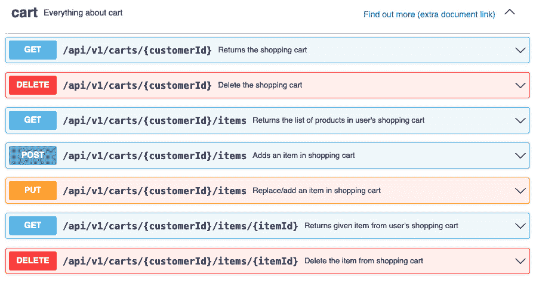
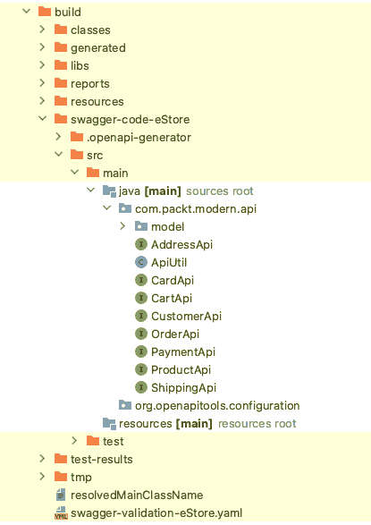

# 3

# API 规范和实现

在前面的章节中，我们学习了 REST API 的设计方面以及开发 RESTful Web 服务所需的 Spring 基础知识。在本章中，您将利用这两个领域来实现 REST API。

我们选择了先设计后实现的方法来使我们的开发过程对非技术利益相关者来说也是可理解的。为了使这种方法成为可能，我们将使用**OpenAPI 规范**（**OAS**）首先设计一个 API，然后实现它。我们还将学习如何处理在处理请求时发生的错误。在本章中，我们将使用设计并实现一个示例电子商务应用程序 API 的例子。

到本章结束时，您应该能够设计 API 规范并使用 OpenAPI 代码生成器生成模型和 API Java 接口的代码。您还将了解如何编写伪 Spring 控制器以实现 API Java 接口和 Web 服务的全局异常处理器。

我们将在本章中涵盖以下主题：

+   使用 OAS 设计 API

+   理解 OAS 的基本结构

+   将 OAS 转换为 Spring 代码

+   实现 OAS 代码接口

+   添加全局异常处理器

+   测试控制器的实现

# 技术要求

您需要以下内容来执行本章和以下章节中的说明：

+   任何 Java IDE，例如 NetBeans、IntelliJ 或 Eclipse

+   **Java 开发工具包**（**JDK**）17

+   互联网连接以下载依赖项和 Gradle

您可以在 GitHub 上找到本章的代码文件，网址为[`github.com/PacktPublishing/Modern-API-Development-with-Spring-6-and-Spring-Boot-3/tree/main/Chapter03`](https://github.com/PacktPublishing/Modern-API-Development-with-Spring-6-and-Spring-Boot-3/tree/main/Chapter03)。

# 使用 OAS 设计 API

您可以直接开始编写 API 的代码；然而，这种方法会导致许多问题，例如频繁的修改、API 管理的困难以及由非技术领域团队主导的审查困难。因此，您应该使用**先设计后实现的方法**。

第一个出现在脑海中的问题是，我们如何设计 REST API？您在*第一章*，*RESTful Web 服务基础*中了解到，目前没有现成的标准来规范 REST API 的实现。OAS 被引入来解决至少 REST API 规范和描述的方面。它允许您使用**YAML Ain’t Markup Language**（**YAML**）或**JavaScript Object Notation**（**JSON**）标记语言编写 REST API。

我们将使用 OAS 的 3.0 版本 ([`github.com/OAI/OpenAPI-Specification/blob/main/versions/3.0.3.md`](https://github.com/OAI/OpenAPI-Specification/blob/main/versions/3.0.3.md)) 来实现电子商务应用的 REST API。我们将使用 YAML（发音为 *yamel*，与 *camel* 同韵），它更简洁，更容易阅读。YAML 也是空格敏感的。它使用空格进行缩进；例如，它表示 `key: value` 对（注意冒号后面的空格——`:`）。您可以在 [`yaml.org/spec/`](https://yaml.org/spec/) 上了解更多关于 YAML 的信息。

OAS 之前被称为 *Swagger 规范*。今天，OAS 支持的工具仍然被称为 **Swagger 工具**。Swagger 工具是开源项目，有助于 REST API 的整体开发周期。在本章中，我们将使用以下 Swagger 工具：

+   **Swagger Editor** ([`editor.swagger.io/`](https://editor.swagger.io/))：这个工具用于设计和描述电子商务应用的 REST API。它允许您同时编写和预览您的 REST API 的设计和描述。请确保您使用 OAS 3.0。其测试版可在 [`editor-next.swagger.io/`](https://editor-next.swagger.io/) 获取。

+   **Swagger Codegen** ([`github.com/swagger-api/swagger-codegen`](https://github.com/swagger-api/swagger-codegen))：这个工具用于生成基于 Spring 的 API 模型和 Java 接口。您将使用 Gradle 插件 ([`github.com/int128/gradle-swagger-generator-plugin`](https://github.com/int128/gradle-swagger-generator-plugin)) 来生成在 Swagger Codegen 之上工作的代码。还有一个 OpenAPI 工具 Gradle 插件——OpenAPI Generator ([`github.com/OpenAPITools/openapi-generator/tree/master/modules/openapi-generator-gradle-plugin`](https://github.com/OpenAPITools/openapi-generator/tree/master/modules/openapi-generator-gradle-plugin))。然而，由于编写时存在 3.2k 个开放问题（Java/Spring 也有多个），我们将选择前者。

+   **Swagger UI** ([`swagger.io/swagger-ui/`](https://swagger.io/swagger-ui/))：这个工具用于生成 REST API 文档。我们将使用相同的 Gradle 插件来生成 API 文档。

现在您已经了解了如何使用 OAS 支持的工具以设计优先的方法来开发 API，让我们了解 OAS 的基本结构。

# 理解 OAS 的基本结构

OpenAPI 定义结构可以分为以下部分（所有都是关键字，并且区分大小写）：

+   `openapi (版本)`

+   `info`

+   `externalDocs`

+   `servers`

+   `tags`

+   `paths`

+   `components`

所有前面的术语都是 `root` 的一部分。前三个部分（`openapi`、`info` 和 `externalDocs`）用于定义 API 的元数据。

您可以将 API 的定义放在单个文件中，也可以将其分成多个文件。OAS 支持这两种方式。我们将使用单个文件来定义示例电子商务 API。

我们不是先理论上讨论所有部分，然后编写电子商务 API 定义，而是将两者结合起来。首先，我们将涵盖电子商务 API 的每个部分定义，然后讨论为什么我们使用了它以及它意味着什么。

## OAS 的元数据部分

让我们看看电子商务 API 定义的元数据部分：

```java
openapi: 3.0.3info:
  title: Sample Ecommerce App
  description: >
    'This is a ***sample ecommerce app API***.
     You can find
    out more about Swagger at [swagger.io]
      (http://swagger.io).
    Description supports markdown markup. For example,
      you can
    use the `inline code` using back ticks.'
  termsOfService: https://github.com/PacktPublishing/Modern-API-Development-with-Spring-6-and-SpringBoot-3/blob/main/LICENSE
  contact:
    name: Packt Support
    url: https://www.packt.com
    email: support@packtpub.com
  license:
    name: MIT
    url: https://github.com/PacktPublishing/Modern-API-
         Development-with-Spring-6-and-Spring-Boot3/blob
         /main/LICENSE
  version: 1.0.0
externalDocs:
  description: Any document link you want to generate along
               with API.
  url: http://swagger.io
```

[`github.com/PacktPublishing/Modern-API-Development-with-Spring-6-and-Spring-Boot-3/tree/main/Chapter03/src/main/resources/api/openapi.yaml`](https://github.com/PacktPublishing/Modern-API-Development-with-Spring-6-and-Spring-Boot-3/tree/main/Chapter03/src/main/resources/api/openapi.yaml)

现在，让我们详细讨论每个代码部分：

+   `openapi`: `openapi`部分告诉我们使用了哪个 OAS 来编写 API 的定义。OpenAPI 使用语义版本控制([`semver.org/`](https://semver.org/))，这意味着版本将采用`major:minor:patch`的形式。如果您查看`openapi`元数据值，我们使用`3.0.3`。这表明我们使用了主版本`3`和补丁版本`3`（次要版本是`0`）。

+   `info`: `info`部分包含关于 API 的元数据。这些信息用于生成文档，并且可以被客户端使用。它包含以下字段，其中只有`title`和`version`是必填字段，其余为可选字段：

    +   `title`: API 的标题。

    +   `description`: 这用于描述 API 的详细信息。如您所见，我们在这里可以使用 Markdown([`spec.commonmark.org/`](https://spec.commonmark.org/))。使用`>`（尖括号）符号来添加多行值。

    +   `termsOfService`: 这是一个链接到服务条款的 URL。请确保它遵循正确的 URL 格式。

    +   `contact`: 这是 API 提供者的联系信息。`email`属性应该是联系人的电子邮件地址。其他属性是`name`和`url`。`name`属性代表联系人的名字或组织。`url`属性提供联系页面的链接。这是一个可选字段，并且所有属性都是可选的。

    +   `license`: 这是许可信息。`name`属性是一个必填字段，代表正确的许可名称，例如 MIT。`url`是可选的，并提供指向许可文档的链接。

    +   `version`: 这以字符串格式暴露 API 版本。

+   `externalDocs`: 这是一个可选字段，指向暴露的 API 的扩展文档。它有两个属性——`description`和`url`。`description`属性是一个可选字段，用于定义外部文档的摘要。您可以使用 Markdown 语法来描述。`url`属性是*必填的*，并链接到外部文档。

让我们继续构建我们的 API 定义。我们已经完成了元数据部分，所以让我们讨论服务器和标签部分。

## OAS 的服务器和标签部分

在元数据部分之后，我们现在可以描述`服务器`和`标签`部分。让我们看看以下代码：

```java
servers:  - url: https://ecommerce.swagger.io/v2
tags:
  - name: cart
    description: Everything about cart
    externalDocs:
      description: Find out more (extra document link)
      url: http://swagger.io
  - name: order
    description: Operation about orders
```

[`github.com/PacktPublishing/Modern-API-Development-with-Spring-6-and-Spring-Boot-3/tree/main/Chapter03/src/main/resources/api/openapi.yaml`](https://github.com/PacktPublishing/Modern-API-Development-with-Spring-6-and-Spring-Boot-3/tree/main/Chapter03/src/main/resources/api/openapi.yaml)

现在，让我们详细讨论每个代码部分：

+   `服务器`: `服务器`部分是一个可选部分，包含托管 API 的服务器列表。如果托管 API 文档是交互式的，那么它可以通过 Swagger UI 直接调用 API 并显示响应。如果没有提供，则指向托管文档服务器的根（`/`）。服务器 URL 使用`url`属性显示。

+   `标签`: `标签`部分在根级别定义，包含标签及其元数据的集合。标签用于对资源执行的操作进行分组。`标签`元数据包含一个必填字段`name`，以及两个额外的可选属性：`description`和`externalDocs`。

`name`属性包含标签名称。我们已经在上一节关于元数据的讨论中讨论了描述和`externalDocs`字段。

让我们讨论 OAS 的最后两个部分。

## OAS 的组件部分

如果我们按顺序遍历结构，我们首先会讨论`路径`。然而，从概念上讲，我们希望在`路径`部分使用它们之前先编写我们的模型。因此，我们将首先讨论`组件`部分，该部分用于定义模型。

下面是从示例电子商务应用的`组件`部分的代码片段：

```java
components:  schemas:
    Cart:
      description: Shopping Cart of the user
      type: object
      properties:
        customerId:
          description: Id of the customer who possesses
          the cart
          type: string
        items:
          description: Collection of items in cart.
          type: array
          items:
            $ref: '#/components/schemas/Item'
```

[`github.com/PacktPublishing/Modern-API-Development-with-Spring-6-and-Spring-Boot-3/tree/main/Chapter03/src/main/resources/api/openapi.yaml`](https://github.com/PacktPublishing/Modern-API-Development-with-Spring-6-and-Spring-Boot-3/tree/main/Chapter03/src/main/resources/api/openapi.yaml)

如果您是第一次使用 YAML，您可能会觉得它有点不舒服。然而，一旦您通过这一节，您会对 YAML 感到更加自在。

在这里，我们定义了一个名为`Cart`的模型。`Cart`模型是`对象`类型，包含两个字段，即`customerId`（一个字符串）和`items`（一个数组）。

对象数据类型

您可以将任何模型或字段定义为对象。一旦将类型标记为`对象`，下一个属性就是`属性`，它包含所有对象的字段。例如，前面代码中的`Cart`模型将有以下语法：

`类型: 对象`

`属性:`

`<``字段名>:`

`类型: <``数据类型>`

OAS 支持六个基本数据类型，如下所示（所有都是小写）：

+   `字符串`

+   `数字`

+   `整数`

+   `布尔`

+   `对象`

+   `数组`

让我们讨论 `Cart` 模型，其中我们使用了 `string`、`object` 和 `array` 数据类型。其他数据类型有 `number`、`integer` 和 `boolean`。现在，你可能想知道如何定义 `date`、`time` 和 `float` 类型等。你可以使用 `format` 属性来完成，你可以与 `object` 类型一起使用。例如，看看以下代码：

```java
orderDate:  type: string
  format: date-time
```

在之前的代码中，`orderDate` 被定义为 `type string`，但 `format` 决定了它将包含什么字符串值。由于 `format` 被标记为 `date-time`，`orderDate` 字段将包含按照 *RFC 3339*，*第 5.6 节*（https://tools.ietf.org/html/rfc3339#section-5.6）定义的日期和时间格式 – 例如，`2020-10-22T19:31:58Z`。

你可以使用一些其他常见的格式与类型一起使用，如下所示：

+   `type: number` with `format: float`: 这将包含浮点数

+   `type: number` with `format: double`: 这将包含双精度浮点数

+   `type: integer` with `format: int32`: 这将包含 `int` 类型（有符号 32 位整数）

+   `type: integer` with `format: int64`: 这将包含长类型（有符号 64 位整数）

+   `type: string` with `format: date`: 这将包含按照 *RFC 3339* – 例如，`2020-10-22` 格式的日期

+   `type: string` with `format: byte`: 这将包含 Base64 编码的值

+   `type: string` with `format: binary`: 这将包含二进制数据（可用于文件）

我们的 `Cart` 模型的 `items` 字段是用户定义的 `Item` 类型的数组。在这里，`Item` 是另一个模型，并使用 `$ref` 进行引用。实际上，所有用户定义的类型都是使用 `$ref` 进行引用的。`Item` 模型也是 `components`/`schema` 部分的一部分。因此，`$ref` 的值包含用户定义类型的锚点，格式为 `#/component/schemas/{type}`。

`$ref` 表示引用对象。它基于 JSON 引用 ([`tools.ietf.org/html/draft-pbryan-zyp-json-ref-03`](https://tools.ietf.org/html/draft-pbryan-zyp-json-ref-03))，并在 YAML 中遵循相同的语义。它可以引用同一文档中的对象或外部文档。因此，当你的 API 定义被分成多个文件时，它会用到。你已经在之前的代码中看到了它的一个使用示例。让我们再看一个示例：

```java
# Relative Schema Document$ref: Cart.yaml
# Relative Document with embedded Schema
$ref: definitions.yaml#/Cart
```

之前的代码还有一个需要注意的地方。如果你仔细看，你会找到两个 *items* – 一个是 `Cart` 对象类型的属性，另一个是数组类型的属性。前者很简单 – `Cart` 对象的字段。然而，后者属于 `array`，是数组语法的组成部分。

数组语法

`type: array`

`items:`

`type: <type` `of object>`

i. 如果你将对象的类型设置为 `array`，你可以有一个嵌套数组

ii. 你也可以使用 `$ref` 来引用用户定义的类型，如代码所示
（然后，对于 `items`，不需要 `type` 属性）

让我们看看 `Item` 模型的样子：

```java
Item:  description: Items in shopping cart
  type: object
  properties:
    id:
      description: Item Identifier
      type: string
    quantity:
      description: The item quantity
      type: integer
      format: int32
    unitPrice:
      description: The item's price per unit
      type: number
      format: double
```

[`github.com/PacktPublishing/Modern-API-Development-with-Spring-6-and-Spring-Boot-3/tree/main/Chapter03/src/main/resources/api/openapi.yaml`](https://github.com/PacktPublishing/Modern-API-Development-with-Spring-6-and-Spring-Boot-3/tree/main/Chapter03/src/main/resources/api/openapi.yaml)

`Item` 模型也是 `components`/`schema` 部分的一部分。我们已经定义了电子商务应用 API 使用的几个模型。你可以在 GitHub 代码中找到它们，链接为 [`github.com/PacktPublishing/Modern-API-Development-with-Spring-and-Spring-Boot/tree/main/Chapter03/src/main/resources/api/openapi.yaml`](https://github.com/PacktPublishing/Modern-API-Development-with-Spring-and-Spring-Boot/tree/main/Chapter03/src/main/resources/api/openapi.yaml)。

现在，你已经学会了如何在 OAS 的 `components`/`schema` 部分定义模型。我们将现在讨论如何在 OAS 的 `path` 部分定义 API 的端点。

重要提示

与 `schemas` 类似，你还可以在 `components` 部分定义 `requestBodies`（请求有效载荷）和 `responses`。当你有常见的请求体和响应时，这很有用。

## OAS 的路径部分

`path` 部分是 OAS 的最后一个部分（按顺序，它是倒数第二个，但我们已经在上一个子节中讨论了 `components`），在这里我们定义端点。这是我们形成 URI 并附加 HTTP 方法的位置。

让我们为 `GET /api/v1/carts/{customerId}/items` 定义这个 API 的定义。这个 API 获取与给定客户标识符关联的购物车中的项目：

```java
paths:  /api/v1/carts/{customerId}:
    get:
      tags:
        - cart
      summary: Returns the shopping cart
      description: Returns the shopping cart of
      given customer
      operationId: getCartByCustomerId
      parameters:
        - name: customerId
          in: path
          description: Customer Identifier
          required: true
          schema:
            type: string
      responses:
        200:
          description: successful operation
          content:
            application/xml:
              schema:
                type: array
                items:
                  $ref: '#/components/schemas/Cart'
            application/json:
              schema:
                type: array
                items:
                  $ref: '#/components/schemas/Cart'
        404:
          description: Given customer ID doesn't exist
          content: {}
```

[`github.com/PacktPublishing/Modern-API-Development-with-Spring-6-and-Spring-Boot-3/tree/main/Chapter03/src/main/resources/api/openapi.yaml`](https://github.com/PacktPublishing/Modern-API-Development-with-Spring-6-and-Spring-Boot-3/tree/main/Chapter03/src/main/resources/api/openapi.yaml)

如果你只是浏览之前的代码，你可以看到端点是什么，这个 API 使用什么 HTTP 方法以及参数，最重要的是，你可以期待什么响应。让我们更详细地讨论这个问题。在这里，`v1` 代表 API 的版本。每个端点路径（如 `/api/v1/carts/{customerId}/items`）都与一个 HTTP 方法（如 `POST`）相关联。端点路径始终以 `/` 开头。

每种方法都可以有七个字段 - `tags`、`summary`、`description`、`operationId`、`parameters`、`responses` 和 `requestBody`。让我们来了解它们每一个：

+   `tags`：标签用于对 API 进行分组，如下面的截图所示，标记为 `cart` 的 API。下面的截图中的 `cart` 端点将在 `CartsApi.java` 中：



图 3.1 – 购物车 API

+   `summary` 和 `description`：`summary` 和 `description` 部分与我们之前在 *OAS 元数据部分* 中讨论的相同。它们分别包含给定 API 的操作摘要和详细描述。通常，你可以在描述字段中使用 Markdown，因为它引用的是相同的模式。

+   `operationId`：这代表操作名称。正如你在之前的代码中所看到的，我们将其赋值为 `getCartByCustomerId`。这个相同的操作名称将被 Swagger Codegen 用作生成 API Java 接口中的方法名称。

+   `Parameters`：如果你仔细看，你会在名称字段前找到 `-`（一个连字符）。这用于将其声明为数组元素。`parameters` 字段可以包含多个参数——实际上，是 `path` 和 `query` 参数的组合；因此，它被声明为数组。

对于 `path` 参数，你需要确保 `parameters` 下的 `name` 值与花括号内的 `path` 中给出的值相同。

`parameters` 字段包含 API 的 `query`、`path`、`header` 和 `cookie` 参数。在之前的代码中，我们使用了 `path` 参数（`in` 字段的值）。如果你想将其声明为 `query` 参数，以及其他参数类型，你可以更改其值。

你可以使用 `parameters` 部分内的 `required` 字段标记一个字段为必填或可选，这是一个布尔参数。

最后，你必须声明参数的数据类型，这是使用 `schema` 字段的地方。

+   `responses`：对于所有 API 操作，`responses` 字段是一个必填字段。它定义了 API 操作在请求时可以发送的响应类型。它包含默认字段中的 HTTP 状态码。该字段必须至少有一个响应，可以是 `default` 响应或任何成功的 HTTP 状态码，如 `200`。正如其名所示，如果没有其他响应在 API 操作中定义或可用，将使用默认响应。

响应类型（如 `200` 或 `default`）字段包含三种类型的字段——`description`、`content` 和 `headers`：

+   `description` 字段用于描述响应。

+   `headers` 字段用于定义头和其值。以下是一个 `headers` 的示例：

    ```java
    responses:  200:    description: operation successful      headers:        X-RateLimit-Limit:          schema:            type: integer
    ```

+   `content` 字段，就像我们在之前的代码中做的那样，定义了表示不同媒体类型的内容的类型。我们使用 `application/json`。同样，你可以定义其他媒体类型，如 `application/xml`。`content` 类型字段包含实际的响应对象，可以使用 `schema` 字段定义，就像我们在其中定义了 `Item` 模型的数组一样。

如前所述，你可以在 `components` 部分下创建一个可重用的响应，并直接使用 `$ref`。

+   `requestBody`：`requestBody`字段用于定义请求负载对象。与`responses`对象一样，`requestBody`也包含描述和内容字段。内容可以以与为`responses`对象定义的方式类似的方式进行定义。您可以参考`POST /carts/{customerId}/items`的先前代码以获取示例。作为响应，您还可以在`components`部分下创建可重用的请求体，并直接使用它们与`$ref`。

现在，您知道如何使用 OAS 定义 API 规范了。太好了！在这里，我们只是描述了一个示例电子商务应用程序 API 的一部分。同样，您可以描述其他 API。您可以参考`openapi.yaml`([`github.com/PacktPublishing/Modern-API-Development-with-Spring-6-and-Spring-Boot-3/tree/main/Chapter03/src/main/resources/api/openapi.yaml`](https://github.com/PacktPublishing/Modern-API-Development-with-Spring-6-and-Spring-Boot-3/tree/main/Chapter03/src/main/resources/api/openapi.yaml))以获取我们电子商务 API 定义的完整代码。

我建议您将`openapi.yaml`中的代码复制并粘贴到[`editor.swagger.io`](https://editor.swagger.io)编辑器中，以在友好的用户界面中查看 API 并进行操作。如果默认版本未设置为 3.0，请确保使用**编辑**菜单将 API 转换为 OpenAPI 版本 3。

我们已经完成了 API 的设计，现在让我们使用`openapi.yaml`生成代码，享受我们辛勤工作的果实。

# 将 OAS 转换为 Spring 代码

我相信您和我一样兴奋地开始实现 API。到目前为止，我们已经学习了 RESTful Web 服务理论和概念以及 Spring 基础知识，并且为示例电子商务应用程序设计了我们的第一个 API 规范。

对于本节，您可以选择克隆 Git 仓库([`github.com/PacktPublishing/Modern-API-Development-with-Spring-6-and-Spring-Boot-3`](https://github.com/PacktPublishing/Modern-API-Development-with-Spring-6-and-Spring-Boot-3))，或者从零开始使用**Spring Initializr**([`start.spring.io/`](https://start.spring.io/))创建 Spring 项目，以下是一些选项：

+   `Gradle -` `Groovy`

+   `Java`

+   `3.0.8`

或者使用可用的 3.X.X 版本。将项目元数据替换为您喜欢的值

+   `Jar`

+   `17`

+   `Spring Web`

一旦您在您最喜欢的 IDE（IntelliJ、Eclipse 或 NetBeans）中打开项目，您可以在`build.gradle`文件的`dependencies`下添加以下额外的依赖项，这些依赖项对于 OpenAPI 支持是必需的：

```java
swaggerCodegen 'org.openapitools:openapi-generator-cli:6.2.1'compileOnly 'io.swagger:swagger-annotations:1.6.4'
compileOnly 'org.springframework.boot:spring-boot-starter-
             validation'
compileOnly 'org.openapitools:jackson-databind-nullable:0.2.3'
implementation 'com.fasterxml.jackson.dataformat:jackson-
                dataformat-xml'
implementation 'org.springframework.boot:spring-boot-starter-
                hateoas'
implementation 'io.springfox:springfox-oas:3.0.0'
```

[`github.com/PacktPublishing/Modern-API-Development-with-Spring-6-and-Spring-Boot-3/tree/main/Chapter03/build.gradle`](https://github.com/PacktPublishing/Modern-API-Development-with-Spring-6-and-Spring-Boot-3/tree/main/Chapter03/build.gradle)

如前所述，我们将使用 Swagger 插件从我们刚刚编写的 API 定义中生成代码。按照以下七个步骤生成代码。

1.  在`build.gradle`中的`plugins {}`，如下所示：

    ```java
    plugins {  …  …  id 'config.json (/src/main/resources/api/config.json):

    ```

    `{  "library": "spring-boot",  "dateLibrary": "java8",  "hideGenerationTimestamp": true,  "modelPackage": "com.packt.modern.api.model",  "apiPackage": "com.packt.modern.api",  "invokerPackage": "com.packt.modern.api",  "serializableModel": true,  "useTags": true,  "useGzipFeature" : true,  "hateoas": true,  "unhandledException": true,  "useSpringBoot3": true,  "useSwaggerUI": true,   …   …  "importMappings": {    "ResourceSupport":"org.springframework.hateoas.        RepresentationModel",    "Link": "org.springframework.hateoas.Link"  }}

    ```java

    ```

[`github.com/PacktPublishing/Modern-API-Development-with-Spring-6-and-Spring-Boot-3/tree/main/Chapter03/src/main/resources/api/config.json`](https://github.com/PacktPublishing/Modern-API-Development-with-Spring-6-and-Spring-Boot-3/tree/main/Chapter03/src/main/resources/api/config.json)

此配置将`spring-boot`设置为`library`——也就是说，Swagger Codegen 将生成与 Spring Boot 对齐的类。您可以看到`useSpringBoot3`被设置为`true`，以确保生成的类与 Spring Boot 3 对齐。

除了`importMappings`之外，所有其他属性都是不言自明的。它包含从 YAML 文件到 Java 或外部库中存在的类型的映射。因此，一旦为`importMappings`对象生成代码，它就会在生成的代码中使用映射的类。如果我们任何模型中使用`Link`，则生成的模型将使用映射的`org.springframework.hateoas.Link`类，而不是 YAML 文件中定义的模型。

`hateoas`配置属性允许我们使用 Spring HATEOAS 库并添加 HATEOAS 链接。

您可以在[`github.com/swagger-api/swagger-codegen#customizing-the-generator`](https://github.com/swagger-api/swagger-codegen#customizing-the-generator)找到有关配置的更多信息。

1.  类似于`.gitignore`的文件来忽略您不想生成的某些代码。将以下代码行添加到文件中（`/src/main/resources/api/.openapi-generator-ignore`）：

    ```java
    **/*Controller.java
    ```

我们不想生成控制器。在代码添加后，将只生成 API Java 接口和模型。我们将手动添加控制器。

1.  将[`github.com/PacktPublishing/Modern-API-Development-with-Spring-6-and-Spring-Boot-3/blob/main/Chapter03/src/main/resources/api/openapi.yaml`](https://github.com/PacktPublishing/Modern-API-Development-with-Spring-6-and-Spring-Boot-3/blob/main/Chapter03/src/main/resources/api/openapi.yaml)文件从`/src/main/resources/api`复制过来。

1.  `build.gradle`文件中的`swaggerSources`任务：

    ```java
    swaggerSources {  def typeMappings = 'URI=URI'  def importMappings = 'URI=java.net.URI'  eStore {    def apiYaml = "${rootDir}/src/main/resources/api/openapi.     yaml"    def configJson = "${rootDir}/src/main/resources/api/config.     json"    inputFile = file(apiYaml)    def ignoreFile = file("${rootDir}/src/main/resources/api/.openapi-generator-ignore")    code {      language = 'spring'      configFile = file(configJson)      rawOptions = ['--ignore-file-override',ignoreFile,                   '--type-mappings', typeMappings,                   '--import-mappings',                      importMappings]                   as List<String>      components = [models: true, apis: true,supportingFiles:        'ApiUtil.java']      dependsOn validation    }  }}
    ```

在这里，我们定义了`eStore`（用户定义的名称），其中包含`inputFile`，指向`openapi.yaml`文件的位置。在定义输入后，生成器需要生成输出，该输出在`code`中配置。

对于 `code` 块，`language` 设置为 Spring（它支持各种语言）；`configFile` 指向 `config.json`；`rawOptions` 包含一个 `ignore` 文件，类型映射和导入映射；`components` 包含您想要生成的文件标志 - 模型和 API Java 接口。除了 `language` 之外，我们所有的其他配置属性在 `code` 块中都是可选的。

我们只想生成模型和 API。您也可以生成其他文件，例如客户端或测试文件。在生成的 API Java 接口中需要 `ApiUtil.java`，否则，在构建时将给出编译错误。因此，它被添加到 `components`。

1.  `swaggerSources` 作为依赖任务添加到 `compileJava` 任务。

此任务指向在 `eStore` 下定义的 `code` 块：

```java
compileJava.dependsOn generateSwaggerCode task as a dependency to the processResources task:

```

processResources {  dependsOn(generateSwaggerCode)

}

```java

You may get a warning in prior to Gradle 8 versions if you don’t define this dependency, and but it will still work. However, this code block is required for the Gradle 8 version.

1.  `sourceSets`. This makes the generated source code and resources available for development and build:

    ```

    sourceSets.main.java.srcDir "${swaggerSources.eStore.code.outputDir}/src/main/java"sourceSets.main.resources.srcDir "${swaggerSources.eStore.code  .outputDir}/src/main/resources"

    ```java

The source code will be generated in the `/build` directory of the project, such as `Chapter03\build\swagger-code-eStore`. This will append the generated source code and resources to Gradle `sourceSets`.
Important note
You have generated the API Java interfaces and models using the Swagger Codegen utility. Therefore, when you load the project for the first time in your IDE, you may get errors if you don’t run your build because IDE won’t find the generated Java files (models and API Java interfaces). You can run the build’s `gradlew clean build` command to generate these files.

1.  `build` path. The Java version should match the version defined in the property of `build.gradle` (`sourceCompatibility = '17'`) or in the IDE settings:

    ```

    $ gradlew clean build

    ```java

Once the build is executed successfully, you can find the generated code in the `build` directory, as shown in the following screenshot:


Figure 3.2 – The OpenAPI-generated code
And that’s it. Once you follow all the aforementioned steps, you can successfully generate the API models and API Java interfaces code. In the next section, you’ll implement the API Java interfaces generated by OpenAPI Codegen.
Implementing the OAS code interfaces
So far, we have generated code that consists of e-commerce app models and API Java interfaces. These generated interfaces contain all the annotations as per the YAML description provided by us. For example, in `CartApi.java`, `@RequestMapping`, `@PathVariable`, and `@RequestBody` contain the endpoint path (`/api/v1/carts/{customerId}/items`), the value of the `path` variable (such as `{customerId}` in `path`), and the request payload (such as `Item`), respectively. Similarly, generated models contain all the mapping required to support the JSON and XML content types.
Swagger Codegen writes the Spring code for us. We just need to implement the interface and write the business logic inside it. Swagger Codegen generates the API Java interfaces for each of the provided tags. For example, it generates the `CartApi` and `PaymentAPI` Java interfaces for the `cart` and `payment` tags, respectively. All the paths are clubbed together into a single Java interface based on the given tag. For example, all the APIs with the `cart` tag will be clubbed together into a single Java interface, `CartApi.java`.
Now, we just need to create a class for each of the interfaces and implement it. We’ll create `CartController.java` in the `com.packt.modern.api.controllers` package and implement `CartApi`:

```

@RestControllerpublic class CartsController implements CartApi {

private static final Logger log = LoggerFactory.getLogger(CartsController.class);

@Override

public ResponseEntity<List<Item>> addCartItemsBy

CustomerId(String customerId, @Valid Item item) {

log.info("Request for customer ID: {}\nItem: {}",customerId, item);

返回 ok(Collections.EMPTY_LIST);

}

@Override

public ResponseEntity<List<Cart>> getCartByCustomerId(String customerId) {

抛出运行时异常("手动异常抛出");

}

// 其他方法实现（省略）

}

```java

[`github.com/PacktPublishing/Modern-API-Development-with-Spring-6-and-Spring-Boot-3/tree/main/Chapter03/src/main/java/com/packt/modern/api/controllers/CartsController.java`](https://github.com/PacktPublishing/Modern-API-Development-with-Spring-6-and-Spring-Boot-3/tree/main/Chapter03/src/main/java/com/packt/modern/api/controllers/CartsController.java)
Here, we just implemented the two methods for demonstration purposes. We’ll implement the actual business logic in the next chapter.
To add an item (`POST /api/v1/carts/{customerId}/items`) request, we just log the incoming request payload and customer ID inside the `addCartItemsByCustomerId` method. Another method, `getCartByCustomerId`, simply throws an exception. This will allow us to demonstrate the Global Exception Handler in the next section.
Adding a Global Exception Handler
We have multiple controllers that consist of multiple methods. Each method may have checked exceptions or throw runtime exceptions. We should have a centralized place to handle all these errors for better maintainability and modularity and clean code.
Spring provides an AOP feature for this. We just need to write a single class annotated with `@ControllerAdvice`. Then, we just need to add `@ExceptionHandler` for each type of exception. This exception handler method will generate user-friendly error messages with other related information.
You can make use of the Project Lombok library if approved by your organization for third-party library usage. This will remove the verbosity of the code for getters, setters, constructors, and so on.
Let’s first write the `Error` class in the `exceptions` package that contains all the error information:

```

public class Error {  private static final long serialVersionUID = 1L;

private String errorCode;

private String message;

private Integer status;

private String url = "不可用";

private String reqMethod = "不可用";

// 获取器和设置器（省略）

}

```java

[`github.com/PacktPublishing/Modern-API-Development-with-Spring-6-and-Spring-Boot-3/tree/main/Chapter03/src/main/java/com/packt/modern/api/exceptions/Error.java`](https://github.com/PacktPublishing/Modern-API-Development-with-Spring-6-and-Spring-Boot-3/tree/main/Chapter03/src/main/java/com/packt/modern/api/exceptions/Error.java)
Here, we use the following properties:

*   `errorCode`: Application error code, which is different from HTTP error code
*   `message`: A short, human-readable summary of the problem
*   `status`: An HTTP status code for this occurrence of the problem, set by the origin server
*   `url`: A URL of the request that produced the error
*   `reqMethod`: A method of the request that produced the error

You can add other fields here if required. The `exceptions` package will contain all the code for user-defined exceptions and global exception handling.
After that, we’ll write an `enum` called `ErrorCode` that will contain all the exception keys, including user-defined errors and their respective error codes:

```

public enum ErrorCode {  GENERIC_ERROR("PACKT-0001"，"系统无法

complete the request. 联系系统支持。"),

HTTP 媒体类型不受支持("PACKT-0002"，"请求

媒体类型不受支持。请使用

application/json 或 application/xml 作为 'Content-

输入标题值"),

HTTP 消息不可写("PACKT-0003"，"根据 'Content-Type' 缺少 'Accept'

header. 请添加 'Accept' header."),

HTTP 媒体类型不可接受("PACKT-0004"，"请求

'Accept' header value is not supported. Please use

application/json 或 application/xml 作为 'Accept'

value"),

JSON 解析错误("PACKT-0005"，"确保请求负载

应该是一个有效的 JSON 对象。"),

HTTP 消息不可读("PACKT-0006"，"确保

请求负载应该是有效的 JSON 或 XML

对象。");

private String errCode;

private String errMsgKey;

ErrorCode(final String errCode, final String errMsgKey) {

this.errCode = errCode;

this.errMsgKey = errMsgKey;

}

public String getErrCode() {  return errCode;  }

public String getErrMsgKey() {  return errMsgKey;  }

}

```java

[`github.com/PacktPublishing/Modern-API-Development-with-Spring-6-and-Spring-Boot-3/tree/main/Chapter03/src/main/java/com/packt/modern/api/exceptions/ErrorCode.java`](https://github.com/PacktPublishing/Modern-API-Development-with-Spring-6-and-Spring-Boot-3/tree/main/Chapter03/src/main/java/com/packt/modern/api/exceptions/ErrorCode.java)
Here, we just added a few error code enums with their code and messages. We also just added actual error messages instead of message keys. You can add message keys and add the resource file to `src/main/resources` for internationalization.
Next, you’ll add a utility to create an `Error` object, as shown in the following code:

```

public class ErrorUtils {  private ErrorUtils() {}

public static Error createError(final String errMsgKey,

final String errorCode, final Integer httpStatusCode) {

Error error = new Error();

error.setMessage(errMsgKey);

error.setErrorCode(errorCode);

error.setStatus(httpStatusCode);

return error;

}

}

```java

Finally, we’ll create a class to implement the Global Exception Handler, as shown here:

```

@ControllerAdvicepublic class RestApiErrorHandler {

private final MessageSource messageSource;

@Autowired

public RestApiErrorHandler(MessageSource messageSource) {

this.messageSource = messageSource;

}

@ExceptionHandler(Exception.class)

public ResponseEntity<Error> handleException(HttpServletRequest request, Exception ex,Locale locale) {

Error error = ErrorUtils

.createError(ErrorCode.GENERIC_ERROR.getErrMsgKey(),  ErrorCode.GENERIC_ERROR.getErrCode(),  HttpStatus.INTERNAL_SERVER_ERROR.value())     .setUrl(request.getRequestURL().toString())  .setReqMethod(request.getMethod());

return new ResponseEntity<>(error, HttpStatus.INTERNAL_SERVER_ERROR);

}

@ExceptionHandler(HttpMediaTypeNotSupportedException.class)

public ResponseEntity<Error>

handleHttpMediaTypeNotSupportedException(

HttpServletRequest request,

HttpMediaTypeNotSupportedException ex, Locale locale){

Error error = ErrorUtils

.createError(ErrorCode.HTTP_MEDIATYPE_NOT_SUPPORTED

.getErrMsgKey(),

ErrorCode.HTTP_MEDIATYPE_NOT_SUPPORTED.getErrCode(),

HttpStatus.UNSUPPORTED_MEDIA_TYPE.value())

.setUrl(request.getRequestURL().toString())

.setReqMethod(request.getMethod());

return new ResponseEntity<>(

error, HttpStatus.INTERNAL_SERVER_ERROR);

}

// removed code for brevity

}

```java

[`github.com/PacktPublishing/Modern-API-Development-with-Spring-6-and-Spring-Boot-3/tree/main/Chapter03/src/main/java/com/packt/modern/api/exceptions/RestApiErrorHandler.java`](https://github.com/PacktPublishing/Modern-API-Development-with-Spring-6-and-Spring-Boot-3/tree/main/Chapter03/src/main/java/com/packt/modern/api/exceptions/RestApiErrorHandler.java)
As you can see, we marked the class with `@ControllerAdvice`, which enables this class to trace all the request and response processing by the REST controllers and allows us to handle exceptions using `@ExceptionHandler`.
In the previous code, we handle two exceptions – a generic internal server error exception and `HttpMediaTypeNotSupportException`. The handling method just populates the `Error` object using `ErrorCode`, `HttpServletRequest`, and `HttpStatus`. Finally, it returns the error wrapped inside `ResponseEntity` with the appropriate HTTP status.
In this code, you can add user-defined exceptions too. You can also make use of the `Locale` instance (a method parameter) and the `messageSource` class member to support internationalized messages.
Now that we have designed the API and generated the code and implementation, let’s now test the implementation in the following subsection.
Testing the implementation of the API
Once the code is ready to run, you can compile and build the artifact using the following command from the root folder of the project:

```

$ ./gradlew clean build

```java

 The previous command removes the `build` folder and generates the artifact (the compiled classes and JAR). After the successful build, you can run the application using the following command:

```

$ java -jar build/libs/Chapter03-0.0.1-SNAPSHOT.jar

```java

 Now, we can perform tests using the `curl` command:

```

$ curl --request GET 'http://localhost:8080/api/v1/carts/1' --header 'Accept: application/xml'

```java

 This command calls the `GET` request for `/carts` with ID `1`. Here, we demand the XML response using the `Accept` header, and we get the following response:

```

<Error>  <errorCode>PACKT-0001</errorCode>

<message>The system is unable to complete the request.

Contact system support.</message>

<status>500</status>

<url>http://localhost:8080/api/v1/carts/1</url>

<reqMethod>GET</reqMethod>

</Error>

```java

If you change the `Accept` header from `application/xml` to `application/json`, you will get the following JSON response:

```

$ curl --request GET 'http://localhost:8080/api/v1/carts/1' --header 'Accept: application/json'{

"errorCode":"PACKT-0001",

"message":"The system is unable to complete the request.

Contact system support.",

"status":500,

"url":"http://localhost:8080/api/v1/carts/1",

"reqMethod":"GET"

}

```java

Similarly, we can also call the API to add an item to the cart, as shown here:

```

$ curl --request POST 'http://localhost:8080/api/v1/carts/1/items' \ --header 'Content-Type: application/json' \

--header 'Accept: application/json' \

--data-raw '{

"id": "1",

"quantity": 1,

"unitPrice": 2.5

}'

[]

```java

Here, we get `[]` (an empty array) as a response because, in the implementation, we just return the empty collection. You need to provide the `Content-Type` header in this request because we send the payload (item object) along with the request. You can change `Content-Type` to `application/xml` if the payload is written in XML. If the `Accept` header value is `application/xml`, it will return the `<List/>` value. You can remove/change the `Content-Type` and `Accept` headers or use the malformed JSON or XML to test the other error response.
This way, we can generate the API description using OpenAPI and then use the generated models and API Java interfaces to implement the APIs.
Summary
In this chapter, we opted for the design-first approach to writing RESTful web services. You learned how to write an API description using OAS and how to generate models and API Java interfaces using the Swagger Codegen tool (using the Gradle plugin). We also implemented a Global Exception Handler to centralize the handling of all the exceptions. Once you have the API Java interfaces, you can write their implementations for business logic. Now, you know how to use OAS and Swagger Codegen to write RESTful APIs. You also now know how to handle exceptions globally.
In the next chapter, we’ll implement fully fledged API Java interfaces with business logic with database persistence.
Questions

1.  What is OpenAPI and how does it help?
2.  How can you define a nested array in a model in a YAML OAS-based file?
3.  What annotations do we need to implement a Global Exception Handler?
4.  How can you use models or classes written in Java code in your OpenAPI description?
5.  Why do we only generate models and API Java interfaces using Swagger Codegen?

Answers

1.  OAS was introduced to solve at least a few aspects of a REST API’s specification and description. It allows you to write REST APIs in the YAML or JSON markup languages, which allows you to interact with all stakeholders, including those who are non-technical, for review and discussion in the development phase. It also allows you to generate documentation, models, interfaces, clients, and servers in different languages.
2.  The array is defined using the following code:

    ```

    type: arrayitems:  type: array  items:    type: string

    ```java

     3.  You need a class annotation, `@ControllerAdvice`, and a method annotation, `@ExceptionHandler`, to implement the Global Exception Handler.
4.  You can use `--type-mappings` and `--import-mappings` `rawOptions` in the `swaggerSources` task of the `build.gradle` file.
5.  We only generate the models and API Java interfaces using Swagger Codegen because this allows the complete implementation of controllers by developers only.

Further reading

*   OAS 3.0: [`github.com/OAI/OpenAPI-Specification/blob/master/versions/3.0.3.md`](https://github.com/OAI/OpenAPI-Specification/blob/master/versions/3.0.3.md)
*   The Gradle plugin for OpenAPI Codegen: [`github.com/int128/gradle-swagger-generator-plugin`](https://github.com/int128/gradle-swagger-generator-plugin)
*   OAS Code Generator configuration options for Spring: [`openapi-generator.tech/docs/generators/spring/`](https://openapi-generator.tech/docs/generators/spring/)
*   YAML specifications: [`yaml.org/spec/`](https://yaml.org/spec/)
*   Semantic versioning: [`semver.org/`](https://semver.org/)

```
