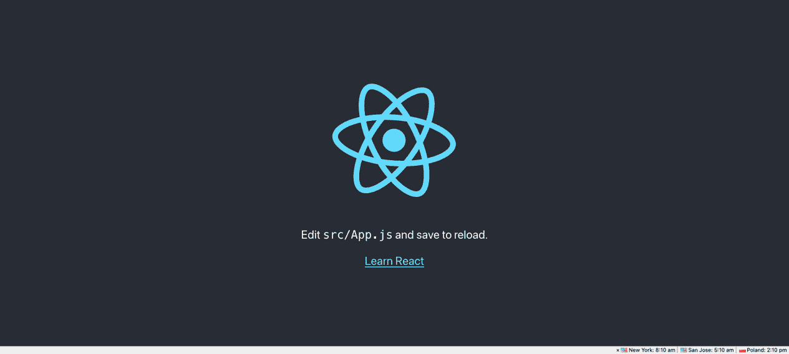
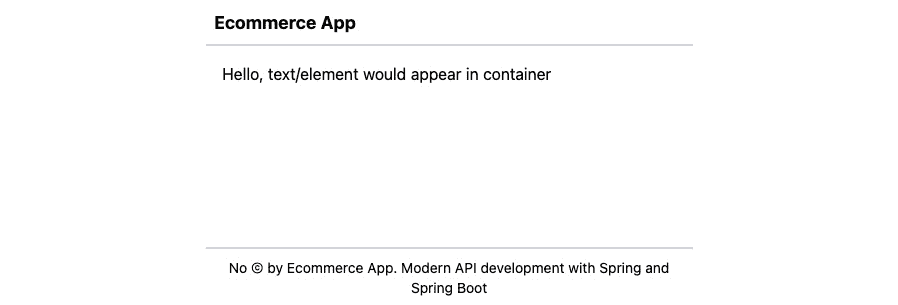
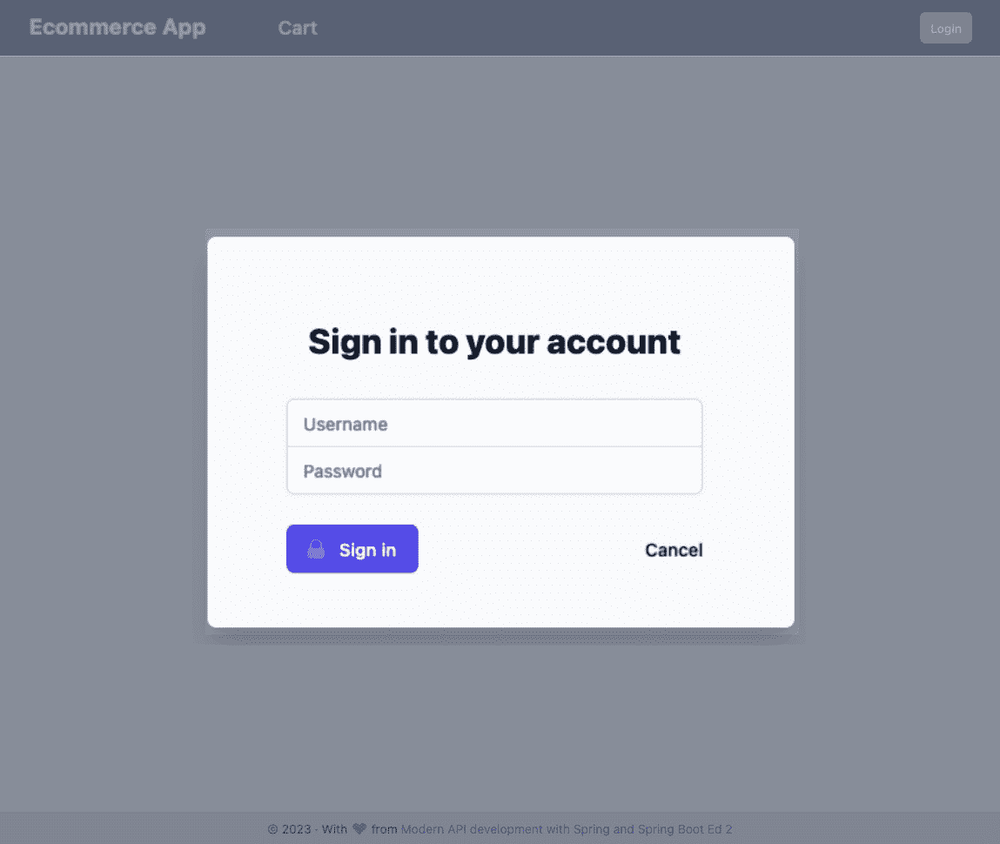
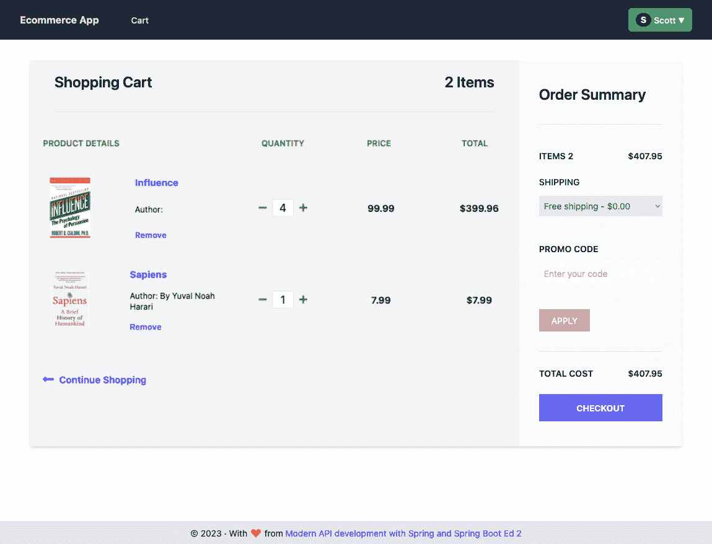
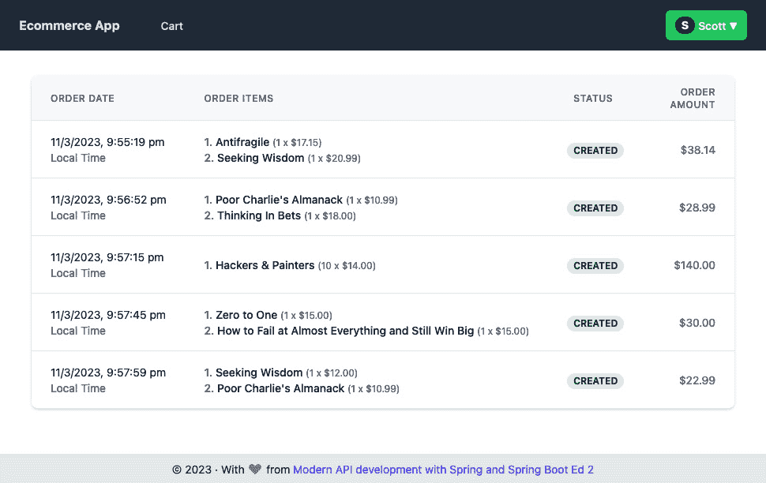

# 7

# 设计用户界面

在上一章中，你使用了 Spring Security 实现了身份验证和授权；那一章还包含了所有示例电子商务应用的 API。在本章中，你将使用 React 库开发示例电子商务应用的前端。这个 UI 应用将消费上一章中开发的 API，*第六章*，*使用授权和身份验证保护 REST 端点*。这个 UI 应用将是一个**单页应用**（**SPA**），包括交互式组件，如*登录*、*产品列表*、*产品详情*、*购物车*和*订单列表*。本章将完成在线购物应用不同层之间的端到端开发和通信。到本章结束时，你将了解 SPA、使用 React 进行 UI 组件开发以及使用浏览器的内置**Fetch API**消费 REST API。

本章将涵盖以下主题：

+   学习 React 基础知识

+   探索 React 组件和其他功能

+   设计电子商务应用组件

+   使用 Fetch 消费 API

+   实现身份验证

# 技术要求

开发和执行代码需要以下先决条件：

+   你应该熟悉 JavaScript：`数据类型`、`变量`、`函数`、`循环`以及`数组`方法，例如`map()`、`Promises`和`async`等。

+   Node.js 18.x 以及`npm install` `yarn -g`。

+   **Visual Studio Code**（**VS Code**）：这是一个免费的源代码编辑器。你可以使用任何其他你选择的源代码编辑器。

+   当你使用`create-react-app`时将包含的 React 18 库。

让我们开始吧！

请访问以下链接以检查本章的代码：

[`github.com/PacktPublishing/Modern-API-Development-with-Spring-6-and-Spring-Boot-3/tree/main/Chapter07`](https://github.com/PacktPublishing/Modern-API-Development-with-Spring-6-and-Spring-Boot-3/tree/main/Chapter07)

# 学习 React 基础知识

React 是一个用于构建交互式和动态 UI 的声明式库，包括隔离的小组件。它有时也被称为框架，因为它与其他 JavaScript 框架（如 AngularJS）一样强大且具有可比性。然而，React 是一个库，可以与其他支持的库一起使用，包括 React Router、React Redux 等。你通常用它来开发 SPA，但它也可以用于开发全栈应用。

React 根据 MVC 架构用于构建应用视图层。你可以使用它们自己的状态构建可重用的 UI 组件。你可以使用纯 JavaScript 和 HTML 或**JavaScript 语法扩展**（**JSX**）进行模板化。我们将在本章中使用 JSX，它使用**虚拟文档对象模型**（**VDOM**）进行动态更改和交互。

让我们使用 `create-react-app` 工具创建一个新的 React 应用程序。此工具提供并构建了您将用于开发示例电子商务应用程序前端的基礎应用程序结构。

## 创建 React 应用程序

您可以从零开始配置和构建一个 React UI 应用程序。然而，正如所述，React 提供了一个 `create-react-app` 工具，用于引导和构建一个基本的运行应用程序模板。您可以将它进一步扩展以构建一个完整的 UI 应用程序。

其语法如下所示：

```java
npm i npx. It executes the create-react-app React package directly.
Now, let’s create an `ecomm-ui` application using the following command:

```

$ npx create-react-app ecomm-ui 在 /Users/dev/Modern-API-Development-with-Spring-6-and-Spring-Boot-3/Chapter07/ecomm-ui 创建新的 React 应用程序。

安装软件包。这可能需要几分钟。

使用 cra-template 安装 react、react-dom 和 react-scripts...

//… 省略输出以节省空间

在 50 秒内添加了 1418 个软件包

成功！在 /Users/sourabhsharma/dev/pws/java/Modern-API-Development-with-Spring-6-and-Spring-Boot-3/Chapter07/ecomm-ui 创建了 ecomm-ui。

//… 省略输出以节省空间

在该目录内

我们建议您首先输入：

cd ecomm-ui

npm start

```java

Once it has been installed successfully, you can go to the app directory and start the installed application using `create-react-app` by running the following command:

```

$ cd ecomm-ui$ code .

```java

The `code .` command opens the `ecomm-ui` app project in VS Code. You can then use the following command in the terminal in VS Code to start the development server:

```

$ npm start

```java

 Once the server has started successfully, it will open a new tab on your default browser at `localhost:3000`, as shown in the following screenshot:


Figure 7.1 – Default UI app created by the create-react-app utility
Our bootstrapped React UI is up and running, but before you can build an e-commerce UI app on top of it, you need to understand the basic concepts and files generated by `create-react-app`.
Exploring the basic structures and files
A scaffolded React app contains the following directories and files inside the root project directory:

```

ecomm-ui├── README.md

├── node_modules

├── package.json

├── package-lock.json

├── .gitignore

├── public

│ ├── favicon.ico

│ ├── index.html

│ ├── logo192.png

│ ├── logo512.png

│ ├── manifest.json

│ └── robots.txt

└── src

├── App.css

├── App.js

├── App.test.js

├── index.css

├── index.js

├── logo.svg

├── reportWebVitals.js

└── setupTests.js

```java

Let’s understand the main parts, as follows:

*   `node_modules`: You don’t need to make any changes here. Node-based applications keep a local copy of all the dependent packages here.
*   `public`: This directory contains all the static assets of an app, including `index.html`, images, favicon icon, and `robots.txt`.
*   `src`: This directory contains all the dynamic code, including React code and **Cascading Style Sheets** (**CSS**) (including **Syntactically Awesome Style Sheets** (**Sass**), **Leaner Style Sheets** (**Less**), and so on). It also contains the test code.
*   `package.json`: This `scripts`), and dependent packages (inside `dependencies` and `dev-dependencies`).

You can remove the `serviceWorker.js` file (if generated), the `logo.svg` file, and test files from the `src` directory for now as we are not going to use them in this chapter.
Let’s discuss the `package.json` file in the next subsection.
Understanding the package.json file
You can also view the `package.json` file that contains all the dependencies under the `dependencies` and `dev-dependencies` fields. It is similar in nature to the `build.gradle` file.
The main React libraries are `react` and `react-dom`, mentioned in the dependencies field; these are for React and the VDOM, respectively.
`package.json` also contains a script field that contains all the commands you can execute on this application. We have used the `yarn start` command to start the application in development mode. Similarly, you can execute other commands, as shown in the following code block, with `yarn` and `npm`:

```

"scripts": {    "start": "react-scripts start",

"build": "react-scripts build",

"test": "react-scripts test",

"eject": "react-scripts eject"

},

```java

`react-scripts` is a CLI package installed by the `create-react-app` utility. It contains many dependencies, a few of the primary ones of which are listed here:

*   `webpack.config.js` configuration.
*   **Jest** ([`jestjs.io`](https://jestjs.io)): Jest is a JavaScript testing framework maintained by Facebook.
*   **ESLint** ([`eslint.org`](https://eslint.org)): ESLint is a linter that allows you to maintain code quality. It is very similar to *Checkstyle* in the Java world.
*   **Babel** ([`babeljs.io`](https://babeljs.io)): Babel is a JavaScript transcompiler tool that converts JavaScript code to backward-compatible JavaScript code. The latest JavaScript draft version is **ECMAScript 2020**, also referred to as **ES10**. The latest JavaScript stable version is **ECMAScript 2018** (**ES9**). Babel allows you to generate optimized backward-compatible code from JavaScript code written using the latest versions.

You can find `react-scripts` under the `dependencies` field in `package.json`. Let’s understand each of these commands, as follows:

*   `start`: This command allows you to start the development server in a node environment. It also provides the hot reload feature, which means any changes to the React code would be reflected in the application, without a restart being required. Therefore, if there are any linting or code issues, they will show up accordingly in the console (terminal window) and web browser.
*   `build`: This command packages the React application code for production deployment. It does the bundling of the JavaScript files in one, the CSS files into another, and then minifies and optimizes the code files. You can then deploy this bundle on any web server.
*   `test`: This command executes a test using the test runner (the Jest tool). It executes all test files with extensions such as `.test.js` or `.spec.js`.
*   `eject`: React comes with default build configurations such as webpack, Babel, and so on. The build configuration has the best practices already implemented to optimize the built app. This `eject` command allows you to eject the hidden configuration, after which you can override and customize the build configuration. However, you should do this with the utmost care because this is a one-way activity, and you can’t reverse it.

Let’s take a closer look at how React works in the next subsection.
Bootstrapping a React app
A web page is nothing but an HTML document. HTML documents contain the DOM, a tree-like structure of HTML elements. Any changes to the DOM are reflected in the rendering of the HTML document in the browser. Making changes in the actual DOM— and, specifically to the nth level—is a heavy operation in terms of traversal and rendering the DOM, because each change is done on the whole DOM, and this is a time- and memory-consuming operation.
React uses a VDOM to make these operations lightweight. A VDOM is an in-memory copy of the actual DOM. React maintains the VDOM using the `react-dom` package. Therefore, when you initialize the React app, you first pass the root HTML `ID` element to the `ReactDOM` object’s `render` function. React writes the VDOM under this root element after its first render.
After the first render, only the necessary changes are written to the actual DOM based on the changes in React components and their state. The React components’ `render` function returns the markup in JSX syntax. Then, React transforms it to HTML markup and compares the generated VDOM with the actual HTML DOM, and only makes the necessary changes to the actual DOM. This process then continues till the components get changed. Let’s explore how the first render takes place.
The `pubic/index.html` file contains the main HTML file. This is an application skeleton that contains the web app’s `title`, `meta` elements, and a `body` element. It also contains a `div` element (under `body`) with an `ID` as `root`. You pass this root element to the `render` function of `ReactDOM` in `index.js`, in the `src` directory. This is the entry point of the React app. Let’s have a look at its code, as follows:

```

import React from 'react';import ReactDOM from 'react-dom/client';

import './index.css';

import App from './App';

const root = ReactDOM.createRoot(document.getElementById('root'));

root.render(

<React.StrictMode>

<App />

</React.StrictMode>

);

```java

[`github.com/PacktPublishing/Modern-API-Development-with-Spring-6-and-Spring-Boot-3/tree/dev/Chapter07/ecomm-ui/src/index.js`](https://github.com/PacktPublishing/Modern-API-Development-with-Spring-6-and-Spring-Boot-3/tree/dev/Chapter07/ecomm-ui/src/index.js)
Here, React uses the `ReactDOM` object from the `react-dom` package to render the page. First it creates the root object by calling the `createRoot` method and passing the `root` element. The `document.getElementById('root')` method fetches `<div id= "root">` from inside the `<body>` element of `index.html`.
The `render()` function of the `root` object contains an argument: element of type `ReactNode`. You pass an `<App />` tag component wrapped with React’s strict mode component as an element argument.
App components can be a single component or a parent component with single or multilayer child components. A single component won’t contain any other React component; it simply contains the JSX, and that’s it. However, parent components may contain one or more child components, and those child components may contain one or more child components, and so on. For example, an `App` component may have `header`, `footer`, and `content` components. A `content` component may have a `cart` component, and then the `cart` component may have items inside it.
A `<React.StrictMode>` component is a special React component that gets rendered twice in development mode to check for best practices, deprecated methods, and potential risks in your React components, and prints warnings and suggestions in the console log. It has no impact on the production build because it only works in development mode.
The `render()` function transforms the JSX of the `App` component to HTML and adds it inside the `<div id="root">` tag, then it compares the VDOM with the real DOM and makes the necessary changes in the real DOM. This is how React components get rendered on the browser.
You now understand that React components are key here. Let’s deep dive into them in the next section.
Exploring React components and other features
Each page in an app is built up using React components — for example, the **Product Listing** page of Amazon can broadly be divided into *Header*, *Footer*, *Content*, *Product List*, *Filter and Sorting options*, and *Product Card* components. You can create components in React in two ways: by using JavaScript classes or functions.
Let’s create an example header component in React with both a function and a class.
You can either write a plain old JavaScript function or an `Header` component using a JavaScript arrow function:

```

export default const Header = (props) => {  return (

<div>

<h1>{props.title}</h1>

<div>

)

}

```java

Let’s create the same `Header` component using a JavaScript class, as follows:

```

export default class Header extends React.Component {  render() {

return (

<div>

<h1>{this.props.title}</h1>

<div>

)

}

}

```java

Let’s understand both components point by point, as follows:

*   Both return JSX that looks like HTML, which gets rendered after transformation (from JSX to HTML).
*   Both export the function and class respectively so that they can be imported by other components.
*   Both have props—one as an argument and one bound with this scope, which is part of `React.Component`. Props represent the attributes and their values—for example, here, a `title` attribute is used. When it gets rendered, it is replaced by the `title` attribute’s value.
*   The class needs a `render()` function, whereas the function simply needs a `return` statement.

Let’s see how the `Header` component could be used. You can use this `Header` component as you would use any other HTML tag in your JSX code, as shown next:

```

<Header title="Sample Ecommerce App" />

```java

 Here, `title` is the property of `Header` component. It describes how properties (props) of components are passed. When this `Header` component gets rendered, it will show the `title` value wrapped in an `<``H1>` element.
Let’s explore the JSX next. This is how you use the `props`: you add an attribute (such as `title`) to its value while using the component. Inside the component, you can access these attributes (properties) by using `props` directly or using the `{ title }` de-structuring form in functional components and by using `this.props` in the class components.
Exploring JSX
React components would return the JSX. You can write HTML code to design the components because JSX is very similar to HTML, except for the HTML attributes. Therefore, you need to make sure to update attributes such as `class` to `className`, `for` to `htmlFor`, `fill-rule` to `fillRule`, and so on. The advantage of using the `React.StrictMode` component is that you get a warning and a suggestion to use the correct JSX attribute names if you use HTML attributes or have a typo.
You can also put any JavaScript expressions inside JSX or an element’s attributes to make the component dynamic by using the expression wrapped in curly braces (`{}`).
Let’s have a look at some example code to understand both JSX and expressions. The following JSX code snippet has been taken from the `CartItem` component. Check out the highlighted code for expressions; the rest of the code is JSX, which is very similar to HTML:

```

<div className="w-32"> 

</div>

<div className="flex flex-col justify-between

ml-4 flexgrow">

<Link to={"/products/" + item.id} className="font-bold

text-sm text-indigo-500 hover:text-indigo-700">

{item?.name}

</Link>

<span className="text-xs">作者：{author}</span>

<button className="font-semibold hover:text-red-500

text-indigo-500 text-xs text-left"

onClick={() => removeItem(item.id)}>

删除

</button>

</div>

```java

The preceding code fragment represents a cart item that shows the product image, product name, author, and `class` attribute name is changed to `className` because it is JSX. `Link` is a part of the `react-router-dom` library.
You are done with the cart item’s design part. Now, you need a mechanism to populate the values and add the event handling in it. This is where a JSX expression helps you.
You use `item` — an object that represents the cart item, and `author` — a variable that contains the author’s name. Both are part of the React component’s state. You will learn more about the state in the next subsection, but for the time being you can think of them as variables defined in the `CartItem` component. Once you write the JSX (read HTML), dynamic values (from variables) and interaction (for events) can be defined using the expressions wrapped inside curly braces (`{}`).
Let’s understand each of the expressions as follows:

*   `src={item?.imageUrl}`: You get the item (product) image URL as part of the API response. You simply assign it to the `src` attribute of the `img` tag. Note that the dot operator (`.`) allows you to access the property of an object. The code may throw an error if you try to read the property of any `null` or `undefined` object. You can avoid that by using the `?.` operator. Then, the property (in this case, `imageUrl`) will only be read if an object (in this case, `item`) is not `null` or `undefined`.
*   `to={"/products/" + item.id}`: Here, links to an attribute are formed by using the object item’s `id` property.
*   `{item?.name}`: Here, the name of the product is displayed using the name property of the `item` object.
*   `Author: {author}`: The author value is displayed using the `author` variable.
*   `onClick={() => removeItem(item.id)}`: This is the way you associate a user-defined function with an event. Here, `removeItem()` will be called by passing the item object’s `id` property on the click of a button. If you are not passing any argument or using multiple statements, then you can directly pass the function name instead of using the arrow function—for example, `onClick={removeItem}`.

Next, we will deep dive into the state of React components. Let’s see how this works.
Understanding React hooks
Components are dynamic and contain a state. The state represents the data and metadata held by the component at a given point in time. There are two levels of state: a global (app-level) state and a local (component-level) state.
Earlier (prior to React version 16.8), the state was only supported in components defined using classes. Now, React supports the state in both functional and class components. React supports the state in functional components using `useState()`, `useContext()`, and so on.
What are hooks?
Hooks are special React built-in functions or user-defined functions that can be stateful and are used to manage the side effects of React functional components. Popular and frequently used hooks are `useState()` and `useEffect()`.
React introduced hooks (a set of functions) in the 16.8 version, which introduced many features to functional components that were earlier not supported, including state and events such as `componentDidMount` (a lifecycle method in the class that indicates a component was mounted), and you can now perform certain operations such as loading data using APIs, among other things.
Let’s discuss React hooks next.
Each hook in React represents a special feature that you can use in functional components. Let’s discuss the most popular and common hooks one by one, as follows:

*   `useState`: `useState()` allows you to define and maintain the state. Let’s examine how you use this hook. First, you import the `useState()` hook at the top of the component code file, as follows:

    ```

    import {useState} from "react";

    ```java

Next, inside your component’s arrow function code, define the state before the `return` statement, as shown next:

```

const [total, setTotal] = useState(0);

```java

 You need to define both state and state setter functions in an array while declaring the state. Here, the `total` state is defined with its setter function. You can use any type of state, such as an `object`, `array`, `string`, or `number`. The total state is of type `number`; therefore, it is initialized with `0`. `setTotal()` is a setter function. The setter function allows you to update the state (`total` here)—for example, you could update the total state by calling `setTotal(100)`, in which case the `total` state would be changed from `0` to `100`.
React tracks the state’s setter function and whenever it is called. React updates the state of the component and re-renders the component. The naming convention of the setter function is to prefix the state name with `set` and make the state’s first letter a capital letter. Therefore, we have used the `setTotal()` name for the `total` state. You’ll use `useState()` for local state management in most components.

*   `useEffect`: You use a `useEffect()` hook when you want to do something after rendering a component. This gets called after each render. You can also use it when you want to load the initial data from an API or add an event listener. However, if an API call should be made once, then you can pass the empty array (`[]`) dependency while calling it. You’ll find multiple instances of `useEffect` in the `ecomm-ui` code when an empty array is passed for a single call.

React recommends using multiple `useEffect` functions inside components for separating the concern. Also, make sure it returns an arrow function for cleanup. For example, when you add the event listener for any component, it should return an arrow function that removes the event listener.

*   `useContext`: You can pass props from one component to another. Sometimes, you must use props drilling to the nth level. React also provides an alternative way to define these props so that they can be used in any component in a tree without using prop drilling. You would use it for props that are common across components, such as `theme` or `isUserLoggedIn`.
*   React provides a `createContext()` function to create a context. It returns a provider and consumer to provide access to its values and changes respectively (see the next code block). However, `useContext` can easily make use of the context by removing the usage of the consumer, which is returned by `createContext()`. The following code snippet depicts `useContext` usage:

    ```

    import {createContext} from "react";import ReactDOM from "react-dom";const LoggedInContext = createContext();const App = () => {  return (    <LoggedInContext.Provider isUserLoggedIn=true>      <ProductList/>    <LoggedInContext.Provider/>  );}const ProductList = () => { return (   <LoggedInContext.Consumer> { isUserLoggedIn =>    <div>Is user logged-in: {isUserLoggedIn}</div>   } <LoggedInContext.Consumer> );}ReactDOM.render(<App/>,document.getElementById("root"));

    ```java

You can simplify the `ProductList` component’s `return` block in the previous code snippet (check the highlighted code) with `useContext`, as follows:

```

import {createContext, useContext} from "react";import ReactDOM from "react-dom";

const LoggedInContext = createContext();

const App = () => {

return (

<LoggedInContext.Provider isUserLoggedIn=true>

<ProductList/>

<LoggedInContext.Provider/>

);

}

const ProductList = () => {

const isUserLoggedIn = useContext(LoggedInContext);

return (

<div>Is user logged-in: {isUserLoggedIn}</div>

);

}

ReactDOM.render(<App/>, document.getElementById("root"));

```java

This is how you can use `createContext` and `useContext` hooks.

*   `useReducer`: This is an advanced version of the `useState` hook that not only allows you to use a component’s state but also provides better controls to manage its state by taking the `reducer` function as a first argument. It takes the initial state as a second argument. Check out its syntax, as seen in the following code block:

    ```

    const [state, dispatch] = useReducer(reducer, initialState);

    ```java

The `reducer` function is a special function that takes state and action as arguments and returns a new state. We’ll explore this more when we build the `CartContext` component later in this chapter.
Now that you have learned the basic concepts of React, let’s add some styling to the `ecomm-ui` application using Tailwind CSS.
Styling components using Tailwind
`npm`, as shown in the following command (executing it from the project root directory):

```

$ npm install -D tailwindcss

```java

 Here, version 3.2.7 of Tailwind CSS was installed.
Next, let’s configure Tailwind CSS. The `npx tailwindcss init` command generates the Tailwind CSS configuration file with the default empty values:

```

$ npx tailwindcss initCreated Tailwind CSS config file: tailwind.config.js

```java

The previous command generates the following file:

```

/** @type {import('tailwindcss').Config} */module.exports = {

content: [],

theme: {

extend: {},

},

plugins: [],

}

```java

[`github.com/PacktPublishing/Modern-API-Development-with-Spring-6-and-Spring-Boot-3/blob/main/Chapter07/ecomm-ui/tailwind.config.js`](https://github.com/PacktPublishing/Modern-API-Development-with-Spring-6-and-Spring-Boot-3/blob/main/Chapter07/ecomm-ui/tailwind.config.js)
Now, we can modify the Tailwind CSS configuration to purge unused styles in production.
Configuration to remove unused styles in production
You would like to keep the style sheet size down in a production environment because this improves the performance of the application. You can purge unnecessary styles by adding the following filters to the `content` block of the `tailwind.config.js` file. Then, Tailwind can tree-shake unused styles while building the production build. Generated CSS files only contain the used styles in files matching the given filters. The code is illustrated in the following snippet:

```

module.exports = {  content: ["./src/**/*.{js,jsx,ts,tsx}",

"./public/index.html"],

theme: {

extend: {},

},

plugins: [],

}

```java

Next, we will add Tailwind to React.
Including Tailwind in React
Open the `src/index.css` file that `create-react-app` generates for you by default and import Tailwind’s `base`, `components`, and `utilities` styles, replacing the original file contents as follows:

```

@tailwind base;@tailwind components;

@tailwind utilities;

```java

[`github.com/PacktPublishing/Modern-API-Development-with-Spring-6-and-Spring-Boot-3/tree/dev/Chapter07/ecomm-ui/src/index.css`](https://github.com/PacktPublishing/Modern-API-Development-with-Spring-6-and-Spring-Boot-3/tree/dev/Chapter07/ecomm-ui/src/index.css)
These statements import the styles generated by the build based on the Tailwind configuration when you execute the build.
Finally, make sure that the CSS file is imported in the `src/index.js` file, as shown in following code:

```

import React from 'react';import ReactDOM from 'react-dom/client';

import './index.css';

import App from './App';

import reportWebVitals from './reportWebVitals';

const root = ReactDOM.createRoot(document.getElementById('root'));

// … rest of the code removed for brevity

```java

Done! Next, execute `yarn start` to use Tailwind CSS in the `ecomm-ui` app.
However, before that, you are going to add the basic structure to your web app – the header, container (content), and footer.
Adding basic structural React components
Before adding the `Header`, `Footer`, and `Container` components, you need to remove the following files created by `create-react-app`:

*   `App.css`
*   `logo.svg`

Don’t forget to remove these file references from `/``src/App.js` too.
Then, create a `components` directory under `/src`. You will create all new components under this directory, as shown in *Figure 7**.2*. Let’s create three new components, as follows:

*   `Header`: This will be displayed at the top and contains header items such as the app name and **Login/Logout** button
*   `Container`: This will contain the main content, such as the product list
*   `Footer`: This will be displayed at the bottom and contains footer items such as the copyright information

The basic structure can be seen in the following screenshot:


Figure 7.2 – Basic structure of the app containing the Header, Footer, and Container components
Let’s add these basic components. First, let’s create a `Header` component, as shown in the following code snippet:

```

const Header = () => {  return (

<div>

<header className="p-2 border-b-2

border-gray-300 bggray-200">

<h1 className="text-lg font-bold">

Ecommerce App</h1>

</header>

</div>

);

};

export default Header;

```java

Similarly, create a `Footer` component, as shown in the following code snippet:

```

const Footer = () => {  return (

<div>

<footer

className="text-center p-2 border-t-2 bggray-

200 border-gray-300 text-sm">

No &copy; by Ecommerce App.{" "}

<a href=https://github.com/PacktPublishing/Modern-

API-Development-with-Spring-and-Spring-Boot>

Modern API development with Spring and

Spring Boot

</a>

</footer>

</div>

);

};

export default Footer;

```java

Next, create a `Container` component, as shown in the following code snippet:

```

const Container = () => {  return (

<div className="flex-grow flex-shrink-0 p-4">

<p>Hello, text/element would appear in container</p>

</div>

);

};

export default Container;

```java

And finally, modify the `/src/App.js` file as shown in the following code snippet:

```

import Header from "./components/Header";import Footer from "./components/Footer";

import Container from "./components/Container";

function App() {

return (

<div className="flex flex-col min-h-screen h-full">

<Header />

<Container />

<Footer />

</div>

);

}

export default App;

```java

This is how you can create and use new components. These components are in their simplest form and are kept as such to be understood more easily. However, you can find refined and improved versions of these components on GitHub, as follows:

*   *Header component* *source*: [`github.com/PacktPublishing/Modern-API-Development-with-Spring-6-and-Spring-Boot-3/tree/dev/Chapter07/ecomm-ui/src/components/Header.js`](https://github.com/PacktPublishing/Modern-API-Development-with-Spring-6-and-Spring-Boot-3/tree/dev/Chapter07/ecomm-ui/src/components/Header.js)
*   *Footer component* *source*: [`github.com/PacktPublishing/Modern-API-Development-with-Spring-6-and-Spring-Boot-3/tree/dev/Chapter07/ecomm-ui/src/components/Footer.js`](https://github.com/PacktPublishing/Modern-API-Development-with-Spring-6-and-Spring-Boot-3/tree/dev/Chapter07/ecomm-ui/src/components/Footer.js)
*   The `Container` component (which contains the actual content in the center) could be replaced with the `switch` component from `react-router-dom`, which would display the components based on a given `route`, such as `cart`, `orders`, and `login`.

Now, you can start writing the actual `ecomm-ui` components next.
Designing the e-commerce app components
Design is not only a key part of UX and UI work, but is also important for frontend developers. Based on the design, you can create reusable and maintainable components. Our example e-commerce app is a simple application that does not need much attention. You will create the following components in this application:

*   **Product listing component**: A component that displays all the products and acts as a home page. Each product in the list will be displayed as a card with the product name, price, and two buttons—**Buy now** and **Add to bag**. The following screenshot displays the **Product listing** page, which shows the product information along with an image of each product:


Figure 7.3 – Product listing page (home page)

*   **Product detail component**: This component displays the details of a product when clicked. It displays the product image, product name, product description, tags, and the **Buy now** and **Add to bag** buttons, as shown next:


Figure 7.4 – Product detail page

*   **Login component**: Login components allow a user to log in to an app by using their username and password, as illustrated in the following screenshot. This component displays an error message when a login attempt fails. Click on **Cancel** to go back to the **Product listing** page. The **Product listing** page shows a list of products a customer can buy.



Figure 7.5 – Login page

*   `Cart` component lists all the items that have been added to the cart. Each item displays the given product image, name, description, price, quantity, and total. It also provides a button to decrease or increase the quantity, and a button to remove the item from the cart.

**Product name** is a link that takes the user back to the **Product detail** page. The **Continue** **shopping** button takes the user to the **Product listing** page. The **CHECKOUT** button performs the checkout process. On successful checkout, an order is generated and the user is redirected to the **Orders** page.


Figure 7.6 – Cart page

*   **Orders component**: The **Orders** page shows all orders placed by the user in a tabular form. The **Orders** table displays the order date, ordered items, order status, and order amount for each order.

The order date will be displayed in the user’s local time, but on the server it will be in **Universal Coordinated Time** (**UTC**) format. Order items will be displayed in an order list, with their quantity and unit price in brackets, as illustrated in the following screenshot:


Figure 7.7 – Order page
Let’s start coding these components. First, you will code the **Product listing** page, which fetches the products from the backend server using the REST API.
Consuming APIs using Fetch
Let’s create the first component — that is, the `src/components` directory with the name `ProductList.js`. This is the parent component of the **Product** **Listing** page.
This component fetches the products from the backend server and passes them to the child component, `Products` (it creates a new `Products.js` file under the `src/components` directory).
`Products` contains the logic responsible for looping through the fetched product list. Each iteration renders the card UI of each product. This product card component is represented using `ProductCard`, another component. Therefore, let’s create a `ProductCard.js` file, under `src/components`.
You can write the product card code inside `products` (`product list` component), but to single out the responsibilities, it’s better to create a new component.
The `ProductCard` component has a **Buy now** button and an **Add to bag** link. These links should only work if the user is logged in, else it should redirect the user to the login page.
You now have an idea about the **Product Listing** page component tree structure. Now, our first task is to have an API client that fetches products we can render in these components.
Writing the product API client
You are going to use the `Fetch` browser built-in library as a REST API client. You can also use a third-party library such as `axios`. `Fetch` can do the job for this example app and reduce the number of third-party dependencies.
You can create a configuration file for API clients settings. Let’s name it `Config.js` and place it in the `src/api` directory.
`Config` is a JavaScript class that contains constants such as URLs and common methods such as `DefaultHeaders()` and `tokenExpired()`. Check out its code in the following snippet:

```

class Config {  SCHEME = process.env.SCHEME ? process.env.

SCHEME : "http";

HOST = process.env.HOST ? process.env.HOST : "localhost";

PORT = process.env.PORT ? process.env.PORT : "8080";

CART_URL = `${this.SCHEME}://${this.HOST}:$

{this.PORT}/api/v1/carts`;

// truncated code for brevity

defaultHeaders() {

return {

"Content-Type": "application/json",

Accept: "application/json",

};

}

…

}

```java

[`github.com/PacktPublishing/Modern-API-Development-with-Spring-6-and-Spring-Boot-3/tree/dev/Chapter07/ecomm-ui/src/api/Config.js`](https://github.com/PacktPublishing/Modern-API-Development-with-Spring-6-and-Spring-Boot-3/tree/dev/Chapter07/ecomm-ui/src/api/Config.js)
Here, you can see that we have created constants that are formed using environment variables. The `defaultHeaders()` function returns the common headers used in all API calls, and `headersWithAuthorization()` returns common headers with the `Authorization` header. `headersWithAuthorization()` uses object destruction to retrieve the default headers. The `Authorization` header is fetched from the local storage, which is set when a user is logged in successfully and is removed once the user logs out.
It also has a `tokenExpired()` function that simply checks the expiration time for a token stored in local storage. This expiration time is extracted from the access token (**JSON Web Token**, or **JWT**). It returns true if the expiration time is past the current time. Check out this function’s code in the following code snippet:

```

tokenExpired() {

const expDate = Number(localStorage.getItem

// src/api/Config.js

if (expDate > Date.now()) {

return false;

}

return true;

}

```java

The `Config` class also contains a `storeAccessToken()` function that simply stores the access token and expiration time in local storage. It uses a `getExpiration()` function to extract the expiration time from the access token. Put simply, this function first extracts the payload from the token string and then decodes the payload and converts it to JSON. Finally, it returns the expiration time if a payload is a valid object, else it returns `0`. You can find these functions in the following code block:
Relevant code of src/api/Config.js

```

storeAccessToken(token) {  localStorage.setItem(this.ACCESS_TOKEN, `Bearer ${token}`);

localStorage.setItem(this.EXPIRATION,

this.getExpiration(token));

}

getExpiration(token) {

let encodedPayload = token ? token.split(".")[1] : null;

if (encodedPayload) {

encodedPayload = encodedPayload.replace

(/-/g, "+").replace(/_/g, "/");

const payload = JSON.parse(window.atob

(encodedPayload));

return payload?.exp ? payload?.exp * 1000 : 0;

}

return 0;

}

```java

Next, let’s make use of this `Config` class in the `src/api/ProductClient.js` file, as shown in the following code block. This file will act as the API client for product-related APIs:

```

import Config from "./Config";class ProductClient {

constructor() { this.config = new Config(); }

async fetchList() {

return fetch(this.config.PRODUCT_URL, {

method: "GET",

mode: "cors",

headers: { ...this.config.defaultHeaders(),},

})

.then((res) => Promise.all([res, res.json()]))

.then(([res, json]) => {

if (!res.ok) { return { success: false, error: json }; }

return { success: true, data: json };

}).catch((e) => {

return this.handleError(e);

});

}

…

…

```java

[`github.com/PacktPublishing/Modern-API-Development-with-Spring-6-and-Spring-Boot-3/tree/dev/Chapter07/ecomm-ui/src/api/ProductClient.js`](https://github.com/PacktPublishing/Modern-API-Development-with-Spring-6-and-Spring-Boot-3/tree/dev/Chapter07/ecomm-ui/src/api/ProductClient.js)
`ProductClient` is a class, and a `config` instance is instantiated in its constructor. This class contains two asynchronous functions for fetching the products: `fetchList()` and `fetch()`. The former fetches all products, and the latter is for fetching a single product based on its ID. `fetchList()` makes use of the `fetch` browser function to fetch the product list. You pass the URL as the first argument input and request an initialization object that contains the HTTP method, mode, and headers as the second argument. The `fetch` browser call returns a promise that you use to handle the request. First, you resolve both the promises – the response and response JSON and then check `response.ok`. `response.ok` returns true for a status in the `200` to `299` range. Upon a successful response, the `fetchList()` method returns an object with `data` and `success` fields as `true`. Upon an unsuccessful response, it returns success as `false` and shows an error response in the `data` field.
Similarly, you can write a `fetch` function to retrieve the product by `ID`. Everything will be the same except the URL, as you can see in the following code block:
Remaining code of src/api/ProductClient.js

```

async fetch(prodId) {   return fetch(this.config.PRODUCT_URL + "/" + prodId, {

if (auth?.token) fetchCart(auth);

mode: "cors",

headers: { ...this.config.defaultHeaders(),},

})

.then((res) => Promise.all([res,  res.json()]))

.then(([res, json]) => {

if (!res.ok) { return { success: false, error: json }; }

return { success: true, data: json };

}).catch((e) => {

this.handleError(e);

});

}

handleError(error) {

const err = new Map([

[TypeError, "获取响应时出现问题。"],

[SyntaxError, "解析响应时出现问题。"],

[Error, error.message],

]).get(error.constructor);

return err;

}

}

export default ProductClient;

```java

Here, the `handleError()` function checks the type of the error (using `error. constructor`) and, based on that, returns the appropriate error message.
Please note that other API clients such as `CartClient`, `CustomerClient`, and `OrderClient` are developed in a similar fashion. The code is available at the following locations:

*   `CartClient`: [`github.com/PacktPublishing/Modern-API-Development-with-Spring-6-and-Spring-Boot-3/tree/dev/Chapter07/ecomm-ui/src/api/CartClient.js`](https://github.com/PacktPublishing/Modern-API-Development-with-Spring-6-and-Spring-Boot-3/tree/dev/Chapter07/ecomm-ui/src/api/CartClient.js)
*   `CustomerClient`: [`github.com/PacktPublishing/Modern-API-Development-with-Spring-and-Spring-Boot/blob/main/Chapter07/ecomm-ui/src/api/CustomerClient.js`](https://github.com/PacktPublishing/Modern-API-Development-with-Spring-and-Spring-Boot/blob/main/Chapter07/ecomm-ui/src/api/CustomerClient.js)
*   `OrderClient`: [`github.com/PacktPublishing/Modern-API-Development-with-Spring-and-Spring-Boot/blob/main/Chapter07/ecomm-ui/src/api/OrderClient.js`](https://github.com/PacktPublishing/Modern-API-Development-with-Spring-and-Spring-Boot/blob/main/Chapter07/ecomm-ui/src/api/OrderClient.js)

Now, we can use `ProductClient` to fetch the products from the backend using REST APIs. Let’s code the `ProductList` component and its child components.
Coding the Product Listing page
`ProductList` is a straightforward component that loads the products after their first render using `ProductClient`. You know that for this purpose, `useEffect` hooks should be used. Let’s code it as follows:

```

// 其他导入 import Products from "./Products";

const ProductList = ({ auth }) => {

const [productList, setProductList] = useState();

const [noRecMsg, setNoRecMsg] = useState("正在加载...");

const { dispatch } = useCartContext();

useEffect(() => {

async function fetchProducts() {

const res = await new ProductClient().fetchList();

if (res && res.success) { setProductList(res.data); }

else { setNoRecMsg(res); }

}

async function fetchCart(auth) {

const res = await new CartClient(auth).fetch();

if (res && res.success) {

dispatch(updateCart(res.data.items));

if (res.data?.items && res.data.items?.length < 1)

{

setNoRecMsg("购物车为空。");

}

} else {

setNoRecMsg(res && typeof res === "string"?

res : res?.error?.message);

}

}

(this.EXPIRATION));

fetchProducts();

}, []);

// 代码的其他部分 …

```java

[`github.com/PacktPublishing/Modern-API-Development-with-Spring-6-and-Spring-Boot-3/tree/dev/Chapter07/ecomm-ui/src/components/ProductList.js`](https://github.com/PacktPublishing/Modern-API-Development-with-Spring-6-and-Spring-Boot-3/tree/dev/Chapter07/ecomm-ui/src/components/ProductList.js)
The `ProductList` component uses `auth` as a prop. It contains authentication information such as a token. The `ProductList` component is used as the main `App` component, and `auth` is passed to the `ProductList` component by it.
Please note that you have passed an empty array (`[]`) as a dependency to make sure that the API is called only once. You are using a `useState` hook to store the product list (`productList`) and message states (`noRecMsg`—no record) via setter methods.
Why does the cart need to be fetched in ProductList?
The `ProductList` component and its child components are available for non-authenticated users. Once the user clicks on the **Buy now** button or the **Add to bag** link, it will ask the user to log in. Once logged in, the user can add items to the cart. It is quite possible that the user might already have some items in the cart. Therefore, when you add an item to the cart, the quantity of existing products should be increased, and if a clicked item does not exist in the cart, then it should be added to the cart.
`Cart` is a separate component altogether; this means you can’t access the cart unless you do cart prop drilling from the `App` component to both the `Cart` and `ProductCard` components or have a `useContext` hook for the cart. We have built a custom store to maintain the cart state, very similar to **Redux** (a library used to maintain the state in React app). We’ll learn more about this library later in this chapter. Dispatch is an action that updates the cart items received from the backend server to the cart context.
Next, create a JSX template and pass the fetched `productList` component to the child component, `Products`, for further rendering, as illustrated in the following code snippet:
Remaining code of src/components/ProductList.js

```

return (   <div className="max-w-7xl mx-auto px-4 sm:px-6 lg:px-8">

{productList ? (

<div className="flex flex-wrap -mx-1 lg:-mx-4">

<Products auth={auth} productList={productList ?

productList : []} />

</div>

) : (

<div className="text-lg

font-semibold">{noRecMsg}</div>

)}

</div>

);

};

export default ProductList;

```java

Here, it also passes the `auth` object as a prop to `Products`.
Let’s have a look at the `Products` code, as follows:

```

从 "./ProductCard" 导入 ProductCard;const Products = ({ auth, productList }) => {

return ( <> {productList.map((item) => (

<ProductCard key={item.id} product={item} auth={auth} /> )}

</>

);

};

export default Products;

```java

[`github.com/PacktPublishing/Modern-API-Development-with-Spring-6-and-Spring-Boot-3/tree/dev/Chapter07/ecomm-ui/src/components/Products.js`](https://github.com/PacktPublishing/Modern-API-Development-with-Spring-6-and-Spring-Boot-3/tree/dev/Chapter07/ecomm-ui/src/components/Products.js)
Put simply, the code does the job of iterating the product list passed by the `ProductList` component and passes each item with the `product` props to the `ProductCard` component along with the `auth` object.
You can observe the usage of two React concepts here, as follows:

*   The code uses a `<></>` fragment, which is an empty tag. Ideally, this is used when a component returns more than one top-level tag because React needs only one top-level tag in each component. Then, you can wrap those tags with a fragment. You can also use `<React.Fragment>` in place of an empty tag after importing `React` from the `react` package.
*   Another usage is for the `key` props in the `ProductCard` component. When you generate components based on a collection, React requires the `key` props to uniquely identify them. This will allow React to identify which item is changed, removed, or added. We have used the item ID here. If you don’t have an ID in your collection, you can also use the `index`, as shown in the following code example:

    ```

    {productList.map((item, index) => (  <ProductCard key={index} product={item} auth={auth} />))}

    ```java

Now, let’s have a look at the last child component of the `ProductList` component: `ProductCard`. The `ProductCard` component simply passes `Product` values to JSX template expressions for rendering.
We have added some extra code to add the functionality associated with the **Add to bag** and **Buy now** click events.
Configuring routing
You are creating an SPA. Here, routing is not available by default. Routing is the mechanism that provides the routing to an SPA, which means that with each new page, the browser URL will reflect the change and allow you to bookmark the page. SPA routing also maintains the browser history. You are going to use the `react-router-dom` package for routing management. You need to add the `react-router-dom` package to use routing, as shown in the following code snippet. Make sure to execute it from the project root directory:

```

$ npm install react-router-dom

```java

 The routing will be configured in the `App` component because it is the `root` component of the `ecomm-ui` application. In the `ProductList` component, you are going to use the `Link` component and the `useNavigate()` hook from the `react-router-dom` package. Let’s examine them, as follows:

*   `Link`: This is like a `<a>` HTML anchor tag. Instead of a `href` attribute, it uses a `to` attribute to link the URL. The `route` library maintains the links; therefore, it knows which component to render when a link is passed in with a `to` attribute when `Link` is clicked.
*   `useNavigate()`: This allows navigation inside the component and accesses the state of the router. You would use the `navigate("/path")` function if `navigate` is declared as `const navigate = useNavigate()` to navigate from one component to another, as shown in the `checkLogin()` function of the `ProductCard` component.

Let’s continue with the development of the next product-based component: `ProductCard`.
Developing the ProductCard component
First, let’s import the required packages. Then, declare the state (using `useCartContext` and `useState`) and variables. Please note that the following code snippet has `auth` and `product` as props:

```

import { useState } from "react";import { Link, useNavigate } from "react-router-dom";

import CartClient from "../api/CartClient";

import { updateCart, useCartContext } from "../hooks/CartContext";

const ProductCard = ({ auth, product }) => {

const navigate = new useNavigate();

const cartClient = new CartClient(auth);

const { cartItems, dispatch } = useCartContext();

const [msg, setMsg] = new useState("");

// continue …

```java

[`github.com/PacktPublishing/Modern-API-Development-with-Spring-6-and-Spring-Boot-3/tree/dev/Chapter07/ecomm-ui/src/components/ProductCard.js`](https://github.com/PacktPublishing/Modern-API-Development-with-Spring-6-and-Spring-Boot-3/tree/dev/Chapter07/ecomm-ui/src/components/ProductCard.js)
To begin, you write the `add()` asynchronous function that adds the product to the cart. It first checks whether the user is logged in or not. If not, it redirects the user to the login page. `checkLogin()` uses the `useNavigate` hook’s push method to redirect. The token property of `auth` is used to identify whether the user is logged in or not.
Once it has identified that the user is logged in, it calls the `callAddItemApi` function to add a product to the cart. The `callAddItemApi` function first finds out whether the product exists in the cart or not. If it exists, it finds out the quantity and adds one more to it. The `callAddItemApi` function then calls the REST API using the `CartClient` to add a new item or update the quantity in the existing cart item.
Finally, the `add` function calls `dispatch` to update the state of `cartItems` in the cart context.
The following code snippet contains the same logic:
// Continue code of src/components/ProductCard.js

```

const add = async () => {  const isLoggedIn = checkLogin();

if (isLoggedIn && product?.id) {

const res = await callAddItemApi();

if (res && res.success) {

if (res.data?.length > 0) {

setMsg("商品已添加到购物袋。");

dispatch(updateCart(res.data));

}

} else { setMsg(res && typeof res === "string" ? res :

res.error.message); }

}

};

const checkLogin = () => {

if (!auth.token) {

navigate("/login");

return false;

}

return true;

};

const callAddItemApi = async () => {

const qty = findQty(product.id);

return cartClient.addOrUpdate({

id: product.id,

数量：qty + 1,

单价：product.price,

});

};

const findQty = (id) => {

const idx = cartItems.findIndex((i) => i.id === id);

if (~idx) { return cartItems[idx].quantity; }

return 0;

};

```java

Here, the `add` function is called when the `buy` function shown in the following code snippet will be called when the user clicks on the **Buy** **now** button:

```

// ProductCard.jsconst buy = async () => {

const isLoggedIn = checkLogin();

if (isLoggedIn && product?.id) {

const res = await callAddItemApi();

if (res && res.success) { navigate("/cart"); }

else { setMsg(res && typeof res === "string" ? res :

res.error.message); }

}

};

```java

Here, the `buy` function is very similar to the `add` function. Contrary to the `add` function, on a successful response from `callAddItemApi`, the `buy` function redirects the user to the cart page using a `useNavigate` hook instance.
Let’s have a look at a JSX template. In the following code snippet, the `className` attribute values have been stripped for better readability:

```

return ( <div id={product.id} className="my-1 px-1 w-full…">

<figure className="bg-gray-100 rounded-xl p-8 …">


<div className="pt-4 md:p-6 text-center xs:pl-2 …">

<form className="flex-auto">

<div className="flex flex-wrap items-center …">

<h1 className="w-full flex-none font-bold mb-2.5 …">

<Link to={`/products/${product.id}`}>

{product.name}</Link>

</h1>

<div className="text-4xl leading-7 font-bold …">

{"$"}

{product.price.toFixed(2)}

</div>

<div className="text-sm font-medium text-gray-400 …">

库存充足

</div>

</div>

<div className="flex space-x-3 mt-8 mb-4 text-sm …">

<div className="flex-auto flex justify-between">

<button className="w-1/2…"

type="button" onClick={buy}>

立即购买

</button>

<button className="flex…"

type="button" onClick={add}>

加入购物袋

</button>

</div>

</div>

<p className="text-sm text-gray-500 text-left">

全部本地订单免运费。

</p>

</form>

</div>

</figure>

</div>

);

};

export default ProductCard;

```java

[`github.com/PacktPublishing/Modern-API-Development-with-Spring-6-and-Spring-Boot-3/tree/dev/Chapter07/ecomm-ui/src/components/ProductCard.js`](https://github.com/PacktPublishing/Modern-API-Development-with-Spring-6-and-Spring-Boot-3/tree/dev/Chapter07/ecomm-ui/src/components/ProductCard.js)
The `onClick` event has been bound to `buy` and `add` for the `Link`. The `to` attribute of `Link` contains the path that points to the `ProductDetail` component. This path also contains the path parameter ID. You can use this parameter to perform certain operations on it. Similarly, you can also pass the query parameters the way you do in the browser URL.
When the user clicks on the product name, the user is redirected to the `ProductDetail` component (`ProductDetail.js`). Let’s develop this next.
Developing the ProductDetail component
The `ProductDetail` component is like the `ProductCard` component, except that it loads the product details from the backend by using the ID from the path.
Let’s see how this is done. Only code related to the `Fetch` product has been shown in the following snippet. The rest of the code is the same as for the `ProductCard` component. However, you can refer to the full code in the GitHub repository:

```

import {Link, useParams, useNavigate} from "react-router-dom";import ProductClient from "../api/ProductClient";

// 其他导入省略以节省空间

const ProductDetail = ({ auth }) => {

const { id } = useParams();

// 其他声明省略以节省空间

// 其他函数省略以节省空间

useEffect(() => {

async function getProduct(id) {

const client = new ProductClient();

const res = await client.fetch(id);

if (res && res.success) { setProduct(res.data); }

}

async function fetchCart(auth) {

const res = await new CartClient(auth).fetch();

if (res && res.success) {

console.log(res.data);

dispatch(updateCart(res.data.items));

}

}

if (auth?.token) fetchCart(auth);

getProduct(id);

}, [id]);

return ( /* JSX 模板 */ );

};

export default ProductDetail;

```java

[`github.com/PacktPublishing/Modern-API-Development-with-Spring-6-and-Spring-Boot-3/tree/dev/Chapter07/ecomm-ui/src/components/ProductDetail.js`](https://github.com/PacktPublishing/Modern-API-Development-with-Spring-6-and-Spring-Boot-3/tree/dev/Chapter07/ecomm-ui/src/components/ProductDetail.js)
You have used `useParams()` from the `react-router-dom` package to retrieve the product ID passed from the `ProductCard` component. This `id` property is then used to fetch the product from the backend server using the `ProductClient` component. Upon a successful response, the retrieved product detail is set in the state product using the `setProduct` state function.
We are done with the development of product-based components such as `ProductList`, `Products`, `ProductCard`, and `ProductDetail`. We will now focus on authentication functionality so that we can later work on the `cart` and `orders` components, which require an authenticated user.
Implementing authentication
Before you jump into the `Login` component development, you will want to figure out how to manage a token received from a successful login response and how to make sure that if the access token has expired, then a refresh token request should be fired before making any call that requires authentication.
The browser allows you to store tokens or any other information in cookies, session storage, and local storage. From the server side, we haven’t opted for cookie or stateful communication, therefore we are left with the remaining two options. Session storage is preferable for more secure applications because it is specific to a given tab, and it gets cleared as soon as you click on the **Refresh** button or close the tab. We want to manage login persistence between different tabs and page refresh; therefore, we’ll opt for local storage of the browser.
On top of that, you can also store them in the state in the same way you will manage the cart state. However, this will be very similar to session storage. Let’s leave that option for now.
Creating a custom useToken hook
You have now used different React hooks. Let’s move a step forward and create a custom hook. First, create a new `hooks` directory under the `src` directory, and create a `useToken.js` file in it.
Then, add the following code to it:

```

import { useState } from "react";export default function useToken() {

const getToken = () => {

const tokenResponse = localStorage.getItem

("tokenResponse");

const info = tokenResponse ? JSON.parse

(tokenResponse) : "";

return info;

};

const [token, setToken] = useState(getToken());

const saveToken = (tokenResponse) => {

localStorage.setItem("tokenResponse", JSON.stringify

(tokenResponse));

setToken(tokenResponse);

};

return { setToken: saveToken, token, };

}

```java

[`github.com/PacktPublishing/Modern-API-Development-with-Spring-6-and-Spring-Boot-3/tree/dev/Chapter07/ecomm-ui/src/hooks/useToken.js`](https://github.com/PacktPublishing/Modern-API-Development-with-Spring-6-and-Spring-Boot-3/tree/dev/Chapter07/ecomm-ui/src/hooks/useToken.js)
Here, you are using a `useState` hook to maintain the token state. The token state is initialized while declaring the token state by calling the `getToken` function in the constructor of `useState`. Now, you need to provide a mechanism that should update the initial token state whenever there is a change in action, such as login or logout. You can create a new function, `saveToken`, for this purpose.
Both the `getToken` and `saveToken` functions use `localStorage` to retrieve and update the token respectively. Finally, both the token state and the `saveToken` function (in the form of `setToken`) are returned for their usage.
Next, you create another REST API client for authentication. Let’s add another client, `Auth.js` ([`github.com/PacktPublishing/Modern-API-Development-with-Spring-6-and-Spring-Boot-3/tree/dev/Chapter07/ecomm-ui/src/api/Auth.js`](https://github.com/PacktPublishing/Modern-API-Development-with-Spring-6-and-Spring-Boot-3/tree/dev/Chapter07/ecomm-ui/src/api/Auth.js)), in the `src/api` directory.
This `Auth.js` client is very similar to other API clients. It has three functions that perform the `login`, `logout`, and `refresh` access token operations by using the backend server REST APIs, outlined as follows:

*   The login operation sets the access token, refresh token, user ID, and username in the `responseToken` key of the local storage by using the state arguments passed by the `App` component. The `App` component, as usual, uses the `useToken` custom hook. The login operation also sets the access token’s expiration time.
*   The refresh access token operation updates the access token and its expiration time.
*   The logout operation removes the tokens and sets the expiration time to zero.

You are done with the prerequisite work for implementing the login functionality and can now move on to creating the `Login` component.
Writing the Login component
Let’s create a new `Login.js` file under the `src/components` directory and then add the following code:

```

import { useNavigate } from "react-router-dom";import { useState } from "react";

import PropTypes from "prop-types";

Login.propTypes = { auth: PropTypes.object.isRequired, };

const Login = ({ uri, auth }) => {

const [username, setUserName] = useState();

const [password, setPassword] = useState();

const [errMsg, setErrMsg] = useState();

const navigate = useNavigate();

const cancel = () => {

const l = navigate.length;

l > 2 ? navigate.goBack() : navigate("/");

};

const handleSubmit = async € => {

e.preventDefault();

const res = await auth.loginUser({ username, password });

if (res && res.success) {

setErrMsg(null);

navigate(uri ? uri:"/");

} else { setErrMsg(

res && typeof res == "string" ?

res : "Unsuccessful");

}

};

return (/* JSX 模板 */ );

}

```java

[`github.com/PacktPublishing/Modern-API-Development-with-Spring-6-and-Spring-Boot-3/tree/dev/Chapter07/ecomm-ui/src/components/Login.js`](https://github.com/PacktPublishing/Modern-API-Development-with-Spring-6-and-Spring-Boot-3/tree/dev/Chapter07/ecomm-ui/src/components/Login.js)
Before you start understanding the code, it’s useful to know that `PropTypes` provides a way to check the type of passed props. Here, we have made sure that the auth prop is an object and a required prop. You may see messages in the console if typing fails during argument passing or assignments. Normally, you add this `props` check at the end of a file (see bottom of the source code), but here it has been added at the top for better readability.
This component contains two props: `auth` and `uri`. The `auth` prop represents the authentication client, and `uri` is a string that sends the user back to the appropriate page after a successful login.
`Login.js` has two functions: `handleSubmit` and `cancel`. The `cancel` function just sends the user back to the previous page or the home page. The `handleSubmit` function makes use of the authentication client and calls the login API with the username and password.
The `handleSubmit` function is called when a form is submitted (i.e., when the user clicks on the `cancel` function is called when the user clicks on the `username` and `password` states. These are set on `onChange` events respectively (refer to the `Login.js` code file on GitHub for truncated JSX content). The `e.target.value` argument represents the user input value in the input field. The `e` instance represents the event and `target` represents the target input field for the respective event.
So, now you know the complete flow: the user logs in and the app sets the required token and information in local storage. The API client uses this information to call the authenticated APIs. The `logout` operation, which is a part of the `Header` component ([`github.com/PacktPublishing/Modern-API-Development-with-Spring-6-and-Spring-Boot-3/tree/dev/Chapter07/ecomm-ui/src/components/Header.js`](https://github.com/PacktPublishing/Modern-API-Development-with-Spring-6-and-Spring-Boot-3/tree/dev/Chapter07/ecomm-ui/src/components/Header.js)), calls the Auth client’s `logout` function, which calls the remove refresh token backend server’s REST API and removes the authentication information from the local storage.
After authentication implementation, you need to write one more piece of code before you jump to writing the `Cart` component: cart context. Let’s do that now.
Writing the custom cart context
You can use the Redux library for centralizing and maintaining an application’s global state. However, you are going to use a Redux-like custom hook to maintain the state for the cart. This uses the `createContext`, `useReducer`, and `useContext` hooks from the React library.
You already know that `createContext` returns `Provider` and `Consumer`. Therefore, when you create a `CartContext` using `createContext`, it will provide `CartContext.Provider`. You won’t use `Consumer`, as you are going to use a `useContext` hook.
Next, you need a cart state (`cartItems`) that you pass to the value in `CartContext.Provider` so that it will be available in the component that uses  `CartContext`. Now, we just need a `reducer` function. A `reducer` function accepts two arguments: `state` and `action`. Based on the provided action, it updates (mutates) the state and returns the updated state.
Now, let’s jump into the code and see how it turns out. Have a look at the following snippet:

```

import React, { createContext, useReducer, useContext } from "react";

export const CartContext = createContext();

function useCartContext() { return useContext(CartContext); }

export const UPDATE_CART = "UPDATE_CART";

export const ADD_ITEM = "ADD_ITEM";

export const REMOVE_ITEM = "REMOVE_ITEM";

export function updateCart(items) {

return { type: UPDATE_CART, items };

}

export function addItem(item) {

return { type: ADD_ITEM, item };

}

export function removeItem(index) {

return { type: REMOVE_ITEM, index };

}

export function cartReducer(state, action) {

switch (action.type) {

case UPDATE_CART:

return [...action?.items];

case ADD_ITEM:

return [...state, action.item];

case REMOVE_ITEM:

const list = [...state];

list.splice(action.index, 1);

return list;

default:

return state;

}

}

const CartContextProvider = (props) => {

const [cartItems, dispatch] = useReducer(cartReducer, []);

const cartData = { cartItems, dispatch };

return <CartContext.Provider value={cartData} {...props} />;

};

export { CartContextProvider, useCartContext };

```java

[`github.com/PacktPublishing/Modern-API-Development-with-Spring-6-and-Spring-Boot-3/tree/dev/Chapter07/ecomm-ui/src/hooks/CartContext.js`](https://github.com/PacktPublishing/Modern-API-Development-with-Spring-6-and-Spring-Boot-3/tree/dev/Chapter07/ecomm-ui/src/hooks/CartContext.js)
First, you have created a `CartContext` with a `createContext` hook. Then, you have declared a function that uses a `useContext` hook and returns the value field’s value declared in the `CartContext.Provider` tag.
Next, you need a `reducer` function that uses the action and state. Therefore, we first define action types such as `UPDATE_CART` and then write functions that return an action object that contains both the action type and argument value, such as `updateCart`. Finally, you can write a `reducer` function that takes `state` and `action` as arguments and, based on the passed action type, will mutate the state and return the updated state.
Next, you define a `CartContextProvider` function that returns the `CartContext.Provider` component. Here, you use the reducer function in `useReducer` hook, and in its second argument, you pass the empty array as an initial state. The `useReducer` hook returns to the `state` and `dispatch` functions. The `dispatch` function takes the action object as an argument. You can use the function that returns the action object, such `updateCart` and `addItem`. You wrap the state (`cartItems`) and dispatcher function (`dispatch`) in the `cartData` object and pass it to the value attribute in the `CartContext.Provider` component. Finally, it exports both the `CartContextProvider` and `useCartContext` functions.
You are going to use `CartContextProvider` as a component wrapper in the `App` component. This makes `cartData` (`cartItems` and `dispatch`) available to all components inside `CartContextProvider`, which can be accessed and used via `useCartContext`.
Now, finally, you can write the `Cart` component in the next subsection.
Writing the Cart component
The `Cart` component is a parent component because it can have multiple items (`CartItem` components) in it. Let’s create a new `cart.js` file in the `src/components` directory and add the following code to it:

```

// other importsimport { removeItem, updateCart, useCartContext }

from "../hooks/CartContext";

import CartItem from "./CartItem";

const Cart = ({ auth }) => {

const [grandTotal, setGrandTotal] = useState(0);

const [noRecMsg, setNoRecMsg] = useState("正在加载...");

const navigate = useNavigate();

const cartClient = new CartClient(auth);

const orderClient = new OrderClient(auth);

const customerClient = new CustomerClient(auth);

const { cartItems, dispatch } = useCartContext();

// continue …

```java

[`github.com/PacktPublishing/Modern-API-Development-with-Spring-6-and-Spring-Boot-3/tree/dev/Chapter07/ecomm-ui/src/components/Cart.js`](https://github.com/PacktPublishing/Modern-API-Development-with-Spring-6-and-Spring-Boot-3/tree/dev/Chapter07/ecomm-ui/src/components/Cart.js)
Here, you used the `useCartContext` that was created in the previous subsection. You also use import functions such as `updateCart` that return the action object (consumed by the `dispatch` function). Apart from the `CartClient` Fetch-based API client, you also used `OrderClient` and `CustomerClient` here for cart checkout operations.
Let’s add functions for calculating the total (`calTotal`) and increasing the quantity (`increaseQty`) of a given product ID, as shown next:

```

// continue src/components/Cart.jsconst calTotal = (items) => {

let total = 0;

items?.forEach((i) => (

total = total + i?.unitPrice * i?.quantity));

return total.toFixed(2);

};

const increaseQty = async (id) => {

const idx = cartItems.findIndex((i) => i.id === id);

if (~idx) {

cartItems[idx].quantity = cartItems[idx].quantity + 1;

const res = await cartClient.addOrUpdate

(cartItems[idx]);

if (res && res.success) {

refreshCart(res.data);

if (res.data?.length < 1) { setNoRecMsg

("Cart empty"); }

} else {

setNoRecMsg(res && typeof res === "string" ?

res : res.error.message);

}

}

}; // continue …

```java

Here, the `increaseQty` function first finds whether the given ID exists among the cart items or not. If it exists, then it increases the quantity of a product by `1`. Finally, it calls the REST API to update the cart items and uses the response to update the cart by calling the `refreshCart` function.
Let’s add a `decreaseQty` function, which is like `increaseQty` but rather decreases the quantity by one. Also, the `deleteItem` function will remove a given cart item from the cart. The code is shown in the following snippet:

```

// continue src/components/Cart.jsconst decreaseQty = async (id) => {

const idx = cartItems.findIndex((i) => i.id === id);

if (~idx && cartItems[idx].quantity <= 1) {

return deleteItem(id);

} else if (cartItems[idx]?.quantity > 1) {

cartItems[idx].quantity = cartItems[idx].quantity - 1;

const res = await cartClient.addOrUpdate

(cartItems[idx]);

if (res && res.success) {

refreshCart(res.data);

if (res.data?.length < 1) { setNoRecMsg

("Empty cart"); }

return;

} else {

setNoRecMsg(res && typeof res === "string" ?

res : res?.error?.message);

}

}

};

const deleteItem = async (id) => {

const idx = cartItems.findIndex((i) => i.id === id);

if (~idx) {

const res = await cartClient.remove(cartItems[idx].id);

if (res && res.success) {

dispatch(removeItem(idx));

if (res.data?.length < 1) { setNoRecMsg

("Item removed");}

} else {

setNoRecMsg(

res && typeof res === "string" ? res:

"There is an error performing the remove.");

}

}

}; // continue …

```java

Here, the `decreaseQty` function does one extra step in comparison to `increaseQty` — it removes the item if the existing quantity is `1` by calling the `deleteItem` function.
The `deleteItem` function first finds the product based on a given ID. If it exists, then it calls the REST API to remove the product from the cart and updates the cart item state by calling the `dispatch` function with the `action` object returned by the `removeItem` function.
Let’s define the `refreshCart` and `useEffect` functions, as shown in the following code snippet:

```

// continue src/components/Cart.jsconst refreshCart = (items) => {

setGrandTotal(calTotal(items));

dispatch(updateCart(items));

};

useEffect(() => {

async function fetch() {

const res = await cartClient.fetch();

if (res && res.success) {

refreshCart(res.data.items);

if (res.data?.items && res.data.items?.length < 1) {

setNoRecMsg("Cart is empty.");

}

} else {

setNoRecMsg(res && typeof res === "string" ?

res : res.error.message);

}

}

fetch();

}, []); // continue …

```java

The `refreshCart` function updates the total and dispatches the `updateCart` action. `useEffect` loads the cart items from the backend server and calls `refreshCart` to update the `cartItems` global state.
Let’s add the last function of the `Cart` component to perform the checkout operation, as shown in the following code snippet:

```

// continue src/components/Cart.js  const checkout = async () => {

const res = await customerClient.fetch();

if (res && res.success) {

const payload = {

address: { id: res.data.addressId },

card: { id: res.data.cardId },

};

const orderRes = await orderClient.add(payload);

if (orderRes && orderRes.success) {

navigate("/orders");

} else {

setNoRecMsg(orderRes && typeof

orderRes === "string"

? orderRes : "Couldn't process checkout.");

}

} else {

setNoRecMsg(res && typeof res === "string" ?

res : "error retrieving customer");

}

};

return (/* JSX Template */ );

}

```java

[`github.com/PacktPublishing/Modern-API-Development-with-Spring-6-and-Spring-Boot-3/tree/dev/Chapter07/ecomm-ui/src/components/Cart.js`](https://github.com/PacktPublishing/Modern-API-Development-with-Spring-6-and-Spring-Boot-3/tree/dev/Chapter07/ecomm-ui/src/components/Cart.js)
Here, the `checkout` function first fetches the customer information and forms a payload for placing the order. On a successful `POST` order API response, the user is redirected to the `Orders` component.
Finally, the `Cart` component returns a JSX template, which is taken from CodePen user `abdelrhman` .
In the JSX template, you will find that when the `CartItem` component that you create next. You pass the `removeItem`, `increaseQty`, and `decreaseQty` functions as props to it.
Let’s write the `CartItem` component by creating a new file (`src/components/ CartItem.js`) and adding the following code:

```

// importsconst CartItem=({item, increaseQty, decreaseQty, removeItem }) => {

const d = item ? item.description?.split(".") : [];

const author = d && des.length > 0 ? d

[d.length - 1] : "";

const [total, setTotal] = useState();

const calTotal = (item) => {

setTotal((item?.unitPrice * item?.quantity)

?.toFixed(2));

};

const updateQty = (qty) => {

if (qty === -1) { decreaseQty(item?.id); }

else if (qty === 1) { increaseQty(item?.id); }

else { return false; }

calTotal(item);

};

useEffect(() => { calTotal(item); }, []);

return (/* JSX Template */ );

}

```java

[`github.com/PacktPublishing/Modern-API-Development-with-Spring-6-and-Spring-Boot-3/tree/dev/Chapter07/ecomm-ui/src/components/CartItem.js`](https://github.com/PacktPublishing/Modern-API-Development-with-Spring-6-and-Spring-Boot-3/tree/dev/Chapter07/ecomm-ui/src/components/CartItem.js)
Here, you maintain the state of the total that is a product of the quantity and the unit price (`calTotal` function), and use the `updateQty` helper function to perform the increase or decrease quantity operations. The `useEffect` hook also calls `calTotal` to update the total on the **Cart** page.
Now, you can write the last component (page) of this application in the next subsection: the `Order` component.
Writing the Order component
The `Order` component contains the order details fetched from the backend server. It shows the date, status, amount, and items in a tabular format. It loads the order details on the first render with the `useEffect` hook and then the `orders` state is used in the JSX expression to display it.
Let’s create a new file, `Orders.js`, in the `src/components` directory and add the following code to it:

```

// importsconst Orders = ({ auth }) => {

const [orders, setOrders] = useState([]);

const formatDate = (dt) => {

return dt && new Date(dt).toLocaleString();

};

useEffect(() => {

async function fetchOrders() {

const client = new OrderClient(auth);

const res = await client.fetch();

if (res && res.success) { setOrders(res.data); }

}

fetchOrders();

}, []);

return (/* JSX Template */ );

}

```java

[`github.com/PacktPublishing/Modern-API-Development-with-Spring-6-and-Spring-Boot-3/tree/dev/Chapter07/ecomm-ui/src/components/Orders.js`](https://github.com/PacktPublishing/Modern-API-Development-with-Spring-6-and-Spring-Boot-3/tree/dev/Chapter07/ecomm-ui/src/components/Orders.js)
Here, the code is straightforward. It simply displays the information fetched from the `orders` state.
Now, we can update the root component to complete the flow and test the application after starting it again with the `yarn` `start` command.
Writing the root (App) component
The `App` component is a root component of the React application. It contains routing information and the application layout with all the parent components, such as the product list and orders components.
Update the `App.js` file available in the project `src` directory with the following code:

```

import { BrowserRouter as Router, Route, Routes }   from "react-router-dom";

// other imports

function App() {

const { token, setToken } = useToken();

const auth = new Auth(token, setToken);

const LoginComponent = (props) => (

<Login {...props} uri="/login" auth={auth} />

);

const ProductListComponent = (props) =>

<ProductList auth={auth} />;

// continue …

```java

[`github.com/PacktPublishing/Modern-API-Development-with-Spring-6-and-Spring-Boot-3/tree/dev/Chapter07/ecomm-ui/src/App.js`](https://github.com/PacktPublishing/Modern-API-Development-with-Spring-6-and-Spring-Boot-3/tree/dev/Chapter07/ecomm-ui/src/App.js)
Here, the first `import` statement imports the required components from `react-router-dom`. There are other imports that you can check on the GitHub repository (the link is given at the bottom of the preceding code block). Then, the `useToken()` hook and the `Auth` authentication REST API client are used for authentication purposes. You create functions that return `loginComponent` and `productListComponent`.
The `App.js` JSX template is different from what we have used till now. It uses the `BrowserRouter` (`Router`), `Route`, and `Routes` components from the `react-router-dom` package. You define all the `Route` components inside the `BrowserRouter` component. Here, we are also using the `Routes` component because we want to render components exclusively. `Route` also allows you to render the `NotFound` component (the typical *404 – not found* page) if no path matches. The `Route` component allows you to define the path and component to be rendered. You used the `element` property to represent the component that you want to render based on the given `path`. The following code snippet contains the logic explained here:

```

// App.js continuereturn (

<div className="flex flex-col min-h-screen h-full ">

<Router>

<Header userInfo={token} auth={auth} />

<div className="flex-grow flex-shrink-0 p-4">

<CartContextProvider>

<Routes>

<Route path="/" exact

element={<ProductListComponent />} />

<Route

path="/login"

element={token ? <ProductListComponent /> :

<LoginComponent />} />

<Route

path="/cart"

element={token ? <Cart auth={auth} /> :

<LoginComponent />} />

<Route

path="/orders"

element={token ? <Orders auth={auth} /> :

<LoginComponent />} />

<Route

path="/products/:id"

element={<ProductDetail auth={auth} />} />

<Route path="*" exact element={<NotFound />} />

</Routes>

</CartContextProvider>

</div>

<Footer />

</Router>

</div>

);

}

export default App;

```java

All components are wrapped inside `CartContextProvider` to allow `cartItems` and `dispatch` to be accessible in all components provided they use the `useCartContext` custom hook.
You are done with the major development work. Let’s run the code using the instructions given in the next section.
Running the application
You need a backend server for testing the UI because the UI fires REST APIs to get the data. You are going to use code from *Chapter 6*.
Go to the home directory of the *Chapter 6* code. You can build the code by running `gradlew clean build` from the root of the `Chapter06` project and run the backend using the following command:

```

$ java -jar build/libs/Chapter06-0.0.1-SNAPSHOT.jar.

```java

 Make sure to use Java 17 in the path.
Once the backend is up and running, you can open another terminal and start the `ecomm-ui` app by executing the following command from the `Chapter07/ecomm` project root directory:

```

$ yarn start

```java

 If the application starts successfully, the UI will be accessible at `http://localhost:3000`. You can open `http://localhost:3000` in your favorite browser.
Once the product listing page loads, you can log in to the example e-commerce UI app with the username/password (`scott/tiger`) and perform all the operations such as checkout, orders, and so on.
Let’s review what you have learned and summarize this chapter in the next section.
Summary
In this chapter, you have learned some basic concepts of React and created different types of components using them. You have also learned how to use the browser’s built-in Fetch API to consume the REST APIs. You acquired the following skills in React: developing a component-based UI, implementing routing, consuming REST APIs, implementing functional components with hooks, writing custom hooks, and building a global state store with a React context API and a `useReducer` hook.
The concepts and skills you acquired in this chapter have laid a solid foundation for modern frontend development and advance you toward gaining a 360-degree perspective of application development.
In the next chapter, you will learn about writing automated tests for REST-based web services.
Questions

1.  What is the difference between props and state?
2.  What is an event and how can you bind events in a React component?
3.  What is a higher-order component?

Answers

1.  Props are special objects that you use to pass the values/objects/functions from the parent component to a child component, whereas state belongs to a component – it could be global or local to the component. From a functional component perspective, you use the `useState` hook for local state and `useContext` for global state.
2.  In general, events are objects generated by the browser on input such as `keydown` or `onclick`. React uses `SyntheticEvent` to ensure that the browser’s native events work identically across all browsers. `SyntheticEvent` wraps on top of the native event. You used the `onChange={(e) => setUserName(e.target.value)}` code in the login component. Here, `e` is `SyntheticEvent` and `target` is one of its attributes. The `onChange` event is bound in JSX that calls `setUserName` when the input value is changed. You can also use the same JavaScript technique to bind events such as `window.` `addEventListener("click", handleClick)`.

Ideally, you would do this in the `useEffect` hook; however, the event should be removed as a part of the cleanup. That can also be done in `useEffect` when you return the arrow function that removes the binding, for example, `return () => { window. removeEventListener("click", handleClick); }`. You can find this example in the `Header.js` file in the `src/components` directory.

1.  In JavaScript, higher-order functions take a function as an argument and/or return a function, such as that of an array (map, filter, and so on). Similarly, in React, **higher-order components** (**HOCs**) are a pattern that involves the use of composition with an existing component and returns a new component. Basically, you write a new function that takes a component as an argument and returns it. An HOC allows you to reuse the existing component and its logic.

In the `ecomm-ui` application, the `ProductCard` and `ProductDetail` components are similar in nature, and you can use an HOC to reuse the logic.
Further reading

*   *React 18* *Design Patterns and Best Practices - Fourth* *Edition*: [`www.packtpub.com/product/react-18-design-patterns-and-best-practices-fourth-edition/9781803233109`](https://www.packtpub.com/product/react-18-design-patterns-and-best-practices-fourth-edition/9781803233109)
*   React documentation: [`reactjs.org/docs/getting-started.html`](https://reactjs.org/docs/getting-started.html)
*   React Router guide: [`reactrouter.com/en/main`](https://reactrouter.com/en/main)

```
