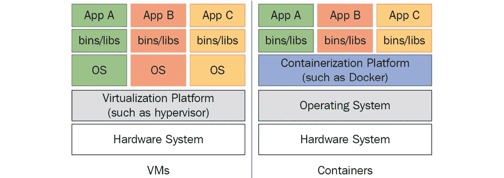
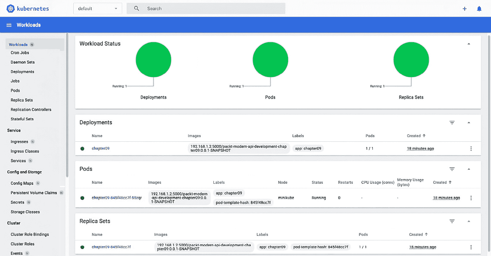

# 9

# Web 服务的部署

在这一章中，你将了解容器化、Docker 和 Kubernetes 的基础知识。然后，你将使用这些概念使用 Docker 容器化一个示例电子商务应用程序。然后，这个容器将被部署到 Kubernetes 集群中。你将使用 Minikube 进行 Kubernetes，这使得学习和基于 Kubernetes 的开发变得更加容易。

完成这一章后，你将能够在一个 Kubernetes 集群中执行容器化和容器部署。

在这一章中，你将探索以下主题：

+   探索容器化的基础知识

+   构建 Docker 镜像

+   在 Kubernetes 中部署应用程序

# 技术要求

你需要以下内容来开发和执行本章中的代码：

+   Docker（容器引擎）

+   Kubernetes (Minikube)

+   需要一个互联网连接来克隆代码 ([`github.com/PacktPublishing/Modern-API-Development-with-Spring-6-and-Spring-Boot-3/tree/dev/Chapter09`](https://github.com/PacktPublishing/Modern-API-Development-with-Spring-6-and-Spring-Boot-3/tree/dev/Chapter09)) 并下载依赖项和 Gradle

+   失眠/cURL 或任何 API 客户端用于 API 测试

让我们开始吧！

# 什么是容器化？

在开发大型、复杂系统时，团队经常遇到的一个问题是，在一台机器上运行正常的代码在另一台机器上却无法工作。这类情况的主要原因是不匹配的依赖项（如不同版本的 Java、特定的 Web 服务器或操作系统）、配置或文件。

此外，设置新的环境以部署新产品有时需要一天或更长时间。在当今的环境下这是不可接受的，并且会减慢你的开发周期。这些问题可以通过容器化应用程序来解决。

在容器化中，应用程序被捆绑、配置，并包装了所有必需的依赖项和文件。这个捆绑包可以在支持容器化过程的任何机器上运行。这种捆绑确保了应用程序在所有环境中表现出完全相同的行为。因此，与配置或依赖项相关的错误可以得到解决，部署时间可以缩短到几分钟或更少。

这个位于物理机器及其操作系统之上的捆绑包被称为容器。这个容器以只读模式共享宿主机的内核以及其宿主操作系统的库和二进制文件。因此，容器是轻量级的。在这一章中，你将使用 Docker 和 Kubernetes 进行容器化和容器部署。

一个相关的概念是虚拟化——通过将现有硬件系统分割成不同的部分来创建虚拟环境的过程。每个部分都作为一个独立的、独特的、个体系统运行。这些系统被称为**虚拟机**（**VM**）。每个虚拟机都运行在其自己的独特操作系统上，拥有自己的二进制文件、库和应用程序。虚拟机是重量级的，大小可达多个**千兆字节**（**GB**）。一个硬件系统可以拥有运行不同操作系统（如 Unix、Linux 和 Windows）的虚拟机。以下图表描述了虚拟机和容器之间的区别：



图 9.1 – 虚拟机与容器

有时候，人们认为虚拟化和容器化是同一件事，但实际上并非如此。虚拟机是在宿主系统之上创建的，它与虚拟机共享硬件，而容器是在硬件及其操作系统之上作为隔离进程执行的。容器轻量级，大小只有几 MB，有时是 GB，而虚拟机则是重量级的，大小可达多个 GB。容器比虚拟机运行得更快，而且它们也更加便携。

在下一节中，我们将通过构建 Docker 镜像来更详细地探讨容器。 

# 构建 Docker 镜像

到目前为止，你已经知道了容器化的好处以及为什么它越来越受欢迎——你创建一个应用程序、产品或服务，使用容器化将其打包，然后交给 QA 团队、客户或 DevOps 团队运行，而不会出现任何问题。

在本节中，你将学习如何将 Docker 用作容器化平台。在创建示例电子商务应用程序的 Docker 镜像之前，让我们先了解一下它。

## Docker 是什么？

Docker 于 2013 年推出，是领先的容器平台和开源项目。2013 年 8 月推出交互式教程后，有 1 万名开发者尝试了它。到 2013 年 6 月 1.0 版本发布时，它已被下载了 275 万次。许多大型公司与 Docker Inc.签订了合作协议，包括微软、红帽、惠普和 OpenStack，以及服务提供商如 AWS、IBM 和谷歌。

Docker 利用 Linux 内核特性来确保资源隔离和应用程序及其依赖项（如`cgroups`和`namespaces`）的打包。Docker 容器中的所有内容都在宿主机上原生执行，并直接使用宿主机内核。每个容器都有自己的用户命名空间——一个用于进程隔离的**进程标识符**（**PID**），一个用于管理网络接口的**网络**（**NET**），用于管理对 IPC 资源访问的**进程间通信**（**IPC**），用于管理文件系统挂载点的**挂载点**（**MNT**），以及用于隔离内核和版本标识符的**Unix 时间共享**（**UTS**）命名空间。这种依赖项的打包使得应用程序能够在不同的 Linux 操作系统和发行版上按预期运行，从而支持一定程度的可移植性。

此外，这种可移植性允许开发人员在任何语言中开发应用程序，然后轻松地从任何计算机（如笔记本电脑）部署到不同的环境，如测试、预发布或生产。Docker 在 Linux 上原生运行。然而，你还可以在 Windows 和 macOS 上运行 Docker。

容器仅由一个应用程序及其依赖项组成，包括基本的操作系统。这使得应用程序在资源利用方面轻量级且高效。开发人员和系统管理员对容器的可移植性和高效资源利用感兴趣。

我们将在下一小节中探讨 Docker 的架构。

## 理解 Docker 的架构

如其文档所述，Docker 使用客户端-服务器架构。Docker 客户端（**Docker**）基本上是一个**命令行界面**（**CLI**），由最终用户使用；客户端与 Docker 服务器（读作 Docker 守护进程）进行双向通信。Docker 守护进程承担了繁重的工作，即构建、运行和分发你的 Docker 容器。Docker 客户端和守护进程可以运行在同一系统上或不同的机器上。

Docker 客户端和守护进程通过套接字或通过 RESTful API 进行通信。Docker 注册是公共或私有 Docker 镜像仓库，你可以从中上传或下载镜像——例如，Docker Hub ([hub.docker.com](http://hub.docker.com)) 是一个公共 Docker 注册库。

Docker 的主要组件如下：

+   **Docker 镜像**：Docker 镜像是一个只读模板。例如，一个镜像可以包含安装有 Apache 网络服务器和你的 Web 应用程序的 Ubuntu 操作系统。Docker 镜像是 Docker 的构建组件，镜像用于创建 Docker 容器。Docker 提供了一种简单的方法来构建新镜像或更新现有镜像。你也可以使用其他人创建的镜像，或者扩展它们。

+   `docker stats` 和 `docker events` 用于容器使用统计，如 CPU 和内存使用，以及 Docker 守护进程执行的活动。这些命令有助于你在部署环境中监控 Docker。

## Docker 容器生命周期

你还需要了解 Docker 的容器生命周期，如下所示：

1.  `docker` `create` 命令。

1.  `docker` `run` 命令。

1.  `docker` `pause` 命令。

1.  `docker` `unpause` 命令。

1.  `docker` `start` 命令。

1.  `docker` `stop` 命令。

1.  `docker` `restart` 命令。

1.  `docker` `kill` 命令。

1.  `docker rm` 命令。因此，这仅应针对已停止状态的容器执行。

到目前为止，你可能急于使用 Docker 容器生命周期，但首先，你需要通过访问[`docs.docker.com/get-docker/`](https://docs.docker.com/get-docker/)来安装 Docker。

一旦您安装了 Docker，请转到[`docs.docker.com/get-started/#start-the-tutorial`](https://docs.docker.com/get-started/#start-the-tutorial)以执行第一个 Docker 命令。您可以参考[`docs.docker.com/engine/reference/commandline/docker/`](https://docs.docker.com/engine/reference/commandline/docker/)来了解更多关于 Docker 命令的信息。

更多信息，您可以查看 Docker 提供的 Docker 概述（[`docs.docker.com/get-started/overview/`](https://docs.docker.com/get-started/overview/))。

让我们进行必要的代码更改，以便我们可以为示例电子商务应用程序创建一个 Docker 镜像。

## 通过添加 Actuator 依赖项来构建镜像的编码

我建议您参考*第八章*，*测试 API*，作为本章代码的基础。您不需要任何额外的库来创建 Docker 镜像。然而，您确实需要添加 Spring Boot Actuator 依赖项，它为我们将要创建的示例电子商务应用程序提供生产就绪功能。

依赖项的功能可以帮助您使用 HTTP REST API 和`/actuator/health`端点来监控和管理应用程序，该端点告诉我们应用程序的健康状态。为了本练习的目的，仅找出运行在 Docker 容器内的服务/应用程序的健康状况就足够了。

您可以通过以下步骤添加 Actuator：

1.  将 Actuator 依赖项添加到`build.gradle`（[`github.com/PacktPublishing/Modern-API-Development-with-Spring-6-and-Spring-Boot-3/tree/dev/Chapter09/build.gradle`](https://github.com/PacktPublishing/Modern-API-Development-with-Spring-6-and-Spring-Boot-3/tree/dev/Chapter09/build.gradle)）：

    ```java
    /actuator endpoints. Let’s add a constant to Constants.java (https://github.com/PacktPublishing/Modern-API-Development-with-Spring-6-and-Spring-Boot-3/tree/dev/Chapter09/src/main/java/com/packt/modern/api/security/Constants.java) for the Actuator URL, as shown here:

    ```

    SecurityConfig.java（[`github.com/PacktPublishing/Modern-API-Development-with-Spring-6-and-Spring-Boot-3/tree/dev/Chapter09/src/main/java/com/packt/modern/api/security/SecurityConfig.java`](https://github.com/PacktPublishing/Modern-API-Development-with-Spring-6-and-Spring-Boot-3/tree/dev/Chapter09/src/main/java/com/packt/modern/api/security/SecurityConfig.java)），如下所示：

    ```java
    // rest of the codereq.requestMatchers(toH2Console()).permitAll()    .requestMatchers(new AntPathRequestMatcher(       ACTUATOR_URL_PREFIX)).permitAll()    .requestMatchers(new AntPathRequestMatcher      (TOKEN_URL, HttpMethod.POST.name())).permitAll()// rest of the code
    ```

    ```java

    ```

这样，您已经添加了一个带有 Actuator 端点的匹配器。这允许所有 Actuator 端点都可以带或不带身份验证和授权进行访问。

现在，您可以为名为`bootBuildImage`的 Spring Boot 插件任务配置，以自定义 Docker 镜像的名称。我们将在下一小节中这样做。

## 配置 Spring Boot 插件任务

Spring Boot Gradle 插件已经提供了一个命令（`bootBuildImage`）来构建 Docker 镜像。当在`plugins`部分应用 Java 插件时，它就可用。`bootBuildImage`任务仅适用于构建`.jar`文件，不适用于构建`.war`文件。

您可以通过在`build.gradle`文件中添加以下代码块来自定义镜像的名称：

```java
bootBuildImage {   imageName = "192.168.1.2:5000/${project.name}:${
      project.version}"
}
```

在这里，更改本地 Docker 仓库的 IP 地址和端口号。Docker 仓库的配置将在下一节中解释。将基于您的项目名称和版本构建 Docker 镜像。项目版本已在 `build.gradle` 文件的顶部定义。另一方面，项目名称是从 `settings.gradle` 文件中选择的 ([`github.com/PacktPublishing/Modern-API-Development-with-Spring-6-and-Spring-Boot-3/tree/dev/Chapter09/settings.gradle`](https://github.com/PacktPublishing/Modern-API-Development-with-Spring-6-and-Spring-Boot-3/tree/dev/Chapter09/settings.gradle))。让我们将其重命名，如下面的代码片段所示：

```java
rootProject.name = 'packt-modern-api-development-chapter09'
```

在 *第八章* 中，*测试 API*，`rootProject.name` 的值包含一个字母大写，因此 Docker 镜像构建失败。这是因为插件有一个针对大写字母的验证检查。因此，Docker 镜像名称应仅使用小写字母。

更多信息和自定义选项，请参阅插件文档 ([`docs.spring.io/spring-boot/docs/current/gradle-plugin/reference/htmlsingle/#build-image`](https://docs.spring.io/spring-boot/docs/current/gradle-plugin/reference/htmlsingle/#build-image))。

现在您已经配置了代码，您可以在配置 Docker 仓库后使用它来构建镜像。您将在下一小节中这样做。

## 配置 Docker 仓库

如果您已安装 Docker Desktop，默认情况下，当您构建镜像（`gradlew bootBuildImage`）时，它将被命名为 `docker.io/library/packt-modern-api-development-chapter09:0.0.1-SNAPSHOT`。在这里，名称指的是 `docker.io/library/packt-modern-api-development-chapter09`，版本指的是 `0.0.1-SNAPSHOT`。您可能想知道为什么名称前面有 `docker.io/library` 前缀。这是因为如果您没有指定 Docker 仓库，它将默认使用 `docker.io` 仓库。您需要一个可以从中拉取和推送镜像的 Docker 仓库。它就像一个工件仓库，您可以在其中推送和拉取工件，例如 Spring 库。

一旦构建了镜像，您可以通过应用您的 Docker Hub 登录凭证将其推送到 Docker Hub。然后，您可以从 Docker Hub 获取镜像以部署到您的 Kubernetes 环境。出于开发目的，这并不是一个理想的情况。最佳选项是配置本地 Docker 仓库，然后将其用于 Kubernetes 部署。

使用 Git Bash 在 Windows 上

您可以在 Windows 上使用 Git Bash 运行这些命令；它模拟 Linux 命令。

让我们执行以下命令来检查 Docker 是否正在运行：

```java
$ docker versionClient:
 Cloud integration: v1.0.22
 Version:           20.10.11
 API version:       1.41
 Go version:        go1.16.10
 Git commit:        dea9396
 Built:             Thu Nov 18 00:36:09 2021
 OS/Arch:           darwin/amd64
 Context:           default
 Experimental:      true
Server: Docker Engine – Community
 Engine:
  Version:          20.10.11
  API version:      1.41 (minimum version 1.12)
  Go version:       go1.16.9
// Output truncated for brevity
```

在这里，已安装 Docker。因此，当您运行 `docker version` 时，它会显示输出。没有错误输出的版本输出确认 Docker 正在运行。

现在，您可以使用以下命令拉取并启动 Docker 仓库：

```java
$ docker run -d -p 5000:5000 -e REGISTRY_STORAGE_DELETE_ENABLED=true --restart=always --name registry registry:2Unable to find image 'registry:2' locally
2: Pulling from library/registry
ef5531b6e74e: Pull complete
a52704366974: Pull complete
dda5a8ba6f46: Pull complete
eb9a2e8a8f76: Pull complete
25bb6825962e: Pull complete
Digest: sha256:41f413c22d6156587e2a51f3e80c09808b8c70e82be149b82b5e01 96a88d49b4
Status: Downloaded newer image for registry:2
bca056bf9653abb14ee6c461612a999c7c61ab45ea8837ecfa1c4b1ec5e5f047
```

在这里，当您第一次运行 Docker 仓库时，它会先下载 Docker 仓库镜像然后再运行。Docker 仓库的执行会在端口 `5000` 上创建一个名为 `registry` 的容器。如果端口 `5000` 被您的机器上的其他服务使用，那么您可以使用不同的端口，例如 `5001`。有两个端口条目——一个是内部容器端口，另一个是公开的外部端口。两者都设置为 `5000`。`–restart=always` 标志告诉 Docker 每次重启 Docker 时都启动仓库容器。`REGISTRY_STORAGE_DELETE_ENABLED` 标志，正如其名称所暗示的，用于从 `registry` 中删除任何镜像，因为它被设置为 `true`。此标志的默认值是 `false`。

现在，让我们检查容器：

```java
$ docker psCONTAINER ID   IMAGE        COMMAND
CREATED          STATUS          PORTS                    NAMES
bca056bf9653   registry:2   "/entrypoint.sh /etc…"
11 minutes ago   Up 11 minutes   0.0.0.0:5000->5000/tcp   registry
```

这表明 Docker 容器仓库正在运行，并且是使用 `registry:2` 镜像创建的。

当您使用容器时，主机名是必要的。因此，您将使用 IP 地址而不是本地主机名来指定仓库。这是因为当您使用 `localhost` 作为主机名时，容器将引用其自身的 localhost，而不是您系统的 localhost。在 Kubernetes 环境中，您需要提供一个仓库主机，因此您需要使用 IP 或适当的域名来代替 `localhost`。

让我们通过运行以下命令来找出我们可以使用的 IP：

```java
# For Mac$ echo $(osascript -e "Ipv4 address of (system info)")
192.168.1.2
# For Windows
$ ipconfig
Windows IP Configuration
Ethernet adapter Ethernet:
  Media State . . . . . . . . . . . : Media disconnected
  Connection-specific DNS Suffix . :
Ethernet adapter vEthernet (Default Switch):
  Connection-specific DNS Suffix . :
  Link-local Ipv6 Address . . . . . : ef80::2099:f848:8903:f996%81
  Ipv4 Address. . . . . . . . . . . : 192.168.1.2
  Subnet Mask . . . . . . . . . . . : 255.255.240.0
  Default Gateway . . . . . . . . . :
```

您可以在前面的输出中高亮显示的行中找到您系统的 IP 地址。您可以在 Linux 上使用类似的命令来查找您系统的 IP 地址。

我们尚未为系统主机配置**传输层安全性**（**TLS**），因此这个仓库是不安全的。Docker 默认只支持安全的仓库。我们必须配置 Docker 以使其能够使用不安全的仓库。请参考 Docker 文档了解如何配置不安全的仓库（[`docs.docker.com/registry/insecure/-deploy-a-plain-http-registry`](https://docs.docker.com/registry/insecure/-deploy-a-plain-http-registry)）。

在 daemon.json 中添加不安全的仓库

`daemon.json` 在 Linux 上位于 `/etc/docker/daemon.json`。

1. 对于 Mac/Windows 上的 Docker Desktop，导航到 **Docker 应用** | **设置** | **Docker 引擎**。

2. 将 `insecure-registries` 条目添加到 JSON 中：

`{`

`“``features”: {`

`“``buildkit”: true`

`},`

`“``insecure-registries”: [`

`“``192.168.1.2:5000”`

`],`

`…`

`…`

`}`

3. 重启 Docker。

注意，为了成功构建和发布镜像，Docker 配置必须使用本地仓库进行，如前所述。

注意

为了安全起见，不要在任何非本地或开发环境中使用不安全的仓库。

现在，让我们为示例电子商务应用创建一个 Docker 镜像。

## 执行 Gradle 任务来构建镜像

您需要修改`bootBuildImage`任务，以便镜像的名称包含本地 Docker 仓库的前缀。Spring Boot 的`bootBuildImage`使用 Paketo Buildpacks 构建 Docker 镜像。它支持**长期支持**（**LTS**）Java 版本和仅当前的非 LTS Java 版本。这意味着，当非 LTS Java 20 发布时，它将移除对 Java 19 的支持。同样，当 Java 21 发布时，它将移除对 Java 20 的支持。但是，它不会移除对 Java 17 的支持，因为 Java 17 是一个 LTS 版本。我们可以这样进行更改：

```java
bootBuildImage {   imageName = "192.168.1.2:5000/${project.name}:${
       project.version}"
   environment = ["BP_JVM_VERSION" : "17"]
}
```

在这里，您根据本地 Docker 仓库已自定义 Docker 镜像的名称。您应根据您的系统和配置更改 IP 地址和端口。您还使用了环境属性来设置 Paketo Buildpacks 变量。您已将 JVM 版本设置为 17。建议使用 Java 17（或任何未来的 LTS 版本）。您可以在[`github.com/paketo-buildpacks/bellsoft-liberica#configuration`](https://github.com/paketo-buildpacks/bellsoft-liberica#configuration)找到所有受支持的 Paketo Buildpacks 环境变量。在撰写本文时，Paketo Buildpacks 不提供官方支持为 ARM 构建镜像。然而，有可用的替代构建器，如[`github.com/dashaun/paketo-arm64`](https://github.com/dashaun/paketo-arm64)，它支持在 ARM 上构建。

现在，您可以从项目的根目录执行以下命令来构建镜像：

```java
$ ./gradlew clean build    # build the jar file of app after running the tests
$ ./gradlew bootBuildImage
> Task :bootBuildImage
Building image '192.168.1.2:5000/packt-modern-api-development-chapter09:0.0.1-SNAPSHOT'
 > Pulling builder image
'docker.io/paketobuildpacks/builder:base'
 ..................................................
 > Pulled builder image
'paketobuildpacks/builder@sha256:e2bf5f2355b0daddb61c6c7ed3e55e58ab581 900da63f892949ded8b772048ee'
 > Pulling run image 'docker.io/paketobuildpacks/run:base-cnb'
 ..................................................
 > Pulled run image
'paketobuildpacks/run@sha256:4a2fbf87a81964ef1a95445f343938ed19406fff da142586a35c9e20904a3315'
 > Executing lifecycle version v0.16.0
 > Using build cache volume 'pack-cache-2fdc28fe99dc.build'
// continue…
```

Spring Boot Gradle 插件使用*Paketo BellSoft Liberica Buildpack*（`docker.io/paketobuildpacks`）来构建应用程序镜像。首先，它从 Docker Hub 拉取镜像，然后运行其容器，如下所示：

```java
> Running creator    [creator]  ===> ANALYZING
    [creator]  Previous image with name
               "192.168.1.2:5000/packt-modern-api-development-
               chapter09:0.0.1-SNAPSHOT" not found
    [creator]  ===> DETECTING
    // truncated output for brevity
    [creator]  ===> RESTORING
    [creator]  ===> BUILDING
    // truncated output for brevity
    [creator]
    [creator]  Paketo Buildpack for BellSoft Liberica 9.11.0
    [creator]  https://github.com/paketo-buildpacks/bellsoft-
               liberica
    // truncated output for brevity
    [creator]  Using Java version 17 from BP_JVM_VERSION
[creator] BellSoft Liberica JRE 17.0.6: Contributing to layer
    [creator]  Downloading from https://github.com/bell-sw/Liberica/releases/download/17.0.6+10/bellsoft-jre17.0.6+10-linux-amd64.tar.gz
    [creator]  Verifying checksum
    [creator]  Expanding to /layers/paketo-
               buildpacks_bellsoft-liberica/jre
    // truncated output for brevity
```

在这里，Spring Boot 插件使用 Bellsoft 的 JRE 17.0.6 和 Linux 作为基础镜像来构建镜像。它使用容器内部的细粒度文件系统层来完成此操作：

```java
    [creator]  Launch Helper: Contributing to layer    [creator]  Creating /layers/paketo-buildpacks_bellsoft-
               liberica/helper/exec.d/active-processor-count
    [creator]  Creating /layers/paketo-buildpacks_bellsoft-
               liberica/helper/exec.d/java-opts
    // truncated output for brevity
    [creator]  Paketo Buildpack for Syft 1.26.0
    [creator]  https://github.com/paketo-buildpacks/syft
    [creator]  Downloading from
               https://github.com/anchore/syft/releases/
               download/v0.75.0/syft_0.75.0_linux_amd64.tar.gz
    // truncated output for brevity
    [creator]  Paketo Buildpack for Executable JAR 6.6.2
[creator] https://github.com/paketo-buildpacks/executable-jar
    [creator]       Class Path: Contributing to layer
    // truncated output for brevity
```

插件继续添加层和标签，最后创建 Docker 镜像：

```java
  [creator]  Paketo Buildpack for Spring Boot 5.23.0  [creator]  https://github.com/paketo-buildpacks/spring-boot
  // truncated output for brevity
  [creator]     ===> EXPORTING
  [creator]  Adding layer 'paketo-buildpacks/ca-
             certificates:helper'
  // truncated output for brevity
  [creator]  Adding layer 'paketo-buildpacks/executable-
             jar:classpath'
  [creator]  Adding layer 'paketo-buildpacks/spring-
             boot:helper'
  [creator]  Adding layer 'paketo-buildpacks/spring-
             boot:spring-cloud-bindings'
  [creator]  Adding layer 'paketo-buildpacks/spring-boot:web-
             application-type'
  [creator]  Adding 5/5 app layer(s)
  [creator]  Adding layer 'buildpacksio/lifecycle:launcher'
  // truncated output for brevity
  [creator]  Adding label 'org.springframework.boot.version'
  [creator]  Setting default process type 'web'
  [creator]  *** Images (9cc6ef620b7c):
  [creator]  192.168.1.2:5000/packt-modern-api-development-
             chapter09:0.0.1-SNAPSHOT
Successfully built image '192.168.1.2:5000/packt-modern-api-development-chapter09:0.0.1-SNAPSHOT'
BUILD SUCCESSFUL in 1m 22s
```

您可以在[`github.com/dsyer/kubernetes-intro`](https://github.com/dsyer/kubernetes-intro)了解更多关于 Spring Boot、Docker 和 Kubernetes 及其配置的信息。

现在 Docker 镜像已经构建完成，您可以使用以下命令使用此镜像在本地运行示例电子商务应用：

```java
$ docker run -p 8080:8080 192.168.1.2:5000/packt-modern-api-development-chapter09:0.0.1-SNAPSHOT
```

此命令将在容器内部运行端口`8080`上的应用程序。因为它已经在端口`8080`上暴露，所以一旦应用程序启动并运行，您也可以在容器外部通过`8080`访问示例电子商务应用。您可以在应用程序容器启动并运行后，在另一个终端标签页/窗口中运行以下命令来测试应用程序：

```java
$ curl localhost:8080/actuator/health{"status":"UP"}
$ curl localhost:8080/actuator
{
 "_links": {
  "self": {
    "href": "http://localhost:8080/actuator",
    "templated": false },
  "health-path": {
    "href": "http://localhost:8080/actuator/ health/{*path}",
    "templated": true },
  "health": {
    "href": "http://localhost:8080/actuator/health",
    "templated": false }
  }
}
```

`curl localhost:8080/actuator`命令返回可用的 Actuator 端点，例如`health`和`health-path`。

您也可以使用以下命令列出容器及其状态：

```java
$ docker psCONTAINER ID   IMAGE                                                                    COMMAND                  CREATED          STATUS           PORTS                    NAMES
62255c54ab52   192.168.1.2:5000/packt-modern-api-development-chapter 09:0.0.1-SNAPSHOT   "/cnb/process/web"       7 minutes ago    Up 7 minutes    0.0.0.0:8080->8080/tcp   elated_ramanujan
bca056bf9653   registry:2                                                               "/entrypoint.sh /etc…"   58 minutes ago   Up 58 minutes   0.0.0.0:5000->5000/tcp   registry
```

接下来，让我们运行以下命令来查找可用的 Docker 镜像：

```java
$ docker imagesREPOSITORY                                                          TAG              IMAGE ID       CREATED        SIZE
paketobuildpacks/run                                                base-cnb         68c538f4e078   5 hours ago    87MB
registry                                                            2                 0d153fadf70b   5 weeks ago    24.2MB
paketobuildpacks/builder                                            base             38446f68a5f8   43 years ago   1.26GB
192.168.1.2:5000/packt-modern-api-development-chapter09             0.0.1-SNAPSHOT   9cc6ef620b7c   43 years ago   311MB
```

现在，您可以使用以下命令标记并推送应用程序镜像：

```java
$ docker tag 192.168.1.2:5000/packt-modern-api-development-chapter09:0.0.1-SNAPSHOT 192.168.1.2:5000/packt-modern-api-development-chapter09:0.0.1-SNAPSHOT$ docker push 192.168.1.2:5000/packt-modern-api-development-chapter09:0.0.1-SNAPSHOT
…
b7e0fa7bfe7f: Pushed
0.0.1-SNAPSHOT: digest: sha256:bde567c41e57b15886bd7108beb26b5de7b44c6 6cdd3500c70bd59b8d5c58ded size: 5327
```

同样，您也可以查询本地 Docker 注册表容器。首先，让我们运行以下命令以找到注册表中所有已发布的镜像（默认值为 100）：

```java
$ curl -X GET http://192.168.1.2:5000/v2/_catalog{"repositories":["packt-modern-api-development-chapter09"]}
```

同样，您可以使用以下命令找出任何特定镜像的所有可用标签：

```java
$ curl -X GET http://192.168.1.2:5000/v2/packt-modern-api-development-chapter09/tags/list{"name":"packt-modern-api-development-chapter09","tags":["0.0.1-SNAPSHOT"]}
```

对于这些命令，如果您运行的是本地注册表容器，您也可以使用 `localhost` 而不是 IP。

在下一节中，我们将部署此镜像到 Kubernetes。

# 在 Kubernetes 中部署应用程序

Docker 容器在隔离状态下运行。您需要一个可以执行多个 Docker 容器并管理或扩展它们的平台。Docker Compose 为我们做了这件事。然而，这正是 Kubernetes 发挥作用的地方。它不仅管理容器，还帮助您动态地扩展已部署的容器。

您将使用 Minikube 在本地运行 Kubernetes。您可以在 Linux、macOS 和 Windows 上使用它。它运行一个单节点 Kubernetes 集群，用于学习和开发目的。您可以通过参考相应的指南（[`minikube.sigs.k8s.io/docs/start/`](https://minikube.sigs.k8s.io/docs/start/)）来安装它。

一旦 Minikube 安装完毕，您需要更新 Minikube 的本地不安全注册表，因为默认情况下，Minikube 的注册表使用 Docker Hub。将镜像添加到 Docker Hub 然后为本地使用获取它是开发中的繁琐工作。您可以通过将您的宿主 IP 和本地 Docker 注册表端口添加到 Minikube 的配置文件 `~/.minikube/machines/minikube/config.json` 中的 *HostOptions* | *EngineOptions* | *InsecureRegistry* 来将本地不安全注册表添加到您的 Minikube 环境中（请注意，此文件仅在 Minikube 启动一次后生成；因此，在修改 `config.json` 之前启动 Minikube）：

```java
$ vi ~/.minikube/machines/minikube/config.json 41     …
 42     "DriverName": "qemu2",
 43     "HostOptions": {
 44         "Driver": "",
 45         "Memory": 0,
 46         "Disk": 0,
 47         "EngineOptions": {
 48             "ArbitraryFlags": null,
 49             "Dns": null,
 50             "GraphDir": "",
 51             "Env": null,
 52             "Ipv6": false,
 53             "InsecureRegistry": [
 54                 "10.96.0.0/12",
 55                 "192.168.1.2:5000"
 56             ],
 57     …
```

一旦不安全的注册表已更新，您可以使用以下命令启动 Minikube：

```java
$ minikube start --insecure-registry="192.168.80.1:5000"😄  minikube v1.29.0 on Darwin 13.1
✨  Using the qemu2 driver based on existing profile
👍  Starting control plane node minikube in cluster minikube
🔄  Restarting existing qemu2 VM for "minikube" ...
🐳  Preparing Kubernetes v1.26.1 on Docker 20.10.23 ...
🔗  Configuring bridge CNI (Container Networking Interface) ...
    ▪ Using image gcr.io/k8s-minikube/storage-provisioner:v5
🔎  Verifying Kubernetes components...
🌟  Enabled addons: default-storageclass, storage-provisioner
🏄  Done! kubectl is now configured to use "minikube" cluster and "default" namespace by default
```

在这里，我们在启动 Minikube 时使用了 `--insecure-registry` 标志。这是很重要的，因为它使不安全注册表工作。Kubernetes 集群默认使用默认命名空间。

**命名空间** 是 Kubernetes 特殊对象，允许您将 Kubernetes 集群资源在用户或项目之间划分。然而，您不能有嵌套的命名空间。Kubernetes 资源只能属于单个命名空间。

一旦 Minikube 启动并运行，您可以通过执行以下命令来检查 Kubernetes 是否工作：

```java
$ kubectl get po -ANAMESPACE    NAME                             READY   STATUS    RESTARTS        AGE
kube-system  coredns-787d4945fb-5hzc2         1/1     Running   3 (17m ago)     30m
kube-system  etcd-minikube                    1/1     Running   5 (17m ago)     32m
kube-system  kube-apiserver-minikube          1/1     Running   4 (17m ago)     32m
kube-system  kube-controller-manager-minikube 1/1     Running   5 (3m58s ago)   32m
kube-system  kube-proxy-z4n66                 1/1     Running   4 (17m ago)     31m
kube-system  kube-scheduler-minikube          1/1     Running   4 (17m ago)     32m
kube-system  storage-provisioner              1/1     Running   2 (3m25s ago)   18m
```

`kubectl` 命令是一个用于控制 Kubernetes 集群的命令行工具，类似于 Docker 的 `docker` 命令。它是一个 Kubernetes 客户端，使用 Kubernetes REST API 执行各种 Kubernetes 操作，例如部署应用程序、查看日志以及检查和管理集群资源。

`get po`和`get pod`参数允许您从您的 Kubernetes 集群中检索 Pod。`-A`标志指示`kubectl`从所有命名空间检索对象。在这里，您可以看到所有 Pod 都来自`kube-system`命名空间。

这些 Pod 是由 Kubernetes 创建的，是它内部系统的一部分。

Minikube 将 Kubernetes 仪表板捆绑为 UI，以便对集群的状态有更深入的洞察。您可以通过以下命令启动它：

```java
$ minikube dashboard🔌  Enabling dashboard ...
    ▪ Using image docker.io/kubernetesui/dashboard:v2.7.0
    ▪ Using image docker.io/kubernetesui/metrics-
      scraper:v1.0.8
💡  Some dashboard features require the metrics-server addon. To enable all features please run:
  minikube addons enable metrics-server
🤔  Verifying dashboard health ...
🚀  Launching proxy ...
🤔  Verifying proxy health ...
🎉  Opening http://127.0.0.1:56858/api/v1/namespaces/kubernetes-dashboard/services/http:kubernetes-dashboard:/proxy/ in your default browser...
```

运行仪表板允许您通过 UI 管理 Kubernetes 集群，其外观如下：



图 9.2 – Kubernetes 仪表板

Kubernetes 使用 YAML 配置来创建对象。例如，您需要一个部署和服务对象来部署和访问示例电子商务应用程序。部署将在 Kubernetes 集群中创建一个 Pod，该 Pod 将运行应用程序容器，服务将允许访问它。您可以手动创建这些 YAML 文件，或者使用`kubectl`生成它们。通常，您应该使用`kubectl`，它会为您生成文件。如果需要，您可以修改文件的内容。

让我们在项目的根目录中创建一个新的目录（`k8s`），这样我们就可以存储 Kubernetes 部署配置。我们可以通过在新建的`k8s`目录中使用以下命令来生成部署 Kubernetes 配置文件：

```java
$ kubectl create deployment chapter09--image=192.168.1.2:5000/packt-modern-api-developmentchapter09:0.0.1-SNAPSHOT --dry-run=client -o=yaml > deployment.yaml
$ echo --- >> deployment.yaml
$ kubectl create service clusterip chapter09 --tcp=8080:8080 --dry-run=client -o=yaml >> deployment.yaml
```

在这里，第一个命令使用`create deployment`命令在`deployment.yaml`文件中生成部署配置。Kubernetes 部署定义了您希望运行应用程序的规模。您可以看到副本被定义为`1`。因此，Kubernetes 将运行该部署的单个副本。在这里，您传递了部署的名称（`chapter09`）、要部署的应用程序的镜像名称、`--dry-run=client`标志以预览将发送到集群的对象，以及`-o=yaml`标志以生成 YAML 输出。

第二个命令将`---`追加到`deployment.yaml`文件的末尾。

最后，第三个命令在`deployment.yaml`中创建了服务配置，内部和外部端口都设置为`8080`。

在这里，您使用了相同的文件来部署和服务对象。然而，您可以创建两个单独的文件——`deployment.yaml`和`service.yaml`。在这种情况下，您需要单独在您的 Kubernetes 集群中应用这些对象。

让我们看看`deployment.yaml`文件的内容，该文件是由前面的代码块生成的：

```java
apiVersion: apps/v1kind: Deployment
metadata:
  creationTimestamp: null
  labels:
    app: chapter09
  name: chapter09
spec:
  replicas: 1
  selector:
    matchLabels:
      app: chapter09
  strategy: {}
  template:
    metadata:
      creationTimestamp: null
      labels:
        app: chapter09
    spec:
      containers:
      - image: 192.168.1.2:5000/
       packt-modern-api-developmentchapter09:0.0.1-SNAPSHOT
        name: packt-modern-api-developmentchapter09
        resources: {}
status: {}
---
apiVersion: v1
kind: Service
metadata:
  creationTimestamp: null
  labels:
    app: chapter09
  name: chapter09
spec:
  ports:
  - name: 8080-8080
    port: 8080
    protocol: TCP
    targetPort: 8080
  selector:
    app: chapter09
  type: ClusterIP
status:
  loadBalancer: {}
```

[`github.com/PacktPublishing/Modern-API-Development-with-Spring-6-and-Spring-Boot-3/tree/dev/Chapter09/k8s/deployment.yaml`](https://github.com/PacktPublishing/Modern-API-Development-with-Spring-6-and-Spring-Boot-3/tree/dev/Chapter09/k8s/deployment.yaml)

现在，您可以使用之前创建的`deployment.yaml`文件，从项目根目录运行以下命令来部署示例电子商务应用程序：

```java
$ kubectl apply -f k8s/deployment.yamldeployment.apps/chapter09 created
service/chapter09 created
```

这将在成功创建后，在 Kubernetes 上部署一个示例电子商务应用程序（[`github.com/PacktPublishing/Modern-API-Development-with-Spring-6-and-Spring-Boot-3/tree/dev/Chapter09`](https://github.com/PacktPublishing/Modern-API-Development-with-Spring-6-and-Spring-Boot-3/tree/dev/Chapter09)）。

或者，您可以执行以下步骤将 Docker 镜像发布到 Minikube。启动一个新的终端并执行以下命令（这里应使用相同的终端窗口，因为`eval`命令仅在活动终端中有效）：

1.  执行`eval $(minikube docker-env)`以将 Minikube 环境与您的 Docker 配置对齐。

1.  执行`gradle bootBuildImage`以基于 Minikube 环境生成镜像。

1.  执行以下命令：

    ```java
    minikube stop and minikube start to ensure that the new configuration is applied.
    ```

1.  您可以使用以下命令启动 Minikube 日志：

    ```java
    kubectl apply -f deploymentTest.yaml command.
    ```

这将启动`chapter09`的应用程序部署。然后，您可以使用 Kubernetes 仪表板或`kubectl get all`命令来检查 Pod 和服务的状态。**Pods**是 Kubernetes 中最小且最可部署的对象。它们包含一个或多个容器，并代表 Kubernetes 集群中运行进程的单个实例。Pod 的 IP 地址和其他配置细节可能会更改，因为 Kubernetes 跟踪这些信息，如果 Pod 崩溃，它可能会替换它们。因此，**Kubernetes 服务**在其暴露的 Pod 的 IP 地址上添加了一个抽象层，并管理映射到内部 Pod。

让我们运行以下命令以找出 Pod 和服务的状态：

```java
$ kubectl get allNAME  READY STATUS  RESTARTS   AGE
pod/chapter09-845f48cc7f-55zqr 1/1 Running 0   9m17s
NAME  TYPE CLUSTER-IP   EXTERNAL-IP   PORT(S)    AGE
service/chapter09   ClusterIP   10.100.135.86   <none>        8080/TCP   9m18s
service/kubernetes   ClusterIP   10.96.0.1  <none>        443/TCP    65m
NAME  READY UP-TO-DATE  AVAILABLE   AGE
deployment.apps/chapter09  1/1   1   1     9m18s
NAME   DESIRED CURRENT READY AGE
replicaset.apps/chapter09-845f48cc7f 1   1   1   9m17s
```

这将返回默认命名空间中的所有 Kubernetes 资源。在这里，您可以看到它返回了一个正在运行的 Pod、一个服务、一个部署资源以及`chapter09`的 ReplicaSet。您需要多次运行此命令，直到找到成功或错误的响应（例如“`image is` `not pullable`”）。

您无法直接访问运行在 Kubernetes 内部的程序，正如您可以从以下命令的响应中看到：

```java
$ curl localhost:8080/actuator/healthcurl: (7) Failed to connect to localhost port 8080 after 0 ms: Connection refused
```

您必须使用某种类型的代理或 SSH 隧道来访问运行在 Kubernetes 集群内部的程序。让我们快速使用以下命令创建一个 SSH 隧道：

```java
$ kubectl port-forward service/chapter09 8080:8080Forwarding from 127.0.0.1:8080 -> 8080
Forwarding from [::1]:8080 -> 8080
```

应用程序现在在 Kubernetes 集群内部运行于端口`8080`。它也被映射到本地机器的端口`8080`。由于这种端口映射，您可以在 Kubernetes 集群外部访问应用程序。

让我们在打开一个新的终端窗口后再次尝试访问应用程序：

```java
$ curl localhost:8080/actuator/health{"status":"UP","groups":["liveness","readiness"]}
```

有了这些，应用程序已成功部署到我们的 Kubernetes 集群。现在，您可以使用 Postman 集合并运行所有可用的`REST`端点。

# 摘要

在本章中，你学习了容器化及其与虚拟化的不同之处。你还学习了 Docker 容器化平台以及如何使用 Spring Boot 插件为示例电子商务应用程序生成 Docker 镜像。

然后，你学习了 Docker 仓库以及如何配置本地不安全的仓库，以便你可以用它来本地推送和拉取镜像。相同的命令也可以用来从远程 Docker 仓库推送和拉取镜像。

你还通过使用 Minikube 学习了 Kubernetes 及其集群操作。你配置了它，以便可以从不安全的本地 Docker 仓库拉取 Docker 镜像。

现在，你拥有了构建 Spring Boot 应用程序的 Docker 镜像并将其部署到 Kubernetes 集群所必需的技能。

在下一章中，你将学习 gRPC API 的基础知识。

# 问题

1.  虚拟化和容器化之间有什么区别？

1.  什么是 Kubernetes 的用途？

1.  什么是 `kubectl`？

# 答案

1.  虚拟化用于在宿主系统之上创建虚拟机，虚拟机共享其硬件，而容器化则创建在硬件及其操作系统之上执行的容器。容器轻量级，只需要几个 MB（偶尔需要 GB）。虚拟机重量级，需要多个 GB。容器运行速度更快，比虚拟机更易于携带。

1.  Kubernetes 是一个容器编排系统，用于管理应用程序容器。它跟踪运行中的容器。当容器未被使用时，它会关闭容器，并重启孤儿容器。Kubernetes 集群也用于扩展。当需要时，它可以自动配置资源，如 CPU、内存和存储。

1.  `kubectl` 是 Kubernetes 的 `kubectl`。在本章中，你使用了 `kubectl` 的 `apply` 和 `create` 命令。

# 进一步阅读

+   *《精通 Kubernetes – 第四版*》: [`www.packtpub.com/product/kubernetes-basics-and-beyond-fourth-edition/9781804611395`](https://www.packtpub.com/product/kubernetes-basics-and-beyond-fourth-edition/9781804611395)

+   Docker 文档：[`docs.docker.com/get-started/overview/`](https://docs.docker.com/get-started/overview/)

+   Minikube 文档：[`minikube.sigs.k8s.io/docs/start/`](https://minikube.sigs.k8s.io/docs/start/)

# 第三部分 – gRPC、日志记录和监控

在本部分，你将学习基于 gRPC 的 API 开发。完成本部分后，你将能够区分基于 gRPC 的 API 与 REST 和反应式 API。你将能够使用 Protobuf 架构构建服务器和客户端。最后，你将能够促进分布式日志记录和跟踪，将日志收集为 Elasticsearch 索引，该索引将用于在 Kibana 应用程序上进行调试和分析。

本部分包含以下章节：

+   *第十章*，*开始使用 gRPC*

+   *第十一章*，*gRPC API 开发和测试*

+   *第十二章*，*为服务添加日志和跟踪*
