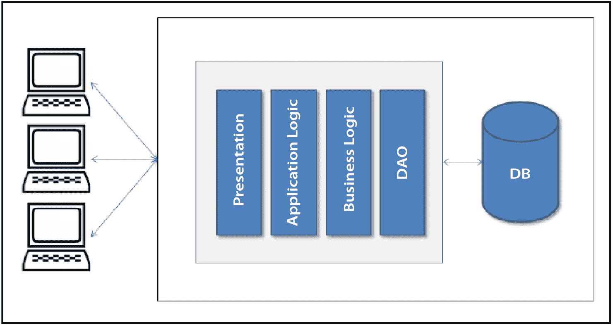
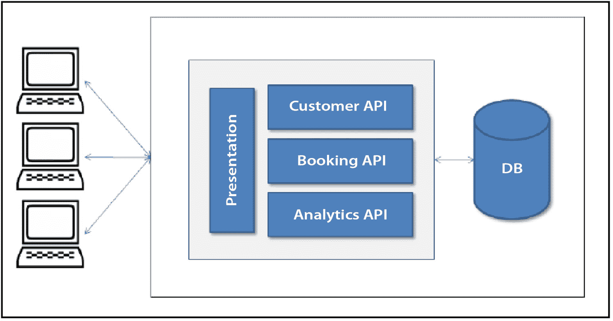
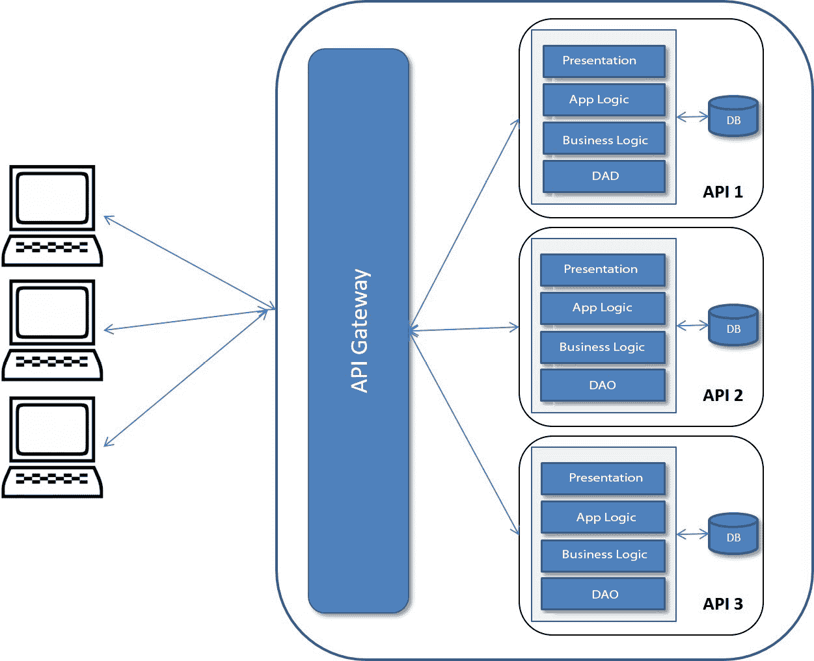

# 第十章：gRPC API 开发和测试

在本章中，您将学习如何实现基于 gRPC 的 API。您将学习如何编写 gRPC 服务器和客户端，以及基于 gRPC 编写 API。在本章的后期部分，您将介绍微服务，并了解它们如何帮助您设计现代、可扩展的架构。

您还将通过实现两个服务 – gRPC 服务器和 gRPC 客户端。基于 gRPC 的 API 在基于微服务的系统中比 REST API 更受欢迎和首选，因此 gRPC 开发技能在 API 领域非常重要。

完成本章后，您将精通 gRPC 服务器和客户端开发、基于 gRPC 的 API 测试自动化以及微服务概念。

在本章中，您将探索以下主题：

+   编写 API

+   开发 gRPC 服务器

+   处理错误

+   开发 gRPC 客户端

+   学习微服务概念

# 技术要求

本章包含大量关于 gRPC 的理论。然而，您还将承担基于 gRPC 的 Web 服务的开发和测试，为此您需要以下内容：

+   任何 Java IDE，例如 NetBeans、IntelliJ 或 Eclipse

+   **Java 开发工具包**（**JDK**）17

+   连接到互联网以克隆代码并下载依赖项和 Gradle

+   Postman/cURL（用于 API 测试）

请访问以下链接以检查代码：[`github.com/PacktPublishing/Modern-API-Development-with-Spring-6-and-Spring-Boot-3/tree/dev/Chapter11`](https://github.com/PacktPublishing/Modern-API-Development-with-Spring-6-and-Spring-Boot-3/tree/dev/Chapter11)

那么，让我们开始吧！

# 编写 API

在本节中，我们将使用 **Protocol Buffer**（**Protobuf**）为支付服务编写 API。如果您还记得，这是在示例电子商务应用中尚未实现的部分。

在编写 API 之前，让我们设置 Gradle 项目。

## 设置项目

本章的代码将在 `Chapter11` 目录下包含三个项目 – API、服务器和客户端：

+   `.proto` 文件及其打包在 JAR 文件中的生成的 Java 类。此项目将生成 `payment-gateway-api-0.0.1.jar` 库工件，您将在本地仓库中发布它。此库将在服务器和客户端项目中使用。

+   **服务器**: 此项目代表 gRPC 服务器，它将实现 gRPC 服务并处理 gRPC 请求。

+   **客户**: 此项目包含 gRPC 客户端，它将调用 gRPC 服务器。为了启动 gRPC 服务器和客户端应用程序之间的服务间通信，您将实现一个 REST 调用，该调用将内部调用 gRPC 服务器以处理 HTTP 请求。

让我们先创建服务器和客户端项目。

### 创建 gRPC 服务器和客户端项目

您可以选择从 Git 仓库克隆*第十一章*代码（[`github.com/PacktPublishing/Modern-API-Development-with-Spring-6-and-Spring-Boot-3/tree/dev/Chapter11`](https://github.com/PacktPublishing/Modern-API-Development-with-Spring-6-and-Spring-Boot-3/tree/dev/Chapter11)）或者您可以从创建单独的`api`库项目开始，从头创建新的 Spring 项目：

+   `Gradle -` `Groovy`

+   `Java`

+   `3.0.8`.

推荐的版本是*3.0+*。请选择可用的版本。您也可以稍后在`build.gradle`文件中手动修改它。

+   `com.packt.modern.api`

+   `chapter11`

+   `Chapter11`

+   《现代 Spring 和 Spring Boot API 开发》第十一章代码 第 2 版

+   `com.packt.modern.api`.*   `Jar`.*   `17`.

您可以选择任何新版本，例如*20*。您也可以稍后在`build.gradle`文件中修改它，如下面的代码块所示：

```java
sourceCompatibility = JavaVersion.VERSION_20
```

+   `Spring Web`.

然后，您可以点击**生成**并下载项目。

下载的项目可以用来创建服务器和客户端。然后，在`Chapter11`目录下创建单独的`server`和`client`目录。创建目录后，将下载的压缩项目中的提取内容复制到它们中。

您可以稍后配置服务器和客户端项目。让我们首先创建 gRPC API 库项目，因为这个库将在服务器和客户端项目中使用。

### 创建 gRPC API 库项目

在`Chapter11`目录下创建一个新的目录，命名为`api`。然后，使用 Gradle 从`Chapter11`目录执行以下命令来创建一个新的 Gradle 项目。它将要求选择一些选项。以下块是在设置`JAVA_HOME`环境变量为 Java 17 并将 Java 17 添加到路径后执行的。您可能会在某些系统中发现问题的顺序略有不同。您应该选择以下终端界面输出中突出显示的选项：

```java
$ mkdir api$ cd api
(you can also use gradlew from other chapter's code)
$ ../server/gradlew init
Select type of project to generate:
  1: basic
  2: application
  3: library
  4: Gradle plugin
Enter selection (default: basic) [1..4] 3
Select implementation language:
  1: C++
  2: Groovy
  3: Java
  4: Kotlin
  5: Scala
  6: Swift
Enter selection (default: Java) [1..6] 3
Select build script DSL:
  1: Groovy
  2: Kotlin
Enter selection (default: Groovy) [1..2] 1
Generate build using new APIs and behavior (some features may change in the next minor release)? (default: no) [yes, no] no
Select test framework:
  1: JUnit 4
  2: TestNG
  3: Spock
  4: JUnit Jupiter
Enter selection (default: JUnit Jupiter) [1..4] 4
Project name (default: api): api
Source package (default: api): com.packt.modern.api
> Task :init
BUILD SUCCESSFUL in 1m 41s
2 actionable tasks: 2 executed
```

项目由 Gradle 引导。接下来，您将配置`api`项目。

### 配置 gRPC API 库项目

在这里，您将在`api/libs/build.gradle`中的`plugins`部分配置 Protobuf 和 Maven Publish 插件。这些插件及其配置是关键步骤。让我们按以下方式操作：

1.  修改项目根目录下的`api/settings.gradle`：

    ```java
    rootProject.name = 'api/lib/build.gradle file. Add the Protobuf and Maven Publish Gradle plugins. Also, replace the java-library plugin with java, as shown next:

    ```

    plugins {    id 'java'    id 'maven-publish'    id "com.google.protobuf" version "0.9.2"}

    ```java

    ```

将使用 Maven Publish 插件将生成的`Jar`工件发布到本地 Maven 仓库。

1.  在`api/libs/build.gradle`中添加组名、版本和源兼容性，如下面的代码块所示。组和版本将由 Maven Publish 插件用于命名发布的工件：

    ```java
    group = 'com.packt.modern.api'version = '0.0.1'sourceCompatibility = JavaVersion.VERSION_17
    ```

1.  接下来，添加以下依赖项，这些依赖项对于 Protobuf 和 gRPC 是必需的（检查突出显示的部分）。你可以删除使用 `gradlew init` 命令生成项目时添加的现有依赖项，并保留下一节中提到的依赖项：

    ```java
    def grpcVersion = '1.54.0'dependencies { implementation "protoc command-line compiler. The plugin searches for the protoc executable in the system path by default. However, you can add a Protobuf compiler artifact to the plugin, which will make the build file self-sufficient as far as the gRPC compile task is concerned. Let’s configure it as shown in the following code block by adding a protobuf section to the api/libs/build.gradle file:

    ```

    protobuf {  protoc {    artifact = "com.google.protobuf:protoc:3.22.2"  }  plugins {    grpc {      artifact = "io.grpc:protoc-gen-grpc-java:1.54.0"    }  }  generateProtoTasks {    all()*.plugins {      grpc { }    }  }}

    ```java

    ```

在前面的代码中，你已配置了 Protobuf 编译器（`protoc`）及其 Java 插件（`protoc-gen-grpc-java`），它将根据 `.proto` 文件生成 Java 代码。

当你第一次运行 `gradlew build` 命令时，Gradle 将根据操作系统下载 `protoc` 和 `protoc-gen-grpc-java` 可执行文件。

1.  Protobuf Gradle 插件与该子节中迄今为止共享的配置一起工作。当你从命令行运行 `build` 命令时，它会工作。然而，如果你不将以下块添加到 `api/libs/build.gradle` 文件中，以将生成的源文件添加到 `sourceSets`，IDE 可能会给出编译错误：

    ```java
    sourceSets {  main {    proto {      // In addition to the default "src/main/proto"      srcDir "src/main/grpc"    }  }}task sourcesJar(type: Jar, dependsOn: classes) {    archiveClassifier = "sources"    from sourceSets.main.allSource}
    ```

1.  最后，你需要在配置 Maven Publish 插件时添加以下块：

    ```java
    publishing {  publications {    mavenJava(MavenPublication) {      artifactId = 'payment-gateway-api'      from components.java    }  }}
    ```

在这里，你已经配置了 `api` 项目。你可以在 [`github.com/google/protobuf-gradle-plugin`](https://github.com/google/protobuf-gradle-plugin) 找到有关 Protobuf Gradle 插件更多信息。

现在已经完成了 `api` 项目的设置，我们准备在下一小节中使用 Protobuf 编写服务定义。你还没有实现我们示例电子商务应用的支付功能。这是因为它需要与 Stripe 或 PayPal 等支付网关服务集成。因此，你将在下一节中编写使用 gRPC 的示例支付网关服务定义。

## 编写支付网关功能

在编写支付网关服务定义之前，让我们首先以简单的方式了解支付网关系统的基本功能。

支付网关提供了一种从客户到在线卖家的支付捕获和转移方式，然后向客户返回接受/拒绝作为响应。它在此执行各种其他操作，例如验证、安全、加密以及与所有参与者的通信。

以下是在此交易中参与的参与者：

+   **支付网关**：一个允许处理在线支付并与其他所有参与者协调的网页界面。这与物理 **销售点**（**POS**）终端非常相似。

+   **商家**：商家是在线卖家或服务提供商，例如亚马逊、优步和爱彼迎。

+   **客户**：这是你，作为客户，为产品或服务执行购买/支付交易，并使用信用卡、数字钱包或在线银行。

+   **发卡行**：提供执行在线货币转账功能的当事人，例如 Visa、Mastercard、AmEx、PayPal、Stripe 或传统银行。

+   **收购方或收购银行**：持有商户账户的机构。它将交易传递给发卡行以接收付款。

您将创建两个 gRPC 服务——`ChargeService`和`SourceService`——作为支付网关服务的一部分。不要与可执行/可部署的 web 服务混淆，它是可执行/可部署的工件。`ChargeService`和`SourceService`是上一章（*第十章*的*如何使用 Protobuf*部分，*开始使用 gRPC*）中 Protobuf 的`EmployeeService`示例的服务组件的一部分。这两个服务都受到 Stripe 公共 REST API 的启发。

在我们跳入创建基于 gRPC 的支付网关服务组件之前，让我们先了解交易流程。

### 在线支付工作流程步骤

在进行在线交易时，将执行以下步骤：

1.  首先，客户应在启动付款之前创建一个支付源（读取方法）。如果没有，则客户将创建一个源，例如他们的卡详情。

1.  通过对支付源创建收费（读取方法）来启动付款。

1.  支付网关执行所有必要的验证和验证步骤，然后允许捕获收费。这些步骤触发了从发卡行到商户账户的资金转移。

您可以观察到在这个工作流程（即源和收费）中涉及两个对象（资源）。因此，您将编写两个围绕这两个对象工作的服务。支付网关还执行各种其他功能，例如争议、退款和支付。然而，在本章中，您将只实现两个服务，即收费和源。

### 编写支付网关服务定义

基于 Protobuf 编写的 IDL 编写方式与您定义 REST API 的 OpenAPI 规范非常相似。在 REST 中，您定义模型和 API 端点，而在 gRPC 中，您定义封装在服务中的消息和 RPC 过程。让我们按照以下步骤编写我们的支付网关服务 IDL：

1.  首先，让我们在`api`项目的根目录下的`api/lib/src/main/proto`目录中创建一个新的文件，名为`PaymentGatewayService.proto`。

1.  在创建新文件后，您可以添加元数据，如下面的代码块所示：

    ```java
    syntax = "proto3";                                   //1package com.packtpub.v1;                             //2option java_package = "com.packt.modern.api.grpc.v1";//3option java_multiple_files = true;                   //4
    ```

让我们详细理解前面的代码：

+   *行 1*告诉编译器使用语法指定符使用 Protobuf 的版本 3。如果您不指定此信息，则编译器将使用版本 2 的 Protobuf。

+   *行 2*使用可选的包指定符将命名空间附加到消息类型。这防止了消息类型之间的名称冲突。我们必须以允许我们创建具有向后兼容性的 API 新版本的包版本后缀。

+   *第 3 行*使用了`java_package`选项指定符。这指定了在生成的 Java 文件中使用的 Java 包。如果您不使用此选项指定符并声明`package`指定符，则`package`的值将用作生成的 Java 文件中的 Java 包。

+   *第 4 行*声明了`java_multiple_files`选项指定符，这是一个布尔选项。默认情况下设置为`false`。如果设置为`true`，则为每个顶级消息类型、枚举（`enum`）和服务生成单独的 Java 文件。

1.  接下来，让我们添加包含所需收费功能的操作的`ChargeService`服务，这些操作由`rpc`表示（如下面的代码块所示）。为收费创建`Charge`对象，用于对卡、银行账户或数字钱包进行收费。让我们将收费服务添加到 Protobuf（`.proto`）文件中：

    ```java
    service ChargeService { rpc Create(CreateChargeReq)     returns(CreateChargeReq.Response); rpc Retrieve(ChargeId)     returns (ChargeId.Response); rpc Update(UpdateChargeReq)     returns(UpdateChargeReq.Response); rpc Capture(CaptureChargeReq)     returns(CaptureChargeReq.Response); rpc RetrieveAll(CustomerId)     returns (CustomerId.Response);}
    ```

https://github.com/PacktPublishing/Modern-API-Development-with-Spring-6-and-Spring-Boot-3/tree/dev/Chapter11/api/lib/src/main/proto/PaymentGatewayService.proto

`ChargeService`中的每个这些过程都将执行以下操作：

+   `Charge`对象。

+   基于先前创建的给定收费 ID 的`Charge`对象。

+   通过设置传递的参数的值来识别给定收费 ID 的`Charge`对象。任何未提供的参数将保持不变。

+   `capture`选项设置为`false`。未捕获的支付在创建后恰好七天到期。如果在此时间点之前未被捕获，它们将被标记为已退款，并且将不再允许捕获。

+   **RetrieveAll**: 此过程返回属于给定客户 ID 的收费列表。

空请求或响应类型

您可以使用`google.protobuf.Empty`作为 void/empty 请求和响应类型。这可以在`.proto`文件中使用。只需在定义任何消息/服务之前放置以下`import`语句：

`import "google/protobuf/timestamp.proto";`。

然后，您可以使用它，如下所示：

`rpc delete(SourceId) returns (google.protobuf.Empty);`。

1.  金额将记入源，这可能是一张卡、银行账户或数字钱包。客户可以使用`Source`对象使用各种支付方式。因此，你需要一个允许你对`source`资源执行操作的服务。让我们将`Source`服务及其操作添加到 Protobuf（`.proto`）文件中：

    ```java
    service SourceService {  rpc Create(CreateSourceReq)      returns (CreateSourceReq.Response);  rpc Retrieve(SourceId)      returns (SourceId.Response);  rpc Update(UpdateSourceReq)      returns (UpdateSourceReq.Response);  rpc Attach(AttachOrDetachReq)      returns (AttachOrDetachReq.Response);  rpc Detach(AttachOrDetachReq)      returns (AttachOrDetachReq.Response);}
    ```

`SourceService`中的每个这些过程都将执行以下操作：

+   `Source`对象。

+   根据给定的源 ID 创建`Source`对象。

+   使用`UpdateSourceReq`对象传递的`Source`对象。任何不属于`UpdateSourceReq`的字段将保持不变。

+   将`Source`对象分配给客户。`AttachOrDetachReq`参数包含源和客户的 ID。然而，`Source`对象必须处于`CHARGEABLE`或`PENDING`状态才能执行附加操作。

+   来自客户的`Source`对象。它还将改变`Source`对象的状态为`consumed`，并且它不能再用来创建费用。`AttachOrDetachReq`参数包含源和客户的 ID。

定义请求和响应类型的推荐方法

建议始终使用包装请求和响应类型。这允许您向请求或响应类型添加另一个字段。

1.  现在服务定义已完成，您可以定义这些过程的给定参数和返回类型。首先，让我们定义`ChargeService`的参数和返回类型。首先，您将定义`Charge`消息类型，如下面的代码块所示：

    ```java
    message Charge {  string id = 1;  uint32 amount = 2;  uint32 amountCaptured = 3;  uint32 amountRefunded = 4;  string balanceTransactionId = 5;  BillingDetails billingDetails = 6;  string calculatedStatementDescriptor = 7;  bool captured = 8;  uint64 created = 9;  string currency = 10;  string customerId = 11;  string description = 12;  bool disputed = 13;  uint32 failureCode = 14;  string failureMessage = 15;  string invoiceId = 16;  string orderId = 17;  bool paid = 18;  string paymentMethodId = 19;  PaymentMethodDetails paymentMethodDetails = 20;  string receiptEmail = 21;  string receiptNumber = 22;  bool refunded = 23;  repeated Refund refunds = 24;  string statementDescriptor = 25;  enum Status {    SUCCEEDED = 0;    PENDING = 1;    FAILED = 2;  }  Status status = 26;  string sourceId = 27;}
    ```

在这里，`Charge`消息包含以下字段：

+   `id`: `Charge`对象的唯一标识符。

+   `amount`: 金额是一个正数或零，指代支付金额。

+   `amountCaptured`: 这是已捕获的金额（一个正数或零）。如果进行了部分捕获，它可能小于`amount`字段的值。

+   `amountRefunded`: 已退还的金额（一个正数或零）。如果发出部分退款，它可能小于`amount`字段的值。

+   `balanceTransactionId`: 平衡交易的 ID，描述了此费用对您的账户余额的影响（不包括退款或争议）。

+   `billingDetails`: `BillingDetails`消息类型的对象，包含与交易时支付方式关联的账单信息。

+   `calculatedStatementDescriptor`: 传递给卡网络并显示在您的客户信用卡和银行对账单上的账单描述。

+   `captured`: 一个布尔字段，表示费用是否已被捕获。（可能创建一个不捕获费用详情的费用。因此，添加了此字段，以确定费用是否将被捕获。）

+   `created`: 对象创建的时间戳（以自 Unix 纪元以来的秒数衡量）。

+   `currency`: 三字母的 ISO 货币代码。

+   `customerId`: 拥有该费用的客户的 ID。

+   `description`: 显示给用户的费用描述。

+   `disputed`: 一个布尔字段，表示该费用是否已被争议。

+   `failureCode`: 失败的错误代码。

+   `failureMessage`: 失败的描述。如果此选项可用，可能还会说明原因。

+   `invoiceId`: 此费用对应的发票 ID。

+   `orderId`: 此费用对应的订单 ID。

+   `paid`: 布尔值表示费用是否成功或已成功授权进行后续捕获。

+   `paymentMethodId`: 支付方式的 ID。

+   `paymentMethodDetails`: 包含支付方式详细信息的对象。

+   `receiptEmail`: 费用收据将被发送的电子邮件地址。

+   `receiptNumber`：这代表通过电子邮件发送的费用收据中的交易号码。它应该在发送费用收据之前保持为 null。

+   `refunded`：一个布尔字段，表示费用是否已退款。

+   `refunds`：此列表包含已发放的退款。使用`repeated`关键字创建`Refund`对象的列表。

+   `statementDescriptor`：卡片费用的描述。

+   `status`：表示费用状态的`Status`枚举类型对象（`SUCCEEDED`、`PENDING`或`FAILED`）。

+   `sourceId`：`Source`对象的 ID。

在上一章的*如何 gRPC 使用 Protobuf*小节下*如何 gRPC 工作？*部分中讨论了`UInt32`和字符串标量类型（*第十章*，*开始使用 gRPC*）。您可以参考它以获取更多信息。

预定义的已知类型

除了标量类型外，Protobuf 还提供了预定义类型，如`Empty`（我们在*步骤 3*中已看到）、`Timestamp`和`Duration`。您可以在 https://developers.google.com/protocol-buffers/docs/reference/google.protobuf 找到完整的列表。

1.  现在，您可以定义其他参数的剩余消息类型（`CreateChargeReq`、`ChargeId`、`UpdateChargeReq`、`CaptureChargeReq`和`CustomerId`），并返回`ChargeService`的`ChargeList`类型，如下面的代码块所示：

    ```java
    message CreateChargeReq {  uint32 amount = 1;  string currency = 2;  string customerId = 3;  string description = 4;  string receiptEmail = 5;  Source source Id = 6;  string statementDescriptor = 7;  message Response { Charge charge = 1; }}message UpdateChargeReq {  string chargeId = 1;  string customerId = 2;  string description = 3;  string receiptEmail = 4;  message Response { Charge charge = 1; }}message CaptureChargeReq {  string chargeId = 1;  uint32 amount = 2;  string receiptEmail = 3;  string statementDescriptor = 4;  message Response { Charge charge = 1; }}message ChargeId {  string id = 1;  message Response { Charge charge = 1; }}message CustomerId {  string id = 1;  message Response { repeated Charge charge = 1; }}
    ```

在这里，`CreateChargeReq`类型包含所需的属性费用金额（`amount`）和`currency`。它还包含几个可选属性——`customerId`、`receiptEmail`、`source`和`statementDescriptor`。

`UpdateChargeReq`包含所有可选属性——`customerId`、`description`和`receiptEmail`。

`CaptureChargeReq`包含所有可选属性——`amount`、`receiptEmail`和`statementDescriptor`。

较不为人知的 Google 常见类型

`Money`和`Date`（不是`Timestamp`）是较少为人所知的类型，可以用来。但是，您必须复制定义而不是导入它们（与您对`Empty`和`Timestamp`所做的不一样）。您可以从以下链接复制定义：`Money`来自 https://github.com/googleapis/googleapis/blob/master/google/type/money.proto 和`Date`来自 https://github.com/googleapis/googleapis/blob/master/google/type/date.proto。您还可以在存储库中找到其他可用的常见类型。

1.  现在，您可以定义参数并返回`SourceService`类型。首先，让我们定义`Source`消息类型，如下面的代码所示。

源使用`Flow`值，可以是`REDIRECT`、`RECEIVER`、`CODEVERIFICATION`或`NONE`。同样，`Usage`值可以是`REUSABLE`或`SINGLEUSE`。因此，让我们首先使用`enum`创建`Flow`和`Usage`枚举：

```java
enum Flow {  REDIRECT = 0;
  RECEIVER = 1;
  CODEVERIFICATION = 2;
  NONE = 3;
}
enum Usage {
  REUSABLE = 0;
  SINGLEUSE = 1;
}
```

现在，您可以在`Source`消息中使用此`Flow`枚举：

```java
message Source {  string id = 1;
  uint32 amount = 2;
  string clientSecret = 3;
  uint64 created = 4;
  string currency = 5;
  Flow flow = 6;
  Owner owner = 7;
  Receiver receiver = 8;
  string statementDescriptor = 9;
  enum Status {
    CANCELLED = 0;
    CHARGEABLE = 1;
    CONSUMNED = 2;
    FAILED = 3;
    PENDING = 4;
  }
  Status status = 10;
  string type = 11;
  Usage usage = 12;
}
```

1.  现在，你可以定义 `SourceService` 的其他参数的剩余消息类型，例如 `CreateSourceReq`、`UpdateSourceReq`、`AttachOrDetachReq` 和 `SourceId`，如下所示：

    ```java
    message CreateSourceReq {  string type = 1;  uint32 amount = 2;  string currency = 3;  Owner owner = 4;  string statementDescriptor = 5;  Flow flow = 6;  Receiver receiver = 7;  Usage usage = 8;  message Response { Source source = 1; }}message UpdateSourceReq {  string sourceId = 1;  uint32 amount = 2;  Owner owner = 3;  message Response { Source source = 1; }}message SourceId {  string id = 1;  message Response { Source source = 1; }}message AttachOrDetachReq {  string sourceId = 1;  string customerId = 2;  message Response { Source source = 1; }}
    ```

这些消息中使用的其他消息类型可以在支付网关定义文件中查阅，该文件位于 https://github.com/PacktPublishing/Modern-API-Development-with-Spring-6-and-Spring-Boot-3/tree/dev/Chapter11/api/lib/src/main/proto/PaymentGatewayService.proto。

多个 `.proto` 文件

你也可以为每个服务创建一个单独的定义文件，例如 `ChargeService.proto` 和 `SourceService.proto`，以提高模块化。然后你可以使用 `import "SourceService.proto";` 将这些文件导入另一个 Protobuf 文件中。

你可以在 https://protobuf.dev/programming-guides/proto3/#importing-definitions 找到更多关于导入的信息。

你现在已经完成了 Protobuf 文件中的支付网关服务定义。现在，你可以使用此文件来生成 gRPC 服务器接口和 gRPC 客户端的存根。

接下来，你将发布从打包在 `Jar` 文件中的 Protobuf 文件生成的 Java 类。

### 发布支付网关服务 gRPC 服务器、存根和模型

你可以使用以下命令，该命令应在 `api` 项目的根目录下执行：

```java
# Make sure to enable UTF-8 for file encoding because# we are using UTF characters in Java files.
$ export JAVA_TOOL_OPTIONS="-Dfile.encoding=UTF8"
$ gradlew clean publishToMavenLocal
```

使用前面的命令，你首先设置文件编码为 UTF-8，因为我们正在使用 Java 文件中的 UTF 字符。然后，你执行清理、构建和发布操作。第二个命令将首先删除现有文件。然后，它将从 Protobuf 文件生成 Java 文件（`generateProto` Gradle 任务），构建它（`build` Gradle 任务），并将工件发布到你的本地 Maven 仓库（`publishToMavenLocal` Gradle 任务）。

`generateProto` Gradle 任务将在两个目录中生成两种类型的 Java 类，如下所示：

+   `/api/lib/build/generated/source/proto/main/java` 目录，例如 `Card.java` 或 `Address.java`。此目录还将包含用于操作合同的请求和响应对象的 Java 文件，例如 `CreateChargeReq`、`CreateSourceReq`、`Charge.java` 和 `Source.java`。

+   `ChargeServiceGrpc.java` 和 `SourceServiceGrpc .java`) 位于 `/api/lib/build/generated/source/proto/main/grpc` 目录。这些 gRPC Java 文件包含一个基类，以及为 `Charge` 和 `Source` 服务描述符中定义的每个操作的方法的存根类。

以下关键静态类在 `ChargeServiceGrpc` 中定义：

+   `ChargeServiceImplBase` (抽象基类)

+   Stubs: `ChargeServiceStub`, `ChargeServiceBlockingStub`, 和 `ChargeServiceFutureStub`

类似地，以下关键静态类在 `SourceServiceGrpc` 中定义：

+   `SourceServiceImplBase` (抽象基类)

+   Stubs: `SourceServiceStub`, `SourceServiceBlockingStub`, 和 `SourceServiceFutureStub`

之前描述的抽象基类包含了在 Protobuf 文件中的服务块中定义的操作。您可以使用这些基类来实现这些服务提供的业务逻辑，就像您从 Swagger 生成的 API Java 接口实现 REST 端点一样。

这些抽象类应该被实现，以向 gRPC 服务器提供业务逻辑实现。让我们接下来开发 gRPC 服务器。

# 开发 gRPC 服务器

在实现这些抽象类之前，您需要配置`server`项目。让我们首先配置服务器项目。

`server`项目目录结构将如下所示。项目根目录包含`build.gradle`和`settings.gradle`文件：

```java
├── server    ├── build.gradle
    ├── gradle
    │   └── wrapper
    ├── gradlew
    ├── gradlew.bat
    ├── settings.gradle
    └── src
        ├── main
        │   ├── java
        │   │   └── com
        │   │       └── packt
        │   │           └── modern
        │   │               └── api
        │   └── resources
        └── test
            └── java
```

`resources`目录将包含`application.properties`文件。

使用 Spring Boot gRPC 启动器

您可以使用两个 Spring Boot 启动器项目。然而，我们将坚持使用 gRPC 提供的库来简化解决方案并帮助理解 gRPC 概念。这些库可在以下链接找到：https://github.com/LogNet/grpc-spring-boot-starter 和 https://github.com/yidongnan/grpc-spring-boot-starter。

让我们执行以下步骤来配置项目：

1.  首先，您需要修改`Chapter11/server/settings.gradle`文件中的项目名称，以表示服务器，如下所示：

    ```java
    rootProject.name = 'chapter11-server'
    ```

1.  接下来，您可以将`server`项目所需的依赖项添加到`Chapter11/server/build.gradle`文件中：

    ```java
    def grpcVersion = '1.54.1'dependencies { implementation payment-gateway-api dependency is published in the local Maven repository. Therefore, you need to add the local Maven repository to the repositories section in Chapter11/server/build.gradle, as shown in the following code block:

    ```

    repositories {  mavenCentral()  mavenLocal()}

    ```java

    ```

您已经完成了 Gradle 配置！现在，您可以编写 gRPC 服务器。然而，在编写服务器之前，您需要实现由 Protobuf 生成的基抽象类。一旦源服务和计费服务（使用基类）被实现，您就可以编写 gRPC 服务器代码。

## gRPC 服务器实现

您将使用与 REST 实现中相同的分层架构 – 持久化存储 > 仓库层 > 服务层 > API 端点。

首先，您需要一个持久化存储，您可以在其中保存数据，也就是第一层。您将使用内存持久化（`ConcurrentHashMap`）来存储和检索数据。如果您愿意，您可以使用与 REST Web 服务中相同的方式使用外部数据库。这样做是为了保持对 gRPC 服务器实现的关注。

首先，为计费和源数据存储创建内存持久化存储。创建一个新文件，`server/src/main/java/com/packt/modern/api/server/repository/DbStore.java`，并添加如下代码块中的代码：

```java
@Componentpublic class DbStore {
 private static final Map<String, Source> sourceEntities =
    new ConcurrentHashMap<>();
 private static final Map<String, Charge> chargeEntities =
    new ConcurrentHashMap<>();
 public DbStore() {
  Source source = Source.newBuilder().setId(
      RandomHolder.randomKey())
      .setType("card").setAmount(100)
      .setOwner(createOwner()).
      setReceiver(createReceiver())
      .setCurrency("USD").setStatementDescriptor("Statement")
      .setFlow(Flow.RECEIVER).setUsage(Usage.REUSABLE)
      .setCreated(Instant.now().getEpochSecond()).build();
  sourceEntities.put(source.getId(), source);
  Charge charge = Charge.newBuilder().setId(
      RandomHolder.randomKey()).setAmount(1000)
      .setCurrency("USD").setCustomerId("ab1ab2ab3ab4ab5")
      .setDescription("ChargeDescription")
      .setReceiptEmail("receipt@email.com")
      .setStatementDescriptor("Statement Descriptor")
      .setSourceId(source.getId())
      .setCreated(Instant.now().getEpochSecond()).build();
  chargeEntities.put(charge.getId(), charge);
 }
// continue …
```

https://github.com/PacktPublishing/Modern-API-Development-with-Spring-6-and-Spring-Boot-3/tree/dev/Chapter11/server/src/main/java/com/packt/modern/api/ server/repository/DbStore.java

在这里，您创建了两个`ConcurrentHashMap`对象，分别用于存储`Charge`和`Store`对象。您在每个构造函数中使用`builder`创建了这些对象的两个种子实例，并将它们存储在其各自的哈希表中。

根据服务合约中定义的操作，您在数据库存储中创建方法以执行这些操作。这些操作使用基本业务逻辑实现，以保持流程和逻辑简洁明了。

现在，让我们添加`createSource()`方法来实现 Protobuf 文件中定义的`SourceService`的`create()`合约，如下面的代码块所示：

```java
public CreateSourceReq.Response       createSource(CreateSourceReq req) {
  Source source = Source.newBuilder().setId(
      RandomHolder.randomKey()).setType(req.getType())
      .setAmount(req.getAmount()).setOwner(createOwner())
      .setReceiver(createReceiver())
      .setCurrency(req.getCurrency())
      .setStatementDescriptor(req.getStatementDescriptor())
      .setFlow(req.getFlow()).setUsage(req.getUsage())
      .setCreated(Instant.now().getEpochSecond()).build();
  sourceEntities.put(source.getId(), source);
  return CreateSourceReq.Response.newBuilder()
         .setSource(source).build();
}
```

此方法从请求对象（`CreateSourceReq`）接收到的值创建一个`source`对象。然后，这个新创建的`Source`对象被保存在一个名为`sourceEntities`的哈希表中，并返回给调用者。您可以通过添加验证来增强此方法，该验证将验证请求对象（`req`）。所有者对象和接收者对象（在代码中突出显示）应从请求对象中检索。为了使程序简单，我们在这里硬编码了这些值。

类似地，您可以为`source`和`charge`及其持久化实现其他合约方法。您可以在以下链接找到该类的完整源代码：https://github.com/PacktPublishing/Modern-API-Development-with-Spring-6-and-Spring-Boot-3/tree/dev/Chapter11/server/src/main/java/com/packt/modern/api/server/repository/DbStore.java。

现在，您已经有了内存持久化存储——`DbStore`。接下来，让我们在仓库类中使用这个存储。

### 编写仓库类

现在，您可以实现下一层——仓库层。内存持久化存储（`DbStore`）可以在`ChargeRepositoryImpl`仓库类中被消费，如下所示：

```java
@Repositorypublic class ChargeRepositoryImpl implements
    ChargeRepository {
  private DbStore dbStore;
  public ChargeRepositoryImpl(DbStore dbStore) {
    this.dbStore = dbStore;
  }
  @Override
  public CreateChargeReq.Response create(
      CreateChargeReq req) {
    return dbStore.createCharge(req);
  }
  // code truncated for brevity
```

https://github.com/PacktPublishing/Modern-API-Development-with-Spring-6-and-Spring-Boot-3/tree/dev/Chapter11/server/src/main/java/com/packt/modern/api/server/repository/ChargeRepositoryImpl.java

`ChargeRepositoryImpl`实现了`ChargeRepository`接口，并使用`DbStore`来执行操作。该仓库接口的代码可在以下链接找到：[`github.com/PacktPublishing/Modern-API-Development-with-Spring-6-and-Spring-Boot-3/tree/dev/Chapter11/server/src/main/java/com/packt/modern/api/server/repository/ChargeRepository.java`](https://github.com/PacktPublishing/Modern-API-Development-with-Spring-6-and-Spring-Boot-3/tree/dev/Chapter11/server/src/main/java/com/packt/modern/api/server/repository/ChargeRepository.java)。

同样，您可以创建`SourceRepositoryImpl`类，该类实现了`SourceRespository`，如下所示：

```java
@Repositorypublic class SourceRepositoryImpl
    implements SourceRepository {
 private DbStore dbStore;
 public SourceRepositoryImpl(DbStore dbStore) {
   this.dbStore = dbStore;
 }
 @Override
 public UpdateSourceReq.Response update
    (UpdateSourceReq req) {
   return dbStore.updateSource(req);
 }
 // Other methods removed for brevity
```

[`github.com/PacktPublishing/Modern-API-Development-with-Spring-6-and-Spring-Boot-3/tree/dev/Chapter11/server/src/main/java/com/packt/modern/api/server/repository/SourceRepositoryImpl.java`](https://github.com/PacktPublishing/Modern-API-Development-with-Spring-6-and-Spring-Boot-3/tree/dev/Chapter11/server/src/main/java/com/packt/modern/api/server/repository/SourceRepositoryImpl.java)

与`ChangeRepositoryImpl`类似，`SourceRepositoryImpl`也使用持久化存储来持久化数据。您可以在[`github.com/PacktPublishing/Modern-API-Development-with-Spring-6-and-Spring-Boot-3/tree/dev/Chapter11/server/src/main/java/com/packt/modern/api/server/repository/SourceRepository.java`](https://github.com/PacktPublishing/Modern-API-Development-with-Spring-6-and-Spring-Boot-3/tree/dev/Chapter11/server/src/main/java/com/packt/modern/api/server/repository/SourceRepository.java)找到`SourceRepository`接口的代码。

`Source`和`Charge`存储库类的方法被服务类消费。服务基类由 gRPC（`api`项目的一部分）生成。服务类实现了这些抽象生成的基类（服务基类）。

接下来，让我们编写服务层。

### 实现服务类

现在您已经有了以存储库和数据库存储类形式存在的底层实现，可以用来实现 gRPC 服务的基础类。

让我们先实现`Source`服务，如下所示：

1.  在`server/src/main/com/packt/modern/api/server/service`目录下创建一个新的文件，名为`SourceService.java`。

1.  将实现添加到定义在`SourceService`抽象基类中的操作中，如下所示：

    ```java
    @Servicepublic class SourceService     extends SourceServiceImplBase {  private final SourceRepository repository;  public SourceService(SourceRepository repository) {    this.repository = repository;  }@Overridepublic void create(CreateSourceReq req, StreamObserver<CreateSourceReq.Response> resObserver) {  CreateSourceReq.Response resp = repository.create      (req);  resObserver.onNext(resp);  resObserver.onCompleted();}// Other methods removed for brevity
    ```

[`github.com/PacktPublishing/Modern-API-Development-with-Spring-6-and-Spring-Boot-3/tree/dev/Chapter11/server/src/main/java/com/packt/modern/api/server/service/SourceService.java`](https://github.com/PacktPublishing/Modern-API-Development-with-Spring-6-and-Spring-Boot-3/tree/dev/Chapter11/server/src/main/java/com/packt/modern/api/server/service/SourceService.java)

在这里，`SourceServiceImplBase`抽象类是由 Protobuf 插件自动生成的，它包含了`Source`服务的合约方法。生成的方法签名中独特的一部分是第二个参数，`StreamObserver`。`StreamObserver`接收可观察流的通知。在这里它被用于服务实现。同样，它也被用于客户端存根。gRPC 库为出站消息提供了`StreamObserver`参数。然而，您还必须为入站消息实现它。

`StreamObserver`参数不是线程安全的，因此您必须注意多线程问题，并应使用同步调用。

1.  `StreamObserver`有三个主要方法：

    +   `onNext()`：此方法接收来自流的值。它可以多次调用。然而，它不应在`onCompleted()`或`onError()`之后调用。当向客户端发送多个数据集时，需要多个`onNext()`调用。

    +   `onCompleted()`：这标志着流的完成，之后不允许进行任何方法调用。它只能调用一次。

    +   `onError()`：此方法接收来自流的终止错误。与`onCompleted()`一样，它只能调用一次，之后不允许进行任何方法调用。

1.  同样，你可以实现抽象类中的其他方法。

接下来，你可以像实现`Source`服务一样实现`Charge`服务。让我们来做这件事：

1.  在`server/src/main/com/packt/modern/api/server/service`目录下创建一个新的文件`ChargeService.java`。

1.  将实现添加到`ChargeService`抽象基类中定义的操作，如下所示：

    ```java
    @Servicepublic class ChargeService       extends ChargeServiceImplBase {  private final ChargeRepository repository;  public ChargeService(ChargeRepository repository) {    this.repository = repository;  }  @Override  public void create(CreateChargeReq req,  StreamObserver<CreateChargeReq.Response>     resObserver) {    CreateSourceReq.Response resp =                                 repository.create(req);    resObserver.onNext(resp);    resObserver.onCompleted();  }  // Other methods truncated for brevity
    ```

[`github.com/PacktPublishing/Modern-API-Development-with-Spring-6-and-Spring-Boot-3/tree/dev/Chapter11/server/src/main/java/com/packt/modern/api/server/service/ChargeService.java`](https://github.com/PacktPublishing/Modern-API-Development-with-Spring-6-and-Spring-Boot-3/tree/dev/Chapter11/server/src/main/java/com/packt/modern/api/server/service/ChargeService.java)

这与`SourceService`的`create`方法实现方式类似。

1.  同样，你可以实现抽象类中的其他方法。请参考代码块后面的源代码链接以获取完整的代码实现。

现在，你已经准备好了服务层的实现。接下来，让我们实现 API 层（gRPC 服务器）。

## gRPC 服务器类的实现

Spring Boot 应用程序在其自己的服务器上运行。然而，我们希望运行 gRPC 服务器，它内部使用 Netty 网络服务器。因此，我们首先需要修改 Spring Boot 配置以停止其网络服务器的运行。你可以通过修改`server/src/main/resources/application.properties`文件来实现，如下面的代码块所示：

```java
spring.main.web-application-type=nonegrpc.port=8080
```

[`github.com/PacktPublishing/Modern-API-Development-with-Spring-6-and-Spring-Boot-3/tree/dev/Chapter11/server/src/main/resources/application.properties`](https://github.com/PacktPublishing/Modern-API-Development-with-Spring-6-and-Spring-Boot-3/tree/dev/Chapter11/server/src/main/resources/application.properties)

接下来，让我们创建 gRPC 服务器。它将包含三个方法——`start()`、`stop()`和`block()`——分别用于启动服务器、停止服务器以及接收终止请求前服务请求。

在`server/src/main/com/packt/ modern/api/server`目录下创建一个新的文件`GrpcServer.java`，并编写如下代码块所示的代码：

```java
@Componentpublic class GrpcServer {
  @Value("${grpc.port:8080}");
  private int port;
  private Server server;
  private final ChargeService chargeService;
  private final SourceService sourceService;
  private final ExceptionInterceptor exceptionInterceptor;
  public GrpcServer(…) { // code removed for brevity }
  public void start() throws IOException,
     InterruptedException {
    server = ServerBuilder.forPort(port)
        .addService(sourceService).
            addService(chargeService)
        .intercept(exceptionInterceptor).build().start();
        server.getServices().stream().forEach(s ->
           Systen.out.println("Service Name: {}",
           s.getServiceDescriptor().getName()));
    Runtime.getRuntime().addShutdownHook(new Thread(() -> {
       GrpcServer.this.stop();
    }));
  }
  private void stop() {
    if (server != null) { server.shutdown(); }
  }
  public void block() throws InterruptedException {
    if (server != null) {
      // received the request until application is
         terminated
      server.awaitTermination();
    }
  }
}
```

[`github.com/PacktPublishing/Modern-API-Development-with-Spring-6-and-Spring-Boot-3/tree/dev/Chapter11/server/src/main/java/com/packt/modern/api/server/GrpcServer.java`](https://github.com/PacktPublishing/Modern-API-Development-with-Spring-6-and-Spring-Boot-3/tree/dev/Chapter11/server/src/main/java/com/packt/modern/api/server/GrpcServer.java)

gRPC 的服务器库提供了用于构建服务器的服务器构建器。您可以看到，两个服务都被添加到了服务器中。构建器还允许您添加拦截器，可以拦截传入的请求和响应。我们将在 *编码处理* *错误* 部分使用拦截器。

`GrpcServer start()` 方法还增加了一个关闭钩子，该钩子调用 `stop()` 方法，该方法内部调用 `server.shutdown()` 方法。

服务器代码已经准备好了。现在，您需要一个接口来启动服务器。您将使用 `CommandLineRunner` 函数接口来运行服务器。

在您创建 `GrpcServer.java` 文件的同目录下创建一个新的文件，命名为 `GrpcServerRunner.java`，并添加以下代码：

```java
@Profile("!test")@Component
public class GrpcServerRunner implements CommandLineRunner {
  private GrpcServer grpcServer;
  public GrpcServerRunner(GrpcServer grpcServer) {
    this.grpcServer = grpcServer;
  }
  @Override
  public void run(String... args) throws Exception {
    grpcServer.start();
    grpcServer.block();
  }
}
```

[`github.com/PacktPublishing/Modern-API-Development-with-Spring-6-and-Spring-Boot-3/tree/dev/Chapter11/server/src/main/java/com/packt/modern/api/server/GrpcServerRunner.java`](https://github.com/PacktPublishing/Modern-API-Development-with-Spring-6-and-Spring-Boot-3/tree/dev/Chapter11/server/src/main/java/com/packt/modern/api/server/GrpcServerRunner.java)

在这里，您重写了 `CommandLineRunner` 的 `run()` 方法并调用了 `start` 和 `block` 方法。因此，当您执行 `jar` 文件时，`GrpcServerRunner` 将使用其 `run()` 方法执行并启动 gRPC 服务器。

另一个需要记住的事情是，您已经用 `@Profile` 注解标记了 `GrpcServerRunner` 类，并设置为 `"!test"` 值，这意味着当测试配置文件激活时，这个类不会被加载，因此也不会被执行。

现在您已经完成了服务和服务器实现，接下来让我们在下一小节测试 gRPC 服务器。

## 测试 gRPC 服务器

首先，您需要在 `test` 类中将活动配置文件设置为 `test`，因为这样做将禁用 `GrpcServerRunner`。让我们这样做并测试它，如下面的代码块所示：

```java
@ActiveProfiles("test")@SpringBootTest
@TestMethodOrder(OrderAnnotation.class)
class ServerAppTests {
  @Autowired
  private ApplicationContext context;
  @Test
  @Order(1)
  void beanGrpcServerRunnerTest() {
    assertNotNull(context.getBean(GrpcServer.class));
    assertThrows(NoSuchBeanDefinitionException.class,
        () -> context.getBean(GrpcServerRunner.class),
        "GrpcServerRunner should not be loaded during
          test");
  }
  // continue …
```

[`github.com/PacktPublishing/Modern-API-Development-with-Spring-6-and-Spring-Boot-3/tree/dev/Chapter11/server/src/test/java/com/packt/modern/api/ServerAppTests.java`](https://github.com/PacktPublishing/Modern-API-Development-with-Spring-6-and-Spring-Boot-3/tree/dev/Chapter11/server/src/test/java/com/packt/modern/api/ServerAppTests.java)

`beanGrpcServerRunnerTest()` 方法测试 `GrpcServer` 类和 `GrpcServerRunner` 的加载，如果配置文件设置正确，测试应该通过。

现在，让我们继续测试 gRPC 服务。

gRPC 测试库提供了一个特殊的类，`GrpcCleanupRule`，它以优雅的方式管理注册的服务器和通道的关闭。你需要用 JUnit 的 `@Rule` 注解它以使其生效。gRPC 测试库还提供了一个 `InProcessServerBuilder` 构建类，它允许你构建服务器，以及一个 `InProcessChannelBuilder` 构建类，它允许你构建通道。这三个类就是你构建和管理服务器和通道所需的所有。

因此，你首先需要声明所需的实例，然后设置方法，以便在向 gRPC `Source` 服务发送请求之前，执行环境可用。

让我们添加所需的类实例，并在以下代码中测试 `setup()` 方法：

```java
@Rulepublic final GrpcCleanupRule grpcCleanup = new
    GrpcCleanupRule();
private static
  SourceServiceGrpc.SourceServiceBlockingStub blockingStub;
@Autowired
private static String newlyCreatedSourceId = null;
@BeforeAll
public static void setup(@Autowired SourceService
      srcSrvc, @Autowired ChargeService chrgSrvc,
      @Autowired ExceptionInterceptor exceptionInterceptor)
      throws IOException {
 String sName = InProcessServerBuilder.generateName(); // 1
 grpcCleanup.register(InProcessServerBuilder
      .forName(sName).directExecutor().addService(srcSrvc)
      .intercept(exceptionInterceptor)
      .build().start());                               // 2
 blockingStub = SourceServiceGrpc.newBlockingStub(
      grpcCleanup.register(InProcessChannelBuilder
      .forName(sName).directExecutor().build()));      // 3
}
```

在这里，`setup` 方法使用 `Source` 服务创建服务器和通道。让我们理解 `setup()` 方法中提到的每一行：

+   *第 1 行* 生成服务器的唯一名称。

+   *第 2 行* 注册了新创建的服务器，并将 `Source` 服务和服务器拦截器添加到其中。我们将在 *处理错误编码* 部分讨论 `ExceptionInterceptor`。然后，它启动服务器以处理请求。

+   *第 3 行* 创建阻塞存根，它将被用作向服务器发出调用的客户端。在这里，再次使用 `GrpcCleanUpRule` 创建客户端通道。

一旦设置执行，它为我们提供了执行测试的环境。让我们测试我们的第一个请求，如下面的代码块所示：

```java
@Test@Order(2)
@DisplayName("Creates source object using create RPC call")
public void SourceService_Create() {
  CreateSourceReq.Response response = blockingStub.create(
     CreateSourceReq.newBuilder().setAmount(100)
     .setCurrency("USD").build());
  assertNotNull(response);
  assertNotNull(response.getSource());
  newlyCreatedSourceId = response.getSource().getId();
  assertEquals(100, response.getSource().getAmount());
  assertEquals("USD", response.getSource().getCurrency());
}
```

`setup()` 方法的所有复杂方面都已完成。现在这些测试看起来相当简单。你只需使用阻塞存根进行调用。你创建请求对象，并使用存根调用服务器。最后，验证服务器响应。

类似地，你可以测试验证错误，如下面的代码块所示：

```java
@Test@Order(3)
@DisplayName("Throws exception when invalid source id is
     passed to retrieve RPC call")
public void SourceService_RetrieveForInvalidId() {
  Throwable throwable = assertThrows(
       StatusRuntimeException.class, () -> blockingStub
       .retrieve(SourceId.newBuilder().setId("").build()));
  assertEquals("INVALID_ARGUMENT: Invalid Source ID passed"
       , throwable.getMessage());
}
```

你还可以测试源检索的有效响应，如下面的代码块所示：

```java
@Test@Order(4)
@DisplayName("Retrieves source obj created by
   createRPC call")
public void SourceService_Retrieve() {
  SourceId.Response response = blockingStub.retrieve
    (SourceId
      .newBuilder().setId(newlyCreatedSourceId).build());
  assertNotNull(response);
  assertNotNull(response.getSource());
  assertEquals(100, response.getSource().getAmount());
  assertEquals("USD", response.getSource().getCurrency());
}
```

这是你可以为 gRPC 服务器编写测试并测试公开的 RPC 调用的方式。你可以使用相同的方法编写其余的测试用例。在编写测试后，你可能会有一个想法，了解客户端将如何向服务器发送请求。

我们还没有讨论我们在服务器代码和测试中使用的异常拦截器。让我们在下节中讨论这个问题。

# 处理错误编码

你可能已经阅读了基于理论的 *处理错误和错误状态码* 部分，在 *第十章*，*开始使用 gRPC*，其中讨论了 `google.rpc.Status` 和 gRPC 状态码。在阅读本节之前，你可能想回顾一下那个部分，因为在这里你将编写实际的代码。

`io.grpc.ServerInterceptor` 是一个线程安全的接口，用于拦截传入的调用，可用于跨切面调用，如身份验证和授权、日志记录和监控。让我们使用它来编写 `ExceptionInterceptor`，如下面的代码块所示：

```java
@Componentpublic class ExceptionInterceptor implements ServerInterceptor {
 @Override
 public <RQT, RST> ServerCall.Listener<RQT> interceptCall(
    ServerCall<RQT, RST> serverCall, Metadata
        metadata,
    ServerCallHandler<RQT, RST> serverCallHandler) 
   ServerCall.Listener<RQT> listener = serverCallHandler
          .startCall(serverCall, metadata);
   return new ExceptionHandlingServerCallListener <>(
       listener, serverCall, metadata);
}
// continue …
```

[`github.com/PacktPublishing/Modern-API-Development-with-Spring-6-and-Spring-Boot-3/tree/dev/Chapter11/server/src/main/java/com/packt/modern/api/server/interceptor/ExceptionInterceptor.java`](https://github.com/PacktPublishing/Modern-API-Development-with-Spring-6-and-Spring-Boot-3/tree/dev/Chapter11/server/src/main/java/com/packt/modern/api/server/interceptor/ExceptionInterceptor.java)

在这里，`RQT` 代表请求类型，而 `RST` 代表响应类型。

我们将用它来进行异常拦截。拦截器将调用传递给服务器监听器（`ExceptionHandlingServerCallListener`）。`ExceptionHandlingServerCallListener` 是 `ExceptionInterceptor` 中的一个私有类，它扩展了 `ForwardingServerCallListener` 抽象类 `SimpleForwardingServerCallListener`。

私有监听器类已重写事件 `onHalfClose()` 和 `onReady()`，这将捕获异常并将调用传递给 `handleException()` 方法。`handleException()` 方法将使用 `ExceptionUtils` 方法来追踪实际的异常并以错误详情响应。`ExceptionUtils` 返回 `StatusRuntimeException`，用于以错误状态关闭服务器调用。

让我们看看下一个代码块中的代码是如何展示这个流程的：

```java
private class ExceptionHandlingServerCallListener<RQT, RST>    extends ForwardingServerCallListener
        .SimpleForwardingServerCallListener<RQT> {
  private final ServerCall<RQT, RST> serverCall;
  private final Metadata metadata;
  ExceptionHandlingServerCallListener
      (ServerCall.Listener<RQT>
     lsnr,ServerCall<RQT, RST> serverCall, Metadata mdata) {
    super(lstnr);
    this.serverCall = serverCall;
    this.metadata = mdata;
  }
  @Override
  public void onHalfClose() {
    try { super.onHalfClose();}
    catch (RuntimeException e) {
      handleException(e, serverCall, metadata);
      throw e;
    }
  }
  @Override
  public void onReady() {
    try { super.onReady();}
    catch (RuntimeException e) {
      handleException(e, serverCall, metadata);
      throw e;
    }
  }
  private void handleException(RuntimeException e,
       ServerCall<RQT, RST> serverCall, Metadata metadata) {
    StatusRuntimeException status = ExceptionUtils.traceException(e);
    serverCall.close(status.getStatus(), metadata);
  }
}
```

[`github.com/PacktPublishing/Modern-API-Development-with-Spring-6-and-Spring-Boot-3/tree/dev/Chapter11/server/src/main/java/com/packt/modern/api/server/interceptor/ExceptionInterceptor.java`](https://github.com/PacktPublishing/Modern-API-Development-with-Spring-6-and-Spring-Boot-3/tree/dev/Chapter11/server/src/main/java/com/packt/modern/api/server/interceptor/ExceptionInterceptor.java)

接下来，我们将编写 `ExceptionUtils` 类以完成异常处理的核心组件。然后，你可以在服务实现中使用这些组件来抛出异常。

`ExceptionUtils` 类将有两种类型的重载方法：

+   `observerError()`: 这个方法将使用 `StreamObserver` 来触发 `onError()` 事件

+   `traceException()`: 这个方法将追踪 `Throwable` 中的错误并返回 `StatusRuntimeException` 实例

你可以使用以下代码来编写 `ExceptionUtils` 类：

```java
@Componentpublic class ExceptionUtils {
private static final Logger LOG = LoggerFactory.getLogger
    (ExceptionInterceptor.class);
  public static StatusRuntimeException
      traceException(Throwable e) {
    return traceException(e, null);
  }
  public static <T extends GeneratedMessageV3> void
    observeError(StreamObserver<T>
        responseObserver, Throwable e) {
    responseObserver.onError(traceException(e));
  }
  public static <T extends GeneratedMessageV3> void
    observeError(StreamObserver<T> responseObserver,
       Exception
      e, T defaultInstance) {
    responseObserver.onError(
        traceException(e, defaultInstance));
  }
  // Continue …
```

[`github.com/PacktPublishing/Modern-API-Development-with-Spring-6-and-Spring-Boot-3/tree/dev/Chapter11/server/src/main/java/com/packt/modern/api/server/exception/ExceptionUtils.java`](https://github.com/PacktPublishing/Modern-API-Development-with-Spring-6-and-Spring-Boot-3/tree/dev/Chapter11/server/src/main/java/com/packt/modern/api/server/exception/ExceptionUtils.java)

在这里，你可以看到 `observerError()` 方法也在内部为 `onError` 事件调用 `traceException()`。让我们接下来编写最后一个重载方法 `traceException()`：

```java
public static <T extends       com.google.protobuf.GeneratedMessageV3>
         StatusRuntimeException traceException(
            Throwable e, T defaultInstance) {
  com.google.rpc.Status status;
  StatusRuntimeException statusRuntimeException;
  if (e instanceof StatusRuntimeException) {
    statusRuntimeException = (StatusRuntimeException) e;
  } else {
    Throwable cause = e;
    if (cause != null && cause.getCause() != null &&
        cause.getCause() != cause) {
      cause = cause.getCause();
    }
    if (cause instanceof SocketException) {
      String errorMessage = "Sample exception message";
      status = com.google.rpc.Status.newBuilder()
          .setCode(com.google.rpc.Code.UNAVAILABLE_VALUE)
          .setMessage(errorMessage + cause.getMessage())
          .addDetails(Any.pack(defaultInstance))
          .build();
    } else {
      status = com.google.rpc.Status.newBuilder()
          .setCode(com.google.rpc.Code.INTERNAL_VALUE)
          .setMessage("Internal server error")
          .addDetails(Any.pack(defaultInstance))
          .build();
    }
    statusRuntimeException = StatusProto
         .toStatusRuntimeException(status);
  }
  return statusRuntimeException;
}
```

在这里，以 `SocketException` 为例。你可以在这里添加对另一种异常的检查。你可能注意到，在这里我们使用 `com.google.rpc.Status` 来构建状态。然后，将这个 `Status` 实例传递给 `StatusProto` 的 `toStatusRuntimeException()`，它将状态转换为 `StatusRuntimeException`。

让我们在 `DbStore` 类中添加验证错误，以便使用这些异常处理组件，如下面的代码块所示：

```java
public SourceId.Response retrieveSource(String sourceId) {  if (Strings.isBlank(sourceId)) {
    com.google.rpc.Status status =
         com.google.rpc.Status.newBuilder()
        .setCode(Code.INVALID_ARGUMENT.getNumber())
        .setMessage("Invalid Source ID is
           passed.").build();
    throw StatusProto.toStatusRuntimeException(status);
  }
  Source source = sourceEntities.get(sourceId);
  if (Objects.isNull(source)) {
    com.google.rpc.Status status =
         com.google.rpc.Status.newBuilder()
        .setCode(Code.INVALID_ARGUMENT.getNumber())
        .setMessage("Requested source is not available")
        .addDetails(Any.pack(
           SourceId.Response.getDefaultInstance())
              ).build();
    throw StatusProto.toStatusRuntimeException(status);
  }
  return SourceId.Response.newBuilder()
        .setSource(source).build();
}
```

[`github.com/PacktPublishing/Modern-API-Development-with-Spring-6-and-Spring-Boot-3/tree/dev/Chapter11/server/src/main/java/com/packt/modern/api/server/repository/DbStore.java`](https://github.com/PacktPublishing/Modern-API-Development-with-Spring-6-and-Spring-Boot-3/tree/dev/Chapter11/server/src/main/java/com/packt/modern/api/server/repository/DbStore.java)

你可以在服务实现的任何部分类似地引发 `StatusRuntimeException`。你还可以使用 `com.google.rpc.Status` 的 `addDetails()` 方法向错误状态添加更多详细信息，如 `traceException(Throwable e, T defaultInstance)` 代码所示。

最后，你可以在 `Service` 实现类中捕获由 `SourceService` 的 `retrieve()` 方法引发的错误，如下所示：

```java
@Overridepublic void retrieve(SourceId sourceId, StreamObserver<SourceId.Response> resObserver) {
  try {
    SourceId.Response resp =
                      repository.retrieve(sourceId.getId());
    resObserver.onNext(resp);
    resObserver.onCompleted();
  } catch (Exception e) {
    ExceptionUtils.observeError(resObserver, e,
                      SourceId.Response.getDefaultInstance());
  }
}
```

[`github.com/PacktPublishing/Modern-API-Development-with-Spring-6-and-Spring-Boot-3/tree/dev/Chapter11/server/src/main/java/com/packt/modern/api/server/service/SourceService.java`](https://github.com/PacktPublishing/Modern-API-Development-with-Spring-6-and-Spring-Boot-3/tree/dev/Chapter11/server/src/main/java/com/packt/modern/api/server/service/SourceService.java)

本章简单而建设性地解释了异常处理。你可以根据应用程序的需求进一步增强它。

现在，让我们在下一节中编写 gRPC 客户端。

# 开发 gRPC 客户端

客户端项目的目录结构将如下所示。项目根目录包含 `build.gradle` 和 `settings.gradle` 文件，如下面的目录树结构所示：

```java
├── client   ├── build.gradle
   ├── gradle
   │   └── wrapper
   ├── gradlew
   ├── gradlew.bat
   ├── settings.gradle
   └── src
       ├── main
       │   ├── java
       │   │   └── com
       │   │       └── packt
       │   │           └── modern
       │   │               └── api
       │   └── resources
       └── test
           └── java
```

`resources` 目录将包含 `application.properties` 文件。

让我们执行以下步骤来配置项目：

1.  首先，你需要修改 `Chapter11/client/settings.gradle` 文件中的项目名称，以表示服务器，如下所示：

    ```java
    rootProject.name = 'chapter11-client'
    ```

1.  接下来，你可以在 `Chapter11/client/build.gradle` 文件中添加客户端项目所需的依赖项。`grpc-stub` 库提供了与存根相关的 API，而 `protobuf-java-util` 提供了 Protobuf 和 JSON 转换的实用方法：

    ```java
    def grpcVersion = '1.54.1'dependencies {    implementation 'com.packt.modern.api:payment-      gateway-api:0.0.1'    implementation "io.grpc:grpc-stub:${grpcVersion}"    implementation "com.google.protobuf:protobuf-java-      util:3.22.2"    implementation 'org.springframework.boot:      spring-boot-starter-web'    testImplementation 'org.springframework.boot:      spring-boot-starter-test'}
    ```

[`github.com/PacktPublishing/Modern-API-Development-with-Spring-6-and-Spring-Boot-3/tree/dev/Chapter11/client/build.gradle`](https://github.com/PacktPublishing/Modern-API-Development-with-Spring-6-and-Spring-Boot-3/tree/dev/Chapter11/client/build.gradle)

1.  `payment-gateway-api`依赖项已发布在本地 Maven 仓库中。因此，你需要将本地 Maven 仓库添加到`repositories`部分，如下面的代码块所示：

    ```java
    repositories {  mavenCentral()  mavenLocal()}
    ```

你已经完成了 Gradle 配置。现在，你可以编写 gRPC 客户端。

## 实现 gRPC 客户端

如你所知，Spring Boot 应用程序在自己的服务器上运行。因此，客户端的应用程序端口应该与 gRPC 服务器端口不同。此外，我们还需要提供 gRPC 服务器的主机和端口。这些可以在`application.properties`中进行配置：

```java
server.port=8081grpc.server.host=localhost
grpc.server.port=8080
```

[`github.com/PacktPublishing/Modern-API-Development-with-Spring-6-and-Spring-Boot-3/tree/dev/Chapter11/client/src/main/resources/application.properties`](https://github.com/PacktPublishing/Modern-API-Development-with-Spring-6-and-Spring-Boot-3/tree/dev/Chapter11/client/src/main/resources/application.properties)

接下来，让我们创建 gRPC 客户端。这个客户端将用于使用通道配置 gRPC 服务存根。通道负责提供虚拟连接到概念上的端点，以便执行 gRPC 调用。

在`client/src/main/com/packt/modern/api/client`目录下创建一个新文件，命名为`GrpcClient.java`，并添加以下代码块中的代码：

```java
@Componentpublic class GrpcClient {
  @Value("${grpc.server.host:localhost}")
  private String host;
  @Value("${grpc.server.port:8080}")
  private int port;
  private ManagedChannel channel;
  private SourceServiceBlockingStub sourceServiceStub;
  private ChargeServiceBlockingStub chargeServiceStub;
  public void start() {
    channel = ManagedChannelBuilder.forAddress(host, port)
        .usePlaintext().build();
    sourceServiceStub = SourceServiceGrpc
         .newBlockingStub(channel);
    chargeServiceStub = ChargeServiceGrpc
        .newBlockingStub(channel);
  }
  public void shutdown() throws InterruptedException {
    channel.shutdown().awaitTermination
      (1, TimeUnit.SECONDS);
  }
  public SourceServiceBlockingStub getSourceServiceStub() {
    return this.sourceServiceStub;
  }
  public ChargeServiceBlockingStub getChargeServiceStub() {
    return this.chargeServiceStub;
  }
}
```

[`github.com/PacktPublishing/Modern-API-Development-with-Spring-6-and-Spring-Boot-3/tree/dev/Chapter11/client/src/main/java/com/packt/modern/api/client/GrpcClient.java`](https://github.com/PacktPublishing/Modern-API-Development-with-Spring-6-and-Spring-Boot-3/tree/dev/Chapter11/client/src/main/java/com/packt/modern/api/client/GrpcClient.java)

在这里，`start()`是初始化`Source`和`Charge`服务存根的关键。使用`ManagedChannelBuilder`构建`ManagedChannel`。`ManagedChannel`是一个提供生命周期管理的通道。这个管理通道被传递给存根。

你正在使用纯文本通信。然而，它也提供了加密通信。

我们现在已经完成了客户端的代码。现在，我们需要调用`start()`方法。你将按照为`GrpcServerRunner`类实现的方式实现`CommandLineRunner`。

它可以按照以下方式实现：

```java
@Profile("!test")@Component
public class GrpcClientRunner implements CommandLineRunner {
  private static final Logger LOG = LoggerFactory.getLogger
     (GrpcClient.class);
  @Autowired
  GrpcClient client;
  @Override
  public void run(String... args) {
    client.start();
    Runtime.getRuntime().addShutdownHook(new Thread(() -> {
      try {
        client.shutdown();
      } catch (InterruptedException e) {
        System.out.println("error: {}", e.getMessage());
      }
    }));
  }
}
```

[`github.com/PacktPublishing/Modern-API-Development-with-Spring-6-and-Spring-Boot-3/tree/dev/Chapter11/client/src/main/java/com/packt/modern/api/client/GrpcClientRunner.java`](https://github.com/PacktPublishing/Modern-API-Development-with-Spring-6-and-Spring-Boot-3/tree/dev/Chapter11/client/src/main/java/com/packt/modern/api/client/GrpcClientRunner.java)

这将在应用程序启动后启动存根实例化。然后你可以调用存根方法。

现在，为了调用存根方法，让我们添加一个简单的 REST 端点。这将演示如何使用费用服务存根调用其`retrieve`方法。

您可以在`src/main/java/com/packts/modern/api/controller`目录中创建一个新的`ChargeController.java`文件，并将代码添加如下所示：

```java
@RestControllerpublic class ChargeController {
  private final GrpcClient client;
  public ChargeController(GrpcClient client) {
    this.client = client;
  }
  @GetMapping("/charges")
  public String getSources(@RequestParam(defaultValue =
      "ab1ab2ab3ab4ab5") String customerId)
        throws InvalidProtocolBufferException {
    var req = CustomerId.newBuilder()
        .setId(customerId).build();
    CustomerId.Response resp =
       client.getChargeServiceStub().retrieveAll(req);
    var printer = JsonFormat.printer()
         .includingDefaultValueFields();
      return printer.print(resp);
  }
}
```

[`github.com/PacktPublishing/Modern-API-Development-with-Spring-6-and-Spring-Boot-3/tree/dev/Chapter11/client/src/main/java/com/packt/modern/api/controller/ChargeController.java`](https://github.com/PacktPublishing/Modern-API-Development-with-Spring-6-and-Spring-Boot-3/tree/dev/Chapter11/client/src/main/java/com/packt/modern/api/controller/ChargeController.java)

在这里，我们创建了一个 REST 端点，`/charges`。它使用`GrpcClient`实例通过`ChargeServiceStub`调用`Charge` gRPC 服务的`retrieveAll()` RPC 方法。

然后，使用来自`protobuf-java-util`库的`JsonFormat`类将响应转换为 JSON 格式的字符串，并作为响应返回。生成的 JSON 格式的字符串也将包含具有默认值的字段。

我们的开发工作已经完成。现在让我们在下一小节中测试整个流程。

## 测试 gRPC 服务

在测试客户端之前，请确保您的 gRPC 服务器正在运行。假设`api`项目已经构建，并且其最新工件已发布到本地 Maven 仓库：

1.  首先，请确保您的`api`项目库已发布到本地 Maven 仓库，因为它被`server`和`client`项目都需要。如果您已经发布了库，请跳转到*步骤 2*。Java 应设置为版本 17。从`api`项目的根目录执行以下命令：

    ```java
    server project’s root directory (Java should be set to version 17):

    ```

    客户端项目的根目录（Java 应设置为版本 17）：

    ```java
    server and client services are up and running, open a new terminal window and execute the following command (the output is truncated):

    ```

    // 调用客户端服务的费用 API 端点$ curl http://localhost:8081/charges{  "charge": [{    "id": "cle9e9oam6gajkkeivjof5pploq89ncp",    "amount": 1000,    "amountCaptured": 0,    …    "created": "1679924425",    "currency": "USD",    "customerId": "ab1ab2ab3ab4ab5",    "description": "费用描述",    …    "receiptEmail": "receipt@email.com",    …    "status": "SUCCEEDED",    "sourceId": "0ovjn4l6crgp9apr79bhpefme4dok3qf"  }]}

    ```java

    ```

    ```java

    ```

仅为了演示目的，使用了 REST 端点。同样，您可以使用 gRPC 客户端调用其他服务和它们的方法。gRPC 通常用于服务间通信，这对于基于微服务的应用程序至关重要。然而，它也可以用于基于 Web 的通信。

在下一节中，让我们了解一下微服务。

# 理解微服务概念

微服务是自包含的轻量级进程，通过网络进行通信。微服务为其消费者提供专注于特定功能的 API。这些 API 可以使用 REST、gRPC 或事件来实现。

微服务并不新鲜——它们已经存在很多年了。例如，基于 RPC 的通用基础设施*Stubby*，在 21 世纪初被用于谷歌数据中心，以连接几个服务和数据中心。

它们最近在流行度和可见度上有所上升。在微服务变得流行之前，单体架构主要用于开发本地和基于云的应用程序。

单体架构允许开发不同的组件，例如表示层、应用逻辑、业务逻辑和**数据访问对象**（**DAOs**），然后你可以将它们打包在一起形成一个**企业存档**（**EAR**）或**Web 存档**（**WAR**），或者将它们存储在单个目录层次结构中（例如 Rails 或 Node.js）。

许多著名的应用程序，如 Netflix，都是使用微服务架构开发的。此外，eBay、Amazon 和 Groupon 已经从单体架构演变为微服务架构。如今，基于微服务的应用程序开发非常普遍。我们在本章中开发的 gRPC 服务器可以被称为微服务（显然，如果你将服务器的范围限制在`Source`服务或`Charge`服务器）。

让我们在下一小节中看看简单的单体和微服务应用设计。

在本节中，我们将探讨不同的系统设计，这些设计采用单体设计、SOA 单体设计和微服务设计。让我们依次讨论这些设计。

## 传统单体设计

以下图展示了传统的单体应用程序设计。这种设计在 SOA 变得流行之前被广泛使用：



图 11.1 – 传统单体应用设计

在传统的单体设计中，所有内容都打包在同一个存档中（所有表示层代码都打包在表示层存档中，应用逻辑放入应用逻辑存档中，等等），无论它们如何与数据库文件或其他源进行交互。

## 带有服务的单体设计

在 SOA 之后，应用程序开始基于服务进行开发，其中每个组件为其他组件或外部实体提供服务。以下图展示了具有不同服务的单体应用程序；在这里，服务与表示组件一起使用。所有服务、表示组件或任何其他组件都打包在一起：



图 11.2 – 带有服务的单体设计

因此，所有内容都以模块化的方式打包成 EAR。一些 SOA 服务可能被单独部署，但总体上，它将是单体的。然而，数据库是在服务之间共享的。

## 微服务设计

下面的图展示了微服务设计。在这里，每个组件都是独立的。每个组件都可以独立开发、构建、测试和部署。在这里，应用程序的 UI 组件也可以是一个客户端并消费微服务。在我们的例子中，设计的层是在微服务中使用的。



图 11.3 – 微服务设计

API 网关提供了一个接口，不同的客户端可以访问单个服务并解决各种问题，例如当你想为同一服务向不同的客户端发送不同响应时应该怎么做。例如，预订服务可以向移动客户端（最少信息）和桌面客户端（详细信息）发送不同的响应，为每个客户端提供不同的详细信息，然后再向第三方客户端提供不同的内容。

响应可能需要从两个或更多服务中获取信息。

每个 API 服务都将作为一个独立的过程开发和部署，并且这些服务之间的通信将基于公开的 API 进行。

对于一个示例电子商务应用，你可以根据领域和边界上下文来划分应用程序，然后为每个领域开发一个独立的微服务。以下是一个提供的微服务的简要列表：

+   客户

+   订单

+   计费

+   发货

+   开票

+   库存

+   收款

你可以分别开发这些功能，并使用进程间（服务间）通信来整合解决方案。

# 摘要

在本章中，你探索了基于 Protobuf 和 gRPC 的服务实现。你开发了 gRPC 服务器，然后通过开发 gRPC 客户端来消费其服务。你学习了如何对 gRPC 服务器进行单元测试，以及如何处理基于 gRPC 服务的异常，你还学习了微服务的基本概念。

现在，你有了使用 Protobuf 定义服务来开发基于 gRPC 的服务（服务器）和客户端的技能。

在下一章中，你将学习关于在 Web 服务中的分布式日志和跟踪。

# 问题

1.  为什么你应该使用 gRPC 通过 HTTP/2 进行二进制大对象传输？

1.  你已经使用`com.google.rpc.Status`实现了异常处理。你能否不使用它来完成？

1.  `com.google.rpc.Status`和`io.grpc.Status`之间的区别是什么？

# 答案

1.  因为，与 HTTP 库不同，gRPC 库还提供了以下功能：

    +   与应用层流量控制的交互

    +   级联调用取消

    +   负载均衡和故障转移

1.  是的，你可以。你可以使用以下代码块中显示的元数据。然而，使用`com.google.rpc.Status`允许你使用`details`（类型为`Any`）对象，它可以捕获更多信息：

    ```java
    Metadata.Key<SourceId.Response> key = ProtoUtils    .keyForProto(SourceId.Response. getDefaultInstance);Metadata metadata = new Metadata();metadata.put(key, sourceIdResponse);respObserver.onError(Status.INVALID_ARGUMENT   .withDescription("Invalid Source ID")   .asRuntimeException(metadata));
    ```

1.  `com.google.rpc.Status`可以包含`Any`类型的详细信息，这可以用来提供更多的错误详情。`io.grpc.Status`没有包含错误详情的字段。你必须依赖另一个类的元数据来提供与错误相关的详情，这些详情可能或可能不包含仅错误特定的信息。

# 进一步阅读

+   Protobuf 版本 3 文档：[`developers.google.com/protocol-buffers/docs/proto3`](https://developers.google.com/protocol-buffers/docs/proto3)

+   Protobuf 的已知类型：[`developers.google.com/protocol-buffers/docs/reference/google.protobuf`](https://developers.google.com/protocol-buffers/docs/reference/google.protobuf)

+   *实用* *gRPC*：[`www.packtpub.com/in/web-development/practical-grpc`](https://www.packtpub.com/in/web-development/practical-grpc)
