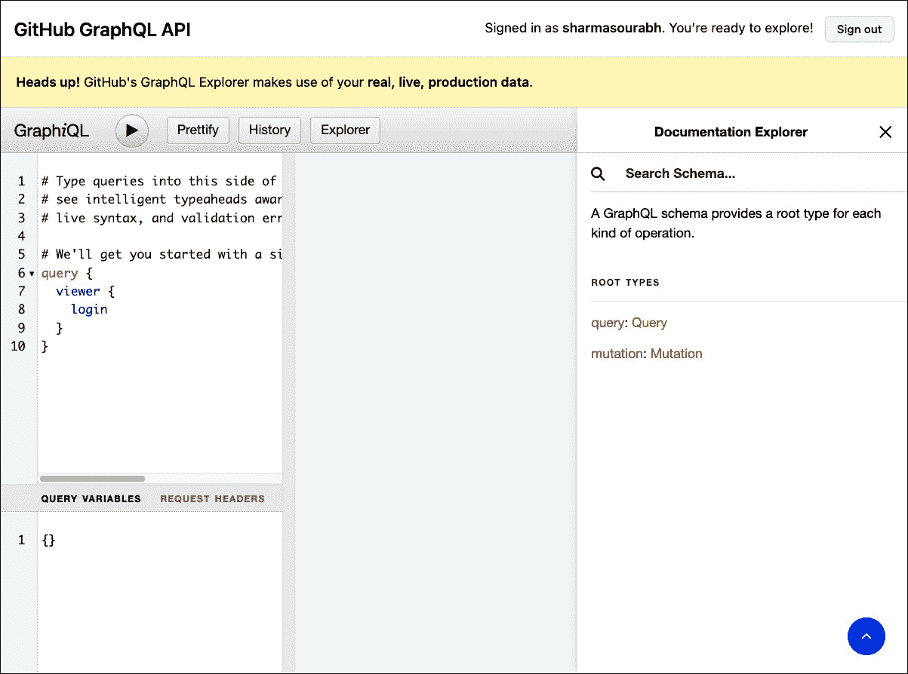

# 13

# 开始使用 GraphQL

在本章中，你将了解 GraphQL 的基础知识，包括其 **模式定义语言**（**SDL**）、查询、突变和订阅。GraphQL API 在基于手持设备的应用程序中很受欢迎，如移动应用，因为它在获取数据方面既快又高效，在某些情况下优于 REST。因此，了解 GraphQL 非常重要。你将在本章的 *比较 GraphQL 与 REST* 部分了解更多关于其与 REST 的比较。完成本章后，你将了解 GraphQL 的基础知识，包括其语义、模式设计以及使用 Spring 和 Spring Boot 开发基于 GraphQL 的 API 所需的一切。

本章将涵盖以下主题：

+   了解 GraphQL

+   学习 GraphQL 的基础知识

+   设计 GraphQL 模式

+   测试 GraphQL 查询和突变

+   解决 N+1 问题

# 技术要求

本章涵盖了 GraphQL 及相关概念的理论基础。建议首先阅读本章，以便开发并测试下一章中展示的基于 GraphQL 的服务代码。

# 了解 GraphQL

你可能听说过或了解 GraphQL，它在过去几年中在 API 领域变得更加流行，并成为实现手持设备和 Web API 的首选方式。

GraphQL 是一种声明式查询和操作语言，也是 API 的服务器端运行时。GraphQL 使客户端能够查询他们确切想要的数据——不多也不少。

我们将在下一小节中讨论其简要历史。

## GraphQL 的简要历史

2011 年，Facebook 在提高其网站在移动浏览器上的性能方面面临挑战。他们开始使用移动原生技术构建自己的移动应用。然而，由于层次结构和递归数据，API 并未达到预期。他们希望优化他们的网络调用。请注意，在那些日子里，世界某些地区的移动网络速度仅为 Kb/s。拥有快速、高质量的移动应用将成为他们成功的关键，因为他们的消费者已经开始转向移动设备。

2012 年，Facebook 上的一些工程师——Lee Byron、Dan Schafer 和 Nick Schrock——联合起来创建 GraphQL。最初，它被用来设计和开发 Facebook 的新闻源功能，但后来，它被用于其整个基础设施中，仅在 Facebook 内部使用，直到 2015 年开源，当时 GraphQL 规范及其 JavaScript 实现对公众开放。很快，GraphQL 规范的其他语言实现也开始推出，包括 Java。

我想你会喜欢观看这个关于 GraphQL 的纪录片，[`www.youtube.com/watch?v=783ccP__No8`](https://www.youtube.com/watch?v=783ccP__No8)，它讲述了 GraphQL 从内部 Facebook 工具到目前成功的历程。

你知道吗？

Netflix 和 Coursera 也在研究一个类似的想法来构建高效且性能良好的 API。Coursera 没有继续推进，但 Netflix 开源了 Falcor。

## 比较 GraphQL 与 REST

你在本书的*第一部分：RESTful Web 服务*中使用了 REST API 来开发 API。实际上，一个示例电子商务 UI 应用也在本书的第一部分中消耗了 REST API 来实现其电子商务功能。我们将继续在本章中引用 REST，以便我们可以在适用的情况下理解必要的 GraphQL 概念。这种相关性应该有助于你轻松掌握 GraphQL 概念。

GraphQL 比 REST 更强大、更灵活、更高效。让我们了解原因。

让我们考虑一个例子，其中用户登录到电子商务 UI 应用并自动导航到产品列表页面。当这种情况发生时，UI 应用会消耗三个不同的端点，如下所示：

+   用户端点，用于获取用户信息

+   产品端点，用于获取产品列表

+   购物车端点，用于从用户的购物车中获取购物车项目

因此，基本上，你必须在 REST 中进行三次调用，以从后端获取固定结构（你无法更改响应中发送的字段）所需的信息。

另一方面，GraphQL 可以在一个调用中获取用户信息、用户的购物车数据和产品列表。因此，它将网络调用次数从三个减少到一次。与 REST 不同，REST 必须为每个用例定义一个端点。你可能会说可以编写一个新的 REST 端点来解决这个问题。是的，这可能解决了这个特定的用例，但它不够灵活；它不会允许快速迭代。

此外，GraphQL 允许你在请求中描述你想要从后端获取的字段。服务器响应只包含作为请求一部分的字段，没有更多，也没有更少。

例如，你可能想添加用户评论到产品中。为此，你只需将评论字段添加到 GraphQL 查询中。同样，你不需要消耗额外的字段。你只需将需要的字段添加到 GraphQL 查询中。另一方面，REST 的响应包含预定义的字段，无论你是否需要在响应对象中获取某些字段。然后，你必须在客户端过滤所需的字段。因此，我们可以这样说，GraphQL 通过避免过度/不足获取问题，更有效地使用网络带宽。

GraphQL API 不需要像 REST 那样进行不断的变化，在 REST 中，你可能需要更改 API 或添加新的 API 以满足需求变化。这提高了开发速度和迭代。你可以轻松地添加新字段或标记那些已经被弃用的（不再被客户端使用的字段）。因此，你可以在客户端进行更改，而不会影响后端。简而言之，你可以编写不断发展的 API，而不需要任何版本控制和破坏性更改。

REST 使用内置的 HTTP 规范提供缓存。然而，GraphQL 不遵循 HTTP 规范；相反，它使用 Apollo/Relay 等库进行缓存。然而，REST 基于 HTTP，并且没有遵循任何实现规范，这可能导致不一致的实现，正如我们在比较 REST 与 gRPC 时讨论的那样。您可以使用 HTTP `GET`方法删除资源。

在移动客户端的使用方面，GraphQL API 优于 REST API。GraphQL API 的功能也使用强类型定义。这些类型是包含 API 定义的模式的一部分。这些类型使用**SDL**在模式中编写。

GraphQL 充当服务器和客户端之间的合约。您可以将 GraphQL 模式与 gRPC **接口定义语言**（**IDL**）文件和 OpenAPI 规范文件相关联。

我们将在下一节讨论 GraphQL 的基础知识。

# 学习 GraphQL 的基础知识

GraphQL API 包含三个重要的**根类型** – **查询**、**突变**和**订阅**。这些都是在 GraphQL 模式中使用特殊 SDL 语法定义的。

GraphQL 提供了一个单一端点，根据请求返回 JSON 响应，该请求可以是查询、突变或订阅。

首先，让我们了解查询。

## 探索查询类型

`Query`类型用于读取操作，从服务器获取信息。单个`Query`类型可以包含多个查询。让我们使用 SDL 编写一个查询，以检索已登录用户，如下面的 GraphQL 模式所示：

```java
type Query {  me: LogginInUser
  # You can add other queries here
}
type LoggedInUser {
  id: ID
  accessToken: String
  refreshToken: String
  username: String
}
```

在这里，您做了两件事：

+   您已定义了 GraphQL 接口的查询根，其中包含您可以运行的查询。它只包含一个查询类型，`me`，它返回`LoggedInUser`类型的实例。

+   您已指定用户定义的`LoggedInUser`对象类型，其中包含四个字段。这些字段后面跟着它们的类型。在前面的代码中，您使用了 GraphQL 的内置*标量类型*，称为`ID`和`String`，来定义字段的类型。我们将在本章后面详细讨论这些类型时讨论这些类型。

一旦您在服务器上实现了此模式，并执行了以下 GraphQL 查询，您将只获得请求的字段及其值，作为 JSON 对象响应。

您可以在以下代码块中找到`me`查询及其 JSON 响应：

```java
# Request input{
  me {
    id
    username
  }
}
#JSON response
{
  "data": {
    "me": {
      "id": "asdf90asdkqwe09kl",
      "username": "scott"
    }
  }
}
```

有趣的是，在这里 GraphQL 的请求输入不以`query`开头，因为`Query`是负载的默认值。这被称为`Mutation`。但是，如果您愿意，您也可以在查询请求输入前加上`query`前缀，如下所示：

```java
query {  me {
    id
    username
  }
}
```

正如你所见，这允许你只查询你需要的字段。在这里，只从`LoggedInUser`类型请求了`id`和`username`字段，服务器只响应了这两个字段。请求负载被括号`{}`包围。你可以在模式中使用`#`进行注释。

现在，你知道如何在 GraphQL 模式中定义`Query`和`object`类型。你还学习了如何根据查询类型和预期的 JSON 响应形成 GraphQL 请求负载。

我们将在下一小节中学习 GraphQL 突变。

## 探索 Mutation 类型

`Mutation`类型用于 GraphQL 请求中在服务器上执行的所有添加、更新和删除操作。一个`Mutation`类型可以包含多个突变。让我们定义一个`addItemInCart`突变，该突变将新项目添加到购物车中：

```java
type Mutation {  addItemInCart(productId: ID, qty: Int): [Item]
  # You can add other mutations here
}
type Item {
  id: ID!
  productId: ID
  qty: Int
}
```

在这里，你已经定义了`Mutation`类型和一个名为`Item`的新对象类型。添加了一个名为`addItemInCart`的突变，并且`Query`、`Mutation`和`Subscription`类型都可以传递参数。为了定义必要的参数，你可以用`()`括号包围命名参数；参数之间用逗号分隔。`addItemInCart`的签名包含两个参数，并返回一个购物车项目列表。列表使用`[]`括号标记。

可选和必需参数

假设你声明了一个具有默认值的参数，如下面的突变所示：

`pay(amount: Float, currency: String = "USD"): Payment`

在这里，`currency`是一个可选参数。它包含默认值，而`amount`是一个必需字段，因为它不包含任何默认值。

请注意，`Int`是 GraphQL 中用于有符号 32 位整数的内置标量类型。默认值在 GraphQL 中为 null。如果你想强制任何字段为非 null 值，那么其类型应该用感叹号（`!`）标记。一旦它（`!`）被应用于模式中的任何字段，当客户端将其放在请求负载中时，GraphQL 服务器将始终提供值而不是 null。你还可以用感叹号声明一个列表；例如，`items: [Item]!`和`items: [Item!]!`。这两种声明都将提供一个包含零个或多个项目的列表。然而，后者将只提供一个有效的`Item`对象（即非 null 值）。

一旦你在服务器上实现了这个模式实现，你就可以使用以下 GraphQL 查询。你将只得到你请求的字段及其值，作为一个 JSON 对象：

```java
# Request inputmutation {
  addItemInCart(productId: "qwer90asdkqwe09kl", qty: 2) {
    id
    productId
  }
}
```

你可以看到，这次，GraphQL 请求输入以`mutation`关键字开头。如果你不以`mutation`关键字开始突变，那么你可能会得到一个错误消息，例如**字段‘addItemInCart’在类型‘Query’上不存在**。这是因为服务器将请求负载视为查询。

在这里，您必须向 `addItemInCart` 突变添加所需的参数，然后添加您想要检索的域（`id` 和 `productId`）。一旦请求成功处理，您将获得以下类似的 JSON 输出：

```java
#JSON response{
  "data": {
    addItemInCart: [
      {
        "id": "zxcv90asdkqwe09kl",
        "productId": "qwer90asdkqwe09kl"
      }
    ]
  }
}
```

在这里，`id` 字段的值由服务器生成。同样，您可以在模式中编写其他突变，如删除和更新。然后，您可以使用 GraphQL 请求中的有效负载相应地处理突变。

我们将在下一小节中探讨 GraphQL `Subscription` 类型。

## 探索订阅类型

如果您只熟悉 REST，那么订阅的概念可能对您来说是新的。在没有 GraphQL 的情况下，您可能会使用轮询或 WebSocket 来实现类似的功能。有许多需要订阅功能的使用场景，包括以下内容：

+   实时比分更新或选举结果

+   批量处理更新

有许多需要立即更新事件的此类情况。GraphQL 为此用例提供了订阅功能。在这种情况下，客户端通过启动并保持稳定的连接来订阅事件。当订阅的事件发生时，服务器将结果事件数据推送到客户端。例如，假设您想了解电子商务应用中任何商品库存的任何变化。任何商品数量的变化都会触发事件，并且订阅将收到包含更新数量的响应。

此数据通过已启动的连接以流的形式发送，而不是通过请求/响应类型的通信（这在查询/突变的情况下使用过）。

推荐方法

建议仅在大型对象（如批量处理）发生少量更新时使用订阅，或者有低延迟的实时更新（如实时比分更新）时使用订阅。否则，您应该使用轮询（在指定间隔定期执行查询）。

让我们在模式中创建一个订阅，如下所示：

```java
type Subscription {  orderShipped(customerID: ID!): Order
  # You can add other subscriptions here
}
# Order type contains order information and another object
# Shipping. Shipping contains id and estDeliveryDate and
# carrier fields
type Order {
  # other fields omitted for brevity
  shipping: Shipping
}
type Shipping {
  Id: ID!
  estDeliveryDate: String
  carrier: String
}
```

在这里，我们定义了一个接受 `customer ID` 作为参数的 `orderShipped` 订阅，并返回 `Order`。客户端订阅此事件，然后每当给定 `customerId` 的订单发货时，服务器将使用流将请求的订单详细信息推送到客户端。

您可以使用以下 GraphQL 请求来订阅 GraphQL 订阅：

```java
# Request Inputsubscription {
  orderShipped(customerID: "customer90asdkqwe09kl") {
    shipping {
      estDeliveryDate
      trackingId
    }
  }
}
# JSON Output
{
  "data": {
    "orderShipped": {
      "estDeliveryDate": "13-Aug-2022",
      "trackingId": "tracking90asdkqwe09kl"
    }
  }
}
```

客户端将在任何属于给定客户的订单发货时请求 JSON 响应。服务器将这些更新推送到所有订阅此 GraphQL 订阅的客户端。

在本节中，您学习了如何在 GraphQL 模式中声明 `Query`、`Mutation` 和 `Subscription` 类型。

您在模式中定义了标量类型和用户定义的对象类型。您还探讨了如何为查询、突变或订阅编写 GraphQL 请求输入。

现在，您已经知道如何在根类型中定义操作参数，并在发送 GraphQL 请求时传递参数。请注意，模式中的非空字段可以用感叹号（`!`）标记。对于数组或对象列表，您必须使用方括号（`[]`）。

在下一节中，我们将深入探讨 GraphQL 模式。

# 设计 GraphQL 模式

模式是一个使用 DSL 语法编写的 GraphQL 文件。主要包含根类型（查询、突变和订阅），以及根类型中使用的相应类型，如对象类型、标量类型、接口、联合类型、输入类型和片段。

首先，让我们讨论这些类型。在前一节中，您已经学习了根类型（查询、突变和订阅）和对象类型。现在让我们更深入地了解标量类型。

## 理解标量类型

**标量类型**用于解析具体数据。标量类型共有三种——内置标量类型、自定义标量类型和枚举类型。我们先来讨论内置标量类型。GraphQL 提供了以下五种内置标量类型：

+   `Int`：这种类型存储整数，由一个有符号的 32 位整数表示。

+   `Float`：这种类型存储一个有符号的双精度浮点值。

+   `String`：这种类型存储一个 UTF-8 字符序列。

+   `Boolean`：这种类型存储布尔值——真或假。

+   `ID`：用于定义对象标识符字符串。这只能序列化为字符串，且不可读。

您还可以定义自己的标量类型，这些类型被称为自定义标量类型。例如，`Date`类型可以定义如下：

```java
 scalar Date
```

您需要编写一个实现，以确定这些自定义标量类型的序列化、反序列化和验证。例如，日期可以被视为 Unix 时间戳，或者在一个自定义的`Date`类型中以特定日期格式的字符串。

另一个特殊的标量类型是枚举类型（`enum`），用于定义一组允许的值。让我们定义一个订单状态枚举，如下所示：

```java
enum OrderStatus {  CREATED
  CONFIRMED
  SHIPPED
  DELIVERED
  CANCELLED
}
```

在这里，`OrderStatus`枚举类型表示在特定时间点的订单状态。

在探索其他类型之前，我们将先检查以下子节中的 GraphQL 片段。

## 理解片段

在客户端查询时，您可能会遇到冲突的场景。您可能有两个或多个查询返回相同的结果（相同的对象或字段集）。为了避免这种冲突，您可以给查询结果起一个名字。这个名字被称为**别名**。

让我们在以下查询中使用一个别名：

```java
query HomeAndBillingAddress {  home: getAddress(type: "home") {
    number
    residency
    street
    city
    pincode
  }
  billing: getAddress(type: "home") {
    number
    residency
    street
    city
    pincode
  }
}
```

在这里，`HomeAndBillingAddress`是一个包含`getAddress`查询操作的命名查询。`getAddress`被使用了两次，这导致它返回相同的字段集。因此，使用`home`和`billing`别名来区分结果对象。

`getAddress` 查询可能会返回 `Address` 对象。`Address` 对象可能有额外的字段，如 `type`、`state`、`country` 和 `contactNo`。因此，当你有可能会使用相同字段集的查询时，你可以创建一个 **片段** 并在查询中使用它。片段逻辑上从 GraphQL 模式中的现有对象创建字段子集，可以在多个地方重复使用，如下面的代码片段所示。

让我们创建一个片段并替换前面代码块中的公共字段：

```java
 query HomeAndBillingAddress {   home: getAddress(type: "home") {
     ...addressFragment
   }
   billing: getAddress(type: "home") {
     ...addressFragment
   }
 }
 fragment addressFragment on Address {
   number
   residency
   street
   city
   pincode
 }
```

在这里，`addressFragment` 片段已经被创建并用于查询中。

你也可以创建一个 `contains the nested object and you just want a few fields of the nested object rather than all the object fields. Inline fragments can be used when a querying field returns an **Interface**` **or `Union` type. We will explore inline fragments in more detail later in the *Understanding interfaces* subsection under the *Designing a GraphQL* *schema* section.**

**我们将在下一小节中查看 GraphQL 接口。**

## 理解接口

GraphQL 接口是抽象的。你可能有几个字段在多个对象中是通用的。你可以为这样的字段集创建一个 `interface` 类型。例如，产品可能有一些共同属性，如 ID、名称和描述。产品还可以根据其类型具有其他属性。例如，一本书可能有几页、作者和出版社，而书架可能有材料、宽度、高度和深度属性。

让我们使用接口关键字定义这三个对象（`Product`、`Book` 和 `Bookcase`）：

```java
interface Product {   id: ID!
   name: String!
   description: string
 }
 type Book implements Product {
   id: ID!
   name: String!
   description: string
   author: String!
   publisher: String
   noOfPages: Int
 }
 type Bookcase implements Product {
   id: ID!
   name: String!
   description: string
   material: [String!]!
   width: Int
   height: Int
   depth: Int
 }
```

在这里，使用 `interface` 关键字创建了一个名为 `Product` 的抽象类型。当我们希望创建新的对象类型 - `Book` 和 `Bookcase` 时，可以实现此接口。

现在，你可以简单地编写以下查询，它将返回所有产品（书籍和书架）：

```java
 type query {   allProducts: [Product]
 }
```

现在，你可以在客户端使用以下查询来检索所有产品：

```java
 query getProducts {   allProducts {
     id
     name
     description
   }
 }
```

你可能已经注意到前面的代码只包含来自 `Product` 接口的属性。如果你想从 `Book` 和 `Bookcase` 获取属性，那么你必须使用 **内联片段**，如下所示：

```java
 query getProducts {   allProducts {
     id
     name
     description
     ... on Book {
       author
       publisher
     }
     ... on BookCase {
       material
       height
     }
   }
 }
```

在这里，使用操作符（`…`）用于创建内联片段。这样，你可以从实现接口的类型中获取字段。

我们将在下一小节中理解 `Union` 类型。

## 理解联合类型

假设有两种对象类型 - `Book` 和 `Author`。在这里，你想要编写一个 GraphQL 查询，它可以返回书籍和作者。请注意，接口不存在；那么我们如何在查询结果中结合这两个对象？在这种情况下，你可以使用 **联合类型**，它是由两个或多个对象组合而成的。

在创建 `Union` 类型之前，请考虑以下内容：

+   你不需要有公共字段。

+   联合成员应该是具体类型。因此，你不能使用 `union`、`interface`、`input` 或 `scalar` 类型。

让我们创建一个可以返回 `union` 类型中包含的任何对象的 `union` 类型 – 书籍和书架 – 如以下代码块所示：

```java
union SearchResult = Book | Author type Book {
   id: ID!
   name: String!
   publisher: String
 }
 type Author {
   id: ID!
   name: String!
 }
 type Query {
  search(text: String): [SearchResult]
 }
```

在这里，使用 `union` 关键字为 `Book` 和 `Author` 对象创建了一个 `union` 类型。使用管道符号（`|`）来分隔包含的对象。最后，定义了一个查询，返回包含给定文本的书籍或作者集合。

现在，让我们为客户编写这个查询，如下所示：

```java
 # Request Input {
   search(text: "Malcolm Gladwell") {
     __typename
     ... on Book {
       name
       publisher
     }
     ... on Author {
       name
     }
   }
 }
 Response JSON
 {
   "data": {
     "search": [
       {
         "__typename": "Book",
         "name": "Blink",
         "publisher": "Back Bay Books"
       },
       {
         "__typename": "Author",
         "name": " Malcolm Gladwell ",
       }
     ]
   }
 }
```

如您所见，查询中使用了内联片段。另一个重要点是额外的字段，称为 `__typename`，它引用所属的对象并帮助您在客户端区分不同的对象。

我们将在下一小节中查看输入类型。

## 理解输入类型

到目前为止，您已经使用了标量类型作为参数。GraphQL 还允许您在突变中传递对象类型作为参数。唯一的区别是您必须使用 `input` 关键字来声明它们，而不是使用 `type` 关键字。

让我们创建一个接受输入类型作为参数的突变：

```java
 type Mutation {   addProduct(prodInput: ProductInput): Product
 }
 input ProductInput {
   name: String!
   description: String
   price: Float!
   # other fields…
 }
 type Product {
   # Product Input fields. Truncated for brevity.
 }
```

在这里，`addProduct` 突变接受 `ProductInput` 作为参数并返回 `Product`。

现在，让我们使用 GraphQL 请求向客户端添加产品，如下所示：

```java
 # Request Input mutation AddProduct ($input: ProductInput) {
   addProduct(prodInput: $input) {
     name
   }
 }
 #---- Variable Section ----
 {
   "input": {
     name: "Blink",
     description: "a book",
     "price": 10.00
   }
 }
 # JSON Output
 {
   "data": {
     addProduct {
       "name": "Blink"
     }
   }
 }
```

在这里，您正在运行一个使用 `input` 变量的突变。您可能已经注意到这里使用了 `Variable` 来传递 `ProductInput`。命名突变用于变量。如果突变中定义了变量及其类型，则应在突变中使用它们。

变量的值应在变量部分（或在客户端之前）分配。变量的输入值使用一个映射到 `ProductInput` 的 JSON 对象来分配。

我们将在下一小节中查看在设计 GraphQL 模式时我们可以使用的工具。

## 使用 GraphQL 工具设计模式

您可以使用以下工具进行设计和与 GraphQL 一起工作，每个工具都有自己的特色：

+   **GraphiQL**：这个发音为 *graphical*。它是一个官方的 GraphQL 基金会项目，提供了一个基于网络的 GraphQL **IDE**。它使用了 **语言服务器协议**（**LSP**），该协议在源代码编辑器和 IDE 之间使用基于 JSON-RPC 的协议。它可在 [`github.com/graphql/graphiql`](https://github.com/graphql/graphiql) 获取。

+   **GraphQL Playground**：这是另一个流行的 GraphQL IDE，它曾经提供了比 GraphiQL 更好的功能。然而，现在 GraphiQL 与 Playground 具有功能一致性。在撰写本文时，GraphQL Playground 处于维护模式。有关更多详细信息，请查看 [`github.com/graphql/graphql-playground/issues/1366`](https://github.com/graphql/graphql-playground/issues/1366)。它可在 [`github.com/graphql/graphql-playground`](https://github.com/graphql/graphql-playground) 获取。

+   **GraphQL Faker**：这为你的 GraphQL API 提供模拟数据。它可在[`github.com/APIs-guru/graphql-faker`](https://github.com/APIs-guru/graphql-faker)找到。

+   **GraphQL 编辑器**：这允许你可视化地设计你的模式，然后将其转换为代码。它可在[`github.com/graphql-editor/graphql-editor`](https://github.com/graphql-editor/graphql-editor)找到。

+   **GraphQL Voyager**：这把你的模式转换为交互式图表，如实体图以及这些实体之间所有的关系。它可在[`github.com/APIs-guru/graphql-voyager`](https://github.com/APIs-guru/graphql-voyager)找到。

在下一节中，你将测试本章所学到的知识。

# 测试 GraphQL 查询和突变

让我们在实际的 GraphQL 模式中编写查询和突变，以测试你使用 GitHub 的 GraphQL API 探索器学到的能力。让我们执行以下步骤：

1.  首先，访问[`docs.github.com/en/graphql/overview/explorer`](https://docs.github.com/en/graphql/overview/explorer)。

1.  你可能需要使用你的 GitHub 账户授权它，这样你就可以执行 GraphQL 查询。

1.  GitHub 探索器基于 GraphiQL。它分为三个垂直部分（从左到右在*图 13.1*的灰色区域中）：

    +   左侧部分分为两个子部分——一个用于编写查询的上部区域和一个用于定义变量的下部区域。

    +   中间的垂直部分显示了响应。

    +   通常，最右侧的部分是隐藏的。点击**文档**链接来显示它。它显示了相应的文档和模式，以及你可以探索的根类型。



图 13.1 – GraphQL API 探索器

1.  让我们执行以下查询以找出你想要标记为星号的仓库的 ID：

    ```java
    {  repository(    name: "Modern-API-Development-with-Spring-6-and-Spring-Boot-3"    owner: "PacktPublishing"  ) {    id    owner {      id      login    }    name    description    viewerHasStarred    stargazerCount  }}
    ```

在这里，你通过提供两个参数——仓库的`name`和其`owner`来查询这本书的上一版仓库。你正在获取一些字段。其中最重要的一个字段是`stargazerCount`，因为我们将要执行一个`addStar`突变。这个计数将告诉我们突变是否成功。

1.  点击顶部栏上的**执行查询**按钮或按*Ctrl* + *Enter*键来执行查询。一旦查询成功执行，你应该会得到以下输出：

    ```java
    {  "data": {    "repository": {      "id": "R_kgDOHzYNwg",      "owner": {        "id": "MDEyOk9yZ2FuaXphdGlvbjEwOTc0OTA2",        "login": "PacktPublishing"      },      "name": "Modern-API-Development-with-Spring-6-        and-Spring-Boot-3",      "description": "Modern API Development with      Spring 6 and Spring Boot 3, Published by Packt",      "viewerHasStarred": false,      "stargazerCount": 1    }  }}
    ```

在这里，你需要复制响应中的`id`值，因为它将用于标记这个仓库。

1.  执行以下查询以执行`addStar`突变：

    ```java
    mutation {  addStar(input: {starrableId: "R_kgDOHzYNwg"}) {    clientMutationId  }}
    ```

这执行了给定 ID 的仓库的`addStar`突变。

1.  一旦之前的查询成功执行，你必须从*步骤 4*重新执行查询以了解更改情况。如果你遇到访问问题，你可以选择自己的 GitHub 仓库来执行这些步骤。

你也可以探索其他查询和突变，以深入了解 GraphQL。

最后，在我们跳到下一章的实现之前，让我们理解在 GraphQL 查询中 N+1 问题。

# 解决 N+1 问题

N+1 问题对于 Java 开发者来说并不陌生。在使用 Hibernate 时，你可能遇到过这个问题，这通常发生在你没有优化查询或正确编写实体时。

让我们看看 N+1 问题是什么。

## 什么是 N+1 问题？

**N+1 问题**通常在涉及关联时发生。客户和订单之间存在一对一的关系。一个客户可以有多个订单。如果你需要找到所有客户及其订单，你可以这样做：

1.  首先，找到所有用户。这个查找操作返回用户对象列表。

1.  然后，在*步骤 1*中找到属于每个用户的所有订单。`userId`字段充当`Order`和`User`对象之间的关系。

因此，在这里，你执行了两个查询。如果你进一步优化实现，你可以在这两个实体（`Order`和`User`）之间放置一个*连接*，并使用单个查询接收所有记录。

如果这很简单，那么为什么 GraphQL 会遇到 N+1 问题？你需要理解**解析器**函数来回答这个问题。

如果你参考你在*第四章*中创建的数据库模式，*为 API 编写业务逻辑*，你可以看到`getUsersOrders`查询将导致以下 SQL 语句被执行：

```java
 SELECT * FROM ecomm.user; SELECT * FROM ecomm.orders WHERE customer_id in (1);
 SELECT * FROM ecomm.orders WHERE customer_id in (2);
 ...
 ...
 SELECT * FROM ecomm.orders WHERE customer_id in (n);
```

这里，为了执行`getUsersOrders()`操作，你将对用户执行查询以获取所有用户。然后，你对订单执行 N 次查询。这就是为什么它被称为 N+1 问题。这并不高效，因为理想情况下你应该执行单个查询，或者在最坏的情况下，执行两个查询。

由于解析器的存在，GraphQL 只能响应查询中请求的字段值。在 GraphQL 服务器的实现中，每个字段都有自己的解析函数，用于获取其对应字段的数據。让我们假设我们有以下模式：

```java
 type Mutation {   getUsersOrders: [User]
 }
 type User {
   name: String
   orders: [Order]
 }
 type Order {
   id: Int
   status: Status
 }
```

这里，我们有一个返回用户集合的突变。每个`User`可能有一个订单集合。因此，你可以在客户端使用以下查询：

```java
 {   getUsersOrders {
     name
     orders {
       id
       status
     }
   }
 }
```

让我们了解这个查询是如何被服务器处理的。

在服务器中，每个字段都将有自己的解析函数，用于获取对应的数据。第一个解析器将是用户解析器，将从数据存储中获取所有用户。接下来，解析器将为每个用户获取订单。它将根据给定的用户 ID 从数据存储中获取订单。因此，`orders`解析器将执行 n 次，其中 n 是从数据存储中获取的用户数量。

我们将在下一小节中学习如何解决 N+1 问题。

## 我们如何解决 N+1 问题？

所需的解决方案将等待直到所有订单都已加载。一旦检索到所有用户 ID，就应该在单个数据存储调用中调用数据库以获取所有订单。如果数据库的大小很大，可以使用批量操作。然后，执行者可以解决单个订单解析器。然而，说起来容易做起来难。GraphQL 提供了一个名为 **DataLoader** 的库 ([`github.com/graphql/dataloader`](https://github.com/graphql/dataloader))，它可以为你完成这项工作。这个库主要执行查询的批量和缓存。

Java 提供了一个类似的库，名为 **java-dataloader** ([`github.com/graphql-java/java-dataloader`](https://github.com/graphql-java/java-dataloader))，可以帮助你解决这个问题。你可以在 [`www.graphql-java.com/documentation/batching`](https://www.graphql-java.com/documentation/batching) 上了解更多信息。

# 摘要

在本章中，你学习了 GraphQL、它的优势以及它与 REST 的比较。你学习了 GraphQL 如何解决过度获取和不足获取的问题。然后，你学习了 GraphQL 的根类型——查询、突变和订阅——以及不同的块如何帮助你设计 GraphQL 模式。最后，你了解了解析器的工作原理，它们如何导致 N+1 问题以及这个问题的解决方案。

现在你已经了解了 GraphQL 的基础知识，你可以开始设计 GraphQL 模式。你还学习了 GraphQL 的客户端查询以及如何使用别名、片段和变量来解决常见问题。

在下一章中，你将利用本章学到的 GraphQL 技能来实现 GraphQL API。

# 问题

1.  GraphQL 是否比 REST 更好？如果是的话，那是在哪些方面？

1.  何时应该使用片段？

1.  你如何在 GraphQL 查询中使用变量？

# 答案

1.  这取决于用例。然而，GraphQL 对于移动应用和基于 Web 的 UI 应用程序性能更好，最适合 **服务到服务** （**s2s**） 通信。

1.  当响应包含接口或联合时，应该在从 GraphQL 客户端发送请求时使用片段。

1.  你可以在 GraphQL 查询/突变中使用变量，如下面的代码所示。这段代码曾用于修改 *测试 GraphQL 查询和突变* 部分的 *步骤 6* 中发送的 GraphQL 请求：

    ```java
    mutation {  addStar(input: {starrableId: $repoId }) {    clientMutationId  }}
    ```

在这里，你可以看到使用了 `$repoId` 变量。你必须在该命名的突变中声明该变量，然后它就可以在突变参数中使用，如下面的代码片段所示：

```java
{  "repoId": "R_kgDOHzYNwg"
}
```

# 进一步阅读

+   GraphQL 规范：[`spec.graphql.org/`](https://spec.graphql.org/)

+   GraphQL 文档：[`graphql.org/learn/`](https://graphql.org/learn/)

+   *使用 GraphQL 和 React 进行全栈 Web 开发*：[`www.packtpub.com/product/full-stack-web-development-with-graphql-and-react-second-edition/9781801077880`](https://www.packtpub.com/product/full-stack-web-development-with-graphql-and-react-second-edition/9781801077880)**
