# 从鸢尾花数据集中预测花的类别

本章在 Scala 和 Spark 中启动了一个**机器学习**（**ML**）倡议。谈到 Spark，其**机器学习库**（**MLlib**）位于`spark.ml`包下，可以通过其基于 MLlib `DataFrame`的 API 访问。Spark ML，也称为基于 MLlib 的`DataFrame` API，提供了强大的学习算法和管道构建工具，用于数据分析。不用说，从本章开始，我们将利用 MLlib 的分类算法。

Spark 生态系统，除了 Scala 之外，还提供了 R、Python 和 Java 的 API，使我们的读者，无论是初学者还是经验丰富的数据专业人士，都能够理解并从各种数据集中提取分析。

谈及数据集，鸢尾花数据集是机器学习空间中最简单而又最著名的数据分析任务。本章构建了一个解决方案，以解决鸢尾花数据集所代表的数据分析分类任务。

这里是我们将要参考的数据集：

+   UCI 机器学习仓库：鸢尾花数据集

+   访问日期：2018 年 7 月 13 日

+   网站 URL：[`archive.ics.uci.edu/ml/datasets/Iris`](https://archive.ics.uci.edu/ml/datasets/Iris)

本章的主要学习目标是实现一个 Scala 解决方案，以解决由鸢尾花数据集所代表的所谓**多元**分类任务。

以下列表是按章节划分的各个学习成果的概述：

+   多元分类问题

+   项目概述—问题表述

+   开始使用 Spark

+   实现多类分类管道

以下部分为读者提供了对鸢尾花数据集分类问题的深入视角。

# 多元分类问题

数据科学历史上最著名的数据库是罗纳德·艾尔默·费舍尔爵士的经典鸢尾花数据集，也称为安德森数据集。它在 1936 年作为理解多元（或多类）分类的研究被引入。那么什么是多元变量呢？

# 理解多元变量

术语多元可以有两个含义：

+   从形容词的角度来看，多元变量意味着包含一个或多个变量。

+   从名词的角度来看，多元可能代表一个数学向量，其个别元素是可变的。这个向量中的每个个别元素都是一个可测量的数量或变量。

提到的两种含义都有一个共同的分母变量。对一个实验单位进行多元分析至少涉及一个可测量的数量或变量。此类分析的典型例子是鸢尾花数据集，每个观测值都有一个或多个（结果）变量。

在本小节中，我们通过变量来理解多元变量。在下一小节中，我们将简要介绍不同种类的变量，其中之一就是分类变量。

# 不同种类的变量

通常，变量有两种类型：

+   **定量变量**：它是一个表示通过数值量化的测量的变量。定量变量的例子包括：

+   表示名叫`Huan`的女孩年龄的变量（`Age_Huan`）。在 2017 年 9 月，代表她年龄的变量包含的值是`24`。明年，一年后，这个变量将是她当前年龄的 1（算术上）。

+   表示太阳系中行星数量的变量（`Planet_Number`）。目前，在未来的任何新行星被发现之前，这个变量包含的数字是`12`。如果科学家明天发现他们认为有资格成为行星的新天体，`Planet_Number`变量的新值将从当前的`12`增加到`13`。

+   **分类变量**：在自然顺序中不能赋予数值测量的变量。例如，美国个人的状态。它可以是以下值之一：公民、永久居民或非居民。

在下一个子节中，我们将详细描述分类变量。

# 分类变量

我们将借鉴前一个子节中分类变量的定义。分类变量在本质上与定量变量区分开来。与表示某种东西的数值测量的定量变量相反，分类变量表示一个分组名称或类别名称，它可以取有限数量的可能类别中的一个。例如，鸢尾花的种类是一个分类变量，它所取的值可以是有限集合中的任何一个值：Iris-setosa、Iris-virginica 和 Iris-versicolor。

可能会有助于引用其他分类变量的例子；以下列出了这些例子：

+   个人的血型，如 A+、A-、B+、B-、AB+、AB-、O+或 O-

+   个人居住的县，给定密苏里州有限数量的县列表

+   美国公民的政治归属可以采取民主党、共和党或绿党的分类值

+   在全球变暖研究中，森林的类型是一个分类变量，它可以取三个值，即热带、温带或泰加。

前列出的第一个项目，即人的血型，是一个分类变量，其对应的数据（值）被分类（归类）为八个组（A、B、AB 或 O 及其正负）。类似地，鸢尾花的种类是一个分类变量，其数据（值）被分类（归类）为三个物种组—Iris-setosa、Iris-versicolor 和 Iris-virginica。

话虽如此，机器学习中一个常见的数据分析任务是索引或编码当前字符串表示的分类值到数值形式；例如，双倍。这种索引是预测目标或标签的前奏，我们将在稍后详细讨论。

关于鸢尾花数据集，其物种变量数据受到分类（或分类）任务的约束，其明确目的是能够预测鸢尾花的物种。在此阶段，我们想要检查鸢尾花数据集，其行，行特征以及更多内容，这是即将到来的主题的焦点。

# 费舍尔的鸢尾花数据集

鸢尾花数据集总共包含 150 行，其中每行代表一朵花。每一行也被称为**观测**。这个由 150 个观测值组成的鸢尾花数据集由与三种不同的鸢尾花物种相关的三种观测值组成。以下表格是说明：

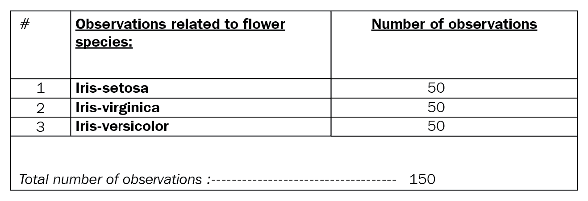

鸢尾花数据集观测值分解表

参考前面的表格，很明显，鸢尾花数据集中表示了三种花种。这个数据集中的每个花种都平均贡献了 50 个观测值。每个观测值包含四个测量值。一个测量值对应一朵花的一个特征，其中每个花特征对应以下之一：

+   **萼片长度**

+   **萼片宽度**

+   **花瓣长度**

+   **花瓣宽度**

为了清晰起见，以下表格展示了之前列出的特征：

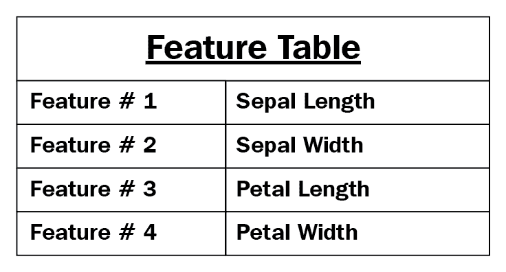

鸢尾花特征

好吧，所以鸢尾花数据集中表示了三种花种。说到物种，我们将从现在开始，每当需要坚持机器学习术语背景时，将术语*物种*替换为*类别*。这意味着**#1**-**Iris-setosa**从早先指的是**类别 # 1**，**#2**-**Iris-virginica**指的是**类别 # 2**，**#3**-**Iris-versicolor**指的是**类别 # 3**。

我们刚刚列出了在鸢尾花数据集中表示的三个不同的鸢尾花物种。它们看起来是什么样子？它们的特点是什么？以下截图回答了这些问题：

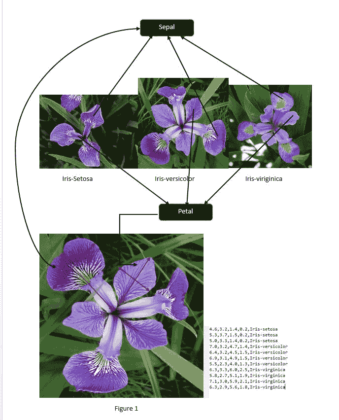

鸢尾花三种物种的表示

话虽如此，让我们来看看鸢尾花每个类别的**萼片**和**花瓣**部分。**萼片**（较大的下部部分）和**花瓣**（较小的下部部分）的尺寸是每个类别的鸢尾花与其他两个类别的鸢尾花之间关系的体现。在下一节中，我们将总结我们的讨论，并将鸢尾花数据集的讨论范围扩展到多类、多维分类任务。

# 鸢尾花数据集代表一个多类、多维分类任务

在本节中，我们将重申关于鸢尾花数据集的事实，并描述其在机器学习分类任务中的背景：

+   Iris 数据集分类任务是多类的，因为从野外新到达的 Iris 花的类别预测可以属于三个类别中的任何一个。

+   的确，本章全部内容都是关于尝试进行物种分类（推断新 Iris 花的目标类别）使用萼片和花瓣尺寸作为特征参数。

+   Iris 数据集分类是多维的，因为有四个特征。

+   有 150 个观测值，每个观测值由四个特征的测量组成。这些测量也可以用以下术语来表示：

+   输入属性或实例

+   预测变量 (`X`)

+   输入变量 (`X`)

+   在野外采集的 Iris 花的分类是通过一个模型（计算出的映射函数）来完成的，该模型提供了四个花特征测量值。

+   Iris 花分类任务的输出是通过学习（或拟合）离散数量的目标或类别标签（`Y`）的过程，从预测变量识别一个（计算出的）预测值。输出或预测值可能意味着以下内容：

+   分类别响应变量：在后面的章节中，我们将看到索引算法会将所有类别值转换为数字

+   响应或输出变量 (`Y`)

到目前为止，我们声称我们的多类分类任务的输出（`Y`）取决于输入（`X`）。这些输入将从哪里来？这个问题将在下一节中回答。

# 训练数据集

我们在数据分析或分类任务中未提及的一个重要方面是训练数据集。训练数据集是我们分类任务的输入数据源（`X`）。我们利用这个数据集通过推导最优边界或条件来获得每个目标类别的预测。我们只是通过添加训练数据集的额外细节来重新定义我们的分类过程。对于分类任务，我们有一边的 `X` 和另一边的 `Y`，中间有一个推断的映射函数。这带我们来到了映射或预测函数，这是下一节的重点。

# 映射函数

到目前为止，我们已经讨论了输入变量（`X`）和输出变量（`Y`）。因此，任何分类任务的目标是发现模式并找到一个映射（预测）函数，该函数将特征测量（`X`）映射到输出（`Y`）。这个函数在数学上被表示为：

```java
Y = f(x) 
```

这种映射就是监督学习的工作方式。一个监督学习算法被说成是学习或发现这个函数。这将是下一节的目标。

# 算法和其映射函数

本节从展示映射函数组件和学习的映射函数的算法的示意图开始。算法正在学习映射函数，如下面的图所示：

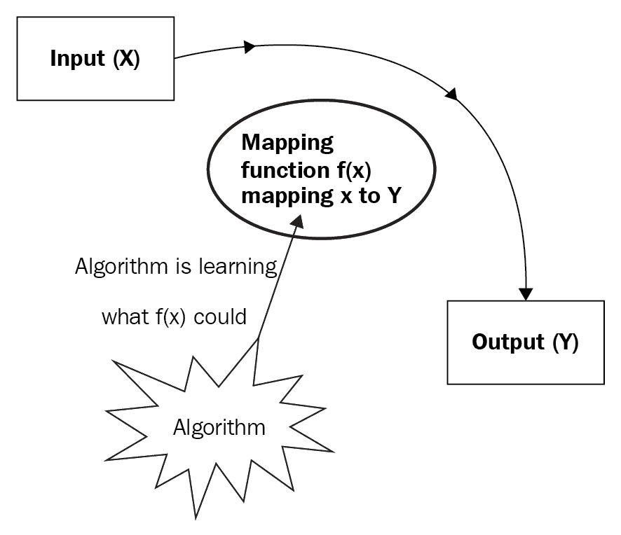

输入到输出的映射函数以及学习映射函数的算法

我们分类过程的目标是通过学习（或拟合）过程让算法推导出映射函数的最佳可能近似。当我们发现野外的 Iris 花并想要对其进行分类时，我们使用其输入测量值作为新的输入数据，我们的算法的映射函数将接受这些数据以给出预测值（**Y**）。换句话说，给定 Iris 花的特征测量值（新数据），由监督学习算法（这将是一个随机森林）产生的映射函数将对该花进行分类。

存在两种机器学习问题，监督学习分类算法可以解决。以下是这些问题的描述：

+   分类任务

+   回归任务

在接下来的段落中，我们将通过一个例子来讨论映射函数。我们解释了“监督学习分类任务”在推导映射函数中所起的作用。引入了模型的概念。

假设我们已知 Iris 数据集分类任务的映射函数 `f(x)` 精确地是 `x + 1` 的形式，那么我们就没有必要寻找新的映射函数。如果我们回想一下，映射函数是一种将花特征（如花瓣长度和花瓣宽度）与花所属物种之间的关系映射的函数？不是。

因此，不存在预先存在的函数 `x + 1` 可以明确映射花特征与花种之间的关系。我们需要的是一个尽可能精确地模拟上述关系的模型。数据和其分类很少是直截了当的。一个监督学习分类任务从对函数 `f(x)` 一无所知开始。监督学习分类过程通过迭代推理过程应用机器学习技术和策略，最终学习出 `f(x)` 是什么。

在我们的情况下，这种机器学习努力是一个分类任务，在统计学或机器学习术语中，这种函数或映射函数被称为**模型**。

在下一节中，我们将描述什么是监督学习以及它与 Iris 数据集分类的关系。实际上，这种看似最简单的机器学习技术广泛应用于数据分析，尤其是在商业领域。

# 监督学习 – 它与 Iris 分类任务的关系

一开始，以下是一个监督学习的显著方面的列表：

+   监督学习中的“监督”一词源于算法正在学习或推断映射函数是什么。

+   数据分析任务，无论是分类还是回归。

+   它包含从标记的训练数据集中学习或推断映射函数的过程。

+   我们的 Iris 训练数据集包含训练示例或样本，其中每个示例可能由一个包含四个测量的输入特征向量表示。

+   监督学习算法通过对训练数据进行数据分析，学习或推断或推导出映射函数的最佳可能近似。在统计或机器学习术语中，映射函数也被称为模型。

+   该算法通过迭代过程从训练示例集或训练数据集中学习参数，如下所示：

+   每次迭代都会为新输入实例生成预测的类别标签

+   学习过程的每次迭代都会逐步产生对输出类别标签应该是什么的更好泛化，并且正如任何有终点的事物一样，算法的学习过程也以预测的高度合理性结束。

+   采用监督学习的机器学习分类过程具有正确预定的标签的算法样本。

+   红花数据集是监督学习分类过程的典型例子。术语“监督”源于算法在迭代学习过程的每一步都对其先前生成的模型构建过程进行适当的校正，以生成其下一个最佳模型。

在下一节中，我们将定义一个训练数据集。在下一节以及剩余的章节中，我们将使用随机森林分类算法来运行数据分析转换任务。这里值得注意的一个任务是将字符串标签转换为表示为双精度数的索引标签列的过程。

# 随机森林分类算法

在前一个部分，我们提到了输入或训练数据集所起的关键作用。在本节中，我们再次强调这个数据集的重要性。也就是说，从机器学习算法的角度来看，训练数据集是随机森林算法利用它来训练或拟合模型，通过生成它需要的参数来训练或拟合模型。这些参数是模型需要用来得出下一个最佳预测值的参数。在本章中，我们将把随机森林算法应用于训练（和测试）红花数据集。实际上，下一段将开始讨论随机森林算法或简称为随机森林。

随机森林算法包含基于决策树的监督学习方法。它可以被视为由大量决策树组成的复合整体。在机器学习术语中，随机森林是由众多决策树组成的集成。

决策树，正如其名所暗示的，是一个渐进的决策过程，由一个根节点和随后的子树组成。决策树算法沿着树爬行，在每个节点停止，从根节点开始，提出一个“你是否属于某个类别”的问题。根据答案是否为是或否，做出决定沿着某个分支向上移动，直到遇到下一个节点，算法重复其询问。当然，在每个节点，算法收到的答案决定了下一个分支。最终的结果是在一个终止的叶节点上的预测结果。

说到树、分支和节点，数据集可以看作是由多个子树组成的树。数据集节点上的每个决策以及决策树算法选择某个分支的决策，是特征变量最优组合的结果。使用随机森林算法，创建了多个决策树。这个集成中的每个决策树都是变量随机排序的结果。这带我们来到了随机森林是什么——它是众多决策树的集成。

需要注意的是，单个决策树本身对于像鸢尾花数据集这样的较小样本可能工作得不好。这就是随机森林算法介入的地方。它将决策树森林中的所有预测汇集在一起。这个森林中所有单个决策树的汇总结果将形成一个集成，更广为人知的是随机森林。

我们选择随机森林方法来做出预测，这有一个很好的理由。由预测集成的网络预测显著更准确。

在下一节中，我们将制定我们的分类问题，在随后的*Spark 入门*部分，将给出项目的实现细节。

# 项目概述 – 问题表述

本项目的目的是开发一个机器学习工作流程，或者更准确地说，是一个管道。目标是解决数据科学历史上最著名的分类问题。

如果我们在野外看到一朵我们知道属于三种鸢尾花物种之一的花，我们就面临一个分类问题。如果我们对未知的花进行了测量（`X`），任务就是学会识别这朵花（及其植物）所属的物种。

分类别变量代表可以分成组的数据类型。类别变量的例子有种族、性别、年龄组和教育水平。尽管后两个变量也可以通过使用年龄和最高完成等级的确切值以数值方式考虑，但通常将此类变量分类到相对较少的组中更有信息量。

常规的类别数据分析通常涉及使用数据表。一个双向表通过计数两个变量中每个组中观察值的数量来呈现类别数据，其中一个变量分为行，另一个变量分为列。

简而言之，分类问题的概述如下：

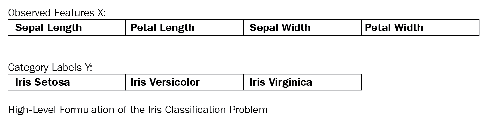

红 Iris 监督学习分类问题的概述

在 Iris 数据集中，每一行包含第五列中的类别数据（值）。每个这样的值都与一个标签（**Y**）相关联。

公式包括以下内容：

+   观察到的特征

+   类别标签

观察到的特征也被称为**预测变量**。这些变量具有预定的测量值。这些是输入 X。另一方面，类别标签表示预测变量可以采取的可能输出值。

预测变量如下：

+   `sepal_length`：它代表花萼长度，以厘米为单位，用作输入

+   `sepal_width`：它代表花萼宽度，以厘米为单位，用作输入

+   `petal_length`：它代表花瓣长度，以厘米为单位，用作输入

+   `petal_width`：它代表花瓣宽度，以厘米为单位，用作输入

+   `setosa`：它代表 Iris-setosa，真或假，用作目标

+   `versicolour`：它代表 Iris-versicolour，真或假，用作目标

+   `virginica`：它代表 Iris-virginica，真或假，用作目标

从每个样本测量了四个结果变量；花萼和花瓣的长度和宽度。

为了让一切正常工作，项目的总构建时间不应超过一天。对于数据科学领域的新手来说，理解背景理论、设置软件以及构建管道可能需要额外的一天或两天。

# 开始使用 Spark

指令适用于 Windows 用户。请注意，为了运行 Spark 版本 2 及以上版本，Java 版本 8 及以上版本，Scala 版本 2.11，**简单构建工具**（**SBT**）版本至少为 0.13.8 是先决条件。Iris 项目的代码依赖于 Spark 2.3.1，这是撰写本章时的最新发行版。后续章节的实现可能基于 2017 年 2 月 28 日发布的 Spark 2.3.0。Spark 2.3.0 是一个主要更新版本，其中包括对 1400 多个票证的修复。

Spark 2.0 带来了一系列改进。将 dataframe 作为数据的基本抽象的引入就是其中之一。读者会发现 dataframe 抽象及其支持 API 促进了他们的数据科学和分析任务，更不用说这个强大功能在 **弹性分布式数据集**（**RDDs**）上的性能改进了。在最新的 Spark 版本中，对 RDD 的支持仍然非常丰富。

# 设置先决软件

在跳到先决条件之前，关于硬件的一些说明。我在本章中使用的硬件基础设施包括一台 64 位 Windows Dell 8700 机器，运行 Windows 10，配备 Intel(R) Core(TM) i7-4770 CPU @ 3.40 GHz 和 32GB 的内存。

在本小节中，我们记录了在安装 Spark 之前必须准备的三种软件先决条件。

在撰写本文时，我的先决软件设置包括 JDK 8、Scala 2.11.12 和 SBT 0.13.8。以下列表是一个最小、推荐的设置（请注意，你可以尝试更高版本的 JDK 8 和 Scala 2.12.x）。

这里是本章所需的先决条件列表：

+   Java SE 开发工具包 8

+   Scala 2.11.12

+   SBT 0.13.8 或更高版本

如果你像我一样，只为了发展自己的 Spark 大数据生态系统而专门准备一个完整的箱子，这并不是一个坏主意。考虑到这一点，从一台合适的机器（有足够的空间和至少 8GB 的内存）开始，运行你偏好的操作系统，并按照顺序安装前面提到的先决条件。你可能会问，JDK 的较低版本如何？确实，JDK 的较低版本与 Spark 2.3.1 不兼容。

虽然我不会在这里详细介绍 JDK 的安装过程，但这里有一些注意事项。下载 Java 8（[`www.oracle.com/technetwork/java/javase/downloads/jdk8-downloads-2133151.html`](http://www.oracle.com/technetwork/java/javase/downloads/jdk8-downloads-2133151.html)），一旦安装程序完成安装`Java`文件夹，不要忘记设置两个新的系统环境变量——`JAVA_HOME`环境变量指向你的 Java 安装根目录，以及`JAVA_HOME/bin`在你的系统路径环境变量中。

在设置系统`JAVA_HOME`环境后，以下是如何通过在命令行上列出`JAVA_HOME`的值来快速进行 sanity check 的方法：

```java
C:\Users\Ilango\Documents\Packt-Book-Writing-Project\DevProjects\Chapter1>echo %JAVA_HOME%
C:\Program Files\Java\jdk1.8.0_102
```

现在剩下的就是再进行一次快速检查，以确保你完美地安装了 JDK。在你的命令行或终端中运行以下命令：

注意，这个屏幕只代表 Windows 命令行：

```java
C:\Users\Ilango\Documents\Packt\DevProjects\Chapter1>java -version
java version "1.8.0_131"
Java(TM) SE Runtime Environment (build 1.8.0_131-b11)
Java HotSpot(TM) 64-Bit Server VM (build 25.131-b11, mixed mode)

C:\Users\Ilango\Documents\Packt\DevProjects\Chapter1>javac -version
javac 1.8.0_102
```

到目前为止，如果你的 sanity checks 通过了，下一步就是安装 Scala。以下简要步骤概述了该过程。Scala 下载页面在[`archive.ics.uci.edu/ml/datasets/iris`](https://archive.ics.uci.edu/ml/datasets/iris)上记录了许多安装 Scala 的方法（针对不同的操作系统环境）。然而，我们只列出了三种安装 Scala 的方法。

在深入 Scala 安装之前，这里做一个简要说明。虽然 Scala 的最新稳定版本是 2.12.4，但我更喜欢一个稍微旧一点的版本，即 2.11.12，这是我在本章中将使用的版本。您可以从[`scala-lang.org/download/2.11.12.html`](http://scala-lang.org/download/2.11.12.html)下载它。无论您更喜欢 2.12 还是 2.11 版本，选择权在您手中，只要版本不是低于 2.11.x 的任何版本。以下列出的安装方法将帮助您开始这一过程。

Scala 可以通过以下方法进行安装：

+   **安装 Scala**：在[`scala-lang.org/download/`](http://scala-lang.org/download/)中找到标题为“其他安装 Scala 方法”的部分，并从那里下载 Scala 二进制文件。然后您可以根据[`scala-lang.org/download/install.html`](http://scala-lang.org/download/install.html)中的说明安装 Scala。从[`www.scala-sbt.org/download.html`](https://www.scala-sbt.org/download.html)安装 SBT，并按照[`www.scala-sbt.org/1.0/docs/Setup.html`](https://www.scala-sbt.org/1.0/docs/Setup.html)中的设置说明进行操作。

+   **在 IntelliJ IDE 中使用 Scala**：有关说明请参阅[`docs.scala-lang.org/getting-started-intellij-track/getting-started-with-scala-in-intellij.html`](https://docs.scala-lang.org/getting-started-intellij-track/getting-started-with-scala-in-intellij.html)。

+   **在 IntelliJ IDE 中使用 SBT 的 Scala**：这是另一种方便地使用 Scala 的方法。有关说明请参阅[`docs.scala-lang.org/getting-started-intellij-track/getting-started-with-scala-in-intellij.html`](https://docs.scala-lang.org/getting-started-intellij-track/getting-started-with-scala-in-intellij.html)。

在前面列表中刚刚出现的缩写**SBT**代表**Simple Build Tool**。确实，您会在本书的很多地方遇到对 SBT 的引用。

从前面列表的第一种方法中选取一个项目，并按照（主要自解释的）说明进行操作。最后，如果您忘记设置环境变量，请设置一个新的`SCALA_HOME`系统环境变量（类似于`JAVA_HOME`），或者简单地更新现有的`SCALA_HOME`。当然，`SCALA_HOME/bin`条目被添加到路径环境变量中。

您不一定需要在系统范围内安装 Scala。无论如何，SBT 环境都为我们提供了访问其自己的 Scala 环境。然而，拥有系统范围内的 Scala 安装可以让您快速实现 Scala 代码，而不是启动整个 SBT 项目。

让我们回顾一下到目前为止我们已经完成的事情。我们通过使用 Scala 安装的第一种方法安装了 Scala。

为了确认我们已经安装了 Scala，让我们运行一个基本的测试：

```java
C:\Users\Ilango\Documents\Packt\DevProjects\Chapter1>scala -version
Scala code runner version 2.11.12 -- Copyright 2002-2017, LAMP/EPFL
```

上述代码列表确认我们的最基本 Scala 安装没有问题。这为系统范围内的 SBT 安装铺平了道路。再次强调，这归结为设置`SBT_HOME`系统环境变量，并将`$SBT_HOME/bin`设置在路径中。这是最基本的桥梁。接下来，让我们运行一个检查来验证 SBT 是否已正确设置。打开一个命令行窗口或终端。我们安装了 SBT 0.13.17，如下所示：

```java
C:\Users\Ilango\Documents\Packt\DevProjects\Chapter1>sbt sbtVersion
Java HotSpot(TM) 64-Bit Server VM warning: ignoring option MaxPermSize=256m; support was removed in 8.0
[info] Loading project definition from C:\Users\Ilango\Documents\Packt\DevProjects\Chapter1\project
[info] Set current project to Chapter1 (in build file:/C:/Users/Ilango/Documents/Packt/DevProjects/Chapter1/)
[info] 0.13.17
```

我们剩下的是第二种和第三种方法。这些方法留给读者作为练习。第三种方法将使我们能够利用 IDE 如 IntelliJ 的所有优秀功能。

简而言之，我们在开发管道时采取的方法是，将现有的 SBT 项目导入 IntelliJ，或者我们直接在 IntelliJ 中创建 SBT 项目。

接下来是什么？当然是 Spark 的安装。在即将到来的章节中详细了解。

# 以独立部署模式安装 Spark

在本节中，我们以独立部署模式设置 Spark 开发环境。要快速开始使用 Spark 并进行开发，Spark 的 shell 是最佳选择。

Spark 支持 Scala、Python、R 和 Java，并提供相应的 API。

Spark 二进制文件下载为开发者提供了两个组件：

+   Spark 的 shell

+   一个独立集群

一旦下载并解压二进制文件（后续将提供说明），Spark shell 和独立 Scala 应用程序将允许您在独立集群模式下启动一个独立集群。

这个集群是自包含且私有的，因为它仅位于一台机器上。Spark shell 允许您轻松配置这个独立集群。它不仅为您提供快速访问交互式 Scala shell，还允许您在 Scala shell 中开发可以部署到集群中的应用程序（给它命名为独立部署模式），直接在 Scala shell 中进行。

在这种模式下，集群的驱动节点和工作节点位于同一台机器上，更不用说我们的 Spark 应用程序默认会占用该机器上所有可用的核心。使所有这一切成为可能的重要特性是交互式（Spark）Scala shell。

Spark 2.3 是最新版本。它包含 1400 多个修复。在 Java 8 上安装 Spark 2.3 可能是我们在第二章“利用 Spark 和 Scala 的力量构建乳腺癌预后管道”开始下一个项目之前要做的第一件事。

不再拖延，让我们开始设置以独立部署模式运行 Spark。以下步骤很有帮助：

1.  系统检查：首先确保您至少有 8 GB 的内存，并至少保留 75%的内存供 Spark 使用。我的系统有 32 GB。一旦系统检查通过，请从这里下载 Spark 2.3.1 的二进制文件：[`spark.apache.org/downloads.html`](http://spark.apache.org/downloads.html)。

1.  你需要一个能够提取`.tar.gz`和`.gz`存档的解压缩工具，因为 Windows 对这些存档没有原生支持。7-Zip 是适合这个任务的程序。你可以从[`7-zip.org/download.html`](http://7-zip.org/download.html)获取它。

1.  选择为 Apache Hadoop 2.7 及以后版本预先构建的包类型，并下载`spark--2.2.1-bin-hadoop2.7.tgz`。

1.  将软件包解压到方便的地方，这将成为你的 Spark 根文件夹。例如，我的 Spark 根文件夹是：`C:\spark-2.2.1-bin-hadoop2.7`。

1.  现在，设置环境变量`SPARK_HOME`指向 Spark 根文件夹。我们还需要在`PATH`变量中添加一个路径条目，指向`SPARK_HOME/bin`。

1.  接下来，设置环境变量`HADOOP_HOME`，例如设置为`C:\Hadoop`，并为 Spark 创建一个新的路径条目，指向 Spark 主目录的`bin`文件夹。现在，像这样启动`spark-shell`：

```java
spark-shell --master local[2]
```

接下来发生的事情可能会让 Windows 用户感到沮丧。如果你是这些用户之一，你将遇到以下错误。以下截图是此问题的表示：

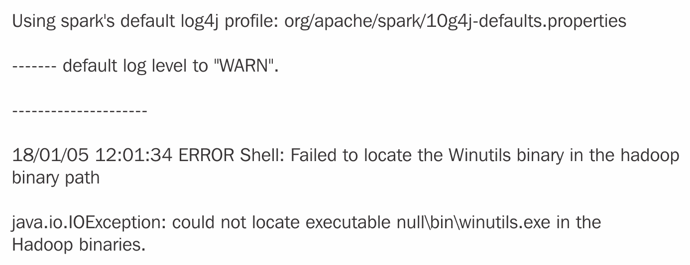

Windows 上的错误信息

为了解决这个问题，你可以按照以下步骤进行：

1.  创建一个新的文件夹，命名为`C\tmp\hive`。

1.  然后，从这里获取缺失的`WINUTILS.exe`二进制文件：[`github.com/steveloughran/winutils`](https://github.com/steveloughran/winutils)。将其放入`C\Hadoop\bin`。

前面的步骤 2 是必要的，因为 Spark 下载不包含运行 Hadoop 所需的`WINUTILS.exe`。那么，这就是`java.io.IOException`的来源。

在管理员模式下打开命令提示符窗口，并像这样执行新下载的`WINUTILS.EXE`：

```java
winutils.exe chmod -R 777 C:\tmp\hive
```

接下来，发出`spark-shell`命令。这一次，Spark 的交互式开发环境正常启动，分别启动自己的`SparkContext`实例`sc`和`SparkSession`会话。虽然`sc`功能是访问底层本地独立集群的强大入口点，但`spark`是 Spark 数据处理 API 的主要入口点。

以下是从`spark-shell`命令输出的内容。`SparkContext`作为`sc`提供给你，Spark 会话作为`spark`提供给你：

```java
C:\Users\Ilango\Documents\Packt\DevProjects\Chapter1>spark-shell --master local[2]
Spark context Web UI available at http://192.168.56.1:4040
Spark context available as 'sc' (master = local[2], app id = local-1520484594646).
Spark session available as 'spark'.
Welcome to
 ____ __
 / __/__ ___ _____/ /__
 _\ \/ _ \/ _ `/ __/ '_/
 /___/ .__/\_,_/_/ /_/\_\ version 2.2.1
/_/
Using Scala version 2.11.8 (Java HotSpot(TM) 64-Bit Server VM, Java 1.8.0_102)
Type in expressions to have them evaluated.
Type :help for more information.
scala>
```

在前面显示的`spark-shell`启动中，`local[2]`选项让我们能够使用`2`个线程在本地运行 Spark。

在深入本节下一个主题之前，了解以下 Spark shell 开发环境特性是很有好处的，这些特性使得开发和数据分析成为可能：

+   `SparkSession`

+   `SparkBuilder`

+   `SparkContext`

+   `SparkConf`

`SparkSession` API ([`spark.apache.org/docs/2.2.1/api/scala/index.html#org.apache.spark.sql.SparkSession`](https://spark.apache.org/docs/2.2.1/api/scala/index.html#org.apache.spark.sql.SparkSession)) 将 `SparkSession` 描述为程序访问入口点，分别用于 Spark 的数据集和 dataframe API。

什么是 `SparkBuilder`？`SparkBuilder` 伴生对象包含一个 `builder` 方法，当调用它时，允许我们检索现有的 `SparkSession` 或甚至创建一个。我们现在将按照以下两步过程获取我们的 `SparkSession` 实例：

1.  导入 `SparkSession` 类。

1.  在生成的 `builder` 上调用 `getOrCreate` 方法来调用 `builder` 方法：

```java
scala> import org.apache.spark.sql.SparkSession
import org.apache.spark.sql.SparkSession

scala> lazy val session: SparkSession = SparkSession.builder().getOrCreate()
res7: org.apache.spark.sql.SparkSession = org.apache.spark.sql.SparkSession@6f68756d
```

`SparkContext` API ([`spark.apache.org/docs/2.2.1/api/scala/index.html#org.apache.spark.SparkContext`](https://spark.apache.org/docs/2.2.1/api/scala/index.html#org.apache.spark.SparkContext)) 将 `SparkContext` 描述为设置或配置 Spark 集群属性（RDD、累加器、广播变量等等）的第一线入口点，这些属性影响集群的功能。这种配置发生的一种方式是通过将 `SparkConf` 实例作为 `SparkContext` 构造函数参数传递。每个 JVM 实例存在一个 `SparkContext`。

在某种意义上，`SparkContext` 也是 Spark 驱动应用程序通过例如 Hadoop 的 Yarn **ResourceManager** (**RM**) 连接到集群的方式。

现在我们来检查我们的 Spark 环境。我们将首先启动 Spark shell。也就是说，典型的 Spark shell 交互式环境屏幕有一个可用的 SparkSession 作为 `spark`，我们试图在以下代码块中读取其值：

```java
scala> spark
res21: org.apache.spark.sql.SparkSession = org.apache.spark.sql.SparkSession@6f68756d
```

Spark shell 也拥有自己的 `SparkContext` 实例 `sc`，它与 `SparkSession` `spark` 相关联。在下面的代码中，`sc` 返回 `SparkContext`：

```java
scala> sc
res5: org.apache.spark.SparkContext = org.apache.spark.SparkContext@553ce348
```

`sc` 可以做更多。在下面的代码中，在 `sc` 上调用 `version` 方法会给我们显示我们集群中运行的 Spark 的版本：

```java
scala> sc.version
res2: String = 2.2.1
scala> spark
res3: org.apache.spark.sql.SparkSession = org.apache.spark.sql.SparkSession@6f68756d
```

由于 `sc` 代表与 Spark 集群的连接，它包含一个称为 `SparkConf` 的特殊对象，该对象以 `Array` 形式持有集群配置属性。在 `SparkContext` 上调用 `getConf` 方法会得到 `SparkConf`，其 `getAll` 方法（如下所示）会得到一个包含集群（或连接）属性的 `Array`，如下面的代码所示：

```java
scala> sc.getConf.getAll
res17: Array[(String, String)] = Array((spark.driver.port,51576), (spark.debug.maxToStringFields,25), (spark.jars,""), (spark.repl.class.outputDir,C:\Users\Ilango\AppData\Local\Temp\spark-47fee33b-4c60-49d0-93aa-3e3242bee7a3\repl-e5a1acbd-6eb9-4183-8c10-656ac22f71c2), (spark.executor.id,driver), (spark.submit.deployMode,client), (spark.driver.host,192.168.56.1), (spark.app.id,local-1520484594646), (spark.master,local[2]), (spark.home,C:\spark-2.2.1-bin-hadoop2.7\bin\..))
```

在 Spark shell 中可能有对 `sqlContext` 和 `sqlContext.implicits._` 的引用。`sqlContext` 是什么？截至 Spark 2 及其之前的版本，`sqlContext` 已被弃用，`SparkSession.builder` 被用来返回一个 `SparkSession` 实例，我们重申这是使用数据集和 dataframe API 编程 Spark 的入口点。因此，我们将忽略那些 `sqlContext` 实例，而专注于 `SparkSession`。

注意，`spark.app.name`默认名称为`spark-shell`。让我们将`app-name`属性赋予一个不同的名称，即`Iris-Pipeline`。我们通过调用`setAppName`方法并传递新的应用程序名称来实现这一点，如下所示：

```java
scala> sc.getConf.setAppName("Iris-Pipeline")
res22: org.apache.spark.SparkConf = org.apache.spark.SparkConf@e8ce5b1
```

为了检查配置更改是否生效，让我们再次调用`getAll`方法。以下输出应反映这一更改。它简单地说明了如何使用`SparkContext`来修改我们的集群环境：

```java
scala> sc.conf.getAll
res20: Array[(String, String)] = Array((spark.driver.port,51576), (spark.app.name,Spark shell), (spark.sql.catalogImplementation,hive), (spark.repl.class.uri,spark://192.168.56.1:51576/classes), (spark.debug.maxToStringFields,150), (spark.jars,""), (spark.repl.class.outputDir,C:\Users\Ilango\AppData\Local\Temp\spark-47fee33b-4c60-49d0-93aa-3e3242bee7a3\repl-e5a1acbd-6eb9-4183-8c10-656ac22f71c2), (spark.executor.id,driver), (spark.submit.deployMode,client), (spark.driver.host,192.168.56.1), (spark.app.id,local-1520484594646), (spark.master,local[2]), (spark.home,C:\spark-2.2.1-bin-hadoop2.7\bin\..))
```

`spark.app.name`属性刚刚更新了其值。在下一节中，我们的目标是使用`spark-shell`以交互式方式分析数据。

# 开发一个简单的交互式数据分析工具

我们将在 Spark 壳的交互式 Scala 壳中开发一个简单的 Scala 程序。我们将重申我们的目标，即我们希望能够交互式地分析数据。这个数据集——一个名为`iris.csv`的外部**逗号分隔值(CSV**)文件——位于从`spark-shell`启动的同一文件夹中。

这个程序，也可以在常规 Scala **Read Eval Print Loop (REPL**)壳中编写，读取文件并打印其内容，完成数据分析任务。然而，这里重要的是 Spark 壳的灵活性，它还允许你编写 Scala 代码，以便你能够轻松地将数据与各种 Spark API 连接，并以某种有用的方式推导出抽象，如 dataframes 或 RDDs。关于`DataFrame`和`Dataset`的更多内容将在后面介绍：

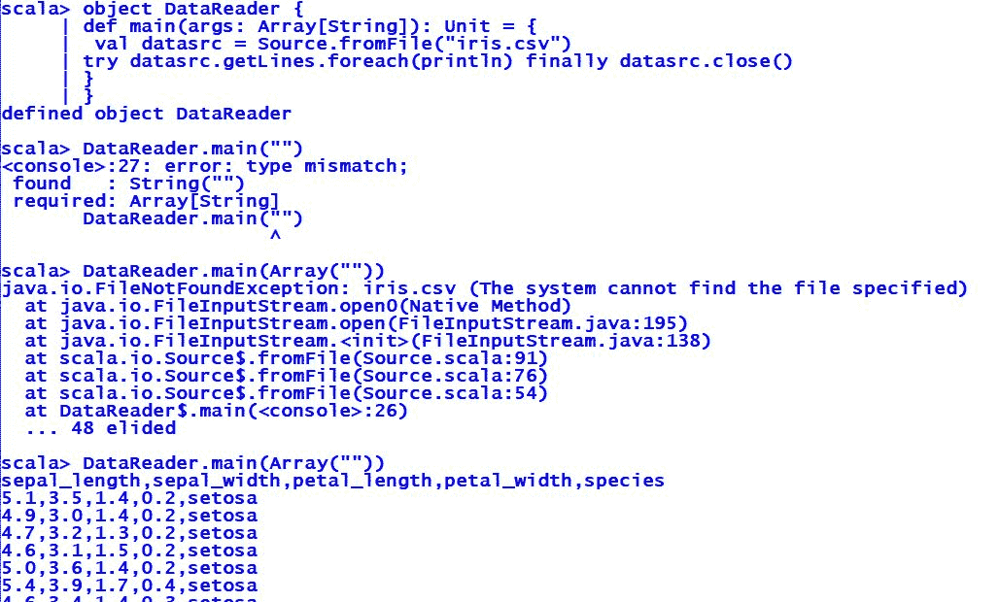

使用 source 读取 iris.csv

在前面的程序中，没有发生什么特别的事情。我们正在尝试使用`Source`类读取名为`iris.csv`的文件。我们从`scala.io`包中导入`Source.scala`文件，然后创建一个名为`DataReader`的对象和其内部的`main`方法。在`main`方法内部，我们调用伴随对象`Source`的`fromFile`方法。`fromFile`方法接受数据集文件路径的字符串表示作为参数，并返回一个`BufferedSource`实例，我们将它分配给一个名为`datasrc`的`val`。顺便说一下，`Source`的 API 可以在[`www.scala-lang.org/api/current/scala/io/Source.html`](https://www.scala-lang.org/api/current/scala/io/Source.html)找到。

在`BufferedSource`处理句柄上，我们随后调用了`getLines`方法，该方法返回一个迭代器，然后调用`foreach`，它会打印出`iris.csv`中的所有行，但不包括换行符。我们将所有这些代码包裹在`try`、`catch`和`finally`中。`finally`构造存在的原因与我们需要在文件处理完毕后关闭`BufferedSource`实例`datasrc`有关。

初始时，我们遇到了`FileNotFoundException`异常，因为数据集文件`iris.csv`没有找到。然后将 CSV 文件放入，运行程序，输出结果就是我们预期的。

这并不难。在下一个子节中，目标是读取我们的`iris.csv`文件，并从中派生出`Dataset`或`DataFrame`。

# 读取数据文件并从中派生出 DataFrame

Spark API 对于[`spark.apache.org/docs/2.2.1/api/scala/index.html#org.apache.spark.sql.Dataset`](https://spark.apache.org/docs/2.2.1/api/scala/index.html#org.apache.spark.sql.Dataset)的说明是，`DataFrame`是`Dataset[Row]`，而`Dataset`包含一个名为`DataFrame`的视图。根据 Spark 文档中对`Dataset`的描述，我们可以将`Dataset`重新定义为 Spark 对分布式集合的抽象，这些集合包含数据项。也就是说，`Dataset[Row]`包含行。`Row`可能是一个抽象，表示来自原始文件数据集的行。

我们需要读取`iris.csv`文件并将其转换为`DataFrame`。这就是本小节的目标，我们很快就会实现这一点。

考虑到所有这些，让我们开始构建`DataFrame`。我们首先在`spark`，我们的`SparkSession`上调用`read`方法：

```java
scala> val dfReader1 = spark.read
dfReader1: org.apache.spark.sql.DataFrameReader = org.apache.spark.sql.DataFrameReader@66df362c
```

`read()`调用生成了`DataFrameReader` `dfReader1`，根据[`spark.apache.org/docs/2.2.1/api/scala/index.html#org.apache.spark.sql.DataFrameReader`](https://spark.apache.org/docs/2.2.1/api/scala/index.html#org.apache.spark.sql.DataFrameReader)的说明，这是一个从外部存储系统中加载数据集的接口。

接下来，我们将通知 Spark 我们的数据是 CSV 格式。这是通过调用带有`com.databricks.spark.csv`参数的`format`方法来完成的，Spark 可以识别这个参数：

```java
scala> val dfReader2 = dfReader1.format("com.databricks.spark.csv")
dfReader2: org.apache.spark.sql.DataFrameReader = org.apache.spark.sql.DataFrameReader@66df362c
```

`format`方法只是再次返回了`DataFrameReader`。`iris.csv`文件包含`header`。我们可以将其指定为输入`option`：

```java
scala> val dfReader3 = dfReader2.option("header", true)
dfReader3: org.apache.spark.sql.DataFrameReader = org.apache.spark.sql.DataFrameReader@66df362c
```

这返回了我们熟悉的`DataFrameReader`。

接下来，我们需要一种方法来识别为我们识别的模式。再次调用`option`方法，使用键`inferSchema`和值为`true`，让 Spark 自动为我们推断模式：

```java
scala> val dfReader4 = dfReader3.option("inferSchema",true)
dfReader4: org.apache.spark.sql.DataFrameReader = org.apache.spark.sql.DataFrameReader@66df362c
```

现在我们来`加载`我们的输入：

```java
scala> val dFrame = dfReader4.load("iris.csv")
dFrame: org.apache.spark.sql.DataFrame = [Id: int, SepalLengthCm: double ... 4 more fields]
```

`DataFrameReader`将我们的输入 CSV 转换成了`DataFrame`！这正是我们一开始设定的目标。

`DataFrame`简单地说就是`Dataset`的无类型视图，表示为`type DataFrame = Dataset[Row]`。

由于我们的`DataFrame`是`Dataset[Row]`的视图，所以`Dataset`上的所有方法都是可用的。

目前，我们想看看这个数据集中有什么。原始文件中有 150 列。因此，我们希望 Spark：

+   返回数据集中的行数

+   显示数据集的前 20 行

接下来，我们将调用`count`方法。我们想要再次确认数据集中包含的行数：

```java
scala> dFrame.count
res1: Long = 150
```

我们刚刚在我们的`DataFrame`上调用了`count`方法。它返回了数字`150`，这是正确的。

接下来，我们将本节中开发的全部代码合并成一行代码：

```java
scala> val irisDataFrame = spark.read.format("com.databricks.spark.csv").option("header",true).option("inferSchema", true).load("iris.csv").show

```

我们刚刚创建了`DataFrame` `irisDataFrame`。如果您想查看 DataFrame，只需在它上面调用`show`方法。这将返回 irisDataFrame 的前 20 行`DataFrame`：

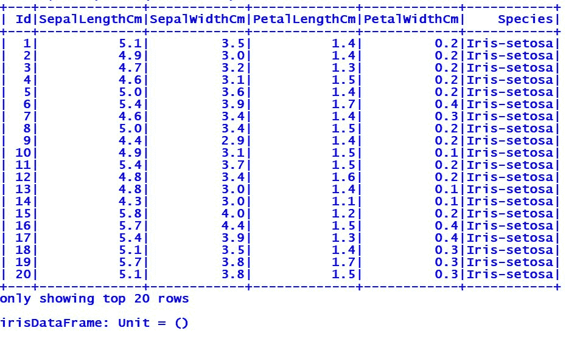

Iris 数据集的前 20 行

在这一点上，输入 `:quit` 或 *Ctrl* + *D* 以退出 Spark shell。这总结了本节内容，但为下一节打开了过渡，我们将把事情提升到下一个层次。我们不会依赖于 `spark-shell` 来开发更大的程序，而是将在 SBT 项目中创建我们的 Iris 预测管道程序。这是下一节的重点。

# 实现 Iris 管道

在本节中，我们将阐述我们的管道实现目标。我们将随着每个实现步骤的进行记录可衡量的结果。

在我们实现 Iris 管道之前，我们想要从概念和实践的角度理解管道是什么。因此，我们将管道定义为具有多个管道阶段以一定顺序运行的 `DataFrame` 处理工作流程。

DataFrame 是 Spark 的一种抽象，它提供了一个 API。这个 API 允许我们处理对象集合。从高层次来看，它代表了一个分布式集合，包含数据行，类似于关系数据库表。在这个 DataFrame 中，每一行成员（例如，花瓣宽度测量值）都隶属于一个名为花瓣宽度的命名列。

管道中的每个阶段都是一个算法，它要么是 `Transformer`，要么是 `Estimator`。当 `DataFrame` 或 DataFrame(s) 流经管道时，存在两种类型的阶段（算法）：

+   `Transformer` 阶段：这涉及一个转换动作，将一个 `DataFrame` 转换为另一个 `DataFrame`

+   `Estimator` 阶段：这涉及在 `DataFrame` 上执行训练动作，产生另一个 `DataFrame`。

总结来说，管道是一个单一单元，需要阶段，但包括参数和 DataFrame(s)。整个管道结构如下所示：

+   `Transformer`

+   `Estimator`

+   `Parameters`（超参数或其他）

+   `DataFrame`

这就是 Spark 发挥作用的地方。它的 MLlib 库提供了一套管道 API，允许开发者访问多个算法，并促进它们组合成一个有序阶段的单一管道，就像芭蕾舞中的编排动作序列。在本章中，我们将使用随机森林分类器。

我们已经涵盖了管道的基本概念。这些实用性将帮助我们进入下一部分，我们将列出实现目标。

# Iris 管道实现目标

在列出实现目标之前，我们将为我们的管道制定一个架构。下面展示的是两个表示机器学习工作流程（管道）的图表。

以下图表共同帮助理解这个项目的不同组件。话虽如此，这个管道涉及训练（拟合）、转换和验证操作。训练了多个模型，并选择最佳模型（或映射函数）以提供准确预测 Iris 花种类的近似值（基于这些花的测量值）：

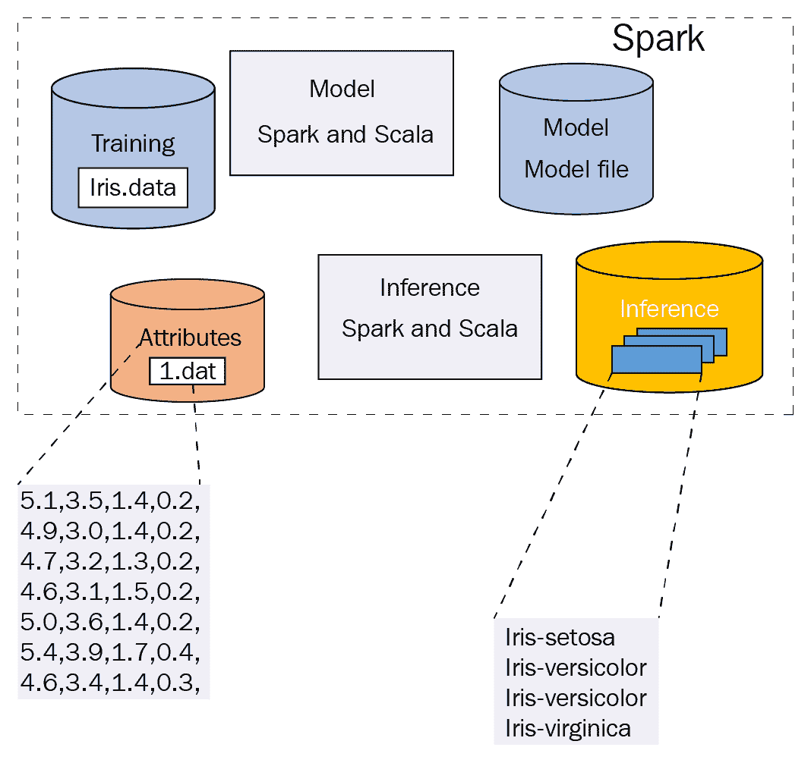

项目框图

项目框图分解如下：

+   **Spark**，代表 Spark 集群及其生态系统

+   **训练数据集**

+   **模型**

+   **数据集属性**或特征测量

+   一个**推理**过程，生成预测列

下图详细描述了不同阶段的功能，我们将稍后通过其构成阶段来可视化管道：

目前，该图描绘了四个阶段，从**数据预处理**阶段开始，这个阶段被故意视为与编号阶段分开。将管道视为两步过程：

1.  **数据清洗**阶段或**预处理**阶段。一个重要的阶段，可能包括**探索性数据分析**（EDA）的子阶段（在后面的图中没有明确表示）。

1.  一个从**特征提取**开始的数据分析阶段，接着是**模型拟合**，然后是**模型验证**，最后将 Uber 管道 JAR 部署到 Spark 中：

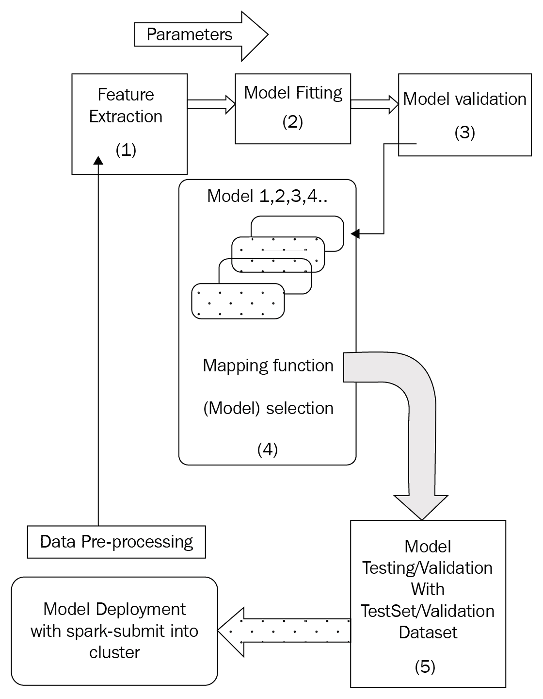

管道图

参考前面的图，第一个实现目标是设置 Spark 在 SBT 项目中。SBT 项目是一个自包含的应用程序，我们可以在命令行上运行它来预测 Iris 标签。在 SBT 项目中，依赖关系在`build.sbt`文件中指定，并且我们的应用程序代码将创建自己的`SparkSession`和`SparkContext`。

因此，我们列出了以下实现目标：

1.  从 UCI 机器学习仓库获取 Iris 数据集

1.  在 Spark shell 中进行初步 EDA

1.  在 IntelliJ 中创建一个新的 Scala 项目，并执行所有实现步骤，直到评估随机森林分类器

1.  将应用程序部署到您的本地 Spark 集群

# 第 1 步 – 从 UCI 机器学习仓库获取 Iris 数据集

访问 UCI 机器学习仓库网站[`archive.ics.uci.edu/ml/datasets/iris`](https://archive.ics.uci.edu/ml/datasets/iris)，点击下载：数据文件夹。将此文件夹提取到方便的位置，并将`iris.csv`复制到项目文件夹的根目录。

您可以参考项目概述以深入了解 Iris 数据集的描述。我们在此展示`iris.csv`文件的内容，如下所示：

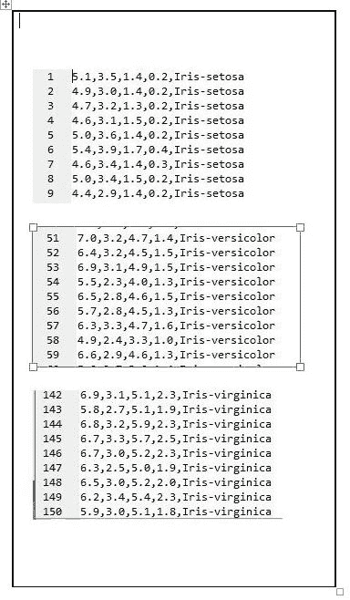

Iris 数据集的快照，包含 150 个数据集

您可能还记得`iris.csv`文件是一个 150 行的文件，包含逗号分隔的值。

现在我们有了数据集，第一步将是对其进行 EDA。Iris 数据集是多变量的，这意味着有多个（独立）变量，因此我们将对其进行基本的多元 EDA。但我们需要`DataFrame`来实现这一点。如何在 EDA 之前创建 DataFrame 是下一节的目标。

# 第 2 步 – 初步 EDA

在我们着手构建 SBT 管道项目之前，我们将在`spark-shell`中进行初步的 EDA。计划是从数据集中导出一个 dataframe，然后对其计算基本统计数据。

我们手头有三个`spark-shell`任务：

1.  启动`spark-shell`

1.  加载`iris.csv`文件并构建`DataFrame`

1.  计算统计数据

然后，我们将这段代码移植到我们的 SBT 项目中的一个 Scala 文件中。

话虽如此，让我们开始加载`iris.csv`文件（输入数据源），在最终构建`DataFrame`之前。

# 启动 Spark shell

通过在命令行中输入以下命令来启动 Spark Shell。

```java
spark-shell --master local[2]
```

在下一步中，我们从可用的 Spark 会话`spark`开始。`spark`将是我们的 Spark 编程的入口点。它还包含连接到我们的 Spark（本地）集群所需的属性。有了这些信息，我们的下一个目标是加载 iris.csv 文件并生成一个 DataFrame。

# 加载 iris.csv 文件并构建 DataFrame

加载 iris csv 文件的第一步是在`spark`上调用`read`方法。`read`方法返回`DataFrameReader`，可以用来读取我们的数据集：

```java
val dfReader1 = spark.read
dfReader1: org.apache.spark.sql.DataFrameReader=org.apache.spark.sql.DataFrameReader@6980d3b3
```

`dfReader1`是`org.apache.spark.sql.DataFrameReader`类型。在`dfReader1`上调用 Spark 的`com.databricks.spark.csv` CSV 格式指定字符串的`format`方法会再次返回`DataFrameReader`：

```java
val dfReader2 = dfReader1.format("com.databricks.spark.csv")
dfReader2: org.apache.spark.sql.DataFrameReader=org.apache.spark.sql.DataFrameReader@6980d3b3
```

最终，`iris.csv`是一个 CSV 文件。

不言而喻，`dfReader1`和`dfReader2`是同一个`DataFrameReader`实例。

到目前为止，`DataFrameReader`需要一个以键值对形式存在的输入数据源`option`。使用两个参数调用`option`方法，一个字符串类型的键`"header"`和其布尔类型的值`true`：

```java
val dfReader3 = dfReader2.option("header", true)
```

在下一步中，我们再次使用参数`inferSchema`和`true`值调用`option`方法：

```java
val dfReader4 = dfReader3.option("inferSchema", true)
```

`inferSchema`在这里做什么？我们只是简单地告诉 Spark 为我们猜测输入数据源的架构。

到目前为止，我们一直在准备`DataFrameReader`以加载`iris.csv`。外部数据源需要为 Spark 提供一个路径，以便`DataFrameReader`可以加载数据并输出`DataFrame`。

现在是时候在`DataFrameReader` `dfReader4`上调用`load`方法了。将 Iris 数据集文件的路径传递给`load`方法。在这种情况下，文件位于项目文件夹的根目录下：

```java
val dFrame1 = dfReader4.load("iris.csv")
dFrame1: org.apache.spark.sql.DataFrame = [Id: int, SepalLengthCm: double ... 4 more fields]
```

就这样。我们现在有了`DataFrame`！

# 计算统计数据

在这个`DataFrame`上调用`describe`方法应该会导致 Spark 对`DataFrame`的每一列执行基本统计分析：

```java
dFrame1.describe("Id","SepalLengthCm","SepalWidthCm","PetalLengthCm","PetalWidthCm","Species")
WARN Utils: Truncated the string representation of a plan since it was too large. This behavior can be adjusted by setting 'spark.debug.maxToStringFields' in SparkEnv.conf.
res16: org.apache.spark.sql.DataFrame = [summary: string, Id: string ... 5 more fields]
```

让我们修复前面代码块中描述的`WARN.Utils`问题。修复方法是找到位于`SPARK_HOME/conf`下的文件`spark-defaults-template.sh`并将其保存为`spark-defaults.sh`。

在此文件的底部添加一个条目`spark.debug.maxToStringFields`。以下截图说明了这一点：

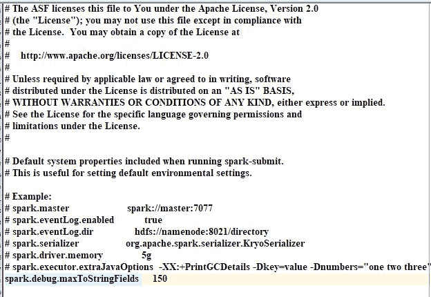

在`spark-defaults.sh`中修复 WARN Utils 问题

保存文件并重新启动`spark-shell`。

现在，再次检查更新的 Spark 配置。我们在 `spark-defaults.sh` 文件中更新了 `spark.debug.maxToStringFields` 的值。这个更改旨在解决 Spark 报告的截断问题。我们将立即确认我们所做的更改导致 Spark 也更新了其配置。这很容易通过检查 `SparkConf` 来完成。

# 再次检查 SparkConf

如前所述，调用 `getConf` 返回存储配置值的 `SparkContext` 实例。在该实例上调用 `getAll` 返回一个配置值的 `Array`。其中之一是 `spark.debug.maxToStringFields` 的更新值：

```java
sc.getConf.getAll
res4: Array[(String, String)] = Array((spark.repl.class.outputDir,C:\Users\Ilango\AppData\Local\Temp\spark-10e24781-9aa8-495c-a8cc-afe121f8252a\repl-c8ccc3f3-62ee-46c7-a1f8-d458019fa05f), (spark.app.name,Spark shell), (spark.sql.catalogImplementation,hive), (spark.driver.port,58009), (spark.debug.maxToStringFields,150),
```

`spark.debug.maxToStringFields` 的更新值现在是 `150`。

在名为 `Utils` 的私有对象内部，`spark.debug.maxToStringFields` 有一个默认值 `25`。

# 再次计算统计数据

在 dataframe 的 `describe` 方法上运行 invoke 并传递列名：

```java
val dFrame2 =  dFrame1.describe("Id","SepalLengthCm","SepalWidthCm","PetalLengthCm","PetalWidthCm","Species"
)
dFrame2: org.apache.spark.sql.DataFrame = [summary: string, Id: string ... 5 more fields]
```

在 `DataFrame` `dfReader` 的 `describe` 方法上调用 invoke 会得到一个我们称之为 dFrame2 的转换后的 `DataFrame`。在 dFrame2 上，我们调用 `show` 方法以返回一个统计结果表。这完成了基本但重要的 EDA 的第一阶段：

```java
val dFrame2Display= = dfReader2.show
```

统计分析的结果显示在下述截图：

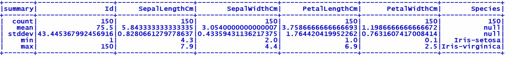

统计分析结果

我们做了所有这些额外的工作只是为了展示单独的数据读取、加载和转换阶段。接下来，我们将所有之前的工作封装在一行代码中：

```java
val dfReader = spark.read.format("com.databricks.spark.csv").option("header",true).option("inferSchema",true).load("iris.csv")
dfReader: org.apache.spark.sql.DataFrame = [Id: int, SepalLengthCm: double ... 4 more fields] 
```

这就完成了在 `spark-shell` 上的 EDA。在下一节中，我们将采取实施、构建（使用 SBT）、部署（使用 `spark-submit`）和执行我们的 Spark 管道应用程序的步骤。我们首先创建一个 SBT 项目的框架。

# 第 3 步 – 创建 SBT 项目

在你选择的文件夹中布局你的 SBT 项目，并命名为 `IrisPipeline` 或任何对你有意义的名称。这将包含我们实现和运行 Iris 数据集上管道所需的所有文件。

我们 SBT 项目的结构如下所示：

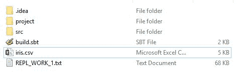

项目结构

我们将在 `build.sbt` 文件中列出依赖项。这将是一个 SBT 项目。因此，我们将引入以下关键库：

+   Spark 核心组件

+   Spark MLlib

+   Spark SQL

下述截图展示了 `build.sbt` 文件：

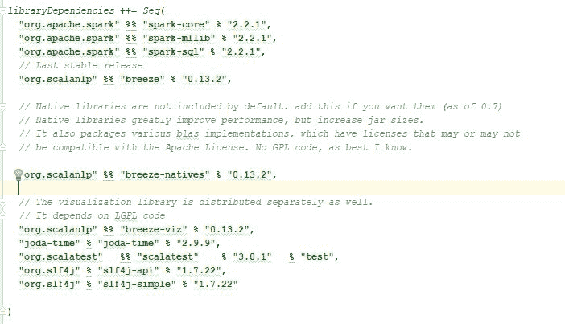

包含 Spark 依赖项的 build.sbt 文件

前一快照中引用的 `build.sbt` 文件在书的下载包中 readily 可用。在 `ModernScalaProjects_Code` 下的 `Chapter01` 代码文件夹中深入挖掘，并将文件夹复制到你的电脑上的一个方便位置。

将在 *第 1 步 - 从 UCI 机器学习仓库获取 Iris 数据集* 中下载的 `iris.csv` 文件删除到我们新 SBT 项目的根目录中。请参考之前的截图，其中显示了包含 `iris.csv` 文件的更新后的项目结构。

# 第 4 步 - 在 SBT 项目中创建 Scala 文件

第 4 步分解为以下步骤：

1.  在 `com.packt.modern.chapter1` 包中创建一个名为 `iris.scala` 的 Scala 文件。

1.  到目前为止，我们依赖于 `SparkSession` 和 `SparkContext`，这是 `spark-shell` 给我们的。这次，我们需要创建 `SparkSession`，它反过来会给我们 `SparkContext`。

接下来是如何在 `iris.scala` 文件中布局代码。

在 `iris.scala` 中，在包声明之后，放置以下 `import` 语句：

```java
import org.apache.spark.sql.SparkSession
```

在一个名为 `IrisWrapper` 的特质内部创建 `SparkSession`：

```java
lazy val session: SparkSession = SparkSession.builder().getOrCreate()
```

只有一个 `SparkSession` 被提供给所有继承自 `IrisWrapper` 的类。创建一个 `val` 来保存 `iris.csv` 文件路径：

```java
val dataSetPath = "<<path to folder containing your iris.csv file>>\\iris.csv"
```

创建一个构建 `DataFrame` 的方法。此方法接受 Iris 数据集完整路径作为 `String` 并返回 `DataFrame`：

```java
def buildDataFrame(dataSet: String): DataFrame = {
/*
 The following is an example of a dataSet parameter string: "C:\\Your\\Path\\To\\iris.csv"
*/
```

通过更新 `SparkSession` 的先前 `import` 语句来导入 `DataFrame` 类：

```java
import org.apache.spark.sql.{DataFrame, SparkSession}
```

在 `buildDataFrame` 函数内部创建一个嵌套函数来处理原始数据集。将此函数命名为 `getRows`。`getRows` 函数不接受任何参数，但返回 `Array[(Vector, String)]`。`SparkContext` 变量的 `textFile` 方法将 `iris.csv` 处理成 `RDD[String]`：

```java
val result1: Array[String] = session.sparkContext.textFile(<<path to iris.csv represented by the dataSetPath variable>>)
```

结果 RDD 包含两个分区。每个分区反过来包含由换行符 `'\n'` 分隔的字符串行。RDD 中的每一行代表原始数据中的对应行。

在下一步中，我们将尝试几个数据转换步骤。我们首先在 RDD 上应用 `flatMap` 操作，最终创建 `DataFrame`。`DataFrame` 是 `Dataset` 的一个视图，而 `Dataset` 正好是 Spark 2.0 线中的基本数据抽象单元。

# 第 5 步 - 预处理、数据转换和 DataFrame 创建

我们将通过传递一个函数块给它并按以下顺序进行连续转换来开始，最终得到 `Array[(org.apache.spark.ml.linalg.Vector, String)]`。一个向量代表特征测量的行。

给出 `Array[(org.apache.spark.ml.linalg.Vector, String)]` 的 Scala 代码如下：

```java
//Each line in the RDD is a row in the Dataset represented by a String, which we can 'split' along the new //line character
val result2: RDD[String] = result1.flatMap { partition => partition.split("\n").toList }

//the second transformation operation involves a split inside of each line in the dataset where there is a //comma separating each element of that line
val result3: RDD[Array[String]] = result2.map(_.split(","))
```

接下来，删除 `header` 列，但在删除之前先进行一个返回 `Array[Array[String]]` 的收集：

```java
val result4: Array[Array[String]] = result3.collect.drop(1)
```

标题列已消失；现在导入 `Vectors` 类：

```java
import org.apache.spark.ml.linalg.Vectors
```

现在，将 `Array[Array[String]]` 转换为 `Array[(Vector, String)]`：

```java
val result5 = result4.map(row => (Vectors.dense(row(1).toDouble, row(2).toDouble, row(3).toDouble, row(4).toDouble),row(5)))
```

剩下的最后一步是创建一个最终的 DataFrame

# DataFrame 创建

现在，我们使用参数 `getRows` 调用 `createDataFrame` 方法。这将返回包含 `featureVector` 和 `speciesLabel`（例如，Iris-setosa）的 `DataFrame`：

```java
val dataFrame = spark.createDataFrame(result5).toDF(featureVector, speciesLabel)
```

显示新 DataFrame 的前 20 行：

```java
dataFrame.show
+--------------------+-------------------------+
|iris-features-column|iris-species-label-column|
+--------------------+-------------------------+
| [5.1,3.5,1.4,0.2]| Iris-setosa|
| [4.9,3.0,1.4,0.2]| Iris-setosa|
| [4.7,3.2,1.3,0.2]| Iris-setosa|
.....................
.....................
+--------------------+-------------------------+
only showing top 20 rows
```

我们需要通过将 Iris-setosa、Iris-virginica 和 Iris-versicolor 这些字符串转换为双精度值来索引物种标签列。我们将使用 `StringIndexer` 来完成这个任务。

现在创建一个名为 `IrisPipeline.scala` 的文件。

创建一个名为 `IrisPipeline` 的对象，它扩展了我们的 `IrisWrapper` 特性：

```java
object IrisPipeline extends IrisWrapper { 
```

导入 `StringIndexer` 算法类：

```java
import org.apache.spark.ml.feature.StringIndexer
```

现在创建一个 `StringIndexer` 算法实例。`StringIndexer` 将我们的物种标签列映射到一个索引学习列：

```java
val indexer = new StringIndexer().setInputCol
(irisFeatures_CategoryOrSpecies_IndexedLabel._2).setOutputCol(irisFeatures_CategoryOrSpecies_IndexedLabel._3)
```

# 第 6 步 - 创建、训练和测试数据

现在，通过提供一个随机种子来将我们的数据集分成两部分：

```java
val splitDataSet: Array[org.apache.spark.sql.Dataset
[org.apache.spark.sql.Row]] = dataSet.randomSplit(Array(0.85, 0.15), 98765L)
```

现在，我们的新 `splitDataset` 包含两个数据集：

+   **训练数据集**：包含 `Array[(Vector, iris-species-label-column: String)]` 的数据集

+   **测试数据集**：包含 `Array[(Vector, iris-species-label-column: String)]` 的数据集

确认新数据集的大小为 `2`：

```java
splitDataset.size
res48: Int = 2
```

将训练数据集分配给一个变量，`trainSet`：

```java
val trainDataSet = splitDataSet(0)
trainSet: org.apache.spark.sql.Dataset[org.apache.spark.sql.Row] = [iris-features-column: vector, iris-species-label-column: string]
```

将测试数据集分配给一个变量，`testSet`：

```java
val testDataSet = splitDataSet(1)
testSet: org.apache.spark.sql.Dataset[org.apache.spark.sql.Row] = [iris-features-column: vector, iris-species-label-column: string]
```

计算训练数据集的行数：

```java
trainSet.count
res12: Long = 14
```

计算测试数据集的行数：

```java
testSet.count
res9: Long = 136
```

总共有 150 行。

# 第 7 步 - 创建随机森林分类器

参考第 5 步 - DataFrame 创建。这个 DataFrame 'dataFrame' 包含的列名与该步骤生成的 DataFrame 中的列相对应

创建分类器的第一步是将（超）参数传递给它。一个相当全面的参数列表看起来像这样：

+   从 'dataFrame' 我们需要特征列的名称 - **iris-features-column**

+   从 'dataFrame' 我们还需要索引标签列的名称 - **iris-species-label-column**

+   `featureSubsetStrategy` 的 `sqrt` 设置

+   每次分割要考虑的特征数（我们有 150 个观察值和四个特征，这将使我们的 `max_features` 值为 `2`）

+   杂质设置——值可以是 gini 和熵

+   要训练的树的数量（因为树的数量大于一个，我们设置树的最大深度），这是一个等于节点数量的数字

+   所需的最小特征测量数（样本观察值），也称为每个节点的最小实例数

查看 `IrisPipeline.scala` 文件以获取这些参数的值。

但这次，我们将采用基于参数组合的穷举网格搜索模型选择过程，其中参数值范围被指定。

创建一个 `randomForestClassifier` 实例。设置特征和 `featureSubsetStrategy`：

```java
val randomForestClassifier = new RandomForestClassifier()
  .setFeaturesCol(irisFeatures_CategoryOrSpecies_IndexedLabel._1)
  .setFeatureSubsetStrategy("sqrt")
```

开始构建 `Pipeline`，它有两个阶段，`Indexer` 和 `Classifier`：

```java
val irisPipeline = new Pipeline().setStages(ArrayPipelineStage ++  ArrayPipelineStage)
```

接下来，将分类器上的超参数 `num_trees`（树的数量）设置为 `15`，一个 `Max_Depth` 参数，以及具有两个可能值 gini 和熵的杂质。

构建一个包含所有三个超参数的参数网格：

```java
val finalParamGrid: Array[ParamMap] = gridBuilder3.build()
```

# 第 8 步 - 训练随机森林分类器

接下来，我们想要将我们的训练集分成一个验证集和一个训练集：

```java
val validatedTestResults: DataFrame = new TrainValidationSplit()
```

在这个变量上，设置`Seed`，设置`EstimatorParamMaps`，设置`Estimator`为`irisPipeline`，并将训练比例设置为`0.8`：

```java
val validatedTestResults: DataFrame = new TrainValidationSplit().setSeed(1234567L).setEstimator(irisPipeline)
```

最后，使用我们的训练数据集和测试数据集进行拟合和转换。太好了！现在分类器已经训练好了。在下一步中，我们将应用这个分类器来测试数据。

# 第 9 步 – 将随机森林分类器应用于测试数据

我们的验证集的目的是能够在模型之间做出选择。我们想要一个评估指标和超参数调整。现在我们将创建一个名为`TrainValidationSplit`的验证估计器的实例，它将训练集分成一个验证集和一个训练集：

```java
val validatedTestResults.setEvaluator(new MulticlassClassificationEvaluator())
```

接下来，我们将这个估计量拟合到训练数据集上，以生成一个模型和一个转换器，我们将使用它们来转换我们的测试数据集。最后，我们通过应用一个用于度量的评估器来进行超参数调整的验证。

新的`ValidatedTestResults` `DataFrame`应该看起来像这样：

```java
--------+
 |iris-features-column|iris-species-column|label| rawPrediction| probability|prediction|
 +--------------------+-------------------+-----+--------------------+
 | [4.4,3.2,1.3,0.2]| Iris-setosa| 0.0| [40.0,0.0,0.0]| [1.0,0.0,0.0]| 0.0|
 | [5.4,3.9,1.3,0.4]| Iris-setosa| 0.0| [40.0,0.0,0.0]| [1.0,0.0,0.0]| 0.0|
 | [5.4,3.9,1.7,0.4]| Iris-setosa| 0.0| [40.0,0.0,0.0]| [1.0,0.0,0.0]| 0.0|
```

让我们通过传递`prediction`和`label`列的表达式来返回一个新的数据集：

```java
val validatedTestResultsDataset:DataFrame = validatedTestResults.select("prediction", "label")
```

在代码行中，我们生成了一个包含两列的新`DataFrame`：

+   一个输入标签

+   一个预测标签，它与输入标签列中的对应值进行比较

这就带我们到了下一步，一个评估步骤。我们想知道我们的模型表现如何。这就是下一步的目标。

# 第 10 步 – 评估随机森林分类器

在本节中，我们将测试模型的准确性。我们想知道我们的模型表现如何。任何机器学习过程如果没有对分类器的评估都是不完整的。

话虽如此，我们以两步过程进行评估：

1.  评估模型输出

1.  传入三个超参数：

```java
val modelOutputAccuracy: Double = new MulticlassClassificationEvaluator()
```

设置标签列，一个度量名称，预测列`label`，并使用`validatedTestResults`数据集调用评估。

注意从`modelOutputAccuracy`变量中测试数据集上的模型输出结果的准确性。

需要评估的其他指标是预测标签值在`'predicted'`列中与（索引的）标签列中的实际标签值有多接近。

接下来，我们想要提取指标：

```java
val multiClassMetrics = new MulticlassMetrics(validatedRDD2)
```

我们的管道产生了预测。与任何预测一样，我们需要保持一定的怀疑态度。自然地，我们想要了解我们的预测过程表现如何。在这方面，算法为我们做了大量的工作。话虽如此，我们在这一步所做的一切都是为了评估。这里谁在受到评估，或者哪种评估值得重复？话虽如此，我们想知道预测值与实际标签值有多接近。为了获得这种知识，我们决定使用`MulticlassMetrics`类来评估将给我们提供模型性能度量的指标，通过两种方法：

+   准确率

+   加权精度

以下代码行将给出准确率和加权精度的值。首先，我们将创建一个包含准确率和加权精度值的 accuracyMetrics 元组

```java
val accuracyMetrics = (multiClassMetrics.accuracy, multiClassMetrics.weightedPrecision)
```

获取准确率的值。

```java
val accuracy = accuracyMetrics._1
```

接下来，获取加权精度的值。

```java

val weightedPrecsion = accuracyMetrics._2
```

这些指标代表了我们分类器或分类模型的评估结果。在下一步中，我们将以打包的 SBT 应用程序运行应用程序。

# 第 11 步 – 以 SBT 应用程序运行管道

在你的项目文件夹根目录下，执行`sbt console`命令，然后在 Scala shell 中导入`IrisPipeline`对象，然后使用`iris`参数调用`IrisPipeline`的`main`方法：

```java
sbt console
scala>
import com.packt.modern.chapter1.IrisPipeline
IrisPipeline.main(Array("iris")
Accuracy (precision) is 0.9285714285714286 Weighted Precision is: 0.9428571428571428
```

在下一节中，我们将向您展示如何打包应用程序，使其准备好作为 Uber JAR 部署到 Spark。

# 第 12 步 – 打包应用程序

在你的 SBT 应用程序的根目录下运行：

```java
sbt package
```

当 SBT 完成打包后，可以使用`spark-submit`将 Uber JAR 部署到我们的集群中，但由于我们处于独立部署模式，它将被部署到 `[local]`：

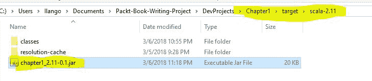

应用程序 JAR 文件

打包命令创建了一个位于目标文件夹下的 JAR 文件。在下一节中，我们将部署应用程序到 Spark。

# 第 13 步 – 将管道应用程序提交到 Spark 本地

在应用程序文件夹根目录下，使用类和 JAR 文件路径参数分别执行`spark-submit`命令。

如果一切顺利，应用程序将执行以下操作：

1.  加载数据。

1.  执行 EDA。

1.  创建训练、测试和验证数据集。

1.  创建一个随机森林分类器模型。

1.  训练模型。

1.  测试模型的准确性。这是最重要的部分——机器学习分类任务。

1.  要实现这一点，我们将训练好的随机森林分类器模型应用于测试数据集。这个数据集包含了模型尚未见过的鸢尾花数据。未见数据不过是野外的鸢尾花。

1.  将模型应用于测试数据集，结果是对未见（新）花朵物种的预测。

1.  最后的部分是管道运行评估过程，这本质上就是检查模型是否报告了正确的物种。

1.  最后，管道会报告某个特定特征在鸢尾花中的重要性。事实上，花瓣宽度在执行分类任务时比萼片宽度更重要。

这将带我们来到本章的最后一节。我们将总结我们已经学到的内容。不仅如此，我们还将向读者展示他们将在下一章中学到的东西。

# 摘要

在本章中，我们实现了一个机器学习工作流程或机器学习管道。该管道将数据分析的几个阶段结合成一个工作流程。我们首先加载数据，然后创建了训练数据和测试数据，对数据集进行了预处理，训练了 `RandomForestClassifier` 模型，将随机森林分类器应用于测试数据，评估了分类器，并计算了一个过程，展示了每个特征在分类中的重要性。我们实现了在 *项目概述 – 问题定义* 部分早期设定的目标。

在下一章中，我们将分析 **威斯康星州乳腺癌数据集**。这个数据集只有分类数据。我们将构建另一个管道，但这次，我们将设置 Hortonworks 开发平台沙盒来开发和部署乳腺癌预测管道。给定一组分类特征变量，这个管道将预测一个给定的样本是良性还是恶性。在当前章节的下一部分和最后一部分，我们将列出一系列问题，以测试您到目前为止所学知识的掌握程度。

# 问题

以下是一份供您参考的问题列表：

1.  你如何理解 EDA？为什么它很重要？

1.  为什么我们要创建训练数据和测试数据？

1.  为什么我们要索引从 UCI 机器学习仓库中提取的数据？

1.  为什么 Iris 数据集如此著名？

1.  随机森林分类器的一个强大功能是什么？

1.  什么是监督学习与无监督学习相对？

1.  简要解释使用训练数据创建我们模型的过程。

1.  特征变量与 Iris 数据集有何关系？

1.  使用 Spark 编程的入口点是什么？

任务：Iris 数据集问题是一个统计分类问题。创建一个混淆矩阵或错误矩阵，其中行是预测的 setosa、预测的 versicolor 和预测的 virginica，列是实际物种，如 setosa、versicolor 和 virginica。完成这个任务后，解释这个矩阵。
