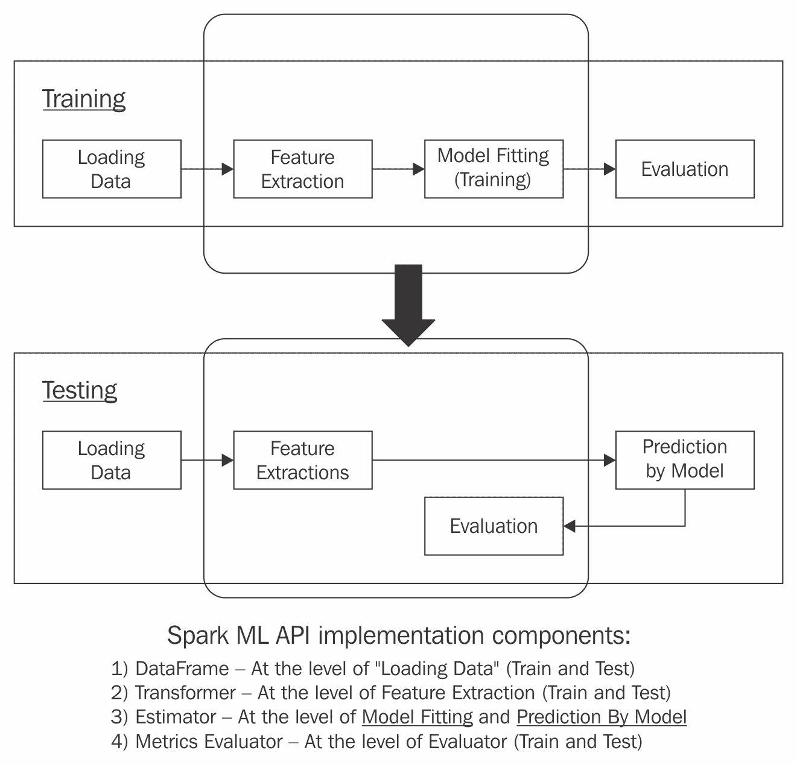

# 利用 Spark 和 Scala 的力量构建乳腺癌预后流程

乳腺癌是每年女性死亡的主要原因，使其他人处于各种疾病阶段。最近，**机器学习**（**ML**）在医生和研究人员追求更好的结果和降低治疗成本方面显示出巨大的潜力。考虑到这一点，**威斯康星乳腺癌** **数据集**代表了一系列适合的特征，这些特征足以生成机器学习模型，这些模型能够通过学习预先确定的或历史乳腺癌组织样本数据来预测未来的诊断结果。

这里是我们所参考的数据集：

+   UCI 机器学习仓库：乳腺癌威斯康星（原始）数据集

+   UCI 机器学习仓库：乳腺癌威斯康星（诊断）数据集

+   访问日期：2018 年 7 月 13 日

+   网站 URL：[`archive.ics.uci.edu/ml/datasets/Breast Cancer Wisconsin (Original)`](https://archive.ics.uci.edu/ml/datasets/Breast%20Cancer%20Wisconsin%20(Original))

在本章中，我们将专注于实现和训练一个逻辑回归多类分类器，以预测乳腺癌肿块是否为恶性。威斯康星乳腺癌数据集是一个分类任务。

本章的主要学习目标是能够实现一个 Scala 解决方案，该方案可以预测癌症结果。从 **UCI 机器学习仓库** 乳腺癌数据集开始，我们将依赖 Spark ML 库的 ML API 和其支持库来构建乳腺癌预测流程。

以下列表是本章各个部分的学习成果的逐节分解：

+   乳腺癌分类问题

+   开始

+   随机森林乳腺癌流程

+   LR 乳腺癌流程

# 乳腺癌分类问题

目前，监督学习是商业领域中最常见的机器学习问题类别。在 第一章 *从鸢尾花数据集预测花的类别* 中，我们通过采用一个强大的监督学习分类算法 **随机森林** 来处理鸢尾花分类任务，其核心依赖于一个分类响应变量。在本章中，除了随机森林方法之外，我们还转向另一种有趣且流行的分类技术，称为 **逻辑回归**。这两种方法都为乳腺癌预后预测问题提供了一个独特的解决方案，而迭代学习过程是它们的共同点。本章中，逻辑回归技术占据中心舞台，优先于随机森林。然而，两者都是从包含预定测量值的样本测试数据集中学习，并在新的、未见过的数据上计算预测。

在我们进一步进行之前，关于机器学习术语的简要说明。在这个快速发展的领域中，文献有时会看到充斥着来自其他重叠领域的术语，导致不同的看法，尽管两个显然不同的术语指的是同一件事或者从语义上大多是等效的。有时，文献中经常互换使用的两个术语实际上可能相当不同；例如，术语**多元**和**多变量**就是这样的术语。在本章中，我们将避免使用多变量。话虽如此，让我们来探讨威斯康星州乳腺癌数据集，并在问题制定和实现之前理解其周围的术语。

首先，我们必须从 UCI 机器学习仓库下载数据集。它位于`ModernScalaProjects_Code`文件夹中。

# 威斯康星州乳腺癌数据集概览

威斯康星州乳腺癌数据集包含 699 行数据。每一行对应一个单独的样本（在机器学习文献中，术语**示例**有时与**样本**可以互换使用），包含九个特征测量，这些特征测量是乳腺肿块细针吸取的数字化图像。

在我们深入细节之前，这里有一个表格列出了威斯康星州乳腺癌数据集 699 行（实例）的关键特征：


乳腺癌数据集特征

前面的表格列出了乳腺癌数据集的九个细胞核属性，其中每个属性只有一个值。这九个细胞核属性值都是从某个样本的数字化图像中捕获的测量值。因此，699 个这样的乳腺癌组织样本应该构成我们的 699 个输入向量的机器学习实验单元。

为了反思输入向量是什么，我们邀请读者回顾他们之前在 Iris 数据集监督学习问题上的经验；这是一个有两个基本方面的分类任务：

+   一个输入向量

+   一个响应变量值`Y`，对于其输入向量有两个可能的结果：

    +   `Y`由类别列表示，有时被称为监督信号。

    +   两种结果（例如，正面或反面）意味着多于一个的类别标签。一个结果代表一个**分类**，就像在分类任务中一样。

前面的两个方面也与我们面临的乳腺癌监督学习问题——当前任务——是共有的。以下各点通过提供更多见解来描述当前任务：

+   这是一个 699 个输入向量的多类别分类任务。这个任务的特点是历史（预定）的类别数据和多个依赖或结果变量（或标签）。

+   这个任务是在一个包含 699 个观察/测量（实例）的数据集上执行的，其中每一行观察可能进一步描述如下：

    +   每一行由 10 个属性组成；这些属性中的每一个都是预测变量（输入，`X`），它们也被称为输入变量（`X`）。

    +   699 个观测值都是历史数据或预先确定的（除了某些不完整的观测值/行），它们代表了从针吸活检的乳腺癌组织样本中细胞核的特性（乳腺质量细胞核）。

    +   上述乳腺质量细胞核有 10 个特性；这些只是乳腺质量细胞核的测量值。

+   由于存在 10 个（输入）属性值作为特征参数传递到`Model`以执行所谓的目标类诊断分类，因此分类任务也是多维的。

+   乳腺癌数据集中的每个实例（行）代表了在乳腺质量组织样本上进行的测量（来自数字化图像）。

+   分类任务的目标如下：

+   识别（或分类）新的乳腺癌样本的诊断，判断其属于两种诊断中的哪一种：恶性（癌性）或良性（非癌性）。

+   通过学习（或拟合）离散数量的目标或类别标签（`Y`）的过程，从预测变量中推导出响应的预测值。预测值是一个分类响应（结果）变量（输出`Y`），也称为响应或结果变量（`Y`）。

    +   学习一个预测函数，也称为模型；这个模型计算一个预测函数，预先确定 10 个属性上的特征测量值，这将能够对诊断类型（良性或恶性）进行分类或识别。

在第一章《从鸢尾花数据集预测花的类别》中，我们使用了一种名为随机森林的有监督学习分类算法。在本章中，我们将采用被称为逻辑回归分类技术（Spark ML 算法）。这将是我们的预测分析分类流程的核心。总结一下，乳腺癌分类任务的高层次视图可以概括如下：

+   **分类算法**：这涉及到创建一个判别函数或模型函数，该函数发现几个独立变量和一个依赖变量（通过模型索引到一个二元虚拟变量）之间的模式、关系或交互，该依赖变量可以是名义变量或有序变量。

+   **预定的特征**：已被标记为恶性或其他情况的测量或观测值。

+   **预测标签**：在学习过程之前对未见数据打标签，在学习过程之后对新未见数据进行预测。

逻辑回归的最终目标是生成一个尽可能拟合（训练）好的模型，并能够输出预测结果。当然，预测结果是一个感兴趣的变量。

下一个部分是对逻辑回归统计技术应用的更广泛讨论的序言。

# 逻辑回归算法

本章在构建数据管道时使用的**逻辑回归（LR**）算法是一种新颖的方法，用于预测乳腺癌肿块是否为恶性。

在理解 LR 算法的关键在于：

+   “如果（分类）特征 x = …”，那么它将标签视为一个输出，类似于“标签 =..”。

+   谈到分类特征，我们可能想了解乳腺癌数据集中两个或多个特征之间的关系。此外，我们还对构建 LR 机器学习模型感兴趣，作为高效的数据推理，以推导出多个分类变量的同时效应。

在下一节中，我们将向您展示 LR 技术的概述。

# LR 显著特点

以下表格列出了 LR 的显著特点：


LR 速览

在本章中，我们为管道实现的回归或分类模型是一种特殊的广义线性回归模型，称为**二元逻辑回归**。

在我们讨论二元逻辑回归之前，我们将回顾一下第一章，*从鸢尾花数据集预测花的类别*，并提醒自己不同类型的变量。其中一种变量类型是响应变量，其变化由所谓的解释变量解释。解释变量在散点图的*x*轴上绘制，而绘制在*y*轴上的响应变量则依赖于前者。以下是一个散点图的示例，尽管它与此章节不直接相关，但具有一定的意义：


散点图示例

进一步深入，我们将探讨线性回归这一主题。这种预测模型将一组解释性分类值作为超参数，这些超参数在预测期望的响应变量值中起着直接作用。我们的响应变量取某个特定值的可能性有多大？这些可能性用数学术语表示，即一个概率模型，它转化为预测函数。这样的函数做两件事：

+   接受多个解释性（或输入）变量特征测量

+   模拟响应变量的概率

在我们将所有这些应用到我们的乳腺癌数据集之前，我们将引用来自凯斯西储大学的一个（虚构的）数学程序招生过程的例子。这个过程可以用以下要点来描述：

+   它应该是一个公平、非歧视的过程，允许来自各种类别或群体的学生进入学术项目。

+   一个录取过程预测模型将预测学生成功（或不成功）录取的概率，前提是他们属于某个性别、种族或经济背景。

+   一个重要的问题是学生 A 成功进入这个项目的几率是什么？换句话说，我们如何提出一个`StudentAdmission`预测函数（模型），该模型将预测`admission status`响应变量取特定值的几率？

+   `StudentAdmission` 模型接收一组解释变量。这个组包括代表个人某些特征的独立变量。这些是多个特征测量。一些特征可以包括性别、种族、收入群体等等。

所有这些话，我们想知道二元逻辑回归如何作为线性回归模型方法的扩展找到其位置。以下描述了两个使用示例：

+   例如，考虑一个二元逻辑回归模型仅仅预测一个事件（一个事件）是否发生。一个拥有地震数据的学者对分析未来某个时间是否会发生地震感兴趣。这种响应变量是**离散的**。换句话说，它是非连续的、静态的或一次性的有限发生。

+   大学录取过程可以建模为一个二元逻辑回归模型，该模型涉及多个解释变量或课程。该模型将预测响应变量（`admission status`）取特定值的几率（或概率）。更进一步，学生录取过程中的预测离散值是`0`或`1`的值。

接下来，我们将列出有助于我们制定逻辑回归任务的假设。

# 二元逻辑回归假设

这里是一些为二元逻辑回归分类任务所做的假设：

+   因变量应该是二元的，表示互斥的状态。存在多个自变量预测因子。

+   预测变量之间的相关性由相关矩阵的元素表示。它们不能高于 0.9。

+   异常值必须不存在。异常值的存在与否可以通过将预测因子转换为标准化的统计分数来确定。

在本章中，与我们相关的唯一数据集是乳腺癌数据集。这是一个分类任务，其分析解决方案将是二元逻辑回归。在我们到达那里之前，我们将将其作为一个更简单的数据集来展示以下内容：

+   自变量

+   因变量

+   相关系数矩阵

在下一节中，我们将通过一个关于男性和他们约会成功率的调查的虚构例子来说明线性回归的基本原理。

# 一个虚构数据集和 LR

在这里，我们将向您展示一个虚构的数据集，仅为了展示我们对逻辑回归案例的论述，以便它能够成为我们乳腺癌数据集分类任务的候选者。

以下示例列出了约会网站创建的关于单身男性的数据。表中列出的一个因变量代表男士是否幸运，这意味着他们在第一次约会一周内能够与同一个人再次约会。

有两个自变量，它们如下：

+   男士是否参加了约会工作坊来巩固他们的约会技巧？

+   第二个变量衡量的是男士在绝望尺度上的绝望程度。分数越高，男士越绝望，100 分代表最绝望。

下面的约会调查表列出了与约会逻辑回归问题相关的数据：


逻辑回归示例

检查数据集告诉我们，超过一半的单身男士在不到一周的时间内有过第二次约会。这是假设约会调查公司没有这些单身人士的其他背景数据，并且在这个（虚构的）约会帮助行业中应用了最佳技术。

现在，我们想知道**工作坊**组的人是否更有可能再次约会。查看第四列，**酷**，更高的酷度意味着有更好的第二次约会的可能性：


相关系数表

观察到**相关系数**表，那些不在**工作坊**的男士不太可能再次约会，而那些**酷**因子较高的男士更有可能再次约会。

在这个数据集上应用逻辑回归将具有以下特点：

+   响应（因）变量：**约会**

+   测量水平：**平均值**和**标准差**

+   回归函数：**逻辑**或**logit**

+   特征行总数：**20**

到目前为止，我们已经让您对逻辑回归有了更好的理解。我们将在下一节更深入地探讨这个话题。我们讨论了响应变量和相关性系数，也就是二元变量，并且对这些有了很好的把握。然而，我们还没有用数学术语制定逻辑回归模型。我们想知道使用线性回归来构建模型是否适合乳腺癌分类任务。结果证明，我们无法将线性回归模型应用于当前的任务。为什么我们转向逻辑回归而不是线性回归是下一节讨论的要点之一。

# 逻辑回归与线性回归的区别

在选择逻辑回归和线性回归方法之前，这里有一些要点，它们重申或重述了我们在本章和第一章，“从鸢尾花数据集预测花的类别”中讨论的内容：

+   在他们的实验数据单元上工作的数据科学家正在寻求构建一个模型。自然而然地，接下来的问题可能是他们为什么对构建一个（机器学习）模型感兴趣？

+   对于上一个问题的答案可能在于，该模型有助于发现预测变量（解释变量或独立变量）与其响应变量之间的模式或潜在关系。

谈到响应变量，乳腺癌数据集中的响应变量是分类的，与其他机器学习分类任务中的响应变量不同，后者如下：

+   连续型

+   无界

这为我们带来了清晰，并随之而来的是以下工作假设：

对于我们的乳腺癌分类任务，线性回归方法可能不起作用。毕竟，响应变量 `Y` 既不是连续的无界变量，也不是正态分布的。在我们将线性回归方法排除在我们的目的之前，我们仍然会尝试这样的公式，在这个过程中，我们可以更多地了解为什么线性回归（LR）是我们真正想要的。

# 线性回归分类模型的公式化

线性回归模型的数学公式的依据可以分解如下：

+   左侧：预测变量。

+   右侧表示为 `y`：由系数、预测变量（独立变量）和算术运算符 `+`（加法）和 `*`（乘法）组成的线性结构。

+   假设有四个预测变量，`PX1`、`PX2`、`PX3` 和 `PX4`，每个变量代表所谓的 `X`。

在一开始，我们可以写出一个代表线性回归模型的方程，如下所示：

```java
//y on the Left-Hand is the predicted variable, and PX1, PX2, PX3... are predictor varibles (X)
y = LR0 + (LR1 * PX1) + (LR2 * PX2) + (LR3 * PX3) + (LR4 * PX4) + ......
```

但是有一个问题！我们新的线性回归模型的特点是响应变量实际上是**非二元的**。好吧，我们可以站出来声称，仍然有可能提出这个方程的改进版本，这将代表具有二元响应变量的线性回归模型。但实际上，这样的改进线性模型不会起作用，原因有两个：

+   我们的（二元）响应变量需要任意分配 `0` 和 `1`。这是因为我们想要表示两种相互排斥的分类状态。这些状态可以是良性的或恶性的，分别对应。

+   第二个原因与事实有关，即因为响应变量值 `Y` 是分类的，所以预测值实际上是这个变量接受某个值的概率，而不是这个值本身。

到目前为止，我们的思考过程似乎明显倾向于至少一个具有二元响应变量的回归模型，而不是线性回归模型。为什么会这样？

可能我们想要构建的模型是概率的函数，一个逻辑回归方程，它区别于左侧表示为 `Y` 的对数而不是 `Y` 本身。下一节将结合这里提出的思想，构建逻辑回归的数学公式。

# 对数函数作为数学方程

继续从上一节结束的地方讲起，本节试图将那些想法和结论转化为新的叙述。本节的目标是给出逻辑回归的高层次数学公式。

然而，由于逻辑回归是一个更为复杂的案例，我们将为所谓的对数函数、对数模型或对数赔率制定一个更简单的方程。

不再赘述，对数函数在高级别上表示为 `Logit(p)`，可以扩展为赔率的均值对数，而不是 `Y` 本身。

话虽如此，以下是一些数学概念，有助于我们理解和编写对数函数：

+   **欧拉数**：欧拉数 (*e*) = 2.718228183

+   **自然对数**：如果 *e* 可以被提升到 *y* 的幂，例如，*e**y* = *x*，那么 *x* 的以 *e* 为底的对数是 *log[e]*(*x*) = *y*

在这一点上，对对数函数的表述类似于以下方程：

```java
//Natural Logarithm of the probability that Y equals one of two values, perhaps 0 and 1, each taken to //represent one of two mutually exclusive states
Ln[p/(1-p)] = LR0 + (LR1 * PX1) + (LR2 * PX2) + (LR3 * PX3) + (LR4 * PX4)
```

我们新制定的对数函数是基于赔率或概率比的自然对数的一个方程。对数函数是一个模型，其特征如下：

+   在这个对数函数中，`Ln[p/(1-p)]`，`p/(1-p)` 被称为样本被标记为良性时的赔率。例如，`Ln[p/(1-p)]` 是自然对数或对数赔率，或者简单地说是对数，其值在 -∞ 到 +∞ 之间变化。

+   对数函数可以表示为 `fnLogistic(p) = ln(p/1-p)`，其中 `p` 在 `0` 和 `1` 之间，而 `0` 和 `1` 是绘制在 *x* 轴上的最大和最小值，例如，`fnLogistic(0.9) = 2.197224577336`。

+   `LR0`、`LR1`、`LR2` 等被称为模型系数或相关系数。这些模型系数与预测变量（解释变量）相关联，该变量与预测变量（响应变量）相关。

+   `PX1`、`PX2` 和 `PX3` 是预测变量。

+   对数函数也是一个 **连接函数**。它之所以是连接函数，是因为它将位于对数函数左侧的概率的自然对数与由预测变量及其相应系数组成的线性方程联系起来。

+   `p` 被说是在 0 和 1 之间有界，这里就是这种情况。

典型的对数函数曲线看起来像这样：


对数模型图表

到目前为止，我们还没有讨论逻辑回归，它比对数模型稍微复杂一些。

对图表的解释如下：

+   非线性图表将描绘以下内容：

+   *x* 轴：对数值

+   *y* 轴：概率（或赔率）

+   观察图表，对于概率为 **0** 的情况，对数值为 **0.5**

回顾一下，我们开始于线性回归，然后转向对对数模型的讨论。理解对数几率函数是什么为在乳腺癌分类任务中逻辑回归的背景奠定了基础。

# 逻辑回归函数

我们之前说过，逻辑回归比对数几率函数更难。然而，正如我们将要看到的，逻辑回归的公式非常适合这个问题。我们想要对样本是良性还是恶性的命运进行预测。换句话说，基于簇厚度、细胞大小均匀性等特征测量，特定的乳腺癌组织样本的预测只能取两个互斥值之一。每个这些特征测量可以分别表示为`X1`、`X2`和`X3`。

这将我们带到逻辑回归函数公式的开始。

逻辑回归函数背后的核心概念是所谓的逆函数，其表示如下：


下面是对前面方程的简要解释：

在前面的方程中，**p**只是一个由`X1`、`X2`、`X3`以及更多表示的乳腺癌样本特征测量的函数。

将**p**重写为`fLogistic(X1,X2,..)`，我们得到了以下完整函数定义：

```java
fLogistic(X1,X2,X3,..) = LR0 + (LR1 * PX1) + (LR2 * PX2) + (LR3 * PX3) +  ...
```

结果表明，我们之前讨论的对数几率函数和我们的逻辑回归函数互为逆函数。

关于逻辑回归的重要要点如下：

+   存在一个表示结果发生或未发生的概率的二分响应变量

+   以下是一个非线性关系：

+   在*x*轴上绘制的分类输入（独立特征测量）值。这些也被称为预测变量。

+   在*y*轴上的概率。这些是预测值。

+   非常重要：系数`LR0`、`LR1`和`LR2`是从我们的训练数据集中计算出来的。我们的训练数据集有已知或预定的输入测量和输出标签。

到目前为止，我们已经拥有了转向 Spark ML API 以实现我们刚才讨论的逻辑回归数学模型所需的全部内容。

在下一节中，我们将构建两个数据管道：

+   使用随机森林算法的管道

+   使用逻辑回归方法的管道

我们从第一章，*从鸢尾花数据集预测花卉类别*中熟悉了随机森林。逻辑回归是一个经过验证的方法，它背后有成熟的统计技术，机器学习发现这些技术对于解决二元分类问题非常有用。

以下*开始使用*部分将指导您开始实现过程。

# 开始使用

开始的最佳方式是理解更大的图景——评估我们面前工作的规模。在这种情况下，我们已经确定了两个广泛的任务：

+   设置必备软件。

+   开发两个流水线，从数据收集开始，构建一个可能以预测结束的工作流程序列。这些流水线如下：

+   一个随机森林流水线

+   一个逻辑回归流水线

我们将在下一节中讨论设置先决软件。

# 设置先决软件

首先，请回顾第一章中的*设置先决软件*部分，*从鸢尾花数据集预测花的类别*，以审查您现有的基础设施。如果需要，您可能需要重新安装所有内容。您需要实质性更改任何内容的可能性很小。

然而，以下是我推荐的升级：

+   如果您还没有这样做，请将 JDK 升级到 1.8.0_172

+   Scala 从 2.11.12 升级到一个早期的稳定版本 2.12

+   Spark 2.2 升级到 2.3，其中 2.3 是一个主要版本，包含许多错误修复，这也是为什么建议这样做的原因。

在撰写本书时，Java 9 和 10 似乎与 Spark 不兼容。这可能会改变。为了本章的目的，您的本地 Spark shell 将是首选的开发环境。

在解决完先决条件后，我们准备好直接进入开发流水线。这次旅程从*实施目标*部分开始。

# 实施目标

我们已经实现了第一章的实施方案目标，*从鸢尾花数据集预测花的类别*。在该章的早期，我们开发了工作流程的初步过程。以下图表展示了这一点，它将帮助我们为本章制定实施方案目标：


初步工作流程的阶段

由于当前章节也处理与之前类似的多类分类任务，因此前图中显示的四个框是我们为设置本章实施方案目标的指南。广泛的高级目标是：

+   **数据收集**步骤之后是**探索性数据分析**(**EDA**)步骤

+   **数据清洗**/**预处理**步骤

+   将数据传递给算法；有模型需要训练（拟合）和预测需要生成

这为更完整的实施方案目标列表铺平了道路，它们是：

+   从 UCI 机器学习库获取乳腺癌数据集。

+   为 EDA 提取数据框。

+   在沙盒 Zeppelin 笔记本环境中进行初步的 EDA（探索性数据分析）操作，并在 Spark shell 中运行统计分析。

+   在 Zeppelin 中逐步开发流水线并将代码移植到 IntelliJ。这意味着以下内容：

+   在 IntelliJ 中创建一个新的 Scala 项目，或将现有的空项目导入 IntelliJ，并从笔记本中逐步开发出的代码创建 Scala 代码库

+   不要忘记在`build`文件中连接所有必要的依赖项

+   解释管道的结果：

+   分类器表现如何？

+   预测值与原始数据集中的值有多接近？

现在，我们将逐一开始工作，从从 UCI 机器学习仓库获取威斯康星乳腺癌数据集开始。

# 实施目标 1 – 获取乳腺癌数据集

前往 UCI 机器学习仓库网站[`archive.ics.uci.edu/ml/datasets/bcw`](https://archive.ics.uci.edu/ml/datasets/bcw)，通过点击数据文件夹下载`Data`文件夹。将此文件夹提取到方便的位置，并将`bcw.csv`复制到项目文件夹的根目录，我们将称之为`Chapter2`。此时，`Chapter2`将是空的。

您可以参考项目概述以深入了解乳腺癌数据集的描述。我们在此以如下方式描述`bcw.data`文件的内容：


包含 699 行的乳腺癌数据集快照

我们刚刚下载的乳腺癌数据集是多元的，这意味着它包含一组超过一个的独立变量。在对其进行任何 EDA 之前，我们需要创建一个数据集的抽象，我们称之为 dataframe。如何创建 dataframe 作为 EDA 的先导是下一节的目标。

# 实施目标 2 – 为 EDA 推导 dataframe

我们将威斯康星乳腺癌数据文件下载到`Chapter2`文件夹，并将其重命名为`bcw.csv`。`DataFrame`创建的过程从加载数据开始。

我们将按照以下方式在`SparkSession`上调用`read`方法：

```java
scala> val dfReader1 = spark.read 
dfReader1: org.apache.spark.sql.DataFrameReader = org.apache.spark.sql.DataFrameReader@3d9dc84d
```

返回的`read`方法产生`DataFrameReader`。由于我们的数据集是一个 CSV 文件，我们想通过在`DataFrameReader`上调用`format`方法并传入`com.databricks.spark.csv`格式指定符字符串来告诉 Spark：

```java
scala> val dfReader2 = dfReader1.format("com.databricks.spark.csv")
dfReader2: org.apache.spark.sql.DataFrameReader = org.apache.spark.sql.DataFrameReader@3d9dc84d
```

在这一点上，`DataFrameReader`需要一个键值对形式的输入数据源选项。使用两个参数调用`option`方法，一个字符串类型的键`"header"`和其布尔类型的值`true`：

```java
scala> val dfReader3 = dfReader2.option("header", true)
dfReader3: org.apache.spark.sql.DataFrameReader = org.apache.spark.sql.DataFrameReader@3d9dc84d
```

接下来，代码再次调用`option`方法（在`DataFrameReader`上），参数为名为`inferSchema`的参数和`true`值。通过调用`inferSchema`方法，我们希望 Spark 确定我们的输入数据源的架构，并返回我们的`DataFrameReader`：

```java
scala> val dfReader4 = dfReader3.option("inferSchema", true)
dfReader4: org.apache.spark.sql.DataFrameReader = org.apache.spark.sql.DataFrameReader@3d9dc84d
```

接下来，通过调用`load`方法并将数据集文件的路径传递给它来加载`bcw.csv`。外部数据源，如我们的数据集，需要一个路径，以便 Spark 能够加载数据，这样`DataFrameReader`就可以处理文件并返回`DataFrame`，如下所示：

```java
scala> val dataFrame = dfReader4.load("\\bcw.csv")
dataFrame: org.apache.spark.sql.DataFrame = [id: int, clump_thickness: int ... 9 more fields]
```

现在我们有了乳腺癌 dataframe！这完成了*实施目标 2 – 为 EDA 推导 dataframe*部分。我们的下一步是进行初步的统计分析。

最后，在我们进行下一步之前，这里有一个 dataframe 的视图：


原始数据 DataFrame

看起来我们的 `DataFrame` 中有数据，现在它已经准备好进行 EDA。

# 第一步 – 进行初步的 EDA

在这一点上，我们将对我们的数据集进行相当简单的统计分析。这将为我们提供一些有用的、初步的统计洞察，例如均值、中位数、范围和标准差等。

为了进行初步的 EDA，让我们使用所需的列名作为参数调用 `describe` 方法。这将给我们一个新的名为 `stats` 的 `DataFrame`。在 `stats` 上调用 `show` 方法将生成如下统计结果表：


统计分析

尽管输出看起来很丑陋且混乱，但我们看到了统计数字，如 `count`、`mean`、标准差、最小值和最大值。是的，数据集有 699 行连续的、离散的（或分类的）值。

现在初步的探索性数据分析已经完成，我们进入下一步，将数据集加载到 Spark 中。

# 第二步 – 加载数据并将其转换为 RDD[String]

在这一步中，我们将再次加载数据，但方式略有不同。这一阶段数据分析的目标是生成一个 `DataFrame`，其中数据已被读入 `RDD[String]`。首先，我们需要数据集的路径：

```java
scala> val dataSetPath = "C:\\Users\\Ilango\\Documents\\Packt\\DevProjects\\Chapter2\\"
dataSetPath: String = C:\Users\Ilango\Documents\Packt\DevProjects\Chapter2\
```

我们刚刚创建了 `dataSetpath`。在下面的代码中，我们将数据集的路径传递给 `textFile` 方法：

```java
scala> val firstRDD = spark.sparkContext.textFile(dataSetPath + "\\bcw.csv")
firstRDD: org.apache.spark.rdd.RDD[String] = C:\<<path to your dataset file>>
 MapPartitionsRDD[1] at textFile at <console>:25
```

`textFile` 方法返回了一个 `RDD[String]`。为了检查数据是否已加载到 RDD 中，我们需要在 `firstRDD` 上调用 `first` 方法以获取 `header` 内容。我们将把这个作为练习留给读者。

接下来，我们想知道我们的 RDD 中的分区数：

```java
scala> firstRDD.getNumPartitions
res7: Int = 2
```

`getNumPartitions` 方法返回了 `firstRDD` 中的分区数。由于 RDD 允许我们在低级别上处理数据，我们将继续按照需要重新组织和调整这些数据。

在下一步中，我们想要检查 RDD。我们想要重新组织和包装数据到数组中。

# 第三步 – 分割弹性分布式数据集并将单个行重新组织为数组

为了分割数据集，我们将从 RDD 分区开始。以以下方式思考 RDD 分区是有帮助的。

每个分区可以可视化为一个由 `"\n"` 分隔的行数据组成的长字符串。我们想要通过 `"\n"` 分隔符将这些长字符串分解为其组成部分字符串。简而言之，我们将在我们的 RDD，`firstRDD` 上尝试一个 `flatMap` 操作。每个组成部分字符串是一个 `Row`，它代表原始数据集中的行。

我们将对 `flatMap` 进行操作，并传递一个匿名函数，该函数将在由 `"\n"` 字符分隔的行上调用，如下所示：

```java
scala> val secondRDD = firstRDD.flatMap{ row => row.split("\n").toList }
secondRDD: org.apache.spark.rdd.RDD[String] = MapPartitionsRDD[33] at flatMap at <console>:27
```

前面的代码执行了一个`flatMap`扁平化操作，结果创建了一个新的`RDD[String]`，它将包含所有这些字符串（每个字符串都是我们的数据集中的一行）。在这个阶段，我们将`split`（沿着该行中各个字符之间的逗号）一个`String`，生成一个`RDD[Array[String]]`：

```java
scala> val rddArrayString = secondRDD.map(_.split(","))
rddArrayString: org.apache.spark.rdd.RDD[Array[String]] = MapPartitionsRDD[34] at map at <console>:29
```

`RDD[Array[String]]`自然意味着该 RDD 包含多个`Array[String]`。在这个 RDD 中有多少这样的数组？

```java
scala> rddArrayString.count
res9: Long = 700
```

在我们的 RDD 上调用`count`返回了一个数组计数为`700`，这正是它应有的值。

# 第 4 步 – 清除包含问号字符的行

在我们继续之前，让我们再次查看原始数据集。如果你仔细观察，你会注意到数据集中某些地方包含`?`字符。实际上，这个字符从第七列开始出现在一些行的第 25 行。带有`?`字符的第 25 行在下面的图中显示。这是一个问题，需要解决方案。

有时，对数据集的视觉检查可以揭示存在多余的字符。

以下是以`?`字符出现在第 25 行和第六列的威斯康星州乳腺癌数据集的快照：


显示?字符的数据集

显然，不仅仅是第 25 行有`?`字符。可能还有其他行包含需要清除的多余的`?`字符。一个解决方案似乎是在我们的`rddArrayString`上调用一个`filter`操作：

```java
scala> val purgedRDD = rddArrayString.filter(_(6) != "?")
purgedRDD: org.apache.spark.rdd.RDD[Array[String]] = MapPartitionsRDD[35] at filter at <console>:31
```

如前述代码所示，我们刚刚运行了`filter`操作，它返回了一个新的`RDD[Array[String]`，我们称之为`purgedRDD`。自然地，我们可能想要计算数据集中剩余的行数，我们认为这些行对于数据分析是相关的。这就是下一节的目标。

# 第 5 步 – 清除数据集中有疑问字符的行后的计数

我们现在将在新的`purgedRDD`上运行`count`：

```java
scala> purgedRDD.count
res12: Long = 684
```

因此，在先前的代码中，我们在`purgedRDD`上调用了`count`方法。Spark 返回了一个值为`684`的结果。显然，有 16 行包含`?`字符。毕竟，许多像这样的数据集需要预处理步骤或两个。现在，我们将继续进行数据分析的下一步，因为我们知道 Spark 可能不会报告错误，尤其是在我们想要一个包含合并特征向量的新两列`DataFrame`的地方。

在下一节中，我们将去除`header`。

# 第 6 步 – 去除 header

之前显示的每个内部数组都包含表示特征测量的行和一个表示数据集`header`的行。以下代码行将我们的 RDD 转换为包含字符串行的数组：

```java
//Drop the Array with the headers in it
scala> val headerRemoved = cleanedRDD.collect.drop(1)
headerRemoved: Array[Array[String]] 
```

`drop`方法去除了`header`。接下来，我们将继续创建一个新的`DataFrame`。

# 第 7 步 – 创建一个两列的 DataFrame

我们已经接近目标了。在本节中，目标是创建一个输入特征向量，步骤如下：

1.  导入 `Vectors` 类。

1.  在 `Array` 上的 `map` 操作中，我们将遍历我们的无头数据集的每一行。然后，我们依次转换每一行，对包含预定细胞核测量的每一列进行操作。这些列通过使用 `dense` 方法被转换为双精度浮点数。

1.  `map` 操作处理整个数据集，并生成 `featureVectorArray`，这是一个类型为 `Array[(Input Feature Vector, String representing the Class)]` 的结构：

```java
//Step 1
scala> import org.apache.spark.ml.linalg.Vectors
import org.apache.spark.ml.linalg.Vectors

//Step 2
scala> val featureVectorArray = headerRemoved.map(row => (Vectors.dense(row(1).toDouble,..,row(10)))
featureVectorArray: Array[(org.apache.spark.ml.linalg.Vector, String)] 
```

好的，我们已经创建了 `featureVectorArray`，这是一个由一组 `(Vector, String)` 元组组成的 `Array`。现在这个 `Array` 已经准备好被转换成 `DataFrame`。这就是下一节的目标。

# 第 8 步 – 创建最终的 DataFrame

本节的目标是创建一个最终的分析就绪 `DataFrame` 版本。`SparkSession` 上可用的 `createDataFrame` 方法是合适的，如下所示：

```java
scala> val dataFrame = spark.createDataFrame(featureVectorArray)
dataFrame: org.apache.spark.sql.DataFrame = [_1: vector, _2: string]

//display the first 20 rows of the new DataFrame 'dataFrame'
//Readers are requested to run the show command and see what the contents are, as an exercise
scala> dataFrame.show
+--------------------+---+
| _1| _2|
+--------------------+---+
|------------------------
|-----------------------
|----------------------
|-----------------------
Displaying 20 rows..
```

如前所述，新的 `DataFrame` 有两个列，它们的命名不是很可读，分别是 `_1` 和 `_2`。

我们想要的是一个重命名的 `DataFrame`，包含两个可读的列，如下所示：

+   一个名为 `bc-diagnosis-label-column` 的特征向量列和一个名为 `bc-indexed-category-column` 的目标变量标签列。

+   顺便说一下，在机器学习术语中，目标变量表示正在预测的内容。例如，它可以是良性为 `0` 或恶性为 `1`。由于目标变量与输出相关联，它也可以被称为结果或输出变量。定义目标变量是创建二元分类模型步骤的一个基本部分；在统计学术语中，目标变量与响应变量相同。

要得到一个重命名的 `DataFrame`，我们将对其进行一些转换，我们将通过创建以下两个方法来完成：

```java
//Features column
scala> def bcFeatures = "bc-diagnosis-label-column"
bcFeatures: String

//unindexed label column
scala> def bcDiagCategory = "bc-indexed-category-column"
bcDiagCategory: String
```

在以下代码行中，调用 `toDF` 方法：

```java
;scala> val dataFrame2 = dataFrame.toDF(bcFeatures, bcDiagCategory)
dataFrame2: org.apache.spark.sql.DataFrame = [bc-diagnosis-label-column: vector, bc-indexed-category-column: string]
```

调用 `toDF` 方法创建一个具有所需列名的 `DataFrame`。在 `dataFrame2` 上调用 `show` 将导致以下显示：

```java
scala> dataFrame2.show
+-------------------------+--------------------------+
|bc-diagnosis-label-column|bc-indexed-category-column|
+-------------------------+--------------------------+
| --------------------| 2|
| --------------------| 2|
| --------------------| 2|
| --------------------| 2|
| --------------------| 2|
| --------------------| 4|
| --------------------| 2|
| --------------------| 2|
| --------------------| 2|
| --------------------| 2|
| -----------------------
| ------------------------
| ------------------------
| ------------------------
| ------------------------
| ------------------------
| ------------------------
| ------------------------
| ------------------------
| -----------------------
+-------------------------+--------------------------+
only showing top 20 rows
```

上述列表确认了您想要的 `DataFrame` 就是您得到的。在下一节中，我们将使用这个 `DataFrame` 来构建包含两个算法的数据管道：

+   随机森林算法

+   LR

我们首先将构建一个随机森林管道。

# 随机森林乳腺癌管道

开始本节的一个好方法是下载 `ModernScalaProjects_Code` 文件夹中的 `Skeleton` SBT 项目存档文件。以下是 `Skeleton` 项目的结构：


项目结构

读者指南：在提取之前，将文件复制并粘贴到您选择的文件夹中。将此项目导入 IntelliJ，深入到包`"com.packt.modern.chapter"`，并将其重命名为`"com.packt.modern.chapter2"`。如果您想选择不同的名称，请选择一个合适的名称。乳腺癌管道项目已经设置了`build.sbt`、`plugins.sbt`和`build.properties`。您只需要在`build.sbt`中的组织元素中进行适当的更改。一旦完成这些更改，您就为开发做好了准备。有关`build.sbt`中依赖项的解释，请参阅第一章，*从鸢尾花数据集预测花的类别*。除非我们为这个项目引入新的依赖项，否则我们将坚持使用`Skeleton`项目中捆绑的`build.sbt`。

话虽如此，我们现在将开始实施。第一步将是创建 IntelliJ 中的 Scala 代码文件。请注意，完整的代码已包含在你下载的文件夹中，`ModernScalaProjects_Code`。

# 第 1 步 – 创建 RDD 并预处理数据

在`com.packt.modern.chapter2`包中创建一个名为`BreastCancerRfPipeline.scala`的 Scala 文件。到目前为止，我们依赖于`SparkSession`和`SparkContext`，这是`spark-shell`提供给我们的。现在我们需要创建我们的`SparkSession`，这将给我们`SparkContext`。

在`BreastCancerRfPipeline.scala`中，在包声明之后，放置以下导入语句：

```java
import org.apache.spark.sql.SparkSession
```

在一个名为`WisconsinWrapper`的特质中创建一个`SparkSession`：

```java
lazy val session: SparkSession = { SparkSession .builder() .master("local") .appName("breast-cancer-pipeline") .getOrCreate()
```

只有一个`SparkSession`被提供给所有继承自`WisconsinWrapper`的类。创建`val`来保存`bcw.csv`文件路径：

```java
val dataSetPath = "<<path to folder containing your Breast Cancer Dataset file>>\\bcw.csv"
```

创建一个构建`DataFrame`的方法。此方法接受乳腺癌数据集的完整路径作为`String`，并返回`DataFrame`：

```java
def buildDataFrame(dataSet: String): DataFrame
```

通过更新之前的`import`语句来导入`DataFrame`类，针对`SparkSession`：

```java
import org.apache.spark.sql.{DataFrame, SparkSession}
```

在`buildDataFrame`内部创建一个嵌套函数来处理原始数据集。将此函数命名为`getRows`。`getRows`函数不接受任何参数，但返回`Array[(Vector, String)]`。`SparkContext`变量的`textFile`方法将`bcw.csv`处理为`RDD[String]`：

```java
val result1: Array[String] = session.sparkContext.textFile(<<path to bcw.csv represented by the dataSetPath variable>>)
```

结果 RDD 包含两个分区。每个分区依次包含由换行符`"\n"`分隔的字符串行。RDD 中的每一行代表其在原始数据中的原始对应项。

在下一步中，我们将预处理这个 RDD；这包括从原始的四个特征列中创建一个单一的合并输入`features`列。我们通过调用`flatMap`并传递一个函数块来开始这个过程。在后续的转换之后，这些转换在下面的代码中列出，我们应该能够创建一个类型为`Array[(org.apache.spark.ml.linalg.Vector, String)]`的数组。

`Vector`在这种情况下代表特征测量的行。Scala 代码以给我们`Array[(org.apache.spark.ml.linalg.Vector, String)]`如下：

```java
val result2: RDD[String] = result1.flatMap { partition => partition.split("\n").toList }
val result3: RDD[Array[String]] = result2.map(_.split(","))
```

接下来，删除`header`列，但在执行返回`Array[Array[String]]`的`collect`操作之前：

```java
val result4: Array[Array[String]] = result3.collect.drop(1)
```

`header`列现在已被删除。我们现在将导入`Vectors`类：

```java
import org.apache.spark.ml.linalg.Vectors
```

现在，将`Array[Array[String]]`转换为`Array[(Vector, String)]`：

```java
val result5 = result4.map(row => (Vectors.dense(row(1).toDouble,..toDouble),row(5)))
```

现在，我们将使用名为`getRows`的参数调用`createDataFrame`方法。这将返回一个包含`featureVector`和`speciesLabel`（例如，`bcw-Setos`）的`DataFrame`：

```java
val dataFrame = spark.createDataFrame(result5).toDF(featureVector, speciesLabel)
```

新的`DataFrame`包含两行：

+   一个名为`bcw-features-column`的列

+   一个名为`bcw-species-label-column`的列

我们需要通过将`"bcw-Setosa"`、`"bcw-Virginica"`和`"bcw-Versicolor"`字符串转换为 double 来索引`species-label-column`。我们将使用`StringIndexer`来完成此操作。

现在，创建一个名为`bcwPipeline.scala`的文件。

创建一个名为`bcwPipeline`的对象，它扩展了我们的`bcwWrapper`特质：

```java
object BreastCancerRfPipeline extends WisconsinWrapper { }
```

导入`StringIndexer`算法类：

```java
import org.apache.spark.ml.feature.StringIndexer
```

现在，创建一个`StringIndexer`算法实例。`StringIndexer`将`species-label-column`映射到一个索引学习列：

```java
val indexer = new StringIndexer().setInputCol(bcwCategory).setOutputCol("indexedSpeciesLabel")
```

索引器将`bcw`类型列转换为 double 类型的列。这是一个将分类变量伪装成定量变量的例子。

# 第 2 步 – 创建训练和测试数据

现在，通过提供一个随机种子来将我们的数据集分成两部分：

```java
val splitDataSet: Array[org.apache.spark.sql.
Dataset[org.apache.spark.sql.Row]] = indexedDataFrame.randomSplit(Array(0.75, 0.25), 98765L)
```

新的`splitDataset`包含两个数据集：

+   训练`Dataset`是一个包含`Array[(Vector, bcw-species-label-column: String)]`的数据集

+   测试`Dataset`是一个包含`Array[(Vector, bcw-species-label-column: String)]`的数据集

确认新的`Dataset`大小为`2`：

```java
splitDataset.size
res48: Int = 2
```

将训练`Dataset`分配给`trainSet`变量：

```java
val trainDataSet = splitDataSet(0)
trainSet: org.apache.spark.sql.Dataset[org.apache.spark.sql.Row] = [bcw-features-column: vector, bcw-species-label-column: string]
```

将测试`Dataset`分配给`testSet`变量：

```java
val testDataSet = splitDataSet(1)
testSet: org.apache.spark.sql.Dataset[org.apache.spark.sql.Row] = [bcw-features-column: vector, bcw-species-label-column: string]
```

现在，我们将看到如何创建一个随机森林分类器。

创建一个分类器并将其超参数传递给它。我们首先设置以下参数：

+   一个名为`"features"`的列名

+   一个索引的`"label"`列名

+   每次分割要考虑的特征数量（我们有 150 个观测值和四个特征），这将使我们的`max_features`为`2`

由于`bcw`是一个分类问题，因此`featureSubsetStrategy`的`'sqrt'`设置是我们需要的。此外，我们还将传递其他参数，如杂质、要训练的树的数量等，如下所示：

+   杂质设置—值可以是 gini 和 entropy

+   要训练的树的数量（由于树的数量大于 1，我们设置树的最大深度，这是一个等于节点数量的数字）

+   所需的最小特征测量数（样本观测值），也称为每个节点的最小实例数

这次，我们将采用基于参数组合的穷举网格搜索模型选择过程，其中指定了参数值范围。

创建一个 `randomForestClassifier` 实例。设置特征和 `featureSubsetStrategy`：

```java
val randomForestClassifier = new RandomForestClassifier()
 .setFeaturesCol(bcwFeatures_CategoryOrSpecies_IndexedLabel._1)
 .setFeatureSubsetStrategy("sqrt")
```

开始构建一个有两个阶段的 `Pipeline`，一个 `indexer` 和一个 `Classifier`：

```java
val irisPipeline = new Pipeline().setStages(ArrayPipelineStage ++ ArrayPipelineStage
```

接下来，将分类器上的超参数 `num_trees`（树的数量）设置为 `15`，一个 `Max_Depth` 参数，以及具有两个可能值 gini 和 entropy 的不纯度。然后，构建一个包含所有三个超参数的参数网格。

# 第 3 步 – 训练随机森林分类器

接下来，我们将现有的训练集（用于训练模型的那个）分成两部分：

+   **验证集**：这是训练数据集的一个子集，用于获取模型达到的技能水平的初步估计。

+   **训练集**：训练集是模型从中学习的那个数据集百分比。这个过程被称为训练模型。也因为模型从这些数据中学习，所以这些数据被称为拟合模型。

我们可以通过创建 `TrainValidationSplit` 算法的实例来完成分割：

```java
val validatedTestResults: DataFrame = new TrainValidationSplit() .setSeed(1234567L) .setEstimatorParamMaps(finalParamGrid) .setEstimator(irisPipeline)
```

在这个变量上设置种子，设置 `EstimatorParamMaps`，设置 `Estimator` 为 `bcwPipeline`，最后将训练比例设置为 `0.8`。

最后，使用我们的训练 `Dataset` 和测试 `Dataset` 进行拟合和转换。

太好了！现在，分类器已经训练完成。在下一步中，我们将把这个分类器应用到测试数据上。

# 第 4 步 – 将分类器应用于测试数据

我们验证集的目的是能够在模型之间做出选择。我们希望有一个评估指标以及超参数调整。现在，我们将创建一个名为 `TrainValidationSplit` 的验证估计实例，该实例将训练集分割为验证集和训练集，如下所示：

```java
validatedTestResults.setEvaluator(new MulticlassClassificationEvaluator())
```

接下来，我们将这个估计器拟合到训练数据集上，以生成一个模型和一个转换器，我们将使用它们来转换我们的测试数据集。最后，我们将通过应用一个用于指标的评估器来执行超参数调整的验证。

新的 `ValidatedTestResults DataFrame` 应包含以下列，包括三个新生成的列—`rawPrediction`、`probability` 和 `prediction` 以及一些额外的列：

+   `bcw-features-column`

+   `bcw-species-column`

+   `label`

+   `rawPrediction`

+   `probability`

+   `prediction`

接下来，让我们生成一个新的数据集。在 `validatedTestResults` 数据集上调用 `select` 方法，并将 `prediction` 和 `label` 的列表达式传递给它：

```java
val validatedTestResultsDataset:DataFrame = validatedTestResults.select("prediction", "label")
```

我们将在本章末尾回顾这些测试结果，届时我们将评估分类器。到那时，我们将解释如何解释这些结果以及它们如何与本章的主要目标预测乳腺癌肿块诊断的分类联系起来。

# 第 5 步 – 评估分类器

在本节中，我们将评估模型输出结果在测试结果上的准确性。评估从创建 `MulticlassEvaluator` 的实例开始：

```java
val modelOutputAccuracy: Double = new MulticlassClassificationEvaluator()
```

现在，在 `MulticlassEvaluationEvaluator` 上，我们设置以下内容：

+   `"label"`列

+   一个指标名称

+   预测列 `label`

接下来，我们使用 `validatedTestResults` 数据集调用 `evaluate` 方法。注意从 `modelOutputAccuracy` 变量中获取测试数据集的模型输出结果的准确率。另一个值得评估的指标是预测列中预测的标签值与（索引的）`"label"`列中实际标签值之间的接近程度。

接下来，我们想要提取指标：

```java
val multiClassMetrics = new MulticlassMetrics(validatedRDD2)
```

`MulticlassMetrics` 包含两个通过读取 `accuracy` 和 `weightedMetrics` 变量计算出的指标。

# 第 6 步 – 将管道作为 SBT 应用程序运行

在您的项目文件夹根目录下，运行 `sbt console` 命令，然后在 Scala shell 中导入 `bcwPipeline` 对象，然后使用 `bcw` 参数调用 `bcwPipeline` 的 `main` 方法：

```java
sbt console
scala>
import com.packt.modern.chapter2.BreastCancerRfPipeline
BreastCancerRfPipeline.main("bcw")
Accuracy (precision) is 0.9285714285714286 Weighted Precision is: 0.9428571428571428
```

分类器报告了两个指标：

+   准确率

+   加权精确率

在下一节中，我们将打包应用程序。

# 第 7 步 – 打包应用程序

在您的 SBT 应用程序的根目录下，我们想要生成一个 Uber JAR。我们将运行以下命令：

```java
sbt package
```

此命令生成一个 Uber JAR 文件，然后可以轻松地以独立部署模式部署到 `[本地]`：


应用程序 JAR 文件

管道 JAR 文件位于目标文件夹下。在下一节中，我们将部署应用程序到 Spark。

# 第 8 步 – 将管道应用程序部署到 Spark 本地

在应用程序文件夹根目录下，运行带有类和 JAR 文件路径参数的 `spark-submit` 命令。如果一切顺利，应用程序将执行以下操作：

1.  加载数据。

1.  执行 EDA。

1.  创建训练、测试和验证数据集。

1.  创建一个随机森林分类器模型。

1.  训练模型。

1.  测试模型的准确率，这是机器学习分类任务最重要的部分。

1.  为了完成第 6 步，我们将我们的训练好的随机森林分类器模型应用于测试数据集，这是模型尚未见过的数据：

+   未见数据可以类比为分类器需要预测的新数据。

+   我们在开始时的目标是根据测试数据集中特定特征对乳腺癌肿块进行分类。

1.  将模型应用于测试数据集会导致诊断预测。

1.  管道运行一个评估过程，这完全是检查模型是否报告了正确的诊断。

1.  最后，管道会报告某个特征在乳腺癌数据集中相对于其他特征的重要性。事实上，某个特征在执行分类任务时比其他特征更重要。

上述总结列表结束了随机森林部分，并带我们来到了关于创建逻辑回归管道的新章节的开始。

# LR 乳腺癌管道

在开始实施逻辑回归管道之前，请参考第*乳腺癌数据集概览*部分中较早的表格，其中列出了九个乳腺癌组织样本特征（特征），以及一个类别列。为了回顾，以下特征或特征如下列出，以供参考：

+   **c****lump_thickness**

+   **size_uniformity**

+   **shape_uniformity**

+   **marginal_adhesion**

+   **epithelial_size**

+   **bare_nucleoli**

+   **bland_chromatin**

+   **normal_nucleoli**

+   **mitoses**

现在，让我们从逻辑回归方法的高级公式开始，说明其预期达到的目标。以下图表代表了这个公式的要素，从高级层面来看：


乳腺癌分类公式

上述图表代表了一个逻辑分类器管道的高级公式，我们知道需要将其转换为 Spark 和 Scala 中的实现。以下是一些有助于您开始的有用提示：

+   我们可以选择哪些有趣的属性来进行预测？属性或特征就像`if`语句，预测的标签就是答案。例如，如果它看起来像鱼，长 100 英尺，而且是哺乳动物，那么它一定是一只鲸鱼。我们必须识别那些`if`语句或属性，目的是进行预测。当然，预测必须将组织样本分类为恶性或良性。

+   使用 LR 创建一个分类器模型。

+   在乳腺癌数据集中，我们有我们的类别列，它代表标签。该列包含已知（或预先确定的）标签值，用“标签”将每个特征测量行标记为恶性或良性。

+   因此，整个数据集，一个已知标签的已知测量的实验单元，被标记为恶性或良性。

在下一节中，我们将阐述我们的实施目标，我们的实施目标将是什么，以及我们计划如何实施它们。

# 实施目标

我们将从这个部分开始，列出以下实施目标：

+   **实施目标 1**：描绘我们认为的基本管道构建块，实际管道中的粗略工作流程阶段，以及每个块如何被可视化地连接到下一个块，这暗示了数据流和数据转换。连接状态意味着一系列工作流程阶段按顺序排列。

+   **实施目标 2**：管道的核心构建块。

+   **实施目标 3**：乳腺癌分类任务的 Spark ML 工作流程。

+   **实施目标 4**：开发两个管道阶段，并将索引器和 logit 模型分配给每个阶段。

+   **实施目标 5**：评估二元分类器的性能。

接下来，我们继续实施目标 1 和 2。

# 实施目标 1 和 2

下面的图展示了从**DataFrame**块通过转换过程进入**特征向量创建**块。一个**特征向量**和一个未索引的标签（为了简单起见，在下面的图中未显示）组成一个新的（转换后的）**DataFrame**。**特征向量创建**块（或阶段）是**分类模型**创建的前奏。最后一个块是**预测**阶段，其中生成预测。

这是对稍后代码中要实现的内容的简要描述：


管道的核心构建块

前面的图没有提到将 `DataFrame[特征向量和标签]` 分成两部分：

+   训练数据集

+   测试数据集，这是模型拟合（训练）的输入数据

这些两个数据集在下一节的图中表示为**训练**块和**测试**块。实施目标 1 和 2 在本节中概述。实施目标 3 在接下来的主题中概述。

# 实施目标 3 – Spark ML 工作流程用于乳腺癌分类任务

我们将开始实施目标 3。这构成了我们逻辑回归管道的基础。这个管道分为两个功能区域——图中表示为训练的训练块，以及表示为测试的测试块。

我们在**训练**块中填充了四个管道阶段，如下所示：

+   **加载数据**

+   **特征提取**

+   **模型拟合（训练**）

+   **评估**

同样，测试块也有它自己的四个阶段：

+   **加载数据**

+   **特征提取**

+   **预测**

+   **评估**

这两个块看起来并没有太大的不同。然而，其中还有更多。我们现在将根据训练、测试和 Spark ML 组件，展示一个新的机器学习工作流程图，如下所示：



Spark ML 工作流程用于乳腺癌分类任务

从训练块到测试块的箭头表示从训练块开始的数据转换工作流程，并继续到测试块。

我们之前的机器学习工作流程图是一个进步。它是实际管道的某种前奏，其实施细节将在*实施目标 4—构建索引器和 logit 机器学习模型的编码步骤*部分中展开。

在这一点上，我们必须注意，实施关键依赖于利用以下 Spark ML API 组件：

+   **DataFrame**

+   **转换器**

+   **估计器**

+   **度量评估器**

现在，我们有了足够的信息进入下一个层次，即*实施目标 4—构建索引器和 logit 机器学习模型的编码步骤*部分，我们将逐步构建一个两阶段管道。

# 实现目标 4 – 构建索引器和 logit 机器学习模型的编码步骤

在一开始，实现实现目标 5 需要导入以下内容。在以下包中创建一个空的 Scala 文件，并添加以下导入。

在所有导入完成后，创建一个新的 Scala 对象 `BreastCancerLrPipeline`，并让这个类扩展 `WisconsinWrapper` 特性：

```java
package com.packt.modern.chapter2

import com.packt.modern.chapter2.WisconsinWrapper
import org.apache.spark.ml.classification.LogisticRegression
import org.apache.spark.ml.evaluation.{BinaryClassificationEvaluator, MulticlassClassificationEvaluator}
import org.apache.spark.ml.{Pipeline, PipelineStage}
import org.apache.spark.mllib.evaluation.BinaryClassificationMetrics
import org.apache.spark.rdd.RDD
import org.apache.spark.sql.{DataFrame, Row}
```

`WisconsinWrapper` 特性包含创建 `SparkSession` 的代码。它还包含一个接受数据集并从中创建 `DataFrame` 的方法。导入还带来了以下内容，这对于实现任务非常重要。例如，你会注意到它们对于导入 Spark ML API 中的 `LogisticRegression` 是必要的，`LogisticRegression` 是二进制分类中使用的算法之一。我们需要计算二进制分类指标的 API。因此，我们将继续进行下一个任务，我们将更多地讨论我们的特性 `WisconsinWrapper`。

# 使用 WisconsinWrapper 特性扩展我们的管道对象

`WisconsionWrapper` 包含一个名为 `WisconsinWrapper` 的特性，其中包含以下代码组件：

+   一个名为 `lazy val` 的 `SparkSession`

+   一个表示乳腺癌数据集路径的 `val`，`bcw.csv`（此文件位于项目文件夹的根目录下）

+   一个包含 `"features"` 和 `"label"` 列的字符串表示的元组，我们将很快创建它

+   一个用于构建 `DataFrame` 的方法。它接受数据集路径的完整路径，并使用名为 `buildDataFrame()` 的方法

`Wrapper` 特性如下所示，并包括所有四个代码组件：


WisconsinWrapper

读者可以获取 `WisconsinWrapper` 特性的副本，并将其粘贴到他们的 SBT 项目中。SBT 项目位于 `ModernScalaProjects_Code` 文件夹下。

现在，创建一个名为 `object BreastCancerLrPipeline` 的声明，如下所示：

```java
object BreastCancerLrPipeline extends WisconsinWrapper { }
```

我们现在有一个空的 `object` 主体，因此我们将添加一个 `import` 语句来导入 `StringIndexer`。

# 导入 StringIndexer 算法并使用它

我们需要 `StringIndexer` 算法来索引 `"label"` 列中的值。这就是为什么需要导入 `StringIndexer` 的原因：

```java
import org.apache.spark.ml.feature.StringIndexer
```

`StringIndexer` 是一个可以接受超参数列表的算法。以下设置了两个这样的参数：

```java
val indexer = new StringIndexer().setInputCol(bcwFeatures_IndexedLabel._2).setOutputCol(bcwFeatures_IndexedLabel._3)
```

我们已经创建了一个 `indexer StringIndexer` 算法实例。下一步将是使用 `buildDataFrame` 方法在新的通用 `DataFrame` 上拟合模型：

```java
val indexerModel = indexer.fit(dataSet)
val indexedDataFrame = indexerModel.transform(dataSet)

```

生成的 `StringIndexerModel` 被转换：

```java
indexedDataFrame.show
```

`show` 方法现在显示 `DataFrame` 的前 `20` 行：


StringIndexer 的 fit 和 transform 结果

`"features"` 列与 `"bcw-diagnoses-column"` 并存是有原因的。存在于特征向量中的 `"features"` 是与特定组织样本的诊断紧密相关的属性。"`bcw-diagnoses-column`" 代表原始数据集中的类别列。这是一个二元分类问题，其中类别不能有数值度量，因此我们必须人工分配 `0` 或 `1` 的值。在这种情况下，`2` 和 `4` 分别代表良性肿瘤和恶性肿瘤。位于 `"features"` 列旁边的 `"label"` 列包含两种类型的值：

+   `0.0`

+   `1.0`

从原始 `DataFrame` 的 `"bcw-diagnoses-column"` 中索引的值是由 `buildDataFrame` 方法产生的，分别分配了 `0.0` 到 `2.0` 和 `1.0` 到 `4.0` 的值。

接下来，我们将深入探索机器学习（ML）领域。与任何机器学习练习一样，通常会将数据集分为训练集和测试集。这正是我们在下一个编码步骤中将要做的。

# 将 DataFrame 分割为训练集和测试集

我们将把我们的 `DataFrame` 分成两部分：

+   训练集—75%

+   测试集—25%

训练集用于训练（拟合）模型，其余 25% 将用于测试：

```java
val splitDataSet: Array[org.apache.spark.sql.Dataset[org.apache.spark.sql.Row]] = indexedDataFrame.randomSplit(Array(0.75, 0.25), 98765L)

//create two vals to hold TrainingData and TestingData respectively
val trainDataFrame = splitDataSet(0)
val testDataFrame = splitDataSet(1)
```

为了验证我们的分割是否成功，我们将在 `trainDataFrame` 和 `testDataFrame` 数据帧上运行 `count` 方法。

我们将把这个作为练习留给读者。接下来，我们将继续创建一个 `LogisticRegression` 分类器模型并将其参数传递给它。

# 创建 LogisticRegression 分类器并设置其超参数

`LogisticRegression` 分类器可以接受超参数，我们将通过使用 `LogisticRegression` API 中的适当设置方法来设置这些超参数。由于 Spark ML 支持弹性网络正则化，我们将首先传递此参数。我们还想添加两个额外的参数：

+   `"features"` 列

+   索引的 `"label"` 列

```java
val logitModel = new LogisticRegression() .setElasticNetParam(0.75) .setFamily("auto") .setFeaturesCol(bcwFeatures_IndexedLabel._1) .setLabelCol(bcwFeatures_IndexedLabel._3).fit(trainDataSet)
```

我们刚才所做的是通过创建一个 LR 分类器模型来启动训练过程。我们现在处于一个位置，可以通过将输入特征测量与它们的标记输出关联起来，在训练数据集上训练我们的 LR 模型。为了回顾，我们传递了一个 `"features"` 列，一个 `"label"` 列和一个弹性网络系数。

接下来，我们将通过转换操作和测试数据集数据执行我们的模型。

# 在测试数据集上运行 LR 模型

现在，我们将对 `LogisticRegression` 模型调用 `transform` 方法：

```java
//Next run the model on the test dataset and obtain predictions
val testDataPredictions = logitModel.transform(testDataSet)
```

`transform` 方法调用返回一个新的 `DataFrame`。不仅如此，那个模型转换步骤还产生了三个新列：

+   `rawPrediction`

+   `probability`

+   `predictions`

接下来，我们将显示这个 `DataFrame` 的前 `25` 行：

```java
testDataPredictions.show(25)
```

请参阅以下表格，查看由我们在测试数据集上运行的 LR 模型生成的预测结果：


模型转换产生的三个新列

Spark 的管道 API 为我们提供了必要的工具，帮助我们构建管道。一个管道是一个工作流程，由一系列我们称之为管道阶段的阶段组成。正如我们稍后将看到的，这些阶段是按顺序执行的。

话虽如此，我们现在将继续进行下一项业务——创建一个包含以下阶段的 数据管道：

+   一个对数模型

+   一个索引器

# 使用两个阶段构建乳腺癌管道

创建管道并添加两个阶段，如下所示：

```java
//Start building a Pipeline that has 2 stages, an Indexer and a Classifier
val wbcPipeline = new Pipeline().setStages( 
                                  ArrayPipelineStage ++ ArrayPipelineStage
                                 )
```

接下来，让我们对我们的管道做一些事情。我们可以立即做以下事情：

+   使用训练数据集训练管道

+   在我们的 `pipelineModel` 上对测试集数据进行 `transform` 操作：

```java
val pipelineModel = wbcPipeline.fit(trainDataSet)
```

接下来，我们将通过在 `pipelineModel` 上对测试数据集运行 `transform` 操作来进行预测：

```java
val predictions = pipelineModel.transform(testDataSet)
```

下一步的重点是获得可衡量的指标。这些是关键性能指标，是那些通过事实和数字评估我们每个算法表现如何的指标。它们彼此之间是如何排列的？有什么图形评估工具可以帮助我们评估对特定二分类有贡献的算法的性能？为了了解进行这种评估需要什么，我们可能首先想问以下问题：某个乳腺癌样本的预测值与预先设定的标签有多接近？

# 实施目标 5 – 评估二分类器的性能

本节全部关于获取评估、指标和支持 Spark ML API。在本节中，我们将深入探讨评估步骤在衡量有效性可量化指标方面的重要性，如下所述：

+   我们的乳腺癌分类任务是一个监督学习分类问题。在这种问题中，有一个所谓的**真实输出**，以及一个分类器或机器学习模型为我们的乳腺癌数据集中的每个特征测量或数据点生成的预测输出。

+   我们现在将注意力转向通过推导某些指标来评估我们的二分类算法的性能。那么，问题是这样的：纯准确率是否足够来衡量我们分类器评估努力的正确性？在这里，纯准确率试图简单地告诉预测是否正确。好吧，有什么更好的方法？我们可以使用二分类评估器来评估正确性，从而对这种准确性的性能有一个衡量标准。

+   回到纯准确性的同一主题，再次需要问的问题是：这是一个足够好的指标吗？结果证明，纯准确率不是一个很好的指标，因为它没有考虑到错误类型。

+   由于上述原因，我们将派生更好的指标，例如**ROC 曲线下面积**（**AUC**）和**精确率召回率曲线下面积**（**AUPCR**）。我们将使用 Spark 的`BinaryClassificationMetrics`来计算这些指标。

接下来，我们将继续实施指标派生过程的实现部分。首先，我们将创建一个`BinaryClassificationEvaluator`。我们将重复使用这个评估器，并使用一种我们称之为纯准确度的指标或分数来评估预测：

```java
val modelOutputAccuracy: Double = new BinaryClassificationEvaluator() .setLabelCol("label") .setMetricName("areaUnderROC") //Area under Receiver Operating Characteristic Curve .setRawPredictionCol("prediction") .setRawPredictionCol("rawPrediction")
.evaluate(testDataPredictions)
```

我们刚刚计算了一个所谓的纯准确度分数，我们在上一行代码中将其称为`modelOutputAccuracy`。作为练习，读者被邀请确定他们的纯准确度分数。他们可能提出的问题是：这个分数有用吗？这是一个天真型的分数吗？

完成上述任务后，我们现在将注意力转向下一个任务，通过在我们的预测`DataFrame`上运行`select`操作来派生一个新的`DataFrame`：

```java
val predAndLabelsDFrame:DataFrame = predictions.select("prediction", "label")
println("Validated TestSet Results Dataset is:  " + validatedTestResultsDataset.take(10))
```

我们还没有完成。我们将把在前面的代码中派生的`"predictions"`和`"label" DataFrame`转换为`RDD[Double, Double]`：

```java
val validatedRDD2: RDD[(Double, Double)] = predictionAndLabels.rdd.collect { case Row(predictionValue: Double, labelValue: Double) => (predictionValue,labelValue)
}
```

现在`RDD`已经准备好了。但我们为什么要这样做呢？答案是：我们讨论了派生更好、有意义且非天真型的指标分数。现在我们将创建一个名为`classifierMetrics`的`BinaryClassificationMetrics`实例：

```java
val classifierMetrics = new BinaryClassificationMetrics(validatedRDD2)
```

`BinaryClassificationMetrics`为我们提供了工具，以派生对我们乳腺癌二分类任务有意义的评估指标。在核心上，二分类是一种机器学习方法，用于将新的、未分类的、即将到来的数据分类到两个互斥的类别之一。例如，我们的分类器将乳腺癌样本分类为良性或恶性，但当然不是两者都是。更具体地说，乳腺癌二分类器管道预测目标乳腺癌样本属于两种结果之一，即良性或恶性。这看起来像是一种简单的是或否型预测。

当然，我们的模型已经表现良好并完成了繁重的工作。然而，我们想要对其性能进行测试。为了做到这一点，我们需要数值指标，如果经过适当的思考和计算，这些指标将告诉我们模型的表现故事，并以有意义的方式呈现。

这些指标是什么，它们在何时具有相关性？当一个实验分析单元平衡时——类似于我们的乳腺癌数据集的乳腺癌样本数量——以下指标将具有相关性：

+   **真正例率**（**TPR**）：这是预测输出中**真正例**（简称为**TPs**）与**假阴性**（简称为**FNs**）的比率。数学上，它表示如下：*TPR* = *TPs* / (*TPs* + *FNs*）。TPR 也被称为**命中率**、**召回率**或**灵敏度**。

+   **假阳性率**(**FPR**)：数学上表示为*FPR* = *1* - (*TNs / (*TNs + *FPs*))，其中**TNs**代表**真阴性**，**FPs**代表**假阳性**。

+   在我们进一步进行之前，有必要对 TPs、TNs、FNs 和 FPs 进行一些解释：

+   真阳性指的是那些最终证明为真正恶性的预测

+   真阴性指的是那些最终证明为真正良性的预测

+   假阴性指的是那些被错误标记为良性的乳腺癌样本

+   假阳性指的是那些被错误标记为恶性的乳腺癌样本

+   **接收者操作特征**(**ROC**)曲线：此曲线下的面积是二分类性能的衡量指标。这是一个以*x*轴上的 FPR 和*y*轴上的 TPR 为图形的绘制。典型的曲线将在后面展示。

+   **Precision-Recall (PR)曲线下的面积**：这是以*y*轴上的精确率和*x*轴上的准确率为图形的绘制。为了绘制曲线，我们需要计算(precision value, accuracy value)对。为了计算这些值，应用以下数学方程式：精确率 = *TPs* / (*TPs* + *FPs*)；准确率 = *TPs* / (*TPs* + *FNs*)。ROC 曲线将在后面展示，随后是 PR 曲线。

ROC 和 PR 曲线都代表二分类器的性能。为什么会这样？ROC 曲线下的面积成为二分类器性能的衡量指标。如果一个特定算法的曲线从左到右向上弯曲更高（其下的面积更大），那么它具有更低的**假阳性率**，使其比具有更高**假阳性率**的另一个算法的曲线更好。这很有用，尽管不一定是最优指标。典型的 ROC 曲线如下所示：


典型的 ROC 曲线

值得一提的下一个指标是所谓的精确率-召回率曲线，或简称 PR 曲线。此曲线涉及计算两个独立的指标，精确率和召回率。

PR 曲线以准确率作为*x*轴，精确率作为*y*轴进行绘制。在这种情况下，如果一个特定算法的曲线向上弯曲更高，靠近右上角，那么它在二分类任务中的表现比其他算法更好。TPs 更多，FNs 相对较少。这表明分类效果更好。

这完成了我们对二分类器指标及其计算的讨论，它们的计算标志着乳腺癌数据分析计划的一个重要里程碑。

事实上，如果我们构建的对数模型表现良好，ROC 判别曲线下的面积应该代表预测性能的有意义度量：

```java
val accuracyMetrics = (classifierMetrics.areaUnderROC(), classifierMetrics.areaUnderPR())

//Area under ROC
val aUROC = accuracyMetrics._1
println(s"Area under Receiver Operating Characteristic (ROC) curve: ${aUROC} ")
val aPR = accuracyMetrics._2
println(s"Area under Precision Recall (PR) curve: ${aPR} ")
```

指标已准备好。以下是结果。运行管道应生成以下指标：

```java
Area under Receiver Operating Characteristic (ROC) curve: 0.958521384053299
Area under Precision Recall (PR) curve: 0.9447563927932
```

这就结束了我们的乳腺癌分类任务。在上一个部分，关于随机森林乳腺癌管道，我们向您展示了如何将您的管道应用程序部署到 Spark 中。同样，以类似的方式，我们也可以部署我们的逻辑回归管道。

# 摘要

在本章中，我们学习了如何使用两种方法实现二元分类任务，例如，使用随机森林算法的机器学习管道，其次是使用逻辑回归方法。

这两个管道将数据分析的几个阶段合并到一个工作流程中。在这两个管道中，我们计算了指标，以估计我们的分类器表现得多好。在数据分析任务早期，我们引入了一个数据预处理步骤，以去除那些由占位符`?`填充的缺失属性值的行。通过消除 16 行不可用的属性值和 683 行仍有可用属性值的行，我们构建了一个新的`DataFrame`。

在每个管道中，我们还创建了训练、训练和验证数据集，然后是训练阶段，其中我们在训练数据上拟合模型。与每个 ML 任务一样，分类器可能会通过旋转训练集细节来学习，这是一种称为过拟合的普遍现象。我们通过达到一个减少但最优的属性数量来解决这个问题。我们通过用各种属性组合拟合我们的分类器模型来实现这一点。

在下一章中，我们将把我们的开发工作从本地的`spark-shell`转移到其他地方。这次，我们将利用运行在**Hortonworks 开发平台**（**HDP**）沙盒虚拟机内的 Zeppelin Notebook。

为了结束本章，我们将进入最后一节，在那里我们将向读者提出一系列问题。

# 问题

我们现在将列出一系列问题，以测试你对所学知识的掌握程度：

+   你如何理解逻辑回归？为什么它很重要？

+   逻辑回归与线性回归有何不同？

+   列出`BinaryClassifier`的一个强大功能。

+   与乳腺癌数据集相关的特征变量是什么？

乳腺癌数据集问题是一个可以通过其他机器学习算法来处理的分类任务。其中，最突出的技术包括**支持向量机**（**SVM**）、**k-最近邻**和**决策树**。当你运行本章开发的管道时，比较每种情况下构建模型所需的时间和每个算法正确分类的数据集输入行数。

这就结束了本章。下一章将实现一种新的管道，即股票预测任务管道。我们将看到如何使用 Spark 处理更大的数据集。股票价格预测不是一个容易解决的问题。我们将如何应对，这是下一章的主题。
