# 股价预测

本章的目标是通过使用**机器学习**（**ML**）来预测近或长期股票价格的价值。从投资者的角度来看，跨多个公司的投资（在股票中）是股票，而在单个公司的此类投资是股份。大多数投资者倾向于长期投资策略以获得最佳回报。投资分析师使用数学股票分析模型来帮助预测长期未来的股价或价格变动。这些模型考虑过去的股票价格和其他指标来对公司财务状况进行评估。

本章的主要学习目标是实现一个 Scala 解决方案，用于预测股市价格。从股价预测数据集开始，我们将使用 Spark ML 库的 ML API 构建股价预测管道。

下面是我们将参考的数据集：

+   股市预测每日新闻 | Kaggle。

+   文中引用：([Kaggle.com](http://Kaggle.com), 2018) 股市预测每日新闻。

+   Kaggle. [在线] 可用：[`www.kaggle.com/aaron7sun/stocknews`](https://www.kaggle.com/aaron7sun/stocknews) [访问日期：2018 年 7 月 27 日]。

以下列表是本章各个学习成果的章节划分：

+   股价二元分类问题

+   入门

+   实施目标

# 股价二元分类问题

股价有上涨和下跌的趋势。我们希望使用 Spark ML 和 Spark 时间序列库来探索过去几年的历史股价数据，并得出像平均收盘价这样的数字。我们还希望我们的股价预测模型能够预测未来几天股价的变化。

本章介绍了一种 ML 方法，用于降低与股价预测相关的复杂性。我们将通过特征选择获得一组更小的最优财务指标，并使用随机森林算法构建价格预测管道。

我们首先需要从`ModernScalaProjects_Code`文件夹中下载数据集。

# 股价预测数据集概览

我们将使用两个来源的数据：

+   **Reddit worldnews**

+   **道琼斯工业平均指数**（**DJIA**）

下面的**入门**部分有两个明确的目标：

+   将我们的开发环境从之前的以本地 Spark shell 为中心的开发环境迁移到虚拟设备。这自然意味着需要设置先决资源。

+   实现上述目标还意味着能够启动一个新的 Spark 集群，该集群运行在虚拟设备内部。

# 入门

为了实现本节的目标，我们将在尝试实现第一个目标——设置 Hortonworks 开发平台（HDP）沙箱之前，编制一个资源列表——一个需要设置的先决软件列表。关于虚拟设备概述部分，这很有帮助。

在其核心，HDP 沙箱是一个强大的数据管道开发环境。这个设备及其支持生态系统，如底层操作系统和虚拟机配置设置，构成了开发基础设施的核心。

以下是需要设置或验证的先决条件资源列表——必须设置的软件：

+   支持硬件虚拟化的 64 位主机机器。要检查处理器和主板对虚拟化的支持，请下载并运行一个名为 SecurAble 的小工具。BIOS 应启用或设置为支持虚拟化。

+   主机操作系统 Windows 7、8 或 10，macOS。

+   兼容的浏览器，如 Internet Explorer 9、Mozilla Firefox 的稳定版本、Google Chrome 或 Opera。

+   主机机器至少 16GB 的 RAM。

+   需要安装的受支持的虚拟化应用程序，例如 Oracle VirtualBox 版本 5.1 或更高版本（这是我们首选的虚拟化应用程序）或 VMWare Fusion。

+   HDP 沙箱下载文件。此文件以**开放虚拟化格式存档**（OVA）文件的形式交付。

在下一节中，我们将审查资源列表中的先决条件。

# 硬件虚拟化支持

从`ModernScalaProjects_Code`文件夹中获取 SecurAble 的副本。SecurAble 是一个能够告诉你关于你的机器处理器的以下信息的程序：

+   确认主机机器处理器上是否存在 64 位指令

+   是否有硬件虚拟化支持

为了确定前面的先决条件，SecurAble 不会对你的机器进行任何更改。在运行 SecurAble 应用程序文件时，它将显示一个类似于以下截图的屏幕：


运行 SecurAble 应用程序文件的屏幕截图

点击 64 最大位长度，SecurAble 将返回 64 位处理的存或不存在，如下截图所示：

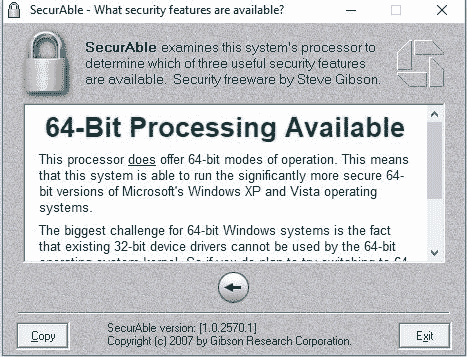

显示 64 位处理存在或不存在窗口截图

我的 Windows 64 位机器上的芯片组已确认提供 64 位操作模式。接下来，点击“是，硬件虚拟化”，SecurAble 将报告我的处理器确实提供了硬件虚拟化支持，如下截图所示：

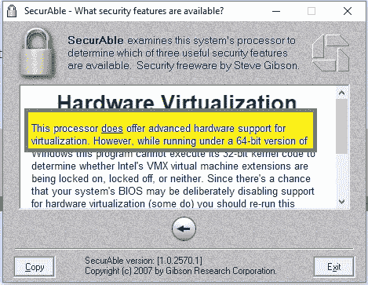

显示 SecurAble 上虚拟化硬件支持的窗口截图

如果 SecurAble 在您的机器上报告了完全相同的结果，那么您可能有一个可以支持 Oracle VirtualBox 的主机机器。请注意，在 BIOS 级别，虚拟化的支持可能已经设置。如果不是这种情况，请启用它。请注意，SecurAble 将无法报告 BIOS 对虚拟化功能的支持。

在继续之前，请确保满足先前的先决条件。接下来，考虑安装一个能够托管虚拟设备的受支持的虚拟化应用程序的先决条件。

# 安装受支持的虚拟化应用程序

以下安装虚拟化应用程序的步骤：

1.  从 Oracle VirtualBox 网站下载最新的 VirtualBox 二进制文件：

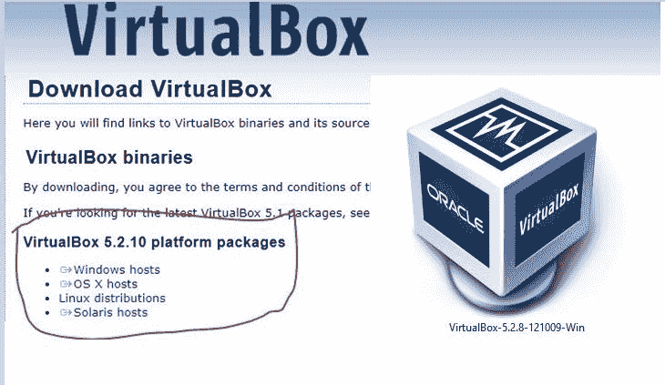

最新 VirtualBox 二进制文件截图

1.  双击 Oracle VirtualBox 二进制文件。设置欢迎屏幕如下所示：

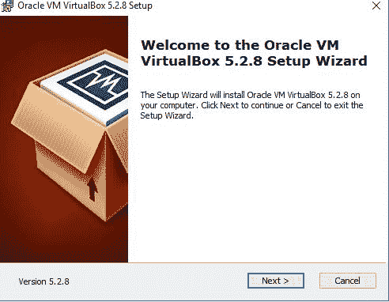

设置窗口的截图

1.  在欢迎屏幕上点击“下一步”。在随后出现的屏幕上，选择您希望 VirtualBox 安装的位置：

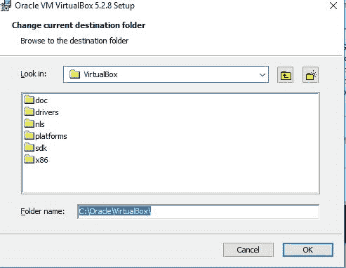

放置文件夹的设置步骤截图

1.  点击“确定”以进入“准备安装”屏幕：

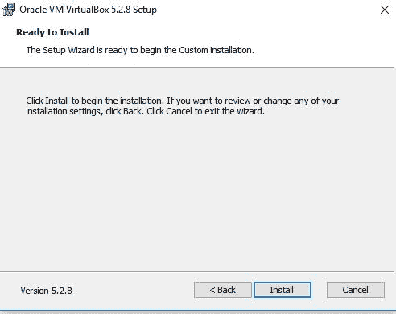

准备安装屏幕截图

1.  点击“安装”并完成任何说明性的步骤以完成安装。此过程完成后，在任务栏或桌面上放置一个快捷方式。现在，按照以下方式启动 VirtualBox 应用程序：

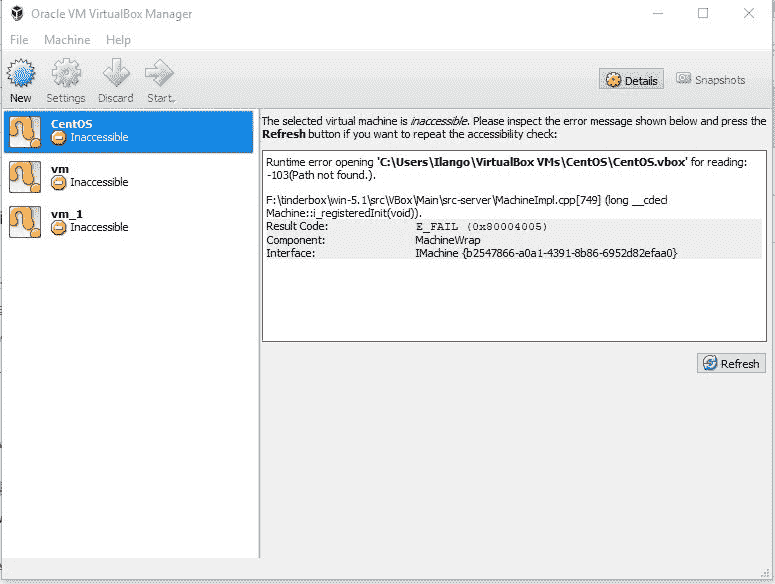

VirtualBox 应用程序准备启动的截图

您可以选择以下方式删除无法访问的机器 `vm`、`vm_1` 和 `CentOS`：

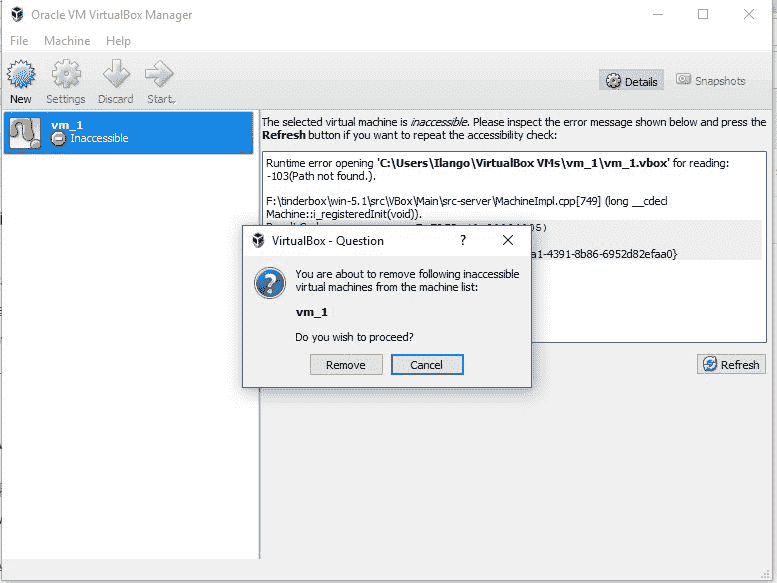

展示如何删除无法访问的机器的截图

1.  接下来，在文件 | 首选项... | 输入下取消选中“自动捕获键盘”选项：

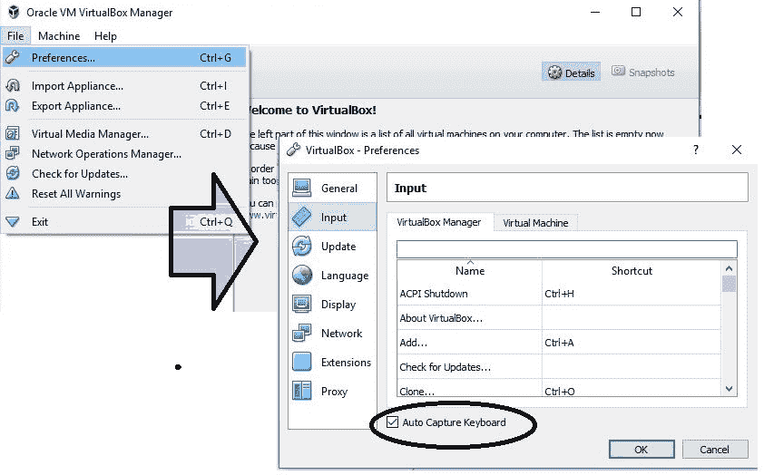

设置虚拟机的最终步骤截图

虚拟机现在已全部设置。在下一步中，我们将下载并将沙盒导入其中。

# 下载 HDP 沙盒并导入

以下下载 HDP 沙盒的步骤：

1.  转到 [`hortonworks.com/downloads/#sandbox`](https://hortonworks.com/downloads/#sandbox) 并下载 Hortonworks 沙盒虚拟设备文件。

1.  将沙盒虚拟设备文件移动到主机机器上的一个方便位置。按照以下顺序执行以下点击操作：文件 | 导入设备... 然后，选择要导入的虚拟设备文件，从而导入相应的磁盘映像：

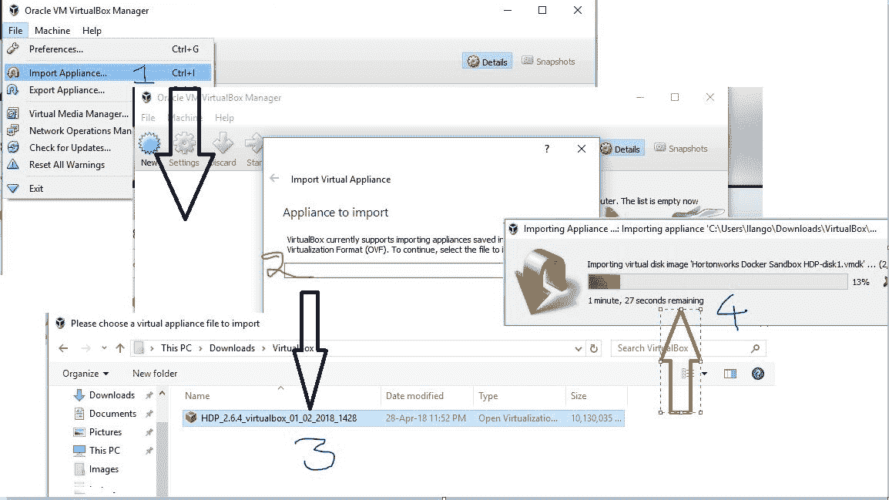

导入磁盘映像需要执行的步骤

1.  接下来，让我们在设备设置屏幕中调整设备设置。确保您将可用 RAM 增加到至少 `10000 MB`。保留其他默认设置，然后点击导入：

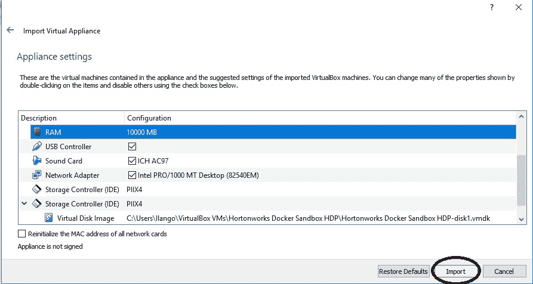

将虚拟设备导入 Oracle VirtualBox 的截图

虚拟设备现在已导入到 Oracle VirtualBox 中。以下部分提供了 Hortonworks Sandbox 虚拟设备的简要概述。

# Hortonworks Sandbox 虚拟设备概述

Hortonworks Sandbox 是一个虚拟机或虚拟设备，以 `.ova` 或 `.ovf` 扩展名的文件形式提供。它对主机操作系统表现为裸机，并具有以下组件：

+   被底层主机操作系统视为应用程序的客户端操作系统

+   我们想要的虚拟设备文件是一个 `.ova` 文件，它位于虚拟机文件夹下的 `ModernScalaProjects_Code` 文件夹中

+   在虚拟操作系统上运行的应用程序

如此一来，我们已完成了先决条件的设置。现在让我们第一次运行虚拟机。

# 打开虚拟机并启动 Sandbox

让我们看看以下步骤：

1.  运行 Oracle VirtualBox 启动图标。以下是这样显示关闭电源的 Sandbox 的启动屏幕：

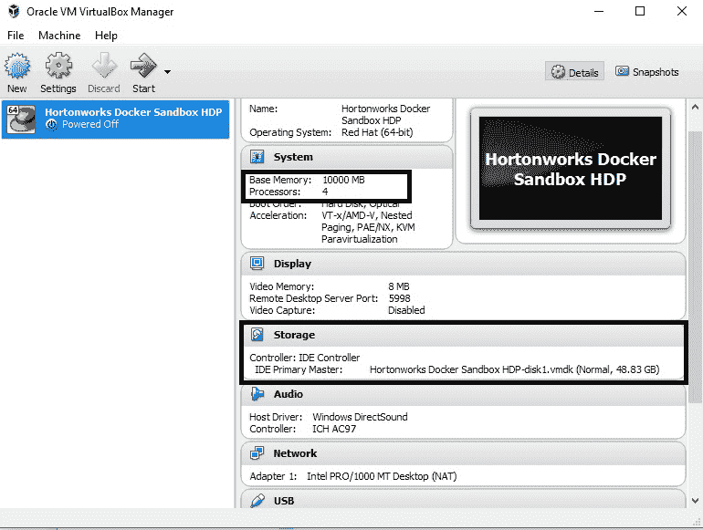

关闭电源的 Sandbox 启动屏幕截图

启动屏幕显示了更新后的 Hortonworks Sandbox 虚拟设备及其更新后的配置。例如，我们的基本内存现在是 10000 MB。

1.  接下来，在 Sandbox 上右键单击并选择“开始”|“正常启动”：

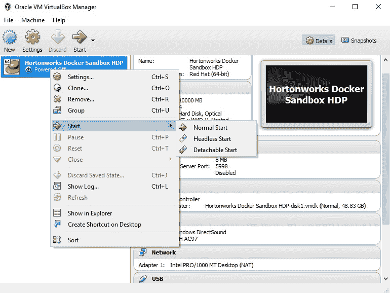

开始步骤的截图

如果一切顺利，您应该会看到以下 Hortonworks Docker Sandbox HDP [运行中]屏幕：

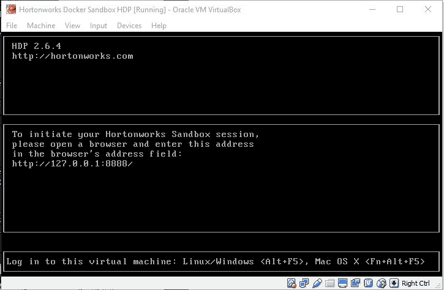

Hortonworks Docker Sandbox HDP [运行中]的截图

1.  我们想要登录到 Sandbox。*Alt* + *F5* 将您带到以下 `sandbox-host login` 登录屏幕：

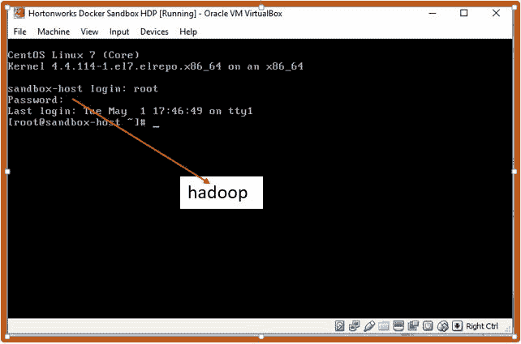

展示如何登录 Sandbox 的截图

使用 `root` 用户名和 `hadoop` 密码登录。

1.  编辑 `hosts` 文件，将 `127.0.0.1` 映射到 `sandbox-hdp.hortonworks.com`。在 Windows（主机）机器上，此文件位于 `C:\Windows\System32\drivers\etc`：

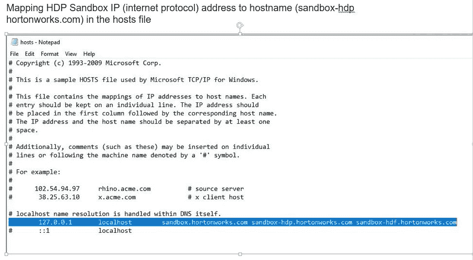

显示编辑主机文件的截图

1.  保存更新的 `hosts` 文件，并在浏览器中加载 URL `sandbox-hdp.hortonworks.com:8888` 之前验证这些更改是否生效。

1.  接下来，在您的浏览器中加载 URL `sandbox-hdp.hortonworks.com:4200` 以启动 Sandbox 网页客户端。将默认密码从 `hadoop` 改为其他密码。请注意，虚拟设备运行的是 CentOS Linux 虚拟操作系统：

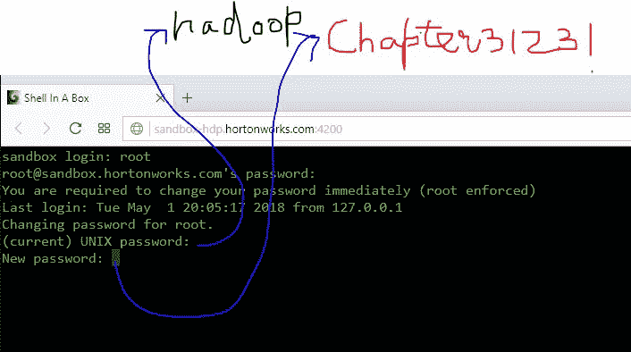

启动 Sandbox 网页客户端的截图

在下一节中，我们将设置一个 SSH 客户端，用于在沙盒和您的本地（主机）机器之间传输文件。

# 设置沙盒和主机机器之间数据传输的 SSH 访问

**SSH** 代表 **Secure Shell**。我们想要设置 SSH 网络协议，以在主机机器和运行虚拟应用的虚拟机之间建立远程登录和安全的文件传输。

需要遵循两个步骤：

+   设置 PuTTY，一个第三方 SSH 和 Telnet 客户端

+   设置 WinSCP，一个 Windows 的 **Secure File Transfer Protocol** (**SFTP**) 客户端

# 设置 PuTTY，一个第三方 SSH 和 Telnet 客户端

让我们看看以下 PuTTY 的安装步骤：

1.  PuTTY 安装程序 `putty-64bit-0.70-installer.exe` 可在 `ModernScalaProjects_Code` 文件夹中找到。您可以通过双击安装器图标来运行它，如下所示：

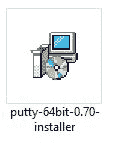

PuTTY 安装器图标

1.  选择要安装 PuTTY 的目标文件夹并点击下一步：

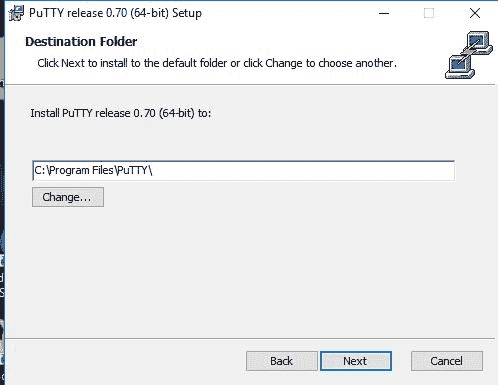

安装 PuTTY 的截图

1.  选择或取消选择您想要安装的任何产品功能：

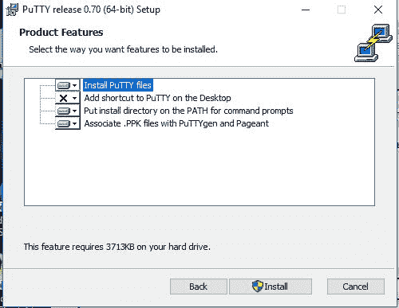

产品功能列表的截图

1.  然后，点击安装。PuTTY 和其他支持工具将被安装：

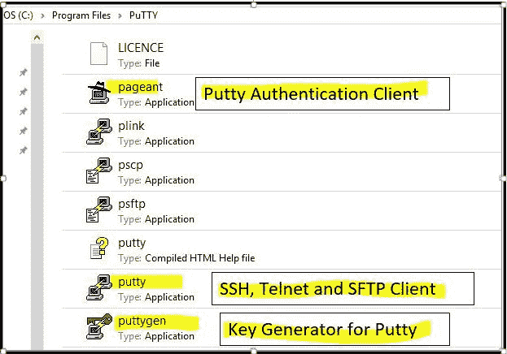

PuTTY 和支持工具安装的截图

1.  运行 PuTTYgen。在 PuTTY 密钥生成器屏幕上，按生成按钮并遵循屏幕上的说明。点击保存公钥按钮并将生成的公钥保存到名为 `authorized_keys` 的文件中，保存到方便的位置，但在输入密码短语之前：

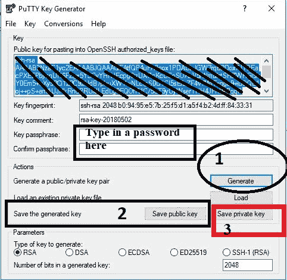

运行 PuTTY 密钥生成器后要执行的步骤截图

1.  点击保存私钥，如前一个截图中的 3 所示。这将允许您在方便的位置保存您的私钥。这可以与公钥位置相同，如下所示：

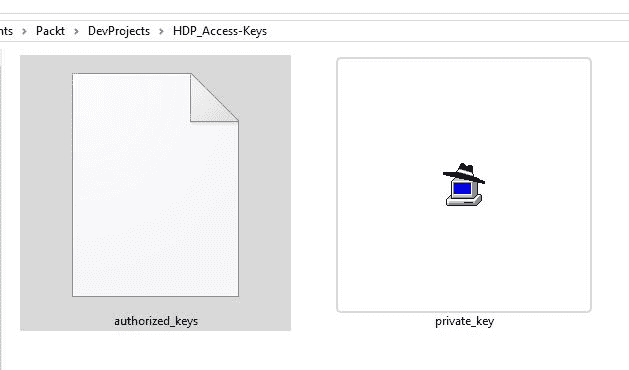

私钥在方便位置保存的截图

1.  在这一点上，我们希望将公钥上传到我们的沙盒。启动沙盒，然后加载沙盒网页客户端，就像我们之前做的那样。按照以下截图中的步骤执行 1、2、3 和 4。公钥保存为 `authorized_key`：

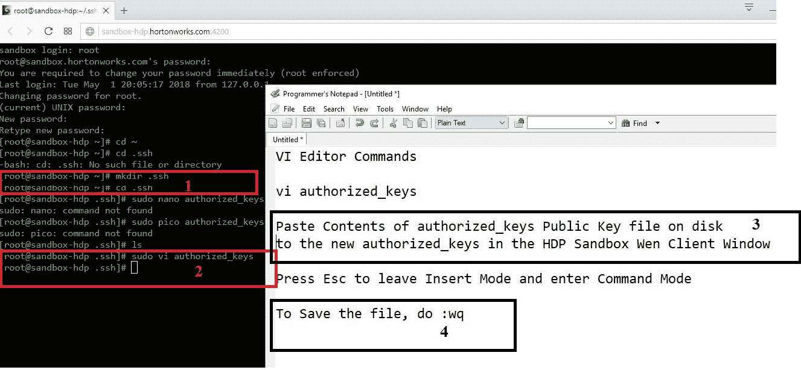

展示将公钥上传到我们的沙盒的截图

1.  使用文件 | 退出关闭 PuTTYgen。

1.  打开 PuTTY 并点击会话。我们想要创建并保存一个会话。按照以下截图中的数字设置它：

    1.  点击会话并选择记录

    1.  将主机名输入为我们的沙盒

    1.  输入端口为 `2222`

    1.  然后点击按钮保存

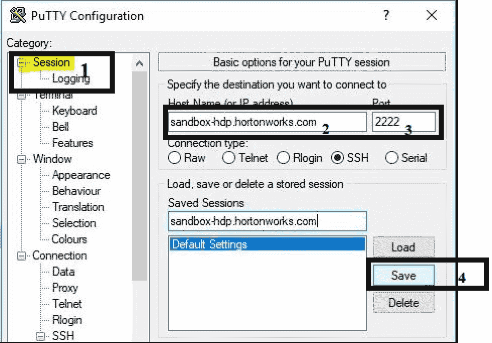

展示创建和保存会话步骤的截图

1.  通过点击保存将会话保存为`sandbox-hdp.hortonworks.com`（已保存的会话）。接下来，在连接下点击数据并输入沙盒的登录名。现在不要点击打开：

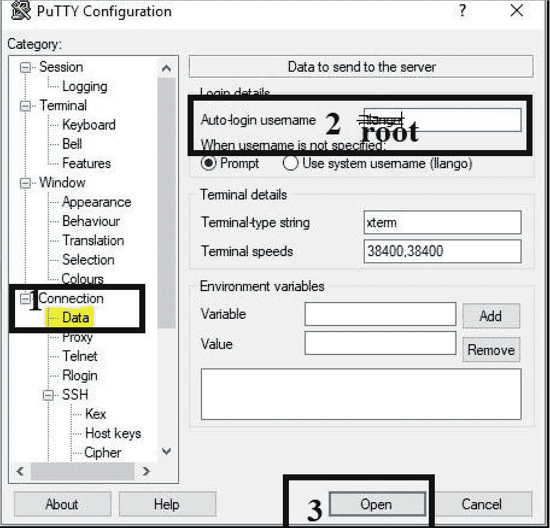

保存会话后的步骤截图

1.  在输入自动登录用户名后，点击连接 | SSH | 认证 | 在点击浏览...后加载私钥。加载私钥并点击打开。这应该会与沙盒建立 SSH 连接：

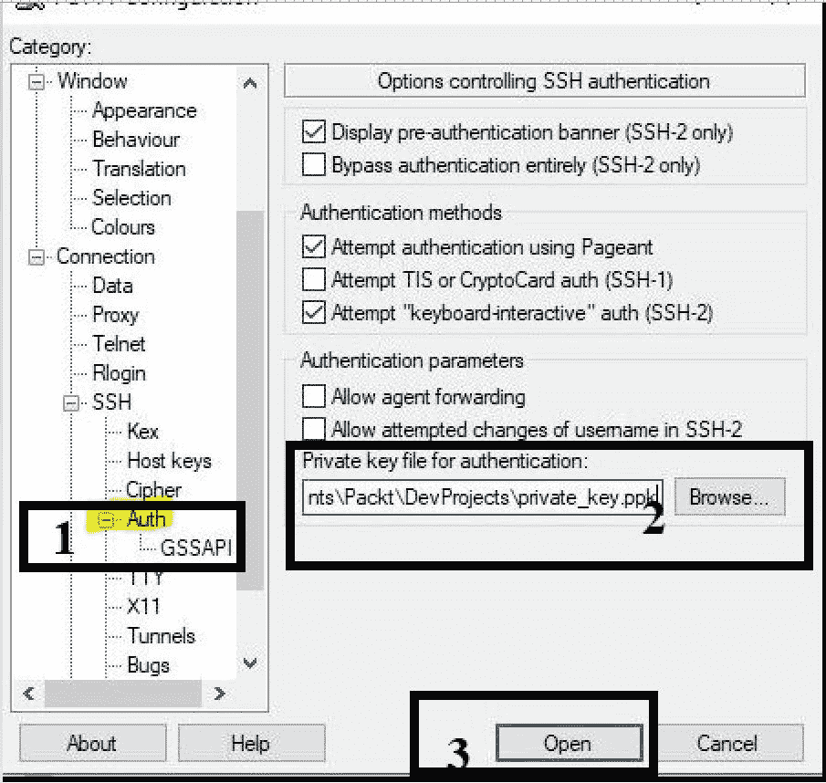

输入自动登录用户名后的步骤截图

让我们回顾并总结到目前为止我们为设置 PuTTY（一个第三方 SSH 和 Telnet 客户端）以及沙盒和主机机之间数据传输的 SSH 访问所采取的步骤：

1.  点击会话。在沙盒虚拟设备的主机名（或 IP 地址）字段下输入主机名，然后选择适当的 SSH 协议。继续，导航到连接 | 数据并在自动登录框中输入沙盒的登录名。

1.  然后，导航到连接 | SSH | 认证 | 加载私钥。

1.  最后，点击会话。加载保存的会话并点击保存；这会更新会话。

WinSCP 是一个流行的 Windows 图形 SSH 客户端，它使得在本地（主机）机器和沙盒之间传输文件变得容易。现在让我们设置 WinSCP。

# 设置 WinSCP，一个 Windows 的 SFTP 客户端

以下步骤解释了如何设置 WinSCP：

1.  WinSCP 的二进制文件位于`ModernScalaProjects_Code`文件夹下。下载它并运行。安装完成后，首次启动 WinSCP。登录屏幕如下所示：

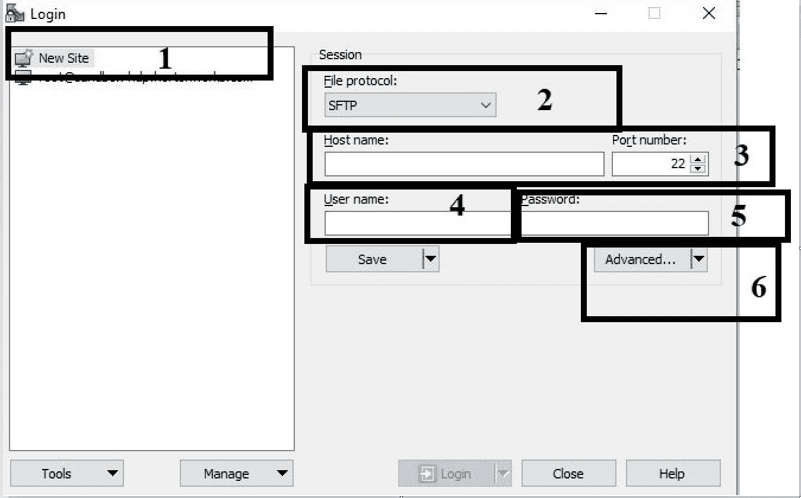

登录屏幕截图

点击新建站点，确保文件协议是 SFTP，并在主机名下输入沙盒主机名。将端口从`22`改为`2222`。您可能想在用户名下输入`root`和沙盒 Web 客户端的密码。接下来，点击 6，这会带我们到高级站点设置屏幕：

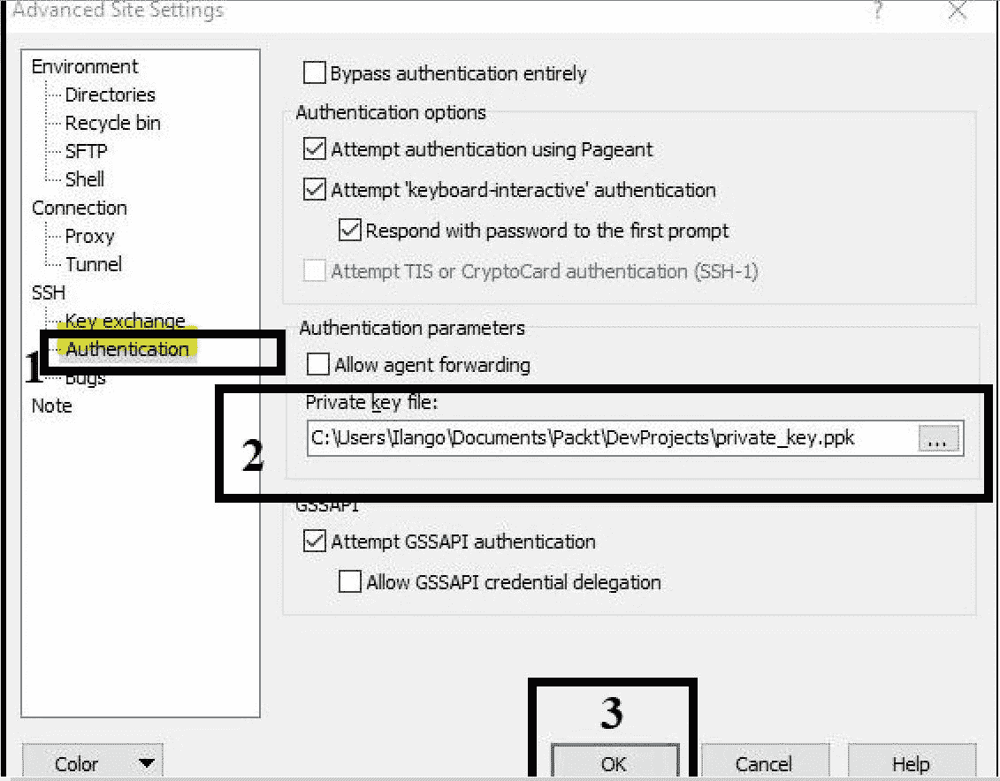

高级站点设置屏幕截图

1.  在先前的高级站点设置屏幕中，钻到 SSH 下的认证并加载私钥文件。点击确定。

1.  现在，再次启动 WinSCP。点击登录应该会与沙盒建立连接，您应该能够如下进行文件传输：

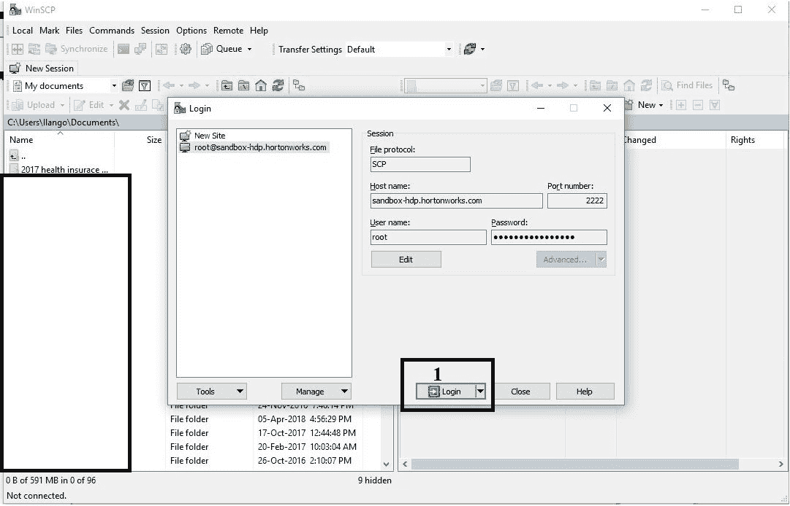

显示沙盒能够双向传输文件的截图

1.  连接建立后，结果屏幕应该如下所示：

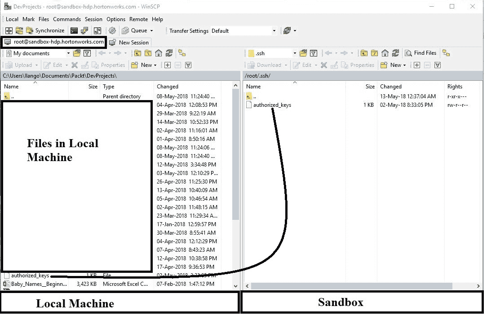

连接建立后的屏幕截图

在下一步中，我们将继续进行沙盒配置更新。

# 更新 Zeppelin 所需的默认 Python

沙盒拥有一个完整的 Spark 开发环境，与之前我们本地的 Spark 开发环境有一个显著的不同：Zeppelin Notebook。

# 什么是 Zeppelin？

Zeppelin 是一个基于 Web 的笔记本，具有以下功能：

+   数据探索

+   交互式数据分析

+   数据可视化和交互式仪表板

+   协作文档共享

Zeppelin 依赖于 Python 2.7 或更高版本，但沙盒本身仅支持版本 2.6。因此，我们将不得不用 2.7 替换 2.6。在我们继续之前，让我们检查我们的 Python 版本：

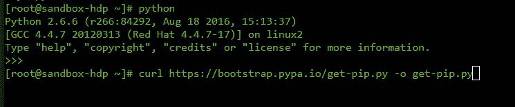

展示 Python 版本的截图

没错！我们需要用 Python 2.7 替换 Python 2.6，并将 Notebook 更新到最新版本。

完成此任务的步骤总结如下：

+   设置 Anaconda 数据科学环境。您可以简单地设置一个较轻的 Anaconda 版本，即带有 Python 2.7 的 Miniconda。Miniconda 带来了许多流行的数据科学包。

+   设置 Miniconda 没有打包的任何包。确保您有 SciPy、NumPy、Matplotlib 和 Pandas。有时，我们只需将 Spark/Scala 的 `DataFrame` 直接传递到 Pyspark 中的 Python，就可以快速生成可视化。

按照以下步骤进行操作：

1.  第一步是下载 Miniconda 的安装程序并按照以下方式运行：

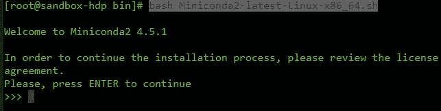

展示 Miniconda 安装程序的截图

通过安装过程。这很简单。安装完成后，重新启动 Web 客户端以允许更改生效。现在，使用 `root` 和您的秘密密码登录沙盒。

1.  要检查我们是否真的有一个新的、升级后的 Python，请按照以下方式发出 `python` 命令：

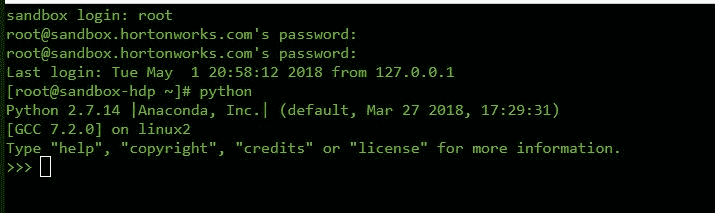

展示如何发出 Python 命令的截图

哇！我们有了新的 Python 版本：2.7.14。

在下一节中，我们将使用 curl 更新 Zeppelin 实例。

# 更新我们的 Zeppelin 实例

需要执行以下步骤来更新 Zeppelin 实例：

+   如果尚未安装，请安装 curl

+   使用 Hortonworks 的最新和最好的笔记本更新您的 Zeppelin 实例

请按照以下步骤安装 curl：

1.  运行 `curl --help` 命令：

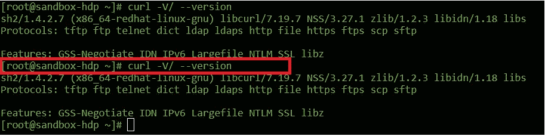

展示如何运行 curl --help 命令的截图

1.  `curl --help` 命令确认我们已经安装了 curl。现在让我们尝试更新 Zeppelin：

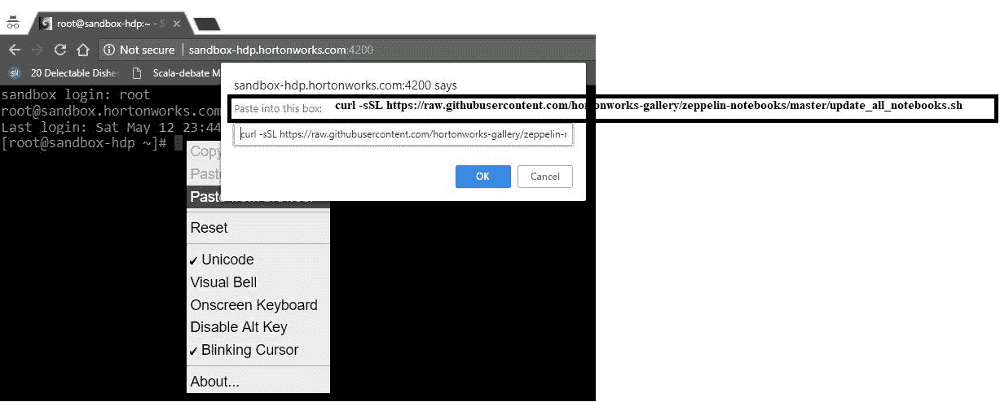

展示更新 Zeppelin 的截图

1.  运行 `curl` 命令以使用最新的笔记本更新 Zeppelin 实例。以下截图显示了更新后的 Zeppelin 实例：

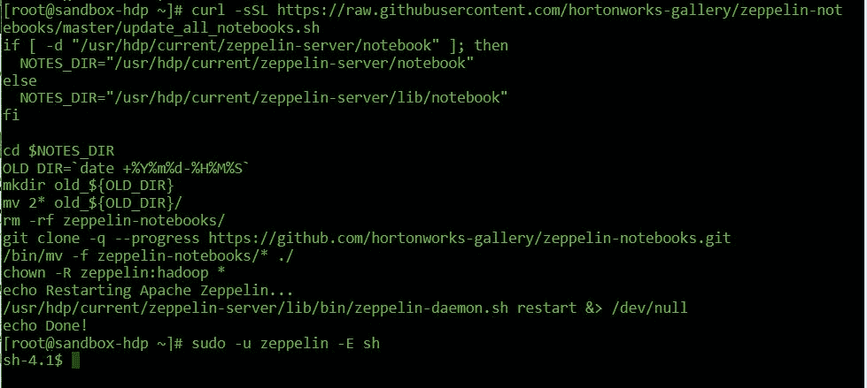

展示更新后的 Zeppelin 实例的截图

现在，让我们回到 `hdp.hortonworks.com:8888`。

# 启动 Ambari 仪表板和 Zeppelin UI

启动 Ambari 和 Zeppelin 所需的步骤如下：

1.  点击启动仪表板按钮，以 `maria_dev` 身份登录以导航到 Ambari 仪表板：

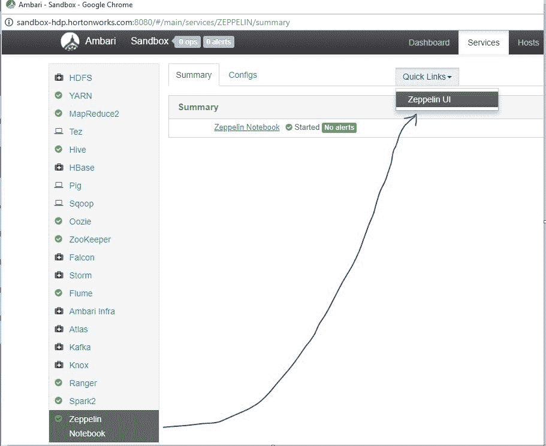

展示在 Ambari 仪表板中导航的截图

1.  点击快速链接下的 Zeppelin UI 将带我们到 Zeppelin UI，如下所示：

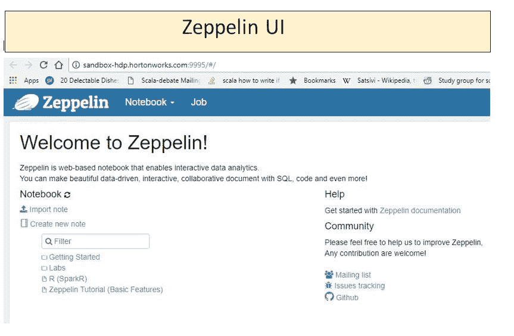

Zeppelin UI 页面的截图

Zeppelin UI 在端口 `9995` 上运行。为了使我们的 Zeppelin Notebook 与 Spark 2 和 Python 2.7 一起工作，需要更新 Spark 和 Python 解释器。

# 通过添加或更新解释器来更新 Zeppelin Notebook 配置

更新 Zeppelin Notebook 需要执行以下步骤：

1.  我们需要更新解释器，包括 Spark 2 解释器，并添加 Python 解释器。

1.  在 Zeppelin UI 页面上，点击匿名 | 解释器，如下所示：

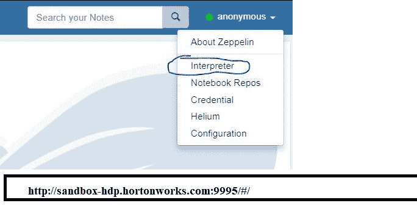

在 Zeppelin UI 页面上执行步骤的截图

点击解释器链接将带我们到解释器页面。首先，我们将更新 Spark 2 解释器。

# 更新 Spark 2 解释器

更新 Spark 2 解释器的步骤如下：

1.  我们将按以下方式更新 `SPARK_HOME` 属性：

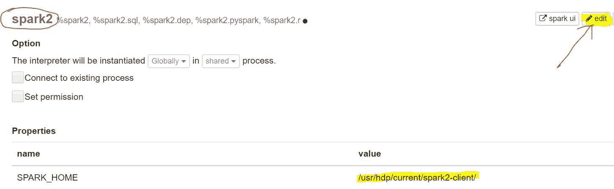

展示如何更新 SPARK_HOME 属性的截图

1.  接下来，我们将更新 `zeppelin.pyspark.python` 属性，使其指向新的 Python 解释器：

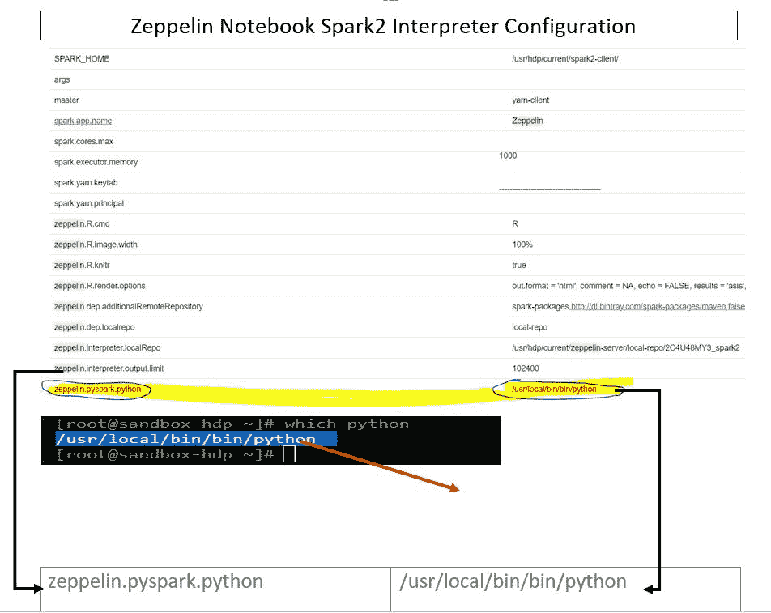

展示如何更新 `zeppelin.pyspark.python` 属性的截图

1.  接下来，让我们创建一个新的 Python 解释器，如下所示：

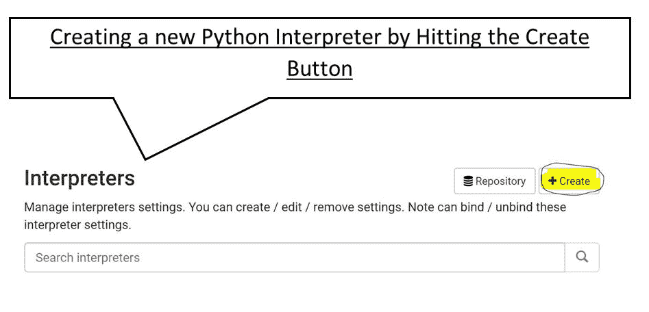

创建新 Python 解释器的截图

将 `zeppelin.pyspark.python` 更新为 `/usr/local/bin/bin/python`。

1.  为了使所有这些解释器更改生效，我们需要重新启动服务。前往 Ambari 仪表板页面。在右上角找到服务操作，在下拉菜单中选择重启所有：

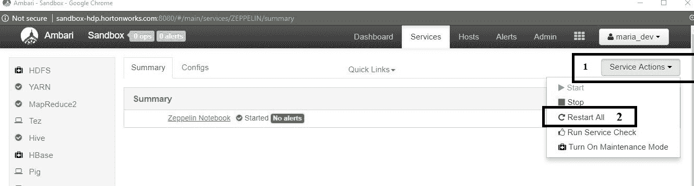

展示 Zeppelin Notebook 准备好进行开发的最终步骤的截图

到目前为止，Zeppelin Notebook 已经准备好进行开发。

# 实施目标

本节的目标是开始使用随机森林算法开发数据管道。

# 实施目标列表

以下实施目标相同，涵盖了随机森林管道和线性回归。我们将执行一次初步步骤，如**探索性数据分析**（**EDA**），然后开发特定于特定管道的实现代码。因此，实施目标如下列出：

+   获取股票价格数据集。

+   在 Sandbox Zeppelin Notebook 环境中执行初步的 EDA（探索性数据分析），并运行统计分析。

+   在 Zeppelin 中逐步开发管道，并将代码移植到 IntelliJ。这意味着执行以下操作：

    1.  在 IntelliJ 中创建一个新的 Scala 项目，或将现有的空项目导入 IntelliJ，并从笔记本中逐步开发出的代码创建 Scala 工件。

    1.  不要忘记在`build.sbt`文件中连接所有必要的依赖项。

    1.  解释管道的结果，例如分类器表现如何。预测值与原始数据集中的值有多接近？

在下一个子节中，我们将下载股票价格数据集。

# 第 1 步 – 创建数据集文件路径的 Scala 表示

股票价格数据集位于`ModernScalaProjects_Code`文件夹中。获取一份副本并将其上传到沙盒，然后将其放置在以下方便的位置：

```java
scala> val dataSetPath = "\\<<Path to the folder containing the Data File>>"
scala> val dataFile = dataSetPath + "\\News.csv"
```

在下一步中，让我们创建一个**弹性分布式数据集**（**RDD**）。

# 第 2 步 – 创建一个`RDD[String]`

调用 Spark 在沙盒中提供的`sparkContext`的`textFile`方法：

```java
scala> val result1 = spark.sparkContext.textFile(dataSetPath + "News.csv")
result1: org.apache.spark.rdd.RDD[String] = C:\<<Path to your own Data File>>\News.csv MapPartitionsRDD[1] at textFile at <console>:25
```

结果 RDD `result1` 是一个分区结构。在下一步中，我们将遍历这些分区。

# 第 3 步 – 在数据集的换行符周围拆分 RDD

在`result1` RDD 上调用`flatMap`操作，并按每个分区的`"\n"`（行尾）字符拆分，如下所示：

```java
scala> val result2 = result1.flatMap{ partition => partition.split("\n").toList }
result2: org.apache.spark.rdd.RDD[String] = MapPartitionsRDD[2] at flatMap at <console>:27
```

每个分区后面跟着一个字符串。在下一步中，我们将转换`result2` RDD。

# 第 4 步 – 转换 RDD[String]

在`result2` RDD 上调用`map`操作。此 RDD（数据行）中的每一行都由逗号分隔的股票价格标题数据组成，如下所示：

```java
scala> val result2A = result2.map(_.split(","))
result2A: org.apache.spark.rdd.RDD[Array[String]] = MapPartitionsRDD[3] at map at <console>:29
```

结果 RDD `result2A` 是一个`RDD[Array[String]]`。该 RDD 由字符串数组组成，其中每个字符串代表一行。

# 第 5 步 – 进行初步数据分析

此步骤被分解为一系列更小的步骤。过程从创建`DataFrame`开始。

# 从原始数据集创建 DataFrame

通过指定适当的`option`再次加载股票价格数据集文件，让 Spark 在创建`DataFrame`之前自动推断数据集的模式，如下所示：

```java
scala> val spDataFrame = spark.read.format("com.databricks.spark.csv").option("delimiter", ",").option("header", "true").option("inferSchema", "true").load("News.csv")
spDataFrame: org.apache.spark.sql.DataFrame = [Date: string, Label: int ... 5 more fields]
```

结果结构`spDataFrame`是`DataFrame`。

# 从 DataFrame 中删除日期和标签列

`Date`和`Label`是我们现在可能排除的列，如下所示：

```java
scala> val newsColsOnly = spDataFrame.drop("Date", "Label")
newsColsOnly: org.apache.spark.sql.DataFrame = [Top1: string, Top2: string ... 23 more fields]
```

结果结构是一个新的`DataFrame`，它包含所有 25 个顶级标题。

# 让 Spark 描述 DataFrame

按照以下顺序调用`describe`和`show`方法，以获得前 20 行的视觉表示：

```java
scala> val expAnalysisTestFrame = spDataFrame.describe("TopHeadline1", "TopHeadline2", "TopHeadline3","TopHeadline4","TopHeadline5", TopHead.....)
expAnalysisTestFrame: org.apache.spark.sql.DataFrame = [summary: string, TopHeadline: string ... 25 more fields]

scala> newsColsOnly.show
```

在下一步中，让我们向`DataFrame`添加一个新列，一个名为`AllMergedNews`的`expAnalysisTestFrame`。

# 向 DataFrame 添加新列并从中推导出 Vector

让我们执行以下步骤以添加新列并推导出`Vector`：

1.  通过创建一个新的`AllMergedNews`列来替换`Top1`列，创建一个新的`DataFrame`，如下调用`withColumn`方法：

```java
scala> val mergedNewsColumnsFrame = newsColsOnly.withColumn("AllMergedNews", newsColsOnly("TopHeadline1"))
mergedNewsColumnsFrame: org.apache.spark.sql.DataFrame = [TopHeadline1: string, TopHeadline2: string ... 23 more fields]
```

1.  接下来，将 `mergedNewsColumns` DataFrame 转换为 `Vector`，如下所示：

```java
scala> import org.apache.spark.sql.functions
import org.apache.spark.sql.functions

scala> val mergedFrameList = for (i <- 2L to newsColsOnly.count() + 1L) yield mergedNewsColumnsFrame.withColumn("AllMergedNews", functions.concat(mergedNewsColumnsFrame("AllMergedNews"), functions.lit(" "), mergedNewsColumnsFrame("Top" + i.toString)))
mergedFrameList: scala.collection.immutable.IndexedSeq[org.apache.spark.sql.DataFrame] = Vector([Top1: string, Top2: string ... 4 more fields], [Top1: string, Top2: string ... 4 more fields])
```

1.  在下一步中，我们简单地从 `mergedFrameList` 中派生出 `mergedFinalFrame` DataFrame：

```java
scala> val mergedFinalFrame = mergedFrameList(0)
mergedFinalFrame: org.apache.spark.sql.DataFrame = [Top1: string, Top2: string ... 4 more fields]
```

到目前为止，我们有一个需要一些预处理的 DataFrame。让我们首先去除停用词。

# 移除停用词——这是一个预处理步骤

我们想要消除的停用词包括诸如 *a*、*an*、*the* 和 *in* 等词。**自然语言工具包**（**NLTK**）如下提供帮助：

```java
import org.apache.spark.ml.feature.StopWordsRemover
import org.apache.spark.ml.param.StringArrayParam

```

```java
val stopwordEliminator = StopWordsRemover(new StringArrayParam("words","..), new StringArrayParam("stopEliminated", "..)
```

下一步将是使用 `transform` 操作。

# 转换合并的 DataFrame

将 `mergedFinalFrame` DataFrame 传递给 `transform` 方法。此 NLTK 步骤移除了分析中不必要的所有停用词：

```java
val cleanedDataFrame = stopwordEliminator.transform(mergedFinalFrame)
 cleanedDataFrame.show()
+-----------+-----+--------------------+--------------------+
| Date|label| words| stopEliminated|
+-----------+-----+--------------------+--------------------+
| 09 09 09| 0|[Latvia, downs, ...|[Latvia, downs, ...|[Latvia downs, d...|
|11 11 09 09| 1|[Why, wont, Aust...|[wont, Australia, N...|[wont Australia, Au...|
+-----------+-----+--------------------+--------------------+
```

在下一步中，我们将使用一个名为 `NGram` 的特征转换器。

# 将 DataFrame 转换为 NGrams 数组

什么是 n-gram？它简单地说是一系列项目，如字母、单词等（如我们的数据集）。我们的数据集类似于一个文本语料库。它是一个理想的候选者，可以处理成 n-gram 数组，这是一个由我们数据集最新版本中的单词组成的数组，不包含停用词：

```java
//Import the feature Transformer NGram
import org.apache.spark.ml.feature.NGram

//Create an N-gram instance; create an N-Gram of size 2
val aNGram = new NGram(new StringArrayParam("stopRemoved"..), new StringArrayParam("ngrams", n=2)

// transform the cleanedDataFrame (the one devoid of stop words)
val cleanedDataFrame2 = aNGram.transform(cleanedDataFrame)

//display the first 20 rows
 cleanedDataFrame2.show()
 +-----------+-----+--------------------+--------------------+--------------------+
 | Date|label| words| stopEliminated| Ngrams|
 +-----------+-----+--------------------+--------------------+--------------------+
 | 09 09 09| 0|[Latvia, downs, ...|[Latvia, downs, ...|[Latvia downs, d...|
 |11 11 09 09| 1|[Why, wont, Aust...|[wont, Australia, N...|[wont Australia, Au...|
 +-----------+-----+--------------------+--------------------+--------------------+
```

在下一步中，我们将通过添加一个名为 `ndashgrams` 的列来创建一个新的数据集。

# 向 DataFrame 添加一个不含停用词的新列

通过向 `cleanedDataFrame2` DataFrame 添加一个名为 `ndashgrams` 的新列来派生一个新的 DataFrame，如下所示：

```java
cleanedDataFrame3 = cleanedDataFrame2.withColumn('ndashgrams', ....)

cleanedDataFrame3.show()
+-----------+-----+--------------------+--------------------+--------------------+
 | Date|label| words| stopEliminated| Ngrams|
 +-----------+-----+--------------------+--------------------+--------------------+
 | 09 09 09| 0|[Latvia, downs, ...|[Latvia, downs, ...|[Latvia downs, d...|
 |11 11 09 09| 1|[Why, wont, Aust...|[wont, Australia, N...|[wont Australia, Au...|
 +-----------+-----+--------------------+--------------------+--------------------+
```

下一个步骤更有趣。我们将应用所谓的计数向量器。

# 从我们的数据集语料库构建词汇表

为什么使用 `CountVectorizer`？我们需要一个来构建有关我们股价语料库的某些术语的词汇表：

```java
import org.apache.spark.ml.feature.CountVectorizer 

//We need a so-called count vectorizer to give us a CountVectorizerModel that will convert our 'corpus' //into a sparse vector of n-gram counts

 val countVectorizer = new CountVectorizer
//Set Hyper-parameters that the CountVectorizer algorithm can take
countVectorizer.inputCol(new StringArrayParam("NGrams")
countVectorizer.outputCol(new StringArrayParam("SparseVectorCounts")
//set a filter to ignore rare words
countVectorizer.minTF(new DoubleParam(1.0))
```

`CountVectorizer` 生成一个 `CountVectorizerModel`，可以将我们的语料库转换为 n-gram 令牌计数的稀疏向量。

# 训练 CountVectorizer

我们希望通过传递最新版本的数据集来训练我们的 `CountVectorizer`，如下代码片段所示：

```java
cleanedDataFrame3 = countVectorizer.fit(cleanedDataFrame2)

cleanedDataFrame3.show()
| Date|label| words| stopEliminated| NGrams| SparseVectorCounts|
| 09 09 09| 0|[Latvia, downs, ...|[Latvia, downs, ...|[Latvia downs, d...|
|11 11 09 09| 1|[Why, wont, Aust...|[wont, Australia, N...|[wont Australia, Au...|
 +-----------+-----+--------------------+--------------------+--------------------+--------------------
```

# 使用 StringIndexer 将我们的输入标签列进行转换

现在，让我们使用 `StringIndexer` 按如下方式在数据集中索引 `label` 输入：

```java
import org.apache.spark.ml.feature.StringIndexer

val indexedLabel = new StringIndexer(new StringArrayParam("label"), new StringArrayParam("label2"), ...)

cleanedDataFrame4 = indexedLabel.fit(cleanedDataFrame3).transform(cleanedDataFrame3)
```

接下来，让我们删除输入标签列 `label`。

# 删除输入标签列

按如下方式在 `cleanedDataFrame4` DataFrame 上调用 `drop` 方法：

```java
val cleanedDataFrame5 = cleanedDataFrame4.drop('label')
DataFrame[Date: string, words: array<string>, stopRemoved: array<string>, ngrams: array<string>, countVect: vector, label2: double]

cleanedDataFrame5.show()

| Date|label| words| stopEliminated| NGrams| SparseVectorCount|label2|
| 09 09 09| 0|[Latvia, downs, ...|[Latvia, downs, ...|[Latvia downs, d...|
```

```java
|11 11 09 09| 1|[Why, wont, Aust...|[wont, Australia, N...|[wont Australia, Au...|
 +-----------+-----+--------------------+--------------------+--------------------+--------------------+------+
```

接下来，让我们在删除的 `label` 列的位置添加一个名为 `label2` 的新列。

# 向我们的 DataFrame 添加一个新列

这次，调用 `withColumn` 方法添加 `label2` 列作为 `label1` 的替代：

```java
val  cleanedDataFrame6 = cleanedDataFrame5.withColumn('label', cleanedDataFrame.label2)
cleanedDataFrame6.show()

| Date|label| words| stopRemoved| ngrams| countVect|label2|
| 09 09 09| 0|[Latvia, downs, ...|[Latvia, downs, ...|[Latvia downs, d...|
|11 11 09 09| 1|[Why, wont, Aust...|[wont, Australia, N...|[wont Australia, Au...|
 +-----------+-----+--------------------+--------------------+--------------------+--------------------+------+
```

现在，是我们将数据集划分为训练集和测试集的时候了。

# 将数据集划分为训练集和测试集

让我们将数据集分成两个数据集。85% 的数据集将是训练数据集，剩余的 15% 将是测试数据集，如下所示：

```java
//Split the dataset in two. 85% of the dataset becomes the Training (data)set and 15% becomes the testing (data) set
val finalDataSet1: Array[org.apache.spark.sql.Dataset[org.apache.spark.sql.Row]] = cleanedDataFrame6.randomSplit(Array(0.85, 0.15), 98765L)
println("Size of the new split dataset " + finalDataSet.size)

//the testDataSet
val testDataSet = finalDataSet1(1)

//the Training Dataset
val trainDataSet = finalDataSet1(0)
```

让我们创建一个 `StringIndexer` 来索引 `label2` 列。

# 创建 labelIndexer 以索引 indexedLabel 列

现在让我们创建`labelIndexer`。这将创建一个新的索引输入，并输出`label`和`indexedLabel`列，如下所示：

```java
val labelIndexer = new IndexToString().setInputCol("label").setOutputCol("indexedLabel").fit(input)
```

接下来，让我们将我们的索引标签`transform`回未索引的原始标签。

# 创建 StringIndexer 以索引列标签

以下步骤将帮助我们创建一个`StringIndexer`来索引`label`列：

```java
val stringIndexer = new StringIndexer().setInputCol("prediction").setOutputCol("predictionLabel")
```

在下一步中，我们将创建`RandomForestClassifier`。

# 创建 RandomForestClassifier

现在让我们创建`randomForestClassifier`并传递适当的超参数，如下所示：

```java
val randomForestClassifier = new RandomForestClassifier().setFeaturesCol(spFeaturesIndexedLabel._1)
.setFeatureSubsetStrategy("sqrt")
```

我们现在有一个分类器。现在，我们将创建一个新的管道并创建阶段，每个阶段都包含我们刚刚创建的索引器。

# 创建具有三个阶段的新数据管道

让我们先创建适当的导入，如下所示：

```java
import org.apache.spark.ml.classification.RandomForestClassifier
import org.apache.spark.ml.evaluation.MulticlassClassificationEvaluator
import org.apache.spark.ml.param._
import org.apache.spark.ml.tuning.{ParamGridBuilder, TrainValidationSplit}
import org.apache.spark.ml.{Pipeline, PipelineStage}

```

现在让我们开始构建一个管道。这是一个有三个阶段的管道，分别是`StringIndexer`、`LabelIndexer`和`randomForestClassifier`。

# 创建具有超参数的新数据管道

创建新数据管道需要执行以下步骤：

1.  创建具有以下三个阶段的新的管道：

```java
val soPipeline = new Pipeline().
setStages(ArrayPipelineStage ++ ArrayPipelineStage) ++ ArrayPipelineStage]
```

1.  创建一个名为`NumTrees`的超参数，如下所示：

```java
//Lets set the hyper parameter NumTrees
val rfNum_Trees = randomForestClassifier.setNumTrees(15)
println("Hyper Parameter num_trees is: " + rfNum_Trees.numTrees)
```

1.  创建一个名为`MaxDepth`的超参数树并将其设置为`2`，如下所示：

```java
//set this default parameter in the classifier's embedded param map
val rfMax_Depth = rfNum_Trees.setMaxDepth(2)
println("Hyper Parameter max_depth is: " + rfMax_Depth.maxDepth)
```

是时候训练管道了。

# 训练我们的新数据管道

我们有一个准备好在训练数据集上训练的管道。拟合（训练）也会运行索引器，如下所示：

```java
val stockPriceModel = pipeline.fit(trainingData)
```

接下来，在我们的`stockPriceModel`上运行`transformation`操作以生成股票价格预测。

# 生成股票价格预测

生成股票价格预测需要执行以下步骤：

1.  在我们的测试数据集上运行`stockPriceModel`转换操作，如下所示：

```java
// Generate predictions.
val predictions = stockPriceModel.transform(testData)
```

1.  现在让我们显示我们的`predictions` `DataFrame`的相关列，如下所示：

```java
predictions.select("predictedLabel", "label", "features").show(5)
```

1.  最后，我们希望评估我们模型的准确性，即其生成预测的能力，换句话说，找出生成的输出与预测标签之间的接近程度，如下所示：

```java
modelOutputAccuracyEvaluator: Double = new MulticlassClassificationEvaluator()
.setLabelCol("indexedLabel")
.setPredictionCol("prediction")
.setMetricName("precision")

val accuracy = modelOutputAccuracyEvaluator.evaluate(predictions)

```

在我们结束本章之前，还有一些其他指标可以评估。我们将这个作为读者的练习。

使用 Spark ML API 中的`MulticlassMetrics`类，我们可以生成指标，这些指标可以告诉我们预测列中的预测标签值与`label`列中的实际标签值有多接近。

邀请读者提出另外两个指标：

+   准确性

+   加权精度

有许多其他方法可以构建 ML 模型来预测股票价格并帮助投资者制定长期投资策略。例如，线性回归是另一种常用的但相当流行的预测股票价格的方法。

# 摘要

在本章中，我们学习了如何利用随机森林算法根据历史趋势预测股票价格。

在下一章中，我们将创建一个垃圾邮件分类器。我们将从两个数据集开始，一个代表正常邮件，另一个代表垃圾邮件数据集。

# 问题

这里有一些问题列表：

1.  你对线性回归有何理解？为什么它很重要？

1.  线性回归与逻辑回归有何不同？

1.  列出一个二元分类器的强大特征。

1.  与股票价格数据集相关的特征变量有哪些？
