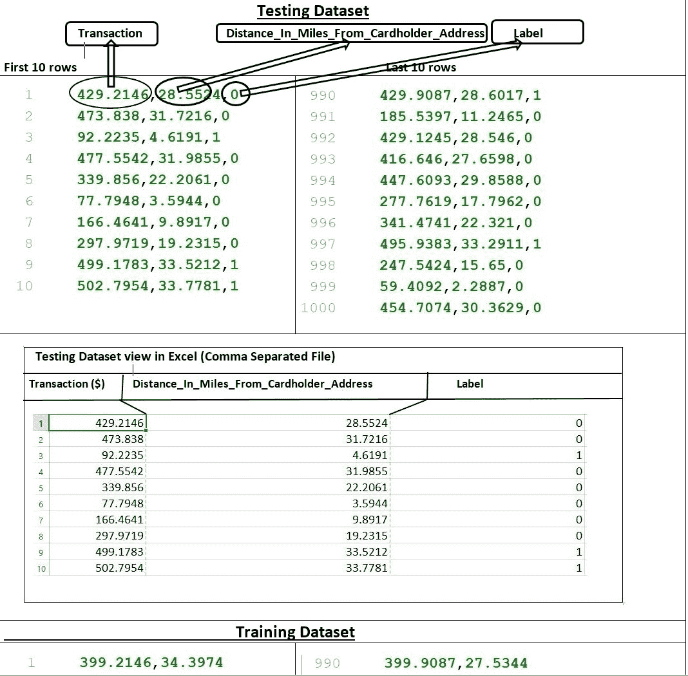
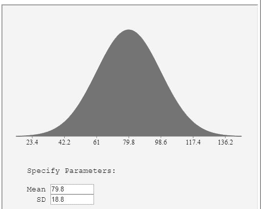
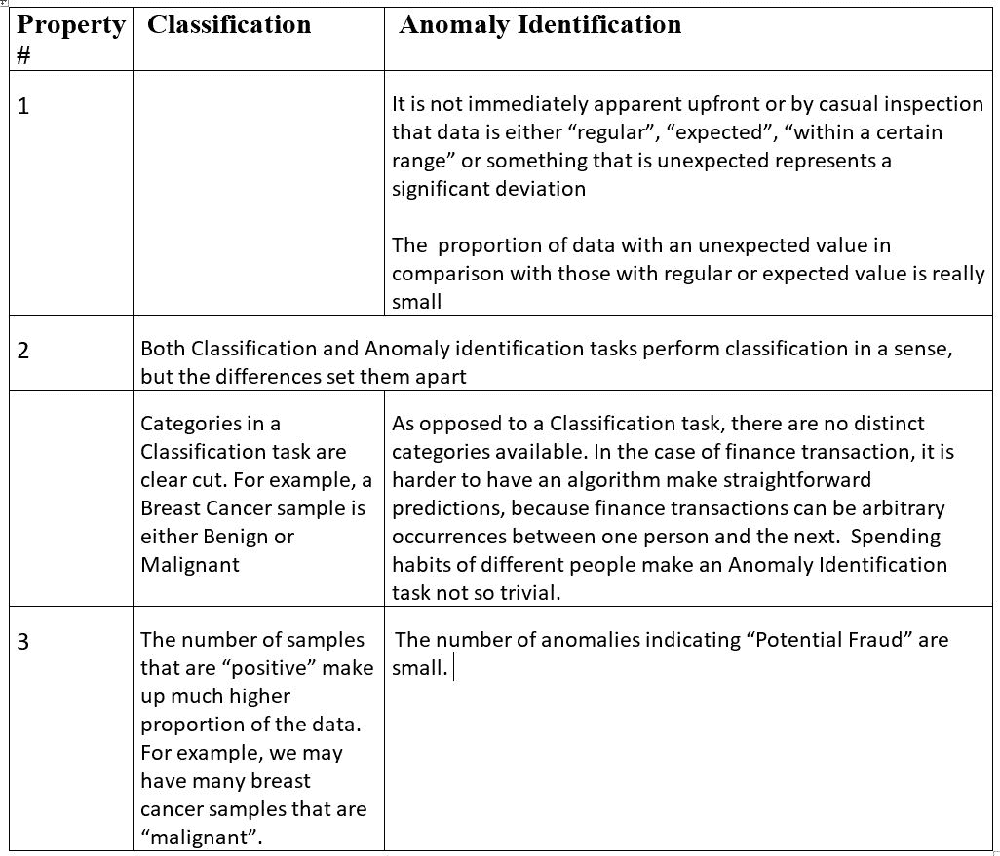
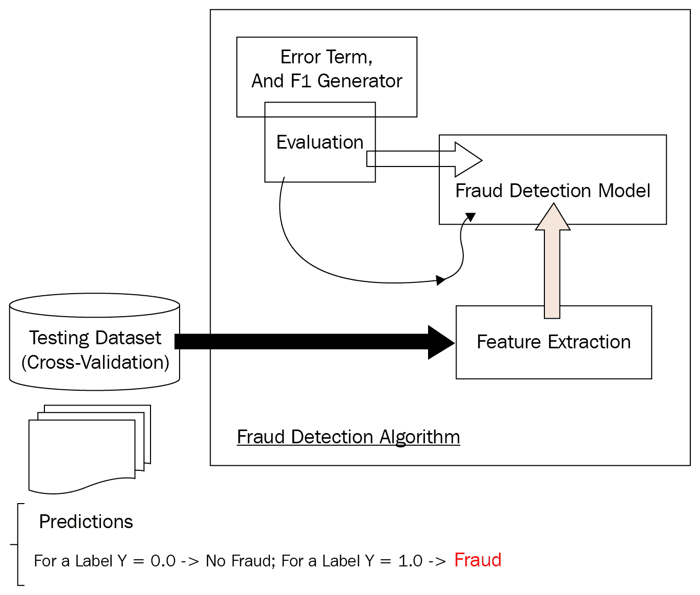
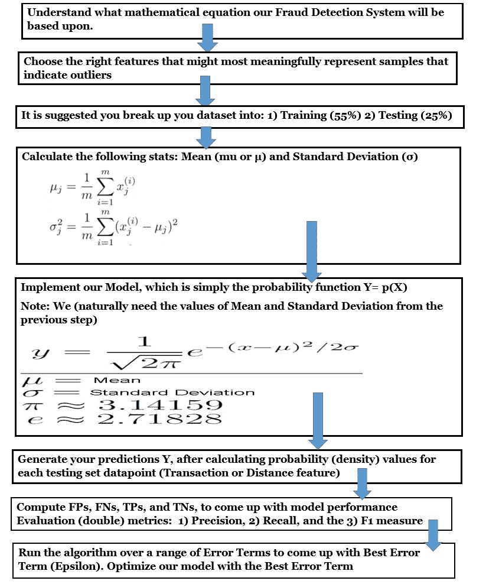
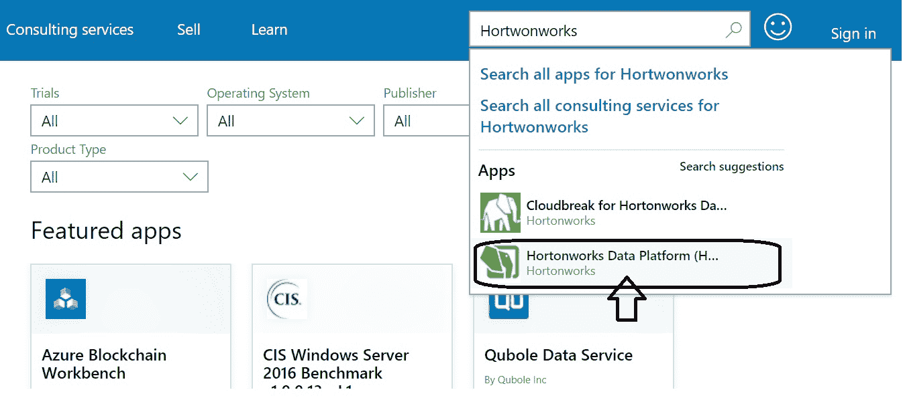
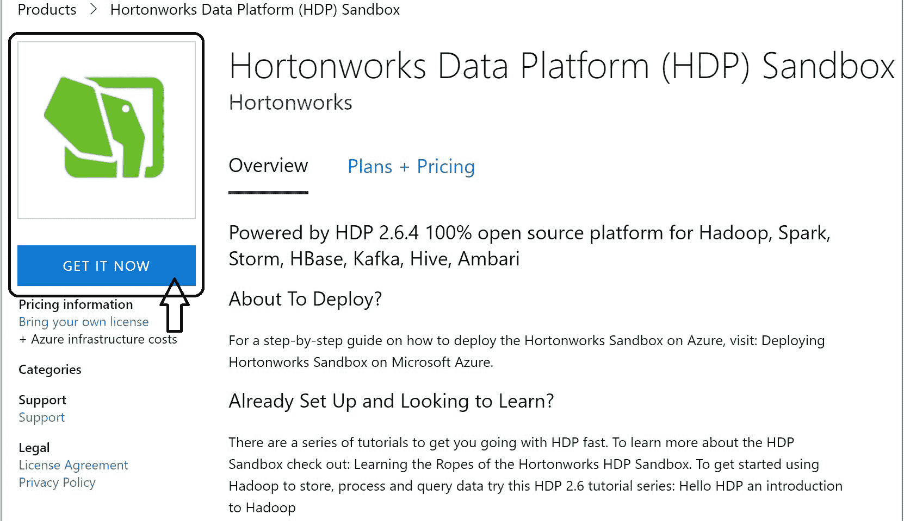

# 构建欺诈检测系统

在本章中，我们将使用 Spark ML 开发一个基于高斯分布函数的算法。我们将将该算法应用于检测交易数据中的欺诈行为。这种算法可以应用于构建金融机构（如银行）的稳健欺诈检测解决方案，这些金融机构处理大量的在线交易。

在高斯分布的核心，函数是**异常**的概念。欺诈检测问题不仅仅是一个分类任务，而是一个非常狭窄意义上的分类任务。它是一个平衡的监督学习问题。术语“平衡”指的是数据集中的正样本相对于负样本数量较少。另一方面，异常检测问题通常是不平衡的。数据集中相对于负样本，异常（正样本）的数量显著较少。欺诈检测问题是一个典型的异常检测问题。这是一个数据集中有少量异常值或数据点，其值与正常、预期的值相差很大的问题。

本章的主要学习目标是实现一个 Scala 解决方案，该解决方案将预测金融交易中的欺诈行为。我们将依赖 Spark ML 库的 API 及其支持库来构建欺诈检测预测应用。

在本章中，我们将涵盖以下主题：

+   欺诈检测问题

+   项目概述—问题定义

+   开始

+   实施步骤

# 欺诈检测问题

欺诈检测问题不是一个监督学习问题。在我们的欺诈检测场景中，我们有一个不平衡的类别情况。关于目标变量的 F1 分数的重要性，我们有什么要说的吗？首先，目标变量是一个二进制标签。F1 分数与我们的欺诈检测问题相关，因为我们有一个不平衡的类别，其中一个类别实际上比另一个更重要。我们这是什么意思？欺诈检测分类过程的底线是确定某个实例是否欺诈，让分类器正确地将该实例分类或标记为欺诈。重点不是将实例标记为非欺诈。

再次强调，我们的欺诈检测问题中有两个类别：

+   欺诈

+   非欺诈

话虽如此，我们现在将查看这个实现所依赖的数据集

# 欺诈检测数据集概览

从`ModernScalaProjects_Code`下载文件夹中下载数据集。

下面是这个数据集的样子：



我们欺诈检测系统建立的数据集

高斯分布函数是我们算法的基础。

那么，F1 分数重要吗？是的。F1 分数不容忽视（在类平衡的情况下，F1 分数不一定重要）。它是衡量机器学习二分类过程准确性的指标。

每个类别都有一个 F1 分数（一个用于欺诈，另一个用于非欺诈）。因此，如果我们想计算 F1 分数，我们需要确保 F1 分数与欺诈类别相关联。

在机器学习的背景下，欺诈检测是一种分类技术方法，它允许我们构建试图检测异常值的模型。标记异常值引导我们采取应对欺诈所需的措施。例如，如果我在我居住地超过 1,000 英里远的缅因州波特兰用我的卡刷了一次，那可能意味着与我信用卡关联的潜在欺诈检测算法会标记**欺诈**。在这种情况下，距离导致算法声称在缅因州水边的某个海鲜场所进行的交易是假的。这是一个简单的用例。还有其他金融交易，该算法被训练来监控并标记欺诈。

例如，想象一下凯特丢失了她的卡，某个随机人在街上捡到了那张卡（让我们假设凯特直到一天后才意识到她丢失了卡）并试图用大约 50 美元的汽油填满他的卡车油箱。尽管这笔交易已经完成，假设试图使用她卡的人设法通过了邮政编码检查，凯特的信用卡欺诈检测机器学习算法将标记为可疑交易。很可能会触发算法并导致交易失败，或者即使没有发生这种情况，她也会接到信用卡公司的电话，询问她最近在哪里使用了卡。在这种情况下，她接到信用卡公司的电话是因为欺诈检测算法标记了该笔交易为可疑，这是一起需要信用卡公司采取行动的欺诈事件。

欺诈检测系统处理大量数据。本章中描述的欺诈检测分类器将筛选交易数据集并对其进行处理。Spark 的流处理能力使我们能够检测异常值，即我们数据集中那些值不在正常、预期的值范围内的样本。检测这些值并生成一组标记欺诈的预测是该章节所述欺诈检测问题的重点。

我们将通过计算指标来评估算法的性能，并查看它是否将非欺诈样本标记为欺诈或欺诈样本标记为欺诈，这些指标包括精确度、召回率以及精确度和召回率的调和平均值，即 F1 分数。

# 精确度、召回率和 F1 分数

以下是很重要的：

+   F1 度量

+   误差项

从数学函数的角度来看，F1 分数可以数学上定义为：

```java
2 * precision recall / precision + recall
```

我们将简要讨论 F1 分数或度量。误差项用 Epsilon 符号 **(ε)** 表示。所有这一切的核心是我们不平衡数据集中的标记输入点。我们将优化 Epsilon 参数。我们究竟如何做呢？首先，让我们找到最佳的 F1 分数。什么是 Epsilon？在统计学中，它是一个 **误差项**。一个测量值可能偏离其预期值。例如，它可能是某个特定人口中所有男性的平均身高。它的目的是什么？我们可以将任意小的正数表示为 **ε**。在计算 Epsilon 之前，让我们保存测试数据框。我们面前有以下任务：

+   编写一个函数帮助我们计算最佳的 Epsilon 和最佳的 F1 分数

+   理解 F1 分数的含义

F1 度量可能达到的最大值是 1。它表示分类器分类过程的正确程度，即被分类为高度正确或精确的样本或实例的比例。它还告诉我们分类器有多稳健（或不是）——分类器是否只错过分类少量样本或更多。F1 分数是精确率和召回率之间的平衡平均值。

在不平衡的类别情况下，F1 分数变得更加重要。它比 **准确率** 更为实用。尽管准确率更直观，而且由于错误肯定和错误否定都被考虑在内，一个加权分数如 F1 在理解分类器的正确程度时更有意义。

# 特征选择

在制定欺诈检测程序时，仔细选择特征是一个关键步骤。选择许多特征或对分类没有实质性贡献的特征可能会影响性能或扭曲预测。

因此，如果我们希望标记欺诈交易，我们应该从小规模开始，构建一个只包含我们认为对分类有实质性贡献的两个特征的系统。我们在数据集中选择这两个特征，作为逗号分隔文件中双值列的表示。这些特征如下：

+   **交易**：购买某种商品或服务所花费的金钱

+   **距离**：从持卡人文件地址的地理距离，或持卡人邮编定义的外围以外的通用距离

话虽如此，我们欺诈检测算法的目标是，在特征选择过程到位的情况下，我们想要处理数据，处理数据集中的所有数据点，并标记潜在的欺诈。这是一个引入高斯分布函数的好地方，这是我们实施欺诈检测模型的基础。我们需要更多地讨论这个方程。它将帮助我们理解我们的算法到底做了什么以及为什么这样做。在下一节中，我们将讨论高斯分布函数。

# 高斯分布函数

高斯分布函数也被称为**钟形曲线**或**正态分布曲线**。钟形曲线具有以下特点：

+   这种分布（数据）被称为连续分布。

+   数据在这个曲线上分布，使其围绕曲线的钟形部分（最高点）收敛，而不是向左或向右。这个最高点处的中心也是曲线的均值。

+   正态分布曲线的最高点对应着发生事件最高概率的位置，随着曲线变窄，发生事件的概率逐渐下降到曲线两侧的斜率位置。

+   由于这一特性，钟形曲线也被称为正态分布曲线。它只需要标准差和（总体）均值。

+   在正态分布中，均值、众数和中位数这三个统计量都具有相同的值。

+   正态分布曲线是用概率密度值（也称为正常频率）绘制的。参考*项目概述—问题定义*部分中的图，以下是对方程中符号的含义：

+   µ = 总体均值

+   σ = 标准差

+   x = 绘制在 *x* 轴上，代表一个连续的随机变量

+   e = 自然对数的底数，值为 2.71

+   π = 3.1415

+   均值是一个净值，等于所有数据点值的总和除以数据点的数量。

+   需要注意的是，*y* 实际上就是 `f(x)` 或 `p(x)`，其值在钟形曲线的 *y* 轴上绘制。

以下图表展示了钟形曲线：



钟形曲线

非欺诈数据构成了我们数据的大部分。这类数据聚集在或接近钟形曲线的峰值。一般来说，钟形曲线的顶部代表发生概率最高的事件或数据点。曲线的渐变边缘是发现异常或欺诈指示性异常的地方。

在某种意义上，我们提到欺诈检测作为一个分类问题。它属于异常检测的范畴。下表描述了分类任务和异常检测任务之间的基本区别：



分类与异常识别任务

从前面的表格中可以看出，以下是一些突出理由，以证明使用异常识别系统的合理性：

+   在一个数据集中可能异常的样本，在它们作为另一个金融交易数据集的新 incoming 样本时可能不会异常。

+   另一方面，考虑一个被归类为**恶性**的乳腺癌样本在乳腺癌样本实验单元中。如果相同的样本是实验单元 2 的 incoming 样本，分类结果将相同。

# Spark 在所有这些中处于什么位置？

无论你在本地运行 Spark 还是处于一个拥有多个分布式节点集群的环境中，Spark 都会启动。在本地 Spark 环境中，Spark 会将 CPU 核心视为集群中的资源。

高斯分布算法值得研究。让我们看看在下一节中我们的方法应该是什么。

# 欺诈检测方法

以下图表展示了我们的欺诈检测管道的高级架构：



欺诈检测管道的高级架构

以下是对欺诈检测过程的快速概述：

1.  首先，我们计算训练集的统计数据，该训练集作为交叉验证数据集。我们对统计数据中的平均值和标准差感兴趣。

1.  接下来，我们希望计算交叉验证集中每个样本的净**概率密度函数**（**PDF**）。

1.  我们将净概率密度作为单个概率密度的乘积得出。

1.  在算法内部，我们比较 PDF 值与**误差项**值，以确定该样本是否代表一个异常值，一个潜在的**欺诈**交易。

1.  我们通过在交叉验证数据集上执行算法来优化我们的分类过程。

1.  作为优化过程的一部分，我们的算法计算**误差项**的最佳可能值，一个对应于计算出的最高**F1**分数的**误差项**（用 Epsilon 表示）的最佳值。经过多次迭代后，算法将得出这个最高的 Epsilon 分数。

1.  观察数据集告诉我们，大多数交易数据点都位于 55-105 美元的范围内。这些交易发生在半径为两到七英里的范围内。

1.  Spark 将运行这个欺诈检测程序并提取一定数量的潜在**欺诈**数据点，例如，一个良好的分割数据集来使用。

1.  数据集的划分可能如下：

    +   65% 作为训练示例，用于训练模型

    +   35% 作为包含潜在欺诈实例的交叉验证集

1.  评估我们的欺诈检测算法的性能不是通过准确度指标来完成的。原因在于，如果只有少数样本应该被标记为欺诈，那么成功标记非欺诈样本的算法可能无法标记那些确实可能是欺诈的样本。

1.  相反，我们将计算精确度和召回率指标，从而计算 F1 度量，作为评估欺诈检测分类器性能的一种方式。

现在，我们将概述我们的项目，其中我们将手头的问题用数学术语表述。

# 项目概述 - 问题表述

这里有一个有用的流程图，概述了当前手头的欺诈检测问题：



欺诈检测流程图

话虽如此，让我们开始吧。我们首先设置一个实现基础设施。

# 开始

在本节中，我们将讨论设置实现基础设施或使用前几章中现有的基础设施。以下是对您基础设施的升级，这些升级是可选的但推荐使用的。

从第三章开始，*股票价格预测*，我们设置了**Hortonworks 开发平台**（**HDP**）Sandbox 作为虚拟机。话虽如此，有三种（隔离的）HDP Sandbox 部署方式。在这三种中，我们只会讨论两种，它们是：

+   **带有虚拟机管理程序的虚拟机环境（用于 Sandbox 部署）**：HDP Sandbox 在 Oracle VirtualBox 虚拟机中运行。

+   **基于云的 Sandbox 部署环境**：此选项对主机内存有限制的用户来说很有吸引力。Sandbox 在云中运行，而不是在您的宿主机上运行的虚拟机。

在提出这个观点之后，你总是可以在 Spark shell 上运行欺诈检测系统代码。这里你有两个选择：

+   使用**简单构建工具**（**SBT**）在 Spark 环境中构建和部署您的应用程序

+   打开 Spark shell，进行交互式开发，并在 shell 中运行它

最后但同样重要的是，你需要以下软件来简单地启动 Spark shell 并在本地开发：

+   Spark 2.3

+   Scala 2.11.12

+   SBT 1.0.4

+   IntelliJ IDEA 2018.1.5 社区版

+   至少 16 GB 的 RAM；32 GB 更好。

请参阅第一章中的*设置先决软件*部分，*从 Iris 数据集预测花的类别*。这为我们设置了 Java、Scala 和 Spark，使我们能够使用 Spark shell 进行交互式开发。

在下一节中，我们将解释如何在 Microsoft Azure 云上设置 Hortonworks Sandbox 部署，从而进入实现部分。

# 在云中设置 Hortonworks Sandbox

您可能会问，为什么是 Microsoft Azure？像任何流行的云服务提供商一样（Google Compute Cloud 也是另一个不错的选择），Azure 自豪地提供了一套强大的云服务，允许个人用户和组织在云上开发和部署他们的应用程序。

# 创建您的 Azure 免费账户并登录

以下是为创建账户所需的步骤：

1.  要开始使用，请访问以下网址：[`azure.microsoft.com/en-us/`](https://azure.microsoft.com/en-us/)。点击“开始免费使用”按钮。这样做将带您进入账户登录界面。如果您还没有账户，请创建一个。这个过程只会给您一个新的 Microsoft Azure 账户，而不是一个实际的云账户；至少目前还不是。

1.  输入您希望与您的新 Microsoft Azure 云账户一起选择的密码。

1.  接下来，转到您的电子邮件账户，通过输入安全码来验证您的电子邮件地址。

1.  如果一切顺利，您的新 Azure 账户即可使用。

下一步是访问 Azure Marketplace。在这个市场中，我们将进行进一步的步骤，例如部署。现在，让我们找到市场。

# Azure Marketplace

以下涉及到的步骤：

1.  转到 Azure Marketplace：


寻找 Azure Marketplace

1.  在点击 Azure Marketplace 后，在右侧的搜索框中输入`Hortwonworks`，如下面的截图所示：



搜索 Hortonworks 数据平台链接

点击前面的截图所示的 Hortonworks 数据平台链接。这会将您带到 HDP 沙盒页面。

# HDP 沙盒主页

在 HDP 页面上，您可以期待以下内容：

1.  登录到 Microsoft Azure Marketplace 门户。

1.  启动沙盒创建过程，并执行后续步骤。

1.  在沙盒创建完成后，应该进行部署。所有后续步骤将在我们进行过程中进行解释。

请执行以下步骤以满足前面的期望：

1.  目前，请点击以下截图所示的“GET IT NOW”按钮：



HDP GET IT NOW 页面

1.  点击“GET IT NOW”蓝色按钮后，接下来可能发生的事情是一个对话框，要求您登录到 Microsoft Azure：


登录页面

1.  登录过程将带您进入另一个页面，一个列出您需要输入详细信息的表单的页面，例如您的姓名、工作电子邮件、工作角色、国家/地区和电话号码。您将被重定向到 Azure 门户，如下面的截图所示：


欢迎来到 Microsoft Azure 门户页面

在您的门户欢迎屏幕上，如果您愿意，可以参加游览，或者简单地点击“稍后考虑”并开始工作。让我们继续在 Azure 上部署沙盒的业务。

1.  下一步是找到下面的截图所示的蓝色创建按钮：


创建按钮截图

1.  现在，我们将开始 Sandbox 部署过程。请注意，点击创建按钮并不会立即启动部署过程。首要任务是创建一个虚拟机：


虚拟机创建截图

现在让我们开始虚拟机的部署。

# 实现目标

以下实现目标涵盖了实现高斯分布算法所需的步骤。我们将执行初步步骤，例如**探索性数据分析**（**EDA**），然后开发实现代码。具体如下：

1.  从**UCI 机器学习仓库**获取乳腺癌数据集。

1.  在 Sandbox Zeppelin Notebook 环境（或 Spark shell）中执行初步的 EDA，并进行统计分析。

1.  在你的本地 Spark shell 中逐步开发管道，或者在主机机器上的 Zeppelin 笔记本、托管虚拟机或 Azure 云上的虚拟机上，或者简单地作为 SBT 应用程序运行你的 Spark 欺诈检测应用程序，并通过创建 Uber JAR 使用`spark-submit`来部署它。

1.  在 IntelliJ 中完善你的代码。这意味着：

    +   不要忘记在`build.sbt`文件中连接所有必要的依赖。

    +   解释分类过程，因为你想要知道分类器表现如何，预测值与原始数据集中的值有多接近，等等。

# 实现步骤

一个好的开始是从`ModernScalaProjects_Code`文件夹下载 SBT 项目存档文件。

步骤如下：

1.  在测试（交叉验证）数据集上进行 EDA。

1.  计算概率密度。

1.  生成欺诈检测模型。

1.  生成衡量模型准确性的分数：

    +   计算最佳 F1 分数

    +   计算最佳误差项

1.  通过让模型在误差项的范围内的每个值上重复生成预测来计算异常值。

我们现在将创建一个`FraudDetection`特质。

# 创建 FraudDetection 特质

在一个空的`FraudDetectionPipeline.scala`文件中，添加以下导入。这些是我们需要的`Logging`、`特征向量`创建、`DataFrame`和`SparkSession`的导入：

```java
import org.apache.log4j.{Level, Logger}
import org.apache.spark.ml.linalg.Vectors
import org.apache.spark.sql.{DataFrame, SparkSession}
```

这是一个至关重要的特质，包含用于创建`SparkSession`和其他代码的方法。从这个特质扩展的类可以共享一个`SparkSession`的实例：

```java
trait FraudDetectionWrapper {
```

接下来，我们需要测试数据集的路径，用于交叉验证，这对我们的分类至关重要：

```java
val trainSetFileName = "training.csv"

```

使用`Dataset`和`DataFrame` API 编程 Spark 的入口点是`SparkSession`，它为我们的欺诈检测管道创建`SparkSession`，如下面的代码所示：

```java
lazy val session: SparkSession = {
 SparkSession
 .builder()
 .master("local")
 .appName("fraud-detection-pipeline")
 .getOrCreate()
 }

```

这两个语句关闭了`INFO`语句。你可以随意打开它们，如下所示：

```java
Logger.getLogger("org").setLevel(Level.OFF)
Logger.getLogger("akka").setLevel(Level.OFF)

```

数据集文件的路径如下：

```java
val dataSetPath = "C:\\Users\\Ilango\\Documents\\Packt\\DevProjects\\Chapter5A\\"

```

创建方便的元组来保存`features`向量列和`label`列名称`val fdTrainSet_EDA = ("summary","fdEdaFeaturesVectors")`如下：

```java
val fdFeatures_IndexedLabel_Train = ("fd-features-vectors","label")
val fdFeatures_IndexedLabel_CV = ("fd-features-vectors","label")

```

此方法允许我们将交叉验证数据集转换为`DataFrame`。它接受训练`Dataset`并输出`DataFrame`：

```java
def buildTestVectors(trainPath: String): DataFrame= {
 def analyzeFeatureMeasurements: Array[(org.apache.spark.ml.linalg.Vector,String)] = {
 val featureVectors = session.sparkContext.textFile(trainPath, 2)
 .flatMap { featureLine => featureLine.split("\n").toList }
 .map(_.split(",")).collect.map(featureLine => ( Vectors.dense( featureLine(0).toDouble,featureLine(1).toDouble),featureLine(2)))
 featureVectors
 }

```

通过转换一个包含`Feature Vectors`和`Label`元组的数组来创建`DataFrame`：

```java
val fdDataFrame = session.createDataFrame(analyzeFeatureMeasurements).toDF(fdFeatures_IndexedLabel_CV._1, fdFeatures_IndexedLabel_CV._2)

```

这个`package`语句是必需的。将此文件放置在你选择的包中：

```java
package com.packt.modern.chapter5
```

以下导入是必需的，因为我们将要传递可序列化的特征向量；因此，我们需要`DenseVector`。其他导入都是不言自明的。例如，在 Spark 中，我们无法没有`DataFrame`，这是我们数据抽象的基本单元：

```java
import org.apache.spark.ml.linalg.DenseVector
import org.apache.spark.sql.{DataFrame, Dataset, Row}
import org.apache.spark.rdd.RDD
```

此程序的目的是为了开发一个检测异常值的数据管道，所谓数据异常是指指向欺诈的数据点：

```java
object FraudDetectionPipeline extends App with FraudDetectionWrapper {
```

管道程序入口点如下：

```java
def main(args: Array[String]): Unit = {
```

现在，将训练数据集的原始数据转换为`DataFrame`。测试数据位于我们的 SBT 项目文件夹根目录下的`testing.csv`文件中。训练数据包含两个包含双精度值的列。第一列包含`Cost Data`，第二列包含`Distance`：

```java
val trainSetForEda: DataFrame = session.read .format("com.databricks.spark.csv") .option("header", false).option("inferSchema", "true") .load(dataSetPath + trainSetFileName)
```

我们刚刚获得的原始训练集`DataFrame`(`rawTrainsSetForEda`)是用于 EDA 的。例如，我们可以通过运行`show()`命令检查缺失值或不属于的字符。话虽如此，我们将通过运行`show()`命令检查数据集的所有行：

```java
cachedTrainSet.show()
```

这为测试数据集构建了一个`DataFrame`。其主要目的是交叉验证，这是一种重要的机器学习技术，在理论部分已有解释：

```java
val testingSet: DataFrame = buildTestVectors(dataSetPath + crossValidFileName)
```

显示新的`DataFrame`测试集：

```java
 trainSetEdaStats.show()
```

接下来，使用`summary`方法显示 EDA 的结果，包括标准差、平均值和方差。这些是我们欺诈检测分类任务所必需的：

```java
 val trainSetEdaStats: DataFrame = cachedTrainSet.summary()
```

接下来，使用默认存储级别`(`MEMORY_AND_DISK`)`持久化训练集数据框。

现在，让我们显示 Spark 为我们提取的摘要：

```java
trainSetEdaStats.show()
```

提取包含`"mean"`的`summary`行，对于两个列：

```java
val meanDf: DataFrame = trainSetEdaStats.where("summary == 'mean'")
```

显示新的`DataFrame`——一个单行`DataFrame`：

```java
meanDf.show()
```

接下来，将`DataFrame`转换为行数组。在这个数组上发出`map`函数调用将`"mean"`行提取到包含单个元组的数组中，该元组包含`Cost`和`Distance`值的平均值。结果是包含字符串元组的`"Mean Pairs"`数组：

```java
val meanDfPairs: Array[(String, String)] = meanDf.collect().map(row => (row.getString(1), row.getString(2)))

```

从`"Mean Pairs"`元组中提取两个`mean`值：

```java
val transactionMean = meanDfPairs(0)._1.toDouble
val distanceMean = meanDfPairs(0)._2.toDouble
```

现在，我们想要发出`where`查询，仅提取标准差的值

从训练数据集 EDA 统计`DataFrame`中：

```java
val trainSetSdDf: DataFrame = trainSetEdaStats.where("summary == 'stddev' ")

```

显示此标准`DataFrame`偏差的内容：

```java
trainSetSdDf.show()
```

我们有一个包含两个标准差值的`DataFrame`。将这些值提取到一个元组数组中。这个数组只包含一个元组，包含两个表示标准差的字符串值：

```java
val sdDfPairs: Array[(String, String)] = trainSetSdDf.collect().map(row => (row.getString(1), row.getString(2)))
```

从包围的元组中提取标准差值。首先，我们需要交易特征的方差值：

```java
val transactionSD = sdDfPairs(0)._1.toDouble
```

接下来，我们想要提取距离特征的方差：

```java
val distanceSD = sdDfPairs(0)._2.toDouble
```

让我们构建以下元组对以创建`broadcast`变量：

```java
val meanSdTupleOfTuples = ( (transactionMean,distanceMean),(transactionSD, distanceSD) )
```

现在，让我们将前面的元组对包裹在`DenseVector`中。我们为什么要这样做？很简单。我们需要一个向量将作为`broadcast`变量发送到集群中。创建一个包含均值和标准差值的交易向量数组。我们希望在交易向量中看到的内容如下 `[交易均值, 交易标准差]`:

```java
val meansVector = new DenseVector(Array(meanSdTupleOfTuples._1._1, meanSdTupleOfTuples._1._2))
```

让我们显示这个向量。Scala 提供了一种优雅的方式来显示集合结构的内容：

```java
println("Transaction Mean and Distance Mean Vector looks like this: " + meansVector.toArray.mkString(" "))
```

创建一个包含均值和标准差值的距离向量数组。由于我们需要第二个向量，它看起来像这样 `距离均值, 距离标准差)`:

```java
val sdVector: DenseVector = new DenseVector(Array
(meanSdTupleOfTuples._2._1, meanSdTupleOfTuples._2._2))
```

显示标准差向量：

```java
println("Distance Mean and Distance SD Vector looks like this: " + sdVector.toArray.mkString(" "))
```

现在是时候将以下内容广播到你的 Spark 集群中的所有节点：

+   均值向量

+   标准差向量

# 广播均值和标准差向量

`sparkContext`变量提供了一个`broadcast`方法：

```java
val broadcastVariable = session.sparkContext.broadcast((meansVector, sdVector))
```

我们到目前为止所做的一切都是为了计算 PDF，这是一个表示欺诈概率的值。话虽如此，我们将在下一节中看到如何计算 PDF。

# 计算 PDFs

对于测试数据集中的每个样本，都需要计算一个 PDF 值。因此，我们将遍历整个数据集，并将每个特征向量传递到`probabilityDensity`函数中。该函数应该对每个样本计算类型为`Double`的`probabilityDensity`值。最终，我们构建了一个包含 PDF 值的整个数据集，所有类型为`Double`。

`testingDF`数据框包含两列：

+   `特征向量列`

+   `标签`

因此，在`map`中，每个`labelledFeatureVectorRow.getAs()`返回特征向量。

接下来，从测试数据框中提取特征向量。对于测试数据集中的每个样本，都需要计算一个 PDF 值。因此，我们将遍历整个数据集，并将每个特征向量传递到`probabilityDensity`函数中。该函数应该对每个样本计算类型为`Double`的`probabilityDensity`值。

最终，我们构建了一个包含概率密度函数值的整个数据集，所有类型为`Double`。以下是从 EDA 数据集中提取的两个数据集。

第一个数据集显示`均值`，而第二个数据集显示`标准差`:

```java
 +-------+-----------------+-----------------+
 |summary| _c0| _c1|
 +-------+-----------------+-----------------+
 | mean|97.37915046250084|6.127270023033664|
+-------+-----------------+------------------+
 |summary| _c0| _c1|
 +-------+-----------------+------------------+
 | stddev|10.83679761471887|3.2438494882693900|
 +-------+-----------------+------------------+
```

我们在这里需要`implicits`来考虑这样一个事实，即需要一个隐式编码器将`DataFrame`转换为包含双精度值的`Dataset`。这些`implicits`由我们的`SparkSession`实例`session`提供，如下所示：

```java
import session.implicits._
```

遍历测试数据集，并对其中的每个特征向量行应用一种方法来计算概率密度值。返回一个包含计算概率的双值数据集：

```java
val fdProbabilityDensities: DataFrame = testingDframe.map(labelledFeatureVectorRow => probabilityDensity( labelledFeatureVectorRow.getAs(0) /* Vector containing 2 Doubles*/ , broadcastVariable.value) ).toDF("PDF")
```

显示概率值的数据集，如下所示：

```java
fdProbabilityDensities.show()
```

# F1 分数

由于我们的欺诈类别是重要的，我们需要以下内容来帮助我们选择具有最佳 F1 分数的分类器，如下所示

+   标签数据是测试`DataFrame`——`testingDf`

+   PDF——`probabilityDensity`函数中计算的概率的乘积

考虑到我们需要标记数据（点）来达到最佳的 F1 分数，以下背景信息是有帮助的如下：

+   交叉验证的作用是什么？为了理解交叉验证，我们回顾一下验证过程，其中使用训练集样本的一个子集来训练模型。由于模型有更多的观测值可供拟合，交叉验证是对验证的一种改进。因为现在我们能够从多个模型中进行选择，交叉验证变得更有吸引力。

+   在计算 Epsilon 和 F1 分数之前需要哪些先决条件？这些先决条件如下：

+   步长 = *概率密度最大值 - 概率密度最小值 / 500*

+   为了达到概率的最大值，我们需要计算测试数据集中每个样本的概率密度值，然后得出最大值

+   以向量形式表示的标记数据点和特征：

![图片

以向量形式表示的标记数据点和特征

对于每个标记的数据点，需要计算一个 PDF 值。这需要以下统计数据的先验知识：

+   平均成本，平均距离

+   标准成本偏差和实例的标准偏差

+   数据点本身

每个标记的数据点（或特征）有两个平均值和两个标准偏差值。一个标记的数据点（特征）有一个成本值和一个距离值。我们将考虑平均值和标准偏差，并计算该标记数据点的 PDF。

结果表明，每个特征对返回一个概率密度值对，当然。我们取这对概率的乘积，并返回一个组合概率值作为该特定特征行的 PDF。

我们有足够的信息来计算组合概率值：

```java
def probabilityDensity(labelledFeaturesVector: Vector, broadcastVariableStatsVectorPair: (Vector / Transactions /, Vector / Distance / )): Double = {
}
```

策略是将传入的标记特征转换为数组，然后在该数组上调用`map`操作。我们想要每个数据点的概率密度。每个数据点像这样，`{特征 1, 特征 2}`，其中`特征 1`有一个平均值和一个标准偏差，`特征 2`也有相同的。为了做到这一点，我们需要应用整个数据集的平均值和标准偏差。

在 PDF 内部，写下以下代码。在内部定义一个名为`featureDoubles`的内部函数：

```java
def featureDoubles(features: Array[Double],
                    transactionSdMeanStats: Array[Double],                  
distanceSdMeanStats: Array[Double]): List[(Double, Double, Double)] = {    }
```

在内部函数中，放置以下代码。思路是组装一个看起来像这样的元组列表：

```java
(93.47397393,79.98437516250003,18.879)   (6.075334279,5.13..,1.9488924384002693)
```

在第一个元组中，`93.47397393`是第一行的交易特征值，`79.98437516250003`是所有交易的均值，`18.879`是所有交易的标准差。

在第二个元组中，`6.075334279`是第一行的距离特征值，`5.13..`是所有距离的均值，`1.9488924384002693`是所有距离的标准差。

目标是计算每个数据点的 PDF。由于有两个特征，每个数据点有两个 PDF。因此，联合概率是这两个概率的乘积。

我们首先希望得到一个包含我们的测试`DataFrame features`的元组，形式为`Array[Double]`，一个包含均值和标准差的交易`DataFrame`，形式为`Array[Double]`，以及一个包含均值和标准差的距离`DataFrame`，形式为`Array[Double]`：

```java
(features, transactionSdMeanStats, distanceSdMeanStats).zipped.toList
```

内部函数`featureDoubles`已完成。让我们定义一个名为`pdF`的变量，表示概率密度元组的列表。

完成的函数`featureDoubles`看起来像这样：

```java
def featureDoubles(features: ...., 
                  transactionSdMeanStats: ..., 
                  distanceSdMeanStats: ...): List[(Double, Double, Double)] = {
  (features, transactionSdMeanStats, distanceSdMeanStats).zipped.toList)

}
```

接下来，我们需要一个 PDF 计算器，我们称之为`pDfCalculator`。`pDfCalculator`是一个表示测试数据集中每行三个元组的`List`的名称；每个元组包含三个双精度浮点数。我们希望每个元组内部看起来像这样：一个交易值，一个交易均值和一个交易标准差。由于存在第二个元组，第二个元组看起来像这样：（距离值，距离均值和距离标准差）。当`map`被调用时，列表（元组列表）中的每个元组依次被操作。元组内的三个值都有其存在的理由。所有三个都是计算一个特征的概率密度的必要条件，如下所示：

```java
val pDfCalculator: List[(Double, Double, Double)] = featureDoubles( 
 labelledFeaturesVector.toArray, 
 broadcastVariableStatsVectorPair._1.toArray, 
 broadcastVariableStatsVectorPair._2.toArray)
```

在下一行代码中，我们将执行一个`map`操作。在`map`操作中，我们将应用一个返回`probabilityDensityValue`的函数。为此，我们将求助于 Apache Commons Math 库中的`NormalDistribution`类。`NormalDistribution`类的构造函数需要均值、标准差以及数据点本身。一个特征行中包含两个特征。那个特征行包含两列——`Transaction`和`Distance`。因此，`map`将依次计算两个数据点的概率密度值，一个`Transaction`数据点和一个`Distance`数据点：

```java
val probabilityDensityValue: Double = pDfCalculator.map(pDf => new NormalDistribution(pDf._2,pDf._3).density(pDf._1)).product
```

最终形式的`probabilityDensity`函数看起来像这样：

```java
def probabilityDensity2(labelledFeaturesVector: ----,            broadcastVariableStatsVectorPair: (----,----)): Double = {

  def featureDoubles(features: -----, 
                    transactionSdMeanStats: ----, 
                    distanceSdMeanStats: -----): List[(Double, Double, Double)] = {

 A tuple converted to a  List[(Double, Double, Double)]
(Feature Vector, Mean and Standard Deviation of Transaction, Mean and Standard Deviation of Distance)  

}
```

最后，我们希望`probabilityDensity`函数返回由`val probabilityDensityValue`计算出的概率密度值。

在完成概率密度计算后，我们现在将注意力转向计算最佳误差项。误差项用希腊字母 Epsilon 表示。

# 计算最佳误差项和最佳 F1 分数

在本节中，我们将编写一个函数来计算：

+   最佳误差项（也称为 Epsilon）

+   最佳 F1 分数

我们首先定义一个名为 `errorTermCalc` 的函数。它需要哪些参数？很明显，我们需要两个参数：

+   我们的交叉验证数据集——`DataFrame`

+   包含概率密度的 `DataFrame`

就这样。我们现在有一个名为 `errorTermCalc` 的函数，它接受两个参数并返回最佳误差项和最佳 F1。

为什么这些数字很重要？为了回答这个问题，我们首先想要检测异常值。这些标记数据点表明欺诈。在计算最佳误差项和最佳 F1 之前，首先生成一个新的数据框，将标记数据点分类为欺诈或非欺诈是第一步。

这些是：

+   所有 PDF 中的最小值——`pDfMin`

+   所有 PDF 中的最大值——`pDFMax`

代码中的算法首先将基线值 `pdFMin` 分配给最佳误差项。然后，它通过一个仔细选择的步长循环到 `pdfMax`。记住，我们想要最佳 F1 分数，而做到这一点的方法是将 `0` 分配给任何 F1 分数可能具有的最差值。

算法随后通过 PDF 值的范围，并分别得到最佳误差项和最佳 F1 分数的最终值。基本上，这些最终值是通过以下主要检查获得的：

1.  最佳 F1 分数的中间计算值是否大于 0？

1.  任何误差项的值是否小于某个标记数据点的概率密度值？

记住，每个数据点都有一个概率密度；因此，我们正在遍历整个（交叉）验证数据集。

如果主要检查 1 中的测试通过，则该点的最佳 F1 更新为最佳 F1 分数的中间计算值。逐步比较 PDF 值与预定义的误差项。如果 PDF 小于预定义的 Epsilon，则该数据点成为预测的欺诈值。

`errorTermCalc` 函数的定义如下：

```java
private def errorTermCalc(testingDframe: DataFrame, probabilityDensities: DataFrame/*Dataset[Double] */) = { }
```

我们将开始详细阐述新函数大括号内的细节。

# 概率密度的最大值和最小值

这里是如何提取概率密度的最小值和最大值的：

```java
val maxMinArray: Array[Double] = probabilityDensities.collect().map(pbRow => pbRow.getDouble(0) )
```

我们需要一个合理、仔细选择的误差项步长。这就是我们在下一步将要做的。

# 最佳误差项计算步骤大小

现在，让我们定义一个 `step` 大小来计算最佳的 Epsilon：

```java
val stepsize = (maxMinPair._1 - maxMinPair._2) / 1000.0
```

我们需要一个循环，以便算法可以遍历并计算误差项的每个 `step` 大小值下的 `labelAndPredictions` 数据框。这也有助于我们找到最佳 F1。

# 生成最佳 F1 和最佳误差项的循环

让我们找到不同 Epsilon 值的最佳 F1：

```java
for (errorTerm <- maxMinPair._2 to maxMinPair._1 by stepsize) {
```

将误差项广播到 Spark。首先创建 `broadcast` 变量：

```java
val broadCastedErrorTerm:Broadcast[Double] = session.sparkContext.broadcast(errorTerm)

val broadcastTerm: Double = broadCastedErrorTerm.value
```

在这里生成预测。如果概率密度数据框中的`Double`值小于`broadCastedErrorTerm`，则该值被标记为`fraud`。

可能你会遇到以下错误：

`Unable to find encoder for type stored in a Dataset. Primitive types (Int, String, etc) and Product types (case classes) are supported by importing spark.implicits._ Support for serializing other types will be added in future releases`。

为了解决这个问题，我们添加了以下`import`语句：

```java
 import session.implicits._
```

为了将特定数据类型的数据放入新的`DataFrame`中，Spark 要求你传入适当的`Encoders`。处理完这些之后，让我们开始生成预测。

# 生成预测 - 代表欺诈的异常值

我们首先将之前的`probabilityDensities`数据框进行转换：

```java
 val finalPreds: DataFrame= probabilityDensities.map { probRow =>
 if (probRow.getDouble(0) < broadcastTerm) {
 1.0 /* Fraud is flagged here */
 } else 0.0
 }.toDF("PDF")
```

现在，让我们创建一个新的数据框，包含两个数据框 - 测试数据框和最终预测数据框。在测试数据框中删除`"label"`列，并与`finalpreds`数据框进行交叉连接。别忘了用默认存储级别`(MEMORY_AND_DISK)`持久化新的数据框：

```java
val labelAndPredictions: DataFrame = testingDframe.drop("label").crossJoin(finalPreds).cache()
 println("Label And Predictions: " )
 labelAndPredictions.show()
```

接下来，我们想要生成最佳误差项和最佳 F1 度量。

# 生成最佳误差项和最佳 F1 度量

在本节中，我们想要找出假阳性的数量、真阳性的数量和假阴性的数量。首先，我们想知道有多少假阳性：

```java
val fPs = positivesNegatives(labelAndPredictions, 0.0, 1.0)
println("No of false negatives is: " + fPs)
```

现在，我们想知道有多少真阳性：

```java
val tPs = positivesNegatives(labelAndPredictions, 1.0, 1.0)
```

我们还想知道有多少假阴性存在：

```java
val fNs = positivesNegatives(labelAndPredictions, 1.0, 0.0)
```

现在我们有了`fNs`、`tPs`和`fPs`，我们可以计算`precision`和`recall`指标。

# 准备计算精确度和召回率

这里是实现一个简单的数学方程的代码行，用于计算精确度和召回率。

让我们计算`precision`：

```java
 val precision = tPs / Math.max(1.0, tPs + fPs) 
```

紧接着计算`recall`：

```java
val recall = tPs / Math.max(1.0, tPs + fNs)
```

我们既有`precision`也有`recall`。这为我们提供了计算 F1 分数或`f1Measure`所需的内容：

```java
val f1Measure = 2.0 * precision * recall / (precision + recall)
```

接下来，让我们确定`bestErrorTermValue`和`bestF1measure`：

```java
if (f1Measure > bestF1Measure){ bestF1Measure = f1Measure bestErrorTermValue = errorTerm //println("f1Measure > bestF1Measure") scores +( (1, bestErrorTermValue), (2, bestF1Measure) ) } }
```

我们几乎完成了最佳误差项（Epsilon）和最佳 F1 度量的计算。

在下一步中，我们将总结我们刚刚如何生成最佳 Epsilon 和最佳误差项。

# 回顾我们如何遍历一系列 Epsilons，最佳误差项和最佳 F1 度量

在到达这里之前，我们实现了一个循环。以下是这些步骤的伪代码：

```java
for (errorTerm <- maxMinPair._2 to maxMinPair._1 by stepsize) {

//Step 1: We broadcast the error term (epsilon) into Spark

//Step 2: We generate predictions 

//Step 3: We will crossjoin the final predictions dataframe with our initial Testing Dataframe

//Step 4: We calculate False Negatives, True Negatives, False Negatives and True Positives

//Step 5: Calculate Precision and Recall

//Step 6: Calculate F1

Step 7: Return Best Error Term and Best F1 Measure

}
```

在先前的`Step 3`中，我们推导出了`labelsAndPredictions`数据框。在`Step 4`中，我们着手计算以下内容：

+   假阳性

+   假阴性

+   真阳性

在下一节中，我们将实现名为`positivesNegatives`的方法来计算假阳性、假阴性和真阳性。以下是`evalScores`方法函数的表示，其中算法进行了大量的处理：

```java
def evalScores(testingDframe: DataFrame,probabilityDensities: DataFrame): ListMap[ Int, Double] = {

/*
  Extract the smallest value of probability density and the largest.  */
val maxMinArray: Array[Double] = probabilityDensities.collect().map(pbRow => pbRow.getDouble(0) )

/*
  A sensible step size
*/    
val stepsize = (maxMinPair._1 - maxMinPair._2) / 750.0

/*
   Write the loop to calculate the best Epsilon and the best F1 at that Best Epsilon
*/
for (errorTerm <- maxMinPair._2 to maxMinPair._1 by stepsize) {
   //Step 1: We broadcast the error term (epsilon) into Spark
     val broadCastedErrorTerm:Broadcast[Double] = ----

     //Step 2: We generate predictions 
   import session.implicits._
   val finalPreds: DataFrame= probabilityDensities.map { ...... }

    //Step 3: We will crossjoin the final predictions dataframe with our initial Testing Dataframe
     val labelAndPredictions: DataFrame = testingDframe.drop("label").crossJoin(finalPreds).cache()

    //Step 4: We calculate False Negatives, True Negatives, False Negatives and True Positives

    //Step 5: Calculate Precision and Recall
   val fPs = <<Invoke the positivesNegatives here >>
   val tPs =  <<Invoke the positivesNegatives here >>
   val tPs =  <<Invoke the positivesNegatives here >>

    //The Precision and recall based on Step 5
     val precision = tPs / Math.max(1.0, tPs + fPs)
     val recall = tPs / Math.max(1.0, tPs + fNs)

   //Step 6: Calculate F1 based on results from Step 5
    val f1Measure = 2.0 * precision * recall / (precision + recall)

    //Step 7: Return Best Error Term and Best F1 Measure
     /*
      //The logic to get at the Best Error Term (epsilon) and the F1 is this:
      // At any point of time, in the looping process, if the F1 measure value from Step 6 is 
      // greater than 0,  then that F1 value is assigned to the Scala val representing the Best F1
     // Both these value are added into a Scala ListMap
     //When the loop is done executing we have an updated ListMap that contains two values: The Best F1     //and the Best Error Term 

```

到目前为止，我们讨论了想要计算最佳误差项和最佳 F1 度量。这两个指标都需要计算精确度和召回率的值，而这些值反过来又依赖于 fPs、fNs 和 tPs 的计算值。这引出了下一个任务，即创建一个计算这些数值的函数。这就是下一步的重点。

# 计算假正例的函数

在本节中，我们编写了一个`positivesNegatives`函数，该函数接受来自第 3 步的`labelsAndPredictions`数据框，并输出假正例、假负例或真正例，具体取决于我们想要什么。

它还接受两个其他参数：

+   一个目标标签，可以取以下值：

+   真正例的值为 `1.0`

+   假正例的值为 `0.0`

+   假负例的值为 `1.0`

+   一个最终的预测值，可以取以下值：

+   真正例的值为 `1.0`

+   假正例的值为 `1.0`

+   假负例的值为 `0.0`

因此，这里有一个计算所有三个值（真正例、假正例和假负例）的方法：

```java
def positivesNegatives(labelAndPredictions: DataFrame /* Dataset[(Double, Double)] */, 
 targetLabel: Double, 
 finalPrediction: Double): Double = {

}
```

该方法的主体是一行代码，计算一个`Double`值，当然：

```java
labelAndPredictions.filter( labelAndPrediction => 
                                                        labelAndPrediction.getAs("PDF") == targetLabel && 
                                                        labelAndPrediction.get(1) == finalPrediction ).count().toDouble
```

完成的方法看起来是这样的：

```java
def positivesNegatives(labelAndPredictions: DataFrame /* Dataset[(Double, Double)] */, targetLabel: Double, finalPrediction: Double): Double = {

   //We do a filter operation on our labelsAndPredictions DataFrame. The filter condition is as follows:
   // if the value under the label column matches the incoming targetLabel AND the value in the predictions column matches the finalPrediction value then count the number of datapoints that satisfy this condition. This will be your count of False Positives, for example.

        labelAndPredictions.filter( <<the filter condition>>).count().toDouble 

}
```

这完成了欺诈检测系统的实现。在下一节中，我们将总结本章所取得的成果。

# 摘要

欺诈检测不是一个监督学习问题。我们没有使用随机森林算法、决策树或**逻辑回归**（**LR**）。相反，我们利用了所谓的高斯分布方程来构建一个执行分类的算法，这实际上是一个异常检测或识别任务。选择一个合适的 Epsilon（误差项）以使算法能够找到异常样本的重要性不容小觑。否则，算法可能会走偏，将非欺诈示例标记为异常或异常值，这些异常值表明存在欺诈交易。关键是，调整 Epsilon 参数确实有助于更好的欺诈检测过程。

所需的计算能力的大部分都用于寻找所谓的最佳 Epsilon。计算最佳 Epsilon 是关键的一部分。当然，另一部分是算法本身。这正是 Spark 大显身手的地方。Spark 生态系统为我们提供了一个强大的环境，让我们能够以分布式的方式高效地并行化和编排我们的数据分析代码。

在下一章中，我们将对飞行性能数据进行数据分析任务。

# 问题

以下是一些将巩固和深化你对欺诈检测知识的问题：

1.  高斯分布是什么？

1.  在我们的欺诈检测系统中，算法在生成概率之前需要输入一些非常重要的事情，那是什么？

1.  为什么在检测异常值和识别正确的假阳性和假阴性时，选择一个误差项（Epsilon）如此重要？

1.  为什么欺诈检测并不完全是一个分类问题？

1.  欺诈检测本质上是一个异常识别问题。你能说出定义异常识别的两个属性吗？

1.  你能想到其他可以利用异常识别或异常值检测的应用吗？

1.  为什么交叉验证如此重要？

1.  为什么我们的欺诈检测问题不是一个监督学习问题？

1.  你能说出优化高斯分布算法的几种方法吗？

1.  有时候，我们的结果可能不尽如人意，因为算法未能识别某些样本为欺诈。我们还能做些什么来改进？

是时候进入最后一部分了，我们将邀请读者通过参考所指示的资源来进一步丰富他们的学习之旅。

# 进一步阅读

PayPal 的数据平台执行实时决策，以防止欺诈。他们的系统每天处理数个 PB 的数据。查看 [`qcon.ai/`](https://qcon.ai/) 了解最近的 AI 和 ML 会议。研究他们的用例，了解像 PayPal 这样的公司如何利用 AI 和 ML 的最新进展来帮助打击欺诈。

探索 Kafka 如何与 Spark 合作，将近乎实时的欺诈检测带到您的欺诈检测流程中。

我们都熟悉 Airbnb ([`www.airbnb.com/trust`](https://www.airbnb.com/trust))。了解 Airbnb 的信任和安全团队是如何在保护并扩大其基于信任的商业模式的同时，打击欺诈的。
