# 第六章：构建航班性能预测模型

航班延误和取消是旅行的烦恼。芝加哥飞往的航班是否会晚点，导致旅客错过前往丹佛的转机航班？另一位在芝加哥机场的旅客刚刚得知他们的转机航班被延误，甚至可能被取消。如果这两位旅客都能预测他们各自经历这种情况的概率，旅行将变得更加美好。

话虽如此，实现一个能够预测上述情况的航班延误流程是本章的主要学习目标。下一节将列出本章涵盖的所有学习目标。

本章的所有学习目标都依赖于美国交通部编制的以下数据集。这些分别是航班数据、航空公司数据和航班性能数据。

本章涵盖的每个主题都有具体的学习目标，分为两类：

+   背景理论，从涵盖 2007 年和 2008 年航班、承运人和航班性能数据集开始

+   一个基于 Spark-Scala 的航班延误预测模型实现

话虽如此，当前的学习目标是理解 2007 年和 2008 年的航班准点率数据集。一个好的起点是“**航班数据概览**”部分：

+   理解与理解航班相关的背景理论

+   通过应用背景理论来制定航班性能问题

+   我们从美国交通部网站上学习如何选择数据集，我们选择的数据集属于 2007 年和 2008 年的数据

+   我们希望通过数据探索步骤从数据中学习到什么

+   将数据分为测试集和训练集

+   在 Scala 和 Spark 中实现模型以预测航班性能

# 航班延误预测概述

在本章中，我们将实现一个基于逻辑回归的机器学习模型来预测航班延误。该模型将从下一节“**航班数据概览**”中描述的航班数据中学习。

一个现实情况是这样的——旅行社 T 在其预订系统中新增了一个预测功能，旨在提升客户的旅行体验。如何做到这一点呢？例如，假设旅客*X*想从起点*A*（圣路易斯）乘坐西南航空公司的*SW1*航班前往目的地*C*（丹佛），并在城市*B*（芝加哥）转机。如果 T 的航班预订系统能够预测*X*的航班在芝加哥晚点的概率，以及错过转机航班的风险，*X*将拥有信息来决定下一步的行动。

在这些开场白之后，让我们来看看我们的航班数据集。

# **航班数据概览**

本章的数据分析依赖于一个飞行数据集，该数据集由以下单个数据集组成。从`ModernScalaProjects`文件夹下载这些数据集：

+   `Airports.csv`

+   `AirlineCarriers.csv`

+   `Flights.csv`

+   `OnTime2007Short.xlsx`

+   `OnTime2008Short.xlsx`

以下截图是机场和航空公司数据集的整体视图：

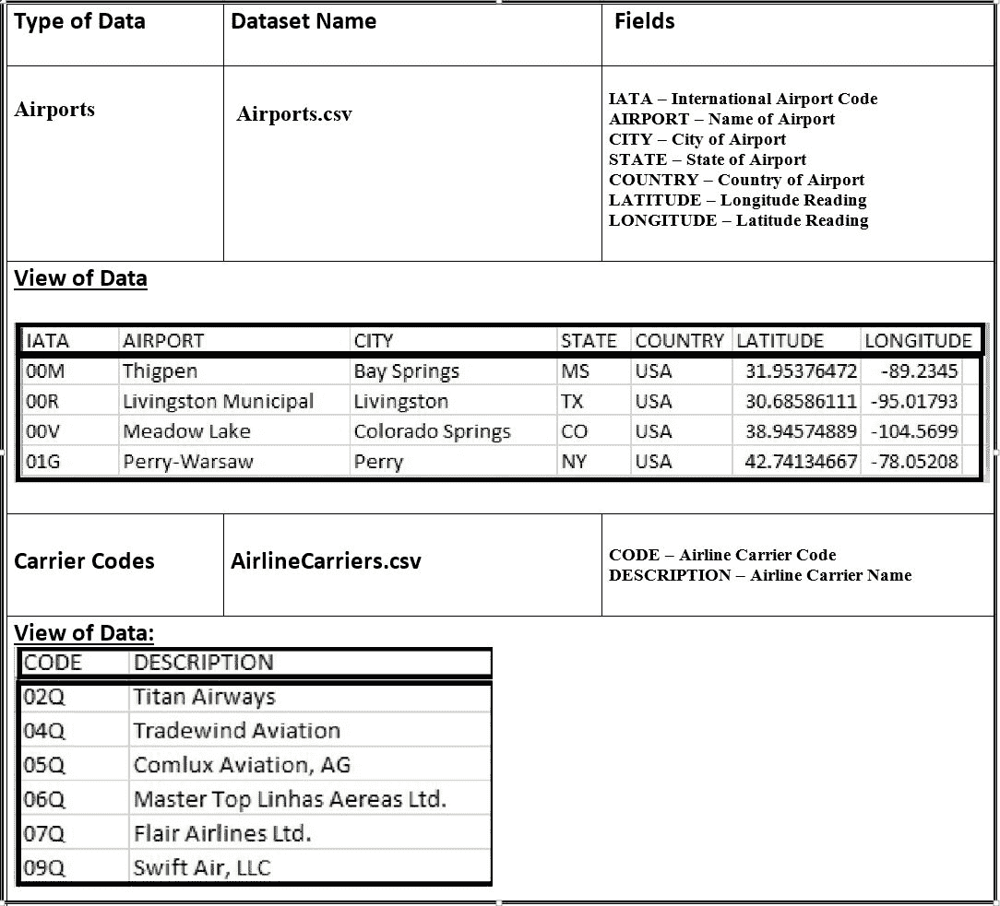

机场和航空公司数据集

以下表格描述了准时数据集（`OnTime2008Short.xlsx`）的结构。它列出了所有 28 个字段。该表由非规范化、半结构化数据组成：

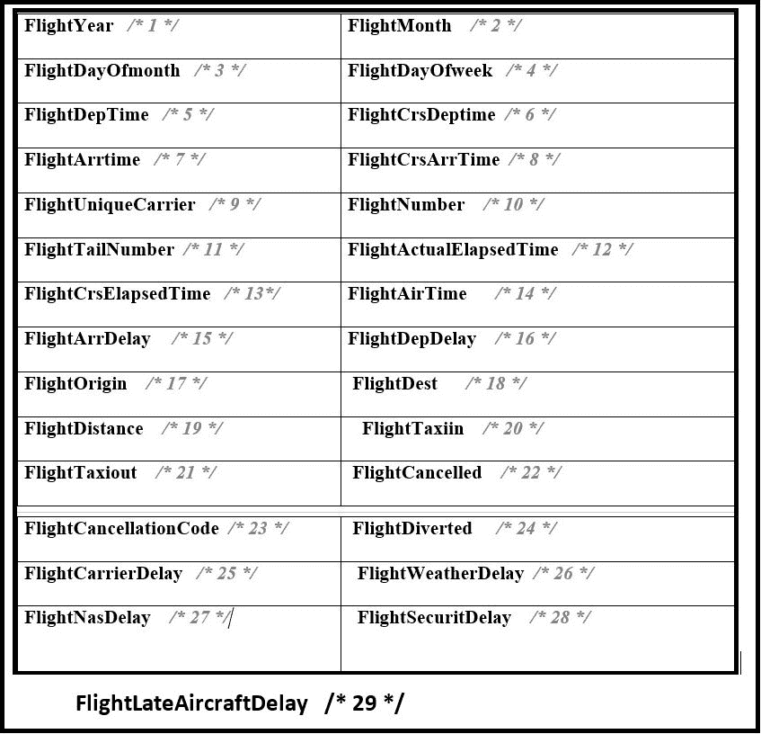

The OnTime2008Short 文件数据集

字段描述分为以下类别：

+   **航空公司（承运人）延误原因（以分钟计）**：

+   `FlightCarrierDelay`: 表示由承运人引起的延误

+   `FlightWeatherDelay`: 表示由天气引起的延误

+   `FlightNASDelay`: 表示由国家航空系统引起的延误

+   `FlightSecurityDelay`: 表示由于安全检查或其他安全原因引起的延误

+   `FlightLateAircraftDelay`: 表示由于前述原因以外的其他原因导致飞机晚点

+   **Flight aircraft data**:

+   `FlightUniqueCarrier`: 一个大写字母的唯一两个字母序列，或者一个数字一个字母的序列（例如，US，DL，9E）

本节代表了一个项目的全面概述。首先，我们以高层次的形式概述了我们想要解决的问题的本质。问题表述步骤为实施铺平了道路。首先，让我们表述飞行延误预测问题。

# 飞行延误预测的问题表述

飞行延误问题的概述可以用一句话总结——我们希望实现一个预测模式，对飞行延误进行预测。简而言之，有行程的旅客想知道他的/她的航班是否晚点。

# 入门

本节首先概述了第四章，*构建垃圾邮件分类管道*的实施基础设施。本节的目标将是开始开发一个数据管道来分析飞行准时数据集。第一步是设置先决条件，然后再进行实施。这就是下一小节的目标。

# 设置先决条件软件

以下推荐或推荐的先决条件或先决条件检查。此列表中新增了一个先决条件：MongoDB：

+   增加 Java 内存

+   检查 JDK 版本

+   基于**简单构建工具**（**SBT**）的独立 Scala 应用程序，其中所有依赖项都连接到`build.sbt`文件

+   MongoDB

我们首先详细说明增加 Spark 应用程序可用内存的步骤。我们为什么要这样做？这一点以及与 Java 堆空间内存相关的其他点将在以下主题中探讨。

# 增加 Java 内存

飞行准点记录，按时间顺序编译，比如，按月，变成大数据或中等数据。在本地机器上处理如此大量的数据并非易事。在大多数情况下，具有有限 RAM 的本地机器根本不够用。

尽管这种情况可能具有挑战性，但我们希望充分利用我们的本地机器。这让我们想到了为什么要增加 Java 内存。例如，尝试处理一个

典型的单次数据集文件，27 列和 509,520 行，足以导致 Java

以至耗尽内存（见以下截图）：

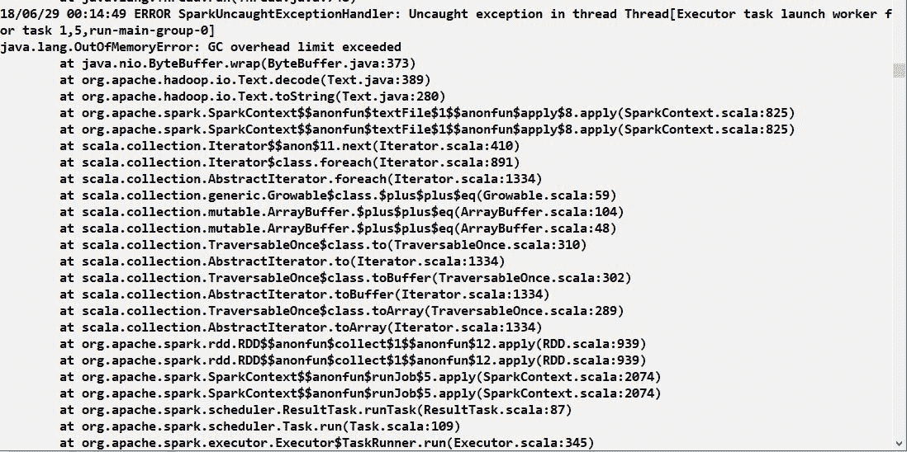

GC 开销限制超出

首先，`java.lang.OutOfMemory`发生时，您的 Java 虚拟机尝试超过由`-Xmx`参数设置的阈值内存分配。

`-Xmx`参数与内存管理有关。它用于设置最大 Java 堆大小。从 Java 1.8 开始，JVM 将根据机器上的物理内存分配堆大小

为了解决这个问题，这里有一些不同的方法可以增加 Java 内存：

+   方法 1：在命令行中，我们将以下运行时参数传递给 SBT：

+   允许的最大堆大小

+   Java 线程堆栈大小

+   初始堆大小

+   方法 2：在 Java 控制面板中设置最大 Java 堆大小。

+   方法 3：在环境变量`JAVA_OPTS`中全局设置这些参数。

为了解决前面截图中所展示的`GC Overhead Limit exceeded`问题，我们可以在命令行上快速分配更多的堆空间，如下所示：

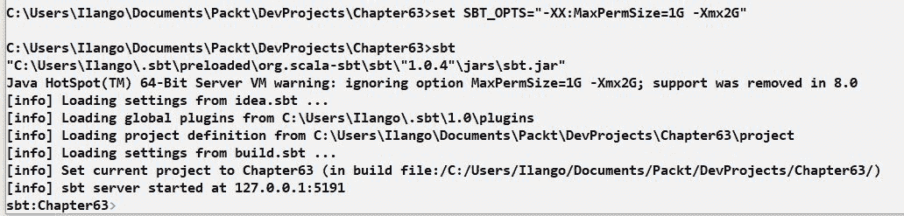

分配堆空间

注意到`-Xmx2G`设置。我们使用`-Xmx2G`设置`SBT_OPTS`环境变量，这是最大分配的 Java 堆空间内存。我们设置它然后运行 SBT。

在我们继续到下一个方法之前，了解以下 JVM 堆分配统计信息可能是有用的：

+   总内存

+   最大内存

+   可用内存

这很有用。堆内存利用率数字是揭示性的。以下截图显示了如何做到这一点：

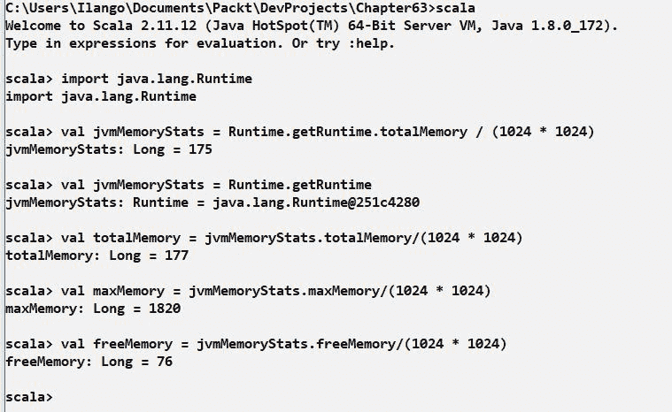

堆内存

接下来，我们将讨论方法 2，其中我们将通过步骤设置 Java 运行时参数全局。

以下步骤适用于 Windows 机器。

1.  导航到开始 | 控制面板，然后在类别下选择小图标：


控制面板

1.  下面的面板允许您更改计算机的设置。Java 设置就是其中之一。在控制面板中找到 Java：


所有控制面板项

1.  点击 Java，如图中所示，将带您进入 Java 控制面板：

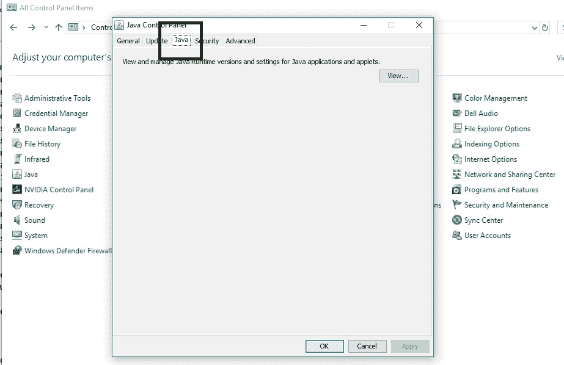

Java 控制面板

1.  选择 Java 选项卡将显示 Java 运行时环境设置面板，您可以检查运行时参数，例如 Java 堆大小：

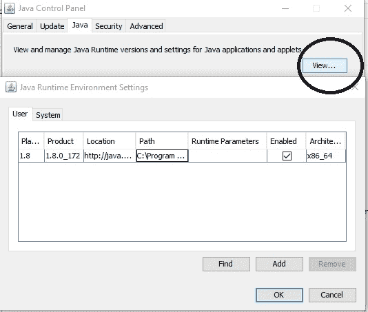

Java 控制面板的用户选项卡

参考 Java 控制面板的表示，我们想在“运行时参数”框中设置最大 Java 堆大小。`Xmx2048m`是最大堆空间的新值，其中`m`代表兆字节。修改`-Xmx`参数的值很容易。点击它，然后将值更改为`2048`并点击“确定”。

`-Xmx`和`2048m`或`2 GB`之间没有空格。

就这样。退出控制面板：


Java 控制面板运行时参数

说到 Java 内存管理和可用于帮助我们管理 Spark 应用程序中 Java 内存使用的设置，以下是在运行`java -X`命令行时可用的一系列命令行选项：

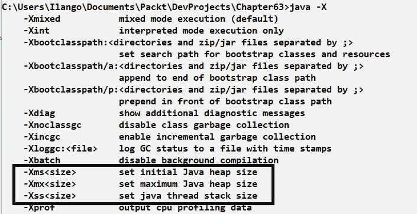

java -X 命令行

上述截图展示了命令行选项的完整列表。这些选项允许您调整与您的基于 JVM 的 Spark 应用程序内存使用相关的不同 Java 环境设置。我们感兴趣的是 Xmx 设置。

我们刚刚描述了方法 2，其中概述了如何在 Java 控制面板中设置 Java 运行时参数`-Xmx`。

这就留下了方法 3，其中我们描述了如何全局设置三个运行时参数。根据前面的截图，这些是：

+   `-Xmx`：设置（或分配）Java 堆空间允许增长到的大小（以兆字节为单位）。一个典型的默认设置是`64m`。

+   `-Xms`：设置初始 Java 堆大小。默认值是 2 MB。

+   `-Xss`：设置 Java 线程堆栈大小。

我们将在名为`JAVA_OPTS`的环境变量中设置这些参数。

以下步骤说明了如何做到这一点：

1.  首先，我们右键单击“此电脑”并选择“属性”：


属性选项卡

1.  点击“属性”将带我们到以下屏幕：

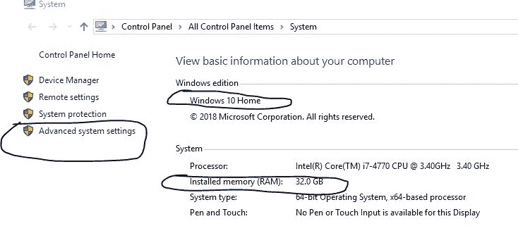

系统选项卡

1.  点击“高级系统设置”将带我们到以下屏幕：

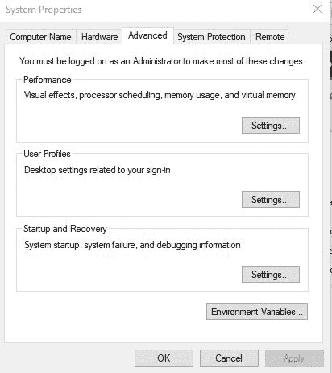

系统属性选项卡

1.  点击“环境变量...”按钮。在接下来的屏幕中，我们将能够设置`JAVA_OPTS`。如果`JAVA_OPTS`不存在，创建一个新的。点击“新建”，在变量名和变量值框中输入适当的值。通过点击“确定”来关闭对话框：

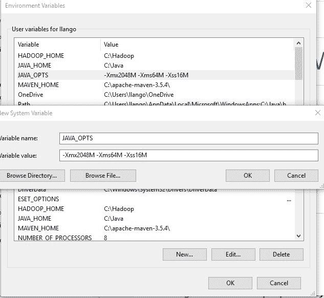

新系统变量

1.  您的新`JAVA_OPTS`变量现在已准备就绪：

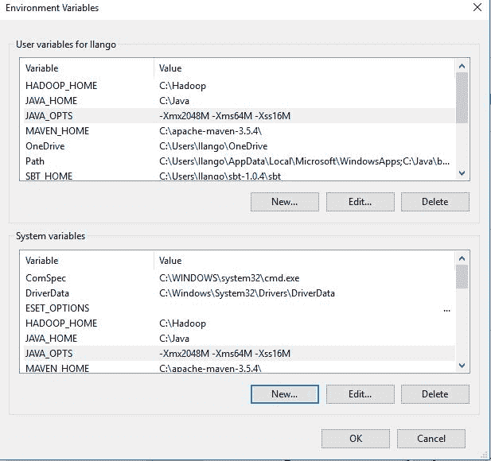

环境变量

在我们刚刚设置的环境设置中，将`JAVA_OPTS`环境变量设置为`JAVA_OPTS = =Xmx2048M -Xms64M -Xss16M`。

回顾前面的截图，快速了解这些设置。

为了全面了解所有环境变量，请启动 Windows PowerShell（桌面上应该有一个 PowerShell 应用程序）。以下是所有环境变量的完整列表。注意相关的变量：

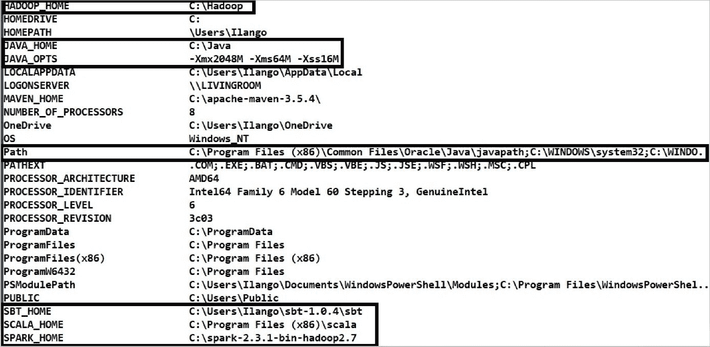

Hadoop 环境设置

回顾一下，以下是在选择合适的 Java（最大 Java 堆大小）时需要考虑的事项：

+   设置最大堆空间（以字节为单位）和初始堆大小（也以字节为单位）。这些是适当的内存分配池值，有助于控制基于 JVM 的 Spark 应用程序的内存使用量。

+   `-Xmx`选项更改了 VM 的最大堆空间。一些示例设置是`-Xmx2048`，`-Xmx81920k`和`-Xmx1024m`。

`-Xmx10G`等同于`-Xmx1024m`或`-Xmx1024g`。

`-Xms`选项允许我们设置初始堆大小。例如，默认值是 64 MB 或 640 KB，例如`Xms64m`。考虑以下：

+   为了确定可以设置多高的堆大小，我们建议将 Java 堆空间设置为不超过可用总 RAM 的 50%。例如，如果您的机器有 32 GB 的可用 RAM，我们建议将最大堆空间设置不超过 16 GB。

+   在我们的示例中，将最大堆空间设置为超过 16 GB 的值会导致性能问题。

接下来，我们将审查您的系统 JDK。

# 检查 JDK 版本

如果您有 JDK 8，那么您就可以安全地跳过这一部分。如果您想安装 JDK 9，请不要安装。Spark 与任何大于 8 的 JDK 版本都不兼容。此外，请确保您没有将 JDK 安装到包含空格的路径中。这是一个小细节，但我们想确保。

在下一节中，我们将讨论 MongoDB 的安装。我们将讨论为什么以及如何进行。

# MongoDB 安装

什么是 MongoDB，我们为什么需要它？首先，MongoDB 的文档模型使得在应用程序代码中将对象映射到 MongoDB 中的等效 JSON 表示变得容易。这还有更多。Spark 与 MongoDB 有良好的集成。一个明显的优势是能够将我们的实时 dataframe 作为文档发布到 MongoDB。从 MongoDB 中检索 dataframe 文档在性能方面也很好。

安装 MongoDB（在 Windows 上）有两个先决条件：

+   只有 64 位机器能够支持 MongoDB

+   一定要获取最新的 Windows 更新

要开始安装，请从[mongodb.com](https://www.mongodb.com/)网站上的 MongoDB 下载中心页面下载 MongoDB 社区服务器的最新稳定版本。这将版本号为 4.0。根据您所使用的操作系统，下载相应的版本。以下说明适用于 Windows 10，64 位用户。

MongoDB 产品不再支持 32 位 x86 操作系统平台。

在接下来的几个步骤中，我们将安装 MongoDB 作为服务：

1.  点击 MongoDB 安装程序，一个 MSI 文件：

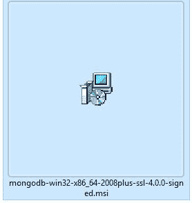

MongoDB 的 MSI 文件

1.  如以下截图所示，点击“安装”：

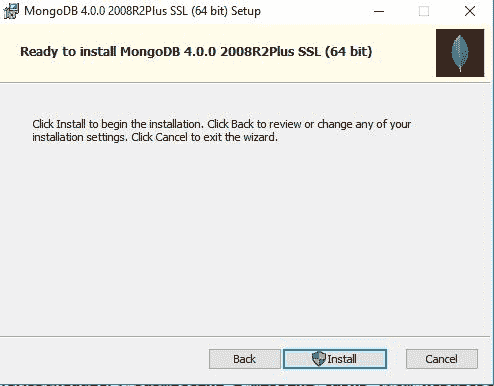

MongoDB 安装屏幕

1.  点击“下一步”，并继续使用完整的安装类型：

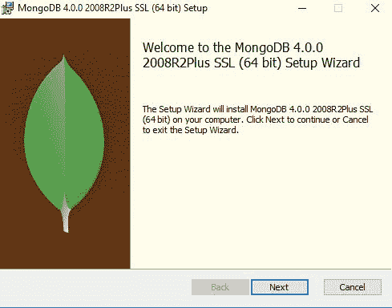

MongoDB 的“下一步”按钮

1.  点击“完成”，并继续使用完整的安装类型：


MongoDB 的完整选项

1.  如前所述，我们将选择不将 MongoDB 作为服务安装。因此，请取消选中“将 MongoDB 作为服务安装”选项：

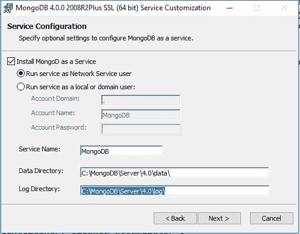

MongoDB 服务配置

注意您将 MongoDB 安装到的位置。服务器安装在`C:\MongoDB\Server\4.0`。数据文件夹位于`C:\MongoDB\Server\4.0\data`。

1.  接下来，您将看到 MongoDB Compass 的屏幕：


安装 MongoDB Compass

在下一节中，我们将向您展示我们如何以及为什么使用 MongoDB。在完成先决条件并建立应用程序构建基础设施后，我们继续到*实施和部署*部分。

# 实施和部署

实施取决于设置大数据基础设施。请验证您的 MongoDB 安装是否正常运行。现在我们将按以下方式列出实施目标：

+   将数据分割成测试、训练和验证数据集

+   数据摄取

+   数据分析

# 实施目标

总体目标是分析 2007-2008 年对应的准时航班数据集。在 2007 年的航班数据中，80%将用作训练数据集，其余的作为验证数据集。就模型性能评估而言，2008 年航班数据的 100%将成为测试数据集。

以下是实现飞行预测模型所需实现的目标：

+   下载航班数据集。

+   您可以通过以下四种方式开发管道：

+   在您的本地 Spark shell 中逐步进行

+   通过在您的托管虚拟机上启动 Horton Sandbox，并在强大的 Zeppelin 笔记本环境中编写代码

+   在 Azure 云上开发一切

+   将应用程序作为自包含的 SBT 应用程序开发，并使用`spark-submit`将其部署到您的本地 Spark 集群

+   在 IntelliJ 中完善您的代码，并在`build.sbt`文件中连接所有必要的依赖项。

+   运行应用程序并解释结果。

在下一小节中，我们将逐步记录实施项目的说明。在接下来的步骤中，我们将在 IntelliJ 中创建一个新的 Scala 项目，并将其命名为`Chapter6`。

# 创建一个新的 Scala 项目

让我们创建一个名为`Chapter6`的 Scala 项目，具有以下工件：

+   `AirlineWrapper.scala`

+   `Aircraft.scala`

以下截图展示了我们的项目外观：

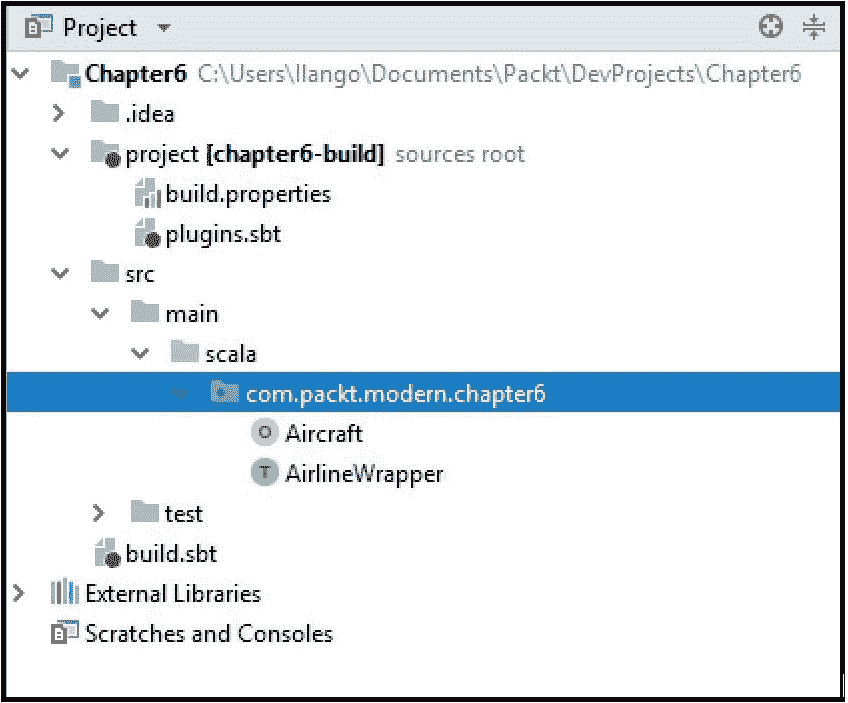

IntelliJ 项目结构

让我们分解一下项目结构：

+   `.idea`：这些是生成的 IntelliJ 配置文件。

+   `project`：包含 `build.properties` 和 `plugins.sbt`。例如，`plugins.sbt` 可以用来指定 SBT assembly 插件。

+   `src/main/scala`：一个包含 `com.packt.modern.chapter6` 包中 Scala 源文件的文件夹。

+   `src/main/resources`：任何数据或配置文件；例如，一个名为 `log4j.xml` 的 log4j 配置文件。

+   `target`：这是编译过程产生的工件存储的地方。任何生成的汇编 JAR 文件都放在那里。

+   `build.sbt`：这是主要的 SBT 配置文件。在这里指定 Spark 及其依赖项。

到目前为止，我们将开始开发。我们从 `AirlineWrapper.scala` 文件开始，以将最终的应用程序 JAR 部署到 Spark 中的 `spark-submit` 结束。

# 构建 AirlineWrapper Scala 特质

`AirlineWrapper` 包含创建名为 `session` 的 `SparkSession` 实例的代码。它还声明了用于表示我们的航班数据集的案例类。

让我们先创建 `trait` 定义：

```java
trait AirlineWrapper {  }
```

编程的入口点是以下内容：在 `trait` 中，我们首先声明一个名为 `session` 的 `lazy val`。这是我们在第一次遇到时懒加载 `SparkSession` 实例的地方。懒加载意味着 `val` 只在第一次遇到时执行。会话是我们使用 `DataSet` 和 `DataFrame` API 编程 Spark 的入口点：

```java
lazy val session = { SparkSession.builder()..getOrCreate() }
```

在以下代码片段中，`CarrierCode` 是美国运输部分配的唯一识别号码，用于识别一家航空公司（承运人）：

```java
case class AirlineCarrier(uniqueCarrierCode: String)
```

在以下代码中，`originOfFlight` 是航班的起点（IATA 机场代码），而 `destOfFlight` 是航班的终点（IATA 机场代码）：

```java
case class Flight(monthOfFlight: Int, /* Number between 1 and 12 */
                 dayOfFlight: Int, /*Number between 1 and 31 */
                 uniqueCarrierCode: String,
                 arrDelay: Int, /* Arrival Delay - Field # 15*/
                 depDelay: Int, /* Departure Delay - Field # 16 */
                 originAirportCodeOfFlight: String, /* An identification number assigned by US DOT to identify a unique airport. */
                destAirportCodeOfFlight: String, /* An identification number assigned by US DOT to  identify a unique airport.*/
                carrierDelay: Int, /* Field # 25*/
                weatherDelay: Int, /* Field # 26*/
                lateAircraftDelay: Int /* Field # 29*/
)  
```

在以下代码片段中，`iataAirportCode` 是国际机场缩写代码：

```java
case class Airports(iataAirportCode: String, airportCity: String, airportCountry: String)
```

加载并从机场的数据集中创建一个 `File` 对象：

```java
val airportsData: String = loadData("data/airports.csv") 
```

加载并从航空公司承运人数据集中创建一个 `File` 对象：

```java
val carriersData: String = loadData("data/airlines.csv") 
```

从主要的 FAA 数据集中创建一个 `File` 对象：

```java
val faaFlightsData: String = loadData("data/faa.csv")
```

此方法接受 `resources` 文件夹内数据的相对路径：

```java
def loadData(dataset: String) = {
                     //Get file from resources folder
                    val classLoader: ClassLoader = getClass.getClassLoader
                    val file: File = new File(classLoader.getResource(dataset).getFile)
                    val filePath = file.getPath
                    println("File path is: " + filePath)
                   filePath
 } 
```

接下来，我们将编写一个名为 `buildDataFrame` 的方法：

```java
import org.apache.spark.sql.SparkSession
import org.apache.spark.SparkConf
import org.apache.spark.ml.linalg.{Vector, Vectors}
import org.apache.spark.rdd.RDD
```

记得更新你的导入语句。必要的输入语句如下所示。这是我们能够编译到目前为止开发的所有代码所需的一切：

```java
def buildDataFrame(dataSet: String): RDD[Array[String]] = {
//def getRows2: Array[(org.apache.spark.ml.linalg.Vector, String)] = {
def getRows2: RDD[Array[String]] = {session.sparkContext.
textFile(dataSet).flatMap {
                        partitionLine =>  
                        partitionLine.split("\n").toList
                        }.map(_.split(","))
 } 
   //Create a dataframe by transforming an Array of a tuple of Feature 
   Vectors and the Label
   val dataFrame = session.createDataFrame(getRows2).
   toDF(bcwFeatures_IndexedLabel._1, bcwFeatures_IndexedLabel._2)
   //dataFrame
   //val dataFrame = session.createDataFrame(getRows2)
   getRows2
}
```

导入 MongoDB 包，包括连接器包，特别是：

```java
/*
Import the MongoDB Connector Package
*/

import com.mongodb.spark._
import com.mongodb.spark.config._
import org.bson.Document
```

创建 `Aircraft` 对象：

```java
object Aircraft extends AirlineWrapper {
```

在 `Aircraft` 对象内部创建一个 `main` 方法，如下所示：

```java
def main(args: Array[String]): Unit = {

}
```

`object` 现在看起来是这样的：

```java
object Aircraft extends AirlineWrapper {
      def main(args: Array[String]): Unit = {

}

}
```

创建一个 `case class` 来表示数据集中精心挑选的特征，这些特征我们将决定将对数据分析做出最大贡献：

```java
case class FlightsData(flightYear: String, /* 1 */ 
flightMonth : String, /* 2 */ 
flightDayOfmonth : String, /* 3 */ 
flightDayOfweek : String, /* 4 */ 
flightDepTime : String, /* 5 */ 
flightCrsDeptime : String, /* 6 */ 
flightArrtime : String, /* 7 */ 
flightCrsArrTime : String, /* 8 */ 
flightUniqueCarrier : String,/* 9 */ 
flightNumber : String, /* 10 */ 
flightTailNumber : String, /* 11 */ 
flightActualElapsedTime : String, /* 12 */ 
flightCrsElapsedTime : String, /* 13 */ 
flightAirTime : String, /* 14 */ 
flightArrDelay : String, /* 15 */ 
flightDepDelay : String, /* 16 */ 
flightOrigin : String, /* 17 */ 
flightDest : String, /* 18 */ 
flightDistance : String, /* 19 */ 
flightTaxiin : String, /* 20 */
flightTaxiout : String, /* 21 */ 
flightCancelled : String, /* 22 */ 
flightCancellationCode : String, /* 23 */ 
flightDiverted : String, /* 24 */ 
flightCarrierDelay : String, /* 25 */ 
flightWeatherDelay : String, /* 26 */ 
flightNasDelay : String, /* 27 */ 
flightSecuritDelay : String, /* 28 */ 
flightLateAircraftDelay : String, /* 29 */ record_insertion_time: String, /* 30 */ uuid : String /* 31 */
                    )
```

接下来，创建一个数据框来表示 `FlightData`：

```java
val airFrame: DataFrame = session.read .format("com.databricks.spark.csv") .option("header", true).option("inferSchema", "true").option("treatEmptyValuesAsNulls", true) .load("2008.csv")
```

我们刚刚加载了数据集并创建了一个数据框。现在，我们能够打印模式：

```java
println("The schema of the raw Airline Dataframe is: ")
airFrame.printSchema()
```

`printschema()` 方法显示以下模式：


我们需要在某些字段上使用类型转换。要调用 `cast` 方法，我们按照以下导入进行调用：

```java
import org.apache.spark.sql.functions._
```

现在，我们将创建一个本地临时视图并将其命名为 `airline_onTime`。这个临时视图仅存在于我们创建 dataframe 所使用的 `SparkSession` 的生存期内：

```java
airFrame.createOrReplaceTempView("airline_onTime")
```

对 dataframe 中的行数进行 `count` 操作：

```java
print("size of one-time dataframe is: " + airFrame.count())
```

使用给定的名称创建一个本地临时视图。这个临时视图的生存期

与创建此数据集所使用的 `SparkSession` 相关联：

```java
airFrame.createOrReplaceTempView("airline_ontime")
print("size of one-time dataframe is: " + airFrame.count()) 
```

使用给定的名称创建一个本地临时视图。这个临时视图的生存期与创建此数据集所使用的 `SparkSession` 相关联：

```java
airFrame.createOrReplaceTempView("airline_ontime") 
print("size of one-time dataframe is: " + airFrame.count()) 
```

在对字段进行裁剪和类型转换并确保数值列正常工作后，我们现在可以将数据保存为 JSON 行和 parquet。调用 `toJSON` 方法将数据集的内容作为 JSON 字符串的 dataset 返回：

```java
val airFrameJSON: Dataset[String] = clippedAirFrameForDisplay.toJSON
```

以 JSON 格式显示新数据集：

```java
println("Airline Dataframe as JSON is: ")
airFrameJSON.show(10) 
```

将我们的 JSON 空中数据 dataframe 保存为 `.gzip` JSON 文件：

```java
airFrameJSON.rdd.saveAsTextFile("json/airlineOnTimeDataShort.json.gz", classOf[org.apache.hadoop.io.compress.GzipCodec]) 
```

接下来，我们需要将我们的 dataframe 转换为 `parquet` 记录。以下代码正是这样做的：

```java
clippedAirFrameForDisplay.write.format("parquet").save("parquet/airlineOnTimeDataShort.parquet")
```

让我们读取我们新创建的 JSON 归档并显示其前 20 行：

```java
val airlineOnTime_Json_Frame: DataFrame = session.read.json("json/airlineOnTimeDataShort.json.gz")
println("JSON version of the Airline dataframe is: ")
airlineOnTime_Json_Frame.show()
```

让我们同时加载 `parquet` 版本：

```java
val airlineOnTime_Parquet_Frame: DataFrame = session.read.format("parquet").load("parquet/airlineOnTimeDataShort.parquet") 
```

打印出空中数据 dataframe 的 `parquet` 版本：

```java
 println("Parquet version of the Airline dataframe is: ")
 airlineOnTime_Parquet_Frame.show(10) 
```

接下来，将数据写入 MongoDB 数据库，`airlineOnTimeData`。调用 `save` 方法会产生一个包含 `.mode` 方法的 `DataFrameWriter`；`mode` 接受一个 `"overwrite"` 参数。因此，如果 `collection` 已经存在于 Mongo 中，新记录仍然会被写入 MongoDB 数据库：

```java
MongoSpark.save( airlineOnTime_Parquet_Frame.write.option("collection", "airlineOnTimeData").mode("overwrite") )
```

为了确认数据已写入 MongoDB，启动 MongoDB Compass Community 应用程序。在“连接到主机”打开屏幕中，点击“连接”，然后在结果屏幕中点击数据库 test。写入 MongoDB 的好处是，它为我们提供了一个简单的方法来检索我们的数据，并在数据 `airlineOnTimeData` 集合被损坏的情况下将其导入 Spark。

最后，使用 `spark-submit` 命令将应用程序提交到 Spark 本地集群。

# 摘要

在本章中，我们对飞行性能数据进行了 **机器学习**（**ML**）数据分析任务。其中一项任务是针对数据的一个训练子集实现回归模型。给定一个新或未知的延误起飞的航班数据，该模型能够预测正在调查的航班是否弥补了失去的时间并在目的地准时到达。从这个机器学习练习中，我们得到的一个重要启示是——从起点到目的地的距离对预测时间增益的贡献最大。承运人延误对预测的贡献最小。结果证明，飞行时间更长，能够获得更多的时间。

本章为构建更复杂的模型奠定了基础。具有更多预测变量（例如，考虑天气和安全延误）的模型可以产生更深入、更尖锐的预测。话虽如此，本章希望为读者打开一扇了解航班性能洞察如何帮助旅行者以金钱和时间成本获得最佳旅行体验的机会。

在下一章和最后一章中，我们将开发一个推荐系统。从亚马逊的推荐算法和 Netflix 的评分系统中获得灵感，这些系统为我们带来了相关的电影。我们将构建的推荐系统将利用到目前为止我们在 Spark ML 中积累的所有技能。

# 问题

在读者进入下一章之前，我们邀请读者尝试提升航班性能模型。想法是这样的——输入几个额外的预测因子，以增强航班延误的 ML 过程，使其预测更加深入和尖锐。

这里有一些问题，以进一步拓宽学习视野：

1.  `parquet`文件是什么，它的优点是什么，尤其是在数据集变得更大，节点之间需要数据洗牌时？

1.  列式格式压缩数据的优点是什么？

1.  有时你可能会遇到这个错误：“`无法在 Dataset 中找到存储的编码器。原始类型（Int、String 等）和产品类型（case classes）通过导入 spark.implicits._ 得到支持`”。你如何解决这个问题？根本原因是什么？提示——使用第一章中的数据集构建一个简单的 dataframe。使用`spark.read`方法，并尝试对其执行`printSchema`。如果产生上述错误，调查是否需要显式模式

1.  作为 MongoDB 的替代方案，你更愿意将航班性能数据提交到 HDFS 吗？

1.  为什么 MongoDB 在本章中证明是有用的？

1.  什么是半结构化数据？

1.  列举 Spark 相对于 Hadoop 的一个大优点，使其脱颖而出？例如，考虑编程范式。

1.  你能从 Kafka 中读取航班数据吗？如果是的话，你是如何做到的，以及这样做的原因可能是什么？

1.  数据丰富化是什么，它与 munging 有何关系，如果这两个术语都有关联的话？

1.  使用两个案例类创建一个 dataframe，每个案例类分别从承运人 CSV 和机场 CSV 数据集的小子集中提取。你将如何将此写入 MongoDB？

# 进一步阅读

以下关于*多元回归分析简介*的文章讲述了回归分析的重要性：[`www.ncbi.nlm.nih.gov/pmc/articles/PMC3049417/`](https://www.ncbi.nlm.nih.gov/pmc/articles/PMC3049417/)
