# 构建推荐引擎

数百万人在亚马逊上订购商品，在那里他们可以节省金钱和时间。推荐算法是从客户的订单偏好中学习得来的，它们为你提供个性化的你可能也会喜欢的推荐，这些建议有助于客户更新购物车或添加有趣的商品到愿望清单以备将来使用。

构建我们自己的推荐引擎是一个学习之旅，在这个过程中，我们会达到几个目标。在问题定义阶段，我们了解到推荐是一个协同过滤的机器学习问题。我们将利用 Spark ML 协同过滤算法来实现一个基于评分的推荐引擎。

Netflix 因其电影推荐功能而闻名，你可能喜欢它的推荐功能。回到 2006 年，Netflix 宣布了一项 100 万美元的奖金，用于对其老化的**CineMatch**电影推荐算法的最佳改进。这场开创性的比赛催生了机器学习领域的一些最佳进展。在全球各地，几个顶尖的编码团队在 Netflix 发布的电影评分宝库中竞争最高奖项。他们的目标是构建一个算法，该算法能够预测用户评分（从而提供更好的推荐），比 CineMatch 高出 10%。

自那时起，为用户推荐**商品**的算法已经取得了长足的进步。在本章中，我们将使用 Scala 和 Apache Spark 构建一个推荐系统。这个推荐系统将要解决什么问题？这个问题以及其他问题将很快得到解答。

本章的主要学习目标是实现一个推荐引擎。以下列表是对各个学习目标的全面分解：

+   学习推荐的入门知识；推荐系统也被称为**推荐器系统**。

+   以例学习——通过截图了解亚马逊的现场推荐是双刃剑；它们提高了客户满意度，并为亚马逊增加了销售收益。

+   在线商店提供的众多产品选择中，顾客需要尽可能多的帮助。在本章中，我们将学习到推荐可以帮助人们更好地、更快地做出选择。这对顾客和想要将潜在客户转化为客户的在线零售商都有好处。

+   下一个可衡量的学习目标是理解哪些推荐是隐式的，哪些不是。

+   了解不同类型的推荐及其功能是好的。我们希望通过学习哪些类型的数据不需要太多细节。为什么？我们想要建立数据集来模拟推荐系统，并将这个数据集与一个只需要用户和产品之间关系的合适算法相匹配。不多也不少。符合这一要求的算法就是协同过滤算法。

+   协同过滤可以实现的是什么，这是一个正在进行中的工作。只有当我们创建自定义数据集，构建基于数据的协同过滤算法，并查看结果时，我们才能更多地了解该算法。

我们将学习如何利用 Spark ML 提供的基于模型的协同过滤算法来构建推荐系统。我们将了解到，我们实现的推荐系统，就像其同类系统一样，基于其他客户的偏好来推荐产品。

我们将从*问题概述*部分开始。

在本章中，我们将涵盖以下主题：

+   问题概述

+   详细概述

+   实施和部署

# 问题概述

我们将按顺序组织本节，涵盖选定主题的概述。以下是我们要讨论的主题：

+   亚马逊的推荐

+   推荐系统，也称为推荐系统或推荐引擎

+   对推荐进行分类，例如：

+   隐式推荐

+   明确推荐

+   机器学习的推荐

+   明确推荐的公式化问题——细节

+   武器销售线索和过去销售数据——细节

每个主题都将进行回顾和解释。我们将从第一个主题——*亚马逊的推荐*开始。

# 亚马逊的推荐

这个主题分为两部分——*简要概述*和*详细概述*。

# 简要概述

这个主题（细节在*详细概述*部分中展开）将制定一个路线图，从非机器学习角度对推荐的一般理解开始。我们将通过支持插图向你展示亚马逊的推荐看起来是什么样子。不仅如此，我们还将强调强大的机器学习算法如何为亚马逊的推荐系统提供动力，帮助用户更轻松地做出产品选择。

这个主题的简要概述已经过去了。其详细概述如下。

# 详细概述

要构建推荐系统，我们必须采取的方法是专注于在概念层面上理解推荐。以下是一些提供对推荐洞察的问题示例：

+   推荐是什么？

+   两种重要的推荐类型是什么？

无论你是希望以盈利方式使推荐引擎为你服务的在线零售商，还是希望近距离探索 Spark ML 强大的推荐算法的人，本节将帮助你入门。

我们将专注于适合的机器学习技术，以便我们可以利用这些技术构建一个推荐系统。

杰夫·贝索斯，拥有数十亿美元的商业帝国，[Amazon.com](http://Amazon.com)，继续报告健康的销售数字。推荐系统始终为亚马逊带来了增加的收入流。这些系统由机器学习推荐算法支持，帮助实时提供针对特定客户的推荐。毫无疑问，推荐是亚马逊景观的一个组成部分，在客户购买过程的各个方面都发挥着作用。

亚马逊的推荐分为两大类：

+   站内推荐

+   站外推荐

我们将只关注站内推荐。站内和站外推荐都是亚马逊的大收入来源。然而，本章不涵盖站外推荐，但鼓励读者探索亚马逊推荐景观的这一方面。在本章的最后部分，我们有两个关于站外推荐的问题。

# 站内推荐

通过简单地点击 XYZ 的 Amazon.com 链接，可以轻松获得两种主要的站内推荐类型。这些是：

+   **为您推荐，XYZ**：

“为您推荐，XYZ”链接看起来是这样的：

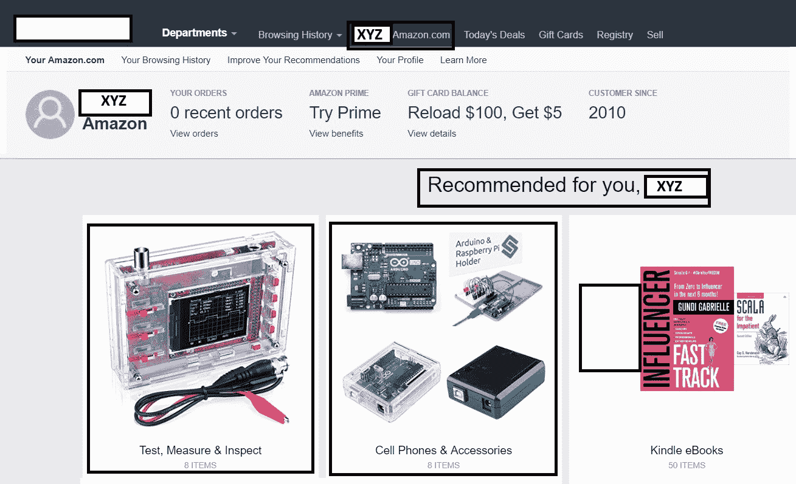

观察“为您推荐，XYZ”链接下的推荐内容

这包含了亚马逊认为您可能会点击并购买的产品推荐。这些推荐是如何到达您的呢？这个问题有两个答案。首先，推荐算法跟踪了您的浏览历史。其次，这将带您到一个显示来自各个类别产品列表的页面。

+   **您最近查看的商品和特色推荐**：

另一个相关的推荐示例如下。根据亚马逊的机器学习推荐系统，这些推荐分布在几个类别中，例如：

+   **根据您的浏览历史**：

以下页面反映了“根据您的浏览历史”类型的推荐。我们可以看到亚马逊推荐系统的强大作用：

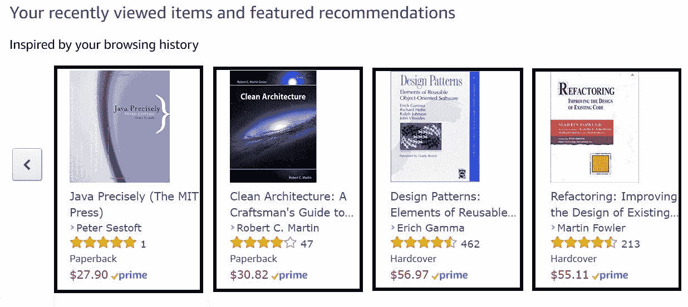

观察在“根据您的浏览历史”链接下的商品

+   **根据您的购买**：

再次强调，目标很简单——将一系列产品摆放在客户面前。这使得客户能够轻松地购买不同产品，在这种情况下，是一本与兴趣类别下的书籍密切相关的新书。亚马逊是如何在“根据您的浏览历史”类别下提出这些书籍的系列的呢？推荐系统在某个时间点向您推荐了您可能感兴趣的产品：


观察在“根据您的购买”链接下的商品

+   **经常一起购买**：

这种类型的推荐更有趣。比如说，您点击了*Lego Mindstorms*书籍，如下截图所示。我们被带到一个新的页面，该页面有**经常一起购买**的推荐。

下面的截图显示了**经常一起购买**的推荐：

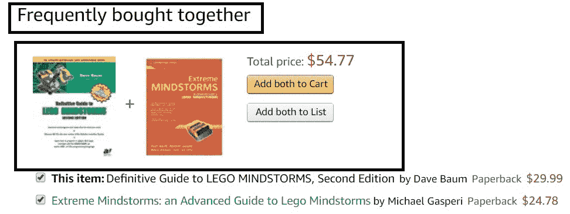

观察经常一起购买链接

+   **购买此商品的用户**：

这种类型的推荐是亚马逊的向上销售和交叉销售推荐功能。当您点击刚刚点击的*Lego Mindstorm*书籍时，推荐系统会提供其他客户一起购买的产品：

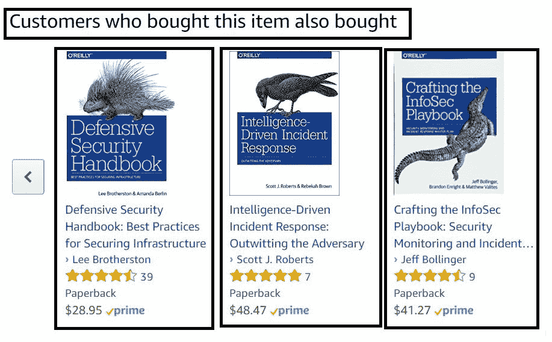

观察客户购买此商品也购买了链接

下一个*问题概述*部分是*基于机器学习的推荐*。亚马逊的推荐与基于强大机器学习推荐系统相关联。接下来的主题是尝试从高级、非机器学习角度描述推荐系统。因此，我们想知道在高级层面，这样的系统可能或可能不处理的推荐类型。

对推荐以及推荐系统达到这种理解水平，将为进一步探索机器学习空间中某些子集的推荐问题领域铺平道路。

所有类型的推荐都共享以下目标：

+   客户满意度

+   提高亚马逊的销售收入

我们将依次介绍每种推荐类型。首先介绍最重要的现场推荐，即**为您推荐，XYZ**页面。

话虽如此，我们将进入下一个主题，*推荐系统*。

# 推荐系统

在前面的概述主题中，我们探讨了亚马逊推荐和推荐系统的显著方面。让我们尝试将其中一些内容结合起来，并给出推荐系统的定义。

# 定义

推荐系统可以被定义为从数据中提取并学习，如偏好、他们的行为（例如点击）、浏览历史和生成的推荐，这些是系统认为用户在近期内可能感兴趣的产品。

下面的图示代表了一个典型的推荐系统：

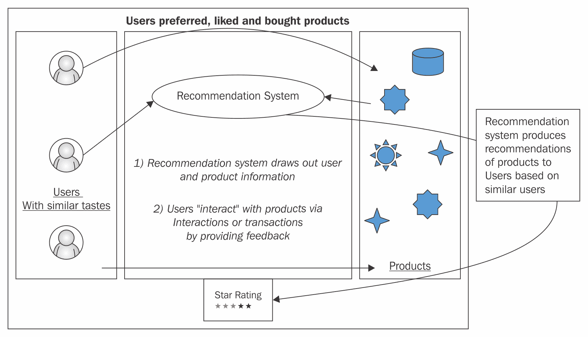

推荐系统

在前面的图中，可以将其视为一个推荐生态系统，其中推荐系统是其核心。这个系统需要三个实体：

+   **用户**

+   **产品**

+   **用户和产品之间的交易，其中交易包含用户对产品的反馈**

可以将交易视为以下行为——用户对一个产品进行评分。但这还不止这些。交易的性质意味着用户正在提供关于产品（们）的反馈。这解释了从**用户**框开始并延伸到**产品**框的坚实箭头。正如从图中明显看出，**推荐系统**在收集所有用户-产品交互，即反馈数据后，生成一个推荐。

存在着不同类型的交易，这让我们来看看不同类型的推荐。

# 推荐分类

这个主题将借鉴前一个主题。特别是，我们提到了用户-产品交互或反馈数据。实际上，可能存在两种这样的交互。用户反馈是一个更好的术语。

根据用户反馈的类型，我们可以识别出两种类型的推荐，如下所示：

+   隐式

+   显式

每种类型的推荐将依次介绍。我们将首先解释使用隐式反馈的推荐。

# 隐式推荐

这种数据的一个好例子是隐式信息，例如用户偏好、他们的点击、浏览历史、购买历史、搜索词等等。

这种场景代表了一个基于隐式反馈的推荐系统在工作中的例子。这种系统的关键特征是——用户做了什么？以亚马逊上的用户为例，一些隐式用户反馈的例子包括——用户买了什么？他们点击了哪本书？他们的搜索词是什么？所有这些问题都反映了用户的行为。因此，我们将直接进入问题定义阶段，在那里我们将记录构建协同过滤推荐问题所需的内容。这个推荐系统是隐式还是显式将在那个阶段决定。

# 显式推荐

这是一个需要显式数据来建模每个用户（客户）与产品（项目）之间关系的协同过滤问题。这种数据的一个好例子是显式评分。

# 机器学习推荐

我们讨论了在亚马逊中推荐所起的作用。这让我们对推荐是什么，以及推荐系统是什么，从普通人的角度来看有了很好的理解。我们为每种类型的推荐提供了例子。亚马逊的推荐是由机器学习算法生成的，这是这里的共同点。

话虽如此，这个主题的目的是明确地解释机器学习在推荐背景下的作用。像往常一样，这个主题分为两部分：一个简要概述部分，给出对主题的总结性看法，以及一个详细概述部分。以下是简要概述。

# 协同过滤算法

推荐是机器学习空间中的协同过滤问题。两个基本原理定义了协同过滤算法的工作方式：

+   过滤

+   协同

过滤部分与推荐行为相关。算法通过从许多用户那里获取偏好信息来促成推荐的发生。一个简单的例子可以很好地说明协同过滤算法是如何工作的。想象一下，我们的算法正在基于三个用户（国家）*U1*、*U2* 和 *U3* 的一个池子中工作。尽管这个案例可能很微不足道，但它将解释协同过滤算法是如何工作的。比如说，在最近的一次全球航空展上，寻找新型战斗机的国家被要求对三种一线战斗机进行评分。**拉法埃尔**是法国战斗机。**苏-35**是俄罗斯战斗机，**F-35**是美国战斗机，可以说是世界上最先进的空中优势战斗机。

飞机-国家表如下所示，这是一个基于协同过滤和用户-产品矩阵的推荐算法：

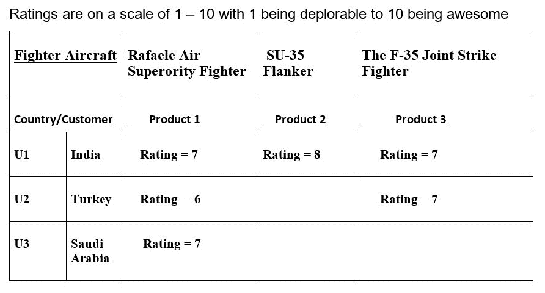

用户-产品矩阵

观察前面的表格，每个国家对某种飞机的评分略有不同。印度对三种战斗机给出了相当好的评分，其中侧卫获得了最高的评分。第二个国家土耳其只对拉法埃尔和 F-35 给出了好的评分，对苏-35 没有给出任何评分。假设没有提供评分的国家得到了负评分 -1。最后，沙特阿拉伯喜欢拉法埃尔和 F-35，而对苏-35 没有发表任何意见。矩阵中有空位。它们留空是有原因的。

假设我们有一个名为 **CF** 的协同算法。我们希望 CF 能够按照计划在这个矩阵上工作。计划的第一部分是告诉算法找出哪些用户喜欢相同的产品。算法将开始工作并得出以下观察结果：

+   用户 U1（印度）喜欢以下产品：

+   产品 1（拉法埃尔）

+   产品 2（侧卫）

+   产品 3（F-35）

+   用户 U2（土耳其）喜欢以下产品：

+   产品 1（拉法埃尔）

+   产品 3（F-35）

+   用户 U3（沙特阿拉伯）喜欢以下产品：

+   产品 1（拉法埃尔）

算法有更大的权限。它需要更仔细地查看矩阵，并为沙特阿拉伯关于飞机的推荐做出判断。

协同过滤算法为沙特阿拉伯提出了以下推理的推荐：

印度喜欢所有三种飞机（拉法埃尔、侧卫和 F-35），而土耳其喜欢两种（拉法埃尔和 F-35）。喜欢拉法埃尔的**国家**也喜欢 F-35。注意大写的单词**也**。基于印度和土耳其有相似的喜好，算法决定沙特阿拉伯会喜欢印度和土耳其喜欢的——在这种情况下，就是 F-35。为了理解最终的推荐，我们将绘制一个类似维恩图的图形：

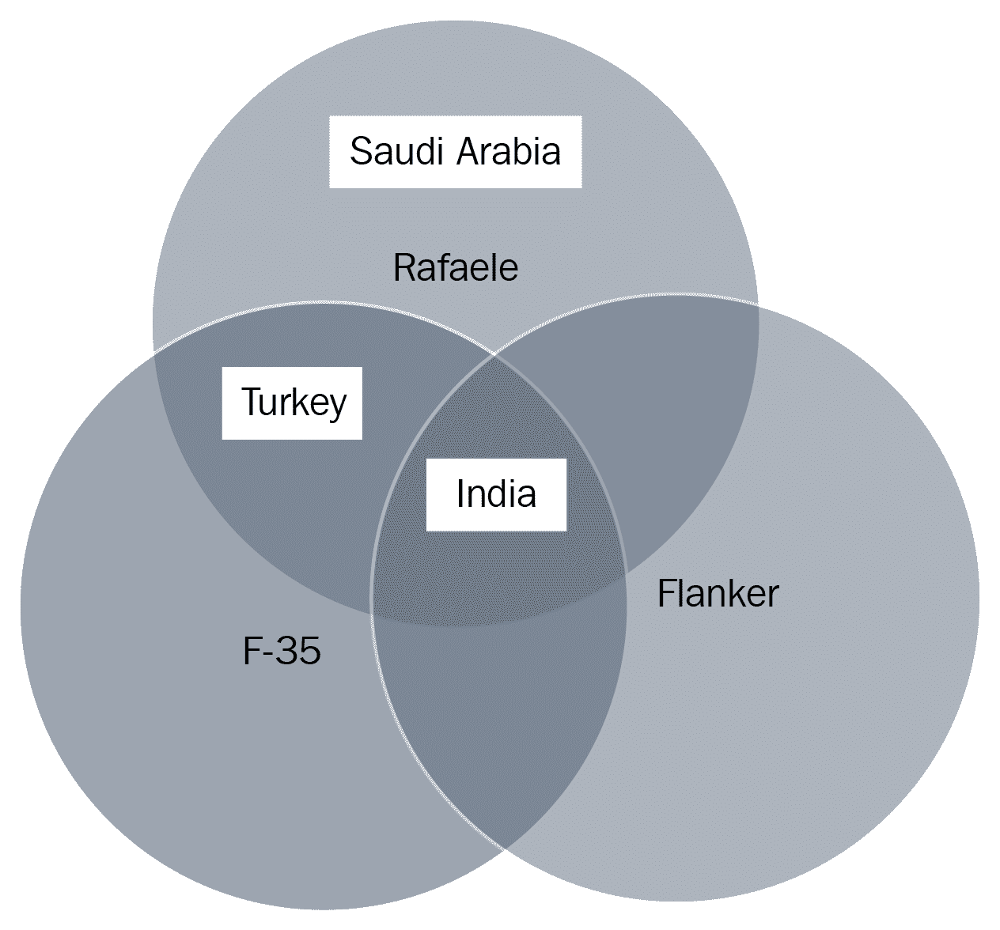

文氏图

我们刚刚展示了推荐能为我们做什么。到目前为止我们所做的是朝着正确方向迈出的一步，关于实施方面。

我们还没有说明这些数据集中可用的数据类型是明确还是隐式。这些数据集描述了用户和产品之间的交互。我们从先前的讨论中看到了这些交互的证据。我们还就沙特阿拉伯提出了建议。我们预测沙特阿拉伯未来可能购买的武器系统。用户-产品矩阵是我们得出对沙特阿拉伯这一建议的依据。这个矩阵有一个特点——用户-产品交互。这是一个硬性数字和评分，这使得这些数据是明确的。

这是一个需要隐式数据来建模每个用户（客户）与产品（项目）之间关系的协同过滤问题。

是时候进入下一个主题了，这个主题恰好是对明确推荐问题表述的简要概述。

# 推荐问题表述

如其标题所示，这个主题将提供一个（推荐）问题表述。换句话说，它将基于明确的（用户）反馈构建推荐系统的轮廓。

问题表述主题代表了实施一种推荐系统过程中的一个关键阶段。接下来要讨论的主题将涉及武器销售线索数据和过往武器销售数据。

# 理解数据集

从上一个主题留下的地方继续，这次重要的讨论提出了两个数据集，分别是武器销售线索数据集和过往销售数据集。

到目前为止，我们已经完成了对我们要覆盖的主题的简要概述，我们决定这些主题与推荐系统的实施相关。

到目前为止，我们已经概述了实施推荐系统所必需的主题。这些主题如下：

+   推荐

+   隐式推荐

+   明确推荐

+   推荐问题表述

+   武器销售线索和过往销售数据

+   推荐与机器学习

# 详细概述

本主题的详细概述部分是本章最重要的部分。

# 关于问题表述的推荐

在这个主题的详细版本中，我们将构建一个叙事（或故事），其中以下特征占主导地位：

+   用户

+   产品

+   对销售线索和过往销售的理解

+   在理解销售线索和过往销售的基础上备份数据

在数据方面，我们将汇编与武器系统相关的定制销售线索数据和过往销售数据。在这个阶段，我们将着手正式表述和支撑描述基于用户明确反馈的推荐系统。这种表述被分解为两个任务：

+   定义什么是明确的反馈

+   围绕涉及明确反馈的推荐问题构建叙事（故事）

哪些数据构成明确的反馈？我们立即着手回答这个问题。

# 定义明确的反馈

明确反馈，就像其隐含对应物一样，取决于用户偏好。我们稍后将要构建的机器学习模型基于此类明确反馈。我们即将描述的数据集包含明确反馈。此类明确反馈数据是用户/客户/客户对其选择的某些武器系统（产品/项目）偏好的汇编。结果是我们正在构建一个推荐系统，该系统将预测用户可能会为喜爱的产品（或不喜爱的产品）留下的评分。确实，评级是反馈的一个很好的例子。我们都熟悉星级评级的模样。我们使用一点 CSS 和 HTML 生成了以下星级评分图形。这与餐厅门户[`www.yelp.com/`](https://www.yelp.com/)上看到的**星级评分**类似：


餐厅评级

我们实际上不会为即将推出的基于明确反馈的推荐系统生成星级评分图形。然而，这里的关键点是评级在本章中占有核心地位。

# 构建叙事

武器制造商 X 是一个满足全球各国国防需求的武器制造商。对我们来说，这个武器制造商就是**WMX**。政府客户 IEX 是典型的 WMX 客户，简单地被称为 IEX。IEX 希望用现代第五代战斗机逐步淘汰其老化的战斗机。IEX 的数据在 WMX 的过去销售数据记录中非常突出。因此，WMX 认为 IEX 不仅仅是一个潜在客户。在这种情况下，有两种类型的参与者明显存在：

+   WMX—武器系统产品供应商

+   像 IEX 这样的客户—这些是购买 X 的武器系统并对它们进行评分的国家

我们现在有一个有趣用例的轮廓。参与者 1 和 2 没有数据就毫无用处。我们计划提供两个数据集：

+   武器销售线索—来自销售线索活动的数据

+   过去武器销售数据—描述哪些客户购买了哪些武器系统（项目或产品）的数据

在进一步深入讨论后续用例之前，我们将进行必要的迂回。我们想要解释武器销售线索中的销售线索部分。那么，线索究竟是什么？过去销售数据的作用是什么？这两个问题将在下一阶段得到解答。

# 销售线索和过去销售

当然，一个企业需要销售产品或服务来赚钱。一个熟悉的企业策略是生成销售线索。什么是销售线索？**线索**就像调查人员在刑事调查案件中偶然发现的线索或突破。这个线索是识别可能引导调查人员追踪特定调查线索的有用信息。这样的线索，在熟练、经验丰富的调查人员手中，可能会帮助潜在地破解案件，锁定罪犯，或锁定潜在嫌疑人。

将刑事调查的类比应用到我们的销售用例中，销售线索在销售过程中的早期阶段是一种标识符，因为它代表了识别数据。自然地，线索会产生某种预期，即某个个人或公司将来可能成为潜在客户。销售线索不一定必须锁定潜在客户。然而，一个精心策划的销售线索生成活动可以利用“过往销售数据”帮助业务识别个人或其他企业作为近或长期潜在客户。在过往销售数据中出现的付费客户可能指向未来的潜在客户，这可能是重复付费的客户。因此，企业不是在黑暗中射击，因为它可以使用这些信息来确定要联系哪个客户。

我们的绕行到此结束。进入下一阶段，我们将应用我们最近获得的销售线索和过往销售数据的知识，将其应用于实际的武器销售线索和过往销售数据集。

# 武器销售线索和过往销售数据

要开始，请从 `ModernScalaProjects` 文件夹下载以下文件。

+   `PastWeaponSalesOrders.csv`，从头开始编制，无需引用

+   `WeaponSalesLeads.csv`，从头开始编制，无需引用

`PastWeaponSalesOrders.csv` 代表 WMX 的过往武器销售数据，而 `WeaponSalesLeads.csv` 代表 WMX 武器销售线索数据。这两个数据集都是为了构建推荐引擎而设计的。

假设我们的武器公司 WMX 将其过往销售数据记录存储在 `PastWeaponSalesOrders.csv` 中。此数据集的记录如下所示：

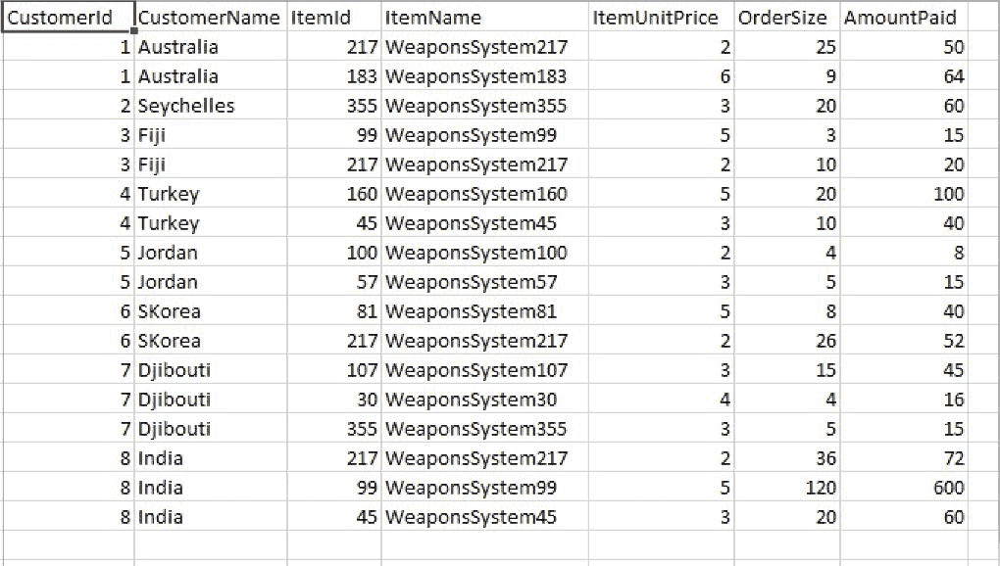

过往销售数据记录

在我们描述字段中的数据之前，我们需要一个代表该数据集中字段的模式：

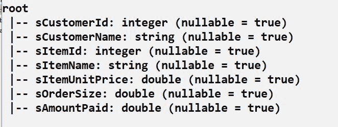

数据集中字段的表示

有七个列，其中前两列代表客户数据。以下按字母顺序列出八个客户：

1.  **澳大利亚**—客户 #1

1.  **塞舌尔**—客户 #2

1.  **斐济**—客户 #3

1.  **土耳其**—客户 #4

1.  **约旦**—客户 #5

1.  **韩国**—客户 #6

1.  **吉布提**—客户 #7

1.  **印度**—客户 #8

接下来的两列，**ItemId**，然后是**ItemName**，代表一个武器系统。第五列存储每个武器系统单位的单价（以百万美元计）。第六列**OrderSize**中的每个数据单元格代表某个客户订购的某个武器系统的单位数量。例如，澳大利亚在过去某个时候订购了 25 单位的**WeaponsSystem217**，单价为每单位 200 万美元。

尽管这两个数据集远非全面，但它们是具有代表性的样本，足以创建我们的推荐系统。

在我们的案例中，我们正在构建一个基于过去销售订单的样本销售线索预测模型。

这里是两个数据集的一些样本记录：

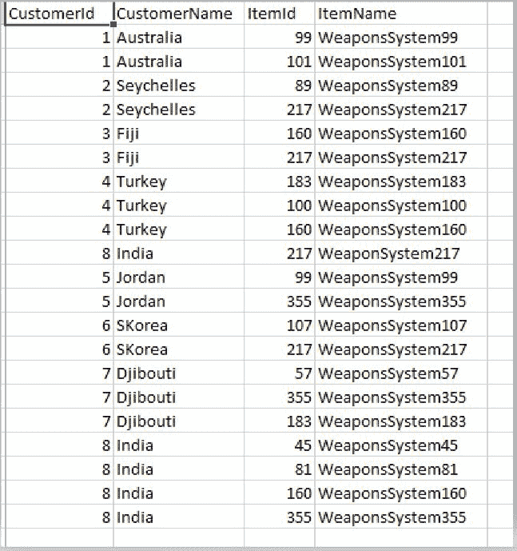

样本数据集

这两个数据集都已准备好。我们想知道如何处理这些数据，以及从这里开始下一步。我们着手整理数据，有一个直接的目标——创建一个模型，以某种方式帮助我们做出预测。当时这个目标并不那么明确。现在我们有了两个数据集，我们希望有一个明确的目标。关键在于武器销售线索数据集。如果我们想建立一个基于购买历史数据的武器销售线索模型，那会怎么样？我们过去的武器销售数据集代表了购买历史。那么，我们就有了更明确的目标——实施武器销售预测评级模型。换句话说，我们希望我们的模型能够做到以下几方面：

+   预测为每位客户推荐什么。有 8 个客户，从澳大利亚到印度不等。我们希望我们的模型只推荐适合特定客户的武器系统。适合客户的正确武器系统基于他们过去的订购情况。

+   在向每位客户提供建议时，该模型还在生成一个评级，它认为客户会给予他/她之前未购买的新产品或产品的评级。

让我们重申一下这两个数据集的共同点。第一个很简单——有一个客户，在这个案例中是一个国家。然后，有一个产品（项目），在这个案例中是武器系统。第一个数据集有如下说明：

+   有一个国家订购了一定数量的武器系统，每个这样的系统以百万美元为单位的价格。

+   第二个数据集并没有在其声明的简要说明之外揭示太多，其简要说明是提供潜在客户的列表。制造这些系统的公司决定，其中一些潜在客户不仅仅是潜在客户。

我们在这里试图说明的是，尽管这并不那么明显，但现在很清楚，数据不必揭示太多细节。客户是一个以特定价格购买了一定武器系统的国家。就是这样，但这也足够了。另一方面，武器销售线索数据讲述了一个不同类型的故事，一个未来情景的可能情景，其中一家公司，据公司估计，可能会对某种类型的武器系统表示出兴趣。

我们有关于用户和产品的数据。不是详细的信息，但显然足够。这类数据需要一个只需要提取用户和产品之间关系的算法。它只需要看到两者之间互动的证据。手头的两个数据集似乎都适合协同过滤算法。这就是为什么我们可以在下一节中开始讨论驱动协同过滤算法运作的基本机制。

# 实现和部署

以下是需要实现推荐系统所需的目标：

1.  从`ModernScalaProjects`数据文件夹下载过去的武器销售订单和武器销售线索数据集。

1.  您可以通过三种方式开发管道：

    +   在您的本地 Spark Shell 中逐步进行。

    +   推荐：在 IntelliJ 中完善你的代码，并在`build.sbt`文件中连接所有必要的依赖项。通过连接 assembly 插件来设置 SBT 以生成胖 JAR。然后，将生成的自包含 SBT 应用程序部署到您的本地 Spark 集群，使用`spark-submit`。

    +   运行应用程序并解释结果。

1.  在下一节“实现”中，我们将逐步记录实现项目的指令。

# 实现

实现将在以下子节中记录。所有代码都在 IntelliJ 代码编辑器中开发。第一步是创建一个名为`Chapter7`的空 Scala 项目。

# 第 1 步 – 创建 Scala 项目

让我们创建一个名为`Chapter7`的 Scala 项目，并具有以下工件：

+   `RecommendationSystem.scala`

+   `RecommendationWrapper.scala`

让我们分解一下项目的结构：

+   `.idea`：生成的 IntelliJ 配置文件。

+   `project`：包含`build.properties`和`plugins.sbt`。

+   `project/assembly.sbt`：此文件指定了构建部署的胖 JAR 所需的`sbt-assembly`插件。

+   `src/main/scala`：这是一个包含`com.packt.modern.chapter7`包中 Scala 源文件的文件夹。

+   `target`：这是编译过程生成的工件存储的地方。生成的 assembly JAR 文件将在这里。

+   `build.sbt`：这是主要的 SBT 配置文件。在这里指定了 Spark 及其依赖项。

在这一点上，我们将开始在 IntelliJ 代码编辑器中开发代码。我们将从`AirlineWrapper` Scala 文件开始，并以使用`spark-submit`将最终应用程序 JAR 部署到 Spark 结束。

# 第 2 步 – 创建 AirlineWrapper 定义

让我们创建`trait`定义。这个 trait 将包含`SparkSession`变量、数据集的模式定义以及构建 dataframe 的方法：

```java
trait RecWrapper {  }
```

接下来，让我们为过去的武器销售订单创建一个模式。

# 第 3 步 – 创建武器销售订单模式

让我们为过去的销售订单数据集创建一个模式：

```java
val salesOrderSchema: StructType = StructType(Array(
  StructField("sCustomerId", IntegerType,false),
  StructField("sCustomerName", StringType,false),
  StructField("sItemId", IntegerType,true),
  StructField("sItemName",  StringType,true),
  StructField("sItemUnitPrice",DoubleType,true),
  StructField("sOrderSize", DoubleType,true),
  StructField("sAmountPaid",  DoubleType,true)
))
```

接下来，让我们为武器销售线索创建一个模式。

# 第 4 步 – 创建武器销售线索模式

这里是武器销售线索数据集的模式定义：

```java
val salesLeadSchema: StructType = StructType(Array(
  StructField("sCustomerId", IntegerType,false),
  StructField("sCustomerName", StringType,false),
  StructField("sItemId", IntegerType,true),
  StructField("sItemName",  StringType,true)
))
```

接下来，让我们构建一个武器销售订单 dataframe。

# 第 5 步 – 构建武器销售订单 dataframe

让我们在`SparkSession`实例上调用`read`方法并将其缓存。我们将在`RecSystem`对象中稍后调用此方法：

```java
def buildSalesOrders(dataSet: String): DataFrame = {
  session.read
    .format("com.databricks.spark.csv")
    .option("header", true).schema(salesOrderSchema).option("nullValue", "")
    .option("treatEmptyValuesAsNulls", "true")
    .load(dataSet).cache()
}
```

接下来，让我们构建一个销售线索 dataframe：

```java
def buildSalesLeads(dataSet: String): DataFrame = {
  session.read
    .format("com.databricks.spark.csv")
    .option("header", true).schema(salesLeadSchema).option("nullValue", "")
    .option("treatEmptyValuesAsNulls", "true")
    .load(dataSet).cache()
}
```

这完成了`trait`。总体来看，它看起来是这样的：

```java
trait RecWrapper {

   1) Create a lazy SparkSession instance and call it session.
   2) Create a schema for the past sales orders dataset
   3) Create a schema for sales lead dataset
   4) Write a method to create a dataframe that holds past sales order            
      data. This method takes in sales order dataset and 
      returns a dataframe
   5) Write a method to create a dataframe that holds lead sales data

}
```

引入以下导入：

```java
import org.apache.spark.mllib.recommendation.{ALS, Rating}
import org.apache.spark.rdd.RDD
import org.apache.spark.sql.{DataFrame, Dataset, SparkSession}
```

创建一个名为`RecSystem`的 Scala 对象：

```java
object RecSystem extends App with RecWrapper {   }
```

在继续之前，引入以下导入：

```java
import org.apache.spark.rdd.RDD
import org.apache.spark.sql.DataFrame
```

在这个对象内部，首先加载过去的销售订单数据。这将是我们训练数据。按照以下方式加载销售订单数据集：

```java
val salesOrdersDf = buildSalesOrders("sales\\PastWeaponSalesOrders.csv")
```

验证模式。模式看起来是这样的：

```java
salesOrdersDf.printSchema()
root
 |-- sCustomerId: integer (nullable = true)
 |-- sCustomerName: string (nullable = true)
 |-- sItemId: integer (nullable = true)
 |-- sItemName: string (nullable = true)
 |-- sItemUnitPrice: double (nullable = true)
 |-- sOrderSize: double (nullable = true)
 |-- sAmountPaid: double (nullable = true)
```

这里是显示过去武器销售订单数据的 dataframe 的部分视图：

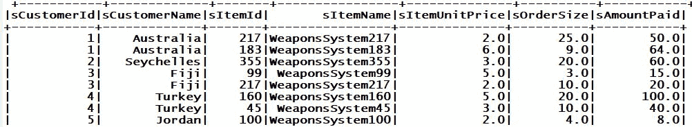

显示过去武器销售订单数据 dataframe 的部分视图

现在，我们已经有了创建评分 dataframe 所需的所有内容：

```java
 val ratingsDf: DataFrame = salesOrdersDf.map( salesOrder =>
 Rating( salesOrder.getInt(0),
 salesOrder.getInt(2),
 salesOrder.getDouble(6)
 ) ).toDF("user", "item", "rating")
```

在命令行中保存所有内容并编译项目：

```java
C:\Path\To\Your\Project\Chapter7>sbt compile
```

你很可能会遇到以下错误：

```java
[error] C:\Path\To\Your\Project\Chapter7\src\main\scala\com\packt\modern\chapter7\RecSystem.scala:50:50: Unable to find encoder for type stored in a Dataset. Primitive types (Int, String, etc) and Product types (case classes) are supported by importing spark.implicits._ Support for serializing other types will be added in future releases.
[error] val ratingsDf: DataFrame = salesOrdersDf.map( salesOrder =>
[error] ^
[error] two errors found
[error] (compile:compileIncremental) Compilation failed
```

为了解决这个问题，将以下语句放置在评分 dataframe 声明的顶部。它应该看起来像这样：

```java
import session.implicits._
 val ratingsDf: DataFrame = salesOrdersDf.map( salesOrder => UserRating( salesOrder.getInt(0), salesOrder.getInt(2), salesOrder.getDouble(6) ) ).toDF("user", "item", "rating")
```

保存并重新编译项目。这次，它编译得很好。接下来，从`org.apache.spark.mllib.recommendation`包中导入`Rating`类。这会将我们之前获得的评分 dataframe 转换为它的 RDD 等价物：

```java
val ratings: RDD[Rating] = ratingsDf.rdd.map( row => Rating( row.getInt(0), row.getInt(1), row.getDouble(2) ) )
 println("Ratings RDD is: " + ratings.take(10).mkString(" ") )
```

以下几行代码非常重要。我们将使用 Spark MLlib 中的 ALS 算法来创建和训练一个`MatrixFactorizationModel`，它需要一个`RDD[Rating]`对象作为输入。ALS 训练方法可能需要以下训练超参数的组合：

+   `numBlocks`：在自动配置设置中预设为`-1`。这个参数旨在并行化计算。

+   `custRank`：特征的数量，也称为潜在因子。

+   `iterations`：这个参数代表 ALS 执行迭代的次数。为了得到一个合理的解决方案，这个算法大约需要 20 次或更少的迭代。

+   `regParam`：正则化参数。

+   `implicitPrefs`：这个超参数是一个指定器。它允许我们使用以下任何一个：

    +   显式反馈

    +   隐式反馈

+   `alpha`：这是一个与 ALS 算法的隐式反馈变体相关的超参数。它的作用是控制对偏好观察的基线信心。

我们刚刚解释了 ALS 算法的 train 方法所需的每个参数的作用。

让我们开始引入以下导入：

```java
import org.apache.spark.mllib.recommendation.MatrixFactorizationModel
```

现在，让我们使用 ALS 算法开始训练矩阵分解模型。

让我们根据客户（用户）对某些物品（产品）的评分 RDD（弹性分布式数据集）训练一个矩阵分解模型。我们的基于 ALS 算法的 train 方法将接受以下四个参数：

+   评级。

+   一个排名。

+   迭代次数。

+   一个 Lambda 值或正则化参数：

```java
val ratingsModel: MatrixFactorizationModel = ALS.train(ratings, 
   6, /* THE RANK */ 
  10, /* Number of iterations */
  15.0 /* Lambda, or regularization parameter */
 )
```

接下来，我们加载销售线索文件并将其转换为元组格式：

```java
 val weaponSalesLeadDf = buildSalesLeads("sales\\ItemSalesLeads.csv") 
```

在下一节中，我们将显示新的武器销售线索数据框。

# 第 6 步 – 显示武器销售数据框

首先，我们必须调用`show`方法：

```java
println("Weapons Sales Lead dataframe is: ")
weaponSalesLeadDf.show 
```

这里是武器销售线索数据框的视图：

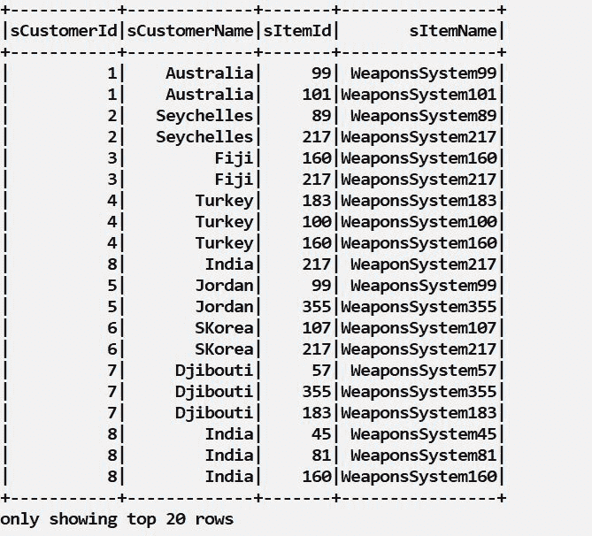

武器销售线索数据框的视图

接下来，创建一个结构为（客户，项目）元组的数据框版本：

```java
val customerWeaponsSystemPairDf: DataFrame = weaponSalesLeadDf.map(salesLead => ( salesLead.getInt(0), salesLead.getInt(2) )).toDF("user","item")
```

在下一节中，让我们显示我们刚刚创建的数据框。

# 第 7 步 – 显示客户-武器-系统数据框

让我们使用以下方式调用`show`方法：

```java
println("The Customer-Weapons System dataframe as tuple pairs looks like: ")
customerWeaponsSystemPairDf.show 
```

这里是新的客户-武器-系统数据框作为元组对的截图：

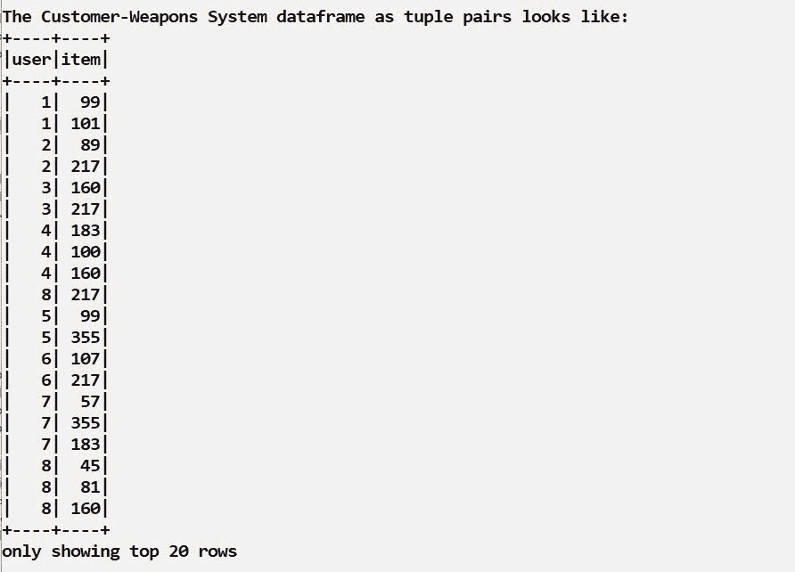

新的客户-武器-系统数据框作为元组对

接下来，我们将前面的数据框转换为 RDD：

```java
val customerWeaponsSystemPairRDD: RDD[(Int, Int)] = customerWeaponsSystemDf.rdd.map(row => 
                                                               (row.getInt(0),          
                                                                row.getInt(1)) 
                                                       )
/*
Notes: As far as the algorithm is concerned, customer corresponds to "user" and "product" or item corresponds to a "weapons system"
*/
```

我们之前创建了一个`MatrixFactorization`模型，我们使用武器系统销售订单数据集对其进行训练。我们现在可以预测每个客户国家未来可能会如何评价一个武器系统。在下一节中，我们将生成预测。

# 第 8 步 – 生成预测

这里是我们将如何生成预测。我们的模型中的`predict`方法就是为了这个目的设计的。它将生成一个名为`weaponRecs`的预测 RDD。它代表了客户国家（在过去的销售订单数据中列出）之前未评价的武器系统的评级：

```java
val weaponRecs: RDD[Rating] = ratingsModel.predict(customerWeaponsSystemPairRDD).distinct() 
```

接下来，我们将显示最终的预测。

# 第 9 步 – 显示预测

这里是如何以表格格式显示预测结果的方法：

```java
println("Future ratings are: " + weaponRecs.foreach(rating => { println( "Customer: " + rating.user + " Product:  " + rating.product + " Rating: " + rating.rating ) } ) )
```

下面的表格显示了未来每个国家预期将如何评价某个系统，即他们之前未评价的武器系统：

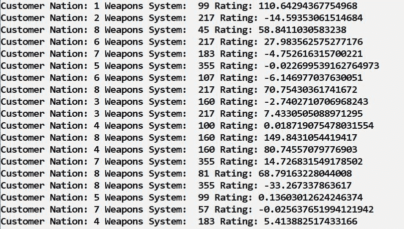

各国对系统的评级

我们的推荐系统证明了其生成未来预测的能力。

到目前为止，我们还没有说明如何编译和部署所有前面的代码。我们将在下一节中探讨这个问题。

# 编译和部署

编译和部署的步骤如下：

1.  编译

1.  构建推荐系统应用程序的 assembly JAR 文件

1.  使用`spark-submit`命令部署推荐系统应用程序

我们首先编译项目。

# 编译项目

在`Chapter7`项目的根目录中调用`sbt compile`项目。你应该会得到以下输出：

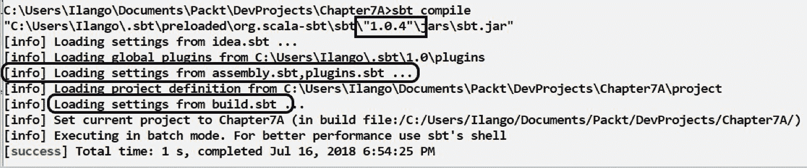

编译项目的输出

除了加载`build.sbt`，编译任务还从`assembly.sbt`加载设置，这是我们尚未讨论过的文件，但我们将很快创建它。

# 什么是`assembly.sbt`文件？

我们尚未讨论`assembly.sbt`文件。我们的基于 Scala 的 Spark 应用程序是一个 Spark 作业，它将被提交到（本地）Spark 集群作为一个 JAR 文件。除了 Spark 库之外，这个文件还需要包含我们的推荐系统作业成功完成所需的其他依赖项。所谓的胖 JAR（fat JAR）是指将所有依赖项捆绑在一个 JAR 文件中。为了构建这样的胖 JAR，我们需要一个`sbt-assembly`插件。这解释了为什么需要创建一个新的`assembly.sbt`和组装插件。

# 创建`assembly.sbt`

在你的 IntelliJ 项目视图中创建一个新的`assembly.sbt`，并将其保存在你的`project`文件夹下，如下所示：

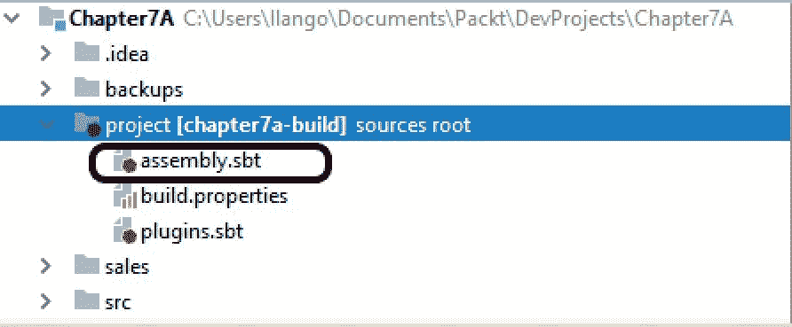

创建`assembly.sbt`

`assembly.sbt`将包含什么内容？我们将在下一节中探讨。

# `assembly.sbt`的内容

将以下内容粘贴到新创建的`assembly.sbt`文件中（位于项目文件夹下）。输出应如下所示：

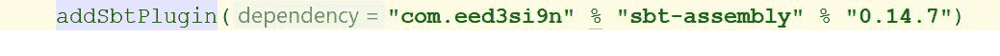

将`assembly.sbt`内容放置后的输出

`sbt-assembly`插件，版本 0.14.7，为我们提供了运行`sbt-assembly`任务的能力。有了这个，我们就更接近于构建一个胖 JAR 或 Uber JAR 了。这一操作将在下一步中记录。

# 运行`sbt assembly`任务

发出`sbt assembly`命令，如下所示：

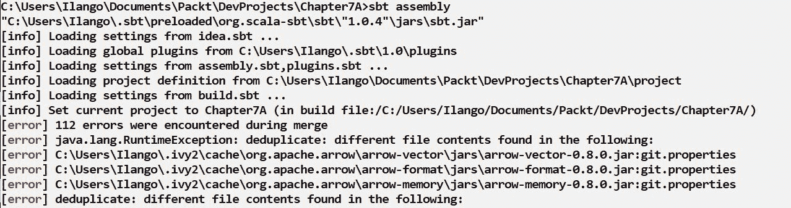

运行`sbt assembly`命令

这次，组装任务在`assembly.sbt`中加载了`assembly-plugin`。然而，由于一个常见的重复错误，进一步的组装操作停止了。这个错误是由于几个重复项引起的，需要移除多个依赖文件的副本，组装任务才能成功完成。为了解决这个问题，需要升级`build.sbt`。

# 升级`build.sbt`文件

需要在以下代码行中添加，如下所示：

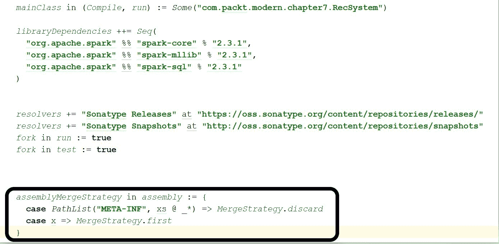

升级`build.sbt`文件的代码行

要测试更改的效果，保存此文件并转到命令行重新执行`sbt assembly`任务。

# 重新运行组装命令

按如下方式运行组装任务：

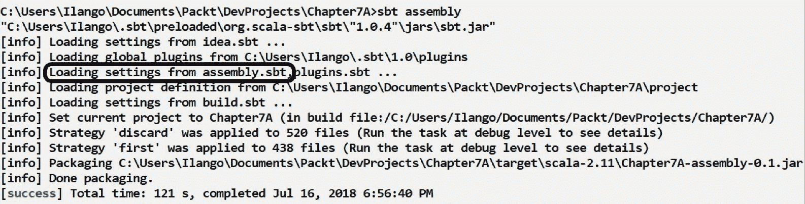

重新运行组装任务

这次，`assembly.sbt`文件中的设置被加载。任务成功完成。为了验证，深入到`target`文件夹。如果一切顺利，你应该看到一个胖 JAR，如下所示：

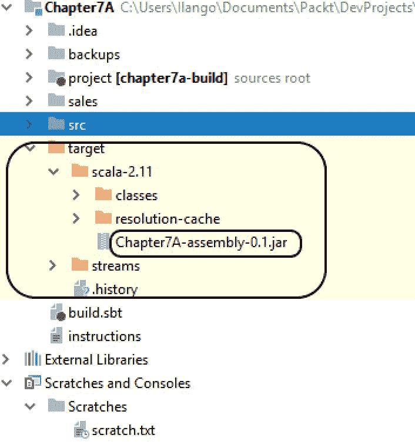

作为 JAR 文件的输出

我们在`target`文件夹下的 JAR 文件是需要部署到 Spark 的推荐系统应用的 JAR 文件。这将在下一步中说明。

# 部署推荐应用

`spark-submit`命令是我们将应用程序部署到 Spark 的方式。以下是`spark-submit`命令的两种格式。第一个是一个较长的格式，它设置的参数比第二个多：

```java
spark-submit --class "com.packt.modern.chapter7.RecSystem" --master local[2] --deploy-mode client --driver-memory 16g -num-executors 2 --executor-memory 2g --executor-cores 2  <path-to-jar>
```

借助于前面的格式，让我们提交我们的 Spark 作业，向其提供各种参数：

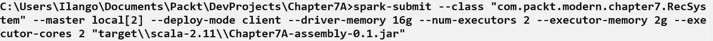

Spark 的参数

不同的参数解释如下：

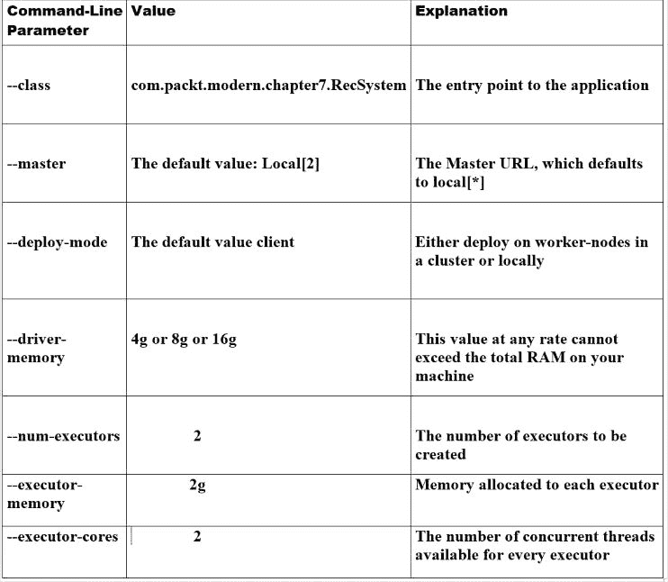

Spark 作业参数的表格说明

# 摘要

我们学习了如何构建显式反馈类型的推荐系统。我们使用 Spark MLlib 协同过滤算法实现了一个预测模型，该模型从历史销售数据中学习，并为顾客提供基于评分的产品推荐。正如我们所知，该算法根据未知顾客-产品交互定制了其产品预测。

我们利用 Spark 对推荐的支持构建了一个预测模型，该模型根据销售线索和过去武器销售数据为未知顾客-产品交互生成推荐。我们利用 Spark 的交替最小二乘算法实现我们的协同过滤推荐系统。
