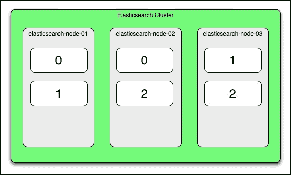
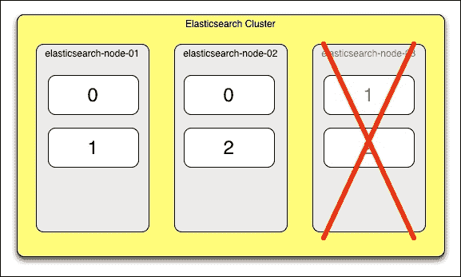
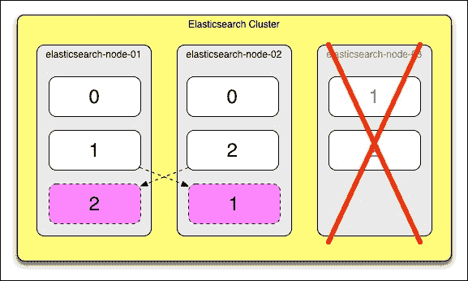
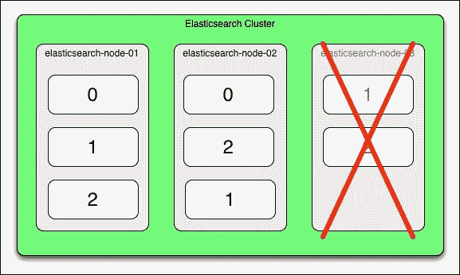

# 第一章：Elasticsearch 监控简介

Elasticsearch 是一个分布式且水平可扩展的全文搜索引擎，具有内置的数据冗余。它是一个强大且极其有用的工具。然而，与任何分布式系统一样，随着节点和数据量的增加，可能会出现问题。

Elasticsearch 监控工具提供的信息可以极大地提高您解决集群问题的能力，从而显著提高集群的可靠性和性能。本章概述了 Elasticsearch，并讨论了为什么以及如何监控集群。

具体来说，本章涵盖了以下主题：

+   Elasticsearch 概述

+   监控 Elasticsearch

+   资源丰富和问题解决

# Elasticsearch 概述

本节提供了 Elasticsearch 的高级概述，并讨论了一些相关的全文搜索产品。

## 了解更多关于 Elasticsearch 的信息

Elasticsearch 是一个基于 Apache Lucene 构建的免费开源全文搜索引擎。开箱即用，Elasticsearch 支持水平扩展和数据冗余。2010 年发布后，Elasticsearch 迅速在全文搜索领域获得了认可。其可伸缩性功能帮助该工具在 Apache Solr 等类似技术中获得了市场份额。

Elasticsearch 是一个持久化文档存储和检索系统，它类似于数据库。然而，它在许多方面与 MySQL、PostgreSQL 和 Oracle 等关系型数据库不同：

+   **分布式**：Elasticsearch 在多个数据节点上存储数据和执行查询。这提高了可伸缩性、可靠性和性能。

+   **容错**：数据在 Elasticsearch 集群的多个节点之间进行复制，因此如果一个节点宕机，数据仍然可用。

+   **全文搜索**：Elasticsearch 建立在 Lucene 全文搜索技术之上，这使得它能够理解和搜索自然语言文本。

+   **JSON 文档存储**：Elasticsearch 将文档存储为 JSON，而不是存储在表的行中。

+   **NoSQL**：Elasticsearch 使用基于 JSON 的查询语言，而不是 SQL 查询语言。

+   **非关系型**：与关系型数据库不同，Elasticsearch 不支持跨表的*连接*。

+   **分析**：Elasticsearch 具有内置的分析功能，例如单词聚合、地理空间查询和脚本语言支持。

+   **动态映射**：在 Elasticsearch 中，*映射*类似于关系型数据库世界中的*模式*。如果一个文档字段的 数据类型没有明确定义，Elasticsearch 会动态地为它分配一个类型。

## 数据分布、冗余和容错

*图 1.1*至*图 1.4*解释了 Elasticsearch 如何在多个节点之间分配数据以及它如何自动从节点故障中恢复：



图 1.1：Elasticsearch 数据分布

在这个图中，我们有一个由三个节点组成的 Elasticsearch 集群：`elasticsearch-node-01`、`elasticsearch-node-02`和`elasticsearch-node-03`。我们的数据索引被分成三部分，称为**分片**。这些分片被标记为`0`、`1`和`2`。每个分片都进行了复制；这意味着所有分片都有一个冗余副本。集群被涂成绿色，因为集群处于良好状态；所有数据分片和副本都是可用的。

假设`elasticsearch-node-03`主机发生硬件故障并关闭。以下图示显示了在此场景下集群会发生什么：



图 1.2：节点故障

*图 1.2*显示了`elasticsearch-node-03`发生故障，集群进入`黄色`状态。这种状态意味着集群中至少有一个分片的副本是活跃的，但并非所有分片副本都是活跃的。在我们的例子中，`1`和`2`分片的副本在失败的节点`elasticsearch-node-03`上。`黄色`状态还警告我们，如果发生另一个硬件故障，可能并非所有数据分片都将可用。

当`elasticsearch-node-03`节点宕机时，Elasticsearch 将自动在剩余的节点上重新构建`1`和`2`分片的冗余副本；在我们的例子中，这是`elasticsearch-node-01`和`elasticsearch-node-02`。这在下图中显示：



图 1.3：集群恢复中

一旦 Elasticsearch 完成数据副本的重建，集群再次进入`绿色`状态。现在，所有数据和分片都可以用于查询。



图 1.4：集群恢复

在*图 1.3*和*1.4*中展示的集群恢复过程在 Elasticsearch 中是自动发生的。不需要额外的配置或用户操作。

## 全文搜索

**全文**搜索指的是对自然语言文本文档执行关键字查询。文档可以是任何东西，例如报纸文章、博客文章、论坛帖子或推文。实际上，许多流行的报纸、论坛和社交媒体网站，如《纽约时报》、Stack Overflow 和 Foursquare，都使用 Elasticsearch。

假设我们要将以下文本字符串存储在 Elasticsearch 中：

```java
We demand rigidly defined areas of doubt and uncertainty!
```

用户可以通过使用关键字，如*需求*或*怀疑*，在 Elasticsearch 中进行搜索以找到此文档。Elasticsearch 还支持词干提取。这意味着如果我们搜索单词*define*，Elasticsearch 仍然会找到此文档，因为*defined*的词根是*define*。

这段文本以及一些额外的元数据可以按照以下方式存储在 Elasticsearch 中，格式为 JSON：

```java
{
    "text" : "We demand rigidly defined areas of doubt and uncertainty!",
    "author" : "Douglas Adams",
    "published" : "1979-10-12",
    "likes" : 583,
    "source" : "The Hitchhiker's Guide to the Galaxy",
    "tags" : ["science fiction", "satire"]
}
```

如果我们让 Elasticsearch 动态地为这个文档分配一个映射（想想*模式*），它看起来会是这样：

```java
{
    "quote" : {
        "properties" : {
            "author" : {
                "type" : "string"
            },
            "likes" : {
                "type" : "long"
            },
            "published" : {
                "type" : "date",
                "format" : "strict_date_optional_time||epoch_millis"
            },
            "source" : {
                "type" : "string"
            },
            "tags" : {
                "type" : "string"
            },
            "text" : {
                "type" : "string"
            }
        }
    }
}
```

注意，Elasticsearch 能够识别出`published`字段看起来像日期。

搜索此文档的 Elasticsearch 查询如下所示：

```java
{
    "query" : {
        "query_string" : {
            "query" : "demand rigidly"
        }
    },
    "size" : 10
}
```

关于 Elasticsearch 映射和搜索 API 的详细信息超出了本书的范围，但你可以通过以下链接的官方 Elasticsearch 文档了解更多信息：

+   **Elasticsearch** **映射**：[`www.elastic.co/guide/en/elasticsearch/reference/current/mapping.html`](https://www.elastic.co/guide/en/elasticsearch/reference/current/mapping.html)

+   **Elasticsearch 搜索** **API**：[`www.elastic.co/guide/en/elasticsearch/reference/current/search-search.html`](https://www.elastic.co/guide/en/elasticsearch/reference/current/search-search.html)

### 注意

Elasticsearch 不应成为你的主要数据存储。它不提供传统 SQL 数据存储的**原子性、一致性、隔离性和持久性**（**ACID**）保证，也不提供其他 NoSQL 数据库（如 HBase 或 Cassandra）的可靠性保证。尽管 Elasticsearch 具有内置的数据冗余和容错能力，但最佳实践是在单独的数据存储中存档数据，以便在需要时将数据重新索引到 Elasticsearch 中。

## 相似的技术

本节解释了众多开源全文搜索引擎中的一些，并讨论了它们与 Elasticsearch 的匹配情况。

### Apache Lucene

Apache Lucene ([`lucene.apache.org/core/`](https://lucene.apache.org/core/)) 是一个开源的全文搜索 Java 库。如前所述，Lucene 是 Elasticsearch 的底层搜索技术。Lucene 还提供了 Elasticsearch 的分析功能，如文本聚合和地理空间搜索。如果你在 Java 中进行小规模的全文搜索，或者正在构建自己的全文搜索引擎，直接使用 Apache Lucene 是一个不错的选择。

使用 Elasticsearch 而不是 Lucene 的好处如下：

+   使用 REST API 而不是 Java API

+   JSON 文档存储

+   水平可扩展性、可靠性和容错性

另一方面，Lucene 更加轻量级和灵活，可以构建需要从头开始集成全文搜索的定制应用程序。

### 注意

Lucene.NET 是 C#编写的库的流行.NET 版本

### Solr

Solr 是建立在 Apache Lucene 之上的另一个全文搜索引擎。它具有与 Elasticsearch 相似的搜索、分析和扩展能力。对于大多数需要全文搜索引擎的应用程序，选择 Solr 和 Elasticsearch 主要取决于个人喜好。

### Ferret

Ferret 是一个用于 Ruby 的全文搜索引擎。它与 Lucene 类似，但功能不如 Lucene 丰富。它通常更适合那些不需要搜索引擎（如 Elasticsearch 或 Solr）的强大（或复杂）功能的应用程序。

# 监控 Elasticsearch

监控分布式系统很困难，因为随着节点数量、用户数量和数据量的增加，问题将会开始出现。

此外，错误可能不会立即明显。通常，集群会继续运行并尝试自动从错误中恢复。如前所述的 *图 1.2*、*1.3* 和 *1.4* 所示，一个节点失败了，但 Elasticsearch 在我们没有采取任何行动的情况下将自己恢复到了 `绿色` 状态。除非进行监控，否则此类故障可能会被忽视。这可能会对系统性能和可靠性产生不利影响。节点越少，处理查询的能力就越弱，并且，如前例所示，如果另一个节点失败，我们的集群将无法返回到 `绿色` 状态。

我们希望跟踪的 Elasticsearch 集群方面包括以下内容：

+   集群健康和数据可用性

+   节点故障

+   Elasticsearch JVM 内存使用情况

+   Elasticsearch 缓存大小

+   系统利用率（CPU、内存和磁盘）

+   查询响应时间

+   查询速率

+   数据索引时间

+   数据索引速率

+   索引和分片数量

+   索引和分片大小

+   系统配置

在这本书中，我们将讨论如何理解这些变量在上下文中的含义，以及理解它们如何帮助我们诊断、恢复和预防集群中的问题。当然，不可能预先阻止所有 Elasticsearch 错误。然而，通过积极监控我们的集群，我们将对何时出现问题有一个很好的了解，并能够更好地采取纠正措施。

在接下来的章节中，我们将讨论从基于网络的集群监控工具到 Unix 命令行工具和日志文件监控的所有内容。本书涵盖的一些特定工具如下：

+   Elasticsearch-head

+   Bigdesk

+   Marvel

+   Kopf

+   Kibana

+   Nagios

+   Unix 命令行工具

这些工具将为我们提供有效诊断、解决和预防 Elasticsearch 问题所需的信息。

# 资源丰富性和问题解决能力

监控工具可以很好地告诉你集群中正在发生什么，并且它们经常可以指出是否存在问题。然而，这些工具不会给你一个解决问题的方案。解决问题需要批判性思维、关注细节和坚持不懈。本书讨论的一些问题解决主题如下：

+   总是尝试重现问题

+   时刻留意配置和用户错误

+   在测试之前，只做一次配置更改

本书还提供了一些实际案例研究，帮助您将监控工具提供的信息转化为解决 Elasticsearch 问题的见解。

# 摘要

本章为您概述了 Elasticsearch 以及为什么需要积极监控集群。为了总结本章要点：

+   Elasticsearch 是一个开源的、可扩展的、快速且容错的搜索引擎

+   Elasticsearch 是建立在 Apache Lucene 之上的，Apache Solr 同样使用这个库

+   监控工具将帮助我们更好地了解我们的集群，并让我们知道何时出现问题时

+   监控工具虽然很有帮助，但真正诊断和修复集群问题还得靠我们自己

在下一章中，我们将介绍如何启动一个简单的 Elasticsearch 集群并加载数据，以及如何安装几个监控工具。
