# 第三章 Elasticsearch-head 和 Bigdesk

本章讨论了 Elasticsearch 监控插件 Elasticsearch-head 和 Bigdesk，以及 Elasticsearch cat API。这些实用工具用于评估集群状态和诊断问题：

+   **Elasticsearch-head**：此工具用于了解集群的整体健康状况、单个节点状态以及理解您的索引

+   **Bigdesk**：此工具用于查看集群中各个节点的内存、磁盘和 CPU 使用情况

+   **Elasticsearch cat API**：此 API 允许您在不安装任何插件的情况下访问 Elasticsearch 的许多内部指标

具体来说，本章探讨了以下内容：

+   配置 Elasticsearch 集群

+   将示例数据加载到 Elasticsearch 中

+   使用 Elasticsearch-head

+   使用 Bigdesk

+   Elasticsearch cat API

# 集群设置

本节介绍配置一个三节点 Elasticsearch 集群并将其加载 Twitter 数据的过程。

## 集群配置

设置 Elasticsearch 集群很简单。集群中的所有节点应位于同一本地网络，并安装了相同版本的 Java 和 Elasticsearch。对于我们的集群，我们将使用三个 Ubuntu Linux 14.04 虚拟主机：`elasticsearch-node-01`、`elasticsearch-node-02`和`elasticsearch-node-03`。

在所有主机上安装 Elasticsearch 后，按照以下方式更新每个主机的`elasticsearch.yml`配置文件：

+   `elasticsearch-node-01`的配置如下：

    ```java
    cluster.name: my_elasticsearch_cluster
    node.name: "elasticsearch-node-01"
    discovery.zen.ping.multicast.enabled: false
    discovery.zen.ping.unicast.hosts: ["elasticsearch-node-02", "elasticsearch-node-03"]
    index.routing.allocation.disable_allocation: false
    cluster.routing.allocation.enable : all
    ```

+   `elasticsearch-node-02`的配置如下：

    ```java
    cluster.name: my_elasticsearch_cluster
    node.name: "elasticsearch-node-02"
    discovery.zen.ping.multicast.enabled: false
    discovery.zen.ping.unicast.hosts: ["elasticsearch-node-01", "elasticsearch-node-03"]
    index.routing.allocation.disable_allocation: false
    cluster.routing.allocation.enable : all
    ```

+   `elasticsearch-node-03`的配置如下：

    ```java
    cluster.name: my_elasticsearch_cluster
    node.name: "elasticsearch-node-03"
    discovery.zen.ping.multicast.enabled: false
    discovery.zen.ping.unicast.hosts: ["elasticsearch-node-01", "elasticsearch-node-02"]
    index.routing.allocation.disable_allocation: false
    cluster.routing.allocation.enable : all
    ```

接下来，按照前一章中的说明，在集群中的所有节点上安装 Elasticsearch-head。

现在，重新启动所有节点，通过访问`http://elasticsearch-node-01:9200/_plugin/head/`的 Elasticsearch-head 来验证集群是否正确形成。

您应该看到类似以下内容，其中列出了集群的所有节点在左侧列：

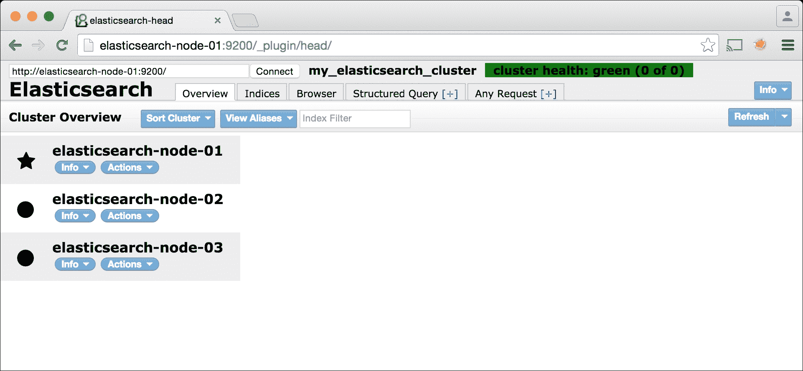

## 示例数据

现在我们已经有一个集群在运行，让我们用 Twitter 数据填充它。我们使用 Twitter 数据作为示例，因为它容易大量获取，并且它是一个持续流动的信息流，类似于许多现实世界的数据集。

使用 Elasticsearch 的`stream2es`实用工具获取 Twitter 数据。此实用工具可在[`github.com/elastic/stream2es`](https://github.com/elastic/stream2es)找到：

1.  如果您已经有了 Twitter 账户，请创建一个新的 Twitter 账户或登录您的 Twitter 账户。

1.  在[`support.twitter.com/articles/110250`](https://support.twitter.com/articles/110250)将您的手机号码与账户关联。

1.  在[`apps.twitter.com/app/new`](https://apps.twitter.com/app/new)创建一个新的 Twitter 应用程序。

    ### 小贴士

    对于*网站*，如果您没有域名，可以放置一个占位符值，例如`http://example.com`。

1.  在 **密钥和访问令牌** 选项卡中记下你的 **消费者密钥（API 密钥）** 和 **消费者密钥（API 密钥）**：

    ```java
    ./stream2es twitter --authorize --key CONSUMER_KEY --secret CONSUMER_SECRET
    ```

1.  授权应用。

1.  输入验证码。

1.  创建 Twitter 映射：

    ```java
    curl -XPUT 'http://localhost:9200/twitter/' -d '{
     "settings" : {
     "index" : {
     "number_of_shards" : 3,
     "number_of_replicas" : 1
     }
     }
    }'

    ```

1.  收集推文：

    ```java
    ./stream2es twitter --target http://localhost:9200/twitter/status --settings '{
     "settings" : {
     "index" : {
     "number_of_shards" : 3,
     "number_of_replicas" : 2
     }
     }
    }'

    ```

1.  查看正在进入的推文：

    ```java
    curl -XGET "http://localhost:9200/twitter/_search?size=0&pretty"

    ```

    在让 `stream2es` 运行一段时间后，我们得到以下结果：

    ```java
    {
     "took" : 63,
     "timed_out" : false,
     "_shards" : {
     "total" : 3,
     "successful" : 3,
     "failed" : 0
     },
     "hits" : {
     "total" : 150765,
     "max_score" : 0.0,
     "hits" : [ ]
     }
    }

    ```

现在我们已经用一些示例数据填充了我们的集群，我们可以讨论如何使用 Elasticsearch-head、Bigdesk 和 Elasticsearch cat API。

# Elasticsearch-head

在 第二章 中，我们介绍了并安装了 Elasticsearch-head，现在我们将开始检查其功能。

## 概览选项卡

在 Elasticsearch-head 中的第一个选项卡是 **概览** 选项卡。此选项卡回答以下问题：

+   集群中有多少个节点？

+   集群是否处于健康状态？

+   是否所有集群数据都可用？

+   集群中有多少个索引，它们有多大？

+   集群中有多少数据？

用户还可以使用此选项卡执行一些基本的行政操作（创建索引、删除索引等）。

在加载了上一节中的示例 Twitter 数据后，我们的 **概览** 选项卡看起来如下：

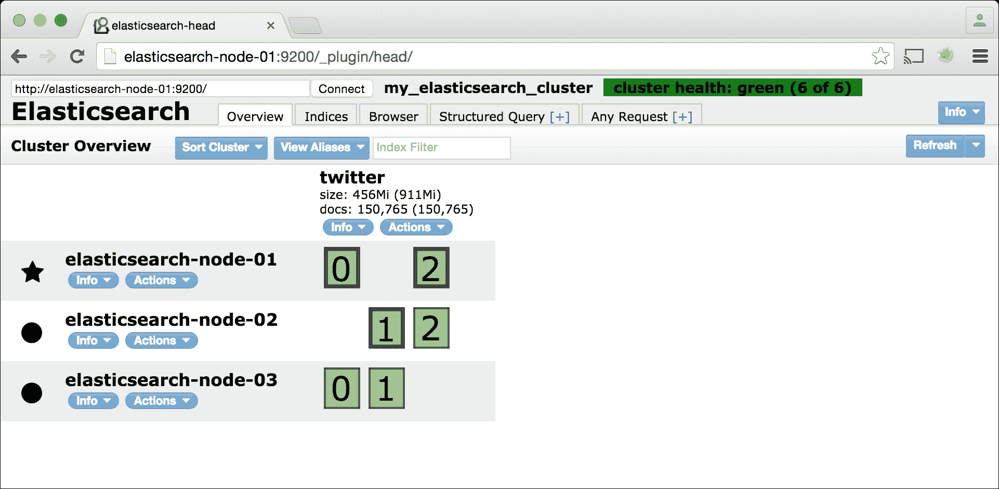

我们可以看到有三个节点正在运行：

+   `elasticsearch-node-01`

+   `elasticsearch-node-02`

+   `elasticsearch-node-03`

我们还有一个包含我们新加载的 Twitter 数据的活跃索引。从这一页，我们可以得知以下信息：

+   Twitter 索引占用 456 MB

+   Twitter 索引包含 150,765 个文档

## 集群状态

一个 Elasticsearch 集群可以处于以下三种状态之一：

+   **绿色**：所有数据都可用，所有分片副本都已分配。

    ### 注意

    之前的截图显示我们目前处于 `绿色` 状态。

+   **黄色**：所有数据都可用，但并非所有副本都已分配：

    +   这通常发生在只有一个节点的集群中，当你有大于 *0* 的副本大小时，或者在多节点集群中，节点宕机后立即发生。

    +   如果你的集群中某个节点宕机，在所有副本分片重新分配后，`黄色` 状态会自行解决。

    +   Elasticsearch 将在默认的 1 分钟等待时间后自动尝试重新分配分片，以查看有问题的节点是否重新出现。

+   **红色**：并非所有数据都可用，并非所有分片都已分配。

    +   这种状态需要立即关注。这通常是由于集群中同时发生多个节点故障，例如同时重启、电源故障或网络故障所引起的。

    +   解决这种状态的最佳方法是让集群中所有宕机的节点重新启动。

    +   注意，即使在 `红色` 状态下，Elasticsearch 仍然会返回查询结果。然而，查询计数将不准确。

为了演示目的，我们将关闭 `elasticsearch-node-02` 和 `elasticsearch-node-03`，以了解集群在不同状态下的样子：

+   关闭`elasticsearch-node-02`:

    ```java
    ssh elasticsearchn-node-02
    sudo /etc/init.d/elasticsearch stop

    ```

+   刷新 Elasticsearch-head。我们应该看到类似以下的内容：

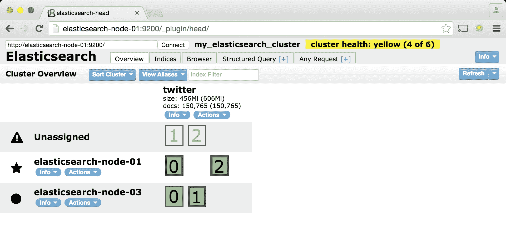

注意，`elasticsearch-node-02`不再存在，并且集群处于`黄色`状态。

记住，`黄色`状态表示所有数据仍然可用。更多的节点故障可能会导致`红色`状态或数据不可用。

等待几分钟之后，Elasticsearch 将开始将这些分片重新分配到剩余的主机：

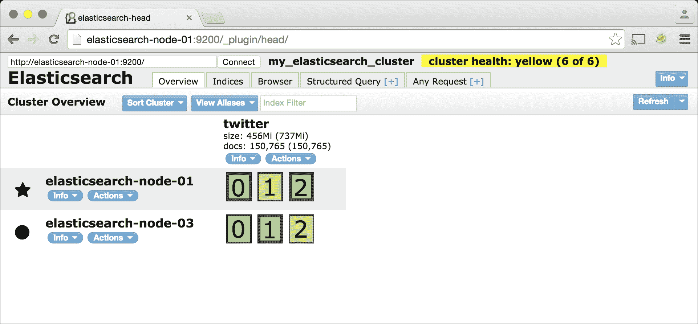

在重新分配完成后，集群将恢复到`绿色`状态：

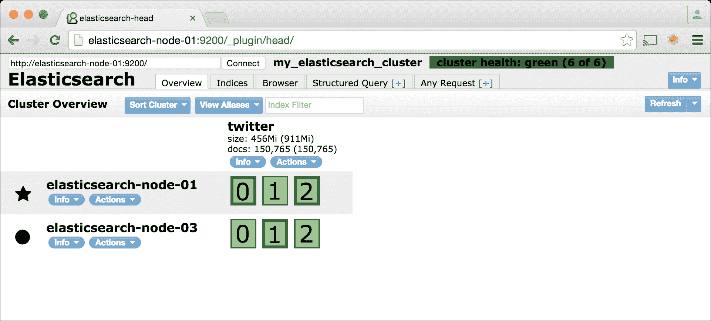

让我们进行实验，将集群状态转换为`红色`：

1.  将`elasticsearch-node-02`重新启动，并等待直到`elasticsearch-node-02`分配了几个分片。

1.  一旦发生这种情况，关闭`elasticsearch-node-02`和`elasticsearch-node-03`，不要给集群时间重新分配分片。

1.  您可以在 Elasticsearch-head 中选择每个相应节点旁边的**关闭**操作，或者通过命令行进行：

    ```java
    ssh elasticsearchn-node-02
    sudo /etc/init.d/elasticsearch stop
    ssh elasticsearchn-node-03
    sudo /etc/init.d/elasticsearch stop

    ```

1.  关闭这些节点并刷新 Elasticsearch-head 后，我们会看到类似以下的内容：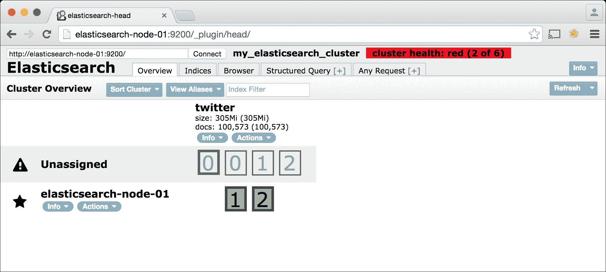

1.  注意，只有 Twitter 索引中的`1`和`2`分片被分配，而分片`0`是未分配的。因此，索引大小和文档数量分别从 456 MB 减少到 305 MB，从 150,765 减少到 100,573。

1.  一旦我们重启`elasticsearch-node-02`和`elasticsearch-node-03`，集群将恢复并返回到`绿色`状态。

## 节点和索引操作

在每个节点和索引的名称旁边，您会看到标记为**信息**和**操作**的下拉菜单。这些下拉菜单中的每个链接都对应于各种 Elasticsearch API 调用：

+   **信息**链接会返回所有包含有关您的索引或节点状态的详细信息的**JSON**文档

+   **操作**链接提供了方便的方法来操作您的集群

下面的表格将更详细地介绍这些链接中的每一个：

| 目标（索引或节点） | 类型（操作或信息） | 名称（例如，“节点状态”） | Elasticsearch API 方法 | 描述 |
| --- | --- | --- | --- | --- |
| 节点 | **信息** | **集群节点信息** | `GET /_nodes` | 这提供了节点的 Elasticsearch 配置、已安装的插件以及服务器可用的内存、CPU 和磁盘空间。 |
| 节点 | **信息** | **节点状态** | `GET /_nodes/stats?all=true` | 这提供了存储在节点上的 Elasticsearch 文档的数量和统计信息。还提供了 JVM、网络和文件系统指标。 |
| 节点 | **操作** | **关闭** | `POST /_cluster/nodes/<NODE_ID>/_shutdown` | 这将在指定的节点上关闭 Elasticsearch 进程。 |
| 索引 | **信息** | **索引状态** | `GET /_status` | 这提供了有关指定索引的信息，例如状态、文档数量、大小以及各种其他指标。 |
| 索引 | **信息** | **索引元数据** | `GET /_cluster/state` | 这提供了索引的映射、别名和设置。 |
| 索引 | **操作** | **新建别名...** | `POST /_aliases` | 这将创建一个新的索引别名。 |
| 索引 | **操作** | **刷新** | `POST /<INDEX_NAME>/_refresh` | 这将刷新索引。 |
| 索引 | **操作** | **刷新** | `POST /<INDEX_NAME>/_flush` | 这将刷新索引。 |
| 索引 | **操作** | **优化...** | `POST /<INDEX_NAME>/_optimize` | 这将优化索引。 |
| 索引 | **操作** | **网关快照** | `POST /<INDEX_NAME>/_gateway/snapshot` | 这将获取索引的快照。 |
| 索引 | **操作** | **测试分析器** | `GET /<INDEX_NAME>/_analyze?text=TEXT` | 这将使用索引的默认文本分析器分析传入的文本。 |
| 索引 | **操作** | **关闭** | `POST /<INDEX_NAME>/_analyze` | 这将关闭一个打开的索引。 |
| 索引 | **操作** | **打开** | `POST /<INDEX_NAME>/_open` | 这将打开一个关闭的索引。 |
| 索引 | **操作** | **删除** | `POST /<INDEX_NAME>/_delete` | 这将删除索引。 |

### 备注

刚才列出的**信息**操作（**集群节点信息**、**节点统计**、**索引状态**和**索引元数据**）提供了大量关于集群状态和数据持有情况的信息。然而，查看这些项目的 JSON 响应可能会有些令人眼花缭乱。

Bigdesk 是我们将在本章中探讨的下一个工具。Bigdesk 和我们在下一章将要探讨的工具 Marvel 都采用了许多这些指标，并以易于阅读的图表和图形的形式展示出来。

## 索引标签页

**索引**标签页提供了集群中索引的列表、它们的磁盘大小使用情况和每个索引中的文档数量。它也是一种创建新索引的方式。

### 备注

此标签页不提供关于索引的任何额外信息，除了在**概览**标签页中提供的信息。

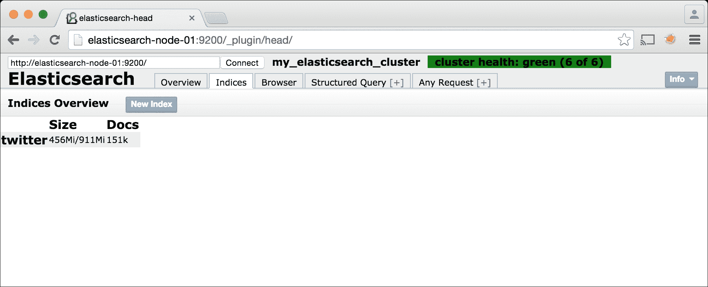

## 浏览器标签页

此标签页允许你浏览、查看和运行基本过滤查询，针对索引中的文档。以下截图是**浏览器**标签页中文档视图的一个示例：

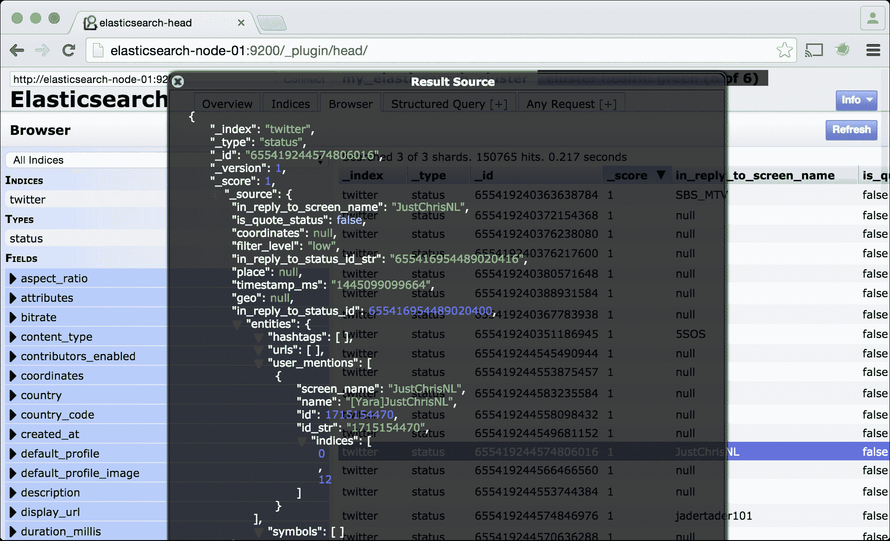

## 结构化查询标签页

**结构化查询**标签页是一个高级查询构建器，用于探索索引中的文档。当你想要构建一个复杂的查询而不需要写出完整的 JSON 请求体时，此标签页非常有用。

以下截图显示了使用此界面创建的示例查询和结果：

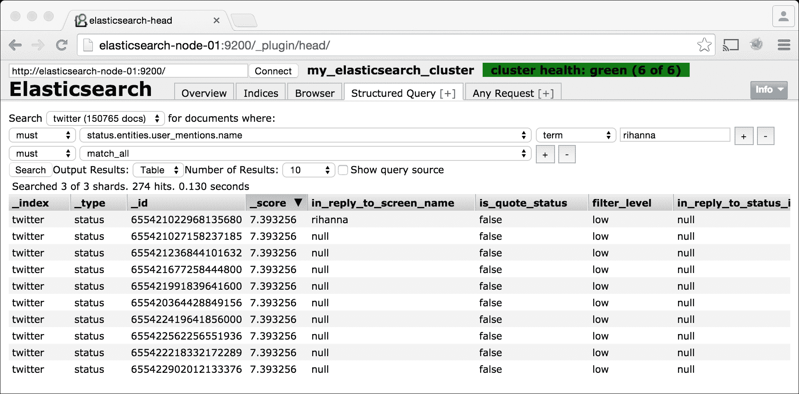

## 任意请求标签页

**任意请求**标签页允许你在集群上运行任意的**API**调用，并在**JSON**中查看结果。以下截图显示了示例聚合查询：

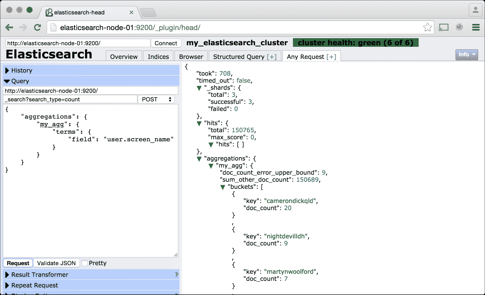

## 官方网站

想要了解更多关于 Elasticsearch-head 的信息，请访问插件网站[`mobz.github.io/elasticsearch-head/`](https://mobz.github.io/elasticsearch-head/)。

# Bigdesk

Bigdesk 是一个用于查看集群的各个 JVM 和操作系统级别指标的工具。如果你的集群运行缓慢或遇到异常错误，Bigdesk 是一个检查任何异常的好地方。

在遵循上一章的安装说明后，通过访问`http://elasticsearch-node-01:9200/plugin/bigdesk/`来访问 Bigdesk。初始着陆页面看起来如下：

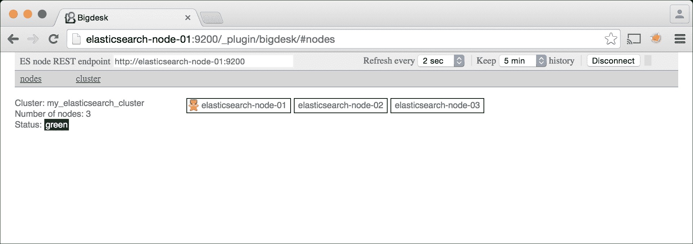

类似于 Elasticsearch-head，这个页面显示了你的集群节点和集群健康状态。点击顶部行中列出的任何节点以显示其单个指标：

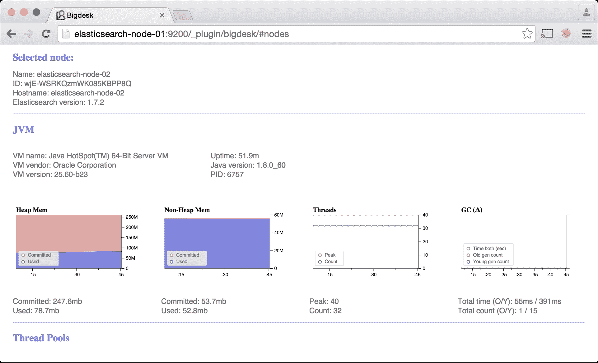

在此截图中，我们选择了`elasticsearch-node-02`并正在查看**JVM**指标。本节中的一个显著图表是**Heap Mem**。如果你接近最大已提交堆内存量，你将希望通过将`ES_HEAP_SIZE`设置为最多你可用内存的一半来增加你的堆内存。

在下面，我们可以看到操作系统指标，具体如下：

+   CPU 使用率

+   内存使用

+   交换空间使用

+   平均负载

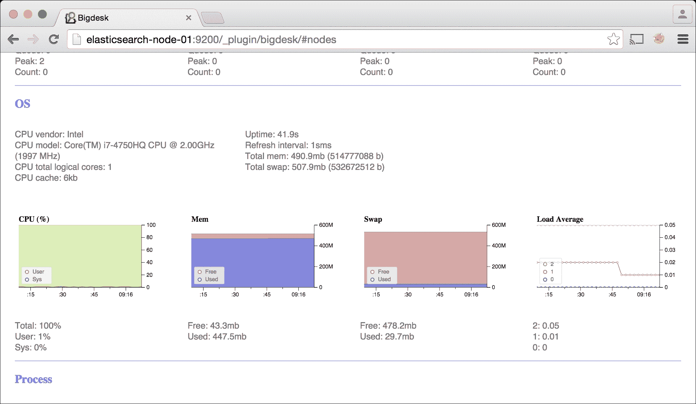

在操作系统指标下方，我们来到进程级别指标，包括以下内容：

+   打开的文件描述符

+   进程内存使用

+   CPU 使用率

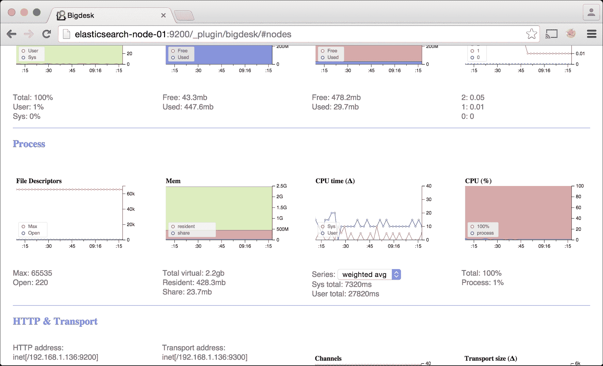

如果你在经历慢查询或慢数据索引操作时，可以参考操作系统和进程指标图表，以了解性能瓶颈。

继续向下滚动页面，我们会看到一些更显著的图表，包括：

+   缓存大小

+   索引操作

+   文件系统活动

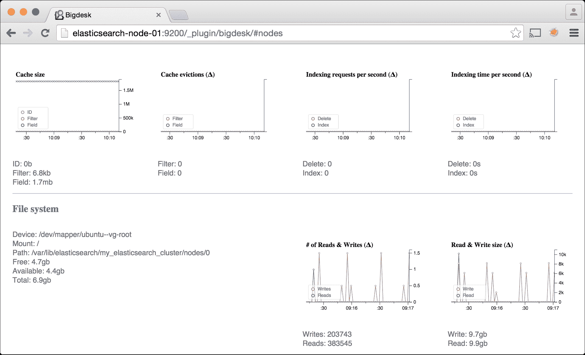

**缓存大小**图表是此截图中的重要数据。根据你运行的查询类型，**ID**、**Filter**和**Field**缓存可能会填满。如果它们变得过大，检查你的查询以进行可能的修改，以保持缓存大小。

Bigdesk 图表对于查找配置错误也很有用。例如，如果我们打算将我们的节点配置为使用`32GB`的内存和最多`65535`个打开的文件描述符，但**JVM Heap Mem**图表只显示`247MB`的已提交内存，而**Process File Descriptors**图表显示文件限制为`1024`，我们将知道我们没有正确配置节点。

### 注意

想了解更多关于 Bigdesk 的信息，请访问插件网站[`bigdesk.org/`](http://bigdesk.org/)。

# Elasticsearch cat API

将**Elasticsearch cat API**视为前面提到的**Elasticsearch Cluster**和**Indices APIs**的简化版本。cat API 以易于阅读、以制表符分隔的格式返回结果，与集群和索引 API 返回的 JSON 不同。

API 方法的完整列表可在[`www.elastic.co/blog/introducing-cat-api`](https://www.elastic.co/blog/introducing-cat-api)找到，但以下是一些亮点，我们将在以下部分进行介绍。

## 背景

Elasticsearch-head 和 Bigdesk 主要由 Elasticsearch API 驱动：

+   **集群** **API**: [`www.elastic.co/guide/en/elasticsearch/reference/1.7/cluster.html`](https://www.elastic.co/guide/en/elasticsearch/reference/1.7/cluster.html).

+   **索引** **API**: [`www.elastic.co/guide/en/elasticsearch/reference/1.7/indices.html`](https://www.elastic.co/guide/en/elasticsearch/reference/1.7/indices.html).

这两个 API 提供了大量关于 Elasticsearch 内部工作原理的信息。然而，它们也返回了复杂的 *JSON* 文档，难以快速解读。例如，以下是调用索引统计 API 的一个片段：

```java
curl -XGET "http://elasticsearch-node-01:9200/_stats?pretty"
{
 ...
 "_all" : {
 "primaries" : {
 "store" : {
 "size_in_bytes" : 477638305,
 "throttle_time_in_millis" : 0
 },
 ...

```

很可能不会立即清楚 `size_in_bytes` 的 `477638305` 值等于 455 MB。

## 计数

此端点提供整个集群的文档计数：

```java
curl -XGET http://elasticsearch-node-01:9200/_cat/count?v

```

这给出了输出：

```java
epoch      timestamp count
1445910583 21:49:43  150765

```

### 注意

将 `v` 选项传递给 cat API 会显示标题行。

输出列表示以下内容：

+   `epoch`: 这表示 Unix 时间戳

+   `timestamp`: 这表示一天中的时间

+   `count`: 这表示集群中的文档数量

## 健康

此端点显示集群的健康颜色代码：

```java
curl -XGET http://elasticsearch-node-01:9200/_cat/health?v

```

这给出了输出：

```java
epoch      timestamp cluster                    status node.total node.data shards pri relo init unassign pending_tasks 
1445910646 21:50:46  my_elasticsearch_cluster green           3         3      6   3    0    0        0 
 0 

```

这些列表示以下内容：

+   `epoch`: 这表示 Unix 时间戳

+   `timestamp`: 这表示一天中的时间

+   `cluster`: 这表示集群名称

+   `status`: 这表示集群状态（`green`、`yellow` 或 `red`）

+   `node.total`: 这表示集群中的节点数量

+   `node.data`: 这表示集群中的数据节点数量

+   `shards`: 这表示集群中总分片数量

+   `pri`: 这表示主分片数量（与副本分片相对）

+   `relo`: 这表示当前正在重新定位的分片数量

+   `init`: 这表示当前正在初始化的分片数量

+   `unassign`: 这表示未分配分片数量

+   `pending_tasks`: 这表示集群任务队列中的任务数量

## 索引

此端点提供集群中所有索引的列表、文档计数和大小：

```java
curl -XGET http://elasticsearch-node-01:9200/_cat/indices?v

```

这给出了输出：

```java
health status index pri rep docs.count docs.deleted store.size pri.store.size 
green  open   twitter   3   1     150765            0      911mb        455.5mb 

```

此输出为集群中的每个索引一行。输出列表示以下内容：

+   `health`: 这是索引健康状态（`green`、`yellow` 或 `red`）

+   `status`: 这表示索引是打开还是关闭

+   `index`: 这是索引名称

+   `pri`: 这是主分片数量

+   `rep`: 这是复制级别（`1` 表示所有分片都复制一次）

+   `docs.count`: 这是此索引中的文档数量

+   `docs.deleted`: 这是已删除文档的数量

+   `store.size`: 这是总索引大小

+   `pri.store.size`: 这是索引（无副本）的大小

## 分片

此端点提供索引分片列表及其分布情况：

```java
curl -XGET http://elasticsearch-node-01:9200/_cat/shards?v

```

这给出了输出：

```java
index   shard prirep state    docs   store ip           node 
twitter 0     r      STARTED 50192 150.2mb 127.0.1.1    elasticsearch-node-03 
twitter 0     p      STARTED 50192 150.2mb 192.168.56.1 elasticsearch-node-01 
twitter 1     p      STARTED 50305   152mb 127.0.1.1    elasticsearch-node-03 
twitter 1     r      STARTED 50305   152mb 127.0.1.1    elasticsearch-node-02 
twitter 2     p      STARTED 50268 153.2mb 127.0.1.1    elasticsearch-node-02 
twitter 2     r      STARTED 50268 153.2mb 192.168.56.1 elasticsearch-node-01 

```

此输出中的每一行代表集群中的一个单个分片。列表示以下内容：

+   `index`: 这是索引名称

+   `shard`: 这是碎片编号

+   `prirep`: 如果是主碎片则为`p`，如果是副本则为`r`

+   `state`: 这是碎片的可用性

+   `docs`: 这是该碎片中的文档数量

+   `store`: 这是碎片在磁盘上的大小

+   `ip`: 这是碎片所在的服务器 IP 地址

+   `node`: 这是碎片所在的服务器名称

# 摘要

本章讨论了如何配置和将数据加载到三节点 Elasticsearch 集群中。此外，还介绍了如何使用 Elasticsearch-head、Bigdesk 和 cat API 监控集群。

下一章将讨论 Marvel——官方 Elasticsearch 监控工具。
