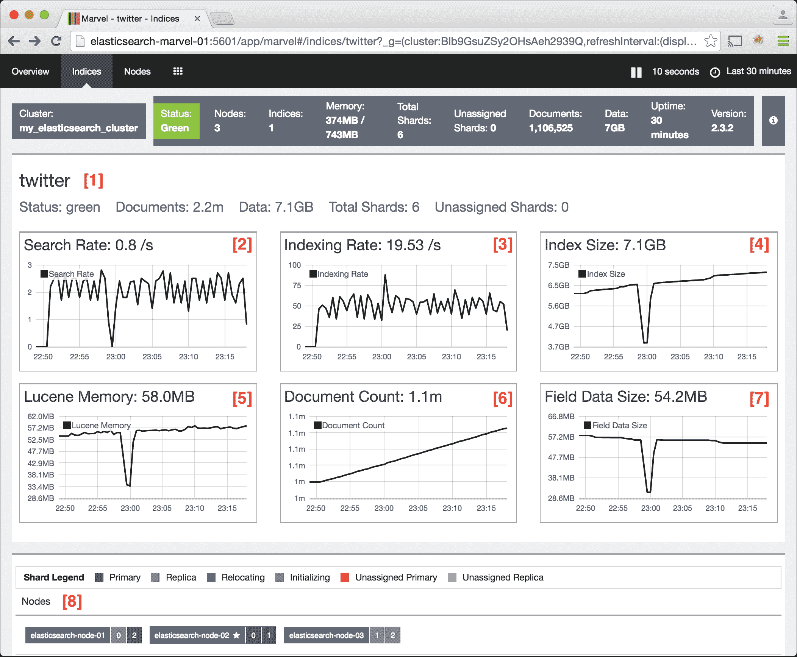

# 第四章 Marvel 仪表板

前两章介绍了 Elasticsearch-head 和 Bigdesk，这两个开源监控工具。本章将介绍 Marvel，这是一个用于监控 Elasticsearch 的非免费工具。

与 Elasticsearch-head 和 Bigdesk 不同，Marvel 会持续捕获并保存性能指标到一个索引中。这使得用户可以参考历史数据进行分析，而不仅仅是实时数据分析。在本章中，我们将更详细地探讨以下主题：

+   设置 Marvel

+   升级 Marvel

+   配置 Marvel

+   Marvel 索引配置

+   Marvel 仪表板

+   监控节点故障

# 设置 Marvel

有关如何安装 Marvel 代理和 Marvel Kibana 仪表板的说明，请参阅第二章，*Elasticsearch 的安装和需求*。

Marvel 将其指标数据存储在 Elasticsearch 中。有可能将这些指标与生产数据存储在同一个 Elasticsearch 集群中；然而，这是不可取的，因为：

+   Marvel 的数据索引可能会变得非常大，在生产环境中，你不会希望这些索引影响你的主集群的性能。

+   如果主集群遇到问题，将 Marvel 放在单独的集群中将允许你更容易地诊断这些问题。

+   如果 Marvel 运行在普通数据节点上，它可能会意外地被配置为收集其自己的指标索引上的数据。例如，如果你登录到 Marvel 仪表板并开始查询 Marvel 索引，这些查询将被记录回 Marvel 索引。这可能不是预期的行为。

由于这些原因，本章介绍了如何设置一个单独的 Elasticsearch 集群来存储 Marvel 指标数据。我们上一章中的主 Elasticsearch 集群包含三个数据节点：`elasticsearch-node-01`、`elasticsearch-node-02`和`elasticsearch-node-03`。我们将添加一个新的集群，包含一个 Elasticsearch 节点来存储 Marvel 的数据。

按照以下步骤创建一个新的 Elasticsearch 集群来存储 Marvel 数据：

1.  在一个名为`elasticsearch-marvel-01`的新主机上，按照第二章中的说明，使用*Elasticsearch 的安装和需求*安装 Elasticsearch 2.3.2。

1.  通过编辑`elasticsearch.yml`配置文件来配置 Elasticsearch，使其看起来像这样：

    ```java
    index.routing.allocation.disable_allocation: false
    cluster.routing.allocation.enable : all
    marvel.agent.enabled: false
    cluster.name: my_monitoring_cluster
    node.name: elasticsearch-marvel-01
    bootstrap.mlockall: true
    discovery.zen.ping.multicast.enabled: false

    ```

1.  在`elasticsearch-marvel-01`上安装 Elasticsearch-head:

    ```java
     sudo /usr/share/elasticsearch/bin/plugin 
     install mobz/elasticsearch-head

    ```

1.  在三个主要 Elasticsearch 节点（`elasticsearch-node-01`、`elasticsearch-node-02`和`elasticsearch-node-03`）上安装 Marvel 代理。登录到每个主机并运行以下命令来安装 Marvel：

    ```java
     sudo /usr/share/elasticsearch/bin/plugin install license
     sudo /usr/share/elasticsearch/bin/plugin install marvel-agent

    ```

    ### 小贴士

    如第二章中所述，确保在安装 Marvel 后重启每个节点，以便启动 Marvel 代理。

1.  将以下配置行添加到原始三个 `elasticsearch-node-0*` 节点上的 `elasticsearch.yml`：

    ```java
    marvel.agent.exporters:
     my_monitoring_cluster:
     type: http
     host: ["http://elasticsearch-marvel-01:9200"]

    ```

1.  对于具有三个节点的较大 Marvel 集群，例如，配置行可能看起来像这样：

    ```java
    marvel.agent.exporters:
     my_monitoring_cluster:
     type: http
     host: ["elasticsearch-marvel-01:9200", "elasticsearch-marvel-02:9200", "elasticsearch-marvel-03:9200"]

    ```

1.  根据 第二章 中找到的说明，在 `elasticsearch-marvel-01` 上安装 Kibana 和 Marvel Kibana 插件，*Elasticsearch 的安装和需求*。

1.  通过编辑 `config/kibana.yml` 来配置 Marvel Kibana 插件，使其看起来像这样：

    ```java
    server.port: 5601
    server.host: "0.0.0.0"
    elasticsearch.url: http://elasticsearch-marvel-01:9200

    ```

1.  使用以下命令从 Kibana 安装目录启动 `elasticsearch-marvel-01` 上的 Kibana：

    ```java
    bin/kibana

    ```

    此命令的输出应如下所示：

    

1.  通过访问 `http://elasticsearch-marvel-01:5601/app/marvel` 在浏览器中访问 `elasticsearch-marvel-01` 上的 Marvel 仪表板，如以下截图所示：

1.  滚动页面并单击 **显示历史记录** 或 **隐藏历史记录** 按钮（如下一张截图所示）以查看 `twitter` 索引的分片活动：

1.  在 `elasticsearch-marvel-01` 上打开 Elasticsearch-head 并通过访问 `http://elasticsearch-marvel-01:9200/_plugin/head/` 查看 Marvel 自动创建的索引：

`.marvel-2015.12.20` 索引包含 Marvel 收集的历史数据。默认情况下，Marvel 每天创建一个新的索引来存储其数据。

### 注意

**服务器时间同步**

所有 Elasticsearch 主机上的时钟必须同步，否则 Marvel 不会显示任何数据。时钟同步取决于服务器配置。在 Ubuntu 主机集群上，请在所有节点上运行以下命令以同步它们的时钟：

```java
sudo ntpupdate pool.ntp.org

```

# 升级 Marvel

Marvel 可以滚动升级。这意味着节点是一个接一个地升级，而不是必须关闭整个集群以执行升级。对于具有监控集群和生产集群的环境，请在升级生产集群之前先在监控集群上升级 Marvel。

要升级 Marvel Agent，请在监控集群（在这种情况下，仅为 `elasticsearch-marvel-01`）的所有节点上运行以下步骤，然后对于生产集群（`elasticsearch-node-01`、`elasticsearch-node-02` 和 `elasticsearch-node-03`）中的每个节点：

1.  可选：在所有节点上禁用分片分配。

    ### 小贴士

    禁用分片分配将使升级更快，因为当节点因升级而关闭时，集群不会尝试将分片重新分配到其他节点。

    运行以下命令：

    ```java
    curl -XPUT elasticsearch-host-01:9200/_cluster/settings 
    -d '{
     "transient" : {
     "cluster.routing.allocation.enable" : "none"
     }
     }' 

    ```

1.  停止 Elasticsearch：

    ```java
    sudo /etc/init.d/elasticsearch stop

    ```

1.  删除旧的 Marvel 插件：

    ```java
    bin/plugin remove marvel-agent

    ```

1.  安装新的 Marvel 插件：

    ```java
    plugin install marvel-agent 

    ```

1.  启动 Elasticsearch：

    ```java
    sudo /etc/init.d/elasticsearch start 

    ```

1.  检查日志以查找错误：

    ```java
    tail -f /var/log/elasticsearch/*

    ```

1.  一旦集群中的所有节点都升级完成，重新启用分片分配：

    ```java
    curl -XPUT elasticsearch-host-01:9200/_cluster/settings -d '{ 
     "transient" : { 
     "cluster.routing.allocation.enable" : "all" 
     } 
    }'

    ```

1.  对生产集群重复所有这些步骤。

    要升级 Marvel Kibana 仪表板，请在 `elasticsearch-marvel-01` 上运行以下命令

1.  使用以下命令卸载旧的 Marvel Kibana 插件：

    ```java
    bin/kibana plugin --remove marvel

    ```

1.  安装新的 Marvel Kibana 插件。在此示例中，我们升级到 Marvel 2.3.2：

    ```java
    bin/kibana plugin install marvel
    /2.3.2

    ```

# 配置 Marvel

本节介绍如何配置 Marvel 代理和数据索引。具体来说，我们包括：

+   设置 Marvel 数据存储位置

+   指定要监控的索引

+   安全设置

+   数据导出频率

+   Marvel 索引配置

## Marvel 代理配置设置

本节介绍如何配置 Marvel 代理。通过编辑每个我们监控的节点上的 `elasticsearch.yml` 文件来配置代理。

`marvel.agent.exporters` 设置确定代理将把其指标发送到何处。默认情况下，Marvel 代理将导出数据到它安装上的同一个 Elasticsearch 实例。在我们的示例集群中，我们导出数据到 `elasticsearch-marvel-01`，配置值看起来像这样：

```java
marvel.agent.exporters:
  my_monitoring_cluster:
    type: http
    host: ["http://elasticsearch-marvel-01:9200"]
```

`marvel.agent.exporters` 设置的其他选项包括：

```java
marvel.agent.exporters:
  your_exporter_name:
    type: http # Set to local or http
    host: [ "http://host-01:9200", "http://host-02:9200" ]
    # List of hosts to send data to over http or https

    auth:
      username: basic_auth_username # optional           
      password: basic_auth_password # optional

    connection:
      timeout: 6s # optional: connection timeout 
      read_timeout: 60s # optional: response timeout.
      keep_alive: true # persistent connections 

    ssl:
      hostname_verification: true # https only: verify host certificate
      protocol: TLSv1.2 # https only: protocol
      truststore.path: /path/to/file # https only:  
.jks truststore
      truststore.password: password # https only: .jks truststore password
      truststore.algorithm: SunX509 # https only: .jks truststore algorithm

    index:
      name:
        time_format: YYYY.MM.dd 
        # marvel index suffix.  
        # Set to a value like YYYY.MM to create new 
        # indices monthly instead of daily
```

其他 `elasticsearch.yml` 配置选项在此处描述：

| 选项 | 默认值 | 描述 |
| --- | --- | --- |
| `marvel.enabled` | `true` | 控制是否从该节点导出监控数据。 |
| `marvel.agent.interval` | `10s` | 监控数据导出的时间间隔。可以设置为 `-1` 以完全禁用数据导出。 |
| `marvel.agent.indices` | `_all List of` | 从中导出数据的索引。支持通配符 `*`、添加 `+` 和减去 `-` 操作符。例如，要仅从以 `twitter_` 开头的节点导出数据，但排除索引 `twitter_development`，我们将此参数设置为 `+twitter_*,-twitter_development`。 |
| `marvel.agent.cluster.state.timeout` | `10m` | 收集集群状态的超时时间。 |
| `marvel.agent.cluster.stats.timeout` | `10m` | 收集集群统计信息超时时间。 |
| `marvel.history.duration` | `7d` | Marvel 索引保留的时间长度。`marvel-agent` 将自动删除超过此值的旧索引。设置为 `-1` 以禁用自动索引删除。 |

在对 `elasticsearch.yml` 进行任何更改后，重新启动 Elasticsearch：

```java
sudo /etc/init.d/elasticsearch restart

```

# Marvel 索引配置

本节介绍如何配置 Marvel 使用的分片数、副本数以及其他索引设置。默认情况下，每个 Marvel 索引使用一个分片和一个副本：

1.  要查看 Marvel 使用的默认设置，请运行：

    ```java
    curl -XGET "http://elasticsearch-marvel-01:9200/_template/marvel?pretty"

    ```

    这将返回一个大的 JSON 对象。重要的设置包括 `marvel.order`、`marvel.template` 和 `marvel.settings`：

    ```java
    {
     "marvel" : {
     "order" : 0,
     "template" : ".marvel*",
     "settings" : {
     "index.mapper.dynamic" : "true",
     "index.marvel.index_format" : "6",
     "index.analysis.analyzer.default.type" : "standard",
     "index.number_of_replicas" : "1",
     "index.number_of_shards" : "1",
     "index.analysis.analyzer.default.stopwords" : "_none_"
     },
     ...
    }

    ```

1.  对于大型 Marvel 集群，考虑将分片数增加到不超过集群中主机数的数量以获得最佳性能。例如，对于四节点 Marvel 监控集群，使用以下命令将分片数增加到四个：

    ```java
    curl -XPOST  "http://elasticsearch-marvel-01:9200/_template/marvel_01?pretty" -d '{
     "template": ".marvel*",
     "order": 1,
     "settings": {
     "number_of_shards": 4
     }
    }'

    ```

### 注意

注意模板设置为`.marvel*`，以便仅更改 Marvel 的索引。此外，`order`设置为`1`，因此此模板`marvel_01`将比默认模板`marvel`具有更高的优先级。

现在，当检查 Marvel 设置时，我们应该看到：

```java
curl -XGET "http://elasticsearch-marvel-01:9200/_template/marvel_01?pretty"
{
 "marvel_01" : {
 "order" : 1,
 "template" : ".marvel*",
 "settings" : {
 "index.number_of_shards" : "4"
 },
 "mappings" : { },
 "aliases" : { }

}
}

```

# 理解 Marvel 仪表板

本节介绍如何使用 Marvel 仪表板更好地了解集群的状态。

为了使监控我们的集群更有趣，我们将使用`stream2es`程序将更多 Twitter 数据流式传输到其中，并使用本节中描述的自定义 bash 脚本对索引运行随机查询。

查看第三章，*Elasticsearch-head 和 Bigdesk*，获取有关如何安装和使用`stream2es`的详细说明，但为了快速参考，请使用以下命令启动`stream2es`：

```java
./stream2es twitter --target http://elasticsearch-node-01:9200/twitter/status

```

接下来，我们将通过运行针对`twitter`索引的随机查询来模拟用户交互。创建一个名为`run_queries.sh`的新 bash 脚本，内容如下：

```java
#!/bin/sh

# Path to dictionary file
DICTIONARY_PATH=/usr/share/dict/words
ELASTICSEARCH_URI=http://elasticsearch-node-01:9200/twitter

# Total dictionary words
TOTAL_WORDS=`wc -l $DICTIONARY_PATH | awk '{print $1}'`

while :
do
    # Pick a random word
    WORD_INDEX=`python -c "import random;print random.randint(1,$TOTAL_WORDS)"`
    WORD=`sed "${WORD_INDEX}q;d" $DICTIONARY_PATH`

    # Run query
    echo "Querying elasticsearch $ELASTICSEARCH_URI for $WORD "
    curl -XGET "${ELASTICSEARCH_URI}/_search?q=$WORD"

    # Sleep for one second before running the next query
    echo
    echo "Press [CTRL+C] to stop.."
    sleep 1
done
```

此脚本每秒查询 Elasticsearch 的`twitter`索引，使用随机字典单词。

### 注意

您可能需要在某些 Linux 系统上安装字典才能使此功能正常工作。在 Ubuntu 上，要获取美式英语或英式英语单词的字典，请运行以下命令。

对于美式英语：

```java
sudo apt-get install wamerican

```

对于英式英语：

```java
sudo apt-get install wbritish

```

现在使`run_queries.sh`脚本可执行：

```java
chmod +x run_queries.sh

```

最后，运行`run_queries.sh`脚本，每秒对集群进行随机查询。

```java
./run_queries.sh

```

运行`stream2es`和`run_queries.sh`几分钟之后，打开 Marvel 并导航到概览仪表板，以探索这些脚本对我们集群的影响。

## 概览仪表板

**概览**仪表板是 Marvel Kibana 仪表板的登录页面。运行`stream2es`命令和前面提到的`run_queries.sh`脚本几分钟之后，此仪表板看起来可能如下所示：


这是前一张截图中的标签：

| No. | 描述 |
| --- | --- |
| **1** | 仪表板标题。 |
| **2** | 其他 Marvel 仪表板。 |
| **3** | 页面自动刷新间隔。 |
| **4** | 时间过滤器。默认为**过去 1 小时**。 |
| **5** | 包括集群状态、节点数量、总内存和文档数量的集群信息。 |
| **6** | 当前和历史搜索速率。示例用例：查看搜索流量如何影响集群。 |
| **7** | 当前和历史搜索延迟。示例用例：诊断查询运行缓慢的原因。 |
| **8** | 当前和历史索引速率。示例用例：诊断为何批量索引操作失败。 |
| **9** | 当前和历史索引延迟。示例用例：诊断索引操作为何缓慢。 |
| **10** | 分片活动。在分片恢复时提供分片的状态。 |

### 注意

注意，`run_queries.sh`每秒只运行一个查询，但**搜索请求率**图表显示平均每秒大约有三个查询。这是因为每次运行查询时，实际上是在针对所有三个数据节点运行。**搜索请求率**图表显示了所有数据节点每秒的平均查询数。

Marvel 的任何图表都可以通过点击并拖动图表来按时间范围进行过滤，如图所示：


这里是上一张截图中的标签：

| 数量 | 描述 |
| --- | --- |
| **1** | 点击并拖动任何图表以按时间过滤图表。 |

应用过滤器后，Marvel 图表和集群信息横幅将更新以显示选定时间点的集群状态。在以下截图中，我们可以看到在选定的时间段内集群处于`黄色`状态：


## 索引仪表板

**索引**仪表板允许您检查特定索引的历史数据，包括：

+   搜索率

+   索引率

+   索引大小

+   内存

+   文档计数

+   字段数据大小

**索引**仪表板与**概览**仪表板非常相似，只是页面底部的索引列表不同，如以下截图所示：


这里是前一张截图中的标签：

| 数量 | 描述 |
| --- | --- |
| **1** | 集群中所有索引的列表。 |

点击此页面的底部`twitter`索引，将我们带到显示该特定索引历史和实时指标的页面：



这里是上一张截图中的标签：

| 数量 | 描述 |
| --- | --- |
| **1** | 索引详情。 |
| **2** | 索引的历史和实时搜索率。 |
| **3** | 历史和实时索引率。 |
| **4** | 历史和实时索引大小。 |
| **5** | 历史和实时 Lucene 内存大小。 |
| **6** | 历史和实时文档计数。 |
| **7** | 历史和实时字段数据大小。示例用例：诊断`OutOfMemoryError`异常。 |
| **8** | 此索引的分片分布。点击任何节点可转到下一节中描述的节点详情页面。 |

## 节点仪表板

**节点**仪表板提供了集群健康和节点利用情况的概览，以及特定节点的历史和实时统计数据。此仪表板用于检查 Elasticsearch 问题，例如：

+   集群中关闭的节点

+   磁盘空间不足的节点

+   CPU 和内存使用量高的节点

打开**节点**仪表板将带我们到以下页面：


此截图显示了集群中所有节点的概述，以及一些实时指标。这个页面的一个优点是，如果节点宕机，此页面将识别出该节点曾经是集群的一部分，但目前处于离线状态。另一方面，Elasticsearch-head 根本不会显示离线的节点。

点击特定的节点将打开一个仪表板，显示该主机的数据。下一张截图显示了`elasticsearch-node-02`的节点统计信息：


此页面显示了所选节点的几个历史和实时指标：

+   **搜索延迟**：对搜索性能的历史分析。

+   **索引延迟**：对数据索引性能的历史分析。

+   **JVM 堆使用率**：高堆使用率可能表明 Java `OutOfMemoryError`异常。

+   **CPU 利用率**：高 CPU 利用率可能由多种因素引起，但一些常见的原因是运行复杂的查询和分片移动。

+   **系统负载平均**：此指标是衡量节点平均工作量的指标。此值理想情况下应小于节点的 CPU 核心数。

+   **段数量**：Lucene 段的数量。这个统计数据会因集群而异，但如果值增加到高于正常水平，尝试运行集群优化。

+   **分片图例**：显示哪些分片分配给了此节点。

# 监控节点故障

如前所述，Marvel 即使在节点离开集群后也会跟踪节点。这对于需要跟踪大量节点的大型集群来说非常有用。

我们将通过关闭`elasticsearch-node-01`来演示 Marvel **节点**仪表板如何显示节点故障：

```java
# From elasticsearch-node-01
sudo service elasticsearch stop

```

Marvel 的**节点**仪表板现在看起来是这样的：


我们可以看到 Marvel 指出`elasticsearch-node-01`曾经是集群的一部分，但目前处于离线状态。

Elasticsearch-head 另一方面，显示集群处于`黄色`状态，但并未表明`elasticsearch-node-01`曾经是集群的一部分：


### 注意

Elasticsearch-head 仅显示`elasticsearch-node-02`和`elasticsearch-node-03`，不显示`elasticsearch-node-01`。

# 摘要

本章介绍了如何安装和配置 Marvel 代理以及 Marvel Kibana 仪表板。此外，还介绍了为 Marvel 设置一个二级监控集群以存储其指标的方法。最后，本章讨论了各种 Marvel Kibana 仪表板页面，并从高层次上讨论了如何使用这些页面来诊断集群问题。下一章将讨论另一个监控工具 Kopf，并更详细地介绍如何使用 Kibana。
