# 第五章. 系统监控

前两章重点介绍了 Elasticsearch 监控工具，包括 Elasticsearch-head、Bigdesk 和 Marvel。本章将介绍另一个监控工具，**Kopf**。我们还将从通用系统监控的角度讨论 **Elasticsearch、Logstash 和 Kibana**（**ELK**）、Nagios 以及各种 GNU/Linux 命令行工具。

本章涵盖以下主题：

+   使用 Kopf 监控 Elasticsearch

+   配置 Elasticsearch、Logstash 和 Kibana（ELK）堆栈以进行系统日志文件聚合和分析

+   使用 Nagios 对集群进行系统级监控

+   用于系统和进程管理的 GNU/Linux 命令行工具

# 使用 Kopf

Kopf 是一个类似于 Elasticsearch-head 的基于 Web 的集群管理工具，但外观更现代，并具有一些不同的功能。使用 Kopf，用户可以检查节点和索引的状态，运行 REST 查询，并执行基本的管理任务。

## 安装 Kopf

Kopf 支持从 Elasticsearch 0.90.x 版本开始。使用以下表格确定哪个 Kopf 版本最适合你的集群：

| Elasticsearch 版本 | Kopf 分支 |
| --- | --- |
| 0.90.x | 0.90 |
| 1.x | 1.0 |
| 2.x | 2.0 |

要安装 Kopf，请按照以下步骤操作：

1.  使用以下命令在集群中至少一个节点上安装 Kopf 作为 Elasticsearch 插件，将 `{branch}` 替换为前表中 `branch` 列的值：

    ```java
    $ sudo /usr/share/elasticsearch/bin/plugin install lmenezes/elasticsearch-kopf/{branch}

    ```

    此示例将在 `elasticsearch-node-01` 上安装 Kopf。由于此节点运行 Elasticsearch 2.3.2，命令将如下所示：

    ```java
    $ sudo /usr/share/elasticsearch/bin/plugin install lmenezes/elasticsearch-kopf/2.0

    ```

1.  要打开 Kopf，浏览到：

    ```java
    http://elasticsearch-node-01:9200/_plugin/kopf/

    ```

    你应该看到类似以下内容：

    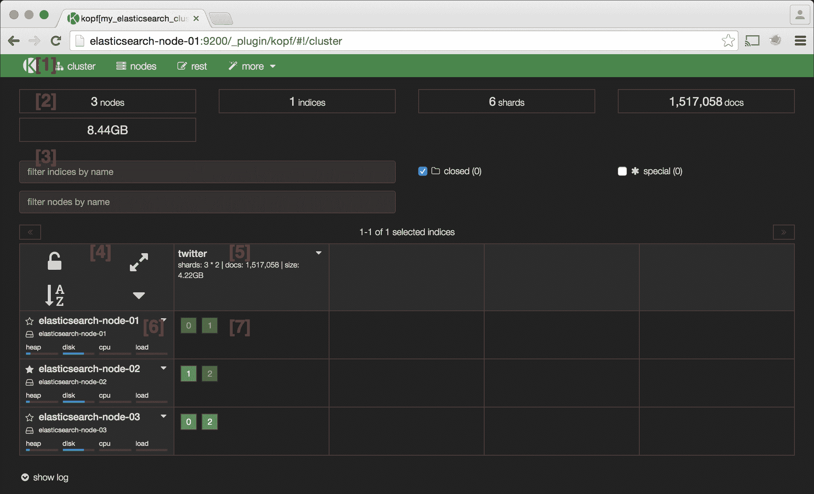

    Kopf 集群页面

    | 编号 | 描述 |
    | --- | --- |
    | **1** | 标题栏和集群状态 |
    | **2** | 集群摘要 |
    | **3** | 显示过滤器 |
    | **4** | 节点和索引操作 |
    | **5** | 索引 |
    | **6** | 节点 |
    | **7** | 分片分配 |

此页面的绿色标题栏表示集群处于 `绿色` 状态。同样，如果集群进入黄色或红色状态，标题栏将相应地变为黄色或红色。

所有 Kopf 仪表板页面也显示了此截图顶部的指标，包括节点数、索引、分片、文档和总索引大小。

### 集群页面

上一节中的截图显示了 Kopf 集群页面。Elasticsearch 集群的节点、索引和分片分配都列在此页面上。此页面还提供以下管理功能：

+   关闭和打开索引

+   优化索引

+   刷新索引

+   清除索引缓存

+   删除索引

+   禁用/启用分片分配

+   查看索引设置

+   查看索引映射

与 Elasticsearch-head 中的 **集群概览** 选项卡类似，Kopf 的 **集群** 页面是诊断 Elasticsearch 问题时的一个好起点。它将通知你集群状态，节点是否已关闭，以及节点是否有高堆/磁盘/CPU/负载。

### 节点页面

如下截图所示的 **节点** 页面提供了集群中所有节点的负载、CPU 使用率、JVM 堆使用率、磁盘使用率和运行时间：

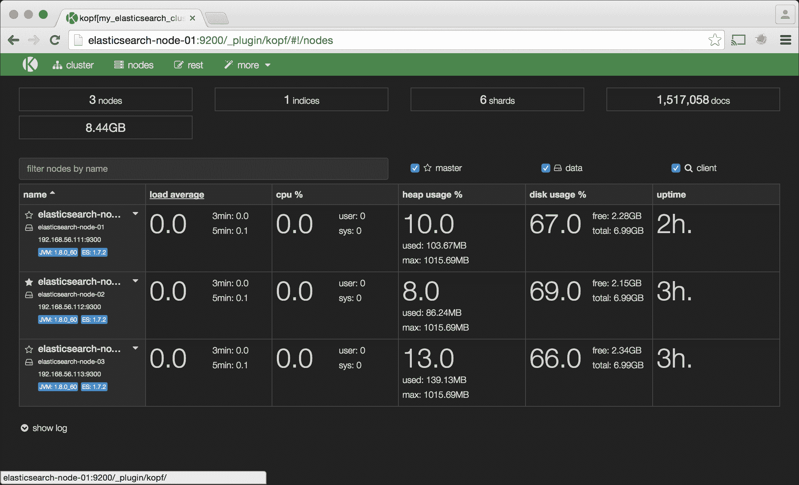

Kopf 节点页面

此页面，就像 **集群** 页面一样，是诊断 Elasticsearch 问题时的良好起点。

### rest 页面

Kopf 的 **rest** 页面是一个通用的工具，可以运行任意查询针对 Elasticsearch。您可以使用此页面运行 Elasticsearch API 中的任何查询。以下截图显示了在 Elasticsearch 集群上运行一个简单的 **搜索** **API** 查询：

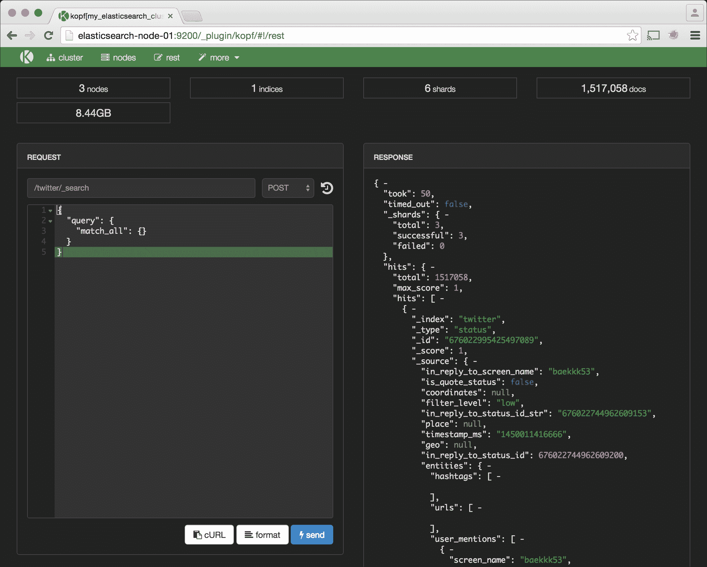

Kopf rest 页面

**rest** 页面对于从测试查询语法到检索集群指标的所有事情都很有用，并有助于衡量和优化查询性能。例如，如果某个特定查询运行缓慢，请使用 **rest** 页面测试查询的不同变体，并确定哪些查询组件具有最高的性能影响。

### **更多**下拉菜单

**更多**下拉菜单包含各种其他集群管理工具，包括：

| 工具名称 | 描述 |
| --- | --- |
| 创建索引 | 创建索引并分配一些分片、副本、映射和其他设置 |
| 集群设置 | 配置集群、路由和恢复设置 |
| 别名 | 查看现有和创建新的索引别名 |
| 分析 | 测试和验证索引分析器 |
| 过滤器 | 查看现有和创建新的过滤器查询 |
| 加热器 | 查看现有和创建新的索引加热查询 |
| 快照 | 在本地文件系统、URL、S3、HDFS 或 Azure 上创建新的索引快照 |
| 索引模板 | 查看现有和创建新的索引模板 |
| Cat API | 运行所有可能的 Elasticsearch API “Cat”方法的一个子集 |
| 热点线程 | 查询 Elasticsearch 的“热点”线程 |

以下截图显示了 **热点线程** 页面。当诊断慢速搜索和索引性能时，此页面非常有用：

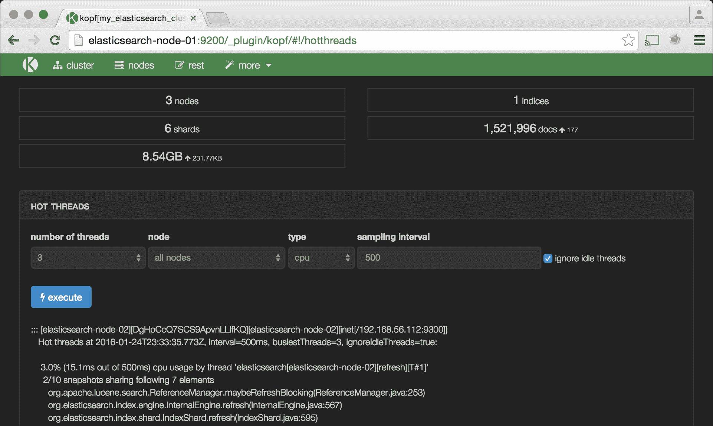

热点线程

# 使用 Logstash 和 Kibana

Logstash 是一个用于从不同来源聚合和标准化日志文件并将其存储在 Elasticsearch 集群中的实用工具。一旦日志存储在 Elasticsearch 中，我们将使用 Kibana，这是 Marvel 用户界面所基于的工具，来查看和探索我们的聚合日志。

## ELK

Elasticsearch 社区将 Elasticsearch、Logstash 和 Kibana 工具组合称为 ELK 堆栈。本节展示了如何将 NGINX 服务器日志加载到 ELK 中，但还有许多其他潜在的使用案例。

ELK 可以帮助我们通过以下方式探索 NGINX 服务器日志：

+   随时间可视化服务器流量

+   在地图上按位置绘制服务器访问

+   通过资源扩展（HTML、JS、CSS 等）、IP 地址、字节数或用户代理字符串搜索日志

+   发现导致内部服务器错误的网络请求

+   在分布式拒绝服务攻击中寻找攻击者

ELK 的其他用途包括：

+   在 Web 应用程序中记录所有 Elasticsearch 查询以供未来性能分析

+   将服务器系统日志聚合到一个位置以进行分析和可视化

+   从数据处理或摄取管道进行日志操作以供未来分析和审计

## 安装

尽管此示例将直接将 Logstash 的聚合日志数据存储到 Elasticsearch 中，但确保这些聚合日志不会影响生产集群的性能是很重要的。为了避免这种潜在的性能问题，我们将配置 Logstash 将日志路由到辅助监控集群；在我们的案例中，这是 `elasticsearch-marvel-01` 节点。

### 安装 Logstash

Logstash 所在的主机并不重要，因为它可以将日志重定向到任何 Elasticsearch 实例。由于 Kibana 将安装在 `elasticsearch-marvel-01` 上，因此我们也将 Logstash 安装在那里：

从 `elasticsearch-marvel-01` 运行以下命令：

```java
sudo mkdir /opt/log
stash
sudo chown -R `whoami` /opt/log
stash
cd /opt/log
stash
wget https://download.elastic.co/logstash/logstash/logstash-2.1.1.t
ar.gz
tar xzvf logstash-2.1.1.t
ar.gz
cd logstash-2
.1.1/

```

### 加载 NGINX 日志

现在，让我们使用 Logstash 将一些示例 NGINX 日志加载到 Elasticsearch 中。虽然 Logstash 对许多不同的日志类型（Apache、Linux 系统日志等）具有内置的解析器，但它并不原生支持 NGINX 日志。这意味着用户必须明确告诉 Logstash 如何处理这些文件。为了解决这个问题，请按照以下步骤操作：

1.  在 `/opt/logstash/logs` 放置一些示例 NGINX 日志文件：

    ```java
    $ ls -1 /opt/logstash/logs | head –n20

    ```

    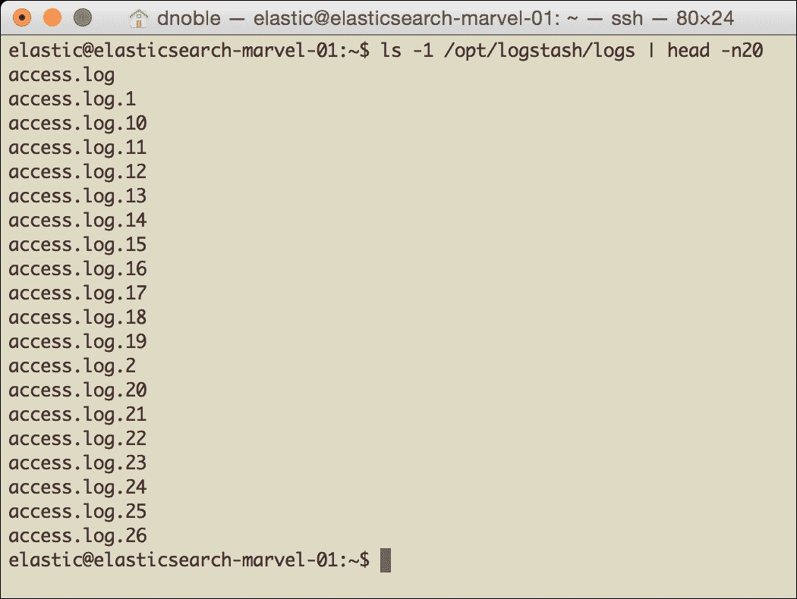

    Logstash 的 NGINX 日志文件

1.  在 `elasticsearch-marvel-01` 上 `/opt/logstash/patterns/nginx.grok` 创建一个新文件，内容如下：

    ```java
    NGINXACCESS %{IPORHOST:remote_addr} - %{USERNAME:remote_user} \[%{HTTPDATE:timestamp}\] %{QS:request} %{INT:status} %{INT:body_bytes_sent} %{QS:http_referer} %{QS:http_user_agent}
    ```

    然后在 `/opt/logstash/logstash.conf` 创建一个 Logstash 配置文件，内容如下：

    ```java
    input {
      file {
        type => "nginx"
        path => "/opt/logstash/logs/access.log*"
        start_position => "beginning"
        sincedb_path => "/dev/null"
      }
    }

    filter {
      if [type] == "nginx" {
      grok {
        patterns_dir => "./patterns"
        match => {
            "message" => "%{NGINXACCESS}"
        }
      }
      date {
        match => [ "timestamp" , "dd/MMM/yyyy:HH:mm:ss Z" ]
      }
      geoip {
        source => "remote_addr"
      }

      }
    }

    output {
      elasticsearch { hosts => ["elasticsearch-marvel-01:9200"] }
    }
    ```

    此配置告诉 Logstash 从文件系统读取所有 `access.log*` 文件，使用我们新定义的 `nginx` 格式，识别我们 NGINX 格式使用的时戳列，告诉 Logstash 对访问者的 IP 地址使用 Geo IP 查找，并最终告诉 Logstash 将日志保存到 `elasticsearch-marvel-01:9200` 的 Elasticsearch 主机实例。

    ### 注意

    在 [`www.elastic.co/guide/en/logstash/current/configuration.html`](https://www.elastic.co/guide/en/logstash/current/configuration.html) 了解更多关于 Logstash 配置文件格式的信息。

1.  现在运行 Logstash，指定配置文件：

    ```java
    cd /opt/logstash
    ./logstash-2.1.1/bin/logstash agent -f logstash.conf 

    ```

    几分钟后，Logstash 将将所有数据加载到 Elasticsearch 中。在 Kopf 中创建的新索引现在应该可以查看。

    下一个部分将专注于在 Kibana 中探索数据。

    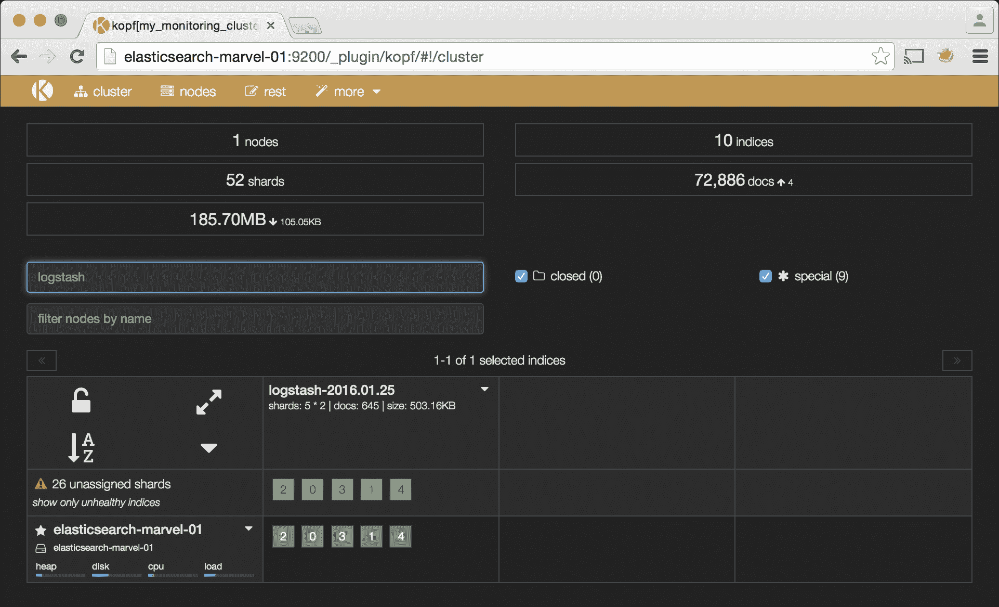

    从 Kopf 查看 Logstash 索引

### 注意

如果从 `logstash.conf` 配置文件中删除 `geoip` 配置设置，此过程将更快。

### 安装 Kibana

按照以下步骤在您的系统上安装 Kibana：

1.  确定从 [`www.elastic.co/downloads/kibana`](https://www.elastic.co/downloads/kibana) 下载的 Kibana 适当版本。由于此示例使用 Elasticsearch 2.3.2，我们将安装 Kibana 4.5.4。

1.  在`/opt/kibana/`目录中下载并解包`elasticsearch-marvel-01`上的 Kibana：

    ```java
    sudo mkdir /opt/kibana
    sudo chown -R `whoami` /opt/kibana/
    cd /opt/kibana/
    wget https://download.elastic.co/kibana/kibana/kibana-4.5.0-linux-x64.tar.gz
    tar xzvf kibana-4.5.0-linux-x64.tar.gz
    cd kibana-4.5.0-linux-x64/

    ```

1.  编辑 Kibana 的`conf/kibana.yml`文件，将其指向正确的 Elasticsearch 主机。在这种情况下，更改如下：

    ```java
    # The Elasticsearch instance to use for all your queries.
    elasticsearch_url: "http://localhost:9200"

    ```

    到：

    ```java
    # The Elasticsearch instance to use for all your queries.
    elasticsearch_url: "http://elasticsearch-marvel-01:9200"

    ```

1.  现在启动 Kibana：

    ```java
    ./bin/kibana

    ```

1.  访问`http://elasticsearch-marvel-01:5601/`以查看 Kibana 登录页面。它应该看起来像以下截图：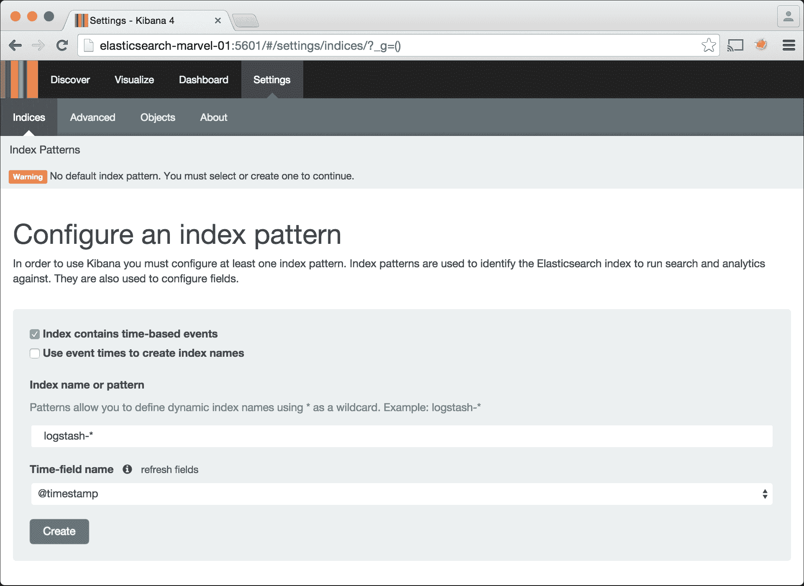

    配置 Kibana

1.  注意`logstash-*`已经默认选中，因此只需点击**创建**按钮继续。

1.  导航到**发现**选项卡以开始探索您的日志数据：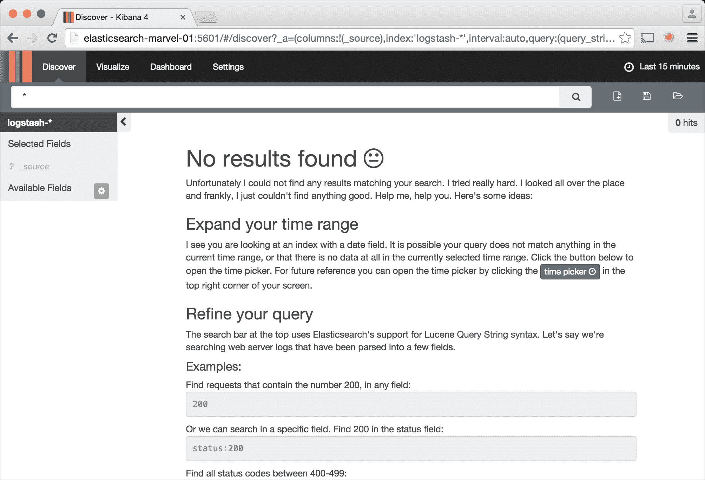

    在 Kibana 中搜索数据

    您可能一开始看不到任何数据。这是因为所有加载数据都超过 15 分钟了。

1.  点击页面右上角的日期范围过滤器，默认设置为**最后 15 分钟**。现在选择一个更合适的范围，例如**本月**。现在你应该开始看到一些结果：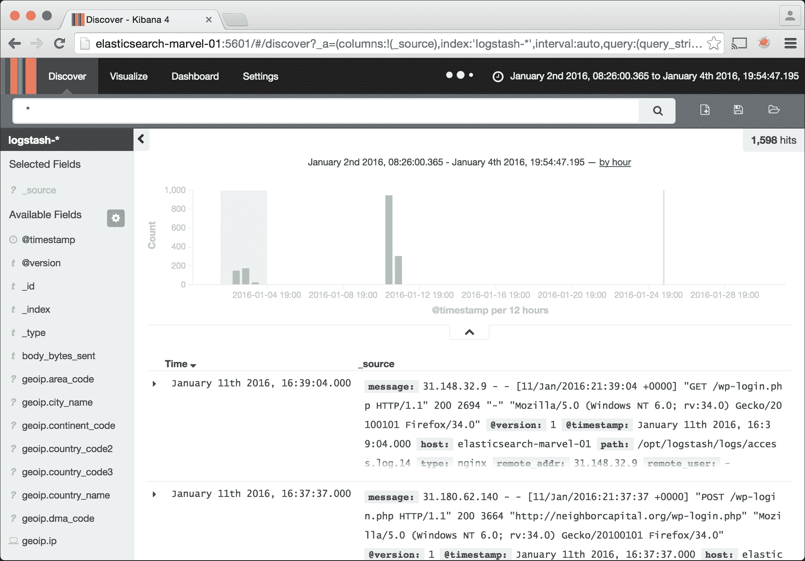

    查看本月的日志数据

`default _source`列有点难以阅读，因此指定页面左侧的一些列：`http_user_agent`、`remote_addr`和`status`。点击这些选定的任何一列将运行一个聚合查询，显示每个字段的常见值：


应用搜索过滤器到 Kibana 结果

**可视化**页面允许我们创建任意数据可视化。例如，我们将创建两个示例可视化：一个瓦片地图来绘制数据集中的地理位置 IP 地址，以及一个垂直条形图来显示日志文件中不同 HTTP 状态码的计数。请按照以下步骤操作：

1.  首先，配置瓦片地图可视化，如图所示：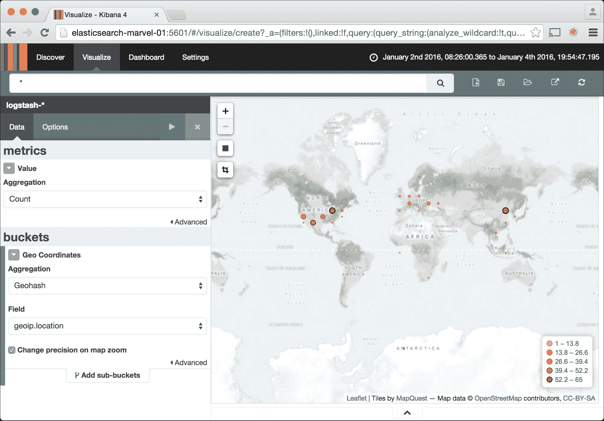

    Kibana 结果的地理空间可视化

1.  点击**保存**以保存您的更改，并创建垂直条形图：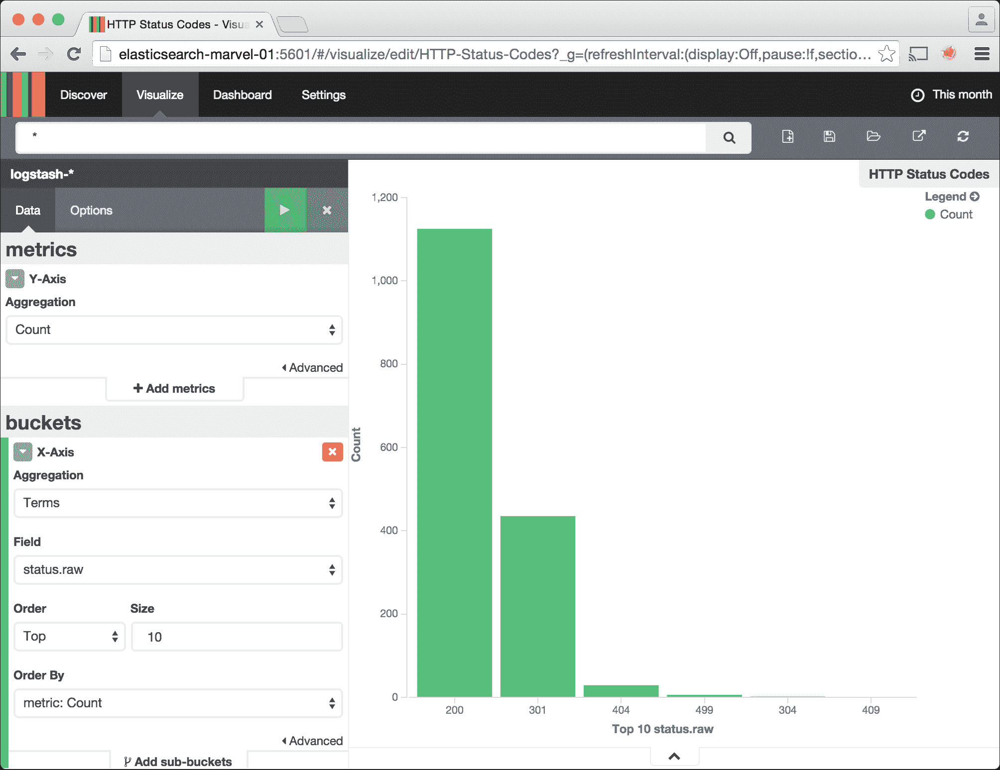

    按 HTTP 状态码细分

1.  保存此图表后，转到**仪表板**页面，以便在同一页面上显示两个组件。

1.  通过点击**添加可视化**按钮选择两个组件。将它们在仪表板上移动以调整大小和重新排序，直到得到类似以下内容：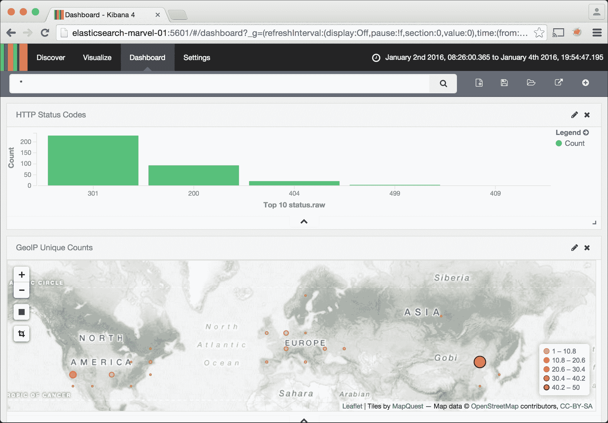

    Kibana 仪表板视图

    ### 注意

    通过访问官方 Elasticsearch 文档了解有关 Kibana 和 Logstash 的更多信息：

    +   [`www.elastic.co/videos/kibana-logstash`](https://www.elastic.co/videos/kibana-logstash)

    +   [`www.elastic.co/products/kibana`](https://www.elastic.co/products/kibana)

    +   [`www.elastic.co/products/logstash`](https://www.elastic.co/products/logstash)

# 使用 Nagios

Nagios 是一个系统监控和警报工具。本节将重点介绍配置一个简单的 Nagios 安装，该安装监控我们的 Elasticsearch 集群中的节点以及这些节点上的 Elasticsearch 进程。如果一个节点或进程关闭，Nagios 将向我们发送警报。

在 Elasticsearch 集群之外的主机上安装 Nagios 是个好主意，以避免由于系统中的其他事情（如高 Elasticsearch 负载）而影响监控过程。为 Nagios 创建一个新的主机并命名为`elasticsearc` `h-nagios-01.`

## 安装 Nagios

除了专门的 Nagios 主机`elasticsearch-nagios-01`之外，还需要在所有 Elasticsearch 集群节点上安装**Nagios 远程插件执行器**（**NRPE**）服务器，以监控 Elasticsearch 进程。按照以下步骤操作：

1.  在每个 Elasticsearch 节点上运行以下命令：`elasticsearch-node-01`、`elasticsearch-node-02`、`elasticsearch-node-03`和`elasticsea``rch-marvel-01`：

    ```java
    sudo apt-get install nagios-nrpe-server

    ```

1.  然后在新的主机`elasticsearch-nagios-01`上安装 Nagios：

    ```java
    sudo apt-get install nagios3 nagios-nrpe-plugin

    ```

1.  此过程将要求您输入密码。请确保您记住它。

    现在，需要一个 Nagios 插件来确保 Elasticsearch 正在运行。有多个插件可供选择，但本书使用 GitHub 上可用的简单脚本：[`github.com/orthecreedence/check_elasticsearch`](https://github.com/orthecreedence/check_elasticsearch)。

1.  要在`elasticsearch-nagios-01`上下载和安装此脚本，请运行：

    ```java
    wget https://raw.githubusercontent.com/orthecreedence/check_elasticsearch/master/check_elasticsearch
    chmod +x check_elasticsearch
    sudo cp check_elasticsearch /usr/lib/nagios/plugins/

    ```

1.  接下来，添加一个 Nagios 命令来运行此插件。在`elasticsearch-nagios-01`上创建一个新文件，`/etc/nagios-plugins/config/elasticsearch.cfg`，内容如下：

    ```java
    # Check to ensure elasticsearch is running
    define command{
            command_name    check_elasticsearch
            command_line    /usr/lib/nagios/plugins/check_elasticsearch -H $HOSTNAME$ -P 9200
            }
    ```

1.  最后，指定要监控的 Nagios 服务器的主机。确保使用`check_elasticsearch`实用程序在这些主机上监控 Elasticsearch 进程，通过编辑配置文件`/etc/nagios3/conf.d/localhost_nagios2.cfg`：

    ```java
    define host{
            use                     generic-host            
            host_name               elasticsearch-node-01
            alias                   elasticsearch-node-01
            address                 192.168.56.111
            }

    define host{
            use                     generic-host            
            host_name               elasticsearch-node-02
            alias                   elasticsearch-node-02
            address                 192.168.56.112
            }

    define host{
            use                     generic-host            
            host_name               elasticsearch-node-03
            alias                   elasticsearch-node-03
            address                 192.168.56.113
            }

    define host{
            use                     generic-host            
            host_name               elasticsearch-marvel-01
            alias                   elasticsearch-marvel-01
            address                 192.168.56.120
            }

    define hostgroup {
            hostgroup_name  elasticsearch-servers
                    alias           Elasticsearch servers
                    members         elasticsearch-node-01, elasticsearch-node-02, elasticsearch-node-03, elasticsearch-marvel-01
            }

    define contact{
            contact_name Elasticsearch Admin
            service_notification_period 24x7
            host_notification_period 24x7
            service_notification_options w,u,c,r,f
            host_notification_options d,u,r,f
            service_notification_commands notify-service-by-email
            host_notification_commands notify-host-by-email
            email admin@your-domain.com
            }

    define service{
            use                             generic-service         ; Name of service template to use
            hostgroup_name                  elasticsearch-servers
            service_description             Elasticsearch
            check_command                   check_elasticsearch
            }
    ```

1.  接下来，配置`elasticsearch-node-01`、`elasticsearch-node-02`、`elasticsearch-node-03`和`elasticsearch-marvel-01`，以允许我们的 Nagios 主机`elasticsearch-nagios-01`收集指标：

    ```java
    sudo vim /etc/nagios/nrpe.cfg

    ```

1.  编辑`allowed_hosts`设置以包括`elasticsearch-nagios-01`的 IP 地址；在我们的例子中，这是`192.168.56.130`：

    ```java
    allowed_hosts=127.0.0.1,192.168.56.130

    ```

1.  现在，在 Elasticsearch 集群的所有节点上重启 NRPE 服务器：

    ```java
    sudo service nagios-nrpe-server restart

    ```

1.  最后，在`elasticsearch-nagios-01`上重启`nagios3`：

    ```java
    sudo service nagios3 restart

    ```

1.  打开一个网页浏览器以查看 Nagios 网络管理门户，用户名为`nagiosadmin`，密码为之前输入的密码：

    ```java
    http://elasticsearch-nagios-01/nagios3

    ```

1.  在 Nagios 收集所有节点上的指标几分钟之后，点击**主机**侧边栏链接以查看集群中所有节点的状态：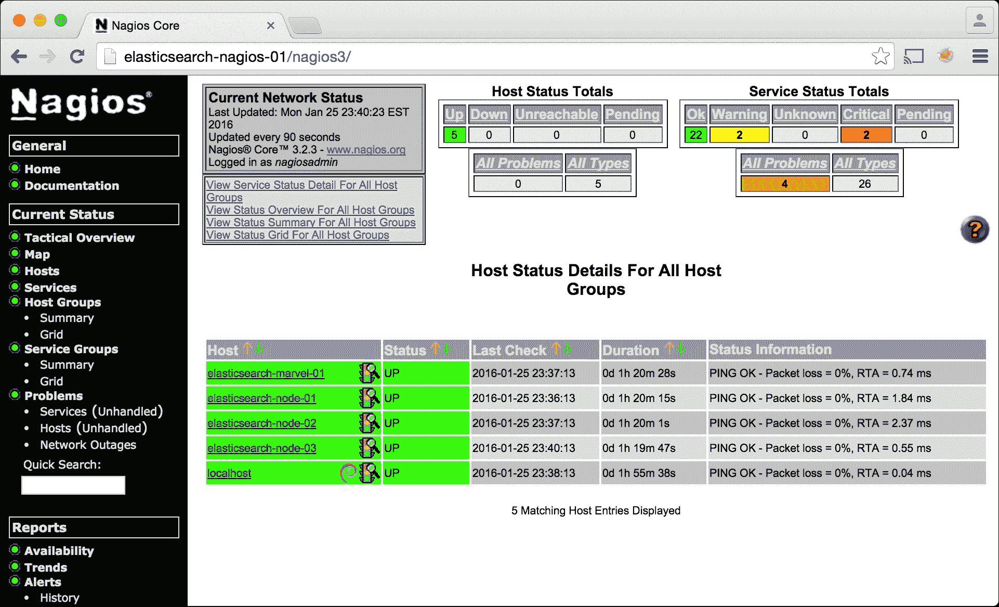

    在 Nagios 中查看 Elasticsearch 主机

1.  点击左侧菜单中的**服务**以查看每个节点上 Elasticsearch 进程的状态：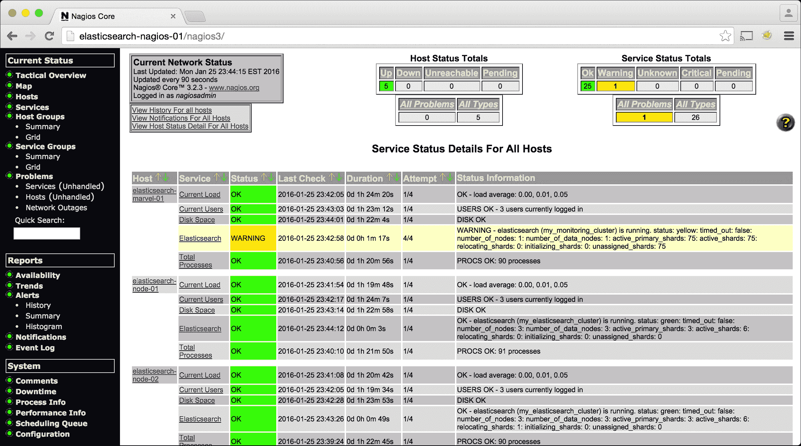

    在 Nagios 中查看 Elasticsearch 状态

### 注意

注意，在`elasticsearch-marvel-01`中，Elasticsearch 进程处于黄色**警告**状态。这意味着集群处于`黄色`状态，因为 Marvel 集群中只有一个节点，并且不是所有分片都进行了复制。

现在，我们将演示当某个节点关闭并且我们在另一个节点上停止 Elasticsearch 进程时，Nagios 会做什么。

关闭`elasticsearch-node-01`并禁用`elasticsearch-node-02`上的 Elasticsearch：

```java
ssh root@elasticsearch-node-01
shutdown -h now
ssh root@elasticsearch-node-02
service elasticsearch stop

```

下次 Nagios 轮询集群状态（这需要几分钟）时，以下内容将在 Nagios 网页仪表板的“服务”页面上显示：

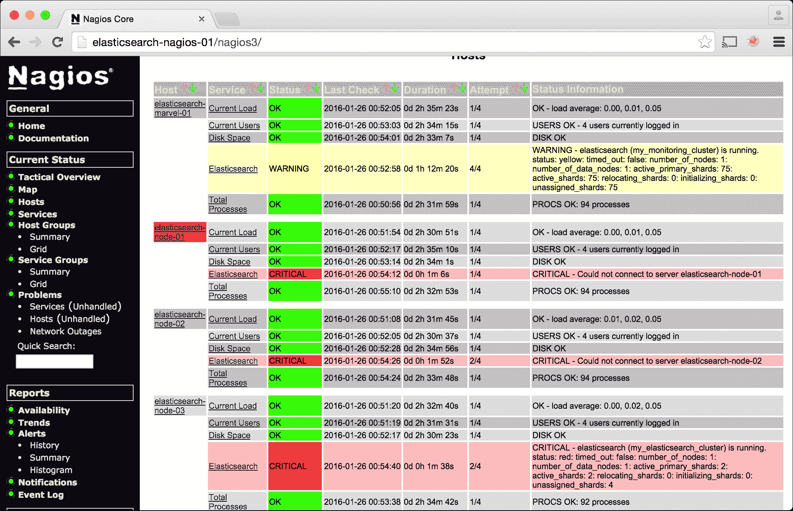

Nagios 的错误报告

Nagios 现在显示`elasticsearch-node-01`已关闭，并且无法连接到`elasticsearch-node-02`上的 Elasticsearch 进程。Nagios 还显示`elasticsearch-node-03`上的 Elasticsearch 已进入`红色`状态，因为并非所有分片都可用。根据我们之前的配置，Nagios 将向`admin@your-domain.com`发送关于警告和错误的电子邮件。在启动`elasticsearch-node-01`并重新启动`elast` `icsearch-node-02`上的 Elasticsearch 后，一切将恢复正常。

# 系统和进程管理的命令行工具

命令行是系统监控的无价工具。在本节中，我们将介绍一些基本的 GNU/Linux 命令行工具，用于系统和进程管理。了解这些工具对于管理 Elasticsearch 集群在 GNU/Linux 上的人来说至关重要。

## top

`top`命令列出了占用 CPU 和内存最高的进程。这个工具有助于确定是否有除了 Elasticsearch 之外的进程正在占用资源，或者检查 Elasticsearch 是否使用了异常的 CPU 或内存量。

`top`命令会自动刷新，所以你只需要运行一次并观察。

运行命令时，你应该看到以下结果：

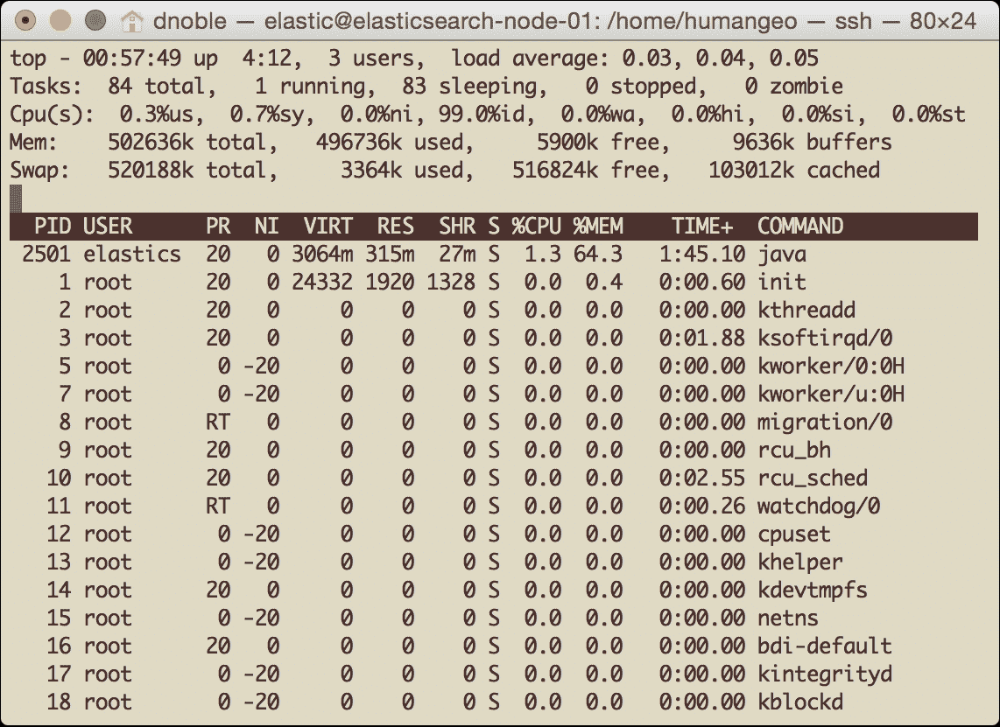

`top`命令

### 提示

在`top`运行时按*Shift*+*M*以按使用最多内存的进程排序，而不是按 CPU。

## tail

`tail -f`命令用于实时查看日志文件。使用它来查看 Elasticsearch 日志文件如下：

```java
tail -f /var/log/elasticsearch/*

```

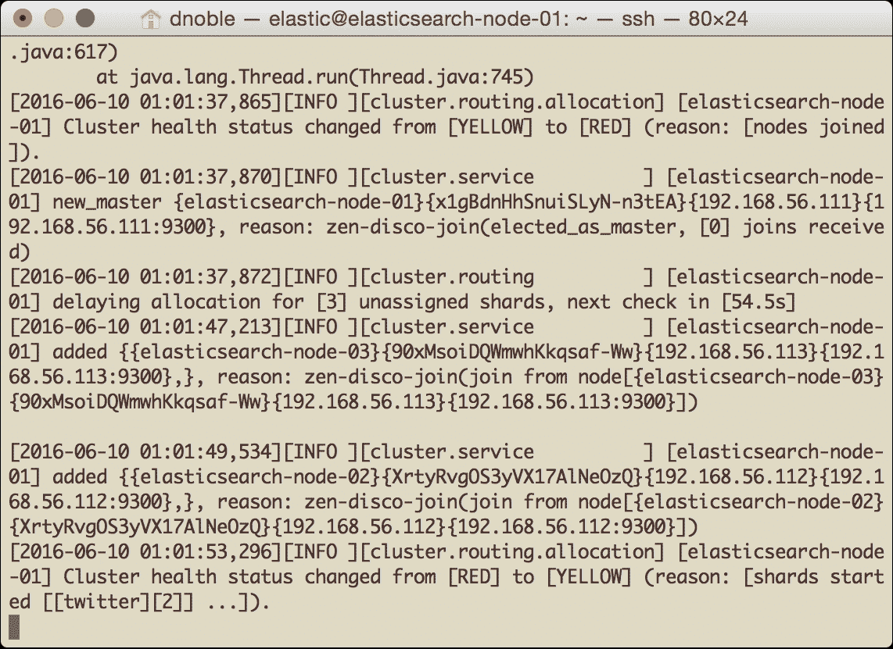

“跟踪”Elasticsearch 日志文件

## grep

`grep`命令是一个通用的文本搜索工具。`grep`的一个有用应用是搜索日志文件目录中的特定字符串。要使用`grep`或搜索`/var/log/elasticsearch`中的所有已记录异常，请使用带有`-r`（递归）和`-i`（不区分大小写搜索）选项的以下命令：

```java
grep -ir exception /var/log/elasticsearch/*.log

```

假设你的 Elasticsearch 日志文件中记录了一些异常，你应该会看到如下内容：

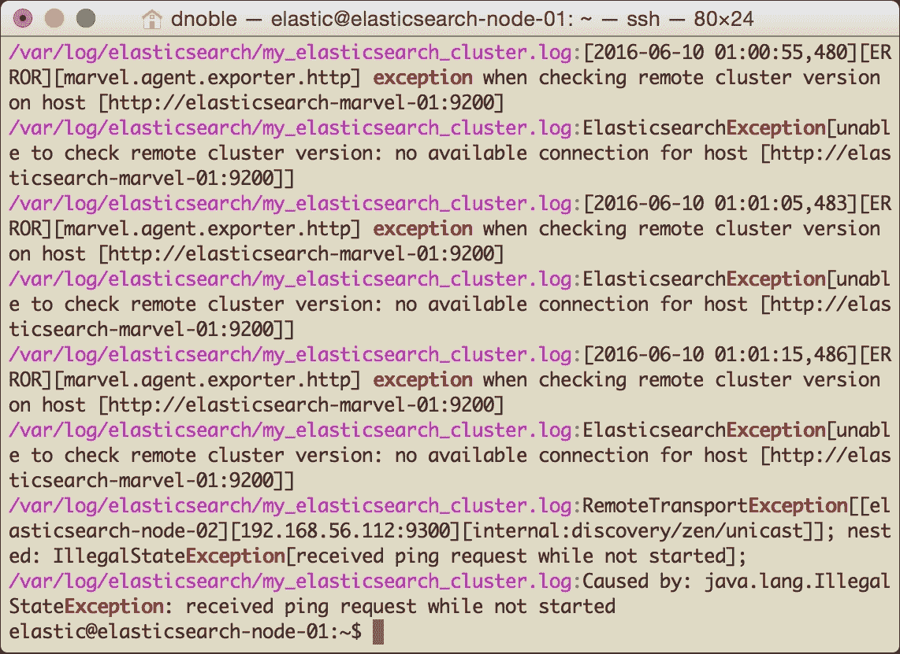

“grep”日志文件以查找异常

## ps

使用`ps`命令和`grep`命令来查看特定进程是否正在运行。如果你在停止或启动 Elasticsearch（或其他进程）时遇到问题，这是一个有用的检查。

要检查 Elasticsearch 是否正在运行，请使用以下命令：

```java
ps -ef | grep -i elasticsearch

```

如果 Elasticsearch 没有运行，此命令将不会输出任何内容。如果它在运行，你应该会看到如下内容：


使用 ps 查看 Elasticsearch 进程

## kill

使用 `kill` 命令停止不会优雅关闭的进程。例如，要关闭之前列出的 Elasticsearch 进程，请运行以下命令：

```java
sudo kill 2501

```

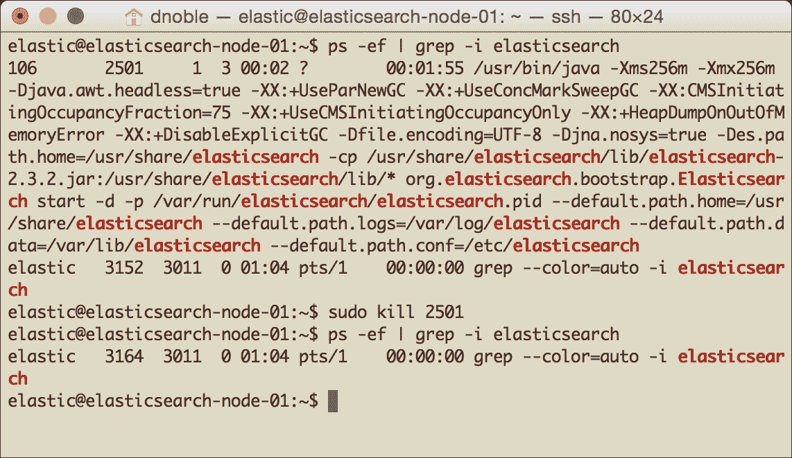

使用 ps 命令杀死 Elasticsearch 进程并验证

## free

`free` 命令告诉我们系统中有多少内存正在使用。其用法如下：

```java
free -m

```

运行此命令将产生类似以下的结果：

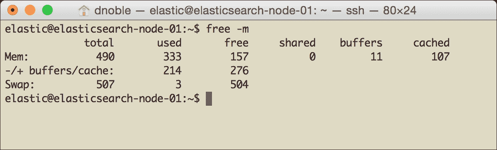

`free` 命令显示系统中的 RAM 量

此输出表示我们正在使用 333 MB 的可用 490 MB 内存存储。

## du 和 df

`du` 和 `df` 命令告诉我们主机上有多少磁盘空间可用。使用 `du` 命令查看当前目录中存储了多少数据，如下所示：

```java
cd /var/log/elasticsearch
du -h

```

你应该看到类似以下的结果：

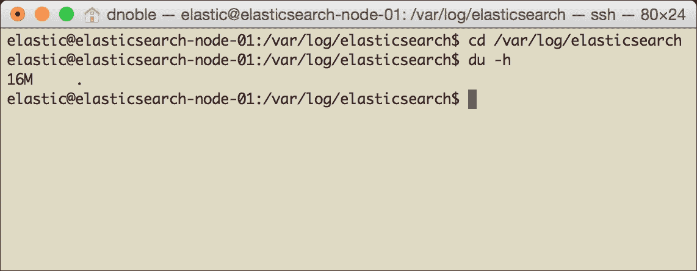

`du` 命令计算目录的大小

在这种情况下，在 `/var/log/elasticsearch/` 目录中有 15 MB 的日志文件。

使用 `df` 命令查看系统中有多少磁盘空间可用，如下所示：

```java
df -h

```

你应该看到类似以下的结果：

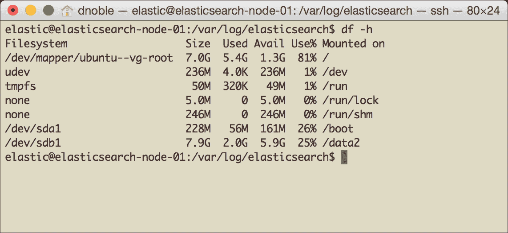

elasticsearch-node-01 的磁盘使用情况

此处的输出表明 `/` 挂载点上还有 `1.3G` 的可用存储空间。

### 注意

注意，在这两个命令中，`-h` 标志代表**可读性**，意味着它们将以 KB、MB 或 GB 的形式输出值，而不是仅仅以字节为单位。

# 摘要

本章探讨了 Elasticsearch 监控工具 Kopf、Elasticsearch、Logstash 和 Kibana (ELK) 日志聚合堆栈、系统监控工具 Nagios 以及各种 GNU/Linux 命令行实用工具。

一些要点包括：

+   Kopf 是一个类似于 Elasticsearch-head 的 Elasticsearch 监控工具，但提供了一些不同的指标。

+   Elasticsearch、Logstash 和 Kibana (ELK) 堆栈是一个用于搜索、分析、丰富和可视化日志文件的工具。

+   考虑使用 Nagios 等工具监控 Elasticsearch 集群。Nagios 可以配置为在进程崩溃或节点本身崩溃时发送电子邮件通知。

+   通过使用一些 GNU/Linux 命令行工具，我们可以收集到与各种 Elasticsearch 监控工具提供的相同指标。

下一章将讨论解决 Elasticsearch 性能和可靠性问题的方法。本章讨论的监控工具将在解决即将到来的章节中概述的现实世界问题中非常有用。
