# 第七章：节点故障和事后分析

在上一章中，我们学习了如何通过使用带有真实世界案例研究的案例研究来排查在使用 Elasticsearch 时出现的常见性能和可靠性问题。本章探讨了节点和集群故障的一些常见原因。具体涵盖的主题如下：

+   如何确定故障的根本原因

+   如何对节点故障采取纠正措施

+   带有真实世界故障诊断案例的案例研究

# 诊断问题

Elasticsearch 节点故障可以以许多不同的方式表现出来。节点故障的一些症状如下：

+   节点在大量数据索引过程中崩溃

+   Elasticsearch 进程因未知原因停止运行

+   集群无法从黄色或红色状态恢复

+   查询请求超时

+   索引请求超时

当你的集群中的节点遇到这些问题时，可能会诱使你只是简单地重启 Elasticsearch 或节点本身，然后像什么都没发生一样继续。然而，如果不解决根本问题，问题很可能会在未来再次出现。如果你遇到上述情况，请按照以下方式检查你的集群健康：

+   使用 Elasticsearch-head 或 Kopf 检查集群健康

+   使用 Marvel 检查历史健康状态

+   检查 Nagios 警报

+   检查 Elasticsearch 日志文件

+   检查系统日志文件

+   使用命令行工具检查系统健康

这些步骤将有助于诊断集群中问题的根本原因。在本节中，我们将探讨导致节点故障的一些潜在原因，包括以下内容：

+   内存不足错误

+   系统内存不足

+   资源争用

+   磁盘空间耗尽

## OutOfMemoryError 异常

如果节点抛出 `OutOfMemoryError`，立即的解决办法是重启它。然而，并不总是明显何时或为什么节点会遇到这个错误。症状包括以下：

+   分片故障

+   搜索查询失败

+   索引失败

通常，根本不会有任何立即的症状。不幸的是，检查 Elasticsearch-head、Marvel 和 Bigdesk 并不能直接告诉你是否发生了 `OutOfMemoryError` 异常，但它们可以给我们一些可能发生异常的预警信号。为了确保确实发生了 `OutOfMemoryError` 异常，请检查 Elasticsearch 日志。

### 分片故障

`OutOfMemoryError` 异常发生的一个迹象是查询响应中出现了分片故障。此响应在 `_shards.failed` 键中指示分片故障，并在 `_shards.failures` 中描述了故障。

以下示例查询显示了查询响应中分片故障的外观：

```java
curl -XGET http://elasticsearch-node-01:9200/twitter/_search?size=0
{
 "_shards": {
 "failed": 1,
 "failures": [
 {
 "index": "twitter",
 "reason": "NodeDisconnectedException[[elasticsearch-node-03][inet[elasticsearch-node-03/192.168.56.113:9300]][indices:data/read/search[phase/query]] disconnected]",
 "shard": 1,
 "status": 500
 }
 ],
 "successful": 2,
 "total": 3
 },
 "hits": {
 ...
 "total": 10803
 },
 ...
}

```

注意，尽管在这个查询中分片失败了，但它仍然返回了结果。然而，因为总共有三个分片，而只有两个成功返回了数据，所以查询结果并不能代表索引中的所有数据。

有时，如果集群处于红色状态，例如，`_shards` 对象将指示成功分片数少于可用分片总数，但不会报告错误。看看以下代码，其中 `_shards.successful` 小于 `_shards.total`，但 `_shards.failed` 设置为 `0`：

```java
{
 "_shards": {
 "failed": 0,
 "successful": 2,
 "total": 3
 },
 "hits": {
 ...
 "total": 10803
 },
 ...
}

```

在这两种情况下，`hits.total` 值仅代表我们实际总数据量的三分之二左右。

当我们遇到分片失败或分片未能成功返回数据时，使用 Elasticsearch-head 检查集群状态是个好主意。Elasticsearch-head 可能看起来如下：

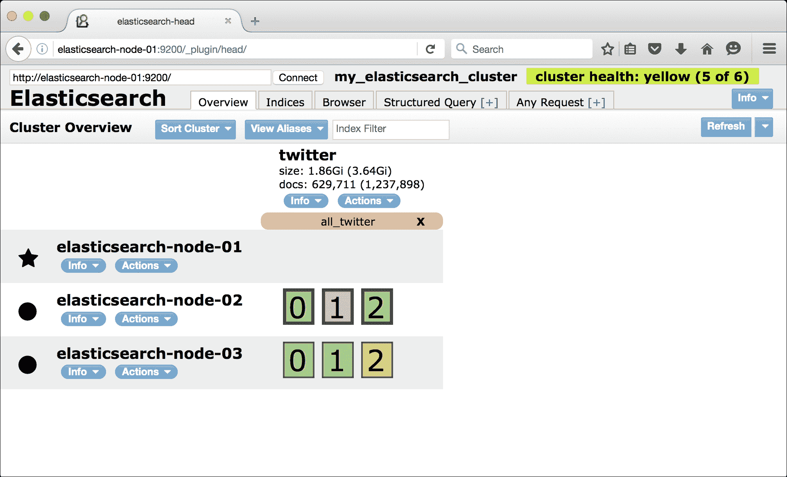

在 Elasticsearch-head 中重新定位的分片

在此截图中，我们可以看到所有分片现在都是可用的，但集群仍在恢复中，并且没有分片分配给 `elasticsearch-node-01`。此时，我们可能还会注意到集群需要非常长的时间才能返回到绿色状态，或者可能永远不会返回到绿色状态。这个问题可能是由于一个没有堆空间的节点未能将其中的一个分片重新定位到具有更多内存的另一个节点。

接下来，打开 Elasticsearch-kopf 以获取我们节点更详细的信息：

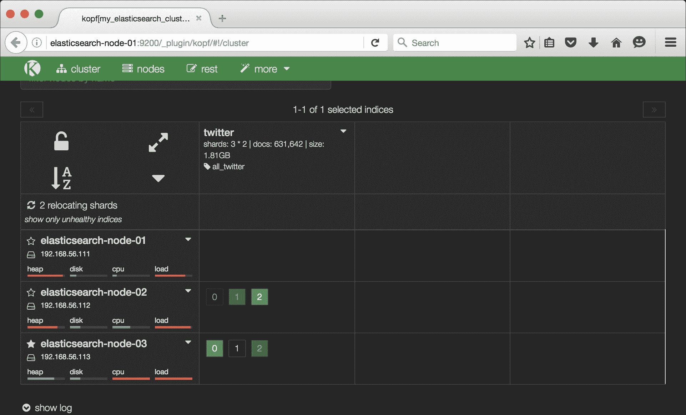

在 Elasticsearch-kopf 中重新定位分片

在 Elasticsearch-kopf 中，我们看到 `elasticsearch-node-01` 和 `elasticsearch-node-02` 上的堆使用量很高，这是内存溢出错误异常发生的良好指标。检查日志，我们确认在 `elasticsearch-node-01` 上抛出了 `OutOfMemoryError`：

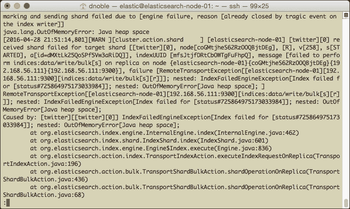

检查 Elasticsearch 日志显示 OutOfMemoryError

此外，我们还在日志文件中看到几个其他异常记录，这些异常是在 `OutOfMemoryError` 之后出现的，如下截图所示：

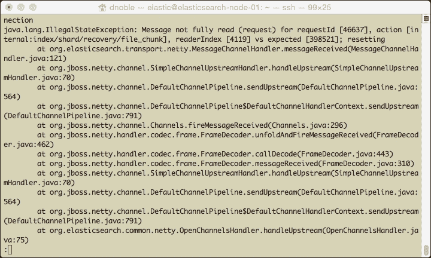

与 OutOfMemoryError 相关的 Elasticsearch 日志中的附加错误

继续检查日志文件，我们看到一个错误指示由于节点内存不足导致分片失败：

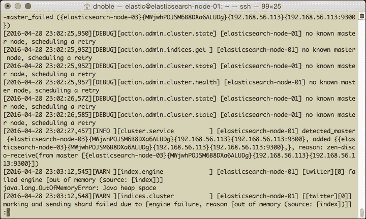

Elasticsearch 日志中的分片失败错误

### 慢查询

慢查询是内存溢出错误（`OutOfMemoryError`）发生的另一个迹象。在先前的例子中，使用 Unix `less` 命令在 `elasticsearch-node-02` 上检查慢查询日志文件显示以下内容：

```java
less my_elasticsearch_cluster_index_search_slowlog.log.2016-04-28
```

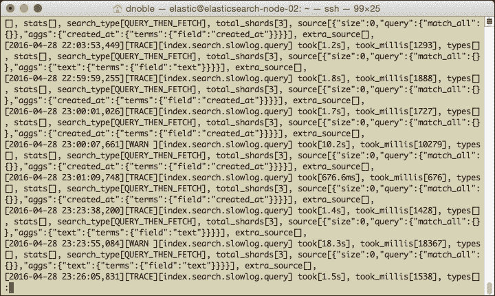

慢查询可能表明发生了错误

在 `elasticsearch-node-02` 上检查 Elasticsearch 日志，我们可以验证捕获了 `OutOfMemoryError`：

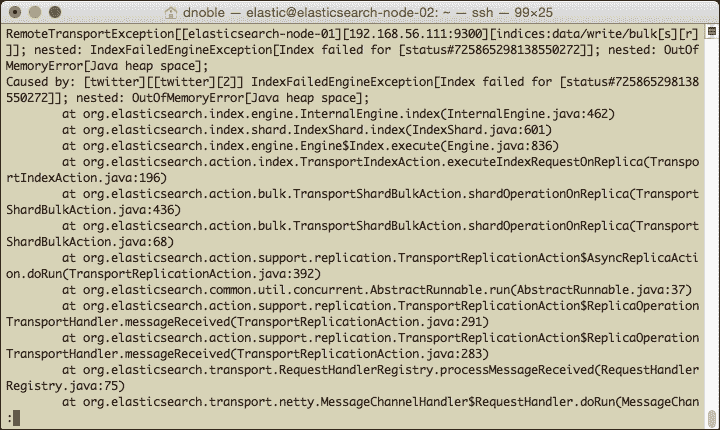

验证 Elasticsearch 抛出了异常

### 解决 OutOfMemoryError 异常

如前所述，当你看到`OutOfMemoryError`错误时，最好重启节点以防止进一步的异常。然而，这只是一个临时的解决方案。同时修复导致错误的基本问题也很重要。请参阅第六章，*性能和可靠性问题故障排除*，了解更多关于解决`OutOfMemoryError`异常的策略。以下列出了一些策略：

+   限制字段数据缓存的大小

+   为字段数据缓存启用断路器

+   调整批量数据插入的大小和频率

+   减少总分片数

+   确保`ES_HEAP_SIZE`设置正确

+   确保机器有足够的物理内存可用

在日志中看到错误后，我们可以将它们的时间戳与 Marvel 关联起来，以查看错误发生时的活动类型。例如，假设我们看到了以下`OutOfMemoryError`：

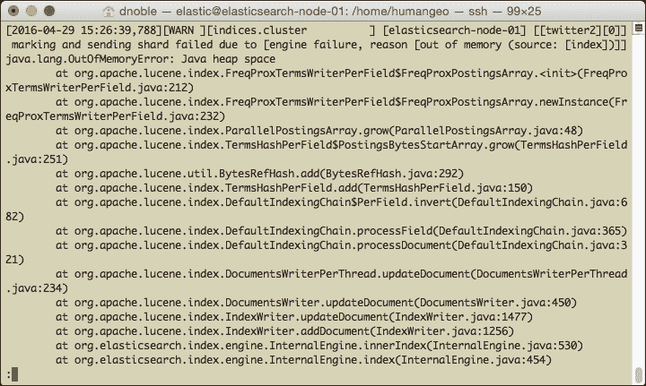

在 2016 年 4 月 29 日 15:26:39 发生了 OutOfMemoryError 异常

我们可以检查`4/29/2016 15:26:39`时间段的 Marvel 活动。在这种情况下，我们将它设置为从`2016-04-29 15:25:00`到`2016-04-29 15:27:30`，如下面的截图所示：

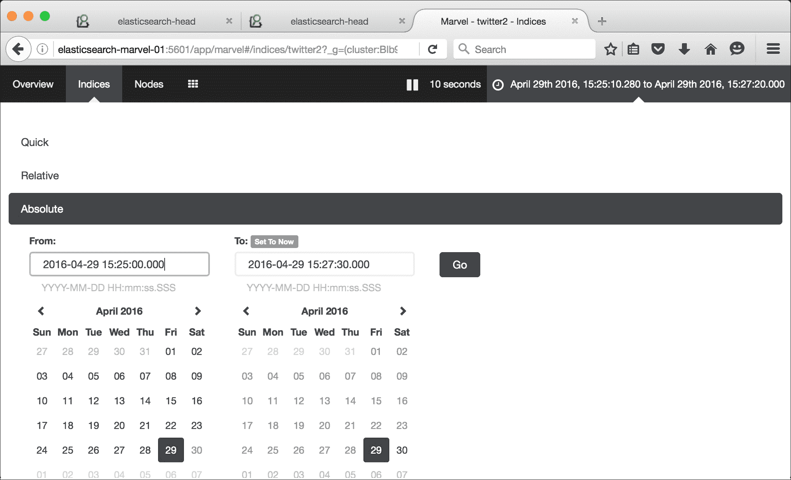

在 Marvel 中更改日期范围

尽管我们看到在崩溃时索引中没有搜索活动，但随后是一个适度的**索引速率**，随后是索引活动的下降：

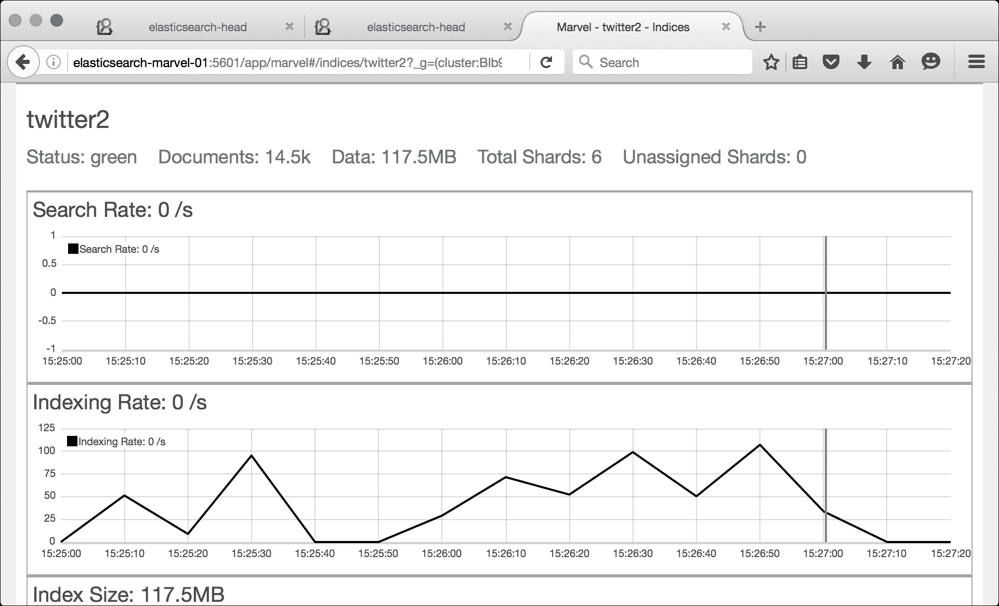

使用 Marvel 进行调查

降级可能发生在`OutOfMemoryError`之后，大量的索引负载可能导致了错误。

由于`OutOfMemoryError`异常可能不会非常频繁地发生，因此很难确定我们实施的修复措施是否成功解决了问题。为了确保问题完全解决，最好找到一种可靠地重现错误的方法。然后，调整 Elasticsearch 配置设置和负载，直到你不再看到该问题。通常可以通过建立一个具有类似配置和负载的简单单节点集群来重现问题，作为主集群中的一个节点。在前面的例子中，我们可能会尝试通过将文档以类似的速率索引到受控环境中的单节点测试集群来验证数据批量加载是否导致了异常。

## Elasticsearch 进程崩溃

如果 Elasticsearch 进程意外停止运行，可能是操作系统将其终止了。在这些情况下，Elasticsearch 日志文件可能没有关于错误的任何有用信息，我们反而需要检查`syslog`：

```java
sudo tail -n200 /var/log/syslog
View the last 200 lines of /var/log/syslog
...
Apr 29 14:56:00 elasticsearch-node-01 kernel: [39935.321257] Out of memory: Kill process 5969 (java) score 446 or sacrifice child
Apr 29 14:56:00 elasticsearch-node-01 kernel: [39935.321343] Killed process 5969 (java) total-vm:2361960kB, anon-rss:441676kB, file-rss:14392kB

```

如果 Elasticsearch 试图声明比可用内存更多的系统内存，这通常是由于`ES_HEAP_SIZE`设置不正确或其他进程的资源竞争造成的。如果你的集群遇到这个问题，并且集群上运行着其他内存密集型进程，那么将这些进程从 Elasticsearch 集群中移除可能是个好主意。为了验证 Elasticsearch 是否被操作系统强制停止，请检查`/var/log/syslog`中的`syslog`文件：

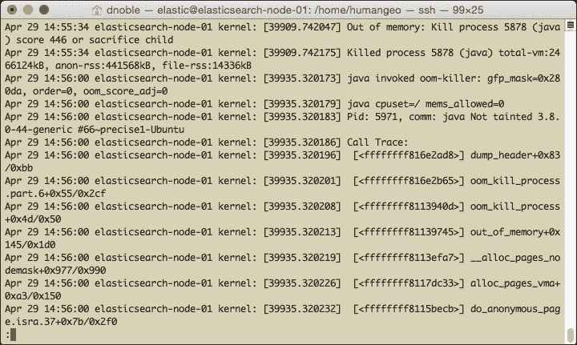

操作系统因内存不足而杀死了 Elasticsearch 进程

取以下行：

```java
Apr 29 14:55:34 elasticsearch-node-01 kernel: [39909.742047] Out of memory: Kill process 5878 (java) score 446 or sacrifice child

```

这一行表示操作系统杀死了 Elasticsearch 进程。在这种情况下，我们不会在 Elasticsearch 日志文件中看到任何相应的日志条目。

## 磁盘空间

当一个节点耗尽磁盘空间时，它将留在集群中，仍然可以处理索引和搜索请求，但它会将其分片卸载到集群中的其他节点。当集群重新分配分片时，查询可能会运行缓慢或超时。一旦分片重新分配到集群中的其他节点，你可能会看到一些性能下降，因为集群正在使用一个更少的数据节点运行。

如果所有节点都配置了相同数量的空间，节点耗尽磁盘空间可能会很危险。如果一个节点耗尽空间，那么集群中的其他节点可能也接近磁盘空间不足。一旦集群将分片重新分配到集群中的其他节点，这可能导致这些节点也耗尽空间。这会导致连锁反应，最终导致整个集群崩溃。

我们可以使用 Kopf 或 Marvel 检查节点是否磁盘空间不足，或者通过配置 Nagios 警报。此外，我们还会在 Elasticsearch 日志中看到与磁盘空间不足相关的错误，如下面的截图所示：

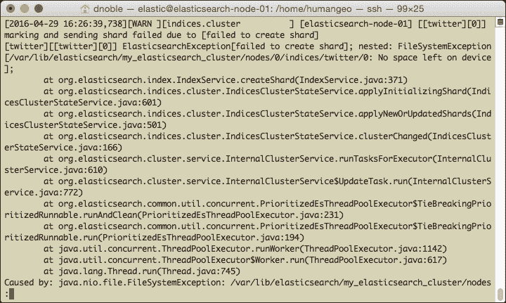

Kopf 显示`elasticsearch-node-01`磁盘空间不足

### 解决问题

磁盘空间问题可以分为两大类：

1.  Elasticsearch 中加载了过多的数据，正在占用磁盘空间。

1.  除了 Elasticsearch 数据之外，还有其他东西正在占用磁盘空间，例如，一个大的日志文件。

要解决第一类问题，一个解决方案是通过向节点添加另一个驱动器或卷来增加节点的存储容量，并配置 Elasticsearch 使用该空间。例如，如果我们将在`/data`上挂载额外的存储，更新`elasticsearch.yml`配置文件如下：

```java
path.data: /var/lib/elasticsearch,/data
```

在节点上重启 Elasticsearch。然后节点将把其数据分布在两个数据目录中。

对于第二类问题，如果原因是 Elasticsearch 外部，删除违规文件以清理磁盘空间就足够让 Elasticsearch 再次运行。不需要重启节点。

我们可以采取的一些额外措施以减少磁盘空间使用如下：

+   向集群中添加额外的节点。

+   减少分片副本数；例如，从两个副本减少到一个副本。

+   通过将大型索引拆分成较小的索引来确保单个分片不会变得太大。例如，而不是将所有 Twitter 数据存储在一个索引中，每个月创建一个新的索引来存储新数据。

+   启用数据压缩（参考第六章, *解决性能和可靠性问题*）。

# 检查一些案例研究

本节讨论了一些 Elasticsearch 节点故障的真实场景以及如何解决这些问题。

## ES 进程意外退出

几周前我们在 Marvel 上注意到我们的一个节点上的 Elasticsearch 进程宕机了。我们在该节点上重启了 Elasticsearch，一切似乎都恢复了正常。然而，在那一周稍后检查 Marvel 时，我们发现节点再次宕机了。我们决定查看 Elasticsearch 的日志文件，但没有发现任何异常。由于我们在 Elasticsearch 日志中没有看到任何异常，我们怀疑操作系统可能已经杀死了 Elasticsearch。在`/var/log/syslog`的`syslog`中检查，我们看到以下错误：

```java
Out of memory: Kill process 5969 (java) score 446 or sacrifice child
```

这验证了操作系统杀死 Elasticsearch 是因为系统内存不足。我们检查了 Elasticsearch 的配置，没有发现任何问题。这个节点配置与集群中的其他节点相同。接下来，我们通过运行`top`命令检查与其他进程的资源争用，得到以下结果：

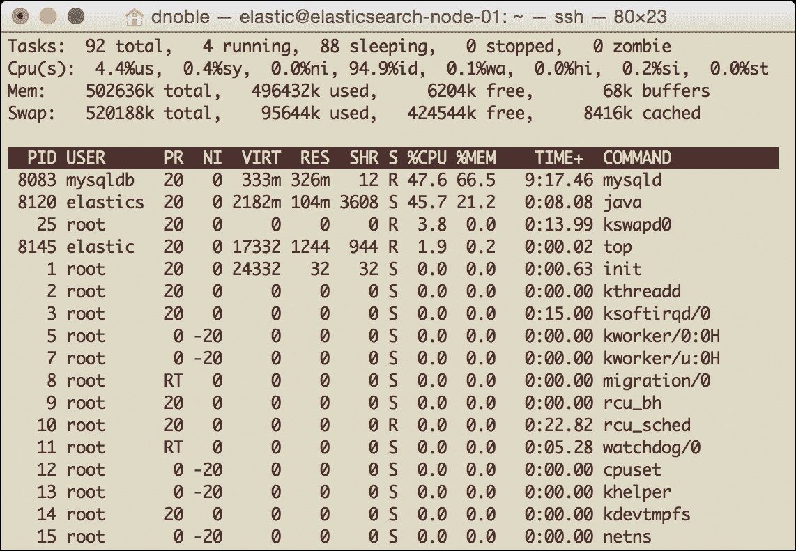

顶部显示资源争用

看起来这个节点上也在运行 MySQL 服务器，并且占用了大量的系统内存。我们怀疑与 MySQL 的资源争用可能是导致操作系统杀死 Elasticsearch 的原因。我们能够将 MySQL 数据库迁移到其自己的专用主机，在几周内没有再出现内存问题后，我们可以得出结论，这个问题已经解决了。

## 查询请求缓慢且超时

我们企业级 Elasticsearch 支持的 Web 应用程序的用户开始报告搜索功能缓慢，有时甚至完全不返回结果。我们能够通过在 Web 应用程序上运行一些搜索来验证这一点，并决定使用 Kopf 来调查这个问题。在 Kopf 中，我们注意到我们的一个节点`elasticsearch-node-01`的磁盘指示器是红色的，如下面的截图所示：

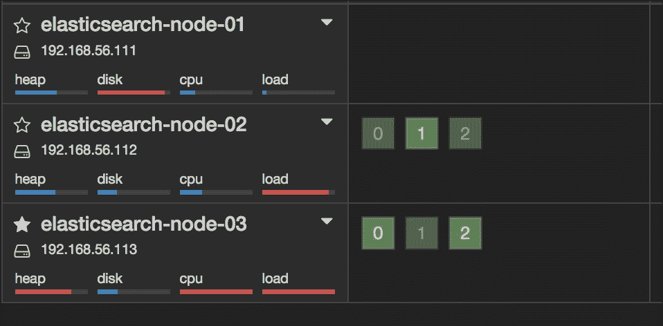

Kopf 显示`elasticsearch-node-01`磁盘空间不足

`elasticsearch-node-01` 的红色 **磁盘** 指示灯意味着我们的磁盘空间不足。此外，该节点上的所有分片都已重新分配到其他节点。通过查看 `/var/log/elasticsearch/my_elasticsearch_cluster.log` 中的 `elasticsearch-node-01` 日志，我们确认磁盘已满，因为看到了 **设备上没有剩余空间** 的消息。我们通过向集群中的所有节点添加额外的硬盘驱动器，并在 `elasticsearch.yml` 文件中配置 Elasticsearch 使用新空间来解决这个问题。

为了防止未来出现此类问题，我们决定按照 第五章 中找到的说明安装 Nagios，*系统监控*，以便在磁盘空间不足时发送电子邮件警报。

# 摘要

本章探讨了如何诊断节点故障，确定问题的根本原因，并采取纠正措施。我们学到的一些关键点是：

+   许多错误，从分片故障到查询性能缓慢，都是由 `OutOfMemoryError` 异常引起的。

+   当分片重新分配时，一个节点上的磁盘空间不足可能会导致其他节点也出现磁盘空间不足的情况。

+   在运行需要大量内存的其他服务的同时运行 Elasticsearch，可能会导致操作系统为了释放内存而杀死 Elasticsearch。

下一章将讨论 Elasticsearch 5.0，这是平台的下一个主要版本，它将为您概述将伴随 Elasticsearch 5.0 发布的各种新监控工具。
