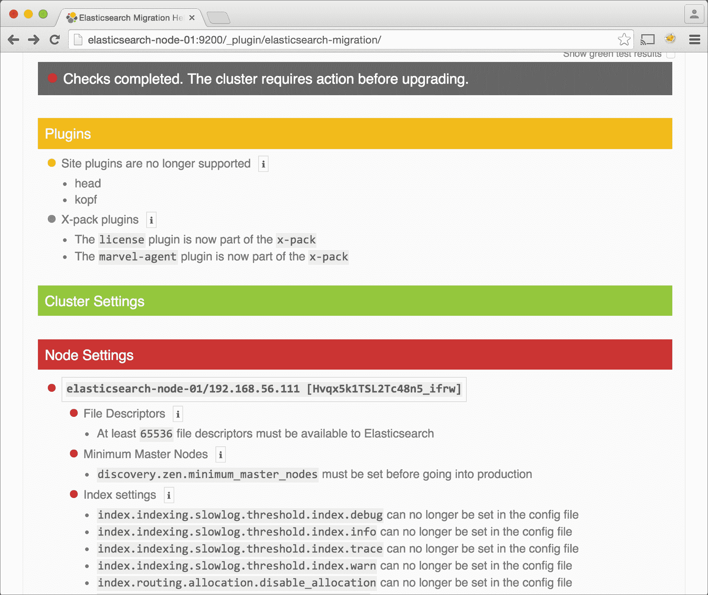

# 第八章. 展望未来

本章最后讨论了 Elasticsearch 的下一个主要版本，即 5.0，它相对于 2.3.2 是一个重大的升级。它引入了许多 API 增强以及几个性能和可靠性更新。许多这些变化，无论好坏，都将影响您与 Elasticsearch 集群的交互和监控。

本章我们将讨论的具体主题包括：

+   Elasticsearch 5 概述

+   升级到 Elasticsearch 5

+   监控 Elasticsearch 5

# Elasticsearch 5 概述

Elasticsearch 5 将作为下一个主要软件发布版紧随 Elasticsearch 2。尽管这可能从时间顺序上令人震惊，但 Elastic.co 故意从版本 2 跳到 5，以更好地将更新后的 Elasticsearch 版本与 Kibana、Logstash、Marvel（在 5.0 中称为 **Monitoring**）和其他几个 Elastic.co 产品同步。这次更新将有助于确保集群上运行的所有 Elastic.co 软件既兼容又更新。

版本 5 中引入了数百项新变化，但一些相关的亮点包括：

+   Elasticsearch 2 API 与 Elasticsearch 5 之间的兼容性

+   Elasticsearch 2 的索引可以迁移到版本 5：

    +   Elasticsearch 1 的索引必须首先迁移到版本 2，然后再迁移到版本 5

+   Marvel 已更名为 Monitoring

+   Elasticsearch-Logstash-Kibana 堆栈更名为 **Elastic Stack**

+   插件 API 不再支持站点插件，包括 Elasticsearch-head、Bigdesk 和 Kopf 等插件

+   为了支持急切字段数据加载和基于磁盘的规范，已移除 warmers API

+   Lucene 版本从 5 升级到 6

+   几项配置更改，包括移除所有系统环境变量，如 `ES_HEAP`，以支持 Java VM 命令行参数

+   `text` 和 `keyword` 映射类型已被弃用，以支持 `string` 类型

+   `bin/plugin` 重命名为 `bin/elasticsearch-plugin`

### 注意

Elasticsearch-head、Bigdesk 和 Kopf 尚未更新以兼容 Elasticsearch 5。当它们升级时，它们将作为独立应用程序运行，类似于 Kibana。

## 性能和可靠性

Elasticsearch 5 引入了几项性能和可靠性改进，包括：

+   小文档的索引性能提高了 15-20%

+   Lucene 6 通过提高 25% 的搜索时间，并将数字、日期和地理空间字段的磁盘空间使用量减少 50% 来改进搜索时间

+   `elasticsearch.yml` 设置文件现在将进行严格的验证，这意味着如果存在配置错误，Elasticsearch 将无法启动

+   如果一个生产节点（意味着一个未绑定到 `localhost` 地址的节点）没有足够的文件句柄可用，或者没有权限通过 `mlockall` 设置锁定系统内存使用，它将抛出异常并且无法启动

## 数据丢失

Elasticsearch 2 存在一个广为人知的持续问题，在涉及网络问题和网络分区的情况下，Elasticsearch 在数据导入期间可能会丢失数据。

在网络分区期间写入 Elasticsearch 的数据将被确认，但并非所有数据实际上都会到达索引。Elasticsearch 团队已努力解决这个问题，并且在新版本中修复了许多——但并非所有——的 bug 实例。考虑到这一点，在构建基于 Elasticsearch 的应用程序时，无论是版本 2 还是版本 5，请考虑以下内容：

+   不要将 Elasticsearch 作为主数据存储使用。相反，根据您的数据大小和需求，使用数据库，如 HBase、Cassandra、PostgreSQL 或其他数据库。

+   一定要核实您主数据存储中的数据记录数量与 Elasticsearch 中的数量相匹配。

+   在数据丢失的情况下，制定一个重新索引数据的计划。

虽然数据丢失的可能性非常小，但潜在的影响是巨大的，因此制定行动计划非常重要。

# 升级到 Elasticsearch 5.0

Elasticsearch 5 版本即将发布。开始测试您的集群与新版本兼容性是个好主意。为了帮助升级过程，Elastic.co 提供了一款名为**Elasticsearch 迁移助手**的工具。将此工具作为 Elasticsearch 2.3 插件安装：

```java
sudo /usr/share/elasticsearch/bin/plugin install https://github.com/elastic/elasticsearch-migration/releases/download/v2.0-alpha2/elasticsearch-migration-2.0-alpha2.zip

```

### 注意

Elasticsearch 迁移助手仅与 Elasticsearch 2.3 兼容。

安装插件后，通过访问`http://elasticsearch-node-01:9200/_plugin/elasticsearch-migration/`在浏览器中打开它，如下截图所示：


Elasticsearch 迁移助手

在使用 Elasticsearch 5 之前，**集群检查**诊断将显示必要的更新报告：



Elasticsearch 迁移助手配置检查报告

**集群检查**显示，在迁移到 Elasticsearch 5 之前，我们必须删除一些不兼容的插件，包括 Elasticsearch-head、Kopf 和 Marvel Agent。在升级之前，我们还需要更新一些系统和节点配置设置。

在修复所有这些配置问题后，我们可以使用 Elasticsearch 迁移助手启用弃用日志。此日志文件记录了每次我们调用将在版本 5 中弃用或删除的 Elasticsearch API 方法的时间。

以下截图显示了如何从 Elasticsearch 迁移助手启用弃用日志：


点击启用/禁用链接以激活弃用日志

一旦启用日志，它可以在以下位置找到：

```java
/var/log/elasticsearch/<cluster_name>_deprecation.log

```

## 何时升级

在运行 Elasticsearch 迁移助手并纠正所有相关错误和警告后，您可以在开发环境中安全地升级到 Elasticsearch 5。现在您可以测试应用程序，以确保一切与新版本兼容。请密切关注弃用日志，并注意您需要修复的事情。

由于这是一个重大版本，您可能值得在生产通用可用性发布后的几个月内推迟生产升级。与任何新软件一样，Elasticsearch 5 的早期版本可能会有一些错误，这些错误将在它被普遍提供后不久得到修复。

# 监控 Elasticsearch 5

Elastic.co 在 Elasticsearch 5 中对监控工具套件进行了重新品牌化，包括 Elasticsearch-Logstash-Kibana (ELK)堆栈。现在 Marvel 更名为**监控**，并附带了一些额外的监控工具。ELK 堆栈现在仅称为**Elastic Stack**。

Elasticsearch X-Pack 是一套高级监控工具，Elastic.co 对其在生产环境中的运行收取年度费用。X-Pack 包括以下工具：

+   **监控**：之前为 Marvel

+   **Shield**：为 Elasticsearch 添加身份验证、访问控制和 HTTPS 支持

+   **Watcher**：类似于 Nagios，但具有一些 Elasticsearch 特定的功能，例如如果查询运行缓慢，则发送电子邮件警报

+   **图**：网络图数据可视化工具

+   **报告**：基于 Kibana 中的数据生成 PDF 报告

Kibana 和 Marvel 也获得了更新的外观和感觉，如下截图所示：


Kibana 更新外观和感觉


Marvel 现在以更新的外观和感觉进行监控

# 摘要

本章探讨了即将发布的 Elasticsearch 5 版本，讨论了升级到 5.0 版本，并简要介绍了 Elasticsearch X-Pack 中可用的新监控工具。本章的一些要点包括：

+   Elasticsearch 5 在性能和可靠性方面取得了一些重大进步，但也对 API 进行了一些破坏性更改。

+   Elasticsearch-head、Bigdesk 和 Kopf 目前与 Elasticsearch 5 不兼容。

+   Elasticsearch 5 是一个重大版本，从 2.0 版本升级可能不是一个简单的过程。在升级之前，请务必运行 Elasticsearch 迁移助手。

+   Elasticsearch X-Pack 为 Elasticsearch 5 提供了一套监控工具，但并非免费。

感谢您阅读《监控 Elasticsearch》。希望您学到了一些监控和故障排除 Elasticsearch 集群的新技巧。如果您只从这本书中带走了一件事，我希望它是对细节的严谨，以及在处理 Elasticsearch 时遇到问题时，在每个步骤都要进行测试。

如果你愿意回馈 Elasticsearch 社区，请考虑为 Elasticsearch-head、Bigdesk 或 Kopf 项目做出贡献。这些都是优秀的开源工具，让使用 Elasticsearch 的每个人的生活变得更轻松。正如本章所述，它们都需要重新架构和更新以与 Elasticsearch 5 兼容。

### 注意

你可以在这里了解更多关于以下主题的信息：

+   Elasticsearch-head: [`github.com/mobz/elasticsearch-head`](https://github.com/mobz/elasticsearch-head)

+   Bigdesk: [`github.com/lukas-vlcek/bigdesk`](https://github.com/lukas-vlcek/bigdesk)

+   Kopf: [`github.com/lmenezes/elasticsearch-kopf`](https://github.com/lmenezes/elasticsearch-kopf)

此外，你也可以在 Twitter 上联系我：`@dwnoble`。
