# 第八章：基本类型类及其用法

在上一章中，我们讨论了类型类的概念以及类型类是如何作为解耦数据与行为的方法论的。我们还看到了类型类如何被当作工具箱来抽象某些行为。本质上，对于一个函数式程序员来说，它们就像是木匠的工作室。

在之前的章节中，我们也看到了类型类是如何基于函数式编程中出现的实际需求来激发的。在这一章中，我们将看到整个函数式编程类库是如何从实际需求中产生的。我们将查看这样一个库，并了解典型库的结构以及它们在实际中的应用。

本章我们将涵盖以下主题：

+   将类型类组织成系统和库的动机

+   纯函数式编程的`Cats`库及其结构

+   `Cats`类型类定义

# 将类型类组织成系统和库的动机

工程学的基本原则是抽象掉重复的部分。在之前的章节中，我们看到了函数式编程如何广泛地处理效果类型并将副作用封装到它们中。这是因为直接处理它们可能会很繁琐。仅使用你选择的编程语言提供的服务来分析这些数据结构是非常困难的。因此，处理效果类型的模式被抽象到类型类中。

到目前为止，我们只看到了一小部分类型类。然而，最重要的是要认识到它们背后的原则，即认识到类型类是如何被创建的以及它们存在的动机。创建新类型类的动机正是处理副作用给程序员带来的复杂性。

我们还了解到，类型类模式至少由两部分组成。第一部分是声明类型类支持的方法，第二部分是为你将要工作的效果类型实现类型类。某些效果类型被嵌入到语言的核心中。例如，在 Scala 中，`Future`、`Option`和`Either`等类型默认存在于语言核心库中。这意味着你将频繁地处理它们，这也意味着每次你处理这些效果类型时，都需要类型类的实现。基本上，这意味着每次你在不同的项目中需要这些类型时，你都将重新定义我们对这些类型的类型类实现。

当某些功能从项目到项目重复出现时，将其封装到独立的库中是有意义的。因此，前面的讨论表明，这里我们遇到了从项目到项目重复出现功能的情况。第一个是我们在多个项目中使用的类型类本身。例如，Monad 处理顺序组合，而顺序组合在函数式和非函数式世界中都很常见。

另一个在项目间重复的项目是频繁重复的效果类型的类型类实现。

前面的论点可以稍微扩展到效果类型本身。之前我们提到，函数式语言的核心库通常包括对经常遇到的效果类型的支持。然而，可以想象一种情况，您可能需要自己定义效果类型。例如，您可能正在处理一些想要封装的新效果，或者您可能正在定义一些针对您自己的用例和项目的特定内容。

这样，您会注意到某些不是核心库成员的副作用从项目到项目开始重复出现。在这种情况下，将它们封装到独立的库中是明智的。当然，如果您经常处理不在语言核心中的相同效果类型，那么在库中定义它们的类型类实现也是一个好主意。

这是因为每当您需要这些效果类型时，您也将需要相应的类型类来与之配合。因此，如果您打算将这些效果类型封装到一个独立的库中，您也需要在该库中封装类型类的实现。 

总结前面的论点，我们需要封装三件事：

+   类型类定义

+   类型类实现

+   那些不在语言核心中且为它们提供类型类实现经常遇到的效果类型

这些纯函数式编程的库已经为各种编程语言实现了。现在，让我们看看这样一个库可能的样子以及您如何在实践中使用它。我们将使用一个名为`Cats`的库，它来自 Scala。

# 用于纯函数式编程的 Cats 库

在本节中，我们将介绍我们将用于 Scala 纯函数式编程的库。它封装了经常遇到类型类、它们为经常遇到的效果类型提供的实现，以及一些效果类型本身。

在本节中，我们将更深入地探讨库的结构，并展示您如何在实践中使用它。我们将以之前章节中讨论过的`Monad`类型类为例。我们将看到这个类型类在这个库中的定义以及它是如何为其数据类型实现的。

# 库的结构

库由顶级包及其子包组成。顶级包被称为`cats`，是定义基本类型类的地方：

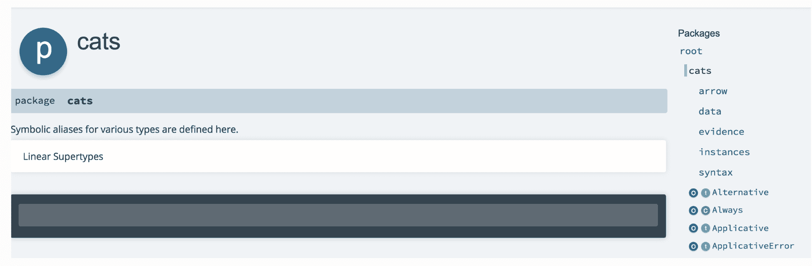

除了这些，顶级包中还有几个子包。其中最重要的是`instances`、`data`和`syntax`。

`instances`包包含了语言核心和`Cats`库定义的基本数据类型的类型类实现。最后，在`data`包下定义了经常遇到但不在语言核心中的数据类型。

我们现在将详细查看这些结构元素中的每一个。我们将从顶级包开始，即`cats`。

# 核心部分

库的核心包`cats`公开了以下 API：

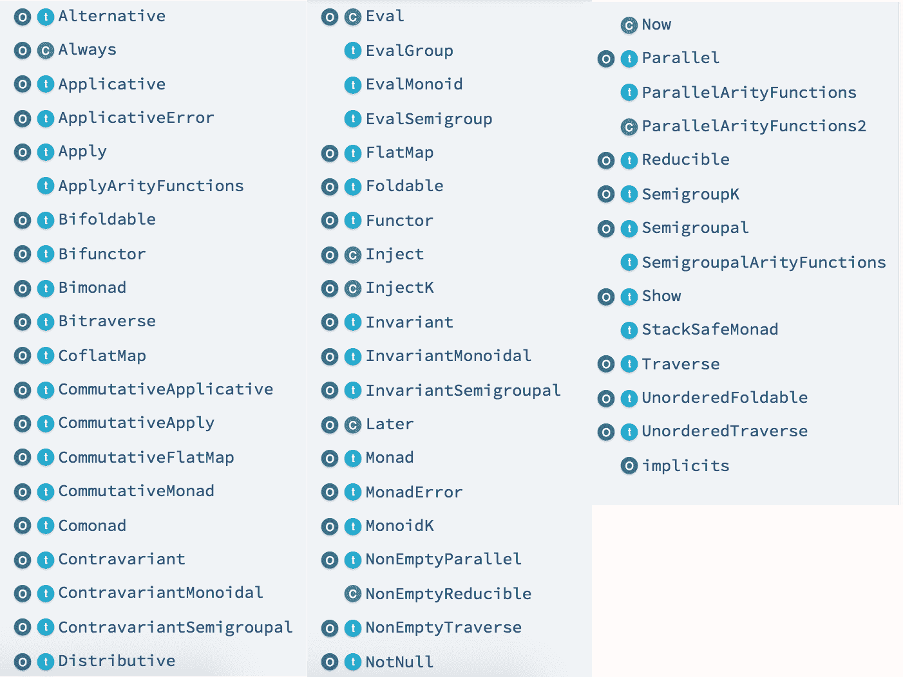

核心包包含由库定义的所有类型类的列表。在`Cats`实现中，类型类模式通常由一个特质及其伴随对象组成。

让我们用一个`Monad`的例子来看看在库的上下文中一个典型的类型类是什么样的：

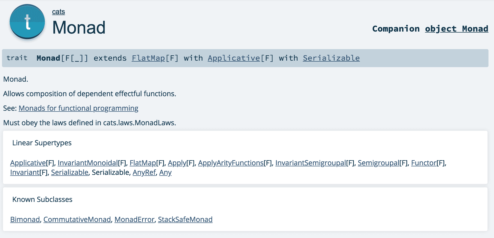

现在我们来更详细地看看`Cats`类型类层次结构中的类型类是如何构建的。

# 类型类层次结构

这里首先要注意的是，类型类是以我们在上一章中看到的形式定义的。另一个要注意的是`Cats`库中类型类的层次结构。例如，`Monad`类扩展了`FlatMap`和`Applicative`类型类，如果你查看类型类的线性超类型，你会看到祖先类非常多。此外，如果你查看子类，你会注意到许多类型类也扩展了`Monad`类型类。

这种层次结构的原因是`Cats`库非常细粒度。我们之前讨论过，类型类可以被看作是用于方法的容器。例如，`Monad`类型类可以一次性定义多个方法。因此，为每个方法定义一个单独的类型类似乎是合理的。现在让我们讨论`Monad`定义的抽象方法。

# 抽象方法

让我们看看`Cats`实现的`Monad`的 Scaladoc 文档的`value member`部分。抽象成员部分是任何类型定义最重要的部分。类型类是一系列工具的声明，其具体实例必须支持这些工具。它们在类型类特质中声明，但没有实现。因此，类型类定义的抽象方法构成了这个类型类的定义。

具体来说，在`Monad`的情况下，我们有三个抽象方法，如下所示：

+   有一个`flatMap`方法，我们已经很熟悉了。

+   纯方法能够将任何值提升到 `F` 的效果类型。

+   存在一个 `tailRecM` 和类型类。它是一个尾递归的 Monadic 循环。这个方法的直觉如下。Monad 的 `flatMap` 定义了效果计算的可序列组合。在有序列的情况下，也可能需要循环。循环是一系列重复执行的指令。因此，循环建立在序列组合之上。如果你定义了序列组合，你可以用它来定义循环。`tailRecM` 的作用是为效果类型下的函数式编程提供一个这样的循环。你可以把它看作是纯函数式编程的 `while` 循环。我们将在本章后面更详细地讨论这个方法。

# 具体方法

除了抽象方法之外，`Monad` 类型类提供了一组预定义的具体值成员。这些成员默认在类型类中实现，因此当你定义类型类实例时，不需要提供这些值成员的实现。它们的定义基于我们之前看到的抽象值成员。这意味着你可以用之前看到的抽象值成员来定义在具体值成员下遇到的每个方法。

具体值成员通常包含在类型类的超类中的抽象值成员的方法是很常见的。以我们已熟悉的 `map` 方法为例。技术上，它作为 `Functor` 类型类的抽象成员。然而，可以仅用 `flatMap` 和纯函数来定义类型类。这两个函数是 `Monad` 类的抽象成员，因此我们可以用具体的实现来覆盖继承的 `map` 函数，如下所示：

```java
def mapA, B(f: A => B): F[B] = fm.flatMap(fa)(x => pure(f(x)))
```

在前面的代码片段中，你可以看到当你有 `flatMap` 和 `pure` 函数时，这个函数是如何实现的。提醒一下，基于 `flatMap` 和 `pure` 函数的这种实现并不总是可取的。有些情况下，你可能希望有一个自定义的函数实现，这些函数可以用抽象方法来实现。在某些场景中，重用你已有的功能并不总是最佳解决方案。

对于这种逻辑的直觉如下。我们已经讨论过，在纯函数式编程中，序列组合是由 Monad 促成的。在本章的后面，我们将看到一个为并行组合设计的类型类。并行组合两个计算的操作符可以有两种实现方式。一种方式是你从真正的并行性中期望的方式。它独立执行计算。例如，如果一个计算失败，另一个计算仍然会继续，并且仍然会产生一个值。然而，可以使用序列组合来帮助实现并行组合操作符。你可能有一个这样的组合实现，它只是顺序地组合两个计算，尽管你可能会将其命名为并行组合操作符。所以，如果你有一个如`flatMap`这样的序列组合操作符，一个简单的并行组合操作符将被定义为使用这个序列组合操作符对计算进行序列组合。

我们进行这次讨论的原因是，Monoid 继承自 Applicative 类型类。Applicative 类型类是为并行计算设计的。它包含一个名为`ap`的方法，该方法旨在并行组合计算。然而，当我们过去讨论`Monad`类型类时，我们没有看到这个方法在抽象成员中。这是因为它是`Monad`类型类的具体成员，这意味着它是使用由 Monad 定义的`flatMap`和`pure`函数实现的。在实践中，这意味着如果你想要执行并行组合，你可能能够做到，这取决于 Monad 或 Applicative 类型类。然而，如果你依赖于 Monad，你可能不会得到真正的并行性，因为它的并行操作符可能是以序列组合的形式实现的。因此，理解类型类的机制非常重要，不要将它们视为某种神奇的东西，因为你可能会遇到意外的错误。

类型类在形式上有一个坚实的数学基础，即范畴论。我们不会在这个关于函数式编程的实用指南中讨论这个理论。然而，在下一节中，我们将触及类型类的数学性质，并讨论它们必须遵守的数学定律。

# 法则

类型类是通过它们支持的方法来定义的。在定义一个类型类时，你并没有一个确切的想法知道对于每一个给定的数据类型，这些方法将如何具体实现。然而，你确实有一个大致的概念，了解这些方法将做什么。例如，我们有一个大致的概念，认为`flatMap`负责序列组合，而纯函数对应于将一个值提升到效果类型而不做其他任何事情。

这种关于方法应该如何表现的信息可以通过类型类必须遵守的数学定律来封装。实际上，大多数类型类都可以从数学的角度来观察，因此它们必须遵守某些定律。

让我们看看 Monads 必须遵守的定律。共有三个，如下所示：

1.  **左单位定律**：`pure(a).flatMap(f) == f(a)`。这意味着如果你有一个原始值`a`和一个函数`f`，该函数接受这个值作为输入并从中计算出一个效果类型，那么直接在`a`上应用这个函数的效果应该与首先在`a`上使用`pure`函数然后与`f`扁平映射的结果相同。

1.  **右单位定律**：`m.flatMap(pure) == m`。这意味着一个纯函数必须将一个值提升到效果类型中，而不执行任何其他操作。这个函数的效果是空的。这也意味着如果你在纯函数上使用`flatMap`函数，纯函数必须表现得像一个恒等函数，这意味着你扁平映射的效果类型将等于扁平映射的结果。

1.  **结合律**：`m.flatMap(f).flatMap(g) == m.flatMap(a => f(a).flatMap(g))`。基本上，这个定律表明`flatMap`应用的优先级并不重要。将结合律与`+`操作符的上下文联系起来思考——`(a + b) + c == a + (b + c)`。

对于大多数类型类，你应该期待定义一些数学定律。它们的含义是，它们为你提供了在编写软件时可以依赖的某些保证。对于`Monad`类型类的每个具体实现，前面的数学定律必须成立。对于任何其他类型类，所有其实现都必须遵守其自己的定律。

由于每个类型类实现都必须遵守某些定律，因此合理地预期所有实现都必须根据这些定律进行测试。由于定律不依赖于类型类的特定实现，并且应该对类型类的每个实现都成立，因此将这些测试定义在定义类型类的同一库中也是合理的。

我们这样做是为了我们不必每次都重新定义这些测试。实际上，这些测试是在`Cats`库的单独模块`cats-laws`中定义的。该模块为每个`cats`类型类定义了定律，并提供与大多数流行测试框架的集成，这样一旦你定义了自己的类型类实现，你就不需要定义测试来检查这个实现是否与数学定律相符。

例如，这是定义`Monad`测试的方式：

```java
implicit override def F: Monad[F]
def monadLeftIdentityA, B: IsEq[F[B]] =
 F.pure(a).flatMap(f) <-> f(a)
def monadRightIdentityA: IsEq[F[A]] =
 fa.flatMap(F.pure) <-> fa
/**
 * Make sure that map and flatMap are consistent.
 */
 def mapFlatMapCoherenceA, B: IsEq[F[B]] =
  fa.flatMap(a => F.pure(f(a))) <-> fa.map(f)
 lazy val tailRecMStackSafety: IsEq[F[Int]] = {
   val n = 50000
   val res = F.tailRecM(0)(i => F.pure(if (i < n) Either.left(i + 1)
    else Either.right(i)))
   res <-> F.pure(n)
 }
```

接下来，让我们讨论如何使用`Cats`库方便地从 Scala 代码中调用由`Monad`定义的方法。让我们看看`Cats`提供了哪些基础设施来暴露效果类型上的方法。

# 语法

我们在这里应该提到，使用具有 *Rich Wrapper* 模式的隐式机制的要求是 Scala 特有的。Scala 是一种混合面向对象和纯函数式风格的编程语言。这就是为什么某些函数式编程特性，如类型类，不是语言的一部分，而是以更通用的方式实现的。这意味着在 Scala 中，方法注入和类型类模式不是一等公民。它们不是在语言级别定义的。相反，它们利用在类级别定义的更通用机制——隐式机制。因此，为了在 Scala 项目中无缝使用类型类，你需要使用这种机制，以便它们能够手动生效。

应该注意的是，这可能不适用于其他函数式语言。例如，Haskell 对类型类编程风格有语言级别的支持。这就是为什么你不需要担心方法注入。这是因为语言本身为你做了所有必要的工作。

然而，像 Scala 这样的语言，它们可能没有对风格的一等公民支持，可能需要你使用这样的机制。类型类编程的确切方法可能因语言而异。在本节中，我们将探讨这对于 Scala 是如何工作的。

我们之前讨论过，Scala 中的方法注入是通过隐式机制和 *Rich Wrapper* 模式实现的。由于这种注入方法的机制是为每个类型类定义的，因此将所需的 Rich Wrappers 与所有类型类一起定义在 `Cats` 库中是有意义的。这确实在 `Cats` 库中实现了，在 `syntax` 包中，如下所示：

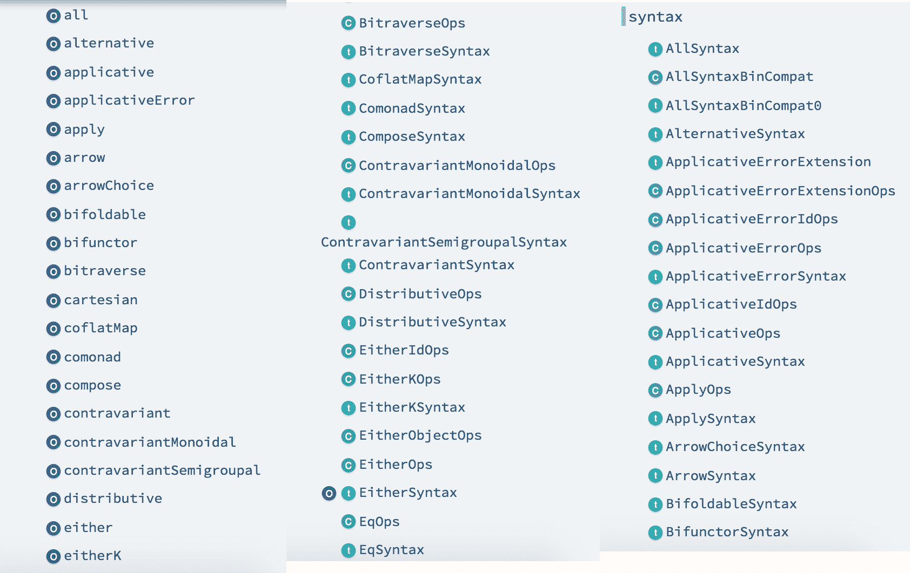

该包包含一系列类和特质。你需要注意它们遵循的命名约定。你会看到许多特性和类以 `Ops` 和 `Syntax` 结尾，例如，`MonadOps` 或 `MonadSyntax`。

除了类和特质之外，你还会注意到这个包中存在一组单例对象。这些对象的名称模仿了它们定义的类型类的名称。

让我们看看这种机制是如何在 `Monad` 类型类中工作的：

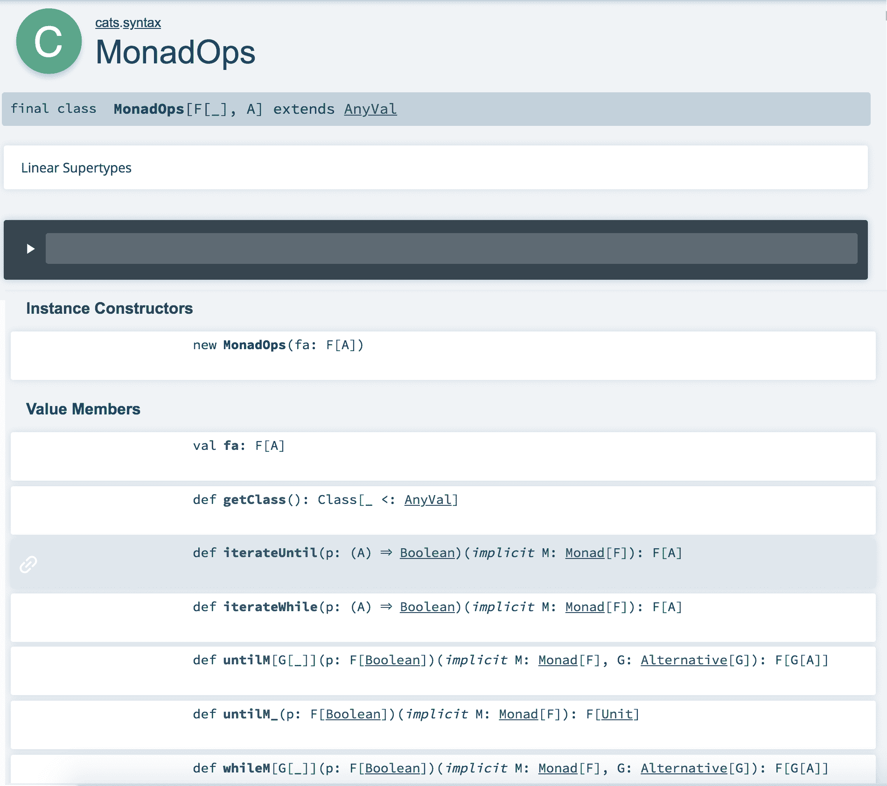

首先，让我们看看 `MonadOps` 类。这是一个 Rich Wrapper，用于 `Monad` 方法注入。它将 `Monad` 类型类提供的方法注入到效果类型 `f` 中。关于它注入的方法，有一点需要注意，那就是所有这些方法都有一个隐式的 `Monad` 参数。它们将其实施委托给这个类型类。

然而，`MonadOps` 类不是一个隐式类——它是一个普通类。我们之前了解到，对于 *Rich Wrapper* 模式，我们需要从效果类型到 Rich Wrapper 的隐式转换。那么，这个转换在哪里定义的，又是如何引入作用域的？为了找出答案，让我们看一下 `MonadSyntax` 特质：

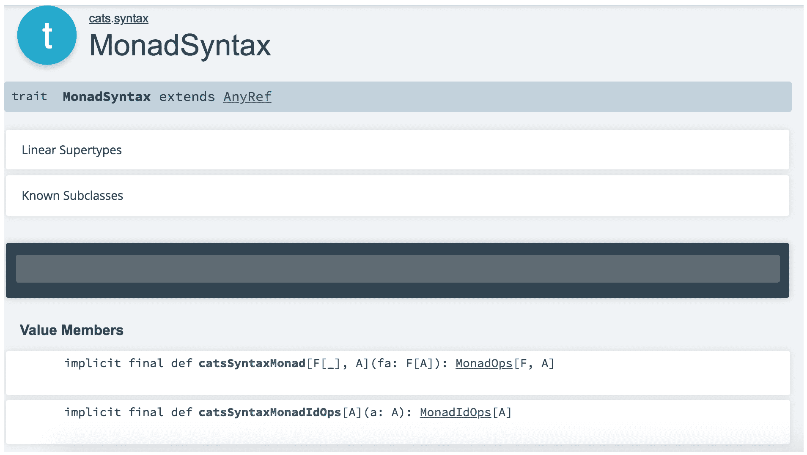

如你所见，`MonadSyntax` 包含隐式方法。这些方法本应将任何对象 `F[A]` 转换为 `MonadOps[F[A]]`。然而，你如何将这些方法引入作用域？

为了这个目的，让我们看一下 Monad 单例：

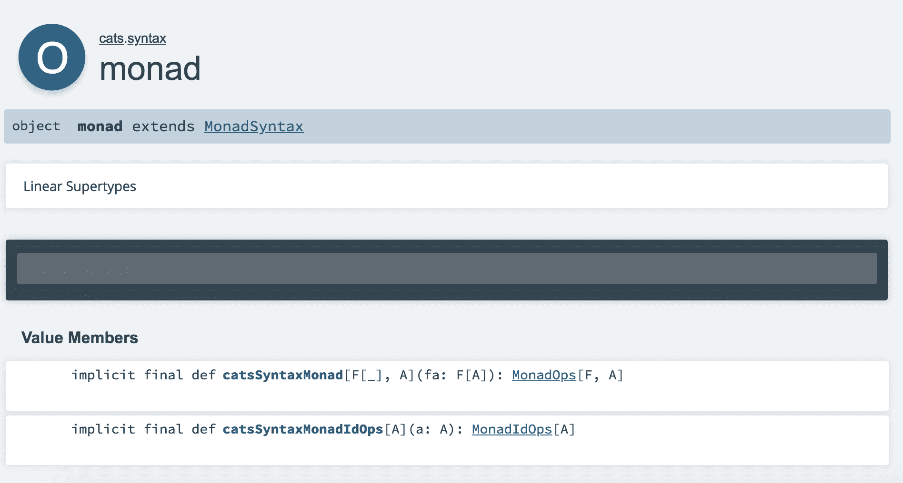

如前述截图所示，单例扩展了 `MonadSyntax` 特质。所以这基本上是 `MonadSyntax` 特质的具体实现。你可以导入这个对象的所有内容，并将 `MonadOps` 的 Rich Wrapper 包含在内。

为什么它被实现为单例和特质的组合？将 Rich Wrapper 实现为一个包含所有必需方法的单例对象不是更方便吗？

如果你查看 `syntax` 包中存在的单例对象的数量，这可以理解。如果你在一个 Scala 文件中使用很多类型类，每个类型类的所有导入都可能很繁琐，难以编写和跟踪。因此，你可能希望一次性引入所有可用类型类的语法，即使你永远不会使用其中大部分。

正是因为这个原因，存在一个 `all` 单例对象，如下截图所示：

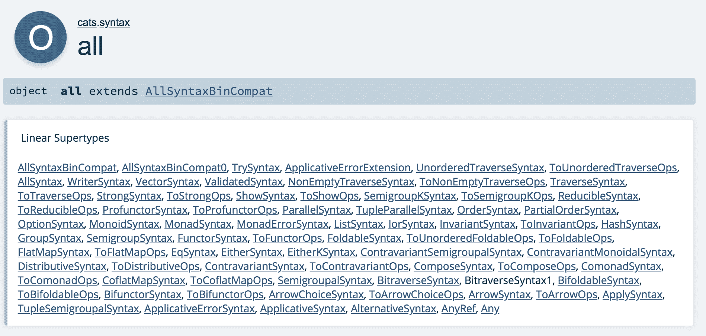

如果你查看这个对象及其超类型，你会发现其祖先构成一个庞大的列表。它们包括在包中定义的所有语法特性。这意味着这个单例对象包含了从效果类型到 Rich Wrappers 的所有隐式转换，这些 Rich Wrappers 将类型类中定义的方法注入到相关效果类型中。你可以将这个对象的所有内容导入到你的项目中，并使所有这些隐式转换在作用域内。这正是我们在特质内部而不是在单例对象内部定义隐式转换的原因。如果你将这些隐式转换定义为单例对象的一部分，你将无法将这些单例对象组合成一个对象，因为你不能从单例对象继承。然而，在 Scala 中你可以从多个特质继承。因此，特质存在的原因是模块化和可组合性。

总结来说，`Cats` 库包含两个主要组件：

+   它包含包装效果类型并注入类型类定义的方法的 Rich Wrapper 类

+   它包含从这些效果类型到 Rich Wrapper 类的隐式转换

在本章的后面部分，我们将看到如何在实际中利用这些功能。

接下来，让我们看看`instances`包的结构和目的。

# 实例

`instances`包公开了以下 API：

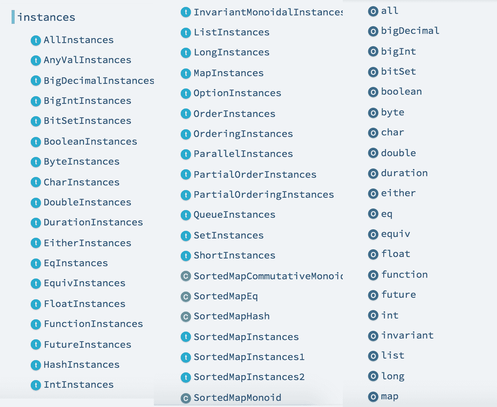

如前一个截图所示，`instances`包包含相当多的实体。与`syntax`包的情况一样，这里要注意的主要是这些实体的命名约定。首先，我们有一组特性和类。它们的命名如下——名称的第一部分是定义实例的类型名称，然后是`Instances`后缀。

同样，也存在一些单例对象，它们的名称与定义实例的类型相对应。

让我们看看实例特质的一个样子：

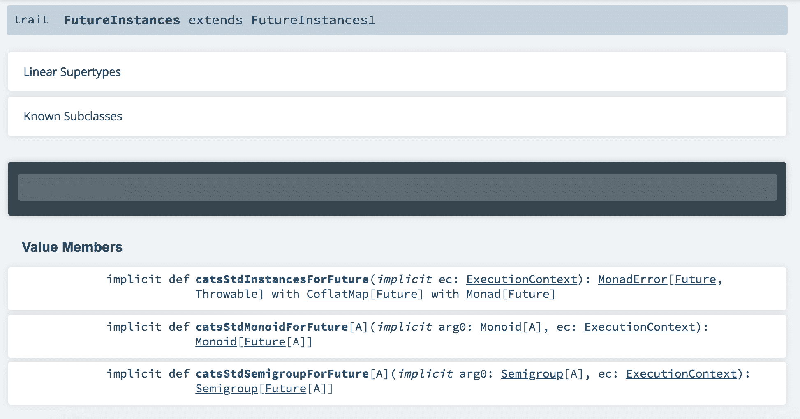

在前一个截图中，你可以看到`FutureInstances`特质的结构。所有的方法都被定义为`implicit`方法，这意味着每当导入这个特质的成员时，它们都会被带入隐式作用域。另一个需要注意的重要事情是方法的返回类型。这些返回类型都是某种类型类。这些方法的含义是为给定效果类型提供各种类型类的隐式实现。还要注意，特质包含了许多针对各种类型类的方法，但它们都是通过`Future`类型参数化的。所有类型类都为此效果类型实现了。

与`syntax`包的情况类似，特质随后被用来创建单例对象。例如，让我们看看`future`单例：

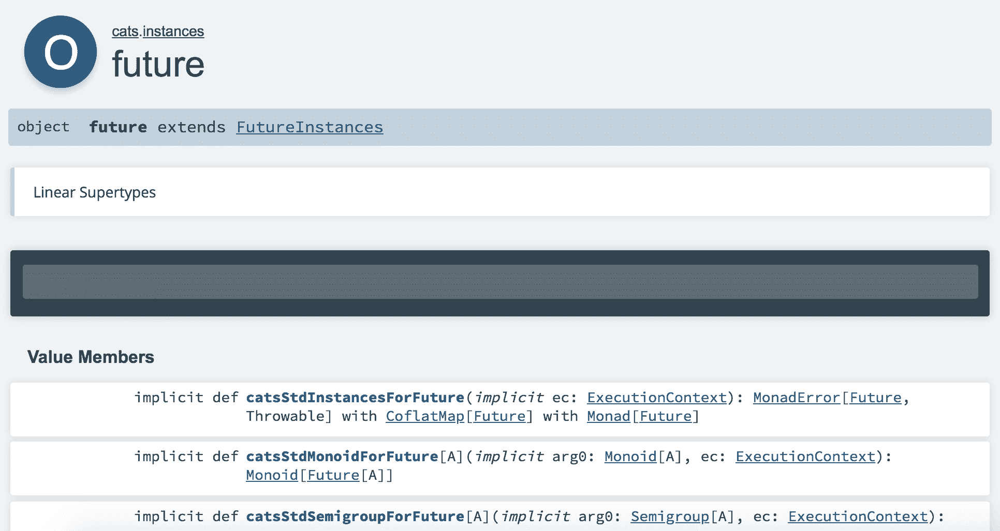

`future`单例对象扩展了`FutureInstances`特质，同样的模式也适用于`instances`包中存在的所有其他单例对象。单例扩展特质的理由与`syntax`包的情况类似：

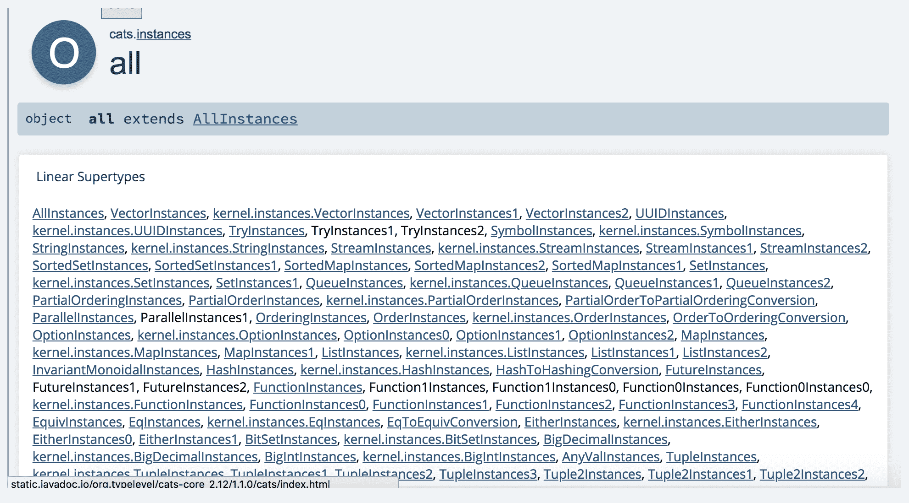

该包还定义了一个`all`单例对象，它扩展了包中存在的所有其他特质。这个策略的价值在于，为了将标准类型类的实现纳入作用域，你只需要导入`all`对象的内容即可。你不需要为每个类型单独导入实现。

最后，让我们来看看`Cats`库的最后一部分，也就是`data`包。

# 数据

现在，让我们讨论一下`data`包，这是你在使用`Cats`进行日常函数式编程时经常会用到的另一个包：

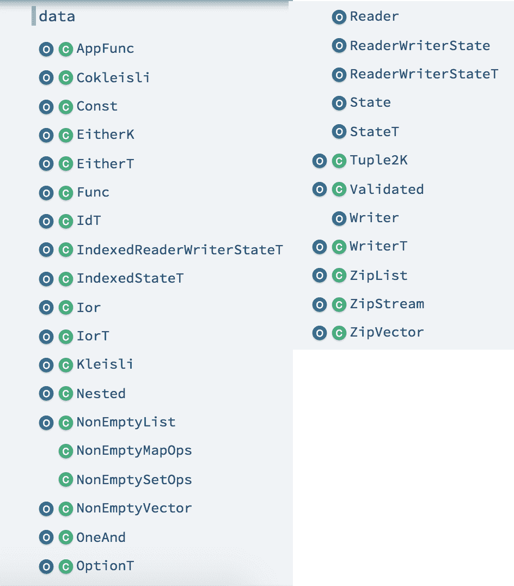

之前，我们讨论了拥有像`cat`这样的库的主要效用是抽象出函数式编程的常见类型类。我们还看到，不仅类型类被抽象化，而且还有各种支持性内容，以便在实践中使用它们时效率更高。这些支持性内容包括语法注入机制和常见效果类型的默认实现。

猫提供的支持性基础设施的最后一部分是一组常见的效果类型。这些类型封装在`data`包下。在这个包下，你会遇到各种数据类型，你可以用它们以纯函数式的方式表达你的副作用。

例如，有如`Reader`、`Writer`等其他数据类型。效果类型通常彼此不相关，你可以真正独立地使用每一个。

# 基础设施协同

在本节中，我们了解了猫是如何定义其类型类以及如何在函数式编程中使用它们。关于`Cats`库需要理解的主要点是其为你这个函数式程序员提供的支持性基础设施，以及如何在实践中具体使用它。

有关的支持性基础设施提供了一组类型类，它们对常见数据类型的实现，以及将它们的方法注入你的效果类型中的机制。此外，cats 还提供了一组常见的效果类型。

该库非常模块化，你可以独立于库的其他部分使用它的各个部分。因此，对于初学者程序员来说，这是一个很好的策略，他们可以简单地从一两个基本类型类开始，并使用库将它们纳入范围。随着你作为函数式程序员逐渐进步，你将开始挑选并熟悉越来越多的类型类和库的各个部分。

在本节中，我们熟悉了`Cats`库的一般结构。在本章的其余部分，我们将熟悉某些常见类型类。我们将了解如何在实践中使用它们。我们还将查看类型类是如何实现的某些机制。

# 类型类

到目前为止，我们已经对`Cats`库及其结构进行了鸟瞰。在本节中，我们将查看`Cats`库中一些在现实项目中经常使用的单个类型类。对于每一个这样的类型类，我们将探讨其存在的动机。我们将详细讨论它们的方法和行为。我们还将查看类型类的使用示例。最后，我们将查看为各种效果类型实现类型类的方法，并查看该类是如何为流行类型实现的，以便你有一个关于类型类实现可能外观的印象。

# 模态

让我们看看如何在 `Monad` 类型类的一个例子中使用来自 `Cats` 库的类型类，我们已经熟悉这个类型类。

在前面的章节中，为了使用 `Monad` 类型类，我们将其定义为临时性的。然而，`Cats` 库提供了我们需要的所有抽象，这样我们就不需要自己定义这个类型类及其语法。

那么，如何在 第七章，“类型类概念”的日志记录示例中使用 `Monad` 类型类呢？如你所回忆，在那个章节中，我们查看了一个日志能力的例子，并讨论了它是 Monad 可以处理的顺序组合的一个好例子。所以，让我们看看如何使用 `cats` 来实现这一点：

```java
import cats.Monad, cats.syntax.monad._
```

首先，我们不再需要自己定义 Monad 特质以及我们通常为其定义语法的伴随对象。我们只需要从 `cats` 中执行一些导入。在前面的代码中，你可以看到首先我们导入了 `cats` 包中的 `Monad` 类型，然后我们导入了 Monad 的语法。我们已经在本章的前一节讨论了这一机制的工作原理。

之后，我们可以定义来自 第七章，“类型类概念”的方法，用于添加两个整数并将它们写入登录过程，如下所示：

```java
def add[F[_]](a: Double, b: Double)(implicit M: Monad[F], L: Logging[F]): F[Double] =
 for {
   _ <- L.log(s"Adding $a to $b")
   res = a + b
   _ <- L.log(s"The result of the operation is $res")
 } yield res
 println(addSimpleWriter) // SimpleWriter(List(Adding 1.0 to
 2.0, The result of the operation is 3.0),3.0)
```

注意，定义看起来与 第七章，“类型类概念”中的定义完全相同。然而，语义上略有不同。Monad 类型来自 `cats` 包，并不是临时定义的。

此外，为了使用我们在 第七章，“类型类概念”中定义的 `SimpleWriter` 效果类型，我们仍然需要为这个数据类型添加一个 Monad 的实现。我们可以这样做：

```java
implicit val monad: Monad[SimpleWriter] = new Monad[SimpleWriter] {
  override def mapA, B(f: A => B):
   SimpleWriter[B] = fa.copy(value = f(fa.value))
  override def flatMapA, B(f: A =>  
   SimpleWriter[B]): SimpleWriter[B] = {
     val res = f(fa.value)
     SimpleWriter(fa.log ++ res.log, res.value)
  }
  override def pureA: SimpleWriter[A] = SimpleWriter(Nil, a)

  override def tailRecMA, B(f: A =>
   SimpleWriter[Either[A,B]]): SimpleWriter[B] = ???
}
```

实际上，`cats` 已经提供了一个类似于我们 `SimpleWriter` 效果类型的类型，这个类型正是为了日志记录而设计的。现在让我们讨论一下如何用 `cats` 提供的功能来替代 `SimpleWriter`。

# Writer 效果类型

`Writer` 效果类型比 `SimpleWriter` 实现提供了更多的通用类型类。然而，如果我们使用它，我们就不需要定义 `SimplerWriter` 类型，以及为其定义类型类的实现。由于 `cats` 为其数据类型提供了类型类的实现，我们不需要担心自己来做这件事。

如你所回忆，我们的 `SimpleWriter` 对象本质上是一个对。对的第一元素是一个字符串列表，它代表了计算过程中记录的所有日志消息。对的另一个元素是计算过程中计算出的值。

`cats`对`Writer`对象的实现基本上与我们更简单的 Writer 实现非常相似，除了对的数据对中的第一个元素不是一个字符串列表，而是一个任意类型。这有一定的实用性，因为现在你可以用它来记录除了字符串列表之外的数据结构。

我们所使用的`SimpleWriter`可以通过显式指定存储日志消息的类型，用`cats Writer`来表示：

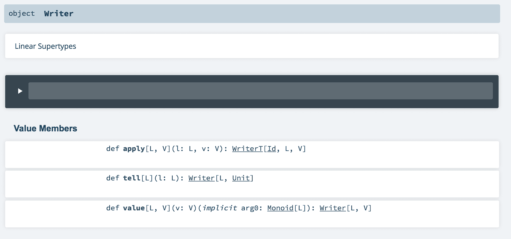

在前面的屏幕截图中，你可以看到`data`包中 Writer 单例对象的文档。这个对象可以用来将日志消息写入 Writer 效果类型。这里最重要的两个方法是`tell`和`value`。`tell`方法将消息写入日志，而`value`方法将任意值提升到 Writer 数据结构中，并带有空日志消息。Writer 数据类型有一个`Monad`实例，它定义了如何顺序组合两个 Writer。在顺序组合过程中，两个效果类型的日志被合并成一个。

此外，如果你查看`cats`的`data`包，你会发现没有名为 Writer 的特质或类。Writer 数据类型的真实名称是`WriterT`。关于`cats`有一件事需要记住，那就是它旨在提供高度通用和抽象的工具，这些工具可以在各种不同的场景中使用。因此，在这种情况下，使用了 Monad Transformers 技术，这就是为什么它有`WriterT`这个奇怪名称的原因。目前，你不需要担心 Monad Transformers，你可以使用在`cats`中定义的 Writer 类型，它是基于`WriterT`的。Writer 单例提供了一套方便的方法来处理它。

由于 Writer 数据类型是`cats`的标准数据类型，我们可以用来自`cats`的 Writer 替换我们的自定义`SimpleWriter`，并且我们还可以从我们的应用程序中完全删除 Logging 类型类。我们这样做的原因是标准化`Cats`库。这种标准化使代码更加紧凑，消除了冗余，并提高了可靠性。我们这样做是因为我们使用的是标准工具，而不是临时重新发明它们。

在代码片段中，你可以看到一个来自第七章，“类型类概念”的加法方法的实现，使用了我们之前讨论的`cats`的能力。

```java
def add(a: Double, b: Double): Writer[List[String], Double] =
  for {
    _ <- Writer.tell(List(s"Adding $a to $b"))
    res = a + b
    _ <- Writer.tell(List(s"The result of the operation is $res"))
  } yield res
  println(add(1, 2)) // WriterT((List(Adding 1.0 to 2.0,
   The result of the operation is 3.0),3.0))
```

# `tailRecM`方法

在本节之前，我们简要提到了`tailRecM`方法。它在某些情况下非常有用，因为它允许你在效果类型的上下文中定义循环。在本小节中，让我们更详细地看看它的签名以及这个方法是如何工作的：

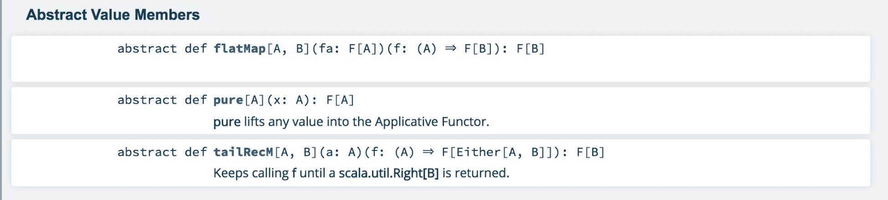

让我们看看这个方法的参数。首先，让我们看看这个方法的第二个参数，即`f`函数。该函数接受类型`A`的原始值，该函数的结果是一个效果类型，即`F[Either[A, B]]`。

让我们思考一下我们可以如何使用这个计算来使其成为一个循环。假设我们从某个值`A`开始。假设我们在该值上运行计算`f`。那么，我们的结果是类型`F[Either[A, B]]`。这个类型的确切可能性有两种——要么是`F[Left[A]]`，要么是`F[Right[B]]`。如果是`F[Left[A]]`，那么我们可以在`F[Left[A]]`上使用`flatMap`；之后，我们可以从`Left`中提取`A`，然后我们可以在那个`A`上再次运行计算`f`。如果是`F[Right[B]]`，就没有其他事情可做，只能返回计算的结果，即`F[B]`。

因此，传递给`tailRecM`的函数将在参数`A`上运行，同时产生类型为`F[Left[A]]`的结果。一旦它产生`F[Right[B]]`，这个结果就被视为最终结果，并从循环中返回。

基本上，如果我们有能力在效果类型`F`上执行`flatMap`，那么我们也能基于`flatMap`定义一个循环。然而，为什么它是一个抽象方法？如果创建循环只需要执行`flatMap`的能力，那么为什么我们不能将其定义为基于`flatMap`的具体方法？

好吧，我们可能想要尝试这样做。考虑我们的`SimpleWriter`示例的 Monad 实现，如下所示：

```java
override def tailRecMA, B(f: A => SimpleWriter[Either[A,B]]):
  SimpleWriter[B] = f(a).flatMap {
   case Left (a1) => tailRecM(a1)(f)
   case Right(res) => pure(res)
}
```

在前面的示例中，我们有一个基于`flatMap`的`tailRecM`。如果我们尝试一个无限循环会发生什么？

```java
Monad[SimpleWriter].tailRecMInt, Unit { a => Monad[SimpleWriter].pure(Left(a))}
```

前面的代码会导致`StackOverflowError`：

```java
[error] java.lang.StackOverflowError
...
[error] at jvm.TailRecM$$anon$1.tailRecM(TailRecM.scala:18)
[error] at jvm.TailRecM$$anon$1.$anonfun$tailRecM$1(TailRecM.scala:19)
[error] at jvm.SimpleWriter.flatMap(AdditionMonadic.scala:19)
[error] at jvm.TailRecM$$anon$1.tailRecM(TailRecM.scala:18)
[error] at jvm.TailRecM$$anon$1.$anonfun$tailRecM$1(TailRecM.scala:19)
[error] at jvm.SimpleWriter.flatMap(AdditionMonadic.scala:19)
[error] at jvm.TailRecM$$anon$1.tailRecM(TailRecM.scala:18)
[error] at jvm.TailRecM$$anon$1.$anonfun$tailRecM$1(TailRecM.scala:19)
[error] at jvm.SimpleWriter.flatMap(AdditionMonadic.scala:19)
[error] at jvm.TailRecM$$anon$1.tailRecM(TailRecM.scala:18)
[error] at jvm.TailRecM$$anon$1.$anonfun$tailRecM$1(TailRecM.scala:19)
[error] at jvm.SimpleWriter.flatMap(AdditionMonadic.scala:19)
...
```

这种错误最频繁地发生在递归调用的情况下，我们耗尽了由 JVM 为我们分配的内存栈帧。

每当你执行一个方法调用时，JVM 都会为该调用分配一个特定的内存片段，用于所有变量和参数。这个内存片段被称为栈帧。因此，如果你递归地调用一个方法，你的栈帧数量将与递归的深度成比例增长。可用于栈帧的内存是在 JVM 级别设置的，通常高达 1 MB，并且如果递归足够深，很容易达到其限制。

然而，在某些情况下，你不需要在递归的情况下创建额外的栈帧。这里，我们谈论的是尾递归。基本上，如果你不再需要递归的先前栈帧，你可以将其丢弃。这种情况发生在方法拥有栈帧且没有其他事情可做时，并且该方法的输出完全依赖于递归后续调用的结果。

例如，考虑以下阶乘计算的示例：

```java
def factorial(n: Int): Int =
  if (n <= 0) 1
  else n * factorial(n - 1)
println(factorial(5)) // 120
```

在前面的代码中，`factorial` 函数是递归定义的。因此，为了计算一个数字 `n` 的阶乘，你首先需要计算 `n-1` 的阶乘，然后将它乘以 `n`。当我们递归地调用 `factorial` 方法时，我们可以问一个问题：在递归调用完成后，在这个方法中我们是否还需要做其他事情，或者它的结果是否只依赖于我们递归调用的方法。更确切地说，我们是在讨论在 `factorial` 函数内部对阶乘调用之后是否还需要做其他事情。答案是，我们需要执行一个额外的步骤来完成计算。这个步骤是将阶乘调用的结果乘以数字 `n`。所以，直到这个步骤完成，我们才不能丢弃当前调用的栈帧。然而，考虑以下定义的 `factorial` 方法：

```java
def factorialTailrec(n: Int, accumulator: Int = 1): Int =
  if (n <= 0) accumulator
  else factorialTailrec(n - 1, n * accumulator)
println(factorialTailrec(5)) // 120
```

在前面的例子中，当我们调用 `factorial` 方法时，我们可以问自己以下问题——在调用 `factorial` 方法之后，我们是否还需要在方法中做其他事情来完成它的计算？或者这个方法的结果是否完全依赖于我们在这里调用的 `factorial` 方法的结果？答案是，我们在这里不需要做其他任何事情。

Scala 编译器可以识别这种情况，并在可以重用先前递归调用栈帧的地方进行优化。这种情况被称为**尾递归**。一般来说，这样的调用比普通递归更高效，因为你不能因为它们而得到栈溢出，而且一般来说它们的速度与普通 `while` 循环的速度相当。

事实上，你可以在 Scala 中明确地对一个方法提出要求，使其成为尾递归，如下所示：

```java
@annotation.tailrec
def factorialTailrec(n: Int, accumulator: Int = 1): Int =
 if (n <= 0) accumulator
 else factorialTailrec(n - 1, n * accumulator)
```

在前面的例子中，第一个方法将无法编译，因为它虽然被标注了 `@tailrec`，但不是尾递归。Scala 编译器将对所有标注了 `@tailrec` 的方法进行检查，以确定它们是否是尾递归。

让我们回顾一下 `tailRecM` 的例子。从名字上，你现在可以猜到这个方法应该是尾递归的。现在，让我们回忆一下 `SimpleWriter` 的这个方法的原始实现。它的执行导致了栈溢出异常。这是因为在这里，递归被分割成几个方法。所以如果你查看堆栈跟踪输出，你可以看到输出是周期性的。在这个输出中有两个方法在重复——`flatMap` 和 `tailRecM`。Scala 编译器无法证明在这种情况下该方法是否是尾递归。原则上，你可以想出一个方法来优化递归，即使在这种情况下，但 Scala 编译器无法做到这一点。

此外，让我们看看如果你尝试使用 `@tailrec` 注解声明 `tailRecM` 方法会发生什么：

```java
@annotation.tailrec
override def tailRecMA, B(f: A => SimpleWriter[Either[A,B]]): SimpleWriter[B] =
 f(a).flatMap {
  case Left (a1) => tailRecM(a1)(f)
  case Right(res) => pure(res)
 }
```

你会发现代码无法编译，因为该方法没有被识别为尾递归：

```java
[error] /Users/anatolii/Projects/1mastering-funprog/Chapter8/jvm/src/main/scala/jvm/TailRecM.scala:19:12: could not optimize @tailrec annotated method tailRecM: it contains a recursive call not in tail position
[error] f(a).flatMap {
[error] ^
```

将此方法作为抽象方法的目的正是您必须实现它，而不是使用 `flatMap`（这不可避免地会导致周期性递归），而是使用一个单一尾递归方法。例如，在 `SimpleWriter` 的上下文中，我们可以提出如下这样的实现：

```java
@annotation.tailrec
 override def tailRecMA, B(f: A => SimpleWriter[Either[A,B]]):
 SimpleWriter[B] = {
   val next = f(a)
   next.value match {
     case Left (a1) => tailRecM(a1)(f)
     case Right(res) => pure(res)
   }
 }
```

在前面的代码片段中，如您所见，我们以尾递归的方式实现了 `tailRecM`。请注意，我们仍在使用与 `flatMap` 函数中使用的类似的技术。然而，这些技术被封装在一个单一的方法中，该方法是以尾递归的方式实现的。

应该指出的一点是，并非每个 Monad 实现都有 `tailRecM` 的实现。您经常会遇到 `tailRecM` 只会抛出 `NotImplementedError` 的场景：

```java
override def tailRecMA, B(f: A => SimpleWriter[Either[A,B]]): SimpleWriter[B] = ???
```

Scala 中使用 `???` 语法方便地抛出这样的错误。

到目前为止，我们已经讨论了在副作用计算组合的上下文中 `flatMap`。现在，让我们看看一个副作用计算与非副作用计算组合的例子。让我们看看 Functor。

# Functor

在函数式编程中经常遇到的其他类型类是 Functor。Functor 的本质是关于 map 函数。如您从前面的章节中回忆起来，`map` 函数与 `flatMap` 函数非常相似；然而，它接受一个非副作用计算作为其参数。它用于在转换本身不是副作用的情况下，在效果类型的上下文中转换一个值。

如果您想在不需要从其效果类型中提取结果的情况下对副作用计算的结果进行操作，您可能会想使用 Functor。

如您所知，在处理 Monad 的 `flatMap` 的情况下，我们使用了序列组合的直觉。这种直觉对于 Functor 可能并不是最好的。在 `map` 的情况下，我们可以使用另一种关于函数的直觉，即在效果类型下改变一个值。在这种情况下抽象的操作是从效果类型中提取值。`map` 方法只询问您想要如何处理副作用计算的结果，而不要求您提供有关如何从效果类型中提取此结果的确切信息。

正如我们在前几节中详细讨论了 `Monad` 类型类的情况一样，我们已经在之前详细讨论了 `map` 方法，因此我们不会在这个类型类上停留太久。我们只是想看看您如何可能想要使用 `Cats` 库来使用它。

让我们看看 `Cats` 库为 Functor 定义的类：

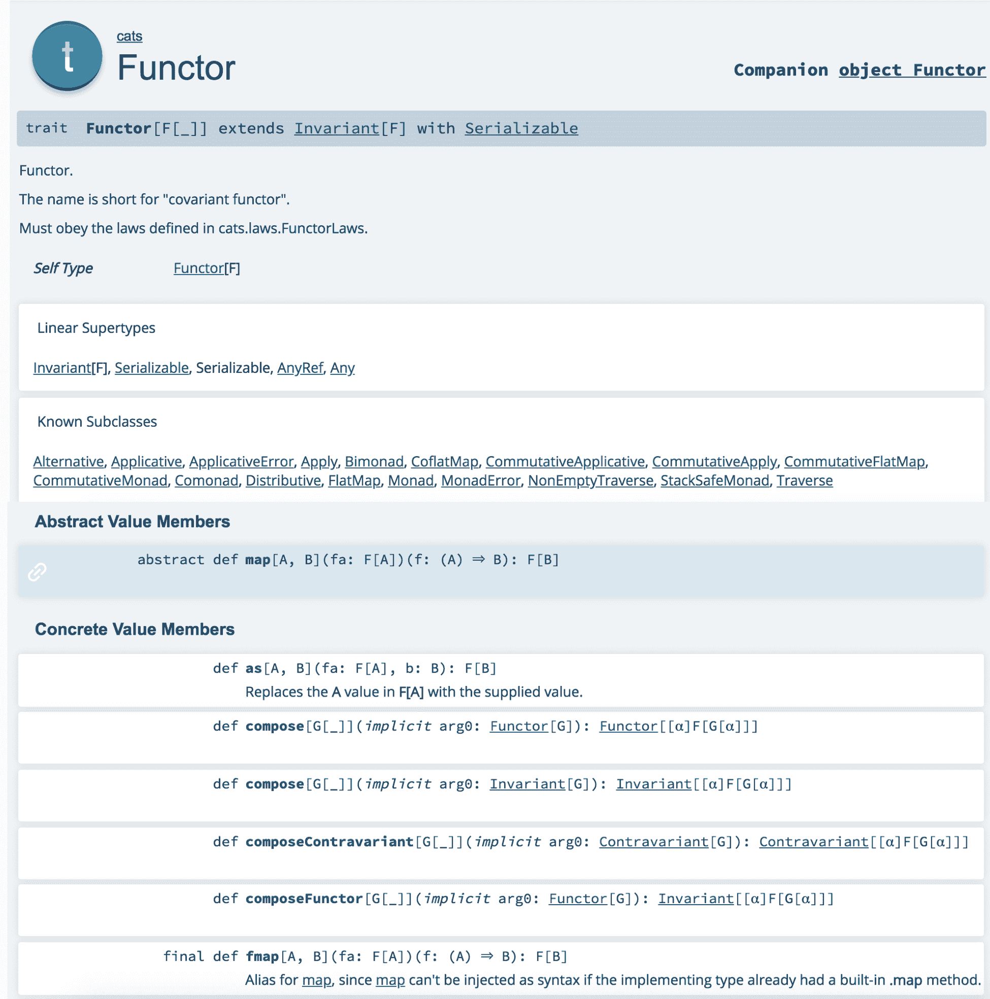

在前面的屏幕截图中，您可以查看 Functor 类型类的文档和定义。现在，让我们看看 `SimpleWriter` 类型可能的实现。首先，让我们回顾一下 `SimpleWriter` 数据类型的定义：

```java
case class SimpleWriterA
```

现在我们需要提供`Cats`库中 Functor 类型类的实现。我们将从`Cats`库中做一些导入：

```java
import cats._, cats.implicits._
```

在前面的代码中，我们正在导入`cats`包中的 Functor 类型（通过导入`cats._`）。之后，我们必须导入这个类型类的语法（通过导入`cats.implicits._`导入所有类型类的语法和实例）。所以，每当类型类的实现处于作用域内时，我们也将有它的语法注入。

因此，让我们为`SimpleWriter`类型类提供实现：

```java
implicit val simpleWriterFunctor: Functor[SimpleWriter] =
 new Functor[SimpleWriter] {
   override def mapA, B(f: A => B):
    SimpleWriter[B] = fa.copy(value = f(fa.value))
 }
```

在前面的代码中，你可以看到一个简单的`SimpleWriter`类型类的 Functor 实现。正如你所见，我们只需要实现这个类型类的`map`方法。

之后，一旦我们创建了一些非常简单的效果类型实例，我们就能调用它的`map`方法：

```java
val x = SimpleWriter(Nil, 3)
println(x.map(_ * 2)) // SimpleWriter(List(),6)
```

因此，`map`方法被注入到我们的效果类型中。

你可能会有一个疑问，这个做法的意义是什么？如果 Functor 和 Monad 都定义了`map`方法，为什么还要有 Functor 呢？为什么不在需要`map`方法的每个类型类中都有 Monad 实现，而不去关心 Functor 类呢？答案是，并不是每个效果类型都有`flatMap`方法的实现。所以，一个效果类型可能有一个`map`的实现，但可能无法定义其上的`flatMap`。因此，`Cats`库提供了一个精细的类型类层次结构，这样你可以根据自己的需求来使用它。

到目前为止，我们已经讨论了用于顺序组合的类型类。现在，让我们看看并行组合的情况以及 Applicative 类型类是如何处理它的。

# Applicative

知道如何按顺序组合计算是一种基本技能，它使得过程式编程得以实现。这是我们默认依赖的东西，当我们使用命令式编程语言时。当我们按顺序写两个语句时，我们隐含地意味着这两个语句应该一个接一个地执行。

然而，顺序编程无法描述所有编程情况，特别是如果你在一个应该并行运行的应用程序上下文中工作。可能会有很多你想要并行组合计算的情况。这正是 Applicative 类型类发挥作用的地方。

# 动机

假设有两个独立的计算。假设我们有两个计算数学表达式，然后我们需要组合它们的结果。也假设它们的计算是在`Either`效果类型下进行的。所以，主要思想是这两个计算中的任何一个都可能失败，如果其中一个失败了，解释的结果将留下一个错误，如果成功了，结果是某个结果的`Right`：

```java
type Fx[A] = Either[List[String], A]
def combineComputations[F[_]: Monad](f1: F[Double], f2: F[Double]): F[Double] =
 for {
   r1 <- f1
   r2 <- f2
 } yield r1 + r2
val result = combineComputationsFx, 
 Monad[Fx].pure(2.0))
 println(result) // Right(3.0)
```

在前面的代码中，你可以看到如何使用`Monad`类型类按顺序组合两个这样的计算。在这里，我们使用列表推导式来计算第一个计算的结果，然后是第二个计算。

让我们看看一个这些计算出错的情况：

```java
val resultFirstFailed = combineComputationsFx), Monad[Fx].pure(2.0))
 println(resultFirstFailed) // Left(List(Division by zero))
val resultSecondFailed = combineComputationsFx, Left(List("Null pointer encountered")))
 println(resultSecondFailed) // Left(List(Null pointer encountered))
```

你可以看到两种情况和两种输出。第一种是第一个计算出错的情况，第二种是第二个计算出错的情况。所以，基本上，合并计算的结果将是`Left`，如果两个计算中的任何一个都失败了。

如果这两个计算都失败了会怎样？

```java
val resultBothFailed = combineComputations(
 Left(List("Division by zero")), Left(List("Null pointer encountered")))
 println(resultBothFailed) // Left(List(Division by zero))
```

你可以看到这两种计算都失败的情况的输出。第一个计算只得到一个错误输出。这是因为它们是按顺序组合的，序列在第一个错误时终止。对于`Either`的`Monad`行为是在遇到`Left`时终止顺序组合。

这种情况可能并不总是期望的，特别是在由大量可能失败的各个模块组成的大型应用程序中。在这种情况下，出于调试目的，你希望尽可能多地收集已发生的错误信息。如果你一次只收集一个错误，并且你有数十个独立的计算失败，你必须逐个调试它们，因为你将无法访问已发生的整个错误集。这是因为只有遇到的第一个错误将被报告，尽管这些计算是相互独立的。

这种情况发生的原因是因为我们组合计算的方式的本质。它们是按顺序组合的。顺序组合的本质是按顺序运行计算，即使它们不依赖于彼此的结果。由于这些计算是按顺序运行的，如果在链中的某个链接发生错误，中断整个序列是自然而然的。

解决前一个场景的方法是将独立的计算并行执行而不是按顺序执行。因此，它们都应该独立于彼此运行，并在完成后以某种方式合并它们的结果。

# Applicative 类型类

我们希望为前一个场景定义一个新的原始方法。我们可以称这个方法为`zip`：

```java
type Fx[A] = Either[List[String], A]
def zipA, B: Fx[(A, B)] = (f1, f2) match {
  case (Right(r1), Right(r2)) => Right((r1, r2))
  case (Left(e1), Left(e2)) => Left(e1 ++ e2)
  case (Left(e), _) => Left(e)
  case (_, Left(e)) => Left(e)
}
```

该方法将接受两个计算作为其参数，并将输出两个提供的输入的合并结果，作为一个元组，其类型是它们共同的效果类型。

还要注意，我们正在处理`Left`是一个字符串列表的特定情况。这是为了将多个失败的计算的多个错误字符串合并成一个错误报告。

它的工作方式是，如果两个编译都成功，它们的组合结果将是一个对。否则，如果这些计算中的任何一个失败，它们的错误将收集在一个组合列表中。

给定新的方法`zip`，我们可以将前面的例子表达如下：

```java
def combineComputations(f1: Fx[Double], f2: Fx[Double]): Fx[Double] =
 zip(f1, f2).map { case (r1, r2) => r1 + r2 }

val result = combineComputations(Monad[Fx].pure(1.0),
  Monad[Fx].pure(2.0))
  println(result) // Right(3.0)

val resultFirstFailed = combineComputations(
  Left(List("Division by zero")), Monad[Fx].pure(2.0))
  println(resultFirstFailed) // Left(List(Division by zero))

val resultSecondFailed = combineComputations(
  Monad[Fx].pure(1.0), Left(List("Null pointer encountered")))
  println(resultSecondFailed) // Left(List(Null pointer encountered))

val resultBothFailed = combineComputations(
  Left(List("Division by zero")), Left(List("Null pointer encountered")))
  println(resultBothFailed) // Left(List(Division by zero, Null pointer 
  encountered))
```

注意，这里我们使用`zip`来创建两个独立计算的组合版本，并处理我们使用`map`方法对这个计算结果进行操作的事实。

实际上，我们可以用更通用的`ap`（即`apply`）函数来表达`zip`函数。具体如下：

```java
def apA, B(fa: Fx[A]): Fx[B] = (ff, fa) match {
  case (Right(f), Right(a)) => Right(f(a))
  case (Left(e1), Left(e2)) => Left(e1 ++ e2)
  case (Left(e), _) => Left(e)
  case (_, Left(e)) => Left(e)
}
```

我们可以这样表达`zip`函数，即通过`ap`函数：

```java
def zipA, B: Fx[(A, B)] =
 apB, (A, B)](Right { (a: A) => (b: B) => (a, b) })(f1))(f2)
```

`ap`函数的实际意义是表达两个独立计算同时运行的一种更通用的方式。技巧在于第一个计算结果是一个函数`F[A => B]`，第二个计算是一个原始计算`F[A]`。关于这个函数以及为什么它在本质上与`zip`函数不同，以下是一些说明。干预是组合加执行。它组合了一些提升到效果类型`F`的值，以及一个在值上工作的计算`A => B`，这个计算也被提升到`F`的上下文中。由于在组合时我们已处理效果类型，因此我们已经完成了独立计算。与`flatMap`的情况相比，其中一个参数是一个函数`A => F[B]`，它输出一个效果类型。所以，在`flatMap`的情况下，其中一个参数是一个将要被执行的函数。这是`flatMap`的责任，它将执行它并获得结果`F[B]`。这不能应用于`ap`，因为`ap`已经可以访问效果类型计算的结果——`F[A => B]`和`F[A]`。因此，存在计算的独立性。由于计算的效果类型中的一个值是一个函数`A => B`，它不仅是在组合中通过`zip`成对，而且也是一个类似于映射的执行。

实际上，`ap`函数来自`Apply`类型类，它是`Applicative`的祖先：

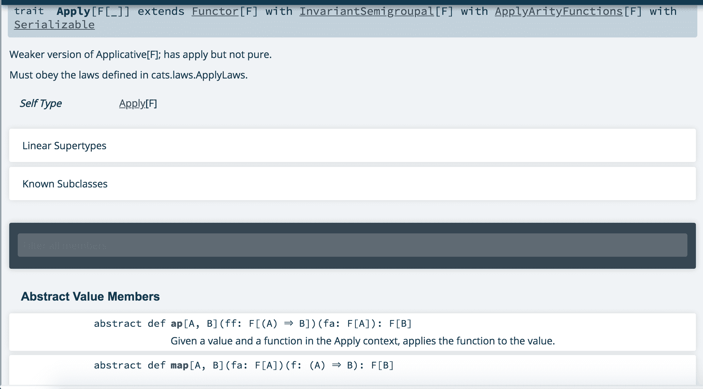

然而，你将更频繁地遇到扩展`Apply`类型类的`Applicative`版本。这些类型类之间的唯一区别是`Applicative`还有一个`pure`函数，该函数用于将原始值`a`提升到相同的效果类型`F`。

`Applicative`还有许多以`ap`为依据的有用具体方法。`cats`还为你提供了一些语法糖支持，以便你可以以直观的方式在你的项目中使用`Applicative`。例如，你可以同时对两个值执行`map`操作，如下所示：

```java
def combineComputations(f1: Fx[Double], f2: Fx[Double]): Fx[Double] =
 (f1, f2).mapN { case (r1, r2) => r1 + r2 }
```

我们可以使用`cats`在元组中注入的语法糖，以便轻松处理这种并行计算的情况。因此，你只需将两个效果类型组合成一个元组，并在作用域中使用`Applicative`类型类来映射它们。

# 类型类的实现

让我们看看类型类如何为数据类型实现。例如，让我们看看`Either`：

```java
implicit val applicative: Applicative[Fx] = new Applicative[Fx] {
  override def apA, B(fa: Fx[A]): Fx[B] = (ff, fa)
  match {
    case (Right(f), Right(a)) => Right(f(a))
    case (Left(e1), Left(e2)) => Left(e1 ++ e2)
    case (Left(e), _) => Left(e)
    case (_, Left(e)) => Left(e)
  }
  override def pureA: Fx[A] = Right(a)
}
```

你可以看到如何为`Either`实现类型类，其中`Left`是`List[String]`。所以，正如你所看到的，如果两个计算都成功了，即它们是`Right`，我们简单地将它们合并。然而，如果至少有一个是`Left`，我们将两个计算的`Left`部分合并成一个`Left[List[String]]`。这是专门针对可能产生错误并且你希望在一个单一的数据结构下合并的几个独立计算的情况。

你可能已经注意到我们正在使用`Either`的一个非常具体的案例——即`Left`总是`List[String]`的情况。我们之所以这样做，是因为我们需要一种方法将两个计算中的`Left`部分合并成一个，而我们无法合并泛型类型。前一个例子可以进一步推广到`Left`类型的任意版本，即`Either[L, A]`。这可以通过`Monoid`类型类来实现，我们将在下一节中学习它。所以，让我们来看看这个类型类，看看它在哪里可以派上用场。

# Monoid

`Monoid`是你在实践中经常遇到的一个流行的类型类。基本上，它定义了如何组合两种数据类型。

作为 Monoid 的一个例子，让我们看看为`Either`数据类型实现 Applicative 类型类的实现。在前一节中，我们被迫使用一个特定的`Either`版本，即`Left`被设置为字符串列表的那个版本。这正是因为我们知道如何合并两个字符串列表，但我们不知道如何合并任何两种泛型类型。

如果我们定义前面提到的 Applicative 的签名如下，那么我们将无法提供一个合理的函数实现，因为我们无法合并两个泛型类型：

```java
implicit def applicative[L]: Applicative[Either[L, ?]]
```

如果你尝试编写这个函数的实现，它可能看起来像以下这样：

```java
override def apA, B(fa: Either[L, A]): 
Either[L, B] = (ff, fa) match {
  case (Right(f), Right(a)) => Right(f(a))
  case (Left(e1), Left(e2)) => Left(e1 |+| e2)
  case (Left(e), _) => Left(e)
  case (_, Left(e)) => Left(e)
}
```

我们使用一个特殊的操作符`|+|`来描述我们一无所知的两种数据类型的组合操作。然而，由于我们对我们要组合的数据类型一无所知，代码将无法编译。我们不能简单地组合任意两种数据类型，因为编译器不知道如何做到这一点。

如果我们让 Applicative 类型类隐式地依赖于另一个知道如何隐式合并这两种数据类型的类型类，这种状况就可以改变。那就是 Monoid：

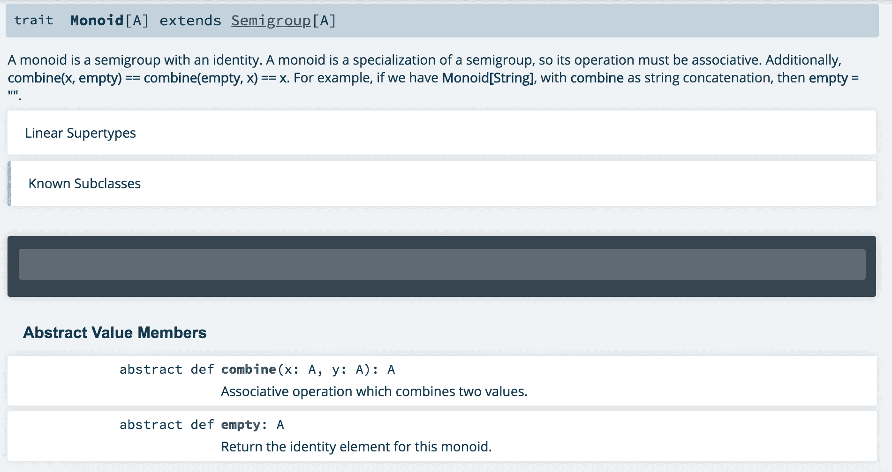

`Monoid`类型类扩展了`Semigroup`。`Semigroup`是一种数学结构。它是一个定义为以下类型的类型类：

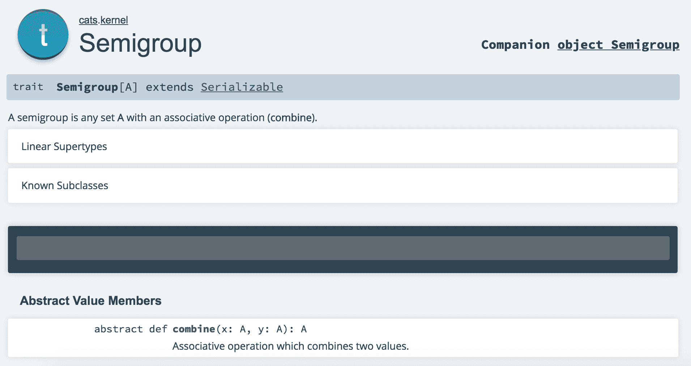

基本上，**半群**是在抽象代数和集合论中定义的。给定一个集合，一个**半群**是这个集合上的一个结构，它定义了一个运算符，可以将集合中的任意两个元素组合起来产生集合中的另一个元素。因此，对于集合中的任意两个元素，你可以使用这个运算符将它们组合起来，产生另一个属于这个集合的元素。在编程语言中，`Semigroup`是一个可以定义的类型类，如前一个屏幕截图所示。

在前一个屏幕截图中，你可以看到`Semigroup`定义了一个名为`combined`的单个方法。它接受两个类型为`A`的参数，并返回另一个类型为`A`的值。

理解`Semigroup`的一个直观方法是看看整数上的加法运算：

```java
implicit val semigroupInt: Semigroup[Int] = new Semigroup[Int] {
  override def combine(a: Int, b: Int) = a + b
}
```

在整数加法运算中，`+`是一个运算符，可以用来将任意两个整数组合起来得到另一个整数。因此，加法运算在所有可能的整数集合上形成一个`Semigroup`。`cats`中的`Semigroup`类型类将这个想法推广到任何任意类型`A`。

回顾我们的 Monoid 示例，我们可以看到它扩展了`Semigroup`并为其添加了另一个名为`empty`的方法。Monoid 必须遵守某些定律。其中一条定律是`empty`元素必须是`combined`运算的单位元。这意味着以下等式必须成立：

```java
combine(a, empty) == combine(empty, a) == a
```

所以基本上，如果你尝试将空单位元与集合`A`中的任何其他元素组合，你将得到相同的元素作为结果。

理解这个点的直观方法是看看整数加法运算：

```java
implicit def monoidInt: Monoid[Int] = new Monoid[Int] {
  override def combine(a: Int, b: Int) = a + b
  override def empty = 0
}
```

你可以看到整数 Monoid 的实现。如果我们把运算定义为加法，那么`0`是一个空元素。确实，如果你将`0`加到任何其他整数上，你将得到这个整数作为结果。`0`是加法运算的单位元。

这条关于**加法运算**的评论确实非常重要，需要注意。例如，`0`不是乘法运算的单位元。实际上，如果你将`0`与任何其他元素相乘，你将得到`0`而不是那个其他元素。说到乘法，我们可以定义一个整数乘法运算和单位元为`1`的 Monoid，如下所示：

```java
implicit def monoidIntMult: Monoid[Int] = new Monoid[Int] {
  override def combine(a: Int, b: Int) = a * b
  override def empty = 1
}
```

实际上，`cats`为 Monoid 定义了一些很好的语法糖。给定前面定义的整数乘法运算的 Monoid，我们可以如下使用它：

```java
println(2 |+| 3) // 6
```

你可以看到如何在 Scala 中使用中缀运算符`|+|`来组合两个元素。前面的代码等同于以下代码：

```java
println(2 combine 3) // 6
```

这是在`cats`中定义这类符号运算符的常见做法，以定义经常遇到的运算符。让我们看看如何使用`Monoid`作为依赖项实现`Either`的`Applicative`。

另一个用于函数式编程的库 ScalaZ 在运算符使用上比`cats`更为激进，因此对于初学者来说可能更难理解。在这一点上`cats`更为友好。符号运算符之所以不那么友好，是因为它们的含义从名称上并不立即明显。例如，前面的运算符`|+|`对于第一次看到它的人来说可能相当模糊。然而，`combine`方法给你一个非常清晰的概念，了解它是做什么的。

# Either 的实现

现在我们已经熟悉了 Monoid，并查看它在简单类型（如整数）的上下文中的应用，让我们看看之前的例子，即具有泛型类型`Left`的`Either`例子——`Either[L, A]`。我们如何为泛型`Left`类型定义 Applicative 实例？之前我们看到，泛型`Left`类型的`ap`函数的主体与列表的该函数的主体并没有太大区别。唯一的问题是，我们不知道如何组合两种任意类型。

这种组合听起来正是 Monoid 的任务。因此，如果我们将 Monoid 的隐式依赖引入作用域，我们可以为`Either`类型定义`ap`和 Applicative 类型类如下：

```java
implicit def applicative[L: Monoid]: Applicative[Either[L, ?]] =
 new Applicative[Either[L, ?]] {
   override def apA, B(fa: Either[L, A]):
   Either[L, B] = (ff, fa) match {
      case (Right(f), Right(a)) => Right(f(a))
      case (Left(e1), Left(e2)) => Left(e1 |+| e2)
      case (Left(e), _) => Left(e)
      case (_, Left(e)) => Left(e)
   }
   override def pureA: Either[L, A] = Right(a)
}
```

你可以看到一个隐式实现的 Applicative 类型类，它还依赖于`Either`类型的`Left`类型的隐式`Monoid`类型类的实现。所以，发生的情况是 Applicative 类型类将被隐式解析，但仅当可以隐式解析`Left`类型值的 Monoid 时。如果没有在作用域内为`Left`提供 Monoid 的隐式实现，我们就无法生成 Applicative。这很有道理，因为 Applicative 的主体依赖于 Monoid 提供的功能来定义其自身的功能。

在`ap`函数的主体中需要注意的唯一一点是，它现在使用`|+|`运算符来组合两个计算结果都为错误的情况下的左侧元素。

关于单例（Monoid）的一个需要注意的奇特之处是，它被定义为适用于普通类型，而不是有效类型。因此，如果你再次查看单例的签名，它属于`Monoid[A]`类型，而不是`Monoid[F[A]]`类型。到目前为止，我们只遇到了作用于效果类型的类型类，即`F[A]`类型的类型。

为什么存在作用于原始类型而不是效果类型的类型类呢？为了回答这个问题，让我们回顾一下我们熟悉的普通类型类存在的动机。它们存在的主要动机是某些效果类型的操作不方便完成。我们需要抽象某些效果类型的操作。我们需要一个抽象来定义作用于效果类型的工具。

效果类型通常是数据结构，并且很难临时处理它们。您通常无法方便地使用您语言内置的能力来处理它们。因此，如果我们没有为这些数据类型定义工具集，我们在处理这些数据类型时就会遇到困难。因此，类型类的需求主要表现在效果类型上。

普通类型如 `A` 通常不像数据结构那样难以处理。因此，对于这些数据类型的工具和抽象的需求不如效果类型明显。然而，正如我们之前所看到的，在某些情况下，类型类对于原始类型也是有用的。我们需要为原始类型定义一个单独的类型类 Monoid 的原因在于，我们需要泛化类型必须是可组合的这一特性。

还要注意，我们几乎只能使用类型类以外的任何技术来做这件事。面向对象编程的普通方法来确保数据类型暴露了某种功能是接口。接口必须在实现它们的类的定义时间声明。因此，例如，没有单一的接口可以指定列表、整数和字符串可以使用相同的方法与其他类型组合。

指定此类特定功能暴露的唯一方法是将接口定义为临时的。但是，普通的面向对象编程并不提供将接口注入已实现类的能力。这一点并不适用于类型类。使用类型类，每当您想要捕捉一个类型暴露了某种功能时，您都可以定义一个临时的类型类。您还可以通过为这个特定类定义和实现这个类型类来精确地定义一个类如何展示这种功能。请注意具体操作的时间点。这种操作可以在程序的任何部分进行。因此，每当您需要明确指出一个类型展示了某种功能并且与其他类型具有这种共同功能时，您都可以通过定义一个捕获这种功能的类型类来实现这一点。

这种类型的可扩展性为您提供了普通面向对象编程技术（例如 Java 中的技术）难以达到的更高灵活性。事实上，可以争论说，程序员完全可以放弃接口的面向对象风格，而只使用类型类。在 Haskell 所基于的编程风格中，数据和行为的分离是严格的。

# MonoidK

之前，我们看到了适用于所有类型的 Monoid 版本。也存在一种 Monoid 版本，它操作于效果类型，即 `F[A]` 类型的类型。这个类型类被称为 `MonoidK`：

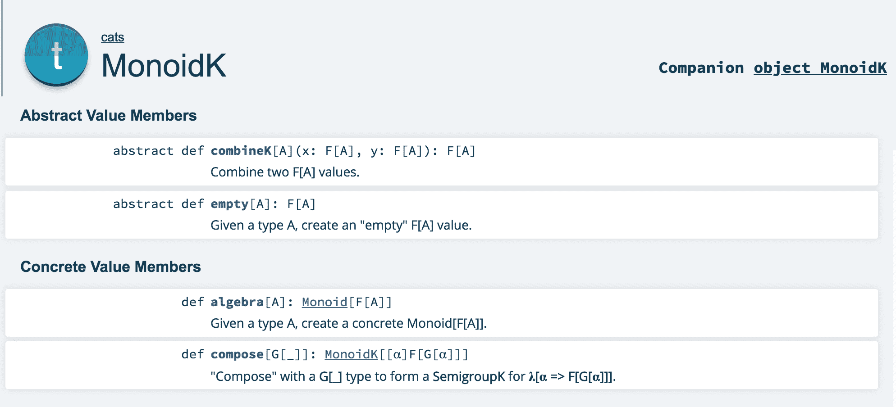

所以，正如你所看到的，这个方法是为效果类型定义的，并且不是在类型类的层面上，而是在方法层面上参数化类型 `A`。这意味着你可以为某些效果类型 `F[_]` 定义单个类型类，并且你可以用它来处理 `F[A]` 上下文中的任意 `A`。

这个例子在组合列表时可能很有用。虽然它实际上不是一个效果类型，因为 `List` 是一个不封装任何副作用的数据结构，但它仍然是形式为 `F[A]` 的类型。我们可以想象如下实现 `combinedK`：

```java
implicit val listMonoid: MonoidK[List] = new MonoidK[List] {
  override def combineKA: List[A] =
   a1 ++ a2
  override def empty[A] = Nil
}
```

因此，在前面的代码中，我们能够以独立于类型 `A` 的方式实现这个方法，因为两个列表组合的行为与包含在其中的元素类型无关。这种组合只是将一个列表的元素与另一个列表的元素连接起来，形成一个组合列表。

还要注意这里的 `algebra` 方法。这个方法可以用来从 `MonoidK` 实例获得 `Monoid` 实例。这在需要 `Monoid` 实例但只有 `MonoidK` 的情况下可能很有用。

# Traverse

之前，我们学习了 Applicative 类型类。我们争论说，Applicative 类型类的主要效用是它允许我们并行组合两个独立的计算。我们不再受执行顺序组合的 `flatMap` 函数的约束，因此如果一个计算失败，则不会执行其他任何计算。在 Applicative 情景中，尽管一些计算可能会失败，但所有计算都会被执行。

然而，Applicative 只能组合两个独立的计算。也有方法将多达 22 个计算组合成元组。但是，如果我们需要组合任意数量的计算呢？对于多重性的通常推广是集合。元组只是集合的特殊情况。所以，如果有一个类型类可以将独立的计算组合成元组，那么也必须有一个类型类可以将独立的计算组合成集合。

为了说明这种情况，考虑我们在 Applicative 情况下正在处理的一个例子。如果我们有一个在并行运算符下计算出的任意数学表达式列表，并且有一个函数应该通过求和来组合它们，这样的函数可能是什么样子？

```java
type Fx[A] = Either[List[String], A]
def combineComputations(f1: List[Fx[Double]]): Fx[Double] =
 (f1, f2).mapN { case (r1, r2) => r1 + r2 }
```

因此，前面的函数接受一个计算结果的列表，其任务是产生所有计算的组合结果。这个结果将是`Either[List[String], List[Double]]`类型，这意味着我们还需要聚合所有我们在尝试组合的计算中发生的所有错误。在 Applicative 的情况下，我们该如何处理呢？

我们需要做的是取列表的第一个元素，使用`ap`函数将其与列表的第二个元素结合，将结果相加以获得一个`Either`类型的结果，然后将这个结果与第三个元素结合，依此类推。

实际上，有一个类型类可以执行这个操作。认识一下`Traverse`类型类：

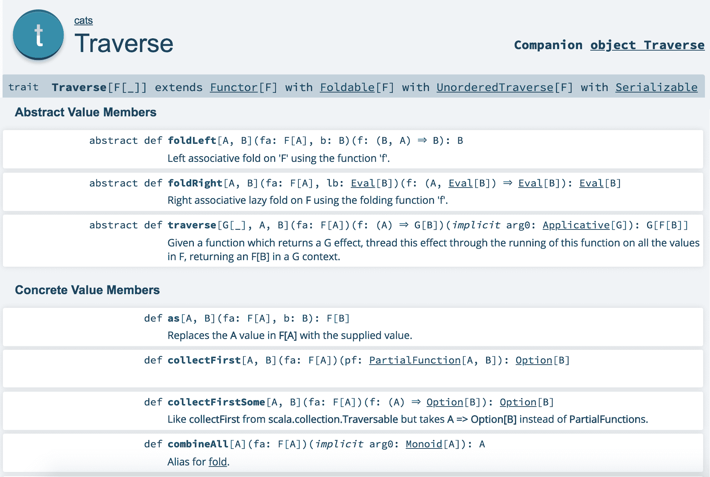

`Traverse`类型类的关注点主要是`traverse`方法。让我们看看它的签名：

```java
abstract def traverse[G[_], A, B](fa: F[A])(f: (A) ⇒ G[B])(implicit arg0: Applicative[G]): G[F[B]]
```

这个方法的签名非常抽象。所以，让我们给所有涉及的类型提供更多一些的上下文。在上面的签名中，考虑类型`F`是一个集合类型。考虑类型`G`是一个效果类型。

这意味着`traverse`函数接受一个集合作为其第一个参数——一个包含一些任意原始元素的集合`A`。第二个参数类似于我们在`flatMap`中看到的内容。它是一个对第一个参数中集合的元素进行操作的副作用计算。所以，想法是，你有一个包含一些元素的集合`A`，你可以对这些元素运行一个计算`A`。然而，这个计算是具有副作用的。这个计算的副作用被封装到效果类型`G`中。

如果你在这个集合的每个元素上运行这样的计算会发生什么？如果你使用这个操作映射集合`F`会发生什么？

你期望得到的结果类型是：`F[G[B]]`。所以，你将得到一个包含效果类型的集合，这些类型是你对原始集合的每个元素运行计算的结果。

现在，让我们回到我们需要组合的`Either`示例。我们会得到以下结果：

```java
List[Either[List[String], A]]
```

然而，我们不是在寻找这个。我们想要获得一个在效果类型`Either`下的所有计算结果的列表。在 Applicative 的情况下，`ap`方法接受副作用计算的结果，并将它们组合在它们共同的效果类型下。所以，在`ap`和基于它的`zip`的情况下，我们有以下结果：

```java
Either[List[String], (A, A)]
```

在我们的泛化情况下，元组的作用被`List`所取代。因此，我们的目标是以下内容：

```java
Either[List[String], List[A]]
```

现在，让我们回到我们的`traverse`函数。让我们看看它的结果类型。这个函数的结果是`G[F[B]]`。`G`是一个效果类型。`F`是一个集合类型。所以，所有计算的结果都组合成一个单一的集合，在效果类型`G`下。这正是我们在`Either`的情况下所追求的。

因此，这使得`Traverse`成为了一个更通用的 Applicative 情况，可以用于你事先不知道将要组合多少计算的情况。

在这里提醒大家注意。我们之前也讨论过，类型`F`是一个集合类型，而类型`G`是一个效果类型。你应该记住，这个约束并没有编码到类型类本身中。我们施加这个约束是为了能够对类型类有一个直观的理解。因此，你可能会有一些更高级的`Traverse`类型类的使用方法，这些方法超出了这个集合的范围。然而，在你的项目中，你将最频繁地在集合的上下文中使用它。

让我们借助`Traverse`来看看我们的示例可能是什么样子：

```java
def combineComputationsFold(f1: List[Fx[Double]]): Fx[Double] =
 f1.traverse(identity).map { lst =>
 lst.foldLeft(0D) { (runningSum, next) => runningSum + next } }

val samples: List[Fx[Double]] =
  (1 to 5).toList.map { x => Right(x.toDouble) }

val samplesErr: List[Fx[Double]] =
  (1 to 5).toList.map {
    case x if x % 2 == 0 => Left(List(s"$x is not a multiple of 2"))
    case x => Right(x.toDouble)
  }

println(combineComputationsFold(samples)) // Right(15.0)
println(combineComputationsFold(samplesErr)) // Left(List(2 is not a 
 multiple of 2, 4 is not a multiple of 2))
```

如果我们使用`Traverse`类型类的`combineAll`方法，我们可以进一步增强这个示例：

```java
def combineComputations(f1: List[Fx[Double]]): Fx[Double] =
 f1.traverse(identity).map(_.combineAll)

println(combineComputations(samples)) // Right(15.0)
println(combineComputations(samplesErr)) // Left(List(2 is not a  
 multiple of 2, 4 is not a multiple of 2))
```

以下是在定义的以下类型类上下文中引入的示例：

```java
type Fx[A] = Either[List[String], A]
implicit val applicative: Applicative[Fx] = new Applicative[Fx] {
  override def apA, B(fa: Fx[A]): Fx[B] = (ff, fa)  
  match {
    case (Right(f), Right(a)) => Right(f(a))
    case (Left(e1), Left(e2)) => Left(e1 ++ e2)
    case (Left(e), _) => Left(e)
    case (_, Left(e)) => Left(e)
  }
  override def pureA: Fx[A] = Right(a)
}
implicit val monoidDouble: Monoid[Double] = new Monoid[Double] {
  def combine(x1: Double, x2: Double): Double = x1 + x2
  def empty: Double = 0
}
```

`combinedAll`在某个集合`F[A]`上工作，并在作用域内有`Monoid[A]`的情况下，从这个集合中产生结果`A`。Monoid 定义了如何将两个元素`A`组合成一个元素`A`。`F[A]`是元素`A`的集合。所以，给定一个元素集合`A`，`combineAll`能够结合所有元素，并借助作用域内定义的二进制组合操作的 Monoid 来计算一个单一的结果`A`。

这里需要注意的一点是，`cats`的类型类形成了一个生态系统，并且经常相互依赖。为了获得某个类型的某个类型类的实例，你可能会发现它隐式地依赖于另一个类型类的实例。对于其他类型类，你可能会发现它的一些方法隐式地依赖于其他类型类，就像`combineAll`依赖于 Monoid 的情况一样。

这种联系可以用来帮助纯函数编程的学习者。这种类型的生态系统意味着你可以从非常小的地方开始。你可以从使用你理解的一个或两个类型类开始。由于`Cats`库形成了一个依赖类型类的生态系统，你可能会遇到你的熟悉类型类依赖于你还不了解的类型类的情况。因此，你需要了解其他类型类。

我们需要注意的关于我们迄今为止所学的类型类的一些其他事情是，它们相当通用且与语言无关。它们编码的是类型之间的关系和转换。这可以用你选择的任何语言来编码。例如，在 Haskell 中，语言是围绕类型类的概念构建的。因此，如果你查看 Haskell，你会发现它也包含了我们在本章中涵盖的类型类。实际上，有一个完整的数学理论处理这些概念，并定义了我们涵盖的类型类，称为**范畴论**。这意味着我们可以从数学的角度讨论类型类，而不涉及任何编程。因此，类型类的概念是语言无关的，并且有一个坚实的数学基础。我们已经广泛地覆盖了一个特定于 Scala 的库，但我们涵盖的概念是语言无关的。以某种形式或另一种形式，它们在所有支持纯函数式风格的编程语言中都有实现。

# 概述

在本章中，我们深入探讨了在纯函数式编程中使用的类型类系统。我们审视了库，即纯函数式编程的标准库。我们首次了解了库的结构，并发现它由类型类、语法和效果类型的独立模型组成。

然后，我们深入研究了由库定义的一些类型类。我们看到了它们存在的动机，以及它们的实现和使用细节。关于所有类型类要记住的一件事是，它们不是 Scala 特有的。实际上，有一个完整的数学理论以与任何编程语言无关的方式处理它们。这被称为范畴论。所以，如果你了解一种编程语言的概念，我们就能在支持函数式风格的任何编程语言中使用它们。

Cats 为我们提供了有效的函数式编程工具。然而，我们需要更高级的库来编写工业级软件，例如网络应用的后端。在下一章中，我们将看到更多基于基本库的高级函数式库。

# 问题

1.  将类型类组织到库中的动机是什么？

1.  Traverse 定义了哪些方法？

1.  我们会在哪种现实场景中使用 Traverse？

1.  Monad 定义了哪些方法？

1.  我们会在哪种现实场景中使用 Monad？

1.  Cats 库的结构是怎样的？
