# 第九章：纯函数式编程库

在上一章中，我们借助`cats`等基本库讨论了纯函数式风格。这个库在纯函数式编程的任务上表现相当出色，但在实践中，这并不足以舒适地进行编程。

如果你看看传统的命令式语言，如 Java，你会发现它们通常有很多库和基础设施来执行特定任务。此外，也可以争论说，编程语言的选择主要是受其提供的基础设施驱动的。

这样，例如，Python 是机器学习的既定标准，因为它提供了一套复杂的科学库来执行科学计算，而 R 是统计计算的既定标准。公司通常选择 Scala，因为它提供了访问 Spark 和 Akka 库的途径，这些库用于机器学习和分布式计算。

因此，在讨论特定的编程风格时，同时提到它是一个围绕员工开发的基础设施，这一点非常重要。在本章中，我们将通过查看一些 Scala 中用于纯函数式编程的`cats`库之外的库来介绍这个基础设施。

本章将涵盖以下主题：

+   The Cats effect

+   服务器端编程

我们将从这个章节开始，查看`cats`的并发库。

# Cats effect

Cats effect 是一个用于`cats`库中并发编程的库。其主要特点是提供一系列类型类、数据类型和并发原语，用于描述使用`cats`在 Scala 中进行并发编程。

并发原语支持以下内容：

+   资源管理——想想 try-with-resources。

+   平行计算的无缝组合。

+   平行计算之间的通信。

我们将首先通过查看其核心并发原语`IO`以及我们在讨论过程中需要的 Cats 的一些功能来讨论这个库。

# ProductR

在深入探讨库并讨论其功能之前，我们需要提到一个在这个库中经常使用的特定操作符。我们已经讨论了 Applicative 类型类，并且它对并行组合很有用。

在`cats`中经常使用的这个类型类的一个操作符是所谓的右乘操作符。

这个操作符接受两个计算，在它们之间执行乘法，并只取右手边的结果。特别是在 Cats effect 中，这个操作符经常用来指定一个事件应该在另一个事件之后发生。

它还有一个符号形式，看起来像这样：`*>`。

# IO – 并发数据类型

Cats effect 提供的主要数据类型是 IO。这是一个在未来的某个时刻要执行的计算的数据类型。例如，你可以有以下表达式：

```java
object HelloWorld extends App {
  val hello = IO { println("Hello") }
  val world = IO { println("World") }
  (hello *> world).unsafeRunSync
}
```

关于 IO 的一个关键细节是，它恰好是对计算的描述。在这里，`cats`支持所谓的计算作为值范式。计算作为值规定你不应该立即评估你的竞争，而应该存储这些计算的描述。这样，你将能够在未来的任何时刻评估它们。

这种方法有许多优点，这就是我们接下来要讨论的。

# 引用透明性

Cats 的第一个优点是引用透明性。在先前的例子中，将“hello world”打印到命令行的计算不会立即执行。它是副作用，而我们没有立即执行它的事实意味着它是引用透明的。你可以如下评估这个计算：

```java
(hello *> world).unsafeRunSync
```

IO 有一系列方法，这些方法的名称前面都带有`unsafe`这个词。

不安全的方法通常如它们的名称所示，是“不安全的”。这意味着它们可能会阻塞，产生副作用，抛出异常，并做其他可能让你头疼的事情。根据文档中对 IO 类型的描述，你应该只调用这样的方法一次，理想情况下是在程序末尾。

因此，基本上，主要思想是使用 Cats 效果库提供的便利，用 IO 原语来描述你的整个程序。一旦你的整个应用程序被描述，你就可以运行应用程序。

# 控制反转

由于用 IO 术语表达的计算不是立即执行，而仅仅是作为计算描述的存储，因此可以针对不同的执行策略执行计算。例如，你可能希望在不同的并发后端上运行计算，每个后端都有自己的并发策略。你可能希望同步或异步地运行一个竞争。在本章的后面部分，我们将看到这是如何做到的。

# 异步与 IO

Cats 效果的应用中心领域是异步编程。异步编程是一种事件驱动风格的编程，在这种编程中，你不会浪费线程和其他资源在阻塞，等待某个事件发生。

例如，假设你有一个处理传入 HTTP 请求的 Web 服务器。服务器有一组线程，用于处理每个请求。现在，处理器本身可能需要进行一些阻塞操作。例如，联系数据库或外部 HTTP API 可能是一个潜在的阻塞操作。这是因为数据库或 HTTP API 通常不会立即响应。这意味着如果请求处理器需要联系这样的资源，它将需要等待服务回复。

如果这种等待是天真地通过阻塞整个线程，一旦请求可用就恢复它，那么我们就会有一个浪费线程的情况。如果这样的服务器在高负载下运行，有危险的是，所有线程的大部分时间都将被阻塞。阻塞意味着它们什么也不做，只是等待资源的响应。由于它们什么也不做，这些线程本可以用来处理其他可能不需要这种阻塞类型的请求。

正是因为这个原因，当前的服务器端编程旨在实现异步处理，这意味着如果处理程序需要联系某些可能阻塞的资源，它会联系它。然而，一旦它没有其他事情可做，它应该释放其线程。一旦它等待的响应可用，它将继续计算。

这种策略允许创建非常轻量级的并发模块，不会浪费线程。这也确保了线程大部分时间都在忙于有用的工作，而不是阻塞。

然而，这种模型需要专门的库和服务器端技术，这些技术是专门为异步设计的。Cats 效果正是为了满足这种异步需求而精确设计的。

现在，让我们看看一些示例，这些示例在实践中展示了阻塞与异步的不同之处，以及 Cats 如何促进异步操作。在这个过程中，你还将学习到许多 Cats 效果 API。

# 阻塞示例

首先，让我们看看创建异步 IO 操作的 API 背后的内容：

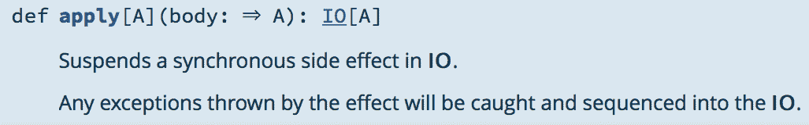

因此，你可以将一个任意任务提供给 IO 的`apply`方法，这将构建这个任务的描述。

我们可以通过在 IO 的`apply`方法下使用`Thread.sleep` Java API 来模拟计算的阻塞，如下所示：

```java
IO { Thread.sleep(1000) }
```

注意，前面的示例将阻塞其线程。IO 可能只是对计算的描述。然而，计算应该在某个时刻执行。在 JVM 世界中，任何计算都是在线程上运行的。在前面示例中，我们使用 Java `Thread.sleep` API 来明确表示我们需要阻塞正在运行的线程一秒钟，即 1,000 毫秒。

借助于前面的原始方法，让我们构建一个无限计算，这将使我们容易追踪和研究。如果我们有一个长时间运行的计算，它以相等的时间间隔向命令行输出某些内容，我们就可以很容易地看到计算是否以及如何进行。通常，这种无限计算可以通过循环来实现。在函数式编程中，循环可以通过 Monad 的`tailRecM`来创建：

```java
def taskHeavy(prefix: String): IO[Nothing] =
  Monad[IO].tailRecM(0) { i => for {
    _ <- IO { println(s"${Thread.currentThread.getName}; $prefix: $i") }
    _ <- IO { Thread.sleep(1000) }
  } yield Left(i + 1) }
```

在前面的代码中，你可以看到一个使用 IO 描述无限计算的 Monadic 无限循环。首先，计算将输出当前线程的名称、当前任务的名称以及从迭代到迭代将递增的数字。

线程输出可以用来跟踪计算正在哪个线程上运行。这些信息可以用来查看给定线程池中的线程是如何分配的。前缀是必要的，以便在我们要同时运行多个此类计算时区分一个任务与另一个任务。我们将这样做，以便看到此类任务在并发环境下的表现。

在并发环境模型中测试这样的阻塞任务需要在一个高负载的 HTTP 服务器下进行。在那里，你也有许多性质相同的任务正在并发运行。前面的例子模拟了一个处理任务阻塞底层线程的情况。

最后，标识号用于识别给定任务的进度，这样我们就可以看到任务进度是否均匀，以及是否有任何任务被阻塞。

由于在前面的例子中，我们受到在并发设置中测试任务的能力的激励，接下来，我们将简要介绍我们将运行任务的并发环境。

# 并发基础设施

并发环境由一个执行上下文表示，这是一个 Scala 类。官方文档将其定义为如下：

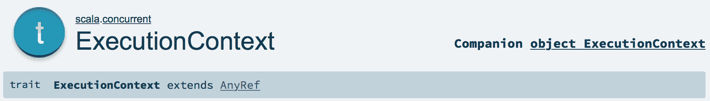

这是一个标准的 Scala 类，它有一个方法来运行 Java `Runnable`：

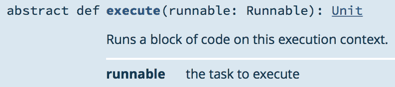

在 Scala 中处理并发原语，如 Future 时，需要一个执行上下文。Cats effect 也依赖于这种类型来描述其自己的执行环境。我们可以构建一个执行上下文，并指定其线程池中可用的线程数，如下所示：

```java
implicit val ec: ExecutionContext =
  ExecutionContext.fromExecutor(Executors.newFixedThreadPool(2))
```

在前面的代码中，我们正在使用`fromExecutor`方法，这是`ExecutionContext`类定义的如下：

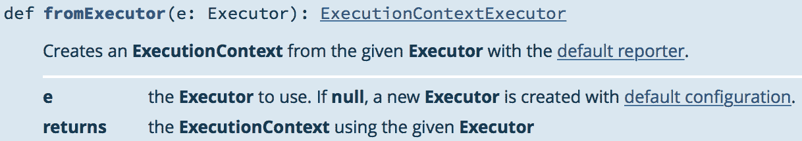

此方法使用 Java API 构建执行上下文。在我们具体的上一个例子中，我们正在构建一个具有固定线程池的执行联系，该线程池有两个线程。

我们的例子另一个激励因素是运行多个相同并发实例。接下来，我们将查看 API 以提供此功能。

# 批量运行任务

我们可以定义一个函数，在给定的执行上下文中以多个实例运行任意 IO 任务，如下所示：

```java
def bunch(n: Int)(gen: String => IO[Nothing]): IO[List[Fiber[IO, Nothing]]] =
 (1 to n).toList.map(i => s"Task $i").traverse(gen(_).start)
```

`bunch`函数将需要并发启动的任务数量作为第一个参数。作为第二个参数，它接受一个函数`gen`来构建任务。该函数以字符串作为其第一个参数，即任务的名称。在我们需要运行相同任务的多实例的情况下，区分它们是至关重要的。因此，我们需要将名称提供给生成函数。

为了理解函数的输出类型，让我们看看函数的主体。

首先，主体构建了一个包含`n`个元素的列表。意图是使用这个列表来指定创建任务的循环。然后，我们使用我们创建的列表上的`map`函数来创建所需数量的任务：

```java
(1 to n).toList.map(i => s"Task $i")
```

接下来，我们使用`traverse`函数，它会对我们刚刚创建的每个任务执行一些操作。让我们看看`traverse`函数内部发生了什么，以了解 Cats effect 中如何实现并行性：

```java
.traverse(gen(_).start)
```

主要的焦点是`start`函数。让我们看看它是如何定义的：

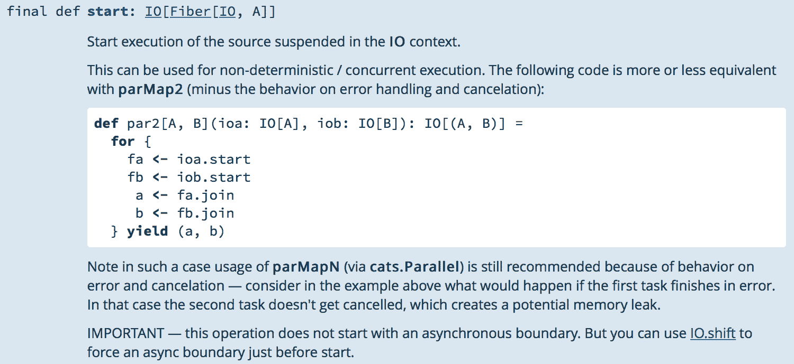

有关的问题函数在 IO 原语下产生所谓的`Fiber`。让我们看看`Fiber`是如何定义的以及它是什么：

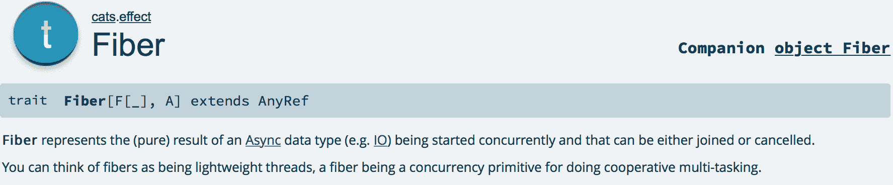

它定义了以下 API：

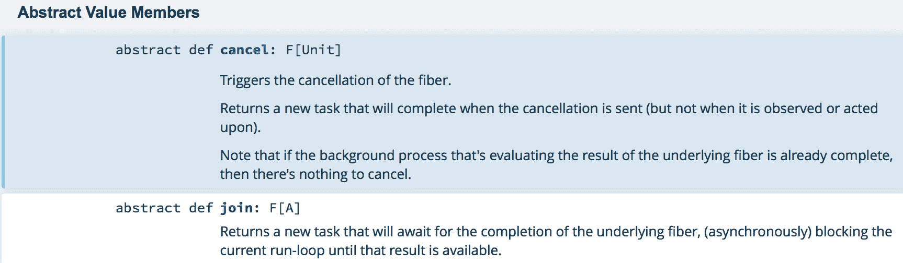

通常，在基于 IO 的 Monadic 流程中等待会阻塞执行。当然，这种阻塞是异步进行的。然而，如果你在 IO 上调用`start`方法，它不会阻塞 Monadic 流程。相反，它会立即返回一个`Fiber`对象。

将一个`Fiber`对象视为底层 alpha 复杂度的遥控单元。它定义了两个方法，`cancel`和`join`。这两个方法可以用来与底层计算进行通信。`cancel`方法取消竞争，而`join`方法会阻塞当前的 Monadic 流程，直到底层 IO 计算完成。`join`方法返回这个计算在 Monadic 层中的值。

注意，这些`cancel`和`join`方法都是返回一个 IO 原语。这意味着你可以从 Monadic 流程中使用这个方法。

那么，为什么我们在 bunch 示例中使用`start`方法呢？

```java
gen(_).start
```

记住，我们的任务是无限的。我们定义了它们为一个每秒阻塞一次的无穷循环。`traverse`的任务是评估它所提供的所有任务，并返回一个在单一效果类型下的组合任务，在这种情况下是 IO。然而，由于我们的任务是无限的，它们不能被评估为某个具体的结果。因此，我们将对每个任务执行`start`调用，以指定我们不需要任务本身的结果；我们只能对这个任务的遥控单元感到满意。这样，`traverse`方法将不会等待任何单个任务完成，而是在我们之前讨论的执行上下文中异步启动所有任务。

# 带阻塞的重负载

现在，假设我们的 `taskHeavy` 是一个 HTTP 服务器的处理器。服务器正在经历重负载，有 `1000` 个正在进行的请求。这意味着我们需要创建 `1000` 个任务来处理它们。使用 `bunch` 方法，我们可以定义如下处理方式：

```java
(IO.shift *> bunch(1000)(taskHeavy)).unsafeRunSync
```

注意，在这个例子中，我们又遇到了另一个新的原语。它是在 IO 数据类型上定义的 `shift` 方法。它定义如下：

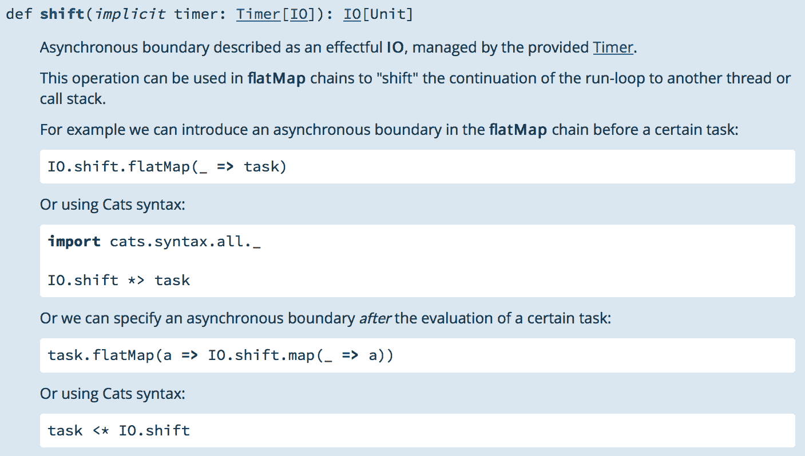

`shift` 方法是执行转移到 `ExecutionContext` 的指令，它作为作用域中的隐式依赖项存在。在这里，我们隐式依赖于一个 `Timer` 对象，而不是 `ExecutionContext`。可以使用 IO API 的一部分隐式方法从 `ExecutionContext` 获取 `Timer` 对象：

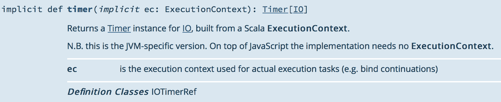

由于我们在隐式作用域中有一个 `ExecutionContext`，我们可以调用 `shift` 方法将当前 IO 计算的执行转移到我们已定义的线程池中。注意这里的 `*>` 操作符，我们之前在本章中讨论过。它表示第二个竞争应该在第一个之后执行，即转移到并发上下文中。我们还通过 `unsafeRunSync` 的帮助在现场运行了示例，以查看其执行情况。程序的输出如下：

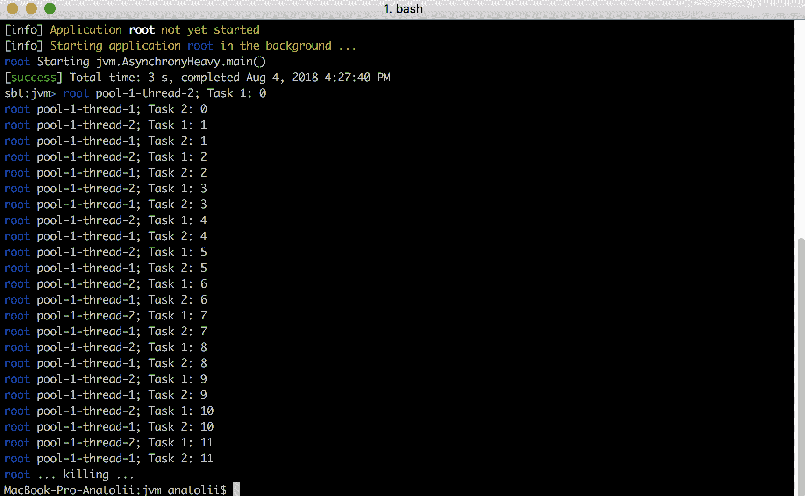

这里首先要注意的是，我们 `ExecutionContext` 中的两个线程都用于处理任务。你可以通过查看任务输出的线程名称来看到这一点。它会随着任务的变化而变化。然而，也要注意，只有前两个任务有机会被执行。这是因为我们使用 `Thread.sleep` 的阻塞调用来指定和延迟我们的执行。所以，在无限处理任务的设置中，这样的服务器一次只能处理两个请求。在一个需要处理 `1000` 个请求的设置中，这是不够的。

现在，让我们看看我们如何利用异步性来指定轻量级并发原语来处理那么多的请求。

# 同步任务

你可以异步地定义前面的计算如下：

```java
def taskLight(prefix: String): IO[Nothing] =
  Monad[IO].tailRecM(0) { i => for {
    _ <- IO { println(s"${Thread.currentThread.getName}; $prefix: $i") }
    _ <- IO.sleep(1 second)
  } yield Left(i + 1) }
```

注意，这种方法与之前的任务定义方式相似。然而，我们不再阻塞线程。相反，我们正在使用一个内置的 IO 原语称为`sleep`。`sleep`是一个非阻塞原语，这意味着它不会阻塞底层线程。也就是说，这是对`sleep`操作的描述。记住，所有用 IO 术语定义的计算都是计算的描述，而不是计算本身。因此，你可以按需定义`sleep`操作。因此，以非阻塞方式定义此操作是合理的，这样当遇到`sleep`操作时，底层线程就会释放，当执行环境收到表示`sleep`操作成功终止的信号时，计算就会继续。所有异步计算都使用类似的原则。我们可以如下运行此任务：

```java
(IO.shift *> bunch(1000)(taskLight)).unsafeRunSync
```

程序的输出如下：

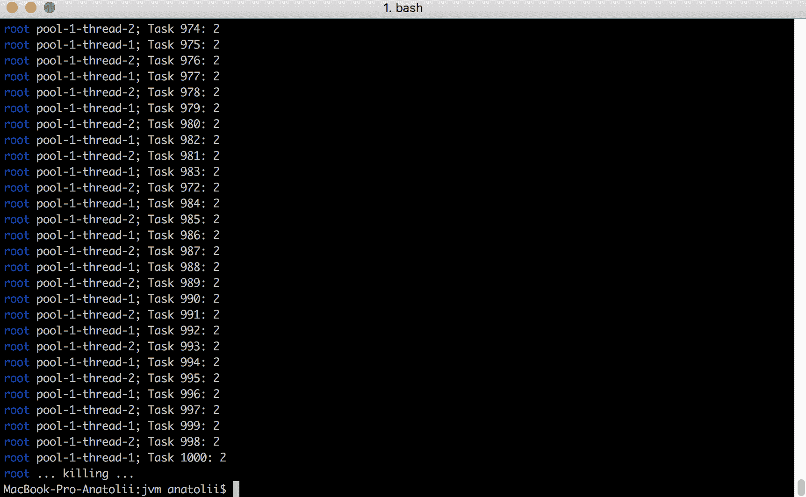

注意，所有的`1000`个任务都得到了足够的资源来执行。这是因为一旦这些任务不再需要它们，它们就会释放底层线程。因此，即使只有两个线程，我们也能成功一次性处理 1,000 个任务。所以，异步描述的计算相当轻量级，可以用于设计用于高负载的系统。接下来，让我们看看如何自己创建异步 IO 原语。

# 构建异步任务

IO 提供了一个 API，允许你将基于回调的现有计算转换为异步 IO。这可以用来以异步方式将现有计算迁移到 IO。

假设你有一个以下计算：

```java
def taskHeavy(name: String): Int = {
  Thread.sleep(1000)
  println(s"${Thread.currentThread.getName}: " +
    s"$name: Computed!")
  42
}
```

正如我们之前看到的，它通过使用`Thread.sleep`来阻塞计算而阻塞了一个线程。整个计算的目的就是它不会立即返回。

现在，让我们看看如何异步运行计算：

```java
def sync(name: String): IO[Int] =
  IO { taskHeavy(name) }
```

在这里，我们使用一种已经熟悉的方法将同步计算提升到 IO 数据类型。我们在之前的例子中已经看到了这样做的影响。这次，由于我们的计算不是无限的，让我们来看看处理这种计算与我们将要从中构建的异步竞争处理的时间差异。为此，我们需要一个基准测试能力：

```java
def benchmarkA: IO[(A, Long)] =
  for {
    tStart <- Timer[IO].clockMonotonic(SECONDS)
    res <- io
    tEnd <- Timer[IO].clockMonotonic(SECONDS)
  } yield (res, tEnd - tStart)
```

在前面的代码中，我们正在构建一个基准测试能力，它将运行 IO 并报告计算运行所需的时间。

这里首先要注意的，是 IO 作为值策略如何有益于增强计算。在这里，基准方法接受一个尚未评估的 IO。它只是一个计算的描述。接下来，它将这个计算包装在一个可以测量时间的功能中，最后，它返回计算的最终结果，以及基准。

此外，注意我们在这里是如何使用 `Timer` 数据类型的。我们已经在 IO 原语的执行上下文背景下简要提到了 `Timer` 类。`Timer` 类恰好是 IO 用于管理其线程的执行上下文：

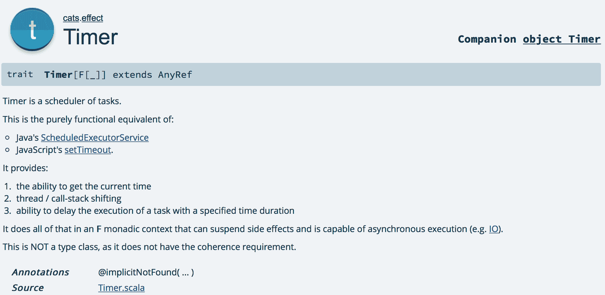

`Timer` 定义了以下抽象方法：

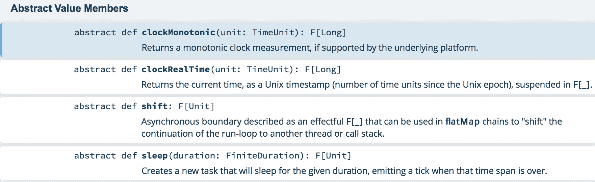

我们已经熟悉了 `shift` 方法。它可以用来将给定 IO 流的执行上下文移入这个 `Timer`。记住，`Timer` 可以从标准的 Scala `ExecutionContext` 构造。`Timer` 定义的其他方法用于时间测量。其中之一是 `clockMonotonic`，我们用它来进行前面的基准测试。

最后，我们可能想要定义一个 `benchmarkFlush` 方法来将测量结果报告到命令行，如下所示：

```java
def benchmarkFlushA: IO[Unit] =
  benchmark(io).map { case (res, time) =>
    println(s"Computed result $res in $time seconds") }
```

接下来，我们将尝试在多个实例中并发运行我们的同步示例，并测量其时间。但首先，我们需要一个 `bunch` 函数来启动这个任务的多个实例：

```java
def bunch(n: Int)(gen: String => IO[Int]): IO[List[Int]] =
  (1 to n).toList.map(i => s"Task $i").traverse(gen(_).start)
    .flatMap(_.traverse(_.join))
```

这个函数的第一部分与我们在上一个例子中看到的是相似的。然而，我们通过以下附录稍微扩展了这个函数：

```java
.flatMap(_.traverse(_.join))
```

记住，我们原来的 `bunch` 函数是从其 `traverse` 方法异步开始计算的。结果是返回了一个我们并不感兴趣的 `Fibers` 列表。在基准测试的任务中，我们感兴趣的是所有计算终止的时间。因此，我们希望使用返回的 `Fibers` 的 `join` 方法来创建一个组合的 IO 数据类型，当所有计算成功时它才会成功。注意，我们仍然需要 `start` 能力来异步启动任务而不是顺序执行。如果你在这里不使用从 `traverse` 方法来的 `start` 方法，我们试图在 `bunch` 中启动的任务将会以同步方式执行，而我们需要并行执行来利用我们的共享线程池。

接下来，我们可以在基准测试下运行同步示例的 `bunch`，如下所示：

```java
benchmarkFlush(IO.shift *> bunch(10)(sync)).unsafeRunSync
```

前面程序的输出如下：

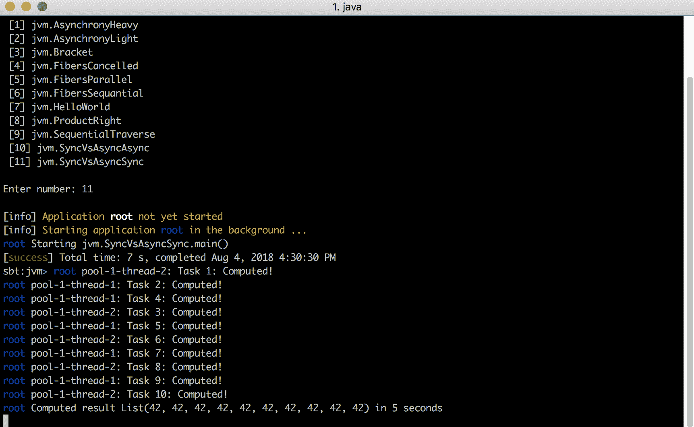

我们用了五秒钟来计算 10 个任务。这是因为每个任务都会阻塞底层线程一秒钟，并且我们在执行上下文中有两个线程。

接下来，我们将看看如何定义相同任务的异步版本。

# 异步 API

首先，我们需要指出我们所说的“异步”究竟是什么意思。我们指的是相对于在执行 IO 数据类型的线程池中的异步。我们假设我们无法控制任务本身，并且无法重新定义它。实际上，我们并不关心它是如何实现的；我们只关心它终止的确切时刻。这里的任务是防止这个精确的 IO 执行的线程阻塞。

为了实现这一点，我们可以使用 `IO.async` 方法：

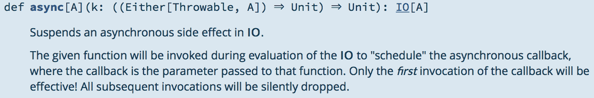

这个方法有一个有点棘手的签名。所以，首先，让我们简要地看看它做了什么。给定一个特定的计算，它提供了一个回调，它可以通知要构建的 IO 任务。从`async`方法返回的 IO 任务将在底层计算调用它提供的回调时被视为已完成。

这种方法的优点是 IO 不关心计算在哪里或如何运行。它只关心何时完成。

因此，`async`方法是一个函数，它的参数是另一个具有以下签名的函数：

```java
Either[Throwable, A]) ⇒ Unit
```

这是一个回调，底层计算在完成时会调用它。它由 IO 提供给`async`方法的用户，并作为通知表示 IO 应该被视为已完成。

接下来，让我们看看这个方法如何用于创建异步计算。

# 异步示例

我们可以用`async`重新定义先前的例子，如下所示：

```java
def async(name: String): IO[Int] =
  IO.async { cb =>
    new Thread(new Runnable { override def run =
      cb { Right(taskHeavy(name)) } }).start()
  }
```

因此，在这里，我们使用`IO.async`原语将我们的计算提升到异步上下文中。首先，这个`async`方法给我们一个回调作为输入。我们完成计算后应该调用这个回调。

接下来，我们将我们的重计算调度到其他执行上下文中。在我们的例子中，这仅仅是启动另一个不属于我们执行 IO 的线程池的线程。这里有许多可能的场景，特别是在纯异步计算的情况下，即完全不使用阻塞的计算。例如，你可以想象从`async`注册另一个异步操作的回调。这可能对 GUI 编程很有用。然而，在这个例子中，使用单独的线程就足够了。唯一需要注意的是，线程是重量级的原语。尽管我们没有阻塞 IO 线程池，但我们仍在创建线程，并且我们仍在阻塞它们。这可能会耗尽系统的资源。

接下来，我们可以这样运行我们的计算：

```java
benchmarkFlush(IO.shift *> bunch(10)(async)).unsafeRunSync
```

输出如下：

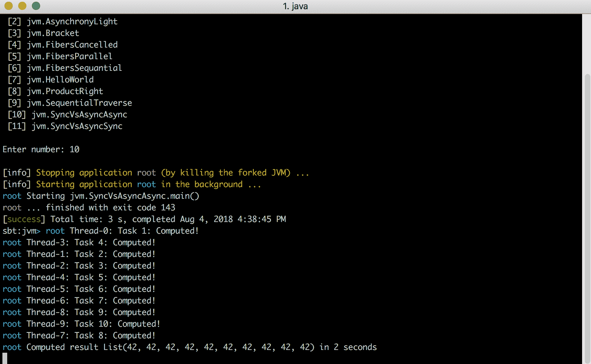

注意，我们能够在两秒钟内完成操作。这是因为 IO 任务不再阻塞底层执行线程，IO 执行时释放了它的线程。

接下来，我们将更关注一下`Fibers`以及如何利用它们进行并发编程。

# 纤维

正如我们之前讨论的，纤维是 IO 的远程控制单元。让我们看看这在实践中如何用于并行运行操作。

# 计算示例

假设你有一个长时间运行的竞赛。假设相关的计算任务是找到特定范围内的数字之和。计算是长时间运行的，因为从数字到数字的调用必须暂停半秒：

```java
def sum(from: Int, to: Int): IO[Int] =
  Monad[IO].tailRecM((from, 0)) { case (i, runningTotal) =>
    if (i == to) IO.pure( Right(runningTotal + i) )
    else if (i > to) IO.pure( Right(runningTotal) )
    else for {
      _ <- IO { println(s"${Thread.currentThread.getName}: " +
        s"Running total from $from to $to, currently at $i: $runningTotal") }
      _ <- IO.sleep(500 milliseconds)
    } yield Left((i + 1, runningTotal + i)) }
```

我们用 Monadic 循环来定义我们的比赛。在循环流程的主体中，我们有两个终止情况。第一个终止情况是当前数字等于我们范围的上线。在这种情况下，结果是运行总和加上那个数字。

另一个终止情况是当数字大于循环的上限。原则上，这种情况不应该发生，但仍然是一个好主意，以防无限循环。在这种情况下，我们不添加当前数字，直接返回运行总和。

还要注意 `pure` 方法，它在这些非终止情况中使用。它定义如下：

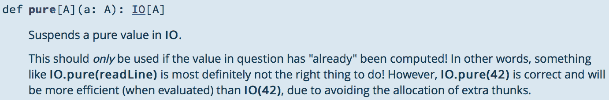

它将一个值提升到 IO 上下文中，而不对它做任何其他操作。

最后，我们有一个 Monadic 循环的非终止情况：

```java
else for {
  _ <- IO { println(s"${Thread.currentThread.getName}: " +
    s"Running total from $from to $to, currently at $i: $runningTotal") }
  _ <- IO.sleep(500 milliseconds)
} yield Left((i + 1, runningTotal + i))
```

我们有一些调试输出，说明了当前线程和计算的状态。然后，我们通过使用 `IO.sleep` 原始操作异步地阻塞执行。

最后，我们返回一个新的计算状态，即下一个数字和更新的运行总和。

计算是长时间运行的，因为它会在每个数字上暂停半秒钟。

接下来，让我们看看如果我们想要组合两个此类计算的结果会发生什么。

# 不使用 Fibers 的 IO 组合

考虑我们需要计算两个范围的和，然后对结果求和。一种简单的方法如下：

```java
def sequential: IO[Int] =
 for {
   s1 <- sum(1 , 10)
   s2 <- sum(10, 20)
 } yield s1 + s2
```

在前面的代码中，我们使用 Monadic 流合并我们的计算。让我们看看如果我们尝试在一个基准函数下运行比赛会发生什么：

```java
benchmarkFlush(sequential).unsafeRunSync
```

前面执行的结果如下：

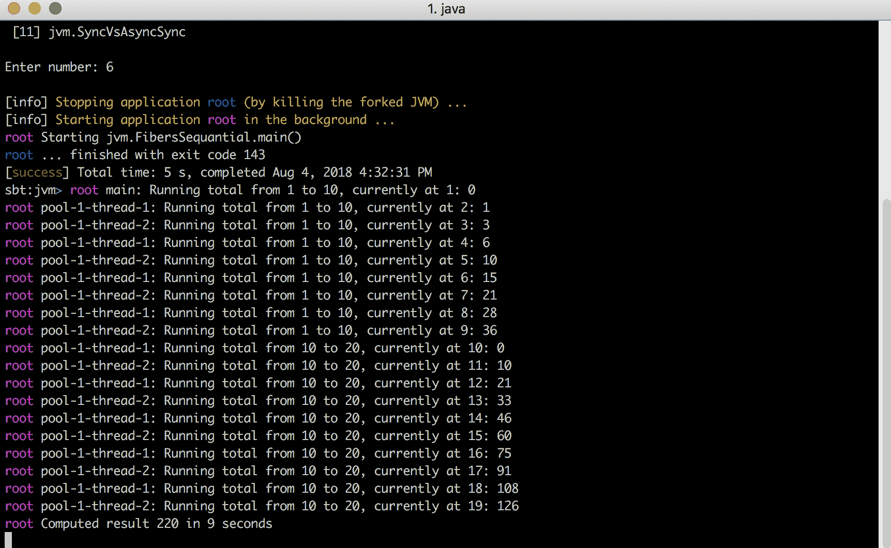

首先，注意第一个范围首先被计算。第二个范围甚至在第一个范围完成之前都不会开始。还要注意线程池中的两个线程在计算过程中的使用情况。这可以被认为是对线程和资源的浪费，因为我们本可以用这两个线程并行计算总和。然而，我们在这里是按顺序进行的。

我们可能会争辩说，前面的场景发生是因为我们使用了 Monadic 流。如您所回忆的，Monads 定义了顺序组合。在之前的计算完成之前，不可能开始下一个计算。我们还知道 Applicative 用于并行情况。我们能否应用 `traverse` 函数来并行计算所有的计算？让我们试试：

```java
def sequentialTraverse: IO[Int] =
  List(sum(1, 10), sum(10, 20)).traverse(identity).map(_.sum)
```

现在，计算彼此独立。如果我们运行它们会发生什么？

```java
benchmarkFlush(sequentialTraverse).unsafeRunSync
```

输出与前面的顺序示例完全相同，这意味着 Applicative 对于 IO 的默认实现是逐个运行计算，尽管它们是独立的。

我们如何借助 Fibers 改善这种情况？让我们看看我们如何使用 Fibers 并行启动计算。

# 使用 Fibers 的 IO 组合

之前，我们简要地提到了 Fibers 的主题。它们是底层计算的遥控单元。我们知道在任何 IO 上，我们可以调用一个`start`方法，这将导致它异步运行，这意味着它不会阻塞当前执行流的 IO 效应类型。你还知道我们可以稍后阻塞在 Fiber 上以获取结果。注意，这里我们是相对于 Monadic 流进行阻塞的。正是 Monadic 流的执行被阻塞，即 Monadic 指令的执行被暂停。用于运行的底层线程 IO 没有被任何东西阻塞。

让我们看看我们如何借助 Fibers 实现我们的求和示例：

```java
def parallel: IO[Int] =
  for {
    f1 <- sum(1 , 10).start
    f2 <- sum(10, 20).start
    s1 <- f1.join
    s2 <- f2.join
  } yield s1 + s2
```

我们的求和指令相对于 Monadic 流异步执行，这意味着 Monadic 流应用程序将不会等待两个求和中的任何一个完成，并且将直接通过前两个指令而不会阻塞。结果是，两个计算都会提交以执行，并且将并行执行。

之后，我们可以阻塞在 Fibers 上以获取结果。我们可以按照以下方式运行应用程序：

```java
benchmarkFlush(parallel).unsafeRunSync
```

输出如下：


现在，两个任务都是并发执行的。计算任务所需的时间减少了 2 倍。

接下来，让我们看看 Fibers 的另一个功能，即取消底层计算。

# 取消 Fibers

假设我们有一个比另一个短的 range，我们希望在第一个完成时取消较长的 range 计算。你可以用 Fibers 这样做：

```java
def cancelled: IO[Int] =
  for {
    f1 <- sum(1 , 5 ).start
    f2 <- sum(10, 20).start
    res <- f1.join
    _ <- f2.cancel
  } yield res
```

我们可以按照以下方式运行它：

```java
benchmarkFlush(cancelled).unsafeRunSync
```

执行结果如下：

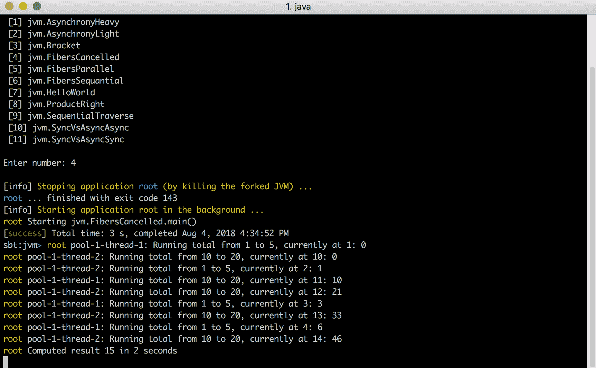

注意，一旦第一个范围完成执行，第二个范围就会被取消。

在本章中，我们详细讨论了 Cats 效应库的货币能力。这是库的主要目标。然而，它还有许多其他有用的方法和原始操作。因此，接下来，我们将查看这些原始操作之一——`bracket`原始操作，它是 Cats 的 try-with-resources。

# 括号

经常，我们会遇到需要访问之后需要关闭的资源的情况。这可能是一个文件引用、数据库会话、HTTP 连接或其他东西。Cats 效应有一个专门的原始操作，允许您安全地处理此类资源。在 Java 中，有一个专门处理资源的语句，即 try-with-resources。Scala 没有类似的语句。然而，情况随着在 IO 原始操作上定义的`bracket`方法而改变：

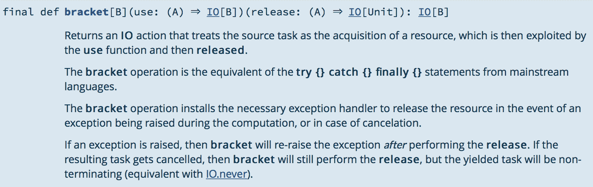

正如文档中所述，`bracket`原始功能使底层执行引擎将此 IO 的结果视为一个需要关闭的资源。使用`bracket`函数，你可以传递两个参数。第一个参数指定了你对底层过程想要做什么。它非常类似于`flatMap`函数的参数。第二个函数是关闭底层资源的指定。这个函数将在计算完成后被调用，无论它是如何完成的。它可能以错误或取消结束，但是，在任何情况下都会调用清理函数。这防止了在性能环境中的内存泄漏问题。

让我们看看我们如何使用它的一个例子。首先，我们需要一个可关闭的资源，我们可以轻松检查其关闭状态。我们可以定义如下：

```java
class DBSession {
  var closed = false
  def runStatement(stat: String): IO[List[String]] = {
    val computation = IO {
      if (stat.contains("user")) List("John", "Ann")
      else if (stat.contains("post")) List("Post1", "Post2")
      else Nil
    }
    if (!closed) computation
    else IO.raiseError { new RuntimeException("Connection is closed") }
  }
  def close(): Unit = closed = true
  def isClosed = closed
}
```

在先前的代码中，我们定义了一个数据库会话连接。它有一个`closed`标志，当设置时，防止对会话运行任何语句。接下来，我们有`runStatement`方法，它执行一些执行逻辑来模拟对数据库运行的语句。

这个`runStatement`方法值得特别注意，因为它展示了将计算作为值处理的强大功能。首先，你可以看到我们在`computation`值中定义了计算逻辑。

之后，我们检查`closed`标志是否已设置。如果没有设置，我们像往常一样返回计算。但是，如果设置了，我们返回一个错误。错误方法定义如下：

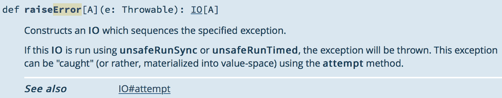

由于失败，它终止了正在进行的 IO 计算。

接下来，让我们定义一些辅助方法，我们将使用这些方法来测试我们的括号原始功能：

```java
def dbSession: IO[DBSession] = IO { new DBSession }

def selectUsers(db: DBSession): IO[List[String]] =
  dbSession.flatMap(_.runStatement("select * from user"))
```

在先前的代码中，我们有一个创建数据库的函数，以及一个从数据库连接查询用户的函数。所有这些都是在 IO 数据类型下完成的。

接下来，让我们创建一个设置，以便我们可以看到连接是否已关闭。我们可以通过在括号原始功能下创建一个 Monadic 流程来实现这一点，然后从流程中，我们将把我们的会话引用泄露到流程外的变量中，稍后我们将检查它：

```java
var sessIntercept: DBSession = null
val computation: IO[Unit] =
  dbSession.bracket(sess => for {
    users <- selectUsers(sess)

    _ = println(s"Users:\n${users.mkString("\n")}")
    _ = sessIntercept = sess
  } yield ())(sess => IO { sess.close() })

println(s"Session intercept before execution: $sessIntercept")
computation.unsafeRunSync
println(s"Session intercept after execution: $sessIntercept")
println(s"Session intercept closed status: ${sessIntercept.isClosed}")
```

因此，在先前的代码中，我们使用了计算值中的括号。我们在括号内部处于 Monadic 流程中，作为这个 Monadic 流程的一部分，我们选择用户以验证我们的程序是否正确工作。最后，我们将资源泄露到流程外的变量中。清理函数定义为关闭会话。

运行先前的计算的结果如下：


结合 IO 的异步能力，括号为你提供了一个在异步环境中使用、并希望防止内存泄漏的强大原始功能。

# 服务器端编程

函数式编程的一个大型应用领域是服务器端编程。服务器端编程指的是在服务器上持续运行并能够与外部世界通信的 Web 应用。这样的应用通常会在端口上监听传入的 HTTP 请求。请求到达后，它将在服务器上执行一些工作，并使用计算结果回复请求的客户端。

这类系统的应用范围很广。从常规网站到移动应用，再到**软件即服务**（**SaaS**）系统，都被制作成网络应用。此外，一旦你拥有一个在服务器上持续运行、通过一个定义良好的协议与外部世界通信并执行一些计算的网络应用，你就可以为这样的应用拥有众多客户端。例如，你可能有一个基于 HTML 的前端，以及一个移动应用，还可以通过 API 与第三方应用集成。

Scala 和 Cats 基础设施恰好对服务器端编程有很好的支持。它们包含了你接受 HTTP 请求、将它们映射到你的领域模型对象、与数据库通信以及向客户端回复所需的所有基本元素。在本节中，我们将看到它是如何实现的。

但首先，让我们简要概述一下服务器端应用程序的一般架构，并指定我们将作为本章示例使用的应用程序。

# 服务器端应用程序的架构

首先，一个服务器应用程序包括一个服务器。服务器是一个将在给定机器上持续运行并监听给定 HTTP 端口的传入连接的应用程序。传入的连接通常是遵循某种协议的 HTTP 连接。

# 通信协议

结构网络应用通信协议的一种流行方式是遵循 RESTful 通信范式。

由于应用监听 HTTP 请求，因此将这些请求发送到某个路径是合理的。例如，一个典型的 HTTP 请求包含以下头部信息：

```java
GET http://localhost:8888/order HTTP/1.0
User-Agent: Mozilla/5.0 (Windows NT 6.3; WOW64; rv:39.0) Gecko/20100101 Firefox/39.0
Pragma: no-cache
Content-Length: 19
Host: localhost:8888
```

因此，正如你所看到的，请求包含一个目标字符串或所谓的路径，以及 HTTP 头部信息。你可以推断出服务器公开的资源作为具有某些行为和定义在其上的数据的实体。RESTful 范式规定，服务器端通过 HTTP 公开的能力必须具有反映资源及其行为的路径和 HTTP 方法。

例如，假设你有一个管理论坛的服务器。我们将有用户和论坛帖子。关于行为，随着时间的推移，我们将想要创建新的帖子和新用户，列出现有的帖子和新用户，以及修改和删除它们。

这些行为可以通过以下方式通过 HTTP RESTful API 公开：

```java
POST /user
POST /post
GET /user
GET /post
PUT /user
PUT /post
DELETE /user/{id}
DELETE /post/{id]
```

因此，HTTP 方法反映了服务器要执行的行为的性质。路径反映了给定行为中涉及资源的性质。

客户必须经常向服务器发送额外的信息。服务器应向客户回复一定的结果。这种请求和响应数据必须遵循一种双方都能理解的一定格式。此外，由于 Web 应用程序不仅可能面向一个客户，还可能面向众多潜在第三方客户，因此有必要使这种协议标准化。就像 HTTP 协议是一个众多独立各方都理解并实施的标准化协议一样，请求和响应协议也必须得到众多独立各方的支持。这是因为它们将需要一些库来编码和解码这种请求，我们不希望给他们带来额外的开销，以便他们可以自行实现。

因此，一种标准的编码请求和响应的方式是使用 JSON 或 XML。在这个例子中，我们将使用 JSON，因为它在 Scala 中比 XML 有更好的支持。此外，Cats 库系列包括轻松处理 JSON 的能力。

通信协议只是服务器架构中涉及的一部分。接下来，我们将简要讨论服务器由哪些组件组成。

# 服务器的软件架构

任何服务器必须拥有的第一个组件是一个能够监听 HTTP 请求并对它们做出响应的应用程序。这样的组件被称为 HTTP 服务器软件。除此之外，大多数服务器还需要一些持久化组件——数据库。接下来，服务器将需要一种与数据库通信的方式。因此，我们需要数据库访问层。

最后，需要一个编排解决方案，以便上述组件能够良好地协同工作，这意味着我们需要一个简单的启动服务器和数据库的能力，以及定义它们之间通信的方式。编排必须是明确定义的，并且可重复的，在多种不同的环境中设置最小。这很重要，因为你不希望为某个平台编写一次服务器，却无法轻松将其移植到其他平台。

上述组件是任何服务器端软件的基本组件。当然，更复杂的服务器端应用程序涉及更复杂的架构；然而，为了我们示例的目的，这已经足够了。

现在，让我们讨论我们将要使用的示例，以展示使用 cats 和 Typelevel 库进行服务器端编程。

# 示例规范

我们将要讨论的示例将是一个在线商店。因此，我们将有客户、商品实体，以及描述客户下订单的能力。

我们将把这些实体存储在数据库中，并且将通过 HTTP 接口暴露创建新用户和新订单的功能，以及列出现有订单和商品的功能。

接下来，让我们看看如何将这种架构付诸实践。我们将讨论整个架构，并在过程中介绍各种函数式编程库。这将有助于全面了解如何使用 Cats 进行服务端编程。

请记住，我们不会深入讨论我们将要讨论的任何库，因为这值得一本自己的书。此外，我们已经提到，猫是函数式编程技术的尖端，这意味着这个库发展迅速，我们可能涵盖的深入信息很快就会过时。然而，总体架构原则可能在未来相当长一段时间内保持不变。

# 编排和基础设施

首先，我们将讨论我们的基础设施以及我们将用于实现我们架构的软件。

我们的服务端软件将包含两个独立的部分。首先，它是一个基于 Scala 的服务端软件，其次，它是一个基于 Postgres 的数据库。

这两个组件通过 Docker 一起编排。

尽管本小节讨论的主题不涉及函数式编程，但为了理解函数式服务器将在哪种设置下运行，理解整体情况是必要的。

# Docker

我们将在`docker-compose`文件中将涉及的其他软件的所有组件定义为 Docker 服务。

# Docker-compose

整个文件看起来如下：

```java
version: '3'
services:
  postgres:
    container_name: mastering_postgres
    build: postgres
    ports:
      - 5432:5432
  backend:
    container_name: mastering_backend
    build: .
    ports:
      - 8888:8888
    volumes:
      - ./_volumes/ivy2:/root/.ivy2
      - ./_volumes/sbt-boot:/root/.sbt/boot
      - ./_volumes/coursier:/root/.cache
      - .:/root/examples
    environment:
      - POSTGRES_HOST=postgres
      - POSTGRES_PORT=5432
    stdin_open: true
    tty: true
```

文件由两个服务组成——Postgres 服务和后端服务。Postgres 服务的定义如下：

```java
postgres:
  container_name: mastering_postgres
  build: postgres
  ports:
    - 5432:5432
```

此服务定义了一个名为`mastering_postgres`的容器。`build`指令指定我们想要将当前文件夹中`Postgres`文件夹的内容构建到一个单独的 Docker 镜像中。端口指令指定了容器将暴露哪些端口。这个容器将运行数据库，因此我们需要暴露数据库将运行的端口。基本上，这是一个从容器端口到主机机端口映射。

第二个服务定义如下：

```java
backend:
  container_name: mastering_backend
  build: .
  ports:
    - 8888:8888
  volumes:
    - ./_volumes/ivy2:/root/.ivy2
    - ./_volumes/sbt-boot:/root/.sbt/boot
    - ./_volumes/coursier:/root/.cache
    - .:/root/examples
  environment:
    - POSTGRES_HOST=postgres
    - POSTGRES_PORT=5432
  stdin_open: true
  tty: true
```

它还提供了其容器的名称，并指定我们想要将当前文件夹的内容构建到一个单独的镜像中。Docker 将在提供的目录中查找`Dockerfile`并将其构建到一个单独的镜像中。接下来，由于这个容器将托管一个 HTTP 服务器，我们还需要进行端口映射，以便我们可以从容器中监听主机机的 HTTP 连接。

之后，我们有 `volumes` 数组。这个数组指定了本地机器上的目录将被挂载到容器上的目录。在当前示例中，我们将负责缓存的容器目录集挂载。第一个条目是 `ivy2` 缓存，它被 Scala 和 SBT 用于存储它们的依赖项。之后，我们还挂载了 SBT 根目录，它是 SBT 安装的主机。最后，我们挂载了缓存目录，这是 SBT 存储其依赖项的另一个位置。

我们执行这些缓存目录的挂载，以便容器记住它在每次调用中获取了什么。因此，每次您重新启动 Docker 容器时，您不需要等待应用程序获取其依赖项，因为所有依赖项都将存储在主机机器上，在挂载的目录下。

最后，我们将当前目录挂载到容器下的 examples 目录。这样做是为了我们可以从容器中访问 Scala 源代码。因此，我们将能够在 Docker 容器的上下文中运行应用程序，这意味着我们将能够访问 `docker-compose` 文件中定义的所有基础设施。

最后，我们有一个 `environment` 数组。这个数组指定了容器初始化时将设置的环境变量。我们有指定 Postgres 数据库的主机和端口号的变量。我们将在 Scala 源中使用这些环境变量来指定数据库的位置。

最后，我们在文件中有两个技术条目：

```java
stdin_open: true
tty: true
```

这些与从命令行访问运行中的 Docker 容器的能力相关。因此，由于这两个条目，我们应该能够在运行中的 Docker 容器上打开一个命令行。基本上，它们指定了 Docker 容器应该如何分配和处理控制台设备。如果您对此或任何其他 Docker 条目感兴趣，请查阅 Docker 文档。

接下来，让我们讨论与我们在 `docker-compose` 中定义的两个服务对应的两个 Dockerfile。

# Dockerfile

Dockerfile 包含了如何构建特定镜像的描述。我们有两个镜像：一个是数据库镜像，另一个是后端镜像。让我们先从数据库镜像开始：

```java
FROM postgres:latest
ADD ./*.sql /docker-entrypoint-initdb.d/
```

Dockerfile 只包含两行代码。首先，我们从现有的 Postgres 镜像继承。其次，我们将当前目录下的所有 SQL 文件复制到 Docker 镜像中的特定目录。这是在继承的 Postgres 镜像文档中描述的标准初始化过程。主要思想是使用我们将要使用的模式初始化数据库。我们的模式如下：

```java
CREATE TABLE customer (
  id serial NOT NULL,
  "name" varchar NOT NULL,
  CONSTRAINT customer_pk PRIMARY KEY (id),
  CONSTRAINT customer_un UNIQUE (name)
)
WITH (
  OIDS=FALSE
) ;
CREATE UNIQUE INDEX customer_name_idx ON public.customer USING btree (name) ;

CREATE TABLE good (
  id serial NOT NULL,
  "name" varchar NOT NULL,
  price float4 NOT NULL,
  stock int4 NOT NULL DEFAULT 0,
  CONSTRAINT good_pk PRIMARY KEY (id)
)
WITH (
  OIDS=FALSE
) ;

CREATE TABLE "order" (
  id serial NOT NULL,
  customer int4 NOT NULL,
  good int4 NOT NULL,
  CONSTRAINT store_order_pk PRIMARY KEY (id),
  CONSTRAINT order_customer_fk FOREIGN KEY (customer) REFERENCES customer(id) ON DELETE CASCADE,
  CONSTRAINT order_good_fk FOREIGN KEY (good) REFERENCES good(id) ON DELETE CASCADE
)
WITH (
  OIDS=FALSE
) ;

INSERT INTO good (id, name, price, stock) VALUES(1, 'MacBook Pro 15''', 2500, 15);
INSERT INTO good (id, name, price, stock) VALUES(2, 'iPhone 10', 1000, 10);
INSERT INTO good (id, name, price, stock) VALUES(3, 'MacBook Air', 900, 3);
INSERT INTO good (id, name, price, stock) VALUES(4, 'Samsung Galaxy S5', 500, 8);
INSERT INTO good (id, name, price, stock) VALUES(5, 'Panasonic Camera', 120, 34);
```

我们还有三个表格。首先，我们有一个客户和商品的表格。客户和商品都有一个唯一标识它们的 ID。此外，商品还有一些特定的参数，例如价格和库存数量。最后，我们有一个将客户与商品通过订单链接的表格。

之后，我们将使用一些示例商品填充我们的数据库，我们将对这些商品运行测试查询。

接下来，让我们看看我们的后端镜像：

```java
FROM hseeberger/scala-sbt

RUN mkdir -p /root/.sbt/1.0/plugins
RUN echo "\
addSbtPlugin(\"io.get-coursier\" % \"sbt-coursier\" % \"1.0.0-RC12-1\")\n\
addSbtPlugin(\"io.spray\" % \"sbt-revolver\" % \"0.9.0\" )\n\
" > /root/.sbt/1.0/plugins/plugins.sbt

WORKDIR /root/examples
```

该镜像继承自标准的 Scala SBT 镜像，因此我们将拥有 Scala 和 SBT。之后，我们定义了一些我们将要使用的 SBT 插件。第一个是用来加速下载依赖项的，第二个是用来在单独的 JVM 中启动服务器的。我们将在一个单独的 JVM 中启动服务器，因为这样我们可以保留管理服务器、从 SBT 控制台启动和重启服务器的可能性。

最后，我们将工作目录设置为我们的示例目录。

你可以在示例仓库的`README`文件中找到如何运行`Dockerfile`的说明。

现在我们已经熟悉了涉及组件的架构，让我们更详细地看看后端软件是如何使用 Scala 构建的。

# 后端架构

后端由三个独立的层组成。我们有业务域模型层、数据库访问层和服务器层本身。让我们依次查看这些层，看看它们如何使用 Typelevel 库实现。

# 模型

模型由一个 Scala 文件表示。它包含模型我们数据库的 case 类。请注意，在这里，我们使用的是普通的 Scala case 类，没有任何其他增强。如果你熟悉类似 Hibernate 的 Java 库，你会知道有一个所谓的**对象关系映射**（**ORM**）库的整个类别。这些库旨在提供面向对象概念到数据库模式的无缝映射。主要思想是能够管理数据库、查询它和更新它，而无需显式执行 SQL 语句。这些库旨在为你提供一个面向对象的 API，允许执行这些操作，同时抽象底层的 SQL 引擎。

由于抽象泄露，这些库被证明是一个坏主意。有一些情况，这些类型的 ORM 库无法很好地处理。这些库可能不允许你执行某些特定于给定数据库的功能。

在现代函数式编程中，对象关系映射被认为是一种不好的做法。当前的共识似乎是执行普通的 SQL 语句是建模与数据库交互的最佳方式。因此，与对象关系映射库不同，我们不需要修改我们的领域模型以匹配我们正在工作的对象关系框架的需求。我们不需要实现模型类的接口。我们能够以普通的 case 类形式定义我们的领域模型。

# 数据库层

数据库层是用 Doobie 库实现的。每个实体都有一个单独的 Scala 文件，其中有一个单例对象，它包含我们为这个应用程序所需的所有方法。例如，让我们看看`customer`对象公开的 API：

```java
object customer extends CustomerDbHelpers {
  def create(c: Customer): IO[Int] = ???
  def findByName(name: String): IO[Option[Customer]] = ???
  def list: IO[List[Customer]] = ???
  def get(id: Int): IO[Customer] = ???
  def update(c: Customer): IO[Int] = ???
  def delete(id: Int): IO[Int] = ???
}

trait CustomerDbHelpers {
  val selectCustomerSql = fr"select * from customer"  // to be explained further in the chapter
}
```

因此，我们有几种数据库访问方法，每种方法都返回一个 IO——这正是我们在上一节中学到的相同的 IO。在本节中，我们将要查看的 Doobie 库与 Cats effect 很好地集成，我们可以利用 IO 与数据库进行通信。

现在，让我们看看这样一个方法是如何在 Doobie 中实现的，以及 Doobie 的操作模型：

```java
def create(c: Customer): IO[Int] =
  sql"""
    insert into customer (name)
    values (${c.name})
  """
  .update.withUniqueGeneratedKeysInt.transact(tr)
```

在这里，有几件事情在进行中。首先，我们有一个由 Doobie 提供的字符串插值器下的 SQL 语句。现在，在 Scala 中，你可以定义具有特定关键字的自定义字符串插值器，这个关键字直接写在字符串字面量之前。在我们的例子中，这样的关键字是`sql`。字符串插值器的主要思想是，在编译时，它们将以某种方式转换字符串，可能产生一个完全不同的对象。

首先，让我们弄清楚字符串插值器对字符串做了什么。为了做到这一点，我们将查阅文档：


因此，`sql`是`fr0`的别名，定义如下：

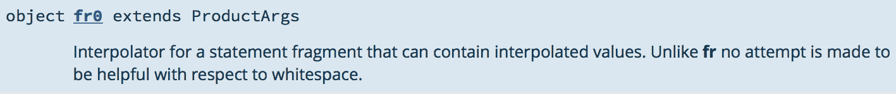

此对象有两个方法：

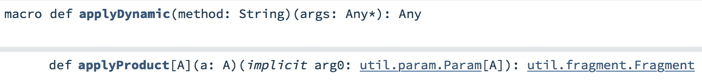

注意，这些方法中有一个是宏定义。宏定义是 Scala 中的一个特殊方法，它在编译时被调用。它用于 Scala 的元编程。字符串插值器通常是用宏实现的。

现在，宏将字符串转换为一个`Fragment`对象。片段是在字符串插值器下的 SQL 语句的模型。注意，在前面的屏幕截图中，字符串插值器还提供了外部变量，用于 SQL 语句，如下所示：

```java
values (${c.name})
```

插值是由专门的 Doobie 宏完成的。它以安全的方式插值变量，这样你就不必担心将变量插入 SQL 查询时的转义——这样，你不会遇到 SQL 注入。Doobie 会为你执行转义。

关于 Doobie 在这里使用的技术需要注意的一点是，与数据库交互的 SQL 代码被定义为一个字符串。然而，这个字符串是在编译时被处理的。这为您提供了编译时的类型安全和编译器辅助。

现在，让我们看一下片段的定义：

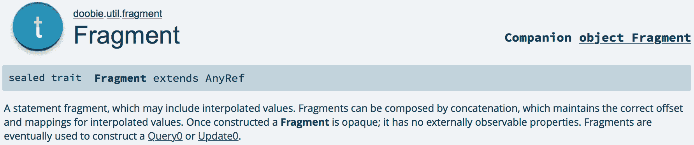

片段公开了以下 API：

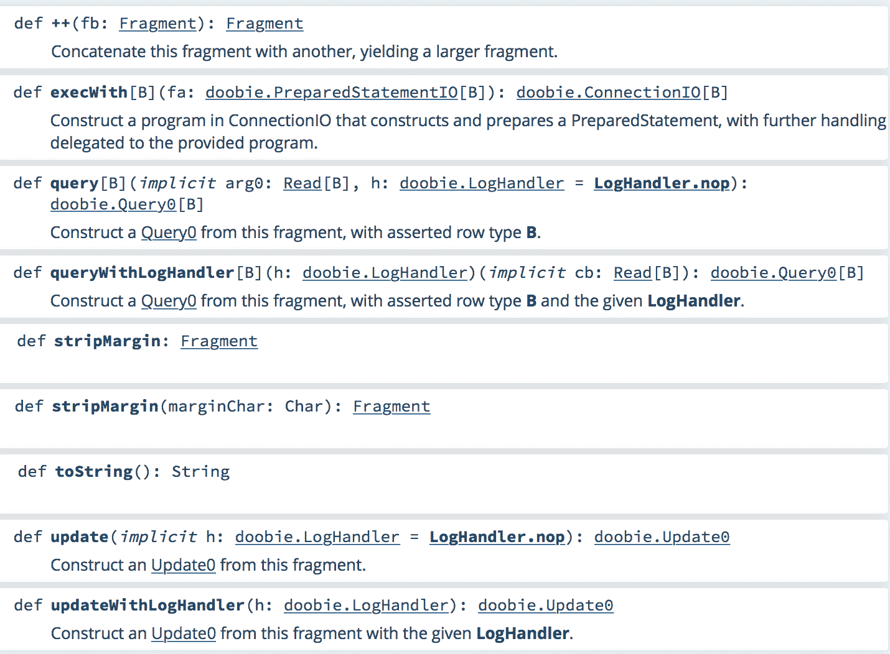

对于我们的目的，以下两种方法尤为重要：

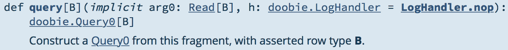

前面的方法用于查询操作，例如从数据库中选择。

以下方法用于更新操作，例如对数据库进行修改：


一个片段是你传递给字符串插值的语句的模型。然而，这个模型不存储关于你想要对数据库执行哪个确切操作的信息。因此，为了指定这种操作，你需要在`Fragment`上调用`update`或`query`方法。`update`方法用于插入和更新操作，而`query`方法用于`select`操作。

在我们的示例中，我们调用`update`方法，因为我们执行了一个插入查询。接下来，从片段中生成了一个`Update0`对象：

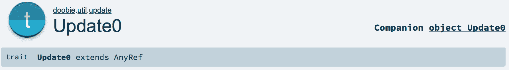

它公开了以下 API：


注意，它的 API 分为两个部分。首先，是诊断部分。由于 Doobie 构建了你的查询的内部模型，它允许你运行某些测试来检查传递给查询的参数是否为正确的类型，以及查询本身是否被正确组成。我们还有一个执行 API。执行 API 是你用来运行查询的 API。

注意，所有来自执行类的方法都在`ConnectionIO`效果类型下返回一个类型。`ConnectionIO`本质上是一个所谓的自由对象。如果一个片段和`Update0`是你要运行的 SQL 查询的模型，那么`ConnectionIO`的自由对象就模拟了程序需要采取的精确步骤来对数据库执行此查询。自由对象是来自抽象代数的一个概念。本质上，这个想法是在不实际运行的情况下模拟自由对象下的计算。这个想法与我们在上一节中查看的 IO 效果类型相同。那个类型也是一个自由对象。

注意，在我们的示例中，我们调用了`UniqueGeneratedKeys`方法。该方法知道底层数据库将为我们即将执行的插入操作生成一个主键。在我们的情况下，主键是一个整数，我们向该方法传递了一个整数类型参数。

如果你查看`ConnectionIO`的定义，你会看到它是一个`Free` Monoid：


因此，数据库操作的底层实现是使用 free Monad 库完成的，这也是 Cats 基础设施的一部分。正如我们之前所说的，我们不会深入讨论这些辅助库和概念，因为它们本身就值得单独一本书来介绍。所以，这里的主要要点是，Doobie 库从构建你的 SQL 查询模型开始，并提供一个 API 来逐步将其转换为针对数据库执行的计算模型。在所有地方，计算作为值的范式得到保持，除非明确指令，否则不会执行任何操作。

我们能够在给定的效果类型下运行`ConnectionIO`，通过对其执行`transact`操作。这个操作是通过一个 Rich Wrapper 注入的，其定义如下：

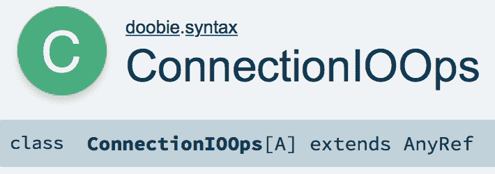

以下构造函数用于构建包装器：

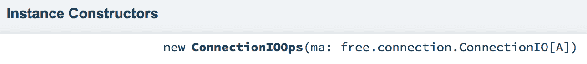

它只公开了一个方法：

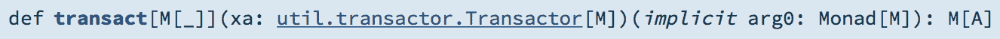

实质上，该方法负责在给定数据库的交易者时，在某个效果类型下运行计算。现在，数据库的交易者是一个知道如何与底层数据库通信的驱动程序。请注意，到目前为止，Doobie 公开了数据库无关的 API，这是这类库所期望的。所以，特定于数据库的信息存储在`Transactor`对象下，你必须为你的数据库实现这个对象，以便你可以在该数据库上运行数据库查询。

还请注意，我们传递给`transact`方法的效果类型有一个类型参数。这个参数指定了我们将在哪种效果类型下运行我们的计算。记住，`ConnectionIO`只是对要执行的计算的描述。为了执行它，我们需要指定我们将要在哪种效果类型下执行它。

在我们的例子中，我们使用`tr`变量作为交易者。那么，让我们看看它是如何定义的，以便理解我们例子的语义：

```java
implicit lazy val tr: Transactor[IO] =
 Transactor.fromDriverManagerIO}:${sys.env("POSTGRES_PORT")}/postgres"
 , "postgres", "")
```

在这里，我们使用内置的 Doobie 方法来构建交易者，给定我们将要使用的数据库的数据库驱动程序的完整类名。在我们的例子中，我们使用 Postgres，并将 Postgres 驱动程序的完全限定名称传递给驱动程序管理器构造 API。

驱动管理构建方法的下一个参数是我们将要连接的数据库的地址。在这里，我们正在连接到一个 Postgres 数据库，并且我们从环境变量中读取其主机和端口。记住，当我们讨论后端和数据库的 Docker 编排时，我们讨论了后端的环境变量是从`docker-compose`文件中填充的。这些变量指定了数据库的位置，以便后端可以连接到它。

在连接字符串之后，我们有数据库的登录名和密码。在我们的例子中，登录名和密码是我们使用的 Docker Postgres 镜像的标准连接字符串。

此外，请注意，我们的交易者是为 IO 的效果类型构建的。这意味着当我们将要运行针对这个交易者的查询时，结果将是一个 IO。

让我们回顾一下什么是 IO。它是将要进行的计算的描述。然而，`ConnectionIO`也是将要进行的计算的描述。所以，当我们对`ConnectionIO`上的`transact`语句进行执行时，我们实际上并不是作为一个计算来运行它，而是将其从一种自由语言翻译成另一种语言。我们将它从`ConnectionIO`翻译成 IO。这种从一种自由语言到另一种自由语言的翻译在纯函数式编程中相当常见。一个有用的直觉可能是高级编程语言与低级编程语言之间的对比。当你编译像 Scala 或 Java 这样的语言时，就会发生从高级语言到低级字节码语言的翻译。

对于人类来说，用高级语言编程更方便，但对于机器来说，消费低级语言更方便。因此，在我们实际运行程序之前，我们必须首先将其从高级语言翻译成低级语言。

类似的东西也可以说关于从一种自由效果类型到另一种自由效果的翻译。本质上，当我们试图将所有的计算指定为值时，我们迟早会遇到某些任务可以用一种更高层次的语言轻松描述的情况。然而，当它们用低级语言表达时运行它们更方便。因此，翻译发生在从高级语言到低级语言。

在我们的例子中，我们正在将`ConnectionIO`的翻译从描述与数据库交互的领域特定语言，翻译成 IO 语言，这是一种通用目的的低级语言，可以描述任何输入输出操作。

因此，我们的`customer`对象的创建方法输出为 IO，我们可以在需要它们的结果时稍后运行。

现在，让我们来看看我们之前提到的`customer`对象成员的附加方法。首先，让我们看看`list`方法，它应该列出数据库中所有现有的客户：

```java
def list: IO[List[Customer]] =
  selectCustomerSql.query[Customer].to[List].transact(tr)
```

`selectCustomerSql`变量定义如下：

```java
val selectCustomerSql = fr"select * from customer"
```

我们将这个查询定义在一个单独的变量中，因为我们将在稍后的其他查询中重用它。注意我们如何使用 Doobie 提供的其他字符串插值器：

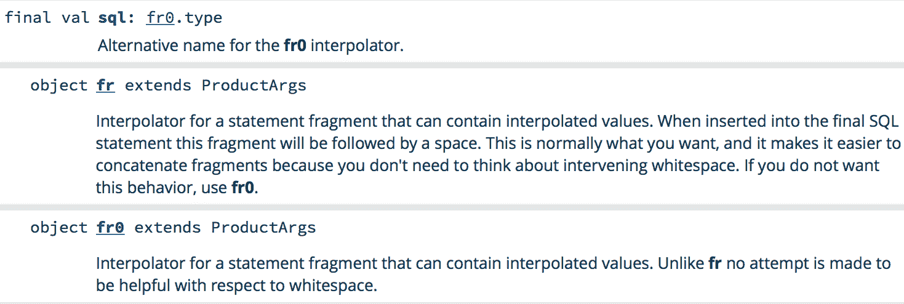

如您从文档中看到的，Doobie 提供了几种方式来指定字符串插值片段。主要区别在于它们后面是否有尾随空格。这样的尾随空格在您想要稍后与其他片段组合时可能非常有用。为了确保您不需要担心在您将要使用空格连接的两个片段之间进行分隔，有一个默认的字符串插值器会为您自动插入空格。我们稍后会看到这一点是如何有用的。

回到我们的`list`示例，如您所见，我们正在对片段运行查询方法。这与`customer`对象的`create`方法的`update`方法形成对比。我们正在执行一个`select`查询，因此我们将运行`query`方法。

该方法生成一个`Query`对象。在这里需要注意的一个有趣的事情是，Doobie 可以自动将数据库返回的原始数据转换为所选的数据类型。因此，我们将`Customer`类型作为查询的类型参数，Doobie 能够自动推断出将结果转换为该类型的方法。一般来说，对于 case classes、tuples 和原始类型，这种转换是开箱即用的。这是通过编译时元编程，通过宏和类型级计算来实现的。Doobie 的这个有用特性使其能够直接与传统对象关系映射库竞争，因为您能够以零额外成本将结果映射到您的领域模型。

由`query`方法产生的`Query0`对象定义如下：


让我们来看看它的 API。它由我们感兴趣的两大部分组成。首先，是诊断部分：

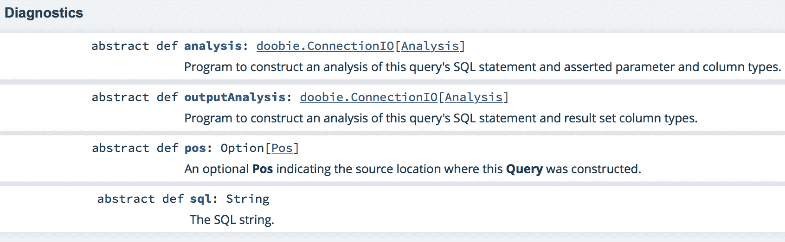

接下来，是结果部分：

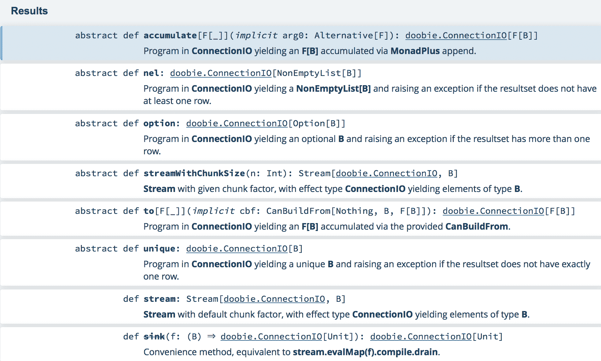

与`Update`的情况类似，API 被分为诊断和结果两个部分。对我们来说，最有趣的部分是结果部分。请注意，它包含各种方法，用于指定你期望从数据库查询中检索哪种类型的结果。例如，当你预期查询可能返回空结果时，应该调用`option`方法。当你预期查询只有一个结果时，应该调用`unique`方法。最后，当你想要将结果转换为某个集合时，应该调用`to`方法。实际上，正如你所看到的，在这里没有限制你只能从给定的结果构建集合。只要你的结果类型符合`F[_]`类型形式，你应该能够构建你想要的任何东西，前提是你有一个这个方法隐式依赖的类型类。最常见的情况是，这个方法用于从数据库中创建集合。

这个 API 的其他方法也可以用于其他类型的结果。然而，为了本教程的目的，这三个就足够了。

回到我们的列表示例，我们在它上面调用`to`方法来生成所有客户的列表。因此，我们得到了一个`ConnectionIO`类型，我们之前已经讨论过。然后我们像之前一样运行它通过我们的交易者。

现在，让我们看看`Customer`对象的`get`方法：

```java
def get(id: Int): IO[Customer] =
  (selectCustomerSql ++ sql"where id = $id")
    .query[Customer].unique.transact(tr)
```

在这里要注意的第一件事是我们正在进行片段连接。因此，从数据库中选择客户的查询保持不变。然而，我们正在使用定义在`Fragment`上的连接方法将其与另一个片段连接起来，并生成一个复合片段。连接方法在片段上的定义如下：

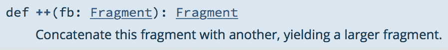

注意到左侧`Fragment`上的尾随空白在这里很有用。记住我们讨论过`selectCustomerSql`片段是用一个强度插值器构建的，它会将尾随空白注入到生成的片段中。这对于需要连续连接两个片段的连接情况非常有用。注意，我们不需要在带有过滤条件的第二个片段前添加空白，因为第一个片段已经考虑到了连接。

之后，我们以类似的方式运行`query`方法，就像我们在列出所有客户示例中所做的那样。然而，在这里，我们只期望一个客户。因此，我们将调用查询对象的`unique`方法。最后，我们将调用`transact`方法将`ConnectionIO`转换为`IO`。

接下来，让我们看看`findByName`方法：

```java
def findByName(name: String): IO[Option[Customer]] =
  (selectCustomerSql ++ sql"""where name = $name""")
    .query[Customer].option.transact(tr)
```

此方法通过名称查找客户。请注意，它与通过 ID 获取客户的方式定义得非常相似。然而，我们并没有在查询对象上调用`unique`方法，而是调用了`option`方法。这是因为我们构建此方法时已经考虑到了查询结果可能为空的可能性。每次我们通过 ID 请求用户时，我们假设具有给定 ID 的用户存在于数据库中，至少在这个示例的目的上是这样。然而，当我们正在数据库中查找用户时，我们假设具有给定名称的用户可能不存在。

因此，我们的`findByName`方法返回一个`Option[Customer]`。

我们将要讨论的最后两个方法是`update`和`delete`方法：

```java
def update(c: Customer): IO[Int] =
  sql"""
    update customer set
      name = ${c.name}
    where id = ${c.id}
  """
  .update.run.transact(tr)

def delete(id: Int): IO[Int] =
  sql"""delete from customer where id = $id"""
    .update.run.transact(tr)
```

这些方法在 Doobie API 方面没有带来任何新内容，并且是使用我们已学过的 API 构建的。

现在，让我们看看这个示例在实际数据库中的工作情况。为了测试这个示例，我们将使用以下应用程序：

```java
val customersTest: IO[Unit] = for {
  id1 <- customer.create(Customer(name = "John Smith"))
  id2 <- customer.create(Customer(name = "Ann Watson"))

  _ = println(s"Looking up customers by name")
  c1 <- customer.findByName("John Smith")
  _ = println(c1)
  c2 <- customer.findByName("Foo")
  _ = println(c2)

  _ = println("\nAll customers")
  cs <- customer.list
  _ = println(cs.mkString("\n"))

  _ = println(s"\nCustomer with id $id1")
  c3 <- customer.get(id1)
  _ = println(c3)

  _ = println(s"\nUpdate customer with id $id1")
  r <- customer.update(c3.copy(name = "Bob"))
  _ = println(s"Rows affected: $r")
  c4 <- customer.get(id1)
  _ = println(s"Updated customer: $c4")

  _ = println(s"\nClean-up: remove all customers")
  _ <- List(id1, id2).traverse(customer.delete)
  cx <- customer.list
  _ = println(s"Customers table after clean-up: $cx") 
} yield ()

customersTest.unsafeRunSync()
```

上述应用程序测试了我们迄今为止讨论的所有方法。首先，我们创建了一些客户以供使用。然后，我们测试了按名称查找。之后，我们测试了数据库中所有客户的列表。之后，我们测试了通过 ID 获取客户。最后，我们测试了客户上的`update`和`delete`操作。运行上述应用程序的结果如下：

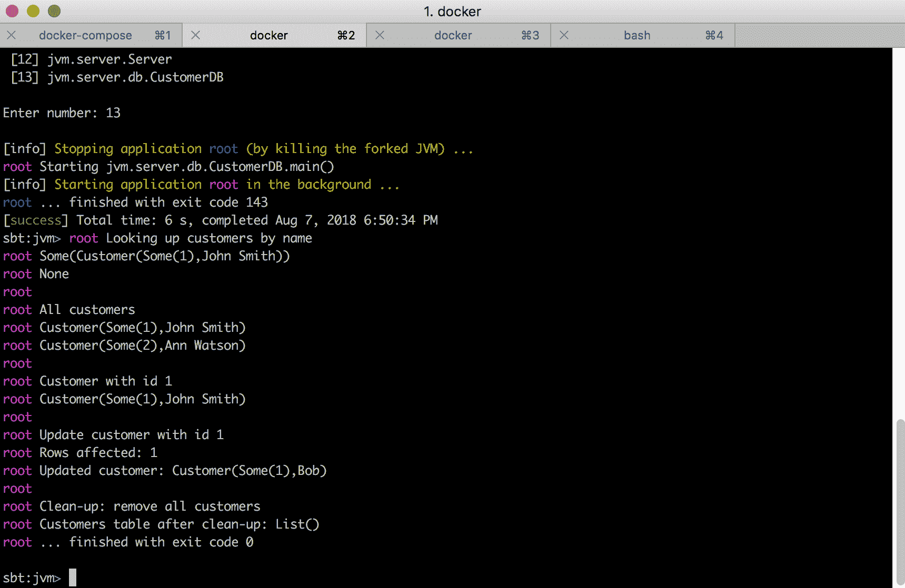

除了为顾客提供的方法外，我们还需要定义如何处理商品的方法。因此，我们需要一个创建商品的方法，我们可以将其定义如下：

```java
def create(c: Good): IO[Int] =
  sql"""
    insert into good (
      name
    , price
    , stock)
    values (
      ${c.name}
    , ${c.price}
    , ${c.stock})
  """
  .update.withUniqueGeneratedKeysInt.transact(tr)
```

我们还需要查询商品表的方法：

```java
val selectGoodSql = fr"select * from good"

def findByName(name: String): IO[Option[Good]] =
  (selectGoodSql ++ sql"""where name = $name""")
    .query[Good].option.transact(tr)

def list: IO[List[Good]] =
  selectGoodSql.query[Good].to[List].transact(tr)

def get(id: Int): IO[Good] =
  (selectGoodSql ++ sql"where id = $id")
    .query[Good].unique.transact(tr)
```

最后，我们需要`update`和`delete`方法来修改数据库：

```java
def update(c: Good): IO[Int] =
  sql"""
    update good set
      name = ${c.name }
    , price = ${c.price}
    , stock = ${c.stock}
    where id = ${c.id}
  """
  .update.run.transact(tr)

def delete(id: Int): IO[Int] =
  sql"""delete from good where id = $id"""
    .update.run.transact(tr)
```

我们还需要为订单创建一个数据库访问对象，以便我们可以修改和列出它们。在订单对象上我们需要定义以下方法：

```java
object order extends OrderDbHelpers {
  def create(o: Order): IO[Int] =
    sql"""
      insert into "order" (customer, good)
      values (${o.customer}, ${o.good})
    """
    .update.withUniqueGeneratedKeysInt.transact(tr)

  def list: IO[List[Order]] =
    selectOrderSql.query[Order].to[List].transact(tr)

  def get(id: Int): IO[Order] =
    (selectOrderSql ++ sql"where id = $id")
      .query[Order].unique.transact(tr)
}

trait OrderDbHelpers {
  val selectOrderSql = fr"""select * from "order""""
}
```

由于这些方法没有引入任何新的功能，只是展示了我们迄今为止所学的 Doobie 的使用，因此我们不会深入讨论这些方法。

接下来，我们将看到如何以纯函数式风格执行服务器端编程，以及它是如何利用我们迄今为止定义的数据库对象的。

# 服务器端编程

对于服务器端编程的目的，我们将使用名为`HTTP4S`和`Circe`的库。`HTTP4S`是一个库，你可以用它来启动 HTTP 服务器，接受请求，并定义如何响应它们。`Circe`是一个库，你可以用它将 JSON 字符串转换为领域对象。

`HTTP4S`在底层使用 IO，以便它可以很好地集成到我们现有的输出 IO 的数据库基础设施中，以及确保我们的服务器以异步方式运行。`Circe`使用编译时编程技术（我们已简要讨论过）来定义如何将 JSON 字符串转换为 Scala 案例类或特质。

我们将按照以下方式启动我们的服务器：

```java
BlazeBuilder[IO]
  .bindHttp(8888, "0.0.0.0")
  .mountService(all, "/")
  .serve.compile.drain.unsafeRunSync()
```

在底层，`HTTP4S`依赖于其他用于服务器端编程的库，即`Blaze`库。正如我们之前提到的，服务器端编程的基础设施涉及广泛的各个库，所以这里要捕捉的是服务器端编程的大致图景。

我们在`BlazeBuilder`对象上调用几个配置方法。`bindHttp`方法指定我们将监听哪个主机和端口。在这种情况下，主机设置为`localhost`或`0.0.0.0`，端口设置为`8888`。

接下来，我们定义服务器将使用的处理器。这是通过`mountService`方法完成的。在这种情况下，我们将单个处理器`all`绑定到服务器的根路径。`all`处理器是我们即将定义的处理器。

当我们完成服务器的配置后，我们将调用其上的`serve`方法。该方法返回一个流，它是 Cats 基础设施中另一个库的成员。这个库被称为 FS2（代表函数式流），是一个专门用于以函数式方式处理流的库。流是延迟评估的，为了在 IO 下运行它，我们将运行这个流的`compile`和`drain`方法。这个方法的核心是它将在 IO 的效果类型下运行一个延迟的、有副作用的流。`drain`方法返回 IO。接下来，我们使用`unsafeRunSync`方法运行这个 IO。

因此，正如你所看到的，在函数式编程中启动 HTTP 服务器涉及相当多的库。然而，所有这些库的核心思想是相同的。它们都利用了相同的效果类型 IO，并且都订阅了延迟评估、引用透明的计算作为值的理念。这意味着默认情况下不会运行任何计算；它们都存储为计算的描述。由于每个库都有自己的领域，一些库可能有自己的语言来描述它们的计算。然而，这些特定领域的语言最终被翻译成单一的底层 IO 语言。

如果你对深入了解这里发生的事情感兴趣，最好的方法是检查我们所提到的库的 Scala API 文档。检查你调用的方法、它们返回的类型，以及理解这些方法和类型的意义，这可以帮助你更好地理解这个库内部发生的事情。

接下来，我们将探讨如何定义网络服务器的处理器。

`all`处理器定义如下：

```java
def all = (
    createCustomer
<+> placeOrder
<+> listOrders
<+> listGoods)
```

这是一个由几个其他处理器组合而成的。这里需要注意的是组合技术。因此，我们能够借助组合操作符将其他处理器组合起来。

有关的问题是一个 `or` 组合，这意味着将依次检查传入的请求与组合运算符指定的每个处理器。第一个能够处理请求的处理器将被使用。组成整个 `all` 处理器的各个处理器如下：

```java
def createCustomer = HttpService[IO] {
  case req @ POST -> Root / "customer" =>
    for {
      reqBody <- req.as[Customer]
      id <- db.customer.create(reqBody)
      resp <- Ok(success(id.toString))
    } yield resp
  }
```

我们将使用 `HttpService` 对象的帮助来创建我们的新客户处理器。我们调用的方法定义如下：

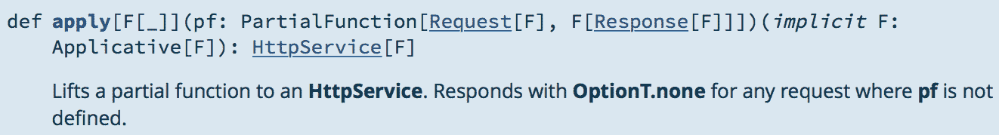

它接受一个部分函数，该函数将请求映射到在效果类型 `F` 下的响应。一个请求包含您期望的请求所具有的内容。以下是其定义和一些公开的 API 方法：

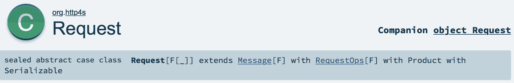

它公开了以下 API：

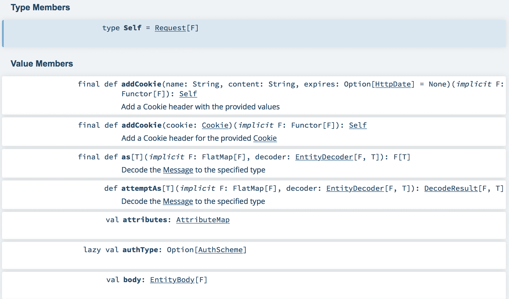

传递给请求的部分函数在效果类型下返回一个响应。目前，唯一支持的效果类型是 IO。它返回响应在效果类型下的事实意味着服务器是考虑异步性构建的。

以这种方式构建的处理器将匹配任何传入的请求与部分函数。

通过调用构建的 `HttpService` 定义如下：

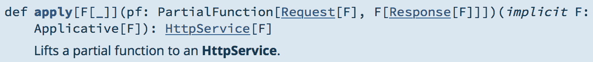

它是 `Kleisli` 类型的别名。`Kleisli` 是 `cats` 核心库的一部分，定义如下：

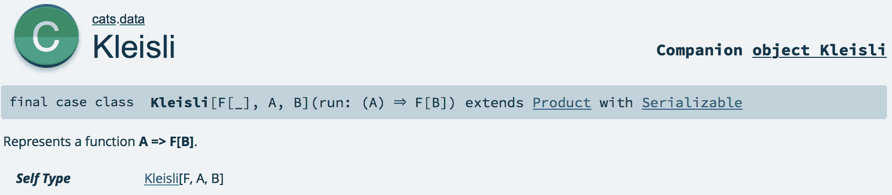

因此，本质上，它不过是一个您会传递给，比如说，`flatMap` 方法的函数。它是一个以下类型的函数：

```java
A ⇒ F[B]
```

我们用于构建处理器的部分函数在这里做了一些事情。首先，请注意，有一个 DSL 可以方便地从请求中提取 HTTP 方法和一个路径。这些提取器来自 `HTTP4S` API，可以方便地用于匹配请求。

接下来，我们开始对 IO 执行 Monadic 流：

```java
reqBody <- req.as[Customer]
```

`as` 调用旨在从传入的请求体中提取 `Customer` 对象。假设请求体是一个有效的 JSON 字符串，并且底层将使用 `Circe` 库将传入的请求体转换为所需的数据类型。您不需要对如何将 JSON 转换为案例类进行任何其他具体规定，因为 `Circe` 在底层定义了如何进行转换。

接下来，我们将在数据库中创建一个客户。我们使用本节先前定义的数据库访问对象来完成此操作。因此，我们得到了新创建的客户 ID。

最后，我们构建对查询的响应：

```java
resp <- Ok(success(id.toString))
```

我们使用对 `Ok` 方法的调用来定义 `Ok` 响应代码 `200`。`Ok` 定义如下：


`Status` 是一个没有 `apply` 方法的抽象类，这是对象可调用的必要条件。因此，我们不应该能够调用它。我们能够在程序中调用它的原因是，该方法通过以下 Rich Wrapper 注入到 `Ok` 对象中：

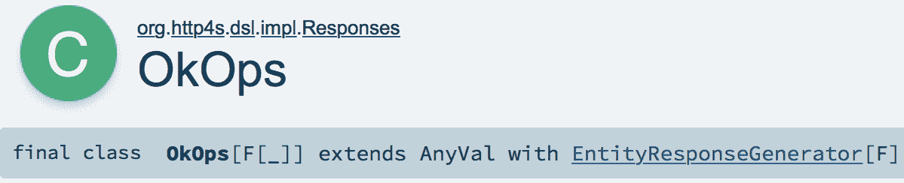

它公开了以下 API：


这个包装器由一个计算并返回响应的效果类型参数化。目前，`HTTP4S` 只支持 IO 效果类型，但这不是一个问题，因为 Typelevel 基础设施的所有其他库也使用 IO 的语言。

注意，我们为响应指定了一个 `payload`。它通过以下方式指定：`success` 方法，其定义如下：

```java
def successT: Map[String, T] =
  Map("success" -> payload)
```

因此，有效负载被设置为普通的 Scala `Map[String, Int]`（`Int` 是推断的，因为 `success` 的参数是一个整数）。由于我们使用 `Circe`，这个 Scala 集合将被自动编码为 JSON 并返回给请求客户端。同样，这是作为标准功能提供的，无需额外费用。

接下来，`placeOrder` 处理程序定义如下：

```java
def placeOrder = HttpService[IO] {
  case req @ POST -> Root / "order" =>
    for {
      cookieHeader <-
        headers.Cookie.from(req.headers).map(IO.pure).getOrElse(
          IO.raiseError(noAuthCookieError))
      jsonBody <- req.as[Map[String, Int]]
      cookie <- cookieHeader.values.toList
        .find(_.name == "shop_customer_id").map(IO.pure).getOrElse(
          IO.raiseError(noAuthCookieError))
      uId = cookie.content

      oId <- db.order.create(Order(good = jsonBody("good"), customer = uId.toInt))
      order <- db.order.get(oId)
      resp <- Ok(success(order))
    } yield resp
}
```

它主要使用我们已经讨论过的功能。然而，应该提出几点注意事项：

```java
cookieHeader <-
  headers.Cookie.from(req.headers).map(IO.pure).getOrElse(
    IO.raiseError(noAuthCookieError))
```

首先，`HTTP4S` 提供了从请求中提取各种参数的能力，例如 cookies。在前面的代码中，我们从所有请求头中提取了 cookie 头。如果操作未成功，我们将通过 `IO` 方法引发错误。本质上，从 IO 中引发错误会导致整个 Monadic 流短路。这与从命令式代码中抛出异常类似，只不过 IO 效果类型将负责错误处理：

```java
jsonBody <- req.as[Map[String, Int]]
```

在前面的行中，注意我们如何能够将传入请求的 JSON 主体提取为 Scala 映射。因此，`Circe` 不仅支持原始类型和案例类，还支持 Scala 集合类型。`Circe` 在编译时自动推导 JSON 的编码器和解码器：

```java
resp <- Ok(success(order))
```

注意，前面的响应将整个案例类作为其有效负载。我们返回一个嵌套在 Scala 映射中的案例类。`Circe` 能够无缝地将此数据结构编码为 JSON。

最后，定义了两个列表处理程序如下：

```java
def listOrders = HttpService[IO] {
  case req @ GET -> Root / "order" =>
    db.order.list.flatMap(Ok(_))
}

def listGoods = HttpService[IO] {
  case req @ GET -> Root / "good" =>
    db.good.list.flatMap(Ok(_))
}
```

由于我们的数据库以 IO 形式返回结果，并且我们使用 `Circe` 自动将模型对象编码为 JSON，我们可以将数据库的响应 `flatMap` 到响应状态码中。我们能够将整个处理程序仅用一行代码指定为数据库访问方法上的薄包装器。

# 查询服务器

在示例仓库中，有一个 shell 脚本，您可以在启动后使用它来查询服务器。您可以从 SBT 控制台使用以下命令启动服务器：

```java
reStart
```

注意，这个命令必须在 Docker 镜像下运行。所以，如果你只是从示例仓库在你的机器上运行 SBT 控制台，它将不起作用；你需要首先运行 Docker 镜像，然后从在该 Docker 镜像上启动的 SBT 控制台中运行命令。

之后，你可以使用客户端 shell 脚本来查询数据库服务器。例如，我们可以按照以下方式创建新客户：

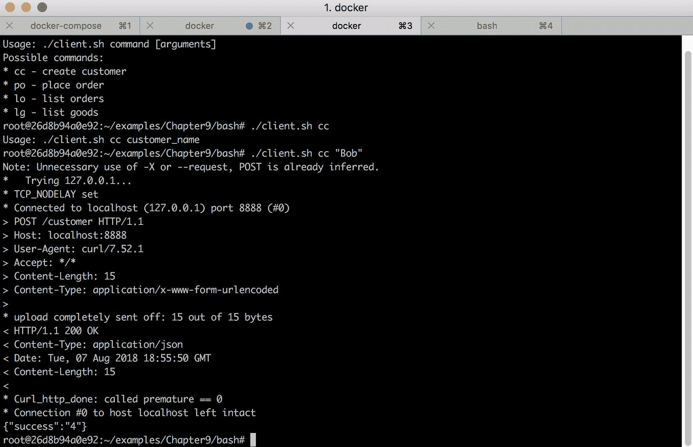

注意到响应是一个格式良好的 JSON，其中包含创建客户的 ID。

接下来，我们可以列出数据库中所有存在的商品，以便我们可以下订单：

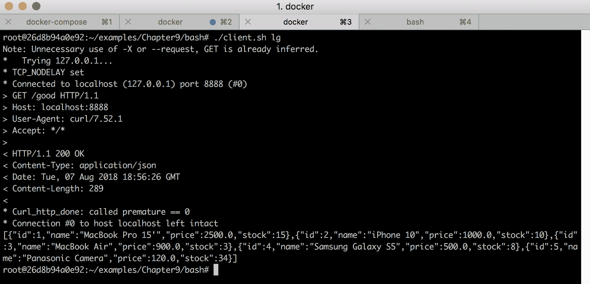

因此，我们得到了所有商品的 JSON 数组作为响应。我们可以按照以下方式下订单：

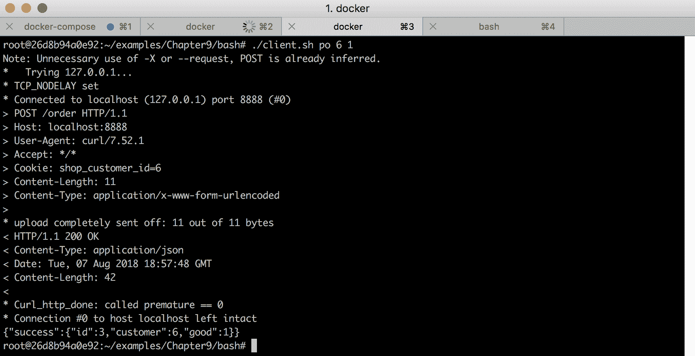

最后，我们可以列出所有订单以确认数据库中是否有订单：

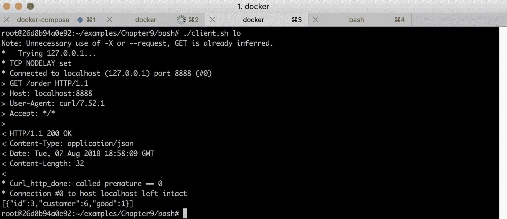

# 摘要

在本章中，我们介绍了 Typelevel 库系列为纯函数式编程提供的广泛基础设施。首先，我们学习了使用 Cats 进行异步编程的基础，即 Cats 效应库。我们讨论了`IO`并发原语和将计算作为值的哲学。之后，我们学习了服务器端编程的基础，这涉及到一系列库。这些库负责处理 HTTP 请求和数据库访问，同时在底层使用 JSON 转换库。我们对使用这些库进行编程可能的样子有了鸟瞰式的了解。

到目前为止，我们已经涵盖了足够的材料，可以开始以纯函数式的方式编写工业软件。在下一章中，我们将看到更多高级的函数式编程模式。这些模式将帮助我们的架构解决更广泛的问题，并使它们更加灵活。

# 问题

1.  解释阻塞和非阻塞编程之间的区别。

1.  为什么异步编程对于高负载系统是强制性的？

1.  将计算作为值的策略如何有利于并发编程？

1.  什么是`IO`效应类型？

1.  `IO`暴露了哪些异步编程的能力？
